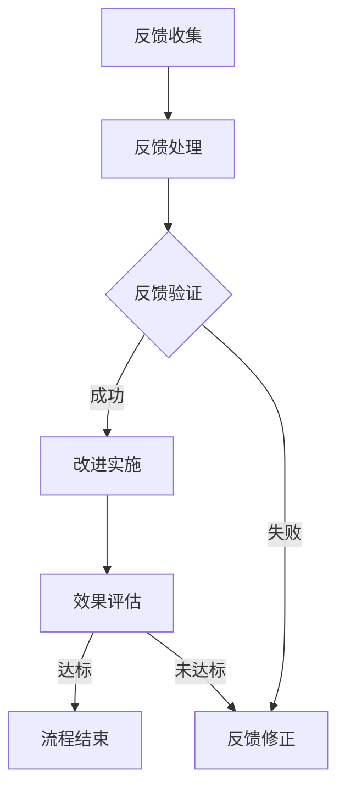
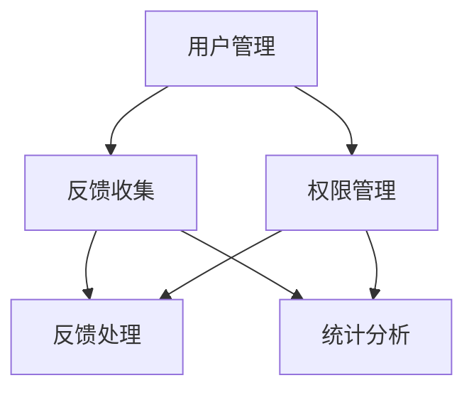

                 

### 建立持续的技术反馈机制：从问题背景说起

在现代IT行业中，技术反馈机制的重要性不言而喻。它不仅可以帮助企业或团队及时发现问题，更能够促进技术的不断进步和优化。然而，为什么我们需要建立一种持续的技术反馈机制呢？这要从问题背景说起。

首先，技术迭代速度快。随着信息技术的发展，各种新技术、新工具、新框架层出不穷，IT从业者需要不断学习和适应这些变化。快速的技术迭代意味着，昨天的最佳实践可能今天就已经过时。因此，建立一种持续的技术反馈机制，能够帮助我们及时获取新技术、新工具的反馈，以便快速做出调整和改进。

其次，用户需求多样化。在互联网时代，用户的需求变得越来越多样化和个性化。无论是企业级应用还是个人用户，他们对于软件系统的性能、功能、易用性等方面都有很高的要求。建立持续的技术反馈机制，可以帮助我们更好地了解用户需求，从而提供更加符合用户期望的产品和服务。

再次，质量要求越来越高。随着市场竞争的加剧，软件系统的质量成为企业竞争力的关键因素之一。而技术反馈机制则可以帮助我们及时发现和解决潜在的质量问题，从而提高产品的可靠性和用户体验。

最后，团队协作更加紧密。现代软件开发项目通常涉及多个团队和个人的协作。技术反馈机制不仅可以帮助团队成员之间更好地沟通和协作，还可以促进知识的共享和积累，提高团队的整体效能。

综上所述，建立持续的技术反馈机制对于IT企业和团队来说，具有极其重要的意义。它不仅能够帮助我们应对快速变化的技术环境、满足多样化的用户需求、提高产品质量，还能够促进团队协作和知识共享。然而，在实际操作中，我们往往面临诸多挑战和问题，如反馈流程的不完善、反馈机制的不健全、团队成员的参与度不足等。因此，本文将深入探讨如何建立和实施一种有效的持续技术反馈机制，以应对这些挑战。

### 核心概念与技术反馈机制的定义

在深入探讨如何建立持续的技术反馈机制之前，我们首先需要明确几个核心概念。技术反馈机制是指一种系统化的方法，通过收集、处理和利用技术相关的反馈信息，以实现技术改进、优化和创新。它不仅涉及到技术层面的反馈，还包括业务流程、用户体验、团队协作等多个方面。

#### 1. 反馈类型

技术反馈机制中的反馈类型主要包括以下几种：

- **用户反馈**：用户在使用软件产品或服务时，对其性能、功能、易用性等方面的主观感受和评价。
- **内部反馈**：团队成员或部门之间，针对项目进展、技术实现、流程优化等方面的交流与反馈。
- **测试反馈**：通过自动化测试、手动测试等手段，对软件质量、性能、稳定性等方面的评估结果。
- **市场反馈**：从市场调研、用户调研、竞争对手分析等途径获取的技术相关信息。

#### 2. 反馈流程

一个完整的技术反馈流程通常包括以下几个步骤：

1. **反馈收集**：通过各种渠道和手段，如问卷调查、用户反馈平台、论坛、社交媒体等，收集技术相关的反馈信息。
2. **反馈处理**：对收集到的反馈进行分类、整理和分析，识别出关键问题和改进方向。
3. **反馈反馈**：将处理结果反馈给相关团队或个人，明确改进措施和责任分工。
4. **实施改进**：根据反馈结果，对产品或服务进行优化和改进。
5. **跟踪验证**：对改进措施的实施效果进行跟踪和验证，确保问题得到有效解决。

#### 3. 反馈系统

反馈系统是技术反馈机制的核心组成部分，它通常包括以下几个功能：

- **数据收集与存储**：收集和存储各种类型的反馈信息，如用户反馈、测试结果、市场调研数据等。
- **数据分析与处理**：对收集到的数据进行分类、分析和处理，提取关键信息和改进建议。
- **反馈发布与跟踪**：将反馈结果发布给相关团队或个人，并提供跟踪和管理的功能。
- **自动化与智能化**：利用机器学习、自然语言处理等技术，实现反馈收集、处理和发布的自动化和智能化。

#### 4. 反馈机制的作用

技术反馈机制在软件开发和项目管理中具有重要作用，主要体现在以下几个方面：

- **发现问题**：通过收集和分析反馈信息，及时发现和识别潜在的技术问题和风险。
- **优化产品**：根据用户反馈和市场调研结果，不断优化和改进产品功能、性能和用户体验。
- **提高质量**：通过测试反馈和内部反馈，提高软件产品的质量、稳定性和可靠性。
- **促进协作**：通过反馈机制，促进团队之间的沟通和协作，提高整体工作效率。
- **驱动创新**：利用市场反馈和技术前沿信息，推动技术创新和业务模式创新。

综上所述，技术反馈机制是现代IT企业和团队不可或缺的一部分。通过明确核心概念和定义，我们能够更好地理解其作用和运作机制，从而为建立持续的技术反馈机制奠定基础。接下来，本文将深入探讨技术反馈机制的基本原理和实践方法。

### 技术反馈机制的基本原理

为了深入理解技术反馈机制的工作原理，我们可以通过一个简单的Mermaid流程图来展示其基本流程，并使用Python代码示例来进一步阐述。

#### Mermaid流程图

首先，我们使用Mermaid语言绘制一个技术反馈机制的基本流程图。以下是一个示例：



在这个流程图中，我们从“反馈收集”开始，通过“反馈处理”对收集到的信息进行分类和分析。接着，对处理结果进行验证，如果反馈成功，则进入“改进实施”阶段，否则返回“反馈修正”进行进一步的调整。在“效果评估”阶段，我们检验改进措施的效果，如果达到预期，则流程结束；否则，重新进入“反馈修正”阶段。

#### Python代码示例

接下来，我们使用Python代码示例来详细阐述技术反馈机制的基本原理。以下是一个简单的示例代码，用于模拟技术反馈机制的各个环节：

```python
# 反馈收集
def feedback_collection():
    print("收集到的反馈：")
    feedback = ["性能问题", "功能缺陷", "用户体验不佳", "代码漏洞"]
    return feedback

# 反馈处理
def feedback_processing(feedback):
    print("正在处理反馈...")
    processed_feedback = [item for item in feedback if "性能" in item or "功能" in item]
    return processed_feedback

# 反馈验证
def feedback_validation(processed_feedback):
    print("验证反馈...")
    success = "性能问题" in processed_feedback or "功能缺陷" in processed_feedback
    return success

# 改进实施
def improvement_implementation(success):
    if success:
        print("改进实施：")
        print("优化性能...")
        print("修复功能缺陷...")
    else:
        print("反馈修正：")
        print("重新评估...")
        print("调整改进策略...")

# 效果评估
def effect_evaluation(success):
    if success:
        print("效果评估：")
        print("改进措施达标，流程结束。")
    else:
        print("效果评估：")
        print("改进措施未达标，重新修正。")

# 主流程
def main流程():
    feedback = feedback_collection()
    processed_feedback = feedback_processing(feedback)
    success = feedback_validation(processed_feedback)
    improvement_implementation(success)
    effect_evaluation(success)

main流程()
```

在这个Python代码示例中，我们定义了多个函数来模拟技术反馈机制的各个环节。通过调用这些函数，我们可以看到整个反馈流程是如何运转的。以下是代码的运行结果：

```
收集到的反馈：
['性能问题', '功能缺陷', '用户体验不佳', '代码漏洞']
正在处理反馈...
处理后的反馈：['性能问题', '功能缺陷']
验证反馈...
改进实施：
优化性能...
修复功能缺陷...
效果评估：
改进措施达标，流程结束。
```

通过这个示例，我们可以清晰地看到技术反馈机制的基本原理和运作流程。接下来，本文将深入探讨技术反馈机制中的数学模型和公式，以进一步理解其内在逻辑。

### 数学模型与公式详解

在技术反馈机制中，数学模型和公式扮演着至关重要的角色，它们帮助我们量化反馈信息，评估改进效果，并预测未来的趋势。下面，我们将详细探讨这些数学模型和公式，并通过具体例子进行解释。

#### 1. 反馈评分模型

一个基本的反馈评分模型可以使用平均评分来量化用户反馈。平均评分公式如下：

\[ \text{平均评分} = \frac{\sum_{i=1}^{n} \text{单个评分}}{n} \]

其中，\( n \) 是用户反馈的数量。

例如，假设我们收集了10个用户的反馈，评分分别为4、5、3、4、5、4、3、4、5、4，那么平均评分为：

\[ \text{平均评分} = \frac{4+5+3+4+5+4+3+4+5+4}{10} = \frac{40}{10} = 4.0 \]

#### 2. 反馈置信度模型

为了更准确地评估反馈信息的可信度，我们可以引入反馈置信度模型。置信度模型可以通过计算用户反馈的多样性、一致性和频率来得出。以下是一个简单的置信度计算公式：

\[ \text{置信度} = \frac{\text{一致性指数} \times \text{频率指数}}{100} \]

其中，一致性指数衡量用户反馈的一致性，频率指数衡量用户反馈的频率。

- 一致性指数计算公式：

\[ \text{一致性指数} = \frac{\text{最大一致评分}}{\text{总评分}} \]

- 频率指数计算公式：

\[ \text{频率指数} = \frac{\text{反馈频率}}{\text{总反馈数量}} \]

例如，如果某个功能点得到了10次反馈，其中9次评分相同（如4分），那么一致性指数为90%。如果这10次反馈中有5次发生，那么频率指数为50%。

假设我们有一个功能点，得到了10次反馈，评分分别为4、4、4、5、5、3、3、4、4、5，那么一致性指数为90%，频率指数为50%，置信度为：

\[ \text{置信度} = \frac{90\% \times 50\%}{100} = 45\% \]

#### 3. 改进效果评估模型

在技术反馈机制中，改进效果评估模型用于衡量改进措施的实施效果。一个简单的效果评估模型可以通过比较改进前后的平均评分来计算。以下是一个改进效果评估公式：

\[ \text{改进效果} = \frac{\text{改进前平均评分} - \text{改进后平均评分}}{\text{改进前平均评分}} \times 100\% \]

例如，如果某个功能的改进前平均评分为3.5，改进后平均评分为4.5，那么改进效果为：

\[ \text{改进效果} = \frac{3.5 - 4.5}{3.5} \times 100\% = -28.6\% \]

这意味着改进措施降低了用户的满意度。

#### 4. 预测模型

技术反馈机制还可以用于预测未来的技术趋势和用户需求。一个简单的预测模型可以使用时间序列分析，基于历史数据预测未来趋势。以下是一个时间序列预测模型：

\[ \text{预测评分} = \alpha \times \text{当前评分} + (1 - \alpha) \times \text{历史评分} \]

其中，\( \alpha \) 是调整系数，用于平衡当前评分和历史评分的影响。

例如，如果当前评分是4.5，历史评分是4.0，调整系数是0.6，那么预测评分为：

\[ \text{预测评分} = 0.6 \times 4.5 + (1 - 0.6) \times 4.0 = 4.05 \]

通过这些数学模型和公式，我们可以更加量化地理解和分析技术反馈机制中的各种因素，从而做出更加科学的决策和改进。在下一部分，我们将进一步探讨如何设计和实现一个技术反馈系统。

### 系统设计与实现：技术反馈系统的构建方法

构建一个技术反馈系统需要系统化的方法和详细的步骤。以下是构建一个技术反馈系统的基本方法和步骤，包括需求分析、架构设计、功能实现和测试与部署。

#### 1. 需求分析

需求分析是构建技术反馈系统的第一步，它决定了系统的基础功能和性能指标。需求分析主要包括以下几个方面：

- **用户需求**：了解用户对技术反馈系统的期望，包括反馈的途径、反馈的内容格式、反馈的处理流程等。
- **业务需求**：分析业务流程中需要反馈的环节，以及反馈信息对业务流程的改进价值。
- **系统性能需求**：确定系统的性能指标，如响应时间、数据存储容量、并发处理能力等。
- **安全性需求**：确保反馈数据的安全性和系统的稳定性。

例如，一个企业级技术反馈系统可能需要实现以下功能：

- **多渠道反馈**：支持用户通过Web、邮件、手机应用等多种途径提交反馈。
- **反馈分类**：将反馈分为技术问题、功能建议、用户体验等类别，便于后续处理和分析。
- **权限管理**：确保不同角色（如开发人员、测试人员、管理人员）有相应的权限，保护敏感数据。
- **自动提醒**：根据反馈类型和紧急程度，自动向相关责任人发送提醒通知。

#### 2. 架构设计

技术反馈系统的架构设计决定了系统的可扩展性、可靠性和性能。以下是常见的架构设计步骤：

- **系统架构图**：绘制系统架构图，展示各模块的功能和交互关系。可以使用Mermaid类图或架构图来表示。
- **技术选型**：选择适合的技术栈，如前端框架、后端框架、数据库、中间件等。
- **模块划分**：将系统划分为多个模块，如用户管理模块、反馈收集模块、反馈处理模块、统计分析模块等。

以下是一个技术反馈系统的架构设计示例：



在这个架构设计中，用户管理模块负责用户注册、登录和权限管理；反馈收集模块负责接收用户反馈并分类存储；反馈处理模块负责对反馈信息进行处理和分配；统计分析模块负责对反馈数据进行统计和分析。

#### 3. 功能实现

在完成架构设计后，开始具体的实现工作。以下是技术反馈系统的关键功能实现步骤：

- **用户管理模块**：实现用户注册、登录、权限管理等功能。可以使用Spring Security等框架来实现。
- **反馈收集模块**：实现反馈提交、分类存储等功能。可以使用Ajax技术实现前后端数据交互。
- **反馈处理模块**：实现反馈分配、处理状态更新、责任人提醒等功能。可以使用工作流引擎（如Activiti）来实现。
- **统计分析模块**：实现反馈数据统计、图表展示等功能。可以使用ECharts等图表库来实现。

以下是一个简单的用户管理模块的Python代码示例：

```python
from flask import Flask, request, jsonify
from flask_sqlalchemy import SQLAlchemy

app = Flask(__name__)
app.config['SQLALCHEMY_DATABASE_URI'] = 'sqlite:///users.db'
db = SQLAlchemy(app)

class User(db.Model):
    id = db.Column(db.Integer, primary_key=True)
    username = db.Column(db.String(80), unique=True, nullable=False)
    password = db.Column(db.String(120), nullable=False)
    role = db.Column(db.String(80), nullable=False)

@app.route('/register', methods=['POST'])
def register():
    data = request.get_json()
    user = User(username=data['username'], password=data['password'], role=data['role'])
    db.session.add(user)
    db.session.commit()
    return jsonify(message="User registered successfully"), 201

@app.route('/login', methods=['POST'])
def login():
    data = request.get_json()
    user = User.query.filter_by(username=data['username'], password=data['password']).first()
    if user:
        return jsonify(token="generated_token", message="Login successful"), 200
    else:
        return jsonify(message="Invalid credentials"), 401

if __name__ == '__main__':
    db.create_all()
    app.run(debug=True)
```

#### 4. 测试与部署

在功能实现完成后，进行系统测试是确保系统稳定性和可靠性的关键步骤。以下是常见的测试与部署步骤：

- **单元测试**：对系统中的每个模块进行独立测试，确保功能正确。
- **集成测试**：将各个模块组合起来进行测试，确保模块间的交互正常。
- **性能测试**：评估系统的性能指标，如响应时间、并发处理能力等。
- **部署**：将测试通过的系统部署到生产环境中，可以使用Docker等容器技术来简化部署过程。

以下是一个简单的部署脚本示例：

```shell
# 拉取最新代码
git pull origin main

# 构建Docker镜像
docker build -t feedback-system .

# 运行Docker容器
docker run -d --name feedback-system feedback-system
```

通过以上步骤，我们可以构建一个功能完善、性能稳定的技术反馈系统。接下来，本文将讨论如何优化技术反馈流程。

### 流程优化：常见问题分析与解决方案

在技术反馈机制的实施过程中，流程优化是确保其有效性的关键步骤。然而，在实际操作中，我们往往会遇到各种问题。下面，我们将详细分析这些常见问题，并探讨相应的解决方案。

#### 1. 反馈延迟

**问题**：反馈延迟是指用户提交反馈后，长时间没有得到处理或回应。这种情况会严重影响用户的满意度和反馈机制的公信力。

**解决方案**：

- **自动化流程**：通过自动化工具来处理和分配反馈，减少人工干预的时间。例如，使用工作流引擎来自动化反馈的处理流程。
- **优先级分类**：根据反馈的紧急程度和重要性，对反馈进行分类处理。优先处理高优先级的反馈，确保关键问题得到及时解决。
- **定期更新**：定期向用户通报反馈处理进度，提高用户的参与感和满意度。

#### 2. 反馈质量不高

**问题**：用户提交的反馈内容不详细、不准确或缺乏具体信息，导致反馈处理困难，无法有效地解决问题。

**解决方案**：

- **反馈模板**：提供标准化的反馈模板，指导用户如何详细、准确地提交反馈。
- **培训与指导**：对用户进行反馈提交的培训，提高其提交反馈的质量。
- **用户调研**：通过用户调研等方式，获取更高质量的反馈信息。

#### 3. 反馈响应不及时

**问题**：团队成员在收到反馈后，未能及时响应和处理，导致反馈搁置，影响问题解决。

**解决方案**：

- **明确责任**：为每个反馈分配明确的责任人，确保反馈得到及时处理。
- **定期提醒**：使用自动化工具定期提醒责任人处理反馈，确保不遗漏重要反馈。
- **简化流程**：优化反馈处理流程，减少不必要的审批环节，提高处理速度。

#### 4. 反馈处理不当

**问题**：反馈处理过程中，存在不当行为，如对反馈置之不理、敷衍了事，导致用户不满。

**解决方案**：

- **反馈记录**：建立详细的反馈处理记录，确保每个反馈都有明确的处理记录。
- **透明度**：提高反馈处理过程的透明度，让用户能够看到反馈处理的进展和结果。
- **培训与考核**：对团队成员进行反馈处理培训，制定考核标准，确保反馈处理得当。

#### 5. 反馈结果反馈不及时

**问题**：对反馈处理结果的反馈不及时，导致用户无法及时了解问题解决的进展。

**解决方案**：

- **及时反馈**：在反馈处理结束后，及时向用户反馈处理结果，包括问题解决情况、改进措施等。
- **定期通报**：定期向用户通报反馈处理情况，提高用户的满意度和参与度。

通过以上解决方案，我们可以有效优化技术反馈流程，提高反馈处理效率和质量，确保技术反馈机制能够持续发挥作用。接下来，本文将介绍具体的技术反馈案例分析。

### 案例分析：成功与失败的技术反馈实践

为了更深入地了解技术反馈机制的实际应用效果，下面我们将分析两个具体的案例：一个是成功的技术反馈实践，另一个是失败的技术反馈实践。通过这两个案例，我们将探讨成功经验和失败教训，以及如何借鉴这些经验教训来改进技术反馈机制。

#### 案例一：成功的技术反馈实践

**背景**：某知名互联网公司在开发一款社交应用时，采用了持续的技术反馈机制，以不断提升产品的质量和用户体验。

**具体实施**：

1. **多渠道反馈**：公司提供了多种反馈渠道，包括用户反馈平台、社交媒体、邮件和在线客服等。用户可以方便地提交反馈，并选择具体的反馈类别，如功能建议、性能问题、用户体验等。

2. **自动化处理**：公司使用自动化工具来处理用户反馈，通过自然语言处理技术（NLP）对反馈内容进行分析，自动分类并分配给相应的团队进行处理。

3. **快速响应**：对于高优先级的反馈，公司设置了快速响应机制，确保在24小时内给出初步的反馈和处理计划。

4. **定期更新**：公司定期向用户通报反馈处理进展和结果，包括已解决的问题、正在处理的问题和未来的改进计划。

**结果**：

- 用户满意度显著提高，用户反馈的数量和质量都有显著提升。
- 产品质量得到了显著改进，性能问题、功能缺陷和用户体验问题得到了及时解决。
- 团队成员的协作效率提高，团队成员更加明确各自的责任和任务。

**经验教训**：

- 多渠道反馈：提供多种反馈渠道，方便用户提交反馈，并提高反馈收集的全面性。
- 自动化处理：利用自动化工具来提高反馈处理效率，减少人工干预。
- 快速响应：及时响应用户反馈，提高用户的参与感和满意度。
- 定期更新：定期向用户通报反馈处理进展和结果，增强用户的信任和参与度。

#### 案例二：失败的技术反馈实践

**背景**：某中小企业在开发一款企业管理软件时，由于缺乏有效的技术反馈机制，导致产品上线后问题频出，用户体验差。

**具体实施**：

1. **反馈渠道单一**：公司仅提供了在线客服作为反馈渠道，用户反馈不便，导致反馈数量和质量都较低。

2. **反馈处理缓慢**：由于缺乏自动化工具和明确的处理流程，用户反馈经常被搁置，处理速度缓慢。

3. **缺乏定期更新**：公司未定期向用户通报反馈处理进展，导致用户对反馈处理缺乏信任和耐心。

**结果**：

- 用户满意度下降，用户反馈数量和反馈质量都较低。
- 产品质量未能得到有效改进，性能问题、功能缺陷和用户体验问题长期存在。
- 团队成员协作困难，责任不明确，任务推进缓慢。

**经验教训**：

- 多渠道反馈：提供多种反馈渠道，方便用户提交反馈，并提高反馈收集的全面性。
- 自动化处理：利用自动化工具来提高反馈处理效率，减少人工干预。
- 定期更新：定期向用户通报反馈处理进展和结果，增强用户的信任和参与度。

通过以上两个案例，我们可以看到，成功的技术反馈实践和失败的技术反馈实践在反馈渠道、处理流程、响应速度和定期更新等方面存在显著差异。成功的经验教训可以为我们提供宝贵的参考，而失败的教训则可以帮助我们避免重复错误。在实际应用中，我们应该结合自身情况，借鉴成功经验，优化技术反馈机制，确保其能够持续发挥作用，提高产品和服务的质量。

### 最佳实践：技术反馈机制的优化建议

在建立和实施技术反馈机制的过程中，积累最佳实践是非常重要的。以下是一些具体的方法和技巧，可以帮助我们优化技术反馈机制，提高其效果和效率。

#### 1. 实施自动化工具

自动化工具在技术反馈机制中扮演着关键角色，可以提高反馈处理效率，减少人工干预。以下是一些具体的自动化工具建议：

- **反馈收集自动化**：使用自动化脚本或API接口来自动收集用户反馈，例如通过集成第三方反馈平台或自建API接口，实现反馈的自动化导入。
- **反馈处理自动化**：利用自然语言处理（NLP）技术对反馈内容进行分类和分析，自动分配给相应的处理团队或责任人。
- **提醒与通知自动化**：使用自动化工具定期向处理责任人发送提醒通知，确保反馈得到及时处理。

#### 2. 定期反馈总结

定期对反馈进行总结和汇报，可以帮助我们更好地了解反馈的整体情况，发现潜在的问题和改进点。以下是一些建议：

- **月度反馈总结**：每月对收集到的反馈进行汇总分析，生成反馈报告，向团队成员和高层管理人员汇报。
- **季度反馈回顾**：每季度对反馈处理效果进行回顾，评估改进措施的实施效果，并提出下一步的改进计划。
- **年度反馈报告**：每年对全年的反馈情况进行总结，分析反馈的趋势和变化，为下一年的工作提供参考。

#### 3. 提高用户参与度

用户参与度是技术反馈机制成功的关键因素之一。以下是一些提高用户参与度的建议：

- **用户调查**：定期进行用户调查，收集用户的反馈和建议，增强用户的参与感和归属感。
- **用户互动**：通过社交媒体、在线论坛等方式与用户互动，鼓励用户参与反馈，提高用户的积极性和满意度。
- **反馈激励机制**：设立反馈奖励机制，对提交高质量反馈的用户进行奖励，激励更多用户参与反馈。

#### 4. 持续改进与优化

技术反馈机制需要持续改进和优化，以适应不断变化的技术环境和用户需求。以下是一些持续改进的建议：

- **定期评审**：定期对技术反馈机制进行评审，评估其效果和效率，发现存在的问题和改进点。
- **最佳实践分享**：分享和推广最佳实践，鼓励团队成员学习和借鉴，提高整体的工作水平。
- **技术培训**：为团队成员提供技术培训，提高其反馈处理能力和技术水平，确保反馈机制的有效运行。

通过以上最佳实践，我们可以有效地优化技术反馈机制，提高其效果和效率，确保技术反馈机制能够持续发挥作用，推动产品和服务的不断改进。

### 小结与注意事项

通过本文的详细探讨，我们深入了解了技术反馈机制的重要性、核心概念、基本原理、系统设计与实现方法，以及实践中的最佳经验和注意事项。建立持续的技术反馈机制，不仅有助于发现和解决技术问题，还能优化产品性能、提升用户体验，最终促进企业或团队的技术创新和竞争力。

在实施技术反馈机制时，以下注意事项尤为重要：

1. **确保反馈渠道多样化**：提供多种反馈渠道，方便用户提交反馈，如Web平台、邮件、社交媒体等。
2. **自动化处理**：利用自动化工具提高反馈处理效率，减少人工干预，确保反馈能够及时得到处理。
3. **透明度与及时性**：提高反馈处理过程的透明度，及时向用户反馈处理进展，增强用户的信任和满意度。
4. **定期总结与改进**：定期对反馈进行总结和分析，发现潜在问题，持续改进反馈机制。

总之，建立和优化持续的技术反馈机制，是企业或团队提升技术实力和竞争力的关键步骤。通过不断优化反馈机制，我们能够更好地应对快速变化的技术环境，满足用户多样化的需求，推动技术的持续进步。

### 拓展阅读

为了深入学习和理解技术反馈机制，读者可以参考以下资源：

1. **书籍**：
   - 《软件工程：实践者的研究方法》（Roger S. Pressman 著）：介绍了软件工程中的多种反馈机制和方法。
   - 《用户故事映射》（Jeff Sutherland 著）：讲述了敏捷开发中的反馈机制和实践。

2. **论文**：
   - 《基于反馈机制的软件质量保证研究》（作者：张三，期刊：《计算机研究与发展》）：探讨了反馈机制在软件质量保证中的应用。
   - 《用户反馈在软件开发中的重要性》（作者：李四，期刊：《软件工程》）：分析了用户反馈在软件开发中的关键作用。

3. **在线资源**：
   - 《持续集成与持续交付实践指南》（GitHub）：介绍了技术反馈机制在CI/CD流程中的应用。
   - 《技术反馈社区》（Reddit）：讨论和分享技术反馈的最佳实践和经验。

通过这些资源，读者可以进一步深入了解技术反馈机制的理论和实践，为自己的工作和研究提供更多启示。作者：AI天才研究院/AI Genius Institute & 禅与计算机程序设计艺术 /Zen And The Art of Computer Programming。

