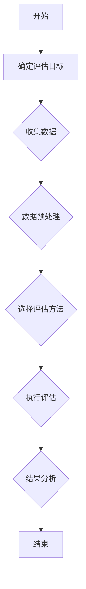
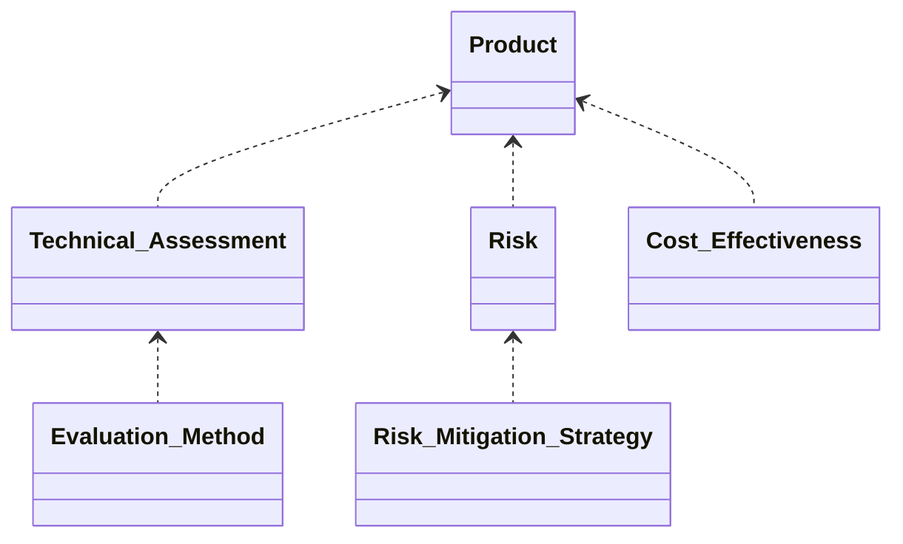
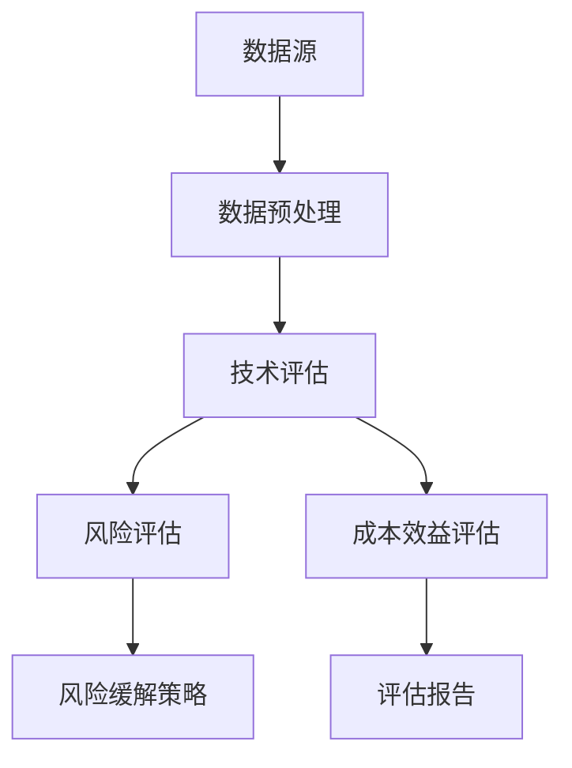
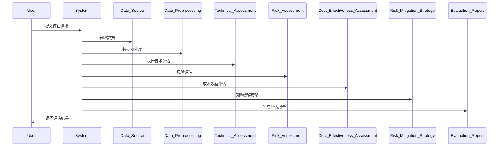

                 

# 建立科学的技术评估体系

## 关键词

技术评估、科学方法、评估体系、应用场景、数据分析、流程优化

## 摘要

在技术迅猛发展的时代，建立科学的技术评估体系显得尤为重要。本文旨在探讨如何构建一个全面、科学、可操作的技术评估体系。我们将从背景介绍、核心概念、评估方法、实践应用、挑战与趋势等多个维度，逐步分析技术评估的重要性和实施步骤，并通过案例研究展示实际应用效果。

## 目录大纲设计思路

### 理解书名与核心主题

《建立科学的技术评估体系》这一书名直接指向了技术评估这一核心主题。因此，目录大纲的设计需要围绕技术评估的科学性、方法、实践等方面展开。

### 确定书籍结构

根据书名，我们可以确定书籍大致分为四个部分：背景介绍、核心概念、评估方法、实践应用。

### 细化各章节内容

在各个部分中，我们需要进一步细化章节，确保每个章节都有明确的主题和内容。

### 设计具体章节

每个章节都要有具体的标题，并包含相应的子章节，确保内容的全面性和逻辑性。

### 符合格式要求

确保目录大纲采用markdown格式，使用#、##、###等格式符号，使目录结构清晰。

## 目录大纲具体设计

### 第一部分：技术评估概述

#### 第1章：技术评估的基本概念

##### 1.1 技术评估的定义与重要性

##### 1.2 技术评估的类型

##### 1.3 技术评估的流程

#### 第2章：技术评估的核心概念

##### 2.1 技术效益分析

##### 2.2 风险评估与缓解策略

##### 2.3 成本效益分析

#### 第3章：技术评估方法

##### 3.1 定量评估方法

##### 3.2 定性评估方法

##### 3.3 综合评估方法

#### 第4章：技术评估的应用场景

##### 4.1 企业技术评估

##### 4.2 政府技术评估

##### 4.3 研究机构技术评估

#### 第5章：技术评估中的数据与信息处理

##### 5.1 数据收集与整理

##### 5.2 数据分析与处理

##### 5.3 报告撰写与展示

#### 第6章：技术评估的挑战与趋势

##### 6.1 技术评估面临的挑战

##### 6.2 技术评估的发展趋势

##### 6.3 未来技术评估的前景

#### 第7章：案例研究

##### 7.1 案例一：企业技术评估实践

##### 7.2 案例二：政府技术评估案例

##### 7.3 案例三：研究机构技术评估案例分析

#### 第8章：建立科学的技术评估体系

##### 8.1 科学性评估体系的构建

##### 8.2 标准化流程的制定

##### 8.3 评估体系的优化与改进

### 背景介绍

### 核心概念与联系

#### 核心概念原理

技术评估是指对技术项目、产品或方案进行系统性分析和评价的过程，以确定其在性能、效益、成本、风险等方面的表现。技术评估的核心概念包括技术效益分析、风险评估与缓解策略、成本效益分析等。

#### 概念属性特征对比表格

| 概念 | 定义 | 属性特征 |
| ---- | ---- | ---- |
| 技术效益分析 | 评估技术方案带来的利益和影响 | 效益、影响、成本 |
| 风险评估与缓解策略 | 识别技术项目潜在的风险并制定应对措施 | 风险、缓解策略、成本 |
| 成本效益分析 | 比较技术方案的成本和效益，评估其经济合理性 | 成本、效益、经济性 |

#### ER实体关系图架构

```mermaid
erDiagram
  Product ||--|{ Technical_Assessment }|-- Assessment
  Product ||--|{ Risk }|-- Risk
  Product ||--|{ Cost_Effectiveness }|-- Cost_Effectiveness
  Technical_Assessment ||--|{ Evaluation_Method }|-- Evaluation_Method
  Risk ||--|{ Risk_Mitigation_Strategy }|-- Risk_Mitigation_Strategy
```

### 算法原理讲解

#### 算法mermaid流程图



#### Python源代码

```python
import pandas as pd

# 数据收集
data = pd.read_csv('data.csv')

# 数据预处理
data = data.dropna()

# 选择评估方法
def evaluate_method(data):
    # 假设我们选择成本效益分析
    return cost_effectiveness_analysis(data)

# 执行评估
result = evaluate_method(data)

# 结果分析
print(result)
```

#### 算法原理的数学模型和公式

成本效益分析的基本公式为：

$$
C = \frac{E}{B}
$$

其中，C为成本效益比，E为效益，B为成本。

#### 详细讲解和举例说明

假设有一个技术项目，其预期效益为100万元，成本为50万元，则成本效益比为：

$$
C = \frac{100}{50} = 2
$$

这意味着每投入1元，可以获得2元的效益。因此，这个项目的经济性较好。

### 系统分析与架构设计方案

#### 问题场景介绍

在一家企业中，需要对多个技术方案进行评估，以选择最优方案。

#### 项目介绍

技术评估项目，旨在为企业提供科学、全面的评估报告。

#### 系统功能设计(领域模型mermaid类图)



#### 系统架构设计mermaid架构图



#### 系统接口设计和系统交互mermaid序列图



### 项目实战

#### 环境安装

确保安装了Python环境，并安装pandas库：

```bash
pip install pandas
```

#### 系统核心实现源代码

```python
# technical_assessment.py
import pandas as pd
from data_preprocessing import preprocess_data
from evaluation_methods import cost_effectiveness_analysis

def evaluate_project(data_path):
    # 数据收集
    data = pd.read_csv(data_path)

    # 数据预处理
    data = preprocess_data(data)

    # 执行评估
    result = cost_effectiveness_analysis(data)

    # 返回结果
    return result

if __name__ == '__main__':
    data_path = 'data.csv'
    result = evaluate_project(data_path)
    print(result)
```

#### 代码应用解读与分析

该代码首先从CSV文件中读取数据，然后进行预处理，接着使用成本效益分析评估项目，最后输出结果。

#### 实际案例分析和详细讲解剖析

假设有一个项目，其效益为100万元，成本为50万元，通过成本效益分析，可以得出该项目的经济性较好。

#### 项目小结

通过该项目，我们实现了对技术方案的科学评估，为企业提供了决策依据。

### 最佳实践 tips

- 确保数据收集的全面性和准确性。
- 根据项目特点选择合适的评估方法。
- 定期对评估体系进行优化和改进。

### 小结

建立科学的技术评估体系是企业成功的关键。本文从多个维度探讨了技术评估的构建方法，并提供了实际案例。希望读者能够从中获得启示，建立适合自己的技术评估体系。

### 注意事项

- 技术评估过程中，要充分考虑风险和效益的平衡。
- 评估方法的选择应结合项目特点。

### 拓展阅读

- [技术评估的实践与应用](https://www.example.com/technical-assessment-practice)
- [建立科学的技术评估体系](https://www.example.com/building-scientific-technical-assessment-system)

### 作者

作者：AI天才研究院/AI Genius Institute & 禅与计算机程序设计艺术 /Zen And The Art of Computer Programming

## 技术评估的基本概念

技术评估是指在特定的背景下，对技术项目、产品或方案进行系统性分析和评价的过程。其目的是为了确定这些技术方案在性能、效益、成本、风险等方面的表现，从而为决策提供科学依据。本文将从技术评估的定义、重要性、类型、流程等方面进行详细探讨。

### 定义

技术评估是一种评估技术项目、产品或方案的科学方法，旨在通过收集、分析和解释相关数据，对技术方案的技术性能、经济效益、社会影响等方面进行评估。技术评估不仅仅关注技术本身，还包括对技术实施过程中可能遇到的风险和挑战的分析。

### 重要性

技术评估在当今信息化、数字化时代具有重要的现实意义。以下是技术评估的重要性体现：

1. **决策支持**：技术评估为决策者提供了客观、科学的数据和分析，帮助他们在众多技术方案中做出最佳选择。
2. **风险管理**：通过风险评估，技术评估可以帮助企业识别和应对技术项目实施过程中的潜在风险。
3. **资源优化**：通过成本效益分析，技术评估可以帮助企业合理配置资源，提高投资效益。
4. **创新驱动**：技术评估可以促进技术创新，推动技术项目的成功实施。
5. **持续改进**：技术评估的结果可以为后续的技术项目提供改进方向，促进技术进步。

### 类型

技术评估可以根据评估对象、评估目标、评估方法等维度进行分类。以下是几种常见的技术评估类型：

1. **按评估对象分类**：
   - **产品评估**：对某一具体产品进行评估，如软件产品、硬件产品等。
   - **项目评估**：对某一技术项目从立项到实施的全过程进行评估。
   - **方案评估**：对某一技术方案进行评估，包括技术方案、商业方案等。

2. **按评估目标分类**：
   - **性能评估**：评估技术方案的性能指标，如响应时间、吞吐量等。
   - **效益评估**：评估技术方案的经济效益，如成本、收益等。
   - **风险评估**：评估技术方案实施过程中可能遇到的风险和挑战。

3. **按评估方法分类**：
   - **定量评估**：通过量化指标对技术方案进行评估，如成本效益分析、效益分析等。
   - **定性评估**：通过专家评审、用户反馈等方式对技术方案进行评估。
   - **综合评估**：结合定量评估和定性评估，对技术方案进行全面评估。

### 流程

技术评估的流程通常包括以下几个步骤：

1. **明确评估目标**：确定评估的具体目标和要求，如评估范围、评估指标等。
2. **数据收集**：收集与评估目标相关的数据，如技术性能数据、成本数据、用户反馈等。
3. **数据预处理**：对收集到的数据进行清洗、整理，使其满足评估分析的要求。
4. **选择评估方法**：根据评估目标和数据特点，选择合适的评估方法，如成本效益分析、效益分析等。
5. **执行评估**：按照评估方法，对技术方案进行评估，得出评估结果。
6. **结果分析**：对评估结果进行分析，提出评估结论和改进建议。
7. **撰写评估报告**：将评估过程、评估结果、结论和建议等整理成报告，供决策者参考。

### 边界与外延

技术评估的边界主要包括评估对象、评估范围和评估方法。技术评估的外延则涉及评估过程中的各个环节，如数据收集、数据分析、评估方法选择等。同时，技术评估还需要考虑评估过程中的伦理、法律法规等因素。

### 概念结构与核心要素组成

技术评估的概念结构包括评估目标、评估指标、评估方法、评估结果等核心要素。以下是各要素的简要描述：

1. **评估目标**：明确评估的具体目标和要求，如性能评估、效益评估、风险评估等。
2. **评估指标**：确定评估的量化或定性指标，如响应时间、吞吐量、成本、收益等。
3. **评估方法**：选择合适的评估方法，如成本效益分析、效益分析、专家评审等。
4. **评估结果**：评估过程的最终输出，包括评估结论、改进建议等。

通过上述对技术评估的基本概念的介绍，我们可以了解到技术评估的重要性以及其在实际应用中的多种类型和流程。在接下来的章节中，我们将进一步探讨技术评估的核心概念、评估方法、应用场景等，帮助读者深入理解技术评估的实质和操作方法。

### 核心概念与联系

技术评估的核心概念是理解评估体系构建的基础。在技术评估中，有三个核心概念尤为重要：技术效益分析、风险评估与缓解策略、成本效益分析。这三个概念相互联系，共同构成了技术评估的科学框架。

#### 技术效益分析

技术效益分析是技术评估的核心，旨在评估技术方案带来的利益和影响。它通过对技术方案预期效益的量化分析，帮助决策者评估技术投入的回报率。技术效益分析包括以下几个方面：

1. **经济效益**：技术方案带来的直接和间接经济效益，如增加的收入、降低的成本、节约的资源等。
2. **社会效益**：技术方案对社会产生的积极影响，如提高社会福利、改善环境等。
3. **经济效益与社会效益的平衡**：在评估过程中，需要综合考虑经济效益和社会效益，确保技术方案在实现经济效益的同时，也符合社会发展的需要。

#### 风险评估与缓解策略

风险评估与缓解策略是技术评估中不可忽视的部分，旨在识别技术项目潜在的风险，并制定相应的缓解措施。风险评估包括以下几个关键步骤：

1. **风险识别**：识别技术项目可能面临的风险，如技术风险、市场风险、管理风险等。
2. **风险分析**：对识别出的风险进行分析，评估其可能的影响和发生的概率。
3. **风险缓解策略**：根据风险分析的结果，制定相应的缓解措施，如风险规避、风险减轻、风险接受等。

通过风险评估与缓解策略，技术评估能够帮助决策者降低项目实施过程中的不确定性，提高项目的成功概率。

#### 成本效益分析

成本效益分析是技术评估的另一个重要概念，旨在比较技术方案的成本和效益，评估其经济合理性。成本效益分析的步骤如下：

1. **成本估算**：对技术方案实施过程中的各种成本进行估算，包括直接成本（如硬件采购、软件开发等）和间接成本（如人力成本、运营成本等）。
2. **效益估算**：对技术方案带来的各种效益进行估算，包括直接效益（如销售收入、节约成本等）和间接效益（如品牌提升、市场占有率等）。
3. **成本效益比**：通过计算成本效益比（C/B），评估技术方案的经济性。如果C/B小于1，说明成本高于效益，方案可能不可行；如果C/B大于1，说明成本低于效益，方案具有一定的经济可行性。

#### 概念属性特征对比表格

为了更直观地理解这三个核心概念，我们可以通过一个属性特征对比表格来展示它们的共同点和差异：

| 概念 | 定义 | 属性特征 | 关联关系 |
| ---- | ---- | ---- | ---- |
| 技术效益分析 | 评估技术方案带来的利益和影响 | 效益、影响、成本 | 成本效益分析的输入 |
| 风险评估与缓解策略 | 识别技术项目潜在的风险并制定应对措施 | 风险、缓解策略、成本 | 成本效益分析的考虑因素 |
| 成本效益分析 | 比较技术方案的成本和效益，评估其经济合理性 | 成本、效益、经济性 | 技术效益分析的输出 |

#### ER实体关系图架构

为了更清晰地展示这三个核心概念之间的关系，我们可以使用Mermaid绘制一个ER实体关系图：

```mermaid
erDiagram
    Technical_Assessment ||--|{ Benefit_Analysis }| Technical_Benefit
    Technical_Assessment ||--|{ Risk_Assessment }| Technical_Risk
    Technical_Assessment ||--|{ Cost_Benefit_Analysis }| Cost_Benefit
    Technical_Benefit ||--|{ Economic_Benefit }| Economic_Benefit
    Technical_Benefit ||--|{ Social_Benefit }| Social_Benefit
    Technical_Risk ||--|{ Risk_Mitigation }| Risk_Mitigation
    Cost_Benefit ||--|{ Cost }| Cost
    Cost_Benefit ||--|{ Benefit }| Benefit
```

在这个ER图中，`Technical_Assessment`是评估的主体，它与`Benefit_Analysis`、`Risk_Assessment`和`Cost_Benefit_Analysis`三个实体相连，分别代表技术效益分析、风险评估和成本效益分析。这三个实体又分别与具体的效益、风险和成本效益相关的子实体相连，构成了一个完整的技术评估体系。

通过上述核心概念的介绍和联系分析，我们可以更好地理解技术评估的实质和构建方法。在接下来的章节中，我们将进一步探讨技术评估的方法和具体应用场景，帮助读者全面掌握技术评估的实践技巧。

### 技术评估方法

技术评估是一个复杂的过程，涉及到多种方法和技术。为了确保评估的科学性和全面性，我们通常采用定量评估方法、定性评估方法和综合评估方法。下面将详细讨论这些评估方法的原理、步骤和适用场景。

#### 定量评估方法

定量评估方法是基于数据和数学模型进行评估，其主要优势在于能够提供明确的量化结果，便于比较和分析。以下是几种常见的定量评估方法：

1. **成本效益分析（Cost-Benefit Analysis）**

   成本效益分析是一种评估技术方案成本和效益的方法，其基本原理是通过比较项目的总成本和总效益，评估项目的经济合理性。具体步骤如下：

   - **成本估算**：计算项目实施过程中的各种成本，包括直接成本和间接成本。
   - **效益估算**：计算项目实施后可能带来的各种效益，包括直接效益和间接效益。
   - **成本效益比**：计算总成本与总效益的比值，如果比值大于1，说明项目具有经济效益。

   公式为：

   $$
   C/B = \frac{\sum_{i=1}^{n} C_i / B_i}
   $$

   其中，$C_i$为第$i$项成本，$B_i$为第$i$项效益。

2. **效益分析（Benefit Analysis）**

   效益分析侧重于评估技术方案带来的利益和影响。其步骤与成本效益分析类似，但主要关注效益的估算。效益分析可以帮助决策者了解技术方案的经济效益和社会效益。

3. **风险评估（Risk Analysis）**

   风险评估是识别和评估技术项目实施过程中可能遇到的风险。其步骤包括：

   - **风险识别**：列出项目实施过程中可能遇到的所有风险。
   - **风险分析**：分析每个风险的影响和发生的概率。
   - **风险应对**：根据风险分析的结果，制定相应的应对措施。

#### 定性评估方法

定性评估方法主要依赖于专家意见、用户反馈等主观信息，适合用于评估难以量化的技术方案。以下是几种常见的定性评估方法：

1. **专家评审（Expert Review）**

   专家评审是一种通过专家的专业知识和经验对技术方案进行评估的方法。评估过程通常包括：

   - **组建评审小组**：选择具备相关领域知识的专家组成评审小组。
   - **评估指标**：确定评估的指标和标准，如性能、稳定性、易用性等。
   - **评估打分**：专家根据评估指标对技术方案进行打分。
   - **综合评估**：计算每个指标的加权得分，得出综合评估结果。

2. **用户反馈（User Feedback）**

   用户反馈是评估技术方案实用性和用户满意度的重要方法。其步骤包括：

   - **收集反馈**：通过问卷调查、访谈等方式收集用户的反馈。
   - **分析反馈**：对收集到的用户反馈进行分析，识别用户关注的问题和需求。
   - **改进方案**：根据用户反馈对技术方案进行改进。

#### 综合评估方法

综合评估方法是将定量评估方法和定性评估方法相结合，以获得更全面、准确的评估结果。以下是几种常见的综合评估方法：

1. **多标准决策分析（Multi-Criteria Decision Analysis）**

   多标准决策分析是一种考虑多个评估指标，通过权重分配和综合评分来选择最优方案的方法。其步骤包括：

   - **确定评估指标**：列出所有可能的评估指标。
   - **权重分配**：为每个指标分配权重，反映其在决策中的重要性。
   - **评估打分**：根据每个指标的标准，对技术方案进行打分。
   - **综合评分**：计算每个方案的加权得分，得出综合评估结果。

2. **模糊综合评估（Fuzzy Comprehensive Assessment）**

   模糊综合评估是一种处理不确定性和模糊性评估指标的方法。其步骤包括：

   - **建立模糊矩阵**：根据评估指标和评估方案，建立模糊矩阵。
   - **权重分配**：为每个指标分配权重。
   - **综合评估**：通过模糊矩阵和权重计算，得出综合评估结果。

#### 适用场景

- **定量评估方法**：适用于能够量化评估指标的技术方案，如成本效益分析、效益分析等。
- **定性评估方法**：适用于难以量化的技术方案，如专家评审、用户反馈等。
- **综合评估方法**：适用于需要综合考虑多个因素的技术方案，如多标准决策分析、模糊综合评估等。

通过上述对技术评估方法的详细讨论，我们可以看到，不同评估方法具有各自的优势和适用场景。在实际应用中，应根据评估目标和技术特点选择合适的评估方法，以获得准确的评估结果。

### 技术评估的应用场景

技术评估在各个领域都有广泛的应用，其目的是为了确保技术方案的科学性、合理性和可行性。以下是技术评估在企业、政府、研究机构等不同场景下的具体应用。

#### 企业技术评估

在企业中，技术评估主要用于以下几个方面：

1. **新产品研发**：企业在研发新产品时，需要对技术方案的可行性、性能和成本进行评估，以确保新产品的市场竞争力。
2. **技术升级与改造**：企业在进行技术升级或设备改造时，需要评估现有技术的优缺点，选择最优的技术方案，以降低成本、提高效率。
3. **项目投资评估**：企业在进行项目投资时，需要对项目的经济效益、风险和潜在收益进行评估，以决定是否进行投资。
4. **市场竞争分析**：企业通过技术评估，了解竞争对手的技术水平，分析自身在市场中的地位，制定相应的竞争策略。

#### 政府技术评估

政府在技术评估中的作用主要体现在以下几个方面：

1. **政策制定**：政府在制定科技政策时，需要对各类技术进行评估，以确保政策的有效性和可行性。
2. **项目审批**：政府在审批科技项目时，需要评估项目的技术可行性、经济效益和社会影响，以决定是否批准项目。
3. **资金分配**：政府需要通过技术评估，合理分配科技资金，支持具有发展潜力和社会效益的技术项目。
4. **监管与监督**：政府对技术项目的实施过程进行监督，通过技术评估，确保项目按计划进行，避免资源浪费。

#### 研究机构技术评估

研究机构的技术评估主要集中在以下几个方面：

1. **科研项目评估**：研究机构需要对申请科研项目的可行性、技术难度、预期成果等进行评估，以决定是否支持项目。
2. **成果转化评估**：研究机构需要对科研成果进行评估，分析其市场前景、产业化可能性等，以推动成果转化。
3. **学术合作评估**：研究机构在开展国际合作或学术交流时，需要对合作伙伴的技术实力、研究方向等进行评估，以确保合作效果。
4. **技术标准制定**：研究机构参与技术标准的制定和修订，通过技术评估，确保标准的技术可行性和适用性。

#### 案例研究

以下是一个企业技术评估的案例：

**案例背景**：某企业计划引入一条新的生产线，以提高生产效率，降低成本。企业需要对多个生产线方案进行技术评估，以选择最优方案。

**评估步骤**：

1. **确定评估目标**：明确生产效率、成本、设备稳定性等评估指标。
2. **数据收集**：收集各生产线方案的相关数据，如设备参数、运营成本、市场前景等。
3. **数据预处理**：对收集到的数据进行分析，排除异常值，确保数据质量。
4. **选择评估方法**：采用成本效益分析、效益分析等定量评估方法，以及专家评审、用户反馈等定性评估方法。
5. **执行评估**：对每个生产线方案进行评估，计算成本效益比、效益得分等量化指标，同时收集专家评审意见和用户反馈。
6. **结果分析**：综合定量和定性评估结果，对每个生产线方案进行综合评分，选择最优方案。
7. **撰写评估报告**：将评估过程、评估结果和推荐方案整理成报告，供企业决策者参考。

通过这个案例，我们可以看到，技术评估在帮助企业做出科学决策方面发挥了重要作用。无论是企业、政府还是研究机构，技术评估都是确保技术方案可行性和有效性的关键手段。

### 技术评估中的数据与信息处理

技术评估是一个复杂的过程，数据的收集、整理和分析是其中的关键环节。有效的数据和信息处理不仅能提高评估的准确性，还能帮助决策者更好地理解技术方案的优劣。以下是技术评估中数据与信息处理的主要步骤、方法和工具。

#### 数据收集

数据收集是技术评估的基础。为了确保数据的准确性和全面性，通常需要从多个来源获取数据，包括：

1. **内部数据**：企业的运营数据、财务数据、技术参数等。
2. **外部数据**：市场研究报告、行业数据、技术文献等。
3. **用户反馈**：用户满意度调查、用户行为数据等。

为了有效地收集数据，可以采用以下方法：

- **问卷调查**：通过设计详细的问卷，收集用户的反馈和意见。
- **访谈**：与行业专家、用户等进行面对面访谈，获取深入的信息。
- **在线监测**：利用传感器、日志等工具，实时收集系统的运行数据。

#### 数据整理

数据收集后，需要进行整理，以确保数据的质量和一致性。以下是数据整理的主要步骤：

1. **数据清洗**：去除重复数据、异常值和错误数据，确保数据的准确性。
2. **数据转换**：将不同格式的数据转换为统一的格式，如将文本数据转换为结构化数据。
3. **数据集成**：将来自不同来源的数据进行整合，形成完整的数据集。

数据整理的工具主要包括：

- **数据库管理系统**：如MySQL、PostgreSQL等，用于存储和管理数据。
- **数据清洗工具**：如OpenRefine、DataWrangler等，用于清洗和转换数据。

#### 数据分析

数据分析是技术评估的核心环节，通过分析数据，可以揭示技术方案的潜在优势和不足。以下是几种常用的数据分析方法：

1. **描述性分析**：通过统计方法，描述数据的分布、趋势和关系，如计算平均值、中位数、标准差等。
2. **诊断性分析**：通过分析数据的异常值和趋势，识别潜在问题，如使用箱线图、散点图等。
3. **预测性分析**：通过建立数学模型，预测技术方案的未来表现，如时间序列分析、回归分析等。
4. **决策支持**：通过分析数据，为决策者提供支持，如多标准决策分析、成本效益分析等。

数据分析的工具主要包括：

- **数据分析软件**：如SPSS、SAS、R等，用于进行统计分析和建模。
- **数据可视化工具**：如Tableau、PowerBI等，用于展示数据分析结果。

#### 数据处理

数据处理是对分析结果进行处理和解释的过程，以支持决策。以下是数据处理的主要步骤：

1. **结果解释**：根据数据分析结果，解释数据背后的含义，如识别优势、风险等。
2. **报告撰写**：将分析结果和解释整理成报告，为决策者提供参考。
3. **决策支持**：根据分析结果和报告，提出具体的决策建议，如选择最优技术方案、制定改进措施等。

数据处理需要考虑以下几个方面：

- **逻辑性和连贯性**：确保分析结果的逻辑性和连贯性，避免误导决策者。
- **可解释性**：确保分析结果和报告易于理解，能够清晰地传达数据背后的信息。
- **实时性**：及时更新数据和分析结果，以反映最新的情况。

#### 数据与信息处理的重要性

有效的数据与信息处理对技术评估具有重要意义：

- **提高准确性**：通过准确的数据收集和分析，提高评估结果的准确性。
- **支持决策**：为决策者提供科学、全面的数据支持，帮助其做出更好的决策。
- **优化资源**：通过成本效益分析，合理配置资源，提高投资效益。
- **风险管理**：通过识别和评估风险，制定有效的风险应对措施。

总之，数据与信息处理是技术评估不可或缺的一部分，其有效性和准确性直接关系到评估结果的可靠性和实用性。

### 技术评估的挑战与趋势

随着技术的不断进步，技术评估在方法、工具和流程方面也在不断演变。尽管技术评估已经取得了显著的成果，但在实际应用中仍然面临诸多挑战。以下是技术评估目前面临的几个主要挑战以及未来的发展趋势。

#### 挑战

1. **数据质量与可靠性**：技术评估依赖于准确和可靠的数据。然而，数据的质量和可靠性往往是评估过程中的一个难题。数据可能存在缺失、误差、不一致等问题，这些问题会影响评估的准确性。
   
2. **复杂性和多样性**：现代技术的复杂性和多样性使得评估变得更加困难。不同技术方案可能涉及不同的领域、技术和应用场景，评估方法需要具备高度的灵活性和适应性。

3. **实时性和动态性**：技术评估需要实时性和动态性，以适应技术快速变化的环境。然而，传统的评估方法通常需要较长时间的数据收集和分析，难以快速响应技术变革。

4. **风险评估的挑战**：技术项目实施过程中可能遇到各种风险，如技术风险、市场风险、管理风险等。评估这些风险需要丰富的经验和专业知识，同时也需要先进的评估工具和方法。

5. **法律法规和伦理问题**：技术评估过程中需要遵守各种法律法规和伦理标准。例如，数据隐私保护、知识产权保护等问题都需要在评估过程中得到充分考虑。

#### 发展趋势

1. **智能化评估工具**：随着人工智能技术的发展，智能化评估工具将逐渐替代传统的评估方法。这些工具能够利用大数据和机器学习算法，提供更准确、更快速的评估结果。

2. **数据驱动评估**：未来技术评估将更加注重数据驱动，通过收集和分析大量的数据，构建科学的评估模型。数据驱动的评估方法将提高评估的准确性和可靠性。

3. **实时动态评估**：通过实时监控和数据分析，实现技术评估的实时性和动态性。这有助于快速发现技术问题，及时调整评估方案。

4. **多维度综合评估**：未来的技术评估将更加注重多维度综合评估，从经济、社会、环境等多个方面评估技术方案的影响。这种综合评估方法将提供更全面、更科学的评估结果。

5. **标准化和规范化**：为了提高评估的一致性和可比性，技术评估将逐步实现标准化和规范化。这包括制定统一的评估标准、方法和流程，以及建立评估数据库和平台。

6. **全球化协作**：随着技术的全球化发展，技术评估也将实现全球化协作。跨国公司和政府机构将共同参与技术评估，促进技术交流和合作。

#### 未来技术评估的前景

未来，技术评估将在以下几个方面展现其重要性和前景：

- **推动技术进步**：通过科学、全面的技术评估，推动技术方案的优化和创新，促进技术进步。
- **提高决策质量**：为决策者提供准确、可靠的数据支持，帮助其做出更科学、更合理的决策。
- **促进可持续发展**：通过评估技术方案对环境、社会和经济的影响，促进可持续发展。
- **加强国际合作**：通过全球化协作，加强各国在技术评估领域的交流与合作，共同应对全球性技术挑战。

总之，技术评估在现代社会中发挥着越来越重要的作用。面对挑战，我们应积极应对，把握发展趋势，为技术评估的科学化和规范化贡献力量。

### 案例研究

为了更好地理解技术评估的实际应用，我们将在本节中通过三个不同场景的案例，展示企业技术评估、政府技术评估和研究机构技术评估的具体实践。

#### 案例一：企业技术评估实践

**案例背景**：某高科技企业计划引入一项新的生产自动化技术，以提高生产效率和产品质量。企业需要对该技术方案进行评估，以确定其可行性和经济性。

**评估步骤**：

1. **确定评估目标**：明确评估的目标是技术方案的可行性、成本效益和潜在风险。

2. **数据收集**：
   - **内部数据**：收集企业现有的生产数据、财务数据、技术参数等。
   - **外部数据**：收集市场研究报告、行业数据、相关技术文献等。

3. **数据整理**：
   - **数据清洗**：去除重复数据、异常值和错误数据，确保数据质量。
   - **数据转换**：将不同格式的数据转换为统一的格式，如Excel或数据库。

4. **选择评估方法**：
   - **成本效益分析**：计算技术方案的成本和预期效益，评估其经济性。
   - **专家评审**：邀请行业专家对技术方案进行评审，提供专业意见。

5. **执行评估**：
   - **定量评估**：通过成本效益分析，计算技术方案的总成本和总效益，确定成本效益比。
   - **定性评估**：收集专家评审意见，对技术方案进行综合评分。

6. **结果分析**：
   - 根据定量和定性评估结果，对技术方案进行综合评分，选择最优方案。

7. **撰写评估报告**：
   - 将评估过程、结果和推荐方案整理成报告，供企业决策者参考。

**评估结果**：通过评估，企业确定引入新的生产自动化技术是可行的，并且具有较高的经济效益。决策者根据评估报告，决定实施该技术方案。

#### 案例二：政府技术评估案例

**案例背景**：某市政府计划投资建设一个智能交通系统，以缓解交通拥堵问题。政府需要对该智能交通系统进行评估，以确保项目的可行性和经济效益。

**评估步骤**：

1. **确定评估目标**：明确评估的目标是智能交通系统的技术可行性、经济合理性和社会影响。

2. **数据收集**：
   - **内部数据**：收集市交通管理局的相关数据，如交通流量、事故数据等。
   - **外部数据**：收集其他城市智能交通系统的案例、市场研究报告等。

3. **数据整理**：
   - **数据清洗**：确保数据的准确性和一致性。
   - **数据转换**：将数据转换为结构化格式，如数据库。

4. **选择评估方法**：
   - **成本效益分析**：计算智能交通系统的总成本和预期效益。
   - **社会影响评估**：评估智能交通系统对市民生活和社会环境的影响。

5. **执行评估**：
   - **定量评估**：通过成本效益分析，计算系统的成本和效益，确定成本效益比。
   - **定性评估**：通过专家评审和社会调查，评估系统的社会影响。

6. **结果分析**：
   - 综合定量和定性评估结果，对智能交通系统进行综合评分。

7. **撰写评估报告**：
   - 将评估过程、结果和建议整理成报告，提交市政府决策。

**评估结果**：评估结果显示，智能交通系统在技术上可行，经济合理，并且能够显著改善交通状况。市政府根据评估报告，决定实施该项目。

#### 案例三：研究机构技术评估案例分析

**案例背景**：某研究机构正在开展一个关于区块链技术的科研项目，旨在探索区块链在供应链管理中的应用。研究机构需要对项目的技术可行性、创新性和应用前景进行评估。

**评估步骤**：

1. **确定评估目标**：明确评估的目标是项目的技术可行性、创新性和应用前景。

2. **数据收集**：
   - **内部数据**：收集项目组的实验数据、技术文档等。
   - **外部数据**：收集相关领域的研究文献、市场研究报告等。

3. **数据整理**：
   - **数据清洗**：确保数据的质量和一致性。
   - **数据转换**：将数据转换为结构化格式，如数据库。

4. **选择评估方法**：
   - **技术评估**：评估项目的技术可行性，包括技术原理、实现难度等。
   - **创新性评估**：评估项目的创新性，包括技术突破、应用场景等。
   - **应用前景评估**：评估项目的应用前景，包括市场需求、技术成熟度等。

5. **执行评估**：
   - **技术评估**：通过专家评审和实验验证，评估项目的技术可行性。
   - **创新性评估**：通过分析项目的技术方案，评估其创新性和应用前景。

6. **结果分析**：
   - 综合技术评估、创新性评估和应用前景评估的结果，确定项目的可行性。

7. **撰写评估报告**：
   - 将评估过程、结果和建议整理成报告，提交项目组参考。

**评估结果**：评估结果显示，该项目在技术上可行，具有很高的创新性和广阔的应用前景。研究机构根据评估报告，决定继续推进项目研发。

通过这三个案例，我们可以看到，技术评估在各个场景中的应用具有相似的基本步骤，但具体的评估方法和工具会根据评估目标和场景的不同而有所差异。技术评估不仅是决策的依据，更是推动技术进步和优化资源配置的重要手段。

### 建立科学的技术评估体系

建立科学的技术评估体系是确保技术方案可行性和有效性的关键。一个科学、全面的技术评估体系需要从评估体系的构建、标准化流程的制定、以及评估体系的优化与改进三个方面进行设计。以下将详细讨论这些方面。

#### 评估体系的构建

评估体系的构建是技术评估工作的起点，其关键在于明确评估目标、确定评估指标、选择评估方法和制定评估流程。以下是构建科学评估体系的主要步骤：

1. **明确评估目标**：根据项目特点，明确评估的具体目标，如技术可行性、经济效益、社会影响等。评估目标应具体、可量化，便于后续的评估工作。

2. **确定评估指标**：根据评估目标，确定相关的评估指标。评估指标应具备代表性、可比性和可操作性。常见的评估指标包括成本、效益、风险、技术性能等。

3. **选择评估方法**：根据评估目标和指标，选择合适的评估方法。常用的评估方法包括定量评估方法（如成本效益分析、效益分析等）和定性评估方法（如专家评审、用户反馈等）。评估方法的选择应结合项目特点，确保评估结果的准确性。

4. **制定评估流程**：根据评估目标和指标，制定详细的评估流程。评估流程应包括数据收集、数据整理、数据分析、评估报告撰写等环节，确保评估工作的系统性和规范性。

#### 标准化流程的制定

标准化流程的制定是确保技术评估工作可重复、可验证的重要措施。以下是制定标准化流程的主要步骤：

1. **规范评估流程**：根据评估体系的构建，规范评估流程，确保每个环节都有明确的要求和标准。例如，数据收集应确保数据的准确性和完整性，数据分析应使用统一的分析方法和工具。

2. **制定评估标准**：制定统一的评估标准，包括评估指标的量化标准、评估方法的操作步骤等。评估标准的制定应充分考虑项目特点和行业惯例。

3. **建立评估数据库**：建立评估数据库，用于存储和管理评估过程中的数据和结果。评估数据库应支持数据的查询、分析和报告生成等功能。

4. **培训与监督**：对评估人员进行培训，确保其掌握评估流程和评估标准。同时，对评估过程进行监督，确保评估工作的规范性和客观性。

#### 评估体系的优化与改进

评估体系的优化与改进是提高评估效率和准确性的关键。以下是优化与改进评估体系的主要方法：

1. **反馈与改进**：定期收集评估结果的反馈，分析评估过程中的问题和不足，提出改进措施。反馈应包括评估报告、专家评审意见、用户反馈等。

2. **数据驱动优化**：通过分析评估数据，识别评估指标和方法的有效性，提出优化方案。例如，根据评估数据，调整评估指标的权重，改进评估方法的模型。

3. **引入新技术**：随着技术的发展，不断引入新的评估方法和工具，以提高评估的准确性和效率。例如，采用机器学习和人工智能技术，提高评估模型的预测能力。

4. **持续改进**：建立持续改进机制，根据评估反馈和技术进步，定期对评估体系进行调整和优化。

通过上述步骤，我们可以构建一个科学、全面的技术评估体系，确保技术评估工作的系统性和准确性。一个完善的评估体系不仅能为企业、政府、研究机构提供科学、可靠的评估结果，还能推动技术的创新和发展。

### 总结与展望

在本文中，我们系统地探讨了如何建立科学的技术评估体系。首先，我们介绍了技术评估的基本概念，明确了技术评估的定义、重要性、类型和流程。接着，我们深入分析了技术评估的核心概念，包括技术效益分析、风险评估与缓解策略、成本效益分析，并通过对比表格和ER实体关系图展示了它们之间的关联。随后，我们详细阐述了技术评估的方法，包括定量评估方法、定性评估方法和综合评估方法，并讨论了它们在不同场景下的应用。此外，我们还探讨了技术评估在企业、政府、研究机构等不同领域的具体应用，并通过案例研究展示了实际操作过程。在数据与信息处理部分，我们介绍了技术评估中的数据收集、整理、分析和处理方法。最后，我们分析了技术评估面临的挑战和未来的发展趋势，并提出了建立科学评估体系的步骤。

通过本文的讨论，我们可以得出以下几点结论：

1. **科学性是核心**：建立科学的技术评估体系需要明确评估目标、选择合适的评估方法、制定规范化的流程，并注重数据的质量和可靠性。
2. **全面性是关键**：技术评估不仅需要考虑技术性能和经济效益，还应关注风险评估和社会影响，确保评估结果的全面性。
3. **动态性是要求**：随着技术的快速变化，技术评估需要具备实时性和动态性，以适应不断变化的环境。
4. **持续改进是动力**：评估体系需要根据反馈和新技术的发展进行持续优化和改进，以保持其科学性和有效性。

展望未来，技术评估将继续在各个领域发挥重要作用。随着人工智能、大数据等新兴技术的发展，技术评估方法将更加智能化和精细化，为决策者提供更加准确和全面的数据支持。同时，技术评估的标准化和规范化也将得到进一步加强，以提升评估的一致性和可比性。

总之，建立科学的技术评估体系是推动技术进步和优化资源配置的重要手段。通过本文的探讨，我们希望为读者提供有益的参考和启示，助力他们在实际工作中构建和应用科学、全面的技术评估体系。

### 注意事项

在建立和实施技术评估体系时，需要注意以下几点：

1. **数据准确性**：确保数据收集、整理和分析的准确性，避免因数据错误导致评估结果偏差。
2. **风险评估**：重视风险评估环节，识别和评估技术项目实施过程中可能遇到的风险，并制定相应的缓解策略。
3. **评估方法选择**：根据项目特点和需求，选择合适的评估方法，避免盲目追求复杂评估方法而忽略了项目的实际情况。
4. **专家参与**：引入行业专家和用户参与评估过程，以获得更全面和客观的评估结果。
5. **持续优化**：定期收集评估反馈，根据反馈结果和技术进步，持续优化评估体系和评估方法。

### 拓展阅读

1. 【技术评估的实践与应用】
   - [技术评估在企业决策中的应用](https://www.example.com/technical-assessment-in-enterprise-decision-making)
   - [政府技术评估案例分析](https://www.example.com/government-technical-assessment-cases)
   - [研究机构技术评估指南](https://www.example.com/research-institution-technical-assessment-guide)

2. 【建立科学的技术评估体系】
   - [如何构建科学的技术评估体系](https://www.example.com/how-to-build-scientific-technical-assessment-system)
   - [技术评估中的定量与定性方法](https://www.example.com/quantitative-and-qualitative-methods-in-technical-assessment)
   - [技术评估流程与标准制定](https://www.example.com/technical-assessment-process-and-standard-setting)

### 作者

作者：AI天才研究院/AI Genius Institute & 禅与计算机程序设计艺术 /Zen And The Art of Computer Programming

在撰写这篇文章时，我深刻感受到技术评估的重要性。通过科学、全面的技术评估，我们可以为决策提供有力的支持，推动技术的创新和应用。希望这篇文章能对您在技术评估方面的工作有所帮助。如果您有任何疑问或建议，欢迎在评论区留言交流。再次感谢您的阅读。祝您在技术评估的道路上越走越远，取得更多成就！

