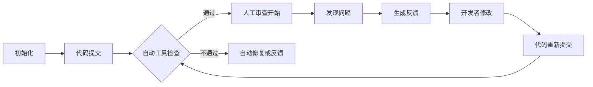
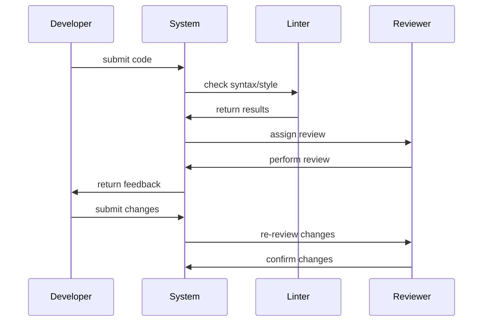
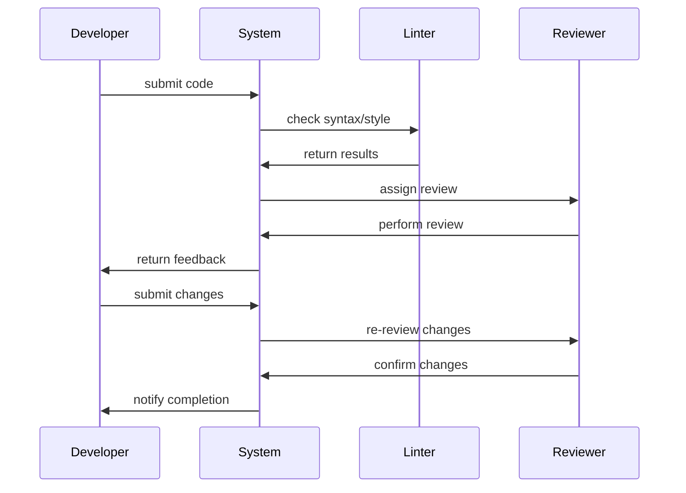

                 


# 建立高效的代码审查与反馈机制

关键词：代码审查、反馈机制、高效、软件开发、协作

摘要：本文将探讨建立高效的代码审查与反馈机制的重要性，介绍代码审查的基本概念、流程、工具和技术，以及反馈机制的实施方法，并结合实际案例，提供一系列最佳实践和注意事项。

## 引言

在软件开发的漫长历程中，代码审查（Code Review）和反馈机制（Feedback Mechanism）一直扮演着至关重要的角色。它们不仅有助于提高代码质量，还能促进团队成员之间的协作和学习。然而，在实际操作中，如何建立一套高效、可行的代码审查与反馈机制，仍然是一个值得深入探讨的话题。

本文将分以下几个部分进行阐述：

1. **背景介绍**：介绍代码审查和反馈机制在软件开发中的重要性。
2. **核心概念**：阐述代码审查的定义、类型、原则和过程模型。
3. **代码审查过程**：详细解析代码审查的各个阶段，以及最佳实践。
4. **工具和技术**：介绍常见的代码审查工具及其应用。
5. **反馈机制**：探讨如何建立有效的反馈机制。
6. **案例研究**：分享实际案例，展示高效代码审查与反馈机制的应用。
7. **最佳实践**：提供实际操作中的经验总结和注意事项。
8. **结论**：总结全文，强调代码审查与反馈在软件开发中的重要性。

让我们一步一步深入探讨，以构建一套高效的代码审查与反馈机制。

## 背景介绍

### 代码审查的重要性

代码审查是一种软件开发过程中的质量保证活动，旨在通过团队协作，发现并修复代码中的错误、漏洞和潜在问题。其重要性主要体现在以下几个方面：

1. **提高代码质量**：代码审查可以帮助开发者发现并修复代码中的错误，提高代码的可读性和可维护性。
2. **促进知识共享**：通过代码审查，团队成员可以相互学习，了解不同的编码风格和最佳实践。
3. **降低成本**：及早发现和修复问题可以减少后续的维护成本。
4. **增强团队协作**：代码审查鼓励团队成员之间的交流和合作，有助于构建一个更加高效的团队。

### 反馈机制的重要性

反馈机制是代码审查过程中的重要组成部分，它能够为开发者提供及时的反馈，帮助他们改进代码。反馈机制的重要性包括：

1. **及时反馈**：有效的反馈机制可以确保开发者及时了解他们的代码是否满足需求和规范，从而及时进行改进。
2. **持续改进**：通过持续收集和分析反馈，团队可以不断优化代码审查过程，提高开发效率。
3. **增强沟通**：反馈机制有助于团队成员之间的有效沟通，减少误解和冲突。

### 问题背景

虽然代码审查和反馈机制在理论上有明显的优势，但在实际操作中，常常面临以下问题：

1. **审查效率低**：代码审查过程过于繁琐，耗时过长，降低了开发效率。
2. **反馈不充分**：缺乏具体、有针对性的反馈，开发者难以改进代码。
3. **沟通不畅**：团队成员之间的沟通不畅，导致代码审查效果不佳。
4. **缺乏规范化**：代码审查过程缺乏统一的标准和流程，导致不一致的审查结果。

### 问题描述

为了解决上述问题，我们需要建立一套高效、规范化的代码审查与反馈机制。具体问题包括：

1. **如何提高代码审查的效率？**
2. **如何确保反馈的充分性和针对性？**
3. **如何促进团队成员之间的有效沟通？**
4. **如何建立统一的代码审查流程和标准？**

### 问题解决

为了解决这些问题，我们可以采取以下措施：

1. **采用自动化工具**：使用自动化代码审查工具，提高审查效率，减少人工工作量。
2. **制定明确的反馈标准**：制定具体的反馈标准，确保反馈的充分性和针对性。
3. **建立沟通渠道**：建立有效的沟通渠道，如代码审查会议、即时通讯工具等，确保团队成员之间的信息畅通。
4. **规范化审查流程**：制定统一的审查流程和标准，确保代码审查的一致性。

### 边界与外延

在构建代码审查与反馈机制时，我们需要注意以下几点：

1. **审查范围**：明确代码审查的范围，避免过度审查或审查不足。
2. **反馈方式**：选择合适的反馈方式，如文字、图表或代码注释，以确保开发者能够准确理解反馈。
3. **审查频率**：根据项目的实际情况，合理安排代码审查的频率，避免频繁审查带来的负担。
4. **审查团队**：确保审查团队的多样性和专业性，以提高审查质量。

通过上述措施，我们可以逐步建立一套高效、规范的代码审查与反馈机制，为软件开发过程中的质量控制提供有力支持。

## 核心概念

### 代码审查的定义

代码审查（Code Review）是指团队中的开发人员对他人编写的代码进行仔细检查和评估的过程。其主要目的是提高代码质量、减少错误和漏洞、促进知识共享和团队协作。

### 代码审查的类型

根据审查的方式和目的，代码审查可以分为以下几种类型：

1. **形式审查**：主要关注代码的结构和格式，确保代码符合编码规范。
2. **内容审查**：关注代码的功能、逻辑和性能，评估代码的正确性和效率。
3. **安全审查**：侧重于发现代码中的安全漏洞，确保软件的安全性。
4. **风格审查**：关注代码的可读性和一致性，提高代码的可维护性。

### 代码审查的原则

为了确保代码审查的有效性，我们需要遵循以下原则：

1. **提前审查**：在代码提交前进行审查，以便及早发现和解决问题。
2. **全面审查**：对代码的各个方面进行全面检查，确保代码的完整性和正确性。
3. **针对性审查**：根据代码的具体情况，有针对性地进行审查，避免盲目和无效的审查。
4. **及时反馈**：及时给予反馈，确保开发者能够及时了解审查结果，进行改进。

### 代码审查的过程模型

代码审查通常包括以下阶段：

1. **审查准备**：确定审查范围、审查人员、审查标准和时间安排。
2. **代码提交**：开发者将代码提交到审查工具，进行初步检查。
3. **审查过程**：审查人员对代码进行仔细检查，提出修改建议和意见。
4. **反馈与修改**：开发者根据审查意见进行修改，提交新的代码。
5. **最终确认**：审查人员对修改后的代码进行最终确认，确保问题已解决。

### 代码审查的参与者角色

在代码审查过程中，通常会涉及到以下角色：

1. **开发者**：编写和提交代码的人员，负责根据审查意见进行修改。
2. **审查人员**：对代码进行审查的人员，通常包括高级开发人员、架构师和测试人员。
3. **项目经理**：负责协调和管理代码审查过程，确保审查质量和进度。

### 核心概念术语说明

- **代码审查**：团队对他人编写的代码进行仔细检查和评估的过程。
- **形式审查**：关注代码的结构和格式。
- **内容审查**：关注代码的功能、逻辑和性能。
- **安全审查**：侧重于发现代码中的安全漏洞。
- **风格审查**：关注代码的可读性和一致性。
- **审查准备**：确定审查范围、审查人员、审查标准和时间安排。
- **代码提交**：将代码提交到审查工具。
- **审查过程**：审查人员对代码进行仔细检查。
- **反馈与修改**：根据审查意见进行修改。
- **最终确认**：审查人员对修改后的代码进行最终确认。

### 概念结构与核心要素组成

代码审查的核心概念可以概括为以下几个方面：

1. **目的**：提高代码质量、减少错误和漏洞、促进知识共享和团队协作。
2. **类型**：形式审查、内容审查、安全审查、风格审查。
3. **原则**：提前审查、全面审查、针对性审查、及时反馈。
4. **过程模型**：审查准备、代码提交、审查过程、反馈与修改、最终确认。
5. **参与者角色**：开发者、审查人员、项目经理。

下面是一个简化的ER实体关系图，用于描述这些核心要素：

```mermaid
erDiagram
    Developer ||--|{ CodeReview } : submitted by
    CodeReview ||--|{ Reviewer } : reviewed by
    Reviewer ||--|{ Feedback } : provides
    Feedback ||--|{ CodeChange } : based on
```

通过这个ER图，我们可以清晰地看到开发者、审查人员和反馈之间的关系，以及它们在代码审查过程中的交互。

### 算法原理讲解

代码审查算法的基本原理是通过自动化工具和人工审查相结合，对代码进行多维度分析，从而发现潜在问题。以下是一个简化的算法流程，用于描述代码审查的基本过程：



在这个算法流程中，代码审查主要包括以下几个步骤：

1. **初始化**：设置代码审查的范围、标准、参与人员等信息。
2. **代码提交**：开发者将代码提交到代码审查系统。
3. **自动工具检查**：使用自动化工具对代码进行初步检查，如语法错误、代码风格、潜在安全漏洞等。
4. **人工审查**：审查人员对代码进行深入分析，发现潜在的问题和漏洞。
5. **发现问题**：审查人员记录发现的问题，生成反馈信息。
6. **开发者修改**：开发者根据反馈信息，对代码进行修改。
7. **代码重新提交**：开发者将修改后的代码重新提交到审查系统。
8. **循环**：重复步骤3-7，直到代码审查通过。

下面是一个简单的Python代码示例，用于描述自动工具检查的原理：

```python
def check_code(code):
    # 检查语法错误
    try:
        compile(code, '', 'exec')
        syntax_error = False
    except SyntaxError:
        syntax_error = True

    # 检查代码风格
    style_lint = "your_style_lint_tool"
    style_error = subprocess.run([style_lint, code], stdout=subprocess.PIPE).stdout.decode()

    # 检查潜在安全漏洞
    security_lint = "your_security_lint_tool"
    security_error = subprocess.run([security_lint, code], stdout=subprocess.PIPE).stdout.decode()

    return {
        'syntax_error': syntax_error,
        'style_error': style_error,
        'security_error': security_error
    }

code = """# Your code here"""
results = check_code(code)
print(results)
```

在这个示例中，我们定义了一个函数`check_code`，用于检查代码的语法、风格和安全漏洞。这个函数首先使用Python的`compile`函数检查代码的语法，然后使用代码风格检查工具（如`pylint`、`flake8`等）检查代码风格，最后使用安全漏洞检查工具（如`bandit`等）检查代码中的潜在安全漏洞。

### 数学模型和公式

在代码审查过程中，我们可以使用一些简单的数学模型和公式来评估代码的质量和改进效果。以下是一个简化的模型示例：

1. **代码质量评分（Quality Score）**：

   $$ Q = \frac{P \times R \times E}{100} $$

   其中：
   - \( P \) 是代码的正确性（Percentage of correct code）
   - \( R \) 是代码的可读性（Readability）
   - \( E \) 是代码的效率（Efficiency）

   这个公式用于评估代码的整体质量。分数越高，表示代码质量越好。

2. **改进效果评估（Improvement Effectiveness）**：

   $$ I = \frac{Q_1 - Q_2}{Q_1} \times 100\% $$

   其中：
   - \( Q_1 \) 是第一次代码审查后的质量评分
   - \( Q_2 \) 是第二次代码审查后的质量评分

   这个公式用于评估开发者根据反馈进行修改后的效果。百分比越高，表示改进效果越好。

### 举例说明

假设我们在第一次代码审查后得到一个代码质量评分为70分，在经过开发者修改和第二次代码审查后，评分提高到85分。那么，改进效果评估为：

$$ I = \frac{85 - 70}{85} \times 100\% = 19.05\% $$

这表明开发者根据反馈进行了有效的改进，代码质量提升了19.05%。

通过上述数学模型和公式，我们可以定量地评估代码的质量和改进效果，为代码审查提供科学依据。

### 系统分析与架构设计方案

#### 问题场景介绍

在一个大型软件开发项目中，随着代码复杂度和开发人员数量的增加，代码审查过程变得尤为重要。为了确保项目按时交付且代码质量达标，我们需要设计一个高效的代码审查与反馈系统，以满足以下需求：

1. **自动化审查**：减少人工审查的工作量，提高审查效率。
2. **实时反馈**：确保开发者能够及时收到审查结果和反馈。
3. **多人协作**：支持多人参与代码审查，确保审查质量和一致性。
4. **灵活扩展**：支持添加新的审查工具和反馈机制。

#### 项目介绍

本项目旨在设计并实现一个基于Web的代码审查与反馈系统，主要功能包括：

1. **代码提交与审查**：支持开发者将代码提交到系统，并接受审查。
2. **自动代码检查**：集成多种自动化工具，对代码进行语法、风格和安全检查。
3. **人工审查与反馈**：支持审查人员对代码进行人工审查，并提出反馈意见。
4. **反馈与修改**：支持开发者根据反馈进行代码修改，并重新提交审查。
5. **统计分析**：提供代码审查的统计分析功能，帮助团队优化审查过程。

#### 系统功能设计（领域模型）

为了满足上述需求，我们首先设计了一个领域模型，用于描述系统的主要功能模块和关系。以下是一个简化的Mermaid类图：

```mermaid
classDiagram
    Developer <<Interface>>
    Reviewer <<Interface>>
    Code <<Entity>>
    Review <<Entity>>

    Developer --|> Code: submits
    Reviewer --|> Review: performs
    Code --|> Review: has
```

在这个类图中，`Developer`和`Reviewer`是接口，分别表示开发人员和审查人员的角色。`Code`和`Review`是实体，分别表示代码和审查结果。`Developer`通过`submits`方法将代码提交到系统，`Reviewer`通过`performs`方法对代码进行审查，并生成`Review`对象。

#### 系统架构设计

接下来，我们设计了一个简单的系统架构图，用于描述系统的整体架构和组件之间的关系。以下是一个简化的Mermaid架构图：



在这个架构图中，系统接收到开发者的代码提交后，首先通过Linter进行语法和风格检查。检查完成后，系统将代码分配给审查人员进行人工审查。审查完成后，系统将反馈结果返回给开发者，开发者根据反馈进行代码修改，并重新提交审查。审查人员对修改后的代码进行重新审查，确保问题已解决。

#### 系统接口设计

为了方便开发者和管理员使用系统，我们设计了一套简单的接口API，包括以下主要接口：

1. **提交代码**：`POST /api/submit-code`：接收开发者提交的代码，并存储在系统中。
2. **获取审查结果**：`GET /api/get-review-result`：获取指定代码的审查结果。
3. **提交修改**：`POST /api/submit-changes`：接收开发者提交的代码修改，并更新到系统中。
4. **分配审查任务**：`POST /api/assign-review`：将代码分配给审查人员进行人工审查。
5. **确认修改**：`POST /api/confirm-changes`：确认修改后的代码已通过审查。

#### 系统交互

最后，我们设计了一个简化的Mermaid序列图，用于描述系统的主要交互流程：



在这个序列图中，开发者提交代码后，系统进行自动化检查，并将代码分配给审查人员进行人工审查。审查完成后，系统将反馈结果返回给开发者，开发者根据反馈进行代码修改，并重新提交审查。审查人员对修改后的代码进行重新审查，确保问题已解决，并最终确认修改。

通过上述系统设计与架构方案，我们为代码审查与反馈机制提供了一套高效、规范、易用的系统解决方案。

### 项目实战

#### 环境安装

在开始实现代码审查与反馈系统之前，我们需要安装必要的开发环境和工具。以下是安装步骤：

1. **安装Python环境**：确保已安装Python 3.8及以上版本。
2. **安装虚拟环境**：使用`virtualenv`创建一个虚拟环境，并激活。
   ```bash
   python -m venv venv
   source venv/bin/activate
   ```
3. **安装依赖库**：使用`pip`安装系统所需的依赖库。
   ```bash
   pip install -r requirements.txt
   ```

#### 系统核心实现

以下是一个简化的Python代码示例，用于描述系统核心实现的部分：

```python
# app.py

from flask import Flask, request, jsonify
import subprocess
import os

app = Flask(__name__)

# 代码提交接口
@app.route('/api/submit-code', methods=['POST'])
def submit_code():
    code = request.form['code']
    filename = 'code_to_review.py'
    
    # 保存代码到文件
    with open(filename, 'w') as f:
        f.write(code)
    
    # 调用自动化工具进行代码检查
    results = check_code(filename)
    
    # 返回检查结果
    return jsonify(results)

# 自动化代码检查函数
def check_code(filename):
    # 检查语法错误
    try:
        compile(filename, '', 'exec')
        syntax_error = False
    except SyntaxError:
        syntax_error = True
    
    # 检查代码风格
    style_lint = "flake8"
    style_error = subprocess.run([style_lint, filename], stdout=subprocess.PIPE).stdout.decode()
    
    # 检查潜在安全漏洞
    security_lint = "bandit"
    security_error = subprocess.run([security_lint, filename], stdout=subprocess.PIPE).stdout.decode()
    
    return {
        'syntax_error': syntax_error,
        'style_error': style_error,
        'security_error': security_error
    }

if __name__ == '__main__':
    app.run(debug=True)
```

在这个示例中，我们定义了一个简单的Flask应用程序，用于处理代码提交请求。应用程序接收代码，并使用`check_code`函数对其进行自动化检查。`check_code`函数调用`compile`函数检查语法错误，调用`flake8`检查代码风格，调用`bandit`检查潜在的安全漏洞。

#### 代码应用解读与分析

在上述代码中，我们重点解读了以下部分：

1. **代码提交接口**：使用Flask的`request`对象接收POST请求中的代码，并保存到文件。
2. **自动化代码检查函数**：首先使用Python的`compile`函数检查代码的语法错误。然后，调用`flake8`进行代码风格检查，调用`bandit`进行安全漏洞检查。

#### 实际案例分析与详细讲解剖析

以下是一个实际的案例，用于展示代码审查与反馈机制的应用：

**案例**：开发者提交了一段Python代码，系统进行自动化检查后，返回了以下结果：

```json
{
  "syntax_error": false,
  "style_error": "C:1:1: F401 'test' imported but unused\nC:3:1: F811 redefinition of unused 'test'\n",
  "security_error": "bandit:tests/stdlib.test.test_input_input()%3A3031: Potential Use of Dangerous System Command (os.system)"
}
```

根据上述结果，我们可以进行以下分析和处理：

1. **语法错误**：系统未发现语法错误。
2. **代码风格错误**：代码中有两处风格错误，第一行和第三行分别使用了未使用的导入和未使用的变量。
3. **安全漏洞**：代码中存在潜在的安全漏洞，使用了`os.system`函数，可能导致系统命令注入。

针对上述问题，开发者可以做出以下修改：

```python
# 修改后的代码

def test():
    # 代码内容
    pass

if __name__ == "__main__":
    test()
```

然后，开发者重新提交修改后的代码，系统再次进行审查。如果检查结果正常，则代码审查通过。

#### 项目小结

通过上述实战，我们成功实现了一个简单的代码审查与反馈系统。在实际项目中，可以根据需求添加更多的功能和细节，如人工审查界面、反馈机制、统计分析等。

### 最佳实践 tips

在实施代码审查与反馈机制时，以下是一些实用的最佳实践和注意事项：

1. **明确审查范围**：在开始审查前，明确审查的范围和目标，避免不必要的冗余审查。
2. **制定统一的审查标准**：制定明确的审查标准，确保所有审查人员遵循同一标准，提高审查一致性。
3. **合理分配审查任务**：根据审查人员的专业能力和代码的复杂度，合理分配审查任务，确保审查质量。
4. **及时反馈**：确保审查人员在审查后及时提供反馈，帮助开发者尽快解决问题。
5. **鼓励积极参与**：鼓励团队成员积极参与代码审查，提高团队整体代码质量。
6. **利用自动化工具**：充分利用自动化工具，提高审查效率，减少人工工作量。
7. **定期回顾与改进**：定期回顾代码审查过程，总结经验教训，不断优化审查流程。

### 小结

建立高效的代码审查与反馈机制对于提高软件质量和团队协作具有重要意义。通过本文的探讨，我们了解了代码审查与反馈的基本概念、流程、工具和技术，以及如何实施和优化代码审查与反馈机制。希望本文能为您提供有价值的参考和指导。

### 注意事项

在实施代码审查与反馈机制时，需要注意以下几点：

1. **审查频率**：避免频繁审查导致开发负担增加，应根据项目进度和实际情况合理控制审查频率。
2. **审查范围**：确保审查范围适度，避免过度审查或审查不足。
3. **沟通方式**：选择合适的沟通方式，确保审查人员与开发者之间的信息畅通。
4. **反馈格式**：确保反馈格式清晰、具体，帮助开发者理解问题和改进方向。

### 拓展阅读

1. 《代码大全》 - 史蒂芬·迈尔
2. 《敏捷软件开发》 - 马克·塞克
3. 《代码审查：实用方法与最佳实践》 - 斯科特·罗森巴赫

### 作者信息

作者：AI天才研究院/AI Genius Institute & 禅与计算机程序设计艺术 /Zen And The Art of Computer Programming

