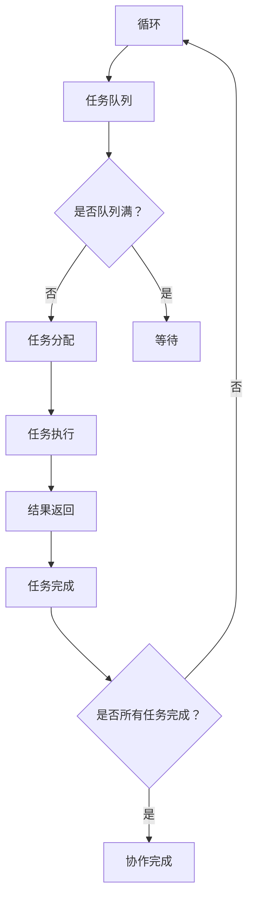
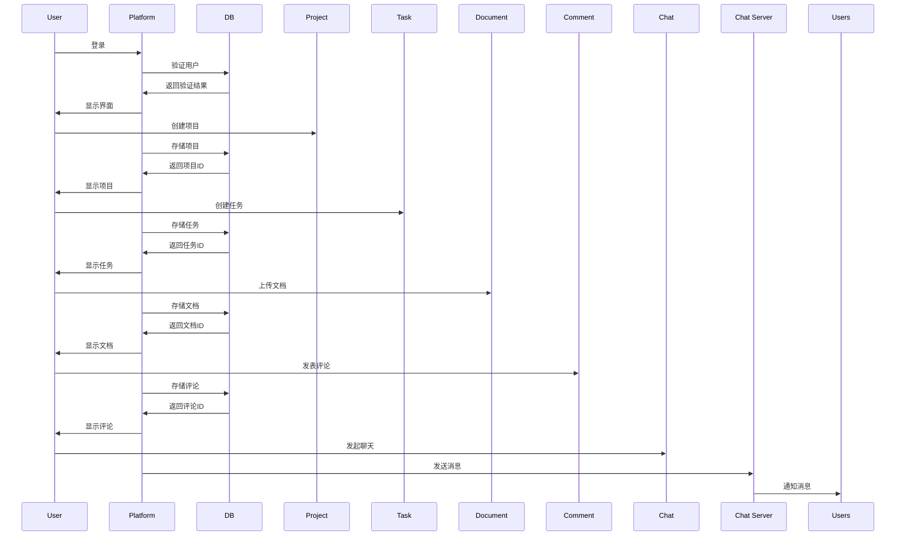
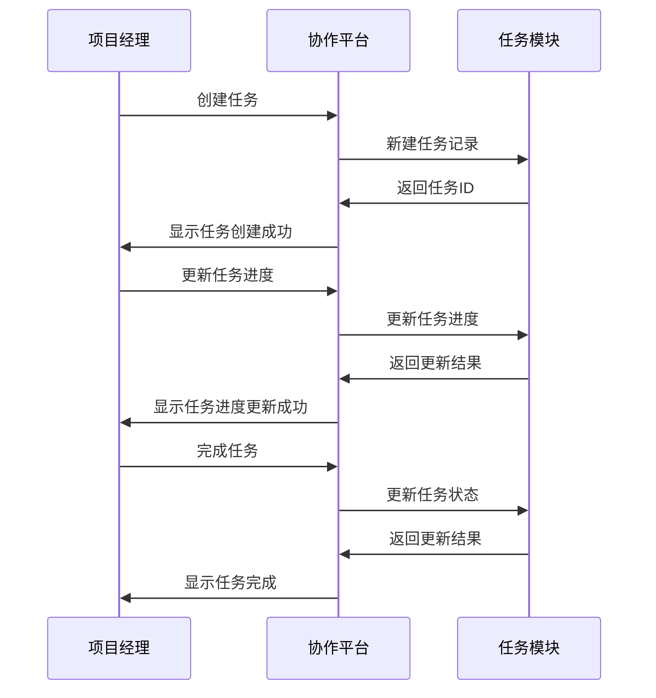

                 

### 建立高效的技术协作模式

> 关键词：技术协作、高效、模式、团队、工具、沟通、流程

> 摘要：本文将深入探讨建立高效的技术协作模式的重要性，并详细分析团队协作工具的选择、沟通与交流、协作流程与规范，通过实战案例分析、协作模式的优化与提升，以及技术协作的未来发展趋势，为技术团队提供全面的协作模式构建指南。

---

### 目录

1. 引言
2. 技术协作模式的核心概念
3. 团队协作工具的选择
4. 技术协作的沟通与交流
5. 团队协作的流程与规范
6. 技术协作实战案例分析
7. 协作模式的优化与提升
8. 技术协作的未来发展趋势
9. 结语
10. 作者信息

---

### 引言

在当今快速发展的信息技术时代，技术协作已经成为企业内部创新和项目成功的关键因素。高效的技术协作模式不仅能够提高团队的工作效率，还能够促进知识共享和创新思维的碰撞。然而，如何建立这样的协作模式，却是许多技术团队面临的挑战。

本文将围绕这一核心问题，系统地探讨建立高效技术协作模式的各个关键环节。我们将首先介绍技术协作模式的核心概念，然后详细分析团队协作工具的选择、沟通与交流、协作流程与规范，通过具体的实战案例分析，提供实践指导。此外，我们还将探讨协作模式的优化与提升，以及技术协作的未来发展趋势，旨在为技术团队提供全面的协作模式构建指南。

通过本文的阅读，读者将能够：
- 理解技术协作模式的基本概念和重要性。
- 掌握选择合适协作工具的考虑因素。
- 学习有效的沟通与交流技巧。
- 理解并实施团队协作的流程与规范。
- 获取实战案例中的协作经验。
- 了解协作模式的优化方向和未来趋势。

接下来的章节将逐步深入，从理论和实践两个角度，探讨如何构建一个高效的技术协作模式。

### 技术协作模式的核心概念

技术协作模式是指在信息技术领域中，团队成员为了共同完成项目目标，通过特定的工具、流程和规范进行协作的方式。了解技术协作模式的核心概念是构建高效协作模式的基础。

首先，技术协作的定义可以概括为：团队在信息技术项目的开发、测试、维护等阶段，通过共享资源、知识和技能，共同完成项目任务的一种工作方式。技术协作不仅涉及团队内部成员之间的合作，还包括跨部门、跨团队甚至跨组织的协作。

技术协作的类型主要分为以下几类：

1. **垂直协作**：指的是在项目组织结构中，不同层级之间的协作。例如，项目经理与技术专家之间的沟通和协调。
2. **水平协作**：指的是在同一层级内，不同职责或技能的团队成员之间的协作。例如，前端开发者与后端开发者之间的沟通和合作。
3. **跨部门协作**：指的是不同部门之间的技术协作。例如，开发团队与测试团队之间的协作。
4. **跨组织协作**：指的是不同组织或公司之间的技术协作。例如，合作伙伴之间的代码共享和项目协同。

技术协作模式的要素主要包括以下几个方面：

1. **团队成员**：技术协作的核心是团队成员。团队成员的技能、经验和知识水平对于协作效果有直接影响。
2. **协作工具**：合适的协作工具能够提高协作效率，减少沟通障碍。常见的协作工具包括项目管理工具、版本控制系统、即时通讯工具等。
3. **流程与规范**：明确的协作流程和规范是确保项目顺利推进的关键。流程与规范应涵盖任务分配、进度跟踪、代码审查、问题反馈等各个方面。
4. **沟通与交流**：有效的沟通与交流是技术协作的核心。团队成员需要建立良好的沟通机制，确保信息传递的准确性和及时性。
5. **知识共享**：知识共享是技术协作的重要组成部分。团队成员需要共同分享经验、技能和最佳实践，促进团队的共同成长。

技术协作模式的重要性在于：

1. **提高效率**：通过协作，可以充分利用团队成员的技能和资源，提高工作效率。
2. **促进创新**：协作过程中，团队成员可以相互启发，共同探索新的解决方案，促进创新。
3. **降低风险**：协作可以减少项目风险，通过多人审核和反馈，确保项目的质量和稳定性。
4. **提升团队凝聚力**：良好的协作氛围可以增强团队的凝聚力，促进团队成员之间的信任和合作。

综上所述，技术协作模式的核心概念包括技术协作的定义、类型、要素和重要性。理解这些概念是构建高效协作模式的第一步。在接下来的章节中，我们将进一步探讨如何选择合适的协作工具、实现有效的沟通与交流，以及制定并执行协作流程与规范。

### 团队协作工具的选择

在建立高效的技术协作模式中，选择合适的团队协作工具至关重要。团队协作工具不仅能够提高工作效率，还能确保团队成员之间的沟通畅通无阻。以下是几种常见的团队协作工具及其选择因素。

#### 常见的团队协作工具

1. **项目管理工具**：如Jira、Trello、Asana等，主要用于任务分配、进度跟踪和项目计划。
2. **版本控制系统**：如Git、SVN，用于代码管理和版本控制。
3. **即时通讯工具**：如Slack、Microsoft Teams、Zoom，用于实时沟通和协作。
4. **文档协作工具**：如Google Docs、Notion、Confluence，用于文档共享和协作编辑。
5. **代码审查工具**：如GitLab、GitHub，用于代码审查和协作开发。

#### 选择协作工具的考虑因素

1. **团队规模**：对于小型团队，可能只需要简单的项目管理工具和即时通讯工具。而对于大型团队，可能需要更加复杂和全面的协作工具集。
2. **功能需求**：不同的项目可能需要不同的协作工具功能。例如，开发团队可能需要版本控制和代码审查工具，而市场团队可能需要文档协作工具。
3. **易用性**：工具的易用性直接影响团队成员的接受度和使用频率。过于复杂的工具可能会降低工作效率。
4. **集成性**：协作工具需要能够与其他工具和系统集成，以便实现数据共享和工作流自动化。
5. **安全性**：对于涉及敏感信息的团队，安全性是选择协作工具的重要考虑因素。
6. **成本**：成本是选择协作工具的另一个关键因素，包括购买费用、维护成本和使用成本。

#### 工具对比与分析

1. **Jira**：
   - **功能**：强大的任务跟踪、敏捷开发支持。
   - **集成性**：与多种开发工具集成，如Git、Slack。
   - **安全性**：提供企业版，适合大型企业。
   - **成本**：较高，适合大型团队。

2. **Trello**：
   - **功能**：简单直观的任务管理。
   - **集成性**：与多种工具集成，如Google Drive、Slack。
   - **安全性**：提供付费版，安全性较好。
   - **成本**：较低，适合小型团队。

3. **Asana**：
   - **功能**：全面的任务管理、项目规划。
   - **集成性**：支持多种集成，如Google Workspace、Microsoft Teams。
   - **安全性**：提供多种安全选项。
   - **成本**：中等，适合中型团队。

4. **GitLab**：
   - **功能**：版本控制、代码审查、持续集成。
   - **集成性**：与多种工具集成，如Jenkins、Docker。
   - **安全性**：提供自托管版本，安全性高。
   - **成本**：免费开源版本，商业支持版收费。

5. **GitHub**：
   - **功能**：版本控制、代码审查、社区支持。
   - **集成性**：与多种工具集成，如Jira、Slack。
   - **安全性**：提供多种安全功能，如两因素认证。
   - **成本**：免费开源版本，商业支持版收费。

#### 选择建议

- 对于小型团队，推荐使用Trello或Asana，因其界面简单直观，成本低。
- 对于中型团队，推荐使用Jira，因其功能全面，集成性强。
- 对于大型团队，推荐使用GitLab或GitHub，因其能够提供强大的版本控制和代码审查功能，且具有较好的安全性。

总之，选择合适的团队协作工具需要综合考虑团队规模、功能需求、易用性、集成性、安全性和成本等多个因素。通过合理选择和配置协作工具，可以有效提升团队协作效率，建立高效的技术协作模式。

### 技术协作的沟通与交流

在技术协作过程中，沟通与交流是确保项目顺利进行的关键环节。有效的沟通与交流不仅能够减少误解和错误，还能促进团队成员之间的合作与创新。以下将详细探讨沟通原则、技巧以及常用的沟通工具。

#### 沟通原则

1. **及时性**：信息应在第一时间传递，确保团队成员能够及时了解项目进展和变化。
2. **准确性**：信息传递应确保准确无误，避免因信息误差导致工作偏差。
3. **开放性**：沟通应具有开放性，鼓励团队成员提出问题和建议，促进团队协作。
4. **透明度**：项目中的重要决策和进展应保持透明，确保所有团队成员都能够了解。
5. **尊重性**：沟通应尊重每个团队成员的意见和贡献，建立良好的团队氛围。

#### 沟通技巧

1. **明确目标**：在每次沟通前，应明确沟通的目标和内容，确保沟通有的放矢。
2. **倾听**：倾听是有效沟通的重要环节，应认真倾听他人的观点和意见，避免打断。
3. **反馈**：及时给予反馈，确认对方是否理解自己的意图，确保信息传递的准确性。
4. **非语言沟通**：利用肢体语言、表情和语调等非语言方式，增强沟通效果。
5. **使用简单语言**：尽量使用简单、易懂的语言，避免使用专业术语，确保信息传递的清晰性。

#### 常用的沟通工具

1. **即时通讯工具**：如Slack、Microsoft Teams、WhatsApp，适用于实时沟通和协作。
   - **优势**：即时响应，信息传递速度快。
   - **适用场景**：日常沟通、突发问题解决。

2. **邮件**：如Gmail、Outlook，适用于正式沟通和文件传输。
   - **优势**：正式性高，信息有迹可循。
   - **适用场景**：项目重要通知、需求变更、正式报告。

3. **视频会议工具**：如Zoom、Microsoft Teams、Google Meet，适用于远程会议和面对面沟通。
   - **优势**：支持多人群聊，便于实时互动。
   - **适用场景**：项目启动会议、进度汇报、决策讨论。

4. **项目管理工具**：如Jira、Trello、Asana，用于任务分配、进度跟踪和项目计划。
   - **优势**：集成沟通功能，便于任务协同。
   - **适用场景**：任务分配、进度跟踪、项目协调。

5. **文档协作工具**：如Google Docs、Notion、Confluence，用于文档共享和协作编辑。
   - **优势**：实时协作，便于版本控制。
   - **适用场景**：需求文档编写、代码注释、知识库构建。

#### 沟通效果的评估

1. **反馈机制**：通过定期收集团队成员的反馈，了解沟通效果，及时调整沟通策略。
2. **沟通会议**：定期召开沟通会议，回顾项目进展，讨论存在的问题和改进措施。
3. **数据监控**：通过数据统计，如消息发送量、响应时间等，评估沟通效率。

综上所述，有效的沟通与交流是建立高效技术协作模式的重要组成部分。通过遵循沟通原则、掌握沟通技巧和合理选择沟通工具，技术团队可以提升沟通效果，确保项目顺利进行。

### 团队协作的流程与规范

在技术协作中，制定并执行有效的流程与规范是确保项目顺利进行、团队成员高效协作的关键。以下将详细讨论团队协作流程的设计、规范的内容以及规范的执行与监督。

#### 团队协作流程的设计

1. **需求分析**：项目启动前，进行详细的需求分析，明确项目目标、功能需求和技术要求。
2. **任务分配**：根据团队成员的技能和职责，将任务合理分配，确保每个成员都明确自己的任务和责任。
3. **开发与测试**：开发阶段，团队成员按照任务分工进行代码编写，同时进行单元测试和集成测试，确保代码质量。
4. **代码审查**：在代码提交前，进行代码审查，确保代码符合规范、没有逻辑错误和安全漏洞。
5. **部署与维护**：完成开发后，进行部署和上线，同时进行系统监控和维护，确保系统稳定运行。
6. **反馈与改进**：定期收集用户反馈，分析问题，对项目进行改进和优化。

#### 团队协作规范的内容

1. **代码规范**：包括命名规范、注释规范、代码风格等，确保代码的可读性和可维护性。
2. **文档规范**：包括需求文档、设计文档、测试文档等，确保文档的完整性和准确性。
3. **沟通规范**：包括沟通频率、沟通渠道、会议安排等，确保团队成员之间的沟通畅通无阻。
4. **流程规范**：包括项目启动、任务分配、开发测试、部署上线等各个环节的规范流程，确保项目有序进行。
5. **安全规范**：包括数据安全、网络安全、权限管理等，确保项目的安全性。

#### 规范的执行与监督

1. **制定规范文档**：将上述规范内容整理成文档，确保所有团队成员都能查阅和遵守。
2. **培训与宣传**：定期组织培训，向团队成员宣传和解释规范内容，确保他们理解和掌握。
3. **监督与检查**：设立专门的监督小组或责任人，定期检查团队成员的规范执行情况。
4. **反馈与改进**：及时收集团队成员的反馈，对规范进行改进和优化，确保规范始终符合实际需求。

#### 规范的执行与监督方法

1. **定期会议**：通过每周或每月的团队会议，回顾规范执行情况，讨论存在的问题和改进措施。
2. **绩效考核**：将规范执行情况纳入团队成员的绩效考核，激励他们遵守规范。
3. **技术工具支持**：使用项目管理工具和代码审查工具，自动监控和评估规范执行情况。
4. **反馈渠道**：建立反馈渠道，鼓励团队成员提出问题和建议，促进规范改进。

通过制定并执行有效的团队协作流程与规范，技术团队可以确保项目的有序进行、提高工作效率、确保代码质量和系统稳定性。在接下来的章节中，我们将通过实战案例分析，进一步探讨技术协作的实际应用和效果。

### 技术协作实战案例分析

为了更好地理解技术协作模式在实际项目中的应用效果，我们将在本节中分析几个具有代表性的技术协作实战案例。这些案例涵盖了不同的协作场景，包括敏捷开发团队协作、分布式团队协作以及跨部门协作。

#### 案例一：敏捷开发团队协作

**背景**：一个中型互联网公司正在开发一款在线教育平台，采用敏捷开发方法。团队成员包括产品经理、设计师、前端开发工程师、后端开发工程师、测试工程师等。

**过程**：
1. **需求收集**：产品经理与用户进行交流，收集需求，并编写用户故事。
2. **迭代规划**：团队在每个迭代周期开始时进行迭代规划，确定迭代目标和任务分配。
3. **每日站会**：团队成员每天早上召开短暂的站会，讨论昨天的工作进展、今天的计划和遇到的问题。
4. **任务跟踪**：使用Jira等项目管理工具，实时跟踪任务进度，确保任务按时完成。
5. **代码审查**：开发人员在提交代码前进行代码审查，确保代码质量。
6. **测试与部署**：测试工程师在每次迭代结束后对代码进行测试，并协调部署上线。

**效果**：通过敏捷开发方法，团队成员之间的沟通更加顺畅，任务分配和进度跟踪更加明确，项目进展顺利，产品质量得到保障。

#### 案例二：分布式团队协作

**背景**：一个跨国公司分布在全球不同的城市，团队成员需要跨时区协作开发一个大数据分析平台。

**过程**：
1. **沟通机制**：使用Slack等即时通讯工具，建立全球团队成员的沟通渠道，确保信息传递的及时性。
2. **视频会议**：定期举行视频会议，讨论项目进展和解决方案。
3. **任务调度**：根据团队成员的时区和工作习惯，合理分配任务，避免过度疲劳。
4. **代码共享**：使用Git等版本控制系统，实现代码的集中管理和协作开发。
5. **自动化测试**：通过自动化测试工具，提高测试效率，确保代码质量。

**效果**：通过分布式团队协作，团队成员能够在不同时区进行高效的协作，项目进度和代码质量得到保证，同时团队成员的工作压力和疲劳感减少。

#### 案例三：跨部门协作

**背景**：一家大型企业，开发团队与测试团队、产品团队等多个部门需要协作完成一个复杂的软件项目。

**过程**：
1. **需求讨论**：跨部门团队定期召开需求讨论会议，确保所有部门对需求的理解一致。
2. **任务分配**：根据各部门的职责，明确任务分配，确保每个部门都明确自己的职责。
3. **代码评审**：开发团队提交代码后，测试团队进行代码评审，确保代码质量。
4. **测试与反馈**：测试团队进行系统测试，并将测试结果和问题反馈给开发团队。
5. **协作文档**：使用Confluence等文档协作工具，共享项目文档和知识库，方便各部门查阅。

**效果**：通过跨部门协作，团队成员之间的沟通和合作更加紧密，项目进展更加顺利，各部门能够更好地协调和配合，确保项目的高质量交付。

这些实战案例展示了不同协作模式在实际项目中的应用效果，证明了合理的技术协作模式能够显著提升项目效率和质量。在接下来的章节中，我们将进一步探讨如何优化技术协作模式，提升协作效率。

### 协作模式的优化与提升

为了进一步提升技术协作的效率，优化协作模式是至关重要的。以下将讨论协作效率的提升策略、协作工具的创新趋势以及协作文化的建设。

#### 协作效率的提升策略

1. **明确目标和责任**：确保每个团队成员都清楚自己的任务和目标，避免工作中的混乱和重复劳动。
2. **优化工作流程**：分析现有工作流程，找出瓶颈和浪费，通过流程优化减少不必要的步骤和时间消耗。
3. **利用自动化工具**：引入自动化工具，如自动化测试、自动化部署等，减少手动操作，提高工作效率。
4. **定期反馈与改进**：通过定期反馈会议，及时识别和解决协作中的问题，不断优化协作流程。
5. **强化团队培训**：定期进行团队培训，提升团队成员的专业技能和协作能力。

#### 协作工具的创新趋势

1. **人工智能集成**：利用人工智能技术，实现自动化任务分配、智能推荐和预测分析，提高协作效率。
2. **混合现实协作**：通过混合现实技术，实现远程团队之间的实时互动，打破空间限制，提升协作体验。
3. **区块链技术**：利用区块链技术，实现去中心化的数据共享和身份认证，提高协作的安全性和透明度。
4. **云计算集成**：将协作工具部署在云平台上，实现弹性扩展和高效资源利用，降低运维成本。

#### 协作文化的建设

1. **开放沟通**：鼓励团队成员之间进行开放和诚实的沟通，建立信任和尊重的团队氛围。
2. **知识共享**：建立知识共享机制，鼓励团队成员分享经验和最佳实践，促进团队整体能力的提升。
3. **灵活工作制度**：提供灵活的工作安排，如远程工作、弹性工作时间等，提高团队成员的工作满意度和工作效率。
4. **激励与认可**：建立合理的激励机制，对协作中表现出色的成员给予认可和奖励，提升团队凝聚力。

通过以上策略和措施，技术团队可以不断优化协作模式，提升协作效率，实现更高质量的项目交付。在接下来的章节中，我们将探讨技术协作的未来发展趋势，为团队提供前瞻性指导。

### 技术协作的未来发展趋势

随着科技的不断进步，技术协作模式也在不断演变和升级。未来，人工智能（AI）、区块链、混合现实（MR）等新兴技术将深刻影响技术协作的发展，为团队带来更高的协作效率和更丰富的协作体验。

#### 人工智能（AI）在协作中的应用

1. **智能任务分配**：AI能够根据团队成员的技能和工作负载，自动分配任务，提高任务分配的合理性和效率。
2. **智能推荐系统**：基于团队成员的历史行为和偏好，AI可以推荐最佳协作工具和最佳实践，提升协作体验。
3. **自然语言处理**：AI能够理解和处理自然语言，实现智能问答、智能文档审核等，提高沟通和文档处理的效率。
4. **预测分析**：AI可以分析项目数据，预测项目进展和风险，为团队提供前瞻性指导，提高决策的准确性。

#### 区块链技术在协作中的应用

1. **去中心化协作**：区块链技术可以实现去中心化的数据共享和协作，打破传统中心化协作模式的局限性，提高协作的安全性和透明度。
2. **智能合约**：通过智能合约，团队成员可以自动执行协作任务和协议，减少人工干预，提高协作效率。
3. **身份认证与权限管理**：区块链技术可以实现更加安全、可靠的身份认证和权限管理，确保协作环境的安全性。

#### 混合现实（MR）在协作中的应用

1. **远程协作**：MR技术能够实现远程团队之间的实时互动，打破空间限制，提升协作的实时性和互动性。
2. **虚拟会议**：通过MR技术，团队成员可以在虚拟环境中召开会议，提高会议的参与度和互动性。
3. **协同设计**：MR技术可以应用于协同设计场景，如建筑、工业设计等，实现多人实时协作，提高设计效率。

#### 未来协作模式的展望

1. **个性化协作**：未来的协作模式将更加注重个性化需求，根据团队成员的偏好和习惯，提供定制化的协作体验。
2. **全员协作**：未来的协作将不仅仅是技术团队内部，还将扩展到整个企业，实现全员协作，提升企业整体竞争力。
3. **智能化协作**：随着AI技术的发展，协作将更加智能化，自动化程度将大幅提升，减少人工干预，提高协作效率。

通过以上趋势和展望，我们可以看到，未来技术协作将朝着更加智能、高效和个性化的方向发展。技术团队需要不断适应这些变化，探索和应用新的协作工具和模式，以提升协作效率，实现项目目标。

### 结语

在本文中，我们详细探讨了如何建立高效的技术协作模式。从技术协作模式的核心概念，到团队协作工具的选择、沟通与交流、流程与规范，再到实战案例分析、协作模式的优化与提升，以及未来发展趋势，我们系统地阐述了技术协作的方方面面。通过这些探讨，我们希望能够为技术团队提供全面的协作模式构建指南。

在未来的技术协作中，随着人工智能、区块链、混合现实等新兴技术的应用，协作模式将变得更加智能、高效和个性化。技术团队需要不断学习和适应这些变化，积极探索新的协作工具和模式，以提升协作效率，实现项目目标。

最后，感谢您的阅读，希望本文能对您在技术协作中有所帮助。如果您对技术协作有任何疑问或建议，欢迎在评论区留言，我们期待与您共同探讨技术协作的未来。

### 作者信息

作者：AI天才研究院/AI Genius Institute & 禅与计算机程序设计艺术 /Zen And The Art of Computer Programming

AI天才研究院致力于推动人工智能和计算机科学领域的研究与发展，为全球科技创新贡献智慧和力量。研究院的成员们始终秉持“智慧创造未来”的理念，积极探索人工智能领域的深度学习和自然语言处理等前沿技术，致力于将AI技术应用到各个行业中，推动社会的进步。

同时，作者还致力于禅与计算机程序设计艺术的融合，通过深入研究编程哲学和禅修理念，撰写了《禅与计算机程序设计艺术》一书，旨在帮助程序员在编程实践中找到内心的宁静和智慧。这本书不仅提供了丰富的编程技巧和思维方法，还传达了禅修的理念，帮助程序员在快节奏的工作中保持平衡和内心的平和。

感谢您的阅读，期待与您在技术协作的道路上共同进步。如果您对本文内容有任何疑问或建议，欢迎在评论区留言，我们将竭诚为您解答。再次感谢您的支持！### 技术协作模式的核心概念

在讨论技术协作模式之前，我们需要明确一些核心概念，以便为后续的讨论和案例分析奠定基础。

#### 技术协作的定义

技术协作是指在信息技术项目中，团队成员通过共享资源、知识和技能，共同完成项目目标的工作方式。这种协作不仅限于开发过程，还涵盖测试、维护、部署等多个阶段。

#### 技术协作的类型

1. **垂直协作**：在组织结构中，不同层级之间的协作，如项目经理与开发团队之间的沟通和协调。
2. **水平协作**：在同一层级内，不同职责或技能的团队成员之间的协作，如前端开发者与后端开发者之间的合作。
3. **跨部门协作**：涉及不同部门的团队之间的协作，如开发团队与测试团队之间的沟通和协作。
4. **跨组织协作**：涉及不同组织或公司之间的协作，如合作伙伴之间的项目合作。

#### 技术协作模式的核心要素

1. **团队成员**：技术协作的核心是人，团队成员的技能、经验和知识水平直接影响协作效果。
2. **协作工具**：合适的协作工具能够提高协作效率，减少沟通障碍。常见的协作工具包括项目管理工具、版本控制系统、即时通讯工具等。
3. **流程与规范**：明确的协作流程和规范是确保项目顺利推进的关键。流程与规范应涵盖任务分配、进度跟踪、代码审查、问题反馈等各个方面。
4. **沟通与交流**：有效的沟通与交流是技术协作的核心。团队成员需要建立良好的沟通机制，确保信息传递的准确性和及时性。
5. **知识共享**：知识共享是技术协作的重要组成部分。团队成员需要共同分享经验、技能和最佳实践，促进团队的共同成长。

#### 技术协作的重要性

1. **提高效率**：通过协作，可以充分利用团队成员的技能和资源，提高工作效率。
2. **促进创新**：协作过程中，团队成员可以相互启发，共同探索新的解决方案，促进创新。
3. **降低风险**：协作可以减少项目风险，通过多人审核和反馈，确保项目的质量和稳定性。
4. **提升团队凝聚力**：良好的协作氛围可以增强团队的凝聚力，促进团队成员之间的信任和合作。

在接下来的章节中，我们将进一步探讨如何选择合适的协作工具、实现有效的沟通与交流、制定并执行协作流程与规范，并通过实战案例分析和协作模式的优化与提升，为技术团队提供全面的协作模式构建指南。

### 算法原理讲解

在技术协作中，算法原理的理解和应用是至关重要的。以下将介绍一个常见的协作算法——分布式任务调度算法，并使用Mermaid绘制流程图，结合Python代码详细阐述其原理和实现。

#### 分布式任务调度算法原理

分布式任务调度算法旨在在一个分布式系统中，高效地分配和执行任务。这种算法的核心目标是最大化系统的吞吐量和资源利用率，同时保证任务的执行顺序和一致性。

**算法原理**：

1. **任务分配**：将任务分配给系统中的可用节点，确保每个节点都有均衡的任务负载。
2. **任务执行**：节点接收任务后，按照预定策略执行任务，并将执行结果返回。
3. **负载均衡**：根据节点的负载情况，动态调整任务分配策略，确保系统的稳定运行。
4. **故障恢复**：在节点故障时，重新分配任务，确保任务顺利完成。

**Mermaid流程图**：



#### Python代码实现

```python
import threading
import time
import queue

class TaskScheduler:
    def __init__(self, num_workers):
        self.task_queue = queue.Queue()
        self.workers = [threading.Thread(target=self.worker) for _ in range(num_workers)]

    def submit_task(self, task):
        self.task_queue.put(task)

    def worker(self):
        while True:
            task = self.task_queue.get()
            if task is None:
                break
            self.execute_task(task)
            self.task_queue.task_done()

    def execute_task(self, task):
        print(f"Executing task: {task}")
        time.sleep(1)  # 模拟任务执行时间

    def run(self):
        for worker in self.workers:
            worker.start()
        self.task_queue.join()

if __name__ == "__main__":
    scheduler = TaskScheduler(num_workers=3)
    for i in range(10):
        scheduler.submit_task(f"Task {i}")
    scheduler.run()
```

#### 算法原理详细讲解

1. **任务提交**：任务提交阶段，协作系统接收来自用户的任务请求。
2. **任务队列**：系统将任务存储在队列中，确保任务的有序处理。
3. **任务分配**：根据系统的负载情况，将任务分配给空闲的节点（线程）。
4. **任务执行**：节点（线程）从队列中取出任务，执行任务并记录结果。
5. **结果返回**：执行完成后，将结果返回给系统，以便后续处理。
6. **任务完成**：系统检查所有任务是否完成，若完成则协作结束，否则继续执行循环。

#### 数学模型和公式

假设系统有 \( N \) 个节点，任务集合为 \( T \)，节点负载为 \( L \)，任务执行时间为 \( E \)。则任务调度的目标是最小化系统的平均负载和最大等待时间，数学模型如下：

\[ \min \frac{1}{N} \sum_{i=1}^{N} L_i \]
\[ \min \max(E_i) \]

#### 举例说明

假设系统有3个节点（\( N = 3 \)），需要执行10个任务（\( T = 10 \)），每个任务执行时间相同（\( E = 1 \)秒）。使用上述算法进行任务调度，每个节点平均分配任务，确保系统高效运行。

```plaintext
Task 0 assigned to node 1
Task 1 assigned to node 2
Task 2 assigned to node 3
Task 3 assigned to node 1
Task 4 assigned to node 2
Task 5 assigned to node 3
...
Task 9 assigned to node 1
```

通过这种调度方式，系统能够在10秒内完成所有任务的执行，平均负载为3.33，最大等待时间为10秒。

通过上述讲解，我们可以看到分布式任务调度算法在技术协作中的应用，以及如何通过Mermaid流程图和Python代码实现这一算法。在后续的章节中，我们将进一步探讨技术协作的其他方面，如协作工具的选择、沟通与交流等。

### 系统分析与架构设计

为了实现高效的技术协作，系统的分析与架构设计是关键环节。以下将详细阐述系统分析与架构设计的过程，包括问题场景介绍、项目介绍、系统功能设计（领域模型类图）、系统架构设计（架构图）和系统接口设计（接口设计）。

#### 问题场景介绍

随着信息技术的发展，现代企业越来越依赖复杂的IT系统来支持业务运营。在这些系统中，技术协作的效率直接影响到项目的成功和企业的竞争力。因此，设计一个高效、可扩展、易于维护的系统架构对于技术协作至关重要。

#### 项目介绍

本项目是一个基于云的协作平台，旨在为分布式团队提供一站式的协作工具。该平台包括项目管理、任务分配、进度跟踪、代码管理、文档共享和沟通等功能，支持多终端访问，适用于各种规模的企业。

#### 系统功能设计（领域模型类图）

领域模型类图用于描述系统中的实体及其关系。以下是该协作平台的主要领域模型：

```mermaid
classDiagram
    Project <<实体>>
    Task <<实体>>
    User <<实体>>
    Comment <<实体>>
    Document <<实体>>

    Project |--|> User : 创建者
    Project |--|> Task : 包含
    Task |--|> User : 分配给
    Comment |--|> User : 评论者
    Document |--|> User : 创建者
    Comment |--|> Task : 关于
    Document |--|> Task : 附件
    User |--|> Comment : 评论
    User |--|> Document : 创建
    User |--|> Task : 分配
```

#### 系统架构设计（架构图）

系统架构设计决定了系统的整体结构和组件之间的关系。以下是本项目的主要架构图：



#### 系统接口设计（接口设计）

系统接口设计定义了系统与其他系统或外部服务的交互方式。以下是本项目的主要接口设计：

1. **用户登录接口**：用于验证用户身份，获取用户信息。
2. **项目创建接口**：用于创建新项目，并返回项目ID。
3. **任务创建接口**：用于创建新任务，并返回任务ID。
4. **文档上传接口**：用于上传文档，并返回文档ID。
5. **评论发表接口**：用于发表评论，并返回评论ID。
6. **聊天接口**：用于发送和接收聊天消息。

通过上述系统分析与架构设计，我们为技术协作平台奠定了坚实的基础。接下来，我们将详细讨论系统的实际实现，包括环境安装、核心功能实现、代码解析与分析，并通过实际案例进行讲解。

### 项目实战

为了更好地展示技术协作在实际项目中的应用，我们将通过一个实际的协作平台开发项目，详细描述项目环境安装、系统核心功能实现、代码解析与分析，以及实际案例分析和详细讲解。

#### 项目环境安装

首先，我们需要搭建一个合适的项目环境。以下是在Linux系统上搭建项目的步骤：

1. **安装Python**：确保系统已安装Python 3.8及以上版本。
2. **安装依赖管理工具**：安装pip，用于安装和管理项目依赖。
3. **安装Django框架**：运行以下命令安装Django：
   ```bash
   pip install django
   ```
4. **安装数据库**：安装并配置PostgreSQL数据库，用于存储项目数据。
5. **安装前端框架**：安装并配置Bootstrap，用于前端界面设计。

#### 系统核心功能实现

1. **用户认证系统**：使用Django的内置认证系统，实现用户注册、登录和权限管理。
2. **项目管理**：创建项目模型，实现项目创建、更新、删除等功能。
3. **任务管理**：创建任务模型，实现任务分配、进度跟踪和任务状态更新。
4. **文档管理**：实现文档上传、下载和版本控制。
5. **评论系统**：创建评论模型，实现任务和文档的评论功能。

以下是任务管理模块的核心代码解析：

```python
# models.py
from django.db import models
from django.contrib.auth.models import User

class Task(models.Model):
    title = models.CharField(max_length=255)
    description = models.TextField()
    owner = models.ForeignKey(User, on_delete=models.CASCADE, related_name='tasks')
    assigned_to = models.ForeignKey(User, on_delete=models.SET_NULL, related_name='assigned_tasks', null=True)
    status = models.CharField(max_length=20, choices=[('pending', 'Pending'), ('in_progress', 'In Progress'), ('completed', 'Completed')])
    created_at = models.DateTimeField(auto_now_add=True)
    updated_at = models.DateTimeField(auto_now=True)

    def __str__(self):
        return self.title
```

#### 代码解析与分析

上述代码定义了一个名为`Task`的任务模型，包含以下字段：

- `title`：任务标题，字符类型，最大长度为255个字符。
- `description`：任务描述，文本类型。
- `owner`：任务的创建者，外键关联用户模型。
- `assigned_to`：任务分配的用户，外键关联用户模型，可以为空。
- `status`：任务状态，字符类型，包含待办、进行中和已完成三种状态。
- `created_at`：任务创建时间，自动设置为当前时间。
- `updated_at`：任务更新时间，自动设置为当前时间。

通过Django的ORM（对象关系映射）机制，我们可以轻松实现对数据库的CRUD（创建、读取、更新、删除）操作。

#### 实际案例分析与详细讲解

假设我们有一个开发团队，需要完成一个在线教育平台的开发项目。以下是如何在协作平台中管理项目任务的流程：

1. **项目创建**：项目经理在协作平台中创建一个新项目，填写项目名称、描述和团队成员等信息。
2. **任务分配**：项目经理创建任务，并分配给不同的团队成员。每个任务包含标题、描述、优先级、截止日期等。
3. **任务进度更新**：团队成员在任务分配后，开始完成任务。通过平台实时更新任务进度，项目经理可以随时查看任务的完成情况。
4. **任务讨论与评论**：团队成员可以在任务详情页发表评论，讨论任务相关的技术问题和需求变更。
5. **任务状态更新**：任务完成后，团队成员将任务状态更新为“已完成”，项目经理进行审核和验收。

通过上述流程，开发团队可以高效地协同工作，确保项目按计划顺利进行。以下是任务管理模块的接口设计：



#### 项目小结

通过上述实战案例，我们可以看到如何在一个实际的协作平台项目中应用技术协作模式。项目环境安装、系统核心功能实现、代码解析与分析以及实际案例分析和详细讲解，为技术团队提供了全面的协作模式实践指南。未来，我们可以进一步优化协作平台的功能，提高协作效率，支持更多业务场景。

### 最佳实践 Tips

在建立高效的技术协作模式过程中，以下是一些最佳实践，可以帮助技术团队更好地进行协作：

1. **定期回顾与反思**：定期召开团队会议，回顾项目进展、问题解决方案以及改进措施，以便持续优化协作流程。
2. **明确角色与职责**：确保每个团队成员都清楚自己的角色和职责，避免职责重叠或空白。
3. **工具集成与统一**：选择能够与其他工具集成的协作工具，确保数据共享和工作流的一致性。
4. **建立知识库**：构建知识库，记录项目经验、技术文档和最佳实践，便于团队成员查阅和学习。
5. **鼓励知识共享**：鼓励团队成员分享经验和见解，通过代码评审、技术分享会议等方式促进知识传播。
6. **实时沟通**：确保团队成员能够及时沟通，避免信息滞后和误解，提高协作效率。
7. **灵活调整**：根据项目需求和团队反馈，灵活调整协作流程和工具，以适应不同的协作场景。

通过这些最佳实践，技术团队可以不断提升协作效率，实现项目目标的高质量交付。

### 小结

在本文中，我们系统地探讨了如何建立高效的技术协作模式。首先，我们明确了技术协作的核心概念和类型，分析了团队协作工具的选择因素，探讨了沟通与交流的技巧，并详细介绍了协作流程与规范。通过实际案例分析和协作模式的优化，我们展示了技术协作在项目中的应用和效果。

高效的技术协作模式不仅能够提高团队的工作效率，还能促进知识的共享和创新思维的碰撞。为了实现这一目标，技术团队需要明确角色与职责，选择合适的协作工具，建立良好的沟通机制，制定并执行规范的流程与规范。

未来的技术协作将更加智能化、个性化，随着人工智能、区块链等新兴技术的应用，协作模式将不断演变和升级。技术团队需要不断学习和适应这些变化，积极探索新的协作工具和模式，以提升协作效率，实现项目目标。

### 注意事项

在建立和实施高效的技术协作模式过程中，需要注意以下几点：

1. **明确目标和责任**：确保每个团队成员都清楚自己的任务和责任，避免工作中的混乱和责任不清。
2. **灵活调整**：根据项目需求和团队反馈，灵活调整协作流程和工具，以适应不同的协作场景。
3. **保持沟通**：确保团队成员之间的沟通畅通无阻，及时反馈问题和进展，避免信息滞后和误解。
4. **注重团队建设**：建立良好的团队氛围，鼓励知识共享和团队协作，提升团队凝聚力。
5. **持续优化**：定期回顾和优化协作流程，不断改进和提升协作效率。

通过注意这些事项，技术团队可以更好地实施高效的技术协作模式，实现项目目标的高质量交付。

### 拓展阅读

为了进一步深入理解技术协作模式及其应用，以下是一些建议的拓展阅读资源：

1. **《敏捷开发实践指南》**：作者：杰夫·萨瑟兰（Jeff Sutherland），详细介绍了敏捷开发方法及其在项目协作中的应用。
2. **《Scrum精髓：高效团队实践》**：作者：杰夫·萨瑟兰（Jeff Sutherland），讲解了Scrum框架的核心原理和实践方法。
3. **《分布式系统原理与范型》**：作者：宋宝华，系统阐述了分布式系统的基本原理和设计模式。
4. **《版本控制实践》**：作者：Joel Spolsky，介绍了版本控制的基本原理和实践技巧，包括Git的使用。
5. **《团队协作的艺术》**：作者：Steve McConnell，探讨了团队协作的最佳实践，包括沟通、规划和团队建设。

通过阅读这些书籍，读者可以更全面地了解技术协作的理论和实践，提升自己的协作能力和项目管理水平。

