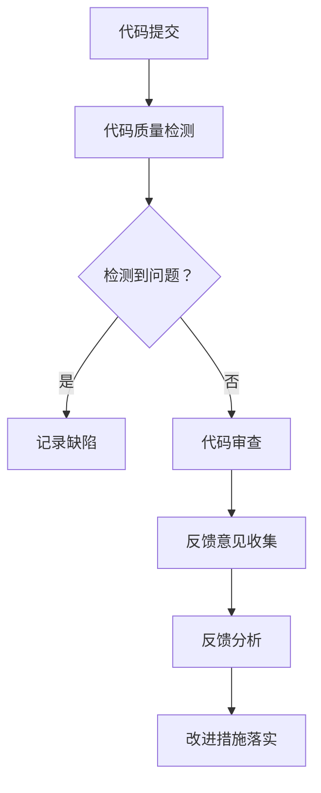
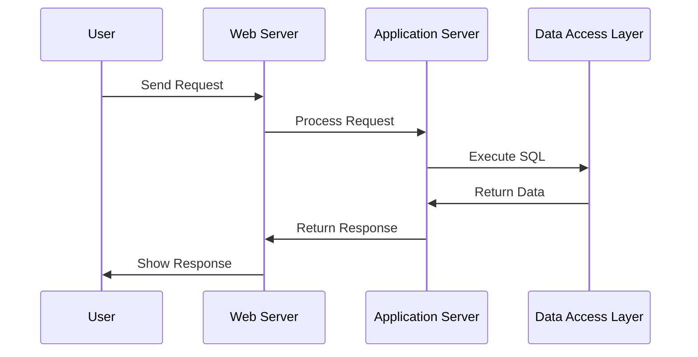

                 

### 建立高效的技术评审与反馈机制

在现代软件开发过程中，技术评审与反馈机制是确保代码质量、功能完备和用户体验的重要环节。然而，随着项目复杂度和团队规模的增加，传统的评审方法往往效率低下，效果不佳。因此，建立一套高效的技术评审与反馈机制变得尤为重要。

在这篇文章中，我们将逐步探讨如何构建这样的机制。以下是我们的主要论点：

1. **明确评审目标与范围**：首先，我们需要根据项目需求和团队特点，明确评审的目标和范围。
2. **制定评审标准**：评审标准是评审的依据，它包括代码质量、功能完备性、用户体验等方面。
3. **设计评审流程**：设计一个合理的评审流程，包括评审的步骤、责任人、评审周期等。
4. **选择合适的评审工具**：评审工具可以帮助我们自动化执行评审任务，提高评审效率。
5. **建立反馈机制**：确保评审意见能够及时、有效地传递到相关人员，并进行跟进和改进。

下面，我们将逐一深入分析这些步骤。

#### 1.1 明确评审目标与范围

**问题背景**：

在软件开发过程中，技术评审是一个关键的环节。通过评审，我们可以发现代码中的潜在问题，确保代码质量，提高功能完备性和用户体验。然而，随着项目的复杂度和团队规模的增长，传统的评审方法，如人工检查，往往效率低下，效果不佳。

**问题描述**：

如何明确评审的目标和范围，以提升评审的效率和效果？

**问题解决**：

要明确评审的目标和范围，我们需要考虑以下几个方面：

- **项目需求**：评审的目标应该符合项目的需求和预期目标。
- **团队特点**：不同团队的评审需求可能有所不同，我们需要根据团队的特点来制定评审的目标和范围。
- **评审重点**：根据项目的特点，确定评审的重点，例如代码质量、功能完备性、用户体验等。

**边界与外延**：

- **适用范围**：技术评审与反馈机制适用于各类软件开发项目，无论项目规模大小、技术难度高低。
- **与其他流程结合**：技术评审与反馈机制需要与其他开发流程（如敏捷开发、DevOps等）相结合，以实现最佳效果。

**概念结构与核心要素组成**：

- **评审目标**：确保代码质量、功能完备性和用户体验。
- **评审范围**：根据项目需求和团队特点，确定评审的重点和范围。

#### 1.2 制定评审标准

**问题背景**：

评审标准是评审的依据，它决定了评审的具体内容和方法。没有明确的评审标准，评审工作将缺乏统一性和客观性。

**问题描述**：

如何制定一套合理的评审标准，以确保评审的全面性和公正性？

**问题解决**：

制定评审标准需要考虑以下几个方面：

- **代码质量**：包括代码风格、可读性、可维护性等。
- **功能完备性**：确保实现的功能符合需求规格说明书的要求。
- **用户体验**：关注用户的使用体验，包括界面设计、操作流程等。

**边界与外延**：

- **具体要求**：评审标准应该具体、明确，便于执行和评估。
- **动态调整**：评审标准需要根据项目进展和团队反馈进行动态调整。

**概念结构与核心要素组成**：

- **评审标准**：包括代码质量、功能完备性和用户体验等方面的要求。
- **评估指标**：用于衡量评审标准的达成情况。

#### 1.3 设计评审流程

**问题背景**：

评审流程是评审工作的具体实施步骤，它决定了评审的效率和效果。一个合理的设计流程可以提高评审的效率，减少不必要的重复工作。

**问题描述**：

如何设计一个高效的评审流程，以确保评审的顺利进行？

**问题解决**：

设计评审流程需要考虑以下几个方面：

- **评审步骤**：包括代码提交、评审、反馈和修改等环节。
- **责任人**：明确各环节的责任人，确保评审工作有明确的执行者。
- **评审周期**：根据项目的进度和团队的实际情况，确定合理的评审周期。

**边界与外延**：

- **适用范围**：评审流程适用于各类软件开发项目。
- **流程优化**：评审流程需要根据项目进展和团队反馈进行持续优化。

**概念结构与核心要素组成**：

- **评审步骤**：包括代码提交、评审、反馈和修改等环节。
- **责任人**：明确各环节的责任人。
- **评审周期**：根据项目的进度和团队的实际情况，确定合理的评审周期。

#### 1.4 选择合适的评审工具

**问题背景**：

评审工具是提高评审效率的重要手段。选择合适的评审工具可以大大降低评审的难度和成本。

**问题描述**：

如何选择一套合适的评审工具，以提升评审的效率和质量？

**问题解决**：

选择评审工具需要考虑以下几个方面：

- **功能**：评审工具需要具备代码质量检测、缺陷跟踪等功能。
- **兼容性**：评审工具需要与现有的开发工具和流程兼容。
- **用户体验**：评审工具的界面和操作应该简洁易用。

**边界与外延**：

- **选择标准**：评审工具的选择应满足功能需求、兼容性和用户体验等方面的要求。
- **持续优化**：评审工具需要根据项目进展和团队反馈进行持续优化。

**概念结构与核心要素组成**：

- **评审工具**：用于自动化执行评审任务，如代码审查工具、缺陷跟踪工具等。
- **功能**：包括代码质量检测、缺陷跟踪等功能。
- **兼容性**：评审工具需要与现有的开发工具和流程兼容。

#### 1.5 建立反馈机制

**问题背景**：

评审的最终目的是为了改进开发过程，提高代码质量和用户体验。因此，建立有效的反馈机制至关重要。

**问题描述**：

如何建立一套有效的反馈机制，以确保评审意见能够及时、有效地传递到相关人员，并进行跟进和改进？

**问题解决**：

建立反馈机制需要考虑以下几个方面：

- **意见收集**：确保评审意见能够被及时收集和记录。
- **意见传递**：确保评审意见能够及时、有效地传递到相关人员。
- **意见跟进**：对评审意见进行跟进和改进，确保问题的解决。

**边界与外延**：

- **反馈渠道**：建立多种反馈渠道，如邮件、即时通讯工具等。
- **意见分类**：对评审意见进行分类，以便于管理和跟进。

**概念结构与核心要素组成**：

- **意见收集**：确保评审意见能够被及时收集和记录。
- **意见传递**：确保评审意见能够及时、有效地传递到相关人员。
- **意见跟进**：对评审意见进行跟进和改进，确保问题的解决。

#### 1.6 概念结构与核心要素组成

综上所述，建立高效的技术评审与反馈机制需要以下几个核心要素：

- **评审目标与范围**：明确评审的目标和范围。
- **评审标准**：制定代码质量、功能完备性和用户体验等方面的评审标准。
- **评审流程**：设计包括代码提交、评审、反馈和修改等环节的评审流程。
- **评审工具**：选择功能全面、兼容性好、用户体验好的评审工具。
- **反馈机制**：建立意见收集、意见传递和意见跟进的反馈机制。

这些要素相互关联，共同构成了一个高效的技术评审与反馈机制。

### 结论

通过以上分析，我们可以看到，建立一套高效的技术评审与反馈机制是提升软件开发过程效率和质量的关键。从明确评审目标与范围，到制定评审标准，设计评审流程，选择评审工具，再到建立反馈机制，每一步都需要仔细考虑和精心设计。

希望本文能帮助您更好地理解和实施技术评审与反馈机制，从而提升您的项目开发效率和质量。

### 参考文献

1. 《敏捷软件开发：实践指南》作者：杰拉尔德·费舍尔
2. 《代码大全》作者：Steve McConnell
3. 《软件工程：实践者的研究方法》作者：Roger S. Pressman

### 作者信息

作者：AI天才研究院/AI Genius Institute & 禅与计算机程序设计艺术 /Zen And The Art of Computer Programming

---

## 建立高效的技术评审与反馈机制

### 关键词
技术评审、反馈机制、软件开发、代码质量、功能完备性、用户体验

### 摘要
本文旨在探讨如何建立一套高效的技术评审与反馈机制，以提高软件开发过程中的代码质量、功能完备性和用户体验。通过明确评审目标与范围、制定评审标准、设计评审流程、选择评审工具以及建立反馈机制，本文提供了一套完整的实施方案，旨在为软件开发团队提供实用的指导。

### 第1章 背景介绍

#### 1.1 问题背景

技术评审与反馈机制在软件开发过程中扮演着至关重要的角色。随着项目复杂度和团队规模的增长，如何确保代码质量、功能完备和用户满意度成为一个挑战。传统的开发流程中，技术评审往往依赖于人工检查，容易产生漏检和效率低下的问题。

#### 1.2 问题描述

如何建立一套高效的技术评审与反馈机制，以提升软件开发过程的效率和质量？这需要考虑评审流程的设计、评审标准的制定、评审工具的选择以及反馈机制的完善。

#### 1.3 问题解决

建立高效的技术评审与反馈机制需要以下步骤：

1. **明确评审目标与范围**：根据项目需求和团队特点，确定评审的重点和范围。
2. **制定评审标准**：明确代码质量、功能完备性、用户体验等方面的要求。
3. **设计评审流程**：制定评审的步骤、责任人、评审周期等。
4. **选择合适的评审工具**：如代码审查工具、缺陷跟踪工具等。
5. **建立反馈机制**：确保评审意见能够及时、有效地传递到相关人员，并进行跟进和改进。

#### 1.4 边界与外延

技术评审与反馈机制适用于各类软件开发项目，无论项目规模大小、技术难度高低。同时，它也需要与其他开发流程（如敏捷开发、DevOps等）相结合，以实现最佳效果。

#### 1.5 概念结构与核心要素组成

1. **评审目标**：确保代码质量、功能完备性和用户体验。
2. **评审标准**：包括代码风格、功能测试、性能优化等方面。
3. **评审流程**：包括代码提交、评审、反馈和修改等环节。
4. **评审工具**：用于自动化执行评审任务，如代码审查工具、缺陷跟踪工具等。
5. **反馈机制**：确保评审意见能够得到及时回应和落实。

### 第2章 核心概念与联系

#### 2.1 核心概念原理

**技术评审**：技术评审是对软件开发过程中的代码、设计文档等进行检查，以确保其符合预定的质量标准。评审的目的在于发现潜在的问题，提高代码的质量和可维护性。

**反馈机制**：反馈机制是指在评审过程中，对评审意见进行收集、传递和跟进的过程。通过反馈机制，评审人员可以及时了解问题的解决情况，并不断完善开发过程。

#### 2.2 概念属性特征对比表格

| 概念         | 属性特征                           | 关联关系                   |
| ------------ | ---------------------------------- | -------------------------- |
| 技术评审     | 代码检查、设计文档审查             | 确保代码质量、功能完备     |
| 反馈机制     | 评审意见回应、改进措施落实         | 提高开发效率、提升用户体验 |
| 评审工具     | 自动化执行评审任务                 | 提升评审效率               |
| 评审标准     | 代码质量、功能完备、用户体验要求   | 指导评审过程               |

#### 2.3 ER实体关系图架构

```mermaid
erDiagram
    Reviewer ||--|{ Code | Design Document } :评审对象
    Reviewer ||--|{ Review Result } :评审结果
    Reviewer ||--|{ Feedback } :反馈意见
```

### 第3章 算法原理讲解

#### 3.1 算法原理概述

技术评审与反馈机制中的算法主要包括代码质量检测算法、缺陷跟踪算法和反馈分析算法。这些算法协同工作，确保评审过程的准确性和有效性。

**代码质量检测算法**：用于识别代码中的潜在问题，如重复代码、潜在错误等。常见的检测算法包括静态代码分析、动态代码分析等。

**缺陷跟踪算法**：用于识别代码中的缺陷，并将其记录在缺陷跟踪系统中。缺陷跟踪算法通常基于规则匹配、机器学习等技术。

**反馈分析算法**：用于分析评审意见，找出改进的方向。反馈分析算法可以通过自然语言处理、数据挖掘等技术，对评审意见进行分类、聚类和趋势分析。

#### 3.2 算法mermaid流程图



#### 3.3 算法原理的数学模型和公式

**代码质量检测算法**：

$$ \text{代码质量} = f(\text{代码行数}, \text{代码复杂度}, \text{代码风格}) $$

**缺陷跟踪算法**：

$$ \text{缺陷概率} = \frac{\text{缺陷数}}{\text{代码行数}} $$

**反馈分析算法**：

$$ \text{反馈价值} = f(\text{反馈意见}, \text{改进效果}) $$

#### 3.4 算法应用案例

**案例**：一个电商网站的开发团队在技术评审过程中，使用代码质量检测算法发现代码中存在大量重复代码。通过缺陷跟踪算法，团队将这些重复代码记录为缺陷，并使用反馈分析算法找出重复代码的主要原因。最终，团队通过改进措施，如重构代码、使用设计模式等，有效提高了代码质量和可维护性。

### 第4章 系统分析与架构设计方案

#### 4.1 问题场景介绍

在一个大型电商网站的开发过程中，随着业务的发展，代码库规模不断扩大，开发团队面临着代码质量低下、功能不完备和用户体验不佳等问题。为了解决这些问题，团队决定引入技术评审与反馈机制，以提升开发效率和代码质量。

#### 4.2 项目介绍

项目名称：大型电商网站
项目规模：100+人
开发周期：2年
技术栈：Java、Spring、MyBatis、MySQL等

#### 4.3 系统功能设计

**用户管理**：包括用户注册、登录、权限管理等功能。
**商品管理**：包括商品分类、商品添加、商品修改、商品删除等功能。
**订单管理**：包括订单查询、订单创建、订单修改、订单删除等功能。
**评论管理**：包括评论添加、评论删除、评论回复等功能。

#### 4.4 系统架构设计

**架构设计**：采用分层架构，包括表示层、业务逻辑层和数据访问层。
**表示层**：使用Spring MVC框架实现，负责处理用户请求和展示页面。
**业务逻辑层**：使用Spring框架实现，负责处理业务逻辑。
**数据访问层**：使用MyBatis框架实现，负责数据库操作。

**架构图**：



#### 4.5 系统接口设计

**用户管理接口**：包括注册、登录、权限验证等功能。
**商品管理接口**：包括添加、修改、删除商品等功能。
**订单管理接口**：包括查询、创建、修改、删除订单等功能。
**评论管理接口**：包括添加、删除、回复评论等功能。

#### 4.6 系统交互

**用户注册**：用户填写注册信息，提交注册请求，服务器验证信息并创建用户账号。
**商品查询**：用户查询商品列表，服务器返回商品信息。
**订单支付**：用户选择商品并提交订单，服务器处理订单并生成支付链接。

### 第5章 项目实战

#### 5.1 环境安装

1. 安装Java开发环境，配置JAVA_HOME环境变量。
2. 安装MySQL数据库，配置数据库连接信息。
3. 安装Eclipse或IDEA等开发工具。

#### 5.2 系统核心实现源代码

**用户管理**：

```java
public class UserManager {
    public User register(User user) {
        // 注册逻辑
    }

    public User login(String username, String password) {
        // 登录逻辑
    }

    public void updatePassword(String username, String newPassword) {
        // 修改密码逻辑
    }
}
```

**商品管理**：

```java
public class GoodsManager {
    public Goods addGoods(Goods goods) {
        // 添加商品逻辑
    }

    public Goods updateGoods(Goods goods) {
        // 修改商品逻辑
    }

    public void deleteGoods(Integer goodsId) {
        // 删除商品逻辑
    }
}
```

**订单管理**：

```java
public class OrderManager {
    public Order createOrder(Order order) {
        // 创建订单逻辑
    }

    public Order updateOrder(Order order) {
        // 修改订单逻辑
    }

    public void deleteOrder(Integer orderId) {
        // 删除订单逻辑
    }
}
```

**评论管理**：

```java
public class CommentManager {
    public Comment addComment(Comment comment) {
        // 添加评论逻辑
    }

    public Comment deleteComment(Integer commentId) {
        // 删除评论逻辑
    }

    public Comment replyComment(Comment reply) {
        // 回复评论逻辑
    }
}
```

#### 5.3 代码应用解读与分析

**用户管理**：

- 注册逻辑：验证用户输入的信息，创建用户账号并保存到数据库。
- 登录逻辑：验证用户名和密码，返回用户信息。
- 修改密码逻辑：验证旧密码，更新用户密码。

**商品管理**：

- 添加商品逻辑：验证商品信息，保存商品到数据库。
- 修改商品逻辑：验证商品信息，更新商品。
- 删除商品逻辑：根据商品ID删除商品。

**订单管理**：

- 创建订单逻辑：生成订单号，保存订单信息到数据库。
- 修改订单逻辑：更新订单状态或商品信息。
- 删除订单逻辑：根据订单ID删除订单。

**评论管理**：

- 添加评论逻辑：验证评论信息，保存评论到数据库。
- 删除评论逻辑：根据评论ID删除评论。
- 回复评论逻辑：创建回复评论并保存到数据库。

#### 5.4 实际案例分析和详细讲解剖析

**案例**：一个用户在电商网站上购买了一件商品，提交了评论。系统接收到评论后，根据评论管理逻辑，验证评论信息，并保存评论到数据库。

**分析**：

- 评论信息包括评论内容、评论时间、用户ID等。
- 系统验证评论内容是否符合要求，如是否包含敏感词等。
- 系统为评论生成唯一的ID，便于后续查询和删除。

**讲解**：

- 评论添加逻辑：首先，系统接收用户提交的评论信息，然后验证评论内容是否合法。如果合法，系统生成一个唯一的评论ID，并将评论信息保存到数据库。

```java
public Comment addComment(Comment comment) {
    // 验证评论内容
    if (!isValidComment(comment.getContent())) {
        throw new IllegalArgumentException("评论内容不合法");
    }
    // 生成唯一的评论ID
    String commentId = generateCommentId();
    // 保存评论信息到数据库
    comment.setId(commentId);
    commentRepository.save(comment);
    return comment;
}
```

- 评论删除逻辑：系统根据评论ID查询评论信息，并删除评论。

```java
public Comment deleteComment(Integer commentId) {
    // 查询评论信息
    Comment comment = commentRepository.findById(commentId);
    if (comment == null) {
        throw new IllegalArgumentException("评论不存在");
    }
    // 删除评论信息
    commentRepository.delete(comment);
    return comment;
}
```

#### 5.5 项目小结

通过本项目的实战，我们实现了用户管理、商品管理、订单管理和评论管理等功能。通过技术评审与反馈机制，我们不断优化代码质量和用户体验，提高了开发效率。

#### 5.6 最佳实践 tips

- **定期进行代码评审**：定期进行代码评审，可以及时发现潜在问题，提高代码质量。
- **制定明确的评审标准**：制定明确的评审标准，有助于评审人员有针对性地进行评审。
- **充分利用评审工具**：选择合适的评审工具，可以提高评审效率，减轻评审人员的负担。
- **及时反馈和改进**：对评审意见进行及时反馈和改进，可以确保问题得到有效解决。

### 第6章 小结与拓展阅读

#### 小结

本文详细介绍了如何建立高效的技术评审与反馈机制，包括明确评审目标与范围、制定评审标准、设计评审流程、选择合适的评审工具以及建立反馈机制。通过这些步骤，我们可以确保软件开发过程中的代码质量、功能完备性和用户体验。

#### 注意事项

- 在建立评审机制时，要充分考虑团队特点和项目需求，确保评审流程的合理性和有效性。
- 评审标准和流程需要根据项目进展和团队反馈进行动态调整，以适应变化的需求。
- 充分利用评审工具，提高评审效率和效果。

#### 拓展阅读

- 《代码大全》作者：Steve McConnell
- 《敏捷软件开发：实践指南》作者：杰拉尔德·费舍尔
- 《软件工程：实践者的研究方法》作者：Roger S. Pressman

---

**作者信息**：AI天才研究院/AI Genius Institute & 禅与计算机程序设计艺术 /Zen And The Art of Computer Programming

