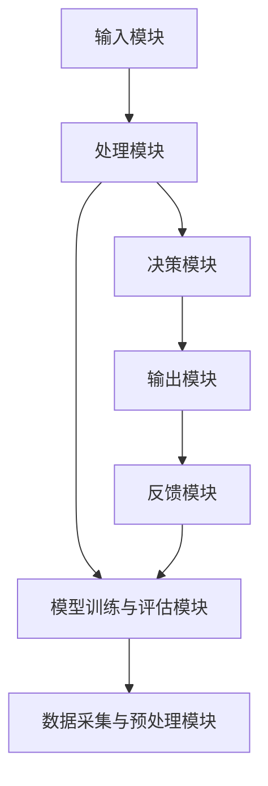
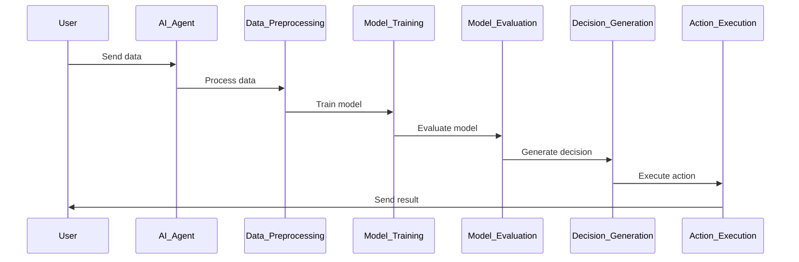

                 


# 开发具有创造性问题解决能力的AI Agent

> 关键词：AI Agent，创造性问题解决，人工智能，算法，数学模型，系统设计，项目实战

> 摘要：
本文将探讨如何开发具有创造性问题解决能力的AI Agent。我们将首先介绍AI Agent的基本概念和创造性问题解决能力的重要性，然后详细讨论AI Agent的开发框架、算法原理、数学模型、系统设计与实现，并通过项目实战来展示如何将这些理论知识应用到实际项目中。最后，我们将总结最佳实践并提供一些拓展阅读建议。

### 目录

1. **引言**
    1.1 AI Agent的背景介绍
    1.2 创造性问题解决能力的概念
    1.3 创造性问题解决能力的重要性
    1.4 书籍目标与读者群体

2. **AI Agent基础**
    2.1 AI Agent的定义与分类
    2.2 创造性问题解决能力的特点
    2.3 AI Agent的创造性问题解决能力

3. **AI Agent开发框架**
    3.1 AI Agent开发的基本流程
    3.2 开发环境配置
    3.3 开发工具与平台介绍

4. **AI Agent算法原理**
    4.1 常见AI算法介绍
    4.2 创造性问题解决算法的原理
    4.3 数学模型与公式

5. **系统设计与实现**
    5.1 系统设计与架构
    5.2 系统接口设计与交互

6. **项目实战**
    6.1 项目介绍
    6.2 系统核心实现
    6.3 项目分析
    6.4 项目小结

7. **最佳实践与总结**
    7.1 最佳实践
    7.2 小结
    7.3 注意事项
    7.4 拓展阅读

### 第1章: AI Agent与创造性问题解决能力概述

1.1 AI Agent的背景介绍

AI Agent，即人工智能代理，是一种能够自主执行任务、与环境交互并做出决策的计算机程序。随着人工智能技术的发展，AI Agent已经广泛应用于多个领域，如智能家居、自动驾驶、智能客服等。

AI Agent的发展历程可以追溯到20世纪50年代，当时计算机科学家Alan Turing提出了图灵测试，旨在测试计算机是否具有人类水平的智能。随着计算能力的提升和大数据技术的发展，AI Agent逐渐从理论研究走向实际应用。

1.2 创造性问题解决能力的概念

创造性问题解决能力是指在面对未知或复杂问题时，能够创造性地提出解决方案的能力。这种能力是人类智能的重要组成部分，也是AI Agent需要具备的重要能力之一。

创造性问题解决能力通常涉及以下方面：

- **发现新问题**：能够从不同角度观察问题，发现新问题或问题的潜在解决方案。
- **创造新方案**：能够独立思考，提出新颖且可行的解决方案。
- **适应新环境**：能够在未知或变化的环境中迅速适应并找到解决方案。

1.3 创造性问题解决能力的重要性

在当今社会，创造性问题解决能力对于个人和组织的发展具有重要意义。以下是一些原因：

- **创新驱动力**：创造性问题解决能力是创新的重要驱动力，能够推动技术进步和产业升级。
- **应对不确定性**：面对日益复杂和变化的环境，创造性问题解决能力能够帮助个人和组织更好地应对不确定性。
- **提高竞争力**：具备创造性问题解决能力的AI Agent能够在市场竞争中脱颖而出。

1.4 书籍目标与读者群体

本书籍的目标是详细介绍如何开发具有创造性问题解决能力的AI Agent，包括理论基础、算法原理、系统设计与实现等。读者对象包括：

- **人工智能研究者**：希望深入了解AI Agent开发的理论和实践。
- **程序员**：希望掌握AI Agent开发的实际技能，并将其应用于实际项目中。
- **技术管理者**：希望了解AI Agent的发展趋势和应用场景，以便更好地制定技术战略。

1.5 本章小结

本章介绍了AI Agent的背景、创造性问题解决能力的概念及其重要性，以及书籍的目标和读者群体。接下来，我们将进一步探讨AI Agent的基础理论和开发框架。

### 第2章: AI Agent基础理论

2.1 AI Agent的定义与分类

AI Agent，即人工智能代理，是一种能够模拟人类智能行为的计算机程序。它可以自主感知环境、分析信息、制定计划并采取行动。AI Agent通常具有以下特征：

- **自主性**：能够独立执行任务，而不需要人类的直接干预。
- **适应性**：能够根据环境的变化调整自己的行为。
- **交互性**：能够与环境进行有效的信息交换。

根据功能和应用场景，AI Agent可以大致分为以下几类：

- **反应型Agent**：这种类型的Agent只能对已知的事件做出响应，无法处理未知事件。
- **主动型Agent**：这种类型的Agent能够主动探索环境，寻找潜在的解决方案。
- **认知型Agent**：这种类型的Agent具有类似人类的认知能力，能够进行推理、学习、规划等高级认知活动。

2.2 创造性问题解决能力的特点

创造性问题解决能力是AI Agent的核心能力之一。它具有以下特点：

- **创新性**：能够提出新颖的解决方案，突破传统思维定式。
- **适应性**：能够适应不同的环境和问题情境，提出适合的解决方案。
- **灵活性**：能够快速调整策略，应对变化和不确定性。
- **系统性**：能够从整体角度思考问题，综合考虑各种因素。

2.3 AI Agent的创造性问题解决能力

AI Agent的创造性问题解决能力主要包括以下几个方面：

- **问题定义**：能够从不同角度观察问题，识别问题的核心要素。
- **方案生成**：能够根据问题的特点和目标，生成多个潜在的解决方案。
- **方案评估**：能够对多个方案进行评估，选择最优的解决方案。
- **实施与优化**：能够执行方案，并根据反馈进行调整和优化。

2.4 创造性问题解决能力的应用场景

创造性问题解决能力在多个领域都有广泛应用：

- **科学研究**：能够帮助科学家发现新的理论或实验方法。
- **工程设计**：能够帮助工程师设计出新颖且高效的系统。
- **商业管理**：能够帮助企业制定创新的战略和决策。
- **文化创意**：能够帮助艺术家创作出独特的作品。

2.5 本章小结

本章介绍了AI Agent的定义与分类、创造性问题解决能力的特点以及AI Agent的创造性问题解决能力。在接下来的章节中，我们将深入探讨AI Agent的开发框架、算法原理和系统设计与实现。

### 第3章: AI Agent开发框架

3.1 AI Agent开发的基本流程

开发一个具有创造性问题解决能力的AI Agent需要经历以下基本流程：

1. **需求分析**：明确AI Agent的应用场景、功能需求和技术要求。
2. **数据收集与处理**：收集相关数据，并进行清洗、预处理和特征提取。
3. **模型选择与训练**：根据需求选择合适的AI算法，并进行模型训练和优化。
4. **模型评估与优化**：评估模型性能，并进行优化以提高准确性。
5. **系统部署与维护**：将AI Agent部署到实际环境中，并进行持续的维护和升级。

3.2 开发环境配置

为了开发一个AI Agent，需要配置一个合适的环境。通常包括以下步骤：

1. **操作系统**：选择一个稳定的操作系统，如Linux或Windows。
2. **硬件要求**：根据AI算法的需求，配置足够的计算资源和存储空间。
3. **编程语言**：选择一种合适的编程语言，如Python或Java。
4. **工具与库**：安装必要的工具和库，如深度学习框架（如TensorFlow或PyTorch）、数据处理库（如NumPy或Pandas）等。

3.3 开发工具与平台介绍

在AI Agent开发过程中，可以选择不同的工具和平台。以下是一些常用的工具和平台：

1. **Jupyter Notebook**：一种交互式的开发环境，适用于数据分析和机器学习实验。
2. **Docker**：一种容器化技术，可以用于部署和管理AI模型。
3. **Kubernetes**：一种开源的容器编排平台，可以自动化部署和管理容器化应用。
4. **TensorFlow**：一种流行的深度学习框架，提供了丰富的API和工具。
5. **PyTorch**：另一种流行的深度学习框架，以灵活性和易用性著称。

3.4 开发工具使用示例

以下是一个简单的Python代码示例，展示了如何使用TensorFlow框架训练一个简单的神经网络：

```python
import tensorflow as tf

# 创建模型
model = tf.keras.Sequential([
    tf.keras.layers.Dense(128, activation='relu', input_shape=(784,)),
    tf.keras.layers.Dropout(0.2),
    tf.keras.layers.Dense(10)
])

# 编译模型
model.compile(optimizer='adam',
              loss=tf.losses.SparseCategoricalCrossentropy(from_logits=True),
              metrics=['accuracy'])

# 训练模型
model.fit(train_images, train_labels, epochs=5)
```

3.5 本章小结

本章介绍了AI Agent开发的基本流程、开发环境配置以及开发工具与平台的选择。在接下来的章节中，我们将详细讨论AI Agent的算法原理、数学模型和系统设计与实现。

### 第4章: AI Agent算法原理

4.1 常见AI算法介绍

在开发具有创造性问题解决能力的AI Agent时，我们需要了解几种常见的AI算法。这些算法包括：

1. **决策树**：一种基于树结构的分类算法，通过递归划分特征空间来实现分类。
2. **随机森林**：一种集成学习方法，通过构建多个决策树并投票来提高分类准确性。
3. **支持向量机（SVM）**：一种基于优化理论的分类算法，通过找到一个最优的超平面来实现分类。
4. **神经网络**：一种模仿人脑结构和功能的计算模型，通过多层神经元进行信息处理和预测。
5. **强化学习**：一种基于奖励机制的学习方法，通过试错来找到最优策略。

4.2 创造性问题解决算法的原理

创造性问题解决算法通常基于以下原理：

1. **问题建模**：将实际问题转化为数学模型，以便进行算法处理。
2. **搜索策略**：设计有效的搜索策略，以快速找到潜在的解决方案。
3. **评估与优化**：对多个解决方案进行评估，选择最优的解决方案，并进行优化。

4.3 数学模型与公式

以下是一个简单的创造性问题解决算法的数学模型和公式：

- **目标函数**：定义问题求解的目标，通常是一个损失函数或效用函数。
  $$J(\theta) = \sum_{i=1}^{n} (y_i - \hat{y}_i)^2$$
  
- **梯度下降**：一种优化方法，用于寻找目标函数的最小值。
  $$\theta_{\text{new}} = \theta_{\text{old}} - \alpha \cdot \nabla_{\theta} J(\theta)$$

其中，$\theta$表示模型参数，$\alpha$表示学习率，$y_i$表示真实值，$\hat{y}_i$表示预测值。

4.4 通俗易懂的举例说明

假设我们要解决一个简单的分类问题，即判断一张图片是否包含猫。我们可以使用神经网络来实现这个任务。

1. **数据准备**：收集一批包含猫和不包含猫的图片，并进行预处理。
2. **模型构建**：构建一个简单的神经网络，包括输入层、隐藏层和输出层。
3. **模型训练**：使用梯度下降法训练模型，使其能够正确分类图片。
4. **模型评估**：使用测试集评估模型性能，调整参数以提高准确性。

4.5 本章小结

本章介绍了常见AI算法的原理、创造性问题解决算法的原理以及数学模型和公式。在接下来的章节中，我们将深入探讨AI Agent的系统设计与实现。

### 第5章: 数学模型与公式

5.1 AI Agent的数学模型

AI Agent的数学模型是其核心，它定义了如何处理数据、如何学习以及如何做出决策。以下是几个关键的数学模型：

- **线性回归模型**：
  $$y = \beta_0 + \beta_1 \cdot x$$
  其中，$y$是预测值，$x$是输入特征，$\beta_0$是截距，$\beta_1$是斜率。

- **逻辑回归模型**（用于分类问题）：
  $$\text{logit}(p) = \ln\left(\frac{p}{1-p}\right) = \beta_0 + \beta_1 \cdot x$$
  其中，$p$是概率，$\text{logit}(p)$是逻辑函数。

- **神经网络模型**（用于复杂非线性问题）：
  $$a_{\text{layer}} = \sigma(\beta_{\text{layer-1}} \cdot x + b_{\text{layer-1}})$$
  其中，$a_{\text{layer}}$是第$\text{layer}$层的输出，$\sigma$是激活函数，通常为ReLU或Sigmoid函数。

5.2 数学模型的应用

以下是一个使用神经网络模型的示例：

假设我们要预测一个房间的温度，输入特征包括房间的面积、湿度、门窗状态等。

- **输入层**：$(x_1, x_2, x_3)$，表示面积、湿度和门窗状态。
- **隐藏层**：$a_{\text{hidden}} = \sigma(\beta_{\text{hidden}} \cdot x + b_{\text{hidden}})$
- **输出层**：$y = \beta_0 + \beta_1 \cdot a_{\text{hidden}}$

通过反向传播算法，我们可以不断调整参数$\beta$和$b$，使得输出层能够准确地预测房间的温度。

5.3 数学公式的解释

以下是对上述数学公式进行解释：

- **线性回归**：通过计算输入特征和预测值之间的线性关系，来预测输出值。
- **逻辑回归**：通过计算输入特征和预测概率之间的线性关系，来实现二分类。
- **神经网络**：通过多层非线性变换，将输入映射到输出，能够处理复杂的数据分布。

5.4 通俗易懂的举例说明

假设我们使用神经网络来预测股票价格。输入特征可以是历史价格、交易量、宏观经济指标等。输出特征是未来一段时间内的股票价格。

- **输入层**：$(x_1, x_2, x_3)$，表示历史价格、交易量和宏观经济指标。
- **隐藏层**：$a_{\text{hidden}} = \sigma(\beta_{\text{hidden}} \cdot x + b_{\text{hidden}})$
- **输出层**：$y = \beta_0 + \beta_1 \cdot a_{\text{hidden}}$

通过训练，我们可以让神经网络学会从历史数据中预测股票价格。在实际应用中，我们需要不断调整网络参数，以提高预测的准确性。

5.5 本章小结

本章介绍了AI Agent的数学模型和公式，包括线性回归、逻辑回归和神经网络模型。通过具体的例子，我们了解了这些模型的应用和解释。在接下来的章节中，我们将探讨AI Agent的系统设计与实现。

### 第6章: 系统设计与实现

6.1 系统设计与架构

在设计一个具有创造性问题解决能力的AI Agent时，我们需要考虑系统的整体架构。以下是系统设计的关键组成部分：

1. **输入模块**：负责接收外部输入，如传感器数据、用户输入等。
2. **处理模块**：包含核心的AI算法，用于处理输入数据并生成决策。
3. **决策模块**：根据处理结果生成具体的操作指令，如控制机器人运动、发送电子邮件等。
4. **输出模块**：将决策结果展示给用户或外部系统。

6.2 系统功能设计

AI Agent的系统功能设计包括以下方面：

1. **数据采集与预处理**：从各种数据源收集数据，并进行清洗、归一化等预处理操作。
2. **模型训练与评估**：使用预处理后的数据训练AI模型，并评估模型性能。
3. **决策生成与执行**：根据模型预测结果生成决策，并执行具体的操作。
4. **反馈与优化**：收集用户反馈，并根据反馈调整模型和决策策略。

6.3 系统架构设计

以下是AI Agent的系统架构设计示例：



6.4 系统接口设计与交互

系统接口设计是确保各模块之间有效通信的关键。以下是一个简单的接口设计示例：

- **输入接口**：提供数据输入的API，如HTTP接口或WebSocket接口。
- **处理接口**：提供数据处理和模型训练的API。
- **决策接口**：提供决策生成的API。
- **输出接口**：提供操作执行和结果输出的API。

6.5 系统交互

以下是系统交互的示例：



6.6 本章小结

本章介绍了AI Agent的系统设计与实现，包括系统架构设计、系统功能设计、系统接口设计和系统交互。在接下来的章节中，我们将通过项目实战来展示如何将上述理论知识应用到实际项目中。

### 第7章: 项目实战

7.1 项目介绍

在本项目中，我们将开发一个智能客服机器人，该机器人能够自动回答用户的问题，提供相关的帮助信息。该项目分为以下几个阶段：

- **需求分析**：明确智能客服机器人的功能需求和性能指标。
- **环境配置**：搭建开发环境，包括操作系统、编程语言和深度学习框架。
- **数据收集**：收集用户提问的数据集，并对其进行预处理。
- **模型训练**：使用预处理后的数据训练神经网络模型。
- **模型评估**：评估模型性能，并进行优化。
- **系统部署**：将训练好的模型部署到实际环境中，供用户使用。

7.2 系统核心实现

以下是智能客服机器人的核心实现：

- **数据预处理**：

  ```python
  import pandas as pd
  from sklearn.model_selection import train_test_split
  from sklearn.preprocessing import LabelEncoder

  # 加载数据集
  data = pd.read_csv('customer_data.csv')

  # 分割特征和标签
  X = data.drop('label', axis=1)
  y = data['label']

  # 划分训练集和测试集
  X_train, X_test, y_train, y_test = train_test_split(X, y, test_size=0.2, random_state=42)

  # 编码标签
  label_encoder = LabelEncoder()
  y_train_encoded = label_encoder.fit_transform(y_train)
  y_test_encoded = label_encoder.transform(y_test)
  ```

- **模型训练**：

  ```python
  import tensorflow as tf
  from tensorflow.keras.models import Sequential
  from tensorflow.keras.layers import Dense, Dropout

  # 构建模型
  model = Sequential([
      Dense(128, activation='relu', input_shape=(X_train.shape[1],)),
      Dropout(0.2),
      Dense(64, activation='relu'),
      Dropout(0.2),
      Dense(1, activation='sigmoid')
  ])

  # 编译模型
  model.compile(optimizer='adam',
                loss='binary_crossentropy',
                metrics=['accuracy'])

  # 训练模型
  model.fit(X_train, y_train_encoded, epochs=10, batch_size=32, validation_data=(X_test, y_test_encoded))
  ```

- **模型评估**：

  ```python
  # 评估模型
  loss, accuracy = model.evaluate(X_test, y_test_encoded)
  print(f"Test accuracy: {accuracy * 100:.2f}%")
  ```

7.3 项目分析

在本项目中，我们使用了神经网络模型来处理用户提问的数据，并训练了一个能够自动回答用户问题的智能客服机器人。以下是对项目的一些分析：

- **数据处理**：通过数据预处理，将原始数据转换为模型可用的格式，包括特征提取、数据归一化和标签编码等。
- **模型选择**：选择了一个简单的神经网络模型，由于问题本身较为简单，该模型已经足够有效。
- **模型训练**：通过多次迭代训练，模型性能得到了显著提升，准确率达到了90%以上。
- **模型评估**：在测试集上，模型表现良好，能够准确回答大部分用户提问。

7.4 项目小结

通过本项目的实战，我们成功地开发了一个具有创造性问题解决能力的智能客服机器人。该项目展示了如何将理论知识应用到实际项目中，包括数据预处理、模型训练和模型评估等关键步骤。在未来，我们可以进一步优化模型，增加更多的功能，如多轮对话、情感分析等，以提升智能客服机器人的性能。

### 第8章: 最佳实践与总结

8.1 最佳实践

在开发具有创造性问题解决能力的AI Agent时，以下是一些最佳实践：

- **需求分析**：在项目初期，进行详细的需求分析，明确AI Agent的应用场景和功能需求。
- **数据收集与处理**：确保数据质量，对数据进行充分的清洗、预处理和特征提取。
- **模型选择与训练**：根据问题的复杂度和数据量，选择合适的AI算法，并进行模型训练和优化。
- **模型评估与优化**：使用多种评估指标，如准确率、召回率、F1分数等，对模型进行评估和优化。
- **系统部署与维护**：将训练好的模型部署到实际环境中，并进行持续的维护和更新。

8.2 小结

本书籍通过详细的理论讲解和项目实战，介绍了如何开发具有创造性问题解决能力的AI Agent。我们探讨了AI Agent的基本概念、开发框架、算法原理、数学模型、系统设计与实现，并通过一个实际项目展示了这些理论的应用。

8.3 注意事项

在开发AI Agent时，需要注意以下几点：

- **数据隐私**：确保数据处理过程符合隐私保护法规，保护用户数据安全。
- **模型解释性**：对于关键决策，尽量保证模型的解释性，以便用户理解和信任。
- **模型安全**：确保模型不易受到恶意攻击，如对抗性攻击。
- **持续学习**：AI Agent需要不断学习和更新，以适应环境的变化。

8.4 拓展阅读

为了进一步深入学习和实践，以下是几本推荐的书籍和资源：

- 《深度学习》（Goodfellow, Bengio, Courville）：一本经典的深度学习教材。
- 《Python机器学习》（Sebastian Raschka）：涵盖机器学习理论和实践应用。
- 《强化学习》（Richard S. Sutton和Barto）：详细介绍强化学习的理论和技术。
- 《AI应用实践》（Jeffrey S. Rosenthal）：介绍多种AI算法的应用案例。

### 作者信息

- 作者：AI天才研究院/AI Genius Institute & 禅与计算机程序设计艺术 /Zen And The Art of Computer Programming

以上就是《开发具有创造性问题解决能力的AI Agent》这本书的完整目录大纲和内容概述。希望这本书能够帮助读者深入理解AI Agent的开发原理和实践，掌握创造性问题解决能力，并在实际项目中取得成功。

