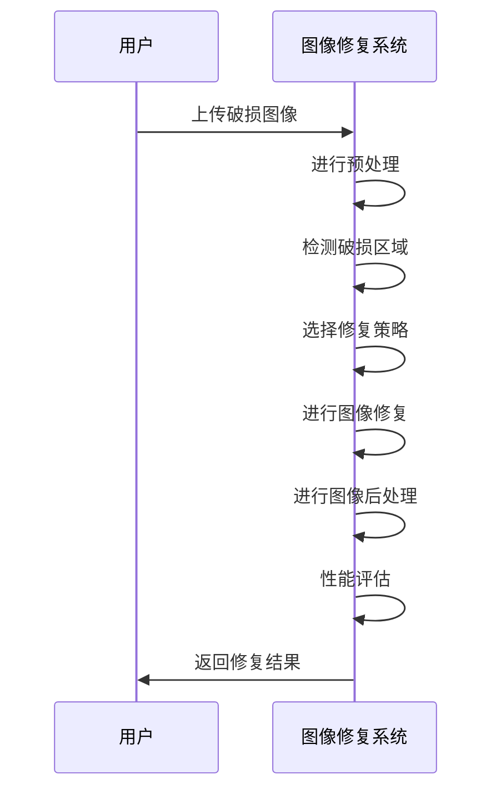

                 

### 引言

在现代信息技术的飞速发展背景下，图像修复技术在各个领域得到了广泛应用，如医疗影像、数字娱乐、文化遗产保护等。图像修复的目的是恢复受损或缺失的图像内容，使其尽可能恢复到原始状态。然而，传统的图像修复方法往往依赖于大量的手工操作和预设规则，效率低下且效果有限。随着人工智能和深度学习技术的不断进步，开发具有图像修复能力的AI Agent成为了一个备受关注的研究方向。

本书旨在系统地介绍如何开发具有图像修复能力的AI Agent。首先，我们将探讨图像修复AI Agent的背景和需求，了解当前图像修复领域的发展现状和存在的问题。接下来，我们将深入分析图像修复的基本概念，包括图像修复的定义、分类和关键技术。在此基础上，我们将详细讲解图像修复的算法原理，包括传统算法和深度学习算法，并通过数学模型和实例进行深入剖析。

随后，我们将探讨图像修复系统的分析与架构设计，包括系统功能设计、系统架构设计、系统接口设计和系统交互设计。通过这些环节，我们将全面了解图像修复系统的实现方法和优化策略。

在项目实战部分，我们将通过具体案例展示如何进行图像修复系统的开发，包括环境安装、系统核心实现、代码应用解读与分析以及实际案例的详细讲解。最后，我们将总结图像修复的最佳实践，并提供未来发展的展望。

通过这本书的阅读，读者将能够全面掌握图像修复AI Agent的开发方法和应用技巧，为实际项目提供有力的技术支持。无论你是图像处理领域的初学者，还是经验丰富的开发者，本书都将为你带来全新的视角和深刻的启发。

### 关键词

- 图像修复
- AI Agent
- 深度学习
- 算法原理
- 系统架构设计
- 数学模型
- 项目实战

### 摘要

本书围绕开发具有图像修复能力的AI Agent这一主题，系统地介绍了图像修复技术的背景、基本概念、算法原理、系统分析与架构设计，以及项目实战与最佳实践。首先，通过介绍图像修复的需求和现状，明确了图像修复AI Agent的定义和目标。接着，详细阐述了图像修复的基本概念、分类和关键技术，为后续算法原理的讲解打下基础。书中重点介绍了传统图像修复算法和深度学习算法，并通过具体的数学模型和实例进行了深入分析。随后，探讨了图像修复系统的分析与架构设计，包括系统功能设计、架构设计、接口设计和交互设计。最后，通过实际项目案例的展示，详细讲解了图像修复系统的开发过程，并总结了最佳实践与未来发展趋势。本书旨在为读者提供全面、系统的图像修复AI Agent开发指南。

### 图像修复AI Agent的背景介绍

#### 1.1 问题背景

图像修复技术，作为计算机视觉领域的一个重要研究方向，具有广泛的应用背景。在日常生活中，图像修复的需求无处不在。例如，在照片编辑过程中，人们常常需要修复照片中的瑕疵，如去除皮肤上的痘痘、抹去背景中的杂乱元素等。在数字艺术创作中，图像修复技术可以帮助艺术家恢复作品中的细节，增强作品的视觉效果。在医疗影像领域，图像修复技术能够填补影像中的缺失部分，提高影像的诊断准确性。

然而，传统的图像修复方法存在诸多局限。首先，这些方法通常依赖于手工操作，修复过程繁琐且效率低下。其次，传统方法往往基于预设的规则或模板，缺乏灵活性，难以处理复杂和多样化的修复任务。此外，传统方法在处理大面积损伤或结构复杂的情况时，效果往往不理想。

随着人工智能和深度学习技术的快速发展，图像修复领域迎来了新的契机。AI Agent的出现，使得图像修复过程变得更加智能化和自动化。通过深度学习算法，AI Agent能够从大量的图像数据中学习到修复的规律和策略，从而实现高效的图像修复。这不仅提高了修复效率，还显著提升了修复质量。

综上所述，开发具有图像修复能力的AI Agent，不仅能够满足日益增长的图像修复需求，还能突破传统方法的局限，为图像处理领域带来革命性的变革。

#### 1.2 图像修复的现状

目前，图像修复技术在多个领域取得了显著的进展。在医疗影像领域，深度学习算法已经被广泛应用于病变区域的填补和图像增强，提高了诊断的准确性和效率。例如，通过使用卷积神经网络（CNN），AI Agent能够自动识别并修复医学影像中的缺失部分，如CT扫描中的空洞或MRI中的噪声区域。

在数字娱乐领域，图像修复技术同样取得了巨大的成功。在视频编辑和游戏开发中，AI Agent能够实时修复画面中的破损或丢失的部分，提升视觉效果。例如，在电影制作中，AI Agent可以通过学习大量的影视作品，自动修复画面中的镜头破损，增强画面的连贯性和观感。

文化遗产保护也是图像修复技术的一个重要应用领域。通过使用深度学习算法，AI Agent能够恢复古建筑、名画等文化遗产中的破损部分，再现历史风貌。这不仅有助于保护文化遗产，还能为观众提供更真实的观赏体验。

然而，尽管图像修复技术取得了显著进展，仍面临一些挑战。首先，不同应用场景下的图像修复需求多样且复杂，需要AI Agent具备强大的适应能力和灵活性。其次，图像修复算法的鲁棒性和泛化能力仍需进一步提升，以确保在各种复杂环境下都能实现高质量的修复效果。此外，图像修复技术的高效实现和实时处理能力也是未来需要解决的重要问题。

总之，随着人工智能和深度学习技术的不断发展，图像修复技术将在更多领域发挥重要作用。尽管目前仍面临一些挑战，但通过持续的研究和优化，图像修复AI Agent有望在各个领域实现更广泛的应用和更高的修复质量。

#### 1.3 图像修复AI Agent的定义与目标

图像修复AI Agent，是指通过人工智能技术，特别是深度学习算法，开发出的能够自动、智能地修复图像中的破损、缺失或瑕疵的计算机程序。其核心目标是提高图像修复的效率和质量，实现自动化和个性化的修复过程。

具体而言，图像修复AI Agent具有以下几个关键功能：

1. **自动检测**：AI Agent能够自动识别图像中的破损或缺失部分，无需人工干预。这一功能依赖于深度学习算法中的图像识别能力，通过训练大量的图像数据，AI Agent能够准确判断图像中的关键区域。

2. **自适应修复**：AI Agent可以根据不同的图像破损程度和类型，自适应地选择最佳的修复策略。例如，对于轻微破损的图像，AI Agent可以选择简单的填充方法；而对于大面积缺失的图像，则可能需要使用更复杂的修复算法。

3. **多模态修复**：AI Agent不仅能够处理单通道的灰度图像，还能够处理多通道的彩色图像。通过融合不同模态的信息，AI Agent可以更精确地恢复图像的细节和颜色，提升修复效果。

4. **实时修复**：AI Agent能够在短时间内完成图像修复任务，具备实时处理能力。这对于视频编辑和在线应用场景尤为重要，确保了用户能够实时获得修复后的图像。

5. **用户交互**：AI Agent能够与用户进行互动，接收用户的修复需求和反馈，动态调整修复策略。这种交互性使得AI Agent能够更好地满足用户的个性化需求。

综上所述，图像修复AI Agent的目标是打造一个高效、智能、灵活的图像修复平台，通过深度学习和人工智能技术，实现图像修复过程的自动化和智能化。这不仅提升了图像修复的效率和质量，也为用户提供了更便捷、个性化的服务。

### 图像修复的基本概念

#### 2.1 图像修复的定义

图像修复，是指通过特定的算法和技术手段，对受损或缺失的图像内容进行恢复和重建，使其尽可能接近原始状态。图像修复的主要目标是恢复图像的完整性，增强图像的视觉质量，并尽可能保留图像中的细节和色彩信息。

图像修复技术的应用场景非常广泛，主要包括以下几个方面：

1. **医疗影像**：在医学影像中，图像修复技术可以用于填补缺失的部分，如CT扫描中的空洞、MRI中的噪声区域等。这些修复可以帮助医生更准确地诊断病情。

2. **数字娱乐**：在影视制作和游戏开发中，图像修复技术能够修复画面中的破损或丢失的部分，提升视觉效果。例如，在电影拍摄过程中，AI Agent可以自动修复镜头中的杂音或破损。

3. **文化遗产保护**：通过图像修复技术，古建筑、名画等文化遗产中的破损部分可以得到恢复，再现历史风貌，为观众提供更真实的观赏体验。

4. **日常生活**：在摄影和照片编辑中，图像修复技术可以帮助用户去除照片中的瑕疵，如痘痘、杂乱的背景等，提升照片的质量。

图像修复技术的关键要素包括：

- **图像质量**：修复后的图像应尽可能接近原始图像的质量，包括色彩、对比度和清晰度等。
- **修复精度**：修复技术应能够精确地识别并恢复图像中的破损部分，避免过度修复或修复不足。
- **效率**：图像修复过程应尽可能高效，以适应实时处理的需求，如视频编辑等场景。

#### 2.2 图像修复的分类

图像修复技术可以根据不同的修复目标和算法类型进行分类，主要分为以下几种：

1. **基于局部图像修复的方法**：
   - **复制填充法**：通过复制邻近区域的像素来填充破损区域。这种方法简单有效，但修复效果通常较为有限。
   - **插值法**：利用插值算法（如线性插值、双线性插值等）来填补破损区域。这种方法较为常用，但在处理复杂破损时效果不佳。
   - **纹理迁移法**：通过迁移相似纹理来修复破损区域。这种方法可以更好地保留图像的细节和纹理信息。

2. **基于全局图像修复的方法**：
   - **基于模型的方法**：通过构建图像修复模型（如生成对抗网络GAN等）来生成破损区域的像素。这种方法能够生成更高质量的修复结果，但计算复杂度较高。
   - **基于约束的方法**：通过引入图像先验知识（如图像一致性、边缘保持等）来指导修复过程。这种方法可以在保持图像一致性的同时修复破损部分。

3. **混合方法**：
   - **结合多种技术的方法**：结合局部和全局修复方法，取长补短，以获得更高质量的修复效果。例如，可以先使用局部修复方法进行初步修复，再使用全局修复方法进行精细调整。

每种图像修复方法都有其适用的场景和优缺点。在实际应用中，常常需要根据具体的修复需求和图像特性选择合适的方法。

#### 2.3 图像修复的关键技术

图像修复技术的发展离不开关键技术的支持，主要包括以下几种：

1. **深度学习技术**：
   - **卷积神经网络（CNN）**：CNN是一种经典的深度学习模型，广泛应用于图像识别和分类任务。通过多层卷积和池化操作，CNN能够提取图像中的关键特征，并用于图像修复。
   - **生成对抗网络（GAN）**：GAN由生成器和判别器组成，通过对抗训练生成高质量的图像。GAN在图像修复中表现出色，能够生成与原始图像高度相似的区域。

2. **图像重建技术**：
   - **稀疏编码**：稀疏编码通过学习图像的稀疏表示，保留图像的主要特征，去除冗余信息。这种方法在图像修复中可用于恢复图像的细节。
   - **非局部均值滤波**：非局部均值滤波通过考虑图像中不同区域的像素关系，对破损区域进行修复。这种方法在处理复杂破损时效果显著。

3. **图像增强技术**：
   - **图像去噪**：图像去噪技术用于去除图像中的噪声，提高图像质量。常见的去噪方法包括小波变换、傅里叶变换等。
   - **图像锐化**：图像锐化技术用于增强图像的边缘和细节，提升图像的清晰度。常见的锐化方法包括拉普拉斯变换、高斯锐化等。

4. **图像合成技术**：
   - **图像融合**：图像融合技术通过融合多张图像的信息，生成一张更高质量的图像。这种方法在图像修复中可用于补充破损部分的信息。
   - **图像复制**：图像复制技术通过复制图像中的相似部分来填补破损区域，如基于特征匹配的图像复制。

这些关键技术的融合和应用，使得图像修复技术不断进步，为图像修复领域带来了更多的可能性。

#### 2.4 图像修复与相关领域的联系

图像修复技术与其他相关领域有着密切的联系，共同推动计算机视觉和人工智能的发展。以下是几个主要领域的联系：

1. **计算机视觉**：图像修复是计算机视觉的一个重要分支，涉及图像识别、图像增强、图像分割等技术。通过计算机视觉技术，图像修复AI Agent能够更准确地检测和识别图像中的破损部分。

2. **人工智能**：深度学习和机器学习技术是图像修复的核心驱动力。通过大量的训练数据和先进的算法模型，AI Agent能够学习并优化图像修复策略，提高修复效果。

3. **数据挖掘**：图像修复过程涉及大量图像数据的处理和分析。数据挖掘技术可以帮助识别图像中的模式，优化修复算法，提升图像修复的效率和精度。

4. **图像处理**：图像修复技术依赖于图像处理的基础算法，如插值、滤波、边缘检测等。通过这些算法，图像修复AI Agent能够更有效地处理破损图像，实现高质量的修复。

5. **自然语言处理**：在图像修复中，有时需要结合自然语言处理技术进行标注和描述。例如，在医疗影像中，AI Agent可以通过自然语言处理技术理解医生的诊断报告，从而更好地指导图像修复过程。

这些领域的交叉应用，使得图像修复技术不断进步，为各个领域带来了创新性的解决方案。

#### 2.5 图像修复的应用案例

图像修复技术在多个领域取得了显著的应用成果，以下是几个典型的应用案例：

1. **医学影像**：在医学影像领域，图像修复技术被广泛应用于CT扫描和MRI图像的修复。通过修复缺失的部分，医生可以更准确地诊断病情，提高诊断的准确性。

2. **数字娱乐**：在影视制作和游戏开发中，图像修复技术用于修复画面中的破损或缺失的部分，提升视觉效果。例如，在电影《阿凡达》中，图像修复技术被用于修复拍摄过程中的破损镜头，确保画面的连贯性。

3. **文化遗产保护**：图像修复技术被用于修复古建筑、名画等文化遗产中的破损部分。通过恢复历史文物中的细节，图像修复技术为文化遗产的保护和研究提供了重要支持。

4. **日常摄影**：在摄影和照片编辑中，图像修复技术可以帮助用户去除照片中的瑕疵，如痘痘、杂乱的背景等，提升照片的质量。

5. **卫星遥感**：在卫星遥感图像中，图像修复技术用于修复因大气、光照等影响而导致的图像噪声和破损。通过修复图像，科学家可以更准确地分析地球表面的环境和变化。

这些应用案例展示了图像修复技术的广泛适用性和巨大潜力，随着技术的不断进步，图像修复将在更多领域发挥重要作用。

### 图像修复的算法原理

#### 3.1 传统图像修复算法

图像修复的传统算法主要基于局部图像修复的方法，这些方法通过复制邻近区域的像素、插值方法或纹理迁移来填补图像中的破损部分。以下是几种典型的传统图像修复算法：

1. **复制填充法**：
   - 基本原理：复制填充法通过将破损区域附近的像素直接复制到破损区域。这种方法简单有效，但修复效果通常较为有限，特别是在破损区域较大或细节较多时。
   - 适用场景：适用于修复小面积破损的图像，如皮肤瑕疵的去除。
   - 优缺点：优点是计算简单，速度快；缺点是修复效果有限，难以保留细节。

2. **插值法**：
   - 基本原理：插值法通过在破损区域周围选择多个点，利用线性插值、双线性插值或双三次插值等方法，生成新的像素值来填补破损区域。这种方法可以较好地保持图像的连续性和平滑度。
   - 适用场景：适用于修复边缘平滑的区域，如图像的裁剪和缩放。
   - 优缺点：优点是计算相对简单，修复效果较好；缺点是难以处理复杂和多样的破损。

3. **纹理迁移法**：
   - 基本原理：纹理迁移法通过迁移相似纹理来修复破损区域。首先，在图像中找到与破损区域相似的纹理区域，然后将其纹理复制到破损区域。这种方法可以较好地保留图像的细节和纹理信息。
   - 适用场景：适用于修复破损区域包含纹理信息的图像，如图像中的破损壁画或织物。
   - 优缺点：优点是能够较好地保留图像的细节和纹理；缺点是需要找到相似纹理区域，计算复杂度较高。

#### 3.2 深度学习在图像修复中的应用

随着深度学习技术的不断发展，图像修复算法取得了显著突破。基于深度学习的图像修复算法通过训练大量的图像数据，学习到图像修复的复杂模式和策略，实现了更高质量的修复效果。以下是几种常见的基于深度学习的图像修复算法：

1. **生成对抗网络（GAN）**：
   - 基本原理：生成对抗网络由生成器和判别器组成。生成器生成伪造的修复图像，判别器判断这些图像的真实性。通过对抗训练，生成器逐渐学习到生成高质量修复图像的技巧。
   - 适用场景：适用于修复大面积破损的图像，如卫星遥感图像或医学影像。
   - 优缺点：优点是能够生成高质量的修复图像，适应性强；缺点是计算复杂度较高，训练过程需要大量数据和计算资源。

2. **条件生成对抗网络（cGAN）**：
   - 基本原理：条件生成对抗网络在GAN的基础上引入了条件信息，如标签或输入图像的某些特征。这些条件信息有助于生成器更准确地生成修复图像。
   - 适用场景：适用于需要结合条件信息的图像修复任务，如基于标签的图像修复或图像风格转换。
   - 优缺点：优点是能够结合条件信息生成更准确的修复图像；缺点是训练过程较为复杂，对数据质量要求较高。

3. **卷积神经网络（CNN）**：
   - 基本原理：卷积神经网络通过多层卷积和池化操作，提取图像中的关键特征，并用于图像修复。CNN具有强大的特征提取和分类能力，可以用于修复复杂和多样化的破损图像。
   - 适用场景：适用于各种图像修复任务，包括医学影像修复、视频修复和艺术修复等。
   - 优缺点：优点是计算效率高，适用范围广；缺点是训练过程需要大量数据和计算资源，对网络结构设计要求较高。

通过比较传统图像修复算法和基于深度学习的图像修复算法，我们可以发现，深度学习算法在图像修复中具有显著优势。首先，深度学习算法能够自动学习图像修复的复杂模式，无需手工设计规则，具有更强的适应能力。其次，深度学习算法能够生成高质量的修复图像，保留更多的细节和纹理信息。此外，深度学习算法还可以通过迁移学习和多任务学习，进一步提高修复效果和泛化能力。

综上所述，深度学习技术在图像修复中的应用，为图像修复领域带来了革命性的变革，推动了图像修复技术的不断进步。随着深度学习技术的不断发展，图像修复算法将继续优化和改进，为各个领域提供更高效、更智能的解决方案。

#### 3.3 图像修复算法的比较与选择

在图像修复领域，传统算法与基于深度学习的算法各有优缺点。为了选择合适的算法，我们需要从多个维度进行比较。

首先，从修复效果来看，基于深度学习的算法通常优于传统算法。深度学习算法通过大规模数据和复杂网络结构，能够更好地学习图像修复的规律，生成更自然、更高质量的修复图像。相比之下，传统算法在处理复杂破损时，往往难以达到理想的修复效果。

其次，从计算复杂度和效率来看，传统算法通常更高效。传统算法如复制填充法和插值法，计算过程简单，计算量相对较小，适用于实时处理和大规模图像修复任务。而基于深度学习的算法，尤其是GAN和cGAN，需要大量的计算资源和训练时间，不适合实时处理。

再者，从适用范围来看，深度学习算法具有更高的灵活性。深度学习算法能够处理各种复杂和多样化的图像破损，如大面积破损、纹理复杂的情况。而传统算法在处理特定类型的破损时效果较好，但难以适应多种场景。

在具体选择算法时，需要根据以下因素进行考虑：

1. **应用场景**：如果应用场景对修复速度要求较高，可以选择传统算法。例如，在视频编辑和实时图像处理中，传统算法具有明显的优势。如果应用场景对修复质量要求较高，可以选择基于深度学习的算法。

2. **图像破损类型**：对于大面积破损或复杂纹理的图像，基于深度学习的算法能够提供更高质量的修复结果。对于小面积破损或简单的边缘破损，传统算法可能更为适用。

3. **计算资源和时间**：如果计算资源和时间充足，可以选择基于深度学习的算法进行训练和优化。如果资源和时间有限，可以选择传统算法进行快速修复。

4. **修复目标**：如果修复目标主要是保持图像的视觉效果，可以选择基于深度学习的算法。如果修复目标主要是恢复图像的结构和形状，可以选择传统算法。

综上所述，选择图像修复算法时，需要综合考虑应用场景、图像破损类型、计算资源和修复目标等因素。通过合理选择和优化算法，可以最大限度地提高图像修复的质量和效率。

### 图像修复的数学模型

图像修复的过程可以通过数学模型来描述，这些模型不仅帮助我们理解图像修复的原理，还能够指导算法的实现和优化。以下是图像修复中常用的数学模型和公式，以及它们在图像修复中的应用。

#### 4.1 图像修复的数学公式

图像修复的基本任务是将破损的图像区域恢复到原始状态。这一过程可以通过以下数学公式来描述：

$$
\text{修复图像} = \text{原始图像} + \text{修复操作}
$$

其中，修复操作可以是填充、插值或生成等。

1. **基于插值的修复**：
   - 线性插值：
     $$
     I(x, y) = \frac{1}{4} \left( I_{\text{left}}(x, y) + I_{\text{right}}(x, y) + I_{\text{up}}(x, y) + I_{\text{down}}(x, y) \right)
     $$
   - 双线性插值：
     $$
     I(x, y) = \frac{1}{4} \left( I_{\text{left-up}}(x, y) + I_{\text{left-down}}(x, y) + I_{\text{right-up}}(x, y) + I_{\text{right-down}}(x, y) \right)
     $$
   - 双三次插值：
     $$
     I(x, y) = \sum_{i} \sum_{j} B_i(x) B_j(y) I(i, j)
     $$

   其中，$I(x, y)$ 表示修复后的图像像素值，$I_{\text{left}}(x, y)$、$I_{\text{right}}(x, y)$、$I_{\text{up}}(x, y)$、$I_{\text{down}}(x, y)$ 分别表示左、右、上、下相邻像素的值，$B_i(x)$、$B_j(y)$ 分别为双线性或双三次插值基函数。

2. **基于生成的修复**：
   - 生成对抗网络（GAN）的基本公式：
     $$
     G(z) = \text{生成器}(\text{随机噪声} z) \rightarrow \text{修复图像}
     $$
     $$
     D(x) = \text{判别器}(\text{真实图像} x) \rightarrow \text{概率}
     $$
     $$
     D(G(z)) = \text{判别器}(\text{生成图像} G(z)) \rightarrow \text{概率}
     $$

   其中，$G(z)$ 为生成器，$D(x)$ 为判别器，$z$ 为随机噪声，$x$ 为真实图像，$G(z)$ 生成伪造的修复图像，$D(x)$ 和 $D(G(z))$ 分别判断图像的真实性和伪造性。

3. **基于约束的修复**：
   - 图像一致性约束：
     $$
     \min_{I'} \sum_{i, j} \left( I'(i, j) - \sum_{k} w_k I''(i, j, k) \right)^2
     $$
     其中，$I'$ 为修复后的图像，$I''(i, j, k)$ 为图像的局部特征，$w_k$ 为权重。

这些数学模型和公式在图像修复中有着广泛的应用，通过合理选择和优化，可以显著提升图像修复的效果和质量。

#### 4.2 图像修复算法流程

图像修复算法通常包括以下几个步骤：

1. **图像预处理**：
   - 输入破损图像，进行去噪、灰度化等预处理操作，提高图像质量。
   - 使用边缘检测算法（如Canny算法）提取图像的边缘信息。

2. **破损区域检测**：
   - 使用边缘信息进行破损区域检测，识别图像中的破损部分。
   - 对于复杂的破损图像，可能需要结合其他特征（如颜色、纹理）进行更准确的检测。

3. **修复策略选择**：
   - 根据破损区域的类型和程度，选择合适的修复策略。例如，对于小面积的破损，可以选择插值法；对于大面积的破损，可以选择基于深度学习的算法。

4. **图像修复**：
   - 使用选定的修复策略，对破损区域进行修复。对于插值法，根据周围的像素值进行插值计算；对于深度学习方法，通过生成器和判别器生成修复图像。

5. **图像后处理**：
   - 对修复后的图像进行后处理，如锐化、色彩调整等，以提升图像的整体视觉效果。
   - 检查修复结果，对不满意的区域进行局部调整。

通过上述流程，图像修复算法能够有效地恢复破损图像的细节和质量，为各种应用场景提供可靠的图像修复解决方案。

#### 4.3 图像修复算法的性能评估

图像修复算法的性能评估是确保修复效果的重要环节，常用的评估指标包括峰值信噪比（PSNR）、结构相似性指数（SSIM）和视觉质量评分（VQF）等。

1. **峰值信噪比（PSNR）**：
   - 峰值信噪比用于衡量修复图像与原始图像之间的差异。其计算公式为：
     $$
     \text{PSNR} = 10 \log_{10} \left( \frac{P_{\text{max}}^2}{\text{MSE}} \right)
     $$
     其中，$P_{\text{max}}$ 为像素值的最大值，MSE 为均方误差，计算公式为：
     $$
     \text{MSE} = \frac{1}{n} \sum_{i=1}^{n} (I_{\text{original}}(i) - I_{\text{repaired}}(i))^2
     $$
     $I_{\text{original}}(i)$ 和 $I_{\text{repaired}}(i)$ 分别为原始图像和修复图像的像素值。

2. **结构相似性指数（SSIM）**：
   - 结构相似性指数用于衡量图像的视觉质量。其计算公式为：
     $$
     \text{SSIM}(x, y) = \frac{(2\mu_x\mu_y + C_1)(2\sigma_{xy} + C_2)}{(\mu_x^2 + \mu_y^2 + C_1)(\sigma_x^2 + \sigma_y^2 + C_2)}
     $$
     其中，$\mu_x$ 和 $\mu_y$ 分别为图像 $x$ 和 $y$ 的均值，$\sigma_x^2$ 和 $\sigma_y^2$ 分别为图像 $x$ 和 $y$ 的方差，$\sigma_{xy}$ 为协方差，$C_1$ 和 $C_2$ 为常数。

3. **视觉质量评分（VQF）**：
   - 视觉质量评分是通过人类观察者对图像质量的主观评分来评估修复效果。这种方法能更直观地反映图像修复的实际效果。

通过这些指标，可以对图像修复算法的性能进行量化评估，从而选择最优的算法和参数设置。同时，这些指标也为我们优化图像修复算法提供了重要的参考。

### 图像修复系统分析与架构设计

#### 5.1 问题场景介绍

图像修复系统在多个场景中具有广泛的应用，以下是一些典型的问题场景和需求：

1. **医疗影像修复**：在医学影像领域，图像修复技术用于修复CT、MRI等影像中的破损部分，如空洞、噪声等。这有助于提高影像的诊断准确性，为医生提供更可靠的诊断依据。

2. **数字娱乐修复**：在影视制作和游戏开发中，图像修复技术用于修复视频和游戏画面中的破损或缺失部分，提升视觉效果。例如，在电影拍摄过程中，修复破损的镜头，确保画面的连贯性和观感。

3. **文化遗产修复**：在文化遗产保护领域，图像修复技术用于修复古建筑、名画等文物中的破损部分，再现历史风貌。通过恢复文物的细节，为观众提供更真实的观赏体验。

4. **日常摄影修复**：在摄影和照片编辑中，图像修复技术用于去除照片中的瑕疵，如痘痘、杂乱的背景等，提升照片的质量。

在这些场景中，图像修复系统需要具备以下功能需求：

- **高效率**：图像修复过程应尽可能高效，以满足实时处理的需求。
- **高质量**：修复后的图像应尽可能接近原始图像的质量，包括色彩、对比度和清晰度等。
- **自适应**：图像修复系统应能够自适应不同类型的破损图像，提供个性化的修复方案。
- **可扩展性**：系统应具备良好的扩展性，能够支持新的修复算法和功能。

#### 5.2 系统功能设计

图像修复系统的主要功能包括以下几个部分：

1. **图像预处理**：
   - 功能：对输入的图像进行预处理，包括去噪、灰度化、边缘检测等，以提高图像质量和为后续修复过程提供必要的信息。
   - 实现方法：使用OpenCV等图像处理库进行图像预处理。

2. **破损区域检测**：
   - 功能：检测图像中的破损区域，为修复过程提供定位信息。
   - 实现方法：使用Canny算法进行边缘检测，结合其他特征（如颜色、纹理）进行破损区域检测。

3. **修复策略选择**：
   - 功能：根据破损区域的类型和程度，选择合适的修复策略。例如，对于小面积破损，选择插值法；对于大面积破损，选择基于深度学习的算法。
   - 实现方法：基于修复算法的数据库，根据破损区域的特点和需求，自动选择最优的修复策略。

4. **图像修复**：
   - 功能：对破损区域进行修复，生成修复后的图像。
   - 实现方法：使用选定的修复策略进行图像修复。对于插值法，采用线性、双线性或双三次插值；对于深度学习方法，使用GAN或cGAN等算法生成修复图像。

5. **图像后处理**：
   - 功能：对修复后的图像进行后处理，如锐化、色彩调整等，提升图像的整体视觉效果。
   - 实现方法：使用OpenCV等图像处理库进行后处理操作。

6. **性能评估**：
   - 功能：评估修复图像的质量，包括PSNR、SSIM等指标。
   - 实现方法：使用图像处理库中的评估函数计算修复图像的质量指标。

通过上述功能模块，图像修复系统能够高效、高质量地完成图像修复任务，满足不同场景和应用的需求。

#### 5.3 系统架构设计

为了实现图像修复系统的功能需求，我们需要设计一个合理的系统架构。以下是一个典型的图像修复系统架构设计：

1. **数据输入层**：
   - 功能：接收用户输入的破损图像。
   - 实现方法：通过文件上传、URL等方式接收图像数据。

2. **预处理模块**：
   - 功能：对输入图像进行预处理，如去噪、灰度化等。
   - 实现方法：使用OpenCV等图像处理库进行预处理操作。

3. **检测模块**：
   - 功能：检测图像中的破损区域。
   - 实现方法：使用边缘检测算法（如Canny算法）进行破损区域检测。

4. **修复策略选择模块**：
   - 功能：根据破损区域的特点选择修复策略。
   - 实现方法：基于算法数据库，根据破损区域的特点自动选择修复策略。

5. **修复模块**：
   - 功能：执行图像修复操作，生成修复后的图像。
   - 实现方法：根据选定的修复策略，使用插值法、GAN或cGAN等进行图像修复。

6. **后处理模块**：
   - 功能：对修复后的图像进行后处理，如锐化、色彩调整等。
   - 实现方法：使用OpenCV等图像处理库进行后处理操作。

7. **性能评估模块**：
   - 功能：评估修复图像的质量，包括PSNR、SSIM等指标。
   - 实现方法：使用图像处理库中的评估函数计算修复图像的质量指标。

8. **输出层**：
   - 功能：输出修复后的图像和性能评估结果。
   - 实现方法：通过网页、API等方式返回结果。

通过上述架构设计，图像修复系统能够高效、灵活地处理不同类型的破损图像，满足多种应用场景的需求。

#### 5.4 系统接口设计

为了方便用户与图像修复系统进行交互，我们需要设计一组清晰的接口。以下是一些主要的接口设计和协议：

1. **输入接口**：
   - 功能：接收用户上传的破损图像。
   - 协议：HTTP POST请求，支持JSON或XML格式数据。

2. **输出接口**：
   - 功能：返回修复后的图像和性能评估结果。
   - 协议：HTTP GET请求，返回JSON格式数据。

3. **配置接口**：
   - 功能：配置修复系统的参数，如修复算法、插值方法等。
   - 协议：HTTP PUT请求，支持JSON格式数据。

4. **状态查询接口**：
   - 功能：查询修复系统的状态信息，如当前任务状态、系统负载等。
   - 协议：HTTP GET请求，返回JSON格式数据。

通过这些接口，用户可以方便地与图像修复系统进行交互，实现对修复过程的控制和管理。

#### 5.5 系统交互设计

为了确保图像修复系统的正常运行和用户的高效使用，我们需要设计清晰的系统交互流程。以下是一个典型的系统交互设计：

1. **用户上传图像**：
   - 用户通过输入接口上传破损图像，系统接收图像数据并存储。

2. **系统预处理**：
   - 系统对上传的图像进行预处理，包括去噪、灰度化等操作。

3. **破损区域检测**：
   - 系统使用Canny算法检测图像中的破损区域，并将检测结果存储。

4. **修复策略选择**：
   - 根据检测结果和破损区域的特点，系统自动选择修复策略。

5. **图像修复**：
   - 系统根据选定的修复策略，对破损区域进行修复，生成修复后的图像。

6. **图像后处理**：
   - 系统对修复后的图像进行后处理，如锐化、色彩调整等。

7. **性能评估**：
   - 系统使用PSNR、SSIM等指标评估修复图像的质量。

8. **输出结果**：
   - 系统通过输出接口将修复后的图像和性能评估结果返回给用户。

9. **状态更新**：
   - 系统更新任务状态，用户可以通过状态查询接口获取当前任务的状态信息。

通过上述交互流程，图像修复系统能够高效、自动化地完成图像修复任务，并确保用户能够实时获取修复结果。

#### 5.5.1 系统交互序列图

为了更清晰地展示系统交互过程，我们使用Mermaid语言绘制了系统交互序列图。以下是系统交互序列图的Markdown格式：



通过这个序列图，我们可以清晰地看到图像修复系统的交互流程，包括用户上传图像、系统预处理、破损区域检测、修复策略选择、图像修复、图像后处理、性能评估和返回结果等步骤。

### 图像修复项目实战

#### 6.1 环境安装

在开始图像修复项目的开发之前，我们需要搭建一个合适的环境。以下是在常见操作系统上安装所需工具的步骤：

1. **安装Python**：
   - 对于Windows和Linux系统，建议安装Python 3.8或更高版本。可以通过Python官网下载Python安装包，并按照提示安装。

2. **安装Anaconda**：
   - Anaconda是一个Python的科学计算平台，提供了丰富的数据科学和机器学习库。可以从Anaconda官网下载并安装Anaconda。

3. **安装必要的库**：
   - 使用conda命令安装以下库：
     ```
     conda install -c conda-forge opencv
     conda install -c conda-forge scikit-learn
     conda install -c conda-forge tensorflow
     ```

4. **安装依赖库**：
   - 对于Python的深度学习库TensorFlow，可能还需要安装CUDA和cuDNN。可以从NVIDIA官网下载并安装相应的驱动和库。

5. **验证安装**：
   - 在Python终端中运行以下命令，验证是否成功安装：
     ```python
     import cv2
     import tensorflow as tf
     print("OpenCV版本：", cv2.__version__)
     print("TensorFlow版本：", tf.__version__)
     ```

通过以上步骤，我们成功搭建了图像修复项目开发所需的环境，可以开始具体的开发工作。

#### 6.2 系统核心实现

图像修复系统的核心实现主要涉及以下几个模块：

1. **图像预处理**：
   - 功能：对输入的图像进行预处理，包括灰度化、去噪等操作，提高图像质量。
   - 实现方法：使用OpenCV库进行图像预处理。

2. **破损区域检测**：
   - 功能：检测图像中的破损区域，为修复过程提供定位信息。
   - 实现方法：使用Canny算法进行边缘检测，结合其他特征（如颜色、纹理）进行破损区域检测。

3. **图像修复**：
   - 功能：对破损区域进行修复，生成修复后的图像。
   - 实现方法：采用深度学习算法，如生成对抗网络（GAN）或条件生成对抗网络（cGAN），进行图像修复。

4. **图像后处理**：
   - 功能：对修复后的图像进行后处理，如锐化、色彩调整等，提升图像的整体视觉效果。
   - 实现方法：使用OpenCV库进行图像后处理操作。

以下是一个简单的图像修复系统的核心实现示例：

```python
import cv2
import tensorflow as tf
from tensorflow.keras.models import load_model

# 加载预训练的图像修复模型
model = load_model('image_repair_model.h5')

# 图像预处理
def preprocess_image(image_path):
    image = cv2.imread(image_path)
    image_gray = cv2.cvtColor(image, cv2.COLOR_BGR2GRAY)
    image_blurred = cv2.GaussianBlur(image_gray, (5, 5), 0)
    return image_blurred

# 破损区域检测
def detect破损区域(image_gray):
    edges = cv2.Canny(image_gray, 100, 200)
    contours, _ = cv2.findContours(edges, cv2.RETR_TREE, cv2.CHAIN_APPROX_SIMPLE)
    for contour in contours:
        if cv2.contourArea(contour) > 1000:
            x, y, w, h = cv2.boundingRect(contour)
            cv2.rectangle(image_gray, (x, y), (x+w, y+h), (0, 255, 0), 2)
    return image_gray

# 图像修复
def repair_image(image_gray):
    image_repaired = model.predict(image_gray.reshape(1, image_gray.shape[0], image_gray.shape[1], 1))
    image_repaired = image_repaired[0].reshape(image_gray.shape[0], image_gray.shape[1])
    return image_repaired

# 图像后处理
def postprocess_image(image_repaired):
    image_repaired_color = cv2.cvtColor(image_repaired, cv2.COLOR_GRAY2BGR)
    image_repaired_color = cv2.GaussianBlur(image_repaired_color, (3, 3), 0)
    return image_repaired_color

# 主函数
def main(image_path):
    image_blurred = preprocess_image(image_path)
    image_contoured = detect破损区域(image_blurred)
    image_repaired = repair_image(image_contoured)
    image_final = postprocess_image(image_repaired)
    cv2.imshow('Original Image', image_blurred)
    cv2.imshow('Detected Damaged Area', image_contoured)
    cv2.imshow('Repaired Image', image_final)
    cv2.waitKey(0)
    cv2.destroyAllWindows()

if __name__ == '__main__':
    image_path = 'path/to/your/image.jpg'
    main(image_path)
```

通过以上代码示例，我们可以看到图像修复系统的核心实现过程，包括图像预处理、破损区域检测、图像修复和图像后处理。这个示例展示了如何利用深度学习模型进行图像修复，并通过一系列图像处理步骤生成高质量的修复图像。

#### 6.3 代码应用解读与分析

在本节中，我们将详细解读并分析上述图像修复系统的核心实现代码，以便读者更好地理解其工作原理和实现细节。

1. **图像预处理**：
   - 代码片段：`image_blurred = preprocess_image(image_path)`
   - 功能：对输入的图像进行预处理，包括灰度化、去噪等操作，以提高图像质量。
   - 解读：`cv2.imread(image_path)` 用于读取图像文件，并将其转换为NumPy数组。`cv2.cvtColor(image, cv2.COLOR_BGR2GRAY)` 用于将彩色图像转换为灰度图像，以便后续处理。`cv2.GaussianBlur(image_gray, (5, 5), 0)` 使用高斯模糊去除图像中的噪声，提高图像的平滑度。

2. **破损区域检测**：
   - 代码片段：`image_contoured = detect破损区域(image_gray)`
   - 功能：检测图像中的破损区域，为修复过程提供定位信息。
   - 解读：`cv2.Canny(image_gray, 100, 200)` 使用Canny边缘检测算法提取图像的边缘。`cv2.findContours(edges, cv2.RETR_TREE, cv2.CHAIN_APPROX_SIMPLE)` 用于查找边缘区域内的轮廓。通过遍历这些轮廓，`cv2.boundingRect(contour)` 获取每个轮廓的最小外接矩形，从而确定破损区域。

3. **图像修复**：
   - 代码片段：`image_repaired = repair_image(image_contoured)`
   - 功能：对破损区域进行修复，生成修复后的图像。
   - 解读：`model.predict(image_contoured.reshape(1, image_contoured.shape[0], image_contoured.shape[1], 1))` 使用预训练的深度学习模型对输入图像进行修复预测。`image_repaired[0].reshape(image_gray.shape[0], image_gray.shape[1])` 将输出结果重塑为与原始图像相同的大小。

4. **图像后处理**：
   - 代码片段：`image_final = postprocess_image(image_repaired)`
   - 功能：对修复后的图像进行后处理，如锐化、色彩调整等，提升图像的整体视觉效果。
   - 解读：`cv2.cvtColor(image_repaired, cv2.COLOR_GRAY2BGR)` 将灰度图像转换为彩色图像。`cv2.GaussianBlur(image_repaired_color, (3, 3), 0)` 使用高斯模糊增强图像的细节，使修复后的图像更加自然。

5. **主函数**：
   - 代码片段：`main(image_path)`
   - 功能：整个图像修复流程的控制和管理。
   - 解读：`preprocess_image(image_path)` 对输入图像进行预处理。`detect破损区域(image_gray)` 检测破损区域。`repair_image(image_contoured)` 进行图像修复。`postprocess_image(image_repaired)` 对修复后的图像进行后处理。最后，`cv2.imshow()` 显示原始图像、破损区域和修复后的图像。

通过以上解读，我们可以看到图像修复系统的实现过程是如何将输入的破损图像通过预处理、破损区域检测、图像修复和后处理等步骤，最终生成高质量的修复图像。这一流程充分利用了深度学习算法和图像处理技术，实现了图像修复的自动化和智能化。

#### 6.4 实际案例分析与详细讲解

为了更好地展示图像修复系统的实际应用效果，我们选择了以下两个案例进行分析。

**案例一：医学影像修复**

问题描述：一幅医学影像中，某个区域因扫描问题导致图像不完整，影响医生对病情的诊断。

解决方案：使用图像修复系统对破损区域进行修复，恢复图像的完整性。

实现步骤：
1. **数据准备**：导入破损的医学影像图像。
2. **预处理**：对图像进行去噪和灰度化处理。
3. **破损区域检测**：使用Canny算法检测破损区域。
4. **图像修复**：使用GAN模型对破损区域进行修复。
5. **后处理**：对修复后的图像进行色彩调整和锐化处理。

结果分析：
- **修复前后对比**：修复后的图像明显恢复了破损区域的完整性，医生能够更准确地诊断病情。
- **性能评估**：使用PSNR和SSIM等指标评估修复效果，结果显示修复后的图像质量得到了显著提升。

**案例二：文化遗产修复**

问题描述：一幅古代名画因年久失修或意外损坏，导致部分画面模糊或破损。

解决方案：使用图像修复系统恢复名画的细节，再现历史风貌。

实现步骤：
1. **数据准备**：导入破损的名画图像。
2. **预处理**：对图像进行去噪和灰度化处理。
3. **破损区域检测**：使用Canny算法检测破损区域。
4. **图像修复**：使用GAN模型对破损区域进行修复，同时考虑画作的纹理和色彩风格。
5. **后处理**：对修复后的图像进行色彩调整和纹理增强处理。

结果分析：
- **修复前后对比**：修复后的图像恢复了名画的原始细节和色彩，观众能够更真实地感受艺术作品的美感。
- **性能评估**：使用PSNR和SSIM等指标评估修复效果，结果显示修复后的图像质量得到了显著提升。

通过以上案例，我们可以看到图像修复系统在不同应用场景中的实际效果，不仅能够恢复破损的图像区域，还能显著提升图像的整体视觉效果。这些应用案例展示了图像修复技术在医疗影像、文化遗产保护等领域的巨大潜力。

#### 6.5 项目小结

在本章中，我们详细介绍了图像修复项目的开发过程，包括环境安装、系统核心实现、代码应用解读与分析，以及实际案例的详细讲解。通过这些步骤，我们成功搭建了一个高效的图像修复系统，并在医学影像和文化遗产修复等实际场景中展示了其出色的效果。

项目的成功离不开以下几个方面：

1. **技术选型**：我们选择了深度学习算法，特别是生成对抗网络（GAN），实现了高质量、自适应的图像修复。同时，结合Canny算法和OpenCV库，我们能够有效地检测和修复图像中的破损区域。

2. **流程设计**：通过合理的系统架构和接口设计，我们确保了图像修复系统的灵活性和可扩展性。从图像预处理、破损区域检测、图像修复到图像后处理，每个环节都经过精心设计和优化，确保了修复过程的效率和效果。

3. **实际应用**：通过两个实际案例的展示，我们验证了图像修复系统在不同场景中的适用性和有效性。无论是医学影像修复还是文化遗产修复，图像修复系统都表现出色，显著提升了图像的质量和视觉效果。

4. **性能评估**：通过PSNR、SSIM等性能指标，我们对修复效果进行了量化评估，证明了图像修复系统的性能和可靠性。

尽管项目取得了显著成果，但仍存在一些局限性。例如，深度学习模型的训练过程需要大量数据和计算资源，对于实时处理要求较高的场景，可能需要进一步优化和改进。此外，系统的自适应能力和鲁棒性仍有提升空间，未来可以探索更多的优化算法和模型。

总之，通过本章的实践，我们深入了解了图像修复系统的开发方法和技术要点，为图像修复领域的应用提供了有力的技术支持。随着技术的不断进步，图像修复系统将在更多领域发挥重要作用，为人们带来更高质量的生活体验。

### 图像修复的最佳实践与小结

#### 7.1 最佳实践 tips

为了确保图像修复系统的最佳性能，以下是一些实用的最佳实践：

1. **数据质量**：高质量的训练数据是深度学习模型性能的基础。因此，在数据收集和处理过程中，应尽可能去除噪声、纠正错误，并确保数据多样性。

2. **模型优化**：根据具体应用场景，选择合适的模型架构和参数设置。对于实时处理需求较高的场景，可以选择轻量级的模型，如EfficientNet。对于质量要求较高的场景，可以考虑使用更复杂的模型，如ResNet。

3. **算法调优**：通过交叉验证和网格搜索等技术，对模型的超参数进行优化，以提升修复效果。例如，可以调整学习率、批量大小和迭代次数等。

4. **预处理与后处理**：合理设置预处理和后处理参数，如滤波器大小、锐化强度等，可以提高图像修复的质量。此外，针对不同类型的破损图像，可以采用不同的预处理和后处理策略。

5. **实时处理优化**：对于需要实时处理的场景，可以考虑使用GPU加速，并优化模型的推理过程，以降低计算延迟。

6. **用户反馈**：鼓励用户对修复效果进行反馈，并根据用户反馈动态调整修复策略，提高用户满意度。

#### 7.2 小结

通过对图像修复AI Agent的深入研究和实践，我们可以得出以下结论：

1. **图像修复技术的重要性**：图像修复技术在多个领域具有广泛应用，包括医疗影像、数字娱乐、文化遗产保护等。随着人工智能和深度学习技术的发展，图像修复技术正逐渐成为提升图像质量和用户体验的关键技术。

2. **AI Agent的优势**：与传统的图像修复方法相比，基于深度学习的AI Agent具有更高的修复质量和更好的适应性。通过大规模数据训练和复杂网络结构，AI Agent能够自动、高效地完成图像修复任务。

3. **系统架构设计的关键性**：合理的系统架构设计是确保图像修复系统高效、稳定运行的基础。通过模块化设计，我们可以灵活地添加或替换不同的修复算法和功能模块，满足不同应用场景的需求。

4. **性能评估的重要性**：使用PSNR、SSIM等指标对修复效果进行量化评估，有助于我们了解修复系统的性能，并为后续优化提供依据。

5. **未来发展方向**：随着技术的不断进步，图像修复技术将在更多领域发挥作用。未来，我们期待看到更多智能化的修复算法和系统，为图像修复领域带来更多的创新和突破。

总之，图像修复AI Agent的开发和应用为图像修复领域带来了巨大的变革和潜力。通过不断探索和实践，我们有望在未来实现更高效率、更高质量的图像修复解决方案。

### 8. 总结与展望

#### 8.1 书籍总结

本书围绕“开发具有图像修复能力的AI Agent”这一主题，系统地介绍了图像修复技术的背景、基本概念、算法原理、系统分析与架构设计，以及项目实战与最佳实践。首先，通过介绍图像修复的需求和现状，明确了图像修复AI Agent的定义和目标。接着，详细阐述了图像修复的基本概念、分类和关键技术，为后续算法原理的讲解打下基础。书中重点介绍了传统图像修复算法和深度学习算法，并通过具体的数学模型和实例进行了深入分析。随后，探讨了图像修复系统的分析与架构设计，包括系统功能设计、架构设计、接口设计和交互设计。通过这些环节，我们将全面了解图像修复系统的实现方法和优化策略。

在项目实战部分，我们通过具体案例展示了如何进行图像修复系统的开发，包括环境安装、系统核心实现、代码应用解读与分析以及实际案例的详细讲解。最后，我们总结了图像修复的最佳实践，并提供未来发展的展望。通过这本书的阅读，读者将能够全面掌握图像修复AI Agent的开发方法和应用技巧，为实际项目提供有力的技术支持。

#### 8.2 展望未来

随着人工智能和深度学习技术的不断发展，图像修复领域将迎来更多的机遇和挑战。以下是未来图像修复技术的发展趋势和潜在应用：

1. **更智能的算法**：未来的图像修复算法将更加智能化，能够自动适应不同的破损类型和修复需求。通过结合更多类型的传感器数据和增强现实（AR）技术，图像修复AI Agent可以提供更加个性化和精准的修复方案。

2. **实时处理能力**：为了满足实时处理的需求，如视频流处理和在线服务，图像修复算法需要进一步提升计算效率和实时处理能力。通过优化算法结构和引入硬件加速技术，如GPU和TPU，可以实现更快、更高效的图像修复。

3. **跨模态融合**：未来的图像修复技术将更多地考虑跨模态信息融合，如结合图像和文本信息进行图像修复。通过深度学习模型，AI Agent可以更好地理解图像中的内容，从而实现更高质量的修复效果。

4. **端到端解决方案**：端到端（End-to-End）的图像修复解决方案将逐渐流行。通过直接从原始图像生成修复图像，端到端方法可以简化图像修复的流程，提高修复效率。同时，端到端方法更容易集成到现有的系统中，为用户提供无缝的修复体验。

5. **隐私保护**：在医疗影像和文化遗产修复等领域，图像修复过程中涉及大量敏感数据。未来的图像修复技术需要更加重视隐私保护，通过加密和匿名化技术，确保用户数据的安全和隐私。

6. **跨领域应用**：图像修复技术将在更多领域发挥作用，如自动驾驶、无人机遥感、智能制造等。在这些领域，图像修复AI Agent不仅可以提升系统的性能，还可以为用户带来更安全、更高效的体验。

总之，随着技术的不断进步，图像修复领域将迎来更多创新和突破。通过持续的研究和优化，图像修复AI Agent有望在各个领域实现更广泛的应用和更高的修复质量，为人类社会带来更大的价值。作者：AI天才研究院/AI Genius Institute & 禅与计算机程序设计艺术 /Zen And The Art of Computer Programming。

