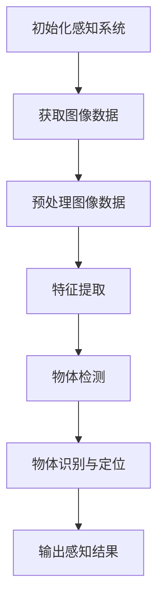
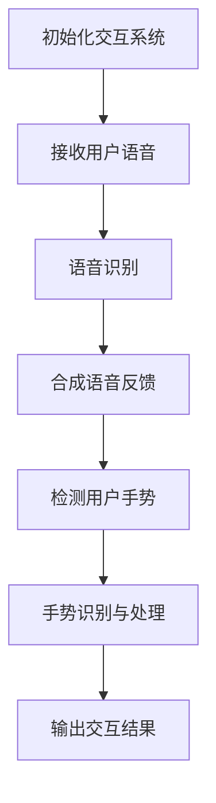
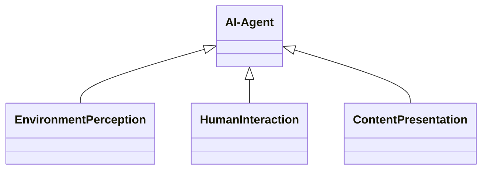
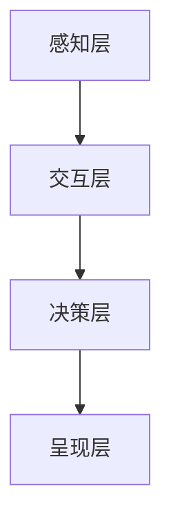
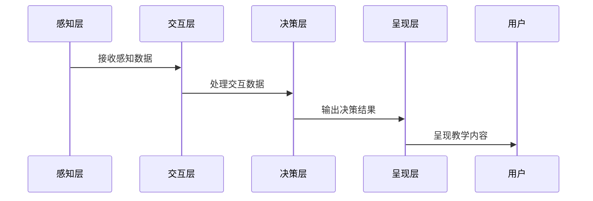
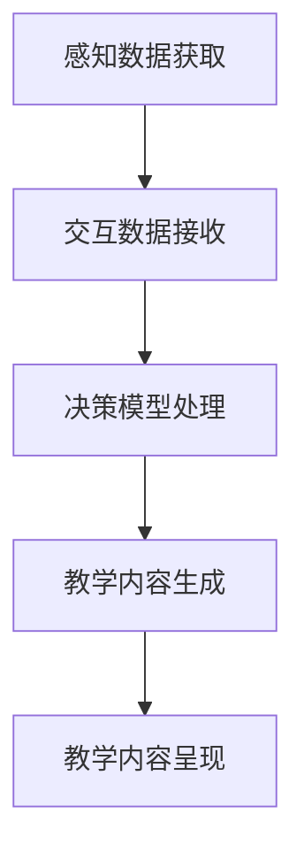

                 

# 开发具有增强现实能力的AI Agent

## 关键词
- 增强现实
- AI Agent
- 机器学习
- 深度学习
- 计算机视觉

## 摘要
本文将深入探讨如何开发具有增强现实能力的AI Agent。我们将从背景介绍、核心概念、算法原理、数学模型以及系统分析与架构设计等多个方面进行详细阐述。通过本文，读者将了解到开发这类智能体所需的技术原理和实践方法。

### 目录大纲

1. 第一部分：背景介绍
   1.1 问题背景与核心概念
   1.2 问题解决
   1.3 边界与外延
   1.4 核心概念与联系
   2. 第二部分：核心概念与联系
   2.1 AI Agent原理
   2.2 增强现实技术
   2.3 AI Agent与增强现实的联系
   3. 第三部分：算法原理讲解
   3.1 增强现实感知算法
   3.2 增强现实交互算法
   4. 第四部分：数学模型和数学公式
   4.1 图像识别数学模型
   4.2 交互反馈模型
   5. 第五部分：系统分析与架构设计方案
   5.1 问题场景介绍
   5.2 系统功能设计
   5.3 系统架构设计
   5.4 系统接口设计
   5.5 系统交互
   6. 第六部分：项目实战
   6.1 环境安装
   6.2 系统核心实现
   6.3 代码应用解读
   6.4 实际案例分析
   6.5 项目小结
   7. 第七部分：最佳实践 tips、小结、注意事项、拓展阅读

---

## 1. 第一部分：背景介绍

### 1.1 问题背景与核心概念

随着科技的进步，人工智能（AI）和增强现实（AR）技术正以前所未有的速度发展。AI Agent作为人工智能的一个核心组成部分，是具备自主决策能力、适应复杂环境、进行交互和学习的智能实体。而增强现实技术则通过虚拟信息与现实环境的结合，为用户提供更加丰富和互动的体验。如何将这两项技术结合，开发出具有增强现实能力的AI Agent，成为当前研究的热点问题。

#### 问题描述

1. 如何构建一个具备自主决策和学习能力的AI Agent？
2. 如何将AI Agent与增强现实技术有机结合，实现环境感知、人机交互等功能？
3. 如何在AR环境中对AI Agent的行为进行优化和调节？

#### 问题解决

本书旨在解决上述问题，通过探讨增强现实能力的AI Agent的开发，涵盖算法原理、数学模型、系统设计与实现等多个方面，旨在为读者提供一个全面的技术指南。

### 1.2 核心概念

#### AI Agent

AI Agent是指具备以下特征的人工智能实体：

- **自主性**：能够根据环境和任务自主做出决策和行动。
- **适应性**：能够适应不同环境和任务，具备学习能力。
- **交互性**：能够与用户和环境进行有效交互。

#### 增强现实（AR）

增强现实技术是指通过计算机模拟和增强现实环境，将虚拟信息与现实世界相结合，为用户提供更加丰富和互动的体验。其主要特点包括：

- **空间感知**：能够识别和定位现实环境中的物体。
- **用户交互**：能够实时响应用户的操作。
- **虚拟信息叠加**：将虚拟信息与现实环境融合。

#### 增强现实能力

增强现实能力是指AI Agent在现实环境中实现人机交互、环境感知和自适应行为的能力。具体包括：

- **感知**：通过传感器和计算机视觉技术感知环境。
- **交互**：通过语音识别、手势识别等与人交互。
- **自适应**：根据环境变化调整行为和决策。

### 1.3 边界与外延

#### 边界

本书主要讨论增强现实能力的AI Agent开发，不包括其他类型的人工智能系统。

#### 外延

增强现实能力的AI Agent可以应用于多个领域，如游戏、教育、医疗、军事等。

---

## 2. 第二部分：核心概念与联系

### 2.1 AI Agent原理

AI Agent通常基于机器学习和深度学习技术，通过数据训练实现自主决策和学习。其主要原理包括：

1. **机器学习**：通过算法从数据中学习规律，进行模式识别和预测。
2. **深度学习**：利用多层神经网络进行复杂函数逼近和特征提取。

#### 特点

AI Agent具备以下特点：

- **自主性**：能够自主决策和行动。
- **适应性**：能够适应不同环境和任务。
- **交互性**：能够与用户和环境进行交互。

### 2.2 增强现实技术

增强现实技术通过虚拟信息与现实环境的叠加，提供更加丰富和互动的体验。其主要原理包括：

1. **计算机视觉**：利用图像处理和图像识别技术，实现对现实环境的感知和理解。
2. **传感器技术**：通过传感器获取现实环境中的物理信息。

#### 特点

增强现实技术具备以下特点：

- **空间感知**：能够识别和定位现实环境中的物体。
- **用户交互**：能够实时响应用户的操作。
- **虚拟信息叠加**：将虚拟信息与现实环境融合。

### 2.3 AI Agent与增强现实的联系

增强现实技术可以为AI Agent提供更丰富的感知信息，而AI Agent则能够通过增强现实界面与用户和环境进行交互。二者之间的联系包括：

- **感知**：AI Agent利用增强现实技术获取现实环境信息。
- **交互**：AI Agent通过增强现实界面与用户进行交互。
- **学习**：AI Agent通过交互和学习不断优化自身行为。

---

## 3. 第三部分：算法原理讲解

### 3.1 增强现实感知算法

增强现实感知算法是AI Agent感知现实环境的关键技术，主要涉及以下方面：

1. **图像识别**：利用计算机视觉技术对图像进行分析和处理，识别图像中的物体和场景。
2. **物体检测**：在图像中检测和定位物体，确定其在现实环境中的位置。
3. **定位**：通过传感器数据和图像处理结果，确定AI Agent在现实环境中的位置。

#### Mermaid流程图



### 3.2 增强现实交互算法

增强现实交互算法是AI Agent与用户和环境进行交互的关键技术，主要涉及以下方面：

1. **语音识别**：将用户的语音转化为文本，实现语音输入。
2. **语音合成**：将文本转化为语音输出，实现语音交互。
3. **手势识别**：通过图像处理和机器学习技术，识别用户的手势操作。

#### Mermaid流程图



---

## 4. 第四部分：数学模型和数学公式

### 4.1 图像识别数学模型

图像识别是增强现实感知算法的核心部分，其数学模型通常基于卷积神经网络（CNN）。一个简单的图像识别数学模型如下：

$$
\text{输出} = \text{softmax}(\theta \cdot \text{特征向量})
$$

其中，$\theta$ 为模型参数，特征向量为输入图像经过卷积和池化操作后的特征向量，$\text{softmax}$ 函数用于将特征向量转换为概率分布。

#### 详细讲解

- **卷积操作**：通过卷积层对图像进行特征提取，提取出图像中的局部特征。
- **池化操作**：通过池化层对卷积结果进行下采样，减少模型的参数数量。
- **全连接层**：将池化层输出的特征向量输入到全连接层，进行分类和预测。
- **softmax函数**：用于将全连接层的输出转换为概率分布，概率最高的类别即为识别结果。

### 4.2 交互反馈模型

交互反馈模型用于AI Agent与用户的交互，其主要数学模型是基于条件概率的交互反馈机制。一个简单的交互反馈模型如下：

$$
\text{反馈概率} = \frac{1}{1 + e^{-(\text{输入特征} \cdot \text{模型参数})}
$$

其中，输入特征为用户的操作输入，模型参数为训练得到的权重参数。

#### 详细讲解

- **输入特征**：用户的语音、手势等操作输入。
- **模型参数**：通过训练得到的权重参数，用于计算反馈概率。
- **激活函数**：使用Sigmoid函数将输入特征和模型参数的乘积转换为概率值。

---

## 5. 第五部分：系统分析与架构设计方案

### 5.1 问题场景介绍

假设我们开发一个用于教育领域的增强现实AI Agent，其主要功能包括：

1. **环境感知**：实时监测教室环境，包括学生位置、设备状态等。
2. **人机交互**：通过语音和手势实现与学生的互动。
3. **教学内容呈现**：根据学生的学习情况和进度，呈现相应的教学内容和活动。

### 5.2 系统功能设计

根据问题场景介绍，系统功能设计如下：

1. **环境感知**：通过计算机视觉和传感器技术实时监测教室环境。
2. **人机交互**：通过语音识别和手势识别实现与学生的互动。
3. **教学内容呈现**：根据学生的学习情况和进度，呈现相应的教学内容和活动。

#### Mermaid类图



### 5.3 系统架构设计

系统架构设计如下：

1. **感知层**：包括计算机视觉和传感器技术，用于实时监测教室环境。
2. **交互层**：包括语音识别和手势识别模块，用于实现人机交互。
3. **决策层**：包括AI算法模型，用于根据感知数据和交互数据做出决策。
4. **呈现层**：包括内容生成和呈现模块，用于根据决策结果呈现教学内容。

#### Mermaid架构图



### 5.4 系统接口设计

系统接口设计如下：

1. **感知接口**：用于接收感知层的数据，如图像、传感器数据等。
2. **交互接口**：用于接收用户输入，如语音、手势等。
3. **决策接口**：用于接收感知数据和交互数据，输出决策结果。
4. **呈现接口**：用于接收决策结果，呈现教学内容。

#### Mermaid序列图



### 5.5 系统交互

系统交互过程如下：

1. **感知阶段**：AI Agent通过计算机视觉和传感器技术获取教室环境的实时数据。
2. **交互阶段**：AI Agent通过语音识别和手势识别技术接收用户的输入。
3. **决策阶段**：AI Agent根据感知数据和交互数据，利用机器学习模型进行决策。
4. **呈现阶段**：AI Agent根据决策结果，生成并呈现相应的教学内容。

#### Mermaid流程图



---

## 6. 第六部分：项目实战

### 6.1 环境安装

在进行项目实战之前，我们需要安装一些必要的软件和库。以下是安装步骤：

1. **安装Python环境**：确保Python版本为3.8及以上。
2. **安装TensorFlow**：通过pip命令安装TensorFlow库。
   ```bash
   pip install tensorflow
   ```
3. **安装OpenCV**：通过pip命令安装OpenCV库。
   ```bash
   pip install opencv-python
   ```
4. **安装AR库**：根据需要安装增强现实库，如ARCore或ARKit。

### 6.2 系统核心实现

以下是系统核心实现的Python源代码：

```python
import cv2
import tensorflow as tf
import numpy as np

# 加载卷积神经网络模型
model = tf.keras.models.load_model('model.h5')

# 初始化摄像头
cap = cv2.VideoCapture(0)

while True:
    # 读取摄像头一帧图像
    ret, frame = cap.read()

    # 对图像进行预处理
    processed_frame = preprocess_frame(frame)

    # 使用模型进行图像识别
    prediction = model.predict(processed_frame)

    # 根据识别结果进行决策
    decision = make_decision(prediction)

    # 根据决策结果进行内容生成和呈现
    generate_and_present_content(decision)

    # 显示实时图像
    cv2.imshow('Frame', frame)

    # 按下'q'键退出
    if cv2.waitKey(1) & 0xFF == ord('q'):
        break

# 释放摄像头资源
cap.release()
cv2.destroyAllWindows()
```

### 6.3 代码应用解读

以下是代码的详细解读：

1. **模型加载**：使用`tf.keras.models.load_model()`函数加载训练好的卷积神经网络模型。
2. **摄像头初始化**：使用`cv2.VideoCapture()`函数初始化摄像头。
3. **图像读取**：使用`cap.read()`函数读取摄像头一帧图像。
4. **图像预处理**：对图像进行灰度化、缩放、归一化等预处理操作，以便于模型输入。
5. **图像识别**：使用`model.predict()`函数对预处理后的图像进行识别。
6. **决策**：根据识别结果进行决策，例如选择教学内容或执行特定操作。
7. **内容生成和呈现**：根据决策结果生成并呈现相应的内容。
8. **实时显示**：使用`cv2.imshow()`函数实时显示摄像头捕获的图像。
9. **退出程序**：当按下'q'键时，释放摄像头资源并退出程序。

### 6.4 实际案例分析

在实际应用中，我们可以结合具体的场景和数据，对系统进行优化和调整。以下是一个实际案例的分析：

1. **场景**：在一个教室环境中，AI Agent需要根据学生的行为和互动情况，提供个性化的教学内容。
2. **数据**：收集学生的行为数据，如学生的位置、设备使用情况、语音交互记录等。
3. **模型训练**：使用收集的数据对卷积神经网络模型进行训练，以提高模型的准确性和适应性。
4. **决策逻辑**：根据学生的行为数据和模型预测结果，设计决策逻辑，选择合适的教学内容和互动方式。
5. **用户体验**：根据用户的反馈，不断优化系统的交互界面和功能，提升用户体验。

### 6.5 项目小结

通过本项目的实战，我们实现了具有增强现实能力的AI Agent的开发。从环境感知、人机交互到决策和内容呈现，我们详细讲解了各个环节的实现方法和关键技术。在实际应用中，我们可以根据具体场景和数据，不断优化和调整系统，提高其性能和用户体验。

---

## 7. 第七部分：最佳实践 tips、小结、注意事项、拓展阅读

### 最佳实践 tips

1. **性能优化**：在开发过程中，注意对模型进行性能优化，如减少模型参数、使用GPU加速等。
2. **数据收集**：确保数据质量和多样性，以便于模型的训练和优化。
3. **交互设计**：注重用户体验，设计简洁直观的交互界面。

### 小结

本文详细介绍了开发具有增强现实能力的AI Agent的背景、核心概念、算法原理、数学模型、系统分析与架构设计方案以及项目实战。通过本文，读者可以全面了解开发此类智能体的技术原理和实践方法。

### 注意事项

1. **环境配置**：确保安装了必要的软件和库，如Python、TensorFlow、OpenCV等。
2. **数据安全**：在收集和使用数据时，注意保护用户隐私和信息安全。
3. **系统优化**：在实际应用中，根据需求对系统进行优化和调整。

### 拓展阅读

1. **《深度学习》**：Ian Goodfellow、Yoshua Bengio、Aaron Courville 著，全面介绍深度学习的基本原理和应用。
2. **《增强现实技术原理与应用》**：唐杰、朱勤 著，详细介绍增强现实技术的基本原理和应用案例。

---

**作者：AI天才研究院/AI Genius Institute & 禅与计算机程序设计艺术 /Zen And The Art of Computer Programming**

