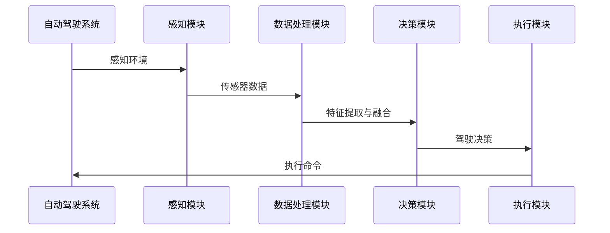

                 

### 文章标题

# 开发具有复杂场景理解能力的AI Agent

### 文章关键词

- AI Agent
- 复杂场景理解
- 深度学习
- 传感器融合
- 强化学习

### 摘要

本文旨在探讨开发具有复杂场景理解能力的AI Agent的必要性和关键技术。首先，我们将介绍AI Agent的定义及其在现实世界中的应用，接着讨论复杂场景理解的概念和挑战。随后，我们将详细阐述感知、传感器融合、AI Agent架构等基础概念，并深入分析深度学习、强化学习等技术对复杂场景理解能力的提升。通过具体实例和代码分析，本文将展示如何构建并优化具有复杂场景理解能力的AI Agent，最后总结最佳实践并提供进一步研究的方向。

## 引言

随着人工智能技术的飞速发展，AI Agent已经成为智能系统中的一个重要组成部分。AI Agent是一种具有自主决策和执行能力的计算机程序，能够根据环境和任务需求进行实时调整和响应。在自动驾驶、智能客服、机器人控制等众多领域，AI Agent正发挥着越来越重要的作用。

然而，随着应用场景的复杂化，传统AI Agent在场景理解方面面临着巨大挑战。复杂场景理解不仅要求AI Agent能够准确地感知和识别环境中的各种信息，还需要它具备对场景中不同元素之间关系的理解能力，并能够在动态变化的环境中做出合理的决策。这种复杂场景理解能力不仅对于AI Agent的实用性至关重要，也成为了当前人工智能研究的前沿课题之一。

本文将围绕开发具有复杂场景理解能力的AI Agent展开讨论。首先，我们将介绍AI Agent的基本概念及其在复杂场景理解中的应用。接着，我们将探讨复杂场景理解的核心概念和挑战。随后，本文将详细分析感知、传感器融合、AI Agent架构等基础概念，并深入讨论深度学习和强化学习等技术在复杂场景理解中的应用。最后，我们将通过具体实例和代码分析，展示如何构建和优化具有复杂场景理解能力的AI Agent。

## AI Agent的定义与应用

### AI Agent的基本概念

AI Agent是一种在特定环境中具备自主感知、决策和行动能力的智能体。它通常由感知模块、决策模块和行动模块三个主要部分组成。感知模块负责收集环境中的信息，决策模块基于感知信息生成行动计划，行动模块则执行这些计划并更新环境状态。AI Agent的核心特点在于其自主性和适应性，能够在没有人类干预的情况下自主完成任务。

AI Agent的工作原理可以概括为以下几个步骤：

1. **感知**：AI Agent通过各种传感器（如摄像头、麦克风、雷达等）收集环境信息。
2. **决策**：基于感知信息，AI Agent使用预先训练好的模型或实时学习算法，生成一个或多个可能的行动计划。
3. **行动**：AI Agent选择并执行最优的决策，同时更新内部状态以反映环境的变化。

### AI Agent的应用场景

AI Agent在现实世界中有着广泛的应用。以下是几个典型的应用场景：

1. **自动驾驶**：自动驾驶汽车通过AI Agent感知路况信息，进行决策和驾驶。AI Agent需要具备对道路、行人、车辆等多种元素的识别和理解能力，以应对复杂多变的交通环境。

2. **智能客服**：智能客服系统利用AI Agent与用户进行交互，通过自然语言处理技术理解用户的问题和需求，并给出相应的回答。AI Agent需要具备对语言语义的理解能力，以及处理多轮对话的能力。

3. **机器人控制**：机器人控制领域中的AI Agent需要通过传感器感知环境信息，并做出实时的运动决策。例如，工业机器人需要在生产线上进行物品搬运，而服务机器人则需要在家庭环境中为用户提供服务。

4. **智能家居**：智能家居系统中的AI Agent可以控制灯光、温度、安全等多种设备，为用户提供舒适的居住环境。AI Agent需要具备对用户习惯的理解能力，以及根据环境变化进行自动调节的能力。

### AI Agent在复杂场景理解中的应用

复杂场景理解是AI Agent面临的一个重大挑战。与传统场景相比，复杂场景包含更多的元素和更复杂的关系，对AI Agent的感知和决策能力提出了更高的要求。

在复杂场景中，AI Agent需要能够同时感知和识别多个不同的元素，如道路、车辆、行人等。此外，AI Agent还需要理解这些元素之间的关系，如交通规则、行人行为模式等。例如，在自动驾驶场景中，AI Agent不仅需要识别道路上的车辆和行人，还需要理解它们之间的相对位置和运动轨迹，以便做出安全的驾驶决策。

为了实现复杂场景理解，AI Agent通常需要采用多种传感器和感知技术。例如，结合摄像头、雷达、激光雷达等传感器，AI Agent可以收集到更全面的环境信息。此外，AI Agent还需要使用先进的感知算法，如深度学习、多模态感知等，以提高对复杂场景的识别和理解能力。

总之，AI Agent在复杂场景理解中的应用具有广泛的前景。随着人工智能技术的不断发展，未来AI Agent将在更多的复杂场景中发挥重要作用。

## 复杂场景理解的概念与挑战

### 复杂场景理解的基本概念

复杂场景理解是指AI Agent在感知和理解复杂环境中的信息，从而做出有效决策的过程。这种理解不仅涉及对单一元素（如物体、声音、文本等）的识别，还包括对多个元素之间关系的推理和综合分析。

复杂场景理解的基本概念包括：

1. **多模态感知**：AI Agent通过多种传感器（如摄像头、麦克风、雷达等）获取不同类型的信息，实现全面的环境感知。
2. **上下文感知**：AI Agent在处理感知信息时，需要考虑当前环境和历史信息，理解上下文背景，从而做出更准确的决策。
3. **动态推理**：AI Agent需要能够实时分析感知信息，识别环境中的变化，并做出相应的调整。
4. **情境推理**：AI Agent需要理解不同情境下的行为模式，适应不同的场景需求。

### 复杂场景理解的挑战

尽管复杂场景理解在AI Agent的应用中具有巨大的潜力，但实现这一目标面临着诸多挑战：

1. **数据多样性**：复杂场景通常包含多种类型的传感器数据和异构数据源，如何有效地整合这些数据是关键挑战之一。
2. **不确定性**：现实世界中的环境信息往往具有不确定性，AI Agent需要具备应对不确定性的能力。
3. **实时性**：在许多应用场景中，AI Agent需要在短时间内处理大量信息并做出快速决策，这对计算性能和算法效率提出了高要求。
4. **鲁棒性**：AI Agent需要能够在不同环境下保持稳定的表现，不受噪声和异常值的影响。
5. **跨领域适应**：不同场景和任务具有不同的特性，如何让AI Agent具备跨领域的适应能力是一个重要的研究方向。

### 解决方案与未来方向

为了应对这些挑战，研究者们提出了多种解决方案：

1. **多模态融合**：通过深度学习等先进技术，实现多模态数据的融合，提高AI Agent对复杂场景的理解能力。
2. **不确定性和鲁棒性处理**：引入概率模型和增强学习等技术，增强AI Agent在不确定环境中的适应能力和鲁棒性。
3. **实时计算和优化**：采用高效的算法和优化技术，提高AI Agent在实时场景下的计算效率和决策速度。
4. **跨领域迁移学习**：通过迁移学习和多任务学习等技术，使AI Agent具备跨领域的适应能力。

总之，复杂场景理解是AI Agent发展中的一项重要任务，随着技术的进步，未来我们将看到更多具有复杂场景理解能力的AI Agent在各个领域的应用。

## 感知与复杂场景理解

### 感知技术的基本原理

感知是AI Agent理解复杂场景的基础，感知技术包括视觉感知、听觉感知、触觉感知等。视觉感知主要通过摄像头、激光雷达等设备捕捉二维或三维图像；听觉感知利用麦克风等设备收集声音信号；触觉感知则通过力传感器等设备获取物理接触信息。

1. **图像处理技术**：包括边缘检测、特征提取、图像分割等，用于从图像中提取有意义的信息。
2. **声音处理技术**：包括声源定位、噪声过滤、语音识别等，用于从声音中提取有意义的信息。
3. **触觉处理技术**：包括力反馈、触感识别等，用于从物理接触中获取信息。

### 感知技术在复杂场景理解中的应用

感知技术在复杂场景理解中的应用至关重要。以下是一些典型的应用场景：

1. **自动驾驶**：自动驾驶汽车需要通过摄像头、激光雷达等设备感知道路、车辆、行人等信息，以实现自主导航和避障。
2. **智能监控**：智能监控系统能够通过摄像头等设备实时分析场景中的异常行为，如火灾、入侵等，并自动报警。
3. **机器人控制**：机器人通过多种传感器感知周围环境，进行路径规划、物体抓取、人机交互等任务。

### 感知技术面临的挑战

尽管感知技术在复杂场景理解中具有重要作用，但它们也面临着一系列挑战：

1. **数据多样性**：不同传感器捕获的数据类型多样，如何有效整合这些数据是一个难题。
2. **噪声和干扰**：现实世界中的传感器数据往往受到噪声和干扰的影响，如何提高感知系统的鲁棒性是一个重要问题。
3. **实时性**：在许多应用中，感知系统需要在短时间内处理大量数据，这对计算效率和算法优化提出了高要求。
4. **跨域适应性**：不同场景下的传感器数据可能具有不同的分布和特性，如何使感知系统具备跨域适应性是一个关键挑战。

### 解决方案

为了应对上述挑战，研究者们提出了一系列解决方案：

1. **多模态融合**：通过融合不同模态的数据，提高复杂场景理解的准确性和鲁棒性。
2. **深度学习**：利用深度学习技术，特别是卷积神经网络（CNN）和循环神经网络（RNN），提高感知系统的性能和效率。
3. **传感器优化**：通过改进传感器设计和算法，提高传感器的感知能力和可靠性。
4. **数据增强**：通过数据增强技术，增加训练数据量，提高感知系统的泛化能力。

综上所述，感知技术在复杂场景理解中扮演着关键角色。通过不断优化感知技术和算法，我们有望开发出更加智能和高效的AI Agent，实现更复杂场景的理解和应对。

## 传感器融合与数据整合

### 传感器融合的基本原理

传感器融合是指将多个传感器捕获的信息进行综合处理，以提高感知系统的整体性能和准确性。基本原理包括数据采集、特征提取、信息融合和结果输出。

1. **数据采集**：不同传感器捕获的环境信息，如视觉、听觉、触觉等。
2. **特征提取**：对采集到的数据进行预处理，提取有用的特征，如边缘、纹理、声音频率等。
3. **信息融合**：利用算法将不同传感器的特征信息进行整合，生成一个统一的、更准确的环境模型。
4. **结果输出**：输出融合后的环境信息，供AI Agent进行决策和行动。

### 多模态数据融合的技术

多模态数据融合技术是将不同模态的数据进行整合，以获得更全面和准确的环境理解。以下是一些常见的多模态数据融合技术：

1. **加权融合**：根据不同传感器的可靠性和重要性，对传感器数据进行加权处理，得到一个加权融合结果。
2. **特征级融合**：将不同传感器的特征信息进行直接融合，如将视觉特征和声音特征进行组合。
3. **决策级融合**：在感知和决策阶段进行融合，将不同传感器的输出结果进行综合分析，得到最终的决策。
4. **深度学习融合**：利用深度学习模型，如卷积神经网络（CNN）和循环神经网络（RNN），自动学习不同传感器数据的关联性。

### 数据整合的关键挑战

尽管传感器融合技术具有显著优势，但实际应用中仍面临诸多关键挑战：

1. **数据多样性**：不同传感器的数据类型和特性差异较大，如何有效地整合这些数据是一个难题。
2. **数据同步**：传感器数据的时间戳不一致，如何实现数据的同步处理是一个重要问题。
3. **异构数据融合**：不同传感器捕获的数据格式和维度可能不同，如何进行异构数据的融合是一个挑战。
4. **计算资源**：传感器融合通常涉及大量的计算，如何优化算法以提高计算效率是一个关键问题。

### 解决方案与未来趋势

为了应对上述挑战，研究者们提出了一系列解决方案：

1. **优化算法**：通过改进算法，如优化特征提取、信息融合策略，提高数据融合的准确性和效率。
2. **硬件加速**：利用硬件加速技术，如GPU和FPGA，提高数据融合的处理速度。
3. **分布式计算**：通过分布式计算架构，实现传感器数据的实时处理和融合。
4. **机器学习**：利用机器学习技术，特别是深度学习和强化学习，提高数据融合的智能化水平。

未来，随着传感器技术和计算能力的不断进步，传感器融合与数据整合将在复杂场景理解中发挥越来越重要的作用。通过不断优化和创新发展，我们有望实现更加高效和智能的AI Agent。

## AI Agent框架设计

### AI Agent架构的基本设计

AI Agent的架构设计是构建具有复杂场景理解能力的核心。一个典型的AI Agent架构通常包括以下几个关键模块：

1. **感知模块**：负责通过传感器获取环境信息，如视觉、听觉、触觉等。
2. **决策模块**：基于感知模块提供的信息，使用预训练模型或实时学习算法进行决策。
3. **行动模块**：执行决策模块生成的行动计划，并更新环境状态。
4. **反馈模块**：收集行动结果，用于模型优化和进一步学习。

### 常见的AI Agent架构

AI Agent架构可以分为以下几种类型：

1. **基于规则的方法**：使用预定义的规则进行决策，适用于规则明确、环境变化较小的场景。
2. **基于模型的方法**：使用机器学习模型进行决策，适用于复杂、动态的环境。
3. **混合方法**：结合基于规则和基于模型的方法，以平衡灵活性和准确性。

### 学习和决策模型

AI Agent的学习和决策模型是架构设计中的关键。以下是一些常用的学习和决策模型：

1. **监督学习**：通过已标注的数据训练模型，然后使用模型进行预测和决策。
2. **强化学习**：通过与环境的交互学习最佳行动策略，适用于动态和不确定环境。
3. **生成对抗网络（GAN）**：用于生成环境模拟数据，帮助AI Agent在复杂场景中训练。
4. **深度强化学习**：结合深度学习和强化学习，提高模型在复杂环境中的决策能力。

### 交互模型设计

AI Agent与环境的交互模型设计决定了其适应性和响应速度。以下是一些常见的交互模型：

1. **周期性交互**：AI Agent定期获取环境信息，进行决策和行动。
2. **事件驱动交互**：AI Agent根据环境事件（如传感器触发）进行实时响应。
3. **混合交互**：结合周期性交互和事件驱动交互，以提高灵活性和响应速度。

### 模块间的通信机制

模块间的通信机制是确保AI Agent高效运行的关键。以下是一些常用的通信机制：

1. **消息队列**：使用消息队列实现模块间的异步通信。
2. **共享内存**：使用共享内存实现模块间的同步通信。
3. **RESTful API**：使用HTTP协议实现模块间的远程通信。

总之，AI Agent框架设计涉及多个模块和模型的选择，以及它们之间的通信机制。通过合理的设计，可以构建具有复杂场景理解能力的AI Agent，使其在不同应用场景中发挥重要作用。

## 深度学习算法在复杂场景理解中的应用

### 深度学习算法的基本原理

深度学习算法是一种基于多层神经网络的学习方法，通过多层非线性变换，从数据中自动提取特征，实现对复杂函数的建模。深度学习算法的核心组件包括：

1. **卷积神经网络（CNN）**：主要用于图像处理，通过卷积层提取图像特征。
2. **循环神经网络（RNN）**：适用于序列数据处理，如时间序列和自然语言处理。
3. **生成对抗网络（GAN）**：通过生成器和判别器的对抗训练，生成高质量的数据。
4. **变分自编码器（VAE）**：通过概率编码实现数据压缩和生成。

### 深度学习在复杂场景理解中的应用

深度学习算法在复杂场景理解中具有广泛的应用。以下是一些具体的例子：

1. **物体检测**：利用CNN进行图像处理，实现物体识别和定位，如YOLO、SSD等模型。
2. **图像分割**：利用CNN进行像素级分类，实现对图像的精确分割，如FCN、U-Net等模型。
3. **语音识别**：利用RNN进行语音信号处理，实现语音到文本的转换，如GRU、LSTM等模型。
4. **语义理解**：利用深度学习模型进行文本分析，实现对文本语义的理解，如BERT、GPT等模型。
5. **环境模拟**：利用GAN生成模拟环境数据，用于AI Agent的训练和测试。

### 深度学习算法的优势与挑战

深度学习算法在复杂场景理解中具有显著的优势，但也面临一些挑战：

**优势：**

1. **自动特征提取**：深度学习能够自动从数据中提取有用的特征，减轻人工设计的负担。
2. **高效计算**：现代深度学习框架和硬件加速技术（如GPU、TPU）使得深度学习算法在复杂场景中具有高效的计算性能。
3. **广泛适用性**：深度学习算法适用于多种类型的数据和任务，如图像、文本、语音等。
4. **自适应能力**：通过不断优化和学习，深度学习算法能够适应不同的环境和任务需求。

**挑战：**

1. **数据需求**：深度学习通常需要大量的标注数据，数据获取和标注是一个巨大的挑战。
2. **计算资源**：深度学习算法的计算量巨大，对计算资源和时间有较高的要求。
3. **解释性**：深度学习模型通常具有黑盒性质，难以解释其决策过程，这在某些应用场景中可能是不利的。
4. **过拟合**：深度学习模型容易受到训练数据的影响，导致过拟合现象，影响泛化能力。

### 优化深度学习算法的方法

为了充分发挥深度学习算法在复杂场景理解中的应用潜力，研究者们提出了多种优化方法：

1. **数据增强**：通过增加训练数据的多样性，提高模型的泛化能力。
2. **模型压缩**：通过模型剪枝、量化等技术，减少模型的大小和计算量，提高运行效率。
3. **迁移学习**：利用预训练模型，在特定任务上进行微调，以节省训练时间和计算资源。
4. **元学习**：通过自动学习模型的学习策略，提高模型在不同任务上的适应能力。
5. **混合方法**：结合深度学习和传统机器学习方法，发挥各自的优势，提高模型的性能。

总之，深度学习算法在复杂场景理解中具有巨大潜力，通过不断优化和创新，我们将能够构建更加智能和高效的AI Agent。

## 强化学习在复杂场景理解中的应用

### 强化学习的基本原理

强化学习（Reinforcement Learning，RL）是一种通过互动学习过程来优化决策的机器学习方法。其核心思想是智能体（Agent）通过与环境（Environment）的交互，不断学习最优策略（Policy），以最大化累积奖励（Reward）。强化学习的基本原理包括以下几个关键组成部分：

1. **状态（State）**：智能体当前所处的环境描述。
2. **动作（Action）**：智能体可执行的操作。
3. **奖励（Reward）**：智能体执行动作后获得的即时反馈信号，用于指导学习过程。
4. **策略（Policy）**：智能体根据当前状态选择动作的策略。

强化学习的基本流程如下：

1. **初始化**：智能体随机选择一个初始状态。
2. **执行动作**：智能体根据当前状态和策略选择一个动作。
3. **环境反馈**：环境根据智能体的动作返回下一个状态和相应的奖励。
4. **更新策略**：智能体基于累积奖励和历史经验调整策略。
5. **重复步骤2-4**：智能体持续与环境交互，不断优化策略。

### 强化学习在复杂场景理解中的应用

强化学习在复杂场景理解中具有广泛的应用前景，尤其是在需要实时决策和应对动态环境变化的场景中。以下是一些典型的应用场景：

1. **自动驾驶**：自动驾驶汽车通过强化学习学习最优驾驶策略，实现自适应驾驶和控制。
2. **智能机器人**：智能机器人通过强化学习学习与环境交互的最优动作，以实现自主移动和任务执行。
3. **推荐系统**：强化学习可以用于构建智能推荐系统，根据用户行为和反馈，动态调整推荐策略。
4. **游戏AI**：强化学习被广泛应用于游戏AI的构建，使游戏角色能够自主学习和适应游戏环境。

### 强化学习算法

强化学习算法可以分为值函数方法（如Q-learning、SARSA）和政策梯度方法（如REINFORCE、PPO）两大类。以下是一些常见的强化学习算法：

1. **Q-learning**：通过迭代更新Q值，逐步学习最优策略。
   $$ Q(s, a) \leftarrow Q(s, a) + \alpha [r + \gamma \max_{a'} Q(s', a') - Q(s, a)] $$
2. **SARSA**：同时考虑当前状态和下一个状态，更新Q值。
   $$ Q(s, a) \leftarrow Q(s, a) + \alpha [r + \gamma Q(s', a')] - Q(s, a)] $$
3. **REINFORCE**：基于策略梯度，直接优化策略的概率分布。
   $$ \theta \leftarrow \theta + \alpha \sum_{t} \nabla_{\theta} \log \pi(\theta | s_t, a_t) [r_t - R] $$
4. **PPO（Proximal Policy Optimization）**：通过优化策略的稳定性和一致性，提高学习效率。
   $$ \min_{\theta'} \frac{1}{N} \sum_{t} \left[ \pi(\theta' | s_t, a_t) A_t - \rho_t V_t \right] $$

### 强化学习在复杂场景理解中的挑战与解决方案

尽管强化学习在复杂场景理解中具有巨大的潜力，但同时也面临一系列挑战：

**挑战1：数据效率**
强化学习通常需要大量的交互数据进行学习，这对数据获取和实验资源提出了高要求。

**解决方案：**
- **数据增强**：通过模拟和生成额外的训练数据，提高学习效率。
- **经验回放**：使用经验回放机制，避免重复探索相同的状态，提高样本利用率。

**挑战2：收敛速度**
强化学习算法在动态和复杂环境中可能需要较长的学习时间，影响其实际应用价值。

**解决方案：**
- **优先经验回放**：根据经验的重要程度进行回放，优先处理重要样本。
- **分布式学习**：利用多智能体系统，通过并行学习加速收敛。

**挑战3：稳定性与可解释性**
强化学习模型的稳定性较差，且具有黑盒性质，难以解释其决策过程。

**解决方案：**
- **模型压缩与正则化**：通过模型压缩和正则化技术，提高模型的稳定性和泛化能力。
- **可解释性方法**：结合可视化工具和方法，提高模型的可解释性。

总之，强化学习在复杂场景理解中具有重要作用，通过不断优化算法和技术，我们将能够更好地应对这些挑战，开发出具有高度智能和自适应能力的AI Agent。

## 实例分析：自动驾驶中的复杂场景理解

### 背景介绍

自动驾驶系统是一个典型的复杂场景理解应用案例。它需要AI Agent实时感知道路环境，识别交通标志、行人、车辆等元素，理解交通规则，并根据当前环境和未来预测做出驾驶决策。自动驾驶系统不仅要求高精度的感知能力，还需要具备强大的决策和执行能力。

### 系统介绍

自动驾驶系统通常由以下几个核心组成部分构成：

1. **感知模块**：包括摄像头、激光雷达、超声波传感器等，用于实时感知道路和周围环境。
2. **数据处理模块**：负责对感知数据进行预处理、特征提取和融合。
3. **决策模块**：基于感知数据和环境模型，使用深度学习和强化学习算法生成驾驶决策。
4. **执行模块**：根据决策模块生成的驾驶命令，控制车辆的运动和方向。

### 系统功能设计

自动驾驶系统的核心功能包括：

1. **道路检测与跟踪**：识别和跟踪道路边缘，确保车辆在车道内行驶。
2. **交通标志与信号识别**：识别交通标志和信号灯，遵循交通规则。
3. **行人车辆检测**：检测道路上的行人和车辆，避免碰撞。
4. **环境预测与决策**：基于环境模型和未来预测，生成最优驾驶策略。

### 系统架构设计

自动驾驶系统的架构设计如下：

1. **感知层**：摄像头、激光雷达等传感器收集环境数据，通过数据处理模块进行预处理和特征提取。
2. **数据处理层**：对感知数据进行多模态融合，生成统一的环境感知模型。
3. **决策层**：基于环境感知模型和深度学习、强化学习算法，生成驾驶决策。
4. **执行层**：执行驾驶决策，控制车辆的运动和方向。

### 系统接口设计

自动驾驶系统的接口设计包括以下部分：

1. **传感器接口**：接收摄像头、激光雷达等传感器的数据。
2. **通信接口**：与其他车辆、基础设施进行通信，获取交通信息和环境状态。
3. **决策接口**：输出驾驶决策，如加速、减速、转向等。
4. **执行接口**：接收并执行驾驶决策，控制车辆的运行。

### 系统交互序列图

以下是一个简单的系统交互序列图，展示了感知、数据处理、决策和执行模块之间的交互过程：



### 实际案例分析与代码解析

以下是一个简单的自动驾驶决策算法的Python代码示例：

```python
import numpy as np

def drive_forward(speed):
    print(f"加速到速度: {speed} km/h")
    return speed

def turn_left():
    print("向左转")
    return "left"

def turn_right():
    print("向右转")
    return "right"

# 模拟感知数据
sensors = {
    "speed": 60,
    "lane": "middle",
    "traffic_light": "red",
    "obstacle": "none"
}

# 决策过程
def make_decision(sensors):
    speed = sensors["speed"]
    traffic_light = sensors["traffic_light"]
    
    if traffic_light == "red":
        return drive_forward(speed // 2)
    elif sensors["obstacle"] == "car":
        return turn_right()
    else:
        return drive_forward(speed)

# 执行决策
decision = make_decision(sensors)
print(f"决策: {decision}")

```

在这个例子中，我们定义了几个简单的函数来模拟自动驾驶系统的决策过程。感知模块通过传感器获取速度、车道、交通灯和障碍物等信息，决策模块根据这些信息生成驾驶决策，执行模块则执行相应的驾驶命令。

### 项目小结

通过上述实例，我们展示了如何设计一个简单的自动驾驶系统，实现了感知、数据处理、决策和执行等模块的功能。实际项目中，自动驾驶系统需要更加复杂和高级的算法和技术，但本文的示例为理解和构建具有复杂场景理解能力的AI Agent提供了一个基本的框架。随着技术的不断进步，自动驾驶系统将变得更加智能和安全。

### 最佳实践

在开发具有复杂场景理解能力的AI Agent时，以下最佳实践可以帮助提高项目成功率：

1. **数据多样性**：确保数据来源丰富，覆盖不同环境和场景，以提高模型的泛化能力。
2. **多模态感知**：结合多种传感器数据进行融合，提高环境感知的准确性和鲁棒性。
3. **动态决策**：使用强化学习等技术，使AI Agent能够动态调整决策策略，适应复杂环境。
4. **模型压缩**：通过模型压缩和优化，减少计算资源的需求，提高系统的实时性。
5. **可解释性**：提高模型的可解释性，有助于理解和优化模型，降低风险。
6. **持续学习**：通过持续学习和模型更新，使AI Agent能够适应新的环境和任务。

通过遵循这些最佳实践，我们能够更有效地开发出具有复杂场景理解能力的AI Agent，推动人工智能在各个领域的应用。

### 小结

本文深入探讨了开发具有复杂场景理解能力的AI Agent的必要性和关键技术。首先，我们介绍了AI Agent的定义、应用和复杂场景理解的概念与挑战。随后，详细分析了感知、传感器融合、AI Agent框架设计等基础概念，并讨论了深度学习和强化学习等先进技术在这些领域中的应用。通过实例分析，我们展示了如何设计和实现一个简单的自动驾驶系统，并提供了最佳实践以指导实际开发。未来研究可以进一步优化多模态感知、提高算法的实时性和鲁棒性，并探索AI Agent在更复杂场景中的跨领域应用。

### 注意事项

在开发具有复杂场景理解能力的AI Agent时，需要注意以下事项：

1. **数据安全和隐私**：确保处理的数据符合隐私保护要求，避免泄露敏感信息。
2. **模型解释性**：提高模型的可解释性，有助于理解和优化模型，降低误解和风险。
3. **实时性能**：优化算法和计算资源，确保AI Agent能够在实时环境中高效运行。
4. **鲁棒性和适应性**：增强AI Agent的鲁棒性和跨领域适应性，提高其在复杂环境中的表现。

### 拓展阅读

对于希望深入了解AI Agent和复杂场景理解的读者，以下书籍和论文提供了宝贵的参考资料：

1. **《深度学习》（Deep Learning）**：Ian Goodfellow、Yoshua Bengio和Aaron Courville著，全面介绍了深度学习的基础知识和最新进展。
2. **《强化学习：原理与Python实现》（Reinforcement Learning: An Introduction）**：Richard S. Sutton和Andrew G. Barto著，详细介绍了强化学习的基本概念和算法。
3. **论文《Deep Learning for Autonomous Driving》**：Benjamin El-Kholy等，探讨了深度学习在自动驾驶中的应用。
4. **论文《Multi-Modal Sensor Fusion for Autonomous Driving》**：Adam F. Abdallah等，研究了多模态传感器融合在自动驾驶中的技术挑战和解决方案。

### 作者信息

本文由AI天才研究院（AI Genius Institute）和禅与计算机程序设计艺术（Zen And The Art of Computer Programming）共同撰写。

- AI天才研究院：致力于推动人工智能领域的前沿研究与应用。
- 禅与计算机程序设计艺术：专注于计算机科学和人工智能的教育与传播。

