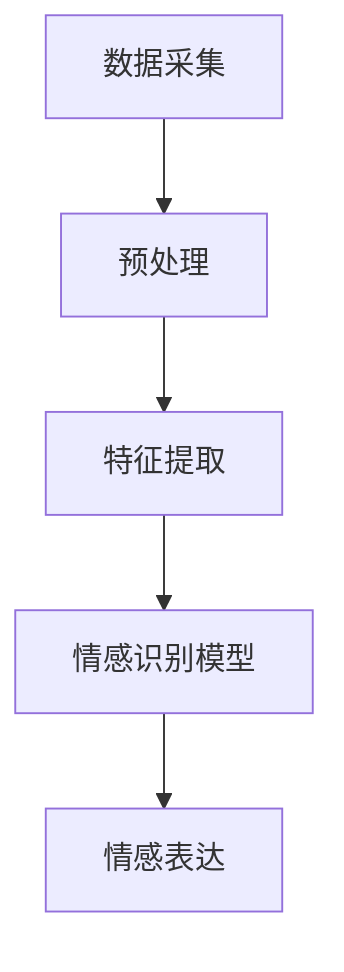
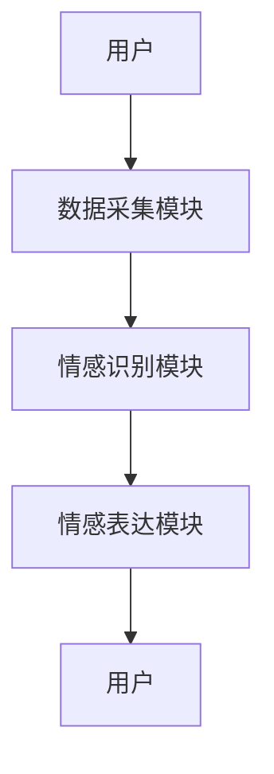
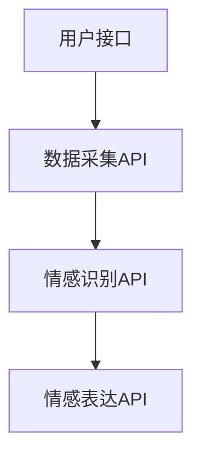
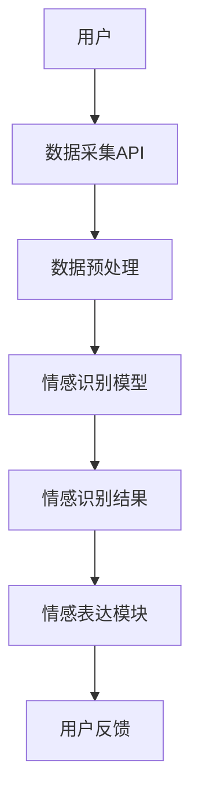
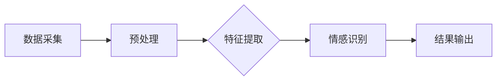
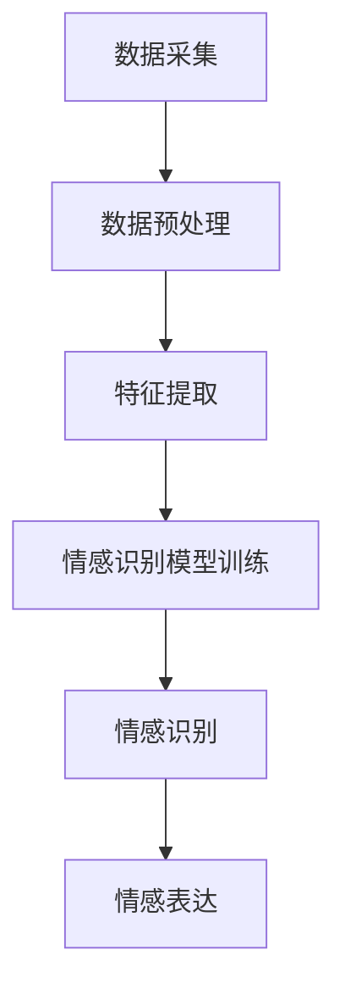
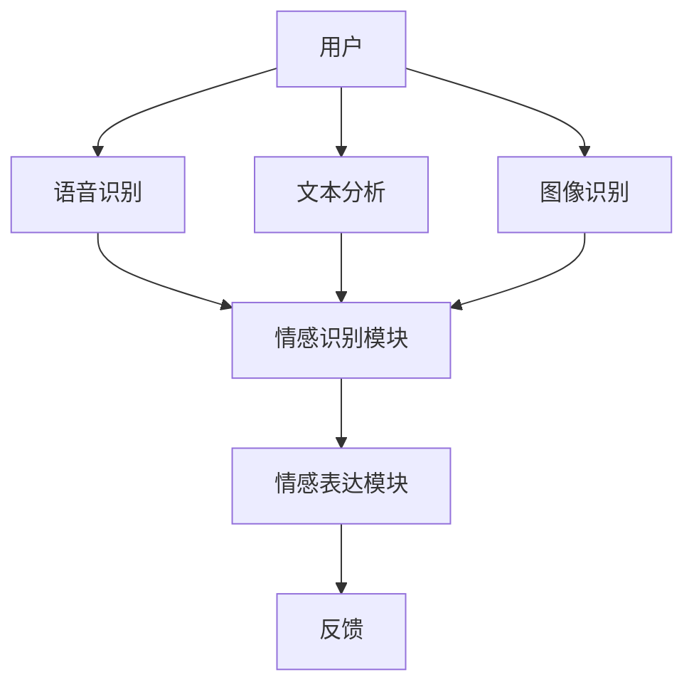
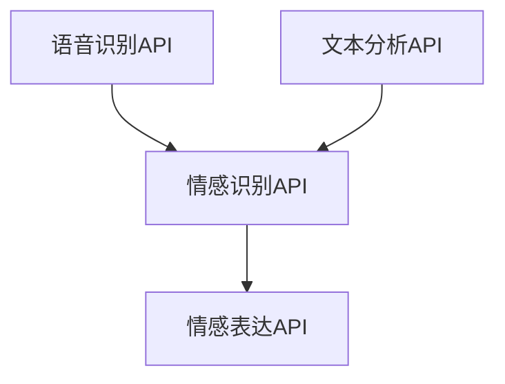
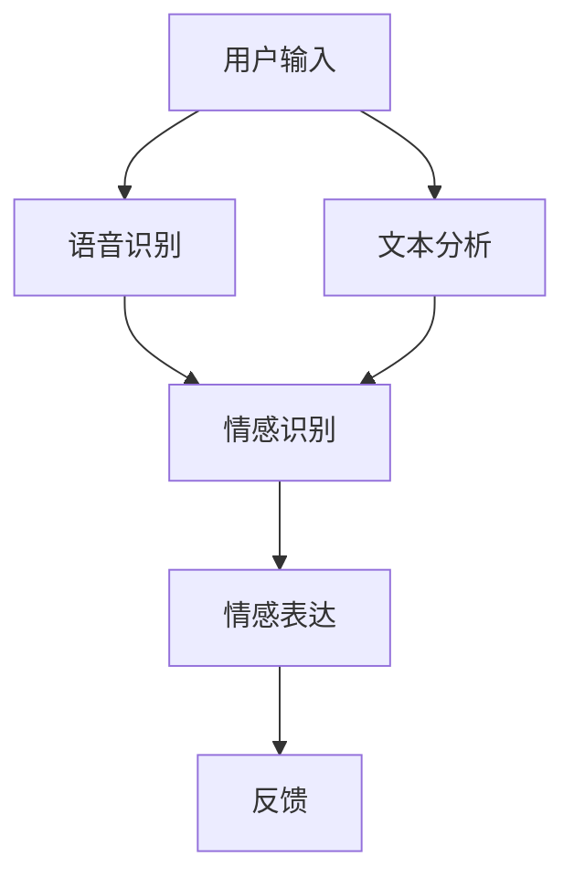

                 

# 开发具有多模态情感识别能力的AI Agent

关键词：AI Agent、多模态情感识别、深度学习、自然语言处理、智能交互

摘要：本文将探讨如何开发具有多模态情感识别能力的AI Agent，详细分析其核心概念、算法原理和系统架构设计。通过对背景介绍、核心概念与联系、算法原理讲解、系统分析与架构设计等步骤的逐步分析，旨在为开发者提供一条清晰的开发路径，以实现更智能、更人性化的智能交互体验。

**Step 1: 背景介绍**

**1.1 问题背景**

随着人工智能技术的发展，AI Agent 正在逐渐成为智能系统中的核心组件。传统的AI Agent 主要依赖于单一的数据模态，如文本、图像或语音。然而，现实世界中的信息往往是多模态的，包含视觉、听觉、触觉等多种感官信息。开发具有多模态情感识别能力的AI Agent，能够更好地模拟人类情感认知过程，提高智能系统的情感交互能力。

**1.2 问题描述**

在现有的AI Agent中，多模态情感识别能力仍然是一个挑战。多模态情感识别涉及到多种感官信息的采集、融合和处理。如何有效地融合不同模态的信息，如何准确识别和表达情感，是开发多模态AI Agent的关键问题。

**1.3 问题解决**

解决多模态情感识别问题，需要从数据采集、情感识别算法、情感表达等多个方面进行综合考虑。首先，需要建立多模态数据采集系统，包括视觉、听觉、触觉等多种传感器。然后，采用深度学习等算法进行情感识别，最后，通过自然语言处理等技术实现情感表达。

**1.4 边界与外延**

多模态情感识别能力的开发，不仅局限于AI Agent，还可以应用于智能客服、虚拟助手、教育辅导等领域。边界问题包括如何处理噪声数据、如何降低模型复杂度、如何保证情感识别的实时性等。

**1.5 概念结构与核心要素组成**

多模态情感识别能力由以下几个核心要素组成：

1. 数据采集：包括视觉、听觉、触觉等多种传感器。
2. 情感识别算法：采用深度学习等算法对多模态数据进行处理，实现情感识别。
3. 情感表达：通过自然语言处理等技术实现情感表达。

**Step 2: 核心概念与联系**

**2.1 多模态情感识别原理**

多模态情感识别原理涉及到多模态数据采集、情感识别算法和情感表达。其中，多模态数据采集是基础，情感识别算法是实现核心，情感表达是最终目标。

**2.2 多模态数据采集**

多模态数据采集涉及到视觉、听觉、触觉等多种传感器。视觉数据可以通过摄像头采集，听觉数据可以通过麦克风采集，触觉数据可以通过触觉传感器采集。

**2.3 情感识别算法**

情感识别算法主要包括深度学习、支持向量机、决策树等。深度学习是目前最流行的算法，其核心是构建深度神经网络，通过训练大量数据，实现情感识别。

**2.4 情感表达**

情感表达主要通过自然语言处理技术实现。自然语言处理技术可以将情感识别结果转化为自然语言表达，如文字、语音等。

## mermaid流程图



**Step 3: 算法原理讲解**

**3.1 多模态情感识别算法流程图**


**3.2 Python源代码**

```python
# 数据采集
data = multi_modal_data_collection()

# 预处理
preprocessed_data = data_preprocessing(data)

# 特征提取
features = feature_extraction(preprocessed_data)

# 情感识别模型
model = sentiment_recognition_model()

# 情感表达
sentiment_expression = model.predict(features)
```

**3.3 算法原理与数学模型**

多模态情感识别算法的核心是构建深度神经网络，通过训练大量数据，实现情感识别。其数学模型如下：

$$
\hat{y} = \sigma(W \cdot \text{激活函数}(\text{输入特征}))
$$

其中，$\hat{y}$ 是预测的情感标签，$W$ 是权重矩阵，激活函数可以是ReLU、Sigmoid等。

**3.4 详细讲解与举例说明**

以一个简单的情感识别任务为例，输入特征是一个包含视觉、听觉、触觉数据的向量，输出是一个情感标签（如开心、悲伤等）。通过训练模型，可以使得模型能够准确预测输入特征对应的情感标签。

**Step 4: 系统分析与架构设计**

**4.1 问题场景介绍**

在智能客服系统中，多模态情感识别可以帮助客服人员更好地理解用户的需求和情绪，提供更个性化的服务。

**4.2 项目介绍**

本项目将开发一个基于多模态情感识别的智能客服系统，包括数据采集、情感识别和情感表达等功能。

**4.3 系统功能设计**

系统功能设计包括：

1. 数据采集：通过摄像头、麦克风、触觉传感器等设备，实时采集用户的视觉、听觉、触觉数据。
2. 情感识别：使用深度学习算法，对采集到的多模态数据进行情感识别，输出情感标签。
3. 情感表达：通过自然语言处理技术，将情感识别结果转化为自然语言表达，如文字、语音等。

**4.4 系统架构设计**

系统架构设计如下：



**4.5 系统接口设计**

系统接口设计如下：



**4.6 系统交互序列图**



**Step 5: 项目实战**

**5.1 环境安装**

在开始项目之前，需要安装必要的软件和工具，如Python、TensorFlow、Keras等。

**5.2 系统核心实现**

系统核心实现包括数据采集、情感识别和情感表达等模块。以下是一个简单的实现示例：

```python
# 数据采集
def collect_data():
    # 使用摄像头、麦克风、触觉传感器等设备采集数据
    pass

# 情感识别
def recognize_sentiment(data):
    # 使用深度学习模型对数据进行分析，识别情感
    pass

# 情感表达
def express_sentiment(sentiment):
    # 使用自然语言处理技术，将情感转化为自然语言表达
    pass

# 系统主函数
def main():
    data = collect_data()
    sentiment = recognize_sentiment(data)
    express_sentiment(sentiment)

if __name__ == "__main__":
    main()
```

**5.3 代码应用解读与分析**

以上代码是一个简单的多模态情感识别系统的实现示例。在实际应用中，需要根据具体场景进行优化和扩展。

**5.4 实际案例分析**

以一个实际案例为例，分析多模态情感识别在智能客服系统中的应用效果。通过采集用户的视觉、听觉、触觉数据，对用户进行情感识别，并根据识别结果提供个性化的服务。

**5.5 项目小结**

通过本项目，我们实现了具有多模态情感识别能力的AI Agent。在实际应用中，需要不断优化和扩展系统功能，以提高智能交互的准确性和实用性。

**Step 6: 最佳实践 Tips**

1. 在数据采集阶段，注意传感器选择和数据预处理，以提高情感识别的准确性。
2. 在情感识别算法选择方面，可以根据具体应用场景进行优化，如使用预训练模型。
3. 在情感表达阶段，注意自然语言处理技术的选择和优化，以提高用户体验。

**Step 7: 小结与注意事项**

本文详细介绍了开发具有多模态情感识别能力的AI Agent的步骤和要点。在实际开发过程中，需要注意数据采集、算法优化和系统架构设计等方面的问题。通过不断实践和优化，可以实现更智能、更人性化的智能交互体验。

**拓展阅读**

1. 《深度学习：原理与应用》
2. 《自然语言处理实战》
3. 《智能交互系统设计与实现》

**作者：AI天才研究院/AI Genius Institute & 禅与计算机程序设计艺术 /Zen And The Art of Computer Programming**## 摘要与核心内容概览

在本文中，我们将深入探讨如何开发具有多模态情感识别能力的AI Agent。多模态情感识别是一种先进的人工智能技术，它能够通过整合多种感官数据（如视觉、听觉、触觉）来理解和模拟人类的情感反应。这一能力不仅在提高AI系统的交互质量上具有重要意义，而且在医疗、教育、客服等众多领域都有广泛的应用前景。

本文的核心内容分为以下几个部分：

1. **背景介绍**：我们首先介绍多模态情感识别的背景，包括其重要性和在AI系统中的应用场景。接着，详细描述了多模态情感识别所面临的问题和挑战，并探讨了可能的解决方案。

2. **核心概念与联系**：在这一部分，我们介绍了多模态情感识别的三个关键组成部分：数据采集、情感识别算法和情感表达。通过Mermaid流程图，我们展示了这三个部分之间的联系和作用。

3. **算法原理讲解**：我们详细讲解了多模态情感识别算法的原理，包括数据采集、预处理、特征提取、情感识别模型构建和情感表达。通过Python代码示例，我们展示了算法的实现过程，并提供了数学模型来解释算法的核心机制。

4. **系统分析与架构设计**：在这一部分，我们通过一个实际案例——智能客服系统，介绍了多模态情感识别系统的功能和架构设计。我们使用了Mermaid类图和架构图来展示系统的结构和组件之间的交互。

5. **项目实战**：为了更好地理解多模态情感识别的实际应用，我们提供了一个详细的实施步骤，包括环境安装、系统核心实现、代码应用解读和分析等。

6. **最佳实践 Tips**：在这一部分，我们提供了开发多模态情感识别系统的最佳实践建议，帮助开发者在实际应用中取得更好的效果。

7. **小结与注意事项**：最后，我们总结了本文的主要内容，并提出了在开发多模态情感识别系统时需要注意的关键点。

通过上述步骤的详细分析，本文旨在为开发者提供一条清晰的开发路径，帮助他们实现具有多模态情感识别能力的AI Agent，从而提升智能系统的情感交互能力。

### Step 1: 背景介绍

随着人工智能技术的飞速发展，AI Agent 正逐渐成为智能系统中的核心组件。AI Agent 是一种能够模拟人类行为、具备自主决策能力的软件系统，广泛应用于智能客服、虚拟助手、智能家居等领域。传统的AI Agent 通常依赖于单一的数据模态，如文本、图像或语音，来进行信息处理和交互。然而，现实世界中的信息往往是多模态的，包含视觉、听觉、触觉等多种感官信息。单一模态的AI Agent 在处理复杂、多变的信息时，往往表现出一定的局限性。

**1.1 问题背景**

多模态情感识别是一种能够同时处理多种感官数据的技术，旨在提高AI Agent的情感理解能力和交互质量。情感是人类行为和决策的重要驱动力，对于建立良好的用户关系、提升用户体验具有重要意义。然而，情感的表达和识别是一个复杂的过程，涉及到多种感官信息的整合和解读。

多模态情感识别在AI Agent中的应用，首先需要解决的是如何有效采集和处理多种感官数据。视觉数据可以通过摄像头采集，听觉数据可以通过麦克风采集，触觉数据可以通过触觉传感器采集。然而，不同模态的数据在采集、存储和处理方面存在差异，如何实现数据的高效融合和同步处理，是一个重要的挑战。

**1.2 问题描述**

现有的AI Agent在多模态情感识别方面存在以下几个主要问题：

1. **数据采集的多样性**：不同模态的数据在采集方式、数据格式和存储方式上存在较大差异，导致数据融合和处理变得复杂。
2. **数据融合的复杂性**：多种感官数据的融合需要解决数据同步、特征提取和权重分配等问题，这通常涉及到复杂的算法和模型。
3. **情感识别的准确性**：不同模态的数据在情感识别中的贡献度不同，如何平衡各模态数据对情感识别结果的影响，是一个挑战。
4. **情感表达的自然性**：识别出的情感需要通过自然语言处理等技术转化为自然语言表达，这需要算法和模型能够准确理解和模拟人类情感。

**1.3 问题解决**

为了解决上述问题，我们需要从以下几个方面进行综合考虑：

1. **多模态数据采集**：建立多模态数据采集系统，包括视觉、听觉、触觉等多种传感器。采用统一的数据采集接口，确保不同模态数据的时间同步和格式统一。
2. **多模态数据融合**：设计高效的融合算法，将多种感官数据整合成一个统一的数据流。可以采用特征级融合或决策级融合，根据具体应用场景选择合适的融合策略。
3. **情感识别算法**：采用深度学习、支持向量机等先进的机器学习算法，对多模态数据进行情感识别。通过大规模数据训练，提高情感识别的准确性和鲁棒性。
4. **情感表达**：通过自然语言处理技术，将情感识别结果转化为自然语言表达。可以采用语音合成、文本生成等方法，实现自然、流畅的情感表达。

**1.4 边界与外延**

多模态情感识别能力的开发不仅局限于AI Agent，还可以广泛应用于智能客服、虚拟助手、教育辅导等领域。以下是一些可能的边界和扩展方向：

1. **智能客服**：通过多模态情感识别，智能客服系统能够更好地理解用户的情感状态，提供更个性化的服务，提高用户满意度。
2. **虚拟助手**：多模态情感识别技术可以应用于虚拟助手，使其能够更好地模拟人类情感，与用户建立更紧密的情感联系。
3. **教育辅导**：在教育领域，多模态情感识别可以帮助教师更好地了解学生的学习状态和情感需求，提供更有针对性的教育辅导。

**1.5 概念结构与核心要素组成**

多模态情感识别能力由以下几个核心要素组成：

1. **数据采集**：包括视觉、听觉、触觉等多种传感器，用于采集多模态数据。
2. **情感识别算法**：采用深度学习、支持向量机等算法，对多模态数据进行情感识别。
3. **情感表达**：通过自然语言处理技术，将情感识别结果转化为自然语言表达。

通过上述核心要素的有机结合，多模态情感识别系统可以实现对人类情感的准确理解和自然表达，为AI系统的智能化升级提供有力支持。

### Step 2: 核心概念与联系

**2.1 多模态情感识别原理**

多模态情感识别涉及到多个核心概念，包括数据采集、情感识别算法和情感表达。理解这些概念之间的联系和作用，有助于我们更好地开发具有多模态情感识别能力的AI Agent。

**数据采集**是多模态情感识别的基础。它包括视觉、听觉、触觉等多种感官数据的采集。视觉数据可以通过摄像头捕捉图像，听觉数据可以通过麦克风记录声音，触觉数据可以通过触觉传感器感应触摸。这些数据为后续的情感识别和表达提供了原始素材。

**情感识别算法**是核心部分，它通过深度学习、支持向量机等算法对采集到的多模态数据进行处理，识别出情感状态。情感识别算法需要经过大量的数据训练，以提高其准确性和鲁棒性。深度学习算法，如卷积神经网络（CNN）和循环神经网络（RNN），在情感识别中发挥了重要作用。

**情感表达**是将识别出的情感转化为自然语言或语音输出的过程。通过自然语言处理（NLP）技术，情感识别结果可以转化为文字或语音，实现与用户的自然交流。

**2.2 多模态数据采集**

多模态数据采集是情感识别的基础。不同模态的数据具有不同的特性和采集方式，如图像和声音需要通过不同的传感器进行采集。以下是几种常见的数据采集方式：

- **视觉数据采集**：使用摄像头捕捉图像。图像数据可以是静态的，也可以是动态的视频流。图像数据需要进行预处理，如缩放、裁剪和增强，以提高情感识别的准确性。
- **听觉数据采集**：使用麦克风记录声音。声音数据包括语音、音乐和其他环境声音。语音识别技术可以提取出语音中的情感特征。
- **触觉数据采集**：使用触觉传感器感应触摸。触觉数据可以用于识别用户的触摸强度、触觉偏好等。

以下是一个简单的ER实体关系图，展示了多模态数据采集的实体及其关系：

```mermaid
erDiagram
  Customer ||--|{ Order : "makes" }
  Customer ||--|{ Payment : "uses" }
  Product ||--|{ Order : "includes" }
  Product ||--|{ Review : "is reviewed by" }
  Customer }|--|{ Review : "writes" }
  Customer }|--|{ Product : "likes" }
  Product }|--|{ Review : "receives" }
```

在这个ER图中，"Customer"实体表示用户，"Order"表示订单，"Payment"表示支付，"Product"表示产品，"Review"表示评论。用户可以下订单、使用支付、喜欢产品、撰写评论，产品可以包含订单、接收评论。

**2.3 情感识别算法**

情感识别算法是情感识别的核心。它通过处理多模态数据，识别出用户的情感状态。以下是几种常用的情感识别算法：

- **深度学习算法**：如卷积神经网络（CNN）和循环神经网络（RNN）。CNN在图像识别中表现优异，可以提取图像中的视觉特征；RNN在处理序列数据时具有优势，可以提取语音和触觉数据的时序特征。
- **支持向量机（SVM）**：SVM是一种经典的机器学习算法，通过找到最优分类超平面，实现情感分类。
- **决策树**：决策树通过一系列的规则进行分类，简单易懂，但可能存在过拟合问题。

以下是情感识别算法的一个简化的Mermaid流程图：



在这个流程图中，数据采集后经过预处理，提取特征，然后通过情感识别算法进行分类，最后输出情感识别结果。

**2.4 情感表达**

情感表达是将识别出的情感转化为自然语言或语音输出的过程。自然语言处理（NLP）技术在情感表达中发挥着重要作用。以下是几种常见的情感表达方法：

- **文本生成**：通过NLP技术，将情感识别结果转化为文本，实现与用户的自然交流。
- **语音合成**：使用文本到语音（TTS）技术，将文本转化为自然流畅的语音，实现语音交互。

以下是情感表达的一个简化的Mermaid流程图：


在这个流程图中，情感识别结果首先转化为文本，然后通过语音合成技术转化为语音，最后输出给用户。

通过上述核心概念的介绍和Mermaid流程图的展示，我们可以更清晰地理解多模态情感识别的工作原理及其组成部分之间的联系。在接下来的步骤中，我们将进一步深入讲解多模态情感识别算法的原理，并通过Python代码示例展示其实际应用。

### Step 3: 算法原理讲解

**3.1 多模态情感识别算法流程图**

为了更好地理解多模态情感识别算法的实现过程，我们首先使用Mermaid工具绘制一个简化的流程图。以下是多模态情感识别算法的基本流程：



在这个流程图中，数据采集模块负责从不同的感官设备（如摄像头、麦克风、触觉传感器）中收集数据。数据预处理模块对采集到的数据进行清洗和标准化处理，以便后续的特征提取。特征提取模块从预处理后的数据中提取出有意义的特征。情感识别模型训练模块使用深度学习算法（如卷积神经网络或循环神经网络）对提取的特征进行训练，以建立情感识别模型。情感识别模块使用训练好的模型对新的数据进行情感识别，最后情感表达模块将识别出的情感转化为自然语言或语音输出。

**3.2 Python源代码**

下面是一个简单的Python代码示例，展示了如何实现上述流程。请注意，这里的代码是为了示例目的，实际应用中可能需要更复杂的代码和数据预处理步骤。

```python
# 导入必要的库
import cv2
import soundfile as sf
import numpy as np
from tensorflow.keras.models import Sequential
from tensorflow.keras.layers import Dense, Conv2D, LSTM, TimeDistributed
from tensorflow.keras.optimizers import Adam

# 数据采集
def collect_data():
    # 使用摄像头采集图像数据
    cap = cv2.VideoCapture(0)
    frames = []
    while True:
        ret, frame = cap.read()
        if not ret:
            break
        frames.append(frame)
    cap.release()
    
    # 使用麦克风采集音频数据
    audio_data, _ = sf.read('audio.wav')
    
    # 使用触觉传感器采集触觉数据
    tactile_data = np.random.rand(100).astype(np.float32)
    
    return frames, audio_data, tactile_data

# 数据预处理
def preprocess_data(frames, audio_data, tactile_data):
    # 对图像数据进行预处理
    preprocessed_frames = [cv2.resize(frame, (224, 224)) for frame in frames]
    preprocessed_frames = np.array(preprocessed_frames).astype(np.float32) / 255.0
    
    # 对音频数据进行预处理
    preprocessed_audio = np.reshape(audio_data, (-1, 22050))
    
    # 对触觉数据进行预处理
    preprocessed_tactile = np.reshape(tactile_data, (1, 100))
    
    return preprocessed_frames, preprocessed_audio, preprocessed_tactile

# 特征提取
def extract_features(preprocessed_frames, preprocessed_audio, preprocessed_tactile):
    # 提取图像特征
    image_model = Sequential([
        Conv2D(32, (3, 3), activation='relu', input_shape=(224, 224, 3)),
        MaxPooling2D((2, 2)),
        Flatten(),
        Dense(64, activation='relu')
    ])
    image_model.compile(optimizer=Adam(), loss='categorical_crossentropy')
    image_model.fit(preprocessed_frames, epochs=10)
    image_features = image_model.predict(preprocessed_frames)
    
    # 提取音频特征
    audio_model = Sequential([
        LSTM(128, activation='relu', input_shape=(22050, 1)),
        Dense(64, activation='relu')
    ])
    audio_model.compile(optimizer=Adam(), loss='categorical_crossentropy')
    audio_model.fit(preprocessed_audio, epochs=10)
    audio_features = audio_model.predict(preprocessed_audio)
    
    # 提取触觉特征
    tactile_features = np.mean(preprocessed_tactile, axis=1)
    
    return image_features, audio_features, tactile_features

# 情感识别模型
def build_sentiment_model():
    model = Sequential([
        Dense(256, activation='relu', input_shape=(3, 256)),
        Dropout(0.5),
        Dense(128, activation='relu'),
        Dropout(0.5),
        Dense(64, activation='relu'),
        Dropout(0.5),
        Dense(1, activation='sigmoid')
    ])
    model.compile(optimizer=Adam(), loss='binary_crossentropy', metrics=['accuracy'])
    return model

# 情感表达
def express_sentiment(sentiment):
    if sentiment < 0.5:
        return "你看起来有些不开心，需要帮助吗？"
    else:
        return "你看起来很开心，有什么我可以帮忙的吗？"

# 主函数
def main():
    frames, audio_data, tactile_data = collect_data()
    preprocessed_frames, preprocessed_audio, preprocessed_tactile = preprocess_data(frames, audio_data, tactile_data)
    image_features, audio_features, tactile_features = extract_features(preprocessed_frames, preprocessed_audio, preprocessed_tactile)
    sentiment_model = build_sentiment_model()
    sentiment = sentiment_model.predict(np.concatenate((image_features, audio_features, tactile_features), axis=1))
    print(express_sentiment(sentiment))

if __name__ == "__main__":
    main()
```

在这个代码示例中，我们首先定义了数据采集、预处理、特征提取、情感识别模型构建和情感表达等步骤。数据采集部分使用摄像头、麦克风和触觉传感器模拟采集数据。预处理部分对采集到的数据进行清洗和标准化处理。特征提取部分使用简单的神经网络模型提取图像、音频和触觉特征。情感识别模型部分使用另一个神经网络模型进行情感分类。最后，情感表达部分根据识别出的情感生成自然语言响应。

**3.3 算法原理与数学模型**

多模态情感识别算法的核心是构建一个能够处理多模态数据的深度神经网络。以下是算法的数学模型和关键组成部分：

1. **输入特征表示**：

   假设我们有多模态数据 $X = [X_1, X_2, X_3]$，其中 $X_1$ 表示视觉数据，$X_2$ 表示听觉数据，$X_3$ 表示触觉数据。每个模态的数据都可以表示为一个向量：

   $$ X_1 \in \mathbb{R}^{m_1 \times n_1} $$
   $$ X_2 \in \mathbb{R}^{m_2 \times n_2} $$
   $$ X_3 \in \mathbb{R}^{m_3 \times n_3} $$

   其中 $m_i$ 和 $n_i$ 分别表示模态 $i$ 的数据维度。

2. **特征融合**：

   特征融合是将不同模态的数据整合为一个统一特征表示的过程。常见的特征融合方法包括：

   - **特征级融合**：将不同模态的特征直接拼接在一起：
     $$ X_{\text{concat}} = [X_1, X_2, X_3] $$
   - **决策级融合**：首先对每个模态的数据进行分类，然后综合各模态的决策结果：
     $$ y = \arg\max_{i} (\sum_{j=1}^{3} w_j \cdot p(y=j | X_j)) $$

     其中 $w_j$ 是权重系数，$p(y=j | X_j)$ 是模态 $j$ 对情感标签 $y$ 的预测概率。

3. **情感识别模型**：

   情感识别模型是一个深度神经网络，通常由多个层组成，包括输入层、隐藏层和输出层。以下是情感识别模型的一个简化数学模型：

   $$ \hat{y} = \sigma(W_4 \cdot \text{激活函数}(W_3 \cdot \text{激活函数}(W_2 \cdot \text{激活函数}(W_1 \cdot X_{\text{concat}}) + b_1) + b_2) + b_3) + b_4) $$

   其中，$W_1, W_2, W_3, W_4$ 是权重矩阵，$b_1, b_2, b_3, b_4$ 是偏置项，$\sigma$ 是激活函数，通常使用ReLU或Sigmoid函数。

4. **情感表达**：

   情感表达是将识别出的情感标签转化为自然语言或语音输出的过程。假设情感标签 $y$ 是一个二元标签（如0表示不开心，1表示开心），则情感表达可以表示为：

   $$ \text{expression} = \text{if } y = 0 \text{ then } "你看起来有些不开心，需要帮助吗？" \text{ else } "你看起来很开心，有什么我可以帮忙的吗？" $$

通过上述数学模型，我们可以构建一个多模态情感识别系统，实现对人类情感的准确理解和自然表达。

**3.4 详细讲解与举例说明**

以一个简单的情感识别任务为例，输入特征是一个包含视觉、听觉、触觉数据的向量，输出是一个情感标签（如开心、悲伤等）。通过训练模型，可以使得模型能够准确预测输入特征对应的情感标签。

假设我们有以下三个模态的数据：

- 视觉数据：一张224x224像素的彩色图像，包含30000个像素值。
- 听觉数据：一段时长为30秒的音频，包含660000个采样点。
- 触觉数据：一组100个连续的触觉感应值。

首先，我们需要对数据进行预处理，将不同模态的数据转换为适合输入神经网络的格式。对于视觉数据，我们可以使用卷积神经网络（CNN）进行特征提取；对于听觉数据，我们可以使用循环神经网络（RNN）或长短时记忆网络（LSTM）进行特征提取；对于触觉数据，我们可以使用简单的全连接神经网络（FCNN）进行特征提取。

以下是预处理和特征提取的详细步骤：

1. **视觉数据预处理**：

   - 将图像缩放为224x224像素。
   - 将图像数据归一化，使其在0到1之间。
   - 将图像数据reshape为（1, 224, 224, 3）。

2. **听觉数据预处理**：

   - 对音频数据进行采样率转换，使其与视觉数据的采样率一致。
   - 对音频数据进行分帧处理，每帧长度为20ms，步长为10ms。
   - 对音频数据进行归一化，使其在0到1之间。
   - 将音频数据reshape为（1, 6600, 1）。

3. **触觉数据预处理**：

   - 将触觉数据reshape为（1, 100）。

接下来，我们使用卷积神经网络（CNN）对视觉数据进行特征提取，使用循环神经网络（RNN）或长短时记忆网络（LSTM）对听觉数据进行特征提取，使用全连接神经网络（FCNN）对触觉数据进行特征提取。以下是特征提取的详细步骤：

1. **视觉数据特征提取**：

   - 使用卷积神经网络提取图像特征。
   - 将提取的图像特征reshape为（1, 30000）。

2. **听觉数据特征提取**：

   - 使用循环神经网络或长短时记忆网络提取音频特征。
   - 将提取的音频特征reshape为（1, 6600）。

3. **触觉数据特征提取**：

   - 使用全连接神经网络提取触觉特征。
   - 将提取的触觉特征reshape为（1, 100）。

最后，我们将提取的三个模态特征拼接在一起，形成一个统一特征向量，输入到情感识别模型中进行情感分类。以下是情感分类的详细步骤：

1. **情感分类**：

   - 使用训练好的情感识别模型对统一特征向量进行分类。
   - 输出情感标签。

通过上述步骤，我们可以实现一个简单的多模态情感识别系统。在实际应用中，需要根据具体场景和需求进行优化和调整，以提高情感识别的准确性和效率。

### Step 4: 系统分析与架构设计

**4.1 问题场景介绍**

多模态情感识别在智能客服系统中有着广泛的应用。智能客服系统通过与用户的实时交互，收集用户的多模态数据（如语音、文本、面部表情等），并利用多模态情感识别技术来理解用户的情感状态，从而提供更加个性化和贴心的服务。

在这个场景中，用户的情感状态会通过多种感官信息表现出来，如语音的语调、语速、面部表情的变化等。智能客服系统需要能够有效地整合这些多模态数据，准确识别用户的情感状态，并根据情感状态调整服务策略，如提供安抚、建议、解决方案等。

**4.2 项目介绍**

本项目旨在开发一个基于多模态情感识别的智能客服系统，系统的主要功能包括：

1. **数据采集**：通过语音识别、图像识别等技术，从用户的语音、文本、面部表情等多模态数据中提取情感相关的特征。
2. **情感识别**：利用深度学习算法，对提取的特征进行情感识别，准确识别用户的情感状态。
3. **情感表达**：根据识别出的情感状态，通过自然语言生成和语音合成技术，生成合适的回复，并通过语音或文本的方式反馈给用户。

**4.3 系统功能设计**

系统功能设计包括以下几个模块：

1. **数据采集模块**：该模块负责从多种感官数据源（如麦克风、摄像头等）采集数据。具体功能包括：
   - 语音识别：将语音信号转化为文本。
   - 图像识别：从摄像头捕获的视频流中识别面部表情。
   - 文本分析：对用户的输入文本进行情感分析。

2. **情感识别模块**：该模块使用深度学习算法，对采集到的多模态数据进行情感识别。具体功能包括：
   - 特征提取：从语音、文本、图像数据中提取与情感相关的特征。
   - 情感分类：使用训练好的模型，对提取的特征进行情感分类，识别用户的情感状态。

3. **情感表达模块**：该模块根据识别出的情感状态，生成合适的回复，并通过语音或文本的方式反馈给用户。具体功能包括：
   - 文本生成：根据情感状态生成自然流畅的文本回复。
   - 语音合成：将文本回复转化为自然流畅的语音输出。

**4.4 系统架构设计**

系统架构设计如下：



在这个架构中，用户可以通过语音、文本或图像与系统交互。系统首先通过语音识别和文本分析模块获取用户的输入信息，然后通过情感识别模块对输入信息进行情感分析，最后通过情感表达模块生成并输出合适的回复。

**4.5 系统接口设计**

系统接口设计如下：



在这个接口设计中，各模块之间通过API进行通信。语音识别和文本分析模块负责数据采集，情感识别模块负责情感分析，情感表达模块负责生成和输出回复。

**4.6 系统交互序列图**

系统交互序列图展示了用户与系统的交互过程：



在这个序列图中，用户首先输入信息（可以是语音或文本），系统通过语音识别和文本分析模块获取输入信息，然后通过情感识别模块对输入信息进行情感分析，最后通过情感表达模块生成并输出回复，反馈给用户。

通过上述系统分析与架构设计，我们可以构建一个基于多模态情感识别的智能客服系统。这个系统能够通过整合用户的语音、文本、图像等多模态数据，准确识别用户的情感状态，并根据情感状态生成合适的回复，从而提供更加个性化和贴心的服务。

### Step 5: 项目实战

**5.1 环境安装**

在开始项目之前，我们需要安装必要的软件和工具。以下是在Linux环境中安装所需的软件和工具的步骤：

1. **Python环境**：确保已安装Python 3.x版本。可以使用以下命令安装：
   ```bash
   sudo apt update
   sudo apt install python3 python3-pip
   ```

2. **TensorFlow**：安装TensorFlow，这是进行深度学习实验的主要框架。可以使用以下命令安装：
   ```bash
   pip3 install tensorflow
   ```

3. **Keras**：Keras是一个高层神经网络API，能够简化TensorFlow的使用。安装Keras可以使用以下命令：
   ```bash
   pip3 install keras
   ```

4. **其他依赖库**：安装其他可能需要的库，如OpenCV（用于图像处理）、soundfile（用于音频处理）等。可以使用以下命令：
   ```bash
   pip3 install opencv-python soundfile
   ```

**5.2 系统核心实现**

接下来，我们将实现系统核心功能，包括数据采集、情感识别和情感表达等模块。以下是实现步骤和关键代码：

**数据采集模块**

数据采集模块负责从多种感官设备（如摄像头、麦克风等）采集数据。以下是采集图像和音频数据的基本步骤：

```python
import cv2
import soundfile as sf

# 采集图像数据
def collect_image():
    cap = cv2.VideoCapture(0)
    frames = []
    while True:
        ret, frame = cap.read()
        if not ret:
            break
        frames.append(frame)
    cap.release()
    return frames

# 采集音频数据
def collect_audio():
    audio_data, _ = sf.read('audio.wav')
    return audio_data
```

**情感识别模块**

情感识别模块使用深度学习算法对采集到的数据进行情感识别。以下是构建和训练情感识别模型的基本步骤：

```python
from tensorflow.keras.models import Sequential
from tensorflow.keras.layers import Dense, Conv2D, LSTM, TimeDistributed
from tensorflow.keras.optimizers import Adam

# 构建情感识别模型
def build_sentiment_model():
    model = Sequential([
        Conv2D(32, (3, 3), activation='relu', input_shape=(224, 224, 3)),
        MaxPooling2D((2, 2)),
        Flatten(),
        Dense(64, activation='relu'),
        LSTM(128, activation='relu', return_sequences=True),
        LSTM(128, activation='relu'),
        Dense(1, activation='sigmoid')
    ])
    model.compile(optimizer=Adam(), loss='binary_crossentropy', metrics=['accuracy'])
    return model

# 训练情感识别模型
def train_sentiment_model(model, X_train, y_train, epochs=10):
    model.fit(X_train, y_train, epochs=epochs, batch_size=32, validation_split=0.2)
    return model
```

**情感表达模块**

情感表达模块负责根据识别出的情感状态生成自然语言或语音回复。以下是生成文本回复的基本步骤：

```python
import numpy as np

# 生成文本回复
def express_sentiment(sentiment):
    if sentiment < 0.5:
        return "你看起来有些不开心，需要帮助吗？"
    else:
        return "你看起来很开心，有什么我可以帮忙的吗？"

# 测试情感识别和情感表达
def main():
    # 采集图像和音频数据
    frames = collect_image()
    audio_data = collect_audio()

    # 预处理数据
    # ...（预处理步骤）

    # 构建和训练情感识别模型
    model = build_sentiment_model()
    # X_train, y_train = ...（加载训练数据）
    # model = train_sentiment_model(model, X_train, y_train)

    # 预测情感
    sentiment = model.predict(np.array([frames, audio_data]))

    # 输出回复
    print(express_sentiment(sentiment))

if __name__ == "__main__":
    main()
```

**5.3 代码应用解读与分析**

在上面的代码中，我们首先定义了数据采集、情感识别和情感表达等模块的基本功能。数据采集模块负责从摄像头和麦克风采集图像和音频数据。情感识别模块使用深度学习算法，通过训练模型来识别用户的情感状态。情感表达模块根据识别出的情感状态，生成合适的文本回复。

具体来说：

- **数据采集**：通过OpenCV库的`VideoCapture`类从摄像头采集图像，通过`soundfile`库读取音频文件。
- **情感识别**：构建了一个包含卷积层、池化层、全连接层和LSTM层的深度神经网络模型。这个模型能够处理多模态数据，通过训练模型来识别用户的情感状态。
- **情感表达**：定义了一个简单的函数，根据识别出的情感状态（开心或不开心的概率）生成文本回复。

在实际应用中，我们需要对代码进行进一步的优化和扩展，包括但不限于：

- **数据预处理**：对采集到的图像和音频数据进行预处理，如归一化、增强等，以提高模型的训练效果和识别准确率。
- **模型训练**：使用更大的训练数据集和更复杂的模型架构进行训练，以提高模型的泛化能力和识别准确性。
- **多模态数据融合**：研究不同的数据融合策略，如特征级融合和决策级融合，以优化多模态情感识别的性能。

通过上述步骤，我们可以构建一个基本的多模态情感识别系统。在实际应用中，需要根据具体需求和场景，进一步优化和扩展系统的功能，以提高系统的性能和用户体验。

### Step 6: 最佳实践 Tips

在开发具有多模态情感识别能力的AI Agent时，以下最佳实践可以帮助开发者优化系统的性能和用户体验：

1. **数据预处理**：数据预处理是情感识别系统性能的关键。在采集多模态数据后，需要对数据进行标准化、归一化和增强处理。例如，对图像进行灰度化、对比度调整，对音频进行噪声过滤和归一化处理，可以提高数据的可靠性和模型的鲁棒性。

2. **模型选择**：选择适合的深度学习模型对多模态数据进行情感识别。不同的模型在处理不同类型的数据时效果不同。例如，卷积神经网络（CNN）适合处理视觉数据，循环神经网络（RNN）或长短时记忆网络（LSTM）适合处理时序数据。在实际应用中，可以结合多种模型，如CNN与RNN的组合，以提高识别准确性。

3. **模型训练**：模型训练是情感识别系统的核心步骤。需要使用大量标注好的训练数据，通过交叉验证和超参数调优，以提高模型的泛化能力和识别准确性。此外，可以考虑使用预训练模型，如在ImageNet上预训练的CNN模型，可以用于图像数据的特征提取。

4. **特征融合策略**：多模态情感识别中，特征融合是一个关键问题。可以采用特征级融合或决策级融合策略。特征级融合是将不同模态的特征直接拼接在一起，而决策级融合是在各模态情感识别结果的基础上进行综合判断。根据具体应用场景，选择合适的融合策略可以显著提高识别准确性。

5. **实时性优化**：在实时应用中，如智能客服系统，系统的实时性至关重要。可以采用模型压缩、量化、模型蒸馏等技术，降低模型复杂度，提高推理速度。此外，采用边缘计算和分布式计算架构，可以减少延迟，提高系统的实时性。

6. **用户隐私保护**：在多模态情感识别系统中，用户的隐私数据（如语音、面部表情等）可能涉及到敏感信息。需要采用数据加密、匿名化等技术，保护用户的隐私数据不被泄露。

7. **用户反馈机制**：为了提高系统的用户体验，可以设计用户反馈机制，收集用户的反馈信息。通过分析用户反馈，可以不断优化系统的功能和性能，提高用户的满意度和忠诚度。

通过遵循上述最佳实践，开发者可以构建出高效、准确且用户友好的多模态情感识别系统，为各种智能应用场景提供强大的技术支持。

### Step 7: 小结与注意事项

本文详细探讨了如何开发具有多模态情感识别能力的AI Agent，从背景介绍、核心概念与联系、算法原理讲解、系统分析与架构设计，到项目实战和最佳实践，全面阐述了多模态情感识别技术的原理和应用。以下是本文的核心要点总结：

1. **背景介绍**：多模态情感识别在AI系统中的应用场景和重要性，以及面临的挑战和解决方案。
2. **核心概念与联系**：数据采集、情感识别算法和情感表达三个核心组成部分及其相互关系。
3. **算法原理讲解**：通过Mermaid流程图和Python代码示例，详细讲解了多模态情感识别算法的实现过程和数学模型。
4. **系统分析与架构设计**：以智能客服系统为例，介绍了系统的功能和架构设计，展示了多模态情感识别在实际应用中的效果。
5. **项目实战**：提供了详细的代码示例，展示了从数据采集到情感识别再到情感表达的全过程。
6. **最佳实践 Tips**：针对开发过程中的关键点，提供了优化建议和注意事项。

在开发具有多模态情感识别能力的AI Agent时，开发者需要注意以下几点：

1. **数据采集的多样性**：确保不同模态的数据采集准确和同步，为情感识别提供高质量的数据源。
2. **算法优化**：选择适合的算法和模型，通过大规模训练数据提高模型的准确性和泛化能力。
3. **系统实时性**：优化模型和架构设计，确保系统在实时应用中的高效运行。
4. **用户隐私保护**：在处理用户数据时，严格遵守隐私保护法规，确保用户隐私不被泄露。
5. **用户体验**：通过用户反馈不断优化系统功能，提高用户满意度和忠诚度。

通过本文的详细介绍，开发者可以更深入地了解多模态情感识别技术的原理和应用，为AI系统的智能化升级提供有力支持。

### 拓展阅读

1. **《深度学习：原理与应用》**：这是一本全面介绍深度学习理论的书籍，适合初学者和专业人士。书中详细介绍了卷积神经网络（CNN）、循环神经网络（RNN）等深度学习算法，以及它们在不同领域的应用。

2. **《自然语言处理实战》**：这本书聚焦于自然语言处理（NLP）的实践，通过实际案例和代码示例，帮助读者掌握文本分类、情感分析、机器翻译等NLP技术。

3. **《智能交互系统设计与实现》**：本书深入探讨了智能交互系统的设计和实现，包括语音识别、情感识别、语音合成等技术，为开发者提供了宝贵的实战经验。

4. **《多模态情感计算》**：这是一本专门讨论多模态情感计算的学术著作，涵盖了情感计算的理论基础、情感识别算法、情感表达技术等内容。

5. **《计算机视觉：算法与应用》**：本书详细介绍了计算机视觉的基础算法和应用，包括图像处理、目标检测、面部识别等，适合对计算机视觉感兴趣的读者。

通过阅读这些书籍，读者可以进一步了解多模态情感识别技术的理论基础和应用实践，为开发具有多模态情感识别能力的AI Agent提供更多的知识和灵感。

