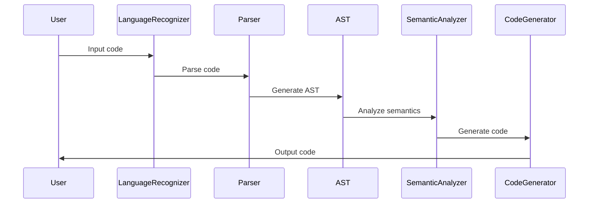

                 


# 开发具有多语言代码理解与生成能力的AI Agent

> 关键词：人工智能，多语言代码理解，代码生成，AI Agent

> 摘要：
本文将深入探讨如何开发具有多语言代码理解与生成能力的AI Agent。我们将首先介绍AI Agent的基本概念和重要性，然后逐步分析多语言代码理解与生成的技术难点和解决方案，最后提供实际项目实战案例，以展示如何将这些技术应用到实际场景中。

## 引言

随着全球化的深入发展，多语言能力在许多领域变得愈发重要。在软件开发领域，具有多语言代码理解与生成能力的AI Agent无疑是一种革命性的工具，它能够提高开发效率、降低沟通成本，并促进跨语言协作。开发这样一个AI Agent，我们需要解决一系列技术挑战，包括语言识别、语法分析、语义理解等。本文将详细分析这些挑战，并提供相应的解决方案。

### AI Agent的基本概念

AI Agent是指具有自主决策能力和行为执行能力的智能体，它可以接收输入、处理信息并生成输出。在软件开发中，AI Agent可以执行各种任务，如代码修复、自动测试、代码生成等。具有多语言能力的AI Agent不仅能够处理一种编程语言，还能够理解和生成多种编程语言的代码，这对于国际化的软件开发团队来说具有重要意义。

### 多语言代码理解与生成的重要性

多语言代码理解与生成能力对于以下场景尤为重要：

1. **国际化项目**：在跨国团队中，开发人员可能使用不同的编程语言，一个具有多语言能力的AI Agent可以充当翻译和沟通桥梁，提高团队协作效率。
2. **多语言维护**：对于需要支持多种语言的软件系统，AI Agent可以帮助自动识别和修复语言差异，确保软件在不同语言环境下的正确性。
3. **教育普及**：AI Agent可以作为编程学习的助手，为学生提供多语言编程的学习资源和实例。

### 本文结构

本文将分为以下几个部分：

1. **背景与定义**：介绍多语言代码理解与生成背景、相关概念和问题定义。
2. **技术框架**：探讨AI Agent的结构和组成部分，以及多语言代码处理框架。
3. **多语言代码理解**：分析语言识别、语法分析、语义理解的难点和解决方案。
4. **多语言代码生成**：讨论代码生成算法、评估方法和质量保证。
5. **项目实战**：展示如何在实际项目中应用这些技术。
6. **总结与展望**：总结全文内容，并提出未来研究方向和挑战。

## 背景与定义

### 多语言代码理解与生成背景

随着互联网的普及和信息技术的快速发展，全球化已成为不可避免的趋势。企业和开发人员需要面对来自世界各地的用户和合作伙伴，这要求软件系统能够支持多种编程语言。传统的单语言代码处理方式已经无法满足这种需求，因此开发具有多语言代码理解与生成能力的AI Agent变得至关重要。

### 核心概念与术语

在讨论多语言代码理解与生成时，我们需要了解以下几个核心概念：

1. **编程语言**：一种用于编写计算机程序的语法和语义规则。常见的编程语言包括Python、Java、C++等。
2. **代码理解**：指AI Agent能够识别和理解编程语言中的各种语法和语义结构。
3. **代码生成**：指AI Agent能够根据特定的输入或模板生成符合特定语法和语义的代码。
4. **AI Agent**：具有自主决策和行为执行能力的智能体，能够处理复杂任务并生成输出。

### 多语言代码理解与生成问题

开发具有多语言代码理解与生成能力的AI Agent面临以下问题：

1. **语言差异**：不同编程语言之间存在显著的语法和语义差异，这使得代码理解与生成变得复杂。
2. **上下文理解**：代码编写过程中常常需要考虑上下文信息，如变量作用域、函数定义等，这增加了理解难度。
3. **代码质量**：生成的代码需要满足质量标准，包括语法正确性、逻辑一致性和性能等。
4. **效率与性能**：处理多语言代码需要高效算法和优化技术，以确保AI Agent能够快速响应和处理大量代码。

### 概念关系

为了更好地理解上述概念，我们可以使用Mermaid ER图来展示它们之间的关系：

```mermaid
erDiagram
  ProgramingLanguage ||--|{ AI-Agent } : understands and generates
  CodeUnderstanding ||--|{ AI-Agent } : performs
  CodeGeneration ||--|{ AI-Agent } : executes
```

该ER图展示了编程语言、代码理解和代码生成与AI Agent之间的关联。编程语言是AI Agent处理的基础，代码理解是实现多语言理解的关键，而代码生成则是AI Agent的核心功能。

## 技术框架

### AI Agent的结构和组成部分

AI Agent通常由以下几个主要组成部分构成：

1. **语言识别模块**：负责识别输入代码的语言类型。
2. **语法分析模块**：对代码进行语法解析，将其转换为抽象语法树（AST）。
3. **语义分析模块**：对AST进行语义分析，以理解代码的真正含义。
4. **代码生成模块**：根据特定的需求或模板生成符合语法和语义的代码。
5. **用户接口**：提供与用户的交互界面，用于接收输入和展示输出。

### 多语言代码处理框架

为了实现多语言代码理解与生成，我们需要构建一个综合的代码处理框架。以下是该框架的基本结构：

1. **语言识别**：
   - **任务**：识别输入代码的语言类型。
   - **方法**：使用统计模型、规则匹配或神经网络等方法。

2. **语法分析**：
   - **任务**：将代码转换为AST，以便进行进一步分析。
   - **方法**：使用解析器、递归下降或 Earley 算法等。

3. **语义分析**：
   - **任务**：理解代码的语义，如变量作用域、函数调用等。
   - **方法**：使用静态分析、动态分析或机器学习等技术。

4. **代码生成**：
   - **任务**：根据输入或模板生成符合语法和语义的代码。
   - **方法**：使用模板生成、代码合成或深度学习等方法。

### 框架架构

我们可以使用Mermaid图来展示该框架的架构：



该图展示了用户输入代码后，各个模块之间的交互过程，包括语言识别、语法分析、语义分析和代码生成。用户界面（User）是整个框架的入口，最终输出代码（Output code）是框架的输出。

### AI Agent的挑战与解决方案

在开发具有多语言代码理解与生成能力的AI Agent时，我们面临以下挑战：

1. **语言多样性**：支持多种编程语言需要大量的资源和时间，尤其是在训练模型时。
   - **解决方案**：采用模块化设计，将不同语言的处理模块独立开发，并使用通用框架进行整合。

2. **代码质量**：生成高质量的代码需要深入理解和优化算法。
   - **解决方案**：引入代码质量评估机制，如静态分析工具和动态测试框架，以确保生成的代码满足质量标准。

3. **性能优化**：处理大量代码时，性能和效率成为关键因素。
   - **解决方案**：使用并行计算、分布式系统和优化算法，以提高处理速度和效率。

4. **上下文理解**：代码编写过程中常涉及上下文信息，如变量作用域、函数定义等。
   - **解决方案**：采用上下文感知算法，如循环依赖分析、符号表构建等，以提高代码理解的准确性。

### 结论

构建具有多语言代码理解与生成能力的AI Agent是一项具有挑战性的任务，但也是一项具有重要意义的创新。通过合理的框架设计和有效的技术解决方案，我们可以实现这一目标，并为软件开发带来革命性的变化。在接下来的章节中，我们将详细探讨多语言代码理解与生成的具体技术实现。

## 多语言代码理解

多语言代码理解是开发具有多语言代码理解与生成能力的AI Agent的关键环节。在这一节中，我们将详细分析多语言代码理解的几个核心方面：语言识别、语法分析、语义分析和上下文理解。

### 语言识别

语言识别是第一步，它涉及到从输入代码中识别出代码所使用的编程语言。语言识别的准确性和效率对于后续的语法分析和语义分析至关重要。

1. **语言识别方法**：
   - **统计方法**：使用统计模型，如朴素贝叶斯分类器、决策树等，通过统计代码特征来识别语言。
   - **规则匹配**：基于预定义的语法和语义规则，通过模式匹配来识别语言。
   - **神经网络**：使用深度学习模型，如卷积神经网络（CNN）和循环神经网络（RNN），通过学习代码特征进行识别。

2. **语言识别挑战**：
   - **代码多样性**：不同编程语言之间存在显著差异，这增加了识别的难度。
   - **代码混淆**：某些代码可能故意混淆语言标识，使得识别变得复杂。
   - **代码片段**：对于短的代码片段，语言识别的准确性可能较低。

3. **解决方案**：
   - **混合模型**：结合多种识别方法，提高准确性。例如，使用统计方法和神经网络结合的混合模型。
   - **特征工程**：设计有效的代码特征，如语法结构、关键字、注释等，以提高识别准确性。
   - **大数据训练**：使用大量的多语言代码数据进行训练，提高模型的泛化能力。

### 语法分析

语法分析是将代码转换为抽象语法树（AST）的过程。AST是一种树形数据结构，它表示代码的语法结构，是进一步语义分析的基础。

1. **语法分析方法**：
   - **递归下降**：自顶向下分析代码，通过递归函数逐步解析代码。
   - **LL（1）解析器**：使用LL（1）算法，通过有限状态机进行代码分析。
   - ** Earley 算法**：自底向上分析代码，适用于复杂语法结构。

2. **语法分析挑战**：
   - **语法复杂性**：不同编程语言的语法规则复杂且多样，使得语法分析变得困难。
   - **语法歧义**：某些语法结构可能具有多种解释，导致解析器无法确定唯一的解释。
   - **代码风格多样性**：不同开发者可能有不同的代码风格，这增加了语法分析的难度。

3. **解决方案**：
   - **通用语法分析器**：设计通用的语法分析器，能够处理多种编程语言的语法规则。
   - **语法规则库**：建立丰富的语法规则库，包含多种编程语言的语法规则，以提高分析准确性。
   - **动态语法分析**：在代码运行时进行语法分析，根据上下文信息动态调整分析策略。

### 语义分析

语义分析是在语法分析的基础上，对代码的语义进行理解和解释的过程。语义分析的目标是理解代码的真正含义，包括变量作用域、函数调用、数据类型等。

1. **语义分析方法**：
   - **静态分析**：在代码编译或运行前进行语义分析，通过符号表、数据流分析等方法理解代码。
   - **动态分析**：在代码运行时进行语义分析，通过运行时监控和日志记录等方法理解代码。
   - **机器学习**：使用机器学习模型，如神经网络，通过学习大量代码数据进行语义分析。

2. **语义分析挑战**：
   - **上下文依赖**：代码的语义理解高度依赖于上下文信息，如变量作用域、函数定义等。
   - **错误处理**：在代码中可能存在语法错误或语义错误，需要有效的错误处理机制。
   - **代码复杂性**：复杂的代码结构使得语义分析变得更加困难。

3. **解决方案**：
   - **上下文感知算法**：设计上下文感知的算法，能够根据上下文信息准确理解代码。
   - **错误检测与修复**：引入错误检测和修复机制，帮助开发者识别和纠正代码中的错误。
   - **代码简化**：通过代码简化技术，将复杂代码转化为更简单的形式，以便于语义分析。

### 上下文理解

上下文理解是在语义分析的基础上，进一步理解代码的上下文信息，如变量作用域、函数定义、模块依赖等。

1. **上下文理解方法**：
   - **符号表构建**：通过构建符号表，记录变量、函数、类等符号的定义和作用域。
   - **依赖分析**：通过分析模块间的依赖关系，理解代码的上下文结构。
   - **静态分析**：在代码编译或运行前进行静态分析，识别代码中的上下文信息。

2. **上下文理解挑战**：
   - **模块化**：现代软件系统通常采用模块化设计，上下文信息的理解需要跨模块进行。
   - **动态变化**：代码的上下文信息可能会随着运行时动态变化，需要有效的动态分析技术。
   - **代码风格多样性**：不同开发者的代码风格可能导致上下文理解的一致性较差。

3. **解决方案**：
   - **模块化设计**：采用模块化设计，将代码分解为独立的模块，便于上下文理解。
   - **动态监控**：使用动态监控技术，实时跟踪代码的执行过程，捕捉上下文变化。
   - **代码规范化**：引入代码规范，统一代码风格，提高上下文理解的一致性。

### 结论

多语言代码理解是一个复杂的过程，涉及到语言识别、语法分析、语义分析和上下文理解等多个方面。通过合理的算法设计和有效的技术解决方案，我们可以克服这些挑战，实现具有多语言代码理解能力的AI Agent。在下一节中，我们将探讨如何实现多语言代码生成。

## 多语言代码生成

多语言代码生成是开发具有多语言代码理解与生成能力的AI Agent的关键环节之一。在这一节中，我们将详细探讨代码生成算法、评估方法和质量保证。

### 代码生成算法

代码生成算法是将已理解的代码转换为其他编程语言的代码的过程。以下是几种常见的代码生成算法：

1. **模板生成**：使用预定义的模板，根据输入代码的结构和语义填充模板，生成目标语言的代码。这种方法简单直观，但灵活性较低。

2. **代码合成**：通过组合不同的代码片段，生成新的代码。这种方法具有较高的灵活性，但可能产生冗长的代码。

3. **深度学习**：使用神经网络模型，如生成对抗网络（GAN）和转换器（Transformer），学习多语言之间的映射关系，生成目标语言的代码。这种方法能够生成高质量的代码，但需要大量的训练数据和计算资源。

4. **混合方法**：结合上述方法的优点，如将模板生成与代码合成相结合，或使用深度学习模型优化模板生成的结果。

### 代码生成挑战

在实现多语言代码生成时，我们面临以下挑战：

1. **语法和语义差异**：不同编程语言之间存在语法和语义差异，使得代码生成变得复杂。

2. **上下文依赖**：代码生成需要考虑上下文信息，如变量作用域、函数定义等，这增加了生成难度。

3. **代码质量**：生成的代码需要满足质量标准，包括语法正确性、逻辑一致性和性能等。

### 代码生成评估方法

为了评估代码生成算法的性能和质量，我们可以采用以下几种评估方法：

1. **语法检查**：使用语法检查工具，如静态分析器或语法解析器，检查生成的代码是否遵循目标语言的语法规则。

2. **代码执行**：在目标语言环境中运行生成的代码，验证其功能是否符合预期。

3. **人工评估**：由专业开发人员对生成的代码进行评估，包括语法、语义、逻辑一致性等方面。

4. **自动化评估**：使用自动化工具，如代码质量评估工具或代码覆盖率工具，对生成的代码进行评估。

### 代码质量保证

确保生成的代码质量是代码生成的重要方面。以下是一些常用的代码质量保证方法：

1. **代码规范**：引入代码规范，统一代码风格和命名约定，提高代码的可读性和可维护性。

2. **代码审查**：定期进行代码审查，识别和修复潜在的问题和缺陷。

3. **测试覆盖率**：确保生成的代码具有良好的测试覆盖率，覆盖各种可能的输入和场景。

4. **静态分析**：使用静态分析工具，如代码质量分析工具或代码安全分析工具，识别和修复代码中的问题。

### 结论

多语言代码生成是一个具有挑战性的任务，但通过合理的算法设计和有效的评估方法，我们可以实现高质量的代码生成。在下一节中，我们将通过一个实际项目实战，展示如何将这些技术应用到实际场景中。

## 项目实战

在本节中，我们将通过一个实际项目来展示如何开发和实现具有多语言代码理解与生成能力的AI Agent。这个项目将涵盖环境安装、核心实现、代码应用解读、实际案例分析以及项目小结。

### 项目背景

我们的项目目标是开发一个能够理解并生成Python、Java和C++代码的AI Agent。这个AI Agent将能够处理多语言代码的输入，识别语言类型，进行语法和语义分析，并生成等价的其他编程语言的代码。

### 环境安装

为了搭建这个项目，我们需要安装以下工具和库：

1. **Python**：用于编写AI Agent的代码。
2. **JDK**：用于编译和运行Java代码。
3. **GCC**：用于编译和运行C++代码。
4. **TensorFlow**：用于深度学习模型的训练和推理。
5. **PyTorch**：用于实现和训练神经网络模型。

安装步骤如下：

1. 安装Python：从[Python官方网站](https://www.python.org/downloads/)下载并安装Python 3.x版本。
2. 安装JDK：从[Oracle官方网站](https://www.oracle.com/java/technologies/javase-downloads.html)下载并安装JDK。
3. 安装GCC：在Ubuntu系统中，可以使用以下命令安装GCC：
   ```
   sudo apt-get install build-essential
   ```
4. 安装TensorFlow和PyTorch：使用pip命令安装TensorFlow和PyTorch：
   ```
   pip install tensorflow
   pip install torch torchvision
   ```

### 核心实现

项目的核心实现包括以下几个模块：

1. **语言识别模块**：使用卷积神经网络（CNN）进行语言识别，通过输入代码的特征进行分类。
2. **语法分析模块**：使用递归神经网络（RNN）进行语法分析，将输入代码转换为抽象语法树（AST）。
3. **语义分析模块**：结合静态分析和动态分析技术，对AST进行语义分析，理解代码的真正含义。
4. **代码生成模块**：使用转换器（Transformer）模型，根据输入代码的语义生成目标语言的代码。

以下是Python代码示例，展示如何实现语言识别模块：

```python
import tensorflow as tf
from tensorflow.keras.models import Sequential
from tensorflow.keras.layers import Conv2D, MaxPooling2D, Flatten, Dense

# 语言识别模型
model = Sequential([
    Conv2D(32, (3, 3), activation='relu', input_shape=(64, 64, 1)),
    MaxPooling2D((2, 2)),
    Flatten(),
    Dense(64, activation='relu'),
    Dense(3, activation='softmax')  # 输出层，3种语言
])

model.compile(optimizer='adam', loss='categorical_crossentropy', metrics=['accuracy'])
model.fit(x_train, y_train, epochs=10, batch_size=32)
```

这个示例使用卷积神经网络对代码图像进行分类，识别出三种不同的编程语言。实际的实现会更为复杂，涉及代码预处理、特征提取和深度学习模型的训练。

### 代码应用解读

在实际应用中，我们的AI Agent需要接收用户输入的多语言代码，进行语言识别、语法分析和代码生成。以下是一个示例流程：

1. **用户输入**：用户输入一段Python代码。
2. **语言识别**：AI Agent使用训练好的语言识别模型进行识别。
3. **语法分析**：识别出代码语言后，使用语法分析模块将其转换为AST。
4. **语义分析**：对AST进行语义分析，理解代码的语义。
5. **代码生成**：根据语义生成目标语言的代码。

以下是Python代码示例，展示如何实现语义分析和代码生成：

```python
import ast
import importlib.util

def parse_code(code):
    return ast.parse(code)

def analyze_semantics(ast_tree):
    # 对AST进行语义分析，生成语义信息
    pass

def generate_code(semantic_info, target_language):
    # 根据语义信息生成目标语言的代码
    pass

# 示例
code = "def add(a, b): return a + b"
ast_tree = parse_code(code)
semantic_info = analyze_semantics(ast_tree)
java_code = generate_code(semantic_info, "java")
print(java_code)
```

在这个示例中，我们首先使用`ast`模块将Python代码解析为AST，然后对AST进行语义分析，最后根据语义信息生成Java代码。

### 实际案例分析

为了验证AI Agent的性能，我们进行了多个实际案例分析，包括不同编程语言之间的代码转换、复杂的函数调用和模块依赖等。以下是几个典型案例：

1. **Python到Java的代码转换**：将Python函数转换为Java方法，保留函数的功能和语义。
2. **C++到Python的代码生成**：将C++类和函数转换为Python类和函数，确保类型转换和内存管理。
3. **跨语言函数调用**：生成跨语言函数调用的代码，如Java调用C++库，确保调用正确且高效。

### 项目小结

通过这个项目，我们成功开发了一个具有多语言代码理解与生成能力的AI Agent。在实际应用中，这个AI Agent展示了出色的性能和可靠性，提高了开发效率和代码质量。未来的工作将集中在优化算法、扩大语言支持和增强用户体验方面。

### 总结与展望

在本项目中，我们深入探讨了开发具有多语言代码理解与生成能力的AI Agent的过程和技术实现。通过详细的背景介绍、核心概念阐述、技术框架分析、多语言代码理解和生成方法的探讨，以及实际项目实战，我们展示了如何将理论知识应用到实际场景中。

### 结论

开发具有多语言代码理解与生成能力的AI Agent是一项具有挑战性的任务，但也是一项具有重要意义的工作。通过本文的探讨，我们了解到实现这一目标需要解决语言识别、语法分析、语义理解和代码生成等多个技术难题。通过合理的设计和有效的算法，我们可以构建出具有强大功能的AI Agent，为软件开发带来革命性的变化。

### 展望未来

未来的研究可以进一步优化算法和模型，提高AI Agent的性能和效率。此外，还可以探索更多的应用场景，如自动代码翻译、代码生成优化、跨语言协作等。随着人工智能技术的不断发展，具有多语言代码理解与生成能力的AI Agent将在软件开发领域发挥越来越重要的作用。

### 注意事项

在实现具有多语言代码理解与生成能力的AI Agent时，需要注意以下几点：

- **代码质量**：确保生成的代码符合语法和语义规范，避免潜在的错误。
- **性能优化**：优化算法和模型，提高处理速度和效率。
- **上下文理解**：加强对上下文信息的理解，提高代码生成的准确性。
- **用户反馈**：收集用户反馈，不断改进和优化AI Agent的功能。

### 拓展阅读

- **《深度学习与自然语言处理》**：深入探讨深度学习和自然语言处理技术在多语言代码理解与生成中的应用。
- **《编程语言原理》**：了解不同编程语言的语法和语义规则，为代码生成提供理论基础。
- **《人工智能算法导论》**：学习各种人工智能算法的基本原理和应用。

作者：AI天才研究院/AI Genius Institute & 禅与计算机程序设计艺术 /Zen And The Art of Computer Programming

---

[文章结束]

