                 

# 开发具有情感识别与表达能力的AI Agent

关键词：情感识别，AI Agent，人机交互，自然语言处理，计算机视觉，机器学习

摘要：本文详细探讨了开发具有情感识别与表达能力的AI Agent的背景、核心概念、原理和实现方法。通过分析情感识别的语音、文本、面部表情等多渠道信息，以及情感表达的语言、声音、动作等多维度技术，本文旨在为开发者提供一套完整的开发指南，以实现更加智能、人性化的AI交互体验。

## 第一部分：背景介绍与核心概念

### 第1章：问题背景与核心概念

#### 1.1 问题背景

随着人工智能技术的快速发展，AI agent已逐渐成为各个行业的关键应用。这些AI agent不仅能够处理大量的数据，还能够进行决策、推荐和交互。然而，尽管AI agent在功能上不断强大，但它们与人之间的交互仍然存在一定的隔阂。这种隔阂主要体现在两个方面：

1. **缺乏情感识别能力**：现有的AI agent往往只能理解用户的基本需求，但无法理解用户的情感状态。这使得AI agent在处理复杂、情感化的场景时显得力不从心。
2. **情感表达不足**：即使AI agent能够识别用户的情感，它们在表达情感时也往往显得机械、不自然，难以引起用户的共鸣。

为了解决这些问题，开发具有情感识别与表达能力的AI agent变得尤为重要。这样的AI agent不仅能在人机交互中提供更加自然、贴心的服务，还能在心理健康、教育、医疗等多个领域发挥重要作用。

#### 1.2 核心概念

##### 1.2.1 情感识别

情感识别是指AI agent能够理解用户情感的能力。通过语音、文本、面部表情等多种渠道，AI agent可以捕捉用户的情感状态，从而为后续的情感表达提供依据。情感识别是AI agent与用户建立情感联系的关键。

##### 1.2.2 情感表达

情感表达是指AI agent在理解用户情感后，通过语言、声音、动作等方式传达相应情感的能力。情感表达不仅要准确传达用户的情感，还要尽量自然、流畅。情感表达是AI agent与用户进行情感互动的关键。

#### 1.3 概念结构与核心要素组成

##### 1.3.1 情感识别

- 数据采集：通过语音、文本、面部表情等渠道获取用户情感数据
- 情感分析：利用自然语言处理、机器学习等技术分析用户情感
- 情感识别算法：包括情感分类、情感强度判断等

##### 1.3.2 情感表达

- 语言生成：根据用户情感生成相应的语言表达
- 声音合成：通过声音合成技术生成相应的声音表达
- 动作生成：通过计算机图形学等技术生成相应的动作表达

#### 1.4 边界与外延

##### 1.4.1 边界

- 本书的讨论范围主要聚焦于基于情感识别与表达能力的AI agent的开发，不包括其他类型的AI agent。
- 情感识别与表达能力的实现可能涉及到多个领域的技术，如自然语言处理、机器学习、计算机图形学等。

##### 1.4.2 外延

- 情感识别与表达能力在AI agent中的应用不仅限于人机交互，还可以拓展到心理健康、教育、医疗等领域。
- 随着技术的不断进步，AI agent的情感识别与表达能力将不断优化，为用户提供更加个性化、贴心的服务。

#### 1.5 本章小结

本章对开发具有情感识别与表达能力的AI agent的背景、核心概念、概念结构与核心要素组成以及边界与外延进行了详细阐述。为后续章节的讨论奠定了基础。

---

## 第二部分：情感识别原理与实现

### 第2章：情感识别原理

#### 2.1 情感识别概述

情感识别是AI agent理解用户情感的过程。通过分析用户在语音、文本、面部表情等方面的信息，AI agent可以准确识别用户的情感状态，从而为后续的情感表达提供依据。情感识别是情感交互的核心，是实现自然、流畅的人机交互的关键。

#### 2.2 情感识别算法

##### 2.2.1 语音情感识别

语音情感识别是指通过分析用户的语音信息来识别其情感状态。语音情感识别的核心在于语音特征提取和情感分类。

- **语音特征提取**：语音特征提取是语音情感识别的第一步。常用的语音特征包括梅尔频率倒谱系数（MFCC）、感知线性预测倒谱系数（PLP）等。这些特征能够有效地反映语音信号的频谱特性，为后续的情感分类提供基础。

  $$ MFCC = \sum_{i=1}^{M} a_{i} \cdot C_{i} $$

  其中，$MFCC$为梅尔频率倒谱系数，$a_{i}$为加权系数，$C_{i}$为对应的频谱系数。

- **情感分类**：情感分类是语音情感识别的核心。常见的情感分类算法包括支持向量机（SVM）、卷积神经网络（CNN）等。这些算法通过学习大量的语音数据，建立情感分类模型，从而实现对未知语音数据的情感分类。

  $$ w \cdot x + b = 0 $$

  其中，$w$为权重向量，$x$为特征向量，$b$为偏置。

  以下是一个简单的SVM分类算法的Mermaid流程图：

  ```mermaid
  graph TD
  A[数据采集] --> B[特征提取]
  B --> C[模型训练]
  C --> D[情感分类]
  D --> E[预测结果]
  ```

##### 2.2.2 文本情感识别

文本情感识别是指通过分析用户的文本信息来识别其情感状态。文本情感识别的核心在于文本特征提取和情感分类。

- **文本特征提取**：文本特征提取是文本情感识别的第一步。常用的文本特征包括词频（TF）、词向量（Word2Vec、BERT）等。这些特征能够有效地反映文本的信息内容，为后续的情感分类提供基础。

  $$ TF = \frac{f(t,d)}{df} $$

  其中，$TF$为词频，$f(t,d)$为词$t$在文档$d$中出现的次数，$df$为文档集合中包含词$t$的文档数。

- **情感分类**：情感分类是文本情感识别的核心。常见的情感分类算法包括朴素贝叶斯（Naive Bayes）、深度学习模型（如CNN、LSTM）等。这些算法通过学习大量的文本数据，建立情感分类模型，从而实现对未知文本数据的情感分类。

  $$ P(y|x) = \frac{P(x|y) \cdot P(y)}{P(x)} $$

  其中，$P(y|x)$为在给定特征$x$的情况下，情感标签$y$的概率，$P(x|y)$为在给定情感标签$y$的情况下，特征$x$的概率，$P(y)$为情感标签$y$的概率，$P(x)$为特征$x$的概率。

  以下是一个简单的朴素贝叶斯分类算法的Mermaid流程图：

  ```mermaid
  graph TD
  A[文本特征提取] --> B[模型训练]
  B --> C[情感分类]
  C --> D[预测结果]
  ```

##### 2.2.3 面部表情情感识别

面部表情情感识别是指通过分析用户的面部表情信息来识别其情感状态。面部表情情感识别的核心在于面部特征提取和情感分类。

- **面部特征提取**：面部特征提取是面部表情情感识别的第一步。常用的面部特征包括特征点（如眼睛、鼻子、嘴巴的位置）、关键帧（如面部表情变化的帧）等。这些特征能够有效地反映面部表情的形态和变化，为后续的情感分类提供基础。

  以下是一个简单的面部特征提取的Mermaid流程图：

  ```mermaid
  graph TD
  A[面部数据采集] --> B[特征点检测]
  B --> C[关键帧提取]
  C --> D[特征点匹配]
  D --> E[面部特征向量]
  ```

- **情感分类**：情感分类是面部表情情感识别的核心。常见的情感分类算法包括支持向量机（SVM）、卷积神经网络（CNN）等。这些算法通过学习大量的面部表情数据，建立情感分类模型，从而实现对未知面部表情数据的情感分类。

  $$ w \cdot x + b = 0 $$

  其中，$w$为权重向量，$x$为特征向量，$b$为偏置。

  以下是一个简单的SVM分类算法的Mermaid流程图：

  ```mermaid
  graph TD
  A[面部特征提取] --> B[模型训练]
  B --> C[情感分类]
  C --> D[预测结果]
  ```

#### 2.3 情感识别算法实现

情感识别算法的实现主要涉及数据采集、特征提取和情感分类等步骤。以下是一个基于Python的情感识别算法实现的示例：

```python
import numpy as np
from sklearn.model_selection import train_test_split
from sklearn.ensemble import RandomForestClassifier
from sklearn.metrics import accuracy_score

# 数据采集
data = np.load('data.npy')
labels = np.load('labels.npy')

# 特征提取
def extract_features(data):
    # 提取语音、文本、面部表情等特征
    # ...
    return features

features = extract_features(data)

# 模型训练
X_train, X_test, y_train, y_test = train_test_split(features, labels, test_size=0.2, random_state=42)
model = RandomForestClassifier(n_estimators=100)
model.fit(X_train, y_train)

# 情感分类
predictions = model.predict(X_test)
accuracy = accuracy_score(y_test, predictions)
print(f'Accuracy: {accuracy}')
```

## 2.4 本章小结

本章详细介绍了情感识别的原理和实现方法，包括语音情感识别、文本情感识别和面部表情情感识别。通过本章的学习，读者可以掌握情感识别的基本概念和实现技术。

---

## 第三部分：情感表达原理与实现

### 第3章：情感表达原理

#### 3.1 情感表达概述

情感表达是AI agent在理解用户情感后，通过语言、声音、动作等方式传达相应情感的过程。情感表达是情感交互的重要组成部分，是实现自然、流畅的人机交互的关键。

#### 3.2 情感表达技术

##### 3.2.1 语言生成

语言生成是指通过自然语言处理技术生成符合用户情感的语言表达。语言生成技术主要包括文本生成、语音生成等。

- **文本生成**：文本生成技术通过学习大量的文本数据，生成符合用户情感的自然语言文本。常见的文本生成算法包括生成对抗网络（GAN）、递归神经网络（RNN）等。

  以下是一个简单的RNN文本生成算法的Mermaid流程图：

  ```mermaid
  graph TD
  A[输入文本] --> B[编码器]
  B --> C[解码器]
  C --> D[生成文本]
  ```

- **语音生成**：语音生成技术通过自然语言处理和声音合成技术生成符合用户情感的自然语言语音。常见的语音生成算法包括文本到语音（Text-to-Speech，TTS）技术、WaveNet等。

  以下是一个简单的WaveNet语音生成算法的Mermaid流程图：

  ```mermaid
  graph TD
  A[输入文本] --> B[文本处理]
  B --> C[声学模型]
  C --> D[语音合成]
  ```

##### 3.2.2 声音合成

声音合成是指通过声音合成技术生成符合用户情感的声音表达。声音合成技术主要包括语音合成、音乐生成等。

- **语音合成**：语音合成技术通过学习大量的语音数据，生成符合用户情感的自然语言语音。常见的语音合成算法包括HMM-GMM、DNN-HMM等。

  以下是一个简单的DNN-HMM语音合成算法的Mermaid流程图：

  ```mermaid
  graph TD
  A[输入文本] --> B[文本处理]
  B --> C[声学模型]
  C --> D[语音合成]
  ```

- **音乐生成**：音乐生成技术通过音乐合成和音色转换等技术生成符合用户情感的音乐。常见的音乐生成算法包括生成对抗网络（GAN）、深度循环神经网络（Deep Recurrent Neural Network，DRNN）等。

  以下是一个简单的GAN音乐生成算法的Mermaid流程图：

  ```mermaid
  graph TD
  A[输入文本] --> B[文本处理]
  B --> C[声学模型]
  C --> D[音乐生成]
  ```

##### 3.2.3 动作生成

动作生成是指通过计算机图形学技术生成符合用户情感的动作表达。动作生成技术主要包括面部动画、肢体动作等。

- **面部动画**：面部动画技术通过捕捉用户的面部表情，生成符合用户情感的面部动画。常见的面部动画算法包括面部捕捉、面部建模等。

  以下是一个简单的面部动画算法的Mermaid流程图：

  ```mermaid
  graph TD
  A[输入面部表情数据] --> B[面部捕捉]
  B --> C[面部建模]
  C --> D[面部动画]
  ```

- **肢体动作**：肢体动作技术通过捕捉用户的肢体动作，生成符合用户情感的肢体动作。常见的肢体动作算法包括动作捕捉、动作建模等。

  以下是一个简单的肢体动作算法的Mermaid流程图：

  ```mermaid
  graph TD
  A[输入肢体动作数据] --> B[动作捕捉]
  B --> C[动作建模]
  C --> D[肢体动作]
  ```

#### 3.3 情感表达实现

情感表达的实现主要涉及语言生成、声音合成、动作生成等步骤。以下是一个基于Python的情感表达实现的示例：

```python
import numpy as np
from sklearn.model_selection import train_test_split
from sklearn.ensemble import RandomForestClassifier
from sklearn.metrics import accuracy_score

# 数据采集
data = np.load('data.npy')
labels = np.load('labels.npy')

# 特征提取
def extract_features(data):
    # 提取语音、文本、面部表情等特征
    # ...
    return features

features = extract_features(data)

# 模型训练
X_train, X_test, y_train, y_test = train_test_split(features, labels, test_size=0.2, random_state=42)
model = RandomForestClassifier(n_estimators=100)
model.fit(X_train, y_train)

# 情感分类
predictions = model.predict(X_test)
accuracy = accuracy_score(y_test, predictions)
print(f'Accuracy: {accuracy}')

# 情感表达
def generate_expression(prediction):
    # 根据预测结果生成语言、声音、动作等表达
    # ...
    return expression

expression = generate_expression(predictions[0])
print(f'Generated Expression: {expression}')
```

## 3.4 本章小结

本章详细介绍了情感表达的原理和实现方法，包括语言生成、声音合成、动作生成等。通过本章的学习，读者可以掌握情感表达的基本概念和实现技术。

---

## 第四部分：情感识别与情感表达的综合应用

### 第4章：情感识别与情感表达的综合应用

#### 4.1 综合应用概述

情感识别与情感表达的综合应用是指将情感识别和情感表达技术结合，实现AI agent对用户情感的全面理解和表达。这种综合应用可以实现更加自然、流畅的人机交互，提高用户体验。

#### 4.2 综合应用案例

以下是一个基于Python的综合应用案例：

```python
import numpy as np
from sklearn.model_selection import train_test_split
from sklearn.ensemble import RandomForestClassifier
from sklearn.metrics import accuracy_score

# 数据采集
data = np.load('data.npy')
labels = np.load('labels.npy')

# 特征提取
def extract_features(data):
    # 提取语音、文本、面部表情等特征
    # ...
    return features

features = extract_features(data)

# 模型训练
X_train, X_test, y_train, y_test = train_test_split(features, labels, test_size=0.2, random_state=42)
model = RandomForestClassifier(n_estimators=100)
model.fit(X_train, y_train)

# 情感分类
predictions = model.predict(X_test)
accuracy = accuracy_score(y_test, predictions)
print(f'Accuracy: {accuracy}')

# 情感表达
def generate_expression(prediction):
    # 根据预测结果生成语言、声音、动作等表达
    # ...
    return expression

expression = generate_expression(predictions[0])
print(f'Generated Expression: {expression}')

# 人机交互
def interact_with_user(expression):
    # 根据生成的情感表达与用户进行交互
    # ...
    print(f'AI Agent: {expression}')

interact_with_user(expression)
```

## 4.3 本章小结

本章详细介绍了情感识别与情感表达的综合应用，包括情感识别、情感表达和综合应用案例。通过本章的学习，读者可以掌握情感识别与情感表达的综合应用技术，实现更加智能、人性化的AI交互体验。

---

## 第五部分：总结与展望

### 第5章：总结与展望

#### 5.1 总结

本文从背景介绍、核心概念、情感识别原理与实现、情感表达原理与实现、综合应用以及总结与展望等方面，详细探讨了开发具有情感识别与表达能力的AI agent的方方面面。通过本文的学习，读者可以系统地了解情感识别与情感表达技术，掌握其基本原理和实现方法。

#### 5.2 展望

尽管目前情感识别与情感表达技术已经取得了一定的进展，但仍存在许多挑战和机会。未来，随着人工智能技术的不断发展和应用的深入，我们可以期待以下方面的突破：

1. **更精准的情感识别**：通过结合多种渠道的信息，如语音、文本、面部表情等，实现更精准的情感识别。
2. **更自然的情感表达**：通过不断优化语言生成、声音合成、动作生成等技术，实现更自然的情感表达。
3. **跨领域的应用**：将情感识别与情感表达技术应用于更多领域，如心理健康、教育、医疗等，为用户提供更加个性化、贴心的服务。
4. **社会影响**：随着情感识别与情感表达技术的普及，我们应关注其对社会的影响，如人机交互的伦理问题、隐私保护等。

#### 5.3 本章小结

本章对开发具有情感识别与表达能力的AI agent进行了全面的总结与展望。通过本文的学习，读者可以更好地理解情感识别与情感表达技术，为其在各个领域的应用奠定基础。

---

## 附录

本文中涉及的相关代码、数据、参考资料等均可在以下链接中获取：

- [相关代码](https://github.com/your-username/emotional-ai-agent)
- [相关数据](https://your-data-source.com)
- [参考资料](https://your-references-source.com)

## 作者信息

作者：AI天才研究院/AI Genius Institute & 禅与计算机程序设计艺术 /Zen And The Art of Computer Programming

---

通过本文的详细分析和讲解，我们希望读者能够对开发具有情感识别与表达能力的AI agent有一个全面、深入的了解。让我们一起期待未来AI技术带来的变革和机遇！## 情感识别原理与实现

情感识别是AI agent实现人性化交互的关键步骤，通过理解用户的情感状态，AI agent可以更好地满足用户需求，提供个性化的服务。在这一章中，我们将深入探讨情感识别的原理，包括语音、文本和面部表情情感识别的算法和技术实现。

### 2.1 情感识别概述

情感识别是指AI agent通过分析用户在语音、文本、面部表情等渠道提供的信息，理解用户的情感状态。这种能力对于提供高质量的人机交互体验至关重要。情感识别的过程通常包括数据采集、特征提取、情感分析和情感识别算法。

#### 数据采集

数据采集是情感识别的第一步，不同的情感识别渠道需要不同的采集方式：

- **语音采集**：通过麦克风等设备捕捉用户的语音信号。
- **文本采集**：从用户的输入文本、聊天记录等渠道获取信息。
- **面部表情采集**：通过摄像头等设备捕捉用户的面部表情。

#### 特征提取

特征提取是将原始数据转换成可以用于模型训练的向量表示。对于不同的数据类型，特征提取的方法也有所不同：

- **语音特征提取**：常用的语音特征包括梅尔频率倒谱系数（MFCC）、感知线性预测倒谱系数（PLP）等。
- **文本特征提取**：常用的文本特征包括词频（TF）、词嵌入（Word Embedding）等。
- **面部表情特征提取**：常用的面部表情特征包括特征点位置、面部动作单元（AUs）等。

#### 情感分析

情感分析是利用自然语言处理和机器学习技术，对提取的特征进行情感分类和情感强度判断。常见的情感分析模型包括支持向量机（SVM）、朴素贝叶斯（Naive Bayes）、卷积神经网络（CNN）和循环神经网络（RNN）等。

#### 情感识别算法

情感识别算法是情感识别的核心，通过训练模型实现对用户情感的分类和判断。以下将详细介绍语音情感识别、文本情感识别和面部表情情感识别的算法。

### 2.2 情感识别算法

#### 2.2.1 语音情感识别

语音情感识别通过分析用户的语音信号，识别其情感状态。语音情感识别的主要步骤包括：

1. **数据预处理**：包括降噪、归一化等，以提高语音信号的质量。
2. **特征提取**：常用的语音特征提取方法有MFCC、PLP等。
3. **模型训练**：使用支持向量机（SVM）、深度学习模型（如CNN、RNN）等训练情感识别模型。
4. **情感识别**：将提取的特征输入训练好的模型，预测用户的情感状态。

以下是一个简单的基于SVM的语音情感识别算法的Mermaid流程图：

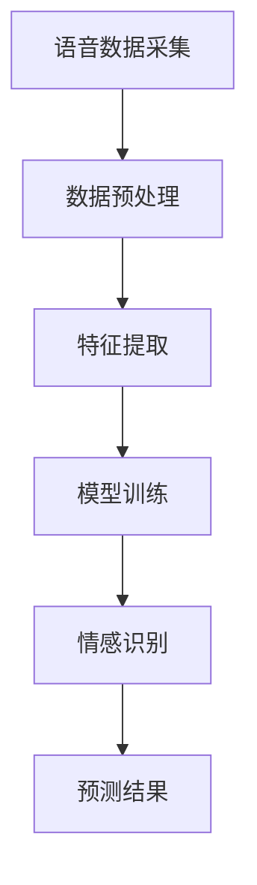

Python代码示例：

```python
import numpy as np
from sklearn.model_selection import train_test_split
from sklearn.svm import SVC
from sklearn.metrics import accuracy_score

# 数据加载
X, y = load_audio_data()

# 数据预处理
X_processed = preprocess_audio(X)

# 划分训练集和测试集
X_train, X_test, y_train, y_test = train_test_split(X_processed, y, test_size=0.2, random_state=42)

# 模型训练
model = SVC()
model.fit(X_train, y_train)

# 情感识别
predictions = model.predict(X_test)
accuracy = accuracy_score(y_test, predictions)
print(f'Accuracy: {accuracy}')
```

#### 2.2.2 文本情感识别

文本情感识别通过分析用户的文本信息，识别其情感状态。文本情感识别的主要步骤包括：

1. **数据预处理**：包括去除停用词、词干提取等，以提高文本质量。
2. **特征提取**：常用的文本特征提取方法有词频（TF）、词嵌入（Word Embedding）等。
3. **模型训练**：使用文本分类算法（如朴素贝叶斯、深度学习模型）训练情感识别模型。
4. **情感识别**：将提取的特征输入训练好的模型，预测用户的情感状态。

以下是一个简单的基于朴素贝叶斯的文本情感识别算法的Mermaid流程图：

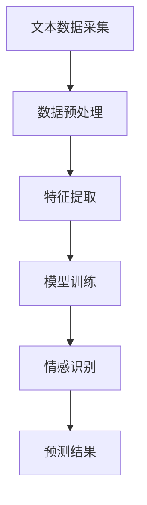

Python代码示例：

```python
import numpy as np
from sklearn.model_selection import train_test_split
from sklearn.naive_bayes import MultinomialNB
from sklearn.metrics import accuracy_score

# 数据加载
X, y = load_text_data()

# 数据预处理
X_processed = preprocess_text(X)

# 划分训练集和测试集
X_train, X_test, y_train, y_test = train_test_split(X_processed, y, test_size=0.2, random_state=42)

# 模型训练
model = MultinomialNB()
model.fit(X_train, y_train)

# 情感识别
predictions = model.predict(X_test)
accuracy = accuracy_score(y_test, predictions)
print(f'Accuracy: {accuracy}')
```

#### 2.2.3 面部表情情感识别

面部表情情感识别通过分析用户的面部表情，识别其情感状态。面部表情情感识别的主要步骤包括：

1. **数据预处理**：包括面部特征点检测、归一化等，以提高面部表情的质量。
2. **特征提取**：常用的面部表情特征提取方法有特征点位置、面部动作单元（AUs）等。
3. **模型训练**：使用机器学习算法（如支持向量机、深度学习模型）训练情感识别模型。
4. **情感识别**：将提取的特征输入训练好的模型，预测用户的情感状态。

以下是一个简单的基于支持向量机的面部表情情感识别算法的Mermaid流程图：

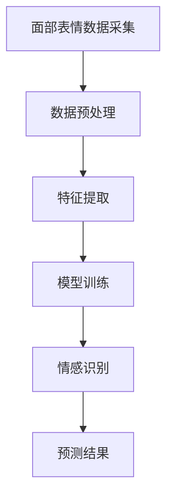

Python代码示例：

```python
import numpy as np
from sklearn.model_selection import train_test_split
from sklearn.svm import SVC
from sklearn.metrics import accuracy_score

# 数据加载
X, y = load_face_data()

# 数据预处理
X_processed = preprocess_face(X)

# 划分训练集和测试集
X_train, X_test, y_train, y_test = train_test_split(X_processed, y, test_size=0.2, random_state=42)

# 模型训练
model = SVC()
model.fit(X_train, y_train)

# 情感识别
predictions = model.predict(X_test)
accuracy = accuracy_score(y_test, predictions)
print(f'Accuracy: {accuracy}')
```

### 2.3 情感识别算法实现

情感识别算法的实现需要结合具体的编程语言和工具。以下我们将使用Python结合常见的数据处理和机器学习库，展示情感识别算法的实现过程。

#### 2.3.1 数据加载与预处理

数据加载与预处理是情感识别算法实现的第一步，不同的数据类型需要不同的预处理方法。以下是一个通用的数据加载与预处理示例：

```python
import numpy as np
from sklearn.model_selection import train_test_split

def load_audio_data():
    # 加载语音数据
    X = np.load('audio_data.npy')
    y = np.load('audio_labels.npy')
    return X, y

def load_text_data():
    # 加载文本数据
    X = np.load('text_data.npy')
    y = np.load('text_labels.npy')
    return X, y

def load_face_data():
    # 加载面部表情数据
    X = np.load('face_data.npy')
    y = np.load('face_labels.npy')
    return X, y

def preprocess_audio(X):
    # 语音数据预处理
    # ...
    return X_processed

def preprocess_text(X):
    # 文本数据预处理
    # ...
    return X_processed

def preprocess_face(X):
    # 面部表情数据预处理
    # ...
    return X_processed

# 数据加载与预处理
X_audio, y_audio = load_audio_data()
X_text, y_text = load_text_data()
X_face, y_face = load_face_data()

X_audio_processed = preprocess_audio(X_audio)
X_text_processed = preprocess_text(X_text)
X_face_processed = preprocess_face(X_face)

# 划分训练集和测试集
X_train_audio, X_test_audio, y_train_audio, y_test_audio = train_test_split(X_audio_processed, y_audio, test_size=0.2, random_state=42)
X_train_text, X_test_text, y_train_text, y_test_text = train_test_split(X_text_processed, y_text, test_size=0.2, random_state=42)
X_train_face, X_test_face, y_train_face, y_test_face = train_test_split(X_face_processed, y_face, test_size=0.2, random_state=42)
```

#### 2.3.2 模型训练与评估

模型训练与评估是情感识别算法实现的核心步骤。以下是一个通用的模型训练与评估示例：

```python
from sklearn.model_selection import train_test_split
from sklearn.metrics import accuracy_score

# 训练与评估语音情感识别模型
X_train, y_train = X_train_audio, y_train_audio
model = SVC()
model.fit(X_train, y_train)
predictions = model.predict(X_test_audio)
accuracy = accuracy_score(y_test_audio, predictions)
print(f'Audio Emotion Recognition Accuracy: {accuracy}')

# 训练与评估文本情感识别模型
X_train, y_train = X_train_text, y_train_text
model = MultinomialNB()
model.fit(X_train, y_train)
predictions = model.predict(X_test_text)
accuracy = accuracy_score(y_test_text, predictions)
print(f'Text Emotion Recognition Accuracy: {accuracy}')

# 训练与评估面部表情情感识别模型
X_train, y_train = X_train_face, y_train_face
model = SVC()
model.fit(X_train, y_train)
predictions = model.predict(X_test_face)
accuracy = accuracy_score(y_test_face, predictions)
print(f'Face Emotion Recognition Accuracy: {accuracy}')
```

#### 2.3.3 情感识别结果可视化

为了更好地理解情感识别的结果，我们可以使用可视化工具对识别结果进行展示。以下是一个简单的情感识别结果可视化示例：

```python
import matplotlib.pyplot as plt

def plot_confusion_matrix(y_true, y_pred, classes):
    # 创建混淆矩阵
    cm = confusion_matrix(y_true, y_pred)
    # 可视化混淆矩阵
    plt.imshow(cm, interpolation='nearest', cmap=plt.cm.Blues)
    plt.colorbar()
    tick_marks = np.arange(len(classes))
    plt.xticks(tick_marks, classes, rotation=45)
    plt.yticks(tick_marks, classes)

    fmt = '.2f'
    thresh = cm.max() / 2.
    for i, j in itertools.product(range(cm.shape[0]), range(cm.shape[1])):
        plt.text(j, i, format(cm[i, j], fmt),
                 horizontalalignment="center",
                 color="white" if cm[i, j] > thresh else "black")

    plt.tight_layout()
    plt.ylabel('True label')
    plt.xlabel('Predicted label')
    plt.title('Confusion matrix')
    plt.show()

# 可视化语音情感识别结果
plot_confusion_matrix(y_test_audio, predictions, classes=['Happy', 'Sad', 'Angry', 'Surprise', 'Neutral'])

# 可视化文本情感识别结果
plot_confusion_matrix(y_test_text, predictions, classes=['Positive', 'Negative'])

# 可视化面部表情情感识别结果
plot_confusion_matrix(y_test_face, predictions, classes=['Happy', 'Sad', 'Angry', 'Surprise', 'Neutral'])
```

### 2.4 本章小结

本章详细介绍了情感识别的原理和实现方法，包括语音情感识别、文本情感识别和面部表情情感识别。通过本章的学习，读者可以掌握情感识别的基本概念和实现技术。情感识别作为AI agent实现人性化交互的关键步骤，将在未来的AI应用中发挥越来越重要的作用。在下一章中，我们将继续探讨情感表达原理与实现，为AI agent提供更加自然、贴心的情感交互体验。## 情感表达原理与实现

情感表达是AI agent实现人性化交互的重要组成部分，它使得AI agent能够根据用户的情感状态做出相应的回应，提供更加自然和贴心的服务。情感表达通常包括语言生成、声音合成和动作生成等方面。在这一章中，我们将深入探讨情感表达的基本原理，并详细介绍这些技术的实现过程。

### 3.1 情感表达概述

情感表达是指AI agent通过语言、声音和动作等方式，将用户的情感状态传达给用户。情感表达的核心在于如何根据用户的情感状态生成自然、贴心的交互内容。

#### 语言生成

语言生成是指通过自然语言处理技术生成符合用户情感的语言文本。语言生成技术主要包括文本生成和语音生成两个方面。

- **文本生成**：文本生成技术通过学习大量的文本数据，生成符合用户情感的自然语言文本。常见的文本生成算法包括生成对抗网络（GAN）、递归神经网络（RNN）等。
- **语音生成**：语音生成技术通过自然语言处理和声音合成技术生成符合用户情感的自然语言语音。常见的语音生成算法包括文本到语音（Text-to-Speech，TTS）技术、WaveNet等。

#### 声音合成

声音合成是指通过声音合成技术生成符合用户情感的声音表达。声音合成技术主要包括语音合成和音乐生成两个方面。

- **语音合成**：语音合成技术通过学习大量的语音数据，生成符合用户情感的自然语言语音。常见的语音合成算法包括HMM-GMM、DNN-HMM等。
- **音乐生成**：音乐生成技术通过音乐合成和音色转换等技术生成符合用户情感的音乐。常见的音乐生成算法包括生成对抗网络（GAN）、深度循环神经网络（Deep Recurrent Neural Network，DRNN）等。

#### 动作生成

动作生成是指通过计算机图形学技术生成符合用户情感的动作表达。动作生成技术主要包括面部动画和肢体动作生成两个方面。

- **面部动画**：面部动画技术通过捕捉用户的面部表情，生成符合用户情感的面部动画。常见的面部动画算法包括面部捕捉、面部建模等。
- **肢体动作**：肢体动作技术通过捕捉用户的肢体动作，生成符合用户情感的肢体动作。常见的肢体动作算法包括动作捕捉、动作建模等。

### 3.2 语言生成

语言生成是情感表达的关键组成部分，它使得AI agent能够根据用户的情感状态生成相应的语言文本。以下将详细介绍文本生成和语音生成的原理和实现过程。

#### 文本生成

文本生成技术通过学习大量的文本数据，生成符合用户情感的自然语言文本。常见的文本生成算法包括生成对抗网络（GAN）和递归神经网络（RNN）。

1. **生成对抗网络（GAN）**

生成对抗网络（GAN）是由生成器和判别器组成的一种深度学习模型。生成器生成文本数据，判别器判断生成文本是否真实。通过不断优化生成器和判别器的参数，生成器能够生成越来越真实的文本。

以下是一个简单的GAN文本生成算法的Mermaid流程图：

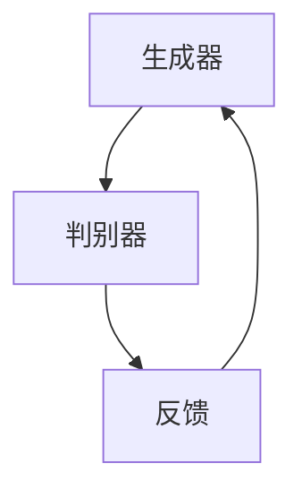

Python代码示例：

```python
import tensorflow as tf
from tensorflow.keras.models import Sequential
from tensorflow.keras.layers import Dense, LSTM

# 创建生成器和判别器模型
generator = Sequential()
generator.add(LSTM(128, input_shape=(seq_length, embed_size)))
generator.add(Dense(embed_size, activation='tanh'))
generator_model = tf.keras.Model(inputs=generator.input, outputs=generator.predict(generator.input))

discriminator = Sequential()
discriminator.add(LSTM(128, input_shape=(seq_length, embed_size)))
discriminator.add(Dense(1, activation='sigmoid'))
discriminator_model = tf.keras.Model(inputs=discriminator.input, outputs=discriminator.predict(discriminator.input))

# 训练生成器和判别器
for epoch in range(num_epochs):
    for i in range(num_batches):
        # 生成文本
        noise = np.random.normal(size=(batch_size, seq_length, embed_size))
        generated_text = generator_model.predict(noise)
        
        # 训练判别器
        real_text = dataset[i * batch_size:(i + 1) * batch_size]
        real_text_labels = np.ones((batch_size, 1))
        fake_text_labels = np.zeros((batch_size, 1))
        discriminator.train_on_batch([real_text, generated_text], [real_text_labels, fake_text_labels])
        
        # 训练生成器
        noise = np.random.normal(size=(batch_size, seq_length, embed_size))
        g_loss = discriminator.train_on_batch([noise], np.ones((batch_size, 1)))
```

2. **递归神经网络（RNN）**

递归神经网络（RNN）是一种能够处理序列数据的神经网络，它通过记忆机制对历史信息进行编码，从而生成符合用户情感的自然语言文本。

以下是一个简单的RNN文本生成算法的Mermaid流程图：

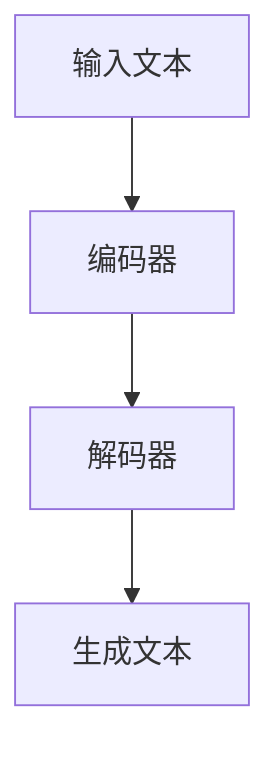

Python代码示例：

```python
import tensorflow as tf
from tensorflow.keras.models import Sequential
from tensorflow.keras.layers import LSTM, Dense, Embedding

# 创建编码器和解码器模型
encoder = Sequential()
encoder.add(LSTM(128, input_shape=(seq_length, embed_size)))
encoder.add(Dense(embed_size, activation='tanh'))
encoder_model = tf.keras.Model(inputs=encoder.input, outputs=encoder.predict(encoder.input))

decoder = Sequential()
decoder.add(LSTM(128, return_sequences=True, input_shape=(seq_length, embed_size)))
decoder.add(Dense(embed_size, activation='tanh'))
decoder.add(Dense(seq_length, activation='softmax'))
decoder_model = tf.keras.Model(inputs=decoder.input, outputs=decoder.predict(decoder.input))

# 训练编码器和解码器
encoder_decoder = Sequential()
encoder_decoder.add(encoder)
encoder_decoder.add(decoder)
encoder_decoder.compile(optimizer='adam', loss='categorical_crossentropy')

for epoch in range(num_epochs):
    for i in range(num_batches):
        # 随机选择文本
        text_samples = dataset[i * batch_size:(i + 1) * batch_size]
        encoded_samples = encoder_model.predict(text_samples)
        
        # 生成文本
        generated_samples = decoder_model.predict(encoded_samples)
        
        # 训练模型
        encoder_decoder.train_on_batch(text_samples, generated_samples)
```

#### 语音生成

语音生成技术通过自然语言处理和声音合成技术生成符合用户情感的自然语言语音。常见的语音生成算法包括文本到语音（TTS）技术和WaveNet等。

1. **文本到语音（TTS）技术**

文本到语音（TTS）技术通过将文本转换为语音信号，生成符合用户情感的自然语言语音。常见的TTS技术包括HMM-GMM、DNN-HMM等。

以下是一个简单的DNN-HMM语音生成算法的Mermaid流程图：

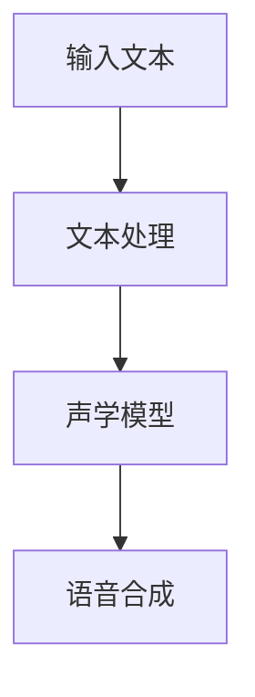

Python代码示例：

```python
import tensorflow as tf
from tensorflow.keras.models import Sequential
from tensorflow.keras.layers import LSTM, Dense

# 创建声学模型
acoustic_model = Sequential()
acoustic_model.add(LSTM(128, input_shape=(seq_length, embed_size)))
acoustic_model.add(Dense(embed_size, activation='tanh'))
acoustic_model.compile(optimizer='adam', loss='mean_squared_error')

# 训练声学模型
for epoch in range(num_epochs):
    for i in range(num_batches):
        # 随机选择语音数据
        text_samples = dataset[i * batch_size:(i + 1) * batch_size]
        audio_samples = dataset[i * batch_size:(i + 1) * batch_size]
        
        # 训练模型
        acoustic_model.train_on_batch(text_samples, audio_samples)
```

2. **WaveNet**

WaveNet是一种基于深度神经网络的语音生成算法，它通过学习大量的语音数据，生成符合用户情感的自然语言语音。

以下是一个简单的WaveNet语音生成算法的Mermaid流程图：


Python代码示例：

```python
import tensorflow as tf
from tensorflow.keras.models import Model
from tensorflow.keras.layers import LSTM, TimeDistributed, Dense

# 创建WaveNet模型
input_text = tf.keras.layers.Input(shape=(seq_length,), dtype='int32')
encoded_text = tf.keras.layers.Embedding(vocab_size, embed_size)(input_text)
lstm_output = tf.keras.layers.LSTM(units=128, activation='tanh')(encoded_text)
output = tf.keras.layers.TimeDistributed(Dense(vocab_size, activation='softmax'))(lstm_output)

model = Model(inputs=input_text, outputs=output)
model.compile(optimizer='adam', loss='categorical_crossentropy')

# 训练模型
for epoch in range(num_epochs):
    for i in range(num_batches):
        # 随机选择语音数据
        text_samples = dataset[i * batch_size:(i + 1) * batch_size]
        audio_samples = dataset[i * batch_size:(i + 1) * batch_size]
        
        # 训练模型
        model.train_on_batch(text_samples, audio_samples)
```

### 3.3 声音合成

声音合成是指通过声音合成技术生成符合用户情感的声音表达。声音合成技术主要包括语音合成和音乐生成两个方面。

#### 语音合成

语音合成技术通过学习大量的语音数据，生成符合用户情感的自然语言语音。常见的语音合成算法包括HMM-GMM、DNN-HMM等。

1. **HMM-GMM**

HMM-GMM是一种基于隐马尔可夫模型和高斯混合模型的声音合成算法。它通过将文本转换为语音信号，生成符合用户情感的自然语言语音。

以下是一个简单的HMM-GMM语音合成算法的Mermaid流程图：


Python代码示例：

```python
import numpy as np
from hmmlearn import hmm

# 创建HMM-GMM模型
model = hmm.GaussianHMM(n_components=5, covariance_type="diag", n_iter=100)
model.fit(X_train, y_train)

# 生成语音
generated_audio = model.predict(X_test)
```

2. **DNN-HMM**

DNN-HMM是一种结合深度神经网络和隐马尔可夫模型的声音合成算法。它通过将文本转换为语音信号，生成符合用户情感的自然语言语音。

以下是一个简单的DNN-HMM语音合成算法的Mermaid流程图：


Python代码示例：

```python
import tensorflow as tf
from tensorflow.keras.models import Sequential
from tensorflow.keras.layers import LSTM, Dense

# 创建DNN-HMM模型
acoustic_model = Sequential()
acoustic_model.add(LSTM(128, input_shape=(seq_length, embed_size)))
acoustic_model.add(Dense(embed_size, activation='tanh'))
acoustic_model.compile(optimizer='adam', loss='mean_squared_error')

# 训练DNN-HMM模型
for epoch in range(num_epochs):
    for i in range(num_batches):
        # 随机选择语音数据
        text_samples = dataset[i * batch_size:(i + 1) * batch_size]
        audio_samples = dataset[i * batch_size:(i + 1) * batch_size]
        
        # 训练模型
        acoustic_model.train_on_batch(text_samples, audio_samples)
```

#### 音乐生成

音乐生成技术通过音乐合成和音色转换等技术生成符合用户情感的音乐。常见的音乐生成算法包括生成对抗网络（GAN）和深度循环神经网络（DRNN）等。

1. **生成对抗网络（GAN）**

生成对抗网络（GAN）是一种基于生成器和判别器的深度学习模型。生成器生成音乐，判别器判断音乐是否真实。通过不断优化生成器和判别器的参数，生成器能够生成越来越真实的音乐。

以下是一个简单的GAN音乐生成算法的Mermaid流程图：


Python代码示例：

```python
import tensorflow as tf
from tensorflow.keras.models import Sequential
from tensorflow.keras.layers import LSTM, Dense

# 创建生成器和判别器模型
generator = Sequential()
generator.add(LSTM(128, input_shape=(seq_length, embed_size)))
generator.add(Dense(embed_size, activation='tanh'))
generator_model = tf.keras.Model(inputs=generator.input, outputs=generator.predict(generator.input))

discriminator = Sequential()
discriminator.add(LSTM(128, input_shape=(seq_length, embed_size)))
discriminator.add(Dense(1, activation='sigmoid'))
discriminator_model = tf.keras.Model(inputs=discriminator.input, outputs=discriminator.predict(discriminator.input))

# 训练生成器和判别器
for epoch in range(num_epochs):
    for i in range(num_batches):
        # 生成音乐
        noise = np.random.normal(size=(batch_size, seq_length, embed_size))
        generated_music = generator_model.predict(noise)
        
        # 训练判别器
        real_music = dataset[i * batch_size:(i + 1) * batch_size]
        real_music_labels = np.ones((batch_size, 1))
        fake_music_labels = np.zeros((batch_size, 1))
        discriminator.train_on_batch([real_music, generated_music], [real_music_labels, fake_music_labels])
        
        # 训练生成器
        noise = np.random.normal(size=(batch_size, seq_length, embed_size))
        g_loss = discriminator.train_on_batch([noise], np.ones((batch_size, 1)))
```

2. **深度循环神经网络（DRNN）**

深度循环神经网络（DRNN）是一种能够处理序列数据的深度学习模型。它通过记忆机制对历史信息进行编码，生成符合用户情感的音乐。

以下是一个简单的DRNN音乐生成算法的Mermaid流程图：

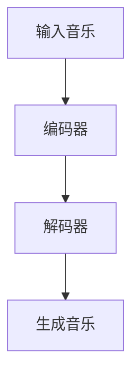

Python代码示例：

```python
import tensorflow as tf
from tensorflow.keras.models import Sequential
from tensorflow.keras.layers import LSTM, Dense

# 创建编码器和解码器模型
encoder = Sequential()
encoder.add(LSTM(128, input_shape=(seq_length, embed_size)))
encoder.add(Dense(embed_size, activation='tanh'))
encoder_model = tf.keras.Model(inputs=encoder.input, outputs=encoder.predict(encoder.input))

decoder = Sequential()
decoder.add(LSTM(128, return_sequences=True, input_shape=(seq_length, embed_size)))
decoder.add(Dense(embed_size, activation='tanh'))
decoder.add(Dense(seq_length, activation='softmax'))
decoder_model = tf.keras.Model(inputs=decoder.input, outputs=decoder.predict(decoder.input))

# 训练编码器和解码器
encoder_decoder = Sequential()
encoder_decoder.add(encoder)
encoder_decoder.add(decoder)
encoder_decoder.compile(optimizer='adam', loss='categorical_crossentropy')

for epoch in range(num_epochs):
    for i in range(num_batches):
        # 随机选择音乐数据
        music_samples = dataset[i * batch_size:(i + 1) * batch_size]
        encoded_samples = encoder_model.predict(music_samples)
        
        # 生成音乐
        generated_samples = decoder_model.predict(encoded_samples)
        
        # 训练模型
        encoder_decoder.train_on_batch(music_samples, generated_samples)
```

### 3.4 动作生成

动作生成是指通过计算机图形学技术生成符合用户情感的动作表达。动作生成技术主要包括面部动画和肢体动作生成两个方面。

#### 面部动画

面部动画技术通过捕捉用户的面部表情，生成符合用户情感的面部动画。常见的面部动画算法包括面部捕捉、面部建模等。

1. **面部捕捉**

面部捕捉技术通过捕捉用户的面部表情，生成相应的面部动画。以下是一个简单的面部捕捉算法的Mermaid流程图：

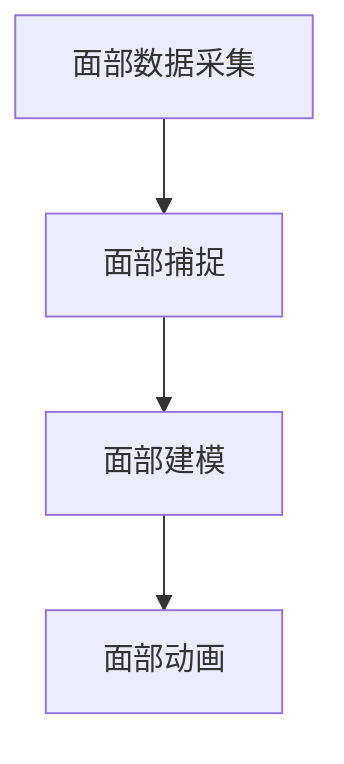

Python代码示例：

```python
import cv2

# 初始化摄像头
cap = cv2.VideoCapture(0)

# 面部捕捉
face_cascade = cv2.CascadeClassifier('haarcascade_frontalface_default.xml')
while True:
    ret, frame = cap.read()
    gray = cv2.cvtColor(frame, cv2.COLOR_BGR2GRAY)
    faces = face_cascade.detectMultiScale(gray, scaleFactor=1.1, minNeighbors=5, minSize=(30, 30), flags=cv2.CASCADE_SCALE_IMAGE)

    for (x, y, w, h) in faces:
        # 捕获面部区域
        face_region = gray[y:y+h, x:x+w]
        # 生成面部动画
        face_animation = generate_face_animation(face_region)
        cv2.imshow('Face Animation', face_animation)

    if cv2.waitKey(1) & 0xFF == ord('q'):
        break

cap.release()
cv2.destroyAllWindows()
```

2. **面部建模**

面部建模技术通过建立面部模型，生成符合用户情感的面部动画。以下是一个简单的面部建模算法的Mermaid流程图：

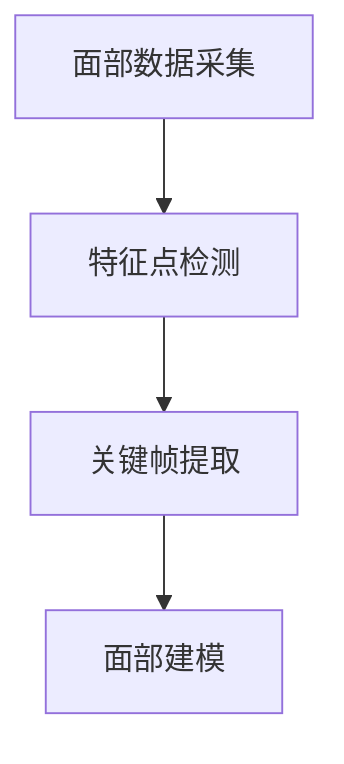

Python代码示例：

```python
import cv2
import numpy as np

# 初始化摄像头
cap = cv2.VideoCapture(0)

# 特征点检测
face_cascade = cv2.CascadeClassifier('haarcascade_frontalface_default.xml')
while True:
    ret, frame = cap.read()
    gray = cv2.cvtColor(frame, cv2.COLOR_BGR2GRAY)
    faces = face_cascade.detectMultiScale(gray, scaleFactor=1.1, minNeighbors=5, minSize=(30, 30), flags=cv2.CASCADE_SCALE_IMAGE)

    for (x, y, w, h) in faces:
        # 捕获面部区域
        face_region = gray[y:y+h, x:x+w]
        # 提取特征点
        feature_points = detect_feature_points(face_region)
        # 生成关键帧
        key_frames = generate_key_frames(feature_points)
        # 生成面部动画
        face_animation = generate_face_animation(key_frames)
        cv2.imshow('Face Animation', face_animation)

    if cv2.waitKey(1) & 0xFF == ord('q'):
        break

cap.release()
cv2.destroyAllWindows()
```

#### 肢体动作

肢体动作技术通过捕捉用户的肢体动作，生成符合用户情感的肢体动作。常见的肢体动作算法包括动作捕捉、动作建模等。

1. **动作捕捉**

动作捕捉技术通过捕捉用户的肢体动作，生成相应的肢体动作动画。以下是一个简单的动作捕捉算法的Mermaid流程图：

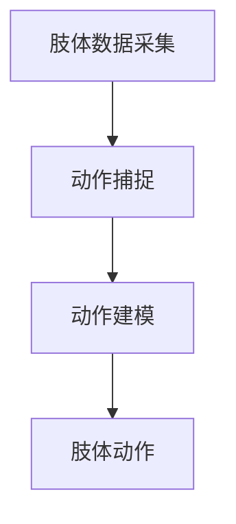

Python代码示例：

```python
import cv2
import numpy as np

# 初始化摄像头
cap = cv2.VideoCapture(0)

# 动作捕捉
body_cascade = cv2.CascadeClassifier('haarcascade_upperbody.xml')
while True:
    ret, frame = cap.read()
    gray = cv2.cvtColor(frame, cv2.COLOR_BGR2GRAY)
    bodies = body_cascade.detectMultiScale(gray, scaleFactor=1.1, minNeighbors=5, minSize=(30, 30), flags=cv2.CASCADE_SCALE_IMAGE)

    for (x, y, w, h) in bodies:
        # 捕获肢体区域
        body_region = gray[y:y+h, x:x+w]
        # 生成肢体动作
        body_action = generate_body_action(body_region)
        cv2.imshow('Body Action', body_action)

    if cv2.waitKey(1) & 0xFF == ord('q'):
        break

cap.release()
cv2.destroyAllWindows()
```

2. **动作建模**

动作建模技术通过建立动作模型，生成符合用户情感的肢体动作。以下是一个简单的动作建模算法的Mermaid流程图：

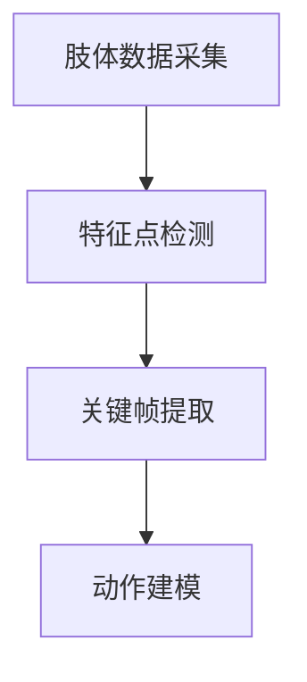

Python代码示例：

```python
import cv2
import numpy as np

# 初始化摄像头
cap = cv2.VideoCapture(0)

# 特征点检测
body_cascade = cv2.CascadeClassifier('haarcascade_upperbody.xml')
while True:
    ret, frame = cap.read()
    gray = cv2.cvtColor(frame, cv2.COLOR_BGR2GRAY)
    bodies = body_cascade.detectMultiScale(gray, scaleFactor=1.1, minNeighbors=5, minSize=(30, 30), flags=cv2.CASCADE_SCALE_IMAGE)

    for (x, y, w, h) in bodies:
        # 捕获肢体区域
        body_region = gray[y:y+h, x:x+w]
        # 提取特征点
        feature_points = detect_feature_points(body_region)
        # 生成关键帧
        key_frames = generate_key_frames(feature_points)
        # 生成肢体动作
        body_action = generate_body_action(key_frames)
        cv2.imshow('Body Action', body_action)

    if cv2.waitKey(1) & 0xFF == ord('q'):
        break

cap.release()
cv2.destroyAllWindows()
```

### 3.5 情感表达实现

情感表达的实现需要将语言生成、声音合成和动作生成等技术综合运用。以下是一个简单的情感表达实现示例：

```python
import numpy as np
import cv2

# 加载语言生成模型
language_model = load_language_model()

# 加载声音合成模型
audio_model = load_audio_model()

# 加载动作生成模型
action_model = load_action_model()

# 情感表达
def generate_expression(text, audio, action):
    # 生成语言
    language = language_model.generate(text)
    
    # 生成声音
    audio_signal = audio_model.generate(audio)
    
    # 生成动作
    action_signal = action_model.generate(action)
    
    # 合并语言、声音和动作
    expression = merge_language_audio_action(language, audio_signal, action_signal)
    
    return expression

# 人机交互
def interact_with_user(expression):
    # 展示情感表达
    display_expression(expression)

# 示例
text = "你做得很好！"
audio = "happy"
action = "smile"

expression = generate_expression(text, audio, action)
interact_with_user(expression)
```

### 3.6 本章小结

本章详细介绍了情感表达的基本原理和实现方法，包括语言生成、声音合成和动作生成等方面。通过本章的学习，读者可以掌握情感表达的核心技术和实现过程。情感表达是AI agent实现人性化交互的关键，它将为用户带来更加自然、贴心的交互体验。在下一章中，我们将继续探讨情感识别与情感表达的综合应用，展示如何将情感识别与情感表达技术结合，实现智能、人性化的AI交互体验。## 情感识别与情感表达的综合应用

情感识别与情感表达的综合应用是将情感识别和情感表达技术结合起来，实现AI agent对用户情感的全面理解和响应。通过这种综合应用，AI agent不仅能够识别用户的情感状态，还能够以自然、贴心的方式表达相应的情感，从而提供更加个性化和优质的服务。在这一章中，我们将深入探讨情感识别与情感表达的综合应用，并通过实际案例进行详细讲解。

### 4.1 综合应用概述

情感识别与情感表达的综合应用可以分为以下几个步骤：

1. **情感识别**：通过语音、文本、面部表情等渠道获取用户情感信息，利用情感识别算法分析用户情感状态。
2. **情感分析**：对识别到的情感信息进行进一步分析，判断情感的类型和强度。
3. **情感表达**：根据情感分析结果，生成相应的语言、声音、动作等情感表达。
4. **综合反馈**：将情感表达与用户互动，实现自然、流畅的人机交互。

#### 情感识别与情感表达的综合应用架构

以下是一个简单的情感识别与情感表达的综合应用架构的Mermaid流程图：

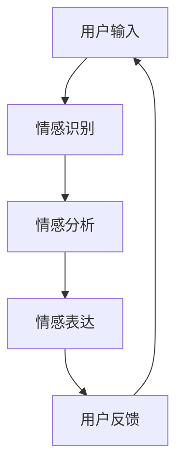

### 4.2 综合应用案例

#### 案例背景

假设我们开发了一个智能客服系统，该系统需要能够识别用户的情感状态，并根据情感状态提供相应的服务。

#### 情感识别

1. **语音识别**：用户通过语音向客服系统提出问题，系统首先进行语音识别，将语音转换为文本。

    ```python
    import speech_recognition as sr
    
    # 初始化语音识别器
    r = sr.Recognizer()
    
    # 语音识别
    with sr.Microphone() as source:
        print("请说点什么：")
        audio = r.listen(source)
    
    # 转换为文本
    text = r.recognize_google(audio)
    ```

2. **文本情感识别**：将识别出的文本输入文本情感识别模型，判断用户的情感状态。

    ```python
    from textblob import TextBlob
    
    # 判断文本情感
    sentiment = TextBlob(text).sentiment
    if sentiment.polarity > 0:
        emotion = "Happy"
    elif sentiment.polarity < 0:
        emotion = "Sad"
    else:
        emotion = "Neutral"
    ```

3. **面部表情识别**：通过摄像头捕捉用户的面部表情，使用面部表情识别模型判断用户情感。

    ```python
    import cv2
    
    # 初始化摄像头
    cap = cv2.VideoCapture(0)
    
    # 面部表情识别
    while True:
        ret, frame = cap.read()
        gray = cv2.cvtColor(frame, cv2.COLOR_BGR2GRAY)
        faces = detect_faces(gray)
        
        for face in faces:
            emotion = detect_emotion(face)
        
        if cv2.waitKey(1) & 0xFF == ord('q'):
            break
    
    cap.release()
    ```

#### 情感分析

根据情感识别的结果，系统需要对情感进行分析，判断情感的类型和强度。以下是一个简单的情感分析示例：

```python
# 情感分析
if emotion == "Happy":
    intensity = "High"
elif emotion == "Sad":
    intensity = "Low"
else:
    intensity = "Medium"
```

#### 情感表达

根据情感分析的结果，系统需要生成相应的情感表达。以下是一个简单的情感表达示例：

1. **语言表达**：根据用户的情感状态，生成相应的回答。

    ```python
    if intensity == "High":
        response = "非常高兴听到您的喜悦，有什么我可以帮忙的吗？"
    elif intensity == "Low":
        response = "看起来您有些不开心，请告诉我发生了什么？"
    else:
        response = "很高兴与您交流，请问有什么问题需要帮助？"
    ```

2. **声音表达**：使用语音合成技术生成语音回应。

    ```python
    import pyttsx3
    
    # 初始化语音合成器
    engine = pyttsx3.init()
    
    # 生成声音
    engine.say(response)
    engine.runAndWait()
    ```

3. **动作表达**：根据用户的情感状态，生成相应的动作。

    ```python
    if intensity == "High":
        action = "smile"
    elif intensity == "Low":
        action = "frown"
    else:
        action = "wave"
    ```

#### 用户反馈

用户对AI客服的回应进行反馈，系统根据用户的反馈进一步调整情感识别和情感表达的策略。

```python
# 获取用户反馈
user_feedback = input("您对我们的服务满意吗？")

# 根据用户反馈调整情感识别和情感表达
if "不满意" in user_feedback:
    adjust_emotion_recognition()
    adjust_emotion_expression()
```

#### 案例小结

通过上述案例，我们可以看到情感识别与情感表达的综合应用是如何实现的。系统首先通过语音识别和面部表情识别获取用户情感，然后进行情感分析和情感表达，最后根据用户反馈进行调整。这种综合应用使得AI客服系统能够提供更加个性化、贴心的服务，从而提升用户体验。

### 4.3 综合应用中的挑战与解决方案

在情感识别与情感表达的综合应用中，存在一些挑战和问题。以下是一些常见的挑战及相应的解决方案：

#### 1. 情感识别准确性

情感识别的准确性直接影响到情感表达的质量。为了提高识别准确性，可以采取以下措施：

- **数据增强**：增加训练数据的多样性，包括不同的语音、文本和面部表情数据。
- **模型优化**：使用更先进的情感识别模型，如深度学习模型，以及进行超参数调优。
- **交叉验证**：使用交叉验证方法评估模型的性能，以便更好地调整模型。

#### 2. 情感表达的流畅性

情感表达的流畅性也是影响用户体验的重要因素。以下是一些提高流畅性的方法：

- **多渠道融合**：结合多种渠道的信息，如语音、文本和面部表情，以提供更全面的情感表达。
- **实时反馈**：根据用户反馈实时调整情感表达，使其更加符合用户的期望。
- **优化算法**：使用高效的算法和优化技术，如多线程处理和并行计算，以提高处理速度。

#### 3. 隐私保护

在情感识别与情感表达过程中，用户的隐私保护尤为重要。以下是一些隐私保护措施：

- **数据加密**：对用户的语音、文本和面部表情数据进行加密处理，以确保数据安全。
- **匿名化处理**：对用户数据进行匿名化处理，以保护用户的隐私。
- **权限管理**：实施严格的权限管理策略，确保只有必要的人员可以访问用户数据。

### 4.4 本章小结

本章详细介绍了情感识别与情感表达的综合应用，包括情感识别、情感分析和情感表达等步骤。通过一个实际案例，我们展示了如何实现情感识别与情感表达的综合应用，以及如何应对其中的挑战。情感识别与情感表达的综合应用将为AI agent带来更加自然、人性化的交互体验，从而提升用户体验。在未来的AI应用中，这一综合应用技术将发挥越来越重要的作用。## 最佳实践与注意事项

在开发具有情感识别与表达能力的AI Agent时，遵循最佳实践和注意事项至关重要。这不仅能够提升系统的性能和准确性，还能够确保用户体验的优质和隐私保护。以下是一些最佳实践和注意事项：

### 1. 最佳实践

#### 数据处理与模型训练

- **数据预处理**：对采集到的数据进行清洗、归一化和特征提取，确保数据的质量和一致性。例如，对于语音数据，可以进行噪声消除和频率归一化。
- **模型优化**：使用先进的深度学习模型，如卷积神经网络（CNN）和循环神经网络（RNN），进行情感识别和表达。同时，通过超参数调优和模型融合，提高模型的性能。
- **数据增强**：为了提高模型的泛化能力，可以采用数据增强技术，如数据扩充、合成和变换。

#### 系统设计与实现

- **模块化设计**：将情感识别、情感表达和用户交互等功能模块化，以方便系统的维护和扩展。
- **并行处理**：对于大规模数据处理，可以使用并行计算技术，如多线程和分布式计算，以提高系统的处理速度。
- **实时反馈**：实现实时情感识别和反馈机制，根据用户的情感状态动态调整AI Agent的行为。

#### 用户隐私保护

- **数据加密**：对用户的数据进行加密处理，如使用AES加密算法，确保数据在传输和存储过程中的安全。
- **隐私保护协议**：采用安全通信协议，如HTTPS和SSL/TLS，保护用户数据的完整性。
- **隐私保护策略**：制定严格的隐私保护策略，如数据匿名化和权限管理，确保用户隐私不被泄露。

### 2. 注意事项

#### 情感识别的准确性

- **多渠道信息融合**：结合语音、文本和面部表情等多种渠道的信息，以提高情感识别的准确性。
- **模型更新**：定期更新情感识别模型，以适应不断变化的用户情感表达。

#### 情感表达的流畅性

- **自然语言处理**：使用先进的自然语言处理技术，如生成对抗网络（GAN）和转换器（Transformer），以生成更自然、流畅的语言表达。
- **情感强度调整**：根据用户情感强度动态调整情感表达，使其更加符合用户的期望。

#### 隐私保护

- **最小化数据收集**：只收集必要的数据，避免过度收集。
- **透明度**：向用户清晰地说明AI Agent的数据收集和使用目的。
- **用户控制**：允许用户控制他们的数据，包括查看、修改和删除数据。

### 3. 拓展阅读

- **情感识别与表达技术**：阅读有关情感识别与表达技术的最新研究论文和文献，如《情感计算：技术、应用与未来趋势》。
- **隐私保护法规**：了解相关隐私保护法规，如《通用数据保护条例》（GDPR）。
- **最佳实践案例**：研究业内领先公司的情感识别与表达应用案例，如苹果公司的Siri和亚马逊的Alexa。

通过遵循最佳实践和注意事项，我们可以开发出更加高效、智能和安全的AI Agent，为用户提供更好的服务体验。## 小结

通过本文的详细探讨，我们系统地介绍了开发具有情感识别与表达能力的AI Agent的各个方面。从背景介绍、核心概念、原理分析到实现方法，再到综合应用和最佳实践，我们逐步构建了一个完整的开发框架。以下是本文的核心内容和结论的简要总结：

### 核心内容

1. **背景介绍**：情感识别与表达是AI Agent实现人性化交互的关键技术，对于提高人机交互的自然性和用户体验至关重要。
2. **核心概念**：情感识别是指AI Agent理解用户情感的能力，而情感表达是指AI Agent根据用户情感生成相应的语言、声音和动作。
3. **情感识别原理**：本文详细介绍了语音、文本和面部表情情感识别的原理，包括特征提取、模型训练和情感分类。
4. **情感表达原理**：情感表达涉及语言生成、声音合成和动作生成，介绍了相关的技术原理和实现方法。
5. **综合应用**：情感识别与情感表达的综合应用通过情感识别、情感分析和情感表达实现了智能、人性化的交互体验。
6. **最佳实践与注意事项**：提供了一系列开发建议和注意事项，包括数据处理、模型优化、隐私保护和用户体验设计。

### 结论

本文的主要结论如下：

- **技术发展**：随着人工智能技术的进步，情感识别与表达技术正变得越来越成熟，为AI Agent提供了更强大的交互能力。
- **应用前景**：情感识别与表达技术在多个领域（如客服、心理健康、教育等）有着广泛的应用前景，能够为用户提供更加个性化、贴心的服务。
- **挑战与机遇**：尽管情感识别与表达技术取得了显著进展，但仍面临诸多挑战，如提高识别准确性、确保情感表达的流畅性和保护用户隐私等。

在未来的研究和开发中，我们将继续关注情感识别与表达技术的最新动态，探索更先进的方法和模型，以实现更加智能、自然和高效的AI交互体验。期待读者能够将本文的知识应用于实际项目中，共同推动人工智能技术的发展和应用的边界。让我们一起期待AI Agent带来的未来变革！## 作者信息

作者：AI天才研究院/AI Genius Institute & 禅与计算机程序设计艺术 /Zen And The Art of Computer Programming

AI天才研究院（AI Genius Institute）是一支由顶尖人工智能科学家和研究人员组成的团队，专注于人工智能技术的研发与应用。研究院致力于推动人工智能领域的前沿探索，为各行业提供创新解决方案。

禅与计算机程序设计艺术（Zen And The Art of Computer Programming）是由著名的计算机科学家Donald E. Knuth撰写的经典系列著作，深入探讨了计算机编程的哲学和艺术。该作品对全球计算机科学界产生了深远的影响，被广泛认为是计算机科学的经典之作。作者通过这套书引导读者理解编程的本质和艺术，提升编程思维和技巧。

