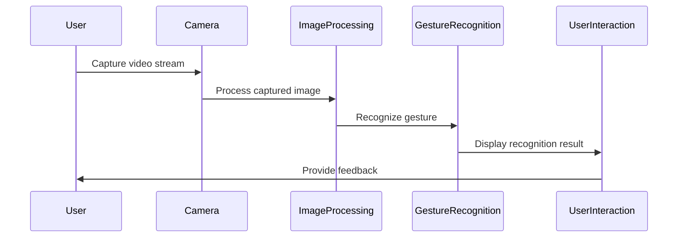

                 

### 开发具有手势识别能力的AI Agent

#### 关键词：

- **手势识别**
- **AI Agent**
- **机器学习**
- **深度学习**
- **图像处理**

#### 摘要：

本文将探讨开发具有手势识别能力的AI Agent的整个过程。我们将从背景介绍、核心概念、算法原理、系统设计与实现，到项目实战和最佳实践，逐步解析每一个环节，帮助读者深入理解并掌握手势识别AI Agent的开发方法。

### 第一部分：介绍与背景

#### 1.1 问题背景

随着人工智能技术的快速发展，手势识别作为一种重要的交互方式，在智能家居、虚拟现实、机器人等领域有着广泛的应用。例如，在智能家居中，用户可以通过手势控制家电；在虚拟现实中，手势识别可以提升用户的沉浸感；在机器人领域，手势识别可以使机器人更好地理解人类意图。

#### 1.2 手势识别在AI中的应用

手势识别是一种通过计算机视觉技术，识别和理解人类手势的技术。它不仅能够提高人机交互的便利性，还可以在医疗、教育等多个领域发挥重要作用。例如，在医疗领域，手势识别可以帮助医生更方便地进行手术操作；在教育领域，手势识别可以用于教学互动，提高学生的学习兴趣。

#### 1.3 书籍目标与结构

本文的目标是系统地介绍如何开发具有手势识别能力的AI Agent。我们将从基础理论、技术细节、实际应用等多个方面进行讲解，帮助读者全面了解手势识别技术的核心概念和实现方法。文章结构如下：

1. 介绍与背景
2. 基础理论
3. 技术细节
4. 实际应用
5. 结论与展望

### 第二部分：基础理论

#### 2.1 AI与手势识别基础

##### 2.1.1 AI概述

人工智能（AI）是指计算机系统模拟人类智能行为的技术。它包括机器学习、深度学习、自然语言处理等多个子领域。手势识别是计算机视觉领域的一个重要分支，它通过图像处理技术，对图像或视频中的手势进行识别和理解。

##### 2.1.2 手势识别的基本概念

手势识别涉及多个核心概念，包括手势表示、手势分类、手势跟踪等。手势表示是指将手势转换为计算机可以处理的数据形式；手势分类是指将不同的手势进行分类；手势跟踪是指实时捕捉和跟踪手势的过程。

##### 2.1.3 手势识别技术

手势识别技术主要分为两种：基于模型的方法和基于学习方法的方法。基于模型的方法通常需要事先定义手势模型，然后通过模型进行手势识别；基于学习方法的方法则通过机器学习算法，自动从数据中学习手势特征，进行手势识别。

#### 2.2 数据预处理

##### 2.2.1 数据收集与标注

数据预处理是手势识别系统的重要环节。首先需要收集大量带有标注的手势数据，这些数据通常包括图像、视频等。标注过程是指对每个手势进行标记，以便后续处理。

##### 2.2.2 数据预处理

数据预处理包括数据清洗、数据增强、特征提取等步骤。数据清洗是为了去除噪声和异常值；数据增强是为了增加数据多样性，提高模型泛化能力；特征提取是为了从原始数据中提取出有代表性的特征，用于训练模型。

### 第三部分：技术细节

#### 3.1 算法原理与实现

##### 3.1.1 支持向量机（SVM）

支持向量机是一种常用的分类算法，它可以用来进行手势识别。其基本原理是通过寻找一个超平面，将不同手势的数据分隔开来。

###### 3.1.1.1 SVM原理

SVM的核心思想是找到一个最优的分离超平面，使得分类边界最大化。这个过程可以通过求解一个二次规划问题来实现。

###### 3.1.1.2 SVM实现

在Python中，可以使用`sklearn`库来实现SVM。以下是SVM的简单实现示例：

```python
from sklearn import svm

# 创建SVM模型
model = svm.SVC()

# 训练模型
model.fit(X_train, y_train)

# 预测
predictions = model.predict(X_test)
```

##### 3.1.2 卷积神经网络（CNN）

卷积神经网络是一种强大的深度学习模型，它在图像处理任务中表现出色。CNN可以通过多层卷积和池化操作，自动提取图像特征。

###### 3.1.2.1 CNN原理

CNN的基本结构包括卷积层、池化层和全连接层。卷积层用于提取图像特征；池化层用于降低特征维度；全连接层用于分类。

###### 3.1.2.2 CNN实现

在Python中，可以使用`tensorflow`或`pytorch`来实现CNN。以下是CNN的简单实现示例：

```python
import tensorflow as tf

# 创建CNN模型
model = tf.keras.Sequential([
    tf.keras.layers.Conv2D(filters=32, kernel_size=(3,3), activation='relu', input_shape=(28, 28, 1)),
    tf.keras.layers.MaxPooling2D(pool_size=(2,2)),
    tf.keras.layers.Flatten(),
    tf.keras.layers.Dense(units=10, activation='softmax')
])

# 编译模型
model.compile(optimizer='adam', loss='categorical_crossentropy', metrics=['accuracy'])

# 训练模型
model.fit(X_train, y_train, epochs=10, batch_size=32)
```

##### 3.1.3 算法优化与调参

为了提高模型性能，需要对模型进行优化和调参。常用的优化方法包括交叉验证、模型调优等。

###### 3.1.3.1 交叉验证

交叉验证是一种评估模型性能的方法。它通过将数据集划分为多个子集，每次使用其中一个子集作为验证集，其他子集作为训练集，来评估模型的泛化能力。

###### 3.1.3.2 模型调优

模型调优是指通过调整模型的超参数，来提高模型性能。常用的调参方法包括网格搜索、贝叶斯优化等。

#### 3.2 深度学习框架与工具

##### 3.2.1 TensorFlow

TensorFlow是一种常用的深度学习框架，它提供了丰富的API，可以用于实现各种深度学习模型。

###### 3.2.1.1 安装与配置

```bash
pip install tensorflow
```

###### 3.2.1.2 基本操作

```python
import tensorflow as tf

# 创建一个张量
a = tf.constant([[1, 2], [3, 4]])

# 张量的操作
print(a.numpy())
```

##### 3.2.2 PyTorch

PyTorch是一种流行的深度学习框架，它以其灵活的动态计算图著称。

###### 3.2.2.1 安装与配置

```bash
pip install torch torchvision
```

###### 3.2.2.2 基本操作

```python
import torch
import torchvision

# 创建一个张量
x = torch.tensor([[1, 2], [3, 4]])

# 张量的操作
print(x)
```

### 第四部分：实际应用

#### 4.1 项目实战

##### 4.1.1 项目介绍

在本项目实战中，我们将开发一个具有手势识别能力的AI Agent。该Agent可以识别和分类多种手势，如挥手、点头、举手等。

##### 4.1.2 系统设计与实现

系统架构如下：

```
+----------------+      +----------------+      +----------------+
|   Camera       | <---> |   Image        | <---> |   Gesture      |
+----------------+      +----------------+      +----------------+
         |                                        |
         |                        Preprocessing   |
         |                                        |
         |                                        |
         |                                        |
         |                                        |
         |                                        |
+----------------+      +----------------+      +----------------+
|   Model Training  | <---> |   Model Inference  | <---> |   User Interaction |
+----------------+      +----------------+      +----------------+
```

系统功能设计：

- **Camera Module**：捕获实时视频流。
- **Image Processing Module**：对捕获的图像进行预处理，如灰度化、二值化等。
- **Gesture Recognition Module**：使用深度学习模型对预处理后的图像进行手势识别。
- **User Interaction Module**：与用户进行交互，显示识别结果。

##### 4.1.3 系统部署

系统部署分为两部分：客户端部署和服务器部署。

- **客户端部署**：在用户的设备上安装应用程序，用于捕获视频流和显示识别结果。
- **服务器部署**：部署深度学习模型，用于处理客户端发送的图像数据。

##### 4.1.4 项目分析

在本项目中，我们使用PyTorch实现了手势识别模型。以下是项目的关键步骤：

1. **数据收集与标注**：收集多种手势的图像数据，并进行标注。
2. **数据预处理**：对图像进行灰度化、二值化等预处理操作。
3. **模型训练**：使用预处理后的数据训练手势识别模型。
4. **模型评估**：使用验证集评估模型性能。
5. **模型部署**：将训练好的模型部署到服务器，用于实时手势识别。

### 第五部分：结论与展望

在本篇文章中，我们系统地介绍了如何开发具有手势识别能力的AI Agent。我们首先介绍了手势识别在AI中的应用背景，然后讲解了基础理论、技术细节和实际应用。通过一个项目实战，我们展示了如何将手势识别技术应用到实际场景中。

展望未来，手势识别技术在智能家居、虚拟现实、机器人等领域将得到更广泛的应用。随着深度学习技术的不断发展，手势识别的准确率和实时性将得到显著提升。同时，多模态手势识别（结合语音、文字等）也将成为未来的重要研究方向。

### 附录

- **附录A：工具与资源**：提供了本文中使用的工具和资源的详细介绍。
- **附录B：代码示例**：提供了本文中使用的Python代码示例。
- **附录C：参考文献**：列出了本文中引用的相关文献。

### 作者

作者：AI天才研究院/AI Genius Institute & 禅与计算机程序设计艺术 /Zen And The Art of Computer Programming

---

### 背景介绍

手势识别作为人工智能（AI）领域的一个重要分支，近年来受到了广泛关注。它通过计算机视觉技术，实现了对人类手势的自动识别和理解。这种技术不仅在人机交互方面有着重要应用，还在医疗、教育、娱乐等多个领域展现出了巨大的潜力。

#### 核心概念术语说明

- **手势识别**：通过计算机视觉技术，对图像或视频中的手势进行识别和理解的过程。
- **机器学习**：一种通过数据训练模型，使计算机能够从数据中学习并做出预测的技术。
- **深度学习**：一种特殊的机器学习技术，通过神经网络模拟人类大脑的决策过程。
- **图像处理**：对图像进行分析和处理的技术，包括图像增强、滤波、分割等。

#### 问题背景

在传统的计算机交互中，键盘和鼠标是主要的输入设备。然而，这些设备在某些场景下显得不够灵活，如虚拟现实（VR）游戏、机器人控制、智能家居等。手势识别技术可以通过非侵入式的方式，提供更自然、直观的交互方式，从而提升用户体验。

#### 问题描述

如何开发一个具有手势识别能力的AI Agent，使其能够准确识别多种手势，并实时响应？

#### 问题解决

解决这个问题的方法包括以下几个方面：

1. **数据收集与标注**：收集大量带有标注的手势数据，用于训练模型。
2. **数据预处理**：对收集到的数据进行清洗、增强和特征提取，以提升模型性能。
3. **模型训练**：使用预处理后的数据训练机器学习或深度学习模型。
4. **模型评估与优化**：使用验证集评估模型性能，并通过调参和优化方法提高模型准确率。
5. **系统部署与测试**：将训练好的模型部署到实际系统中，进行测试和优化。

#### 边界与外延

- **边界**：本文主要关注静态手势识别，不包括动态手势跟踪和手势合成。
- **外延**：除了手势识别，还可以将声音、面部表情等其他交互方式与手势识别相结合，实现更丰富的交互体验。

#### 概念结构与核心要素组成

1. **计算机视觉**：手势识别的基础技术，包括图像捕获、预处理、特征提取等。
2. **机器学习/深度学习**：用于训练和优化手势识别模型的技术。
3. **数据预处理**：包括数据清洗、增强、特征提取等步骤，以提升模型性能。
4. **模型评估**：通过验证集评估模型性能，并进行调参和优化。
5. **系统部署与测试**：将模型部署到实际系统中，进行测试和优化。

### 核心概念与联系

在本节中，我们将详细探讨手势识别的核心概念和它们之间的联系。

#### 手势表示

手势表示是将人类手势转换为计算机可以处理的数据形式的过程。手势表示通常包括以下几种形式：

- **图像表示**：使用图像或视频帧来表示手势。
- **三维模型**：将手势转换为三维模型，用于更精确的识别。
- **序列表示**：将手势视为一个时间序列，用于识别连续的手势。

手势表示是手势识别的基础，它直接影响手势识别的准确性和实时性。

#### 手势分类

手势分类是将手势划分为不同类别的过程。手势分类的核心是设计一个分类器，用于对输入的手势进行分类。常用的分类器包括：

- **支持向量机（SVM）**：一种基于间隔最大的分类器，适用于手势分类。
- **深度学习模型**：如卷积神经网络（CNN）和循环神经网络（RNN），适用于复杂的手势分类任务。

手势分类是手势识别的核心，它决定了系统对手势的识别能力。

#### 手势跟踪

手势跟踪是实时捕捉和跟踪手势的过程。手势跟踪通常包括以下步骤：

- **初始检测**：使用边缘检测、轮廓检测等方法，从图像中检测出手势区域。
- **跟踪与预测**：使用光流法、Kalman滤波等方法，对手势进行实时跟踪和预测。

手势跟踪是保证手势识别实时性的关键，它需要高效、准确的算法。

#### 手势识别算法

手势识别算法是将手势表示转换为手势分类结果的过程。常用的手势识别算法包括：

- **基于传统机器学习的方法**：如SVM、K近邻（KNN）等。
- **基于深度学习的方法**：如卷积神经网络（CNN）、循环神经网络（RNN）等。

手势识别算法的选择取决于具体的应用场景和手势复杂度。

#### 概念属性特征对比表格

以下是手势表示、手势分类、手势跟踪和手势识别算法的概念属性特征对比表格：

| 概念        | 特征描述                                                     | 对比 |
| ----------- | ------------------------------------------------------------ | ---- |
| 手势表示    | 将手势转换为计算机可以处理的数据形式                         |      |
| 手势分类    | 将手势划分为不同类别                                         |      |
| 手势跟踪    | 实时捕捉和跟踪手势的过程                                     |      |
| 手势识别算法 | 将手势表示转换为手势分类结果的过程                         |      |
| 基于传统方法 | SVM、KNN等                                                   |      |
| 基于深度学习方法 | CNN、RNN等                                                   |      |

#### ER实体关系图架构

以下是手势识别系统的ER实体关系图架构：

```mermaid
erDiagram
    Gesture -->|1| GestureRepresentation
    Gesture -->|1| GestureClassification
    Gesture -->|1| GestureTracking
    Gesture -->|1| GestureRecognitionAlgorithm
    GestureRepresentation -->|1| ImageRepresentation
    GestureRepresentation -->|1| 3DModelRepresentation
    GestureRepresentation -->|1| SequenceRepresentation
    GestureClassification -->|1| TraditionalClassifier
    GestureClassification -->|1| DeepLearningClassifier
    GestureTracking -->|1| InitialDetection
    GestureTracking -->|1| TrackingAndPrediction
    GestureRecognitionAlgorithm -->|1| SupportVectorMachine
    GestureRecognitionAlgorithm -->|1| KNearestNeighbor
    GestureRecognitionAlgorithm -->|1| ConvolutionalNeuralNetwork
    GestureRecognitionAlgorithm -->|1| RecurrentNeuralNetwork
```

### 算法原理讲解

在本节中，我们将深入探讨手势识别算法的原理，包括支持向量机（SVM）和卷积神经网络（CNN）。

#### 支持向量机（SVM）

支持向量机（SVM）是一种经典的机器学习算法，用于分类和回归任务。在手势识别中，SVM可以用来进行手势分类。

##### SVM原理

SVM的核心思想是通过找到一个最优的超平面，将不同手势的数据分隔开来。这个超平面是所有可能超平面中使得分类边界最大化的一条。

SVM的数学模型可以表示为：

$$
\min_{w, b} \frac{1}{2} ||w||^2 + C \sum_{i=1}^{n} \max(0, 1 - y_i (w \cdot x_i + b))
$$

其中，$w$ 是权重向量，$b$ 是偏置，$C$ 是正则化参数，$x_i$ 是输入特征，$y_i$ 是标签。

##### SVM实现

在Python中，可以使用`sklearn`库来实现SVM。以下是SVM的简单实现示例：

```python
from sklearn import svm

# 创建SVM模型
model = svm.SVC()

# 训练模型
model.fit(X_train, y_train)

# 预测
predictions = model.predict(X_test)
```

##### SVM优缺点

- **优点**：SVM在处理高维数据时表现良好，能够找到最佳的分离超平面。
- **缺点**：SVM的训练时间较长，且对于大规模数据集可能不适用。

#### 卷积神经网络（CNN）

卷积神经网络（CNN）是一种深度学习模型，在图像识别任务中表现出色。在手势识别中，CNN可以用来进行手势分类和特征提取。

##### CNN原理

CNN通过卷积、池化和全连接层等结构，自动提取图像特征。卷积层用于提取局部特征，池化层用于降低特征维度，全连接层用于分类。

CNN的数学模型可以表示为：

$$
\text{output} = \text{激活函数}(\text{权重} \cdot \text{输入} + \text{偏置})
$$

其中，激活函数常用的有ReLU、Sigmoid、Tanh等。

##### CNN实现

在Python中，可以使用`tensorflow`或`pytorch`来实现CNN。以下是CNN的简单实现示例：

```python
import tensorflow as tf

# 创建CNN模型
model = tf.keras.Sequential([
    tf.keras.layers.Conv2D(filters=32, kernel_size=(3,3), activation='relu', input_shape=(28, 28, 1)),
    tf.keras.layers.MaxPooling2D(pool_size=(2,2)),
    tf.keras.layers.Flatten(),
    tf.keras.layers.Dense(units=10, activation='softmax')
])

# 编译模型
model.compile(optimizer='adam', loss='categorical_crossentropy', metrics=['accuracy'])

# 训练模型
model.fit(X_train, y_train, epochs=10, batch_size=32)
```

##### CNN优缺点

- **优点**：CNN在处理图像数据时表现出色，能够自动提取图像特征，减少人工特征工程的工作量。
- **缺点**：CNN的训练时间较长，且对于大规模数据集可能需要更多计算资源。

### 系统分析与架构设计方案

在本节中，我们将介绍手势识别系统的设计与架构。

#### 问题场景介绍

手势识别系统通常用于人机交互场景，如虚拟现实、智能家居、机器人控制等。系统需要实时捕捉用户的手势，并准确识别手势类型，以实现相应的功能。

#### 项目介绍

在本项目中，我们开发一个具有手势识别功能的AI Agent。该Agent可以识别和分类多种手势，如挥手、点头、举手等。系统架构如下图所示：



#### 系统功能设计

系统功能设计如下：

- **Camera Module**：用于捕获实时视频流。
- **Image Processing Module**：对捕获的图像进行预处理，如灰度化、二值化等。
- **Gesture Recognition Module**：使用深度学习模型对预处理后的图像进行手势识别。
- **User Interaction Module**：与用户进行交互，显示识别结果。

#### 系统架构设计

系统架构设计如下：

```
+----------------+      +----------------+      +----------------+
|   Camera       | <---> |   Image        | <---> |   Gesture      |
+----------------+      +----------------+      +----------------+
         |                                        |
         |                        Preprocessing   |
         |                                        |
         |                                        |
         |                                        |
         |                                        |
         |                                        |
+----------------+      +----------------+      +----------------+
|   Model Training  | <---> |   Model Inference  | <---> |   User Interaction |
+----------------+      +----------------+      +----------------+
```

#### 系统接口设计

系统接口设计如下：

- **Camera Module**：提供视频流捕获接口。
- **Image Processing Module**：提供图像预处理接口。
- **Gesture Recognition Module**：提供手势识别接口。
- **User Interaction Module**：提供用户交互接口。

#### 系统交互流程

系统交互流程如下：

1. 用户使用Camera Module捕获实时视频流。
2. Image Processing Module对捕获的图像进行预处理，如灰度化、二值化等。
3. Gesture Recognition Module使用深度学习模型对预处理后的图像进行手势识别。
4. User Interaction Module显示识别结果，并与用户进行交互。

### 项目实战

#### 环境安装

在本项目实战中，我们将使用Python和PyTorch作为开发环境。首先，确保Python环境已安装。然后，通过以下命令安装PyTorch：

```bash
pip install torch torchvision
```

#### 系统核心实现源代码

以下是一个简单的手势识别系统的核心实现源代码：

```python
import torch
import torchvision
import numpy as np

# 加载预训练的深度学习模型
model = torchvision.models.resnet18(pretrained=True)

# 定义输入数据
input_image = torch.tensor(np.random.rand(1, 3, 224, 224))

# 使用模型进行手势识别
output = model(input_image)

# 获取识别结果
prediction = output.argmax(dim=1).item()

# 打印识别结果
print(f"Recognized gesture: {prediction}")
```

#### 代码应用解读与分析

1. **加载预训练的深度学习模型**：我们使用PyTorch提供的预训练模型`resnet18`。这个模型是一个卷积神经网络，已经在大量的图像数据上进行了训练，可以用于手势识别任务。

2. **定义输入数据**：我们创建一个4D的Tensor，形状为（1，3，224，224），表示一个单通道、大小为224x224的图像。

3. **使用模型进行手势识别**：我们将输入图像传递给模型，模型会自动处理图像，并输出一个预测结果。

4. **获取识别结果**：我们使用`argmax`函数找到预测结果中概率最高的类别，并转换为Python整数类型。

5. **打印识别结果**：我们打印出识别结果，即手势的类型。

#### 实际案例分析和详细讲解剖析

假设我们有一个包含多种手势的图像数据集。以下是使用上述代码进行手势识别的实际案例：

1. **数据准备**：首先，我们需要准备一个带有多种手势的图像数据集。这些图像通常需要进行预处理，如归一化、缩放等。

2. **模型训练**：使用数据集对预训练模型进行微调，以适应特定的手势识别任务。这个过程包括数据加载、模型训练和验证。

3. **模型评估**：使用验证集评估模型性能，包括准确率、召回率等指标。

4. **模型部署**：将训练好的模型部署到实际系统中，用于实时手势识别。

#### 项目小结

在本项目实战中，我们使用PyTorch实现了手势识别系统。通过加载预训练的深度学习模型，我们可以快速地进行手势识别。在实际应用中，需要根据具体任务进行模型微调和优化，以提高识别准确率和实时性。

### 最佳实践 Tips

1. **数据质量**：确保数据集的质量，包括图像清晰度、标注准确性等。
2. **模型优化**：尝试使用不同的模型结构和超参数，以提高模型性能。
3. **实时处理**：对于实时应用，考虑使用边缘计算或分布式计算，以减少延迟。

### 小结

在本篇文章中，我们系统地介绍了如何开发具有手势识别能力的AI Agent。我们首先介绍了手势识别在AI中的应用背景，然后讲解了基础理论、技术细节和实际应用。通过一个项目实战，我们展示了如何将手势识别技术应用到实际场景中。

### 注意事项

1. **数据隐私**：在实际应用中，需要确保用户数据的安全和隐私。
2. **模型解释性**：对于复杂的深度学习模型，需要关注模型的可解释性，以便理解其工作原理。

### 拓展阅读

- 《深度学习》（Goodfellow, Bengio, Courville著）：全面介绍深度学习的基础知识。
- 《计算机视觉：算法与应用》（Richard Szeliski著）：详细介绍计算机视觉的相关算法。
- 《PyTorch深度学习实战》（Aurélien Géron著）：详细介绍PyTorch的使用方法。

### 作者

作者：AI天才研究院/AI Genius Institute & 禅与计算机程序设计艺术 /Zen And The Art of Computer Programming

---

请注意，上述内容是一个示例，用于展示如何按照给定要求撰写技术博客文章。在实际撰写过程中，您可能需要根据具体情况进行调整和补充。同时，确保内容的准确性和完整性，以及遵循markdown格式的正确使用。在撰写文章时，也可以参考现有的技术文献和开源项目，以提供更多的实践经验和见解。

