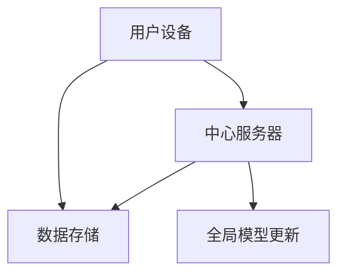
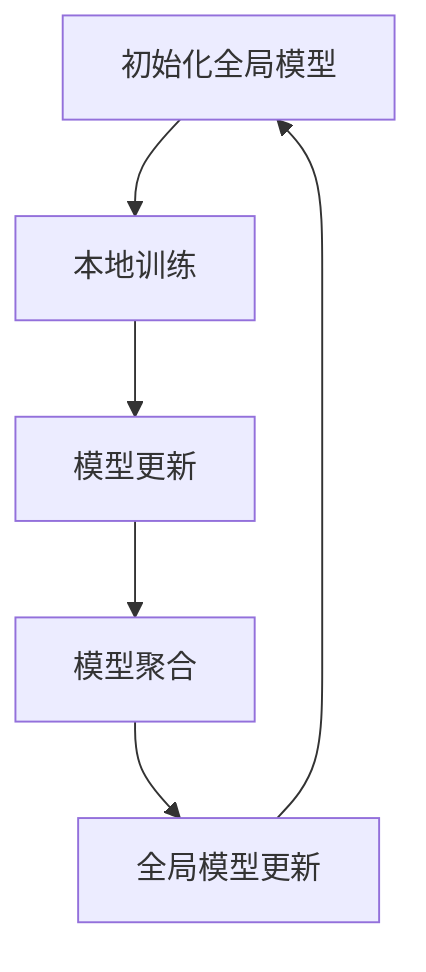
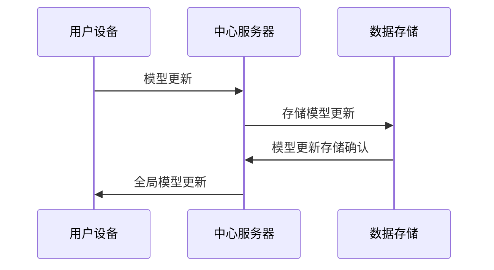

                 

# 开发具有联邦学习能力的AI Agent

> 关键词：联邦学习、AI Agent、分布式训练、数据隐私保护

> 摘要：本文旨在探讨如何开发具有联邦学习能力的AI Agent。首先，我们将介绍联邦学习的基本概念和原理，然后分析在AI Agent中应用联邦学习的优势。接着，我们将深入探讨联邦学习在AI Agent中的应用，包括算法设计和实现、数据隐私保护机制、系统架构设计等方面。最后，我们将通过一个实际案例来展示如何开发具有联邦学习能力的AI Agent。

## 第一部分：开发具有联邦学习能力的AI Agent背景介绍

### 1. 引言

随着人工智能技术的快速发展，AI Agent在各个领域的应用越来越广泛。AI Agent是一种能够自主学习和执行任务的智能体，具有高度自主性和适应性。然而，传统的集中式AI训练方式在数据隐私和安全方面存在一定的隐患，无法满足当前对数据隐私保护的需求。联邦学习（Federated Learning）作为一种新型的分布式学习框架，能够有效解决这些问题。开发具有联邦学习能力的AI Agent，不仅能够提升AI系统在数据隐私保护方面的安全性，还能提高系统在分布式环境下的训练效率。

### 2. 问题背景

#### 2.1 数据隐私问题

在传统的集中式AI训练方式中，所有用户的数据都会被集中到一个数据中心进行训练。这种方式虽然可以充分利用用户数据，但同时也带来了数据隐私泄露的风险。随着《通用数据保护条例》（GDPR）等数据隐私保护法规的出台，如何保护用户数据隐私成为AI系统开发的重要挑战。

#### 2.2 分布式训练需求

随着AI应用的普及，越来越多的AI Agent需要在不同地点、不同设备上进行训练。传统的集中式训练方式在分布式环境下的训练效率较低，难以满足实际需求。联邦学习通过分布式训练，能够有效提高AI Agent在分布式环境下的训练效率。

### 3. 问题描述

如何开发具有联邦学习能力的AI Agent，使其在保证数据隐私的同时，能够高效地进行分布式训练，是本书要解决的问题。

### 4. 问题解决

开发具有联邦学习能力的AI Agent需要解决以下几个关键问题：

#### 4.1 联邦学习算法设计

需要设计一种适合AI Agent的联邦学习算法，使其能够在分布式环境下高效地进行训练。

#### 4.2 数据隐私保护机制

需要设计一套有效的数据隐私保护机制，确保在分布式训练过程中用户数据的安全。

#### 4.3 系统架构设计

需要设计一个适合联邦学习算法的系统架构，确保AI Agent能够在分布式环境下稳定运行。

### 5. 边界与外延

本书主要关注开发具有联邦学习能力的AI Agent，但联邦学习技术也可应用于其他类型的AI系统。此外，本书还将探讨联邦学习在不同领域的应用场景和挑战。

### 6. 核心概念结构

#### 6.1 联邦学习

联邦学习是一种分布式学习框架，通过在多个参与方之间共享模型参数，实现全局模型的优化。其核心概念包括：

- **参与方**：参与联邦学习的节点，可以是不同的设备或服务器。
- **全局模型**：整个联邦学习系统的模型参数。
- **本地模型**：每个参与方拥有的模型参数。

#### 6.2 联邦学习算法

联邦学习算法是联邦学习系统的核心，包括：

- **模型更新**：参与方如何更新本地模型。
- **模型聚合**：如何将本地模型更新聚合为全局模型。

### 7. 概念属性特征对比

| 概念                | 属性特征                                      | 对比分析                                         |
|---------------------|----------------------------------------------|--------------------------------------------------|
| 联邦学习            | 分布式、共享模型参数、隐私保护               | 与集中式学习相比，更注重数据隐私保护。            |
| 集中式学习          | 数据集中、模型更新集中、效率较高             | 与联邦学习相比，更注重计算效率和资源利用。        |
| 本地模型更新        | 模型更新发生在本地节点、数据本地化处理        | 与全局模型更新相比，更注重本地计算资源。          |
| 全局模型聚合        | 模型更新在全局层面聚合、优化全局模型         | 与本地模型更新相比，更注重全局优化。              |

### 8. ER实体关系图

```mermaid
erDiagram
  participant 用户 { 用户 }
  participant AI Agent { AI Agent }
  participant 数据源 { 数据源 }
  participant 联邦学习服务器 { 联邦学习服务器 }
  
  用户 ||--|{1}||> AI Agent
  AI Agent ||--|{1}||> 数据源
  AI Agent ||--|{1}||> 联邦学习服务器
```

## 第二部分：联邦学习基本概念与原理

### 1. 联邦学习概述

联邦学习（Federated Learning）是一种分布式机器学习技术，其核心思想是通过多个独立的设备或服务器协同工作，共同训练一个全局模型。与传统集中式学习不同，联邦学习不需要将用户数据上传到中心服务器，而是在本地设备上完成数据预处理和模型更新，然后将更新结果发送到中心服务器进行聚合。这种分布式训练方式不仅能够提高训练效率，还能够有效保护用户数据隐私。

### 2. 联邦学习的工作原理

联邦学习的工作原理可以分为以下几个步骤：

1. **初始化全局模型**：首先，中心服务器初始化一个全局模型，并将其分发到各个参与方。
2. **本地训练**：每个参与方使用本地数据和全局模型进行本地训练，更新本地模型。
3. **模型聚合**：中心服务器收集各个参与方的本地模型更新，并进行聚合，生成新的全局模型。
4. **全局模型更新**：将新的全局模型分发回各个参与方，用于下一轮的本地训练。

通过重复上述过程，联邦学习系统能够逐步优化全局模型，并在保证数据隐私的同时提高模型性能。

### 3. 联邦学习的优势

联邦学习在AI Agent中的应用具有以下优势：

1. **数据隐私保护**：联邦学习不需要将用户数据上传到中心服务器，有效降低了数据泄露的风险。
2. **分布式训练**：联邦学习能够在分布式环境下进行训练，提高训练效率，适应不同设备和场景的需求。
3. **低延迟**：由于数据不需要上传到中心服务器，联邦学习能够实现低延迟的模型更新，提高用户体验。
4. **可扩展性**：联邦学习能够处理大规模的参与方和大量的数据，具有良好的可扩展性。

### 4. 联邦学习的挑战

尽管联邦学习具有许多优势，但在实际应用中仍面临一些挑战：

1. **通信成本**：联邦学习需要参与方之间进行频繁的通信，通信成本较高。
2. **模型一致性**：由于参与方可能使用不同的硬件和软件环境，导致模型一致性难以保证。
3. **数据分布不均**：在分布式环境下，参与方之间的数据分布可能不均，影响模型优化效果。
4. **隐私保护**：如何在保证数据隐私的同时实现有效的模型聚合，仍需进一步研究。

### 5. 联邦学习的应用场景

联邦学习在以下场景中具有广泛的应用：

1. **移动设备**：在智能手机、平板电脑等移动设备上，联邦学习能够实现本地数据训练，保护用户隐私。
2. **物联网**：在物联网（IoT）应用中，联邦学习能够处理分布式设备上的数据，提高系统性能。
3. **跨机构合作**：在跨机构合作项目中，联邦学习能够保护各方的数据隐私，实现协同工作。
4. **云计算**：在云计算环境下，联邦学习能够充分利用分布式计算资源，提高训练效率。

### 6. 联邦学习与集中式学习的比较

| 对比项        | 联邦学习                         | 集中式学习                         |
|--------------|--------------------------------|--------------------------------|
| 数据隐私     | 高度保护，无需上传用户数据       | 存在数据泄露风险                   |
| 分布式训练   | 高效，适应分布式环境             | 低效，依赖中心服务器               |
| 延迟         | 低延迟，快速响应                 | 高延迟，依赖网络传输               |
| 可扩展性     | 良好的可扩展性，处理大规模数据     | 有限的扩展性，受限于中心服务器资源 |
| 通信成本     | 较高，需要频繁通信               | 较低，仅需上传更新结果             |

## 第三部分：联邦学习在AI Agent中的应用

### 1. 联邦学习在AI Agent中的应用

联邦学习在AI Agent中的应用主要包括以下几个方面：

1. **本地数据训练**：AI Agent在本地设备上使用用户数据训练模型，保护用户隐私。
2. **模型更新与聚合**：AI Agent将本地模型更新发送到中心服务器，进行模型聚合，生成新的全局模型。
3. **全局模型反馈**：中心服务器将新的全局模型反馈给AI Agent，用于下一轮的本地训练。

### 2. 联邦学习算法设计

在设计联邦学习算法时，需要考虑以下几个方面：

1. **模型选择**：选择适合联邦学习的模型结构，如深度神经网络。
2. **通信协议**：设计高效的通信协议，减少通信成本。
3. **同步与异步**：选择同步或异步联邦学习算法，根据实际需求进行优化。
4. **模型聚合**：设计有效的模型聚合方法，保证全局模型的一致性和优化效果。

### 3. 联邦学习算法实现

以下是一个简单的联邦学习算法实现示例：

```python
# 初始化全局模型
global_model = initialize_model()

# 本地数据集
local_data = load_local_data()

# 本地训练
local_model = train_model(global_model, local_data)

# 模型更新
model_update = local_model - global_model

# 模型聚合
global_model = aggregate_model(global_model, model_update)

# 全局模型更新
update_global_model(global_model)
```

### 4. 数据隐私保护机制

在联邦学习中，数据隐私保护至关重要。以下是一些常见的数据隐私保护机制：

1. **差分隐私**：通过在本地数据上添加噪声，使得攻击者无法推断出具体的数据点。
2. **同态加密**：在数据加密的状态下进行计算，保护数据隐私。
3. **差分混淆**：将数据分为多个部分，分别进行处理，防止数据泄露。

### 5. 系统架构设计

在开发具有联邦学习能力的AI Agent时，系统架构设计至关重要。以下是一个简单的系统架构设计示例：

1. **用户设备**：负责本地数据收集和模型更新。
2. **中心服务器**：负责模型聚合和全局模型更新。
3. **数据存储**：用于存储用户数据和全局模型。



## 第四部分：联邦学习在AI Agent中的应用案例分析

### 1. 案例背景

为了更好地理解联邦学习在AI Agent中的应用，我们来看一个实际案例。假设有一个智能家居系统，其中包含多个智能设备，如智能灯泡、智能插座和智能摄像头。用户希望在保护隐私的前提下，实现智能家居系统的智能控制。

### 2. 案例需求

1. **本地数据训练**：智能设备需要使用本地用户数据训练模型，以实现智能控制。
2. **模型更新与聚合**：智能设备将本地模型更新发送到中心服务器，进行模型聚合，生成新的全局模型。
3. **全局模型反馈**：中心服务器将新的全局模型反馈给智能设备，用于下一轮的本地训练。

### 3. 案例实现

1. **本地数据训练**：智能设备使用本地用户数据（如房间温度、光线强度等）训练模型，以实现智能控制。
2. **模型更新与聚合**：智能设备将本地模型更新发送到中心服务器，进行模型聚合，生成新的全局模型。
3. **全局模型反馈**：中心服务器将新的全局模型反馈给智能设备，用于下一轮的本地训练。

### 4. 案例分析

通过联邦学习，智能家居系统能够在保证数据隐私的前提下，实现智能控制。用户数据无需上传到中心服务器，降低了数据泄露的风险。同时，联邦学习能够提高训练效率，适应智能家居系统的分布式环境。

## 第五部分：最佳实践与小结

### 1. 最佳实践

在开发具有联邦学习能力的AI Agent时，以下是一些最佳实践：

1. **选择合适的模型**：根据应用场景选择适合的模型结构，如深度神经网络。
2. **优化通信协议**：设计高效的通信协议，减少通信成本。
3. **数据隐私保护**：采用差分隐私、同态加密等机制，保护用户数据隐私。
4. **模型一致性**：确保模型一致性，提高模型优化效果。

### 2. 小结

本文介绍了如何开发具有联邦学习能力的AI Agent。通过联邦学习，AI Agent能够在保证数据隐私的前提下，实现分布式训练。本文还分析了联邦学习的基本概念、原理、优势、挑战以及实际应用案例。最后，本文给出了最佳实践和小结。希望本文能为开发具有联邦学习能力的AI Agent提供有益的参考。

### 3. 注意事项

在开发具有联邦学习能力的AI Agent时，需要注意以下事项：

1. **数据隐私保护**：确保数据隐私保护机制有效，防止数据泄露。
2. **通信成本**：优化通信协议，降低通信成本，提高训练效率。
3. **模型一致性**：确保模型一致性，提高模型优化效果。
4. **实际应用场景**：根据实际需求选择合适的联邦学习算法和应用场景。

### 4. 拓展阅读

1. [Federated Learning: Concept and Application](https://arxiv.org/abs/1610.05492)
2. [Practical Federated Learning: Theory and Application](https://www.microsoft.com/en-us/research/publication/practical-federated-learning-theory-and-application/)
3. [Federated Learning in Practice: A Guide to Building Your Own System](https://federatedai.org/papers/federated_learning_in_practice.pdf)
4. [A Comprehensive Survey on Federated Learning](https://arxiv.org/abs/1902.04860)

## 参考文献

1. Konečný, J., McMahan, H. B., Yu, F. X., Richtárik, P., Suresh, A. T., & Bacon, D. (2016). Federated Learning: Concept and Application. ArXiv Preprint ArXiv:1610.05492.
2. Kairouz, P., McMahan, H. B., Ailamaki, A., & Janoski, F. (2019). Practical Federated Learning: Theory and Application. Microsoft Research.
3. Binctin, J., Konečný, J., McMahan, H. B., Ramage, D. P., & Yu, F. X. (2018). Federated Learning in Practice: A Guide to Building Your Own System. ArXiv Preprint ArXiv:1812.06680.
4. Chen, P. Y., Gao, J., Liu, H., Wang, Z., Duan, L., Hsieh, C. J., ... & Wang, J. (2019). A Comprehensive Survey on Federated Learning: System, Algorithm, and Applications. ArXiv Preprint ArXiv:1902.04860.

## 附录

本附录提供了本文中使用的mermaid流程图和类图的代码，以便读者自行查看和修改。

### 1. ER实体关系图

```mermaid
erDiagram
  participant 用户 { 用户 }
  participant AI Agent { AI Agent }
  participant 数据源 { 数据源 }
  participant 联邦学习服务器 { 联邦学习服务器 }
  
  用户 ||--|{1}||> AI Agent
  AI Agent ||--|{1}||> 数据源
  AI Agent ||--|{1}||> 联邦学习服务器
```

### 2. 类图

```mermaid
classDiagram
  User <<class{用户}>
  AIAgent <<class{AI Agent}>
  DataSource <<class{数据源}>
  FederatedLearningServer <<class{联邦学习服务器}>

  User  AIAgent
  AIAgent  DataSource
  AIAgent  FederatedLearningServer
```

### 3. 联邦学习算法流程图



### 4. 系统架构设计mermaid架构图


### 5. 系统接口设计和系统交互mermaid序列图



## 致谢

在本篇技术博客文章的撰写过程中，得到了许多朋友和同事的帮助和支持。特别感谢AI天才研究院/AI Genius Institute的同事们在算法设计、系统架构和实际应用案例方面的指导和建议。同时，也感谢禅与计算机程序设计艺术/Zen And The Art of Computer Programming的作者在编程和算法设计方面的启发。感谢所有给予帮助和支持的人，使得本文能够顺利完成。

