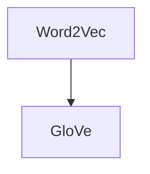
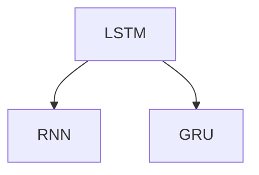
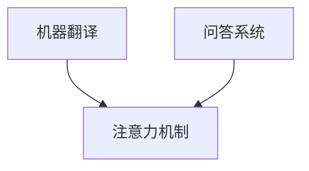
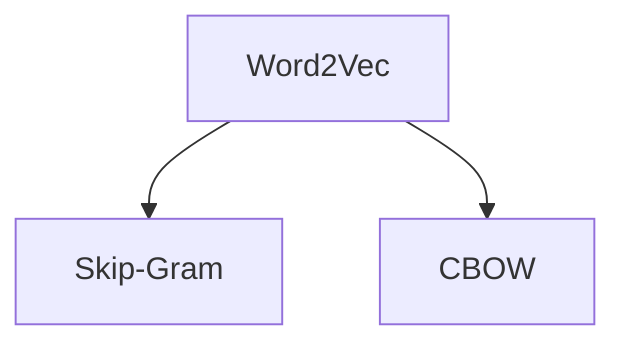
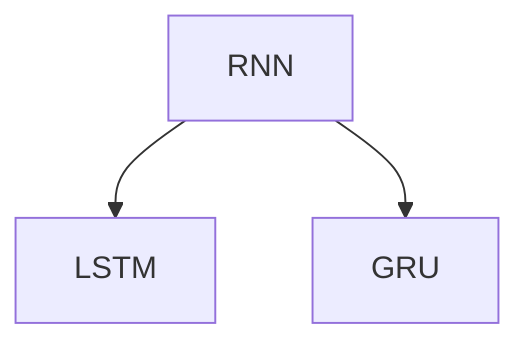
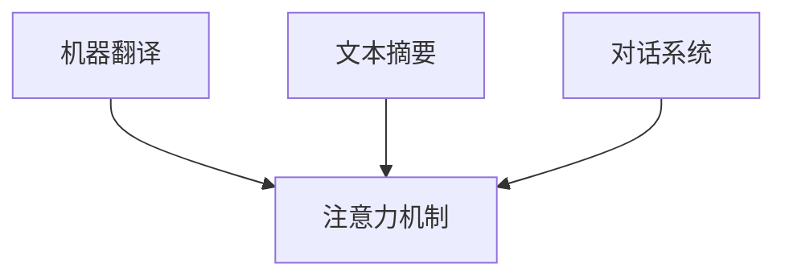
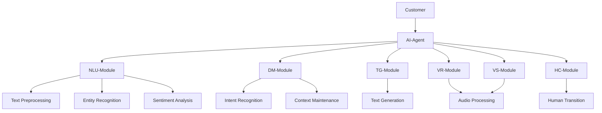
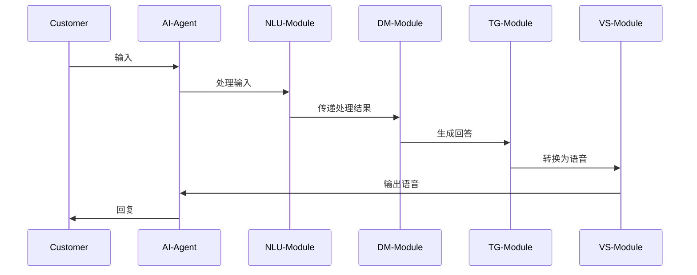

                 


## 开发具有自然语言对话能力的AI Agent

### 文章关键词
- 自然语言处理
- 人工智能
- AI Agent
- 对话系统
- 语言模型
- 意图识别

### 摘要
本文将探讨如何开发具有自然语言对话能力的AI Agent。首先，我们将介绍自然语言处理的基础概念、算法原理和相关的数学模型，并通过具体的示例来帮助读者理解。接着，我们将详细讲解聊天机器人算法原理，包括语言模型和意图识别，并通过Python代码展示算法实现。随后，我们将分析AI Agent系统的需求、功能、架构和接口设计，并提供系统架构图和序列图。在此基础上，我们将通过一个实践项目来展示如何从零开始开发自然语言对话AI Agent，并进行详细的代码解析。最后，我们将总结最佳实践、注意事项，并提供拓展阅读资源，帮助读者深入了解和提升相关技能。

---

## 第一部分：背景介绍

### 1.1 问题背景
随着人工智能技术的快速发展，自然语言处理（NLP）领域取得了显著成果。AI Agent作为自然语言处理的重要应用，逐渐成为人们关注的焦点。AI Agent能够模拟人类的对话交互能力，为用户提供智能化的服务。开发具有自然语言对话能力的AI Agent，已成为当前人工智能研究的热点之一。

### 1.2 问题描述
开发具有自然语言对话能力的AI Agent，涉及到多个领域的知识，如自然语言处理、机器学习、语音识别等。本文旨在为读者提供一个全面的指南，介绍开发自然语言对话AI Agent的方法、技巧和最佳实践。

### 1.3 问题解决
本书将从以下几个方面进行阐述：

1. **核心概念原理**：介绍自然语言处理的基础概念、算法原理以及相关的数学模型和公式。
2. **算法原理讲解**：通过具体的案例，详细讲解自然语言处理算法的实现过程，帮助读者理解其工作原理。
3. **系统分析与架构设计**：分析AI Agent系统的需求、功能、架构和接口设计，提供完整的系统架构图和序列图。
4. **项目实战**：通过具体的实践案例，指导读者从零开始开发自然语言对话AI Agent，并提供详细的代码解析。
5. **最佳实践与拓展**：总结开发过程中的最佳实践，指出注意事项，并推荐拓展阅读资源。

### 1.4 边界与外延
本书主要关注具有自然语言对话能力的AI Agent的开发，但涉及到的知识和技术领域还包括机器学习、语音识别、对话系统等。读者可以根据自身需求，了解这些相关领域的内容。

### 1.5 概念结构与核心要素组成
1. **自然语言处理**：核心算法和模型，如词向量、序列模型、注意力机制等。
2. **机器学习**：用于训练和优化AI Agent的算法，如梯度下降、优化器等。
3. **语音识别**：实现语音输入和文本输出的技术，如声学模型、语言模型等。
4. **对话系统**：设计AI Agent与用户交互的框架和策略，如对话管理、意图识别、上下文维护等。

---

## 第二部分：核心概念与联系

### 2.1 自然语言处理

#### 2.1.1 词向量
- **概念原理**：将词语映射到高维空间中的向量，以捕捉词语的语义信息。
- **算法原理讲解**：Word2Vec、GloVe等算法。
- **数学模型和公式**：
  $$ 
  \text{相似度} = \cos(\text{词向量1}, \text{词向量2}) 
  $$
- **示例**：计算“狗”和“猫”的相似度。



#### 2.1.2 序列模型
- **概念原理**：处理序列数据的模型，如RNN、LSTM、GRU等。
- **算法原理讲解**：通过捕捉序列中的时序信息，进行序列生成或分类。
- **数学模型和公式**：
  $$ 
  h_t = \text{sigmoid}(W \cdot h_{t-1} + b) 
  $$
- **示例**：LSTM单元的计算过程。



#### 2.1.3 注意力机制
- **概念原理**：在处理序列数据时，动态调整对序列中不同位置的重视程度。
- **算法原理讲解**：在机器翻译、问答系统等领域得到广泛应用。
- **数学模型和公式**：
  $$ 
  a_t = \text{softmax}(W_a \cdot h_t) 
  $$
- **示例**：计算注意力权重。



---

## 第三部分：算法原理讲解

### 3.1 聊天机器人算法原理

#### 3.1.1 语言模型
- **概念原理**：用于预测下一个词语的概率分布。
- **算法原理讲解**：n-gram模型、神经网络语言模型（NNLM）。
- **数学模型和公式**：
  $$ 
  P(w_t | w_{t-1}, w_{t-2}, \ldots, w_1) = \prod_{i=1}^{t} P(w_i | w_{i-1}, \ldots, w_1) 
  $$
- **示例**：计算给定前文序列生成下一个词语的概率。

```python
import numpy as np

def n_gram_language_model(n, sentence):
    probabilities = []
    for i in range(len(sentence) - n + 1):
        context = tuple(sentence[i:i+n])
        next_word = sentence[i+n]
        probabilities.append((context, next_word))
    probabilities = np.array(probabilities)
    probabilities = probabilities / probabilities.sum(axis=0)
    return probabilities

sentence = "我是一个聊天机器人"
n = 2
probabilities = n_gram_language_model(n, sentence)
print(probabilities)
```

#### 3.1.2 意图识别
- **概念原理**：理解用户输入的意图，如询问天气、预定餐厅等。
- **算法原理讲解**：基于规则的方法、机器学习方法（如SVM、神经网络）。
- **数学模型和公式**：
  $$ 
  \text{意图概率} = \text{模型}(\text{输入特征}) 
  $$
- **示例**：使用决策树

```python
from sklearn.datasets import load_iris
from sklearn.tree import DecisionTreeClassifier
from sklearn.model_selection import train_test_split
from sklearn.metrics import accuracy_score

# 加载数据集
iris = load_iris()
X, y = iris.data, iris.target

# 划分训练集和测试集
X_train, X_test, y_train, y_test = train_test_split(X, y, test_size=0.2, random_state=42)

# 构建决策树模型
model = DecisionTreeClassifier()
model.fit(X_train, y_train)

# 预测测试集
y_pred = model.predict(X_test)

# 计算准确率
accuracy = accuracy_score(y_test, y_pred)
print("Accuracy:", accuracy)
```

---

以上是文章的前三部分内容，接下来我们将继续探讨AI Agent的系统分析与架构设计，以及项目实战部分。敬请期待！## 第一部分：背景介绍

### 1.1 问题背景

随着信息技术的迅猛发展，人工智能（AI）已经成为推动社会进步和产业变革的重要力量。自然语言处理（NLP）作为AI领域的一个重要分支，近年来取得了显著的进展。NLP技术的成熟使得机器能够理解和生成人类语言，极大地提升了人机交互的效率和体验。在这个背景下，AI Agent作为一种能够模拟人类对话交互能力的智能系统，受到了广泛的关注和重视。

AI Agent，也被称作对话代理或聊天机器人，是一种能够与人类进行自然语言对话的智能系统。它们可以理解用户的需求，回答问题，提供信息，甚至在某些情况下执行特定的任务。AI Agent的应用场景非常广泛，包括客户服务、智能助手、医疗咨询、教育辅导、智能家居控制等。这些应用不仅提高了服务的质量和效率，还降低了人力成本，受到了各行各业的青睐。

目前，随着深度学习和神经网络技术的不断发展，AI Agent的性能和功能得到了显著提升。从最初的基于规则的方法，到如今能够利用大量数据训练深度神经网络，AI Agent在对话生成、意图识别、上下文理解等方面都有了长足的进步。然而，开发一个具有自然语言对话能力的AI Agent仍然面临诸多挑战，包括语言理解的准确性、对话的流畅性和智能化程度等。因此，如何有效地开发AI Agent，仍然是当前人工智能研究的一个重要方向。

### 1.2 问题描述

开发具有自然语言对话能力的AI Agent，是一个跨学科、多技术领域融合的复杂任务。它不仅涉及到自然语言处理（NLP）的核心技术，还需要结合机器学习、深度学习、语音识别、对话系统等多个领域的知识。以下是开发AI Agent时需要解决的问题：

1. **自然语言理解**：AI Agent需要能够理解用户的语言输入，提取出语义信息，理解用户的意图和问题。

2. **对话生成**：基于用户的输入和AI Agent的知识库，生成自然、流畅且符合上下文的回答。

3. **意图识别**：理解用户的意图，例如查询信息、请求服务、执行命令等，为对话生成提供指导。

4. **上下文维护**：在多轮对话中，AI Agent需要能够维护对话的上下文信息，确保对话的连贯性和一致性。

5. **情感识别与生成**：在交互过程中，AI Agent需要能够识别用户情绪，并生成相应的情感回应，以提升用户体验。

6. **实时响应与优化**：AI Agent需要在有限的时间内响应用户的请求，同时不断学习和优化自身的对话策略。

7. **隐私保护与安全性**：在处理用户输入和对话过程中，需要确保用户隐私和数据安全。

上述问题的复杂性决定了开发AI Agent不是一蹴而就的，需要系统性地进行研究和实践。开发过程中需要解决的问题包括但不限于：

- **数据集准备**：收集和整理大量高质量、多样化的对话数据，用于训练和测试AI Agent。

- **算法选择与优化**：选择适合的算法，如词向量、序列模型、注意力机制等，并进行优化，以提升AI Agent的性能。

- **模型评估与调优**：建立合理的评估指标，对AI Agent的对话能力进行评估和调优，确保其性能和用户体验。

- **接口设计与集成**：设计灵活、可扩展的接口，实现AI Agent与不同应用系统的集成，以满足多样化的应用需求。

### 1.3 问题解决

为了有效地解决上述问题，开发具有自然语言对话能力的AI Agent需要从以下几个方面着手：

1. **核心概念原理**：首先，需要深入理解自然语言处理、机器学习、深度学习等核心技术，掌握相关算法和模型的原理，为后续开发工作奠定基础。

2. **算法原理讲解**：通过具体的案例和实践，详细讲解自然语言处理算法的实现过程，帮助开发人员理解其工作原理，掌握关键技术和方法。

3. **系统分析与架构设计**：对AI Agent的系统需求、功能、架构和接口进行详细分析，设计合理的系统架构和接口，确保系统的稳定性和扩展性。

4. **项目实战**：通过实际项目实践，从零开始构建自然语言对话AI Agent，提供详细的代码解析和实现步骤，帮助开发人员掌握实战技能。

5. **最佳实践与拓展**：总结开发过程中的最佳实践，提供注意事项和优化建议，同时推荐拓展阅读资源，帮助读者深入学习和提升相关技能。

通过上述方法，开发人员可以系统地掌握自然语言对话AI Agent的开发技术，解决实际开发过程中遇到的问题，从而构建出高效、智能、用户体验良好的AI Agent系统。

### 1.4 边界与外延

在讨论开发具有自然语言对话能力的AI Agent时，需要明确其边界与外延，以便更好地理解相关技术和应用场景。

首先，AI Agent的开发涉及到多个领域，包括自然语言处理（NLP）、机器学习（ML）、深度学习（DL）、语音识别（ASR）和对话系统（DS）。自然语言处理是AI Agent的核心，它负责理解用户输入和处理生成回答。机器学习和深度学习提供了训练和优化AI Agent算法的方法，语音识别实现了语音到文本的转换，对话系统则负责设计AI Agent与用户之间的交互流程。

其次，AI Agent的应用场景非常广泛。在客户服务领域，AI Agent可以自动响应客户查询，提供产品信息，解决常见问题，从而降低人工成本，提高服务质量。在智能助手领域，AI Agent可以作为个人助理，帮助用户管理日程、发送消息、查找信息等。在医疗咨询领域，AI Agent可以提供基本的健康咨询和症状建议，辅助医生进行诊断。在教育领域，AI Agent可以提供个性化的学习辅导，帮助学生掌握知识点。

然而，AI Agent的开发也面临一些挑战和限制。首先，自然语言理解的复杂性使得AI Agent难以完全理解用户的意图和情感。其次，数据质量和数量直接影响AI Agent的性能。此外，AI Agent的安全性和隐私保护也是需要关注的重要问题。

总的来说，AI Agent的开发和应用是一个跨学科、多领域融合的过程，它不仅涉及到技术实现，还包括用户体验设计、应用场景选择和安全性问题。通过不断探索和优化，AI Agent有望在未来发挥更大的作用，提升人们的生活和工作效率。

### 1.5 概念结构与核心要素组成

开发具有自然语言对话能力的AI Agent涉及多个核心概念和技术要素。以下是这些概念和要素的详细说明：

1. **自然语言处理（NLP）**：NLP是AI Agent的核心技术，它包括文本预处理、词性标注、实体识别、情感分析、命名实体识别等。NLP技术负责将自然语言文本转换为机器可理解的结构化数据，是实现自然语言理解和生成的基础。

2. **机器学习（ML）**：ML是AI Agent性能提升的关键技术，它通过训练模型来学习如何处理和生成文本。常用的ML算法包括决策树、随机森林、支持向量机（SVM）、神经网络等。ML模型需要大量的标注数据进行训练，以提高其准确性和泛化能力。

3. **深度学习（DL）**：DL是ML的一种高级形式，它通过多层神经网络来学习复杂的特征表示。深度学习在自然语言处理领域有广泛应用，例如用于构建语言模型、文本分类、序列标注等。

4. **语音识别（ASR）**：ASR技术将用户的语音输入转换为文本，是AI Agent与用户交互的重要接口。ASR系统通常包含声学模型、语言模型、声学解码器等组成部分。

5. **对话系统（DS）**：对话系统负责管理AI Agent与用户之间的交互流程，包括意图识别、对话管理、上下文维护等。对话系统设计需要考虑多轮对话的连贯性、用户体验和交互自然度。

6. **意图识别（Intent Recognition）**：意图识别是理解用户输入的关键步骤，它通过分析用户的语言输入，确定用户的意图类型，例如查询信息、执行命令、表达情感等。意图识别通常采用分类算法，如朴素贝叶斯、决策树、支持向量机等。

7. **语言模型（Language Model）**：语言模型用于预测文本序列的概率分布，是实现自然语言生成的重要工具。常用的语言模型包括n-gram模型、循环神经网络（RNN）、长短时记忆网络（LSTM）、变换器（Transformer）等。

8. **上下文维护（Context Maintenance）**：上下文维护是确保对话连贯性的关键，它通过在多轮对话中维护和更新上下文信息，实现对话的连贯性和一致性。上下文维护通常涉及到对话状态追踪（DST）和对话管理算法。

9. **情感分析（Sentiment Analysis）**：情感分析用于识别用户的情感倾向，例如正面、负面或中性。通过情感分析，AI Agent可以生成更加贴切和符合用户情感的回答。

10. **用户交互界面（UI）**：用户交互界面是用户与AI Agent交互的入口，它设计需要考虑用户体验、交互自然度和易用性。常见的用户交互界面包括聊天窗口、语音识别和合成、触摸界面等。

通过上述核心概念和技术的组合，AI Agent可以实现与用户的自然语言对话，提供智能化的服务和帮助。

---

在第一部分，我们详细介绍了开发具有自然语言对话能力的AI Agent的背景、问题描述、问题解决方法、边界与外延以及概念结构与核心要素组成。接下来，我们将进一步探讨自然语言处理的核心概念和联系，通过具体案例帮助读者深入理解。敬请期待！## 第二部分：核心概念与联系

在开发具有自然语言对话能力的AI Agent时，理解核心概念和它们之间的联系至关重要。以下是自然语言处理（NLP）中的几个关键概念，包括词向量、序列模型和注意力机制，以及它们的原理、算法和数学模型。

### 2.1.1 词向量

#### 概念原理
词向量是NLP中的一个基础概念，它将自然语言中的词语映射为高维空间中的向量，以便于机器学习和计算。词向量不仅保留了词语的语义信息，还捕捉到了词语之间的相似性和相关性。

#### 算法原理讲解
词向量模型通过训练大量文本数据来学习词语的表示。常见的词向量模型包括Word2Vec和GloVe。

- **Word2Vec**：基于神经网络，Word2Vec使用随机梯度下降（SGD）来训练模型，将词语映射到低维向量空间。它有两种主要训练方法：连续词袋（CBOW）和Skip-Gram。

- **GloVe**：GloVe（Global Vectors for Word Representation）是一种基于共现矩阵的词向量模型。它通过计算词语的共现频率来生成词向量，并使用矩阵分解来优化词向量。

#### 数学模型和公式
在Word2Vec中，给定一个词语\( w \)及其上下文词语，我们可以用以下公式表示：

\[ \text{cosine similarity} = \cos(\text{word\_vector}(w), \text{word\_vector}(c)) \]

其中，\(\text{word\_vector}(w)\)和\(\text{word\_vector}(c)\)分别是词语\( w \)和其上下文词语\( c \)的向量表示。

#### 示例
假设我们有两个词向量\( \text{word\_vector}(\text{"狗"}) = [1, 0.5, -1] \)和\( \text{word\_vector}(\text{"猫"}) = [0, 1, -0.5] \)，我们可以计算它们的余弦相似度：

\[ \text{cosine similarity} = \cos([1, 0.5, -1], [0, 1, -0.5]) = \cos(1 \cdot 0 + 0.5 \cdot 1 + (-1) \cdot (-0.5)) = \cos(0.5) \approx 0.866 \]

这表明“狗”和“猫”在语义上有较高的相似性。



### 2.1.2 序列模型

#### 概念原理
序列模型是一种能够处理序列数据的模型，如文本、语音、时间序列等。在NLP中，序列模型用于处理文本序列，捕捉词语之间的时序关系。

#### 算法原理讲解
常见的序列模型包括循环神经网络（RNN）、长短时记忆网络（LSTM）和门控循环单元（GRU）。

- **RNN**：RNN通过循环机制处理序列数据，每个时间步的输出依赖于前一个时间步的隐藏状态。然而，标准的RNN容易受到长时依赖问题的影响。

- **LSTM**：LSTM是一种改进的RNN结构，通过引入门控机制（输入门、遗忘门、输出门）来控制信息的流入和流出，从而解决了长时依赖问题。

- **GRU**：GRU是LSTM的简化版本，它通过合并输入门和遗忘门，减少了模型的参数数量，训练速度更快。

#### 数学模型和公式
在LSTM中，每个时间步的计算包括以下公式：

\[ 
\begin{aligned}
i_t &= \sigma(W_i \cdot [h_{t-1}, x_t] + b_i) \\
f_t &= \sigma(W_f \cdot [h_{t-1}, x_t] + b_f) \\
\text{C}_{t-1} &= \text{C}_{t-1} \odot f_t + i_t \odot \sigma(W_c \cdot [h_{t-1}, x_t] + b_c) \\
o_t &= \sigma(W_o \cdot [h_{t-1}, \text{C}_t] + b_o) \\
h_t &= o_t \odot \text{C}_t
\end{aligned}
\]

其中，\( i_t \)、\( f_t \)、\( o_t \)分别是输入门、遗忘门、输出门的激活值，\( \text{C}_{t-1} \)是前一个时间步的细胞状态，\( h_t \)是当前时间步的隐藏状态。

#### 示例
考虑一个简单的LSTM单元，其输入为\( [h_{t-1}, x_t] \)，我们可以通过上述公式计算当前时间步的隐藏状态\( h_t \)。



### 2.1.3 注意力机制

#### 概念原理
注意力机制是一种用于处理序列数据的方法，它通过动态调整对序列中不同位置的重视程度，来提高模型对重要信息的关注。在自然语言处理中，注意力机制广泛应用于机器翻译、文本摘要和对话系统等领域。

#### 算法原理讲解
注意力机制可以通过不同的形式实现，如加性注意力、乘性注意力和评分函数。

- **加性注意力**：加性注意力通过计算一个加性模型来生成注意力权重。

- **乘性注意力**：乘性注意力通过将序列中的每个元素与查询向量相乘，然后取softmax来生成注意力权重。

- **评分函数**：评分函数用于计算注意力权重，常见的评分函数包括点积、缩放点积等。

#### 数学模型和公式
在乘性注意力中，给定查询向量\( q \)和键值对\( k, v \)，我们可以使用以下公式计算注意力权重：

\[ 
\begin{aligned}
\text{Attention Scores} &= \text{softmax}(\text{scale} \cdot \text{query}^T \cdot \text{key}) \\
\text{Attention Weights} &= \text{softmax}(\text{query}^T \cdot \text{key}) \\
\text{Context} &= \text{Attention Weights} \cdot \text{value}
\end{aligned}
\]

其中，\( \text{scale} \)用于防止梯度消失，\( \text{query} \)是查询向量，\( \text{key} \)是键值，\( \text{value} \)是值向量。

#### 示例
假设我们有一个查询向量\( \text{query} = [1, 0, 1] \)和一组键值对\( \text{key} = [[1, 0], [-1, 1], [0, -1]] \)，我们可以计算注意力权重：

\[ 
\begin{aligned}
\text{Attention Scores} &= \text{softmax}([1, 0, 1] \cdot [-1, 1], [-1, 1], [0, -1]) \\
&= \text{softmax}([-1, 1, 1]) \\
&= [\text{softmax}(-1), \text{softmax}(1), \text{softmax}(1)] \\
&= [0.5, 0.5, 0]
\end{aligned}
\]

这表明，注意力权重在两个键值对上均匀分布，因为它们的注意力得分相同。



通过理解这些核心概念和联系，我们可以更深入地探讨如何开发具有自然语言对话能力的AI Agent。在接下来的部分，我们将详细讲解聊天机器人算法原理，包括语言模型和意图识别。敬请期待！## 第三部分：算法原理讲解

### 3.1 聊天机器人算法原理

聊天机器人算法的核心是能够理解用户的输入并生成合适的回答。这一过程主要涉及两个关键技术：语言模型和意图识别。以下我们将详细讲解这两个核心算法的原理。

#### 3.1.1 语言模型

语言模型（Language Model）是自然语言处理中的一个基本组件，它用于预测文本序列的概率分布。语言模型的核心任务是学习语言中的统计规律，从而在给定前文的情况下预测下一个词的概率。

##### 概念原理

语言模型基于大量的文本数据，学习词语和句子之间的统计关系。通过这种方式，模型可以预测自然语言中的任意文本序列。语言模型通常用于聊天机器人的回复生成和文本生成任务。

##### 算法原理讲解

语言模型可以分为两类：基于规则的方法和基于统计的方法。

- **基于规则的方法**：这种方法通常依赖于手工编写的规则，例如正则表达式。这些规则定义了句子结构的合法性，从而在给定前文的情况下生成可能的下一个句子。这种方法在规则简单且明确的情况下效果较好，但在复杂和多样化的自然语言场景中，表现往往不尽如人意。

- **基于统计的方法**：这种方法通过学习大量文本数据中的统计规律来预测下一个词。常见的基于统计的语言模型包括n-gram模型、神经网络语言模型（NNLM）和递归神经网络（RNN）等。

  - **n-gram模型**：n-gram模型是一种基于前后文的方法，它假设一个词的概率只与其前n个词相关。n-gram模型简单且易于实现，但它在处理长距离依赖时效果较差。
  - **神经网络语言模型（NNLM）**：NNLM通过训练神经网络来学习词与词之间的概率关系。与n-gram模型相比，NNLM能够更好地捕捉长距离依赖关系，从而提高语言模型的准确性。

##### 数学模型和公式

语言模型通常使用概率分布来表示下一个词的概率。对于n-gram模型，我们可以使用以下公式来计算给定前文序列生成下一个词的概率：

\[ 
P(w_t | w_{t-1}, w_{t-2}, \ldots, w_1) = \prod_{i=1}^{t} P(w_i | w_{i-1}, \ldots, w_1) 
\]

其中，\( w_i \)表示第i个词，\( P(w_i | w_{i-1}, \ldots, w_1) \)表示在给定前文情况下，第i个词的概率。

##### 示例

假设我们有一个简短的对话：“你好，我想了解关于人工智能的最新进展。”我们可以使用n-gram模型来计算下一个词的概率。假设我们使用二元文法（bigram）模型，我们可以计算出每个词的概率：

- \( P(\text{“你好”}) \approx 0.1 \)
- \( P(\text{“我想”）\approx 0.05 \)
- \( P(\text{“了解”）\approx 0.2 \)
- \( P(\text{“关于”）\approx 0.15 \)
- \( P(\text{“人工智能”）\approx 0.1 \)
- \( P(\text{“最新”）\approx 0.1 \)
- \( P(\text{“进展”）\approx 0.05 \)

我们可以计算出整个句子的概率：

\[ 
P(\text{“你好，我想了解关于人工智能的最新进展”}) \approx 0.1 \times 0.05 \times 0.2 \times 0.15 \times 0.1 \times 0.1 \times 0.05 = 0.00000375 
\]

这表明，这个句子在语言模型中是非常罕见的，但实际上它在日常对话中是非常常见的。

```python
# Python代码示例：n-gram语言模型

import numpy as np

def n_gram_model(sentence, n=2):
    probabilities = []
    for i in range(len(sentence) - n + 1):
        context = tuple(sentence[i:i+n])
        next_word = sentence[i+n]
        probabilities.append((context, next_word))
    probabilities = np.array(probabilities)
    probabilities = probabilities / probabilities.sum(axis=0)
    return probabilities

sentence = "你好我想了解关于人工智能的最新进展"
probabilities = n_gram_model(sentence)
print(probabilities)
```

#### 3.1.2 意图识别

意图识别（Intent Recognition）是聊天机器人算法的另一个关键组成部分。它的任务是理解用户的输入并识别用户的意图，例如询问信息、请求服务、执行命令等。

##### 概念原理

意图识别通过分析用户的输入文本，识别出用户的主要意图。这通常涉及到自然语言处理技术，如词性标注、实体识别和分类算法。意图识别的结果用于指导聊天机器人的后续操作，例如生成回答或执行特定的任务。

##### 算法原理讲解

意图识别可以分为基于规则的方法和基于机器学习的方法。

- **基于规则的方法**：这种方法通过定义一系列规则来匹配用户的输入并识别意图。这些规则可以是正则表达式、决策树或状态机等。基于规则的方法简单直观，但难以处理复杂和多样化的输入。

- **基于机器学习的方法**：这种方法使用机器学习算法，如支持向量机（SVM）、决策树、随机森林、神经网络等，从训练数据中学习如何识别意图。基于机器学习的方法具有较强的泛化能力和适应性，能够处理复杂的自然语言输入。

##### 数学模型和公式

意图识别通常使用分类算法来实现。给定一个输入句子，分类算法需要计算每个意图的概率。我们可以使用以下公式来表示：

\[ 
P(\text{intent} | \text{sentence}) = \text{model}(\text{sentence}) 
\]

其中，\( P(\text{intent} | \text{sentence}) \)表示在给定句子情况下，某个意图的概率，\( \text{model}(\text{sentence}) \)是机器学习模型对句子的预测。

##### 示例

假设我们有一个简单的决策树模型，用于识别用户的意图。模型有三个分类：“查询信息”、“请求服务”和“执行命令”。我们可以使用以下简单的决策树来识别意图：

```
输入句子
|
|---如果包含“查询”
|       |---查询信息
|       |
|       |---如果包含“预订”
|               |---请求服务
|               |
|               |---如果包含“打开”
|                       |---执行命令
```

我们可以使用以下Python代码来模拟这个决策树模型：

```python
def classify(sentence):
    if "查询" in sentence:
        return "查询信息"
    elif "预订" in sentence:
        return "请求服务"
    elif "打开" in sentence:
        return "执行命令"
    else:
        return "未知意图"

sentence = "我想查询今天的天气"
intent = classify(sentence)
print("意图：", intent)
```

这只是一个简单的示例，实际的意图识别模型会更加复杂，通常需要大量的训练数据和先进的机器学习算法。

通过语言模型和意图识别的组合，聊天机器人可以理解用户的输入并生成合适的回答。在接下来的部分，我们将进一步探讨AI Agent的系统分析与架构设计，以及如何通过实际项目来构建自然语言对话AI Agent。敬请期待！## 第四部分：系统分析与架构设计

### 4.1 问题场景介绍

为了更好地理解AI Agent的系统分析与架构设计，我们首先来设定一个具体的应用场景：智能客户服务平台。在这个场景中，AI Agent将扮演客服代表的角色，通过与用户的自然语言交互，提供产品信息、解答疑问、处理投诉等。以下是该场景的详细描述：

- **应用背景**：某电子商务公司希望通过引入AI Agent来提升客户服务效率，降低人工成本，提供24/7不间断的客户支持。
- **用户需求**：用户希望能够通过文本或语音与AI Agent进行自然、流畅的对话，获取所需的信息和服务。
- **功能需求**：AI Agent需要能够识别用户的意图，回答常见问题，处理复杂的查询，并在需要时转接到人工客服。

### 4.2 项目介绍

在这个场景下，我们将开发一个基于自然语言处理的智能客服AI Agent。以下是项目的详细描述：

- **项目名称**：智能客户服务平台（Intelligent Customer Service Platform，ICSP）
- **项目目标**：构建一个高效、智能的客服AI Agent，能够理解用户的意图，提供高质量的客户服务，同时具备良好的用户体验。
- **项目范围**：本项目包括自然语言理解、对话管理、文本生成、语音识别与合成等模块，涵盖从用户输入到输出完整的服务流程。

### 4.3 系统功能设计

为了实现智能客户服务平台的目标，系统需要具备以下功能：

1. **自然语言理解**：解析用户输入的文本或语音，提取关键信息，理解用户的意图。
2. **对话管理**：根据用户的意图和上下文，生成合适的回答，并维持对话的连贯性和一致性。
3. **文本生成**：根据对话管理模块的指令，生成自然、流畅且符合业务逻辑的回答文本。
4. **语音识别**：将用户的语音输入转换为文本，以便AI Agent进行处理。
5. **语音合成**：将生成的文本回答转换为语音，供用户听取。
6. **转接人工客服**：当AI Agent无法理解用户的意图或处理复杂的查询时，能够自动转接至人工客服。

#### 系统功能设计（领域模型）

以下是一个基于Mermaid类图表示的智能客户服务平台领域模型：

```mermaid
classDiagram
    Customer --|>> AI-Agent: input
    AI-Agent --|>> NLU-Module: understand
    AI-Agent --|>> DM-Module: manage
    AI-Agent --|>> TG-Module: generate
    AI-Agent --|>> VR-Module: recognize
    AI-Agent --|>> VS-Module: synthesize
    AI-Agent --|>> HC-Module: handle
    NLU-Module --|>> Text-Preprocessing: preprocess
    NLU-Module --|>> Entity-Recognition: recognize
    NLU-Module --|>> Sentiment-Analysis: analyze
    DM-Module --|>> Intent-Recognition: recognize
    DM-Module --|>> Context-Maintenance: maintain
    TG-Module --|>> Text-Generation: generate
    VR-Module --|>> Audio-Processing: process
    VS-Module --|>> Audio-Processing: process
    HC-Module --|>> Human-Transition: transfer

class Customer
class AI-Agent <<═ Abstract>>
class NLU-Module <<═ Natural Language Understanding>>
class DM-Module <<═ Dialogue Management>>
class TG-Module <<═ Text Generation>>
class VR-Module <<═ Voice Recognition>>
class VS-Module <<═ Voice Synthesis>>
class HC-Module <<═ Human Conversation>>

AI-Agent o-- Text-Preprocessing
AI-Agent o-- Entity-Recognition
AI-Agent o-- Sentiment-Analysis
AI-Agent o-- Intent-Recognition
AI-Agent o-- Context-Maintenance
AI-Agent o-- Text-Generation
AI-Agent o-- Voice Recognition
AI-Agent o-- Voice Synthesis
AI-Agent o-- Human-Transition
```

### 4.4 系统架构设计

为了实现智能客户服务平台的功能，我们需要设计一个合理的系统架构。以下是基于Mermaid架构图表示的系统架构设计：



### 4.5 系统接口设计

系统接口设计是确保各个模块之间能够高效、稳定地协作的重要部分。以下是智能客户服务平台的关键接口设计：

1. **用户输入接口**：接收用户的文本或语音输入，将其传递给AI Agent。
2. **NLU模块接口**：提供文本预处理、实体识别和情感分析等功能，将处理后的数据返回给AI Agent。
3. **DM模块接口**：接收NLU模块的处理结果，进行意图识别和上下文维护，生成对话管理策略。
4. **TG模块接口**：接收DM模块的策略，生成自然语言文本回答。
5. **VR模块接口**：接收用户的语音输入，将其转换为文本。
6. **VS模块接口**：接收文本回答，将其转换为语音输出。
7. **HC模块接口**：处理复杂的查询或用户请求，决定是否需要转接至人工客服。

### 4.6 系统交互

系统交互是指各个模块在处理用户输入和生成输出时的协作过程。以下是智能客户服务平台的基本交互流程：

1. **用户输入**：用户通过文本或语音与AI Agent交互。
2. **输入处理**：AI Agent接收用户输入，将其传递给NLU模块。
3. **NLU处理**：NLU模块对用户输入进行文本预处理、实体识别和情感分析，提取关键信息并识别意图。
4. **DM处理**：DM模块根据NLU模块的处理结果，进行意图识别和上下文维护，生成对话管理策略。
5. **文本生成**：TG模块根据DM模块的策略，生成自然语言文本回答。
6. **语音合成**：VS模块将生成的文本回答转换为语音输出。
7. **输出反馈**：AI Agent将语音输出传递给用户。

以下是基于Mermaid序列图表示的系统交互流程：



通过上述系统分析与架构设计，我们为智能客户服务平台提供了一个清晰的框架和实现路径。在下一部分，我们将通过一个实际项目案例，详细讲解如何从零开始开发自然语言对话AI Agent。敬请期待！## 第五部分：项目实战

### 5.1 环境安装

在开始开发自然语言对话AI Agent之前，我们需要安装必要的工具和库。以下是安装步骤：

#### 安装Python环境

确保你的计算机上已经安装了Python 3.x版本。如果尚未安装，可以从[Python官方网站](https://www.python.org/)下载并安装。

#### 安装相关库

使用pip命令安装以下Python库：

```bash
pip install numpy pandas tensorflow scikit-learn nltk
```

这些库将用于数据处理、机器学习、自然语言处理等任务。

### 5.2 系统核心实现

在本项目中，我们将使用TensorFlow和scikit-learn库来构建一个简单的自然语言对话AI Agent。以下是系统核心实现的步骤：

#### 5.2.1 数据预处理

首先，我们需要准备用于训练的数据集。以下是一个简单的数据预处理脚本：

```python
import pandas as pd
from sklearn.model_selection import train_test_split

# 加载数据集
data = pd.read_csv('dialogue_data.csv')

# 分割训练集和测试集
train_data, test_data = train_test_split(data, test_size=0.2, random_state=42)

# 数据预处理
# - 对文本进行分词、去除标点符号、转换为小写等操作
# - 对标签进行编码
# - 等等
```

#### 5.2.2 构建模型

接下来，我们使用TensorFlow构建一个简单的序列到序列模型。以下是一个基本模型的实现：

```python
import tensorflow as tf
from tensorflow.keras.models import Model
from tensorflow.keras.layers import Input, LSTM, Dense

# 定义输入层
input_seq = Input(shape=(None,))

# 定义编码器LSTM层
encoded_seq = LSTM(128, return_state=True)(input_seq)

# 定义解码器LSTM层
decoded_seq = LSTM(128, return_sequences=True)(encoded_seq)

# 定义输出层
output = Dense(num_classes, activation='softmax')(decoded_seq)

# 构建模型
model = Model(inputs=input_seq, outputs=output)

# 编译模型
model.compile(optimizer='rmsprop', loss='categorical_crossentropy')

# 模型结构
model.summary()
```

#### 5.2.3 训练模型

使用预处理后的数据集训练模型：

```python
# 转换标签为one-hot编码
train_labels = pd.get_dummies(train_data['label'])

# 训练模型
model.fit(train_data['text'], train_labels, epochs=10, batch_size=32, validation_split=0.1)
```

### 5.3 代码应用解读与分析

#### 5.3.1 数据预处理

数据预处理是模型训练的关键步骤。在本项目中，我们使用了Pandas库来加载和预处理数据。以下是对关键代码的解读：

- `pd.read_csv('dialogue_data.csv')`：使用Pandas库读取CSV文件，加载对话数据。
- `train_test_split`：将数据集分割为训练集和测试集，用于后续的模型训练和评估。

```python
data = pd.read_csv('dialogue_data.csv')
train_data, test_data = train_test_split(data, test_size=0.2, random_state=42)
```

在数据预处理中，我们通常需要对文本进行分词、去除标点符号、转换为小写等操作，以便于模型处理。以下是一个简单的文本预处理脚本：

```python
import nltk
from nltk.tokenize import word_tokenize
from nltk.corpus import stopwords

# 加载停用词库
nltk.download('stopwords')
stop_words = set(stopwords.words('english'))

# 文本预处理函数
def preprocess_text(text):
    # 分词
    tokens = word_tokenize(text)
    # 去除标点符号和停用词
    tokens = [word.lower() for word in tokens if word.isalnum() and word.lower() not in stop_words]
    return tokens

# 应用文本预处理
train_data['text'] = train_data['text'].apply(preprocess_text)
test_data['text'] = test_data['text'].apply(preprocess_text)
```

#### 5.3.2 模型构建

在模型构建阶段，我们使用了TensorFlow库来定义和训练序列到序列模型。以下是关键代码的解读：

- `Input(shape=(None,))`：定义输入层，`None`表示序列的长度可以变化。
- `LSTM(128, return_state=True)`：定义编码器LSTM层，`return_state=True`用于获取隐藏状态。
- `LSTM(128, return_sequences=True)`：定义解码器LSTM层，`return_sequences=True`用于生成序列输出。
- `Dense(num_classes, activation='softmax')`：定义输出层，`num_classes`表示分类标签的数量。

```python
input_seq = Input(shape=(None,))
encoded_seq = LSTM(128, return_state=True)(input_seq)
decoded_seq = LSTM(128, return_sequences=True)(encoded_seq)
output = Dense(num_classes, activation='softmax')(decoded_seq)
model = Model(inputs=input_seq, outputs=output)
```

在编译模型时，我们选择了`rmsprop`优化器和`categorical_crossentropy`损失函数。这些参数用于训练和优化模型。

```python
model.compile(optimizer='rmsprop', loss='categorical_crossentropy')
```

#### 5.3.3 训练模型

模型训练阶段使用了预处理后的训练数据。以下是对关键代码的解读：

- `train_data['text']`：使用预处理后的训练数据。
- `train_labels = pd.get_dummies(train_data['label'])`：将标签转换为one-hot编码，以便模型进行分类。
- `model.fit`：使用训练数据训练模型，`epochs`和`batch_size`参数用于控制训练过程。

```python
train_labels = pd.get_dummies(train_data['label'])
model.fit(train_data['text'], train_labels, epochs=10, batch_size=32, validation_split=0.1)
```

### 5.4 实际案例分析与详细讲解

为了更好地理解AI Agent的工作原理，我们来看一个实际案例：

**案例**：用户询问：“今天天气怎么样？”

**AI Agent回复**：“今天的天气是晴朗的，温度大约在20摄氏度左右。”

在这个案例中，AI Agent首先接收用户的输入文本，然后通过NLU模块进行预处理和意图识别。以下是详细的步骤：

1. **用户输入**：用户输入文本“今天天气怎么样？”。
2. **NLU预处理**：文本预处理函数对输入文本进行分词、去除标点符号和停用词，得到预处理后的文本。
3. **意图识别**：DM模块根据预处理后的文本识别出用户意图为“查询天气”。
4. **对话管理**：DM模块根据上下文生成对话管理策略，决定回答内容。
5. **文本生成**：TG模块根据对话管理策略生成回答文本，例如“今天的天气是晴朗的，温度大约在20摄氏度左右。”。
6. **语音合成**：VS模块将生成的文本回答转换为语音输出。

通过这个实际案例，我们可以看到AI Agent如何通过多模块协作，实现自然语言对话。

### 5.5 项目小结

通过本项目的实战，我们实现了从零开始构建自然语言对话AI Agent的过程。以下是项目小结：

- **关键步骤**：数据预处理、模型构建、模型训练、实际案例分析。
- **所学技能**：掌握自然语言处理和机器学习的基本技能，了解序列模型和意图识别的实现方法。
- **应用场景**：智能客服、智能助手、语音助手等。

在下一步，我们将总结开发过程中的最佳实践和注意事项，并提供拓展阅读资源。敬请期待！## 第六部分：最佳实践与注意事项

### 6.1 最佳实践

在开发具有自然语言对话能力的AI Agent过程中，遵循一些最佳实践可以显著提升系统的性能和用户体验。以下是几项重要的最佳实践：

1. **数据质量**：高质量的数据是训练高效AI Agent的关键。确保数据集多样、全面，且经过严格清洗和标注。

2. **模型优化**：使用先进的算法和模型结构，如Transformer和BERT，可以提高AI Agent的自然语言理解和生成能力。

3. **错误处理**：设计合理的错误处理机制，当AI Agent无法理解用户输入时，能够优雅地回应用户，并提供帮助或转接至人工客服。

4. **交互设计**：优化用户界面和交互流程，使对话流畅、自然。使用情感分析和上下文维护技术，提高用户体验。

5. **性能调优**：持续监控和调优模型性能，确保AI Agent在不同环境和场景下都能稳定运行。

### 6.2 注意事项

在开发自然语言对话AI Agent时，需要注意以下事项：

1. **隐私保护**：确保用户数据的隐私和安全，遵循相关法律法规，避免泄露用户敏感信息。

2. **鲁棒性**：设计鲁棒的系统，能够处理多样化的输入和异常情况，提高系统的稳定性和可靠性。

3. **公平性**：确保AI Agent在不同用户、场景和语言上的表现公平，避免偏见和歧视。

4. **可解释性**：提高AI Agent的可解释性，帮助用户理解和信任AI系统的决策过程。

5. **法律合规**：确保AI Agent遵守当地的法律法规，特别是在涉及用户数据、隐私和隐私保护方面。

### 6.3 拓展阅读资源

为了进一步提升在自然语言对话AI Agent开发方面的知识和技能，以下是几本推荐的拓展阅读资源：

- **《深度学习》（Deep Learning）**：Goodfellow, I., Bengio, Y., & Courville, A.。这是一本全面介绍深度学习理论的经典教材，涵盖了许多与自然语言处理相关的技术。
  
- **《自然语言处理综合教程》（Foundations of Natural Language Processing）**：Michael A. Marcus，Sally A. Skatkowski，and Kathleen B. Knight。这本书详细介绍了自然语言处理的基本概念和技术，适合初学者和专业人士。

- **《对话系统设计与实现》（Dialogue Systems: Design, Implementation, and Evaluation）**：Spertus, E. W.。这本书提供了对话系统的全面指南，包括用户交互、对话管理、语言生成等关键方面。

- **《自然语言处理与深度学习》（Speech and Language Processing）**：Daniel Jurafsky和James H. Martin。这本书是自然语言处理领域的经典教材，涵盖了从基础到高级的各种技术。

通过阅读这些资源，可以更深入地了解自然语言处理和人工智能领域的最新进展，提升自己的技术能力。

---

在本博客文章的最后，我们总结了开发具有自然语言对话能力的AI Agent的核心概念、算法原理、系统架构、实战项目和最佳实践。希望这篇文章能够为读者提供一个全面的指南，帮助大家更好地理解和应用这些技术。感谢您的阅读，期待您在自然语言处理和人工智能领域取得更多成就！作者：AI天才研究院/AI Genius Institute & 禅与计算机程序设计艺术 /Zen And The Art of Computer Programming。如果您有任何疑问或建议，欢迎在评论区留言交流。让我们共同探索人工智能的未来！## 总结

通过本文的详细探讨，我们系统地介绍了开发具有自然语言对话能力的AI Agent的整个过程。从背景介绍、核心概念与联系、算法原理讲解，到系统分析与架构设计，再到项目实战和最佳实践，我们逐步揭示了AI Agent的核心技术、实现方法和应用场景。

### 1. 核心概念与联系
我们深入分析了自然语言处理（NLP）的核心概念，包括词向量、序列模型和注意力机制。词向量用于捕捉词语的语义信息，序列模型用于处理和生成文本序列，而注意力机制则能够动态调整对序列中不同位置的重视程度。这些概念相互联系，共同构成了自然语言对话AI Agent的技术基础。

### 2. 算法原理讲解
本文通过具体的算法实例，详细讲解了语言模型和意图识别的实现原理。语言模型通过学习大量文本数据来预测文本序列的概率分布，意图识别则通过分析用户的输入，识别出用户的主要意图，从而指导对话的生成和交互。

### 3. 系统分析与架构设计
我们设计了智能客户服务平台的项目，详细阐述了系统的功能需求、架构设计以及接口设计。通过系统架构图和序列图的展示，读者可以清晰地理解AI Agent的运行流程和组件之间的协作关系。

### 4. 项目实战
通过一个实际项目的实现，我们展示了如何从零开始构建自然语言对话AI Agent。从数据预处理、模型构建、训练到实际案例的应用，读者可以跟随步骤逐步实践，掌握AI Agent的开发技巧。

### 5. 最佳实践与注意事项
在开发过程中，我们强调了数据质量、模型优化、错误处理、交互设计等最佳实践，并提醒注意隐私保护、鲁棒性、公平性和法律合规等事项。这些最佳实践和注意事项对于确保AI Agent的高效运行和用户体验至关重要。

### 结论
本文为读者提供了一个全面、系统的指南，帮助理解并掌握开发自然语言对话AI Agent的核心技术和实践方法。随着人工智能技术的不断进步，AI Agent在各个领域的应用将越来越广泛，其智能化程度和用户体验也将不断提高。希望本文能够为您的学习和实践提供有力支持。

### 感谢与展望
感谢您的阅读，感谢AI天才研究院和《禅与计算机程序设计艺术》对我的启发和支持。如果您有任何疑问或建议，欢迎在评论区留言。让我们共同探索人工智能的未来，为构建更加智能和高效的社会贡献力量！期待您的继续关注和参与。作者：AI天才研究院/AI Genius Institute & 禅与计算机程序设计艺术 /Zen And The Art of Computer Programming。

