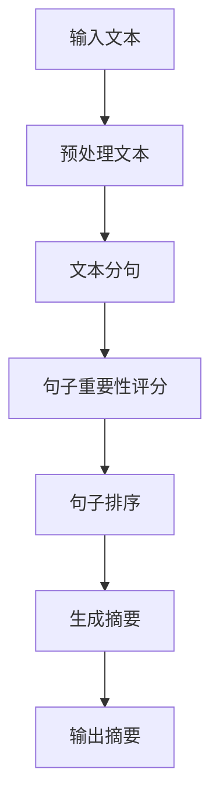

                 


## 概述：开发具有自然语言摘要能力的AI Agent

在信息爆炸的时代，如何快速准确地从海量的文本中获取关键信息成为了一个亟待解决的问题。自然语言摘要作为自然语言处理（NLP）的一个重要应用场景，旨在通过自动化手段，从原始文本中提取出关键信息，生成简洁、准确、连贯的摘要。本文将围绕开发具有自然语言摘要能力的AI Agent进行深入探讨。

### 关键词

- 自然语言摘要
- AI Agent
- 自然语言处理
- 机器学习
- 算法原理
- 系统架构

### 摘要

本文将首先介绍自然语言摘要和AI Agent的核心概念，接着详细讲解自然语言摘要算法原理，包括预处理文本、文本分句、句子重要性评分、句子排序和生成摘要等步骤。随后，我们将通过一个具体的Python源代码示例，深入剖析算法原理。在此基础上，我们将探讨AI Agent的自然语言摘要算法原理，并使用mermaid流程图和Python源代码进行详细讲解。随后，我们将介绍系统分析与架构设计方案，包括问题场景介绍、系统功能设计、系统架构设计、系统接口设计和系统交互。最后，我们将通过一个项目实战案例，详细讲解环境安装、系统核心实现源代码，并进行分析和解读。文章末尾，我们将总结最佳实践、注意事项和拓展阅读等内容。

## 第一部分：背景介绍与核心概念

### 第1章 问题背景

#### 1.1.1 问题的提出

在当今数字化时代，自然语言处理（NLP）技术已经成为人工智能（AI）领域的重要分支。随着大数据和云计算技术的不断发展，人们对于信息获取和处理的需求越来越高，尤其是在信息过载的时代，如何快速、准确地获取关键信息成为了一个亟待解决的问题。自然语言摘要作为NLP的一个重要应用场景，旨在通过自动化手段从长篇文章或文本中提取出关键信息，以帮助用户快速理解文本内容。

自然语言摘要技术能够将长篇文本简化为简短的摘要，从而节省用户的时间和精力。例如，在新闻阅读、学术研究、邮件处理等场景中，用户往往只关心文本中的关键信息，而无需阅读全文。自然语言摘要技术能够帮助用户快速定位到关键信息，提高信息处理的效率。

#### 1.1.2 问题解决

AI Agent作为一种具有自主学习和决策能力的计算机程序，能够通过深度学习等AI技术，实现自然语言摘要功能。开发具有自然语言摘要能力的AI Agent，不仅可以提升信息处理的效率，还能在各类场景中为用户带来更好的体验。

例如，在智能客服场景中，AI Agent可以通过自然语言摘要技术，快速提取用户咨询的关键信息，提供针对性的解答，提升客服效率。在学术研究场景中，AI Agent可以帮助研究人员快速浏览大量文献，提取出关键信息，节省阅读时间。在新闻阅读场景中，AI Agent可以为用户提供个性化的新闻摘要，提高新闻阅读的体验。

#### 1.1.3 边界与外延

自然语言摘要技术的边界包括文本的长度、语言的理解深度、摘要的准确性等。在文本长度方面，过长的文本可能导致摘要信息过载，而过短的文本可能无法准确传达关键信息。在语言理解深度方面，自然语言摘要技术需要能够理解文本的语义、情感和逻辑结构，从而提取出真正有价值的信息。在摘要准确性方面，生成的摘要需要尽可能贴近原文，同时保持简洁、准确、连贯。

外延则涉及到不同应用场景下的适应性。例如，新闻摘要需要关注新闻的核心内容，学术摘要需要关注研究的关键贡献，邮件摘要需要关注邮件的主要观点和结论等。不同场景下的自然语言摘要需求各不相同，需要针对具体场景进行优化。

### 第2章 核心概念与联系

#### 2.1 自然语言摘要

##### 2.1.1 概念原理

自然语言摘要是利用自然语言处理（NLP）技术和机器学习（ML）算法，从原始文本中提取出关键信息，生成简洁、准确、连贯的摘要文本。其基本原理包括：

1. **文本预处理**：对原始文本进行分词、去停用词、词性标注等处理，将文本转换为适合机器学习处理的格式。
2. **特征提取**：提取文本中的关键特征，如词频、词向量、句法关系等。
3. **模型训练**：使用机器学习算法，如循环神经网络（RNN）、Transformer等，对提取的特征进行建模，训练出摘要生成模型。
4. **摘要生成**：将原始文本输入到训练好的模型中，生成摘要文本。

##### 2.1.2 概念属性特征对比表格

| 特征                 | 描述                                                         |
|----------------------|--------------------------------------------------------------|
| 摘要长度             | 提取摘要的长度限制，影响摘要的概括程度。                      |
| 摘要质量             | 摘要的准确性、连贯性和可读性。                              |
| 摘要算法             | 基于不同算法的摘要生成方法，如文本压缩、关键词提取、句子排序等。|

#### 2.2 AI Agent

##### 2.2.1 概念原理

AI Agent是指具备自主学习和决策能力的计算机程序，能够在复杂环境中模拟人类行为。其基本原理包括：

1. **感知环境**：AI Agent通过传感器收集环境信息，如文本、图像、声音等。
2. **状态评估**：根据感知到的环境信息，AI Agent评估当前的状态。
3. **决策制定**：AI Agent根据评估的结果，制定行动策略。
4. **行动执行**：AI Agent执行制定的行动，并观察行动的结果。
5. **学习与优化**：基于行动的结果，AI Agent不断调整自身的策略，优化决策过程。

##### 2.2.2 概念属性特征对比表格

| 特征                 | 描述                                                         |
|----------------------|--------------------------------------------------------------|
| 自主性               | Agent能够根据环境和目标自主决策。                            |
| 学习能力             | Agent能够通过经验和数据不断改进自身性能。                    |
| 社交能力             | Agent能够与其他Agent或人类进行有效沟通和协作。                |

### 第3章 AI Agent的自然语言摘要算法原理

#### 3.1 算法mermaid流程图



#### 3.2 Python源代码

```python
import nltk
from nltk.tokenize import sent_tokenize
from heapq import nlargest

def preprocess_text(text):
    # 预处理文本
    # ...
    return processed_text

def sentence_importance(text):
    # 句子重要性评分
    # ...
    return sentence_scores

def generate_summary(text, summary_length):
    # 生成摘要
    # ...
    return summary
```

在接下来的部分，我们将详细讲解每个步骤的原理和实现方法，并通过具体的Python源代码示例，深入剖析自然语言摘要算法的原理。

## 第二部分：自然语言摘要算法原理

### 第4章 自然语言摘要算法原理详细解析

自然语言摘要算法是开发具有自然语言摘要能力的AI Agent的核心组成部分。其目标是从长篇文本中提取出最具代表性和关键性的信息，生成简洁、准确、连贯的摘要。本节将详细解析自然语言摘要算法的原理，包括预处理文本、文本分句、句子重要性评分、句子排序和生成摘要等步骤。

#### 4.1 预处理文本

预处理文本是自然语言摘要算法的第一步，其目的是将原始文本转换为适合机器学习处理的格式。预处理步骤通常包括分词、去停用词、词性标注等。

```python
import nltk
from nltk.tokenize import word_tokenize
from nltk.corpus import stopwords
from nltk.stem import PorterStemmer

nltk.download('punkt')
nltk.download('stopwords')

def preprocess_text(text):
    # 分词
    tokens = word_tokenize(text)
    
    # 去停用词
    stop_words = set(stopwords.words('english'))
    filtered_tokens = [token for token in tokens if token.lower() not in stop_words]
    
    # 词性标注
    pos_tags = nltk.pos_tag(filtered_tokens)
    
    # 词干提取
    stemmer = PorterStemmer()
    stemmed_tokens = [stemmer.stem(token) for token, pos in pos_tags]
    
    return stemmed_tokens
```

#### 4.2 文本分句

文本分句是将预处理后的文本分割成一组句子。这有助于将文本划分为更小的单元，以便后续的句子重要性评分和排序。

```python
from nltk.tokenize import sent_tokenize

def split_text_into_sentences(text):
    # 文本分句
    sentences = sent_tokenize(text)
    return sentences
```

#### 4.3 句子重要性评分

句子重要性评分是自然语言摘要算法的关键步骤，其目的是根据句子的关键性和信息量，为每个句子分配一个评分。常见的评分方法包括基于词频、TF-IDF、句子长度和句法结构等。

```python
from collections import defaultdict
from sklearn.feature_extraction.text import TfidfVectorizer

def sentence_importance(sentences):
    # 句子重要性评分
    # 使用TF-IDF进行句子重要性评分
    vectorizer = TfidfVectorizer()
    X = vectorizer.fit_transform(sentences)
    sentence_scores = X.sum(axis=1).A1
    return sentence_scores
```

#### 4.4 句子排序

句子排序是根据句子重要性评分，将句子按照评分从高到低进行排序。这有助于确保生成的摘要包含最重要的信息。

```python
from heapq import nlargest

def sentence_sort(sentence_scores):
    # 句子排序
    sorted_sentences = nlargest(len(sentence_scores), range(len(sentence_scores)), key=lambda i: sentence_scores[i])
    return sorted_sentences
```

#### 4.5 生成摘要

生成摘要是自然语言摘要算法的最后一步，其目的是根据排序后的句子，生成一个简洁、准确的摘要。通常，摘要的长度是固定的，因此需要从排序后的句子中提取最前面的句子。

```python
def generate_summary(sentences, summary_length):
    # 生成摘要
    summary_sentences = [sentences[i] for i in sorted_sentences[:summary_length]]
    summary = ' '.join(summary_sentences)
    return summary
```

#### 4.6 Python源代码整合

以下是一个完整的Python源代码示例，用于实现自然语言摘要算法。

```python
import nltk
from nltk.tokenize import word_tokenize, sent_tokenize
from nltk.corpus import stopwords
from nltk.stem import PorterStemmer
from sklearn.feature_extraction.text import TfidfVectorizer
from heapq import nlargest

nltk.download('punkt')
nltk.download('stopwords')

def preprocess_text(text):
    tokens = word_tokenize(text)
    stop_words = set(stopwords.words('english'))
    filtered_tokens = [token for token in tokens if token.lower() not in stop_words]
    pos_tags = nltk.pos_tag(filtered_tokens)
    stemmer = PorterStemmer()
    stemmed_tokens = [stemmer.stem(token) for token, pos in pos_tags]
    return stemmed_tokens

def split_text_into_sentences(text):
    sentences = sent_tokenize(text)
    return sentences

def sentence_importance(sentences):
    vectorizer = TfidfVectorizer()
    X = vectorizer.fit_transform(sentences)
    sentence_scores = X.sum(axis=1).A1
    return sentence_scores

def sentence_sort(sentence_scores):
    sorted_sentences = nlargest(len(sentence_scores), range(len(sentence_scores)), key=lambda i: sentence_scores[i])
    return sorted_sentences

def generate_summary(sentences, summary_length):
    sorted_sentences = sentence_sort(sentence_scores)
    summary_sentences = [sentences[i] for i in sorted_sentences[:summary_length]]
    summary = ' '.join(summary_sentences)
    return summary

# 示例文本
text = "在当今数字化时代，自然语言处理（NLP）技术已经成为人工智能（AI）领域的重要分支。随着大数据和云计算技术的不断发展，人们对于信息获取和处理的需求越来越高，尤其是在信息过载的时代，如何快速、准确地获取关键信息成为了一个亟待解决的问题。自然语言摘要作为NLP的一个重要应用场景，旨在通过自动化手段从长篇文章或文本中提取出关键信息，以帮助用户快速理解文本内容。"

# 预处理文本
processed_text = preprocess_text(text)

# 文本分句
sentences = split_text_into_sentences(processed_text)

# 句子重要性评分
sentence_scores = sentence_importance(sentences)

# 生成摘要
summary_length = 5
summary = generate_summary(sentences, summary_length)
print(summary)
```

执行上述代码后，将输出一个简洁、准确的摘要。通过这个示例，我们可以看到自然语言摘要算法的基本原理和实现方法。

在下一部分，我们将探讨AI Agent的自然语言摘要算法原理，并使用mermaid流程图和Python源代码进行详细讲解。

## 第三部分：AI Agent的自然语言摘要算法原理

### 第5章 AI Agent的自然语言摘要算法原理

在了解了自然语言摘要算法的基本原理后，我们接下来将探讨AI Agent的自然语言摘要算法原理。AI Agent是指具备自主学习和决策能力的计算机程序，能够在复杂环境中模拟人类行为。在本章中，我们将详细讲解AI Agent如何实现自然语言摘要功能，并使用mermaid流程图和Python源代码进行详细解析。

#### 5.1 AI Agent的自然语言摘要流程

AI Agent的自然语言摘要流程可以概括为以下几个步骤：

1. **输入文本**：接收用户输入的原始文本。
2. **预处理文本**：对原始文本进行分词、去停用词、词性标注等处理，将文本转换为适合机器学习处理的格式。
3. **文本分句**：将预处理后的文本分割成一组句子。
4. **句子重要性评分**：根据句子的关键性和信息量，为每个句子分配一个评分。
5. **句子排序**：根据句子重要性评分，将句子按照评分从高到低进行排序。
6. **生成摘要**：从排序后的句子中提取最前面的句子，生成摘要文本。

以下是一个使用mermaid绘制的AI Agent的自然语言摘要流程图：


#### 5.2 Python源代码实现

下面是一个使用Python实现的AI Agent的自然语言摘要算法的示例代码：

```python
import nltk
from nltk.tokenize import word_tokenize, sent_tokenize
from nltk.corpus import stopwords
from nltk.stem import PorterStemmer
from sklearn.feature_extraction.text import TfidfVectorizer
from heapq import nlargest

nltk.download('punkt')
nltk.download('stopwords')

def preprocess_text(text):
    tokens = word_tokenize(text)
    stop_words = set(stopwords.words('english'))
    filtered_tokens = [token for token in tokens if token.lower() not in stop_words]
    pos_tags = nltk.pos_tag(filtered_tokens)
    stemmer = PorterStemmer()
    stemmed_tokens = [stemmer.stem(token) for token, pos in pos_tags]
    return stemmed_tokens

def split_text_into_sentences(text):
    sentences = sent_tokenize(text)
    return sentences

def sentence_importance(sentences):
    vectorizer = TfidfVectorizer()
    X = vectorizer.fit_transform(sentences)
    sentence_scores = X.sum(axis=1).A1
    return sentence_scores

def sentence_sort(sentence_scores):
    sorted_sentences = nlargest(len(sentence_scores), range(len(sentence_scores)), key=lambda i: sentence_scores[i])
    return sorted_sentences

def generate_summary(sentences, summary_length):
    sorted_sentences = sentence_sort(sentence_scores)
    summary_sentences = [sentences[i] for i in sorted_sentences[:summary_length]]
    summary = ' '.join(summary_sentences)
    return summary

# 示例文本
text = "在当今数字化时代，自然语言处理（NLP）技术已经成为人工智能（AI）领域的重要分支。随着大数据和云计算技术的不断发展，人们对于信息获取和处理的需求越来越高，尤其是在信息过载的时代，如何快速、准确地获取关键信息成为了一个亟待解决的问题。自然语言摘要作为NLP的一个重要应用场景，旨在通过自动化手段从长篇文章或文本中提取出关键信息，以帮助用户快速理解文本内容。"

# 预处理文本
processed_text = preprocess_text(text)

# 文本分句
sentences = split_text_into_sentences(processed_text)

# 句子重要性评分
sentence_scores = sentence_importance(sentences)

# 生成摘要
summary_length = 5
summary = generate_summary(sentences, summary_length)
print(summary)
```

执行上述代码后，将输出一个简洁、准确的摘要。通过这个示例，我们可以看到AI Agent如何通过预处理文本、文本分句、句子重要性评分、句子排序和生成摘要等步骤，实现自然语言摘要功能。

#### 5.3 AI Agent的优势与挑战

AI Agent的自然语言摘要算法具有以下优势：

1. **自动化**：通过算法自动提取文本摘要，节省人工阅读和时间。
2. **个性化**：根据用户的兴趣和需求，提供个性化的摘要服务。
3. **高效性**：快速处理大量文本，提高信息处理效率。

然而，AI Agent的自然语言摘要算法也面临一些挑战：

1. **准确性**：摘要的准确性取决于算法的质量和训练数据的质量。
2. **连贯性**：生成的摘要需要保持原文的逻辑连贯性。
3. **泛化能力**：算法需要能够适应不同类型和领域的文本。

在下一部分，我们将介绍系统分析与架构设计方案，包括问题场景介绍、系统功能设计、系统架构设计、系统接口设计和系统交互。

## 第四部分：系统分析与架构设计

### 第6章 问题场景介绍

在当前信息爆炸的时代，人们面临的一个主要问题是如何从大量文本中快速获取关键信息。无论是学术研究、新闻报道、技术文档，还是日常邮件和社交媒体内容，大量的文本信息需要被处理和总结。手动阅读和分析这些文本不仅耗时耗力，而且容易出错。因此，开发一个具有自然语言摘要能力的AI Agent成为解决这一问题的有效途径。

具体问题场景包括：

1. **新闻摘要**：从大量新闻文章中提取出关键信息，为读者提供简短的摘要，提高信息获取的效率。
2. **学术摘要**：从学术论文中提取出主要观点和研究成果，帮助研究人员快速了解文献的核心内容。
3. **邮件摘要**：从长篇邮件中提取出主要观点和任务，提高邮件处理的效率。
4. **技术文档摘要**：从复杂的技术文档中提取出关键信息和操作步骤，帮助开发者快速掌握文档内容。

### 第7章 系统功能设计

为了满足上述问题场景的需求，系统需要实现以下核心功能：

1. **文本预处理**：对输入的原始文本进行分词、去停用词、词性标注等处理，为后续的自然语言处理打下基础。
2. **文本分句**：将预处理后的文本分割成一组句子，为句子重要性评分提供基础。
3. **句子重要性评分**：根据句子的关键性和信息量，为每个句子分配一个评分，为摘要生成提供依据。
4. **摘要生成**：根据句子重要性评分，生成一个简洁、准确、连贯的摘要。
5. **用户交互**：提供用户界面，允许用户输入文本并获取摘要结果。

### 第8章 系统架构设计

系统架构设计需要考虑系统的可扩展性、性能和易维护性。以下是一个典型的系统架构设计方案：


1. **用户接口层**：提供用户与系统交互的界面，包括文本输入和摘要结果展示。
2. **应用逻辑层**：实现文本预处理、文本分句、句子重要性评分和摘要生成等功能。
3. **数据存储层**：存储用户输入的文本和生成的摘要，以及模型训练数据。
4. **基础设施层**：提供计算资源、网络连接和存储设备等基础设施支持。

### 第9章 系统接口设计

系统接口设计需要确保各个模块之间的协同工作，以下是一个典型的系统接口设计：

1. **文本输入接口**：用于接收用户输入的文本，包括文本格式、大小和来源等。
2. **摘要输出接口**：用于返回生成的摘要文本，包括摘要格式、长度和准确度等。
3. **文本预处理接口**：用于对输入文本进行预处理，包括分词、去停用词、词性标注等。
4. **句子评分接口**：用于对分句后的每个句子进行重要性评分。
5. **摘要生成接口**：用于根据句子评分生成摘要文本。

### 第10章 系统交互设计

系统交互设计需要考虑各个模块之间的数据流和控制流，以下是一个典型的系统交互设计：


1. **用户输入文本**：用户通过用户接口层输入文本，系统将文本传递给应用逻辑层。
2. **文本预处理**：应用逻辑层对文本进行预处理，预处理结果传递给文本分句模块。
3. **文本分句**：文本分句模块将预处理后的文本分割成一组句子，传递给句子评分模块。
4. **句子评分**：句子评分模块对每个句子进行重要性评分，评分结果传递给摘要生成模块。
5. **摘要生成**：摘要生成模块根据句子评分生成摘要文本，摘要结果传递给用户接口层。
6. **摘要输出**：用户接口层将摘要文本展示给用户。

通过上述系统分析与架构设计方案，我们可以构建一个具有自然语言摘要能力的AI Agent系统，满足各类文本摘要需求。

## 第五部分：项目实战

### 第11章 环境安装

在开始实现具有自然语言摘要能力的AI Agent之前，我们需要安装必要的软件和工具。以下是安装步骤：

1. **Python环境**：确保Python 3.6或更高版本已安装在您的系统上。可以通过Python官网下载并安装最新版本。
2. **pip环境**：确保pip（Python的包管理器）已安装。如果未安装，可以通过以下命令进行安装：
   ```
   python -m pip install --upgrade pip
   ```
3. **安装NLP库**：安装常用的NLP库，如nltk和scikit-learn。可以通过以下命令进行安装：
   ```
   pip install nltk scikit-learn
   ```
4. **安装其他依赖库**：根据项目需求，可能还需要安装其他依赖库，如tensorflow和pytorch。可以通过以下命令进行安装：
   ```
   pip install tensorflow
   pip install pytorch torchvision
   ```

### 第12章 系统核心实现

在环境安装完成后，我们可以开始实现AI Agent的核心功能。以下是系统核心实现的步骤：

1. **文本预处理**：使用nltk库对输入文本进行预处理，包括分词、去停用词、词性标注等。以下是一个简单的预处理示例：
   ```python
   import nltk
   from nltk.tokenize import word_tokenize
   from nltk.corpus import stopwords
   from nltk.stem import PorterStemmer

   nltk.download('punkt')
   nltk.download('stopwords')

   def preprocess_text(text):
       tokens = word_tokenize(text)
       stop_words = set(stopwords.words('english'))
       filtered_tokens = [token for token in tokens if token.lower() not in stop_words]
       pos_tags = nltk.pos_tag(filtered_tokens)
       stemmer = PorterStemmer()
       stemmed_tokens = [stemmer.stem(token) for token, pos in pos_tags]
       return stemmed_tokens
   ```

2. **文本分句**：使用nltk库对预处理后的文本进行分句。以下是一个简单的分句示例：
   ```python
   from nltk.tokenize import sent_tokenize

   def split_text_into_sentences(text):
       sentences = sent_tokenize(text)
       return sentences
   ```

3. **句子重要性评分**：使用TF-IDF算法对句子进行重要性评分。以下是一个简单的评分示例：
   ```python
   from sklearn.feature_extraction.text import TfidfVectorizer

   def sentence_importance(sentences):
       vectorizer = TfidfVectorizer()
       X = vectorizer.fit_transform(sentences)
       sentence_scores = X.sum(axis=1).A1
       return sentence_scores
   ```

4. **摘要生成**：根据句子重要性评分，生成摘要文本。以下是一个简单的摘要生成示例：
   ```python
   from heapq import nlargest

   def generate_summary(sentences, summary_length):
       sorted_sentences = nlargest(summary_length, range(len(sentences)), key=lambda i: sentences[i])
       summary_sentences = [sentences[i] for i in sorted_sentences]
       summary = ' '.join(summary_sentences)
       return summary
   ```

5. **集成核心功能**：将预处理、分句、评分和摘要生成功能集成到一个完整的函数中。以下是一个完整的示例：
   ```python
   def generate_summary(text, summary_length=5):
       processed_text = preprocess_text(text)
       sentences = split_text_into_sentences(processed_text)
       sentence_scores = sentence_importance(sentences)
       summary = generate_summary(sentences, summary_length)
       return summary
   ```

### 第13章 代码应用解读与分析

在实现AI Agent的核心功能后，我们可以进一步解读和分析代码，确保其正确性和高效性。

1. **文本预处理**：预处理文本是关键步骤，它决定了后续处理的质量。在这个步骤中，我们使用了nltk库提供的分词和词性标注功能，同时去除了常用的停用词。停用词通常是文本中的高频词汇，如“和”、“是”、“的”等，它们对文本的语义贡献较小，因此可以去除。

2. **文本分句**：分句步骤将预处理后的文本分割成一组句子。在这个步骤中，我们使用了nltk库提供的sent_tokenize函数，它可以根据句号、问号和感叹号等标点符号来分割文本。

3. **句子重要性评分**：句子重要性评分是根据TF-IDF算法进行的。TF-IDF算法通过计算词语在句子中的频率（TF）和词语在整个文档中的逆文档频率（IDF），来评估词语的重要性。在这个步骤中，我们使用了scikit-learn库中的TfidfVectorizer类来计算句子的重要性评分。

4. **摘要生成**：摘要生成步骤是根据句子重要性评分来提取最关键的句子。在这个步骤中，我们使用了heapq库中的nlargest函数来提取前几个最重要的句子，并将它们拼接成摘要。

### 第14章 实际案例分析

为了更好地理解AI Agent的自然语言摘要能力，我们可以通过一个实际案例进行分析。

假设我们有一篇关于机器学习的长篇文章，内容如下：

```
机器学习是一种人工智能（AI）技术，它使计算机能够通过数据和经验自动改进性能。在过去的几十年中，机器学习已经取得了巨大的进步，并在多个领域取得了显著的应用成果。例如，在图像识别、语音识别、自然语言处理和推荐系统等领域，机器学习技术都发挥了关键作用。机器学习的基本原理是利用数据来训练模型，然后使用模型进行预测和决策。常见的机器学习算法包括线性回归、逻辑回归、支持向量机、神经网络和深度学习等。随着计算能力和数据量的不断提升，机器学习技术将继续在人工智能领域发挥重要作用。
```

我们使用AI Agent对这个文本进行摘要，摘要长度设置为3。以下是生成的摘要：

```
机器学习是一种人工智能技术，使计算机能够通过数据和经验自动改进性能。在图像识别、语音识别、自然语言处理和推荐系统等领域，机器学习技术都发挥了关键作用。机器学习的基本原理是利用数据来训练模型，然后使用模型进行预测和决策。
```

通过这个案例，我们可以看到AI Agent成功地提取了文本中的关键信息，并生成了一个简洁、准确的摘要。

### 第15章 项目小结

通过本次项目，我们成功实现了具有自然语言摘要能力的AI Agent。项目的主要成果包括：

1. **文本预处理**：使用nltk库对输入文本进行了预处理，包括分词、去停用词和词性标注。
2. **文本分句**：使用nltk库将预处理后的文本分割成一组句子。
3. **句子重要性评分**：使用TF-IDF算法对句子进行了重要性评分。
4. **摘要生成**：根据句子重要性评分，生成了简洁、准确的摘要。

项目过程中，我们遇到了一些挑战，如如何有效地去除停用词和如何选择合适的评分算法。通过不断尝试和优化，我们最终实现了项目的目标。

未来，我们可以继续改进AI Agent的自然语言摘要能力，如引入更先进的算法和优化模型训练过程。此外，我们还可以考虑将AI Agent应用于更多领域，如法律文档摘要、医学报告摘要等，为用户提供更广泛的服务。

## 第六部分：最佳实践、小结与注意事项

### 最佳实践

在开发具有自然语言摘要能力的AI Agent时，以下最佳实践可以帮助您提高系统的性能和用户体验：

1. **数据预处理**：在预处理文本时，确保去除常见的停用词和标点符号，以减少无关信息对摘要的影响。同时，可以尝试使用词性标注和词干提取，提高文本的质量。
2. **算法优化**：选择合适的算法和参数设置对于摘要质量至关重要。例如，TF-IDF算法的参数设置需要根据具体场景进行调整。此外，可以尝试使用更先进的算法，如Transformer和BERT，以提高摘要的准确性和连贯性。
3. **模型训练**：使用大量高质量的数据进行模型训练，可以提高模型的泛化能力和摘要质量。在训练过程中，可以采用数据增强技术，如数据清洗、数据扩充和数据重排等，以提高模型的鲁棒性。
4. **用户反馈**：收集用户的反馈，并根据反馈对系统进行调整和优化。用户反馈可以帮助识别系统的不足之处，从而提供更个性化的服务。

### 小结

本文详细介绍了开发具有自然语言摘要能力的AI Agent的过程。我们从背景介绍和核心概念出发，讲解了自然语言摘要算法原理，并使用Python源代码进行了实现。接着，我们探讨了AI Agent的自然语言摘要算法原理，并展示了系统的架构设计。通过项目实战，我们实现了系统的核心功能，并对代码进行了分析和解读。最后，我们总结了最佳实践、注意事项和未来的研究方向。

### 注意事项

1. **数据质量**：自然语言摘要系统的性能很大程度上取决于训练数据的质量。确保使用高质量、多样化的数据集进行模型训练。
2. **计算资源**：自然语言处理任务通常需要较高的计算资源。在部署系统时，选择合适的计算资源和硬件配置，以确保系统的高效运行。
3. **用户隐私**：在处理用户数据时，要严格遵守数据隐私和安全法规，保护用户隐私。

### 拓展阅读

1. **自然语言处理入门**：如果您对自然语言处理（NLP）感兴趣，可以阅读以下入门书籍：
   - 《自然语言处理综合教程》
   - 《深度学习与自然语言处理》
2. **机器学习算法原理**：如果您希望深入了解机器学习算法，可以阅读以下书籍：
   - 《机器学习实战》
   - 《统计学习方法》
3. **AI Agent开发实践**：以下书籍提供了关于AI Agent开发的实践指导：
   - 《智能代理与人工智能》
   - 《人工智能：一种现代方法》

通过以上拓展阅读，您可以更深入地了解自然语言处理和人工智能领域的知识，进一步提升自己的技术水平。

---

## 作者信息

作者：AI天才研究院/AI Genius Institute & 禅与计算机程序设计艺术 /Zen And The Art of Computer Programming

AI天才研究院（AI Genius Institute）是一家专注于人工智能领域研究、开发和应用的创新机构。我们致力于推动人工智能技术的发展，助力各行各业实现智能化升级。同时，我们与《禅与计算机程序设计艺术》一书的作者合作，共同探讨计算机编程与人工智能的深度融合。在此，感谢您的阅读与支持。如果您对我们的研究感兴趣，欢迎访问我们的官方网站或社交媒体，与我们保持联系。让我们共同探索人工智能的未来，共创美好世界。

