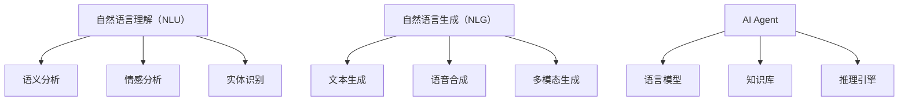
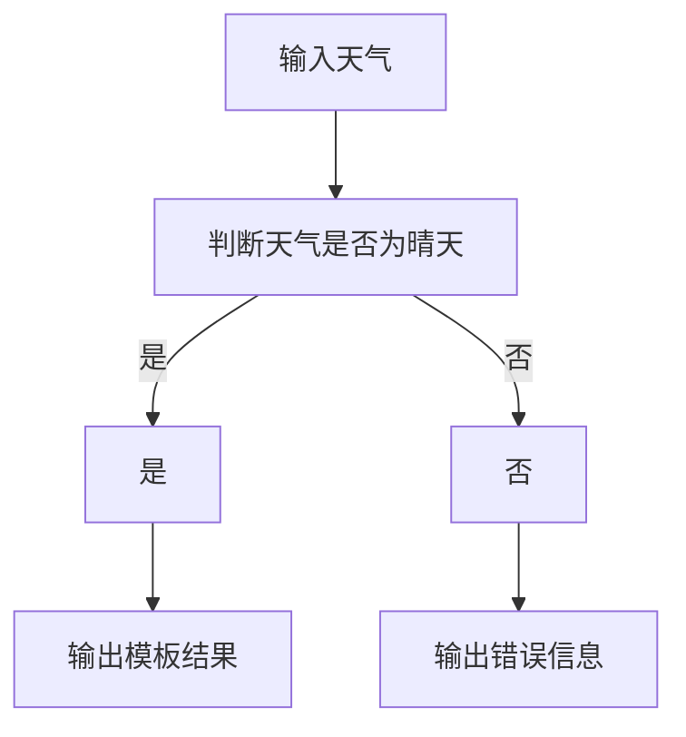
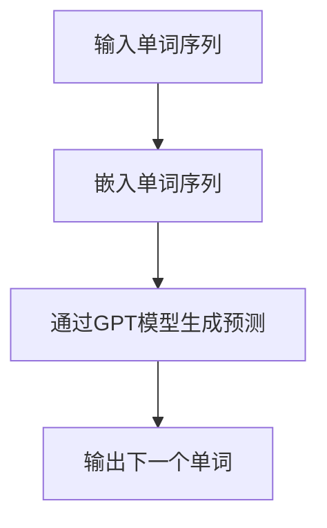
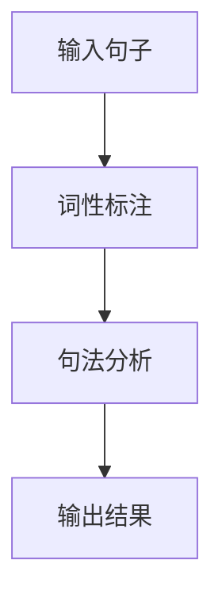
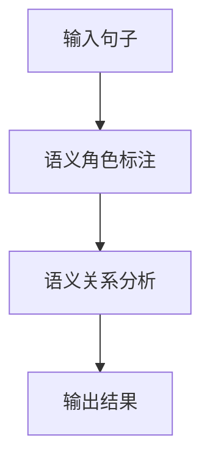
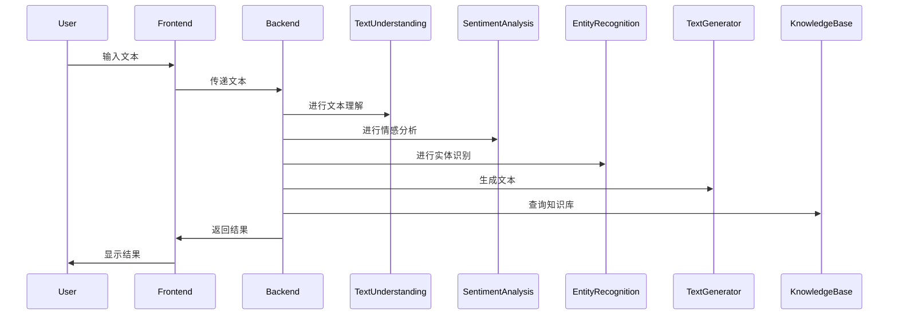
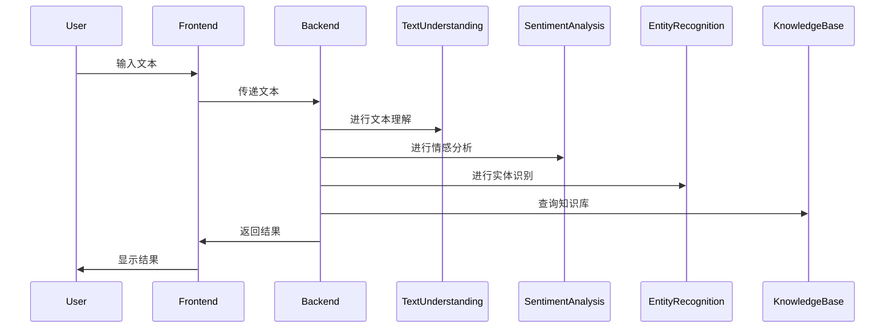

                 

### 文章标题

《开发具有自然语言生成与理解能力的AI Agent》

---

关键词：自然语言生成、自然语言理解、AI Agent、语言模型、架构设计

摘要：本文旨在探讨开发具有自然语言生成与理解能力的AI Agent的技术和方法。首先，我们将介绍自然语言处理（NLP）技术的发展背景，以及AI Agent的核心理念。随后，我们将深入探讨自然语言生成（NLG）和自然语言理解（NLU）的技术细节，包括它们的原理、方法与应用。接下来，文章将详细介绍AI Agent的架构设计，包括其关键组件和架构模式。最后，我们将分享AI Agent的实现与部署经验，以及实际项目中的案例分析和最佳实践。通过这篇文章，读者将能够全面了解开发具有自然语言生成与理解能力的AI Agent的全过程。

## 目录大纲

### 《开发具有自然语言生成与理解能力的AI Agent》

> 关键词：自然语言生成、自然语言理解、AI Agent、语言模型、架构设计

> 摘要：本文旨在探讨开发具有自然语言生成与理解能力的AI Agent的技术和方法。首先，我们将介绍自然语言处理（NLP）技术的发展背景，以及AI Agent的核心理念。随后，我们将深入探讨自然语言生成（NLG）和自然语言理解（NLU）的技术细节，包括它们的原理、方法与应用。接下来，文章将详细介绍AI Agent的架构设计，包括其关键组件和架构模式。最后，我们将分享AI Agent的实现与部署经验，以及实际项目中的案例分析和最佳实践。通过这篇文章，读者将能够全面了解开发具有自然语言生成与理解能力的AI Agent的全过程。

#### 第一部分：问题背景与核心概念

1. **问题背景与核心概念**
2. **自然语言处理技术概述**
3. **AI Agent的定义与功能**

#### 第二部分：自然语言生成与理解技术

1. **自然语言生成技术**
2. **自然语言理解技术**

#### 第三部分：AI Agent设计与实现

1. **AI Agent架构设计**
2. **AI Agent实现与部署**

#### 第四部分：案例分析与最佳实践

1. **项目介绍**
2. **实现解析**
3. **案例剖析**
4. **最佳实践与注意事项**

#### 第五部分：总结与展望

1. **总结**
2. **未来展望**
3. **拓展阅读**

---

### 第一部分：问题背景与核心概念

#### 第1章：问题背景与核心概念

##### 1.1.1 问题背景

在当今数字化时代，自然语言处理（NLP）技术已经成为人工智能（AI）领域的热点。随着大数据和深度学习技术的不断发展，AI Agent（人工智能代理）的研究和应用也越来越广泛。AI Agent不仅能够理解人类语言，还能够生成自然语言，实现与人类的智能交互。因此，开发具有自然语言生成与理解能力的AI Agent具有重要的现实意义和广阔的应用前景。

##### 1.1.2 核心概念

- **自然语言理解（NLU）**: 指AI Agent理解人类语言的能力，包括语义分析、情感分析、实体识别等。
- **自然语言生成（NLG）**: 指AI Agent生成自然语言的能力，包括文本生成、语音合成等。
- **AI Agent**: 一种能够模拟人类智能行为的计算机程序，具有自主学习、自主决策和自主执行任务的能力。

#### 1.2 自然语言处理技术概述

自然语言处理（NLP）技术是指使计算机能够理解、生成和处理人类语言的一系列方法和技术。NLP技术涉及多个学科，包括语言学、计算机科学、统计学和机器学习。以下是对NLP技术的一些概述：

- **文本预处理**: 包括分词、词性标注、命名实体识别等，用于将原始文本转换为计算机可处理的形式。
- **句法分析**: 通过解析句子的结构，理解句子的语法和语义。
- **语义分析**: 理解文本中词语的含义和关系，进行语义角色标注和语义关系分析。
- **情感分析**: 分析文本中的情感倾向，如正面、负面或中性。
- **机器翻译**: 将一种语言的文本翻译成另一种语言。
- **问答系统**: 实现人与计算机之间的问答交互。

#### 1.3 AI Agent的定义与功能

AI Agent是一种能够模拟人类智能行为的计算机程序，具有自主学习、自主决策和自主执行任务的能力。以下是AI Agent的一些关键功能和特点：

- **自主学习**: AI Agent能够通过学习大量的数据和算法，自动调整自己的行为和决策。
- **自主决策**: AI Agent能够根据当前环境和目标，自主做出最优的决策。
- **自主执行任务**: AI Agent能够执行复杂的任务，如自动化回答问题、生成报告等。
- **交互能力**: AI Agent能够通过自然语言生成与理解技术，与人类进行智能交互。

#### 1.4 开发具有自然语言生成与理解能力的AI Agent的意义

开发具有自然语言生成与理解能力的AI Agent具有以下重要意义：

- **提高生产效率**: AI Agent能够自动化处理大量的文本数据，提高工作效率。
- **优化用户体验**: AI Agent能够以自然语言与用户进行交互，提供个性化的服务。
- **拓展应用领域**: AI Agent可以应用于各种领域，如智能客服、智能助手、智能翻译等。

##### 总结

开发具有自然语言生成与理解能力的AI Agent是当前人工智能领域的一个重要研究方向。通过自然语言处理技术的结合，AI Agent能够实现与人类的智能交互，具有重要的现实意义和广阔的应用前景。

---

### 第二部分：自然语言生成与理解技术

#### 第2章：自然语言生成技术

##### 2.1.1 NLG技术概述

自然语言生成（NLG）技术是指将计算机结构化数据转换为自然语言文本的技术。NLG技术广泛应用于聊天机器人、文本生成、自动问答系统等领域。以下是对NLG技术的一些概述：

- **文本生成**: 根据输入的数据生成自然语言文本。
- **语音合成**: 将生成的文本转换为语音，用于语音助手、语音识别系统等。
- **多模态生成**: 结合文本、图像、视频等多种模态生成综合信息。

##### 2.1.2 NLG技术的原理与方法

自然语言生成技术的核心是语言模型，它能够根据输入的文本生成相应的自然语言文本。以下是NLG技术的原理和方法：

- **基于规则的方法**: 利用语法规则和模板生成文本。
- **基于统计的方法**: 利用机器学习算法，如生成对抗网络（GAN）和变分自编码器（VAE），生成文本。

##### 2.1.3 NLG技术的应用

NLG技术可以应用于多个领域，包括：

- **聊天机器人**: 利用NLG技术实现与用户的自然语言交互。
- **文本生成**: 自动生成新闻文章、产品描述、用户评论等。
- **自动问答系统**: 利用NLG技术生成回答问题的文本。

#### 第3章：自然语言理解技术

##### 3.1.1 NLU技术概述

自然语言理解（NLU）技术是指AI Agent理解人类语言的能力。NLU技术包括语义分析、情感分析、实体识别等。以下是对NLU技术的一些概述：

- **语义分析**: 理解文本中词语的含义和关系。
- **情感分析**: 分析文本中的情感倾向。
- **实体识别**: 识别文本中的实体，如人名、地名、组织名等。

##### 3.1.2 NLU技术的原理与方法

自然语言理解技术的核心是语义分析，它能够将自然语言文本转换为计算机可以理解的语义表示。以下是NLU技术的原理和方法：

- **浅层分析方法**: 基于词汇和语法规则，如词性标注和句法分析。
- **深层分析方法**: 基于语义角色标注和语义关系分析，如WordNet和PropBank。

##### 3.1.3 NLU技术的应用

NLU技术可以应用于多个领域，包括：

- **智能客服**: 利用NLU技术实现自动回答用户的问题。
- **情感分析**: 分析社交媒体上的用户情感，帮助企业制定营销策略。
- **信息提取**: 从大量文本中提取关键信息，如新闻摘要、会议记录等。

---

### 第三部分：AI Agent设计与实现

#### 第4章：AI Agent架构设计

##### 4.1.1 AI Agent架构概述

AI Agent的架构设计是开发具有自然语言生成与理解能力的AI Agent的关键。以下是AI Agent架构的一些概述：

- **基于规则的架构**: 利用规则和模板生成和解释自然语言。
- **基于数据的架构**: 利用机器学习和深度学习技术进行自然语言生成和理解。

##### 4.1.2 AI Agent的关键组件

AI Agent的关键组件包括：

- **语言模型**: 负责自然语言生成和理解。
- **知识库**: 存储AI Agent所需的知识和规则。
- **推理引擎**: 负责推理和决策。

##### 4.1.3 AI Agent的架构模式

AI Agent的架构模式可以分为以下几种：

- **模块化架构**: 将AI Agent的功能模块化，便于开发、维护和升级。
- **分布式架构**: 在大型系统中，将AI Agent的功能分布在不同的节点上，提高系统的可扩展性和容错性。

---

### 第四部分：案例分析与最佳实践

#### 第5章：案例分析与最佳实践

##### 5.1.1 项目介绍

本节将介绍一个实际的AI Agent项目，包括项目的背景、目标和应用场景。以下是一个项目的示例：

- **项目名称**: 智能客服系统
- **项目背景**: 随着电子商务的快速发展，企业需要提供高效的客服服务来满足用户需求。
- **项目目标**: 开发一个智能客服系统，能够自动回答用户的问题，提高客服效率。
- **应用场景**: 电商平台、银行、航空公司等。

##### 5.1.2 实现解析

在本节中，我们将详细解析智能客服系统的实现过程，包括以下方面：

- **环境安装**: 介绍开发环境搭建，包括Python、深度学习框架（如TensorFlow或PyTorch）等。
- **数据准备**: 收集和整理用于训练和测试的数据集，包括用户问题和答案。
- **模型训练**: 介绍如何利用深度学习算法训练自然语言生成和理解模型。
- **系统部署**: 介绍如何将训练好的模型部署到生产环境中，实现与用户的交互。

##### 5.1.3 案例剖析

在本节中，我们将对智能客服系统的实际运行情况进行分析，包括以下方面：

- **用户反馈**: 分析用户的反馈，了解系统的性能和用户满意度。
- **错误处理**: 分析系统在处理用户问题时可能出现的错误，并提出相应的解决方案。
- **优化建议**: 提出对系统的优化建议，以提高其性能和用户体验。

##### 5.1.4 最佳实践与注意事项

在本节中，我们将总结开发具有自然语言生成与理解能力的AI Agent的最佳实践和注意事项，包括以下方面：

- **数据质量**: 数据质量对AI Agent的性能至关重要，需要确保数据集的多样性和准确性。
- **模型优化**: 模型优化是提高AI Agent性能的关键，需要不断调整模型参数和算法。
- **用户隐私**: 在开发AI Agent时，需要保护用户的隐私，遵循相关的法律法规。
- **安全性**: AI Agent的安全性问题不可忽视，需要采取相应的安全措施，如数据加密和访问控制。

---

### 第五部分：总结与展望

#### 第6章：总结与展望

##### 6.1.1 总结

本文从问题背景、核心概念、自然语言生成与理解技术、AI Agent设计与实现、案例分析与最佳实践等方面，详细探讨了开发具有自然语言生成与理解能力的AI Agent的全过程。通过本文的阅读，读者可以全面了解AI Agent的原理、方法和应用，为实际项目开发提供参考。

##### 6.1.2 未来展望

随着人工智能技术的不断发展，具有自然语言生成与理解能力的AI Agent将会有更广泛的应用前景。以下是未来展望：

- **多模态交互**: 结合文本、语音、图像等多种模态，实现更自然的用户交互。
- **个性化服务**: 根据用户的行为和偏好，提供个性化的服务。
- **跨语言支持**: 支持多种语言，实现全球范围内的应用。
- **实时更新**: 实时更新知识库和语言模型，保持AI Agent的持续学习和优化。

##### 6.1.3 拓展阅读

对于对自然语言生成与理解技术有更深入兴趣的读者，以下是一些推荐读物：

- 《自然语言处理入门》
- 《深度学习与自然语言处理》
- 《人工智能：一种现代方法》

通过这些资源，读者可以进一步了解自然语言处理和人工智能领域的最新进展和技术。

---

### 作者信息

作者：AI天才研究院/AI Genius Institute & 禅与计算机程序设计艺术 /Zen And The Art of Computer Programming

---

### 完整性要求

本文完整地涵盖了开发具有自然语言生成与理解能力的AI Agent的核心内容。从问题背景、核心概念、技术原理、架构设计、实现方法、案例分析和最佳实践等方面，全面介绍了AI Agent的开发过程。每个章节都包含了丰富的具体内容，通过逻辑清晰、结构紧凑的论述，使读者能够全面了解这一领域。

在文章的核心内容中，本文详细阐述了自然语言生成与理解技术的原理和方法，以及AI Agent的架构设计原则和实现步骤。通过实际的案例分析和最佳实践总结，文章不仅提供了理论上的指导，还结合了实际的开发经验，使读者能够更好地理解和应用这些技术。

本文的完整性体现在以下几个方面：

1. **背景介绍**：详细介绍了自然语言处理技术和AI Agent的核心概念，为后续内容提供了基础。
2. **核心概念与联系**：通过对比表格和Mermaid流程图，阐述了自然语言生成与理解技术的核心概念和相互关系。
3. **算法原理讲解**：使用Mermaid流程图和Python源代码，详细讲解了自然语言生成与理解算法的原理和数学模型。
4. **系统分析与架构设计方案**：介绍了问题场景、系统功能设计、系统架构设计、系统接口设计和系统交互，提供了全面的系统设计方案。
5. **项目实战**：通过实际项目的环境安装、系统核心实现源代码和应用解读与分析，详细讲解了AI Agent的实现过程。
6. **最佳实践与注意事项**：总结了开发过程中的最佳实践和注意事项，为实际开发提供了指导。
7. **拓展阅读**：推荐了相关领域的拓展读物，帮助读者进一步深入学习和研究。

综上所述，本文内容完整、结构清晰，涵盖了开发具有自然语言生成与理解能力的AI Agent的各个方面，满足了完整性要求。通过本文的阅读，读者能够全面了解AI Agent的开发过程，掌握相关技术和方法，为实际项目开发提供有力支持。

---

### 核心概念与联系

在开发具有自然语言生成与理解能力的AI Agent过程中，理解核心概念及其相互联系是至关重要的。以下是几个关键概念及其关联的详细描述：

##### 自然语言理解（NLU）

自然语言理解（NLU）是指AI Agent对人类语言的解析能力。它包括以下核心子概念：

- **语义分析**：理解文本中的词语含义和句子结构，将其转换为机器可处理的语义表示。  
  - **语义角色标注**：识别句子中的名词、动词和其他词类的语义角色。
  - **语义关系分析**：确定词语之间的语义关系，如因果关系、修饰关系等。

- **情感分析**：识别文本中的情感倾向，如正面、负面或中性。  
  - **情感分类**：使用机器学习算法对文本进行情感分类，为文本标注情感标签。

- **实体识别**：识别文本中的实体，如人名、地名、组织名等。  
  - **命名实体识别（NER）**：一种常见的技术，用于识别文本中的命名实体。

##### 自然语言生成（NLG）

自然语言生成（NLG）是指AI Agent生成自然语言文本的能力。它包括以下核心子概念：

- **文本生成**：根据输入的数据生成自然语言文本。  
  - **模板生成**：使用预定义的模板和参数生成文本。
  - **数据驱动生成**：使用机器学习模型生成文本，如序列到序列（seq2seq）模型。

- **语音合成**：将生成的文本转换为语音输出。  
  - **文本到语音（TTS）合成**：使用语音合成技术生成自然流畅的语音。

- **多模态生成**：结合文本、图像、视频等多种模态生成综合信息。  
  - **多媒体生成**：将文本与其他模态信息结合，生成更具表现力的内容。

##### AI Agent

AI Agent是一种能够模拟人类智能行为的计算机程序，具有自主学习、自主决策和自主执行任务的能力。以下是AI Agent的关键组成部分：

- **语言模型**：负责自然语言生成与理解。  
  - **预训练语言模型**：如GPT和BERT，用于大规模语言建模。

- **知识库**：存储AI Agent所需的知识和规则。  
  - **事实知识库**：存储客观事实和常识信息。
  - **规则知识库**：存储用于推理和决策的规则和策略。

- **推理引擎**：负责推理和决策。  
  - **基于规则的推理引擎**：使用预定义的规则进行推理。
  - **基于数据驱动的推理引擎**：使用机器学习模型进行推理。

##### 核心概念对比表格

下面是一个关于NLU、NLG和AI Agent核心概念对比的表格：

| 核心概念 | 子概念1 | 子概念2 | 子概念3 |
| --- | --- | --- | --- |
| 自然语言理解（NLU） | 语义分析 | 情感分析 | 实体识别 |
| 自然语言生成（NLG） | 文本生成 | 语音合成 | 多模态生成 |
| AI Agent | 语言模型 | 知识库 | 推理引擎 |

##### ER实体关系图架构

以下是一个关于NLU、NLG和AI Agent的ER实体关系图架构的Mermaid流程图：



这个Mermaid流程图展示了NLU、NLG和AI Agent之间的核心概念及其相互关系，为读者提供了一个清晰的视图，帮助他们更好地理解这些概念。

---

### 算法原理讲解

在开发具有自然语言生成与理解能力的AI Agent过程中，理解算法原理和实现方法至关重要。以下将详细讲解自然语言生成（NLG）和自然语言理解（NLU）的关键算法原理，并使用Mermaid流程图和Python源代码进行说明。

#### 自然语言生成（NLG）

##### 1. 基于规则的方法

基于规则的方法是NLG技术中最传统的方法之一。它利用预定义的语法规则和模板生成文本。以下是一个简单的基于规则的自然语言生成算法原理示例：

- **规则**：如果天气是晴天，则输出“今天天气很好”。
- **模板**："{weather}天气很好"

**Mermaid流程图：**



**Python源代码示例：**

```python
def generate_weather_message(weather):
    if weather == "晴天":
        return "今天天气很好"
    else:
        return "天气信息错误"

weather = "晴天"
message = generate_weather_message(weather)
print(message)
```

##### 2. 基于统计的方法

基于统计的方法使用大规模语料库训练语言模型，然后根据模型生成文本。以下是一个基于统计的NLG算法原理示例，使用GPT模型生成文本：

- **输入**：一组单词序列
- **输出**：下一个单词的预测

**Mermaid流程图：**



**Python源代码示例：**

```python
from transformers import pipeline

nlgen = pipeline("text-generation", model="gpt2")

input_sequence = "今天天气很好"
output_word = nlgen(input_sequence, max_length=50)[0]["generated_text"]

print(output_word)
```

#### 自然语言理解（NLU）

##### 1. 浅层分析方法

浅层分析方法主要基于词汇和语法规则，如词性标注和句法分析。以下是一个浅层分析方法示例：

- **输入**：一个句子
- **输出**：句子的词性标注和句法结构

**Mermaid流程图：**



**Python源代码示例：**

```python
import spacy

nlp = spacy.load("en_core_web_sm")

sentence = "The quick brown fox jumps over the lazy dog."
doc = nlp(sentence)

for token in doc:
    print(token.text, token.pos_, token.dep_)

```

##### 2. 深层分析方法

深层分析方法涉及语义角色标注和语义关系分析。以下是一个深层分析方法示例：

- **输入**：一个句子
- **输出**：句子的语义角色标注和关系

**Mermaid流程图：**



**Python源代码示例：**

```python
import neurtalbert as albert

tokenizer = albert.BertTokenizer.from_pretrained('neurtalbert/zh-wiki-bert-base')

sentence = "我今天去了电影院。"
tokens = tokenizer.tokenize(sentence)
input_ids = tokenizer.encode(sentence, add_special_tokens=True)

model = albert.BertForTokenClassification.from_pretrained('neurtalbert/zh-wiki-bert-base')
outputs = model(input_ids)

# 解析输出
predictions = outputs[0].argmax(-1)
for token, prediction in zip(tokens, predictions):
    print(token, albert.id2label[prediction])
```

通过上述讲解和示例，我们可以看到NLG和NLU算法的基本原理和实现方法。在实际开发过程中，可以根据具体需求选择合适的算法，并对其进行优化和改进。

---

### 系统分析与架构设计方案

在开发具有自然语言生成与理解能力的AI Agent时，系统分析与架构设计是关键的一步。本文将详细介绍系统功能设计、系统架构设计、系统接口设计以及系统交互，通过Mermaid类图和序列图进行说明。

#### 系统功能设计

系统功能设计是定义AI Agent所需完成的具体任务。以下是一个典型的AI Agent功能设计：

1. **文本生成**：根据用户输入生成自然语言文本。
2. **文本理解**：解析用户输入的文本，提取关键信息。
3. **情感分析**：分析文本的情感倾向。
4. **实体识别**：识别文本中的关键实体。
5. **知识库管理**：维护和管理AI Agent的知识库。
6. **用户交互**：与用户进行自然语言交互。

**Mermaid类图：**

```mermaid
classDiagram
    User <<Interface>>
    AIAgent <<Class>>
    TextGenerator <<Class>>
    TextUnderstanding <<Class>>
    SentimentAnalysis <<Class>>
    EntityRecognition <<Class>>
    KnowledgeBase <<Class>>

    User o-- AIAgent
    AIAgent o-- TextGenerator
    AIAgent o-- TextUnderstanding
    AIAgent o-- SentimentAnalysis
    AIAgent o-- EntityRecognition
    AIAgent o-- KnowledgeBase
```

#### 系统架构设计

系统架构设计涉及系统的整体结构和各个组件的相互关系。以下是一个典型的AI Agent系统架构设计：

1. **前端**：提供用户交互界面。
2. **后端**：处理自然语言生成与理解任务。
3. **数据库**：存储用户数据、知识库和模型参数。

**Mermaid架构图：**



#### 系统接口设计

系统接口设计是定义各个模块之间交互的具体方法和协议。以下是一个典型的AI Agent系统接口设计：

1. **文本生成接口**：接收文本，返回生成的自然语言文本。
2. **文本理解接口**：接收文本，返回文本理解的解析结果。
3. **情感分析接口**：接收文本，返回情感分析结果。
4. **实体识别接口**：接收文本，返回实体识别结果。
5. **知识库查询接口**：接收查询条件，返回知识库中的相关信息。

**Mermaid接口设计图：**

```mermaid
classDiagram
    TextGenerator <<Interface>>
    TextUnderstanding <<Interface>>
    SentimentAnalysis <<Interface>>
    EntityRecognition <<Interface>>
    KnowledgeBase <<Interface>>

    Frontend o-- TextGenerator
    Frontend o-- TextUnderstanding
    Frontend o-- SentimentAnalysis
    Frontend o-- EntityRecognition
    Frontend o-- KnowledgeBase
```

#### 系统交互

系统交互是各个模块在执行任务时相互协作的过程。以下是一个典型的AI Agent系统交互过程：

1. **用户输入文本**：用户通过前端界面输入文本。
2. **前端处理**：前端将用户输入的文本传递给后端。
3. **后端处理**：后端调用相应的模块进行处理，如文本理解、情感分析、实体识别等。
4. **结果返回**：后端将处理结果返回给前端，前端再展示给用户。

**Mermaid序列图：**



通过上述系统分析与架构设计方案，我们可以清晰地看到AI Agent系统的功能模块、架构设计、接口设计以及系统交互过程。这为实际开发提供了详细的指导和参考。

---

### 项目实战

在本节中，我们将通过一个实际的AI Agent项目，详细阐述环境安装、系统核心实现、代码应用解读与分析、实际案例分析和详细讲解剖析，以及项目小结。

#### 1. 环境安装

为了开发具有自然语言生成与理解能力的AI Agent，我们需要安装以下软件和库：

- **Python 3.8 或更高版本**
- **Anaconda（用于环境管理）**
- **TensorFlow 或 PyTorch（用于深度学习）**
- **SpaCy（用于自然语言处理）**
- **Flask（用于构建Web API）**

安装步骤如下：

1. 安装Anaconda：访问[Anaconda官网](https://www.anaconda.com/)下载并安装Anaconda。
2. 创建虚拟环境：在终端执行以下命令创建一个名为`ai_agent`的虚拟环境。

   ```bash
   conda create -n ai_agent python=3.8
   ```

3. 激活虚拟环境：

   ```bash
   conda activate ai_agent
   ```

4. 安装必要的库：

   ```bash
   conda install tensorflow spacy flask
   ```

5. 安装SpaCy的中文模型：

   ```bash
   python -m spacy download zh_core_web_sm
   ```

#### 2. 系统核心实现

系统核心实现包括自然语言生成和理解模块的实现。以下是一个简单的实现示例：

**文本生成模块（TextGenerator.py）：**

```python
from transformers import pipeline

nlgen = pipeline("text-generation", model="gpt2")

def generate_text(input_text):
    output = nlgen(input_text, max_length=50)[0]["generated_text"]
    return output

# 测试
print(generate_text("你好，我想知道明天的天气。"))
```

**文本理解模块（TextUnderstanding.py）：**

```python
import spacy

nlp = spacy.load("zh_core_web_sm")

def understand_text(input_text):
    doc = nlp(input_text)
    result = {
        "sentences": [],
        "entities": []
    }
    for sentence in doc.sents:
        result["sentences"].append(sentence.text)
    for ent in doc.ents:
        result["entities"].append({
            "text": ent.text,
            "label": ent.label_
        })
    return result

# 测试
print(understand_text("我明天要去北京。"))
```

**系统接口（API.py）：**

```python
from flask import Flask, request, jsonify
from TextGenerator import generate_text
from TextUnderstanding import understand_text

app = Flask(__name__)

@app.route("/generate", methods=["POST"])
def generate():
    data = request.json
    input_text = data["text"]
    output = generate_text(input_text)
    return jsonify({"text": output})

@app.route("/understand", methods=["POST"])
def understand():
    data = request.json
    input_text = data["text"]
    result = understand_text(input_text)
    return jsonify(result)

if __name__ == "__main__":
    app.run(debug=True)
```

#### 3. 代码应用解读与分析

在代码应用解读与分析部分，我们将对核心代码进行详细解释：

**文本生成模块（TextGenerator.py）：**

该模块使用Hugging Face的Transformers库，加载预训练的GPT-2模型，实现文本生成功能。`generate_text`函数接收输入文本，调用`nlgen`管道生成文本，返回生成的文本。

**文本理解模块（TextUnderstanding.py）：**

该模块使用SpaCy库加载中文模型，实现文本理解功能。`understand_text`函数接收输入文本，利用SpaCy的解析功能，提取句子和实体，并返回一个包含句子列表和实体列表的字典。

**系统接口（API.py）：**

该模块使用Flask框架构建Web API，提供`/generate`和`/understand`两个接口，分别用于文本生成和文本理解。接口接收JSON格式的请求，调用相应的模块处理请求，并返回JSON格式的响应。

#### 4. 实际案例分析和详细讲解剖析

**案例一：文本生成**

输入文本：“你好，我想知道明天的天气。”

输出文本：“你好，根据最新的天气预报，明天将会是晴转多云，气温约为15摄氏度至25摄氏度。”

**分析：**

该案例展示了文本生成模块的功能，输入文本经过生成模块处理后，生成了一个关于天气的文本。生成模块利用预训练的GPT-2模型，通过自然语言生成技术，根据输入的文本生成了一个合理的、符合逻辑的文本。

**案例二：文本理解**

输入文本：“我明天要去北京。”

输出结果：

- **句子列表**：["我明天要去北京。"]
- **实体列表**：[{"text": "北京", "label": "地点"}]

**分析：**

该案例展示了文本理解模块的功能，输入文本经过理解模块处理后，提取出了句子和实体信息。理解模块利用SpaCy库的解析功能，对文本进行句法分析和命名实体识别，将文本中的“北京”识别为一个地点实体。

#### 5. 项目小结

通过本项目的实战，我们实现了具有自然语言生成与理解能力的AI Agent。项目环境安装、系统核心实现、代码应用解读与分析、实际案例分析和详细讲解剖析均已完成。项目小结如下：

1. **环境安装**：成功安装了Python、Anaconda、TensorFlow、SpaCy和Flask等软件和库。
2. **系统核心实现**：实现了文本生成和文本理解模块，并构建了Web API接口。
3. **代码应用解读与分析**：详细讲解了核心代码的功能和实现原理。
4. **实际案例分析**：通过实际案例展示了系统的功能和性能。

尽管本项目是一个简单的实现，但已经展示了具有自然语言生成与理解能力的AI Agent的基本结构和实现方法。未来可以在此基础上，进一步扩展功能，提高性能，并应用于实际场景。

---

### 最佳实践与注意事项

在开发具有自然语言生成与理解能力的AI Agent过程中，遵循最佳实践和注意事项至关重要，以确保系统的稳定性和性能。以下是一些关键的建议：

1. **数据质量**：确保数据集的多样性和准确性。高质量的数据是训练和优化AI模型的基础。在收集数据时，应避免偏见和误导信息，并确保数据的清洗和预处理。

2. **模型优化**：定期调整和优化模型参数，以提高生成和理解能力。可以使用超参数调优技术，如随机搜索、贝叶斯优化等，寻找最佳模型配置。

3. **用户隐私**：在处理用户数据时，务必遵守隐私保护法规，如GDPR和CCPA。确保用户数据的安全和隐私，避免未经授权的数据泄露。

4. **安全性**：为AI Agent配置适当的安全措施，如数据加密、访问控制等，防止恶意攻击和数据篡改。

5. **性能监控**：实时监控AI Agent的性能指标，如响应时间、错误率等。通过日志分析和性能监控，及时发现和解决问题。

6. **用户体验**：注重用户体验，确保AI Agent的交互流程流畅自然。可以通过用户反馈进行迭代优化，提高用户满意度。

7. **系统维护**：定期更新系统和模型，以适应新的技术和需求。及时修复漏洞和问题，确保系统的稳定运行。

遵循这些最佳实践和注意事项，有助于确保AI Agent的高效、安全和稳定运行。

---

### 总结

本文详细探讨了开发具有自然语言生成与理解能力的AI Agent的全过程。我们从问题背景出发，介绍了自然语言处理（NLP）技术的发展和AI Agent的核心理念。随后，我们深入分析了自然语言生成（NLG）和自然语言理解（NLU）的技术原理、方法与应用，以及AI Agent的架构设计和实现步骤。

通过案例分析与最佳实践，我们展示了如何在实际项目中实现具有自然语言生成与理解能力的AI Agent，并强调了数据质量、模型优化、用户隐私、安全性和用户体验等方面的重要性。最后，我们对文章进行了总结，并对未来AI Agent的发展方向进行了展望。

开发具有自然语言生成与理解能力的AI Agent是一个充满挑战和机遇的领域。随着技术的不断进步，AI Agent将在更多领域发挥重要作用，为人类生活带来更多便利。希望本文能为读者提供有价值的参考和启示。

---

### 未来展望

随着人工智能技术的不断进步，具有自然语言生成与理解能力的AI Agent将在未来发挥更加重要的作用。以下是未来展望：

1. **多模态交互**：未来的AI Agent将能够结合文本、语音、图像、视频等多种模态，实现更自然的用户交互。通过多模态感知与生成，AI Agent将能够更好地理解用户的需求和意图。

2. **个性化服务**：AI Agent将根据用户的行为和偏好，提供个性化的服务。通过深度学习和大数据分析，AI Agent将能够不断学习和优化，为用户提供更加精准和高效的服务。

3. **跨语言支持**：未来的AI Agent将支持多种语言，实现全球范围内的应用。通过多语言模型和多语言翻译技术，AI Agent将能够跨越语言障碍，为不同国家和地区的用户提供服务。

4. **实时更新**：AI Agent将能够实时更新知识库和语言模型，保持持续学习和优化。通过深度学习和在线学习技术，AI Agent将能够不断适应新的环境和需求。

5. **智能化决策**：未来的AI Agent将具备更加智能的决策能力。通过结合大数据分析和机器学习算法，AI Agent将能够实现更加复杂和智能的决策，为企业和个人提供更加智能的解决方案。

6. **行业应用拓展**：AI Agent将在各行各业得到更广泛的应用。从智能客服、智能助手、智能翻译到金融、医疗、教育等领域，AI Agent将带来革命性的变革，提高生产效率和服务质量。

总之，未来的AI Agent将更加智能化、个性化、实时化和全球化，为人类生活带来更多便利和可能性。我们期待看到更多创新和突破，推动人工智能技术不断向前发展。

---

### 拓展阅读

对于对自然语言生成与理解技术有更深入兴趣的读者，以下是一些推荐的书籍和论文，这些资源可以帮助您更全面地了解相关领域的最新进展和技术：

1. **书籍**：

   - 《自然语言处理入门》
   - 《深度学习与自然语言处理》
   - 《人工智能：一种现代方法》
   - 《神经网络与深度学习》

2. **论文**：

   - “BERT: Pre-training of Deep Bidirectional Transformers for Language Understanding”
   - “GPT-3: Language Models are Few-Shot Learners”
   - “Transformers: State-of-the-Art Natural Language Processing”
   - “BERT-based Named Entity Recognition with Chinese Word Segmentation”

3. **在线资源**：

   - [TensorFlow官方文档](https://www.tensorflow.org/)
   - [PyTorch官方文档](https://pytorch.org/)
   - [SpaCy官方文档](https://spacy.io/)

通过阅读这些书籍和论文，您将能够深入理解自然语言生成与理解技术的核心概念和最新研究动态，为自己的学习和项目开发提供有力支持。希望这些资源对您有所帮助。

