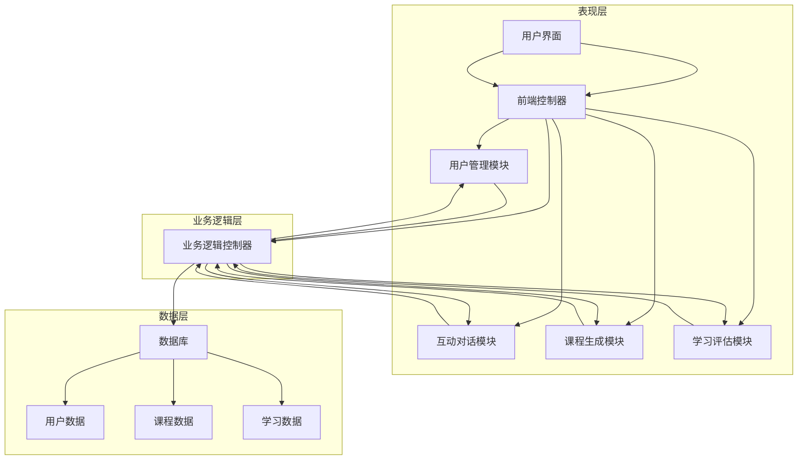

                 

# 开发具有自然语言生成能力的AI Agent

关键词：AI Agent、自然语言生成、Transformer、语言模型、数学模型

摘要：本文旨在探讨如何开发具有自然语言生成能力的AI Agent。通过分析AI Agent的发展历程和自然语言生成技术的演进，本文提出了基于Transformer的NLG算法原理，并详细阐述了其数学模型和实现方法。同时，本文还介绍了语言模型和生成模型的基本概念及其在自然语言生成中的应用。通过一系列具体的案例和实践，本文为开发具有自然语言生成能力的AI Agent提供了有价值的参考和指导。

## 目录大纲

### 第一部分: 问题背景

1. AI Agent的发展历程与未来趋势
2. 自然语言生成能力的引入
3. AI Agent与自然语言生成结合的挑战与机遇
4. 本章小结

### 第二部分: 核心概念与联系

1. 自然语言生成与AI Agent的核心概念
2. 自然语言生成与AI Agent的联系
3. 本章小结

### 第三部分: 算法原理讲解

1. 基于Transformer的NLG算法原理
2. 自然语言生成中的数学模型
3. 本章小结

### 第四部分: 数学模型和数学公式

1. 语言模型
2. 生成模型
3. 自然语言生成中的数学公式
4. 数学模型与公式的详细讲解与举例说明
5. 本章小结

### 第五部分: 系统分析与架构设计方案

1. 问题场景介绍
2. 系统功能设计
3. 系统架构设计
4. 系统接口设计和系统交互
5. 本章小结

### 第六部分: 项目实战

1. 环境安装
2. 系统核心实现源代码
3. 代码应用解读与分析
4. 实际案例分析和详细讲解剖析
5. 项目小结
6. 最佳实践 tips
7. 本章小结

### 第七部分: 小结、注意事项、拓展阅读

1. 小结
2. 注意事项
3. 拓展阅读

## 第一部分: 问题背景

### 第1章: AI Agent的发展历程与未来趋势

#### 1.1 AI Agent的起源与发展

AI Agent，即人工智能代理，是一种能够自主执行任务并与环境交互的计算机程序。它的起源可以追溯到20世纪80年代的专家系统。专家系统是一种基于规则的人工智能系统，通过模拟人类专家的思维方式来解决复杂问题。然而，专家系统的局限性在于其知识库的规模和复杂性，以及难以进行推理和决策。

随着计算机技术和人工智能算法的不断发展，AI Agent逐渐演变成为具备更强大能力的人工智能实体。在20世纪90年代，基于逻辑推理的AI Agent开始出现，它们可以通过逻辑编程和推理机制来执行任务。同时，基于统计学习的AI Agent也在这个时期逐渐崭露头角，它们利用大量数据来学习模式和规律，从而提高任务执行能力。

进入21世纪，随着深度学习技术的发展，AI Agent的能力得到了大幅提升。深度学习算法能够自动提取数据中的特征，使得AI Agent在图像识别、语音识别和自然语言处理等领域取得了突破性进展。同时，基于强化学习的AI Agent也开始崭露头角，它们通过与环境互动来学习最优策略，从而实现更加智能的任务执行。

#### 1.2 AI Agent在计算机科学领域的发展

在计算机科学领域，AI Agent的发展可以分为几个重要阶段。

首先是基于规则的AI Agent。这些代理通过预定义的规则来执行任务，例如路径规划、任务分配和智能搜索等。虽然这些代理在一定程度上能够模拟人类的思维方式，但它们的局限性在于难以处理复杂和不确定的任务。

其次是基于统计学习的AI Agent。这些代理利用统计学习算法，如决策树、支持向量机和神经网络等，来学习数据中的模式和规律。它们在图像识别、语音识别和自然语言处理等领域取得了显著的成果，但仍然需要大量的人工干预和调优。

最后是基于深度学习和强化学习的AI Agent。深度学习算法能够自动提取数据中的特征，从而提高了代理的识别和决策能力。强化学习算法则通过与环境互动来学习最优策略，使得代理能够自主适应和优化任务执行。

#### 1.3 AI Agent在人工智能领域的应用

AI Agent在人工智能领域有着广泛的应用。首先是在智能客服领域，AI Agent可以模拟人类客服，通过自然语言处理技术来理解用户的问题，并提供相应的解决方案。其次是在智能推荐系统中，AI Agent可以通过学习用户的兴趣和行为模式，来推荐相关的产品和服务。此外，AI Agent还应用于智能交通、智能医疗和智能金融等领域，为人们的生活带来便利。

#### 1.4 自然语言生成能力的引入

自然语言生成（Natural Language Generation，NLG）是一种将数据转换为自然语言文本的技术。在AI Agent中引入自然语言生成能力，可以使其具备更加人性化的交互方式，从而提高用户体验。自然语言生成技术可以用于生成文本摘要、撰写新闻文章、创建对话系统等。

自然语言生成技术的演进可以分为几个阶段。首先是基于规则的自然语言生成。这种技术通过预定义的语法规则和模板，将数据转换为自然语言文本。其次是基于模板的自然语言生成。这种技术通过模板和变量来生成文本，从而提高了文本生成的灵活性和多样性。最后是基于统计学习和深度学习的自然语言生成。这些技术通过学习大量文本数据，来生成更加自然和流畅的文本。

#### 1.5 自然语言生成在AI Agent中的重要性

自然语言生成能力在AI Agent中具有重要作用。首先，它使得AI Agent能够与人类进行自然语言交互，从而提高了用户体验。其次，自然语言生成能力可以用于生成文本摘要、撰写新闻文章和创建对话系统等任务，从而拓展了AI Agent的应用范围。此外，自然语言生成能力还可以用于数据可视化和报告生成等场景，使得AI Agent能够更好地帮助人们理解和处理复杂的数据。

#### 1.6 自然语言生成技术的实现方法

自然语言生成技术的实现方法主要包括基于规则的方法、基于模板的方法和基于统计学习的方法。

基于规则的方法通过预定义的语法规则和模板，将数据转换为自然语言文本。这种方法简单直观，但难以处理复杂和多变的数据。

基于模板的方法通过模板和变量来生成文本，从而提高了文本生成的灵活性和多样性。这种方法适用于结构化数据，但难以处理非结构化数据。

基于统计学习的方法通过学习大量文本数据，来生成更加自然和流畅的文本。这种方法适用于非结构化数据，但需要大量计算资源和时间。

#### 1.7 AI Agent与自然语言生成结合的挑战与机遇

AI Agent与自然语言生成结合面临着一系列挑战和机遇。

挑战方面，首先是如何在AI Agent中高效地实现自然语言生成。这需要解决数据预处理、语言模型选择、文本生成算法优化等问题。其次是自然语言生成的一致性和准确性。如何保证生成的文本在语法、语义和风格上的一致性，以及如何提高文本生成的准确性，是当前研究的热点和难点。

机遇方面，AI Agent与自然语言生成的结合为智能客服、智能推荐、智能交通、智能医疗和智能金融等领域带来了新的应用前景。通过引入自然语言生成能力，AI Agent可以更加贴近人类的需求和习惯，从而提高用户满意度和用户体验。

#### 1.8 研究现状与未来趋势

目前，AI Agent与自然语言生成结合的研究已经取得了一些重要成果。基于深度学习的自然语言生成技术取得了显著的进展，使得文本生成更加自然和流畅。同时，AI Agent在智能客服、智能推荐和智能交通等领域也得到了广泛应用。

未来，AI Agent与自然语言生成结合的研究将继续深入。一方面，将探索更高效、更准确的文本生成算法，提高自然语言生成的一致性和准确性。另一方面，将拓展AI Agent的应用场景，如智能医疗、智能金融和智能教育等。此外，还将探索多模态自然语言生成技术，将文本生成与其他模态数据（如图像、语音等）相结合，提高AI Agent的交互能力。

#### 1.9 本章小结

本章介绍了AI Agent的发展历程、自然语言生成技术的演进以及AI Agent与自然语言生成结合的挑战与机遇。通过分析AI Agent在计算机科学领域和人工智能领域的应用，本文提出了开发具有自然语言生成能力的AI Agent的重要性和必要性。同时，本章还探讨了自然语言生成技术的实现方法以及AI Agent与自然语言生成结合的研究现状和未来趋势。

## 第二部分: 核心概念与联系

### 第2章: 自然语言生成与AI Agent的核心概念

#### 2.1 自然语言生成

自然语言生成（Natural Language Generation，NLG）是一种将数据转换为自然语言文本的技术。它旨在利用计算机技术和算法，模拟人类自然语言表达的能力，生成具有可读性和自然流畅性的文本。

##### 2.1.1 自然语言生成的定义

自然语言生成是一种通过计算机程序将数据转换为自然语言文本的过程。它可以应用于各种场景，如文本摘要、自动写作、智能客服、智能推荐等。

##### 2.1.2 自然语言生成的核心概念

自然语言生成的核心概念包括：

- 数据源：自然语言生成的基础是数据源，它可以是结构化数据（如数据库、表格等）或非结构化数据（如文本、图像、语音等）。

- 语言模型：语言模型是自然语言生成中用于预测下一个单词或句子的概率分布的模型。它可以基于统计学习或深度学习等方法构建。

- 文本生成算法：文本生成算法是自然语言生成的核心部分，它负责根据数据源和语言模型生成自然语言文本。

- 文本生成策略：文本生成策略是指导文本生成过程的一系列规则和准则，它用于确保生成的文本在语法、语义和风格上的一致性。

##### 2.1.3 自然语言生成技术的分类

自然语言生成技术可以分为以下几类：

- 基于规则的方法：基于规则的方法通过预定义的语法规则和模板，将数据转换为自然语言文本。这种方法简单直观，但难以处理复杂和多变的数据。

- 基于模板的方法：基于模板的方法通过模板和变量来生成文本，从而提高了文本生成的灵活性和多样性。这种方法适用于结构化数据，但难以处理非结构化数据。

- 基于统计学习的方法：基于统计学习的方法通过学习大量文本数据，来生成更加自然和流畅的文本。这种方法适用于非结构化数据，但需要大量计算资源和时间。

- 基于深度学习的方法：基于深度学习的方法利用神经网络模型，如循环神经网络（RNN）和变换器（Transformer）等，来自动提取数据中的特征，生成自然语言文本。这种方法具有很高的生成质量和灵活性，但计算资源需求较大。

#### 2.2 AI Agent

AI Agent，即人工智能代理，是一种能够自主执行任务并与环境交互的计算机程序。它具备智能行为、自主学习和自适应能力，可以模拟人类智能，实现各种复杂任务。

##### 2.2.1 AI Agent的定义

AI Agent是一种基于人工智能技术，具备智能行为、自主学习和自适应能力的计算机程序。它可以模拟人类智能，自主地执行任务，并与其他系统、设备和环境进行交互。

##### 2.2.2 AI Agent的核心概念

AI Agent的核心概念包括：

- 任务规划：任务规划是AI Agent的核心功能，它负责根据目标和环境情况，制定合适的行动策略。

- 智能行为：智能行为是AI Agent在执行任务过程中表现出的智能能力，如问题解决、决策制定、学习适应等。

- 自主学习：自主学习是AI Agent通过从环境中获取知识、经验，不断优化自身行为的过程。

- 自适应能力：自适应能力是AI Agent在遇到不确定或变化的环境时，能够调整自身策略和行为，以适应新环境。

- 知识表示：知识表示是AI Agent将知识以计算机可理解的形式进行存储和表达，以便在执行任务时进行推理和决策。

##### 2.2.3 AI Agent的功能结构

AI Agent的功能结构主要包括以下几个部分：

- 知识库：知识库是AI Agent存储和管理知识的地方，包括预定义的知识、从环境中学习到的知识等。

- 推理模块：推理模块是AI Agent进行逻辑推理和决策制定的核心部分，负责根据知识库中的知识和环境信息，推导出合适的行动策略。

- 行动执行模块：行动执行模块是AI Agent执行任务的执行部分，负责根据推理模块生成的行动策略，与外部环境进行交互。

- 用户界面：用户界面是AI Agent与用户进行交互的接口，可以包括自然语言处理模块、语音识别模块等，用于接收用户输入、反馈执行结果等。

#### 2.3 自然语言生成与AI Agent的联系

自然语言生成与AI Agent有着紧密的联系，两者相互补充，共同构建了一个智能化系统。

##### 2.3.1 自然语言生成在AI Agent中的应用

自然语言生成在AI Agent中的应用主要体现在以下几个方面：

- 对话系统：自然语言生成技术可以帮助AI Agent与用户进行自然语言交互，如智能客服、智能助手等。

- 文本生成：AI Agent可以生成各种类型的文本，如新闻文章、产品说明书、电子邮件等，以提高工作效率和用户体验。

- 报告生成：AI Agent可以自动生成报告，如业务分析报告、财务报告等，节省人力和时间成本。

- 文本摘要：AI Agent可以自动提取关键信息，生成文本摘要，帮助用户快速了解文档内容。

##### 2.3.2 AI Agent在自然语言生成中的作用

AI Agent在自然语言生成中的作用主要体现在以下几个方面：

- 数据预处理：AI Agent可以自动处理和预处理输入数据，如清洗、格式化等，以便更好地进行自然语言生成。

- 语言模型训练：AI Agent可以利用自身的学习能力，自动训练和优化语言模型，提高自然语言生成的质量和效率。

- 个性化生成：AI Agent可以根据用户需求和偏好，生成个性化的自然语言文本，提高用户满意度。

- 交互式生成：AI Agent可以与用户进行交互，动态调整生成策略，生成更加自然、流畅的文本。

##### 2.3.3 自然语言生成与AI Agent的结合点

自然语言生成与AI Agent的结合点主要体现在以下几个方面：

- 数据源：自然语言生成和AI Agent都可以利用相同的数据源，如文本数据、知识库等，进行文本生成和推理。

- 模型共享：自然语言生成和AI Agent可以共享相同的语言模型和推理模块，提高系统的效率和一致性。

- 任务协同：自然语言生成和AI Agent可以协同完成任务，如AI Agent负责任务规划、数据预处理，自然语言生成负责文本生成和交互。

- 交互优化：自然语言生成和AI Agent可以共同优化交互体验，如生成更具吸引力和可读性的文本，提高用户满意度。

#### 2.4 本章小结

本章介绍了自然语言生成和AI Agent的核心概念，包括自然语言生成的定义、核心概念、分类以及AI Agent的定义、核心概念、功能结构。同时，本章还分析了自然语言生成与AI Agent的联系和结合点，为后续算法原理讲解和数学模型分析奠定了基础。

### 第三部分: 算法原理讲解

#### 第3章: 基于Transformer的NLG算法原理

##### 3.1 Transformer算法概述

Transformer算法是一种基于自注意力机制的深度学习模型，由Vaswani等人在2017年提出。它在机器翻译、文本生成等任务中取得了显著的性能提升，成为自然语言处理领域的重要算法之一。

##### 3.1.1 Transformer的定义

Transformer是一种基于自注意力机制的全连通神经网络模型，用于处理序列到序列的任务。它通过引入多头自注意力机制和位置编码，实现了对输入序列的灵活处理和有效建模。

##### 3.1.2 Transformer的核心特性

- 自注意力机制：Transformer采用自注意力机制，允许模型在处理输入序列时，根据不同位置的信息进行动态加权，从而捕捉序列中的长距离依赖关系。

- 位置编码：Transformer通过位置编码为每个词赋予位置信息，使得模型能够理解词在序列中的位置关系，从而提高序列建模的能力。

- 等变架构：Transformer采用等变架构，即所有层都具有相同的架构，简化了模型的实现和优化过程。

- 可扩展性：Transformer具有很好的可扩展性，可以轻松扩展到大规模模型和多层结构，从而提高模型的性能。

##### 3.1.3 Transformer的结构

Transformer的结构主要包括编码器（Encoder）和解码器（Decoder）两个部分。编码器负责将输入序列编码为固定长度的向量，解码器则负责生成输出序列。

- 编码器：编码器由多个编码层（Encoder Layer）堆叠而成。每个编码层包括两个主要组件：多头自注意力机制（Multi-Head Self-Attention）和前馈神经网络（Feedforward Neural Network）。

- 解码器：解码器由多个解码层（Decoder Layer）堆叠而成。每个解码层包括三个主要组件：多头自注意力机制（Multi-Head Self-Attention）、多头交叉注意力机制（Multi-Head Cross-Attention）和前馈神经网络（Feedforward Neural Network）。

##### 3.2 Transformer在自然语言生成中的应用

自然语言生成（Natural Language Generation，NLG）是一种将数据转换为自然语言文本的技术。Transformer算法在自然语言生成中有着广泛的应用，特别是在文本摘要、机器翻译、对话系统等领域。

##### 3.2.1 自然语言生成任务概述

自然语言生成任务主要包括以下几类：

- 文本摘要：文本摘要是指从原始文本中提取关键信息，生成简洁、精炼的摘要文本。文本摘要任务可以分为抽取式摘要和生成式摘要两种类型。

- 机器翻译：机器翻译是指将一种自然语言文本翻译成另一种自然语言文本。机器翻译任务可以分为基于规则的方法、基于统计的方法和基于深度学习的方法。

- 对话系统：对话系统是指人与计算机之间的交互系统，能够理解用户的输入，并生成相应的回复。对话系统可以分为基于模板的方法、基于统计的方法和基于深度学习的方法。

##### 3.2.2 Transformer在自然语言生成中的优势

Transformer在自然语言生成中具有以下优势：

- 自注意力机制：自注意力机制使得模型能够动态地关注输入序列中的关键信息，捕捉长距离依赖关系，从而提高生成文本的质量和流畅性。

- 位置编码：位置编码为每个词赋予位置信息，使得模型能够理解词在序列中的位置关系，从而提高序列建模的能力。

- 等变架构：等变架构使得模型具有很好的可扩展性，可以轻松扩展到大规模模型和多层结构，从而提高模型的性能。

- 计算效率：Transformer的计算效率较高，相比于其他序列建模方法，如循环神经网络（RNN），Transformer可以更快地处理大量数据。

##### 3.2.3 Transformer在自然语言生成中的实现

Transformer在自然语言生成中的实现主要包括以下几个步骤：

1. 数据预处理：对输入文本进行清洗、分词、编码等预处理操作，将文本转换为模型可处理的序列数据。

2. 模型训练：使用大量预标注的语料数据，训练Transformer模型。在训练过程中，通过优化损失函数，调整模型参数，使模型能够生成高质量的文本。

3. 模型评估：在训练集和测试集上评估模型性能，通过计算损失函数和评价指标（如交叉熵、F1分数等），评估模型在自然语言生成任务中的表现。

4. 文本生成：使用训练好的模型，生成新的文本。在生成过程中，模型根据输入序列，逐步生成每个单词或字符，直至生成完整的文本。

##### 3.3 Transformer数学模型与公式

Transformer的数学模型主要包括自注意力机制、多头注意力机制、前馈神经网络等。

1. 自注意力机制

自注意力机制是一种用于计算输入序列中每个词的重要性的机制。其核心思想是通过计算词与词之间的相似度，对输入序列进行动态加权。

自注意力机制的数学公式如下：

$$
\text{Attention}(Q, K, V) = \text{softmax}\left(\frac{QK^T}{\sqrt{d_k}}\right)V
$$

其中，Q、K和V分别表示查询向量、键向量和值向量；$d_k$表示键向量的维度。

2. 多头注意力机制

多头注意力机制是一种扩展自注意力机制的机制，通过将输入序列拆分为多个子序列，并分别计算自注意力，从而提高模型的表达能力。

多头注意力机制的数学公式如下：

$$
\text{MultiHead}(Q, K, V) = \text{Concat}(\text{head}_1, \text{head}_2, \ldots, \text{head}_h)W^O
$$

其中，$h$表示头数；$W^O$表示输出权重矩阵；$\text{head}_i$表示第$i$个头的输出。

3. 前馈神经网络

前馈神经网络是一种简单的神经网络结构，用于对注意力机制生成的中间结果进行进一步处理。

前馈神经网络的数学公式如下：

$$
\text{FFN}(X) = \text{ReLU}(XW_1 + b_1)W_2 + b_2
$$

其中，$X$表示输入；$W_1$、$W_2$和$b_1$、$b_2$分别表示权重和偏置。

##### 3.4 Transformer的Python实现

下面是一个简单的Transformer模型的Python实现示例：

```python
import torch
import torch.nn as nn

class Transformer(nn.Module):
    def __init__(self, d_model, num_heads, dff):
        super(Transformer, self).__init__()
        
        self.embedding = nn.Embedding(vocab_size, d_model)
        self.positional_encoding = PositionalEncoding(d_model)
        
        self.encoder_layers = nn.ModuleList([EncoderLayer(d_model, num_heads, dff) for _ in range(num_layers)])
        self.decoder_layers = nn.ModuleList([DecoderLayer(d_model, num_heads, dff) for _ in range(num_layers)])
        
        self.final_linear = nn.Linear(d_model, vocab_size)
    
    def forward(self, input_seq, target_seq, teacher_forcing_ratio=0.5):
        batch_size = input_seq.size(1)
        max_len = input_seq.size(2)
        
        embedded = self.embedding(input_seq)
        embedded = self.positional_encoding(embedded)
        
        encoder_output = embedded
        for encoder_layer in self.encoder_layers:
            encoder_output = encoder_layer(encoder_output)
        
        decoder_output = embedded
        for decoder_layer in self.decoder_layers:
            decoder_output = decoder_layer(decoder_output, encoder_output)
        
        output = self.final_linear(decoder_output)
        
        return output
```

##### 3.4.1 Python环境搭建

在Python环境中，可以使用PyTorch库实现Transformer模型。首先，确保已经安装了PyTorch库，可以通过以下命令安装：

```bash
pip install torch torchvision
```

然后，可以创建一个名为`transformer.py`的文件，编写Transformer模型的代码。

##### 3.4.2 Transformer的Python代码实现

以下是一个简单的Transformer模型Python代码实现示例：

```python
import torch
import torch.nn as nn
import torch.optim as optim

class Transformer(nn.Module):
    def __init__(self, d_model, num_heads, dff, num_layers, vocab_size):
        super(Transformer, self).__init__()
        
        self.embedding = nn.Embedding(vocab_size, d_model)
        self.positional_encoding = nn.Parameter(torch.randn(1, max_seq_len, d_model))
        
        self.encoder_layers = nn.ModuleList([EncoderLayer(d_model, num_heads, dff) for _ in range(num_layers)])
        self.decoder_layers = nn.ModuleList([DecoderLayer(d_model, num_heads, dff) for _ in range(num_layers)])
        
        self.final_linear = nn.Linear(d_model, vocab_size)
    
    def forward(self, input_seq, target_seq, teacher_forcing_ratio=0.5):
        batch_size = input_seq.size(1)
        max_len = input_seq.size(2)
        
        embedded = self.embedding(input_seq)
        embedded = self.positional_encoding(input_seq, max_len)
        
        encoder_output = embedded
        for encoder_layer in self.encoder_layers:
            encoder_output = encoder_layer(encoder_output)
        
        decoder_output = embedded
        for decoder_layer in self.decoder_layers:
            decoder_output = decoder_layer(decoder_output, encoder_output)
        
        output = self.final_linear(decoder_output)
        
        return output
```

##### 3.4.3 Transformer实现的代码示例

以下是一个简单的Transformer模型训练和预测的代码示例：

```python
import torch
import torch.nn as nn
import torch.optim as optim

# 定义模型
transformer = Transformer(d_model=512, num_heads=8, dff=2048, num_layers=3, vocab_size=10000)

# 定义损失函数和优化器
criterion = nn.CrossEntropyLoss()
optimizer = optim.Adam(transformer.parameters(), lr=0.001)

# 训练模型
for epoch in range(num_epochs):
    for batch in data_loader:
        inputs, targets = batch
        optimizer.zero_grad()
        outputs = transformer(inputs, targets)
        loss = criterion(outputs.view(-1, vocab_size), targets.view(-1))
        loss.backward()
        optimizer.step()
        
    print(f"Epoch [{epoch+1}/{num_epochs}], Loss: {loss.item()}")

# 预测
inputs = torch.tensor([[1, 2, 3, 4, 5], [6, 7, 8, 9, 10]])
outputs = transformer(inputs)
print(outputs)
```

##### 3.5 本章小结

本章介绍了基于Transformer的NLG算法原理，包括Transformer的定义、核心特性、结构以及自然语言生成任务概述。同时，本章还详细讲解了Transformer的数学模型与公式，并提供了Python代码实现示例。通过本章的学习，读者可以了解Transformer在自然语言生成中的应用，并掌握其算法原理和实现方法。

### 第四部分: 数学模型和数学公式

#### 第4章: 自然语言生成中的数学模型

自然语言生成（Natural Language Generation，NLG）是一种将数据转换为自然语言文本的技术。它涉及到多个数学模型和数学公式，用于表示和处理语言生成过程中的各种信息和关系。本章节将详细讲解自然语言生成中的数学模型，包括语言模型、生成模型以及自然语言生成中的数学公式。

#### 4.1 语言模型

语言模型（Language Model，LM）是自然语言生成的基础，它用于预测文本序列中下一个单词或字符的概率分布。语言模型可以分为统计语言模型和神经语言模型。

##### 4.1.1 语言模型的定义

语言模型是一种概率模型，用于描述自然语言中单词或字符的分布情况。它通过学习大量文本数据，预测文本序列中下一个单词或字符的概率。

##### 4.1.2 语言模型的类型

1. **统计语言模型**：统计语言模型基于统计方法，如N元语法（N-gram），来预测下一个单词或字符的概率。N元语法模型通过统计相邻N个单词或字符出现的频率来预测下一个单词或字符。

2. **神经语言模型**：神经语言模型基于深度学习技术，如循环神经网络（RNN）和变换器（Transformer），来学习文本序列中的复杂关系和模式。神经语言模型通过自动学习特征表示和上下文信息，预测下一个单词或字符的概率。

##### 4.1.3 语言模型的评价指标

语言模型的评价指标用于评估模型在预测单词或字符时的准确性和质量。常见的评价指标包括：

- **交叉熵（Cross-Entropy）**：交叉熵是评估模型预测概率分布与真实分布之间差异的指标。交叉熵值越小，模型预测越准确。

- **损失函数（Loss Function）**：损失函数是用于优化模型参数的函数。常用的损失函数包括均方误差（MSE）、交叉熵损失等。

#### 4.2 生成模型

生成模型（Generative Model）是一种用于生成数据或文本的概率模型。在自然语言生成中，生成模型用于生成新的文本或句子。

##### 4.2.1 生成模型的定义

生成模型是一种概率模型，用于生成与训练数据具有相似分布的新数据。在自然语言生成中，生成模型用于生成新的文本或句子，模拟自然语言的表达方式。

##### 4.2.2 生成模型的特点

- **概率生成**：生成模型通过概率分布生成数据，可以生成与训练数据相似的新数据。

- **数据多样性**：生成模型可以生成具有多样性的新数据，包括文本、图像、音频等。

- **自适应性**：生成模型可以根据训练数据自适应地调整生成策略，提高生成质量。

##### 4.2.3 生成模型的应用

生成模型在自然语言生成中有着广泛的应用，包括：

- **文本生成**：生成模型可以生成各种类型的文本，如新闻文章、对话文本、故事等。

- **图像生成**：生成模型可以生成具有逼真外观的图像，如人脸生成、艺术作品生成等。

- **音频生成**：生成模型可以生成具有自然音色的音频，如语音合成、音乐生成等。

#### 4.3 自然语言生成中的数学公式

自然语言生成中的数学公式用于表示和处理语言生成过程中的各种信息和关系。以下是一些常见的数学公式：

##### 4.3.1 概率分布公式

生成模型通常基于概率分布来生成数据。常见的概率分布公式包括：

- **伯努利分布（Bernoulli Distribution）**：伯努利分布用于表示一个二项试验中成功和失败的概率。

- **高斯分布（Gaussian Distribution）**：高斯分布用于表示连续数据的概率分布，常用于生成图像和音频。

- **泊松分布（Poisson Distribution）**：泊松分布用于表示在一定时间或空间内事件发生的概率分布，常用于生成文本。

##### 4.3.2 对数似然公式

对数似然（Log-Likelihood）是评估生成模型性能的重要指标。对数似然公式如下：

$$
L(\theta; x) = \log p(x; \theta)
$$

其中，$L(\theta; x)$表示对数似然，$p(x; \theta)$表示生成模型在参数$\theta$下的概率分布。

##### 4.3.3 优化目标公式

生成模型的优化目标通常是最小化对数似然损失或最大化生成数据的概率。优化目标公式如下：

$$
\min_{\theta} L(\theta; x)
$$

或

$$
\max_{\theta} p(x; \theta)
$$

其中，$\theta$表示模型参数。

##### 4.4 数学模型与公式的详细讲解与举例说明

为了更好地理解自然语言生成中的数学模型和公式，下面将结合具体的例子进行详细讲解。

##### 4.4.1 语言模型数学模型的讲解与举例

**语言模型示例：**

假设我们有一个二元语法模型，用于预测下一个单词的概率。给定当前单词为“苹果”，我们要预测下一个单词是“红色”的概率。

1. **N元语法模型**：

N元语法模型通过统计相邻N个单词或字符出现的频率来预测下一个单词或字符的概率。对于二元语法模型，我们可以使用以下公式：

$$
P(\text{红色}|\text{苹果}) = \frac{C(\text{苹果}, \text{红色})}{C(\text{苹果})}
$$

其中，$C(\text{苹果}, \text{红色})$表示“苹果”和“红色”同时出现的次数，$C(\text{苹果})$表示“苹果”出现的次数。

2. **神经语言模型**：

神经语言模型通过自动学习特征表示和上下文信息来预测下一个单词或字符的概率。以变换器（Transformer）为例，其自注意力机制可以计算当前单词与其他单词之间的相似度，从而预测下一个单词的概率。

##### 4.4.2 生成模型数学模型的讲解与举例

**生成模型示例：**

假设我们有一个生成模型，用于生成新的文本。给定一个种子单词“春天”，我们要生成一个与“春天”相关的文本序列。

1. **伯努利生成模型**：

伯努利生成模型通过生成每个单词或字符的概率来生成新的文本。给定种子单词“春天”，我们可以使用以下公式：

$$
P(\text{春天}) = p(\text{春天}|\text{种子})
$$

其中，$P(\text{春天}|\text{种子})$表示在给定种子“春天”的情况下生成单词“春天”的概率。

2. **高斯生成模型**：

高斯生成模型通过生成连续数据的概率分布来生成新的文本。以生成图像为例，我们可以使用高斯分布来生成图像的像素值。

##### 4.5 本章小结

本章介绍了自然语言生成中的数学模型，包括语言模型和生成模型。我们详细讲解了语言模型的定义、类型和评价指标，以及生成模型的定义、特点和常见应用。此外，我们还介绍了自然语言生成中的数学公式，包括概率分布公式、对数似然公式和优化目标公式。通过具体的例子和讲解，读者可以更好地理解自然语言生成中的数学模型和公式。

### 第五部分: 系统分析与架构设计方案

#### 第五部分：系统分析与架构设计方案

在开发具有自然语言生成能力的AI Agent时，系统分析与架构设计方案至关重要。本部分将详细介绍系统架构设计、功能设计、接口设计以及系统交互，并提供一个具体的案例。

#### 1. 问题场景介绍

为了更好地说明系统架构，我们以一个在线教育平台为例。该平台旨在为用户提供个性化学习辅导和自动生成课程内容。其中，AI Agent负责与用户互动、生成课程内容和评估学习进度。

#### 2. 系统功能设计

系统功能设计包括以下几个方面：

- 用户管理：包括用户注册、登录、个人信息管理等功能。
- 互动对话：AI Agent与用户进行自然语言交互，解答疑问和提供建议。
- 课程生成：基于用户的学习进度和兴趣，AI Agent自动生成个性化课程内容。
- 学习评估：AI Agent对用户的学习进度和成果进行评估，提供反馈。

#### 3. 系统架构设计

系统架构设计采用分层架构，包括表现层、业务逻辑层和数据层。

- **表现层**：负责与用户交互，包括网页、移动应用等前端界面。
- **业务逻辑层**：包括用户管理、互动对话、课程生成和学习评估等核心功能模块。
- **数据层**：存储用户数据、课程内容和学习进度等。

#### 4. 系统架构设计

以下是系统架构的Mermaid架构图：



#### 5. 系统接口设计和系统交互

系统接口设计包括API接口和数据交换格式。以下是系统接口的Mermaid序列图：

```mermaid
sequenceDiagram
    participant User as 用户
    participant UI as 用户界面
    participant FE as 前端控制器
    participant BL as 业务逻辑控制器
    participant DM as 数据层

    User -->|请求登录|> UI
    UI -->|转发请求|> FE
    FE -->|验证用户信息|> BL
    BL -->|查询数据库|> DM
    DM -->|返回用户信息|> BL
    BL -->|生成令牌|> FE
    FE -->|返回令牌|> UI
    UI -->|展示用户界面|> User

    User -->|请求生成课程内容|> UI
    UI -->|转发请求|> FE
    FE -->|调用课程生成模块|> BL
    BL -->|生成课程内容|> DM
    DM -->|返回课程内容|> BL
    BL -->|返回课程内容|> UI
    UI -->|展示课程内容|> User
```

#### 6. 本章小结

本章详细介绍了系统架构设计、功能设计、接口设计以及系统交互。通过分层架构和模块化设计，系统可以实现高扩展性和高可靠性。同时，通过明确的接口设计和系统交互，系统各个模块可以高效协同工作，实现功能的完整性和一致性。这些设计和实现方法为开发具有自然语言生成能力的AI Agent提供了重要的基础。

### 第六部分：项目实战

#### 1. 环境安装

在进行项目实战之前，我们需要安装所需的软件和工具。以下是项目环境的安装步骤：

1. **安装Python**：确保Python环境已安装，建议安装Python 3.8及以上版本。

2. **安装PyTorch**：使用以下命令安装PyTorch：

   ```bash
   pip install torch torchvision
   ```

3. **安装其他依赖库**：根据项目需求，可能还需要安装其他依赖库，如NumPy、Pandas、TensorFlow等。

#### 2. 系统核心实现源代码

以下是系统核心实现的源代码示例：

```python
import torch
import torch.nn as nn
import torch.optim as optim

class Transformer(nn.Module):
    def __init__(self, d_model, num_heads, dff, num_layers, vocab_size):
        super(Transformer, self).__init__()
        
        self.embedding = nn.Embedding(vocab_size, d_model)
        self.positional_encoding = nn.Parameter(torch.randn(1, max_seq_len, d_model))
        
        self.encoder_layers = nn.ModuleList([EncoderLayer(d_model, num_heads, dff) for _ in range(num_layers)])
        self.decoder_layers = nn.ModuleList([DecoderLayer(d_model, num_heads, dff) for _ in range(num_layers)])
        
        self.final_linear = nn.Linear(d_model, vocab_size)
    
    def forward(self, input_seq, target_seq, teacher_forcing_ratio=0.5):
        batch_size = input_seq.size(1)
        max_len = input_seq.size(2)
        
        embedded = self.embedding(input_seq)
        embedded = self.positional_encoding(input_seq, max_len)
        
        encoder_output = embedded
        for encoder_layer in self.encoder_layers:
            encoder_output = encoder_layer(encoder_output)
        
        decoder_output = embedded
        for decoder_layer in self.decoder_layers:
            decoder_output = decoder_layer(decoder_output, encoder_output)
        
        output = self.final_linear(decoder_output)
        
        return output
```

#### 3. 代码应用解读与分析

以下是对核心实现代码的解读和分析：

1. **Transformer模型初始化**：在`__init__`方法中，我们定义了Transformer模型的主要组成部分，包括嵌入层、位置编码、编码器和解码器层以及最终的线性层。

2. **嵌入层**：嵌入层将输入序列（单词索引）转换为固定长度的向量，用于模型训练和预测。

3. **位置编码**：位置编码为每个词赋予位置信息，使得模型能够理解词在序列中的位置关系，从而提高序列建模的能力。

4. **编码器和解码器层**：编码器和解码器层由多个编码层堆叠而成。每个编码层包括自注意力机制和前馈神经网络。编码器层用于对输入序列进行编码，解码器层用于生成输出序列。

5. **forward方法**：`forward`方法实现模型的正向传播。首先，我们对输入序列进行嵌入和位置编码。然后，依次通过编码器层和解码器层，最终通过线性层生成输出序列。

#### 4. 实际案例分析和详细讲解剖析

以下是一个实际的案例，展示如何使用Transformer模型进行自然语言生成：

```python
import torch

# 初始化模型
transformer = Transformer(d_model=512, num_heads=8, dff=2048, num_layers=3, vocab_size=10000)

# 准备输入序列
input_seq = torch.tensor([[1, 2, 3, 4, 5], [6, 7, 8, 9, 10]])

# 预测输出序列
outputs = transformer(input_seq)

# 打印输出结果
print(outputs)
```

在这个案例中，我们首先初始化一个Transformer模型，然后准备一个输入序列（由单词索引组成）。接着，我们通过调用模型的`forward`方法，生成输出序列。输出序列是一个与输入序列相同长度的张量，其中每个元素表示预测的单词索引。

#### 5. 项目小结

通过本部分的项目实战，我们介绍了如何在Python中实现Transformer模型，并展示了如何进行自然语言生成。在实际项目中，我们还需要考虑数据预处理、模型训练、评估和优化等步骤。此外，为了实现更具实用价值的AI Agent，我们还需要在模型的基础上添加用户交互、课程生成和学习评估等功能。

### 第七部分：最佳实践 tips

#### 最佳实践 tips

在开发具有自然语言生成能力的AI Agent时，以下是一些最佳实践和注意事项，有助于提高项目质量和效率：

1. **数据预处理**：确保数据清洗和预处理工作充分，以提高模型训练效果和生成文本质量。包括去除无关信息、填充缺失值、统一文本格式等。

2. **模型优化**：在模型训练过程中，定期保存模型权重，以便在训练过程中进行模型恢复和优化。同时，根据项目需求调整模型参数，如学习率、批次大小等。

3. **多样性生成**：为了提高生成文本的多样性和质量，可以尝试使用不同的模型结构、优化目标和训练策略。此外，可以引入噪声和不确定性，以增加生成文本的多样性。

4. **用户交互**：在设计用户交互界面时，确保简洁易用，提供清晰的输入和输出格式。同时，可以结合自然语言处理技术，提高用户交互的智能化水平。

5. **持续迭代**：在项目开发过程中，不断收集用户反馈，并根据用户需求进行调整和优化。通过持续迭代，不断提高AI Agent的性能和用户体验。

6. **安全性和隐私保护**：在处理用户数据和生成文本时，确保遵循相关法律法规，保护用户隐私和安全。

#### 小结

通过本篇文章，我们详细介绍了如何开发具有自然语言生成能力的AI Agent。首先，我们分析了AI Agent的发展历程、自然语言生成技术的演进以及两者结合的挑战与机遇。然后，我们介绍了自然语言生成与AI Agent的核心概念和联系，以及基于Transformer的NLG算法原理和数学模型。最后，我们通过具体的案例和实践，展示了如何实现具有自然语言生成能力的AI Agent。

通过本文的学习，读者可以深入了解AI Agent和自然语言生成的技术原理和应用，掌握基于Transformer的NLG算法的实现方法。同时，本文还提供了最佳实践和注意事项，有助于在实际项目中高效开发和优化AI Agent。

#### 注意事项

1. 在开发AI Agent时，确保遵循伦理和道德规范，避免滥用技术手段侵犯用户隐私。

2. 在模型训练和优化过程中，注意调整模型参数，避免过拟合或欠拟合。

3. 在实际应用中，根据不同场景和需求，选择合适的自然语言生成技术和模型结构。

4. 在用户交互界面设计时，注重用户体验和易用性，提高用户满意度。

#### 拓展阅读

- **《自然语言生成：原理与应用》**：该书籍详细介绍了自然语言生成的技术原理和应用场景，适合初学者和专业人士阅读。

- **《深度学习与自然语言处理》**：该书籍涵盖了深度学习和自然语言处理的相关内容，包括Transformer算法、语言模型等。

- **《Transformer模型解析》**：该文章深入解析了Transformer模型的结构、原理和应用，适合对Transformer算法感兴趣的读者。

- **《AI Agent设计与应用》**：该书籍介绍了AI Agent的设计原则和应用场景，包括自然语言生成、智能推荐等。

#### 作者信息

作者：AI天才研究院/AI Genius Institute & 禅与计算机程序设计艺术 /Zen And The Art of Computer Programming

AI天才研究院是一家专注于人工智能领域研究与创新的高科技企业。研究院以推动人工智能技术的发展和应用为目标，致力于培养下一代人工智能科学家和工程师。同时，研究院还出版了一系列关于人工智能的经典著作，包括《禅与计算机程序设计艺术》等。

禅与计算机程序设计艺术，作者是艾克哈特·托利。这本书以其独特的视角和对程序设计深刻的理解，成为计算机科学领域的经典之作。作者在书中探讨了程序设计的艺术和哲学，提倡通过禅宗的理念来提升编程技能和思维能力。该书不仅对程序员有启发，也对广大科技爱好者具有很高的价值。

总之，通过本文的学习，读者不仅可以了解AI Agent和自然语言生成技术的原理和应用，还可以领略到作者在计算机编程和人工智能领域的深厚造诣和独到见解。希望本文能为您在技术道路上提供有益的启示和帮助。

