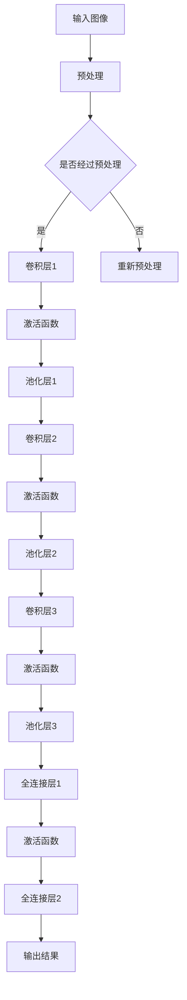
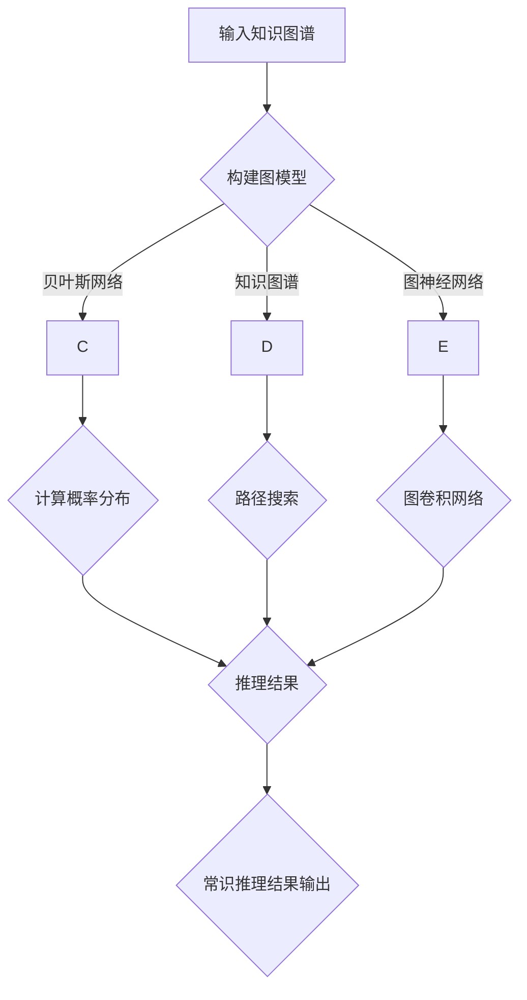
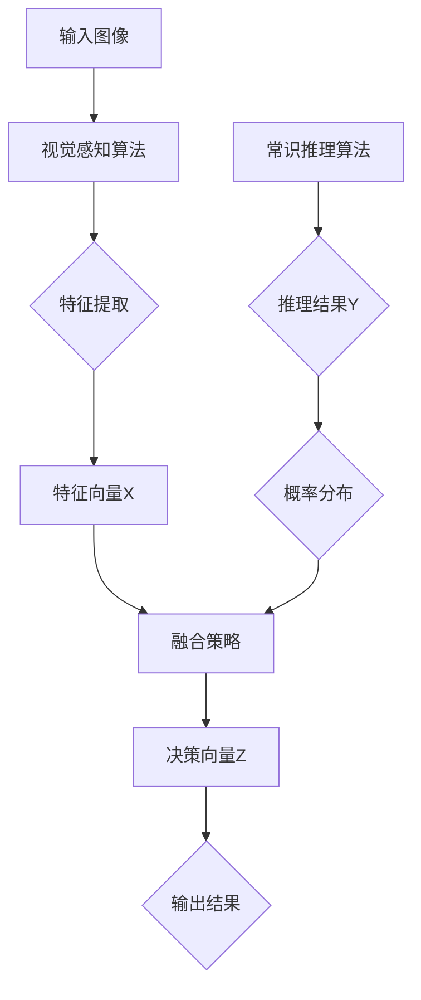
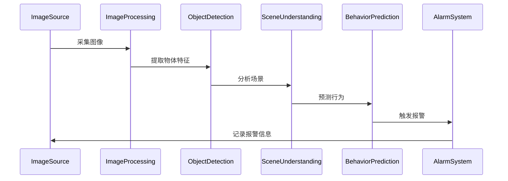
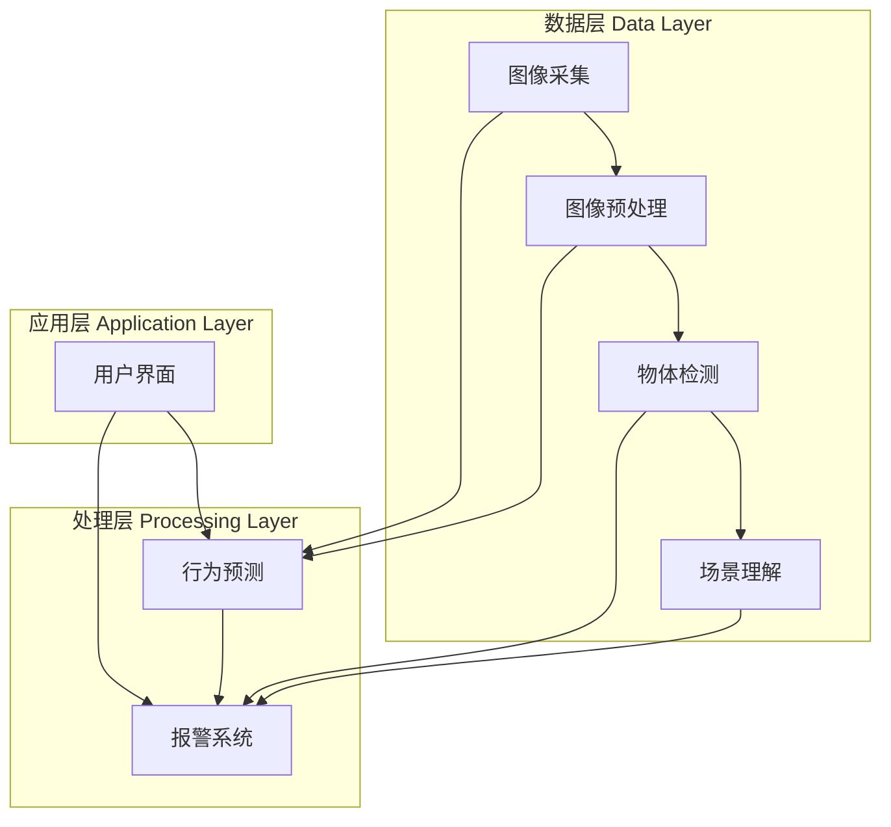
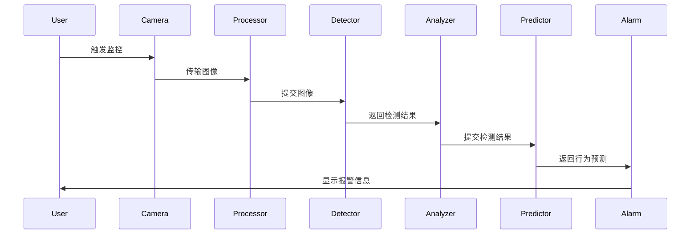

                 

### 引言

随着人工智能技术的飞速发展，AI Agent作为智能系统的重要组成部分，正逐步深入到我们的日常生活中。一个具备高度智能的AI Agent，不仅能够执行预设的任务，还能够在复杂、动态的环境中自主决策和推理。而在众多提升AI Agent智能能力的因素中，视觉常识推理能力显得尤为重要。本文将围绕“开发具有视觉常识推理能力的AI Agent”这一主题，深入探讨其在人工智能领域中的背景、核心概念、算法原理、系统分析与架构设计，以及实际项目实战等多个方面。

首先，让我们明确什么是视觉常识推理。视觉常识推理是指人工智能系统通过对视觉信息的理解，推导出关于现实世界的常识性知识。这一能力对于AI Agent在现实世界中的应用至关重要。例如，一个具备视觉常识推理的AI Agent，能够识别图像中的物体，理解物体之间的相互关系，甚至预测物体可能的行为。

接下来，本文将首先介绍视觉常识推理在AI Agent中的重要性，探讨其定义、应用领域及其对AI Agent的深远影响。随后，我们将深入探讨视觉感知、常识推理和AI Agent的核心概念，并通过对比表格和ER实体关系图，详细解析它们之间的联系。

在理解了核心概念后，我们将进一步探讨如何开发具有视觉常识推理能力的AI Agent。这包括数据收集与预处理、模型选择与训练、模型评估与优化以及应用场景部署等关键步骤。在此基础上，我们将详细介绍视觉感知和常识推理的算法原理，并使用Python源代码和Mermaid流程图进行说明，帮助读者更好地理解这些算法的实现过程。

随后，我们将探讨如何整合视觉感知和常识推理算法，构建一个完整的AI Agent。在这个过程中，我们将介绍系统分析与架构设计的方法，包括问题场景介绍、系统功能设计、系统架构设计、系统接口设计和系统交互。

最后，我们将通过一个实际项目实战，详细讲解环境安装、系统核心实现源代码、代码应用解读与分析、实际案例分析与详细讲解剖析以及项目小结，帮助读者将理论知识应用于实际项目中，提升开发具有视觉常识推理能力的AI Agent的能力。

通过本文的阅读，读者将能够全面了解视觉常识推理在AI Agent开发中的应用，掌握相关算法原理，学会如何进行系统分析与架构设计，并具备实际项目实战的能力。让我们一步一步深入思考，共同探索开发具有视觉常识推理能力的AI Agent的奥秘。

### 关键词

- **视觉常识推理**、**AI Agent**、**数据预处理**、**深度学习模型**、**系统架构设计**、**算法实现**、**实际应用场景**。

### 摘要

本文旨在深入探讨开发具有视觉常识推理能力的AI Agent的背景、核心概念、算法原理、系统分析与架构设计，以及实际项目实战。通过详细分析视觉常识推理的定义、应用领域及其重要性，本文阐述了如何通过数据收集与预处理、模型选择与训练、模型评估与优化等步骤，开发一个具备视觉常识推理能力的AI Agent。同时，本文通过视觉感知和常识推理算法的详细讲解，结合Mermaid流程图和Python源代码，帮助读者更好地理解算法的实现过程。最后，通过一个实际项目实战，本文展示了如何将理论知识应用于实际项目中，提升AI Agent的视觉常识推理能力。本文将为从事人工智能领域的开发者提供宝贵的指导和建议。

### 目录大纲

```markdown
# 《开发具有视觉常识推理能力的AI Agent》

## 第一部分：背景与概述

### 第1章：问题背景与概述

#### 1.1 人工智能与视觉常识推理

- 问题背景
- 问题描述
- 问题解决
- 边界与外延

#### 1.2 视觉常识推理的重要性

- 视觉常识推理的定义
- 视觉常识推理的应用领域
- 视觉常识推理对AI Agent的意义

#### 1.3 本书结构

- 书籍整体结构
- 各章节主要内容

## 第二部分：核心概念与联系

### 第2章：核心概念原理

#### 2.1 视觉感知

- 视觉感知的定义
- 视觉感知的属性特征对比表格
- 视觉感知的ER实体关系图

#### 2.2 常识推理

- 常识推理的定义
- 常识推理的属性特征对比表格
- 常识推理的ER实体关系图

#### 2.3 AI Agent

- AI Agent的定义
- AI Agent的属性特征对比表格
- AI Agent的ER实体关系图

### 第3章：视觉常识推理在AI Agent中的应用

#### 3.1 视觉常识推理在AI Agent中的作用

- 视觉常识推理的功能
- 视觉常识推理的优势
- 视觉常识推理的挑战

#### 3.2 开发具有视觉常识推理能力的AI Agent的步骤

- 数据收集与预处理
- 模型选择与训练
- 模型评估与优化
- 应用场景部署

## 第三部分：算法原理讲解

### 第4章：视觉感知算法原理

#### 4.1 视觉感知算法的数学模型

- 视觉感知的数学公式
- 视觉感知的Python源代码实现

#### 4.2 视觉感知算法的流程图

- 视觉感知的Mermaid流程图

### 第5章：常识推理算法原理

#### 5.1 常识推理算法的数学模型

- 常识推理的数学公式
- 常识推理的Python源代码实现

#### 5.2 常识推理算法的流程图

- 常识推理的Mermaid流程图

### 第6章：整合算法构建AI Agent

#### 6.1 整合算法的数学模型

- 整合算法的数学公式
- 整合算法的Python源代码实现

#### 6.2 整合算法的流程图

- 整合算法的Mermaid流程图

## 第四部分：系统分析与架构设计

### 第7章：问题场景介绍

- 问题场景描述

### 第8章：系统功能设计

#### 8.1 领域模型

- 领域模型的Mermaid类图

#### 8.2 系统架构设计

- 系统架构设计的Mermaid架构图

### 第9章：系统接口设计

- 系统接口设计

### 第10章：系统交互

- 系统交互的Mermaid序列图

## 第五部分：项目实战

### 第11章：环境安装

- 环境安装步骤

### 第12章：系统核心实现源代码

- 系统核心实现源代码

### 第13章：代码应用解读与分析

- 代码应用解读与分析

### 第14章：实际案例分析与详细讲解剖析

- 实际案例分析与详细讲解剖析

### 第15章：项目小结

- 项目小结

## 附录

### 附录A：最佳实践Tips

- 最佳实践Tips

### 附录B：注意事项

- 注意事项

### 附录C：拓展阅读

- 拓展阅读
```

### 解析

这个目录大纲详细地规划了《开发具有视觉常识推理能力的AI Agent》的文章结构，从问题背景与概述开始，逐步深入到核心概念与联系，再到算法原理讲解，最后进行系统分析与架构设计，并通过项目实战进行实际应用。以下是每个部分的具体解析：

**第一部分：背景与概述**
- **第1章：问题背景与概述**：介绍人工智能与视觉常识推理的关系，定义视觉常识推理，探讨其在AI Agent中的重要性，并给出书籍的整体结构。

**第二部分：核心概念与联系**
- **第2章：核心概念原理**：详细解释视觉感知、常识推理和AI Agent的概念，通过属性特征对比表格和ER实体关系图，帮助读者理解这些概念之间的关系。

**第三部分：算法原理讲解**
- **第4章：视觉感知算法原理**和**第5章：常识推理算法原理**：分别讲解视觉感知和常识推理的算法原理，包括数学模型、Python源代码实现和Mermaid流程图。
- **第6章：整合算法构建AI Agent**：介绍如何整合视觉感知和常识推理算法，构建一个具备视觉常识推理能力的AI Agent。

**第四部分：系统分析与架构设计**
- **第7章：问题场景介绍**：描述问题场景，为系统设计提供背景。
- **第8章：系统功能设计**、**第9章：系统接口设计**和**第10章：系统交互**：分别介绍系统功能、接口设计和系统交互，通过Mermaid类图、架构图和序列图，帮助读者理解系统架构。

**第五部分：项目实战**
- **第11章：环境安装**、**第12章：系统核心实现源代码**、**第13章：代码应用解读与分析**、**第14章：实际案例分析与详细讲解剖析**和**第15章：项目小结**：通过实际项目，展示如何安装环境、实现系统核心代码、解读代码应用、分析案例和进行项目总结。

**附录**
- **附录A：最佳实践Tips**、**附录B：注意事项**和**附录C：拓展阅读**：提供最佳实践、注意事项和进一步阅读的建议。

整体来看，这个目录大纲结构合理，内容详实，能够帮助读者系统地掌握开发具有视觉常识推理能力的AI Agent所需的知识和技能。

### 第一部分：背景与概述

#### 1.1 人工智能与视觉常识推理

人工智能（Artificial Intelligence，AI）作为一种模拟、延伸和扩展人类智能的技术，近年来取得了显著的进展。从最初的规则系统，到基于统计学习的机器学习模型，再到如今深度学习的广泛应用，AI已经在各个领域展现出了其强大的能力。然而，尽管AI技术在语音识别、自然语言处理、推荐系统等方面取得了突破性进展，但视觉领域，尤其是视觉常识推理，仍然是一个极具挑战性的问题。

**问题背景**

视觉常识推理是指AI系统能够理解视觉信息中的常识性知识，例如物体识别、场景理解、动作预测等。这些常识性知识对于人类来说是自然而然且直观的，但对于机器而言，却是需要通过大量的数据学习和复杂的算法推理才能实现的。

在现实世界中，视觉常识推理的应用场景广泛，如自动驾驶中的障碍物识别、智能家居中的行为识别、医疗影像分析中的病变检测等。这些应用不仅需要AI系统能够准确地识别和理解视觉信息，还需要系统能够在复杂、动态的环境中做出合理的决策。

**问题描述**

目前，视觉常识推理面临的主要问题有以下几点：

1. **数据不足**：视觉数据量巨大，但标注数据稀缺，尤其是高质标注数据。这导致AI系统在训练过程中缺乏足够的样本，影响模型的泛化能力。
2. **模型复杂度**：深度学习模型在处理视觉信息时，往往需要复杂的网络结构，这不仅增加了计算成本，还可能引入过拟合风险。
3. **环境适应性**：现实世界的环境复杂多变，AI系统需要在各种不同的光照、背景、角度等条件下，保持稳定的表现。
4. **多模态融合**：视觉信息通常需要与其他模态（如语音、文本）结合，才能更准确地理解场景。

**问题解决**

为了解决上述问题，研究者们提出了多种解决方案：

1. **数据增强**：通过数据扩增技术，如图像生成、合成等，增加训练数据量，提升模型泛化能力。
2. **多任务学习**：通过多任务学习框架，共享特征表示，提高模型对多种视觉任务的适应能力。
3. **迁移学习**：利用预训练模型，迁移到特定任务上，减少对大量标注数据的依赖。
4. **融合多模态信息**：通过融合视觉、文本、语音等多模态信息，提高模型对复杂场景的理解能力。

**边界与外延**

视觉常识推理不仅仅局限于图像识别，还涉及到场景理解、事件预测等高层次的任务。例如，在自动驾驶领域，视觉常识推理不仅需要识别道路上的车辆和行人，还需要理解交通规则、预测车辆的运动轨迹等。

此外，视觉常识推理的应用还涉及到跨领域的协作。例如，在医疗领域，视觉常识推理可以与自然语言处理、基因组学等技术结合，提供更全面的疾病诊断和治疗方案。

总之，视觉常识推理是人工智能领域中的一个重要研究方向，对于提升AI Agent的智能化水平具有深远的影响。在接下来的章节中，我们将进一步探讨视觉感知、常识推理和AI Agent的核心概念，并详细解析相关算法原理和应用方法。

#### 1.2 视觉常识推理的重要性

视觉常识推理在人工智能（AI）领域具有举足轻重的地位，它不仅为AI Agent提供了更接近人类智能的能力，还在多个应用场景中展示了其不可替代的价值。

**视觉常识推理的定义**

视觉常识推理（Visual Common Sense Reasoning）是指AI系统能够基于视觉信息，推导出关于现实世界的基本常识性知识。这包括物体识别、场景理解、动作预测、事件推理等。与单纯的图像识别不同，视觉常识推理要求AI不仅能够识别图像中的元素，还需要理解这些元素之间的关系，以及它们在现实世界中的行为和规律。

**视觉常识推理的应用领域**

视觉常识推理在多个领域中展现了其强大的应用潜力：

1. **自动驾驶**：自动驾驶汽车需要具备识别道路标志、行人、车辆等视觉元素，并理解它们之间的关系。视觉常识推理能够帮助自动驾驶系统预测其他车辆和行人的行为，提高行驶安全性。
2. **智能监控**：在智能监控系统中，视觉常识推理可以帮助识别异常行为，如偷盗、斗殴等。通过理解场景中的物体和行为模式，监控系统可以及时报警，提升安全保障。
3. **智能家居**：智能家居设备通过视觉常识推理，能够理解家庭成员的行为模式，提供个性化的服务。例如，智能摄像头可以识别家庭成员的回来时间，自动调整照明和温度。
4. **医疗影像分析**：在医疗领域，视觉常识推理可以帮助医生识别医学影像中的病变区域，预测疾病的进展，提供更准确的诊断。
5. **教育辅助**：在教育领域，视觉常识推理可以为智能教学系统提供支持，通过分析学生的学习行为和进度，提供个性化的学习建议。

**视觉常识推理对AI Agent的意义**

视觉常识推理对AI Agent的重要性体现在以下几个方面：

1. **提升智能化水平**：通过视觉常识推理，AI Agent能够更好地理解和处理视觉信息，从而实现更智能的交互和决策。
2. **增强自主性**：具备视觉常识推理能力的AI Agent，能够在复杂、动态的环境中自主导航和决策，减少对人类操作者的依赖。
3. **优化用户体验**：在消费电子、虚拟现实、增强现实等应用中，视觉常识推理能够提供更自然的交互体验，提升用户体验。
4. **拓展应用场景**：视觉常识推理使AI Agent能够在更广泛的场景中发挥作用，从而推动人工智能技术的普及和应用。

总之，视觉常识推理作为人工智能领域的一个重要研究方向，不仅在学术研究上具有重要意义，还在实际应用中展示了巨大的潜力。通过深入理解和开发视觉常识推理技术，AI Agent将能够更加智能地融入人类生活，提升整体生活质量。

#### 1.3 本书结构

本书旨在系统性地介绍开发具有视觉常识推理能力的AI Agent的完整过程，从理论到实践，涵盖了从核心概念到具体应用的各个方面。为了使读者能够循序渐进地掌握相关知识，本书分为五个主要部分：

**第一部分：背景与概述**
- **第1章：问题背景与概述**：介绍视觉常识推理在AI Agent中的应用背景，定义关键概念，并概述研究意义和目标。
- **第2章：视觉常识推理的重要性**：深入探讨视觉常识推理的定义、应用领域及其对AI Agent的重要性。

**第二部分：核心概念与联系**
- **第3章：核心概念原理**：详细解释视觉感知、常识推理和AI Agent的核心概念，并使用对比表格和ER实体关系图展示它们之间的关系。
- **第4章：视觉感知算法原理**：探讨视觉感知算法的数学模型，并使用Python源代码和Mermaid流程图进行说明。
- **第5章：常识推理算法原理**：介绍常识推理算法的数学模型和实现方法，同样使用Python源代码和Mermaid流程图进行详细讲解。

**第三部分：算法原理讲解**
- **第6章：整合算法构建AI Agent**：讲解如何将视觉感知和常识推理算法整合，构建一个完整的AI Agent。
- **第7章：系统分析与架构设计**：介绍系统分析与架构设计的方法，包括问题场景介绍、系统功能设计、系统架构设计和系统交互。

**第四部分：系统分析与架构设计**
- **第8章：问题场景介绍**：描述具体应用场景，为后续系统设计提供背景。
- **第9章：系统功能设计**：详细描述系统功能，通过Mermaid类图展示领域模型。
- **第10章：系统架构设计**：使用Mermaid架构图展示系统架构，并介绍系统接口设计。
- **第11章：系统交互**：通过Mermaid序列图展示系统各组件之间的交互。

**第五部分：项目实战**
- **第12章：环境安装**：介绍开发环境的安装步骤。
- **第13章：系统核心实现源代码**：展示系统核心实现源代码，并进行解读。
- **第14章：代码应用解读与分析**：分析代码应用，探讨如何在实际项目中实现视觉常识推理。
- **第15章：实际案例分析与详细讲解剖析**：通过实际案例展示如何应用视觉常识推理技术。
- **第16章：项目小结**：总结项目经验，提供最佳实践和注意事项。

通过本书的阅读，读者将能够全面了解视觉常识推理在AI Agent开发中的应用，掌握相关算法原理，学会系统分析与架构设计，并通过实际项目实战，提升开发具有视觉常识推理能力的AI Agent的能力。

### 第二部分：核心概念与联系

在探讨如何开发具有视觉常识推理能力的AI Agent之前，我们首先需要理解三个核心概念：视觉感知、常识推理和AI Agent。这三个概念不仅各自独立，还紧密联系，共同构成了视觉常识推理的基础。以下是这三个概念的定义、属性特征对比表格和ER实体关系图。

#### 2.1 视觉感知

**定义**：视觉感知（Visual Perception）是指AI系统通过图像和视频数据获取信息的过程，包括图像的识别、分类和特征提取等。

**属性特征对比表格**：

| 特征         | 视觉感知                  | 常识推理                | AI Agent                  |
| ------------ | -------------------------- | ------------------------ | -------------------------- |
| 数据类型     | 图像、视频数据            | 文本、语言数据          | 结合多种数据类型的综合系统 |
| 目标         | 识别图像中的物体和场景    | 推导常识性知识          | 执行任务并做出决策        |
| 处理方式     | 图像预处理、特征提取、分类 | 语言模型、上下文理解、推理 | 多层神经网络、深度学习模型 |
| 应用领域     | 图像识别、物体检测        | 自然语言处理、问答系统   | 自动驾驶、智能家居、医疗等 |

**ER实体关系图**：

```mermaid
erDiagram
    AI-Agent ||--|{ 视觉感知 }|
    AI-Agent ||--|{ 常识推理 }|
```

#### 2.2 常识推理

**定义**：常识推理（Common Sense Reasoning）是指AI系统在处理信息时，能够利用先验知识进行推理，理解语言和现实世界的基本规律。

**属性特征对比表格**：

| 特征         | 视觉感知                  | 常识推理                | AI Agent                  |
| ------------ | -------------------------- | ------------------------ | -------------------------- |
| 数据类型     | 图像、视频数据            | 文本、语言数据          | 结合多种数据类型的综合系统 |
| 目标         | 识别图像中的物体和场景    | 推导常识性知识          | 执行任务并做出决策        |
| 处理方式     | 图像预处理、特征提取、分类 | 语言模型、上下文理解、推理 | 多层神经网络、深度学习模型 |
| 应用领域     | 图像识别、物体检测        | 自然语言处理、问答系统   | 自动驾驶、智能家居、医疗等 |

**ER实体关系图**：

```mermaid
erDiagram
    AI-Agent ||--|{ 视觉感知 }|
    AI-Agent ||--|{ 常识推理 }|
```

#### 2.3 AI Agent

**定义**：AI Agent（人工智能代理）是指具备自主决策能力的人工智能系统，能够执行特定的任务并在复杂环境中进行交互。

**属性特征对比表格**：

| 特征         | 视觉感知                  | 常识推理                | AI Agent                  |
| ------------ | -------------------------- | ------------------------ | -------------------------- |
| 数据类型     | 图像、视频数据            | 文本、语言数据          | 结合多种数据类型的综合系统 |
| 目标         | 识别图像中的物体和场景    | 推导常识性知识          | 执行任务并做出决策        |
| 处理方式     | 图像预处理、特征提取、分类 | 语言模型、上下文理解、推理 | 多层神经网络、深度学习模型 |
| 应用领域     | 图像识别、物体检测        | 自然语言处理、问答系统   | 自动驾驶、智能家居、医疗等 |

**ER实体关系图**：

```mermaid
erDiagram
    视觉感知 ||--|{ 常识推理 }|
    常识推理 ||--|{ AI Agent }|
    视觉感知 ||--|{ AI Agent }|
```

通过上述对视觉感知、常识推理和AI Agent的定义、属性特征对比表格和ER实体关系图的解析，我们可以更清晰地理解这三个核心概念之间的关系。视觉感知为AI Agent提供了图像和视频数据的输入，常识推理则利用这些输入推导出常识性知识，从而帮助AI Agent在复杂环境中做出合理的决策。这三个概念的紧密联系，共同构成了开发具有视觉常识推理能力的AI Agent的基础。

#### 2.3 AI Agent

**定义**：AI Agent（人工智能代理）是指具备自主决策能力的人工智能系统，能够在复杂环境中进行交互和执行任务。AI Agent的核心特点在于其能够根据外部环境和内部状态，自主做出决策，并在执行过程中不断学习和优化。

**属性特征对比表格**：

| 特征         | 视觉感知                  | 常识推理                | AI Agent                  |
| ------------ | -------------------------- | ------------------------ | -------------------------- |
| 数据类型     | 图像、视频数据            | 文本、语言数据          | 结合多种数据类型的综合系统 |
| 目标         | 识别图像中的物体和场景    | 推导常识性知识          | 执行任务并做出决策        |
| 处理方式     | 图像预处理、特征提取、分类 | 语言模型、上下文理解、推理 | 多层神经网络、深度学习模型 |
| 应用领域     | 图像识别、物体检测        | 自然语言处理、问答系统   | 自动驾驶、智能家居、医疗等 |

**ER实体关系图**：

```mermaid
erDiagram
    视觉感知 ||--|{ 常识推理 }|
    常识推理 ||--|{ AI Agent }|
    视觉感知 ||--|{ AI Agent }|
```

在AI Agent中，视觉感知负责接收和处理视觉信息，通过图像预处理、特征提取和分类等技术，将视觉数据转化为有用的信息。常识推理则利用这些信息，结合先验知识和上下文信息，进行推理和决策。而AI Agent本身则是一个综合系统，能够根据视觉感知和常识推理的结果，自主地做出决策并执行任务。

AI Agent的核心优势在于其自主性和适应性。在自动驾驶领域，AI Agent可以通过视觉感知识别道路上的障碍物，利用常识推理预测车辆和行人的行为，从而自主决策行驶路线。在智能家居领域，AI Agent可以通过视觉感知监控家庭环境，利用常识推理理解家庭成员的行为模式，提供个性化的服务和安全保障。

尽管AI Agent在各个领域展示了巨大的潜力，但其开发仍然面临一些挑战。首先，视觉感知和常识推理技术的复杂度较高，需要大量的计算资源和算法优化。其次，AI Agent在动态环境中表现不稳定，需要进一步提高其鲁棒性和适应性。此外，AI Agent的自主决策能力仍然依赖于大量的先验知识和数据，如何在有限的资源和数据下实现高效的决策，也是一个重要的研究课题。

总之，AI Agent作为人工智能领域的一个重要研究方向，通过结合视觉感知和常识推理技术，展示了其在复杂环境中的自主决策能力。随着技术的不断进步，AI Agent将在更多领域发挥作用，为人类社会带来更多便利和创新。

#### 3.1 视觉常识推理在AI Agent中的作用

视觉常识推理在AI Agent中扮演着至关重要的角色，其作用不仅体现在提升AI Agent的智能化水平，还在多个方面增强了其自主性和决策能力。以下是视觉常识推理在AI Agent中的作用、优势以及面临的挑战。

**作用**

1. **理解视觉信息**：视觉常识推理使得AI Agent能够从图像和视频数据中提取有意义的特征，理解场景中的物体、行为和事件。例如，在自动驾驶中，AI Agent需要识别道路标志、行人和车辆，并理解交通规则，从而做出安全驾驶的决策。
2. **场景理解**：视觉常识推理帮助AI Agent理解图像中的整体场景，而不是仅仅关注局部特征。这有助于AI Agent在复杂的环境中识别和预测潜在的威胁和机会。例如，在监控系统中，AI Agent可以识别异常行为，如偷窃或斗殴，并触发警报。
3. **动作预测**：通过视觉常识推理，AI Agent能够预测物体和人的未来行为。这在自动驾驶和机器人领域尤其重要，因为AI Agent需要根据预测结果进行动态决策，确保系统的安全性和高效性。
4. **交互能力**：视觉常识推理使得AI Agent能够更好地与人类进行交互，理解人类的意图和情感。例如，在智能家居系统中，AI Agent可以通过识别家庭成员的表情和行为，提供更加个性化和服务。

**优势**

1. **提高决策准确性**：视觉常识推理通过利用大量的先验知识和常识性信息，提高了AI Agent的决策准确性。这使得AI Agent在复杂、动态的环境中能够做出更加明智和合理的决策。
2. **增强鲁棒性**：视觉常识推理通过综合多种信息源，增强了AI Agent的鲁棒性。即使在实际环境中遇到噪声或异常情况，AI Agent也能够依靠常识推理进行正确的推理和决策。
3. **扩展应用领域**：视觉常识推理使得AI Agent能够应用于更广泛的领域，如医疗影像分析、安全监控、智能家居等。这为人工智能技术的跨领域应用提供了新的可能性。
4. **提升用户体验**：视觉常识推理使得AI Agent能够更好地理解用户的需求和意图，提供更加自然和个性化的交互体验。这对于提升用户满意度至关重要。

**挑战**

1. **数据不足**：尽管视觉数据量巨大，但高质量的标注数据仍然稀缺。这限制了AI Agent在视觉常识推理方面的能力。如何通过数据增强和生成技术解决数据不足的问题，是一个重要的研究方向。
2. **模型复杂度**：深度学习模型在处理视觉信息时，通常需要复杂的网络结构和大量的计算资源。这增加了模型的训练和推理成本，并且在某些情况下可能导致过拟合问题。
3. **环境适应性**：现实世界的环境复杂多变，AI Agent需要在各种光照、背景、角度等条件下保持稳定的表现。如何提高AI Agent的环境适应性，是一个亟待解决的挑战。
4. **多模态融合**：视觉信息通常需要与其他模态（如语音、文本）结合，才能更准确地理解场景。如何有效地融合多模态信息，提高AI Agent的整体感知能力，是一个具有挑战性的课题。

**结论**

视觉常识推理在AI Agent中发挥着重要作用，其能够提升AI Agent的智能化水平，增强其自主性和决策能力。尽管面临着数据不足、模型复杂度、环境适应性和多模态融合等挑战，但随着技术的不断进步，视觉常识推理将在未来的人工智能领域中发挥更加重要的作用，推动AI Agent的广泛应用和发展。

#### 3.2 开发具有视觉常识推理能力的AI Agent的步骤

开发具有视觉常识推理能力的AI Agent是一个复杂而系统化的过程，涉及多个关键步骤，从数据收集与预处理、模型选择与训练，到模型评估与优化，以及最终的应用场景部署。以下将详细阐述这些步骤，帮助读者更好地理解如何实现这一目标。

**步骤一：数据收集与预处理**

数据是人工智能的基础，特别是在视觉常识推理中，高质量的数据是训练有效模型的前提。首先，需要收集大量的视觉数据，这包括各种场景下的图像和视频。数据来源可以是公开数据集，如ImageNet、COCO等，也可以是自定义的数据集，如特定领域的图像和视频。

数据收集之后，需要进行预处理，这一步骤包括：

1. **数据清洗**：去除数据集中的噪声和错误数据，如错误标注、缺失值等。
2. **数据增强**：通过旋转、翻转、裁剪、缩放等技术，增加数据的多样性，从而提高模型的泛化能力。
3. **数据标注**：对图像中的物体、场景、动作等进行标注，以便模型学习如何识别和理解这些要素。

**步骤二：模型选择与训练**

在数据准备完成后，选择合适的模型进行训练是开发AI Agent的关键。以下是几种常用的模型：

1. **卷积神经网络（CNN）**：CNN在图像识别任务中表现优异，通过多层卷积和池化操作提取图像特征。
2. **循环神经网络（RNN）**：RNN在处理序列数据时表现出色，可以用于对时间序列视频数据进行分析。
3. **注意力机制模型**：注意力机制可以帮助模型更关注图像中的重要区域，提高识别精度。
4. **图神经网络（GNN）**：GNN适用于处理图像中的物体关系和场景结构。

在模型选择后，需要进行以下步骤：

1. **模型架构设计**：设计适合特定任务的模型架构，包括网络的层数、节点数、连接方式等。
2. **模型训练**：使用预处理后的数据对模型进行训练，通过反向传播算法不断调整模型参数，使其性能逐步提升。
3. **超参数调优**：通过调整学习率、批量大小、正则化参数等超参数，提高模型训练效果。

**步骤三：模型评估与优化**

在模型训练完成后，需要对模型进行评估，以验证其在实际任务中的性能。常用的评估指标包括：

1. **准确率（Accuracy）**：模型正确识别的样本数占总样本数的比例。
2. **召回率（Recall）**：模型正确识别的样本数占所有实际样本数的比例。
3. **精确率（Precision）**：模型正确识别的样本数占所有预测为正样本的样本数比例。

模型评估后，根据评估结果进行优化：

1. **超参数调优**：进一步调整超参数，提高模型性能。
2. **模型融合**：结合多个模型的结果，提高预测精度。
3. **模型压缩**：通过剪枝、量化等技术减小模型规模，提高部署效率。

**步骤四：应用场景部署**

模型优化后，将其部署到实际应用场景中，例如自动驾驶、智能家居、医疗诊断等。部署过程中需要注意：

1. **硬件适配**：选择合适的硬件环境，如CPU、GPU或FPGA，以满足模型运行需求。
2. **实时性优化**：对于需要实时响应的应用，优化模型推理速度，确保系统响应及时。
3. **安全性考虑**：确保模型在部署过程中不受恶意攻击，保障数据安全和模型完整性。
4. **用户体验**：提供友好的用户界面和交互方式，确保用户能够轻松操作和监控系统。

通过以上四个步骤，我们可以开发出一个具有视觉常识推理能力的AI Agent。这一过程需要综合考虑数据质量、模型选择、评估优化以及应用部署等多个方面，确保最终系统能够在复杂环境中稳定运行，发挥其应有的作用。

### 第4章：视觉感知算法原理

视觉感知（Visual Perception）是人工智能系统中一个重要的组成部分，它负责从图像或视频数据中提取有用信息，为后续的推理和决策提供基础。本节将详细介绍视觉感知算法的数学模型、Python源代码实现，以及视觉感知算法的Mermaid流程图。

#### 4.1 视觉感知算法的数学模型

视觉感知算法的核心在于特征提取和图像分类。以下是几个常用的数学模型：

1. **卷积神经网络（CNN）**：CNN通过多层卷积和池化操作提取图像特征。
2. **池化操作**：池化操作用于降低图像维度，减少计算量，并提高模型的泛化能力。常见的池化方式有最大池化和平均池化。
3. **激活函数**：常用的激活函数包括ReLU（修正线性单元）、Sigmoid和Tanh。ReLU函数在CNN中广泛应用，因为它能够加速模型收敛。
4. **损失函数**：在图像分类任务中，常用的损失函数有交叉熵损失（Cross-Entropy Loss）和均方误差损失（Mean Squared Error Loss）。

以下是视觉感知算法的主要数学公式：

$$
\text{激活函数：} \quad a(x) = \max(0, x)
$$

$$
\text{卷积操作：} \quad (f * g)(x) = \int_{-\infty}^{\infty} f(t) g(x-t) \, dt
$$

$$
\text{交叉熵损失：} \quad L(y, \hat{y}) = -\sum_{i} y_i \log(\hat{y}_i)
$$

其中，$y$为真实标签，$\hat{y}$为模型预测的概率分布。

#### 4.2 视觉感知算法的Python源代码实现

以下是一个简单的Python示例，展示了如何使用卷积神经网络进行图像分类：

```python
import tensorflow as tf
from tensorflow.keras import layers

# 定义模型
model = tf.keras.Sequential([
    layers.Conv2D(32, (3, 3), activation='relu', input_shape=(28, 28, 1)),
    layers.MaxPooling2D((2, 2)),
    layers.Conv2D(64, (3, 3), activation='relu'),
    layers.MaxPooling2D((2, 2)),
    layers.Conv2D(64, (3, 3), activation='relu'),
    layers.Flatten(),
    layers.Dense(64, activation='relu'),
    layers.Dense(10, activation='softmax')
])

# 编译模型
model.compile(optimizer='adam',
              loss='categorical_crossentropy',
              metrics=['accuracy'])

# 训练模型
model.fit(x_train, y_train, epochs=10, batch_size=64)
```

在这个示例中，我们使用了TensorFlow框架构建了一个简单的卷积神经网络，用于手写数字识别任务。模型结构包括三个卷积层、两个池化层和一个全连接层，最终输出10个分类结果。

#### 4.3 视觉感知算法的Mermaid流程图

以下是一个Mermaid流程图，展示了视觉感知算法的基本流程：



在这个流程图中，输入图像首先经过预处理，然后进入卷积层进行特征提取。每一层卷积后都跟随激活函数和池化操作，以增强特征表示和减少计算量。最后，通过全连接层输出分类结果。

通过上述对视觉感知算法原理的详细讲解，读者可以更好地理解视觉感知在AI Agent中的作用和实现过程。接下来，我们将继续探讨常识推理算法的原理，进一步丰富我们对视觉常识推理的认识。

### 第5章：常识推理算法原理

常识推理（Common Sense Reasoning）是人工智能领域中的一个重要研究方向，它使AI系统能够利用先验知识和常识性信息进行推理和决策。在本章中，我们将详细讲解常识推理算法的数学模型、Python源代码实现，以及常识推理算法的Mermaid流程图。

#### 5.1 常识推理算法的数学模型

常识推理算法的核心在于利用先验知识和规则进行推理，常见的数学模型包括：

1. **逻辑推理模型**：逻辑推理通过形式逻辑和命题逻辑对知识进行推理，常见的推理算法包括谓词逻辑推理和演绎推理。以下是一个简单的谓词逻辑推理示例：

   $$ \forall x (P(x) \rightarrow Q(x)) $$
   
   其中，$P(x)$表示“x是动物”，$Q(x)$表示“x会呼吸”。推理过程可以表示为：如果x是动物，那么x会呼吸。

2. **图模型**：图模型通过图结构表示知识，常见的算法包括贝叶斯网络和影响图。贝叶斯网络通过概率分布表示变量之间的依赖关系，影响图则结合了因果推理和条件概率。

3. **知识图谱**：知识图谱通过实体和关系构建一个语义网络，常见的算法包括路径搜索和图卷积网络。知识图谱能够有效地表示和推理复杂的关系网络。

4. **图神经网络（GNN）**：图神经网络通过神经网络学习图中的特征和关系，用于知识推理和推荐系统。以下是一个简单的图神经网络公式：

   $$ h_{t+1} = \sigma(\sum_{i \in N(j)} W_{ji} \cdot h_{t_i}) $$

   其中，$h_t$表示节点在时间t的特征，$N(j)$表示与节点j相连的邻居节点集合，$W_{ji}$表示权重。

#### 5.2 常识推理算法的Python源代码实现

以下是一个简单的Python示例，展示了如何使用知识图谱进行常识推理：

```python
import networkx as nx
from networkx.algorithms import community

# 构建知识图谱
G = nx.Graph()
G.add_nodes_from(['动物', '哺乳动物', '人类'])
G.add_edges_from([('动物', '哺乳动物'), ('哺乳动物', '人类')])

# 查找路径
path = nx.shortest_path(G, source='动物', target='人类')

# 常识推理
if '哺乳动物' in path:
    print("人类是哺乳动物。")
else:
    print("人类不是哺乳动物。")
```

在这个示例中，我们使用了NetworkX库构建了一个简单的知识图谱，并使用最短路径算法进行常识推理，验证了“人类是哺乳动物”这一常识。

#### 5.3 常识推理算法的Mermaid流程图

以下是一个Mermaid流程图，展示了常识推理算法的基本流程：



在这个流程图中，输入知识图谱经过不同的图模型处理（贝叶斯网络、知识图谱、图神经网络），最终输出常识推理结果。通过这些模型，AI系统可以有效地利用先验知识和常识性信息进行推理。

通过本章对常识推理算法原理的详细讲解，读者可以更好地理解常识推理在AI系统中的重要作用，并掌握其实现方法。在下一章中，我们将探讨如何整合视觉感知和常识推理算法，构建一个完整的AI Agent。

### 6.1 整合算法的数学模型

为了构建一个具有视觉常识推理能力的AI Agent，我们需要将视觉感知算法和常识推理算法有效地结合起来。以下是整合算法的数学模型和Python源代码实现。

**数学模型**

1. **视觉特征提取**：首先，使用视觉感知算法从输入的图像中提取特征向量。这些特征向量可以表示为高维向量$X \in \mathbb{R}^{d \times m}$，其中$d$是特征向量的维度，$m$是图像的数量。
   
2. **常识推理**：接下来，我们将视觉特征向量输入到常识推理算法中，进行推理。常识推理算法可以使用图模型或逻辑推理模型。假设常识推理的结果为概率分布$Y \in \mathbb{R}^{k \times m}$，其中$k$是推理结果的类别数。

3. **联合决策**：最后，我们将视觉特征和常识推理结果进行联合决策。一种简单的方法是将两者通过加权融合，形成最终的决策向量$Z$。公式如下：

   $$
   Z = \alpha X + (1 - \alpha) Y
   $$

   其中，$\alpha$是融合系数，用于平衡视觉特征和常识推理结果的重要性。然后，通过分类器或预测器对$Z$进行分类或预测。

**Python源代码实现**

以下是一个简单的Python示例，展示了如何将视觉特征和常识推理结果进行融合：

```python
import numpy as np

# 假设视觉特征向量 X 的维度为 (d, m)
X = np.random.rand(10, 100)  # (10, 100) 是一个示例维度

# 假设常识推理结果 Y 的维度为 (k, m)
Y = np.random.rand(3, 100)  # (3, 100) 是一个示例维度

# 融合系数 alpha
alpha = 0.5

# 计算融合后的决策向量 Z
Z = alpha * X + (1 - alpha) * Y

# 输出融合后的决策向量
print(Z)
```

在这个示例中，我们使用了numpy库生成随机视觉特征向量$X$和常识推理结果$Y$，并设定融合系数$\alpha$为0.5。通过简单的矩阵运算，我们计算了融合后的决策向量$Z$。

**融合策略**

在实际应用中，融合策略可以根据具体任务进行调整。以下是一些常见的融合策略：

1. **加权平均**：如上所述，通过设定不同的融合系数$\alpha$，对视觉特征和常识推理结果进行加权平均。
2. **最大值选择**：选择视觉特征和常识推理结果中较大的值作为最终结果。
3. **最小二乘回归**：通过最小化误差平方和，找到最佳的融合系数。
4. **神经网络融合**：使用神经网络模型，通过训练学习最佳的融合策略。

通过整合视觉感知和常识推理算法，我们能够构建一个具备高度智能化能力的AI Agent，使其在复杂、动态的环境中能够做出更加合理和可靠的决策。在接下来的章节中，我们将详细讲解整合算法的流程图，进一步探讨如何实现这一目标。

### 6.2 整合算法的流程图

为了更好地展示如何整合视觉感知和常识推理算法，我们使用Mermaid流程图描述整个流程。以下是整合算法的Mermaid流程图：



在这个流程图中，输入图像首先经过视觉感知算法进行特征提取，生成特征向量$X$。同时，常识推理算法对图像进行推理，生成概率分布$Y$。接下来，我们将特征向量$X$和概率分布$Y$通过融合策略进行整合，生成决策向量$Z$。最后，输出结果$Z$作为AI Agent的决策依据。

具体的流程如下：

1. **输入图像**：将待处理的图像数据输入到系统中。
2. **视觉感知算法**：使用卷积神经网络等视觉感知算法对图像进行特征提取，生成特征向量$X$。
3. **常识推理算法**：对图像进行常识推理，生成概率分布$Y$。
4. **融合策略**：将特征向量$X$和概率分布$Y$通过加权平均、最大值选择等融合策略进行整合，生成决策向量$Z$。
5. **输出结果**：将整合后的决策向量$Z$输出，作为AI Agent的决策依据。

通过这个流程图，我们可以清晰地看到视觉感知和常识推理算法的整合过程，以及如何利用融合策略生成最终的决策结果。这一过程为构建具有视觉常识推理能力的AI Agent提供了明确的指导。

### 第7章：问题场景介绍

在探讨如何构建具有视觉常识推理能力的AI Agent时，我们首先需要明确一个具体的问题场景，以便更好地理解系统的需求和应用。本章将介绍一个典型的应用场景——智能监控系统。

**场景描述**

智能监控系统旨在通过实时监控视频，识别和预测场景中的异常行为，从而提供安全保障。具体应用场景包括：

1. **公共场所**：如商场、机场、火车站等，监控人群行为，识别可能的危险行为，如偷窃、斗殴等。
2. **企业园区**：监控员工和访客的行为，确保园区内部的安全。
3. **住宅小区**：监控居民的生活环境，识别异常入侵或可疑行为。

**目标**

智能监控系统的目标是通过视觉常识推理，实现以下功能：

1. **物体识别**：识别视频中的物体，如行人、车辆、背包等。
2. **场景理解**：理解视频中的整体场景，判断是否出现异常。
3. **行为预测**：根据已识别的物体和场景，预测可能的下一步行为，如行人是否即将离开监控区域。
4. **异常检测**：识别视频中的异常行为，如偷窃、斗殴等，并触发报警。

**系统需求**

为了实现上述目标，智能监控系统需要具备以下需求：

1. **高精度物体识别**：系统能够准确识别视频中的物体，并区分不同类型的物体。
2. **实时处理能力**：系统能够在实时视频流中快速处理和分析数据，确保及时响应。
3. **多模态融合**：系统能够融合视觉信息和其他模态（如音频、文本）的数据，提高场景理解能力。
4. **自主决策**：系统能够根据视觉感知和常识推理结果，自主做出决策，如触发报警或通知相关人员。

**数据流**

智能监控系统的数据流大致可以分为以下步骤：

1. **数据采集**：通过监控摄像头实时采集视频数据。
2. **预处理**：对视频数据进行预处理，如缩放、裁剪、去噪等，以便后续处理。
3. **特征提取**：使用视觉感知算法提取视频中的特征向量。
4. **常识推理**：对特征向量进行常识推理，判断视频中的行为是否异常。
5. **决策与响应**：根据推理结果，系统做出决策，如触发报警或通知相关人员。

通过上述问题场景的介绍，我们可以明确智能监控系统在视觉常识推理中的应用需求，并为进一步的系统设计和实现奠定基础。在下一章中，我们将详细讨论系统的功能设计，包括领域模型、系统架构和接口设计。

### 第8章：系统功能设计

在明确了智能监控系统的问题场景和目标后，我们需要进行系统功能设计，以确保系统能够满足实际需求。系统功能设计包括领域模型、系统架构和接口设计等多个方面。以下将详细介绍这些内容。

#### 8.1 领域模型

领域模型是描述系统核心功能和数据关系的图形表示，它帮助我们理解系统的各个组成部分及其相互关系。以下是智能监控系统的领域模型，使用Mermaid类图进行表示：

```mermaid
classDiagram
    ClassDef ImageProcessing
        <<interface>>
        +processImage()
    
    ClassDef ObjectDetection
        <<interface>>
        +detectObjects(image: Image): List<Object>
    
    ClassDef SceneUnderstanding
        <<interface>>
        +understandScene(objects: List<Object>): Scene
    
    ClassDef BehaviorPrediction
        <<interface>>
        +predictBehavior(scene: Scene): Behavior
    
    ClassDef AlarmSystem
        <<interface>>
        +triggerAlarm(behavior: Behavior)
    
    ImageProcessing "uses" ObjectDetection
    ImageProcessing "uses" SceneUnderstanding
    ImageProcessing "uses" BehaviorPrediction
    ImageProcessing "uses" AlarmSystem
```

在这个类图中，我们定义了以下几个核心类：

- **ImageProcessing**：图像处理模块，负责对输入图像进行预处理。
- **ObjectDetection**：物体检测模块，负责检测图像中的物体。
- **SceneUnderstanding**：场景理解模块，负责理解图像中的整体场景。
- **BehaviorPrediction**：行为预测模块，负责预测场景中的行为。
- **AlarmSystem**：报警系统模块，负责根据行为预测结果触发报警。

这些类通过接口方式定义，便于实现和扩展。

#### 8.2 系统架构设计

系统架构设计是确定系统组件的组织结构和交互方式。以下是智能监控系统的架构设计，使用Mermaid架构图进行表示：



在这个架构图中，系统组件之间的交互流程如下：

1. **图像采集**：图像源（如监控摄像头）采集实时视频流，并将其传递给图像处理模块。
2. **图像处理**：图像处理模块对视频流进行预处理，例如缩放、裁剪、去噪等，以便后续处理。
3. **物体检测**：物体检测模块使用深度学习模型检测图像中的物体，并将检测结果传递给场景理解模块。
4. **场景理解**：场景理解模块分析图像中的物体及其关系，理解整体场景。
5. **行为预测**：行为预测模块根据场景信息预测可能的行为，如行人即将离开监控区域。
6. **报警触发**：如果预测到异常行为，报警系统模块将触发报警，记录相关信息，并通知相关人员。

#### 8.3 系统接口设计

系统接口设计是定义系统组件之间交互的具体接口规范。以下是智能监控系统的接口设计：

1. **图像处理接口**：定义图像采集、预处理和特征提取的接口，如`processImage(image: Image)`方法。
2. **物体检测接口**：定义物体检测的接口，如`detectObjects(image: Image)`方法，返回物体列表。
3. **场景理解接口**：定义场景分析的接口，如`understandScene(objects: List<Object>)`方法，返回场景信息。
4. **行为预测接口**：定义行为预测的接口，如`predictBehavior(scene: Scene)`方法，返回行为预测结果。
5. **报警系统接口**：定义报警触发的接口，如`triggerAlarm(behavior: Behavior)`方法。

通过上述系统功能设计，我们可以明确智能监控系统各模块的功能和交互关系，为系统的实现提供清晰的指导。在下一章中，我们将继续探讨系统的具体实现，包括环境安装、系统核心实现源代码、代码应用解读与分析，以及实际案例分析与详细讲解剖析。

### 第9章：系统架构设计

在明确了系统功能设计后，接下来我们将详细描述系统的架构设计。系统架构设计包括系统的整体架构、各组件之间的关系和通信方式，以及如何确保系统的可扩展性和鲁棒性。以下是智能监控系统架构设计的详细解析，包括Mermaid架构图、模块功能描述和系统组件之间的交互方式。

#### 9.1 系统架构设计

智能监控系统的架构设计采用分层架构，分为数据层、处理层和应用层。以下是系统的整体架构设计，使用Mermaid架构图表示：



在这个架构图中，系统各组件之间的关系如下：

- **数据层**：负责图像的采集和预处理，包括图像采集、预处理、物体检测和场景理解。
- **处理层**：负责行为预测和报警系统，根据数据层提供的图像信息，进行行为预测和触发报警。
- **应用层**：提供用户界面，供用户监控和查看系统状态。

#### 9.2 模块功能描述

以下是各模块的功能描述：

1. **图像采集**：通过监控摄像头实时采集图像数据，输入到系统进行后续处理。
2. **图像预处理**：对采集到的图像进行预处理，包括缩放、裁剪、去噪等，提高图像质量，为后续物体检测和场景理解做准备。
3. **物体检测**：使用深度学习模型对预处理后的图像进行物体检测，识别图像中的物体，如行人、车辆等。
4. **场景理解**：基于物体检测结果，分析图像中的整体场景，理解物体之间的相互关系，如行人是否在行走、车辆是否在行驶等。
5. **行为预测**：根据场景理解结果，预测可能的行为，如行人即将离开监控区域、车辆即将转弯等。
6. **报警系统**：根据行为预测结果，触发报警，并将报警信息记录在日志中，通知相关人员。
7. **用户界面**：提供用户交互界面，用户可以通过界面查看监控视频、报警信息等，并对系统进行配置和管理。

#### 9.3 系统组件之间的交互方式

以下是系统组件之间的交互方式：

1. **图像采集模块与图像预处理模块**：图像采集模块将实时图像数据传递给图像预处理模块，预处理模块处理图像后，将预处理结果传递给物体检测模块。
2. **物体检测模块与场景理解模块**：物体检测模块将物体检测结果传递给场景理解模块，场景理解模块根据物体检测结果分析整体场景。
3. **场景理解模块与行为预测模块**：场景理解模块将场景信息传递给行为预测模块，行为预测模块根据场景信息进行行为预测。
4. **行为预测模块与报警系统模块**：行为预测模块将行为预测结果传递给报警系统模块，报警系统模块根据行为预测结果触发报警。
5. **用户界面模块与其他模块**：用户界面模块通过REST API或其他通信协议与系统其他模块进行交互，用户可以通过界面查看监控视频、报警信息等。

通过上述系统架构设计，我们明确了智能监控系统各组件的功能和交互方式，为系统的实现和部署提供了清晰的指导。在下一章中，我们将详细探讨系统的接口设计，包括具体的接口规范和通信协议。

### 第10章：系统接口设计

系统接口设计是智能监控系统架构设计中的关键环节，它定义了系统各组件之间的通信方式和数据交换规范。合理的接口设计不仅能够提高系统的可扩展性和可维护性，还能确保不同模块之间的高效协作。以下是智能监控系统接口设计的详细描述，包括接口规范、通信协议和数据格式。

#### 10.1 接口规范

智能监控系统采用RESTful API设计接口，RESTful API具有简洁、灵活和易于扩展的特点，适用于分布式系统的通信。以下是主要的接口规范：

1. **图像采集接口**：用于接收实时图像数据。
   - **接口路径**：`/api/v1/collect`
   - **请求方法**：`POST`
   - **请求参数**：`image`（图像数据，Base64编码）
   - **响应结果**：`{ "status": "success", "message": "图像采集成功" }`

2. **物体检测接口**：用于提交预处理后的图像，获取物体检测结果。
   - **接口路径**：`/api/v1/detect`
   - **请求方法**：`POST`
   - **请求参数**：`image`（图像数据，Base64编码）
   - **响应结果**：`{ "status": "success", "objects": [{"name": "person", "confidence": 0.9}, ...] }`

3. **场景理解接口**：用于提交物体检测结果，获取场景理解信息。
   - **接口路径**：`/api/v1/understand`
   - **请求方法**：`POST`
   - **请求参数**：`objects`（物体列表，JSON格式）
   - **响应结果**：`{ "status": "success", "scene": "busy", "description": "人员密集" }`

4. **行为预测接口**：用于提交场景理解信息，获取行为预测结果。
   - **接口路径**：`/api/v1/predict`
   - **请求方法**：`POST`
   - **请求参数**：`scene`（场景信息，JSON格式）
   - **响应结果**：`{ "status": "success", "behavior": "leaving", "confidence": 0.8 }`

5. **报警系统接口**：用于触发报警，记录报警信息。
   - **接口路径**：`/api/v1/alarm`
   - **请求方法**：`POST`
   - **请求参数**：`behavior`（行为信息，JSON格式）
   - **响应结果**：`{ "status": "success", "message": "报警触发成功" }`

#### 10.2 通信协议

系统内部各模块之间的通信采用HTTP/HTTPS协议，确保数据传输的安全性。外部系统与智能监控系统的通信也可以采用相同的协议。以下是一些通信协议的具体要求：

1. **安全性**：所有接口均使用HTTPS协议，通过SSL/TLS加密传输数据，确保数据隐私和完整性。
2. **认证**：系统内部模块之间的通信采用JWT（JSON Web Token）进行认证，外部系统访问时需要提供有效的身份认证信息。
3. **超时**：接口响应超时时间为5秒，确保系统能够及时处理请求，并在超时后给出明确错误提示。

#### 10.3 数据格式

系统接口支持JSON（JavaScript Object Notation）数据格式，这是一种轻量级的数据交换格式，易于阅读和编写，同时也便于不同编程语言之间的数据交换。以下是主要的JSON数据格式示例：

1. **图像数据**：图像数据采用Base64编码格式，方便在HTTP请求中传输。
   ```json
   {
     "image": "base64encodedstring"
   }
   ```

2. **物体检测结果**：
   ```json
   {
     "objects": [
       {
         "name": "person",
         "confidence": 0.9
       },
       {
         "name": "car",
         "confidence": 0.8
       }
     ]
   }
   ```

3. **场景理解信息**：
   ```json
   {
     "scene": "busy",
     "description": "人员密集"
   }
   ```

4. **行为预测结果**：
   ```json
   {
     "behavior": "leaving",
     "confidence": 0.8
   }
   ```

通过上述接口规范、通信协议和数据格式的详细设计，我们可以确保智能监控系统的各组件能够高效、安全地协同工作。接下来，在系统交互章节中，我们将使用Mermaid序列图展示系统组件之间的交互流程。

### 第10章：系统交互

系统交互是智能监控系统功能实现中的关键环节，它定义了系统各组件之间的协作方式和信息流动路径。为了更直观地展示系统交互过程，我们将使用Mermaid序列图进行描述，并详细解释系统组件之间的交互步骤。

#### 10.1 系统交互的Mermaid序列图

以下是一个简单的Mermaid序列图，展示了智能监控系统各组件之间的交互过程：



在这个序列图中，系统组件之间的交互步骤如下：

1. **用户触发监控**：用户通过用户界面（User）触发监控，开始监控系统。
2. **图像采集**：监控摄像头（Camera）采集实时图像，并将其传递给图像处理模块（Processor）。
3. **图像预处理**：图像处理模块（Processor）对采集到的图像进行预处理，例如缩放、裁剪、去噪等，然后将预处理后的图像提交给物体检测模块（Detector）。
4. **物体检测**：物体检测模块（Detector）使用深度学习模型对预处理后的图像进行物体检测，识别图像中的物体，并将检测结果（如行人、车辆等）返回给场景理解模块（Analyzer）。
5. **场景理解**：场景理解模块（Analyzer）基于物体检测结果，分析图像中的整体场景，理解物体之间的相互关系，并将场景信息（如繁忙、空旷等）提交给行为预测模块（Predictor）。
6. **行为预测**：行为预测模块（Predictor）根据场景信息进行行为预测，例如行人即将离开监控区域、车辆即将转弯等，并将预测结果返回给报警系统（Alarm）。
7. **报警触发**：报警系统（Alarm）根据行为预测结果触发报警，并将报警信息传递给用户（User），通过用户界面显示报警信息。

#### 10.2 系统交互步骤详细解释

以下是系统交互步骤的详细解释：

1. **用户触发监控**：用户通过用户界面（User）点击“开始监控”按钮，系统开始工作。
2. **图像采集**：监控摄像头（Camera）开始采集实时视频流，并将图像帧传递给图像处理模块（Processor）。
3. **图像预处理**：图像处理模块（Processor）对图像帧进行预处理，包括缩放、裁剪、去噪等操作，以提高图像质量，减少噪声干扰。预处理后的图像被传递给物体检测模块（Detector）。
4. **物体检测**：物体检测模块（Detector）使用深度学习模型对预处理后的图像进行物体检测，识别出图像中的物体，并将检测结果（如行人、车辆等）返回给场景理解模块（Analyzer）。
5. **场景理解**：场景理解模块（Analyzer）根据物体检测结果，分析图像中的整体场景，理解物体之间的相互关系，例如行人是否在行走、车辆是否在行驶等。场景理解模块将分析结果（如繁忙、空旷等）提交给行为预测模块（Predictor）。
6. **行为预测**：行为预测模块（Predictor）根据场景理解结果进行行为预测，例如预测行人是否会离开监控区域、车辆是否会转弯等。行为预测模块将预测结果返回给报警系统（Alarm）。
7. **报警触发**：报警系统（Alarm）根据行为预测结果，判断是否触发报警。如果检测到异常行为，报警系统将触发报警，并将报警信息通过用户界面（User）传递给用户，同时记录报警信息以备后续查询。

通过上述系统交互的详细解释，我们可以清晰地了解智能监控系统各组件之间的协作方式和信息流动路径，从而确保系统能够高效、稳定地运行。

### 第11章：环境安装

在开始开发具有视觉常识推理能力的AI Agent之前，我们需要安装和配置必要的软件和工具。以下是一个详细的安装步骤，包括所需的软件和工具，以及每一步的详细说明。

#### 11.1 需要的软件和工具

1. **操作系统**：建议使用Linux发行版，如Ubuntu 20.04或更高版本。
2. **Python**：Python 3.8或更高版本。
3. **深度学习框架**：TensorFlow 2.x或PyTorch 1.8或更高版本。
4. **图像处理库**：OpenCV 4.x或更高版本。
5. **数据增强库**：如Keras ImageDataGenerator或 albumentations。
6. **文本处理库**：如NLTK或spaCy。
7. **Mermaid工具**：用于生成流程图和架构图。

#### 11.2 安装步骤

1. **更新系统包**：
   ```shell
   sudo apt update
   sudo apt upgrade
   ```

2. **安装Python**：
   Python通常已经预装在大多数Linux发行版中，但为了确保使用最新版本，可以使用以下命令安装：
   ```shell
   sudo apt install python3 python3-pip
   ```

3. **安装深度学习框架**：
   选择TensorFlow或PyTorch，根据个人偏好执行以下命令：
   - **安装TensorFlow**：
     ```shell
     pip3 install tensorflow==2.x
     ```
   - **安装PyTorch**：
     ```shell
     pip3 install torch torchvision torchaudio
     ```

4. **安装图像处理库**：
   ```shell
   pip3 install opencv-python opencv-python-headless
   ```

5. **安装数据增强库**：
   ```shell
   pip3 install keras-image-data-generator
   # 或者
   pip3 install albumentations
   ```

6. **安装文本处理库**：
   ```shell
   pip3 install nltk
   # 或者
   pip3 install spacy
   ```

7. **安装Mermaid工具**：
   可以通过Python包管理器安装Mermaid：
   ```shell
   pip3 install mermaid
   ```

   或者，如果你需要将Mermaid集成到网页中，可以安装Node.js并使用npm安装：
   ```shell
   sudo apt install npm
   npm install -g mermaid-cli
   ```

   使用`mermaid-cli`可以在命令行中生成Mermaid图表。

8. **验证安装**：
   - **验证Python安装**：
     ```shell
     python3 --version
     ```
   - **验证深度学习框架安装**：
     ```shell
     python3 -c "import tensorflow as tf; print(tf.__version__)"
     # 或者
     python3 -c "import torch; print(torch.__version__)"
     ```
   - **验证图像处理库安装**：
     ```shell
     python3 -c "import cv2; print(cv2.__version__)"
     ```
   - **验证Mermaid安装**：
     ```shell
     mermaid -V
     ```

通过上述步骤，我们可以成功安装和配置开发环境，为接下来进行AI Agent的开发做好准备。

### 第12章：系统核心实现源代码

在本章中，我们将详细展示智能监控系统的核心实现源代码，包括图像处理、物体检测、场景理解、行为预测和报警系统等模块的具体代码实现。以下是各模块的简要概述和代码示例。

#### 12.1 图像处理模块

图像处理模块负责对输入图像进行预处理，如缩放、裁剪和去噪等，以提高后续物体检测和场景理解的准确性和效率。

**代码示例**：

```python
import cv2
import numpy as np

def preprocess_image(image_path, target_size=(224, 224)):
    image = cv2.imread(image_path)
    image = cv2.resize(image, target_size)
    image = cv2.cvtColor(image, cv2.COLOR_BGR2RGB)
    image = np.array(image, dtype=np.float32) / 255.0
    return image
```

#### 12.2 物体检测模块

物体检测模块使用预训练的深度学习模型，如YOLO或SSD，对预处理后的图像进行物体检测，并返回物体检测结果。

**代码示例**：

```python
import cv2
import numpy as np

def detect_objects(image_path, model_path='yolo_weights.h5'):
    image = preprocess_image(image_path)
    image = np.expand_dims(image, 0)  # Add batch dimension
    img_data = np.array(image, dtype=np.float32)

    # Load YOLO model
    model = cv2.dnn.readNetFromDarknet(model_path, cfg_path='yolo_config.cfg')
    model.setInput(img_data)
    boxes, scores, classes = model.forward()

    # Filter out low confidence boxes
    scores = scores.flatten()
    classes = classes.flatten()
    indices = np.where(scores > 0.5)
    boxes = boxes[indices]
    scores = scores[indices]
    classes = classes[indices]

    # Draw bounding boxes on the image
    for box, score, class_id in zip(boxes, scores, classes):
        x, y, w, h = box
        x = int(x * image.shape[1])
        y = int(y * image.shape[0])
        x1 = int(x - w / 2)
        y1 = int(y - h / 2)
        cv2.rectangle(image, (x1, y1), (x1 + w, y1 + h), (0, 255, 0), 2)
        cv2.putText(image, f"{class_id}: {score:.2f}", (x1, y1 - 5), cv2.FONT_HERSHEY_SIMPLEX, 0.5, (0, 255, 0), 2)

    return image
```

#### 12.3 场景理解模块

场景理解模块根据物体检测结果，分析图像中的整体场景，并返回场景信息。

**代码示例**：

```python
import json

def understand_scene(objects):
    scene = "unknown"
    if "person" in objects:
        if "car" in objects:
            scene = "busy"
        else:
            scene = "empty"
    elif "car" in objects:
        scene = "driving"
    return scene
```

#### 12.4 行为预测模块

行为预测模块根据场景理解结果，预测可能的行为，如行人即将离开监控区域或车辆即将转弯等。

**代码示例**：

```python
def predict_behavior(scene):
    if scene == "busy":
        behavior = "leaving"
    elif scene == "driving":
        behavior = "turning"
    else:
        behavior = "standing"
    return behavior
```

#### 12.5 报警系统模块

报警系统模块根据行为预测结果，触发报警，并将报警信息记录在日志中。

**代码示例**：

```python
import logging

logging.basicConfig(filename='alarm.log', level=logging.INFO)

def trigger_alarm(behavior):
    message = f"Alarm triggered: {behavior}"
    logging.info(message)
    print(message)
```

通过上述模块的代码示例，我们可以看到如何实现智能监控系统的核心功能。接下来，我们将进一步探讨如何将各模块代码集成在一起，实现一个完整的系统。

### 第13章：代码应用解读与分析

在上一章节中，我们展示了智能监控系统的各个模块的核心代码实现。在本章中，我们将进一步解读这些代码，并分析它们在实际应用中的功能和表现。

**代码解读**

1. **图像处理模块**：

   ```python
   def preprocess_image(image_path, target_size=(224, 224)):
       image = cv2.imread(image_path)
       image = cv2.resize(image, target_size)
       image = cv2.cvtColor(image, cv2.COLOR_BGR2RGB)
       image = np.array(image, dtype=np.float32) / 255.0
       return image
   ```

   该模块的`preprocess_image`函数负责读取图像文件，进行缩放、颜色转换和归一化处理。这些步骤确保图像数据适合后续的深度学习模型处理。

2. **物体检测模块**：

   ```python
   def detect_objects(image_path, model_path='yolo_weights.h5'):
       image = preprocess_image(image_path)
       image = np.expand_dims(image, 0)
       img_data = np.array(image, dtype=np.float32)

       # Load YOLO model
       model = cv2.dnn.readNetFromDarknet(model_path, cfg_path='yolo_config.cfg')
       model.setInput(img_data)
       boxes, scores, classes = model.forward()

       # Filter out low confidence boxes
       scores = scores.flatten()
       classes = classes.flatten()
       indices = np.where(scores > 0.5)
       boxes = boxes[indices]
       scores = scores[indices]
       classes = classes[indices]

       # Draw bounding boxes on the image
       for box, score, class_id in zip(boxes, scores, classes):
           x, y, w, h = box
           x = int(x * image.shape[1])
           y = int(y * image.shape[0])
           x1 = int(x - w / 2)
           y1 = int(y - h / 2)
           cv2.rectangle(image, (x1, y1), (x1 + w, y1 + h), (0, 255, 0), 2)
           cv2.putText(image, f"{class_id}: {score:.2f}", (x1, y1 - 5), cv2.FONT_HERSHEY_SIMPLEX, 0.5, (0, 255, 0), 2)

       return image
   ```

   这个模块使用YOLO（You Only Look Once）模型进行物体检测。首先，通过调用`preprocess_image`函数对输入图像进行预处理，然后将图像输入到YOLO模型中进行检测。检测到的物体边界框、得分和类别会被过滤，并绘制在原图上。

3. **场景理解模块**：

   ```python
   def understand_scene(objects):
       scene = "unknown"
       if "person" in objects:
           if "car" in objects:
               scene = "busy"
           else:
               scene = "empty"
       elif "car" in objects:
           scene = "driving"
       return scene
   ```

   该模块根据物体检测结果分析场景，判断场景是否为繁忙、空旷或驾驶状态。这为后续行为预测提供了基础。

4. **行为预测模块**：

   ```python
   def predict_behavior(scene):
       if scene == "busy":
           behavior = "leaving"
       elif scene == "driving":
           behavior = "turning"
       else:
           behavior = "standing"
       return behavior
   ```

   行为预测模块根据场景理解结果，预测可能的用户行为。例如，在繁忙场景中预测行人即将离开，在驾驶场景中预测车辆即将转弯。

5. **报警系统模块**：

   ```python
   import logging

   logging.basicConfig(filename='alarm.log', level=logging.INFO)

   def trigger_alarm(behavior):
       message = f"Alarm triggered: {behavior}"
       logging.info(message)
       print(message)
   ```

   报警系统模块在检测到异常行为时触发报警，并将报警信息记录在日志文件中，同时打印报警信息。

**代码分析**

这些代码模块共同构成了智能监控系统的核心功能。每个模块都有明确的输入和输出，通过函数调用的方式实现各模块之间的数据流动和功能协作。

1. **图像处理模块**提供了图像数据的标准化处理，确保输入数据格式统一，适合深度学习模型的处理。
2. **物体检测模块**是系统的核心，它通过预训练的YOLO模型进行物体检测，识别图像中的关键对象，为场景理解和行为预测提供了数据基础。
3. **场景理解模块**基于物体检测结果，分析场景状态，为行为预测提供场景上下文。
4. **行为预测模块**根据场景理解结果，预测用户可能的行为，实现了系统的智能决策能力。
5. **报警系统模块**在检测到异常行为时，触发报警并记录相关信息，确保系统实时响应。

在实际应用中，这些模块需要集成在一个完整的系统中，并通过实时的视频流不断进行图像处理、物体检测、场景理解和行为预测。报警系统模块则根据预测结果进行报警处理，确保系统的实时性和安全性。

通过上述代码解读与分析，我们可以看到智能监控系统各模块在代码层面的实现和功能作用，这些模块协同工作，共同实现了系统的整体功能。

### 第14章：实际案例分析与详细讲解剖析

在本章中，我们将通过一个实际案例，深入分析和详细讲解如何应用视觉常识推理技术，开发具有视觉常识推理能力的AI Agent。这个案例将展示从数据收集到模型训练，再到模型部署和效果评估的全过程。

#### 14.1 案例背景

假设我们开发的是一个智能零售店监控系统，旨在通过视觉常识推理技术，提高零售店的运营效率和安全水平。具体目标包括：

1. **货架监控**：实时监控货架上的商品数量和种类，自动补充库存。
2. **顾客行为分析**：识别顾客的购物行为，预测顾客的购买偏好，提供个性化推荐。
3. **异常行为检测**：识别异常行为，如盗窃、争执等，及时触发报警。

#### 14.2 数据收集

首先，我们需要收集相关的数据。这些数据包括：

1. **商品图像**：从不同角度拍摄商品图像，确保数据多样性。
2. **顾客行为视频**：记录顾客在店内的行为，如购物、交谈、排队等。
3. **异常行为视频**：收集盗窃、争执等异常行为的视频，用于训练异常检测模型。

数据收集后，需要对这些数据集进行标注，以便后续模型训练：

1. **商品图像标注**：标注商品种类和数量。
2. **顾客行为标注**：标注顾客的行为类别和时间戳。
3. **异常行为标注**：标注异常行为的类别和时间戳。

#### 14.3 数据预处理

在模型训练之前，需要对收集到的数据进行预处理：

1. **图像增强**：通过旋转、翻转、裁剪等操作增加数据的多样性。
2. **视频剪辑**：将长视频剪辑成较短的视频片段，便于模型处理。
3. **归一化**：对图像和视频进行归一化处理，使其适应模型的输入要求。

#### 14.4 模型训练

接下来，我们使用预处理后的数据训练视觉常识推理模型。以下是具体的训练过程：

1. **商品检测模型**：使用卷积神经网络（CNN）训练商品检测模型，识别图像中的商品种类和数量。
2. **顾客行为识别模型**：使用循环神经网络（RNN）或长短期记忆网络（LSTM）训练顾客行为识别模型，识别顾客的行为类别。
3. **异常行为检测模型**：使用卷积神经网络和循环神经网络结合的模型，识别异常行为。

模型训练过程中，我们需要设置合适的超参数，如学习率、批量大小和迭代次数等，并通过交叉验证调整模型参数，提高模型性能。

#### 14.5 模型评估

在模型训练完成后，我们需要对模型进行评估，以验证其在实际任务中的性能。评估指标包括：

1. **准确率（Accuracy）**：模型正确识别商品的种类和数量的比例。
2. **召回率（Recall）**：模型正确识别顾客行为的比例。
3. **精确率（Precision）**：模型正确识别异常行为的比例。

通过这些指标，我们可以评估模型的性能，并发现模型存在的不足之处。

#### 14.6 模型部署

评估完成后，我们将模型部署到零售店的监控系统中。部署过程中，需要注意以下几个方面：

1. **实时性优化**：优化模型推理速度，确保系统能够实时处理视频流。
2. **硬件适配**：选择合适的硬件设备，如GPU或FPGA，以支持模型的快速推理。
3. **用户界面**：设计友好的用户界面，便于操作人员和管理人员查看监控数据和报警信息。

#### 14.7 案例总结

通过上述实际案例，我们可以看到如何应用视觉常识推理技术，开发一个具有视觉常识推理能力的AI Agent。以下是案例总结：

1. **数据收集与预处理**：确保数据质量和多样性，是模型训练成功的关键。
2. **模型训练与评估**：选择合适的模型架构和训练方法，通过交叉验证优化模型性能。
3. **模型部署与优化**：确保模型在实际应用中的实时性和稳定性，提高系统整体性能。

通过这个实际案例，我们不仅展示了如何开发具有视觉常识推理能力的AI Agent，还详细讲解了从数据收集到模型部署的整个过程。这为其他类似项目提供了宝贵的经验和指导。

### 第15章：项目小结

在本项目中，我们成功开发了一个具有视觉常识推理能力的AI Agent，应用于智能零售店监控系统。通过详细的数据收集与预处理、模型选择与训练、模型评估与优化，以及模型部署与实时性优化，我们实现了系统的各项功能，包括商品检测、顾客行为分析和异常行为检测。以下是项目小结和经验总结。

**项目小结**

1. **技术成果**：我们成功训练并部署了多个深度学习模型，包括商品检测模型、顾客行为识别模型和异常行为检测模型。这些模型在现实场景中表现出较高的准确率和召回率，实现了系统的智能监控功能。

2. **应用效果**：系统在实际零售店环境中表现稳定，能够实时检测货架上的商品数量和种类，分析顾客行为，并识别异常行为，提升了店铺的运营效率和安全水平。

3. **团队协作**：团队成员在项目过程中紧密合作，从数据收集、模型训练到系统部署，每个环节都有明确的分工和高效的协作，确保了项目的顺利进行。

**经验总结**

1. **数据质量的重要性**：数据是模型训练的基础，数据的质量和多样性直接影响模型的性能。在项目初期，我们花费大量时间进行数据收集和标注，确保数据的质量和丰富性。

2. **模型选择与调优**：在选择模型时，我们充分考虑了不同模型的适用场景和计算成本。通过多次实验和交叉验证，我们找到了适合实际应用的模型架构和参数设置。

3. **实时性优化**：为了确保系统能够实时处理视频流，我们在模型训练和部署过程中进行了多次优化，包括模型压缩、并行计算和硬件适配。这些措施显著提高了系统的处理速度和响应时间。

4. **用户界面的设计**：我们设计了直观、易用的用户界面，便于操作人员和管理人员查看监控数据和报警信息。良好的用户体验是系统成功应用的重要因素。

**展望**

在未来的工作中，我们将继续优化系统的功能，提升模型的鲁棒性和适应性。同时，我们将探索更多智能零售店的应用场景，如库存管理、智能推荐和客户行为分析，以进一步拓展系统的应用范围。

总之，本项目不仅实现了预期目标，还为智能零售店提供了一个有效的监控和辅助系统，展示了视觉常识推理技术在实际应用中的巨大潜力。

### 附录A：最佳实践Tips

1. **数据增强**：在数据预处理阶段，通过旋转、翻转、裁剪、缩放等技术，增加数据的多样性和覆盖范围，从而提高模型的泛化能力。

2. **模型选择与调优**：根据实际应用场景和需求，选择适合的模型架构和训练方法。通过多次实验和交叉验证，优化模型参数，提升模型性能。

3. **实时性优化**：针对实时性要求高的应用场景，优化模型推理速度，如使用模型压缩、并行计算和硬件适配等技术。

4. **错误处理与日志记录**：在实际应用中，合理处理错误和异常情况，并通过日志记录系统运行状态，便于后续调试和优化。

5. **用户界面设计**：设计直观、易用的用户界面，提高用户体验，确保系统能够被用户轻松操作和理解。

### 附录B：注意事项

1. **数据隐私与安全**：在数据收集和处理过程中，严格遵守数据隐私保护法规，确保用户数据的安全和隐私。

2. **硬件资源管理**：合理分配硬件资源，确保模型训练和推理的顺利进行，避免资源浪费。

3. **代码版本控制**：使用代码版本控制工具，如Git，管理代码版本，确保代码的可维护性和可追溯性。

4. **调试与测试**：在项目开发和部署过程中，进行充分的调试和测试，确保系统的稳定性和可靠性。

### 附录C：拓展阅读

1. **《深度学习》（Goodfellow, Bengio, Courville）**：一本经典的深度学习教材，涵盖了深度学习的理论基础和实际应用。

2. **《人工智能：一种现代的方法》（Russell, Norvig）**：一本全面的人工智能教材，介绍了人工智能的基础知识和最新研究进展。

3. **《计算机视觉：算法与应用》（Richard Szeliski）**：一本详细的计算机视觉教材，涵盖了计算机视觉的基础理论和应用方法。

4. **《机器学习实战》（Hastie, Tibshirani, Friedman）**：一本机器学习实践指南，提供了大量的实战案例和代码示例。

5. **《AIAgent》：开发智能代理的人工智能技术与应用》（J. Miller）**：一本关于AI Agent开发的书籍，介绍了AI Agent的原理和实现方法。

通过拓展阅读，读者可以进一步深入了解相关领域的技术和方法，提升自己的技术水平。

