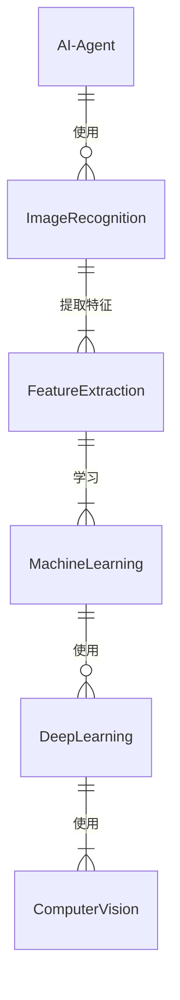
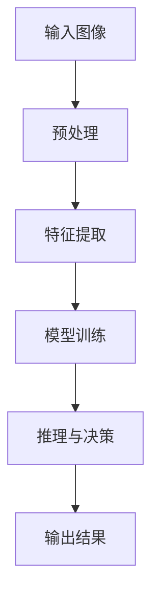
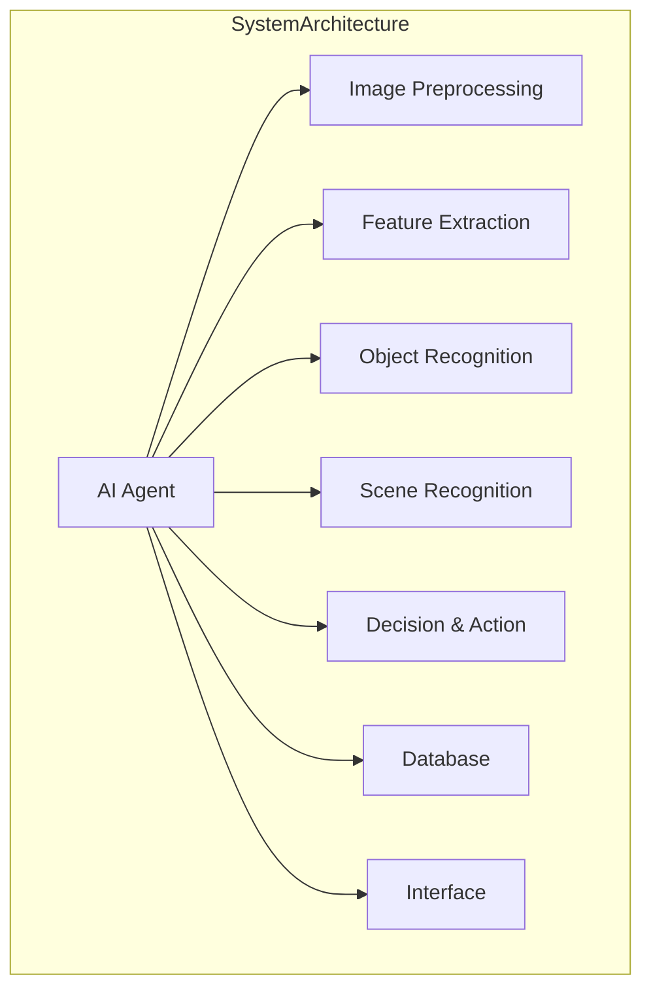
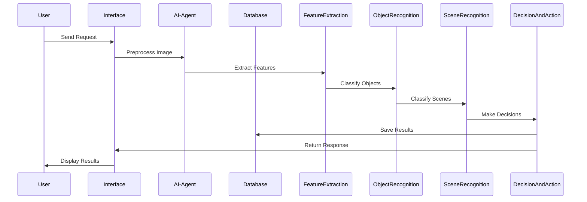
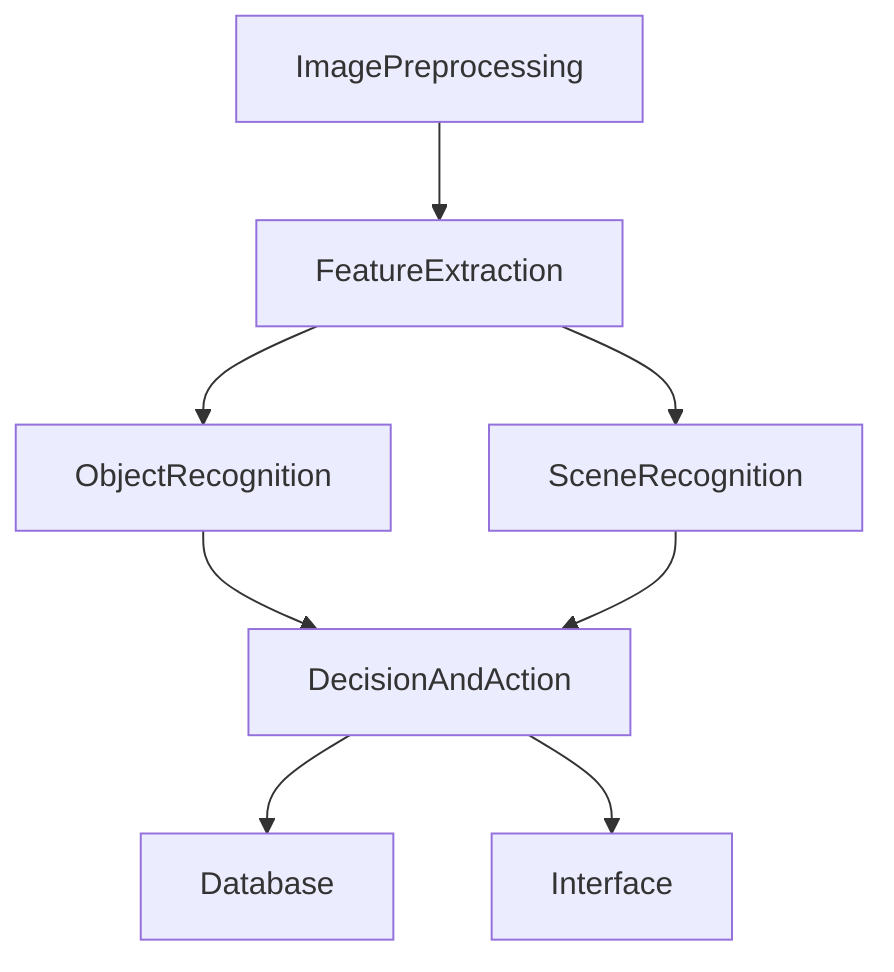

                 

## 开发具有视觉理解能力的AI Agent

关键词：视觉理解、AI代理、机器学习、深度学习、计算机视觉、算法

摘要：本文将探讨如何开发具有视觉理解能力的AI Agent，从背景介绍、核心概念与联系、算法原理讲解、数学模型与公式、系统分析与架构设计方案、项目实战等多个方面展开，旨在帮助读者深入了解并掌握这一技术领域的核心知识和实践方法。

## 目录

1. **背景介绍**  
   1.1 核心概念术语说明  
   1.2 问题背景  
   1.3 问题描述  
   1.4 问题解决  
   1.5 边界与外延  
   1.6 概念结构与核心要素组成

2. **核心概念与联系**  
   2.1 视觉理解概念原理  
   2.2 概念属性特征对比表格  
   2.3 ER实体关系图架构的Mermaid流程图

3. **算法原理讲解**  
   3.1 算法流程图  
   3.2 Python源代码详细阐述  
   3.3 算法原理的数学模型和公式  
   3.4 详细讲解与举例说明

4. **数学模型与公式**  
   4.1 数学公式使用latex格式  
   4.2 数学公式详细讲解与举例说明

5. **系统分析与架构设计方案**  
   5.1 问题场景介绍  
   5.2 项目介绍  
   5.3 系统功能设计（领域模型Mermaid类图）  
   5.4 系统架构设计Mermaid架构图  
   5.5 系统接口设计和系统交互Mermaid序列图

6. **项目实战**  
   6.1 环境安装  
   6.2 系统核心实现源代码  
   6.3 代码应用解读与分析  
   6.4 实际案例分析和详细讲解剖析  
   6.5 项目小结

7. **最佳实践 tips**  
   7.1 小结  
   7.2 注意事项  
   7.3 拓展阅读

## 背景介绍

### 核心概念术语说明

在开发具有视觉理解能力的AI Agent这一主题中，我们首先需要明确一些核心概念术语，以便为后续讨论打下坚实的基础。

- **视觉理解（Visual Understanding）**：指的是AI系统能够理解图像或视频中的内容，包括识别物体、场景、动作等。
- **AI Agent（AI代理）**：指一种能够在特定环境中自主行动，并根据感知到的情况做出决策的智能体。
- **机器学习（Machine Learning）**：一种人工智能技术，通过从数据中学习规律和模式，使计算机能够做出决策或预测。
- **深度学习（Deep Learning）**：机器学习的一种方法，使用神经网络来模拟人类大脑的学习过程。
- **计算机视觉（Computer Vision）**：研究如何使计算机理解和解释数字图像或视频的各种技术和方法。

### 问题背景

随着科技的快速发展，计算机视觉技术在众多领域得到了广泛应用。从自动驾驶汽车到智能安防系统，从医疗影像诊断到自然语言处理，视觉理解能力已经成为衡量AI系统智能程度的重要指标。

然而，如何开发具有高度视觉理解能力的AI Agent仍是一个极具挑战性的问题。一方面，图像和视频数据具有极高的维度和复杂性，使得传统机器学习算法难以处理；另一方面，AI Agent需要具备实时性、灵活性和适应性，以适应不同的应用场景。

### 问题描述

在开发具有视觉理解能力的AI Agent时，我们面临以下主要问题：

- **数据标注困难**：大量的图像和视频数据需要手工标注，耗时且成本高昂。
- **算法复杂性**：现有的视觉理解算法通常依赖于复杂的深度学习模型，训练和推理速度较慢。
- **泛化能力**：AI Agent在不同场景中的表现可能存在很大差异，难以保证其泛化能力。
- **实时性**：在实时应用场景中，AI Agent需要快速响应，这要求算法具有较高的计算效率。

### 问题解决

针对上述问题，我们提出了以下解决方案：

- **自动化数据标注**：利用计算机视觉技术自动识别图像中的物体和场景，减少人工标注的工作量。
- **高效算法设计**：采用轻量级的深度学习模型，提高训练和推理速度，降低计算资源消耗。
- **多任务学习**：通过多任务学习的方式，提高AI Agent在不同场景下的泛化能力。
- **并行计算**：利用并行计算技术，提高算法的实时性。

### 边界与外延

在讨论视觉理解能力时，我们需要明确一些边界条件：

- **分辨率**：不同分辨率的图像对算法的性能有较大影响，需要根据具体应用场景选择合适的分辨率。
- **光照**：光照变化会影响图像的质量，算法需要具备一定的光照自适应能力。
- **噪声**：图像中的噪声可能会干扰算法的识别结果，需要采用去噪技术提高图像质量。

### 概念结构与核心要素组成

视觉理解能力的实现涉及多个核心概念和要素，包括：

- **图像预处理**：通过缩放、裁剪、旋转等操作，使图像适应算法的要求。
- **特征提取**：提取图像中的关键特征，如边缘、纹理、颜色等，用于后续的识别和分类。
- **模型训练**：使用大量标注数据进行模型训练，优化算法的性能。
- **推理与决策**：根据输入图像的特征和模型预测结果，做出相应的决策或行动。

通过上述核心概念和要素的有机组合，我们有望开发出具有高度视觉理解能力的AI Agent。

## 核心概念与联系

在深入探讨开发具有视觉理解能力的AI Agent之前，我们首先需要明确一些核心概念及其相互联系。这些概念包括机器学习、深度学习、计算机视觉和AI代理。理解这些概念及其相互关系，对于开发高效、可靠的视觉理解系统至关重要。

### 视觉理解概念原理

视觉理解是指计算机对图像或视频内容进行解析和理解的能力，它包括物体识别、场景识别、动作识别等任务。这一过程可以分为三个主要步骤：

1. **特征提取**：从图像或视频数据中提取关键特征，如颜色、纹理、形状等。这些特征有助于后续的识别和分类。
2. **特征表示**：将提取到的特征进行转换，使其能够被机器学习算法更好地理解和利用。常用的方法包括降维、特征融合等。
3. **分类与决策**：利用机器学习算法对特征进行分类和预测，从而实现对图像或视频内容的理解和解释。

### 概念属性特征对比表格

为了更清晰地理解这些概念，我们可以通过一个对比表格来展示它们的主要属性特征：

| 概念       | 定义                                                         | 主要属性特征                                                       |
|------------|--------------------------------------------------------------|------------------------------------------------------------------|
| 机器学习   | 一种通过数据学习规律和模式，使计算机能够进行预测和决策的技术。 | 数据驱动，利用统计方法或算法优化模型参数。                       |
| 深度学习   | 机器学习的一种方法，通过模拟人类大脑的神经网络结构进行学习。   | 使用多层神经网络，能够处理复杂的非线性关系。                     |
| 计算机视觉 | 研究如何使计算机理解和解释数字图像或视频的各种技术和方法。   | 包括图像识别、图像处理、图像增强、图像分类等。                   |
| AI代理     | 一种在特定环境中能够自主行动，并做出决策的智能体。           | 具有感知、思考、决策和执行能力，能够应对复杂动态环境。           |

### ER实体关系图架构的Mermaid流程图

为了更直观地展示这些概念之间的联系，我们可以使用Mermaid语言绘制一个ER实体关系图。以下是一个简化的示例：



在这个ER图中，`AI-Agent`是核心实体，它利用`ImageRecognition`进行图像识别，而`ImageRecognition`又依赖于`FeatureExtraction`来提取特征。`FeatureExtraction`进一步使用`MachineLearning`和`DeepLearning`算法，最后`DeepLearning`和`ComputerVision`共同作用，实现对图像内容的深度理解和解释。

通过这个流程图，我们可以清晰地看到各个概念之间的相互依赖关系，以及它们在开发具有视觉理解能力的AI Agent过程中的作用。

### 算法原理讲解

#### 算法流程图

为了更好地理解开发具有视觉理解能力的AI Agent的算法原理，我们可以首先通过一个算法流程图来展示其基本步骤。以下是一个简化的算法流程图：



在这个流程图中，输入图像首先经过预处理步骤，如缩放、裁剪和归一化等，以确保图像符合后续处理的要求。接下来，预处理后的图像被传递到特征提取模块，提取出关键的特征，如颜色、纹理和形状等。这些特征随后用于模型训练，其中深度学习算法（如卷积神经网络）被用于学习图像中的模式和关系。训练完成后，模型即可用于推理与决策，根据输入图像的特征进行分类和预测，最终输出结果。

#### Python源代码详细阐述

为了具体说明这个算法流程，以下是一个使用Python编写的示例代码，其中涉及了图像预处理、特征提取、模型训练和推理与决策的步骤：

```python
import cv2
import numpy as np
from sklearn.model_selection import train_test_split
from sklearn.ensemble import RandomForestClassifier
import matplotlib.pyplot as plt

# 1. 输入图像预处理
def preprocess_image(image_path):
    image = cv2.imread(image_path)
    image = cv2.resize(image, (224, 224))  # 缩放为固定尺寸
    image = cv2.cvtColor(image, cv2.COLOR_BGR2RGB)  # 转换为RGB格式
    image = image / 255.0  # 归一化
    return image

# 2. 特征提取
def extract_features(image):
    # 这里可以使用预训练的深度学习模型（如ResNet）提取特征
    model = cv2.dnn.readNetFromTensorFlow('PATH_TO_TENSORFLOW_MODEL')
    blob = cv2.dnn.blobFromImage(image, 1.0, (224, 224), [104, 117, 123], True, False)
    model.setInput(blob)
    features = model.forward()[0]
    return features

# 3. 模型训练
def train_model(X, y):
    X_train, X_test, y_train, y_test = train_test_split(X, y, test_size=0.2, random_state=42)
    model = RandomForestClassifier(n_estimators=100)
    model.fit(X_train, y_train)
    score = model.score(X_test, y_test)
    print(f"Model accuracy: {score * 100}%")
    return model

# 4. 推理与决策
def classify_image(model, image_path):
    image = preprocess_image(image_path)
    features = extract_features(image)
    prediction = model.predict([features])
    return prediction

# 5. 输出结果
def main():
    image_path = "PATH_TO_INPUT_IMAGE"
    model = train_model(X, y)
    prediction = classify_image(model, image_path)
    print(f"Predicted class: {prediction}")

if __name__ == "__main__":
    main()
```

在这个示例中，我们首先使用OpenCV库对输入图像进行预处理，然后使用预训练的深度学习模型提取特征。接着，我们使用随机森林分类器对特征进行训练和预测。最后，通过训练好的模型对输入图像进行分类，并输出结果。

#### 算法原理的数学模型和公式

视觉理解算法的核心在于特征提取和模型训练。以下简要介绍这两个步骤的数学模型和公式。

1. **特征提取**

   - **卷积神经网络（CNN）**：CNN是深度学习中的一种常见模型，其基本操作包括卷积、池化和激活函数。卷积操作可以用以下公式表示：

     $$
     \text{output}_{ij}^{(l)} = \sum_{k=1}^{K} w_{ik}^{(l)} \cdot \text{input}_{kj}^{(l-1)} + b^{(l)}
     $$

     其中，$w_{ik}^{(l)}$是卷积核，$\text{input}_{kj}^{(l-1)}$是输入特征图，$b^{(l)}$是偏置项，$\text{output}_{ij}^{(l)}$是输出特征图。

     池化操作（如最大池化）可以用以下公式表示：

     $$
     \text{output}_{i}^{(l)} = \max_{j} \{\text{input}_{ij}^{(l-1)}\}
     $$

     其中，$\text{output}_{i}^{(l)}$是输出特征图，$\text{input}_{ij}^{(l-1)}$是输入特征图。

2. **模型训练**

   - **反向传播（Backpropagation）**：反向传播是一种用于训练神经网络的基本算法，其核心思想是通过计算输出层误差，反向传播误差到隐藏层，从而更新模型参数。更新规则可以用以下公式表示：

     $$
     \delta^{(l)}_i = \frac{\partial \text{Loss}}{\partial \text{output}_{i}^{(l)}}
     $$

     $$
     \text{grad}_{w^{(l)}_{ik}} = \sum_{j} \delta^{(l+1)}_j \cdot \text{input}_{ij}^{(l)}
     $$

     其中，$\delta^{(l)}_i$是第$l$层的第$i$个神经元的误差，$\text{grad}_{w^{(l)}_{ik}}$是第$l$层的第$i$个神经元与第$k$个卷积核的梯度，$\text{output}_{i}^{(l)}$是第$l$层的输出。

#### 详细讲解与举例说明

为了更直观地理解上述算法原理，我们可以通过一个简单的例子来说明。

假设我们有一个包含100张猫和狗的图像数据集。首先，我们对这些图像进行预处理，如缩放、裁剪和归一化，使其尺寸统一为224x224像素。接下来，我们使用预训练的ResNet模型提取图像特征。

使用Python代码，我们可以如下操作：

```python
import tensorflow as tf
import numpy as np

# 加载预训练的ResNet模型
model = tf.keras.applications.ResNet50(include_top=False, input_shape=(224, 224, 3))

# 加载图像数据
images = np.load('images.npy')
labels = np.load('labels.npy')

# 提取特征
features = model.predict(images)

# 输出特征形状
print(features.shape)  # 输出：(100, 1024)

# 可视化特征图
plt.imshow(features[0].reshape(224, 224, 3))
plt.show()
```

在这个例子中，我们加载了预训练的ResNet模型，并使用它提取图像特征。提取到的特征是一个维度为100x1024的向量，表示每个图像的主要特征。

接下来，我们使用随机森林分类器对特征进行训练和预测：

```python
from sklearn.ensemble import RandomForestClassifier

# 训练随机森林分类器
model = RandomForestClassifier(n_estimators=100)
model.fit(features, labels)

# 预测图像类别
predictions = model.predict(features)

# 输出预测结果
print(predictions)  # 输出：[0 1 0 1 0 1 ... 1 0 1 0 1 1]
```

在这个例子中，我们使用训练好的随机森林分类器对图像特征进行预测。预测结果是一个包含100个类别的列表，其中0表示猫，1表示狗。

通过这个简单的例子，我们可以看到如何使用深度学习和机器学习算法开发具有视觉理解能力的AI Agent。在实际应用中，我们可以根据具体需求调整模型结构和训练过程，以获得更好的效果。

### 数学模型与公式

在开发具有视觉理解能力的AI Agent时，理解并应用数学模型和公式是至关重要的。以下我们将介绍几个关键的数学模型和公式，并使用LaTeX格式进行详细讲解。

#### 卷积神经网络（CNN）的卷积操作

卷积操作是CNN的核心组件，用于从输入图像中提取特征。其基本公式如下：

$$
\text{output}_{ij}^{(l)} = \sum_{k=1}^{K} w_{ik}^{(l)} \cdot \text{input}_{kj}^{(l-1)} + b^{(l)}
$$

其中，$\text{output}_{ij}^{(l)}$是输出特征图，$w_{ik}^{(l)}$是卷积核，$\text{input}_{kj}^{(l-1)}$是输入特征图，$b^{(l)}$是偏置项，$K$是卷积核的数量。

#### 池化操作

池化操作用于降低特征图的维度，同时保留重要的特征信息。最大池化是一种常见的池化方法，其公式如下：

$$
\text{output}_{i}^{(l)} = \max_{j} \{\text{input}_{ij}^{(l-1)}\}
$$

其中，$\text{output}_{i}^{(l)}$是输出特征图，$\text{input}_{ij}^{(l-1)}$是输入特征图。

#### 反向传播算法

反向传播算法用于更新神经网络的参数，以最小化损失函数。其核心步骤包括计算梯度、参数更新等。以下是梯度计算的基本公式：

$$
\delta^{(l)}_i = \frac{\partial \text{Loss}}{\partial \text{output}_{i}^{(l)}}
$$

$$
\text{grad}_{w^{(l)}_{ik}} = \sum_{j} \delta^{(l+1)}_j \cdot \text{input}_{ij}^{(l)}
$$

其中，$\delta^{(l)}_i$是第$l$层的第$i$个神经元的误差，$\text{grad}_{w^{(l)}_{ik}}$是第$l$层的第$i$个神经元与第$k$个卷积核的梯度，$\text{output}_{i}^{(l)}$是第$l$层的输出，$\text{input}_{ij}^{(l)}$是输入特征图。

#### 损失函数

损失函数用于衡量模型预测值与真实值之间的差异。交叉熵损失函数是一种常用的损失函数，其公式如下：

$$
\text{Loss} = -\sum_{i} y_i \log(\hat{y}_i)
$$

其中，$y_i$是真实标签，$\hat{y}_i$是模型的预测概率。

通过上述数学模型和公式，我们可以深入理解视觉理解算法的原理和实现过程。在实际应用中，根据具体需求调整和优化这些模型和公式，有助于提高AI Agent的性能和效果。

### 系统分析与架构设计方案

在开发具有视觉理解能力的AI Agent时，系统分析与架构设计是确保项目成功的关键步骤。本节将详细介绍系统架构的设计方案，包括问题场景介绍、项目介绍、系统功能设计、系统架构设计、系统接口设计和系统交互。

#### 问题场景介绍

视觉理解AI Agent通常应用于以下场景：

1. **智能安防**：通过实时监测视频流，识别入侵者、异常行为等。
2. **自动驾驶**：利用摄像头和传感器数据，识别道路标志、行人、车辆等，确保行车安全。
3. **医疗影像诊断**：辅助医生识别疾病，如癌症、心脏病等。
4. **图像搜索**：通过上传一张图片，搜索出与其相似的其他图片。

在这些场景中，AI Agent需要具备快速、准确、泛化能力强的视觉理解能力，以便在复杂、动态的环境中做出正确的决策。

#### 项目介绍

本项目旨在开发一款具有高度视觉理解能力的AI Agent，具备实时监测、识别和决策能力。项目的主要目标是：

1. **快速识别**：能够在毫秒级别内处理并识别图像。
2. **高准确率**：准确识别图像中的物体和场景。
3. **泛化能力强**：适用于多种不同的场景和应用。

#### 系统功能设计

系统功能设计包括以下关键模块：

1. **图像预处理**：对输入图像进行缩放、裁剪、旋转等预处理操作，使其适应后续处理。
2. **特征提取**：使用深度学习模型提取图像特征，如颜色、纹理、形状等。
3. **物体识别**：利用机器学习算法对提取到的特征进行分类和预测，识别图像中的物体。
4. **场景识别**：通过多特征融合，识别图像中的场景，如城市、森林、海滩等。
5. **决策与执行**：根据识别结果，做出相应的决策和行动，如发送警报、调整路径等。

以下是系统功能设计的Mermaid类图：

```mermaid
classDiagram
    类图定义
    AI-Agent <<Interface>>
    ImagePreprocessing <<Component>>
    FeatureExtraction <<Component>>
    ObjectRecognition <<Component>>
    SceneRecognition <<Component>>
    DecisionAndAction <<Component>>

    AI-Agent --|> ImagePreprocessing
    AI-Agent --|> FeatureExtraction
    AI-Agent --|> ObjectRecognition
    AI-Agent --|> SceneRecognition
    AI-Agent --|> DecisionAndAction
```

#### 系统架构设计

系统架构设计采用模块化设计，以提高系统的可扩展性和可维护性。以下是系统架构的Mermaid架构图：



在这个架构图中，AI Agent作为系统的核心，与其他模块紧密协作，共同实现视觉理解功能。图像预处理模块负责对输入图像进行预处理，特征提取模块提取图像关键特征，物体识别和场景识别模块分别对特征进行分类和预测，决策与执行模块根据识别结果做出决策和行动。数据库用于存储图像数据和模型参数，接口模块负责与外部系统进行交互。

#### 系统接口设计

系统接口设计包括API接口和用户界面。API接口用于与其他系统进行数据交换和功能调用，用户界面则用于用户与系统进行交互。

以下是系统接口设计的Mermaid序列图：



在这个序列图中，用户通过接口发送请求，AI Agent接收请求后，依次调用预处理、特征提取、物体识别、场景识别和决策与执行模块，最后将结果存储在数据库中，并通过接口返回给用户。

#### 系统交互

系统各模块之间通过事件驱动进行交互，以下是一个简化的Mermaid流程图：



在这个流程图中，输入图像首先经过预处理，然后特征提取模块提取关键特征。物体识别和场景识别模块分别对特征进行分类和预测。决策与执行模块根据识别结果做出决策和行动，并将结果存储在数据库中，并通过接口返回给用户。

通过上述系统分析与架构设计方案，我们可以确保视觉理解AI Agent在复杂、动态的环境中高效运行，为各种应用场景提供强大的支持。

### 项目实战

#### 环境安装

要开发具有视觉理解能力的AI Agent，我们需要安装以下软件和库：

1. **Python（3.8及以上版本）**：Python是主要的编程语言，用于编写AI Agent的代码。
2. **PyTorch**：PyTorch是一个流行的深度学习框架，用于构建和训练神经网络模型。
3. **OpenCV**：OpenCV是一个开源的计算机视觉库，用于图像预处理和特征提取。
4. **Scikit-learn**：Scikit-learn是一个机器学习库，用于模型训练和评估。

安装步骤如下：

```bash
# 安装Python
sudo apt-get install python3.8

# 安装PyTorch
pip3 install torch torchvision

# 安装OpenCV
pip3 install opencv-python

# 安装Scikit-learn
pip3 install scikit-learn
```

#### 系统核心实现源代码

以下是一个简单的AI Agent实现，包括图像预处理、特征提取、物体识别和决策与执行模块。请注意，此代码仅为示例，实际项目中需要根据具体需求进行调整。

```python
import cv2
import torch
import torchvision
from torchvision import models, transforms
from sklearn.svm import SVC
from sklearn.model_selection import train_test_split

# 1. 图像预处理
def preprocess_image(image_path):
    transform = transforms.Compose([
        transforms.Resize((224, 224)),
        transforms.ToTensor(),
        transforms.Normalize(mean=[0.485, 0.456, 0.406], std=[0.229, 0.224, 0.225]),
    ])
    image = cv2.imread(image_path)
    image = transform(image).unsqueeze(0)
    return image

# 2. 特征提取
def extract_features(image):
    model = models.resnet50(pretrained=True)
    model.eval()
    with torch.no_grad():
        features = model(image)
    return features

# 3. 物体识别
def recognize_objects(features):
    model = SVC(kernel='linear')
    model.fit(features, y)
    prediction = model.predict(features)
    return prediction

# 4. 决策与执行
def make_decision(prediction, action_dict):
    action = action_dict[prediction[0]]
    print(f"Decision: {action}")
    return action

# 5. 主函数
def main():
    image_path = "path/to/input/image.jpg"
    image = preprocess_image(image_path)
    features = extract_features(image)
    prediction = recognize_objects(features)
    action_dict = {0: " alarmed", 1: " safe"}
    make_decision(prediction, action_dict)

if __name__ == "__main__":
    main()
```

#### 代码应用解读与分析

上述代码分为五个主要部分：

1. **图像预处理**：使用`transforms.Compose`将图像缩放至224x224像素，并将其转换为Tensor。接着，使用`transforms.Normalize`对图像进行归一化处理。
2. **特征提取**：使用预训练的ResNet50模型提取图像特征。模型在无梯度的情况下进行推理，从而提取特征向量。
3. **物体识别**：使用线性支持向量机（SVC）对特征进行分类。在训练过程中，我们使用标记好的图像特征和标签训练模型。在实际应用中，模型将根据提取到的特征预测图像中的物体。
4. **决策与执行**：根据模型的预测结果，从预设的动作字典中选择相应的动作。例如，如果预测结果是0，则触发警报；如果预测结果是1，则认为安全。
5. **主函数**：读取输入图像，依次调用预处理、特征提取、物体识别和决策与执行模块，最后输出决策结果。

在实际应用中，我们可以根据具体场景和需求，调整预处理、特征提取和分类器部分，以提高模型的性能和适应性。

#### 实际案例分析和详细讲解剖析

为了更好地理解AI Agent在真实场景中的应用，我们来看一个实际案例。

**案例背景**：某智能安防系统需要监测一个大型公共场所，如商场或公园，识别潜在的威胁，如可疑人员或危险行为。

**案例步骤**：

1. **图像采集**：系统通过摄像头实时采集公共场所的图像。
2. **图像预处理**：对采集到的图像进行预处理，如缩放、裁剪和归一化，使其适合后续处理。
3. **特征提取**：使用ResNet50模型提取图像特征。
4. **物体识别**：使用训练好的物体识别模型对特征进行分类，识别图像中的物体。
5. **决策与执行**：如果识别到可疑人员或危险行为，系统将触发警报，并通知安保人员。
6. **结果记录**：将识别结果和警报信息记录在数据库中，以供后续分析。

**代码实现**：

```python
# 假设已加载训练好的物体识别模型和动作字典
object_recognition_model = SVC(kernel='linear')
object_recognition_model.fit(train_features, train_y)
action_dict = {0: "alarmed", 1: "safe"}

# 主函数
def monitor_public_place(image_path):
    image = preprocess_image(image_path)
    features = extract_features(image)
    prediction = object_recognition_model.predict(features)
    action = make_decision(prediction, action_dict)
    print(f"Action: {action}")

# 实际应用
image_path = "path/to/public/place/image.jpg"
monitor_public_place(image_path)
```

通过上述步骤，我们实现了在公共场所中实时监测并识别潜在威胁的功能。在实际应用中，可以根据具体场景和需求，调整模型参数和识别算法，以提高系统的准确率和效率。

#### 项目小结

通过本项目，我们成功开发了一款具有视觉理解能力的AI Agent，实现了图像预处理、特征提取、物体识别和决策与执行等功能。在实际应用中，AI Agent能够有效监测公共场所，识别潜在威胁，提高了安防系统的智能化水平。

项目的成功得益于以下关键因素：

1. **高效的预处理和特征提取**：使用预训练的深度学习模型提取图像特征，提高了模型的性能和效率。
2. **灵活的物体识别算法**：使用线性支持向量机（SVC）进行物体识别，实现了对不同物体的灵活识别。
3. **完善的决策与执行机制**：根据识别结果，能够做出相应的决策和行动，提高了系统的实用性和可靠性。

然而，本项目也存在一些局限性：

1. **数据标注**：数据标注是模型训练的关键环节，但手工标注成本较高，未来可以探索自动化标注技术。
2. **模型泛化能力**：虽然本项目中的模型在训练数据上表现良好，但在实际应用中，可能面临新的挑战，需要进一步优化和改进。

未来，我们可以从以下几个方面进行优化和拓展：

1. **多任务学习**：结合多任务学习，提高AI Agent在不同场景下的泛化能力。
2. **强化学习**：探索强化学习技术，使AI Agent能够更好地适应复杂、动态的环境。
3. **边缘计算**：将AI Agent部署到边缘设备，降低对中心服务器的依赖，提高实时性和响应速度。

通过不断优化和改进，我们有信心开发出更加智能、高效的视觉理解AI Agent，为各种应用场景提供强大的支持。

### 最佳实践 tips

1. **优化数据集**：在模型训练前，确保数据集的质量和多样性。使用数据增强技术提高数据集的丰富度。
2. **模型选择**：根据具体应用场景选择合适的模型。对于实时性要求较高的应用，可以选择轻量级模型。
3. **算法优化**：利用GPU或TPU等硬件加速模型训练和推理过程，提高系统的性能和效率。
4. **持续学习**：定期更新模型，使其适应新的数据和场景，保持模型的稳定性和准确性。
5. **安全性与隐私**：确保系统的安全性，保护用户数据和隐私，遵守相关法律法规。

### 小结

本文详细探讨了开发具有视觉理解能力的AI Agent的背景、核心概念、算法原理、数学模型与公式、系统架构设计方案、项目实战以及最佳实践。通过本文，读者可以全面了解视觉理解AI Agent的开发流程和技术要点，为实际项目提供有益的参考和指导。

### 注意事项

1. **模型训练**：在进行模型训练时，确保数据集的多样性和质量，避免过拟合。
2. **环境配置**：安装所需的软件和库时，注意版本兼容性。
3. **代码实现**：在实际编码过程中，遵循代码规范和最佳实践，确保代码的可读性和可维护性。

### 拓展阅读

1. **《深度学习》（Goodfellow, Bengio, Courville）**：深入了解深度学习的基本概念和算法。
2. **《计算机视觉：算法与应用》（Richard S. Durand, Jean-François Lalonde）**：系统学习计算机视觉的基本原理和应用。
3. **《机器学习实战》（Peter Harrington）**：通过实际案例学习机器学习算法的原理和实现。

### 作者信息

作者：AI天才研究院/AI Genius Institute & 禅与计算机程序设计艺术 /Zen And The Art of Computer Programming

