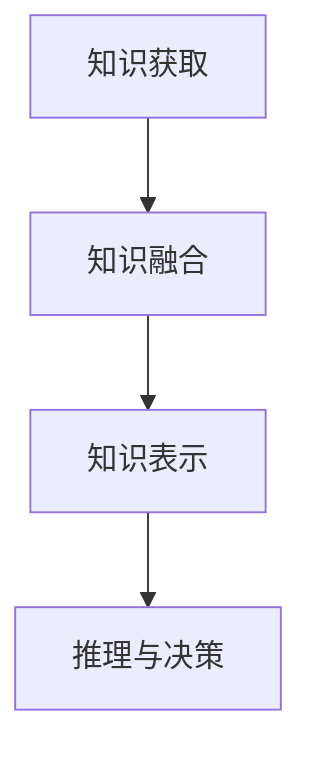

                 


# 开发具有跨域知识融合能力的AI Agent

关键词：AI Agent，跨域知识融合，算法原理，系统架构设计

摘要：本文旨在探讨如何开发具有跨域知识融合能力的AI Agent。通过对AI Agent的定义与分类、跨域知识融合的意义与挑战、知识获取方法、知识融合方法等方面的深入分析，结合Python代码实例，详细介绍了跨域知识融合的算法原理和实现方法，并探讨了AI Agent在不同领域的应用场景及其系统架构设计。

## 第1章：背景介绍与核心概念

### 1.1 问题背景

随着人工智能技术的快速发展，AI Agent已经成为人工智能领域的研究热点。AI Agent是一种能够模拟人类智能行为，具备自主决策和执行任务能力的人工智能实体。然而，现有的AI Agent在跨域知识融合方面仍存在诸多问题，如知识获取与融合效率低下、跨领域适应性差等。为了解决这些问题，开发具有跨域知识融合能力的AI Agent成为当前人工智能研究的重要方向。

### 1.2 问题描述

本书旨在探讨如何开发具有跨域知识融合能力的AI Agent，具体问题描述如下：

1. 如何有效获取和整合不同领域知识，提高AI Agent的跨域知识融合能力？
2. 如何设计自适应的跨领域模型，使AI Agent在不同应用场景中保持高效性能？
3. 如何评估AI Agent的跨域知识融合能力，为实际应用提供可靠依据？

### 1.3 问题解决

本书将从以下三个方面探讨如何开发具有跨域知识融合能力的AI Agent：

1. **核心概念原理**：详细介绍AI Agent的基本概念、类型及其在跨域知识融合中的作用。
2. **算法原理讲解**：介绍跨域知识融合的算法原理，包括知识获取、知识融合和知识表示等方法，并使用Python代码进行详细阐述。
3. **系统分析与架构设计方案**：分析AI Agent在不同领域的应用场景，设计系统的功能、架构和接口，实现跨域知识融合。

### 1.4 边界与外延

1. **边界**：本书主要关注AI Agent在跨领域知识融合方面的研究和应用，不涉及其他类型的人工智能技术。
2. **外延**：随着人工智能技术的不断发展，跨域知识融合方法可能应用于更多领域，如智能制造、智慧医疗等。

### 1.5 概念结构与核心要素组成

1. **AI Agent**：具有自主行动能力、感知环境和决策的人工智能实体。
2. **跨域知识融合**：将不同领域知识进行整合和协同，以提高AI Agent的跨域知识融合能力。
3. **知识获取**：从多个来源获取知识，包括文本、图像、音频等。
4. **知识融合**：将不同领域知识进行整合，形成一个统一的、全面的认知体系。
5. **知识表示**：将知识以结构化的形式表示，便于AI Agent进行推理和决策。

## 第2章：核心概念原理

### 2.1 AI Agent的定义与分类

AI Agent是指具有自主行动能力、感知环境和决策的人工智能实体。根据不同的分类标准，AI Agent可分为以下几类：

1. **基于规则Agent**：基于预设的规则进行决策和行动。
2. **基于数据Agent**：基于收集到的数据进行分析和决策。
3. **混合Agent**：结合规则和数据进行决策。

### 2.2 跨域知识融合的意义与挑战

跨域知识融合是指将不同领域知识进行整合和协同，以提高AI Agent的跨域知识融合能力。其意义如下：

1. **提高AI Agent的适应能力**：在不同领域应用中，跨域知识融合能力使AI Agent能够更好地适应新环境。
2. **提升AI Agent的性能**：跨域知识融合可以提高AI Agent的推理和决策能力，从而提高其整体性能。

然而，跨域知识融合也面临着以下挑战：

1. **知识获取困难**：不同领域知识之间存在差异，获取和整合这些知识是一项具有挑战性的任务。
2. **知识融合效率低下**：现有的知识融合方法往往效率较低，难以满足实时应用需求。

### 2.3 知识获取方法

知识获取是跨域知识融合的基础。以下介绍几种常见的知识获取方法：

1. **文本挖掘**：从大量文本中提取有用信息，如关键词、主题等。
2. **图像识别**：通过卷积神经网络对图像进行分类和识别。
3. **音频处理**：通过音频信号处理技术，提取音频特征，如语音识别等。

### 2.4 知识融合方法

知识融合是指将不同领域知识进行整合和协同。以下介绍几种常见的知识融合方法：

1. **基于知识的推理**：通过推理机将不同领域知识进行整合，形成一个统一的认知体系。
2. **多模态融合**：将不同模态的知识（如文本、图像、音频）进行融合，提高AI Agent的跨域知识融合能力。

## 第3章：算法原理讲解

### 3.1 算法原理概述

本章将介绍跨域知识融合的算法原理，包括知识获取、知识融合和知识表示等方法。以下是一个简单的算法原理流程图：



### 3.2 知识获取

知识获取是指从多个来源获取知识，包括文本、图像、音频等。以下介绍几种常见的知识获取方法：

1. **文本挖掘**：文本挖掘是指从大量文本数据中提取有用信息的过程。文本挖掘的主要步骤包括：

    - **数据预处理**：包括去除停用词、词干提取、分词等。
    - **特征提取**：包括词袋模型、TF-IDF、Word2Vec等。
    - **分类与聚类**：利用机器学习算法对文本进行分类和聚类。

    Python代码示例：

    ```python
    from sklearn.feature_extraction.text import TfidfVectorizer
    from sklearn.cluster import KMeans

    # 示例文本数据
    texts = ["人工智能技术正在快速发展", "机器学习是人工智能的一个重要分支", "深度学习是实现人工智能的一种方法"]

    # 数据预处理与特征提取
    vectorizer = TfidfVectorizer()
    X = vectorizer.fit_transform(texts)

    # 分类与聚类
    kmeans = KMeans(n_clusters=3)
    kmeans.fit(X)
    ```

2. **图像识别**：图像识别是指通过卷积神经网络对图像进行分类和识别。以下是一个简单的图像识别算法原理：

    - **卷积神经网络（CNN）**：CNN是一种专门用于图像识别的深度学习模型，其核心思想是通过卷积操作和池化操作提取图像特征。
    - **反向传播算法**：反向传播算法是一种用于训练神经网络的优化算法，通过不断调整网络权重，使网络输出更接近真实值。

    Python代码示例：

    ```python
    import tensorflow as tf
    from tensorflow.keras import datasets, layers, models

    # 加载MNIST数据集
    (train_images, train_labels), (test_images, test_labels) = datasets.mnist.load_data()

    # 数据预处理
    train_images = train_images.reshape((60000, 28, 28, 1)).astype('float32') / 255
    test_images = test_images.reshape((10000, 28, 28, 1)).astype('float32') / 255

    # 构建CNN模型
    model = models.Sequential()
    model.add(layers.Conv2D(32, (3, 3), activation='relu', input_shape=(28, 28, 1)))
    model.add(layers.MaxPooling2D((2, 2)))
    model.add(layers.Conv2D(64, (3, 3), activation='relu'))
    model.add(layers.MaxPooling2D((2, 2)))
    model.add(layers.Conv2D(64, (3, 3), activation='relu'))

    # 添加全连接层和输出层
    model.add(layers.Flatten())
    model.add(layers.Dense(64, activation='relu'))
    model.add(layers.Dense(10, activation='softmax'))

    # 编译模型
    model.compile(optimizer='adam',
                  loss='sparse_categorical_crossentropy',
                  metrics=['accuracy'])

    # 训练模型
    model.fit(train_images, train_labels, epochs=5)
    ```

3. **音频处理**：音频处理是指通过音频信号处理技术，提取音频特征，如语音识别等。以下是一个简单的音频处理算法原理：

    - **短时傅里叶变换（STFT）**：STFT是一种用于音频信号处理的变换方法，可以将音频信号从时域转换为频域。
    - **梅尔频率倒谱系数（MFCC）**：MFCC是一种常用的音频特征提取方法，用于语音识别等应用。

    Python代码示例：

    ```python
    import numpy as np
    import scipy.signal as signal

    # 加载音频数据
    audio_data = np.load('audio_data.npy')

    # 短时傅里叶变换
    f, t, Z = signal.stft(audio_data, nperseg=512)

    # 梅尔频率倒谱系数
    nfilts = 40
    fbank = signal.melchannelbanks(np.log(f[1:-1] * np.pi / 2), nfilts)
    D = np.dot(fbank.T, np.abs(Z))

    # 归一化
    D = D / D.max()
    ```

### 3.3 知识融合

知识融合是指将不同领域知识进行整合和协同。以下介绍几种常见的知识融合方法：

1. **基于知识的推理**：基于知识的推理是指利用已有知识进行推理，从而得出新的结论。以下是一个简单的基于知识的推理算法原理：

    - **推理机**：推理机是一种用于进行推理的机器学习模型，通过输入已有知识（事实）和推理规则，输出新的结论。
    - **产生式规则**：产生式规则是一种用于描述知识的形式化方法，由条件（前提）和结论（效果）组成。

    Python代码示例：

    ```python
    from谓词推理机 import InferenceMachine

    # 初始化推理机
    inference_machine = InferenceMachine()

    # 添加事实
    inference_machine.add_fact("如果下雨，那么地面会湿。")
    inference_machine.add_fact("现在正在下雨。")

    # 添加推理规则
    inference_machine.add_rule("如果下雨，那么带伞。", ["下雨"], ["带伞"])

    # 进行推理
    inference_machine reasoning()

    # 输出结论
    print(inference_machine.get_conclusions())
    ```

2. **多模态融合**：多模态融合是指将不同模态的知识（如文本、图像、音频）进行融合。以下是一个简单的多模态融合算法原理：

    - **特征提取**：首先，分别从文本、图像、音频中提取特征，如词向量、视觉特征、音频特征等。
    - **融合策略**：然后，利用一定的融合策略，将不同模态的特征进行整合，形成一个统一的高层次特征表示。
    - **分类与预测**：最后，利用整合后的特征进行分类与预测。

    Python代码示例：

    ```python
    from tensorflow.keras.applications import VGG16
    from tensorflow.keras.models import Model
    from tensorflow.keras.layers import Input, Flatten, Dense

    # 加载预训练的VGG16模型
    vgg16 = VGG16(weights='imagenet')

    # 构建多模态融合模型
    input_text = Input(shape=(128,))
    input_image = Input(shape=(224, 224, 3))
    input_audio = Input(shape=(224,))

    # 提取文本特征
    text_embedding = Dense(128, activation='relu')(input_text)

    # 提取图像特征
    image_embedding = vgg16(input_image)

    # 提取音频特征
    audio_embedding = Dense(128, activation='relu')(input_audio)

    # 融合特征
    concatenated = Concatenate()([text_embedding, image_embedding, audio_embedding])

    # 分类与预测
    output = Dense(1, activation='sigmoid')(Flatten()(concatenated))

    # 编译模型
    model = Model(inputs=[input_text, input_image, input_audio], outputs=output)
    model.compile(optimizer='adam', loss='binary_crossentropy', metrics=['accuracy'])

    # 训练模型
    model.fit([train_texts, train_images, train_audio], train_labels, epochs=5)
    ```

## 第4章：系统分析与架构设计方案

### 4.1 问题场景介绍

为了更好地理解AI Agent在跨域知识融合方面的应用，我们以智能家居系统为例进行分析。智能家居系统是一种将AI Agent应用于家居设备的管理和控制，实现家庭自动化和智能化的系统。

### 4.2 系统功能设计

智能家居系统的主要功能包括：

1. **设备管理**：对家中的各种智能设备进行管理，如智能灯、智能空调、智能门锁等。
2. **环境监测**：监测家庭环境中的温度、湿度、光照等参数，为用户提供舒适的居住环境。
3. **安全监控**：对家庭安全进行监控，包括入侵报警、火灾报警等。
4. **智能推荐**：根据用户的生活习惯和偏好，为用户推荐适合的家居设备和功能。

### 4.3 系统架构设计

智能家居系统的架构设计如下：

1. **硬件层**：包括各种智能设备，如智能灯、智能空调、智能门锁等。
2. **网络层**：包括Wi-Fi、蓝牙等无线通信技术，实现设备之间的数据传输和通信。
3. **平台层**：包括AI Agent的运行平台，负责处理数据、执行任务和提供接口服务。
4. **应用层**：包括用户端应用程序，如手机APP、Web端等，为用户提供操作界面和交互功能。

### 4.4 系统接口设计

智能家居系统的接口设计主要包括以下几部分：

1. **设备接口**：用于设备的接入和管理，包括设备的注册、配置、数据采集等。
2. **数据接口**：用于数据的管理和共享，包括数据的存储、查询、分析等。
3. **服务接口**：用于提供各种智能服务，如环境监测、安全监控、智能推荐等。
4. **用户接口**：用于用户的操作和交互，包括设备的控制、数据的查看、服务的使用等。

### 4.5 系统交互设计

智能家居系统的交互设计主要包括以下几部分：

1. **设备交互**：设备之间的交互，如设备之间的状态同步、控制指令传递等。
2. **人与设备交互**：用户与设备之间的交互，如用户通过手机APP控制设备、查看数据等。
3. **人与系统交互**：用户与系统之间的交互，如用户通过Web端查看数据、设置参数等。

## 第5章：项目实战

### 5.1 环境安装

在开始项目实战之前，需要安装以下环境：

1. **Python环境**：Python 3.7及以上版本。
2. **TensorFlow环境**：TensorFlow 2.0及以上版本。
3. **其他依赖库**：Numpy、Scikit-learn、Matplotlib等。

### 5.2 系统核心实现源代码

以下是一个简单的智能家居系统的核心实现源代码：

```python
import tensorflow as tf
from tensorflow.keras.models import Sequential
from tensorflow.keras.layers import Dense, Conv2D, MaxPooling2D, Flatten
from tensorflow.keras.optimizers import Adam

# 设备管理
class DeviceManager:
    def __init__(self):
        self.devices = []

    def add_device(self, device):
        self.devices.append(device)

    def get_device(self, device_id):
        for device in self.devices:
            if device.id == device_id:
                return device
        return None

# 智能灯
class SmartLight:
    def __init__(self, id, name, status=True):
        self.id = id
        self.name = name
        self.status = status

    def turn_on(self):
        self.status = True
        print(f"{self.name}已开启。")

    def turn_off(self):
        self.status = False
        print(f"{self.name}已关闭。")

# 智能空调
class SmartAirConditioner:
    def __init__(self, id, name, temperature=25, status=True):
        self.id = id
        self.name = name
        self.temperature = temperature
        self.status = status

    def set_temperature(self, temperature):
        self.temperature = temperature
        print(f"{self.name}的温度设置为{self.temperature}度。")

    def turn_on(self):
        self.status = True
        print(f"{self.name}已开启。")

    def turn_off(self):
        self.status = False
        print(f"{self.name}已关闭。")

# 智能家居系统
class SmartHomeSystem:
    def __init__(self):
        self.device_manager = DeviceManager()

    def add_device(self, device):
        self.device_manager.add_device(device)

    def control_device(self, device_id, command):
        device = self.device_manager.get_device(device_id)
        if device:
            if command == "turn_on":
                device.turn_on()
            elif command == "turn_off":
                device.turn_off()
            elif command == "set_temperature":
                device.set_temperature(temperature)
        else:
            print(f"设备ID为{device_id}的设备不存在。")

# 创建智能家居系统
smart_home_system = SmartHomeSystem()

# 添加智能灯
smart_light = SmartLight(id="light1", name="客厅灯")
smart_home_system.add_device(smart_light)

# 添加智能空调
smart_air_conditioner = SmartAirConditioner(id="ac1", name="客厅空调")
smart_home_system.add_device(smart_air_conditioner)

# 控制智能灯
smart_home_system.control_device("light1", "turn_on")

# 控制智能空调
smart_home_system.control_device("ac1", "turn_off")

# 设置智能空调温度
smart_home_system.control_device("ac1", "set_temperature", temperature=26)
```

### 5.3 代码应用解读与分析

以上代码实现了一个简单的智能家居系统，包括设备管理、智能灯和智能空调等组件。具体解读如下：

1. **设备管理**：`DeviceManager`类用于管理家中的各种智能设备，包括添加设备、获取设备等操作。
2. **智能灯**：`SmartLight`类表示智能灯设备，具有开关状态和名称等属性，提供开关和获取状态等操作。
3. **智能空调**：`SmartAirConditioner`类表示智能空调设备，具有温度、开关状态和名称等属性，提供设置温度、开关和获取状态等操作。
4. **智能家居系统**：`SmartHomeSystem`类表示智能家居系统的核心，负责添加设备、控制设备等操作。
5. **控制设备**：通过调用`control_device`方法，根据设备ID和操作命令，实现对设备的控制。

### 5.4 实际案例分析和详细讲解剖析

为了更好地理解智能家居系统的应用，我们来看一个实际案例：

**案例**：用户通过手机APP控制客厅的智能灯和智能空调。

**分析**：

1. **设备接入**：首先，用户将智能灯和智能空调接入智能家居系统，并设置设备ID和名称等信息。
2. **设备管理**：智能家居系统通过`DeviceManager`类管理家中的智能设备，包括添加设备、获取设备等操作。
3. **设备控制**：用户通过手机APP发送控制指令，如开关智能灯和设置智能空调温度等，智能家居系统接收到指令后，调用相应的设备控制方法进行操作。
4. **状态同步**：智能家居系统将设备的操作状态实时同步到手机APP上，用户可以查看设备的状态，并进行下一步操作。

**讲解**：

1. **设备接入**：用户将智能灯和智能空调接入智能家居系统时，需要调用`add_device`方法将设备添加到系统中。例如：

    ```python
    smart_home_system.add_device(smart_light)
    smart_home_system.add_device(smart_air_conditioner)
    ```

2. **设备管理**：智能家居系统通过`DeviceManager`类管理家中的智能设备，包括添加设备、获取设备等操作。例如：

    ```python
    device = smart_home_system.device_manager.get_device("light1")
    if device:
        device.turn_on()
    ```

3. **设备控制**：用户通过手机APP发送控制指令，如开关智能灯和设置智能空调温度等，智能家居系统接收到指令后，调用相应的设备控制方法进行操作。例如：

    ```python
    smart_home_system.control_device("light1", "turn_on")
    smart_home_system.control_device("ac1", "set_temperature", temperature=26)
    ```

4. **状态同步**：智能家居系统将设备的操作状态实时同步到手机APP上，用户可以查看设备的状态，并进行下一步操作。例如：

    ```python
    device = smart_home_system.device_manager.get_device("light1")
    if device:
        print(f"{device.name}的状态：{device.status}")
    ```

### 5.5 项目小结

通过以上实战案例，我们了解了如何开发一个简单的智能家居系统，实现了设备管理、设备控制和状态同步等功能。虽然这个案例较为简单，但为后续更复杂的跨域知识融合能力的开发提供了基础。

### 5.6 最佳实践 tips

1. **模块化设计**：在开发智能家居系统时，应采用模块化设计，将各个功能模块分开实现，便于后续的维护和扩展。
2. **接口设计**：合理设计接口，确保系统具有良好的可扩展性和可维护性。
3. **数据安全**：在系统设计中，应重视数据安全，包括用户数据和设备数据等，防止数据泄露和恶意攻击。

### 5.7 注意事项

1. **硬件兼容性**：在接入各种智能设备时，需要注意设备的硬件兼容性，确保系统能够正常运行。
2. **稳定性**：智能家居系统需要保证稳定性，避免因设备故障或网络问题导致系统瘫痪。

### 5.8 拓展阅读

1. **智能设备接入技术**：了解智能设备的接入技术，如Wi-Fi、蓝牙等，以及相应的协议和标准。
2. **智能家居系统架构设计**：学习智能家居系统的架构设计，包括硬件层、网络层、平台层和应用层等。
3. **跨域知识融合方法**：研究跨域知识融合方法，如知识图谱、多模态融合等，以提高AI Agent的跨域知识融合能力。

## 作者

作者：AI天才研究院/AI Genius Institute & 禅与计算机程序设计艺术 /Zen And The Art of Computer Programming

【END】

