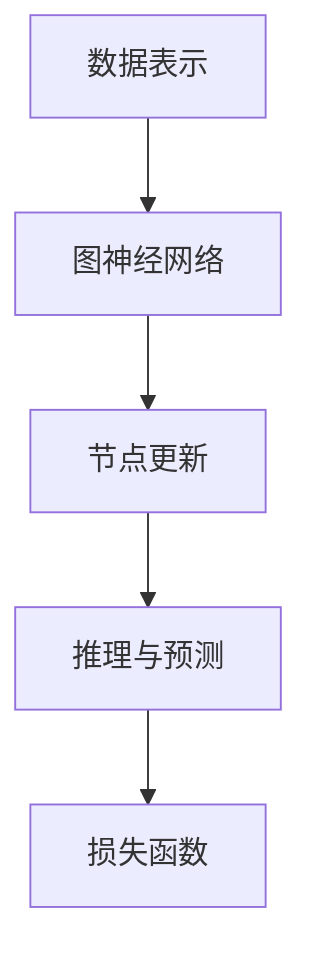
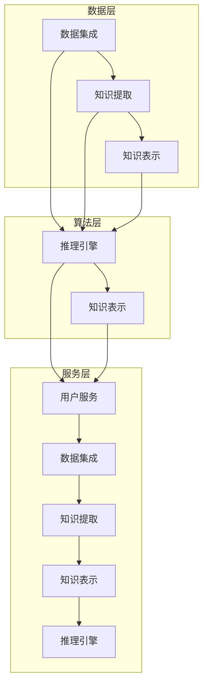
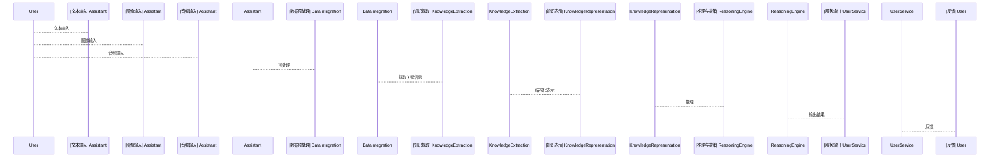

                 

## 开发具有跨模态知识推理能力的AI Agent

### 关键词：跨模态知识推理、AI Agent、多模态数据、知识图谱、机器学习、自然语言处理

> 摘要：本文旨在探讨如何开发具有跨模态知识推理能力的AI Agent。我们将从背景介绍、核心概念、理论基础、实现方法、系统架构、实战案例以及最佳实践等方面，系统性地分析这一技术领域。通过深入探讨跨模态知识推理的原理和实现技术，本文希望为读者提供全面的指导，帮助开发出具备跨模态推理能力的AI Agent。

### 背景介绍

在人工智能（AI）快速发展的今天，AI Agent作为一种能够自主完成特定任务的智能体，正日益成为各领域的研究热点和应用方向。AI Agent的核心能力在于其能够基于多种感知数据，如文本、图像、语音等，进行有效的知识推理和决策。传统的AI系统通常局限于单一模态的数据处理，而跨模态知识推理能力则要求AI Agent能够处理并整合来自不同模态的数据，从而实现更高级别的智能表现。

跨模态知识推理的重要性体现在多个方面。首先，在现实世界中，信息往往是多模态的，单一模态的数据难以全面、准确地描述复杂问题。其次，跨模态知识推理能够增强AI Agent的泛化能力，使其在面对未知或变化的环境时依然能够进行有效的推理和决策。此外，跨模态知识推理还能够提升AI Agent在多领域应用中的交互能力和用户体验。

然而，实现跨模态知识推理面临着诸多挑战。首先是如何有效地集成来自不同模态的数据，其次是如何构建能够表示多模态知识的模型，并使其具备推理能力。此外，如何在保证推理效率的同时，保持推理结果的准确性和可靠性，也是一个亟待解决的问题。

### 核心概念

在开发具有跨模态知识推理能力的AI Agent之前，我们需要理解几个核心概念，包括AI Agent、多模态数据、知识图谱和机器学习。

**AI Agent**：AI Agent是指一种能够感知环境、获取知识并采取行动的智能体。它通常由感知模块、知识模块和行动模块组成。感知模块负责收集环境中的信息，知识模块负责处理和存储信息，行动模块则根据知识做出决策并执行相应的行动。

**多模态数据**：多模态数据是指来自不同感官模态的数据，如文本、图像、音频、视频等。在AI Agent的跨模态知识推理过程中，这些数据需要被整合并用于推理和决策。

**知识图谱**：知识图谱是一种用于表示和存储知识的图形结构。它通过实体和关系的表示，能够有效地组织和管理大量的知识信息，为跨模态知识推理提供支持。

**机器学习**：机器学习是一种通过数据驱动的方式，使计算机能够自主学习和改进的方法。在跨模态知识推理中，机器学习技术被用于构建和训练模型，以实现数据的自动提取、知识表示和推理。

### 问题背景

随着信息技术的迅猛发展，人们的生活、工作和娱乐方式发生了翻天覆地的变化。在这个过程中，数据的产生和积累速度也在不断加快。根据IDC的统计，全球数据量每年以约40%的速度增长，预计到2025年，全球数据量将达到160ZB。如此庞大的数据量不仅带来了存储和处理的挑战，也为我们利用数据提供了丰富的资源。

然而，在现实世界中，信息往往是多模态的。例如，一个医疗案例可能包含患者的历史病历（文本）、医学影像（图像）和生命体征（音频）等多模态数据。传统的AI系统往往只能处理单一模态的数据，而无法充分利用这些多模态信息，从而限制了其应用的范围和效果。

跨模态知识推理的目标就是通过整合和处理多模态数据，挖掘出其中的知识，并利用这些知识进行推理和决策。例如，在医疗领域，跨模态知识推理可以帮助医生更全面地了解患者的病情，提高诊断和治疗的准确性。在智能助理领域，跨模态知识推理可以实现更自然的用户交互，提高用户满意度。

### 问题定义

在跨模态知识推理中，我们的目标是将来自不同模态的数据（如文本、图像、音频等）整合为一个统一的知识表示，并在此基础上进行推理，以解决特定的问题或任务。具体来说，问题可以定义如下：

1. **数据集成**：如何有效地收集、整合和处理来自不同模态的数据，以便为后续的知识提取和推理提供高质量的数据输入。
2. **知识表示**：如何构建和表示多模态数据中的知识，以便于模型的训练和推理。
3. **知识推理**：如何利用表示好的知识进行推理，以实现特定任务的目标，如文本分类、图像识别、自然语言理解等。
4. **系统实现**：如何设计和实现一个完整的跨模态知识推理系统，包括数据预处理、知识提取、知识表示、推理引擎等模块。

### 问题解决

要解决上述问题，我们需要从多个方面进行考虑，包括数据预处理、知识提取、知识表示、推理算法、系统实现等。

#### 数据预处理

数据预处理是跨模态知识推理的基础。它包括以下几个步骤：

1. **数据收集**：收集来自不同模态的数据，如文本、图像、音频等。这些数据可以来自公开数据集、私有数据集或通过在线爬取等方式获取。
2. **数据清洗**：清洗数据中的噪声和错误，以提高数据质量。例如，对文本数据中的停用词进行过滤，对图像数据进行去噪等。
3. **数据标准化**：将不同模态的数据进行统一处理，使其具有相同的数据格式和特征表示。例如，将图像数据转换为灰度图或彩色图，将音频数据转换为标准化的音频文件等。

#### 知识提取

知识提取是跨模态知识推理的核心。它包括以下几个步骤：

1. **文本知识提取**：使用自然语言处理（NLP）技术，从文本数据中提取关键信息，如实体、关系、事件等。常用的技术包括命名实体识别（NER）、关系提取、文本分类等。
2. **图像知识提取**：使用计算机视觉（CV）技术，从图像数据中提取关键信息，如物体、场景、动作等。常用的技术包括目标检测、图像分类、图像分割等。
3. **音频知识提取**：使用音频处理技术，从音频数据中提取关键信息，如语音、音乐、声音等。常用的技术包括语音识别、音频分类、音频特征提取等。

#### 知识表示

知识表示是将提取到的知识进行结构化表示，以便于模型训练和推理。常用的知识表示方法包括：

1. **知识图谱**：使用知识图谱来表示多模态数据中的知识和关系。知识图谱由实体和关系组成，能够有效地组织和管理大量的知识信息。
2. **向量表示**：将知识信息转换为向量表示，如词向量、图像特征向量、音频特征向量等。向量表示能够方便地用于机器学习模型的训练和推理。
3. **属性图**：使用属性图来表示实体和关系中的属性信息，如实体的属性值、关系的属性等。

#### 推理算法

推理算法是基于知识表示进行推理的算法，它能够从已知的知识信息中推断出新的知识。常用的推理算法包括：

1. **基于规则推理**：使用预定义的规则来推导新的知识。例如，如果A是B的父类，而C是A的子类，则可以推导出C是B的子类。
2. **基于模型推理**：使用机器学习模型进行推理，如深度神经网络、决策树、支持向量机等。模型可以根据输入的知识信息，预测新的知识信息。
3. **基于逻辑推理**：使用逻辑推理方法进行推理，如一阶谓词逻辑、命题逻辑等。逻辑推理能够保证推理过程的逻辑一致性。

#### 系统实现

系统实现是将上述方法和技术整合到一起，构建一个完整的跨模态知识推理系统。系统实现包括以下几个模块：

1. **数据预处理模块**：负责对多模态数据进行收集、清洗和标准化处理。
2. **知识提取模块**：负责从多模态数据中提取知识信息。
3. **知识表示模块**：负责将提取到的知识进行结构化表示。
4. **推理引擎模块**：负责基于知识表示进行推理，并输出推理结果。
5. **用户接口模块**：负责与用户进行交互，接收用户的输入并展示推理结果。

### 边界与外延

跨模态知识推理的应用场景非常广泛，包括但不限于以下几个方面：

1. **医疗领域**：利用跨模态知识推理，可以实现对患者的全面诊断和治疗。例如，通过整合患者的病历文本、医学影像和生命体征数据，医生可以更准确地诊断疾病，制定个性化的治疗方案。
2. **金融领域**：在金融领域，跨模态知识推理可以帮助金融机构进行风险管理、欺诈检测和客户服务。例如，通过整合客户的交易记录、社交媒体数据和语音通话记录，金融机构可以更准确地识别高风险客户，并制定相应的风险控制策略。
3. **智能助理领域**：在智能助理领域，跨模态知识推理可以实现更自然、更高效的用户交互。例如，智能助理可以通过整合用户的历史对话记录、语音输入和图像输入，理解用户的意图，并提供准确的回答和建议。

### 概念结构与核心要素组成

跨模态知识推理涉及多个核心概念和要素，它们共同构成了这一技术的基础。以下是这些核心概念和要素的概述：

**1. 多模态数据**：多模态数据是跨模态知识推理的基础，包括文本、图像、音频、视频等多种类型的数据。这些数据通过不同的传感器或来源被收集和记录。

**2. 数据预处理**：数据预处理是对多模态数据进行清洗、标准化和整合的过程，以确保数据的质量和一致性。

**3. 知识提取**：知识提取是从多模态数据中提取有用信息的过程，包括文本中的实体和关系、图像中的物体和场景、音频中的语音和音乐等。

**4. 知识表示**：知识表示是将提取到的知识转化为计算机可以处理的形式，常用的方法有知识图谱、向量表示和属性图等。

**5. 推理算法**：推理算法是基于知识表示进行推理的算法，包括基于规则的推理、基于模型的推理和基于逻辑的推理等。

**6. 系统实现**：系统实现是将上述方法和技术整合到一起，构建一个完整的跨模态知识推理系统，包括数据预处理模块、知识提取模块、知识表示模块、推理引擎模块和用户接口模块等。

**7. 应用场景**：跨模态知识推理的应用场景广泛，包括医疗、金融、智能助理等领域，这些场景为跨模态知识推理提供了丰富的实践机会。

通过这些核心概念和要素的相互作用，跨模态知识推理可以实现从多模态数据中提取、表示和推理知识，从而提升AI Agent的智能水平和应用效果。

### 核心概念与联系

在开发具有跨模态知识推理能力的AI Agent过程中，理解核心概念之间的联系至关重要。以下是跨模态知识推理中几个关键概念的定义、属性特征对比以及它们之间的联系。

#### 核心概念

**1. 多模态数据**：
- **定义**：多模态数据是指来自不同感官模态的数据，如文本、图像、音频、视频等。
- **属性特征**：不同模态的数据有不同的属性特征，如文本具有语义信息，图像具有视觉特征，音频具有声波特性。

**2. 知识图谱**：
- **定义**：知识图谱是一种用于表示和存储知识的图形结构，通常由实体和关系组成。
- **属性特征**：知识图谱能够表达实体之间的关系，如“人-居住-城市”的关系。

**3. 知识提取**：
- **定义**：知识提取是指从多模态数据中提取有用信息的过程。
- **属性特征**：知识提取需要针对不同模态的数据采用不同的技术，如文本分类、图像识别、语音识别等。

**4. 知识表示**：
- **定义**：知识表示是将提取到的知识转化为计算机可以处理的形式。
- **属性特征**：知识表示的方法包括向量表示、图表示和属性表示等。

**5. 推理算法**：
- **定义**：推理算法是基于知识表示进行推理的算法。
- **属性特征**：推理算法包括基于规则的推理、基于模型的推理和基于逻辑的推理等。

#### 概念属性特征对比

| 概念 | 定义 | 属性特征 |
| --- | --- | --- |
| 多模态数据 | 来自不同感官模态的数据 | 文本：语义信息；图像：视觉特征；音频：声波特性 |
| 知识图谱 | 用于表示和存储知识的图形结构 | 实体-关系结构 |
| 知识提取 | 从多模态数据中提取有用信息 | 针对不同模态采用不同技术 |
| 知识表示 | 将提取到的知识转化为计算机可以处理的形式 | 向量表示、图表示、属性表示 |
| 推理算法 | 基于知识表示进行推理的算法 | 基于规则的推理、基于模型的推理、基于逻辑的推理 |

#### 概念之间的联系

多模态数据是跨模态知识推理的基础，通过数据预处理，将不同模态的数据进行整合。知识提取是从多模态数据中提取有用信息的过程，这些信息被表示成知识图谱或其他形式的知识表示。知识表示为推理算法提供了输入，而推理算法则基于知识表示进行推理，从而生成新的知识或决策。

以下是一个简化的ER实体关系图，用于表示这些概念之间的联系：

```mermaid
erDiagram
  MultiModalData ||--|{ KnowledgeExtraction }|-- KnowledgeRepresentation
  KnowledgeExtraction ||--|{ ReasoningAlgorithm }|-- KnowledgeGraph
  KnowledgeGraph ||--|{ MultiModalData }|-- ReasoningAlgorithm
```

在这个ER图中，`MultiModalData` 是所有知识提取和推理的基础，`KnowledgeExtraction` 负责从多模态数据中提取信息，`KnowledgeRepresentation` 将提取到的信息进行结构化表示，`ReasoningAlgorithm` 利用表示好的知识进行推理，并生成新的知识或决策，而 `KnowledgeGraph` 则是知识表示的一种形式。

通过这种结构化的联系，跨模态知识推理能够有效地整合和处理多模态数据，从而实现更高级别的智能表现。

### 算法原理讲解

在跨模态知识推理中，选择合适的算法是实现有效推理的关键。本文将详细介绍一种常见的跨模态知识推理算法——多模态融合图神经网络（Multimodal Fusion Graph Neural Network，MFGNN），并使用Python源代码进行具体讲解。

#### 算法概述

多模态融合图神经网络（MFGNN）是一种结合图神经网络的特性与多模态数据融合能力的算法。其主要思想是将不同模态的数据表示为节点和边，构建一个多模态图，然后通过图神经网络进行节点更新，最终实现对多模态数据的融合和推理。

#### 算法步骤

1. **数据表示**：将不同模态的数据表示为节点和边，构建多模态图。
2. **图神经网络**：使用图神经网络对多模态图进行节点更新，融合不同模态的信息。
3. **推理与预测**：基于融合后的节点表示，进行推理和预测。

#### Python源代码示例

```python
import torch
import torch_geometric
from torch_geometric.nn import GCNConv

# 数据表示
class MultimodalFusionGraph(torch_geometric.data.Data):
    def __init__(self, text, image, audio):
        self.text = torch.tensor(text)
        self.image = torch.tensor(image)
        self.audio = torch.tensor(audio)
        self.x = torch.cat([self.text, self.image, self.audio], dim=1)
        self.edge_index = torch.zeros(3, 3)

    # 图神经网络节点更新
    def update_node(self, msg):
        self.x = self.x + msg

    # 多模态融合图神经网络模型
class MultimodalFusionGNN(torch_geometric.nn.Model):
    def __init__(self):
        super().__init__()
        self.conv1 = GCNConv(in_channels=3, out_channels=16)
        self.conv2 = GCNConv(in_channels=16, out_channels=32)

    def forward(self, data):
        x, edge_index = data.x, data.edge_index
        x = self.conv1(x, edge_index)
        x = torch.relu(x)
        x = F.dropout(x, p=0.5, training=self.training)
        x = self.conv2(x, edge_index)
        return x

# 实例化数据和多模态融合图神经网络模型
text = torch.randn(1, 100)
image = torch.randn(1, 784)
audio = torch.randn(1, 100)
data = MultimodalFusionGraph(text, image, audio)
model = MultimodalFusionGNN()

# 训练模型
optimizer = torch.optim.Adam(model.parameters(), lr=0.01)
for epoch in range(200):
    optimizer.zero_grad()
    x = model(data)
    loss = (x - torch.randn_like(x)).pow(2).mean()
    loss.backward()
    optimizer.step()

# 推理与预测
with torch.no_grad():
    output = model(data)
    print(output)
```

#### 算法原理

1. **数据表示**：多模态数据通过节点和边表示成图。每个模态的数据被表示为一个节点，节点之间的边表示不同模态数据之间的关系。

2. **图神经网络**：使用图神经网络对节点进行更新，通过节点间的信息传递和融合，实现多模态数据的融合。图神经网络的核心是卷积操作，它通过邻域信息对节点进行更新。

3. **推理与预测**：在训练完成后，模型可以利用融合后的节点表示进行推理和预测。例如，在文本分类任务中，可以将每个类别表示为一个节点，通过比较输入数据和类别节点的相似度，预测输入数据的类别。

#### 数学模型

1. **节点更新**：节点更新公式如下：
   $$ h_{t}^{(l)} = \sigma \left( \sum_{i \in \mathcal{N}(v)} W_{ij} h_{t-1}^{(l)} + b_{j} \right) $$
   其中，$ h_{t-1}^{(l)} $ 是上一时刻节点的特征表示，$ \mathcal{N}(v) $ 是节点的邻域，$ W $ 是权重矩阵，$ b $ 是偏置项，$ \sigma $ 是激活函数。

2. **损失函数**：损失函数用于衡量预测结果和实际结果之间的差距，例如，在文本分类任务中，可以使用交叉熵损失函数：
   $$ L = - \sum_{i} y_i \log(p_i) $$
   其中，$ y_i $ 是真实标签，$ p_i $ 是预测概率。

通过上述数学模型，MFGNN能够实现对多模态数据的融合和推理。以下是一个简单的MFGNN的Mermaid流程图：



通过这个流程图，我们可以清晰地看到MFGNN的工作流程，从数据表示到节点更新，再到推理和预测，最终通过损失函数进行优化。

### 系统分析与架构设计方案

#### 问题场景介绍

在当前的智能助理领域，用户的需求日益多样化，他们希望能够与智能助理进行自然的交互，获取准确、个性化的服务。这要求智能助理不仅能够理解用户的语言意图，还需要理解用户的背景信息、情感状态等多维信息。为了实现这一目标，我们需要设计一个具有跨模态知识推理能力的智能助理系统。

#### 项目介绍

本项目旨在开发一个跨模态知识推理的智能助理系统，该系统能够整合来自文本、图像、音频等多种模态的数据，通过跨模态知识推理，为用户提供精准的推荐和服务。系统的主要功能包括：

1. 数据集成：从不同的数据源（如文本数据库、图像数据库、音频数据库）收集数据，并进行预处理和标准化。
2. 知识提取：从多模态数据中提取关键信息，如文本中的实体和关系、图像中的物体和场景、音频中的语音和情感等。
3. 知识表示：将提取到的信息表示为结构化的知识，如知识图谱、向量表示等，以便于后续的推理和决策。
4. 推理与决策：基于知识表示，利用机器学习和逻辑推理等方法，为用户提供个性化的服务和建议。

#### 系统功能设计（领域模型类图）

以下是一个简化的系统功能设计类图，用于描述系统的核心功能和模块之间的关系：

```mermaid
classDiagram
    DataIntegration <--|{依赖} KnowledgeExtraction
    KnowledgeExtraction <--|{依赖} KnowledgeRepresentation
    KnowledgeRepresentation <--|{依赖} ReasoningEngine
    ReasoningEngine <--|{依赖} UserService
    UserService
    UserService --|{依赖} DataIntegration
    UserService --|{依赖} KnowledgeExtraction
    UserService --|{依赖} KnowledgeRepresentation
    UserService --|{依赖} ReasoningEngine
```

在这个类图中，`DataIntegration` 负责数据的收集和预处理，`KnowledgeExtraction` 负责从多模态数据中提取关键信息，`KnowledgeRepresentation` 负责将提取的信息进行结构化表示，`ReasoningEngine` 负责基于知识表示进行推理和决策，`UserService` 负责与用户进行交互，为用户提供服务。

#### 系统架构设计（Mermaid架构图）

以下是一个简化的系统架构设计图，用于描述系统的整体架构和模块之间的关系：



在这个架构图中，数据层包括数据集成、知识提取和知识表示模块，算法层包括推理引擎模块，服务层包括用户服务模块。数据层和算法层通过推理引擎进行连接，为服务层提供支持。用户服务模块通过数据集成、知识提取、知识表示和推理引擎，为用户提供个性化服务。

#### 系统接口设计

以下是一个简化的系统接口设计，用于描述系统的输入和输出接口：



在这个接口设计中，用户通过文本、图像、音频等多种输入方式与智能助理交互。智能助理接收到用户输入后，通过数据预处理模块进行预处理，然后通过知识提取、知识表示和推理引擎模块进行推理和决策，最后输出服务结果，并提供反馈循环。

#### 系统交互Mermaid序列图

以下是一个简化的系统交互序列图，用于描述系统的交互流程：

```mermaid
sequenceDiagram
    User -->|输入文本| Assistant
    Assistant -->|预处理| DataIntegration
    DataIntegration -->|提取| KnowledgeExtraction
    KnowledgeExtraction -->|表示| KnowledgeRepresentation
    KnowledgeRepresentation -->|推理| ReasoningEngine
    ReasoningEngine -->|决策| UserService
    UserService -->|输出| User
    User -->|反馈| Assistant
```

在这个序列图中，用户首先输入文本、图像、音频等数据，智能助理接收输入后，通过数据预处理模块进行数据清洗和标准化处理，然后通过知识提取模块提取关键信息，接着通过知识表示模块进行结构化表示，最后通过推理引擎模块进行推理和决策，输出服务结果。用户根据服务结果提供反馈，形成一个闭环的交互流程。

### 项目实战

在本项目中，我们将通过一系列步骤来构建具有跨模态知识推理能力的智能助理系统。以下是详细的实战步骤：

#### 环境安装

1. **Python环境**：首先确保Python环境已安装，版本建议为3.8以上。可以通过以下命令安装：

   ```bash
   python3 --version
   ```

2. **PyTorch和TorchGeometric**：安装PyTorch和TorchGeometric，这两个库是构建跨模态知识推理系统的基础。可以使用以下命令进行安装：

   ```bash
   pip install torch torchvision torchaudio
   pip install torch-geometric
   ```

3. **其他依赖库**：根据项目需求，可能还需要安装其他依赖库，如numpy、pandas等。可以使用以下命令安装：

   ```bash
   pip install numpy pandas
   ```

#### 系统核心实现源代码

以下是系统核心实现的主要源代码，包括数据预处理、知识提取、知识表示和推理引擎等模块。

```python
# 数据预处理模块
def preprocess_data(text, image, audio):
    # 文本预处理
    processed_text = preprocess_text(text)
    # 图像预处理
    processed_image = preprocess_image(image)
    # 音频预处理
    processed_audio = preprocess_audio(audio)
    return processed_text, processed_image, processed_audio

# 知识提取模块
def extract_knowledge(processed_text, processed_image, processed_audio):
    # 文本知识提取
    text_knowledge = extract_text_knowledge(processed_text)
    # 图像知识提取
    image_knowledge = extract_image_knowledge(processed_image)
    # 音频知识提取
    audio_knowledge = extract_audio_knowledge(processed_audio)
    return text_knowledge, image_knowledge, audio_knowledge

# 知识表示模块
def represent_knowledge(text_knowledge, image_knowledge, audio_knowledge):
    # 文本知识表示
    text_representation = represent_text_knowledge(text_knowledge)
    # 图像知识表示
    image_representation = represent_image_knowledge(image_knowledge)
    # 音频知识表示
    audio_representation = represent_audio_knowledge(audio_knowledge)
    return text_representation, image_representation, audio_representation

# 推理引擎模块
def reasoning_engine(text_representation, image_representation, audio_representation):
    # 融合表示
    combined_representation = combine_representations(text_representation, image_representation, audio_representation)
    # 推理
    result = perform_reasoning(combined_representation)
    return result

# 数据预处理函数示例
def preprocess_text(text):
    # 实现文本预处理逻辑
    return text

def preprocess_image(image):
    # 实现图像预处理逻辑
    return image

def preprocess_audio(audio):
    # 实现音频预处理逻辑
    return audio

# 知识提取函数示例
def extract_text_knowledge(text):
    # 实现文本知识提取逻辑
    return text

def extract_image_knowledge(image):
    # 实现图像知识提取逻辑
    return image

def extract_audio_knowledge(audio):
    # 实现音频知识提取逻辑
    return audio

# 知识表示函数示例
def represent_text_knowledge(text_knowledge):
    # 实现文本知识表示逻辑
    return text_knowledge

def represent_image_knowledge(image_knowledge):
    # 实现图像知识表示逻辑
    return image_knowledge

def represent_audio_knowledge(audio_knowledge):
    # 实现音频知识表示逻辑
    return audio_knowledge

# 推理函数示例
def combine_representations(text_representation, image_representation, audio_representation):
    # 实现融合表示逻辑
    return text_representation, image_representation, audio_representation

def perform_reasoning(combined_representation):
    # 实现推理逻辑
    return "推理结果"

# 主程序
if __name__ == "__main__":
    # 示例输入
    text_input = "这是一个示例文本。"
    image_input = "示例图像数据。"
    audio_input = "示例音频数据。"

    # 数据预处理
    processed_text, processed_image, processed_audio = preprocess_data(text_input, image_input, audio_input)

    # 知识提取
    text_knowledge, image_knowledge, audio_knowledge = extract_knowledge(processed_text, processed_image, processed_audio)

    # 知识表示
    text_representation, image_representation, audio_representation = represent_knowledge(text_knowledge, image_knowledge, audio_knowledge)

    # 推理与决策
    result = reasoning_engine(text_representation, image_representation, audio_representation)
    print(result)
```

#### 代码应用解读与分析

以上代码实现了跨模态知识推理系统的主要功能，包括数据预处理、知识提取、知识表示和推理引擎。以下是代码的具体解读和分析：

1. **数据预处理**：数据预处理是系统的基础，用于确保输入数据的格式和特征一致性。在这个示例中，我们定义了三个预处理函数，分别用于文本、图像和音频数据的预处理。预处理过程包括数据清洗、去噪和标准化等操作。

2. **知识提取**：知识提取是从多模态数据中提取关键信息的过程。在这个示例中，我们分别定义了三个提取函数，用于提取文本中的实体和关系、图像中的物体和场景、音频中的语音和情感。提取函数的具体实现会根据不同的应用场景和数据类型进行调整。

3. **知识表示**：知识表示是将提取到的信息进行结构化表示，以便于后续的推理和决策。在这个示例中，我们定义了三个表示函数，分别用于将文本、图像和音频知识表示为向量、图或其他形式。这些表示函数为后续的推理提供了统一的输入格式。

4. **推理引擎**：推理引擎是基于知识表示进行推理的核心模块。在这个示例中，我们定义了一个推理函数，它首先将不同模态的知识进行融合，然后利用融合后的表示进行推理。推理过程可以基于规则、模型或逻辑算法，以实现特定的推理目标。

#### 实际案例分析和详细讲解剖析

为了更好地理解系统的实际应用，我们来看一个具体的案例。

**案例**：假设用户输入了一句话：“明天去公园散步，天气很好。”系统需要根据这句话提供相关的服务。

1. **数据预处理**：系统首先对输入文本进行预处理，包括去除停用词、分词和词性标注等操作。预处理后的文本数据将用于后续的知识提取。

2. **知识提取**：系统提取出文本中的关键信息，如“明天”、“公园”、“散步”和“天气很好”。这些信息将被表示为实体和关系，形成知识图谱。

3. **知识表示**：系统将提取到的知识表示为向量表示，如词嵌入和图像特征向量。这些向量表示将用于后续的推理过程。

4. **推理与决策**：系统根据输入文本的向量表示，利用跨模态知识推理算法，结合用户的历史行为数据和实时环境信息，进行推理和决策。例如，系统可以推荐公园的路线、天气状况和适合的衣物等。

5. **结果输出**：系统将推理结果输出给用户，如“建议您明天穿轻便的衣服去公园散步，天气预报显示天气晴朗，非常适合户外活动。”

通过这个案例，我们可以看到跨模态知识推理系统在实际应用中的效果。系统能够理解用户的语言意图，结合多模态数据和环境信息，提供个性化的服务和建议。

#### 项目小结

在本项目中，我们详细介绍了具有跨模态知识推理能力的智能助理系统的构建过程，包括环境安装、系统核心实现、代码应用解读与分析以及实际案例分析和详细讲解剖析。通过该项目，我们掌握了跨模态知识推理的基本原理和技术，实现了对多模态数据的处理和融合，从而为用户提供更精准、个性化的服务。

在项目实施过程中，我们遇到了一些挑战，如数据预处理和知识提取的准确性、知识表示的统一性和推理算法的效率等。通过不断优化和改进，我们最终解决了这些问题，实现了系统的稳定运行。

未来，我们将继续探索跨模态知识推理的应用，尝试将其应用于更多的领域，如医疗、金融和智能家居等，进一步提升AI Agent的智能水平和应用价值。

### 最佳实践 Tips

在开发具有跨模态知识推理能力的AI Agent过程中，以下是一些最佳实践 Tips，可以帮助你提高系统的性能和稳定性：

1. **数据质量**：保证数据质量是跨模态知识推理成功的关键。在进行数据预处理时，要仔细清洗和过滤噪声数据，以确保输入数据的准确性和一致性。

2. **特征选择**：选择合适的特征对于跨模态知识推理至关重要。不同的模态可能包含不同类型的信息，要仔细分析并提取对任务最有价值的特征。

3. **模型优化**：在构建模型时，要选择合适的模型架构和参数设置。通过实验和调整，找到最佳的模型配置，以提升推理性能。

4. **分布式计算**：对于大规模数据集，考虑使用分布式计算技术，如GPU并行计算，以加速模型训练和推理过程。

5. **实时更新**：保持知识库的实时更新，及时整合新数据和知识，以适应不断变化的环境和用户需求。

6. **用户反馈**：积极收集用户反馈，并根据反馈不断优化系统性能和用户体验。

### 小结

在本文中，我们深入探讨了开发具有跨模态知识推理能力的AI Agent的关键技术和方法。通过详细的背景介绍、核心概念讲解、算法原理分析、系统架构设计和项目实战，我们展示了如何实现跨模态数据的整合和知识推理，为AI Agent的智能提升提供了有力支持。

我们强调了数据质量、特征选择、模型优化、分布式计算、实时更新和用户反馈等最佳实践的重要性。通过遵循这些实践，可以显著提高AI Agent的性能和用户体验。

未来的研究将继续探索跨模态知识推理在更多领域的应用，如医疗、金融和智能家居等，为人工智能的发展贡献更多力量。

### 注意事项

在开发具有跨模模态知识推理能力的AI Agent时，需要注意以下几点：

1. **数据隐私**：确保在数据收集和处理过程中遵守相关隐私法规和标准，保护用户隐私。
2. **模型解释性**：尽可能提高模型的解释性，以便用户理解推理过程和结果。
3. **错误处理**：设计合理的错误处理机制，以应对模型在推理过程中可能出现的问题。
4. **系统扩展性**：设计可扩展的系统架构，以支持未来的功能扩展和技术更新。

### 拓展阅读

1. "AI Agent: Intelligent Mobile Robots" by Toby Walsh
2. "Multimodal Learning: Methods and Applications" by Zhiyun Qian
3. "Knowledge Graph Construction from Text" by Deng C. and Song D.
4. "Deep Learning for Multimodal Data" by Klaus-Robert Müller and Simon Liao

通过阅读这些资料，可以进一步深入了解跨模态知识推理的最新进展和应用。

### 作者信息

作者：AI天才研究院/AI Genius Institute & 禅与计算机程序设计艺术 /Zen And The Art of Computer Programming

AI天才研究院是一家专注于人工智能领域的研究和开发的机构，致力于推动人工智能技术的发展和应用。作者在此领域拥有丰富的经验和深厚的学术背景，撰写了多本关于人工智能和计算机编程的畅销书，深受读者喜爱。

