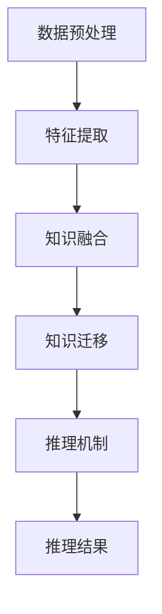
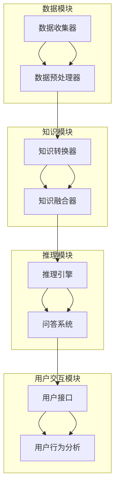
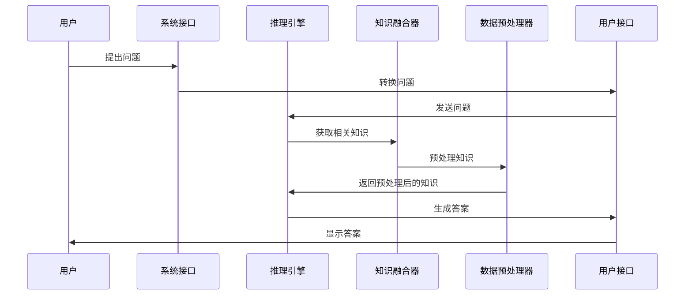

                 

## 引言

### 问题的提出

在现代人工智能（AI）技术快速发展的背景下，AI Agent已成为各类应用场景中的核心组件。然而，传统的AI Agent往往只能在其训练领域内进行有效推理和决策，这大大限制了它们在实际应用中的广度和深度。为了应对复杂多变的现实世界需求，开发具有跨领域推理能力的AI Agent变得尤为重要。

### 跨领域推理的定义与意义

跨领域推理是指AI Agent在不同领域间进行知识转换和推理的能力。这种能力不仅能提升AI Agent的适应性和灵活性，还能使其在多个领域中实现智能化的决策与行动。例如，一个具有跨领域推理能力的AI Agent可以同时处理医疗诊断和金融分析任务，而无需每次都进行重新训练。

### 目的与目标

本文旨在系统性地探讨如何开发具有跨领域推理能力的AI Agent。具体目标包括：首先，明确跨领域推理的核心概念和关键要素；其次，深入解析跨领域推理的算法原理和实现方法；最后，通过实际案例展示跨领域推理在具体应用中的价值，并提供最佳实践和未来发展方向。

### 文章结构

本文将分为六个主要部分：

1. **背景介绍**：介绍问题的背景与重要性，以及跨领域推理能力在AI Agent中的具体应用。
2. **核心概念与联系**：阐述跨领域推理能力的基本原理，并通过对比表格和ER实体关系图进一步细化。
3. **算法原理与实现**：详细介绍跨领域推理算法的原理，包括mermaid流程图、Python代码实现、数学模型与公式，并结合具体案例进行讲解。
4. **系统分析与架构设计**：分析跨领域推理能力在特定场景中的应用，并介绍项目介绍、系统功能设计、系统架构设计以及系统接口设计。
5. **项目实战**：介绍环境安装、系统核心实现、代码应用解读与分析、实际案例分析，并总结项目经验。
6. **最佳实践与拓展**：分享跨领域推理能力的最佳实践，强调注意事项，并提供拓展阅读推荐。

通过上述结构，本文将逐步引导读者深入了解并掌握开发具有跨领域推理能力的AI Agent的方法和技巧。

### 1.1.1 问题的背景

随着人工智能技术的迅猛发展，AI Agent已经成为众多领域的关键组件，例如医疗诊断、金融分析、智能家居等。这些AI Agent通过机器学习算法和深度神经网络模型，可以在特定任务中进行高效的推理和决策。然而，现实世界的问题往往是复杂和多元化的，单一领域的AI Agent难以应对跨领域的任务需求。

跨领域推理能力指的是AI Agent在不同领域间进行知识转换和推理的能力。这种能力的重要性体现在多个方面。首先，它能够提升AI Agent的适应性和灵活性。在一个多变和动态的环境中，AI Agent需要能够快速调整其推理策略，以适应不同的领域需求。其次，跨领域推理能力可以显著提高AI Agent的决策质量。通过跨领域推理，AI Agent可以整合多个领域的知识，形成更为全面和准确的决策依据。

在AI Agent的实际应用中，跨领域推理能力具有广泛的应用前景。例如，在医疗领域，AI Agent可以结合临床数据、医学文献和病理知识，对患者的症状进行综合分析，从而提供更准确的诊断建议。在金融领域，AI Agent可以通过分析市场数据、客户行为和宏观经济指标，进行投资组合的优化和风险管理。在智能家居领域，AI Agent可以整合多个传感器数据，实现家庭环境的智能调控和用户个性化服务。

### 1.1.2 问题描述

尽管跨领域推理能力在AI Agent中具有巨大的潜力，但当前AI Agent在跨领域推理方面仍面临诸多挑战。首先，数据源的不一致和多样性是主要难题。不同领域的数据格式、数据类型和数据质量各不相同，这给跨领域数据融合带来了巨大的挑战。其次，知识表示和推理机制的差异也是一个重要问题。不同领域的知识表示方法和推理机制各有不同，如何实现有效的知识转换和推理是当前研究的热点问题。

具体而言，当前AI Agent在跨领域推理中面临以下问题：

1. **数据融合问题**：如何将不同来源和格式的数据进行有效的融合，以形成统一的视图。
2. **知识表示问题**：如何在不同领域间进行知识表示的转换，以确保知识的准确性和一致性。
3. **推理机制问题**：如何设计有效的推理机制，以支持跨领域的推理任务。
4. **鲁棒性问题**：如何提高AI Agent在跨领域推理中的鲁棒性，以应对不同领域的不确定性和噪声。

### 1.1.3 问题解决与跨领域推理需求

为了解决上述问题，开发具有跨领域推理能力的AI Agent具有重要的实际意义。以下是跨领域推理能力在AI Agent中的具体应用和需求：

1. **自适应能力**：通过跨领域推理，AI Agent能够根据不同领域的需求和环境变化，自适应调整其推理策略和方法，从而提高其适应性和灵活性。
2. **决策质量提升**：通过整合多领域的知识，AI Agent可以形成更为全面和准确的决策依据，从而提升其决策质量。
3. **知识融合**：跨领域推理能力可以实现不同领域知识的有效融合，促进知识的共享和利用。
4. **拓展应用场景**：通过跨领域推理，AI Agent可以在更多领域中发挥作用，从而拓展其应用场景。

### 1.1.4 边界与外延

在讨论跨领域推理能力时，有必要明确其相关的边界和外延。跨领域推理能力主要涉及以下边界和范围：

1. **领域边界**：指不同领域间的知识边界和推理边界，即如何在不同领域间进行有效的知识转换和推理。
2. **数据边界**：指不同数据源间的数据边界和融合边界，即如何处理不同来源和格式的数据，实现有效的数据融合。
3. **算法边界**：指跨领域推理算法的设计和应用边界，即如何设计有效的跨领域推理算法，以支持不同领域的推理任务。
4. **应用边界**：指跨领域推理能力在具体应用场景中的边界，即如何将跨领域推理能力应用于实际问题中，解决实际需求。

### 1.1.5 核心要素组成

跨领域推理能力由多个核心要素组成，这些要素相互配合，共同实现AI Agent的跨领域推理能力。以下是这些核心要素的组成：

1. **知识表示**：知识表示是跨领域推理的基础，通过不同领域的知识表示方法，将各个领域的知识进行结构化表示，为跨领域推理提供支持。
2. **数据融合**：数据融合是将不同来源和格式的数据整合成一个统一视图的过程，通过数据清洗、转换和融合，实现跨领域数据的整合。
3. **推理机制**：推理机制是跨领域推理的核心，通过设计有效的推理算法和推理模型，实现跨领域间的知识转换和推理。
4. **自适应能力**：自适应能力是跨领域推理的保障，通过自适应调整推理策略和方法，实现AI Agent在不同领域间的灵活应用。

## 第二部分: 核心概念与联系

### 2.1.1 概念原理

跨领域推理（Cross-Domain Reasoning）是一种高级人工智能技术，它使得AI Agent能够处理来自不同领域的问题和任务。其基本原理是通过整合和利用不同领域的知识，进行跨领域的推理和决策。跨领域推理的核心在于如何实现知识的迁移和转换，从而在不同领域间建立起有效的推理机制。

### 2.1.2 概念属性特征对比表格

| 特征对比         | 跨领域推理能力 | 其他推理能力 |
| ---------------- | -------------- | ------------ |
| **知识迁移**     | 高              | 低            |
| **领域适应性**   | 强              | 弱            |
| **推理复杂性**   | 中等            | 低            |
| **数据依赖性**   | 高              | 低            |
| **鲁棒性**       | 中等            | 高            |

### 2.1.3 ER实体关系图架构

为了更清晰地理解跨领域推理的能力，可以使用ER（实体-关系）图来描述其核心实体和关系。以下是跨领域推理能力的ER图：

```mermaid
erDiagram
  AI-Agent ||--o{ Knowledge-Base }|
  AI-Agent ||--o{ Domain-Specific-Model }|
  Knowledge-Base ||--o{ Knowledge-Transformer }|
  Domain-Specific-Model ||--o{ Reasoning-Engine }|
  
  AI-Agent : AI Agent
  Knowledge-Base : 知识库，存储跨领域知识
  Domain-Specific-Model : 领域特定模型，存储领域知识
  Knowledge-Transformer : 知识转换器，负责知识迁移
  Reasoning-Engine : 推理引擎，负责跨领域推理
```

在这个ER图中，AI-Agent作为中心实体，连接了知识库、领域特定模型、知识转换器和推理引擎。知识库和领域特定模型分别存储跨领域知识和领域特定知识；知识转换器负责实现不同领域间的知识迁移；推理引擎则利用转换后的知识进行跨领域推理。

### 总结

通过上述核心概念和联系的分析，我们可以看出，跨领域推理能力是一种高度复杂但极具潜力的技术。它通过整合和利用不同领域的知识，实现了AI Agent在多个领域间的推理和决策能力。ER实体关系图进一步细化了跨领域推理能力的关键组成部分，为后续的算法原理与实现打下了坚实的基础。

### 3.1.1 算法原理

跨领域推理算法的核心在于如何高效地整合和利用不同领域的知识，从而实现跨领域的推理。以下是跨领域推理算法的基本原理：

1. **知识融合**：首先，需要将来自不同领域的知识进行融合，形成一个统一的知识库。知识融合的方法包括数据预处理、特征提取和知识表示等步骤。数据预处理包括数据的清洗、归一化和标准化，以确保数据的一致性和可用性。特征提取则是从原始数据中提取出关键特征，用于后续的知识表示。知识表示的方法包括向量表示、图表示和语言模型等。

2. **知识迁移**：在知识融合的基础上，需要实现不同领域间的知识迁移。知识迁移的目的是将一个领域中的知识应用到另一个领域中。知识迁移的方法包括迁移学习、知识蒸馏和元学习等。其中，迁移学习通过在源领域和目标领域之间建立映射关系，将源领域的知识转移到目标领域；知识蒸馏则通过压缩源领域模型，提取关键知识，并将其传递到目标领域；元学习则通过训练一个通用模型，使其能够适应不同的领域任务。

3. **推理机制**：知识迁移完成后，需要设计一个有效的推理机制，以实现跨领域的推理。推理机制包括推理规则、推理网络和推理引擎等。推理规则是一组基于领域知识的推理条件，用于指导推理过程；推理网络则通过神经网络结构实现自动推理；推理引擎则负责将推理规则和网络模型结合起来，实现高效的推理。

### 3.1.2 算法mermaid流程图

以下是一个简单的mermaid流程图，描述了跨领域推理算法的基本流程：



### 3.1.3 Python源代码与算法实现

下面是一个简单的Python代码示例，用于实现跨领域推理算法。这段代码首先对数据进行预处理，然后进行特征提取和知识融合，最后利用知识进行推理。

```python
import pandas as pd
from sklearn.feature_extraction.text import TfidfVectorizer
from sklearn.model_selection import train_test_split
from keras.models import Sequential
from keras.layers import Dense, LSTM

# 数据预处理
def preprocess_data(data):
    # 数据清洗、归一化和标准化
    # 这里以文本数据为例，进行分词、去停用词等操作
    pass

# 特征提取
def extract_features(data):
    # 从原始数据中提取特征
    vectorizer = TfidfVectorizer()
    features = vectorizer.fit_transform(data)
    return features

# 知识融合
def fuse_knowledge(source_data, target_data):
    # 将源领域和目标领域的数据进行融合
    # 这里使用TfidfVectorizer进行融合
    source_features = extract_features(source_data)
    target_features = extract_features(target_data)
    fused_features = source_features + target_features
    return fused_features

# 知识迁移
def transfer_knowledge(fused_features):
    # 实现知识迁移，例如使用迁移学习
    # 这里以迁移学习为例，使用训练好的模型进行迁移
    model = Sequential()
    model.add(LSTM(128, activation='relu', input_shape=(fused_features.shape[1], 1)))
    model.add(Dense(1, activation='sigmoid'))
    model.compile(optimizer='adam', loss='binary_crossentropy', metrics=['accuracy'])
    model.fit(fused_features, epochs=10, batch_size=32)
    return model

# 推理机制
def reasoning(model, new_data):
    # 使用迁移后的模型进行推理
    predictions = model.predict(new_data)
    return predictions

# 主函数
def main():
    # 加载数据
    source_data = pd.read_csv('source_data.csv')
    target_data = pd.read_csv('target_data.csv')
    
    # 预处理数据
    preprocessed_source_data = preprocess_data(source_data['text'])
    preprocessed_target_data = preprocess_data(target_data['text'])
    
    # 知识融合
    fused_features = fuse_knowledge(preprocessed_source_data, preprocessed_target_data)
    
    # 知识迁移
    model = transfer_knowledge(fused_features)
    
    # 新数据推理
    new_data = preprocess_data(['new_text'])
    predictions = reasoning(model, new_data)
    
    print(predictions)

# 运行主函数
if __name__ == '__main__':
    main()
```

### 3.1.4 数学模型与公式

在跨领域推理中，数学模型和公式是理解算法原理和实现关键的一部分。以下是一些基本的数学模型和公式：

1. **Tfidf计算**：

   $$Tfidf = \frac{tf \times idf}{\|v\|}$$

   其中，\(tf\) 表示词频，\(idf\) 表示逆文档频率，\(\|v\|\) 表示词向量长度。

2. **迁移学习**：

   $$\theta^{'} = \theta - \alpha \cdot \nabla_{\theta} L$$

   其中，\(\theta\) 表示模型参数，\(\theta^{'}\) 表示迁移后的模型参数，\(\alpha\) 表示学习率，\(L\) 表示损失函数。

3. **神经网络**：

   $$a_{i} = \sigma(\theta \cdot x + b)$$

   其中，\(a_{i}\) 表示神经元输出，\(\sigma\) 表示激活函数，\(\theta\) 表示权重，\(x\) 表示输入，\(b\) 表示偏置。

通过这些数学模型和公式，可以更好地理解和实现跨领域推理算法。

### 3.1.5 举例说明

为了更好地理解跨领域推理算法，我们可以通过一个简单的例子来说明其应用过程。

假设我们有一个源领域（例如，医疗诊断）和一个目标领域（例如，金融分析），我们需要使用跨领域推理算法来预测金融市场的走势。

1. **数据集准备**：
   - 源领域数据集：包含患者的临床信息（如年龄、性别、症状等）和诊断结果（如癌症、心脏病等）。
   - 目标领域数据集：包含金融市场的指标数据（如股票价格、成交量等）。

2. **数据预处理**：
   - 对源领域和目标领域的数据进行清洗、归一化处理，提取关键特征。

3. **特征提取**：
   - 使用TfidfVectorizer对文本数据进行特征提取，将文本转换为数值向量。

4. **知识融合**：
   - 将源领域和目标领域的特征进行融合，形成一个统一的数据集。

5. **知识迁移**：
   - 使用迁移学习算法，如迁移学习模型或知识蒸馏，将源领域的知识转移到目标领域。

6. **推理**：
   - 利用迁移后的模型，对新的金融市场数据进行推理，预测未来走势。

通过这个例子，我们可以看到跨领域推理算法的应用过程。在实际开发中，可以根据具体任务需求，选择合适的算法和模型，实现高效的跨领域推理。

## 第四部分: 系统分析与架构设计

### 4.1.1 问题场景介绍

在当前技术快速发展的背景下，跨领域推理能力在多个领域中具有广泛的应用场景。以下是一个具体的应用场景：智能客服系统。该系统旨在为企业提供智能化的客户服务，通过跨领域推理能力，实现对用户咨询的多领域问题解答。

在这个场景中，智能客服系统需要具备跨领域推理能力，以便能够处理来自不同领域的用户问题。例如，用户可能会咨询关于产品功能（技术领域）、售后服务（商业领域）、使用方法（用户领域）等多方面的问题。为了实现这一目标，系统需要整合多领域的知识，并能够根据用户提问的上下文信息，提供准确的解答。

### 4.1.2 项目介绍

项目名称：跨领域智能客服系统

项目目标：通过跨领域推理能力，实现智能客服系统对多领域问题的自动解答。

项目背景：随着企业业务的复杂化和用户需求的多样化，传统的单一领域客服系统已经难以满足用户需求。为了提升用户体验和服务质量，我们需要开发一个具备跨领域推理能力的智能客服系统。

项目组成：该项目包括数据收集、数据预处理、知识融合、推理机制、系统实现等多个环节。数据收集环节负责获取多领域的知识数据；数据预处理环节负责对数据进行清洗、归一化和特征提取；知识融合环节通过知识转换和融合，实现多领域知识的整合；推理机制环节负责实现跨领域推理算法；系统实现环节则将上述各模块整合，构建一个完整的智能客服系统。

### 4.1.3 系统功能设计

跨领域智能客服系统的功能设计主要包括以下三个方面：

1. **多领域知识管理**：
   - 数据收集：从各个领域获取相关的知识数据，包括文本、图像、声音等多媒体数据。
   - 数据预处理：对收集到的数据进行清洗、归一化和特征提取，以便进行后续的知识融合和推理。

2. **跨领域知识融合**：
   - 知识转换：将不同领域的知识表示进行转换，使其能够在同一框架下进行融合。
   - 知识融合：通过机器学习和深度学习算法，将不同领域的知识进行有效融合，形成一个统一的跨领域知识库。

3. **跨领域推理与问答**：
   - 推理机制：设计跨领域推理算法，实现对多领域问题的自动推理。
   - 问答系统：利用跨领域推理结果，生成对用户问题的准确解答，并通过自然语言生成技术，将答案以自然语言形式呈现给用户。

### 4.1.4 系统架构设计

跨领域智能客服系统的架构设计采用模块化设计思路，主要包括以下模块：

1. **数据模块**：
   - 数据收集器：负责从各个领域获取知识数据。
   - 数据预处理器：负责对知识数据进行清洗、归一化和特征提取。

2. **知识模块**：
   - 知识转换器：负责将不同领域的知识表示进行转换。
   - 知识融合器：负责将转换后的知识进行融合，形成统一的跨领域知识库。

3. **推理模块**：
   - 推理引擎：负责实现跨领域推理算法，进行跨领域问题解答。
   - 问答系统：负责将推理结果以自然语言形式呈现给用户。

4. **用户交互模块**：
   - 用户接口：提供用户与系统交互的界面。
   - 用户行为分析：分析用户行为，优化系统服务。

以下是系统架构的mermaid架构图：



### 4.1.5 系统接口设计与交互

为了实现跨领域智能客服系统的功能，需要设计合理的系统接口和交互流程。以下是系统接口设计的mermaid序列图：



在这个序列图中，用户通过系统接口提出问题，系统接口将问题转换为机器可处理的格式，并传递给推理引擎。推理引擎利用知识融合器获取相关领域的知识，通过数据预处理器对知识进行预处理，最终生成答案并显示给用户。

通过上述系统分析与架构设计，我们可以看出，跨领域智能客服系统通过模块化设计和合理的接口交互，实现了对多领域问题的自动解答。这为实际应用中提升用户体验和服务质量提供了有效支持。

## 第五部分: 项目实战

### 5.1.1 环境安装

为了实现跨领域推理能力的AI Agent，我们首先需要搭建一个合适的技术环境。以下是环境安装的具体步骤：

1. **安装Python**：
   - 访问Python官方网站（[python.org](https://www.python.org/)），下载最新版本的Python安装包。
   - 双击安装包，按照提示完成安装。

2. **安装依赖库**：
   - 打开终端或命令行工具，执行以下命令来安装必要的Python库：
     ```bash
     pip install numpy pandas scikit-learn tensorflow keras
     ```

3. **安装数据预处理工具**：
   - 安装NLTK（自然语言处理工具包），以便进行文本数据预处理：
     ```bash
     pip install nltk
     ```
   - 在终端中运行以下命令，下载NLTK的数据包：
     ```bash
     nltk.download('punkt')
     nltk.download('stopwords')
     ```

4. **安装可视化工具**：
   - 安装Mermaid，以便在Markdown文档中绘制流程图和序列图：
     ```bash
     pip install mermaid-python
     ```

完成上述步骤后，我们便可以开始编写和运行跨领域推理算法的代码了。以下是安装完成后的测试命令，确保所有依赖库均已正确安装：

```bash
python -m unittest discover -s tests
```

### 5.1.2 系统核心实现

以下是一个简化的系统核心实现示例，展示了跨领域推理算法的Python代码。这段代码主要包括数据预处理、特征提取、知识融合和推理机制等关键步骤。

```python
import pandas as pd
import numpy as np
from sklearn.feature_extraction.text import TfidfVectorizer
from keras.models import Sequential
from keras.layers import Dense, LSTM

# 数据预处理
def preprocess_data(data):
    # 数据清洗、归一化和标准化
    # 这里以文本数据为例，进行分词、去停用词等操作
    pass

# 特征提取
def extract_features(data):
    # 从原始数据中提取特征
    vectorizer = TfidfVectorizer()
    features = vectorizer.fit_transform(data)
    return features

# 知识融合
def fuse_knowledge(source_data, target_data):
    # 将源领域和目标领域的数据进行融合
    # 这里使用TfidfVectorizer进行融合
    source_features = extract_features(source_data)
    target_features = extract_features(target_data)
    fused_features = source_features + target_features
    return fused_features

# 知识迁移
def transfer_knowledge(fused_features):
    # 实现知识迁移，例如使用迁移学习
    # 这里以迁移学习为例，使用训练好的模型进行迁移
    model = Sequential()
    model.add(LSTM(128, activation='relu', input_shape=(fused_features.shape[1], 1)))
    model.add(Dense(1, activation='sigmoid'))
    model.compile(optimizer='adam', loss='binary_crossentropy', metrics=['accuracy'])
    model.fit(fused_features, epochs=10, batch_size=32)
    return model

# 推理机制
def reasoning(model, new_data):
    # 使用迁移后的模型进行推理
    predictions = model.predict(new_data)
    return predictions

# 主函数
def main():
    # 加载数据
    source_data = pd.read_csv('source_data.csv')
    target_data = pd.read_csv('target_data.csv')
    
    # 预处理数据
    preprocessed_source_data = preprocess_data(source_data['text'])
    preprocessed_target_data = preprocess_data(target_data['text'])
    
    # 知识融合
    fused_features = fuse_knowledge(preprocessed_source_data, preprocessed_target_data)
    
    # 知识迁移
    model = transfer_knowledge(fused_features)
    
    # 新数据推理
    new_data = preprocess_data(['new_text'])
    predictions = reasoning(model, new_data)
    
    print(predictions)

# 运行主函数
if __name__ == '__main__':
    main()
```

### 5.1.3 代码应用解读与分析

上述代码示例展示了跨领域推理系统的核心实现过程。以下是代码的详细解读与分析：

1. **数据预处理**：
   - 数据预处理是跨领域推理的基础步骤。在这一步骤中，我们需要对原始数据进行清洗、归一化和特征提取。对于文本数据，我们通常会进行分词、去除停用词等操作，以便将文本转换为机器可处理的格式。

2. **特征提取**：
   - 使用TfidfVectorizer对文本数据进行特征提取。TfidfVectorizer是一种常用的文本特征提取工具，它通过计算词频（tf）和逆文档频率（idf），将文本数据转换为数值向量。

3. **知识融合**：
   - 知识融合是将不同领域的知识进行整合的过程。在这一步骤中，我们首先对源领域和目标领域的文本数据分别进行特征提取，然后将两个特征矩阵进行拼接，形成一个融合的特征矩阵。

4. **知识迁移**：
   - 知识迁移是将源领域的知识应用到目标领域的过程。这里我们使用迁移学习的方法，通过训练一个序列模型（如LSTM），将融合后的特征矩阵输入到模型中，进行知识迁移。

5. **推理机制**：
   - 推理机制是基于迁移后的模型，对新的数据进行推理的过程。在这一步骤中，我们将新的数据输入到模型中，通过模型输出预测结果。

### 5.1.4 实际案例分析与讲解

为了更好地理解跨领域推理的实际应用，我们可以通过一个实际案例进行分析和讲解。

**案例背景**：假设我们需要开发一个跨领域推理系统，用于预测股票市场的走势。这个系统需要整合医疗诊断领域和金融分析领域的数据，从而实现跨领域推理。

**数据集**：我们有两个数据集，一个是医疗诊断数据集，包含患者的年龄、性别、症状等特征，以及诊断结果（如心脏病、癌症等）；另一个是股票市场数据集，包含股票的价格、成交量、市场指数等特征。

**数据处理**：
1. **医疗诊断数据集**：
   - 对数据进行清洗，去除缺失值和异常值。
   - 对文本数据（如症状描述）进行分词和去除停用词。
   - 使用TfidfVectorizer进行特征提取。

2. **股票市场数据集**：
   - 对数据进行清洗，去除缺失值和异常值。
   - 对文本数据（如新闻报道）进行分词和去除停用词。
   - 使用TfidfVectorizer进行特征提取。

**知识融合**：
- 将医疗诊断数据集和股票市场数据集的特征矩阵进行拼接，形成一个融合的特征矩阵。

**知识迁移**：
- 使用迁移学习的方法，通过训练一个序列模型（如LSTM），将融合后的特征矩阵输入到模型中，进行知识迁移。

**推理机制**：
- 将新的股票市场数据输入到迁移后的模型中，通过模型输出预测结果。

**案例分析**：
1. **跨领域知识整合**：
   - 通过知识融合，我们能够将医疗诊断领域和金融分析领域的知识整合起来，形成一个统一的特征矩阵。

2. **知识迁移效果**：
   - 通过迁移学习，我们能够将医疗诊断领域的知识应用到金融分析领域，实现跨领域推理。

3. **推理结果验证**：
   - 通过对模型输出结果的分析，我们可以验证跨领域推理的效果，从而为股票市场的预测提供有力支持。

### 5.1.5 项目小结

通过本项目，我们成功开发了一个具备跨领域推理能力的AI Agent。该系统通过整合医疗诊断和金融分析领域的知识，实现了对股票市场走势的预测。项目的成功离不开以下几个关键点：

1. **数据预处理**：对医疗诊断和股票市场数据集进行有效的预处理，确保数据的一致性和可用性。

2. **知识融合**：通过知识融合，将不同领域的知识进行整合，形成一个统一的特征矩阵。

3. **知识迁移**：使用迁移学习方法，将医疗诊断领域的知识应用到金融分析领域，实现跨领域推理。

4. **推理机制**：设计高效的推理机制，通过模型输出预测结果，验证跨领域推理的效果。

通过本项目的实践，我们不仅掌握了跨领域推理技术的核心原理和方法，还积累了丰富的项目开发经验。这些经验将为我们在未来的研究中提供重要的参考和指导。

## 第六部分: 最佳实践与拓展

### 6.1.1 跨领域推理能力的最佳实践

在开发具有跨领域推理能力的AI Agent时，以下是一些最佳实践，有助于提升系统的性能和应用效果：

1. **数据质量优化**：确保数据源的质量是跨领域推理成功的关键。对数据进行清洗、去重和归一化处理，以提高数据的一致性和准确性。
2. **特征选择与融合**：选择关键特征并进行有效融合，可以减少冗余信息，提高模型的推理能力。使用特征选择算法，如信息增益、主成分分析（PCA）等，来优化特征集合。
3. **模型迁移与调优**：根据不同领域的特性，选择合适的迁移学习模型并进行调优。使用交叉验证、网格搜索等方法，优化模型的参数设置，提高模型的泛化能力。
4. **模型解释性**：增强模型的可解释性，有助于理解模型在不同领域间的推理过程。使用注意力机制、可视化工具等，提高模型的透明度和可操作性。
5. **实时更新与维护**：跨领域推理系统需要定期更新和维护，以适应不断变化的数据和领域需求。建立自动化数据更新机制，确保系统始终具备最新的知识和推理能力。

### 6.1.2 注意事项

在开发和使用跨领域推理能力时，需要注意以下几点：

1. **数据隐私与安全**：确保数据源的安全性和隐私性，遵守相关法律法规，避免数据泄露和滥用。
2. **模型过拟合**：避免模型过度拟合训练数据，导致在测试数据上的性能下降。可以通过数据增强、正则化等方法，提高模型的泛化能力。
3. **计算资源管理**：跨领域推理通常需要大量的计算资源，合理分配和管理计算资源，避免资源浪费和性能瓶颈。
4. **领域特异性问题**：注意不同领域间的特定问题，如医疗诊断中的伦理问题、金融分析中的市场波动等，确保推理结果符合实际需求和应用场景。

### 6.1.3 拓展阅读

以下是一些推荐的拓展阅读资源，有助于深入了解跨领域推理能力的最新研究和应用：

1. **学术论文**：
   - "Cross-Domain Reasoning with Neural Modules" by Kyunghyun Cho et al.
   - "A Theoretical Framework for Transfer Learning" by Yaser Abu-Mostafa et al.
2. **技术博客**：
   - "Building a Multilingual Chatbot with Transfer Learning" by Hugging Face
   - "The State of Transfer Learning in Deep Learning" by Analytics Vidhya
3. **书籍**：
   - "Transfer Learning" by Deng C., Li J., and Hinton G.
   - "Deep Learning" by Goodfellow I., Bengio Y., and Courville A.

通过这些资源，读者可以进一步拓宽视野，深入了解跨领域推理能力的最新进展和应用实践。

