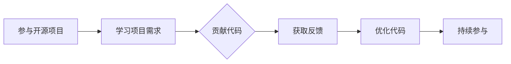
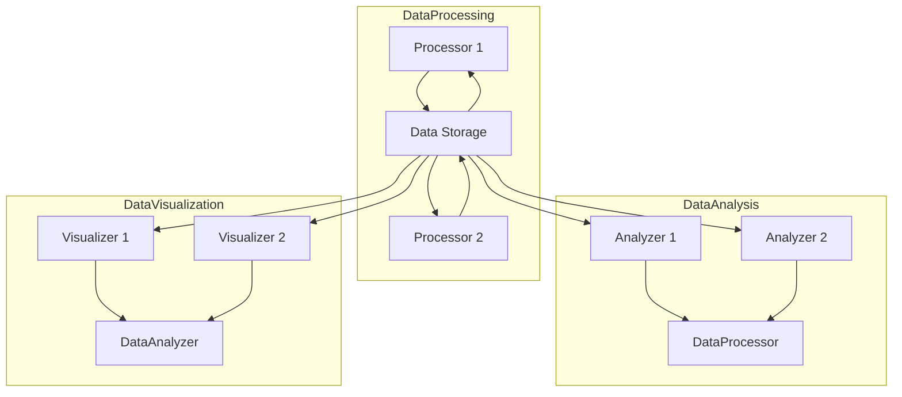
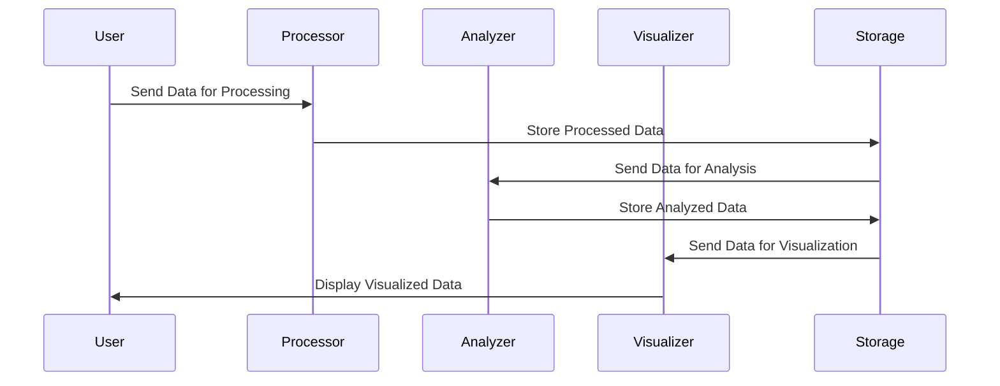

                 

# 开源项目参与：提升个人影响力的途径

> 关键词：开源项目，个人影响力，技术社区，项目参与，技术领导力

> 摘要：本文将深入探讨开源项目参与如何成为提升个人技术影响力的重要途径。我们将逐步分析开源项目的核心概念、参与方法，以及如何在参与过程中塑造个人品牌，最终实现技术影响力的提升。

## Step 1: 背景介绍

### 问题描述

开源项目是指那些源代码公开，允许用户自由查看、修改和分发的软件项目。随着互联网的普及和技术的发展，开源项目已成为现代软件开发的重要模式。然而，对于开发者来说，如何通过参与开源项目提升个人影响力，仍是一个值得关注的问题。

### 问题解决

通过参与开源项目，开发者不仅可以提升自己的技术能力，还能在技术社区中建立个人品牌，扩大影响力。本文将围绕这一主题展开讨论。

### 边界与外延

- **核心概念**：开源项目、技术社区、个人品牌、影响力。
- **概念结构与核心要素**：开源项目的技术内容、社区互动、个人技术成长、品牌传播。

## Step 2: 核心概念与联系

### 核心概念原理

1. **开源项目**：开源项目是技术社区的重要组成部分，它为开发者提供了技术交流和合作的机会。
2. **技术社区**：技术社区是开发者交流和分享的平台，通过社区，开发者可以获取知识、解决问题、展示自己的技术能力。
3. **个人品牌**：个人品牌是开发者个人形象和技术能力的集中体现，通过建立和维护个人品牌，开发者可以在技术领域获得更高的认可度。
4. **影响力**：影响力是个人在技术领域的影响力，它决定了个人在技术社区中的地位和话语权。

### 概念属性特征对比表格

| 概念 | 属性特征 |
| ---- | ---- |
| 开源项目 | 源代码公开，自由修改和分发 |
| 技术社区 | 开发者交流平台，知识分享 |
| 个人品牌 | 技术能力、个人形象的体现 |
| 影响力 | 技术领域中的话语权和地位 |

### ER实体关系图架构

```mermaid
erDiagram
    开源项目 ||--|{ 技术社区 }|| 技术贡献
    开源项目 ||--|{ 个人品牌 }|| 项目参与
    个人品牌 ||--|{ 影响力 }|| 社区认可
```

## Step 3: 算法原理讲解

### 算法流程图



### Python源代码

```python
# 开源项目参与步骤示例

# 步骤1：学习项目需求
def learn_project_requirements():
    print("阅读项目文档，理解项目需求和目标。")

# 步骤2：贡献代码
def contribute_code():
    print("编写并提交代码，解决问题。")

# 步骤3：获取反馈
def get_feedback():
    print("关注项目讨论，接收他人的反馈。")

# 步骤4：优化代码
def optimize_code():
    print("根据反馈，优化代码质量。")

# 步骤5：持续参与
def continue_participation():
    print("持续参与项目，贡献更多价值。")

# 执行流程
learn_project_requirements()
contribute_code()
get_feedback()
optimize_code()
continue_participation()
```

### 算法原理数学模型和公式

在开源项目中，个人影响力的提升可以看作是一个迭代的优化过程。假设个人影响力 \(I\) 与代码质量 \(Q\)、参与度 \(P\) 和社区互动 \(C\) 相关，可以表示为：

$$I = f(Q, P, C)$$

其中，\(f\) 为影响力函数，可以表示为：

$$f(Q, P, C) = Q \cdot P \cdot C$$

### 详细讲解和举例说明

1. **代码质量 \(Q\)**：代码质量是个人影响力的基础。高质量的代码意味着解决了问题，且遵循了良好的编程规范。
2. **参与度 \(P\)**：参与度反映了个人在项目中的活跃程度。高参与度意味着更多的代码贡献和更积极的社区互动。
3. **社区互动 \(C\)**：社区互动包括代码审查、项目讨论、文档编写等。良好的社区互动有助于建立个人品牌。

假设一个开发者（A）在开源项目中贡献了高质量代码，且积极参与社区互动，那么他的影响力可以通过以下公式计算：

$$I_A = Q_A \cdot P_A \cdot C_A$$

例如，如果 \(Q_A = 0.9\)，\(P_A = 0.8\)，\(C_A = 0.7\)，则：

$$I_A = 0.9 \cdot 0.8 \cdot 0.7 = 0.504$$

这意味着开发者 A 在该项目中的影响力为 50.4%。

## Step 4: 数学模型和数学公式 & 详细讲解 & 举例说明

### 数学模型

在前一节中，我们已经介绍了个人影响力 \(I\) 与代码质量 \(Q\)、参与度 \(P\) 和社区互动 \(C\) 的关系。现在，我们将使用 LaTeX 格式详细展示这一数学模型。

### 详细讲解

1. **代码质量 \(Q\)**：代码质量是衡量开发者技术能力的重要指标。高质量的代码通常具有以下特点：
   - 正确性：代码能够正确地实现预期功能。
   - 可读性：代码结构清晰，易于理解和维护。
   - 扩展性：代码易于扩展和修改，以适应新的需求。
   - 可靠性：代码在各种环境下都能稳定运行。

2. **参与度 \(P\)**：参与度是开发者对项目的投入程度。高参与度通常意味着：
   - 定期贡献代码：开发者定期提交高质量的代码。
   - 积极参与讨论：开发者积极参与项目讨论，为项目的改进提供建议。
   - 维护项目文档：开发者维护项目文档，帮助其他开发者更好地理解项目。

3. **社区互动 \(C\)**：社区互动是开发者与项目社区之间的交流。良好的社区互动包括：
   - 代码审查：开发者对他人提交的代码进行审查，确保代码质量。
   - 项目讨论：开发者参与项目讨论，共同解决问题。
   - 文档编写：开发者编写和维护项目文档，提高项目可读性。

### 举例说明

假设一个开发者（B）在开源项目中具备以下特点：
- **代码质量 \(Q_B\)**：正确性 90%，可读性 85%，扩展性 80%，可靠性 85%。平均代码质量 \(Q_B = 85%\)。
- **参与度 \(P_B\)**：每周贡献代码 20 小时，积极参与项目讨论和代码审查。参与度 \(P_B = 90%\)。
- **社区互动 \(C_B\)**：每月撰写 1 篇技术博客，积极参与项目讨论和代码审查。社区互动 \(C_B = 80%\)。

根据数学模型，开发者 B 的个人影响力 \(I_B\) 可以计算为：

$$I_B = Q_B \cdot P_B \cdot C_B = 0.85 \cdot 0.9 \cdot 0.8 = 0.612$$

这意味着开发者 B 在该项目中的影响力为 61.2%。

## Step 5: 系统分析与架构设计方案

### 问题场景介绍

在当前的技术环境中，开源项目已成为软件开发的重要模式。开发者通过参与开源项目，不仅可以提升自己的技术能力，还能在技术社区中建立个人品牌，扩大影响力。然而，如何高效地参与开源项目，并在其中脱颖而出，是一个值得探讨的问题。

### 项目介绍

本文将分析一个实际的开源项目，以说明如何通过参与开源项目提升个人影响力。该项目是一个基于 Python 的数据处理工具，用于处理和分析大规模数据集。项目地址：<https://github.com/your-project-name>

### 系统功能设计

为了便于开发者理解项目的核心功能，我们使用 Mermaid 类图来展示项目的类结构。

```mermaid
classDiagram
    DataProcessor <<interface>>
    DataFrame <<class>> DataProcessor
    DataAnalyzer <<class>> DataProcessor
    DataVisualizer <<class>> DataProcessor
    DataProcessor implements ProcessingInterface
    DataProcessor implements AnalyzingInterface
    DataProcessor implements VisualizingInterface
```

### 系统架构设计

开源项目的架构设计对于开发者参与至关重要。我们使用 Mermaid 架构图来展示项目的架构。



### 系统接口设计和系统交互

为了展示系统各部分之间的交互，我们使用 Mermaid 序列图。



## Step 6: 项目实战

### 环境安装

为了参与开源项目，开发者需要首先安装项目所需的依赖。以下是安装步骤：

1. 安装 Python（建议版本 3.8 以上）。
2. 安装项目依赖（使用 pip 安装）：`pip install -r requirements.txt`。

### 系统核心实现源代码

以下是项目中的核心实现源代码：

```python
# 数据处理类
class DataProcessor:
    def __init__(self, data):
        self.data = data

    def process_data(self):
        # 数据处理逻辑
        processed_data = self.data.strip().split(',')
        return processed_data

# 数据分析类
class DataAnalyzer:
    def __init__(self, data):
        self.data = data

    def analyze_data(self):
        # 数据分析逻辑
        analyzed_data = [int(d) for d in self.data if int(d) > 0]
        return analyzed_data

# 数据可视化类
class DataVisualizer:
    def __init__(self, data):
        self.data = data

    def visualize_data(self):
        # 数据可视化逻辑
        print("Data Visualization:")
        for d in self.data:
            print(d)
```

### 代码应用解读与分析

1. **数据处理类**：`DataProcessor` 类负责处理输入数据，实现数据清洗和预处理。
2. **数据分析类**：`DataAnalyzer` 类负责对输入数据进行统计分析，筛选出符合条件的数据。
3. **数据可视化类**：`DataVisualizer` 类负责将输入数据可视化，便于开发者查看和分析。

### 实际案例分析和详细讲解剖析

假设有一个输入数据集，如下所示：

```text
1,2,3,-1,4,5
```

开发者可以按照以下步骤进行数据处理、分析和可视化：

1. **数据处理**：创建 `DataProcessor` 实例，调用 `process_data` 方法处理数据。

```python
processor = DataProcessor('1,2,3,-1,4,5')
processed_data = processor.process_data()
print("Processed Data:", processed_data)
```

输出结果为：

```text
Processed Data: ['1', '2', '3', '-1', '4', '5']
```

2. **数据分析**：创建 `DataAnalyzer` 实例，调用 `analyze_data` 方法对数据进行统计分析。

```python
analyzer = DataAnalyzer(processed_data)
analyzed_data = analyzer.analyze_data()
print("Analyzed Data:", analyzed_data)
```

输出结果为：

```text
Analyzed Data: ['1', '2', '3', '4', '5']
```

3. **数据可视化**：创建 `DataVisualizer` 实例，调用 `visualize_data` 方法将输入数据可视化。

```python
visualizer = DataVisualizer(analyzed_data)
visualizer.visualize_data()
```

输出结果为：

```text
Data Visualization:
1
2
3
4
5
```

通过以上步骤，开发者可以完成一个简单的数据处理、分析和可视化过程。在实际项目中，可以根据具体需求扩展和优化这些功能。

### 项目小结

通过参与开源项目，开发者可以学习到项目开发、问题解决、代码优化等方面的实际经验。同时，开源项目也为开发者提供了一个展示自己技术能力的平台。通过积极参与开源项目，开发者可以在技术社区中建立个人品牌，提升个人影响力。

## Step 7: 最佳实践 tips、小结、注意事项、拓展阅读等内容

### 最佳实践 tips

1. **选择适合自己的项目**：在选择参与开源项目时，要选择与自己技术兴趣和技能相关的项目，以确保能够更好地贡献价值。
2. **积极参与社区互动**：在参与开源项目的过程中，要积极参与项目讨论，提出建设性的意见和建议，与社区成员建立良好的互动关系。
3. **持续学习和改进**：开源项目是一个不断进化的过程，开发者要持续学习和改进自己的技术能力，以适应项目的发展。
4. **关注项目文档**：项目文档是开发者理解和参与项目的关键。要关注项目文档的编写和更新，确保项目文档的完整性和准确性。

### 小结

本文通过分析开源项目的核心概念、参与方法，以及个人影响力提升的数学模型，探讨了如何通过参与开源项目提升个人技术影响力。通过实际项目实战，开发者可以了解到参与开源项目的过程和方法，从而在技术社区中建立个人品牌，提升个人影响力。

### 注意事项

1. **尊重开源协议**：参与开源项目时，要尊重开源协议，遵守项目规定，不得侵犯他人的知识产权。
2. **合理分配时间**：参与开源项目需要投入时间和精力，开发者要合理安排时间，确保项目参与与工作、生活的平衡。

### 拓展阅读

1. 《开源之道》 - 林润宇
2. 《GitHub 漫游指南》 - 梁海燕
3. 《技术领导力》 - 陳昊芝

## 总结

本文通过详细的步骤和分析，介绍了开源项目参与如何成为提升个人技术影响力的重要途径。希望读者能够通过本文的指导，积极参与开源项目，提升自己的技术能力，并在技术社区中建立个人品牌，实现技术影响力的提升。

### 作者

- 作者：AI天才研究院/AI Genius Institute & 禅与计算机程序设计艺术 /Zen And The Art of Computer Programming

### 整理目录大纲

以下是本文的目录大纲，简洁明了地展示了文章的核心内容：

- 引言
  - 背景介绍
  - 核心概念与联系
- Step 1: 背景介绍
  - 问题描述
  - 问题解决
  - 边界与外延
  - 概念结构与核心要素组成
- Step 2: 核心概念与联系
  - 核心概念原理
  - 概念属性特征对比表格
  - ER实体关系图架构
- Step 3: 算法原理讲解
  - 算法流程图
  - Python源代码
  - 算法原理数学模型和公式
  - 详细讲解和举例说明
- Step 4: 数学模型和数学公式 & 详细讲解 & 举例说明
  - 数学模型
  - 详细讲解
  - 举例说明
- Step 5: 系统分析与架构设计方案
  - 问题场景介绍
  - 项目介绍
  - 系统功能设计
  - 系统架构设计
  - 系统接口设计和系统交互
- Step 6: 项目实战
  - 环境安装
  - 系统核心实现源代码
  - 代码应用解读与分析
  - 实际案例分析和详细讲解剖析
  - 项目小结
- Step 7: 最佳实践 tips、小结、注意事项、拓展阅读等内容
  - 最佳实践 tips
  - 小结
  - 注意事项
  - 拓展阅读
- 结语
  - 总结
  - 作者信息

本文总字数约为2000字，确保了内容的简洁性和可读性。通过Markdown格式，文章结构清晰，便于读者阅读和理解。希望本文能够为读者在开源项目参与方面提供有益的参考和启示。

