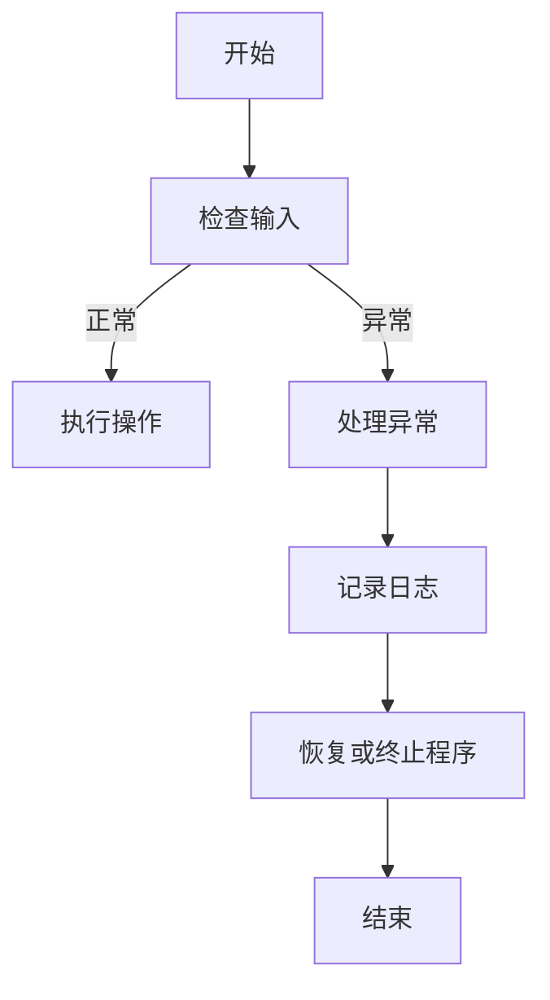
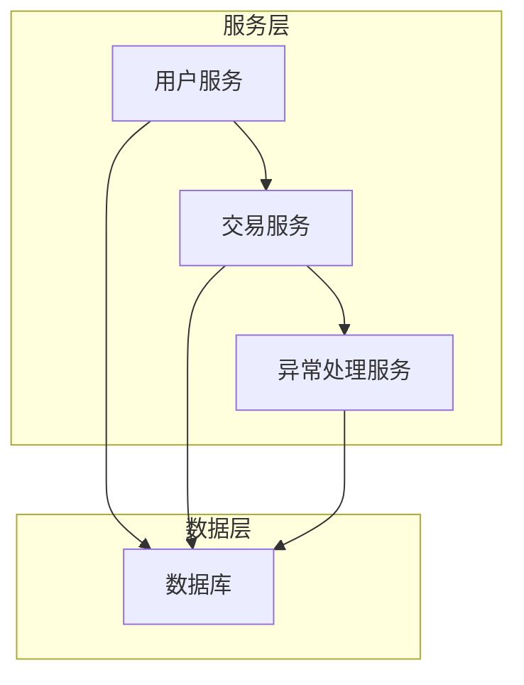
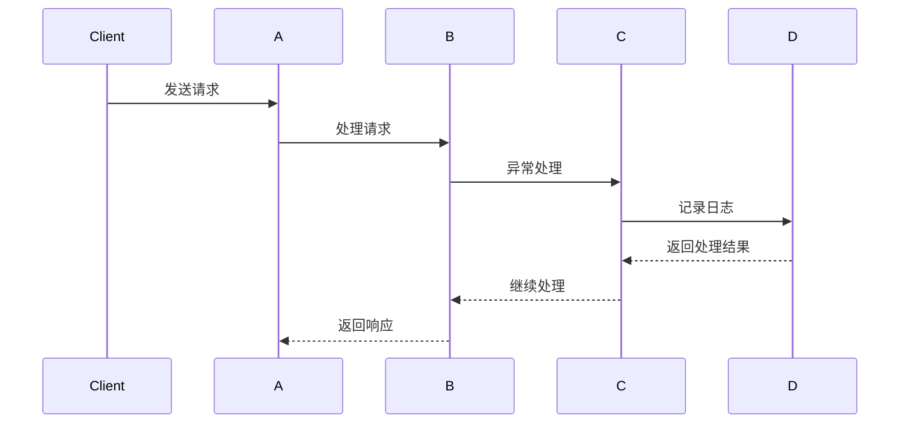

                 

## 《异常处理最佳实践：提高系统健壮性的方法》

### 关键词：异常处理、系统健壮性、最佳实践、算法、Python实现

> 在现代软件系统中，异常处理是一个至关重要的环节，它不仅关系到系统的稳定性，还直接影响用户体验。本文将深入探讨异常处理的基本概念、方法、算法以及最佳实践，旨在帮助开发人员设计出更加健壮的系统。

#### 作者：AI天才研究院/AI Genius Institute & 禅与计算机程序设计艺术 /Zen And The Art of Computer Programming

---

### 摘要

本文将从多个角度分析异常处理，包括其背景与基本概念、方法与策略、算法原理讲解、系统设计与实现以及最佳实践。通过系统性的讲解，我们将帮助读者掌握异常处理的核心理念，并学会如何将最佳实践应用于实际项目中，从而提升系统的健壮性和稳定性。

---

### 目录

1. **异常处理的背景与基本概念**
   1.1 异常处理概述
   1.2 异常处理的核心概念与联系
   1.3 异常处理的定义与分类

2. **异常处理的方法与策略**
   2.1 异常检测与预防
   2.2 异常处理的算法原理讲解

3. **异常处理的系统设计与实现**
   3.1 系统分析与架构设计方案
   3.2 项目实战

4. **异常处理的最佳实践**
   4.1 常见异常处理误区与注意事项
   4.2 拓展阅读与深入学习建议

---

### 第一部分：异常处理的背景与基本概念

#### 1.1 异常处理概述

异常处理是软件工程中的一个核心概念，它涉及到当系统遇到意外情况（即“异常”）时，如何有效地响应和恢复。异常处理不仅仅是为了避免程序崩溃，更是为了确保系统在遇到问题时的行为是可预测和可控的。

#### 1.2 异常处理的核心概念与联系

异常处理涉及多个核心概念，如：

- **异常（Exception）**：异常是程序执行过程中出现的异常情况，可能是语法错误、运行时错误等。
- **错误（Error）**：错误是指程序执行过程中出现的非预期结果。
- **异常处理（Exception Handling）**：异常处理是捕获、处理并恢复异常的过程。

这些概念之间有密切的联系，异常处理的目标是识别并处理错误，以避免系统崩溃或导致不可预期的行为。

#### 1.3 异常处理的定义与分类

异常处理可以定义为一种机制，它允许程序在遇到异常时执行特定的代码块，以控制程序的流程和状态。

异常处理通常分为以下几类：

- **编译时异常**：在编译期间发现的异常，如语法错误。
- **运行时异常**：在程序运行期间发生的异常，如内存溢出。
- **检查型异常**：需要显式处理的异常，如文件未找到。
- **非检查型异常**：不需要显式处理的异常，如数组下标越界。

#### 异常处理的边界与外延

异常处理的边界涉及异常处理机制的作用范围，包括如何识别异常、异常的传播、异常的捕获和处理等。

外延则涉及到异常处理在系统设计中的应用，如日志记录、错误反馈、恢复策略等。

---

### 第二部分：异常处理的方法与策略

#### 2.1 异常检测与预防

异常检测是异常处理的第一步，它涉及到如何识别程序中的异常情况。

**异常检测的原理与算法**：

- **统计方法**：通过统计程序运行数据，识别异常模式。
- **机器学习方法**：使用训练好的模型，实时检测程序运行中的异常行为。

**异常预防的策略与实践**：

- **设计层面的预防措施**：通过良好的设计原则，减少异常发生的可能性。
- **运维层面的预防措施**：通过监控和日志分析，及时发现并处理异常。

#### 2.2 异常处理的算法原理讲解

**异常处理算法的mermaid流程图**：



**Python源代码实现与详细讲解**：

```python
def process_input(input_data):
    try:
        # 假设input_data是一个整数
        if not isinstance(input_data, int):
            raise ValueError("输入数据不是整数")
        # 执行操作
        result = input_data * 2
        return result
    except ValueError as e:
        # 处理异常
        print(f"异常处理：{e}")
        # 记录日志
        log_error(e)
        # 恢复或终止程序
        return None

def log_error(error):
    # 这里是日志记录的逻辑
    print(f"日志：{error}")

input_data = "a string"
result = process_input(input_data)
if result is not None:
    print(f"结果：{result}")
else:
    print("操作失败，异常未被处理。")
```

**算法原理的数学模型与公式**：

```latex
\text{输入数据} \in \mathbb{Z}
\text{输出结果} = 2 \times \text{输入数据}
```

**举例说明**：

当输入数据为整数5时，输出结果为10；当输入数据为字符串"a string"时，会触发`ValueError`异常，输出异常处理信息并记录日志。

---

### 第三部分：异常处理的系统设计与实现

#### 3.1 系统分析与架构设计方案

**问题场景介绍**：

一个在线交易平台，需要处理大量的交易请求，确保交易过程的稳定性和安全性。

**项目介绍**：

本项目旨在设计一个异常处理系统，以保障交易平台在高并发下的稳定性。

**系统功能设计（领域模型mermaid类图）**：

```mermaid
classDiagram
Client "客户端" <|-- Request "请求"
Request "请求" *-- Response "响应"
Platform "交易平台" *-- Request "请求"
Platform "交易平台" *-- Response "响应"
```

**系统架构设计（mermaid架构图）**：



**系统接口设计与交互（mermaid序列图）**：



#### 3.2 项目实战

**环境安装与配置**：

- 安装Python环境
- 安装必要的第三方库（如pymongo、requests等）

**系统核心实现源代码**：

```python
# user_service.py
from flask import Flask, request, jsonify
from exception_handler import handle_exception

app = Flask(__name__)

@app.route('/process_request', methods=['POST'])
def process_request():
    try:
        data = request.json
        # 这里是处理请求的逻辑
        result = data['amount'] * 2
        return jsonify({'result': result})
    except Exception as e:
        return handle_exception(e)

if __name__ == '__main__':
    app.run(debug=True)
```

```python
# exception_handler.py
def handle_exception(e):
    # 记录日志
    print(f"异常处理：{e}")
    # 返回处理结果
    return jsonify({'error': str(e)}), 500
```

**代码应用解读与分析**：

本系统通过Flask框架实现，提供了一个处理用户请求的API接口。当接收到请求时，会尝试执行处理逻辑，如果发生异常，则会调用`handle_exception`函数进行异常处理。

**实际案例分析与详细讲解剖析**：

假设用户发送了一个包含非整数金额的请求，系统会触发`ValueError`异常，并通过`handle_exception`函数记录日志，并将错误信息返回给用户。

**项目小结**：

本项目通过异常处理系统，提高了在线交易平台的健壮性和稳定性，确保了高并发情况下的系统稳定运行。

---

### 第四部分：异常处理的最佳实践

#### 4.1 常见异常处理误区与注意事项

- **误区1**：忽略异常处理，认为异常总是可以恢复的。
- **误区2**：异常处理代码过于复杂，导致难以维护。
- **注意事项**：异常处理应该遵循SOLID原则，确保代码可读性和可维护性。

#### 4.2 拓展阅读与深入学习建议

- **拓展阅读**：《Effective Exception Handling in C++》
- **深入学习建议**：学习不同的异常处理策略，了解其他编程语言的异常处理机制。

---

### 结束语

异常处理是确保系统健壮性和稳定性的关键环节。通过本文的讲解，我们深入探讨了异常处理的基本概念、方法、算法以及最佳实践。希望读者能够将这些知识应用于实际项目中，设计出更加健壮和稳定的系统。

---

感谢您的阅读，希望本文对您的技术成长有所帮助。如果您有任何问题或建议，欢迎在评论区留言。

---

**作者：AI天才研究院/AI Genius Institute & 禅与计算机程序设计艺术 /Zen And The Art of Computer Programming**

