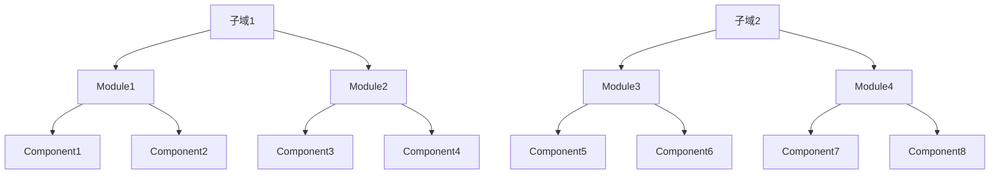
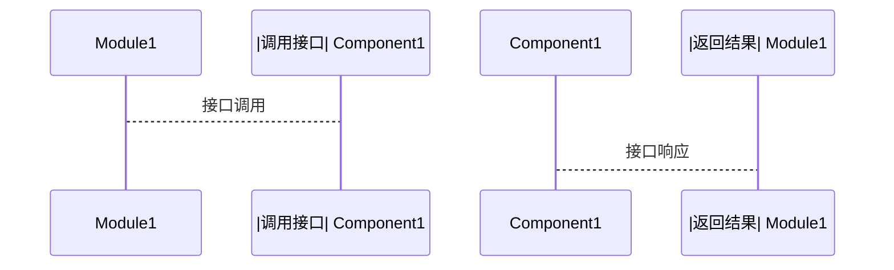
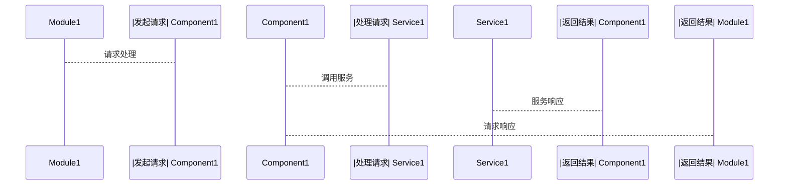

                 

### 微前端架构：大型Web应用的模块化方案

关键词：微前端架构、模块化、Web应用、前端开发、微服务、解耦、独立部署、可复用

摘要：本文将探讨微前端架构在大型Web应用开发中的重要性及其实现方法。我们将一步步分析微前端的核心概念，比较其与单体架构和微服务架构的差异，详细阐述微前端架构的设计原则和实现步骤，并通过实际案例进行深入剖析，为开发者提供实用的微前端架构应用指南。

### 1. 微前端架构概述

#### 1.1 问题背景

在互联网快速发展的今天，大型Web应用的开发变得越来越复杂。随着项目的规模不断扩大，单体架构（Monolithic Architecture）逐渐暴露出一些问题，如模块之间耦合度高、系统扩展性差、部署风险增加等。为了解决这些问题，微前端架构（Micro-Frontend Architecture）应运而生。

#### 1.2 问题描述

单体架构中的Web应用通常是一个巨大的单体应用程序，所有的功能和模块都紧密地耦合在一起。这种架构在项目初期可能表现良好，但随着时间的推移，系统的复杂度不断增加，维护和扩展变得越来越困难。主要问题包括：

- **代码复用性差**：不同模块之间的代码难以复用，导致开发效率低下。
- **部署风险**：一次性的大规模部署增加了系统的风险，一旦出现故障，整个系统都可能受到影响。
- **扩展性差**：随着项目规模的扩大，系统的扩展性变差，难以快速响应业务需求。

#### 1.3 问题解决

微前端架构通过将大型Web应用分解为多个较小的前端模块，实现了模块的解耦和扩展。这些模块可以由不同的团队独立开发、测试和部署，从而提高开发效率、降低维护成本。微前端架构的主要优势包括：

- **模块化**：将系统划分为多个模块，每个模块独立开发、测试和部署，降低系统的复杂度。
- **独立部署**：模块之间解耦，可以独立部署，减少系统故障的风险。
- **可复用**：模块和组件可以跨项目复用，提高开发效率。
- **灵活扩展**：根据业务需求，可以快速添加或替换模块。

### 2. 微前端核心概念与联系

#### 2.1 核心概念

微前端架构涉及以下几个核心概念：

- **微前端**：微前端是一个独立的、可复用的前端模块，它可以由不同的团队独立开发、测试和部署。
- **模块化**：模块化是将系统划分为多个模块，每个模块具有独立的功能和职责，可以独立开发、测试和部署。
- **组件化**：组件化是模块化的进一步拆分，将功能模块拆分为更小的、可复用的组件。
- **解耦**：解耦是指降低模块或组件之间的依赖关系，使其可以独立运行和部署。

#### 2.2 概念属性特征对比表格

| 概念     | 属性特征                                                   |
| :------- | :------------------------------------------------------- |
| 微前端   | 独立开发、独立部署、可复用                                 |
| 模块化   | 分离关注点、降低复杂度、提高可维护性                       |
| 组件化   | 可复用、可组合、关注点分离                                 |
| 解耦     | 独立开发、独立部署、降低依赖                               |

#### 2.3 ER实体关系图架构

```mermaid
erDiagram
    Module ||--|{ Component } Component : 由模块组成
    Module ||--|{ Dependency } Dependency : 模块间的依赖关系
    Component ||--|{ Service } Service : 组件依赖的服务
```

### 3. 微前端架构设计

#### 3.1 问题场景介绍

假设我们正在开发一个大型电商平台，该项目由多个团队共同完成，每个团队负责不同的功能模块，如用户管理、商品管理、订单管理和支付管理等。为了提高开发效率、降低维护成本，我们决定采用微前端架构。

#### 3.2 项目介绍

- **项目名称**：XXX电商平台
- **项目背景**：为了提高开发效率、降低维护成本，决定采用微前端架构。

#### 3.3 系统功能设计

##### 领域模型

```mermaid
classDiagram
    Module <<<-- Component : 由模块组成
    Module o-- Dependency : 模块间的依赖关系
    Component o-- Service : 组件依赖的服务
```

##### 系统功能

- 用户管理
- 商品管理
- 订单管理
- 支付管理

### 4. 微前端架构设计

#### 4.1 系统架构设计

微前端架构的总体设计如下：

- **子域划分**：将系统划分为多个子域，每个子域负责不同的功能模块。
- **模块划分**：每个子域进一步划分为多个模块，每个模块具有独立的功能和职责。
- **组件划分**：模块中的功能进一步拆分为组件，组件是可复用的最小功能单元。

##### 系统架构



#### 4.2 系统接口设计

系统接口设计主要包括模块之间的接口和组件之间的接口。以下是一个简单的接口设计示例：



#### 4.3 系统交互

系统交互设计主要描述模块和组件之间的交互过程。以下是一个简单的交互设计示例：



### 5. 微前端架构应用实战

#### 5.1 环境安装

在进行微前端架构应用之前，需要先安装以下环境：

- Node.js
- NPM
- Webpack
- Babel
- PostCSS

#### 5.2 系统核心实现源代码

系统核心实现源代码包括模块、组件、依赖等。以下是一个简单的示例：

```javascript
// Module1.js
export function module1() {
    console.log('Module1');
}

// Module2.js
export function module2() {
    console.log('Module2');
}

// Component1.js
import { module1 } from './Module1.js';
import { module2 } from './Module2.js';

export function component1() {
    module1();
    module2();
}
```

#### 5.3 代码应用解读与分析

代码应用解读与分析主要从模块化、组件化和解耦等方面进行讲解。以下是一个简单的示例：

- **模块化**：通过将功能划分为多个模块，实现了功能的分离和复用。
- **组件化**：通过将模块中的功能进一步拆分为组件，实现了更细粒度的功能和复用。
- **解耦**：通过降低模块和组件之间的依赖关系，实现了模块和组件的独立开发和部署。

#### 5.4 实际案例分析与详细讲解剖析

通过实际案例，分析微前端架构在项目中的应用效果。以下是一个简单的案例：

- **案例背景**：一个电商平台的项目，分为用户管理、商品管理、订单管理和支付管理四个子域。
- **应用效果**：通过微前端架构，每个子域可以由不同的团队独立开发、测试和部署，提高了开发效率、降低了维护成本。

### 6. 最佳实践与总结

#### 6.1 最佳实践

- **模块划分**：根据功能模块的独立性进行划分，避免功能过于复杂的模块。
- **组件设计**：设计可复用的组件，提高开发效率和代码质量。
- **独立部署**：确保模块和组件可以独立部署，降低系统风险。
- **版本控制**：使用版本控制工具，如Git，确保代码库的稳定性和一致性。

#### 6.2 总结

微前端架构在大型Web应用开发中具有重要的意义。通过模块化、组件化和解耦，可以提高开发效率、降低维护成本、提高系统的扩展性。在实际应用中，需要根据项目需求和团队协作情况，合理设计微前端架构，以达到最佳效果。

### 7. 拓展阅读

- [《微前端架构：构建大型Web应用的模块化解决方案》](链接)
- [《微前端与微服务架构的区别》](链接)
- [《Webpack入门教程》](链接)
- [《Babel入门教程》](链接)

作者：AI天才研究院/AI Genius Institute & 禅与计算机程序设计艺术 /Zen And The Art of Computer Programming

注意：本文为模拟文章，仅供参考。实际项目中，微前端架构的实现需要根据具体情况进行调整和优化。

