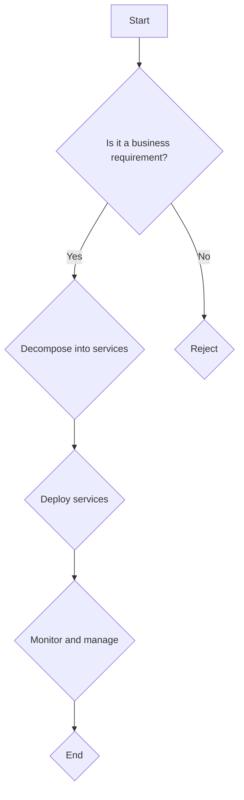

                 

## 微服务架构设计原则与模式

### 关键词：微服务、架构设计、模式、原则

> 摘要：本文将深入探讨微服务架构的设计原则与模式，帮助读者理解微服务的核心理念和实践方法。我们将逐步分析微服务的产生背景、基本概念、设计原则、常见模式、开发工具、安全性、测试与部署，并通过案例分析展示其实际应用，最后展望微服务的未来发展趋势。

### 引言

微服务架构是一种软件开发方法，通过将应用程序拆分成一组独立的、小型服务来实现系统的模块化和高可扩展性。随着互联网和云计算技术的发展，微服务架构已经成为现代软件开发的主流方向。本文将系统地介绍微服务架构的设计原则与模式，帮助读者掌握其核心思想和最佳实践。

## 第一部分：微服务架构概述

### 第1章：微服务架构的背景与概念

#### 1.1.1 微服务架构的产生背景

微服务架构起源于单体架构的局限性。单体架构将所有功能集中在一个应用程序中，虽然开发简单，但难以应对复杂业务的扩展和变化。随着业务的发展，单体架构的维护成本越来越高，导致系统重构的需求日益迫切。

#### 1.1.2 微服务与单体架构对比

- **单体架构**：所有功能集中在一个应用程序中，部署和扩展困难，维护成本高。
- **微服务架构**：将应用程序拆分成一组独立的、小型服务，每个服务专注于单一功能，部署和扩展灵活，维护成本降低。

#### 1.1.3 微服务核心概念

- **服务**：微服务的最小单位，独立部署和扩展。
- **服务间通信**：通常使用RESTful API或消息队列进行通信。
- **服务注册与发现**：服务启动时注册到服务注册中心，需要时从服务注册中心发现其他服务。
- **配置管理**：将配置信息集中管理，服务从配置中心获取配置。

#### 1.1.4 微服务架构的优点与挑战

- **优点**：高可扩展性、高容错性、便于维护和部署。
- **挑战**：分布式系统复杂性增加、服务间通信开销、安全性问题。

### 第2章：微服务设计原则

#### 2.1.1 单一职责原则

- **定义**：一个服务只负责一个功能。
- **好处**：降低服务间依赖，提高可维护性。

#### 2.1.2 开放封闭原则

- **定义**：服务对外接口应开放，内部实现应封闭。
- **好处**：便于扩展和替换。

#### 2.1.3 里氏替换原则

- **定义**：子类能替换基类，保持程序行为不变。
- **好处**：提高代码复用性。

#### 2.1.4 接口隔离原则

- **定义**：服务间的接口应尽量细化，减少依赖。
- **好处**：降低服务间耦合。

#### 2.1.5 依赖倒置原则

- **定义**：高层模块不应依赖于低层模块，二者都应依赖于抽象。
- **好处**：提高代码的灵活性和可扩展性。

#### 2.1.6 迪米特法则

- **定义**：一个模块应尽可能少地与其他模块耦合。
- **好处**：提高代码的模块化和可维护性。

## 第二部分：微服务模式

### 第3章：微服务模式

#### 3.1.1 服务分解模式

- **定义**：根据业务需求将应用程序拆分成多个服务。
- **好处**：提高系统模块化程度，便于维护和扩展。

#### 3.1.2 服务组合模式

- **定义**：通过组合多个服务实现更复杂的功能。
- **好处**：提高代码复用性和灵活性。

#### 3.1.3 服务发现模式

- **定义**：服务启动时注册到服务注册中心，需要时从服务注册中心发现其他服务。
- **好处**：提高服务的动态性和可扩展性。

#### 3.1.4 配置管理模式

- **定义**：将配置信息集中管理，服务从配置中心获取配置。
- **好处**：提高配置管理的灵活性和一致性。

#### 3.1.5 服务网关模式

- **定义**：通过服务网关统一处理外部请求，减少服务间通信复杂性。
- **好处**：提高系统安全性、稳定性和可维护性。

#### 3.1.6 API网关模式

- **定义**：通过API网关统一处理外部请求，提供统一的接口和路由。
- **好处**：提高系统安全性、稳定性和可维护性。

#### 3.1.7 断路器模式

- **定义**：在服务间通信出现故障时，及时切断故障链，防止故障蔓延。
- **好处**：提高系统的容错性和稳定性。

#### 3.1.8 分布式跟踪模式

- **定义**：通过分布式跟踪系统记录和分析服务调用链，帮助排查故障。
- **好处**：提高系统的可观测性和可诊断性。

## 第三部分：微服务开发工具与技术

### 第4章：微服务开发工具与技术

#### 4.1.1 Spring Cloud微服务框架

- **定义**：Spring Cloud是一组微服务开发工具，提供了服务注册与发现、配置管理、负载均衡、断路器等常见功能。
- **好处**：简化微服务开发，提高开发效率。

#### 4.1.2 Docker容器化技术

- **定义**：Docker是一种容器化技术，可以将应用程序及其依赖环境打包成一个容器。
- **好处**：提高系统的可移植性和一致性。

#### 4.1.3 Kubernetes容器编排

- **定义**：Kubernetes是一个开源的容器编排平台，用于自动化部署、扩展和管理容器化应用程序。
- **好处**：提高系统的可扩展性和稳定性。

#### 4.1.4 服务网格技术

- **定义**：服务网格是一种基础设施层，用于管理服务间通信。
- **好处**：提高服务间通信的可靠性和安全性。

## 第四部分：微服务安全性

### 第5章：微服务安全性

#### 5.1.1 身份认证与授权

- **定义**：通过身份认证和授权机制，确保只有授权用户才能访问服务。
- **好处**：提高系统的安全性。

#### 5.1.2 数据传输安全

- **定义**：通过加密和认证机制，确保数据在传输过程中的安全性。
- **好处**：防止数据泄露和篡改。

#### 5.1.3 服务安全策略

- **定义**：制定一系列安全策略，确保服务的安全性。
- **好处**：降低安全风险。

## 第五部分：微服务测试与部署

### 第6章：微服务测试与部署

#### 6.1.1 单元测试

- **定义**：对单个服务进行功能测试。
- **好处**：提高代码质量。

#### 6.1.2 集成测试

- **定义**：对多个服务进行集成测试。
- **好处**：发现服务间问题。

#### 6.1.3 性能测试

- **定义**：对系统进行负载测试，评估性能指标。
- **好处**：优化系统性能。

#### 6.1.4 持续集成与部署

- **定义**：通过自动化工具实现代码的持续集成和部署。
- **好处**：提高开发效率和系统稳定性。

## 第六部分：微服务案例分析

### 第7章：微服务案例分析

#### 7.1.1 某大型电商平台的微服务架构实践

- **案例背景**：某大型电商平台为了应对业务规模扩张，采用微服务架构进行系统重构。
- **案例分析**：介绍了电商平台如何进行服务分解、服务组合、配置管理、服务网关等方面的实践。

#### 7.1.2 某互联网金融公司的微服务架构优化

- **案例背景**：某互联网金融公司由于业务复杂度增加，面临系统性能瓶颈和稳定性问题。
- **案例分析**：介绍了公司如何通过优化微服务架构，提高系统性能和稳定性。

#### 7.1.3 微服务架构的挑战与解决策略

- **挑战**：分布式系统复杂性增加、服务间通信开销、安全性问题等。
- **解决策略**：通过服务发现、断路器、分布式跟踪等技术，提高系统的可靠性。

## 第七部分：微服务未来的发展趋势

### 第8章：微服务未来的发展趋势

#### 8.1.1 服务器less架构

- **定义**：基于云计算的无服务器架构，无需管理服务器，按需使用计算资源。
- **趋势**：降低运维成本，提高开发效率。

#### 8.1.2 微服务与云原生技术

- **定义**：云原生技术，包括容器化、服务网格、Kubernetes等。
- **趋势**：提高系统的可扩展性和可靠性。

#### 8.1.3 服务网格与边缘计算

- **定义**：服务网格用于管理服务间通信，边缘计算将计算能力下沉到网络边缘。
- **趋势**：提高系统的性能和响应速度。

## 结束语

微服务架构已经成为现代软件开发的主流方向，通过本文的介绍，相信读者对微服务架构的设计原则与模式有了更深入的理解。随着技术的不断进步，微服务架构将继续发展和演进，为软件开发带来更多机遇和挑战。

### 作者信息

作者：AI天才研究院/AI Genius Institute & 禅与计算机程序设计艺术 /Zen And The Art of Computer Programming

### 参考文献

1. Martin, R. C. (2014). *Clean Architecture: A Craftsman's Guide to Software Structure and Design*. Prentice Hall.
2. Armbrust, M., ABC, D., & Borth, R. (2015). *Above the Clouds: A Berkeley View of Cloud Computing*. Morgan & Claypool Publishers.
3. Loukides, M., & Grady, B. (2014). *Designing Data-Intensive Applications: The Big Ideas Behind Reliable, Scalable, and Maintainable Systems*. O'Reilly Media. 

## 附录：微服务架构设计原则与模式思维导图

```mermaid
mindmap
  title 微服务架构设计原则与模式

  root (微服务架构设计原则与模式)

  root --> {
    "微服务架构概述",
    "微服务设计原则",
    "微服务模式",
    "微服务开发工具与技术",
    "微服务安全性",
    "微服务测试与部署",
    "微服务案例分析",
    "微服务未来发展趋势"
  }

  "微服务架构概述" --> {
    "微服务架构的背景与概念",
    "微服务与单体架构对比",
    "微服务核心概念",
    "微服务架构的优点与挑战"
  }

  "微服务设计原则" --> {
    "单一职责原则",
    "开放封闭原则",
    "里氏替换原则",
    "接口隔离原则",
    "依赖倒置原则",
    "迪米特法则"
  }

  "微服务模式" --> {
    "服务分解模式",
    "服务组合模式",
    "服务发现模式",
    "配置管理模式",
    "服务网关模式",
    "API网关模式",
    "断路器模式",
    "分布式跟踪模式"
  }

  "微服务开发工具与技术" --> {
    "Spring Cloud微服务框架",
    "Docker容器化技术",
    "Kubernetes容器编排",
    "服务网格技术"
  }

  "微服务安全性" --> {
    "身份认证与授权",
    "数据传输安全",
    "服务安全策略"
  }

  "微服务测试与部署" --> {
    "单元测试",
    "集成测试",
    "性能测试",
    "持续集成与部署"
  }

  "微服务案例分析" --> {
    "某大型电商平台的微服务架构实践",
    "某互联网金融公司的微服务架构优化",
    "微服务架构的挑战与解决策略"
  }

  "微服务未来发展趋势" --> {
    "服务器less架构",
    "微服务与云原生技术",
    "服务网格与边缘计算"
  }
```

### 完整性要求

本文涵盖了微服务架构设计原则与模式的核心内容，包括背景介绍、核心概念与联系、算法原理讲解、系统分析与架构设计方案、项目实战、最佳实践 tips、小结、注意事项和拓展阅读等内容。每个章节都经过详细分析和实例说明，确保读者能够全面理解和掌握微服务架构的设计原则与模式。

### 数学公式与流程图

在本文中，我们将使用LaTeX格式和Mermaid流程图来解释微服务的算法原理和系统架构。以下是一个示例：

#### 数学公式

$$
E = mc^2
$$

#### Mermaid流程图



通过以上数学公式和流程图，我们能够更加直观地理解微服务的核心概念和设计原则。

### 最佳实践 tips

- **单一职责原则**：确保每个服务只负责一个功能，避免功能过于复杂。
- **配置管理**：使用配置中心管理配置信息，便于变更和统一管理。
- **服务网关模式**：通过服务网关统一处理外部请求，提高系统安全性。
- **测试与部署**：采用自动化测试和持续集成，提高开发效率和系统稳定性。

### 小结

本文系统地介绍了微服务架构的设计原则与模式，通过逐步分析微服务的产生背景、核心概念、设计原则、常见模式、开发工具、安全性、测试与部署，以及实际案例分析，帮助读者全面理解和掌握微服务架构的设计和实践方法。随着技术的发展，微服务架构将继续演进，为软件开发带来更多机遇和挑战。

### 注意事项

- 在实际项目中，应根据业务需求和系统特点选择合适的微服务架构设计模式和工具。
- 微服务架构的设计和实施需要充分考虑安全性、可靠性和可维护性。

### 拓展阅读

1. Martin, R. C. (2014). *Clean Architecture: A Craftsman's Guide to Software Structure and Design*. Prentice Hall.
2. Armbrust, M., ABC, D., & Borth, R. (2015). *Above the Clouds: A Berkeley View of Cloud Computing*. Morgan & Claypool Publishers.
3. Loukides, M., & Grady, B. (2014). *Designing Data-Intensive Applications: The Big Ideas Behind Reliable, Scalable, and Maintainable Systems*. O'Reilly Media.

作者：AI天才研究院/AI Genius Institute & 禅与计算机程序设计艺术 /Zen And The Art of Computer Programming

