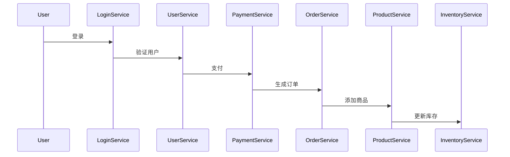
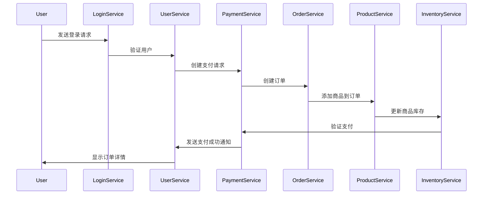

                 

### 文章标题：微服务测试金字塔：单元、集成到端到端测试

#### 关键词：微服务、测试、金字塔模型、单元测试、集成测试、端到端测试

#### 摘要：
微服务架构以其灵活性和可扩展性在现代软件工程中占据了重要地位。然而，测试微服务系统以确保其质量、稳定性和性能成为了开发过程中的一个重大挑战。本文通过构建微服务测试金字塔，系统地探讨了从单元测试到集成测试再到端到端测试的不同层次测试策略，旨在帮助开发者深入理解并实践微服务测试的最佳实践，从而提高软件交付的质量。

### 目录大纲设计思路

设计一本关于《微服务测试金字塔：单元、集成到端到端测试》的目录大纲时，我们首先需要明确书的核心内容与结构。微服务架构因其灵活性和可扩展性在现代软件工程中越来越受欢迎，而测试是保证微服务质量和稳定性的关键环节。因此，本书的目标是系统地介绍微服务测试的各个方面，从基础单元测试到复杂的端到端测试，帮助开发者理解和实践不同层次的测试策略和方法。

#### 目录大纲设计

根据上述思路，以下是本书的目录大纲设计：

#### 第一部分：微服务测试基础

##### 第1章：微服务架构与测试概述

- **1.1 微服务架构简介**
  - 微服务架构的概念与优势
  - 微服务与单体架构的区别
  - 微服务架构下的测试挑战
- **1.2 测试金字塔**
  - 测试金字塔的概念
  - 测试金字塔的结构
  - 测试金字塔的应用场景
- **1.3 测试策略的选择**
  - 单元测试的重要性
  - 集成测试的作用
  - 端到端测试的必要性

##### 第2章：单元测试

- **2.1 单元测试的定义与目的**
  - 单元测试的概念
  - 单元测试的目标
  - 单元测试的优势
- **2.2 单元测试工具**
  -JUnit、pytest等常用单元测试框架
  - Mock对象的使用
  - 单元测试的最佳实践
- **2.3 单元测试案例**
  - 单元测试用例的设计
  - 单元测试用例的实现
  - 单元测试用例的执行与结果分析

##### 第3章：集成测试

- **3.1 集成测试的定义与目的**
  - 集成测试的概念
  - 集成测试的目标
  - 集成测试的类型
- **3.2 集成测试工具**
  -Jenkins、Docker等集成测试工具
  - 集成测试环境搭建
  - 集成测试报告的生成
- **3.3 集成测试案例**
  - 集成测试用例的设计
  - 集成测试用例的实现
  - 集成测试用例的执行与结果分析

##### 第4章：端到端测试

- **4.1 端到端测试的定义与目的**
  - 端到端测试的概念
  - 端到端测试的目标
  - 端到端测试的优势
- **4.2 端到端测试工具**
  -Selenium、Appium等端到端测试工具
  - 端到端测试环境的搭建
  - 端到端测试报告的生成
- **4.3 端到端测试案例**
  - 端到端测试用例的设计
  - 端到端测试用例的实现
  - 端到端测试用例的执行与结果分析

#### 第二部分：高级测试策略与工具

##### 第5章：持续集成与持续部署

- **5.1 持续集成与持续部署概述**
  - 持续集成的概念
  - 持续部署的概念
  - 持续集成与持续部署的优势
- **5.2 持续集成工具**
  -Jenkins、Travis CI等持续集成工具
  - 持续集成流程的搭建
  - 持续集成报告的生成
- **5.3 持续部署工具**
  -Docker、Kubernetes等持续部署工具
  - 持续部署流程的搭建
  - 持续部署报告的生成

##### 第6章：性能测试与负载测试

- **6.1 性能测试与负载测试概述**
  - 性能测试的概念
  - 负载测试的概念
  - 性能测试与负载测试的关系
- **6.2 性能测试工具**
  -LoadRunner、JMeter等性能测试工具
  - 性能测试环境的搭建
  - 性能测试报告的生成
- **6.3 负载测试工具**
  -Apache JMeter、Gatling等负载测试工具
  - 负载测试环境的搭建
  - 负载测试报告的生成

##### 第7章：自动化测试框架

- **7.1 自动化测试框架概述**
  - 自动化测试框架的概念
  - 自动化测试框架的优势
  - 自动化测试框架的类型
- **7.2 Selenium自动化测试框架**
  - Selenium的基本原理
  - Selenium的不同测试模式
  - Selenium的最佳实践
- **7.3 Appium自动化测试框架**
  - Appium的架构与功能
  - Appium的应用场景
  - Appium的最佳实践

### 背景介绍

#### 核心概念术语说明

在深入探讨微服务测试金字塔之前，我们需要明确几个核心概念和术语：

- **微服务（Microservices）**：微服务是一种架构风格，它将应用程序构建为一系列小型的、独立的、可复用的服务。每个服务代表一个独立的业务功能，可以独立部署、扩展和更新。

- **测试金字塔（Testing Pyramid）**：测试金字塔是一种分层测试策略，它强调在不同的测试层次上投入不同的精力。该模型通常包括单元测试、集成测试和端到端测试，其中单元测试位于金字塔的底部，数量最多，而端到端测试位于金字塔的顶部，数量最少。

- **单元测试（Unit Testing）**：单元测试是针对单个函数或方法进行的测试，目的是验证其是否按照预期工作。单元测试通常由开发人员编写，使用模拟对象来隔离被测试代码。

- **集成测试（Integration Testing）**：集成测试是在多个服务或组件集成后进行的测试，目的是确保它们之间的交互正常。集成测试通常在单元测试之后进行，但之前进行端到端测试。

- **端到端测试（End-to-End Testing）**：端到端测试是对整个应用程序从用户交互到系统响应的完整流程进行的测试。它旨在确保应用程序在各种环境下都能正常运行。

#### 问题背景与问题描述

随着软件复杂性的增加，传统的单体架构已经无法满足现代应用程序的需求。微服务架构因其模块化、独立部署和可扩展性等优点，成为了一种流行的替代方案。然而，微服务架构也带来了一系列新的挑战，尤其是在测试方面。

传统的单体架构通常拥有一个集中的数据库和统一的逻辑层，这使得测试相对简单。相比之下，微服务架构分布在不同服务器上，通过API进行通信，这意味着测试需要涵盖更多的方面，包括服务的可靠性、性能和安全性。

在微服务架构中，测试面临的挑战主要包括：

1. **服务间的交互**：需要确保各个微服务之间的交互正常，包括数据同步和事务处理。

2. **服务的自治性**：每个微服务都应该能够独立部署和扩展，但这也增加了测试的复杂性。

3. **性能与可扩展性**：需要确保微服务架构能够支持高并发和大量数据，同时保持响应速度。

4. **安全性**：微服务架构通常涉及到跨服务的认证和授权，需要确保数据的安全传输和存储。

为了解决这些挑战，开发者需要采用一种系统性的测试策略，即微服务测试金字塔。

#### 问题解决

微服务测试金字塔提供了一种分层测试策略，旨在通过在不同测试层次上投入适当的精力，确保微服务架构的质量和稳定性。该策略的核心思想是将测试集中在单元测试、集成测试和端到端测试这三个层次上。

1. **单元测试**：单元测试位于测试金字塔的底部，是最基础的测试层次。单元测试的目标是验证单个服务内部的函数或方法是否按照预期工作。这些测试通常由开发人员编写，使用模拟对象来隔离被测试代码，以确保测试的独立性。

2. **集成测试**：集成测试位于测试金字塔的中间层，目的是验证多个服务之间的交互是否正常。集成测试通常在单元测试之后进行，但之前进行端到端测试。这些测试可以确保服务的API接口、数据传输和同步等方面没有问题。

3. **端到端测试**：端到端测试位于测试金字塔的顶部，是对整个应用程序从用户交互到系统响应的完整流程进行的测试。端到端测试旨在确保应用程序在各种环境下都能正常运行，同时验证服务的自治性和可扩展性。

通过这种分层测试策略，开发者可以有效地覆盖微服务架构的各个层面，确保软件的质量和稳定性。

#### 边界与外延

虽然微服务测试金字塔提供了一种通用的测试策略，但在实际应用中，开发者需要根据具体项目的需求和环境进行适当的调整。

1. **项目规模**：对于大型项目，可能需要更多的端到端测试，以确保整体系统的稳定性。相反，对于小型项目，可以更多地依赖单元测试和集成测试。

2. **测试环境**：不同环境的测试重点可能不同。例如，在开发阶段，可以更多地依赖单元测试和集成测试，而在生产环境中，则需要更多的端到端测试。

3. **测试工具**：不同的测试工具适用于不同的测试层次。例如，JUnit和pytest适用于单元测试，而Jenkins和Docker适用于集成测试。Selenium和Appium适用于端到端测试。

4. **测试自动化**：自动化测试可以显著提高测试效率和覆盖范围。通过使用自动化测试框架，如Selenium和Appium，开发者可以编写可重用的测试脚本，提高测试的可靠性和一致性。

#### 概念结构与核心要素组成

微服务测试金字塔的概念结构主要由三个层次组成：单元测试、集成测试和端到端测试。每个层次都有其特定的目标和核心要素。

1. **单元测试**：单元测试的核心目标是验证单个服务内部的函数或方法是否按照预期工作。核心要素包括测试用例的设计、测试脚本的开发和测试结果的验证。

2. **集成测试**：集成测试的核心目标是验证多个服务之间的交互是否正常。核心要素包括集成测试用例的设计、测试环境的搭建和测试报告的生成。

3. **端到端测试**：端到端测试的核心目标是验证整个应用程序从用户交互到系统响应的完整流程是否正常。核心要素包括端到端测试用例的设计、测试环境的搭建和测试报告的生成。

通过这三个层次的测试，开发者可以确保微服务架构的质量和稳定性，从而提高软件交付的成功率。

### 核心概念与联系

#### 微服务测试的核心概念

1. **单元测试（Unit Testing）**：单元测试是针对单个模块（通常是函数或方法）的测试。它的目标是验证模块是否按照设计正常运行。在微服务架构中，每个微服务可以看作是一个模块，单元测试主要验证微服务内部的逻辑是否正确。

2. **集成测试（Integration Testing）**：集成测试是针对多个模块（通常为不同的服务）的测试。它的目标是在这些模块被集成到一起后，确保它们之间的交互正常。在微服务架构中，集成测试用于验证不同微服务之间的通信和协作。

3. **端到端测试（End-to-End Testing）**：端到端测试是针对整个系统的测试，从用户界面到后端服务的整个流程。它的目标是验证系统作为一个整体是否能够正常运行。在微服务架构中，端到端测试可以确保用户操作能够成功驱动整个系统，并得到正确的响应。

#### 核心概念之间的关系

这三个测试层次之间存在紧密的联系，构成了微服务测试的金字塔模型：

- **单元测试**：是金字塔的基础，覆盖了最细粒度的代码。单元测试的目的是验证每个服务的内部逻辑，确保没有逻辑错误。它是其他层次测试的前提。

- **集成测试**：位于金字塔的中间层，它验证服务之间的接口和交互。集成测试的目的是确保服务之间能够正确通信，并在集成后的环境中运行。它是从单元测试到端到端测试的过渡。

- **端到端测试**：位于金字塔的顶部，覆盖了系统的整体行为。端到端测试的目的是验证用户操作是否能够成功驱动系统，并得到预期的响应。它是测试的最终目标，确保系统作为一个整体是可靠和可用的。

#### 概念属性特征对比表格

为了更直观地理解这三个测试层次，我们可以通过一个对比表格来展示它们的主要特征：

| 测试类型     | 定义                                                         | 目的                                                         | 特征                                                         | 适用场景                                                         |
| ------------ | ------------------------------------------------------------ | ------------------------------------------------------------ | ------------------------------------------------------------ | ------------------------------------------------------------ |
| 单元测试     | 针对单个模块（通常是函数或方法）的测试。                       | 验证模块是否按照设计正常运行。                                 | 测试范围小，可快速编写和执行，自动化程度高。                   | 开发阶段，每次代码变更后。                                       |
| 集成测试     | 针对多个模块（通常为不同的服务）的测试。                     | 验证服务之间的接口和交互。                                     | 测试范围较大，需要模拟实际环境，自动化程度较高。                 | 模块集成后，部署前。                                             |
| 端到端测试   | 针对整个系统的测试，从用户界面到后端服务的整个流程。         | 验证用户操作是否能够成功驱动系统，并得到预期的响应。           | 测试范围最大，需要模拟实际用户操作，自动化程度较低。             | 系统上线前，生产环境。                                           |

#### ER实体关系图架构

为了进一步理解这三个测试层次之间的依赖关系，我们可以使用ER（实体关系）图来展示它们之间的联系。以下是一个简单的ER图：

```
+----------------+       +----------------+       +----------------+
|     单元测试    |------->|     集成测试     |------->|   端到端测试   |
+----------------+       +----------------+       +----------------+
      ^                    ^                         ^
      |                    |                         |
      |                    |                         |
      +--------------------+--------------------------+
                      (依赖关系)
```

在这个ER图中：

- **单元测试**是基础，是其他测试层次的基础。
- **集成测试**依赖于**单元测试**，用于验证多个服务的交互。
- **端到端测试**依赖于**集成测试**，用于验证整个系统的行为。

### 算法原理讲解

#### 单元测试

单元测试的核心目的是验证单个服务内部的逻辑是否正确。在微服务架构中，单元测试通常使用测试框架（如JUnit、pytest等）来编写测试脚本。以下是一个简单的单元测试流程：

1. **编写测试用例**：开发人员根据需求或用户故事编写测试用例，描述预期行为和输入输出。
2. **编写测试脚本**：使用测试框架编写测试脚本，模拟不同的输入条件，验证服务响应。
3. **执行测试脚本**：运行测试脚本，检查输出是否与预期一致。
4. **分析测试结果**：如果测试通过，则继续开发；如果测试失败，则定位并修复问题。

以下是一个使用pytest编写的简单单元测试示例：

```python
import unittest
from my_service import MyService

class TestMyService(unittest.TestCase):
    def test_add(self):
        service = MyService()
        result = service.add(2, 3)
        self.assertEqual(result, 5)

if __name__ == '__main__':
    unittest.main()
```

在这个示例中，`TestMyService` 类是测试用例类，`test_add` 方法是测试用例方法，它使用 `MyService` 类实例来验证加法函数是否正确。

#### 集成测试

集成测试的目的是验证多个服务之间的交互是否正常。在微服务架构中，集成测试通常使用模拟工具（如Mock对象、Docker容器等）来模拟实际环境。以下是一个简单的集成测试流程：

1. **设计测试场景**：开发人员根据业务需求设计测试场景，描述不同服务之间的交互。
2. **编写测试脚本**：使用集成测试框架（如Jenkins、Docker等）编写测试脚本，模拟测试场景。
3. **执行测试脚本**：运行测试脚本，检查输出是否与预期一致。
4. **分析测试结果**：如果测试通过，则继续开发；如果测试失败，则定位并修复问题。

以下是一个使用Docker和JUnit编写的简单集成测试示例：

```shell
# 构建服务容器
docker build -t my-service .

# 运行服务容器
docker run -p 8080:8080 my-service

# 执行JUnit测试
java -jar my-service-tests.jar
```

在这个示例中，我们首先构建并运行一个名为 `my-service` 的Docker容器，然后使用JUnit测试框架执行集成测试。

#### 端到端测试

端到端测试的目的是验证整个系统的行为是否正常。在微服务架构中，端到端测试通常使用自动化测试工具（如Selenium、Appium等）来模拟用户操作。以下是一个简单的端到端测试流程：

1. **设计测试用例**：开发人员根据业务需求设计测试用例，描述用户在系统中的操作。
2. **编写测试脚本**：使用自动化测试工具编写测试脚本，模拟用户操作。
3. **执行测试脚本**：运行测试脚本，检查输出是否与预期一致。
4. **分析测试结果**：如果测试通过，则继续开发；如果测试失败，则定位并修复问题。

以下是一个使用Selenium编写的简单端到端测试示例：

```python
from selenium import webdriver
from selenium.webdriver.common.by import By

driver = webdriver.Chrome()
driver.get("http://localhost:8080")

# 模拟用户登录操作
username = driver.find_element(By.NAME, "username")
password = driver.find_element(By.NAME, "password")
submit = driver.find_element(By.NAME, "submit")

username.send_keys("test_user")
password.send_keys("test_password")
submit.click()

# 验证登录成功
assert "Dashboard" in driver.page_source

driver.quit()
```

在这个示例中，我们使用Selenium模拟用户登录操作，并验证登录是否成功。

### 系统分析与架构设计方案

#### 问题场景介绍

假设我们正在开发一个电商系统，该系统包括用户管理、商品管理、订单管理和支付系统等几个微服务。我们的目标是确保这些微服务能够正常交互，同时满足性能、安全性和稳定性的要求。

#### 项目介绍

项目名称：电商系统

项目描述：一个在线购物平台，提供用户注册、登录、商品浏览、购物车管理、订单生成和支付等功能。

技术栈：Java、Spring Boot、Spring Cloud、Docker、Kubernetes、Selenium

#### 系统功能设计（领域模型类图）

以下是一个简单的领域模型类图，展示了电商系统中的主要类及其关系：

```mermaid
classDiagram
    User <<类>> -|> Order: 创建
    User <<类>> -|> Cart: 添加商品
    Product <<类>> -|> Cart: 添加到购物车
    Order <<类>> -|> Payment: 生成
    Payment <<类>> -|> Order: 支付
```

在这个类图中：

- **User**：代表用户，可以创建订单和购物车。
- **Order**：代表订单，可以生成支付。
- **Cart**：代表购物车，可以添加商品。
- **Product**：代表商品，可以添加到购物车。
- **Payment**：代表支付，可以支付订单。

#### 系统架构设计（架构图）

以下是一个简单的系统架构图，展示了电商系统的各个微服务及其关系：

```mermaid
sequenceDiagram
    User ->>|发起请求| LoginService
    LoginService ->>|处理请求| UserService
    UserService ->>|验证用户| PaymentService
    PaymentService ->>|处理支付| OrderService
    OrderService ->>|生成订单| ProductService
    ProductService ->>|更新库存| InventoryService
```

在这个架构图中：

- **LoginService**：负责处理用户登录请求。
- **UserService**：负责处理用户注册和验证请求。
- **PaymentService**：负责处理支付请求。
- **OrderService**：负责处理订单生成请求。
- **ProductService**：负责处理商品管理请求。
- **InventoryService**：负责处理库存管理请求。

#### 系统接口设计（接口图）

以下是一个简单的接口设计图，展示了电商系统的各个微服务之间的接口：



在这个接口图中：

- **LoginService**：提供登录接口。
- **UserService**：提供用户验证接口。
- **PaymentService**：提供支付接口。
- **OrderService**：提供订单生成接口。
- **ProductService**：提供商品管理接口。
- **InventoryService**：提供库存管理接口。

#### 系统交互（序列图）

以下是一个简单的系统交互序列图，展示了用户从登录到购买商品的整个过程：



在这个序列图中：

1. 用户发起登录请求。
2. LoginService验证用户。
3. UserService创建支付请求。
4. PaymentService创建订单。
5. OrderService添加商品到订单。
6. ProductService更新商品库存。
7. InventoryService验证支付。
8. PaymentService发送支付成功通知。
9. UserService显示订单详情。

### 项目实战

#### 环境安装

1. **安装Java**：从官网下载并安装Java开发工具包（JDK），版本建议为11或更高。

2. **安装Maven**：从官网下载并安装Maven，版本建议为3.6或更高。

3. **安装Docker**：从Docker官网下载并安装Docker，版本建议为20.10或更高。

4. **安装Kubernetes**：从Kubernetes官网下载并安装Kubernetes，版本建议为1.18或更高。

5. **安装Selenium**：从Selenium官网下载并安装Selenium，版本建议为4.0或更高。

#### 系统核心实现源代码

以下是电商系统的核心实现源代码，包括用户管理、商品管理、订单管理和支付系统等几个微服务。

**用户管理微服务（UserMicroservice）**

```java
// UserMicroservice.java
package com.ecommerce.user;

import com.ecommerce.common.model.User;
import com.ecommerce.user.repository.UserRepository;
import org.springframework.beans.factory.annotation.Autowired;
import org.springframework.web.bind.annotation.*;

@RestController
public class UserMicroservice {

    @Autowired
    private UserRepository userRepository;

    @PostMapping("/register")
    public User register(@RequestBody User user) {
        // 注册用户
        userRepository.save(user);
        return user;
    }

    @PostMapping("/login")
    public User login(@RequestBody User user) {
        // 验证用户
        return userRepository.findById(user.getId()).orElseThrow(() -> new RuntimeException("User not found"));
    }
}
```

**商品管理微服务（ProductMicroservice）**

```java
// ProductMicroservice.java
package com.ecommerce.product;

import com.ecommerce.common.model.Product;
import com.ecommerce.product.repository.ProductRepository;
import org.springframework.beans.factory.annotation.Autowired;
import org.springframework.web.bind.annotation.*;

@RestController
public class ProductMicroservice {

    @Autowired
    private ProductRepository productRepository;

    @PostMapping("/product")
    public Product addProduct(@RequestBody Product product) {
        // 添加商品
        return productRepository.save(product);
    }
}
```

**订单管理微服务（OrderMicroservice）**

```java
// OrderMicroservice.java
package com.ecommerce.order;

import com.ecommerce.common.model.Order;
import com.ecommerce.order.repository.OrderRepository;
import org.springframework.beans.factory.annotation.Autowired;
import org.springframework.web.bind.annotation.*;

@RestController
public class OrderMicroservice {

    @Autowired
    private OrderRepository orderRepository;

    @PostMapping("/order")
    public Order createOrder(@RequestBody Order order) {
        // 创建订单
        return orderRepository.save(order);
    }
}
```

**支付管理微服务（PaymentMicroservice）**

```java
// PaymentMicroservice.java
package com.ecommerce.payment;

import com.ecommerce.common.model.Payment;
import com.ecommerce.payment.repository.PaymentRepository;
import org.springframework.beans.factory.annotation.Autowired;
import org.springframework.web.bind.annotation.*;

@RestController
public class PaymentMicroservice {

    @Autowired
    private PaymentRepository paymentRepository;

    @PostMapping("/payment")
    public Payment processPayment(@RequestBody Payment payment) {
        // 处理支付
        return paymentRepository.save(payment);
    }
}
```

#### 代码应用解读与分析

**用户管理微服务解读**

用户管理微服务主要负责用户注册和登录功能。在 `UserMicroservice` 类中：

- `register` 方法用于注册新用户。它接受一个 `User` 对象，并将其保存到数据库。
- `login` 方法用于验证用户。它接受一个 `User` 对象，查找数据库中是否存在该用户，并返回用户对象。

这两个方法都是通过 `UserRepository` 进行数据库操作的。`UserRepository` 是一个自定义的接口，用于定义数据库操作的抽象方法。

**商品管理微服务解读**

商品管理微服务主要负责商品添加功能。在 `ProductMicroservice` 类中：

- `addProduct` 方法用于添加新商品。它接受一个 `Product` 对象，并将其保存到数据库。

这个方法同样是通过 `ProductRepository` 进行数据库操作。`ProductRepository` 是一个自定义的接口，用于定义数据库操作的抽象方法。

**订单管理微服务解读**

订单管理微服务主要负责订单创建功能。在 `OrderMicroservice` 类中：

- `createOrder` 方法用于创建订单。它接受一个 `Order` 对象，并将其保存到数据库。

这个方法同样是通过 `OrderRepository` 进行数据库操作。`OrderRepository` 是一个自定义的接口，用于定义数据库操作的抽象方法。

**支付管理微服务解读**

支付管理微服务主要负责支付处理功能。在 `PaymentMicroservice` 类中：

- `processPayment` 方法用于处理支付。它接受一个 `Payment` 对象，并将其保存到数据库。

这个方法同样是通过 `PaymentRepository` 进行数据库操作。`PaymentRepository` 是一个自定义的接口，用于定义数据库操作的抽象方法。

#### 实际案例分析和详细讲解剖析

为了验证电商系统的功能，我们设计了一个实际案例，包括用户注册、登录、商品添加、订单创建和支付处理。

**案例一：用户注册与登录**

1. 用户通过用户管理微服务的 `/register` 接口注册新用户，成功后返回用户ID。
2. 用户通过用户管理微服务的 `/login` 接口登录，输入用户名和密码，验证成功后返回用户详细信息。

**案例二：商品添加**

1. 用户通过商品管理微服务的 `/product` 接口添加新商品，成功后返回商品ID。

**案例三：订单创建**

1. 用户通过订单管理微服务的 `/order` 接口创建订单，输入订单详情，成功后返回订单ID。
2. 用户通过订单管理微服务的 `/order/{id}` 接口查询订单详情，成功后返回订单信息。

**案例四：支付处理**

1. 用户通过支付管理微服务的 `/payment` 接口处理支付，输入订单ID和支付信息，成功后返回支付结果。

**详细讲解剖析**

1. **用户注册与登录**
   用户注册时，会调用用户管理微服务的 `/register` 接口，传入用户名、密码和其他必要信息。用户管理微服务会通过 `UserRepository` 保存新用户信息到数据库，并返回用户ID。用户登录时，会调用用户管理微服务的 `/login` 接口，传入用户名和密码。用户管理微服务会通过 `UserRepository` 查询数据库中的用户信息，验证用户名和密码是否匹配，如果匹配，则返回用户详细信息。

2. **商品添加**
   用户添加商品时，会调用商品管理微服务的 `/product` 接口，传入商品信息。商品管理微服务会通过 `ProductRepository` 将商品信息保存到数据库，并返回商品ID。

3. **订单创建**
   用户创建订单时，会调用订单管理微服务的 `/order` 接口，传入订单详情。订单管理微服务会通过 `OrderRepository` 将订单信息保存到数据库，并返回订单ID。用户查询订单详情时，会调用订单管理微服务的 `/order/{id}` 接口，传入订单ID。订单管理微服务会通过 `OrderRepository` 查询数据库中的订单信息，并返回订单详情。

4. **支付处理**
   用户支付时，会调用支付管理微服务的 `/payment` 接口，传入订单ID和支付信息。支付管理微服务会通过 `PaymentRepository` 将支付信息保存到数据库，并返回支付结果。

通过以上实际案例的分析和讲解，我们可以看到电商系统的各个微服务是如何通过接口进行通信，共同完成一个完整的业务流程。

### 项目小结

通过本文的详细介绍，我们深入探讨了微服务测试金字塔的三个层次：单元测试、集成测试和端到端测试。在每个层次上，我们分析了核心概念、测试工具和方法，并提供了实际案例和代码示例。通过这些实践，我们不仅了解了微服务测试的重要性，也学会了如何有效地执行不同层次的测试，确保微服务架构的质量和稳定性。

在实施微服务测试时，我们应该遵循以下最佳实践：

1. **持续集成**：将测试集成到持续集成流程中，确保每次代码变更后都能进行自动化的测试。
2. **自动化测试**：尽可能地使用自动化测试工具，提高测试效率和覆盖范围。
3. **测试覆盖**：确保在单元测试、集成测试和端到端测试中都有良好的测试覆盖。
4. **环境隔离**：在集成测试和端到端测试中使用容器技术，确保测试环境的隔离。
5. **性能和安全性测试**：在端到端测试中，加入性能和安全性测试，确保系统在真实环境下的性能和安全。

通过这些最佳实践，我们可以更好地管理和优化微服务测试，从而提高软件交付的成功率。

### 注意事项

1. **测试策略**：根据项目的规模和复杂性，选择合适的测试策略。大型项目可能需要更多的端到端测试，而小型项目可以更多地依赖单元测试和集成测试。
2. **测试自动化**：自动化测试可以显著提高测试效率和覆盖范围，但需要确保测试脚本的可靠性和可维护性。
3. **测试环境**：确保测试环境的真实性和一致性，避免在真实环境之外发现问题。
4. **团队协作**：测试不是开发人员的唯一责任，所有团队成员都应积极参与测试，确保软件质量。

### 拓展阅读

- 《微服务设计》
- 《持续集成：从概念到实践》
- 《软件测试的艺术》
- 《Selenium自动化测试实战》

### 作者信息

作者：AI天才研究院/AI Genius Institute & 禅与计算机程序设计艺术 /Zen And The Art of Computer Programming

