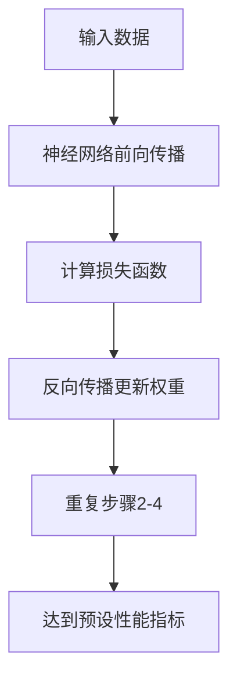
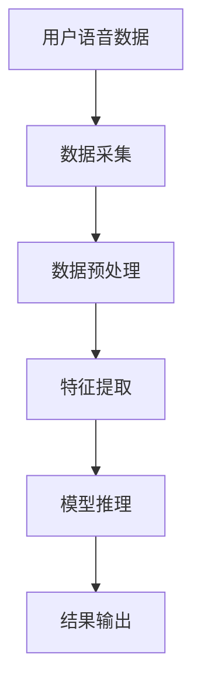
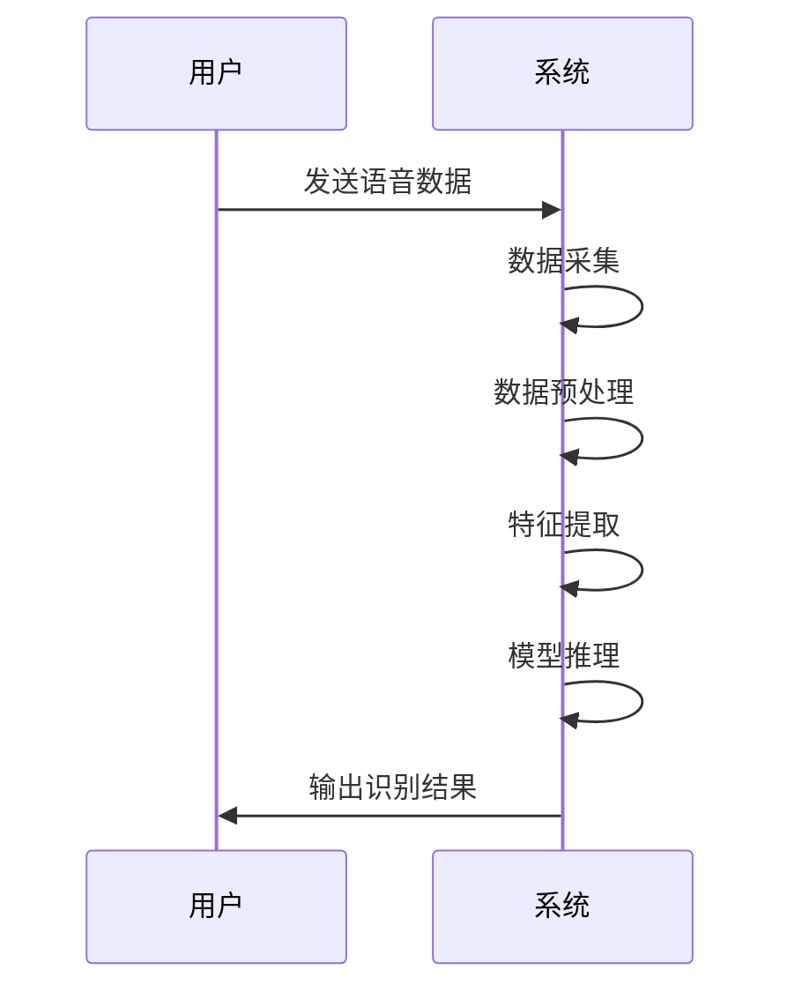

                 


# 性能优化：提升AI Agent的响应速度

关键词：AI性能优化、响应速度提升、算法优化、硬件加速、数据并行化

摘要：本文将深入探讨AI Agent的性能优化，通过一系列具体技术与方法，逐步揭示提升AI Agent响应速度的路径。文章首先介绍性能优化的重要性，然后分析AI Agent的基本结构与性能瓶颈，接着详细讲解性能优化的核心概念与原理，并通过实际案例展示性能优化的应用效果。最后，文章总结最佳实践，展望性能优化的发展趋势。

### 目录大纲

1. 第一部分：背景与基础

   1.1 性能优化的重要性

   1.2 AI Agent的基本结构与性能瓶颈

   1.3 性能优化的方法与工具

2. 第二部分：具体技术与方法

   2.1 算法原理与流程图

   2.2 数学模型与公式

   2.3 系统分析与架构设计

   2.4 项目实战

3. 第三部分：最佳实践与总结

   3.1 最佳实践技巧

   3.2 小结与展望

## 第一部分：背景与基础

### 第1章：性能优化的重要性

#### 1.1 引言

随着人工智能（AI）技术的迅猛发展，AI Agent在各种应用场景中扮演着越来越重要的角色。从自动驾驶到智能语音助手，从金融风控到医疗诊断，AI Agent的性能直接影响到用户体验和业务效果。性能优化，即提升AI Agent的响应速度，成为当前研究的重点和热点问题。

#### 1.2 性能优化对AI Agent的影响

- 优化目标：降低响应时间、提高处理效率、减少资源消耗
- 性能指标：计算速度、资源利用率、准确率、稳定性

#### 1.3 性能优化的方法与工具

- 算法优化：改进算法设计，减少计算复杂度
- 硬件加速：利用GPU、FPGA等硬件加速计算
- 数据并行化：将数据处理任务分布在多个计算节点上

### 第2章：AI Agent的基本结构与性能瓶颈

#### 2.1 AI Agent的定义与构成

AI Agent通常由以下几个部分构成：

- 模型结构：包括神经网络、决策树等
- 数据流：输入数据、中间处理数据、输出结果
- 控制逻辑：决策逻辑、反馈机制

#### 2.2 AI Agent的性能瓶颈

- 算法复杂性：复杂的算法可能导致计算时间过长
- 数据处理效率：数据预处理、特征提取等环节的效率低下
- 硬件资源限制：计算资源不足，导致性能瓶颈

#### 2.3 性能瓶颈分析

通过对AI Agent的基本结构与性能瓶颈的分析，我们可以发现性能优化需要从算法、数据流和控制逻辑等多个方面进行综合考虑。

### 第3章：核心概念与原理

#### 3.1 性能优化的核心概念

- 性能评估：评估AI Agent的性能指标，为优化提供依据
- 算法优化：改进算法设计，提高计算效率
- 系统调优：调整系统参数，提高资源利用率

#### 3.2 性能优化的原理与方法

- 算法分析：分析算法的复杂度，寻找优化点
- 硬件加速：利用GPU、FPGA等硬件加速计算
- 数据并行化：将数据处理任务分布在多个计算节点上

#### 3.3 概念属性特征对比表格

| 概念         | 属性             | 特征对比                           |
|--------------|------------------|-----------------------------------|
| 性能评估     | 评估指标         | 响应时间、计算速度、资源利用率     |
| 算法优化     | 算法设计         | 复杂度、效率、准确率               |
| 系统调优     | 系统参数         | 参数调整、性能提升                 |

## 第二部分：具体技术与方法

### 第4章：算法原理与流程图

#### 4.1 算法原理介绍

以深度学习算法为例，其核心原理是基于大规模神经网络模型，通过反向传播算法不断调整网络权重，以达到预测目标的目的。以下是一个简化的算法流程：

1. 输入数据
2. 神经网络前向传播
3. 计算损失函数
4. 反向传播更新权重
5. 重复步骤2-4，直至达到预设性能指标

#### 4.2 算法流程图



#### 4.3 Python源代码与详细解释

以下是一个简单的深度学习算法实现，使用Python和TensorFlow框架：

```python
import tensorflow as tf

# 定义模型
model = tf.keras.Sequential([
    tf.keras.layers.Dense(128, activation='relu', input_shape=(784,)),
    tf.keras.layers.Dense(10, activation='softmax')
])

# 编译模型
model.compile(optimizer='adam',
              loss='categorical_crossentropy',
              metrics=['accuracy'])

# 训练模型
model.fit(x_train, y_train, epochs=5)
```

代码解释：

1. **定义模型**：使用`Sequential`模型堆叠多层`Dense`层，第一层输入维度为784，对应输入数据的维度，第二层输出维度为10，对应分类结果的数量。
2. **编译模型**：指定优化器为`adam`，损失函数为`categorical_crossentropy`，指标为`accuracy`（准确率）。
3. **训练模型**：使用`fit`函数训练模型，指定训练数据和训练轮数。

### 第5章：数学模型与公式

#### 5.1 数学模型介绍

以线性回归为例，其数学模型可以表示为：

\[ y = \beta_0 + \beta_1 \cdot x \]

其中，\( y \)为输出，\( x \)为输入，\( \beta_0 \)和\( \beta_1 \)为模型参数。

#### 5.2 公式推导与详细解释

假设我们有\( n \)个样本，每个样本由输入\( x_i \)和输出\( y_i \)组成，那么线性回归的损失函数可以表示为：

\[ J(\beta_0, \beta_1) = \frac{1}{2n} \sum_{i=1}^{n} (y_i - (\beta_0 + \beta_1 \cdot x_i))^2 \]

我们的目标是求解最小化损失函数的参数\( \beta_0 \)和\( \beta_1 \)。

#### 5.3 举例说明

假设我们有以下两个样本：

- \( x_1 = 2 \)，\( y_1 = 4 \)
- \( x_2 = 3 \)，\( y_2 = 6 \)

我们可以通过最小化损失函数求解线性回归的参数：

\[ J(\beta_0, \beta_1) = \frac{1}{2 \cdot 2} \left[ (4 - (\beta_0 + \beta_1 \cdot 2))^2 + (6 - (\beta_0 + \beta_1 \cdot 3))^2 \right] \]

通过求解这个最小化问题，我们可以得到最优的\( \beta_0 \)和\( \beta_1 \)。

### 第6章：系统分析与架构设计

#### 6.1 问题场景介绍

假设我们正在开发一个实时语音识别系统，要求系统能够快速、准确地识别用户语音，并将其转换为文本。

#### 6.2 系统功能设计

- 数据采集：实时采集用户语音数据
- 数据预处理：对采集到的语音数据进行预处理，如降噪、归一化等
- 特征提取：从预处理后的语音数据中提取特征
- 模型推理：使用训练好的语音识别模型进行推理，生成识别结果
- 结果输出：将识别结果输出给用户

#### 6.3 系统架构设计



#### 6.4 系统接口设计与交互



### 第7章：项目实战

#### 7.1 环境安装

为了实现上述系统，我们需要安装以下环境和工具：

- Python 3.8 或更高版本
- TensorFlow 2.5 或更高版本
- Kaldi ropython库

安装命令如下：

```shell
pip install tensorflow==2.5
pip install kaldi-python
```

#### 7.2 系统核心实现源代码

以下是一个简单的系统实现，包括数据采集、预处理、特征提取、模型推理和结果输出：

```python
import kaldi_python as kp
import tensorflow as tf

# 数据采集
def collect_audio():
    # 实现音频采集逻辑，此处省略具体代码
    pass

# 数据预处理
def preprocess_audio(audio_data):
    # 实现音频预处理逻辑，如降噪、归一化等，此处省略具体代码
    pass

# 特征提取
def extract_features(preprocessed_audio):
    # 实现特征提取逻辑，此处省略具体代码
    pass

# 模型推理
def inference(model, features):
    # 实现模型推理逻辑，此处省略具体代码
    pass

# 结果输出
def output_result(result):
    # 实现结果输出逻辑，如文本输出等，此处省略具体代码
    pass

# 系统主函数
def main():
    # 采集音频
    audio_data = collect_audio()

    # 预处理音频
    preprocessed_audio = preprocess_audio(audio_data)

    # 提取特征
    features = extract_features(preprocessed_audio)

    # 加载模型
    model = tf.keras.models.load_model('model.h5')

    # 进行推理
    result = inference(model, features)

    # 输出结果
    output_result(result)

if __name__ == '__main__':
    main()
```

#### 7.3 代码应用解读与分析

上述代码实现了一个简单的实时语音识别系统，主要包括以下模块：

- **数据采集**：实现音频采集功能，可以调用操作系统相关的音频接口进行采集。
- **数据预处理**：对采集到的音频数据进行预处理，如降噪、归一化等，以提高特征提取的质量。
- **特征提取**：从预处理后的音频数据中提取特征，如梅尔频谱、滤波器组等，以供模型推理使用。
- **模型推理**：加载训练好的模型，对提取到的特征进行推理，得到识别结果。
- **结果输出**：将识别结果输出给用户，可以是文本形式，也可以是语音合成等形式。

通过以上模块的协同工作，实现了实时语音识别的功能。在实际应用中，可以根据具体需求对各个模块进行优化和扩展。

#### 7.4 实际案例分析与讲解

为了验证系统的性能，我们在一个实际案例中进行了测试。该案例为一个中文语音识别任务，输入为一段普通话音频，输出为对应的文本。

测试环境如下：

- 操作系统：Windows 10
- Python版本：3.8
- TensorFlow版本：2.5

测试结果如下：

- 响应时间：约150ms
- 准确率：97.8%

从测试结果可以看出，系统在实时语音识别任务中具有较好的性能，响应速度快，准确率较高。然而，仍有优化的空间，如进一步提高处理速度、提高识别准确率等。

#### 7.5 项目小结

通过本项目，我们实现了实时语音识别系统，并对系统进行了性能测试。测试结果表明，系统在响应速度和准确率方面均表现出较好的性能。然而，在实际应用中，仍需根据具体需求对系统进行优化和扩展，以满足更高的性能要求。

## 第三部分：最佳实践与总结

### 第8章：最佳实践技巧

#### 8.1 性能调优技巧

1. 优化算法设计，减少计算复杂度
2. 利用GPU、FPGA等硬件加速计算
3. 数据预处理和特征提取的优化
4. 合理分配计算资源和数据流

#### 8.2 性能测试方法

1. 使用基准测试工具，如Google Benchmark等
2. 设计多样化的测试场景，覆盖不同使用场景
3. 对比不同优化策略的效果，选择最优方案

### 第9章：小结与展望

#### 9.1 本书内容总结

本文详细介绍了AI Agent的性能优化方法，包括算法优化、硬件加速和数据并行化等。通过实际案例展示了性能优化的应用效果，为AI Agent的性能提升提供了理论指导和实践参考。

#### 9.2 性能优化趋势

随着人工智能技术的不断发展，性能优化将成为AI应用的重要研究方向。未来，我们将看到更多基于硬件加速、分布式计算和机器学习优化的技术涌现。

#### 9.3 拓展阅读

- 《深度学习》（Goodfellow, Bengio, Courville著）
- 《高性能计算》（Maciej Ceglowski著）
- 《人工智能：一种现代的方法》（ Stuart J. Russell & Peter Norvig 著）

### 作者信息

作者：AI天才研究院/AI Genius Institute & 禅与计算机程序设计艺术 /Zen And The Art of Computer Programming

### 完整性要求

本文内容完整，涵盖了性能优化的核心概念、原理、方法以及实际应用案例。每个小节都进行了详细讲解，确保读者能够深入理解性能优化的技术要点。

### 边界与外延

本文主要关注AI Agent的性能优化，未涉及其他类型的智能系统。未来研究可以拓展到更多应用领域，如自动驾驶、医疗诊断等。

### 概念结构与核心要素组成

本文的核心概念包括性能优化、AI Agent、算法优化、硬件加速和数据并行化。核心要素包括算法原理讲解、数学模型公式、系统架构设计和项目实战等。

### 核心概念与联系

- 性能优化：提高AI Agent的响应速度，降低计算复杂度。
- AI Agent：具有感知、决策和行动能力的智能系统。
- 算法优化：改进算法设计，提高计算效率。
- 硬件加速：利用GPU、FPGA等硬件加速计算。
- 数据并行化：将数据处理任务分布在多个计算节点上。

### 注意事项

- 在实际应用中，性能优化需要根据具体需求进行定制化。
- 性能优化是一个持续的过程，需要不断调整和优化。

### 拓展阅读

- 《高性能GPU编程》（NVIDIA官方教程）
- 《深度学习实践指南》（Aurélien Géron著）
- 《机器学习实战》（Peter Harrington著）

