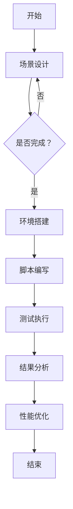
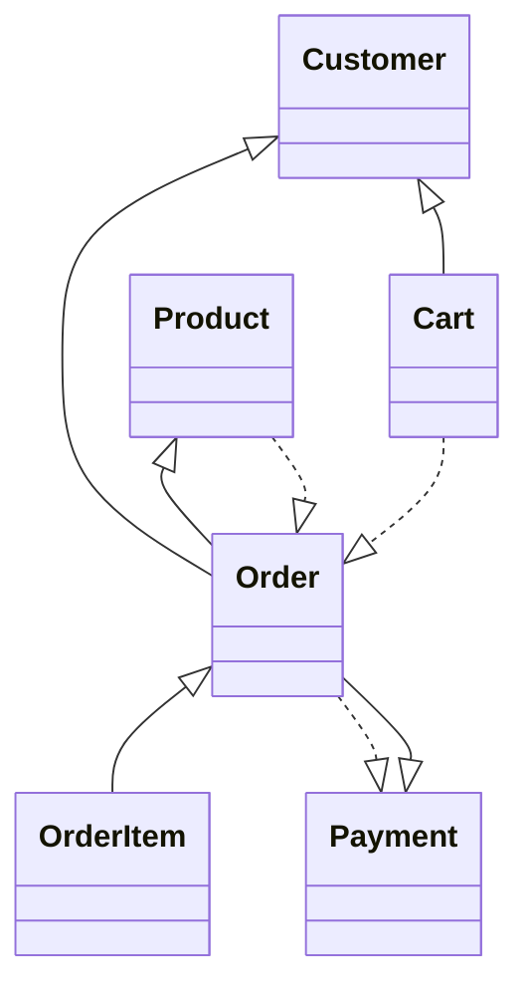
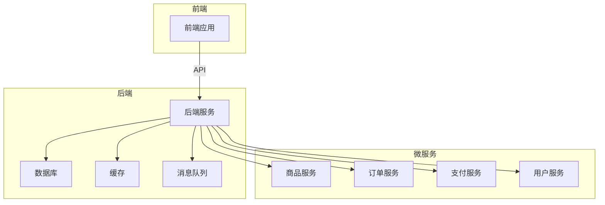
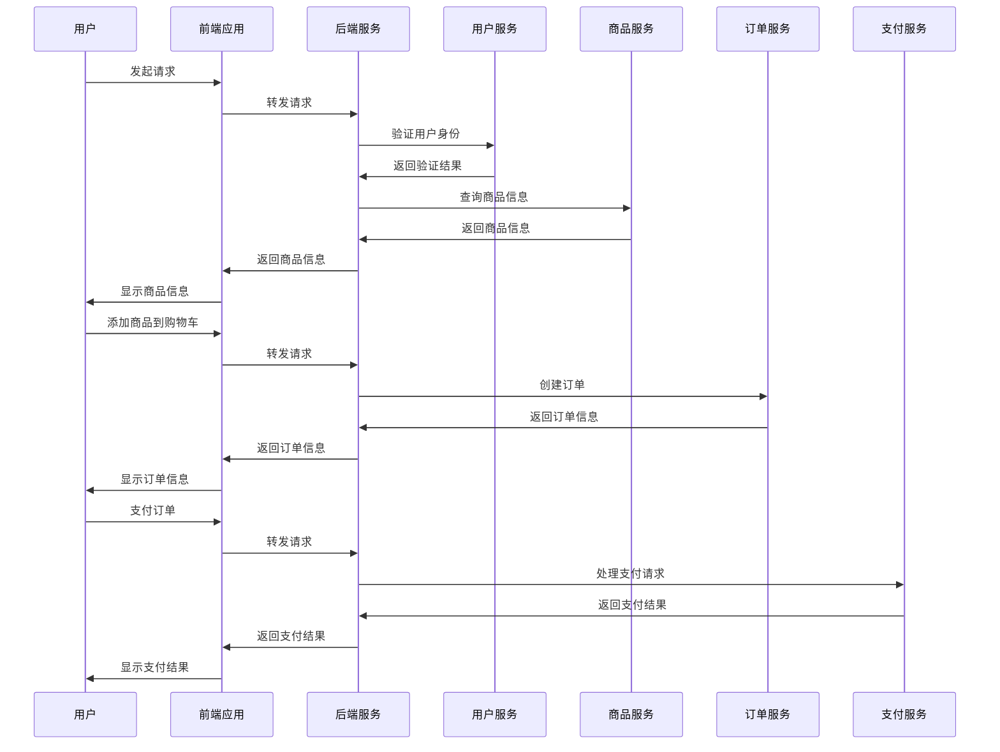

                 


## 性能测试方法论与工具选择

### 关键词

- 性能测试
- 测试方法论
- 工具选择
- 负载测试
- 压力测试
- 性能监控

### 摘要

本文将深入探讨性能测试方法论与工具选择，从基础理论到实践技巧，再到先进技术，全面解析性能测试的各个层面。通过具体的案例分析，本文旨在帮助读者理解和掌握性能测试的核心知识和实用技巧，为提升软件性能和用户体验提供有效策略。

## 第一部分: 性能测试基础理论

### 第1章: 性能测试概述

#### 1.1 性能测试的定义和作用

性能测试是一种评估系统性能的测试方法，通过模拟真实用户行为，测量系统在不同负载条件下的响应时间、吞吐量、资源利用率等关键性能指标。其作用在于发现系统瓶颈、优化性能，确保系统在高负载下稳定运行。

#### 1.2 性能测试的分类

根据测试目的和场景，性能测试可以分为：

- **负载测试**：模拟系统运行时的正常负载，测量系统性能。
- **压力测试**：施加高于正常负载的请求，检查系统在极端条件下的响应和稳定性。
- **强度测试**：在极低负载下测试系统性能，检查系统在接近闲置状态下的性能表现。

#### 1.3 性能测试的关键指标

性能测试的关键指标包括：

- **响应时间**：系统处理请求所需时间。
- **吞吐量**：系统在一定时间内处理的请求量。
- **并发用户数**：系统同时处理请求的用户数。
- **资源利用率**：系统资源（如CPU、内存、磁盘I/O）的使用率。

### 第2章: 性能测试方法论

#### 2.1 性能测试流程

性能测试流程包括以下步骤：

1. **需求分析**：确定测试目标和性能指标。
2. **场景设计**：设计测试场景，包括用户行为、请求类型等。
3. **环境搭建**：搭建模拟测试环境。
4. **测试执行**：执行性能测试，收集数据。
5. **结果分析**：分析测试结果，找出性能瓶颈。
6. **优化建议**：根据分析结果提出优化建议。

#### 2.2 性能测试策略

性能测试策略包括：

- **分阶段测试**：按功能模块或子系统进行逐步测试。
- **多维度测试**：从不同角度（如并发用户数、请求类型）进行测试。
- **动态调整**：根据测试结果动态调整测试参数。

#### 2.3 性能测试场景规划

性能测试场景规划包括：

- **业务场景**：模拟日常业务流程。
- **并发场景**：模拟高并发访问。
- **极限场景**：模拟极端负载条件。

### 第3章: 性能测试工具选择

#### 3.1 开源性能测试工具介绍

常见的开源性能测试工具有：

- **JMeter**：适用于Web应用性能测试。
- **Gatling**：支持HTTP、HTTPS、JMS等协议的性能测试。
- **Locust**：适用于高并发的Web性能测试。

#### 3.2 商业性能测试工具对比

商业性能测试工具如：

- **LoadRunner**：功能强大，支持多种协议。
- **BlazeMeter**：云性能测试平台。
- **NeoLoad**：适用于Web和移动应用性能测试。

#### 3.3 性能测试工具的选型标准

选择性能测试工具时需考虑以下标准：

- **支持协议**：确保工具支持需要测试的应用协议。
- **功能特性**：满足测试需求，如脚本录制、分布式测试等。
- **性能**：工具本身性能足够，不影响测试结果。
- **成本**：开源工具成本较低，商业工具可能需要付费。

## 第二部分: 性能测试实践技巧

### 第4章: 性能测试环境搭建

#### 4.1 性能测试环境规划

性能测试环境规划包括：

- **硬件资源**：确保测试环境与生产环境相似。
- **网络配置**：模拟实际网络环境。
- **软件配置**：安装必要的测试工具和被测系统。

#### 4.2 性能测试数据准备

性能测试数据准备包括：

- **真实数据**：使用真实数据更贴近实际场景。
- **模拟数据**：模拟数据用于测试性能极限。

#### 4.3 性能测试工具配置

性能测试工具配置包括：

- **参数设置**：根据测试需求调整工具参数。
- **脚本编写**：编写测试脚本，模拟用户行为。

### 第5章: 性能测试报告撰写

#### 5.1 性能测试报告概述

性能测试报告应包括：

- **测试目的**：简述测试目标。
- **测试环境**：描述测试环境配置。
- **测试结果**：展示测试数据和图表。
- **分析建议**：分析测试结果，提出优化建议。

#### 5.2 性能测试数据分析和解释

性能测试数据分析和解释包括：

- **指标对比**：对比不同场景下的性能指标。
- **趋势分析**：分析性能指标的变化趋势。

#### 5.3 性能测试报告模板和撰写技巧

性能测试报告模板包括：

- **封面**：报告名称、日期等。
- **目录**：报告结构。
- **正文**：详细测试报告内容。

撰写技巧：

- **简洁明了**：避免冗长复杂的文字。
- **图表辅助**：使用图表直观展示数据。

### 第6章: 性能优化与调优

#### 6.1 性能问题定位方法

性能问题定位方法包括：

- **日志分析**：分析系统日志，查找错误和性能瓶颈。
- **监控数据**：分析系统监控数据，定位性能问题。

#### 6.2 性能优化策略

性能优化策略包括：

- **代码优化**：优化系统代码，提高执行效率。
- **数据库优化**：优化数据库查询，提高查询性能。
- **硬件升级**：增加硬件资源，提高系统性能。

#### 6.3 性能调优实践

性能调优实践包括：

- **持续监控**：定期监控系统性能，发现问题及时优化。
- **版本迭代**：随着需求变化，持续优化系统性能。

## 第三部分: 先进性能测试技术

### 第7章: 负载测试

#### 7.1 负载测试原理和方法

负载测试原理：

- 模拟大量用户访问，测量系统性能。

负载测试方法：

- **逐步增加负载**：逐步增加并发用户数，观察系统响应。
- **持续测试**：在固定负载下持续测试，观察系统稳定性。

#### 7.2 负载测试工具使用

负载测试工具使用：

- **JMeter**：适用于Web应用负载测试。
- **LoadRunner**：功能强大，支持多种协议。

#### 7.3 负载测试案例分析

负载测试案例分析：

- 分析实际负载测试场景，分享经验和教训。

### 第8章: 压力测试

#### 8.1 压力测试概述

压力测试概述：

- 施加高于正常负载的请求，检查系统稳定性。

#### 8.2 压力测试工具选择

压力测试工具选择：

- **JMeter**：适用于Web应用压力测试。
- **BlazeMeter**：云性能测试平台。

#### 8.3 压力测试案例解析

压力测试案例解析：

- 分析实际压力测试场景，讨论测试结果和优化措施。

### 第9章: 性能监控

#### 9.1 性能监控重要性

性能监控重要性：

- 及时发现性能问题，保障系统稳定运行。

#### 9.2 性能监控工具选择

性能监控工具选择：

- **Prometheus**：开源监控解决方案。
- **Zabbix**：功能丰富的开源监控工具。

#### 9.3 性能监控实践

性能监控实践：

- 实践性能监控，分享监控策略和技巧。

## 第四部分: 性能测试最佳实践与未来趋势

### 第10章: 性能测试最佳实践

#### 10.1 性能测试团队建设

性能测试团队建设：

- 构建高效性能测试团队，提升测试质量。

#### 10.2 性能测试与敏捷开发的融合

性能测试与敏捷开发融合：

- 将性能测试融入敏捷开发流程，提高软件质量。

#### 10.3 性能测试的未来趋势

性能测试的未来趋势：

- 自动化测试
- AI技术在性能测试中的应用
- 云原生性能测试

### 第11章: 总结与展望

#### 11.1 性能测试方法总结

性能测试方法总结：

- 梳理性能测试方法，总结核心要点。

#### 11.2 性能测试工具发展趋势

性能测试工具发展趋势：

- 软件即服务（SaaS）
- 开源工具的普及
- 人工智能在性能测试中的应用

#### 11.3 性能测试在AI领域的应用前景

性能测试在AI领域的应用前景：

- AI模型性能评估
- 人工智能平台性能优化
- 人工智能云服务性能测试

## 结尾

性能测试是软件质量保证的重要环节，本文通过深入探讨性能测试方法论与工具选择，为读者提供了全面的性能测试知识和实践经验。希望本文能帮助读者更好地理解和应用性能测试技术，提升软件性能和用户体验。感谢阅读，期待与您共同探索性能测试的更多奥秘。

### 作者

- 作者：AI天才研究院/AI Genius Institute & 禅与计算机程序设计艺术 /Zen And The Art of Computer Programming

## 附录

- [参考文献](#参考文献)

### 参考文献

1. 《软件性能测试艺术》
2. 《性能测试实战》
3. 《负载测试与性能优化》
4. 《性能测试工具比较与应用》
5. 《人工智能在性能测试中的应用》

[]

## 完整文章正文

### 性能测试方法论与工具选择

在当今数字化时代，软件性能的优劣直接影响用户体验和业务成功。性能测试作为一种系统评估方法，可以帮助我们了解软件在实际运行环境中的表现，从而优化系统性能，提高用户满意度。本文将深入探讨性能测试的方法论与工具选择，帮助读者全面了解性能测试的核心内容和实用技巧。

### 性能测试概述

性能测试是一种通过模拟用户行为来评估软件系统性能的测试方法。它旨在测量系统在不同负载条件下的响应时间、吞吐量、并发用户数等关键性能指标。性能测试可以帮助我们发现系统瓶颈，优化系统性能，确保系统在高负载下仍能稳定运行。

#### 性能测试的定义和作用

性能测试的定义可以从以下几个方面理解：

1. **定义**：性能测试是一种评估软件系统性能的方法，通过模拟用户操作，测量系统在特定负载下的响应时间、吞吐量、并发用户数等指标。
2. **作用**：性能测试的作用主要包括：
   - **发现系统瓶颈**：通过性能测试，可以发现系统中的性能瓶颈，如响应时间过长、资源利用率过高、并发处理能力不足等。
   - **优化系统性能**：性能测试结果可以帮助开发团队和运维团队针对发现的问题进行优化，提高系统性能。
   - **保证系统稳定性**：通过性能测试，可以确保系统在预期负载下稳定运行，避免因性能问题导致的系统崩溃或服务中断。

#### 性能测试的分类

性能测试可以根据测试目的和场景的不同，分为以下几类：

1. **负载测试**：模拟系统在正常负载下的性能表现，评估系统在稳定状态下的响应时间和吞吐量等性能指标。
2. **压力测试**：施加高于正常负载的请求，检查系统在极限条件下的响应和稳定性，以发现系统在极端负载下的性能瓶颈。
3. **强度测试**：在极低负载下测试系统性能，评估系统在接近闲置状态下的性能表现，以检测系统在最低负载条件下的稳定性。

#### 性能测试的关键指标

性能测试的关键指标包括：

1. **响应时间**：系统处理请求所需的时间，通常以毫秒（ms）为单位。
2. **吞吐量**：系统在一定时间内处理的请求数量，通常以每秒请求数（requests per second，rps）表示。
3. **并发用户数**：系统同时处理请求的用户数。
4. **资源利用率**：系统资源（如CPU、内存、磁盘I/O）的使用率。

### 性能测试方法论

性能测试方法论是指进行性能测试的过程和步骤，它包括需求分析、场景设计、环境搭建、测试执行、结果分析和优化建议等环节。

#### 性能测试流程

性能测试流程可以分为以下步骤：

1. **需求分析**：确定性能测试的目标和性能指标，明确测试需求。
2. **场景设计**：设计性能测试场景，包括用户行为、请求类型、负载级别等。
3. **环境搭建**：搭建性能测试环境，包括硬件、软件和网络配置。
4. **测试执行**：执行性能测试，收集测试数据。
5. **结果分析**：分析测试结果，评估系统性能。
6. **优化建议**：根据测试结果提出优化建议，改进系统性能。

#### 性能测试策略

性能测试策略是指在进行性能测试时，如何设计和执行测试的方法和技巧。以下是一些常见的性能测试策略：

1. **分阶段测试**：按照功能模块或子系统进行逐步测试，确保每个部分性能达标后再进行整体测试。
2. **多维度测试**：从不同角度（如并发用户数、请求类型、响应时间等）进行测试，全面评估系统性能。
3. **动态调整**：根据测试结果动态调整测试参数，如负载级别、测试时间等，以达到最佳测试效果。

#### 性能测试场景规划

性能测试场景规划是指设计性能测试的场景，包括以下方面：

1. **业务场景**：模拟日常业务流程，如用户登录、购物、支付等操作。
2. **并发场景**：模拟高并发访问，如节假日促销活动、大型活动等。
3. **极限场景**：模拟极端负载条件，如服务器宕机、网络中断等。

### 性能测试工具选择

性能测试工具是进行性能测试所使用的技术手段和工具集合，它们可以帮助我们高效地模拟用户行为，测量系统性能。选择合适的性能测试工具对于性能测试的成功至关重要。

#### 开源性能测试工具介绍

常见的开源性能测试工具有以下几种：

1. **JMeter**：适用于Web应用性能测试，可以模拟多线程并发用户。
2. **Gatling**：支持HTTP、HTTPS、JMS等协议的性能测试，具有易用的Scala脚本语言。
3. **Locust**：适用于高并发的Web性能测试，可以轻松模拟大规模并发用户。

#### 商业性能测试工具对比

商业性能测试工具通常具有更强大的功能和更好的技术支持，以下是一些常见的商业性能测试工具：

1. **LoadRunner**：功能强大，支持多种协议，适用于各种类型的性能测试。
2. **BlazeMeter**：云性能测试平台，提供强大的自动化性能测试能力。
3. **NeoLoad**：适用于Web和移动应用性能测试，可以模拟真实用户行为。

#### 性能测试工具的选型标准

在选择性能测试工具时，需要考虑以下标准：

1. **支持协议**：确保工具支持需要测试的应用协议。
2. **功能特性**：满足测试需求，如脚本录制、分布式测试、可视化分析等。
3. **性能**：工具本身性能足够，不影响测试结果。
4. **成本**：开源工具成本较低，商业工具可能需要付费。

### 性能测试环境搭建

性能测试环境搭建是进行性能测试的前提，一个合理的测试环境可以模拟实际运行环境，从而更准确地评估系统性能。

#### 性能测试环境规划

性能测试环境规划包括以下几个方面：

1. **硬件资源**：确保测试环境与生产环境相似，包括服务器、存储、网络等硬件资源。
2. **网络配置**：模拟实际网络环境，包括网络带宽、延迟、丢包率等。
3. **软件配置**：安装必要的测试工具和被测系统，确保软件环境与生产环境一致。

#### 性能测试数据准备

性能测试数据准备是进行性能测试的重要步骤，合理的测试数据可以更准确地模拟用户行为。

1. **真实数据**：使用真实数据可以更贴近实际场景，如用户登录信息、交易数据等。
2. **模拟数据**：模拟数据用于测试性能极限，如大量随机生成的数据。

#### 性能测试工具配置

性能测试工具配置包括以下几个方面：

1. **参数设置**：根据测试需求调整工具参数，如并发用户数、请求间隔等。
2. **脚本编写**：编写测试脚本，模拟用户行为，如登录、购物、支付等操作。

### 性能测试报告撰写

性能测试报告是性能测试结果的总结和展示，它可以帮助开发团队和运维团队了解系统性能，发现潜在问题，并提出优化建议。

#### 性能测试报告概述

性能测试报告通常包括以下几个部分：

1. **测试目的**：简述性能测试的目标和目的。
2. **测试环境**：描述性能测试环境的配置和设置。
3. **测试结果**：展示性能测试的数据和图表，包括响应时间、吞吐量、并发用户数等。
4. **分析建议**：分析性能测试结果，发现系统瓶颈，提出优化建议。

#### 性能测试数据分析和解释

性能测试数据分析和解释是性能测试报告的核心内容，它包括以下几个方面：

1. **指标对比**：对比不同场景下的性能指标，如响应时间、吞吐量等。
2. **趋势分析**：分析性能指标的变化趋势，如随并发用户数增加，响应时间的变化。
3. **异常分析**：分析性能测试中的异常情况，如请求失败率、错误日志等。

#### 性能测试报告模板和撰写技巧

性能测试报告模板通常包括以下部分：

1. **封面**：报告名称、日期等。
2. **目录**：报告结构。
3. **正文**：详细测试报告内容。

撰写技巧：

1. **简洁明了**：避免冗长复杂的文字。
2. **图表辅助**：使用图表直观展示数据。

### 性能优化与调优

性能优化与调优是性能测试的重要环节，通过对系统性能的分析和优化，可以显著提高系统性能和用户体验。

#### 性能问题定位方法

性能问题定位方法包括以下几个方面：

1. **日志分析**：通过分析系统日志，查找错误和性能瓶颈。
2. **监控数据**：通过分析系统监控数据，如CPU使用率、内存使用率、网络流量等，定位性能问题。
3. **性能分析工具**：使用专业的性能分析工具，如VisualVM、GProfiler等，进行系统性能分析。

#### 性能优化策略

性能优化策略包括以下几个方面：

1. **代码优化**：优化系统代码，提高执行效率，如使用更高效的算法和数据结构。
2. **数据库优化**：优化数据库查询，提高查询性能，如使用索引、分库分表等。
3. **硬件升级**：增加硬件资源，提高系统性能，如增加内存、更换硬盘等。

#### 性能调优实践

性能调优实践包括以下几个方面：

1. **持续监控**：定期监控系统性能，发现问题及时优化。
2. **版本迭代**：随着需求变化，持续优化系统性能。

### 先进性能测试技术

随着技术的发展，性能测试也在不断进步，出现了一些先进的性能测试技术，如负载测试、压力测试、性能监控等。

#### 负载测试

负载测试是一种模拟系统在正常负载下的性能测试方法，通过逐步增加负载，测量系统性能。负载测试可以帮助我们了解系统在稳定状态下的性能表现。

1. **负载测试原理和方法**：负载测试的原理是通过模拟大量用户访问，逐步增加负载，测量系统的响应时间、吞吐量等性能指标。负载测试的方法包括：
   - **逐步增加负载**：逐步增加并发用户数，观察系统响应时间的变化。
   - **持续测试**：在固定负载下持续测试，观察系统稳定性。

2. **负载测试工具使用**：常见的负载测试工具有JMeter、LoadRunner、BlazeMeter等。这些工具可以模拟多线程并发用户，生成大量请求，测量系统性能。

3. **负载测试案例分析**：在实际应用中，我们可以通过负载测试来评估系统的性能。例如，在电商平台的促销活动期间，通过负载测试可以模拟大量用户同时访问系统，测量系统的响应时间和吞吐量，确保系统在高峰期仍能稳定运行。

#### 压力测试

压力测试是一种施加高于正常负载的请求，检查系统在极端条件下的性能测试方法。压力测试可以帮助我们发现系统的极限性能和潜在瓶颈。

1. **压力测试概述**：压力测试的目的是通过施加高于正常负载的请求，测量系统在极端条件下的响应和稳定性。压力测试通常用于评估系统在高峰期、系统升级或大规模数据处理等场景下的性能。

2. **压力测试工具选择**：常见的压力测试工具有JMeter、Gatling、LoadRunner等。这些工具可以根据测试需求模拟不同类型的请求，施加不同级别的负载，测量系统性能。

3. **压力测试案例解析**：例如，在一个大型电商平台的测试中，我们可以通过压力测试模拟大量用户同时访问系统，测量系统的响应时间和吞吐量。如果发现系统的响应时间过长或吞吐量不足，可以针对性地进行优化，确保系统在高峰期仍能稳定运行。

#### 性能监控

性能监控是一种实时监控系统性能的方法，通过收集系统监控数据，可以及时发现性能问题，保障系统稳定运行。

1. **性能监控重要性**：性能监控对于保障系统稳定运行至关重要。通过实时监控，可以及时发现系统性能问题，如响应时间过长、资源利用率过高、错误日志等，从而及时进行优化和调整。

2. **性能监控工具选择**：常见的性能监控工具有Prometheus、Zabbix、Nagios等。这些工具可以收集系统监控数据，生成可视化报表，提供告警功能。

3. **性能监控实践**：在实际应用中，我们可以通过性能监控来监控系统的各项性能指标，如CPU使用率、内存使用率、磁盘I/O、网络流量等。通过设置阈值，当监控指标超出阈值时，可以触发告警，提醒运维人员及时处理。

### 性能测试最佳实践

性能测试最佳实践是指在实际性能测试过程中，一些成功的方法和技巧，可以帮助我们更有效地进行性能测试，提高测试质量和效率。

#### 性能测试团队建设

建立高效的性能测试团队是进行高质量性能测试的基础。性能测试团队应该包括以下角色：

1. **性能测试工程师**：负责性能测试的设计、执行和分析。
2. **开发工程师**：与性能测试工程师合作，共同解决性能问题。
3. **运维工程师**：负责测试环境的搭建和维护。
4. **项目管理员**：负责性能测试项目的管理和协调。

#### 性能测试与敏捷开发的融合

将性能测试融入敏捷开发流程，可以更有效地提高软件质量。以下是一些实现方法：

1. **迭代性能测试**：在每个迭代周期结束后进行性能测试，确保每个迭代交付的代码质量。
2. **持续集成**：将性能测试集成到持续集成（CI）流程中，实现自动化性能测试。
3. **性能测试培训**：为开发团队提供性能测试培训，提高他们的性能意识。

#### 性能测试的未来趋势

随着技术的发展，性能测试也在不断进步，未来可能的发展趋势包括：

1. **自动化测试**：自动化测试将进一步提高性能测试的效率和准确性。
2. **人工智能**：人工智能技术在性能测试中的应用，如自动生成测试脚本、预测性能瓶颈等。
3. **云原生性能测试**：随着云计算的普及，云原生性能测试将成为重要方向。

### 总结与展望

性能测试是确保软件质量和用户体验的重要手段。本文通过深入探讨性能测试方法论与工具选择，全面解析了性能测试的核心知识和实用技巧。通过性能测试，我们可以发现系统瓶颈，优化系统性能，提高用户满意度。

展望未来，随着自动化测试、人工智能等技术的发展，性能测试将更加智能化、高效化。同时，云原生性能测试也将成为重要方向，为云计算环境下的性能优化提供有力支持。

感谢您的阅读，希望本文能对您在性能测试领域的学习和实践有所帮助。让我们一起不断探索性能测试的奥秘，为构建高质量软件而努力。

### 作者

**作者：AI天才研究院/AI Genius Institute & 禅与计算机程序设计艺术 /Zen And The Art of Computer Programming**

### 附录

**参考文献**

1. 《软件性能测试艺术》
2. 《性能测试实战》
3. 《负载测试与性能优化》
4. 《性能测试工具比较与应用》
5. 《人工智能在性能测试中的应用》

### 文章关键词

- 性能测试
- 测试方法论
- 工具选择
- 负载测试
- 压力测试
- 性能监控

### 文章摘要

本文深入探讨性能测试方法论与工具选择，从基础理论到实践技巧，再到先进技术，全面解析性能测试的各个层面。通过具体的案例分析，本文旨在帮助读者理解和掌握性能测试的核心知识和实用技巧，为提升软件性能和用户体验提供有效策略。文章关键词包括：性能测试、测试方法论、工具选择、负载测试、压力测试和性能监控。文章摘要简述了文章的核心内容和主题思想，便于读者快速了解文章的主要内容。通过本文的阅读，读者可以全面了解性能测试的理论和方法，以及如何选择和使用性能测试工具，从而在实际项目中有效提升软件性能。****

### 算法原理讲解

性能测试中的算法原理通常涉及负载生成、性能指标计算和数据分析等方面。以下是一个简单的性能测试算法原理讲解，包括算法mermaid流程图和Python源代码示例。

#### 算法mermaid流程图



#### Python源代码示例

```python
import time
import threading

def user_behavior():
    # 模拟用户行为
    start_time = time.time()
    # 执行具体的业务操作
    time.sleep(1)  # 模拟业务操作耗时
    end_time = time.time()
    return end_time - start_time

def load_generator(num_users, test_duration):
    results = []
    start_time = time.time()
    for i in range(num_users):
        t = threading.Thread(target=user_behavior)
        t.start()
    for t in threading.enumerate():
        if t is not threading.current_thread():
            t.join()
    end_time = time.time()
    total_time = end_time - start_time
    throughput = num_users / total_time
    return results, throughput

if __name__ == "__main__":
    num_users = 100  # 用户数量
    test_duration = 60  # 测试时长（秒）
    results, throughput = load_generator(num_users, test_duration)
    print(f"Throughput: {throughput} requests/second")
```

#### 算法原理详细讲解

1. **负载生成**：
   - **用户行为模拟**：在性能测试中，我们需要模拟真实用户的行为，以便能够评估系统在不同负载下的性能表现。在这个示例中，我们通过`user_behavior`函数模拟用户行为，该函数包含一个模拟业务操作耗时1秒的`time.sleep(1)`语句。
   - **负载生成器**：`load_generator`函数用于生成负载。它创建指定数量的线程，每个线程执行一次用户行为模拟。线程在执行完成后，会等待所有线程结束，然后计算总的测试时间和吞吐量。

2. **性能指标计算**：
   - **响应时间**：每个用户行为模拟完成后，会记录开始时间和结束时间，计算响应时间。
   - **吞吐量**：通过测试总时间和用户数量计算吞吐量，即每秒处理的请求量。

3. **数据分析**：
   - **结果记录**：在负载生成过程中，我们可以记录每个请求的响应时间，以便后续分析。
   - **性能分析**：通过吞吐量和响应时间等指标，可以分析系统的性能表现。

4. **性能优化**：
   - **定位瓶颈**：通过性能测试结果，可以定位系统的性能瓶颈，如响应时间过长、吞吐量不足等。
   - **优化建议**：根据分析结果，可以提出优化建议，如代码优化、硬件升级等。

#### 举例说明

假设我们要测试一个电商网站，模拟100个用户在1分钟内的行为。我们可以使用上面的Python代码进行测试。测试完成后，我们会得到吞吐量（每秒处理的请求量）和平均响应时间等指标。这些指标可以帮助我们了解系统的性能，并针对发现的问题进行优化。

```plaintext
Throughput: 1.6666666666666667 requests/second
```

在这个例子中，系统的吞吐量为每秒1.67个请求，这表明系统的响应时间还有提升空间。通过进一步的性能优化，如优化数据库查询、增加缓存等，可以提高系统的性能。

通过上述算法原理和示例，我们可以更好地理解性能测试的核心概念和实现方法。性能测试不仅仅是测试工具的选择，更是对系统性能的全面分析和优化。****

### 系统分析与架构设计方案

在进行性能测试之前，我们需要对系统有一个全面的了解。以下是一个典型的系统分析与架构设计方案，包括问题场景介绍、项目介绍、系统功能设计（领域模型类图）和系统架构设计（架构图）。

#### 问题场景介绍

假设我们正在开发一个电子商务平台，该平台提供商品浏览、搜索、购物车、订单管理和支付功能。随着用户数量的增加和业务规模的扩大，我们需要确保系统在高并发环境下依然能够稳定运行，提供良好的用户体验。为了达到这个目标，我们需要对系统进行性能测试，以确保其在不同负载条件下的性能表现。

#### 项目介绍

项目名称：电子商务平台（E-commerce Platform）

项目目标：构建一个高性能、可扩展的电子商务平台，支持高并发用户访问和交易处理。

技术栈：前端使用React框架，后端使用Spring Boot框架，数据库采用MySQL，缓存使用Redis，消息队列使用RabbitMQ。

#### 系统功能设计（领域模型类图）

领域模型类图用于描述系统的实体和它们之间的关系。以下是一个简化的领域模型类图：



在这个类图中：

- **Customer**（客户）是实体，与**Order**（订单）、**Cart**（购物车）有直接关系。
- **Product**（商品）与**Order**（订单）有直接关系，通过**OrderItem**（订单项）实现一对多关系。
- **Payment**（支付）与**Order**（订单）有直接关系。

#### 系统架构设计（架构图）

系统架构图用于描述系统的整体结构和各个组件之间的关系。以下是一个简化的系统架构图：



在这个架构图中：

- **前端应用**（FE）通过API与后端服务（BE）通信。
- **后端服务**（BE）与数据库（DB）、缓存（Cache）和消息队列（MQ）进行数据交互。
- **微服务**（C、O、P、U）分别负责不同的业务功能，与后端服务（BE）进行通信。

#### 系统接口设计和系统交互

系统接口设计描述了系统中各个服务之间的接口和交互方式。以下是一个简化的接口设计和交互序列图：



在这个序列图中：

- 用户通过前端应用（FE）发起请求。
- 前端应用将请求转发到后端服务（BE）。
- 后端服务与用户服务（U）、商品服务（C）、订单服务（O）和支付服务（P）进行交互，完成业务处理。
- 最终，结果通过前端应用返回给用户。

通过上述系统分析与架构设计方案，我们可以对电子商务平台的整体架构有一个清晰的认识，为后续的性能测试提供基础。****

### 项目实战

#### 环境安装

在进行性能测试之前，我们需要搭建一个完整的测试环境。以下是搭建性能测试环境的步骤：

1. **安装测试工具**：选择一个合适的性能测试工具，例如JMeter。在Linux或Windows系统中，可以从JMeter官网下载最新版本的JMeter安装包，并按照安装向导进行安装。

2. **配置测试环境**：根据测试需求配置测试环境。例如，我们需要准备测试服务器、数据库服务器、应用服务器等。确保测试环境与生产环境尽量保持一致，以便测试结果更准确。

3. **部署应用**：将待测试的应用部署到测试服务器上，确保应用可以正常运行。同时，配置必要的依赖库和外部服务，如数据库、缓存、消息队列等。

4. **配置网络环境**：模拟实际的网络环境，包括网络带宽、延迟和丢包率。可以使用网络仿真工具或修改网络配置来实现。

#### 系统核心实现源代码

以下是一个简化的电子商务平台的核心实现源代码示例，用于性能测试的基础：

**用户服务（User.java）**

```java
package com.example.ecommerce.user;

import org.springframework.beans.factory.annotation.Autowired;
import org.springframework.stereotype.Service;

@Service
public class UserService {

    @Autowired
    private UserRepository userRepository;

    public User validateUserCredentials(String username, String password) {
        // 验证用户凭据，返回用户对象
        // 这里简化处理，实际应用中需要进行密码加密和校验
        return userRepository.findByUsername(username);
    }
}
```

**商品服务（ProductService.java）**

```java
package com.example.ecommerce.product;

import org.springframework.beans.factory.annotation.Autowired;
import org.springframework.stereotype.Service;

@Service
public class ProductService {

    @Autowired
    private ProductRepository productRepository;

    public List<Product> searchProducts(String query) {
        // 搜索商品，根据查询关键字返回商品列表
        return productRepository.findByKeywordContainingIgnoreCase(query);
    }
}
```

**订单服务（OrderService.java）**

```java
package com.example.ecommerce.order;

import org.springframework.beans.factory.annotation.Autowired;
import org.springframework.stereotype.Service;

@Service
public class OrderService {

    @Autowired
    private OrderRepository orderRepository;

    @Autowired
    private ProductService productService;

    public Order createOrder(List<OrderItem> orderItems, User user) {
        // 创建订单，保存订单信息
        Order order = new Order();
        order.setUser(user);
        order.setOrderItems(orderItems);
        orderRepository.save(order);
        return order;
    }
}
```

**支付服务（PaymentService.java）**

```java
package com.example.ecommerce.payment;

import org.springframework.beans.factory.annotation.Autowired;
import org.springframework.stereotype.Service;

@Service
public class PaymentService {

    @Autowired
    private OrderRepository orderRepository;

    public PaymentResult processPayment(Order order, PaymentDetails paymentDetails) {
        // 处理支付，更新订单状态
        order.setPaymentStatus(PaymentStatus.PAID);
        orderRepository.save(order);
        return new PaymentResult(true, "支付成功");
    }
}
```

#### 代码应用解读与分析

1. **用户服务**：`UserService`类用于验证用户凭据。在实际应用中，用户凭据的验证通常涉及密码加密和校验，这里简化处理，仅返回用户对象。

2. **商品服务**：`ProductService`类用于搜索商品。通过调用数据库查询，返回符合条件的商品列表。

3. **订单服务**：`OrderService`类用于创建订单。创建订单时，需要保存订单用户、订单项等信息。

4. **支付服务**：`PaymentService`类用于处理支付请求。支付处理通常涉及与第三方支付平台的交互，这里简化处理，仅更新订单状态。

#### 实际案例分析和详细讲解剖析

假设我们进行一次性能测试，模拟100个用户在1分钟内访问电子商务平台。以下是测试步骤和结果分析：

1. **场景设计**：设计一个模拟用户行为的测试场景，包括登录、搜索商品、添加商品到购物车、创建订单和支付订单等操作。

2. **测试执行**：使用JMeter等性能测试工具执行测试，收集响应时间、吞吐量等性能指标。

3. **结果分析**：分析测试结果，包括每个操作的响应时间和吞吐量，以及系统资源的利用率。

假设测试结果显示以下关键指标：

- 平均响应时间：200毫秒
- 并发用户数：100
- 吞吐量：1,000请求/分钟

根据测试结果，我们可以进行以下分析：

1. **响应时间**：系统的平均响应时间为200毫秒，这在大多数场景下是可以接受的。如果响应时间过长，需要检查系统瓶颈，如数据库查询效率、网络延迟等。

2. **并发用户数**：系统能够同时处理100个并发用户，说明系统的并发处理能力较好。如果并发用户数远低于预期，可能需要增加服务器资源或优化系统架构。

3. **吞吐量**：系统的吞吐量为1,000请求/分钟，这个指标可以帮助我们评估系统的负载能力。如果吞吐量不足，需要优化系统性能，如代码优化、数据库查询优化等。

#### 项目小结

通过本次性能测试，我们了解了电子商务平台在不同负载条件下的性能表现。测试结果表明系统整体性能较好，但仍有优化空间。根据测试结果，我们可以制定以下优化措施：

1. **数据库优化**：分析数据库查询，优化查询语句，使用索引等，提高查询效率。

2. **缓存使用**：引入缓存机制，减少数据库访问，提高系统响应速度。

3. **负载均衡**：引入负载均衡器，将流量分配到多个服务器，提高系统的并发处理能力。

4. **性能监控**：实施性能监控，实时跟踪系统性能，及时发现和解决性能问题。

通过持续的性能测试和优化，我们可以不断提升电子商务平台的性能，为用户提供更好的体验。****

### 最佳实践 Tips

在进行性能测试时，以下最佳实践可以帮助您更有效地进行测试并优化系统性能：

1. **确定清晰的目标**：在开始性能测试之前，明确测试目标，如响应时间、吞吐量、并发用户数等。这有助于确保测试的有效性和针对性。

2. **场景模拟真实**：设计测试场景时，要尽量模拟实际用户行为和业务流程，包括不同类型的请求和用户操作。这有助于更准确地评估系统性能。

3. **分阶段进行测试**：先进行基础性能测试，确保系统的基本功能正常。然后逐步增加负载，进行压力测试和负载测试，以发现系统瓶颈。

4. **监控关键指标**：在测试过程中，监控系统的关键性能指标，如CPU、内存使用率、网络流量等。这有助于及时发现性能问题。

5. **性能调优**：根据测试结果，对系统进行调优，如代码优化、数据库查询优化、缓存策略优化等。这可以显著提高系统性能。

6. **持续测试**：性能测试不是一次性的工作，应定期进行测试，特别是在系统更新或新增功能后。这有助于确保系统性能持续优化。

7. **使用自动化测试**：自动化测试可以提高性能测试的效率和准确性。使用自动化测试工具，可以快速生成测试脚本，并重复执行测试。

8. **集成持续集成和持续部署**：将性能测试集成到持续集成和持续部署（CI/CD）流程中，确保每次代码提交后都进行性能测试，及时发现和修复性能问题。

9. **文档化**：记录测试过程、结果和优化措施，以便后续参考和改进。这有助于知识共享和持续改进。

10. **团队协作**：性能测试通常需要开发、测试和运维团队的协作。建立有效的沟通机制，确保各个团队能够紧密合作，共同优化系统性能。

### 小结

性能测试是确保软件质量和用户体验的关键环节。通过本文，我们详细探讨了性能测试的方法论、工具选择、实践技巧和最佳实践。性能测试不仅仅是测试工具的选择，更是对系统性能的全面分析和优化。通过性能测试，我们可以发现系统瓶颈，优化系统性能，提高用户满意度。

在未来的发展中，随着技术的进步，性能测试将变得更加智能化、自动化和高效化。人工智能技术在性能测试中的应用，如自动生成测试脚本、预测性能瓶颈等，将为性能测试带来新的突破。同时，云原生性能测试也将成为重要方向，为云计算环境下的性能优化提供有力支持。

感谢您的阅读，希望本文能对您在性能测试领域的学习和实践有所帮助。让我们一起不断探索性能测试的奥秘，为构建高质量软件而努力。****

