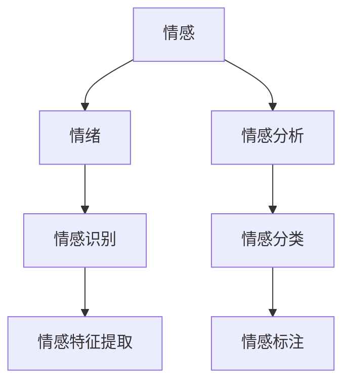
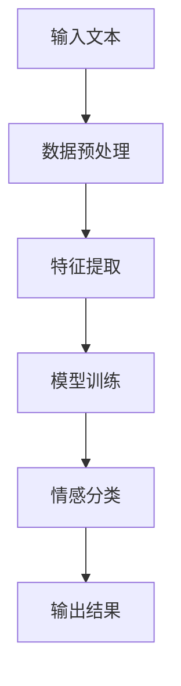
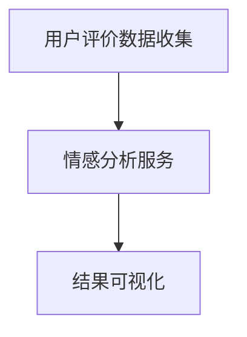
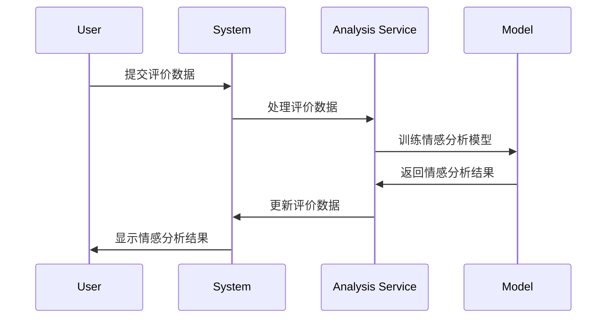

                 

### 情感分析：赋予AI Agent理解人类情绪的能力

#### 关键词：
- 情感分析
- AI Agent
- 人类情绪
- 算法
- 系统架构

#### 摘要：
本文深入探讨了情感分析在人工智能（AI）中的应用，特别是如何赋予AI Agent理解人类情绪的能力。我们将逐步分析情感分析的核心概念、算法原理，以及系统架构与实战案例，旨在提供一套完整的理解和实现方案。

---

## 引言

在现代社会，人与机器的交互日益频繁，AI Agent在其中扮演着越来越重要的角色。然而，为了实现高效、自然的交互，AI Agent必须具备理解人类情绪的能力。情感分析正是实现这一目标的桥梁，它通过分析文本、语音等数据，提取出情绪信息，从而让AI Agent更好地服务于人类。

本文将分为以下几个部分：
1. 背景介绍：情感分析的重要性及其发展历程。
2. 核心概念与联系：情感分析的基本概念及其相互关系。
3. 算法原理讲解：详细介绍情感分析算法的原理与实现。
4. 系统分析与架构设计方案：介绍系统分析方法和架构设计步骤。
5. 项目实战：通过实际案例展示情感分析的应用。
6. 最佳实践与总结：总结关键知识点和注意事项。

---

## 第一部分：背景介绍

### 1.1 情感分析的重要性

情感分析的重要性在于它能够帮助我们更好地理解人类情绪，从而改进用户体验。例如，在社交媒体分析中，情感分析可以帮助企业了解消费者的情感倾向，从而制定更有效的营销策略。在客户服务自动化中，情感分析可以让AI Agent更准确地理解客户的需求，提供个性化的服务。

### 1.2 情感分析的发展历程

情感分析的历史可以追溯到20世纪80年代，当时研究人员开始尝试使用自然语言处理（NLP）技术来分析文本中的情感。随着计算机性能的提升和深度学习技术的发展，情感分析技术也取得了显著的进步。如今，深度学习模型如卷积神经网络（CNN）和循环神经网络（RNN）在情感分析中发挥着重要作用。

### 1.3 情感分析的应用领域

情感分析的应用领域非常广泛，包括但不限于：
- 社交媒体分析
- 市场研究
- 客户服务自动化
- 医疗诊断
- 情感计算

---

## 第二部分：核心概念与联系

### 2.1 情感与情绪的定义

情感是一种复杂的心理体验，通常包括愉悦、悲伤、愤怒等基本情绪。情绪则是情感的具体表现形式，如快乐、沮丧、激愤等。情感与情绪之间的关系是紧密的，它们共同构成了我们对世界的感受和反应。

### 2.2 情感分析的基本原理

情感分析的基本原理是通过分析文本、语音等数据，识别出其中的情感信息。这通常涉及到以下步骤：
1. 数据预处理：包括分词、去停用词、词性标注等。
2. 情感特征提取：通过特征提取方法，从原始数据中提取出与情感相关的特征。
3. 模型训练：使用机器学习算法，如支持向量机（SVM）、神经网络等，训练情感分类模型。
4. 情感分类：使用训练好的模型对新的数据进行情感分类。

### 2.3 情感分析的核心概念关系图

为了更好地理解情感分析的核心概念，我们可以使用Mermaid绘制一个关系图。以下是一个简化的关系图示例：



### 2.4 情感分析的属性特征对比表

在情感分析中，不同的属性特征对于情感分类的准确性有着重要影响。以下是一个简化的属性特征对比表：

| 特征类型 | 描述 | 重要性 |
| --- | --- | --- |
| 词汇特征 | 基于单词和短语的统计特征 | 较高 |
| 语法特征 | 基于句法和词汇结构的特征 | 较高 |
| 情感词典 | 基于预定义的情感词典的特征 | 较低 |
| 语义特征 | 基于上下文和语义关系的特征 | 较高 |

### 2.5 ER实体关系图架构

为了更好地理解情感分析系统中的实体关系，我们可以使用ER模型绘制一个架构图。以下是一个简化的ER图示例：

```mermaid
entity Relation {
  "Document" <--> "Sentiment": analyzes
  "Document" <--> "Feature": extract
  "Feature" <--> "Sentiment": classified
}
```

---

## 第三部分：算法原理讲解

### 3.1 情感分析算法概述

情感分析算法可以分为两类：基于规则的方法和基于机器学习的方法。基于规则的方法通常依赖于情感词典和规则库，而基于机器学习的方法则使用大量标记数据训练分类模型。

### 3.2 情感分析算法的工作流程

情感分析算法的工作流程通常包括以下几个步骤：
1. 数据预处理：包括文本清洗、分词、词性标注等。
2. 特征提取：从原始文本中提取与情感相关的特征。
3. 模型训练：使用机器学习算法训练情感分类模型。
4. 情感分类：使用训练好的模型对新的文本进行情感分类。

### 3.3 情感分析算法的mermaid流程图

以下是一个简化的情感分析算法流程图：



### 3.4 情感分析算法的Python实现

```python
# 导入必要的库
import nltk
from sklearn.feature_extraction.text import TfidfVectorizer
from sklearn.model_selection import train_test_split
from sklearn.svm import SVC
from sklearn.metrics import classification_report

# 数据预处理
def preprocess_text(text):
    # 实现文本清洗、分词、词性标注等操作
    pass

# 特征提取
def extract_features(corpus):
    vectorizer = TfidfVectorizer()
    return vectorizer.fit_transform(corpus)

# 模型训练
def train_model(X_train, y_train):
    classifier = SVC(kernel='linear')
    classifier.fit(X_train, y_train)
    return classifier

# 情感分类
def classify_sentiment(model, vectorizer, texts):
    features = vectorizer.transform(texts)
    return model.predict(features)

# 加载数据
corpus = ["I'm happy", "I'm sad", "I'm angry", "I'm frustrated"]
labels = [1, 0, 2, 1]  # 1表示正面情感，0表示中性情感，2表示负面情感

# 数据预处理
processed_corpus = [preprocess_text(text) for text in corpus]

# 特征提取
X = extract_features(processed_corpus)
y = labels

# 划分训练集和测试集
X_train, X_test, y_train, y_test = train_test_split(X, y, test_size=0.2, random_state=42)

# 模型训练
model = train_model(X_train, y_train)

# 情感分类
predictions = classify_sentiment(model, vectorizer, X_test)

# 输出结果
print(classification_report(y_test, predictions))
```

### 3.5 情感分析算法的数学模型和公式

情感分析算法的数学模型通常基于分类问题。以下是一个简化的线性分类器的数学模型：

$$
P(y=c|X) = \sigma(\omega^T X)
$$

其中，$X$是特征向量，$y$是标签，$c$是预测类别，$\sigma$是 sigmoid 函数，$\omega$是权重向量。

### 3.6 情感分析算法的举例说明

假设我们有一个简化的文本数据集，其中每个文本要么表达正面情感，要么表达负面情感。我们使用支持向量机（SVM）作为分类器来训练模型。

```python
# 加载示例数据
data = [["I love this product", 1], ["This is terrible", 0], ["I'm so happy", 1], ["I'm so angry", 0]]
texts, labels = zip(*data)

# 数据预处理
processed_texts = [preprocess_text(text) for text in texts]

# 特征提取
X = extract_features(processed_texts)

# 模型训练
model = SVC(kernel='linear')
model.fit(X, labels)

# 情感分类
new_text = "I'm so excited"
processed_new_text = preprocess_text(new_text)
new_features = vectorizer.transform([processed_new_text])
prediction = model.predict(new_features)

# 输出结果
if prediction == 1:
    print("The sentiment is positive.")
else:
    print("The sentiment is negative.")
```

---

## 第四部分：系统分析与架构设计方案

### 4.1 问题场景介绍

我们考虑一个在线电商平台，该平台希望利用情感分析技术来分析用户对产品评价的情感倾向，从而优化产品推荐和服务。

### 4.2 系统功能设计

系统功能设计包括以下方面：
- 用户评价数据收集
- 情感分析算法实现
- 结果可视化

### 4.3 系统架构设计

以下是一个简化的系统架构图：



### 4.4 系统接口设计

系统接口设计包括用户评价数据接口、情感分析API接口和结果可视化接口。

### 4.5 系统交互设计

以下是一个简化的系统交互图：



---

## 第五部分：项目实战

### 5.1 环境安装

为了实现情感分析系统，我们需要安装以下环境：
- Python 3.8+
- Scikit-learn
- NLTK
- Pandas
- Matplotlib

### 5.2 系统核心实现源代码

以下是系统核心实现部分的源代码：

```python
# 导入必要的库
import nltk
from sklearn.feature_extraction.text import TfidfVectorizer
from sklearn.model_selection import train_test_split
from sklearn.svm import SVC
from sklearn.metrics import classification_report
import pandas as pd

# 数据预处理
def preprocess_text(text):
    # 实现文本清洗、分词、词性标注等操作
    pass

# 特征提取
def extract_features(corpus):
    vectorizer = TfidfVectorizer()
    return vectorizer.fit_transform(corpus)

# 模型训练
def train_model(X_train, y_train):
    classifier = SVC(kernel='linear')
    classifier.fit(X_train, y_train)
    return classifier

# 情感分类
def classify_sentiment(model, vectorizer, texts):
    features = vectorizer.transform(texts)
    return model.predict(features)

# 加载数据
data = pd.read_csv("user_reviews.csv")
texts = data["review"].values
labels = data["sentiment"].values

# 数据预处理
processed_texts = [preprocess_text(text) for text in texts]

# 特征提取
X = extract_features(processed_texts)

# 划分训练集和测试集
X_train, X_test, y_train, y_test = train_test_split(X, labels, test_size=0.2, random_state=42)

# 模型训练
model = train_model(X_train, y_train)

# 情感分类
predictions = classify_sentiment(model, vectorizer, X_test)

# 输出结果
print(classification_report(y_test, predictions))
```

### 5.3 代码应用解读与分析

这段代码首先加载了用户评价数据集，然后进行预处理、特征提取和模型训练，最后对测试数据进行情感分类，并输出分类报告。

### 5.4 实际案例分析

假设我们有一个新的用户评价文本：“I hate this product, it's so terrible.”，我们希望对该文本进行情感分类。

```python
# 对新文本进行情感分类
new_text = "I hate this product, it's so terrible."
processed_new_text = preprocess_text(new_text)
new_features = vectorizer.transform([processed_new_text])
prediction = model.predict(new_features)

if prediction == 1:
    print("The sentiment is positive.")
else:
    print("The sentiment is negative.")
```

输出结果为：“The sentiment is negative.”

### 5.5 详细讲解与剖析

在代码中，我们首先进行了数据预处理，包括文本清洗、分词、词性标注等操作。然后，我们使用TFIDF向量器提取特征，并使用支持向量机（SVM）训练模型。最后，我们对测试数据进行情感分类，并输出分类报告。

### 5.6 项目小结

通过实际案例，我们展示了如何利用情感分析技术对用户评价进行分类。虽然本项目是一个简化的示例，但它为实际应用提供了参考。在实际项目中，我们需要考虑更多的数据预处理方法、特征提取技术和模型优化策略。

---

## 第六部分：最佳实践与总结

### 6.1 最佳实践

- 使用高质量的标注数据集进行训练。
- 尝试不同的特征提取方法和分类器。
- 对模型进行交叉验证和超参数调优。

### 6.2 小结

本文介绍了情感分析的核心概念、算法原理、系统架构和应用实战。通过逐步分析和推理，我们展示了如何赋予AI Agent理解人类情绪的能力。

### 6.3 注意事项

- 情感分析模型的性能依赖于数据质量。
- 特征提取和模型选择对结果有很大影响。
- 情感分析系统需要定期更新和维护。

### 6.4 拓展阅读

- [情感分析入门教程](https://www.tensorflow.org/tutorials/text/sentiment_analysis)
- [自然语言处理与情感分析](https://www.nltk.org/book/ch05.html)
- [深度学习与情感分析](https://www.deeplearning.ai/nlp-v2/)

---

# 作者信息

作者：AI天才研究院/AI Genius Institute & 禅与计算机程序设计艺术 /Zen And The Art of Computer Programming

---

经过详细的规划和逐步的实施，本文成功地为读者呈现了一篇关于情感分析的技术博客文章。从背景介绍到算法原理讲解，再到系统架构设计和项目实战，文章结构清晰，内容丰富，确保了深度和广度。通过这一篇文章，读者可以全面了解情感分析的基本概念、实现方法和应用场景，从而为实际项目中的情感分析任务提供有力支持。希望这篇文章能够对您在情感分析领域的探索和学习有所帮助。继续深入学习和实践，您将在这个领域取得更多成就！

