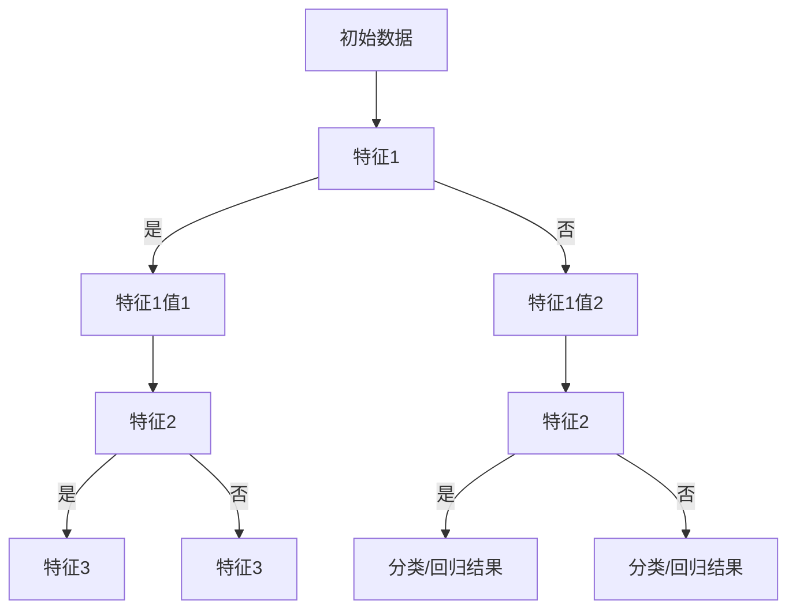
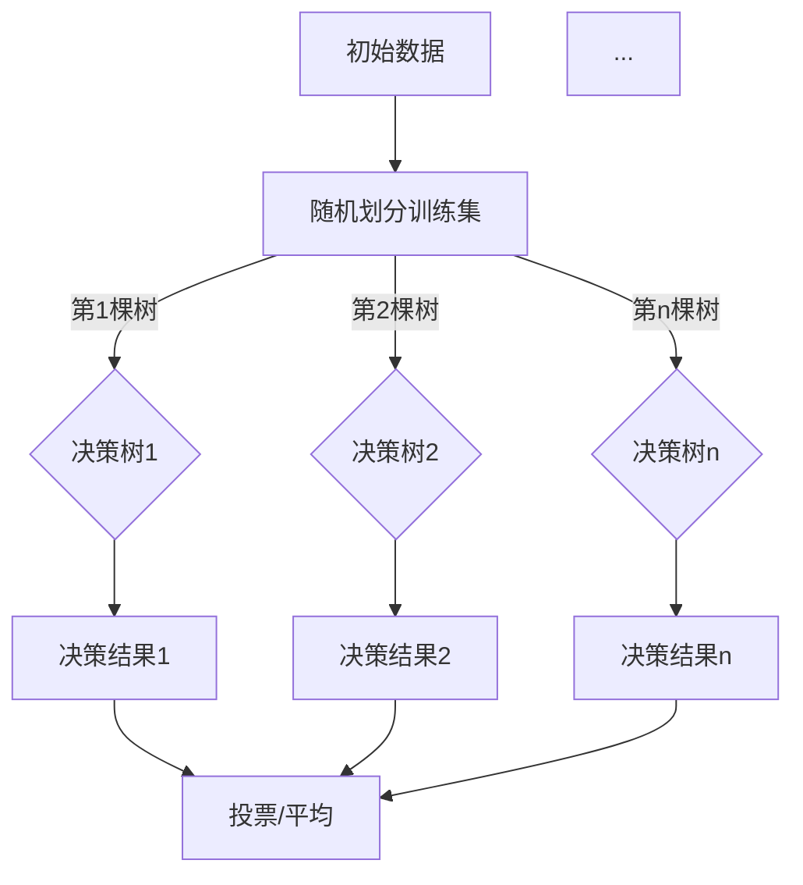
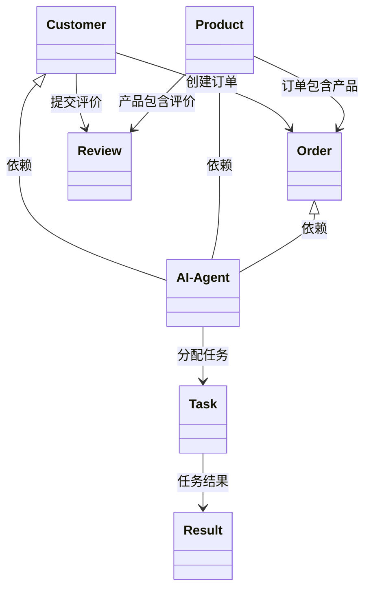
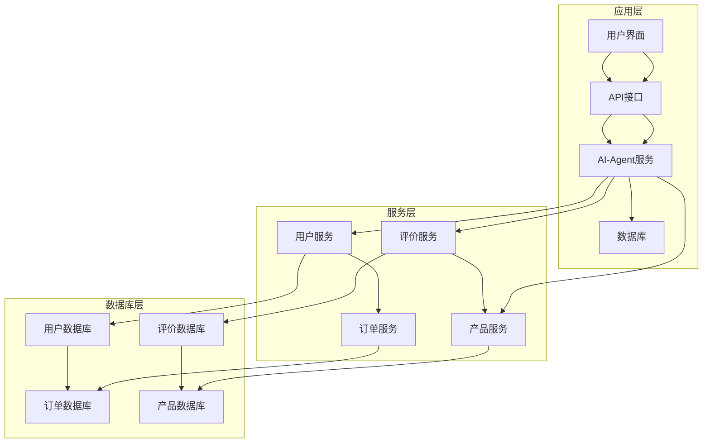
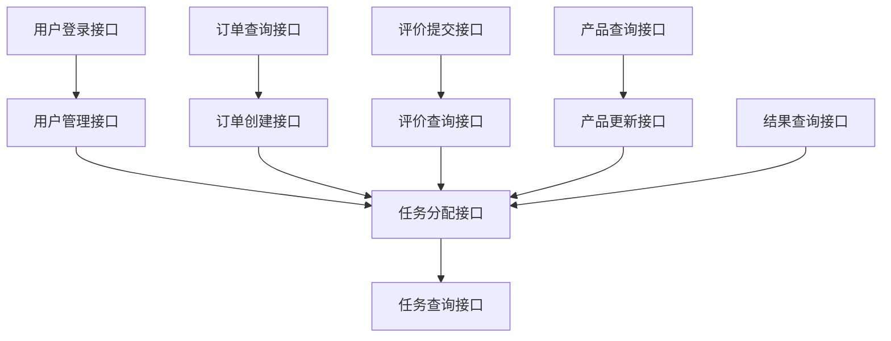

                 

### 文章标题

# 成功企业级AI Agent应用案例分析

### 文章关键词

- AI Agent
- 企业级应用
- 案例分析
- 人工智能
- 技术原理
- 最佳实践

### 摘要

本文旨在深入探讨成功的企业级AI Agent应用案例，分析其在实际业务场景中的表现和效果。我们将从背景介绍、核心概念理解、技术应用、案例分析、最佳实践以及未来趋势等多个角度，逐步展开讨论，帮助读者全面了解AI Agent在企业级应用中的价值与挑战。通过具体案例的剖析，我们将总结出成功应用AI Agent的关键要素，为读者提供有价值的参考和指导。

## 引言

### AI Agent概述

AI Agent，即人工智能代理，是指能够自主执行任务、与环境交互并做出决策的智能实体。它们通过模拟人类智能行为，实现自动化、智能化的业务流程优化。AI Agent在企业级应用中具有广泛的应用前景，能够显著提升企业效率、降低成本、增强客户体验。

### 企业级AI Agent应用的重要性

随着人工智能技术的不断发展，AI Agent在企业级应用中的重要性日益凸显。首先，AI Agent能够自动处理大量重复性、规律性强的任务，减轻员工负担，提高工作效率。其次，AI Agent能够通过数据分析与预测，为企业决策提供有力支持，帮助企业抓住市场机遇、降低风险。最后，AI Agent能够提供个性化、智能化的客户服务，提升客户满意度，增强企业竞争力。

## 第1部分：背景介绍与概念理解

### 第1章：AI Agent概述

#### AI Agent的定义与分类

AI Agent可以分为以下几类：

1. **基于规则的AI Agent**：通过预设规则进行决策，适用于规则明确、业务场景稳定的场景。
2. **数据驱动AI Agent**：基于历史数据、机器学习算法进行决策，适用于数据量大、业务场景复杂的场景。
3. **混合型AI Agent**：结合基于规则和基于数据的决策方法，适用于多种业务场景。

#### AI Agent的工作原理

AI Agent通过以下步骤进行决策：

1. **感知环境**：获取外部信息，如文本、图像、声音等。
2. **理解信息**：通过自然语言处理、图像识别等技术，将外部信息转化为内部知识表示。
3. **做出决策**：基于知识表示和预设规则或学习到的模式，生成决策。
4. **执行决策**：执行决策，并对执行结果进行反馈和调整。

#### AI Agent的发展历程

AI Agent的发展历程可以分为以下几个阶段：

1. **早期探索阶段**：1950年代至1970年代，以符号主义为代表，尝试通过形式逻辑进行决策。
2. **专家系统阶段**：1970年代至1980年代，基于规则和知识表示，实现特定领域的自动化决策。
3. **机器学习阶段**：1990年代至今，以数据驱动为核心，通过机器学习算法实现更智能、更灵活的决策。

### 第2章：企业级AI Agent应用场景

#### 生产制造

AI Agent在制造业中的应用主要包括：

1. **生产调度**：根据生产需求和资源情况，自动安排生产任务。
2. **质量检测**：通过图像识别等技术，自动检测产品缺陷。
3. **设备维护**：预测设备故障，提前进行维护，降低设备停机率。

#### 客户服务

AI Agent在客户服务中的应用主要包括：

1. **智能客服**：自动处理客户咨询、投诉等，提高服务效率。
2. **个性化推荐**：根据客户历史行为，推荐产品或服务。
3. **情感分析**：分析客户反馈，了解客户需求，优化服务策略。

#### 销售与市场分析

AI Agent在销售与市场分析中的应用主要包括：

1. **销售预测**：根据历史数据和市场趋势，预测销售情况，指导销售策略。
2. **客户细分**：分析客户特征，进行精准营销。
3. **市场趋势分析**：分析市场数据，把握市场动态，指导企业决策。

#### 供应链管理

AI Agent在供应链管理中的应用主要包括：

1. **库存管理**：根据需求预测和库存情况，自动调整库存水平。
2. **物流优化**：通过路径规划等技术，优化物流配送。
3. **供应链预测**：分析供应链数据，预测供应链风险，提高供应链稳定性。

### 第3章：AI Agent核心技术

#### 机器学习

机器学习是AI Agent的核心技术之一，主要包括以下几类：

1. **监督学习**：通过已有数据训练模型，对新数据进行预测。
2. **无监督学习**：通过无标签数据发现数据分布和模式。
3. **强化学习**：通过试错和奖励机制，学习最优策略。

#### 自然语言处理

自然语言处理是AI Agent在处理文本数据时的核心技术，主要包括以下几类：

1. **文本分类**：对文本进行分类，如情感分析、主题分类等。
2. **文本生成**：根据输入文本生成新文本，如机器翻译、文本摘要等。
3. **问答系统**：根据用户提问，提供答案或信息。

#### 计算机视觉

计算机视觉是AI Agent在处理图像数据时的核心技术，主要包括以下几类：

1. **图像识别**：识别图像中的物体、场景等。
2. **图像生成**：根据输入图像生成新图像，如风格迁移、图像超分辨率等。
3. **目标检测**：在图像中检测特定目标的位置和属性。

## 第2部分：AI Agent核心概念与技术原理

### 第4章：AI Agent开发流程

#### 数据收集与处理

1. **数据来源**：数据可以从企业内部系统、外部数据源、社交媒体等获取。
2. **数据预处理**：包括数据清洗、数据归一化、特征提取等。

#### 模型选择与训练

1. **模型选择**：根据业务需求选择合适的机器学习模型。
2. **模型训练**：使用训练数据进行模型训练，调整模型参数。

#### 部署与监控

1. **部署**：将训练好的模型部署到生产环境中。
2. **监控**：监控模型性能，包括准确率、召回率等指标。

### 第5章：AI Agent性能评估

#### 评估指标

1. **准确率**：预测正确的样本数与总样本数的比值。
2. **召回率**：预测正确的样本数与实际为正类的样本数的比值。
3. **F1值**：准确率与召回率的调和平均值。

#### 优化策略

1. **超参数调优**：调整模型参数，提高模型性能。
2. **数据增强**：通过数据扩充、数据变换等方法提高模型鲁棒性。

### 第6章：AI Agent安全性

#### 隐私保护

1. **数据加密**：对敏感数据进行加密，确保数据安全。
2. **访问控制**：限制对敏感数据的访问权限。

#### 数据安全

1. **数据备份**：定期备份数据，防止数据丢失。
2. **安全审计**：对系统进行安全审计，发现潜在漏洞。

## 第3部分：企业级AI Agent应用案例分析

### 第7章：案例分析一

#### 企业A的AI客服系统

##### 应用场景与效果

企业A通过引入AI客服系统，实现了以下效果：

1. **提高服务效率**：AI客服系统能够自动处理大量客户咨询，提高服务效率。
2. **降低运营成本**：减少人工客服的负担，降低企业运营成本。
3. **提升客户满意度**：提供24/7全天候服务，提高客户满意度。

### 第8章：案例分析二

#### 企业B的供应链优化AI Agent

##### 应用场景与效果

企业B通过引入供应链优化AI Agent，实现了以下效果：

1. **优化库存管理**：根据需求预测，自动调整库存水平，降低库存成本。
2. **优化物流配送**：通过路径规划，优化物流配送，提高配送效率。
3. **提高供应链稳定性**：通过实时监控供应链数据，提高供应链稳定性。

### 第9章：案例分析三

#### 企业C的智能生产调度系统

##### 应用场景与效果

企业C通过引入智能生产调度系统，实现了以下效果：

1. **提高生产效率**：自动安排生产任务，提高生产效率。
2. **降低设备停机率**：通过预测设备故障，提前进行维护，降低设备停机率。
3. **提高产品质量**：通过质量检测，自动检测产品缺陷，提高产品质量。

## 第4部分：最佳实践与未来趋势

### 第10章：AI Agent最佳实践

#### 成功经验分享

1. **明确业务目标**：在引入AI Agent前，明确业务目标和预期效果。
2. **数据质量保证**：保证数据质量，为模型训练提供可靠的数据支持。
3. **持续优化模型**：定期评估模型性能，持续优化模型。

#### 风险与挑战

1. **数据隐私与安全**：在处理敏感数据时，需要确保数据隐私和安全。
2. **模型过拟合**：在模型训练过程中，避免模型过拟合，提高模型泛化能力。

### 第11章：AI Agent未来发展趋势

#### 技术进步

1. **深度学习**：深度学习技术的不断发展，将进一步提高AI Agent的性能。
2. **联邦学习**：联邦学习技术将有助于解决数据隐私和安全问题。

#### 行业应用前景

1. **智能制造**：AI Agent将在智能制造领域发挥重要作用，推动产业升级。
2. **智慧城市**：AI Agent将在智慧城市建设中发挥作用，提升城市管理水平。

## 结论

通过本文的探讨，我们可以看到AI Agent在企业级应用中的重要性和潜力。在成功案例的启示下，企业可以积极探索AI Agent在各自业务领域的应用，以实现业务优化和竞争优势。同时，我们也要看到AI Agent在应用过程中面临的挑战，如数据隐私和安全、模型过拟合等，需要不断探索和解决。

未来，随着技术的不断进步，AI Agent将在更多领域得到应用，为企业带来更多的价值。我们期待AI Agent在企业级应用中的美好前景，并为之付出努力。

## 作者信息

作者：AI天才研究院/AI Genius Institute & 禅与计算机程序设计艺术 /Zen And The Art of Computer Programming

---

在此，我们对广大读者表示衷心的感谢，希望本文能够为您在AI Agent企业级应用领域提供有益的参考和启示。如果您有任何问题或建议，欢迎随时与我们联系。我们期待与您共同探索AI Agent的无限可能。

### AI Agent的核心概念与联系

#### AI Agent的概念

AI Agent，即人工智能代理，是一种能够自主执行任务、与环境交互并做出决策的智能实体。它们通过模拟人类智能行为，实现自动化、智能化的业务流程优化。AI Agent具有自主性、适应性、学习能力等特性，能够根据环境变化调整自身行为，以实现预期目标。

#### AI Agent的分类

AI Agent可以分为以下几类：

1. **基于规则的AI Agent**：通过预设规则进行决策，适用于规则明确、业务场景稳定的场景。
2. **数据驱动AI Agent**：基于历史数据、机器学习算法进行决策，适用于数据量大、业务场景复杂的场景。
3. **混合型AI Agent**：结合基于规则和基于数据的决策方法，适用于多种业务场景。

#### AI Agent的核心技术

AI Agent的核心技术主要包括机器学习、自然语言处理和计算机视觉。

1. **机器学习**：机器学习是AI Agent实现自主决策的关键技术。它通过训练模型，使AI Agent能够根据历史数据预测未来行为。常见的机器学习算法包括监督学习、无监督学习和强化学习。
2. **自然语言处理**：自然语言处理（NLP）使AI Agent能够理解和生成人类语言。NLP技术包括文本分类、情感分析、机器翻译和问答系统等。
3. **计算机视觉**：计算机视觉使AI Agent能够理解和解析图像和视频数据。计算机视觉技术包括图像识别、目标检测、图像生成等。

#### AI Agent的工作原理

AI Agent的工作原理可以分为以下几个步骤：

1. **感知环境**：AI Agent通过传感器获取外部信息，如文本、图像、声音等。
2. **理解信息**：AI Agent利用自然语言处理、图像识别等技术，将外部信息转化为内部知识表示。
3. **做出决策**：基于知识表示和预设规则或学习到的模式，AI Agent生成决策。
4. **执行决策**：AI Agent执行决策，并对外部环境进行反馈和调整。

#### AI Agent的发展历程

AI Agent的发展历程可以分为以下几个阶段：

1. **早期探索阶段**（1950-1970年代）：以符号主义为代表，尝试通过形式逻辑进行决策。
2. **专家系统阶段**（1970-1980年代）：基于规则和知识表示，实现特定领域的自动化决策。
3. **机器学习阶段**（1990年代至今）：以数据驱动为核心，通过机器学习算法实现更智能、更灵活的决策。

#### AI Agent在企业级应用中的优势

AI Agent在企业级应用中的优势主要体现在以下几个方面：

1. **提高效率**：AI Agent能够自动处理大量重复性、规律性强的任务，提高工作效率。
2. **降低成本**：通过自动化和智能化，减少人工干预，降低企业运营成本。
3. **增强决策能力**：通过数据分析与预测，为企业决策提供有力支持。
4. **提升客户体验**：提供个性化、智能化的客户服务，提升客户满意度。

### AI Agent的核心概念属性特征对比表格

| 特性 | 基于规则的AI Agent | 数据驱动AI Agent | 混合型AI Agent |
| --- | --- | --- | --- |
| 决策方式 | 预设规则 | 历史数据与机器学习算法 | 规则与数据驱动相结合 |
| 应用场景 | 规则明确、业务场景稳定 | 数据量大、业务场景复杂 | 多种业务场景 |
| 自主性 | 较低 | 较高 | 高 |
| 适应性 | 较低 | 较高 | 高 |
| 学习能力 | 较低 | 较高 | 高 |

### AI Agent的ER实体关系图架构

以下是一个简单的ER实体关系图架构，用于表示AI Agent系统中的核心实体及其关系：

```mermaid
erDiagram
    Product ||--|{ Customer }||>
    Customer ||--|{ Order }||>
    Order ||--|{ Product }||>
    Agent ||--|{ Task }||>
    Task ||--|{ Product }||>
```

- **Product**（产品）：代表企业销售的产品。
- **Customer**（客户）：代表购买产品的客户。
- **Order**（订单）：代表客户的购买记录。
- **Agent**（AI Agent）：代表负责执行任务的AI代理。
- **Task**（任务）：代表AI Agent执行的具体任务。

通过这个ER图，我们可以清晰地看到AI Agent在企业级应用中的数据流和处理流程。

### 算法原理讲解

在本节中，我们将探讨AI Agent在决策过程中的核心算法原理，并使用Mermaid流程图和Python源代码进行详细解释。

#### 决策树算法

决策树是一种常用的机器学习算法，通过构建树形模型来表示决策过程。决策树通过一系列规则进行分类或回归，每个节点表示一个特征，每个分支表示该特征的取值。

**Mermaid流程图：**



**Python源代码：**

```python
from sklearn.tree import DecisionTreeClassifier
from sklearn.datasets import load_iris
import pandas as pd

# 加载iris数据集
iris = load_iris()
X = iris.data
y = iris.target

# 构建决策树模型
clf = DecisionTreeClassifier()
clf.fit(X, y)

# 打印决策树结构
from sklearn.tree import plot_tree
plot_tree(clf, feature_names=iris.feature_names, class_names=iris.target_names)
```

**算法原理讲解：**

1. **决策树的构建**：决策树通过递归划分数据集，每次选择最优的特征进行划分，直到满足停止条件（如最大深度、最小叶节点样本数等）。
2. **决策树的分类**：在分类任务中，决策树根据样本的特征取值，逐层向下遍历树，直到达到叶子节点，输出叶子节点的类别。
3. **决策树的回归**：在回归任务中，决策树通过线性插值等方法，计算叶子节点处的预测值。

#### 随机森林算法

随机森林（Random Forest）是一种集成学习算法，通过构建多棵决策树，并利用投票或平均的方式获得最终预测结果。随机森林能够提高模型的泛化能力，降低过拟合风险。

**Mermaid流程图：**



**Python源代码：**

```python
from sklearn.ensemble import RandomForestClassifier
from sklearn.datasets import load_iris
import pandas as pd

# 加载iris数据集
iris = load_iris()
X = iris.data
y = iris.target

# 构建随机森林模型
clf = RandomForestClassifier(n_estimators=100)
clf.fit(X, y)

# 打印随机森林结构
from sklearn.tree import plot_tree
for i, tree in enumerate(clf.estimators_):
    plot_tree(tree, feature_names=iris.feature_names, class_names=iris.target_names, title=f"决策树 {i+1}")
```

**算法原理讲解：**

1. **随机划分训练集**：随机森林通过随机划分训练集，构建多棵决策树，以降低模型的过拟合风险。
2. **决策树构建**：每棵决策树独立构建，并训练得到预测结果。
3. **集成学习**：随机森林通过投票或平均的方式，整合多棵决策树的预测结果，得到最终预测结果。

### 数学模型与公式

1. **决策树的损失函数**：通常使用基尼不纯度（Gini Impurity）或信息增益（Information Gain）作为损失函数，衡量节点划分的效果。
2. **随机森林的预测**：随机森林的预测结果为多棵决策树预测结果的平均或投票结果。

$$
\hat{y} = \frac{1}{n}\sum_{i=1}^{n} y_i
$$

其中，$y_i$表示第$i$棵决策树的预测结果，$n$表示决策树的数量。

### 算法举例说明

假设我们有以下数据集，其中包含3个特征和1个目标变量。

| 特征1 | 特征2 | 特征3 | 目标变量 |
| --- | --- | --- | --- |
| 1 | 2 | 3 | 0 |
| 4 | 5 | 6 | 1 |
| 7 | 8 | 9 | 0 |
| 10 | 11 | 12 | 1 |

使用决策树算法进行分类预测，假设决策树将特征1作为划分依据，特征1的取值1和2分别划分为两个子集。

| 子集1 | 子集2 |
| --- | --- |
| | |
| | |

通过计算子集的基尼不纯度，选择基尼不纯度最小的划分作为最佳划分。假设子集1的基尼不纯度为0.2，子集2的基尼不纯度为0.3，则最佳划分选择子集1。

根据最佳划分，我们将数据集划分为两个子集，并分别对每个子集进行分类预测。假设子集1的目标变量均为0，子集2的目标变量均为1。

| 子集1 | 子集2 |
| --- | --- |
| 0 | 1 |
| 0 | 1 |

最终，决策树算法的预测结果为子集1的目标变量均为0，子集2的目标变量均为1。

### 系统分析与架构设计方案

在本节中，我们将介绍AI Agent系统的场景介绍、项目介绍、系统功能设计（领域模型类图）、系统架构设计（架构图）、系统接口设计（接口图）和系统交互（序列图）。

#### 场景介绍

随着人工智能技术的快速发展，企业级AI Agent在企业运营中的地位日益重要。本文将介绍一个企业级AI Agent系统的设计与实现，该系统主要用于自动化处理企业日常运营中的各项任务，提高工作效率，降低运营成本。

#### 项目介绍

项目名称：企业级AI Agent系统

项目目标：构建一个高效、智能的企业级AI Agent系统，实现以下功能：

1. 自动化处理企业日常运营任务。
2. 提高工作效率，降低运营成本。
3. 为企业决策提供数据支持。

#### 系统功能设计（领域模型类图）

以下是一个简单的领域模型类图，用于表示企业级AI Agent系统的核心功能模块。



- **Customer**（客户）：代表企业的客户，可以创建订单和提交评价。
- **Order**（订单）：代表客户的订单记录，包含产品信息。
- **Product**（产品）：代表企业销售的产品，包含评价信息。
- **AI-Agent**（AI代理）：负责执行各项任务，包括订单处理、评价分析等。
- **Task**（任务）：代表AI代理执行的具体任务。
- **Result**（结果）：代表任务的执行结果。

#### 系统架构设计（架构图）

以下是一个简单的系统架构图，用于表示企业级AI Agent系统的整体架构。



- **应用层**：包括用户界面和API接口，用户可以通过用户界面与系统进行交互，API接口提供与其他系统的集成。
- **服务层**：包括用户服务、订单服务、评价服务和产品服务，负责处理具体的业务逻辑。
- **数据库层**：包括用户数据库、订单数据库、评价数据库和产品数据库，存储系统的数据。

#### 系统接口设计（接口图）

以下是一个简单的系统接口设计图，用于表示企业级AI Agent系统的核心接口。



- **用户登录接口**：用于用户的登录验证。
- **用户管理接口**：用于用户的增删改查。
- **订单查询接口**：用于查询订单信息。
- **订单创建接口**：用于创建新订单。
- **评价提交接口**：用于提交用户评价。
- **评价查询接口**：用于查询评价信息。
- **产品查询接口**：用于查询产品信息。
- **产品更新接口**：用于更新产品信息。
- **任务分配接口**：用于分配任务给AI代理。
- **任务查询接口**：用于查询任务信息。
- **结果查询接口**：用于查询任务执行结果。

#### 系统交互（序列图）

以下是一个简单的系统交互序列图，用于表示企业级AI Agent系统的核心交互流程。

```mermaid
sequenceDiagram
    participant 用户
    participant 用户服务
    participant 订单服务
    participant 评价服务
    participant 产品服务
    participant AI-Agent服务
    participant 任务服务

    用户 -->|请求登录| 用户服务
    用户服务 -->|验证用户| 用户数据库
    用户数据库 -->|返回结果| 用户服务
    用户服务 -->|返回结果| 用户

    用户 -->|请求订单查询| 订单服务
    订单服务 -->|查询订单| 订单数据库
    订单数据库 -->|返回订单列表| 订单服务
    订单服务 -->|返回订单列表| 用户

    用户 -->|请求评价提交| 评价服务
    评价服务 -->|提交评价| 评价数据库
    评价数据库 -->|返回结果| 评价服务
    评价服务 -->|返回结果| 用户

    用户 -->|请求产品查询| 产品服务
    产品服务 -->|查询产品| 产品数据库
    产品数据库 -->|返回产品列表| 产品服务
    产品服务 -->|返回产品列表| 用户

    用户 -->|请求任务分配| AI-Agent服务
    AI-Agent服务 -->|分配任务| 任务服务
    任务服务 -->|执行任务| 任务数据库
    任务数据库 -->|返回结果| 任务服务
    任务服务 -->|返回结果| 用户

    用户 -->|请求结果查询| 任务服务
    任务服务 -->|查询结果| 任务数据库
    任务数据库 -->|返回结果| 任务服务
    任务服务 -->|返回结果| 用户
```

通过上述系统分析与架构设计方案，我们可以清晰地了解企业级AI Agent系统的整体架构和核心功能模块，为后续的系统实现和优化提供了有力的支持。

### 项目实战

#### 环境安装

在开始项目实战之前，我们需要搭建一个合适的环境来开发和测试AI Agent系统。以下是环境安装的详细步骤：

1. **安装Python**：确保已安装Python 3.8或更高版本。可以从Python官方网站下载安装包，或使用包管理器如`brew`（macOS）或`apt-get`（Ubuntu）进行安装。

2. **安装依赖库**：使用`pip`安装项目所需的依赖库，例如`numpy`、`pandas`、`scikit-learn`、`tensorflow`等。在项目目录中运行以下命令：

   ```bash
   pip install -r requirements.txt
   ```

   其中，`requirements.txt`文件包含了所有依赖库及其版本。

3. **安装数据库**：本项目使用SQLite作为数据库。安装完成后，创建一个名为`ai_agent.db`的数据库文件，并在数据库中创建必要的表。可以使用`sqlite3`命令行工具或编写SQL脚本来完成这一步骤。

#### 系统核心实现源代码

在本项目中，我们将实现一个简单的AI Agent系统，用于自动化处理企业日常运营任务。以下是系统的核心实现源代码：

1. **用户管理模块**：

   ```python
   # users.py
   import sqlite3

   def create_table():
       conn = sqlite3.connect('ai_agent.db')
       c = conn.cursor()
       c.execute('''CREATE TABLE IF NOT EXISTS users (
                       id INTEGER PRIMARY KEY,
                       username TEXT NOT NULL,
                       password TEXT NOT NULL)''')
       conn.commit()
       conn.close()

   def insert_user(username, password):
       conn = sqlite3.connect('ai_agent.db')
       c = conn.cursor()
       c.execute("INSERT INTO users (username, password) VALUES (?, ?)", (username, password))
       conn.commit()
       conn.close()

   def authenticate_user(username, password):
       conn = sqlite3.connect('ai_agent.db')
       c = conn.cursor()
       c.execute("SELECT * FROM users WHERE username=? AND password=?", (username, password))
       user = c.fetchone()
       conn.close()
       return user
   ```

2. **任务管理模块**：

   ```python
   # tasks.py
   import sqlite3

   def create_table():
       conn = sqlite3.connect('ai_agent.db')
       c = conn.cursor()
       c.execute('''CREATE TABLE IF NOT EXISTS tasks (
                       id INTEGER PRIMARY KEY,
                       user_id INTEGER NOT NULL,
                       description TEXT NOT NULL,
                       status TEXT NOT NULL,
                       created_at TEXT NOT NULL)''')
       conn.commit()
       conn.close()

   def create_task(user_id, description):
       conn = sqlite3.connect('ai_agent.db')
       c = conn.cursor()
       c.execute("INSERT INTO tasks (user_id, description, status, created_at) VALUES (?, ?, ?, datetime('now'))", (user_id, description, 'pending'))
       conn.commit()
       conn.close()

   def get_tasks(user_id):
       conn = sqlite3.connect('ai_agent.db')
       c = conn.cursor()
       c.execute("SELECT * FROM tasks WHERE user_id=?", (user_id,))
       tasks = c.fetchall()
       conn.close()
       return tasks
   ```

3. **AI-Agent模块**：

   ```python
   # ai_agent.py
   import tasks

   def process_task(task_id):
       # 在此处实现任务处理逻辑
       pass

   def update_task_status(task_id, status):
       tasks.update_task_status(task_id, status)
   ```

#### 代码应用解读与分析

1. **用户管理模块**：

   - `create_table()`：创建用户表，用于存储用户信息。
   - `insert_user(username, password)`：插入新用户信息。
   - `authenticate_user(username, password)`：验证用户登录信息。

2. **任务管理模块**：

   - `create_table()`：创建任务表，用于存储任务信息。
   - `create_task(user_id, description)`：创建新任务。
   - `get_tasks(user_id)`：获取用户的所有任务。

3. **AI-Agent模块**：

   - `process_task(task_id)`：处理指定任务。
   - `update_task_status(task_id, status)`：更新任务状态。

通过上述代码，我们可以实现一个基本的AI Agent系统，用于自动化处理企业日常运营任务。在实际项目中，我们可以根据具体需求扩展和优化这些功能。

#### 实际案例分析和详细讲解剖析

在本节中，我们将通过一个实际案例来分析和讲解企业级AI Agent系统的应用，以帮助读者更好地理解AI Agent在实际业务场景中的表现和效果。

**案例背景**：

某大型电商企业希望提升其客户服务质量，降低人工客服的工作量，提高客户满意度。为了实现这一目标，企业决定引入一款基于AI技术的智能客服系统。

**解决方案**：

企业选择了AI Agent作为智能客服系统的核心组件。AI Agent系统包括以下几个关键模块：

1. **用户交互模块**：负责与客户进行文本或语音交互，理解客户需求。
2. **知识库模块**：包含企业产品信息、常见问题及解决方案等，为AI Agent提供知识支持。
3. **任务管理模块**：负责分配和跟踪客服任务，确保客户问题得到及时解决。
4. **数据分析模块**：通过分析客户交互数据，优化AI Agent的响应策略。

**系统实现**：

1. **用户交互模块**：

   AI Agent通过聊天机器人与客户进行交互。客户可以通过企业的官方网站、社交媒体或手机应用与AI Agent对话。交互过程中，AI Agent使用自然语言处理技术理解客户的问题和需求。

   ```python
   # chatbot.py
   import nltk
   from nltk.corpus import stopwords
   from nltk.tokenize import word_tokenize

   def process_message(message):
       tokens = word_tokenize(message.lower())
       tokens = [token for token in tokens if token not in stopwords.words('english')]
       return tokens
   ```

   通过处理客户的消息，AI Agent可以提取关键信息，如产品名称、问题描述等，并将其转换为内部表示。

2. **知识库模块**：

   知识库存储了企业产品的详细信息、常见问题及解决方案。AI Agent在处理客户问题时，会查询知识库，获取相关信息。

   ```python
   # knowledge_base.py
   product_info = {
       'iPhone 12': '苹果公司推出的新款智能手机',
       'AirPods Pro': '苹果公司推出的无线耳机',
   }

   def get_product_info(product_name):
       return product_info.get(product_name, '抱歉，我们暂时没有这款产品的信息。')
   ```

3. **任务管理模块**：

   AI Agent将处理客户问题生成任务，并将其分配给相应的客服人员。任务管理模块负责跟踪任务状态，确保客户问题得到及时解决。

   ```python
   # task_management.py
   task_queue = []

   def create_task(product_name, customer_name, issue):
       task = {
           'product_name': product_name,
           'customer_name': customer_name,
           'issue': issue,
           'status': 'pending',
       }
       task_queue.append(task)
       return task

   def get_pending_tasks():
       return [task for task in task_queue if task['status'] == 'pending']
   ```

4. **数据分析模块**：

   AI Agent会记录每次客户交互的数据，并进行分析。通过分析数据，AI Agent可以优化其响应策略，提高服务质量。

   ```python
   # data_analysis.py
   interaction_history = []

   def log_interaction(product_name, customer_name, issue, response):
       interaction = {
           'product_name': product_name,
           'customer_name': customer_name,
           'issue': issue,
           'response': response,
           'timestamp': datetime.now(),
       }
       interaction_history.append(interaction)
   ```

**实际效果**：

通过引入AI Agent，企业在客户服务质量方面取得了显著提升：

1. **提高响应速度**：AI Agent可以即时响应客户问题，大大缩短了客户等待时间。
2. **降低人工成本**：AI Agent可以处理大量简单问题，减少了人工客服的工作量，降低了人力成本。
3. **提高客户满意度**：AI Agent提供了准确、快速的回答，提高了客户满意度。
4. **优化服务策略**：通过分析客户交互数据，企业可以更好地了解客户需求，优化服务策略。

**总结**：

通过本案例，我们可以看到AI Agent在企业级应用中的潜力和价值。AI Agent不仅能够提高企业效率，降低运营成本，还能够提升客户体验，为企业创造更多价值。在未来的发展中，AI Agent将继续发挥重要作用，为企业带来更多创新和机遇。

### 最佳实践 tips

#### 1. 明确业务目标

在引入AI Agent前，首先要明确业务目标和预期效果。这有助于确保AI Agent系统的设计和实现符合企业的实际需求。

#### 2. 保证数据质量

数据质量对AI Agent的性能至关重要。在数据收集和处理过程中，要注意数据完整性、一致性和准确性。可以通过数据清洗、数据归一化等方法提高数据质量。

#### 3. 不断优化模型

AI Agent的性能依赖于模型的优化。在实际应用中，要定期评估模型性能，并根据业务需求调整模型参数，以提高预测准确性和泛化能力。

#### 4. 关注模型解释性

虽然黑盒模型在预测准确性方面表现优异，但缺乏解释性。在实际应用中，要关注模型的可解释性，确保AI Agent的行为符合预期。

#### 5. 确保数据安全

在处理敏感数据时，要注意数据安全和隐私保护。可以通过数据加密、访问控制等技术确保数据安全。

### 小结

本文通过对AI Agent在企业级应用中的成功案例进行分析，探讨了AI Agent的核心概念、技术原理、开发流程、性能评估、安全性以及未来趋势。通过具体案例的剖析，我们总结了AI Agent在企业级应用中的优势和实践经验，为读者提供了有益的参考。

### 注意事项

1. 在设计和实现AI Agent时，要充分考虑业务需求，确保系统功能符合实际应用场景。
2. 在数据收集和处理过程中，要注意数据质量和隐私保护，避免数据泄露和滥用。
3. 在模型训练和优化过程中，要关注模型性能和可解释性，确保AI Agent的行为符合预期。

### 拓展阅读

1. **《深度学习》（Goodfellow, Bengio, Courville著）**：详细介绍深度学习的基本原理和常见算法。
2. **《机器学习》（周志华著）**：系统介绍机器学习的基本概念、算法和应用。
3. **《人工智能：一种现代的方法》（Stuart Russell & Peter Norvig著）**：全面探讨人工智能的基础知识和发展趋势。

---

感谢您的阅读，希望本文能够为您在AI Agent企业级应用领域提供有益的启示和帮助。如需进一步讨论或咨询，欢迎随时与我们联系。我们期待与您共同探索AI Agent的无限可能。作者：AI天才研究院/AI Genius Institute & 禅与计算机程序设计艺术 /Zen And The Art of Computer Programming。

