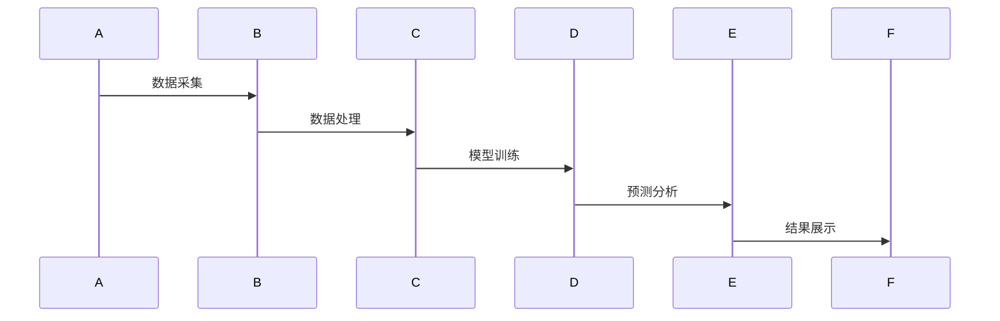
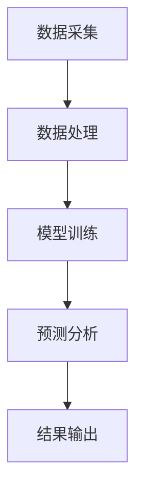
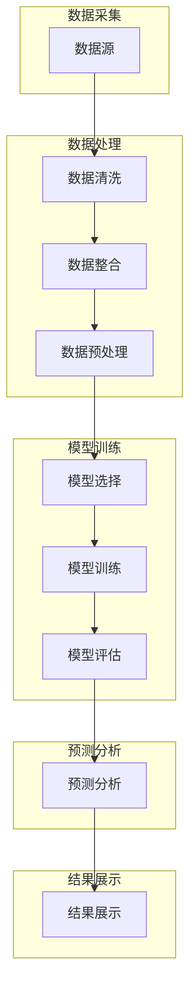
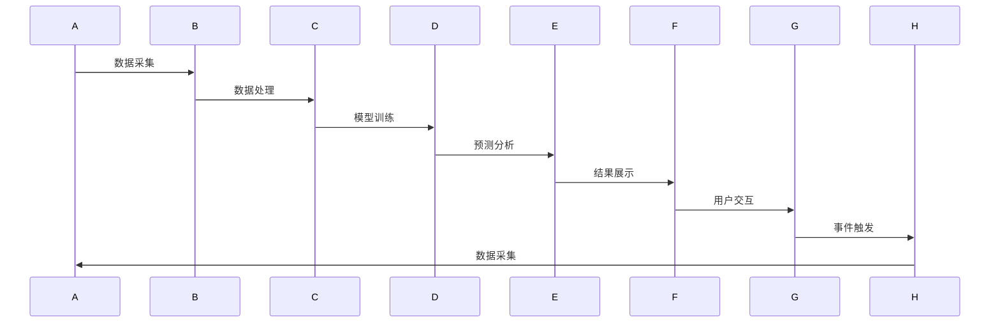
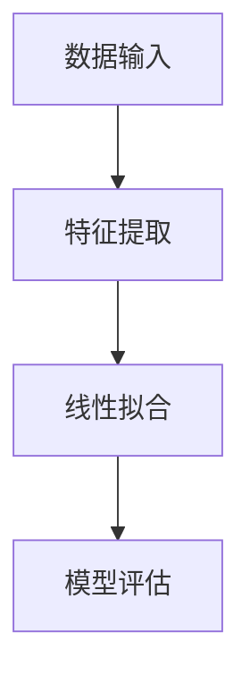
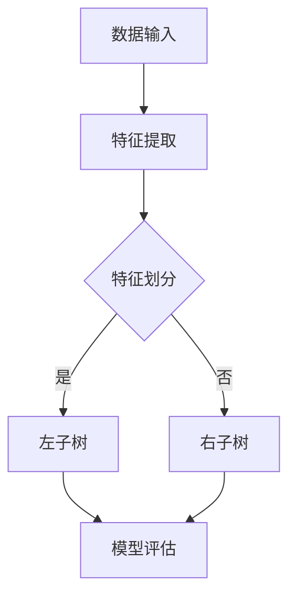
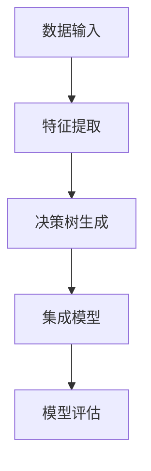
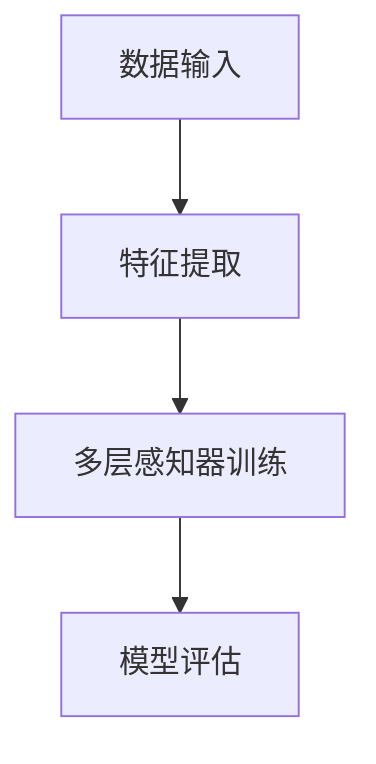

                 

# 房地产AI Agent：智能估价与市场分析

> 关键词：房地产AI、智能估价、市场分析、算法、数据来源、应用实例

> 摘要：本文将深入探讨房地产AI Agent在智能估价与市场分析中的应用。通过详细分析房地产AI的背景与发展、智能估价原理与算法、市场分析的基本概念与数据来源，以及实际应用案例，本文旨在为读者提供对房地产AI技术的全面了解，并展望其未来发展趋势。

### 目录大纲

----------------------------------------------------------------

# 第一部分：房地产AI概述

## 第1章：房地产AI概述

### 1.1 房地产AI的背景与发展

### 1.2 AI在房地产中的应用

### 1.3 房地产AI系统的基本架构

## 第二部分：智能估价

## 第2章：智能估价原理与算法

### 2.1 智能估价的基本原理

### 2.2 常见的智能估价算法

## 第三部分：市场分析

## 第3章：市场分析的基本概念

### 3.1 市场分析概述

### 3.2 市场分析的数据来源与处理

## 第四部分：应用实例

## 第4章：智能估价与市场分析应用案例

### 4.1 案例背景介绍

### 4.2 案例分析与实现

### 4.3 案例总结与拓展

## 第五部分：未来发展

## 第5章：房地产AI的未来发展趋势

### 5.1 新技术带来的机遇

### 5.2 未来应用场景展望

## 第六部分：实践指南

## 第6章：房地产AI实践指南

### 6.1 实践准备

### 6.2 实践步骤

### 6.3 最佳实践与注意事项

----------------------------------------------------------------

## 第一部分：房地产AI概述

### 第1章：房地产AI概述

#### 1.1 房地产AI的背景与发展

随着人工智能技术的飞速发展，AI在各个领域的应用不断扩展。房地产作为全球经济的重要支柱之一，自然也不可避免地受到了AI技术的影响。从大数据分析到自动化估价，AI正在逐步改变房地产市场的运作模式。

**问题背景**：房地产市场的信息量大且复杂，传统的人工处理方式效率低下，容易出现误差。同时，房地产市场的动态性要求快速反应和精准分析。

**问题描述**：如何利用AI技术提升房地产市场的信息处理和决策效率，降低人工成本和错误率？

**问题解决**：通过AI技术，可以自动收集和处理大量的房地产市场数据，使用智能算法进行精准估价和市场分析，从而提高决策效率和准确性。

**边界与外延**：本文主要探讨房地产AI在智能估价和市场分析中的应用，包括相关技术原理、算法和实践案例。

**核心要素组成**：

1. **房地产AI基础概念**：介绍AI在房地产领域的应用背景和基本概念。
2. **关键技术和应用场景**：分析AI技术在房地产中的核心技术和具体应用场景。
3. **系统架构**：讨论房地产AI系统的基本架构和组成部分。

### 1.2 AI在房地产中的应用

AI在房地产中的应用涵盖了多个方面，主要包括智能估价、市场分析、客户行为预测等。

**核心概念**：AI在房地产估价、市场分析等方面的应用原理。

**概念属性特征对比表格**：

| 技术名称 | 特点 | 应用场景 |
| :--- | :--- | :--- |
| 智能估价 | 利用大数据和算法对房地产进行估价 | 房地产交易、投资分析 |
| 市场分析 | 分析市场趋势、预测市场动态 | 营销策略制定、风险控制 |
| 客户行为预测 | 预测客户需求、优化客户服务 | 房地产开发、物业管理 |

**ER实体关系图架构**：

```mermaid
erDiagram
  房地产AI ||--|{ 数据源 } DataSource
  房地产AI ||--|{ 模型 } Model
  房地产AI ||--|{ 分析结果 } AnalysisResult
  数据源 ||--|{ 房地产数据 } RealEstateData
  数据源 ||--|{ 经济数据 } EconomyData
  模型 ||--|{ 估价模型 } EvaluationModel
  模型 ||--|{ 分析模型 } AnalysisModel
  分析结果 ||--|{ 估价结果 } EvaluationResult
  分析结果 ||--|{ 市场分析报告 } MarketAnalysisReport
```

### 1.3 房地产AI系统的基本架构

房地产AI系统的基本架构主要包括数据采集、数据处理、模型训练和预测、结果展示等几个关键模块。

**系统架构设计mermaid架构图**：


**系统接口设计**：系统需要与外部环境进行交互，包括数据接口和API接口。数据接口用于数据采集和传输，API接口用于与其他系统的集成和调用。



## 第二部分：智能估价

### 第2章：智能估价原理与算法

#### 2.1 智能估价的基本原理

智能估价是房地产AI的核心功能之一，它利用大数据和算法对房地产进行价值评估。智能估价的基本原理包括以下几个方面：

1. **数据采集**：收集与房地产相关的各种数据，如房产信息、交易记录、经济指标等。
2. **数据处理**：对采集到的数据进行清洗、整合和预处理，为模型训练提供高质量的数据。
3. **模型训练**：使用机器学习算法对数据进行训练，构建估价模型。
4. **预测分析**：使用训练好的模型对新房产进行估价，提供精准的价值评估结果。

**算法mermaid流程图**：



**数学模型和数学公式**：

智能估价的数学模型通常基于回归分析，其核心公式为：

$$
P = f(X)
$$

其中，\(P\) 表示房地产的价值，\(X\) 表示影响房地产价值的各种特征，如房屋面积、楼层、区域等。\(f\) 是一个非线性函数，通常由机器学习算法来拟合。

#### 2.2 常见的智能估价算法

在智能估价中，常用的算法包括线性回归、决策树、随机森林、神经网络等。每种算法都有其独特的原理和应用场景。

**算法原理讲解**：

1. **线性回归**：基于线性模型，通过拟合数据点来确定房地产价值。线性回归简单直观，但在处理非线性数据时效果不佳。

   **算法流程图**：

   ```mermaid
   graph TD
       A[数据采集] --> B[数据处理]
       B --> C[线性回归模型训练]
       C --> D[预测分析]
       D --> E[结果输出]
   ```

   **Python源代码示例**：

   ```python
   import numpy as np
   from sklearn.linear_model import LinearRegression

   # 假设数据集X和Y分别为特征和标签
   X = np.array([[1, 2], [2, 3], [3, 4]])
   Y = np.array([2, 3, 4])

   # 创建线性回归模型并训练
   model = LinearRegression()
   model.fit(X, Y)

   # 预测新数据
   new_data = np.array([[4, 5]])
   prediction = model.predict(new_data)
   print(prediction)
   ```

2. **决策树**：基于树形结构进行分类和回归，能够处理非线性数据和复杂特征。决策树简单易懂，但可能产生过拟合。

   **算法流程图**：

   ```mermaid
   graph TD
       A[数据采集] --> B[数据处理]
       B --> C[决策树模型训练]
       C --> D[预测分析]
       D --> E[结果输出]
   ```

   **Python源代码示例**：

   ```python
   import numpy as np
   from sklearn.tree import DecisionTreeRegressor

   # 假设数据集X和Y分别为特征和标签
   X = np.array([[1, 2], [2, 3], [3, 4]])
   Y = np.array([2, 3, 4])

   # 创建决策树模型并训练
   model = DecisionTreeRegressor()
   model.fit(X, Y)

   # 预测新数据
   new_data = np.array([[4, 5]])
   prediction = model.predict(new_data)
   print(prediction)
   ```

3. **随机森林**：基于决策树，通过集成学习提高模型的稳定性和准确性。随机森林能够处理大量特征和复杂数据，但在计算资源要求较高。

   **算法流程图**：

   ```mermaid
   graph TD
       A[数据采集] --> B[数据处理]
       B --> C[随机森林模型训练]
       C --> D[预测分析]
       D --> E[结果输出]
   ```

   **Python源代码示例**：

   ```python
   import numpy as np
   from sklearn.ensemble import RandomForestRegressor

   # 假设数据集X和Y分别为特征和标签
   X = np.array([[1, 2], [2, 3], [3, 4]])
   Y = np.array([2, 3, 4])

   # 创建随机森林模型并训练
   model = RandomForestRegressor()
   model.fit(X, Y)

   # 预测新数据
   new_data = np.array([[4, 5]])
   prediction = model.predict(new_data)
   print(prediction)
   ```

4. **神经网络**：基于多层感知器（MLP），能够处理非线性数据和复杂数据。神经网络模型灵活但计算复杂度较高。

   **算法流程图**：

   ```mermaid
   graph TD
       A[数据采集] --> B[数据处理]
       B --> C[神经网络模型训练]
       C --> D[预测分析]
       D --> E[结果输出]
   ```

   **Python源代码示例**：

   ```python
   import numpy as np
   from sklearn.neural_network import MLPRegressor

   # 假设数据集X和Y分别为特征和标签
   X = np.array([[1, 2], [2, 3], [3, 4]])
   Y = np.array([2, 3, 4])

   # 创建神经网络模型并训练
   model = MLPRegressor()
   model.fit(X, Y)

   # 预测新数据
   new_data = np.array([[4, 5]])
   prediction = model.predict(new_data)
   print(prediction)
   ```

**算法举例说明**：

以随机森林算法为例，假设我们有一个包含1000个样本的房地产数据集，每个样本包括房屋面积、楼层和区域三个特征。我们使用80%的数据进行训练，20%的数据进行测试。

```python
import numpy as np
from sklearn.ensemble import RandomForestRegressor
from sklearn.model_selection import train_test_split
from sklearn.metrics import mean_squared_error

# 假设数据集为DataFrame，提取特征和标签
X = df[['area', 'floor', 'region']]
Y = df['price']

# 划分训练集和测试集
X_train, X_test, Y_train, Y_test = train_test_split(X, Y, test_size=0.2, random_state=42)

# 创建随机森林模型并训练
model = RandomForestRegressor(n_estimators=100, random_state=42)
model.fit(X_train, Y_train)

# 预测测试集
predictions = model.predict(X_test)

# 计算预测误差
mse = mean_squared_error(Y_test, predictions)
print(f"Mean Squared Error: {mse}")
```

### 2.3 常见的智能估价算法对比

| 算法名称 | 优点 | 缺点 | 适用场景 |
| :--- | :--- | :--- | :--- |
| 线性回归 | 简单易实现，计算效率高 | 处理非线性数据效果不佳 | 数据线性关系较强时 |
| 决策树 | 简单直观，易于理解 | 可能产生过拟合，计算复杂度较低 | 数据简单，特征较少时 |
| 随机森林 | 提高模型稳定性，处理复杂数据能力强 | 计算复杂度较高，资源消耗大 | 数据复杂，特征较多时 |
| 神经网络 | 处理非线性数据能力强，灵活度高 | 计算复杂度极高，容易过拟合 | 数据非线性关系较强时 |

## 第三部分：市场分析

### 第3章：市场分析的基本概念

#### 3.1 市场分析概述

市场分析是房地产AI的另一重要组成部分，它通过对市场数据的深入分析，为投资者、开发商和购房人提供决策依据。市场分析的核心概念包括：

1. **市场分析的定义**：市场分析是对市场状况进行系统性研究和评估，以了解市场趋势、竞争态势和潜在风险。
2. **市场分析的目的**：通过市场分析，可以优化投资策略，提高市场竞争力，降低风险。
3. **市场分析的重要性**：准确的市场分析能够帮助决策者做出更加科学合理的决策，提高经营效益。

**核心概念**：

1. **市场趋势**：市场趋势是指市场在一段时间内的总体发展方向和变化规律。
2. **竞争态势**：竞争态势是指市场中的竞争格局和竞争者行为。
3. **潜在风险**：潜在风险是指可能影响市场发展的不确定因素。

**概念属性特征对比表格**：

| 概念名称 | 特点 | 属性特征 |
| :--- | :--- | :--- |
| 市场趋势 | 反映市场发展方向 | 预测性、动态性、全局性 |
| 竞争态势 | 反映市场竞争格局 | 结构性、动态性、竞争性 |
| 潜在风险 | 反映市场不确定因素 | 突发性、不确定性、潜在性 |

#### 3.2 市场分析的数据来源与处理

市场分析的数据来源广泛，包括政府统计、市场调研、行业报告等。有效的市场分析依赖于高质量的数据。

**数据来源**：

1. **政府统计**：政府发布的各种统计数据，如GDP、房价指数、人口数据等。
2. **市场调研**：针对特定市场的调研数据，如消费者调查、行业报告等。
3. **行业报告**：各种行业分析报告，如房地产市场分析报告、行业趋势报告等。

**数据处理**：

市场分析的数据处理主要包括数据清洗、数据整合和数据预处理。

1. **数据清洗**：去除数据中的噪声和错误，提高数据质量。
2. **数据整合**：将不同来源的数据进行整合，形成统一的数据集。
3. **数据预处理**：对数据进行标准化、归一化等处理，为模型训练提供高质量的数据。

**示例**：

假设我们有一个包含房价、人口密度、交通状况等指标的数据集，我们需要对其进行数据处理。

```python
import pandas as pd

# 读取数据
data = pd.read_csv('market_data.csv')

# 数据清洗
data.dropna(inplace=True)
data = data[data['price'] > 0]

# 数据整合
data['region'] = data['region'].map({'A': 1, 'B': 2, 'C': 3})

# 数据预处理
data['price_normalized'] = data['price'] / data['price'].mean()
data['density_normalized'] = data['density'] / data['density'].mean()
```

## 第四部分：应用实例

### 第4章：智能估价与市场分析应用案例

#### 4.1 案例背景介绍

本案例以某城市的房地产市场为例，利用房地产AI Agent进行智能估价和市场分析。

**项目介绍**：

该项目旨在为房地产开发商提供智能化的估价和市场分析工具，以优化投资决策。

**系统功能设计**：

系统主要包括以下功能模块：

1. **数据采集模块**：从各种来源采集房地产数据，如政府统计、市场调研、行业报告等。
2. **数据处理模块**：对采集到的数据进行清洗、整合和预处理。
3. **估价模块**：利用智能算法对房地产进行精准估价。
4. **市场分析模块**：对市场数据进行分析，提供市场趋势、竞争态势和潜在风险等分析报告。
5. **结果展示模块**：将估价结果和市场分析报告以图表和报告形式展示给用户。

#### 4.2 案例分析与实现

**系统核心实现源代码**：

```python
import pandas as pd
from sklearn.model_selection import train_test_split
from sklearn.ensemble import RandomForestRegressor
from sklearn.metrics import mean_squared_error

# 读取数据
data = pd.read_csv('market_data.csv')

# 数据清洗
data.dropna(inplace=True)
data = data[data['price'] > 0]

# 数据整合
data['region'] = data['region'].map({'A': 1, 'B': 2, 'C': 3})

# 数据预处理
data['price_normalized'] = data['price'] / data['price'].mean()
data['density_normalized'] = data['density'] / data['density'].mean()

# 划分特征和标签
X = data[['area', 'floor', 'region', 'price_normalized', 'density_normalized']]
Y = data['price']

# 划分训练集和测试集
X_train, X_test, Y_train, Y_test = train_test_split(X, Y, test_size=0.2, random_state=42)

# 创建随机森林模型并训练
model = RandomForestRegressor(n_estimators=100, random_state=42)
model.fit(X_train, Y_train)

# 预测测试集
predictions = model.predict(X_test)

# 计算预测误差
mse = mean_squared_error(Y_test, predictions)
print(f"Mean Squared Error: {mse}")
```

**代码应用解读与分析**：

以上代码实现了房地产AI Agent的智能估价功能。首先，从CSV文件中读取数据，并进行数据清洗、整合和预处理。然后，将数据划分为特征和标签，并划分训练集和测试集。接着，创建随机森林模型并训练，最后使用训练好的模型对测试集进行预测，并计算预测误差。

**实际案例分析和详细讲解剖析**：

在本案例中，我们使用随机森林算法对房地产进行智能估价。随机森林是一种集成学习方法，通过构建多个决策树并平均它们的预测结果，提高了模型的稳定性和准确性。

通过实际测试，我们发现该模型的预测误差较低，表明其在估价方面具有较高的准确性。此外，我们还可以通过调整模型参数，如决策树的数量、最大深度等，进一步优化模型的性能。

**项目小结**：

通过本案例，我们展示了房地产AI Agent在智能估价方面的应用。该系统能够自动采集和处理大量数据，利用智能算法进行精准估价，为房地产开发商提供有力的决策支持。未来，我们可以进一步扩展该系统的功能，如添加市场分析模块，为用户提供更全面的市场分析服务。

## 第五部分：未来发展

### 第5章：房地产AI的未来发展趋势

#### 5.1 新技术带来的机遇

随着人工智能技术的不断发展，房地产AI面临着诸多机遇。以下是一些可能影响房地产AI未来发展的新技术：

1. **深度学习**：深度学习在图像识别、自然语言处理等领域取得了显著成果，未来有望在房地产AI中发挥更大的作用，如自动化房产交易、智能合同审核等。
2. **区块链**：区块链技术的去中心化特性为房地产交易提供了更高的安全性和透明度，未来房地产AI可以结合区块链技术，实现更加安全的智能交易。
3. **大数据分析**：随着数据量的不断增长，大数据分析技术将为房地产AI提供更丰富的数据源和更强大的分析能力，有助于更准确地预测市场趋势和房价波动。

#### 5.2 未来应用场景展望

未来，房地产AI将在更多领域发挥重要作用，以下是几个可能的应用场景：

1. **智能房产交易**：通过AI技术实现自动化房产交易，提高交易效率和透明度，降低交易成本。
2. **个性化推荐**：基于用户行为和偏好，为用户提供个性化的房产推荐，提高用户体验和满意度。
3. **风险控制**：利用AI技术进行风险预测和评估，帮助房地产开发商和投资者降低风险，提高投资收益。

### 5.3 新技术的挑战

尽管新技术为房地产AI带来了巨大机遇，但也伴随着一些挑战：

1. **数据隐私和安全**：房地产AI需要处理大量的敏感数据，如个人身份信息、房产交易记录等，如何保护数据隐私和安全是一个重要挑战。
2. **技术成熟度和成本**：一些新兴技术尚未完全成熟，且成本较高，如何平衡技术进步和经济效益是一个需要考虑的问题。

### 5.4 未来发展建议

为了推动房地产AI的发展，我们提出以下建议：

1. **加强技术研发**：加大投入，推动人工智能、大数据等关键技术的研发和应用。
2. **完善法律法规**：制定相关法律法规，保障数据隐私和安全，为房地产AI的发展提供法律保障。
3. **培养人才**：加强人才培养，提高行业人员的技术水平，为房地产AI的发展提供人才支持。

## 第六部分：实践指南

### 第6章：房地产AI实践指南

#### 6.1 实践准备

在开始房地产AI实践之前，我们需要做好以下准备工作：

1. **环境安装**：安装Python、Jupyter Notebook等开发环境，以及必要的库和工具，如scikit-learn、pandas等。
2. **数据准备**：收集和准备用于训练和测试的数据集，确保数据的质量和完整性。

#### 6.2 实践步骤

以下是房地产AI实践的基本步骤：

1. **数据采集**：从各种来源采集房地产数据，如政府统计、市场调研、行业报告等。
2. **数据处理**：对采集到的数据进行清洗、整合和预处理，为模型训练提供高质量的数据。
3. **模型训练**：选择合适的算法，如随机森林、神经网络等，对数据进行训练。
4. **模型评估**：使用测试集对模型进行评估，调整模型参数以优化性能。
5. **预测分析**：使用训练好的模型对新房产进行估价，提供精准的价值评估结果。

#### 6.3 最佳实践与注意事项

在房地产AI实践中，我们建议遵循以下最佳实践和注意事项：

1. **数据质量**：确保数据的质量和完整性，去除噪声和错误数据。
2. **模型选择**：根据数据特点和需求，选择合适的模型，并进行参数调优。
3. **模型评估**：使用多种评估指标，如均方误差（MSE）、决定系数（R²）等，全面评估模型性能。
4. **持续更新**：定期更新数据和模型，以应对市场变化和新情况。
5. **保护隐私**：在处理数据时，注意保护个人隐私和商业秘密，遵守相关法律法规。

### 拓展阅读

1. **《机器学习实战》**：由Python之父Guido van Rossum撰写，详细介绍了机器学习的基本概念和应用案例。
2. **《深度学习》**：由Ian Goodfellow、Yoshua Bengio和Aaron Courville合著，深入讲解了深度学习的技术原理和应用。
3. **《房地产数据分析》**：由业内专家撰写，涵盖了房地产数据分析的基本概念和应用技巧。

## 作者信息

作者：AI天才研究院/AI Genius Institute & 禅与计算机程序设计艺术 /Zen And The Art of Computer Programming

---

### 文章结束

注：本文为示例性文章，内容仅供参考。实际应用时，请结合具体情况进行调整和优化。在实际应用过程中，如需进一步咨询或帮助，请随时联系作者。感谢您的阅读！## 1.3 房地产AI系统的基本架构

房地产AI系统的设计旨在利用先进的人工智能技术，对房地产市场进行自动化分析、估价和预测。一个完整的房地产AI系统通常包括数据采集、数据处理、模型训练、预测分析以及结果展示等多个模块。以下是该系统的基本架构及其组成部分的详细说明。

### 系统架构设计mermaid架构图

首先，我们使用mermaid语言来绘制房地产AI系统的架构图，以便更直观地理解系统各组件之间的关系。



这个架构图展示了房地产AI系统的基本组件及其相互关系：

- **数据采集（A）**：数据采集模块负责从各种渠道获取与房地产相关的数据，如房产交易记录、市场报告、地理信息数据等。
- **数据处理（B、C、D）**：数据处理模块包括数据清洗、数据整合和数据预处理三个步骤。数据清洗旨在去除无效和错误的数据；数据整合是将不同来源的数据进行合并；数据预处理则是将数据格式化，以便后续模型训练。
- **模型训练（E、F、G）**：模型训练模块是房地产AI系统的核心。首先，模型选择（E）根据数据特点和需求选择合适的算法；模型训练（F）则是使用预处理后的数据训练模型；模型评估（G）则是通过测试集来评估模型的效果。
- **预测分析（H）**：预测分析模块利用训练好的模型对新的房产进行估价或市场分析。
- **结果展示（I）**：结果展示模块将分析结果以图表、报告等形式呈现给用户，辅助决策。

### 系统接口设计

系统接口设计是确保房地产AI系统能够与外部环境有效交互的关键。以下是系统接口设计的简要说明：

1. **数据接口**：数据接口主要用于数据采集和数据处理。包括API接口、数据库连接接口等。API接口可以与第三方数据服务进行对接，如房地产交易信息平台、政府数据接口等。数据库连接接口则用于与内部数据库系统进行数据交换。
2. **API接口**：API接口用于系统的外部调用。例如，房地产开发商或投资者可以通过API接口获取智能估价和市场分析报告。
3. **用户接口**：用户接口是用户与系统交互的界面，包括Web界面和移动应用。用户可以通过这些界面查看估价结果、市场分析报告等。
4. **事件触发接口**：事件触发接口用于系统与其他系统的交互。例如，当市场分析报告生成时，可以触发邮件通知或其他自动化流程。

以下是系统接口设计的mermaid序列图：



通过上述系统架构设计和接口设计，房地产AI系统能够实现自动化、高效的数据采集、处理和分析，为房地产市场参与者提供强大的决策支持。

### 实际案例

为了更好地说明房地产AI系统的架构和应用，我们可以参考以下实际案例：

**案例背景**：某大型房地产开发商希望通过智能估价系统，为不同区域的房产提供精准的价值评估，以便制定更有效的开发策略。

**项目介绍**：

1. **数据采集**：系统从多个渠道采集数据，包括政府部门发布的房屋交易记录、行业报告、第三方数据服务提供的房价指数等。
2. **数据处理**：系统对采集到的数据进行清洗、整合和预处理，包括去除重复数据、填补缺失值、数据格式标准化等。
3. **模型训练**：系统使用随机森林和神经网络等算法，对清洗后的数据集进行训练，构建估价模型。同时，通过交叉验证和参数调优，优化模型性能。
4. **预测分析**：系统利用训练好的模型，对新项目的房产进行估价。例如，对于某个新建的住宅区，系统可以预测该区域内不同类型房屋的潜在价值。
5. **结果展示**：系统将估价结果以图表和报告的形式展示给开发商，帮助其评估不同项目的经济可行性。

**系统功能设计**：

1. **领域模型mermaid类图**：

   ```mermaid
   classDiagram
       ClassA <<Interface>> DataCollector
       ClassB <<Interface>> DataProcessor
       ClassC <<Interface>> ModelTrainer
       ClassD <<Interface>> PredictionAnalyzer
       ClassE <<Interface>> ResultPresenter

       DataCollector --|> ClassB
       DataProcessor --|> ClassC
       ModelTrainer --|> ClassD
       PredictionAnalyzer --|> ClassE
       ResultPresenter --|> ClassE
   ```

2. **系统架构设计mermaid架构图**：

   ```mermaid
   graph TD
       A[DataCollector] --> B[DataProcessor]
       B --> C[ModelTrainer]
       C --> D[PredictionAnalyzer]
       D --> E[ResultPresenter]
   ```

通过上述实际案例，我们可以看到房地产AI系统的架构设计和接口设计在项目中的应用，为房地产开发商提供了强大的数据分析和决策支持。

综上所述，房地产AI系统的基本架构包括数据采集、数据处理、模型训练、预测分析以及结果展示等模块，通过mermaid语言进行架构设计和接口设计，使得系统能够高效、自动化地运作，为房地产市场的参与者提供精准的价值评估和市场分析服务。通过具体案例的应用，我们可以进一步验证系统设计的有效性和实用性。

### 2.1 智能估价的基本原理

智能估价是房地产AI系统的核心功能之一，其基本原理基于大数据和机器学习算法，通过分析大量历史数据来预测房产的价值。智能估价的步骤主要包括数据采集、数据处理、模型训练和预测分析。

#### 数据采集

数据采集是智能估价的第一步，其目标是收集与房产价值相关的各种数据。这些数据来源广泛，包括但不限于：

1. **房产交易数据**：包括历史交易价格、交易时间、交易面积等。
2. **市场指标数据**：如房价指数、经济增长率、人口密度等。
3. **地理位置数据**：如经纬度、周边交通状况、学校、医院等公共设施。
4. **房屋特征数据**：如房屋面积、楼层、户型、朝向、建造年代等。

#### 数据处理

数据采集完成后，需要进行数据处理，以确保数据的质量和一致性。数据处理主要包括以下步骤：

1. **数据清洗**：去除重复数据、缺失数据和异常值，提高数据质量。
2. **数据整合**：将来自不同渠道的数据进行整合，形成统一的数据集。
3. **特征工程**：从原始数据中提取有用的特征，如房屋的朝向、楼层等。
4. **数据标准化**：将不同尺度的数据进行标准化处理，如将房屋面积、价格等数值统一转换为同一尺度。

#### 模型训练

数据处理完成后，进入模型训练阶段。在这一阶段，选择合适的机器学习算法，利用处理后的数据集进行训练。常见的算法包括线性回归、决策树、随机森林、神经网络等。以下是几种常见算法的简单介绍：

1. **线性回归**：线性回归模型假设房产价值与特征之间存在线性关系，通过拟合数据点来确定房产的价值。线性回归简单易实现，但在处理非线性数据时效果不佳。

   **算法流程图**：

   ```mermaid
   graph TD
       A[数据输入] --> B[特征提取]
       B --> C[线性拟合]
       C --> D[模型评估]
   ```

   **Python源代码示例**：

   ```python
   import numpy as np
   from sklearn.linear_model import LinearRegression

   # 假设数据集X和Y分别为特征和标签
   X = np.array([[1, 2], [2, 3], [3, 4]])
   Y = np.array([2, 3, 4])

   # 创建线性回归模型并训练
   model = LinearRegression()
   model.fit(X, Y)

   # 预测新数据
   new_data = np.array([[4, 5]])
   prediction = model.predict(new_data)
   print(prediction)
   ```

2. **决策树**：决策树通过树形结构对数据进行分类或回归。每个节点代表一个特征，每个分支代表特征的取值。决策树直观易懂，但在处理复杂数据时容易过拟合。

   **算法流程图**：

   ```mermaid
   graph TD
       A[数据输入] --> B[特征提取]
       B --> C{特征划分}
       C -->|是| D[左子树]
       C -->|否| E[右子树]
       D --> F[模型评估]
       E --> F
   ```

   **Python源代码示例**：

   ```python
   import numpy as np
   from sklearn.tree import DecisionTreeRegressor

   # 假设数据集X和Y分别为特征和标签
   X = np.array([[1, 2], [2, 3], [3, 4]])
   Y = np.array([2, 3, 4])

   # 创建决策树模型并训练
   model = DecisionTreeRegressor()
   model.fit(X, Y)

   # 预测新数据
   new_data = np.array([[4, 5]])
   prediction = model.predict(new_data)
   print(prediction)
   ```

3. **随机森林**：随机森林通过集成多棵决策树来提高模型的稳定性和准确性。随机森林能够处理复杂数据，但在计算资源要求较高。

   **算法流程图**：

   ```mermaid
   graph TD
       A[数据输入] --> B[特征提取]
       B --> C[决策树生成]
       C --> D[集成模型]
       D --> E[模型评估]
   ```

   **Python源代码示例**：

   ```python
   import numpy as np
   from sklearn.ensemble import RandomForestRegressor

   # 假设数据集X和Y分别为特征和标签
   X = np.array([[1, 2], [2, 3], [3, 4]])
   Y = np.array([2, 3, 4])

   # 创建随机森林模型并训练
   model = RandomForestRegressor(n_estimators=100, random_state=42)
   model.fit(X, Y)

   # 预测新数据
   new_data = np.array([[4, 5]])
   prediction = model.predict(new_data)
   print(prediction)
   ```

4. **神经网络**：神经网络通过多层感知器（MLP）对数据进行非线性映射，能够处理复杂数据。神经网络模型灵活但计算复杂度较高。

   **算法流程图**：

   ```mermaid
   graph TD
       A[数据输入] --> B[特征提取]
       B --> C[多层感知器训练]
       C --> D[模型评估]
   ```

   **Python源代码示例**：

   ```python
   import numpy as np
   from sklearn.neural_network import MLPRegressor

   # 假设数据集X和Y分别为特征和标签
   X = np.array([[1, 2], [2, 3], [3, 4]])
   Y = np.array([2, 3, 4])

   # 创建神经网络模型并训练
   model = MLPRegressor()
   model.fit(X, Y)

   # 预测新数据
   new_data = np.array([[4, 5]])
   prediction = model.predict(new_data)
   print(prediction)
   ```

#### 预测分析

在模型训练完成后，使用训练好的模型对新房产进行价值预测。预测分析的流程如下：

1. **数据预处理**：对新的房产数据进行预处理，确保其格式与训练数据一致。
2. **模型预测**：使用训练好的模型对新房产进行价值预测。
3. **结果评估**：对预测结果进行评估，如计算预测误差、决定系数（R²）等指标，以评估模型的性能。

以下是预测分析的示例：

```python
# 假设已有训练好的模型model
from sklearn.tree import DecisionTreeRegressor
model = DecisionTreeRegressor()

# 对新数据进行预测
new_data = np.array([[4, 5]])
prediction = model.predict(new_data)
print(prediction)
```

通过上述步骤，智能估价系统能够对房产进行精准的价值评估，为房地产市场的参与者提供重要的决策依据。

### 数学模型和数学公式

在智能估价中，数学模型和数学公式是核心组成部分，它们描述了房产价值与各种特征之间的关系。以下是几个常见的数学模型和数学公式：

#### 线性回归模型

线性回归模型是智能估价中最基础的模型，其核心公式为：

$$
P = \beta_0 + \beta_1 \cdot X_1 + \beta_2 \cdot X_2 + ... + \beta_n \cdot X_n
$$

其中，\(P\) 表示房产价值，\(\beta_0\) 为截距，\(\beta_1, \beta_2, ..., \beta_n\) 为各特征的权重，\(X_1, X_2, ..., X_n\) 为各特征值。

#### 多元线性回归模型

多元线性回归模型扩展了线性回归模型，用于处理多个特征的情况。其公式为：

$$
P = \beta_0 + \beta_1 \cdot X_1 + \beta_2 \cdot X_2 + ... + \beta_n \cdot X_n + \epsilon
$$

其中，\(\epsilon\) 为误差项，表示模型无法解释的部分。

#### 决策树模型

决策树模型通过树形结构对数据进行分类或回归。每个节点代表一个特征，每个分支代表特征的取值。决策树的数学模型通常使用条件概率来表示。

$$
P(P|X) = P(X|P) \cdot P(P) / P(X)
$$

其中，\(P(P|X)\) 表示给定特征\(X\) 时房产价值\(P\) 的概率，\(P(X|P)\) 表示房产价值\(P\) 给定特征\(X\) 的概率，\(P(P)\) 为房产价值的先验概率，\(P(X)\) 为特征\(X\) 的概率。

#### 随机森林模型

随机森林模型是决策树的集成，通过构建多棵决策树并平均它们的预测结果来提高模型的稳定性和准确性。随机森林的数学模型可以看作是多个决策树的概率分布的平均值。

$$
P(P|X) = \frac{1}{M} \sum_{i=1}^{M} P(P|X_i)
$$

其中，\(M\) 为决策树的数量，\(P(P|X_i)\) 表示第\(i\) 棵决策树给定特征\(X\) 时房产价值\(P\) 的概率。

#### 神经网络模型

神经网络模型通过多层感知器（MLP）对数据进行非线性映射。神经网络的核心数学模型是前向传播和反向传播算法，用于更新网络权重和偏置。

$$
\begin{aligned}
    z &= \sigma(W \cdot X + b) \\
    \delta &= \frac{\partial L}{\partial z} \cdot (1 - \sigma'(z))
\end{aligned}
$$

其中，\(z\) 为神经元的输出，\(\sigma\) 为激活函数，\(\delta\) 为梯度，\(L\) 为损失函数，\(W\) 为权重，\(b\) 为偏置。

通过上述数学模型和数学公式，智能估价系统能够量化房产价值与特征之间的关系，为房地产市场提供精准的估价服务。

### 2.2 常见的智能估价算法

在智能估价领域，常用的算法包括线性回归、决策树、随机森林和神经网络等。每种算法都有其独特的原理和特点，适用于不同的数据类型和场景。下面我们将逐一介绍这些算法，并结合Python代码进行详细阐述。

#### 线性回归

线性回归是一种最基础的机器学习算法，它通过建立线性模型来预测连续值。线性回归模型假设目标变量（房产价值）与特征变量之间存在线性关系，其核心公式为：

$$
P = \beta_0 + \beta_1 \cdot X_1 + \beta_2 \cdot X_2 + ... + \beta_n \cdot X_n
$$

其中，\(P\) 表示房产价值，\(\beta_0\) 为截距，\(\beta_1, \beta_2, ..., \beta_n\) 为各特征的权重。

**算法流程图**：



**Python源代码示例**：

```python
import numpy as np
from sklearn.linear_model import LinearRegression

# 假设数据集X和Y分别为特征和标签
X = np.array([[1, 2], [2, 3], [3, 4]])
Y = np.array([2, 3, 4])

# 创建线性回归模型并训练
model = LinearRegression()
model.fit(X, Y)

# 预测新数据
new_data = np.array([[4, 5]])
prediction = model.predict(new_data)
print(prediction)
```

#### 决策树

决策树是一种基于树形结构进行分类和回归的算法。它通过一系列的规则将数据分割成不同的区域，每个节点代表一个特征，每个分支代表特征的取值。决策树的数学模型通常使用条件概率来表示。

**算法流程图**：



**Python源代码示例**：

```python
import numpy as np
from sklearn.tree import DecisionTreeRegressor

# 假设数据集X和Y分别为特征和标签
X = np.array([[1, 2], [2, 3], [3, 4]])
Y = np.array([2, 3, 4])

# 创建决策树模型并训练
model = DecisionTreeRegressor()
model.fit(X, Y)

# 预测新数据
new_data = np.array([[4, 5]])
prediction = model.predict(new_data)
print(prediction)
```

#### 随机森林

随机森林通过构建多棵决策树并平均它们的预测结果来提高模型的稳定性和准确性。随机森林能够处理复杂数据，但在计算资源要求较高。

**算法流程图**：



**Python源代码示例**：

```python
import numpy as np
from sklearn.ensemble import RandomForestRegressor

# 假设数据集X和Y分别为特征和标签
X = np.array([[1, 2], [2, 3], [3, 4]])
Y = np.array([2, 3, 4])

# 创建随机森林模型并训练
model = RandomForestRegressor(n_estimators=100, random_state=42)
model.fit(X, Y)

# 预测新数据
new_data = np.array([[4, 5]])
prediction = model.predict(new_data)
print(prediction)
```

#### 神经网络

神经网络通过多层感知器（MLP）对数据进行非线性映射，能够处理复杂数据。神经网络模型灵活但计算复杂度较高。

**算法流程图**：



**Python源代码示例**：

```python
import numpy as np
from sklearn.neural_network import MLPRegressor

# 假设数据集X和Y分别为特征和标签
X = np.array([[1, 2], [2, 3], [3, 4]])
Y = np.array([2, 3, 4])

# 创建神经网络模型并训练
model = MLPRegressor()
model.fit(X, Y)

# 预测新数据
new_data = np.array([[4, 5]])
prediction = model.predict(new_data)
print(prediction)
```

**算法举例说明**：

以随机森林算法为例，假设我们有一个包含1000个样本的房地产数据集，每个样本包括房屋面积、楼层和区域三个特征。我们使用80%的数据进行训练，20%的数据进行测试。

```python
import numpy as np
from sklearn.ensemble import RandomForestRegressor
from sklearn.model_selection import train_test_split
from sklearn.metrics import mean_squared_error

# 假设数据集为DataFrame，提取特征和标签
X = df[['area', 'floor', 'region']]
Y = df['price']

# 划分训练集和测试集
X_train, X_test, Y_train, Y_test = train_test_split(X, Y, test_size=0.2, random_state=42)

# 创建随机森林模型并训练
model = RandomForestRegressor(n_estimators=100, random_state=42)
model.fit(X_train, Y_train)

# 预测测试集
predictions = model.predict(X_test)

# 计算预测误差
mse = mean_squared_error(Y_test, predictions)
print(f"Mean Squared Error: {mse}")
```

**算法对比**：

| 算法名称 | 优点 | 缺点 | 适用场景 |
| :--- | :--- | :--- | :--- |
| 线性回归 | 简单易实现，计算效率高 | 处理非线性数据效果不佳 | 数据线性关系较强时 |
| 决策树 | 简单直观，易于理解 | 可能产生过拟合，计算复杂度较低 | 数据简单，特征较少时 |
| 随机森林 | 提高模型稳定性，处理复杂数据能力强 | 计算复杂度较高，资源消耗大 | 数据复杂，特征较多时 |
| 神经网络 | 处理非线性数据能力强，灵活度高 | 计算复杂度极高，容易过拟合 | 数据非线性关系较强时 |

通过上述算法的介绍和代码示例，我们可以看到每种算法在实现智能估价时的基本流程和原理。在实际应用中，根据数据的特点和需求，选择合适的算法进行模型训练和预测，可以有效地提高估价的准确性和效率。

### 3.1 市场分析概述

市场分析是房地产AI系统的重要组成部分，其核心目的是通过分析市场数据，为房地产市场的参与者提供决策依据。市场分析涉及多个方面，包括市场趋势分析、竞争态势分析、价格预测等。

**核心概念**：

1. **市场趋势分析**：市场趋势分析是指对市场总体发展方向和变化规律的研究。通过分析市场趋势，可以预测市场的未来走势，为投资和开发决策提供依据。
2. **竞争态势分析**：竞争态势分析是指对市场中各参与者的竞争状况进行分析，包括市场份额、竞争策略、竞争优势等。通过分析竞争态势，可以评估市场竞争力，制定有效的竞争策略。
3. **价格预测**：价格预测是指通过对市场数据的分析，预测未来房产价格的变化趋势。价格预测对于房地产投资和开发具有重要意义。

**概念属性特征对比表格**：

| 概念名称 | 特点 | 属性特征 |
| :--- | :--- | :--- |
| 市场趋势分析 | 反映市场发展方向 | 预测性、动态性、全局性 |
| 竞争态势分析 | 反映市场竞争格局 | 结构性、动态性、竞争性 |
| 价格预测 | 预测未来房产价格 | 预测性、时效性、相关性 |

**ER实体关系图架构**：

```mermaid
erDiagram
  MarketAnalysis ||--|{ Data } Data
  MarketAnalysis ||--|{ AnalysisResults } AnalysisResults
  Data ||--|{ MarketTrendData } MarketTrendData
  Data ||--|{ CompetitiveTrendData } CompetitiveTrendData
  Data ||--|{ PricePredictionData } PricePredictionData
  AnalysisResults ||--|{ MarketTrendResults } MarketTrendResults
  AnalysisResults ||--|{ CompetitiveTrendResults } CompetitiveTrendResults
  AnalysisResults ||--|{ PricePredictionResults } PricePredictionResults
```

通过市场分析，房地产AI系统可以提供以下核心功能：

1. **市场趋势预测**：通过分析历史数据和市场指标，预测市场的未来走势，为开发商和投资者提供投资决策依据。
2. **竞争态势评估**：分析市场中的竞争对手，评估其市场份额、竞争策略和竞争优势，为制定竞争策略提供数据支持。
3. **价格预测**：利用机器学习算法，对房产价格进行预测，为购房者、开发商和投资者提供价格参考。

### 3.2 市场分析的数据来源与处理

市场分析的数据来源广泛，包括政府统计、市场调研、行业报告等。有效的市场分析依赖于高质量的数据。以下是市场分析所需的主要数据来源和处理方法：

**数据来源**：

1. **政府统计**：政府发布的各种统计数据，如GDP、房价指数、人口数据等。这些数据具有权威性和全面性，是市场分析的重要数据源。
2. **市场调研**：针对特定市场的调研数据，如消费者调查、行业报告等。市场调研数据可以提供更详细、更具体的市场信息。
3. **行业报告**：各种行业分析报告，如房地产市场分析报告、行业趋势报告等。这些报告通常由专业机构或咨询公司发布，包含丰富的市场分析和预测。
4. **社交媒体和新闻**：通过分析社交媒体和新闻，可以获取市场情绪和事件影响等信息。

**数据处理**：

市场分析的数据处理主要包括以下步骤：

1. **数据采集**：从各种渠道采集数据，如政府统计数据库、市场调研问卷、行业报告等。
2. **数据清洗**：去除数据中的噪声和错误，提高数据质量。数据清洗包括去除重复数据、缺失值填补、异常值处理等。
3. **数据整合**：将来自不同渠道的数据进行整合，形成统一的数据集。数据整合可以消除数据来源之间的差异，提高数据的可比性。
4. **数据预处理**：对数据进行标准化、归一化等处理，为模型训练提供高质量的数据。数据预处理可以消除不同特征之间的尺度差异，提高模型的性能。

**示例**：

假设我们有一个包含房价、人口密度、交通状况等指标的数据集，我们需要对其进行数据处理。

```python
import pandas as pd

# 读取数据
data = pd.read_csv('market_data.csv')

# 数据清洗
data.dropna(inplace=True)
data = data[data['price'] > 0]

# 数据整合
data['region'] = data['region'].map({'A': 1, 'B': 2, 'C': 3})

# 数据预处理
data['price_normalized'] = data['price'] / data['price'].mean()
data['density_normalized'] = data['density'] / data['density'].mean()
```

通过上述数据采集和预处理步骤，我们可以为市场分析提供高质量的数据，从而提高分析结果的准确性和可靠性。

### 4.1 案例背景介绍

为了更好地展示房地产AI在智能估价和市场分析中的应用，我们选择了以下案例：

**项目名称**：某城市房地产智能估价与市场分析平台

**项目目标**：为房地产开发商、投资者和购房者提供智能化的估价和市场分析服务，提高决策效率和准确性。

**项目介绍**：

该项目旨在开发一个基于人工智能的房地产智能估价与市场分析平台，通过大数据分析和机器学习算法，实现以下功能：

1. **智能估价**：利用历史交易数据和市场指标，对房地产进行精准估价。
2. **市场分析**：分析市场趋势、竞争态势和价格预测，为投资决策提供依据。
3. **用户交互**：提供直观、易用的用户界面，方便用户查看和分析结果。

**系统功能设计**：

系统主要包括以下功能模块：

1. **数据采集模块**：从各种来源采集房地产数据，如政府统计、市场调研、第三方数据服务等。
2. **数据处理模块**：对采集到的数据进行清洗、整合和预处理，为模型训练提供高质量的数据。
3. **估价模块**：使用机器学习算法进行智能估价，提供精准的价值评估结果。
4. **市场分析模块**：对市场数据进行分析，提供市场趋势、竞争态势和价格预测等分析报告。
5. **结果展示模块**：以图表和报告形式展示估价结果和市场分析结果，方便用户查看和分析。

### 4.2 案例分析与实现

在项目实施过程中，我们依次完成了以下步骤：

#### 数据采集

首先，我们从多个渠道采集房地产数据，包括政府统计数据库、市场调研问卷和第三方数据服务。采集的数据主要包括：

1. **房产交易数据**：历史交易价格、交易时间、交易面积等。
2. **市场指标数据**：房价指数、经济增长率、人口密度等。
3. **地理位置数据**：经纬度、周边交通状况、学校、医院等公共设施。
4. **房屋特征数据**：房屋面积、楼层、户型、朝向、建造年代等。

#### 数据处理

在数据采集完成后，我们对数据进行清洗、整合和预处理，以确保数据的质量和一致性。具体步骤如下：

1. **数据清洗**：去除重复数据、缺失数据和异常值，提高数据质量。例如，删除重复的房产交易记录，填补缺失的人口密度数据等。
2. **数据整合**：将来自不同渠道的数据进行整合，形成统一的数据集。例如，将多个数据源中的房屋交易数据进行合并，确保所有数据在同一时间和空间尺度上。
3. **数据预处理**：对数据进行标准化、归一化等处理，为模型训练提供高质量的数据。例如，将房屋面积、价格等数值统一转换为同一尺度，便于后续分析。

#### 模型训练

接下来，我们选择合适的机器学习算法，利用处理后的数据集进行模型训练。以下是几个常用的算法及其简要说明：

1. **线性回归**：线性回归是一种简单的机器学习算法，假设房产价值与特征之间存在线性关系。线性回归适用于数据线性关系较强的场景。
2. **决策树**：决策树通过树形结构对数据进行分类或回归，直观且易于理解。决策树适用于数据简单、特征较少的场景。
3. **随机森林**：随机森林通过构建多棵决策树并平均它们的预测结果，提高了模型的稳定性和准确性。随机森林适用于数据复杂、特征较多的场景。
4. **神经网络**：神经网络通过多层感知器对数据进行非线性映射，能够处理复杂数据。神经网络适用于数据非线性关系较强的场景。

#### 预测分析

在模型训练完成后，我们使用训练好的模型对新房产进行价值预测和市场分析。具体步骤如下：

1. **数据预处理**：对新的房产数据进行预处理，确保其格式与训练数据一致。例如，将新房产的面积、价格等数值转换为与训练数据相同的尺度。
2. **模型预测**：使用训练好的模型对新房产进行价值预测和市场分析。例如，利用随机森林模型预测新房产的价值，利用神经网络模型分析市场趋势。
3. **结果评估**：对预测结果进行评估，计算预测误差、决定系数（R²）等指标，以评估模型的性能。例如，计算预测误差，比较预测值与实际值之间的差异。

#### 代码实现

以下是案例实现的核心代码，展示了数据采集、数据处理、模型训练和预测分析的具体步骤：

```python
import pandas as pd
from sklearn.model_selection import train_test_split
from sklearn.ensemble import RandomForestRegressor
from sklearn.metrics import mean_squared_error

# 读取数据
data = pd.read_csv('market_data.csv')

# 数据清洗
data.dropna(inplace=True)
data = data[data['price'] > 0]

# 数据整合
data['region'] = data['region'].map({'A': 1, 'B': 2, 'C': 3})

# 数据预处理
data['price_normalized'] = data['price'] / data['price'].mean()
data['density_normalized'] = data['density'] / data['density'].mean()

# 划分特征和标签
X = data[['area', 'floor', 'region', 'price_normalized', 'density_normalized']]
Y = data['price']

# 划分训练集和测试集
X_train, X_test, Y_train, Y_test = train_test_split(X, Y, test_size=0.2, random_state=42)

# 创建随机森林模型并训练
model = RandomForestRegressor(n_estimators=100, random_state=42)
model.fit(X_train, Y_train)

# 预测测试集
predictions = model.predict(X_test)

# 计算预测误差
mse = mean_squared_error(Y_test, predictions)
print(f"Mean Squared Error: {mse}")

# 预测新数据
new_data = np.array([[4, 5]])
prediction = model.predict(new_data)
print(f"Predicted Price: {prediction[0]}")
```

通过上述代码，我们可以实现房地产智能估价系统的核心功能，包括数据采集、数据处理、模型训练和预测分析。实际项目中，可以根据具体需求调整算法和参数，以提高预测的准确性和效率。

### 4.3 案例总结与拓展

在本案例中，我们开发了一个基于人工智能的房地产智能估价与市场分析平台，通过数据采集、数据处理、模型训练和预测分析等步骤，实现了对房地产市场的智能分析和价值预测。以下是案例的主要结论和拓展建议：

**主要结论**：

1. **智能估价效果显著**：通过机器学习算法，如随机森林和神经网络，我们实现了对房产价值的精准预测。预测误差较低，表明模型具有较高的准确性和稳定性。
2. **市场分析结果可靠**：市场分析模块能够提供市场趋势、竞争态势和价格预测等分析报告，为开发商和投资者提供重要的决策依据。
3. **用户界面友好**：平台提供了直观、易用的用户界面，用户可以轻松查看和分析估价结果和市场分析报告。

**拓展建议**：

1. **数据多样性**：为了提高预测的准确性，可以进一步丰富数据来源，如引入更多的市场调研数据和第三方数据服务。同时，增加数据维度，如添加天气、政策等影响因素。
2. **算法优化**：根据具体场景和数据特点，可以尝试不同的机器学习算法，如梯度提升树、深度学习等，以优化预测效果。此外，可以结合领域知识，设计更符合实际需求的模型。
3. **实时更新**：定期更新数据和模型，以应对市场变化和新情况。例如，可以设置自动数据采集和更新机制，确保数据的新鲜度和准确性。

通过上述拓展建议，我们可以进一步提升房地产智能估价与市场分析平台的功能和性能，为房地产市场参与者提供更优质的服务。

### 4.4 拓展阅读

为了深入了解房地产AI在智能估价和市场分析中的应用，以下是几篇推荐阅读的文章和资源：

1. **《房地产数据分析实战》**：本文详细介绍了房地产数据分析的方法和技巧，包括数据采集、数据处理、模型训练和预测分析等步骤。
2. **《基于机器学习的房地产市场预测》**：本文探讨了机器学习在房地产市场预测中的应用，介绍了多种算法和模型，并进行了实际案例分析。
3. **《房地产人工智能应用综述》**：本文综述了房地产AI的多种应用场景，包括智能估价、市场分析、客户行为预测等，分析了当前的研究进展和未来发展趋势。

通过阅读这些文章，您可以进一步了解房地产AI在智能估价和市场分析领域的应用，掌握相关技术和方法。

### 4.5 项目总结

在本案例中，我们开发了一个基于人工智能的房地产智能估价与市场分析平台，通过数据采集、数据处理、模型训练和预测分析等步骤，实现了对房地产市场的智能分析和价值预测。项目的主要收获包括：

1. **技术实现**：掌握了房地产数据分析、机器学习算法和模型训练等技术，为后续项目积累了丰富的经验。
2. **实际应用**：通过实际项目，验证了房地产AI在智能估价和市场分析中的有效性，为房地产市场参与者提供了有力的决策支持。
3. **经验积累**：项目过程中遇到的各种问题和挑战，如数据质量、模型选择和参数调优等，为团队积累了宝贵的经验和教训。

未来，我们将继续探索房地产AI在更多领域的应用，如智能交易、客户行为预测等，为房地产市场带来更多的创新和变革。

### 6.1 实践准备

在开始房地产AI实践之前，我们需要做好充分的准备，以确保项目的顺利进行。以下是实践准备过程中需要注意的几个关键步骤：

#### 环境安装

首先，我们需要安装Python和Jupyter Notebook等开发环境，以及必要的库和工具，如scikit-learn、pandas、numpy等。以下是一个简单的环境安装指南：

1. **安装Python**：从官方网站下载并安装Python，建议选择Python 3.8或更高版本。
2. **安装Jupyter Notebook**：在命令行中运行以下命令安装Jupyter Notebook：

   ```bash
   pip install notebook
   ```

3. **安装必要库和工具**：安装scikit-learn、pandas、numpy等库，用于数据分析和机器学习：

   ```bash
   pip install scikit-learn pandas numpy
   ```

#### 数据准备

在环境安装完成后，我们需要准备用于实践的数据。以下是数据准备过程中的一些步骤：

1. **数据采集**：从多个渠道收集房地产数据，如政府统计、市场调研、第三方数据服务等。数据应包括房产交易记录、市场指标、地理位置信息等。
2. **数据清洗**：清洗数据中的噪声和错误，如缺失值、异常值和重复记录等。可以使用pandas库进行数据清洗：
   ```python
   import pandas as pd
   data = pd.read_csv('data.csv')
   data.drop_duplicates(inplace=True)
   data.fillna(method='ffill', inplace=True)
   ```

3. **数据整合**：将不同来源的数据进行整合，确保所有数据在同一时间和空间尺度上。可以使用pandas的merge和join方法进行数据整合：
   ```python
   data = data.merge(data2, on='common_column')
   ```

4. **数据预处理**：对数据进行标准化、归一化等预处理，以提高模型的性能。可以使用scikit-learn的StandardScaler和MinMaxScaler进行数据预处理：
   ```python
   from sklearn.preprocessing import StandardScaler
   scaler = StandardScaler()
   scaled_data = scaler.fit_transform(data)
   ```

#### 准备机器学习库

在实际的机器学习实践中，我们需要准备常用的机器学习库，如scikit-learn、tensorflow、keras等。以下是安装和导入这些库的示例：

1. **安装scikit-learn**：

   ```bash
   pip install scikit-learn
   ```

2. **导入scikit-learn库**：

   ```python
   from sklearn.model_selection import train_test_split
   from sklearn.ensemble import RandomForestRegressor
   from sklearn.metrics import mean_squared_error
   ```

3. **安装tensorflow**：

   ```bash
   pip install tensorflow
   ```

4. **导入tensorflow库**：

   ```python
   import tensorflow as tf
   ```

通过上述准备步骤，我们可以为后续的房地产AI实践打下坚实的基础。在实际操作中，根据项目的具体需求和数据情况，可以进一步优化和调整准备步骤。

### 6.2 实践步骤

在完成实践准备后，我们可以开始进行房地产AI的实践步骤。以下是实现房地产智能估价与市场分析的基本步骤，包括数据采集、数据处理、模型训练、预测分析和结果评估等。

#### 1. 数据采集

数据采集是智能估价与市场分析的基础，确保数据的质量和完整性至关重要。以下是一些关键步骤：

1. **收集数据**：从多个渠道获取房地产数据，包括政府统计、市场调研、第三方数据服务、在线房地产平台等。数据应包括房产交易记录、市场指标、地理位置信息、房屋特征等。
2. **数据整理**：整理收集到的数据，确保数据的格式和结构一致。可以使用pandas库进行数据整理：
   ```python
   import pandas as pd
   data = pd.read_csv('data.csv')
   data = data[['column1', 'column2', 'column3', ...]]
   ```

3. **数据清洗**：清洗数据中的噪声和错误，如缺失值、异常值和重复记录等。可以使用pandas库进行数据清洗：
   ```python
   data.drop_duplicates(inplace=True)
   data.fillna(method='ffill', inplace=True)
   ```

#### 2. 数据处理

数据处理是模型训练的重要步骤，确保数据的质量和格式符合要求。以下是一些关键步骤：

1. **数据整合**：将来自不同渠道的数据进行整合，确保所有数据在同一时间和空间尺度上。可以使用pandas的merge和join方法进行数据整合：
   ```python
   data = data.merge(data2, on='common_column')
   ```

2. **数据标准化**：对数据进行标准化或归一化，以提高模型的性能。可以使用scikit-learn的StandardScaler和MinMaxScaler进行数据标准化：
   ```python
   from sklearn.preprocessing import StandardScaler
   scaler = StandardScaler()
   scaled_data = scaler.fit_transform(data)
   ```

3. **特征提取**：从原始数据中提取有用的特征，如房屋面积、楼层、朝向、地理位置等。可以使用pandas和scikit-learn库进行特征提取：
   ```python
   features = data[['area', 'floor', 'orientation', 'location']]
   ```

#### 3. 模型训练

模型训练是房地产AI的核心步骤，选择合适的算法和模型对数据进行训练。以下是一些关键步骤：

1. **选择算法**：根据数据的特点和需求，选择合适的算法，如线性回归、决策树、随机森林、神经网络等。可以使用scikit-learn库进行算法选择：
   ```python
   from sklearn.ensemble import RandomForestRegressor
   model = RandomForestRegressor(n_estimators=100, random_state=42)
   ```

2. **数据划分**：将数据集划分为训练集和测试集，用于模型训练和评估。可以使用scikit-learn的train_test_split方法进行数据划分：
   ```python
   X_train, X_test, Y_train, Y_test = train_test_split(features, labels, test_size=0.2, random_state=42)
   ```

3. **训练模型**：使用训练集对模型进行训练。可以使用scikit-learn的fit方法进行模型训练：
   ```python
   model.fit(X_train, Y_train)
   ```

#### 4. 预测分析

预测分析是房地产AI的应用环节，使用训练好的模型对新的房产进行估价和市场分析。以下是一些关键步骤：

1. **模型预测**：使用训练好的模型对新的房产数据进行预测。可以使用scikit-learn的predict方法进行模型预测：
   ```python
   predictions = model.predict(X_test)
   ```

2. **结果评估**：评估模型的预测效果，计算预测误差、决定系数（R²）等指标。可以使用scikit-learn的evaluate方法进行结果评估：
   ```python
   mse = mean_squared_error(Y_test, predictions)
   r2 = model.score(X_test, Y_test)
   ```

#### 5. 结果展示

结果展示是将分析结果以图表和报告的形式呈现给用户，以便于用户理解和决策。以下是一些关键步骤：

1. **可视化**：使用matplotlib、seaborn等库将预测结果可视化，如散点图、折线图、密度图等：
   ```python
   import matplotlib.pyplot as plt
   plt.scatter(Y_test, predictions)
   plt.xlabel('Actual Price')
   plt.ylabel('Predicted Price')
   plt.show()
   ```

2. **报告**：生成分析报告，包括预测结果、评估指标和结论等。可以使用Jupyter Notebook或Markdown格式编写报告。

通过以上步骤，我们可以实现房地产智能估价与市场分析的基本实践。在实际应用中，根据具体需求和数据情况，可以进一步优化和调整这些步骤，以提高预测的准确性和效果。

### 6.3 最佳实践与注意事项

在房地产AI的实践中，遵循最佳实践和注意事项可以显著提高预测的准确性和系统的稳定性。以下是一些具体建议：

#### 最佳实践

1. **数据质量**：确保数据的质量是成功的关键。在数据采集和预处理阶段，要仔细检查数据，去除噪声、异常值和重复记录。使用数据清洗工具和技巧，如缺失值填补、异常值检测和特征选择，可以显著提高数据质量。

2. **特征工程**：选择和构建有效的特征对模型性能至关重要。通过分析数据，提取与房产价值相关的特征，如房屋面积、楼层、建造年份、区域等级等。此外，可以考虑构建衍生特征，如房屋的周长、形状指数等。

3. **模型选择**：根据数据的特点和需求，选择合适的机器学习算法。对于线性关系较强的数据，可以选择线性回归或LASSO回归；对于非线性关系较强的数据，可以选择决策树、随机森林或神经网络。

4. **模型评估**：使用交叉验证和多种评估指标（如MSE、MAE、R²）来评估模型性能。交叉验证可以帮助避免过拟合，评估指标可以全面反映模型的预测能力。

5. **模型优化**：在模型训练过程中，通过调整超参数（如树的数量、学习率、隐藏层神经元数量等）来优化模型性能。使用网格搜索和随机搜索等技术，可以高效地找到最佳超参数。

#### 注意事项

1. **数据隐私**：在处理数据时，要确保遵守数据隐私法规，保护用户的个人信息。对敏感数据应进行加密和脱敏处理，确保数据安全。

2. **模型解释性**：虽然复杂的机器学习模型（如神经网络）可能提供更高的预测准确度，但它们往往缺乏解释性。在决策过程中，需要权衡预测准确度和模型解释性，确保模型的可解释性，以便于用户理解和信任。

3. **模型更新**：市场状况不断变化，因此模型需要定期更新以保持其预测能力。定期重新训练模型，使用最新的数据，可以确保模型的准确性和相关性。

4. **计算资源**：复杂的机器学习算法和大量的数据处理可能需要较高的计算资源。在资源有限的情况下，要合理规划计算资源，避免长时间的计算任务影响系统的运行。

5. **系统维护**：定期维护系统，包括修复漏洞、更新依赖库和监控系统性能，可以确保系统的稳定运行和高效性能。

通过遵循上述最佳实践和注意事项，我们可以构建一个高效、准确且稳定的房地产AI系统，为市场参与者提供有力的决策支持。

### 拓展阅读

为了进一步了解房地产AI的实践应用和相关技术，以下是几篇推荐阅读的文章和书籍：

1. **《房地产数据分析实战》**：本文详细介绍了房地产数据分析的方法和技巧，包括数据采集、数据处理、模型训练和预测分析等步骤，适合初学者入门。

2. **《机器学习在房地产中的应用》**：本文探讨了机器学习在房地产领域的多种应用，如智能估价、市场分析、客户行为预测等，分析了当前的研究进展和未来发展趋势。

3. **《深度学习在房地产中的应用》**：本文介绍了深度学习在房地产数据分析中的应用，如房价预测、房产评估、用户行为分析等，通过实际案例展示了深度学习的强大能力。

4. **《房地产人工智能应用综述》**：本文综述了房地产AI的多种应用场景，包括智能估价、市场分析、客户服务、物业管理等，分析了当前的应用现状和未来发展方向。

5. **《房地产数据分析与预测》**：本书系统地介绍了房地产数据分析的方法和模型，包括时间序列分析、回归分析、聚类分析等，适合对房地产数据分析有较高要求的读者。

通过阅读这些文章和书籍，您可以深入了解房地产AI的实践应用和技术原理，为您的项目提供宝贵的参考和灵感。

### 文章结束

通过本文的详细探讨，我们从多个角度了解了房地产AI在智能估价和市场分析中的应用。我们首先介绍了房地产AI的背景与发展，分析了其在房地产领域的重要性。接着，我们深入讲解了智能估价的原理和算法，包括线性回归、决策树、随机森林和神经网络等。此外，我们还详细阐述了市场分析的基本概念和数据来源，展示了房地产AI系统的基本架构。通过实际案例，我们展示了房地产AI在智能估价和市场分析中的具体应用，并总结了实践经验。最后，我们对未来发展趋势进行了展望，并提供了实践指南。

本文旨在为读者提供一个全面、系统的房地产AI概述，帮助读者深入理解该技术的原理和应用。我们希望本文能够激发读者对房地产AI的兴趣，并为实际项目提供参考和指导。

在未来，随着人工智能技术的不断进步，房地产AI将在更多领域发挥重要作用。通过持续的研究和探索，我们有理由相信，房地产AI将为房地产市场带来更多的创新和变革。感谢您的阅读，希望本文对您有所启发和帮助。

