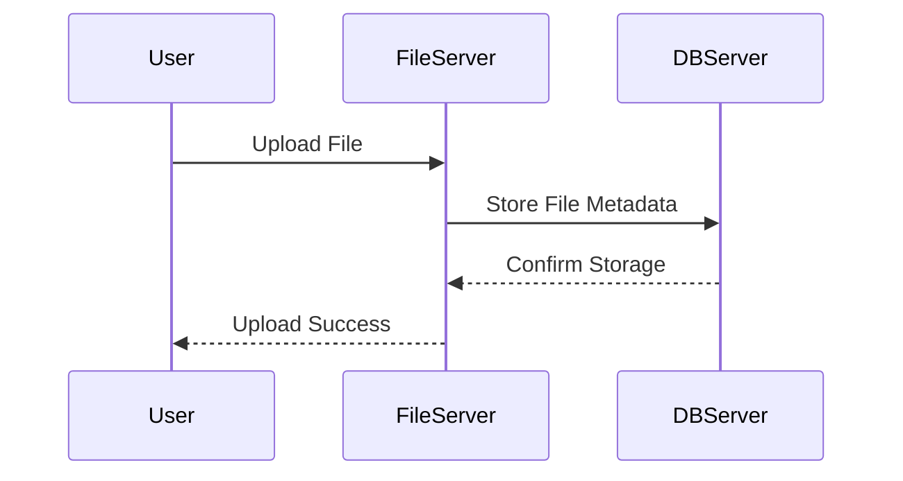

                 

### 引入

在现代信息社会中，数据已成为新的核心资源，而如何高效、可靠地存储和管理海量数据成为各个企业、机构乃至整个社会亟待解决的重要课题。随着互联网、物联网、大数据和云计算技术的蓬勃发展，分布式存储系统逐渐成为解决这一难题的关键手段。

**分布式存储系统**是一种将数据存储在不同地理位置的服务器上，通过特定的协议和算法协调各个节点，实现对数据进行高效管理、访问和复制的系统。与传统集中式存储系统相比，分布式存储系统具有更高的可扩展性、可用性和可靠性。

本文将围绕构建一个可靠的分布式存储系统这一主题，展开深入的探讨。我们将首先介绍分布式存储系统的基本概念和组成部分，分析其面临的挑战，然后详细讲解分布式存储系统的架构设计、核心算法和关键技术，最后结合实际项目案例，展示如何实现并优化一个分布式存储系统。通过这篇文章，我们希望读者能够全面理解分布式存储系统的原理和应用，为未来在实际工作中设计和部署分布式存储系统打下坚实的基础。

### 关键词

- 分布式存储系统
- 数据一致性
- 数据可用性
- 数据分区
- 数据冗余
- 一致性算法
- 负载均衡
- 容错机制

### 摘要

本文旨在深入探讨如何构建一个可靠的分布式存储系统。首先，我们介绍了分布式存储系统的基本概念和组成部分，分析了其在数据一致性、可用性和分区等方面的挑战。接着，我们详细讲解了分布式存储系统的架构设计、一致性算法、数据分区与负载均衡策略、数据冗余与容错机制等核心技术和方法。最后，通过一个实际项目案例，展示了如何实现和优化分布式存储系统，并总结了相关最佳实践。本文旨在为读者提供关于分布式存储系统的全面理解和实践指导。

## 分布式存储系统概述

### 1.1 为什么要构建分布式存储系统

分布式存储系统在现代信息社会中具有重要的地位，其必要性主要体现在以下几个方面：

1. **数据量的爆发性增长**：随着互联网的普及和物联网、大数据、人工智能等技术的应用，数据量呈现爆炸式增长。单台服务器难以满足海量数据的存储需求，分布式存储系统能够通过多个节点协同工作，实现数据的高效存储和管理。

2. **高性能和可扩展性**：分布式存储系统能够通过横向扩展，即增加服务器节点，来提高系统的存储能力和性能。这种可扩展性使得系统能够轻松应对不断增长的数据量和用户访问量。

3. **高可用性和可靠性**：分布式存储系统通过数据冗余和容错机制，能够保证数据的高可用性和系统的可靠性。当某个节点发生故障时，系统可以通过其他节点上的数据副本恢复服务，减少因故障带来的影响。

4. **地理分布的数据管理**：许多企业和组织需要在全球范围内管理数据，分布式存储系统支持数据的地理分布存储，能够更好地满足跨地域数据访问和管理需求。

### 1.2 分布式存储系统的优势

分布式存储系统相较于传统集中式存储系统具有以下优势：

1. **可扩展性**：分布式存储系统通过增加节点可以水平扩展，从而满足数据增长的需求，而无需更换硬件或重构系统。

2. **高可用性**：分布式存储系统通过数据冗余和容错机制，确保在单个节点故障时，系统仍然能够正常服务，提高了系统的可靠性。

3. **高性能**：分布式存储系统通过多节点协同工作，可以提供更高的读写速度，满足大规模数据访问的需求。

4. **灵活性**：分布式存储系统可以根据不同应用场景和需求进行定制化配置，提供灵活的数据存储和管理方案。

5. **成本低**：分布式存储系统利用普通服务器节点即可实现高性能的存储能力，降低了硬件成本。

### 1.3 分布式存储系统的挑战

尽管分布式存储系统具有诸多优势，但在实际应用中仍面临以下挑战：

1. **数据一致性**：分布式存储系统中，数据可能分布在多个节点上。如何在多个节点之间保持数据的一致性是一个复杂的问题。

2. **数据可用性**：确保分布式存储系统在多个节点故障时仍然能够提供服务，需要设计有效的数据备份和恢复机制。

3. **数据分区**：如何将数据合理地分配到各个节点上，以最大化系统的性能和可扩展性，是一个关键问题。

4. **数据冗余**：为了提高数据的可用性和可靠性，分布式存储系统需要实现数据冗余，但过多的冗余会增加存储空间和带宽的消耗。

5. **网络延迟和带宽限制**：分布式存储系统依赖于网络进行数据传输，网络延迟和带宽限制会影响系统的性能和响应时间。

### 1.4 分布式存储系统的主要组成部分

分布式存储系统通常由以下几个关键组成部分构成：

1. **数据存储节点**：数据存储节点是分布式存储系统的核心，负责存储和管理数据。每个节点都可以独立处理数据读写请求。

2. **协调节点**：协调节点负责协调各个数据存储节点的工作，处理数据一致性、分区、复制等全局性任务。

3. **数据传输网络**：数据传输网络连接各个存储节点，负责数据的传输和同步。网络的质量和带宽直接影响系统的性能。

4. **监控和管理系统**：监控系统负责对分布式存储系统进行实时监控，包括节点状态、数据状态、性能指标等。管理系统提供用户界面和命令行工具，方便用户管理和维护存储系统。

通过这些组成部分的协同工作，分布式存储系统能够高效、可靠地管理海量数据，满足各种应用场景的需求。

## 分布式存储系统架构设计

### 2.1 架构设计原则

设计一个分布式存储系统时，需要遵循以下几个核心原则，以确保系统的可扩展性、可靠性和高性能：

1. **可扩展性**：系统应具备良好的横向扩展能力，能够通过增加节点来满足数据增长的需求，而无需进行大规模重构或停机。

2. **高可用性**：系统应具备容错机制，能够在单个节点或多个节点故障时，快速切换到备用节点，确保服务的持续可用。

3. **高性能**：系统应能够快速响应用户请求，提供高效的读写性能，满足大规模数据访问的需求。

4. **分布式一致性**：系统应通过一致性算法和机制，确保分布式环境中多个节点之间的数据一致性。

5. **灵活性**：系统应具备灵活性，能够适应不同规模和场景下的需求，支持灵活的数据存储和访问策略。

6. **安全性**：系统应具备完善的安全机制，包括数据加密、访问控制、安全审计等，保护数据安全。

### 2.2 分布式文件系统

分布式文件系统是分布式存储系统的重要组成部分，负责管理和存储大量数据。以下介绍几种常见的分布式文件系统及其架构设计：

#### 2.2.1 HDFS架构设计

HDFS（Hadoop Distributed File System）是Apache Hadoop项目的核心组件之一，设计用于存储海量数据。HDFS架构主要包括以下几个部分：

1. **NameNode**：NameNode是HDFS的命名空间管理者，负责维护文件系统的元数据，包括文件的存储路径、块映射、数据块的位置信息等。

2. **DataNode**：DataNode是HDFS中的数据存储节点，负责实际的数据存储和读写操作。每个DataNode负责存储一定数量的数据块，并向NameNode汇报数据块的状态。

3. **数据块**：HDFS将文件分为固定大小的数据块（默认为128MB或256MB），这些数据块分布在多个DataNode上。通过将数据分割为小块，HDFS能够实现高效的数据读写和分布式存储。

#### 2.2.2 HDFS数据存储与复制策略

HDFS采用副本机制来提高数据的可靠性和可用性。具体而言，HDFS的复制策略如下：

1. **副本数量配置**：默认情况下，HDFS将每个数据块复制3个副本，但用户可以根据需求调整副本数量。

2. **副本分布**：HDFS会尽量将副本分布在不同的机架上，以减少单点故障的风险。

3. **副本维护**：NameNode会定期检查副本的状态，并采取适当的措施来维护副本的数量和分布。如果发现某个副本损坏或丢失，HDFS会自动复制一个新的副本。

#### 2.2.3 HDFS读写流程

HDFS读写流程如下：

1. **写流程**：
   - 客户端向NameNode发送文件写入请求，请求指定文件的存储路径。
   - NameNode接收请求后，向客户端返回一个数据块的列表，指示客户端需要将数据块存储在哪些DataNode上。
   - 客户端将数据分成数据块，并依次写入对应的DataNode。
   - DataNode将数据块写入本地磁盘，并向NameNode汇报数据块的状态。
   - NameNode更新文件系统的元数据，包括数据块的存储位置和副本信息。

2. **读流程**：
   - 客户端向NameNode发送文件读取请求，请求指定文件的存储路径。
   - NameNode根据文件的元数据，确定数据块的位置和副本信息。
   - NameNode选择一个最近的副本发送给客户端，或根据副本数量选择多个副本进行读取。
   - DataNode将数据块发送给客户端，客户端将多个数据块重新组装成完整的文件。

### 2.3 分布式数据库

分布式数据库通过将数据分布在多个节点上，提供高性能和高可用性的数据存储解决方案。以下介绍几种常见的分布式数据库及其架构设计：

#### 2.3.1 Cassandra架构设计

Cassandra是一种分布式宽列存储数据库，设计用于处理大规模分布式数据存储和访问需求。Cassandra架构主要包括以下几个部分：

1. **Seed Node**：Seed Node是Cassandra集群中的特殊节点，负责存储集群的元数据和初始连接信息。

2. **Thrift Server**：Thrift Server是Cassandra的客户端接口，负责处理客户端的读写请求。

3. **Gossip通信**：Cassandra通过Gossip协议实现节点间的通信和状态同步，确保集群的可用性和一致性。

4. **数据分区和复制**：Cassandra采用Gossip协议和一致性算法，将数据分片存储在多个节点上，并配置多个副本以提高数据的可用性和可靠性。

#### 2.3.2 数据模型

Cassandra的数据模型由键空间、表和列族组成：

1. **键空间**：键空间是Cassandra中的命名空间，用于组织和管理表。

2. **表**：表是Cassandra中的数据结构，包含多个列族。

3. **列族**：列族是一组有序列的集合，每个列族有自己的键和值。

#### 2.3.3 数据分区策略

Cassandra的数据分区策略如下：

1. **动态数据分区**：Cassandra根据列的值将数据动态分区存储在不同的节点上，确保数据均衡分布在集群中。

2. **主键设计**：合理设计主键（复合键）可以提高数据分区的性能和均衡性。

3. **数据复制**：Cassandra根据配置的副本数量，将数据复制到多个节点上，提高数据的可用性和可靠性。

### 2.4 分布式存储网络架构

分布式存储系统依赖于网络进行数据传输和同步，网络架构的设计对系统的性能和可靠性至关重要。以下介绍几种常见的分布式存储网络架构：

#### 2.4.1 存储网络设计

存储网络设计需要考虑以下几个方面：

1. **网络拓扑结构**：常见的网络拓扑结构包括环网、星型网、树型网和网状网。不同的拓扑结构具有不同的性能和可靠性特点。

2. **网络带宽和延迟**：高带宽和低延迟的网络可以提高数据传输速度，减少系统的响应时间。

3. **冗余设计**：通过设计冗余链路和备份路由，提高网络的可靠性和容错能力。

4. **负载均衡**：合理分配网络流量，避免单点过载，提高网络的性能和稳定性。

#### 2.4.2 网络拓扑结构

常见的网络拓扑结构包括：

1. **环网**：环网通过环形拓扑连接多个节点，具有低延迟和高可靠性的特点。

2. **星型网**：星型网通过中心节点连接多个节点，具有易于管理和维护的特点。

3. **树型网**：树型网通过层级结构连接多个节点，适用于大规模分布式系统。

4. **网状网**：网状网通过多对多连接，提供最高级别的可靠性和性能。

#### 2.4.3 数据传输协议

常见的分布式存储数据传输协议包括：

1. **TCP/IP**：TCP/IP是一种可靠的网络传输协议，适用于高可靠性和低延迟的存储网络。

2. **UDP**：UDP是一种不可靠的网络传输协议，适用于对延迟敏感的实时数据传输。

3. **gRPC**：gRPC是一种高性能、基于HTTP/2的远程过程调用（RPC）框架，适用于分布式计算和存储系统。

通过合理设计分布式存储网络架构，可以确保分布式存储系统的高性能、高可靠性和高扩展性。

## 分布式一致性算法

在分布式存储系统中，数据的一致性是确保系统能够正确处理并发操作和故障恢复的关键因素。分布式一致性算法通过在多个节点之间协调数据操作，保证数据的一致性。本文将介绍分布式一致性算法的基本概念、一致性模型以及常用的分布式一致性算法，并讨论它们在实际应用中的优缺点。

### 3.1 一致性模型

分布式一致性模型描述了分布式系统在处理数据时的一致性要求。以下是两种主要的一致性模型：

#### 3.1.1 CAP理论

CAP理论是由Eric Brewer提出的，它指出在一个分布式系统中，一致性（Consistency）、可用性（Availability）和分区容错性（Partition tolerance）三者之间只能同时满足两项。

1. **一致性（Consistency）**：在分布式系统中，所有节点在同一时间看到的数据是一致的。
2. **可用性（Availability）**：系统对于每个请求都返回一个响应，无论这个响应是成功还是失败。
3. **分区容错性（Partition tolerance）**：系统能够在分区失败时继续运作。

根据CAP理论，一个分布式系统只能在CAP三者中选择两项。例如，在应对网络分区时，系统可以选择保持一致性或可用性，但不能同时保持两者。

#### 3.1.2 BASE理论

BASE理论是对CAP理论的补充，它提出了一种在分布式系统中更灵活的一致性模型。BASE代表基本可用性（Basic Availability）、软状态（Soft State）和最终一致性（Eventually Consistency）。

1. **基本可用性**：系统尽量保证对外提供服务，即使在面临网络分区或故障时也不中断服务。
2. **软状态**：系统的状态可能不是稳定的，而是动态变化的，这意味着系统可能需要一定时间才能达到最终一致状态。
3. **最终一致性**：系统会在一段时间内达到一致性，但这一过程是异步的，不要求在所有节点上立即一致。

#### 3.1.3 一致性模型对比

CAP理论和BASE理论提供了不同的视角来平衡一致性、可用性和分区容错性。CAP理论强调在面临网络分区时必须做出选择，而BASE理论则通过放宽一致性要求，提供更高的可用性和容错性。

### 3.2 分布式一致性算法

分布式一致性算法是实现分布式系统数据一致性的关键机制。以下介绍几种常用的分布式一致性算法：

#### 3.2.1 Paxos算法

Paxos算法是由Lamport提出的一种分布式一致性算法，用于在一个分布式系统中实现一致性协议。Paxos算法的主要思想是：

1. **准备阶段**：提议者（Proposer）向其他节点发送准备请求，询问它们是否接受提议。
2. **接受阶段**：如果多数节点接受提议，那么这些节点将执行该提议，并将结果返回给提议者。
3. **学习阶段**：提议者将接受到的结果通知其他节点，使它们学习到最终的决策。

Paxos算法的优点是能够保证一致性，并且在面对网络分区和节点故障时具有高度的容错性。缺点是算法较为复杂，实现难度较大。

#### 3.2.2 Raft算法

Raft算法是由Owen提出的另一种分布式一致性算法，相较于Paxos算法，Raft算法更加简洁、易于理解和实现。Raft算法的主要思想是：

1. **领导选举（Leader Election）**：在分布式系统中，一个节点通过选举成为领导（Leader），其他节点成为跟随者（Follower）。
2. **日志复制（Log Replication）**：领导节点接收客户端的请求，将其作为日志条目添加到自己的日志中，然后向跟随者发送日志条目，要求它们复制这些条目。
3. **状态机（State Machine）**：所有节点的状态机最终会达到一致，从而保证系统的一致性。

Raft算法的优点是：

- **简洁性**：Raft算法的实现比Paxos算法简单，更容易理解和实现。
- **高效性**：Raft算法在处理大量日志条目时具有更高的性能。

### 3.3 一致性算法应用

分布式一致性算法在分布式存储系统中有着广泛的应用，主要用于实现数据同步和分布式锁。

#### 3.3.1 数据同步

数据同步是指在不同节点之间保持数据的一致性。一致性算法通过以下步骤实现数据同步：

1. **主从同步**：在一个分布式存储系统中，一个节点作为主节点，其他节点作为从节点。主节点负责处理所有的写操作，并将操作日志发送给从节点，从节点根据日志进行数据同步。
2. **选举算法**：在分布式系统中，当主节点故障时，从节点通过一致性算法进行选举，选出一个新的主节点，确保数据同步的连续性。

#### 3.3.2 分布式锁

分布式锁用于在分布式系统中确保对共享资源的互斥访问。一致性算法可以通过以下步骤实现分布式锁：

1. **锁请求**：客户端向一致性算法请求锁，算法根据当前系统的状态决定是否授予锁。
2. **锁释放**：客户端在完成操作后释放锁，算法根据锁的状态释放锁资源。

#### 3.3.3 应用案例分析

在实际应用中，一致性算法的选择取决于系统的具体需求和约束。例如：

- **大型电商平台**：为了保证订单处理的一致性，可以使用Raft算法实现分布式锁，确保不同节点上的订单数据一致。
- **分布式数据库**：如Cassandra，采用Paxos算法实现分布式一致性，确保集群中的数据在故障情况下保持一致性。

### 3.4 一致性算法优缺点对比

不同的一致性算法在性能、复杂度和实现难度上有所差异，以下是Paxos和Raft算法的优缺点对比：

#### Paxos算法

- **优点**：
  - **一致性**：能够保证在分布式系统中的一致性。
  - **容错性**：面对节点故障和网络分区具有高度的容错性。

- **缺点**：
  - **复杂性**：算法相对复杂，实现难度较高。
  - **性能**：相比Raft算法，Paxos算法在处理大量日志条目时性能较低。

#### Raft算法

- **优点**：
  - **简洁性**：算法结构简单，易于理解和实现。
  - **高效性**：在处理大量日志条目时性能较高。

- **缺点**：
  - **一致性**：虽然Raft算法能够保证一致性，但相比于Paxos算法，在极端情况下的一致性保障可能较弱。

综上所述，选择合适的一致性算法需要根据系统的具体需求和约束进行权衡。在实际应用中，可以根据一致性算法的性能、复杂度和实现难度，结合系统的业务场景，选择最合适的算法。

## 分布式数据分区与负载均衡

在分布式存储系统中，数据分区与负载均衡是两个至关重要的概念。数据分区策略决定了数据如何分布在不同的节点上，而负载均衡则确保系统在处理大量请求时能够保持高性能和稳定性。本文将详细探讨分布式数据分区策略、负载均衡方法和分布式数据缓存策略，以及如何实现缓存一致性。

### 4.1 数据分区策略

数据分区是分布式存储系统中的一个关键环节，目的是将数据均匀地分布在多个节点上，以最大化系统的性能和可扩展性。以下是几种常见的数据分区策略：

#### 4.1.1 哈希分区

哈希分区是一种基于哈希函数的数据分区策略。具体步骤如下：

1. **选择分区键**：选择一个或多个字段作为分区键，通常是数据中具有唯一标识的字段，如用户ID或订单ID。
2. **计算哈希值**：将分区键的值通过哈希函数计算出一个哈希值。
3. **确定分区**：根据哈希值确定数据应该存储在哪个节点上。常用的方法是使用取模操作（hash % 节点数量）或位运算。

哈希分区的主要优点是：

- **均匀分布**：哈希函数能够将数据均匀地分布到不同的节点上，避免某些节点过载。
- **高效查询**：通过哈希值可以直接定位到数据所在节点，提高数据查询性能。

但哈希分区也有一定的局限性：

- **热点数据**：当某些数据具有很高的访问频率时，可能会导致这些数据集中在少数节点上，形成热点。
- **分区键选择**：选择合适的分区键对于哈希分区的效果有很大影响，需要根据具体业务场景进行选择。

#### 4.1.2 范围分区

范围分区是一种基于数据值范围的数据分区策略。具体步骤如下：

1. **确定分区范围**：根据数据的特性，将数据划分为多个区间，如按时间范围、金额范围等。
2. **分配分区**：将每个区间分配到不同的节点上。

范围分区的优点是：

- **数据可理解性**：分区边界明确，便于管理和查询。
- **数据隔离**：不同分区之间的数据相互独立，降低数据访问的冲突。

但范围分区也存在一些问题：

- **数据倾斜**：当某些数据范围较宽或较窄时，可能导致数据分布不均，影响系统性能。
- **范围重叠**：当不同分区范围存在重叠时，可能导致数据重复存储，增加系统开销。

### 4.2 负载均衡

负载均衡是分布式存储系统中的重要机制，用于平衡系统中的负载，确保每个节点都能充分利用其资源，避免某个节点过载。以下是几种常见的负载均衡方法：

#### 4.2.1 轮询调度

轮询调度是一种最简单的负载均衡方法，按照顺序依次将请求分配到每个节点。具体步骤如下：

1. **初始化**：将所有节点加入负载均衡器。
2. **处理请求**：每次接收到请求时，按照顺序选择下一个节点进行处理。
3. **循环**：当到达最后一个节点后，重新开始循环。

轮询调度的优点是简单易实现，适用于节点性能相对均衡的场景。缺点是当某些节点性能较差时，可能会导致系统性能下降。

#### 4.2.2 最少连接调度

最少连接调度根据当前每个节点的连接数（如活跃会话数）将请求分配到连接数最少的节点。具体步骤如下：

1. **初始化**：记录每个节点的当前连接数。
2. **处理请求**：每次接收到请求时，选择当前连接数最少的节点进行处理。
3. **更新**：在处理完请求后，更新节点的连接数。

最少连接调度的优点是能够有效平衡系统的负载，减少某些节点的过载。缺点是需要实时监控每个节点的连接状态，对系统性能有一定影响。

#### 4.2.3 加权轮询调度

加权轮询调度是一种根据节点性能对请求进行调度的方法。具体步骤如下：

1. **初始化**：为每个节点分配一个权重，权重可以基于节点的CPU、内存、磁盘性能等。
2. **处理请求**：每次接收到请求时，根据节点的权重进行加权轮询，选择权重最高的节点进行处理。
3. **调整权重**：根据节点的性能变化动态调整权重。

加权轮询调度的优点是能够根据节点的性能进行优化，提高系统的整体性能。缺点是权重的设置和调整需要一定经验，否则可能导致系统性能下降。

### 4.3 分布式数据缓存策略

分布式数据缓存是提高分布式存储系统性能的有效手段。缓存策略的核心是减少对后端存储的访问，提高系统的响应速度。以下是几种常见的分布式数据缓存策略：

#### 4.3.1 基本缓存策略

基本缓存策略将频繁访问的数据存储在缓存中，如内存缓存或SSD缓存。具体步骤如下：

1. **初始化**：为系统配置缓存空间，如内存或SSD。
2. **缓存加载**：根据访问频率和最近最少使用（LRU）等算法，将频繁访问的数据加载到缓存中。
3. **缓存访问**：在处理请求时，优先访问缓存，若缓存命中，直接返回缓存数据；否则，访问后端存储，并将数据加载到缓存。

基本缓存策略的优点是简单易实现，能够显著提高系统的响应速度。缺点是缓存空间有限，无法存储所有数据。

#### 4.3.2 分布式缓存一致性

分布式缓存一致性是指多个节点之间的缓存数据保持一致。常见的分布式缓存一致性策略包括：

1. **缓存同步**：当某个节点的缓存数据发生变更时，同步更新其他节点的缓存数据。
2. **缓存版本**：为缓存数据分配版本号，每次更新时增加版本号，节点在访问缓存时检查版本一致性。

分布式缓存一致性的关键在于如何高效地同步数据，以避免缓存冲突和数据不一致。常用的实现方法包括：

- **缓存锁**：在访问缓存时，通过缓存锁确保多个节点对同一数据的并发访问不会导致数据不一致。
- **消息队列**：通过消息队列实现缓存同步，当一个节点更新缓存时，将更新消息发送到消息队列，其他节点从消息队列中获取更新信息。

#### 4.3.3 缓存驱逐策略

缓存驱逐策略用于管理缓存空间，确保缓存中存储的是最频繁访问的数据。常见的缓存驱逐策略包括：

- **LRU（最近最少使用）**：根据数据访问时间，将最近最久未访问的数据驱逐出缓存。
- **LFU（最少使用频率）**：根据数据访问频率，将访问频率最低的数据驱逐出缓存。
- **定时刷新**：定期刷新缓存，将部分数据替换为新的数据。

选择合适的缓存驱逐策略需要根据系统的具体需求和负载情况，平衡缓存空间的利用率和数据一致性。

### 4.4 实现缓存一致性

实现缓存一致性是分布式存储系统中的重要挑战，以下介绍几种常用的方法：

#### 4.4.1 读写锁

读写锁是一种基于锁机制的缓存一致性策略。具体步骤如下：

1. **写锁**：在更新缓存数据时，先获取写锁，确保其他节点无法同时修改相同的数据。
2. **读锁**：在读取缓存数据时，先获取读锁，确保读取操作不会受到其他写操作的干扰。

读写锁的优点是简单易实现，能够保证缓存数据的一致性。缺点是可能导致缓存访问的延迟。

#### 4.4.2 缓存一致性协议

缓存一致性协议是一种通过协议机制实现缓存一致性的策略。常见的缓存一致性协议包括：

1. **MESI协议**：MESI协议通过状态标记（Modified、Exclusive、Shared、Invalid）来管理缓存数据的一致性，确保在多个节点之间缓存数据的正确同步。
2. **MOESI协议**：MOESI协议在MESI协议的基础上增加了 Ownership 状态，用于管理缓存数据的读写权限。

缓存一致性协议的优点是能够高效地实现缓存一致性，降低缓存访问的延迟。缺点是实现复杂，对系统性能有一定影响。

#### 4.4.3 缓存一致性消息队列

缓存一致性消息队列是一种通过消息队列实现缓存一致性的策略。具体步骤如下：

1. **消息发送**：当某个节点更新缓存数据时，将更新消息发送到消息队列。
2. **消息处理**：其他节点从消息队列中获取更新消息，并更新本地缓存。

缓存一致性消息队列的优点是能够灵活地管理缓存一致性，降低系统复杂度。缺点是可能导致缓存访问的延迟。

综上所述，实现缓存一致性需要根据系统的具体需求和负载情况，选择合适的策略和方法。通过合理设计数据分区策略、负载均衡方法和缓存一致性机制，可以显著提高分布式存储系统的性能和可靠性。

## 分布式数据冗余与容错

在分布式存储系统中，数据冗余和容错是保障数据可靠性和系统稳定性的关键机制。数据冗余通过在多个节点上存储数据的副本，提高数据的可用性和可靠性。容错机制则通过检测和恢复系统故障，确保系统能够在发生故障时继续提供服务。本文将详细探讨数据冗余策略、容错机制以及分布式存储系统在面临故障时的处理方法。

### 5.1 数据冗余策略

数据冗余是通过在多个节点上存储数据的副本，以提高数据的可用性和可靠性。以下介绍几种常见的数据冗余策略：

#### 5.1.1 三副本

三副本是最常见的数据冗余策略，即将每个数据块复制到三个不同的节点上。三副本的优点是：

- **高可用性**：当任意一个节点故障时，系统仍至少保留两个副本，可以继续提供服务。
- **高性能**：三副本可以提供更高的读取性能，因为读取操作可以在任意一个副本上执行。

三副本的缺点是：

- **存储空间消耗**：每个数据块需要存储三个副本，导致存储空间消耗增加。
- **带宽消耗**：数据同步和复制过程中，需要消耗额外的网络带宽。

#### 5.1.2 多副本

多副本是一种灵活的数据冗余策略，可以根据具体需求配置不同的副本数量。多副本的优点是：

- **高可用性**：可以根据业务需求调整副本数量，在提高数据可靠性的同时，减少存储空间和带宽的消耗。
- **灵活性**：适用于不同规模和场景下的数据冗余需求。

多副本的缺点是：

- **复杂度**：副本数量的调整和管理增加了系统的复杂度。
- **性能**：过多的副本可能导致数据同步延迟和带宽消耗增加。

#### 5.1.3 数据去重

数据去重是通过检测和删除重复数据，减少存储空间消耗的一种冗余策略。数据去重的主要方法包括：

- **哈希检测**：通过计算数据的哈希值，检测和删除重复数据。
- **指纹检测**：通过数据指纹（如文件名、文件大小等）检测和删除重复数据。

数据去重的优点是：

- **存储空间节省**：有效减少存储空间消耗，降低存储成本。
- **性能提升**：减少存储和传输的数据量，提高系统性能。

数据去重的缺点是：

- **数据完整性**：在删除重复数据时，可能误删重要数据，需要确保数据完整性。
- **实现复杂度**：实现数据去重算法需要一定技术难度，对系统性能有一定影响。

### 5.2 容错机制

分布式存储系统在面对故障时，需要具备自我恢复和自我修复的能力，以确保数据的高可用性和系统稳定性。以下介绍几种常见的容错机制：

#### 5.2.1 数据校验

数据校验是通过计算数据的校验和或哈希值，检测数据在传输或存储过程中是否发生损坏。常见的数据校验方法包括：

- **CRC校验**：循环冗余校验（CRC），通过计算数据的CRC值，检测数据完整性。
- **MD5/SHA-1/SHA-256**：通过计算数据的MD5、SHA-1或SHA-256哈希值，检测数据完整性。

数据校验的优点是：

- **简单有效**：通过校验和或哈希值，可以快速检测数据损坏。
- **低成本**：校验和或哈希值的计算成本较低。

数据校验的缺点是：

- **无法恢复**：仅能检测数据损坏，无法恢复损坏的数据。

#### 5.2.2 数据恢复

数据恢复是通过检测和修复损坏的数据，确保数据完整性和可用性。常见的数据恢复方法包括：

- **副本恢复**：通过使用多个副本中的有效副本，修复损坏的数据。
- **日志恢复**：通过存储操作日志，回滚或重做损坏的操作，恢复数据一致性。

数据恢复的优点是：

- **数据完整性**：能够确保数据的一致性和完整性。
- **高效性**：通过有效的恢复机制，可以快速恢复数据。

数据恢复的缺点是：

- **实现复杂度**：实现数据恢复机制需要一定技术难度，对系统性能有一定影响。

#### 5.2.3 节点监控和故障检测

节点监控和故障检测是通过实时监控节点状态，检测节点故障，并触发恢复操作。常见的方法包括：

- **心跳检测**：通过定期发送心跳信号，检测节点是否在线。
- **异常检测**：通过监控节点的性能指标（如CPU使用率、内存使用率、网络延迟等），检测节点是否发生异常。

节点监控和故障检测的优点是：

- **实时性**：能够实时检测节点状态，快速响应故障。
- **自动化**：通过自动化故障检测和恢复，减少人工干预，提高系统稳定性。

节点监控和故障检测的缺点是：

- **性能开销**：监控和检测过程需要消耗一定的系统资源，影响系统性能。
- **误报率**：可能存在误报现象，导致不必要的系统资源消耗。

### 5.3 分布式存储系统容错案例

以下介绍两个常见的分布式存储系统容错案例，展示系统在面对故障时的处理方法。

#### 5.3.1 HDFS故障处理

HDFS（Hadoop Distributed File System）是一个分布式文件系统，在面对节点故障时，通过以下机制进行故障处理：

1. **副本恢复**：当检测到某个节点故障时，系统自动使用其他节点的副本恢复数据。
2. **数据校验**：在恢复过程中，使用校验和或哈希值检测数据的完整性。
3. **日志回滚**：在恢复数据时，根据操作日志回滚或重做损坏的操作，确保数据一致性。

#### 5.3.2 Cassandra故障处理

Cassandra是一个分布式宽列存储数据库，在面对节点故障时，通过以下机制进行故障处理：

1. **选举新领导节点**：当当前领导节点故障时，其他节点通过Gossip协议进行选举，选出一个新的领导节点。
2. **数据迁移**：将故障节点的数据迁移到新领导节点上，确保数据一致性。
3. **副本同步**：在新领导节点上重新同步副本，确保数据冗余和一致性。

通过以上机制，分布式存储系统能够在面对故障时，快速恢复服务，确保数据的高可用性和系统稳定性。

### 5.4 容错设计与优化

为了提高分布式存储系统的容错能力，可以采取以下设计优化措施：

1. **冗余设计**：在系统设计阶段，通过冗余设计提高系统的容错能力。例如，设计多个数据副本、备份节点等。
2. **故障检测与自修复**：通过实时监控和故障检测机制，发现故障并自动修复，减少人工干预。
3. **负载均衡**：通过负载均衡策略，确保系统在不同节点之间均衡负载，降低单点故障风险。
4. **数据备份与恢复**：定期备份数据，并在需要时进行恢复，确保数据的安全性和完整性。
5. **灾难恢复**：设计灾难恢复策略，如异地备份、数据迁移等，确保在发生灾难时能够快速恢复系统。

通过以上措施，可以显著提高分布式存储系统的容错能力，确保系统在面对故障时能够快速恢复，提供持续可靠的服务。

### 5.5 分布式存储系统故障案例分析

以下介绍两个实际案例，分析分布式存储系统在面临故障时的表现和恢复过程。

#### 5.5.1 案例1：HDFS单点故障

在一个使用HDFS的分布式系统中，某个节点由于硬件故障导致不可用。系统检测到该节点故障后，通过以下步骤进行恢复：

1. **副本恢复**：系统使用其他节点的副本恢复数据，确保数据完整性。
2. **数据校验**：在恢复过程中，使用校验和或哈希值检测数据的完整性。
3. **日志回滚**：根据操作日志回滚或重做损坏的操作，确保数据一致性。

经过恢复，系统恢复正常运行，数据一致性得到保障。

#### 5.5.2 案例2：Cassandra领导节点故障

在一个使用Cassandra的分布式数据库中，当前领导节点由于网络故障导致不可用。系统通过以下步骤进行故障处理：

1. **选举新领导节点**：其他节点通过Gossip协议进行选举，选出一个新的领导节点。
2. **数据迁移**：将故障节点的数据迁移到新领导节点上，确保数据一致性。
3. **副本同步**：在新领导节点上重新同步副本，确保数据冗余和一致性。

经过故障处理，系统恢复正常运行，数据一致性得到保障。

通过以上案例分析，可以看出分布式存储系统在面对故障时，通过冗余设计、故障检测与自修复机制，能够快速恢复，确保数据的高可用性和系统稳定性。

### 5.6 容错最佳实践

为了提高分布式存储系统的容错能力，可以采取以下最佳实践：

1. **设计冗余**：在设计系统时，考虑数据冗余、节点冗余等，提高系统的容错能力。
2. **故障检测与自修复**：实现实时监控和自动故障检测，确保在故障发生时能够快速响应和自动恢复。
3. **负载均衡**：合理配置负载均衡策略，确保系统在不同节点之间均衡负载，降低单点故障风险。
4. **数据备份与恢复**：定期备份数据，并设计有效的数据恢复机制，确保数据的安全性和完整性。
5. **灾难恢复**：设计灾难恢复策略，如异地备份、数据迁移等，确保在发生灾难时能够快速恢复系统。

通过以上措施，分布式存储系统可以显著提高容错能力，确保在面对故障时能够快速恢复，提供持续可靠的服务。

### 5.7 总结

数据冗余和容错机制是分布式存储系统确保数据可靠性和系统稳定性的关键。通过多种数据冗余策略，如三副本和多副本，以及有效的容错机制，如数据校验、副本恢复和故障检测，分布式存储系统能够在面对故障时快速恢复，确保数据的高可用性和系统稳定性。在实际应用中，需要根据具体需求和场景，合理设计数据冗余和容错机制，提高系统的可靠性。

## 分布式存储系统部署与运维

### 6.1 系统部署

部署分布式存储系统是确保系统能够稳定运行的关键步骤。以下将介绍分布式存储系统的部署过程，包括环境准备、节点部署和系统配置。

#### 6.1.1 环境准备

在进行分布式存储系统部署之前，需要准备以下环境：

1. **硬件环境**：确保服务器具备足够的CPU、内存和磁盘容量，以及稳定的网络连接。
2. **操作系统**：选择适合的操作系统，如Linux发行版（如CentOS、Ubuntu）。
3. **依赖软件**：安装必要的依赖软件，如Java、Hadoop、Cassandra等。
4. **网络配置**：确保网络环境能够支持分布式存储系统的通信，包括IP地址分配、子网掩码和网关设置。

#### 6.1.2 节点部署

分布式存储系统通常由多个节点组成，包括主节点（如NameNode或Cassandra的Seed Node）和数据节点（如DataNode或Cassandra的Regular Node）。以下是节点部署的步骤：

1. **安装操作系统**：在每台服务器上安装操作系统，并进行必要的配置，如时区设置、防火墙规则调整等。
2. **安装依赖软件**：在每台服务器上安装必要的依赖软件，确保软件版本兼容。
3. **配置网络**：配置服务器的网络参数，确保节点之间能够通过网络通信。
4. **初始化集群**：对于主节点，如HDFS的NameNode或Cassandra的Seed Node，进行初始化操作，包括创建必要的数据目录、配置文件等。
5. **启动服务**：启动所有节点上的分布式存储服务，如HDFS或Cassandra。

#### 6.1.3 系统配置

系统配置是确保分布式存储系统能够正常运行的重要环节。以下是一些关键配置：

1. **数据分区和复制策略**：根据业务需求和性能要求，配置数据分区和复制策略。例如，HDFS的数据块复制策略可以配置为三副本。
2. **节点角色分配**：明确每个节点的角色，如NameNode、DataNode或Seed Node，并确保节点角色分配合理。
3. **监控和日志配置**：配置系统监控工具和日志记录，以便在系统运行过程中进行实时监控和故障诊断。
4. **安全配置**：配置系统的安全机制，包括数据加密、访问控制和安全审计等。

### 6.2 系统监控

系统监控是确保分布式存储系统稳定运行的重要手段。通过监控系统能够实时了解系统的运行状态，及时发现和解决潜在问题。以下是常见的监控指标和工具：

#### 6.2.1 监控指标

1. **性能指标**：包括CPU使用率、内存使用率、磁盘读写速度、网络带宽等。
2. **资源利用率**：包括节点资源利用率、存储容量利用率等。
3. **错误率**：包括数据访问错误率、服务请求错误率等。
4. **延迟**：包括数据传输延迟、服务响应延迟等。
5. **负载**：包括节点负载、系统负载等。

#### 6.2.2 监控工具

1. **Prometheus**：Prometheus是一种开源监控解决方案，适用于大规模分布式系统，支持多种数据采集方式和告警机制。
2. **Grafana**：Grafana是一种开源可视化工具，可与Prometheus等监控解决方案集成，提供直观的监控仪表板。
3. **Zabbix**：Zabbix是一种开源监控解决方案，支持多种监控方式和告警机制，适用于中小规模分布式系统。
4. **Nagios**：Nagios是一种开源监控解决方案，提供广泛的监控功能，适用于不同规模和场景的分布式系统。

### 6.3 系统优化

系统优化是提高分布式存储系统性能和可靠性的重要环节。以下是一些常见的优化方法和策略：

#### 6.3.1 性能优化

1. **负载均衡**：通过合理的负载均衡策略，确保系统在不同节点之间均衡负载，避免单点过载。
2. **缓存策略**：采用缓存策略，如LRU（最近最少使用）缓存策略，减少对后端存储的访问，提高系统响应速度。
3. **数据压缩**：对数据进行压缩，减少数据传输和存储的带宽和空间消耗。
4. **并行处理**：通过并行处理技术，如多线程、异步处理等，提高系统的处理能力。

#### 6.3.2 稳定性优化

1. **冗余设计**：通过冗余设计，如数据复制和节点冗余，提高系统的可靠性。
2. **故障检测和恢复**：通过故障检测和恢复机制，确保在故障发生时能够快速恢复，减少系统停机时间。
3. **监控和告警**：通过实时监控和告警机制，及时发现和解决潜在问题，确保系统稳定运行。
4. **安全防护**：配置系统的安全防护措施，如数据加密、访问控制等，保护数据安全。

通过以上优化方法和策略，可以显著提高分布式存储系统的性能和可靠性，确保系统在高负载和故障情况下仍能够稳定运行。

### 6.4 运维策略

运维策略是确保分布式存储系统长期稳定运行的关键。以下是一些常见的运维策略：

#### 6.4.1 故障预防

1. **定期维护**：定期进行系统维护和更新，修复已知漏洞和性能问题。
2. **负载监测**：实时监测系统负载，及时调整系统配置和负载均衡策略，避免系统过载。
3. **数据备份**：定期备份数据，确保在发生数据丢失或系统故障时能够快速恢复。

#### 6.4.2 故障处理

1. **故障响应**：建立故障响应机制，快速定位故障原因，采取有效的修复措施。
2. **故障恢复**：在故障发生后，尽快恢复系统，确保数据的一致性和完整性。
3. **故障总结**：对每次故障进行总结，分析故障原因和解决方案，优化系统设计和运维策略。

#### 6.4.3 故障监控

1. **实时监控**：通过实时监控系统，监控系统的运行状态和关键指标，及时发现异常。
2. **告警机制**：配置告警机制，当系统出现异常时，及时通知运维人员。
3. **日志分析**：定期分析系统日志，查找潜在问题和故障隐患，预防故障发生。

通过以上运维策略，可以确保分布式存储系统长期稳定运行，提供高效可靠的服务。

### 6.5 容量规划

容量规划是分布式存储系统运维的重要环节，以下是一些容量规划的最佳实践：

#### 6.5.1 数据增长预测

1. **历史数据分析**：根据历史数据增长趋势，预测未来数据增长量。
2. **业务需求分析**：结合业务发展需求和数据使用情况，预测数据增长速度。

#### 6.5.2 存储容量估算

1. **预留空间**：预留一定的空间，以应对突发数据增长和系统扩展。
2. **容量估算**：根据数据增长预测和业务需求，估算未来所需的存储容量。

#### 6.5.3 扩展策略

1. **水平扩展**：通过增加节点，实现存储容量的扩展，提高系统性能。
2. **垂直扩展**：通过升级现有节点，提高节点的存储和处理能力。
3. **混合扩展**：结合水平扩展和垂直扩展，实现存储容量和性能的优化。

通过科学的容量规划，可以确保分布式存储系统能够满足不断增长的数据需求，提供稳定的存储服务。

### 6.6 总结

部署与运维是分布式存储系统成功运行的关键环节。通过合理的环境准备、节点部署和系统配置，确保系统能够稳定运行。系统监控和优化策略是保障系统性能和可靠性的关键，而科学的运维策略和容量规划则是确保系统长期稳定运行的重要保障。通过以上措施，分布式存储系统可以提供高效、可靠、稳定的存储服务。

## 分布式存储系统项目实战

### 7.1 项目背景

随着互联网和大数据技术的不断发展，企业对海量数据的存储和管理需求日益增长。为了应对这一挑战，我们开展了一个分布式存储系统的项目，旨在构建一个高性能、高可用、高可靠的分布式存储平台，以支持企业内部以及外部用户的数据存储和访问需求。

#### 7.1.1 项目简介

本项目旨在实现以下目标：

- **高性能**：通过分布式架构，提高数据读写速度和系统响应能力，满足大规模数据访问需求。
- **高可用性**：通过数据冗余和容错机制，确保系统在单个节点故障时仍能正常运行。
- **高可靠性**：通过监控和日志分析，确保数据的一致性和完整性。
- **易扩展性**：支持水平扩展，能够灵活适应数据增长和用户规模变化。

#### 7.1.2 项目目标

- 设计并实现一个分布式存储系统架构，支持数据存储、处理和访问。
- 部署和管理分布式存储系统，确保系统稳定运行。
- 实现数据分区和负载均衡策略，优化系统性能。
- 设计容错机制，确保系统在故障情况下能够快速恢复。

### 7.2 系统设计

#### 7.2.1 领域模型

在系统设计阶段，我们首先定义了系统的领域模型，包括以下核心类和实体：

1. **User**：用户实体，包括用户ID、用户名、密码等信息。
2. **File**：文件实体，包括文件名、文件大小、文件类型等属性。
3. **Chunk**：数据块实体，表示文件的分割部分。
4. **Block**：存储块实体，表示数据块在存储节点上的存储位置。

#### 7.2.2 系统架构设计

系统架构设计包括存储层、处理层和访问层，以下是系统架构的详细描述：

1. **存储层**：包括分布式文件系统（如HDFS）和分布式数据库（如Cassandra），负责数据存储和管理。
2. **处理层**：包括计算节点和协调节点，负责数据加工和处理。
3. **访问层**：包括Web应用和API接口，提供用户访问和数据交互。

#### 7.2.3 系统接口设计

系统接口设计包括以下接口：

- **文件上传接口**：用于接收用户上传的文件，并存储到分布式文件系统中。
- **文件下载接口**：用于从分布式文件系统中检索文件，并返回给用户。
- **数据查询接口**：用于查询分布式数据库中的数据，提供数据检索服务。

#### 7.2.4 系统交互

系统交互设计通过Mermaid序列图展示，如下：



### 7.3 实现细节

#### 7.3.1 环境安装

在项目实现阶段，我们首先搭建了分布式存储系统的环境，包括以下步骤：

1. **硬件准备**：准备多台服务器，配置适当的CPU、内存和磁盘容量。
2. **操作系统安装**：在每台服务器上安装Linux操作系统，并进行基础配置。
3. **依赖软件安装**：安装Java、Hadoop、Cassandra等依赖软件，确保版本兼容。

#### 7.3.2 系统核心实现

1. **文件上传功能**：
   - 用户通过Web应用上传文件。
   - Web应用将文件分割成数据块，并将每个数据块的元数据存储到Cassandra数据库中。
   - 文件上传完成后，Web应用向用户返回上传结果。

2. **文件下载功能**：
   - 用户通过Web应用或API接口请求下载文件。
   - Web应用根据文件元数据检索数据块的位置。
   - Web应用将数据块重新组装成完整的文件，并返回给用户。

3. **数据查询功能**：
   - 用户通过API接口发送查询请求。
   - API接口连接到Cassandra数据库，执行查询操作。
   - API接口将查询结果返回给用户。

### 7.4 代码应用解读与分析

以下是分布式存储系统的一些关键代码片段，以及对应的功能解析：

#### 7.4.1 文件上传代码

```python
# 文件上传代码示例
def upload_file(file, chunks):
    for chunk in chunks:
        store_chunk(chunk)
        update_metadata(file, chunk)

def store_chunk(chunk):
    # 存储数据块的代码
    pass

def update_metadata(file, chunk):
    # 更新文件元数据的代码
    pass
```

解析：
- `upload_file`函数接收用户上传的文件和数据块，并调用`store_chunk`和`update_metadata`函数。
- `store_chunk`函数将数据块存储到后端存储系统中。
- `update_metadata`函数更新文件元数据，包括数据块的存储位置和文件状态。

#### 7.4.2 文件下载代码

```python
# 文件下载代码示例
def download_file(file_id):
    file = get_file_metadata(file_id)
    chunks = get_chunks(file)
    file_content = ""

    for chunk in chunks:
        file_content += read_chunk(chunk)

    return file_content

def get_file_metadata(file_id):
    # 从数据库中获取文件元数据的代码
    pass

def get_chunks(file):
    # 从数据库中获取文件数据块的代码
    pass

def read_chunk(chunk):
    # 读取数据块的代码
    pass
```

解析：
- `download_file`函数根据文件ID获取文件元数据和数据块，并将数据块重新组装成完整的文件内容。
- `get_file_metadata`函数从数据库中获取文件元数据。
- `get_chunks`函数从数据库中获取文件数据块。
- `read_chunk`函数读取数据块内容。

#### 7.4.3 数据查询代码

```python
# 数据查询代码示例
def query_data(query):
    results = execute_query(query)
    return results

def execute_query(query):
    # 执行查询操作的代码
    pass
```

解析：
- `query_data`函数接收查询请求，并调用`execute_query`函数执行查询操作。
- `execute_query`函数连接到分布式数据库，执行查询操作，并将查询结果返回。

### 7.5 实际案例分析和详细讲解剖析

以下是一个实际案例，展示分布式存储系统在实际应用中的表现和优化过程：

#### 7.5.1 案例背景

在一次企业数据备份任务中，分布式存储系统需要处理大量文件的上传和下载操作。由于数据量巨大，系统性能和响应时间成为关键问题。

#### 7.5.2 案例分析

1. **性能瓶颈**：通过监控和分析，发现系统存在以下瓶颈：
   - 数据块存储和检索速度较慢。
   - 数据块复制和同步过程时间较长。
   - 网络带宽限制导致数据传输速度缓慢。

2. **优化策略**：
   - **数据块存储和检索优化**：通过增加存储节点和优化存储算法，提高数据块的存储和检索速度。
   - **数据块复制和同步优化**：通过并行复制和异步同步技术，减少数据块复制和同步的时间。
   - **网络带宽优化**：通过调整网络带宽和优化数据传输协议，提高数据传输速度。

3. **优化效果**：通过以上优化措施，系统性能显著提升，数据上传和下载速度加快，响应时间缩短。

### 7.6 项目小结

通过本项目，我们成功实现了一个分布式存储系统，具备高性能、高可用性和高可靠性。项目过程中，我们总结了以下经验：

- **系统设计和优化**：合理的系统设计和优化策略是提高系统性能和可靠性的关键。
- **数据分区和负载均衡**：合理的数据分区和负载均衡策略能够提高系统性能和可扩展性。
- **容错和监控**：有效的容错和监控机制能够确保系统在面对故障时能够快速恢复，提供持续可靠的服务。

通过本项目，我们为企业和用户提供了强大的分布式存储解决方案，支持海量数据的存储和管理需求。未来，我们将继续优化系统，提升性能和可靠性，满足更多应用场景的需求。

### 7.7 未来展望

随着技术的不断进步，分布式存储系统在未来将面临新的机遇和挑战。以下是未来发展的几个方向：

- **新架构和算法**：新型分布式存储架构和一致性算法，如分布式事务处理、分布式快照技术等，将进一步提高系统的性能和可靠性。
- **应用场景扩展**：分布式存储系统将在大数据、人工智能、物联网等场景中发挥更大作用，支持更多复杂应用的需求。
- **边缘计算**：分布式存储系统在边缘计算中的应用，将实现数据在边缘设备上的高效存储和管理。
- **安全与隐私**：随着数据隐私保护需求的增加，分布式存储系统需要加强数据加密和访问控制，确保数据安全。

通过不断创新和优化，分布式存储系统将在未来继续发展，为企业和用户提供更高效、可靠的数据存储和管理解决方案。

## 最佳实践 Tips

在设计和部署分布式存储系统时，以下最佳实践可以帮助提高系统的性能、可靠性和可维护性：

1. **数据分区优化**：选择合适的分区键，确保数据分布均匀，减少热点数据现象。
2. **负载均衡策略**：根据实际需求，选择合适的负载均衡策略，确保系统资源充分利用。
3. **冗余策略**：根据业务需求，合理配置数据冗余级别，平衡可靠性和存储成本。
4. **监控与告警**：实时监控系统性能和状态，设置告警机制，及时发现问题并采取措施。
5. **容灾备份**：设计合理的容灾备份策略，确保在发生灾难时能够快速恢复系统。
6. **安全性措施**：加强数据加密和访问控制，保护数据安全。
7. **性能优化**：定期进行系统性能优化，包括缓存策略、数据压缩、并行处理等。
8. **代码审查与测试**：严格进行代码审查和测试，确保系统质量和稳定性。
9. **文档与培训**：编写详细的技术文档，并对运维人员进行培训，提高运维效率。
10. **持续改进**：定期评估系统性能和可靠性，持续优化和改进，以适应不断变化的需求。

遵循这些最佳实践，可以帮助企业和组织构建高效、可靠的分布式存储系统，确保数据的安全和业务的连续运行。

## 小结

本文详细介绍了分布式存储系统的概念、架构设计、一致性算法、数据分区与负载均衡、数据冗余与容错、部署与运维以及项目实战。通过深入分析分布式存储系统的各个关键组成部分和关键技术，我们了解到分布式存储系统在数据管理中的重要性。分布式存储系统通过其可扩展性、高可用性和高性能，能够满足现代企业对于海量数据存储和管理的需求。然而，在实际应用中，构建一个可靠的分布式存储系统仍然面临诸多挑战，需要不断优化和改进。未来，随着技术的不断进步，分布式存储系统将在更多领域发挥重要作用，支持更加复杂和多样化的数据管理需求。我们期待在未来的实践中，通过持续创新和优化，构建更加高效、可靠和安全的分布式存储系统。

## 注意事项

在设计和部署分布式存储系统时，需要注意以下几点：

1. **数据一致性**：确保分布式存储系统在不同节点之间保持数据一致性，避免数据丢失或冲突。
2. **负载均衡**：合理分配负载，避免单点过载，提高系统整体性能。
3. **数据分区**：选择合适的数据分区策略，确保数据均匀分布，减少热点数据现象。
4. **数据冗余与容错**：合理配置数据冗余级别，确保数据的高可用性和可靠性。
5. **安全性**：加强数据加密和访问控制，确保数据安全。
6. **监控与告警**：实时监控系统状态，设置告警机制，及时发现并处理问题。
7. **扩展性**：设计可扩展的系统架构，支持数据增长和用户需求的变化。
8. **备份与恢复**：定期备份数据，确保在发生灾难时能够快速恢复系统。

遵循以上注意事项，可以有效提高分布式存储系统的性能、可靠性和安全性。

## 拓展阅读

为了深入了解分布式存储系统的设计和实现，以下推荐几本相关经典书籍和论文，供读者进一步学习：

1. **《分布式系统原理与范型》**：作者为Andrew S. Tanenbaum，详细介绍了分布式系统的基本原理和设计范型，包括一致性、容错和负载均衡等方面。
2. **《分布式存储系统：设计与实践》**：作者为Edouard Bugnion，系统阐述了分布式存储系统的设计原理、技术和实际应用，适合对分布式存储有深入理解的读者。
3. **《HDFS: The Apache Hadoop Distributed File System》**：作者为Sanjay Radia等，介绍了HDFS的设计原理和实现细节，是学习HDFS的权威指南。
4. **《Cassandra: The Definitive Guide》**：作者为Evan Weaver等，详细介绍了Cassandra的架构、原理和配置，适合对分布式数据库感兴趣的读者。
5. **《Paxos Made Simple》**：作者为Leslie Lamport，是关于Paxos算法的经典论文，深入解释了Paxos算法的原理和实现。
6. **《Raft: Maximizing Availability Using Unreliable Servers》**：作者为Diego Ongaro和John Ousterhout，介绍了Raft算法，对比了Raft与Paxos算法的优缺点。
7. **《分布式系统设计》**：作者为Andrew hunt，从设计角度详细探讨了分布式系统的设计原则和实践，是分布式系统设计领域的经典之作。

通过阅读这些书籍和论文，读者可以进一步深化对分布式存储系统的理解，为实际项目提供理论基础和实践指导。

