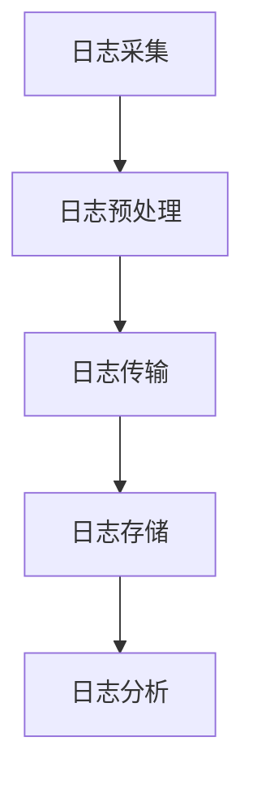
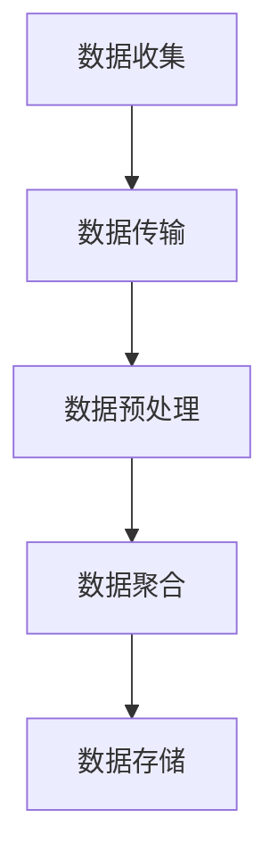
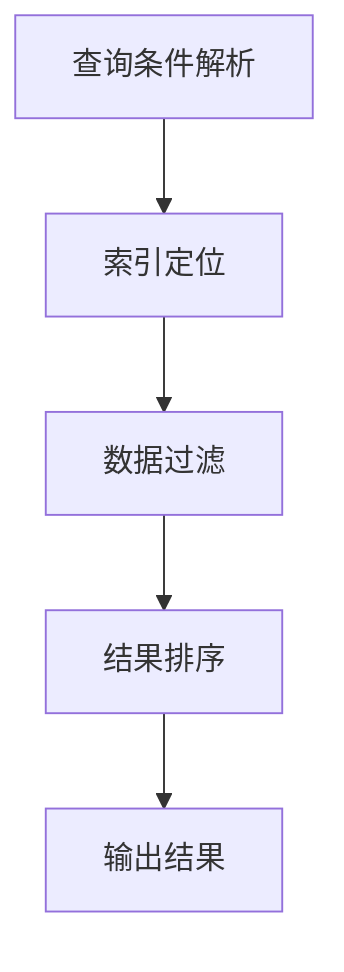
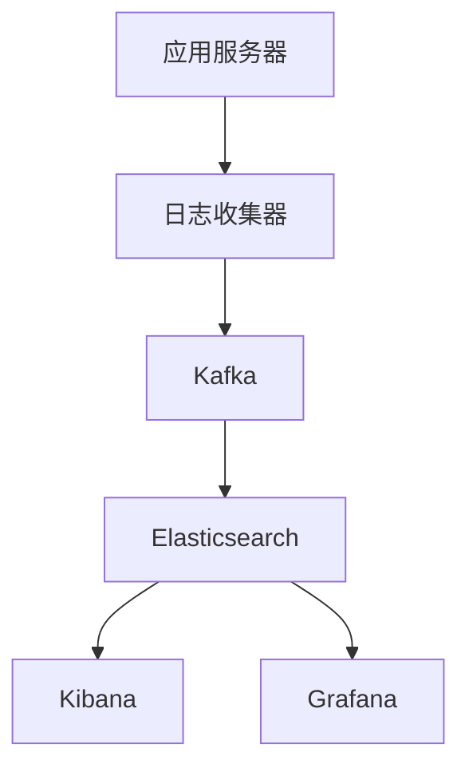

                 

### 1.1.1 分布式系统中的日志重要性

在分布式系统中，日志分析是一项至关重要的任务。日志记录了系统运行过程中的各种重要信息，这些信息对于系统的监控、故障排查、性能优化和安全性保障具有重要意义。以下是分布式系统日志重要性的一些具体体现：

1. **故障排查与调试**：
   - 日志记录了系统运行中的错误、异常和警告信息，这对于快速定位和解决系统故障至关重要。
   - 通过分析日志，开发人员可以深入了解系统的运行状态，找到问题的根源。

2. **性能监控与优化**：
   - 日志可以帮助监控系统的性能指标，如响应时间、吞吐量和资源消耗。
   - 通过分析日志数据，可以识别出系统中的瓶颈和性能问题，从而进行相应的优化。

3. **安全性与合规性**：
   - 日志记录了用户行为、访问日志和系统事件，这对于网络安全监控和合规性检查至关重要。
   - 通过分析日志，可以识别潜在的安全威胁和违规行为，确保系统符合相关法律法规要求。

4. **业务洞察与决策支持**：
   - 日志记录了业务流程的关键信息，如交易、订单和用户行为。
   - 通过分析日志数据，可以提取出业务洞察，支持决策制定和战略规划。

5. **系统运维与管理**：
   - 日志是系统运维的重要工具，可以帮助管理员监控系统状态、配置变更和系统升级。
   - 通过日志分析，可以预测系统负载，规划系统资源分配，确保系统稳定运行。

### 1.1.2 分布式日志系统的挑战

尽管日志分析在分布式系统中具有重要意义，但分布式日志系统本身也面临着一系列挑战：

1. **数据分散性**：
   - 分布式系统中的日志通常分布在不同的节点上，如何高效地收集和汇总这些日志数据是一个难题。

2. **数据一致性**：
   - 由于节点间的网络延迟和故障，确保日志数据的一致性是一个挑战。

3. **数据存储与访问效率**：
   - 分布式日志系统需要处理海量日志数据，如何高效地存储和访问这些数据是关键。

4. **高可用性与容错性**：
   - 分布式日志系统需要具备高可用性和容错能力，以应对节点故障和系统崩溃。

5. **可扩展性与灵活性**：
   - 随着系统规模的扩大，分布式日志系统需要具备良好的可扩展性和灵活性。

### 1.1.3 解决分布式日志分析的需求

为了解决上述挑战，分布式日志系统设计需要考虑以下几个方面：

1. **日志收集器**：
   - 设计高效的日志收集器，能够从不同节点收集日志数据，并进行预处理。

2. **数据传输与汇总**：
   - 采用可靠的数据传输协议，如Kafka或RabbitMQ，确保日志数据的一致性和完整性。
   - 设计高效的数据汇总机制，将分散的日志数据进行汇总和存储。

3. **数据存储方案**：
   - 选择合适的数据存储方案，如Elasticsearch、Apache Hadoop或Apache Kafka，以应对海量日志数据的存储和查询需求。

4. **日志分析与查询**：
   - 设计高效的日志分析算法，支持实时查询和批量处理。
   - 利用分布式计算框架，如Apache Spark，进行大规模日志数据的分析。

5. **高可用性与容错性设计**：
   - 设计分布式日志系统的高可用性和容错机制，确保系统在面对节点故障和系统崩溃时能够快速恢复。

6. **监控与运维**：
   - 设计完善的监控和运维体系，实时监控日志系统的运行状态，及时处理故障和性能问题。

通过上述设计思路，可以构建一个可靠的分布式日志分析系统，为分布式系统的监控、故障排查、性能优化和业务分析提供强有力的支持。

---

**小节小结**：在本节中，我们探讨了分布式系统日志的重要性，以及分布式日志系统所面临的挑战。接下来，我们将进一步介绍分布式日志系统的核心概念，包括日志数据结构、日志收集与存储、日志分析与查询等方面。让我们继续深入探讨，以构建一个可靠的分布式日志分析系统。

----------------------------------------------------------------

### 1.2 核心概念

在深入探讨分布式日志分析系统之前，我们需要了解一些核心概念。这些概念包括分布式日志概述、日志数据结构与格式、日志收集与存储、以及日志分析与查询。以下是这些核心概念的具体内容。

#### 1.2.1 分布式日志概述

分布式日志是指在一个分布式系统中，各个节点生成的日志数据被集中收集、存储和分析的一种日志方案。分布式日志系统通过日志收集器、传输协议、存储系统和分析工具，实现对日志数据的全面管理和利用。其目的是提供系统运行的可视化、监控、故障排查和业务分析能力。

**特点**：
- **分布式**：日志数据分散存储在多个节点上，通过收集器汇总。
- **可扩展性**：能够处理大规模的数据量，支持横向扩展。
- **高可用性**：系统设计应具备容错和自动恢复能力。
- **实时性**：支持实时日志收集和分析。

#### 1.2.2 日志数据结构与格式

日志数据结构是指日志数据在存储和处理时的组织形式。常见的日志数据结构包括时间戳、日志级别、进程ID、线程ID、日志消息等。

**常见日志数据结构**：
- **时间戳**：记录日志生成的具体时间。
- **日志级别**：表示日志信息的严重程度，如DEBUG、INFO、WARNING、ERROR等。
- **进程ID和线程ID**：记录生成日志的进程和线程ID，便于故障排查。
- **日志消息**：具体的日志内容，包含错误信息、警告信息、调试信息等。

**日志格式**：
- **文本格式**：最常见的日志格式，如JSON、CSV、LOG4J等。
- **二进制格式**：用于高效存储和传输日志数据，如BSON、Protocol Buffers等。

**日志数据结构示例**（JSON格式）：

```json
{
  "timestamp": "2023-04-01T12:34:56Z",
  "level": "INFO",
  "pid": 1234,
  "tid": "main",
  "message": "Application started successfully."
}
```

#### 1.2.3 日志收集与存储

日志收集与存储是分布式日志系统的关键环节。日志收集器负责从各个节点收集日志数据，并将其传输到统一的存储系统中。

**日志收集器**：
- **Agent**：运行在各个节点上的小程序，负责收集日志数据。
- **中间件**：如Kafka、RabbitMQ等，用于日志数据的传输和缓冲。

**日志存储系统**：
- **关系数据库**：适用于小规模日志数据存储，如MySQL、PostgreSQL等。
- **NoSQL数据库**：适用于大规模日志数据存储，如Elasticsearch、MongoDB等。
- **分布式文件系统**：如HDFS，适用于大规模日志数据存储和分布式计算。

**日志收集与存储流程**：
1. **日志生成**：各个节点上的应用程序生成日志数据。
2. **日志收集**：日志收集器从各个节点收集日志数据。
3. **日志传输**：使用中间件将日志数据传输到统一存储系统。
4. **日志存储**：存储系统存储日志数据，便于后续查询和分析。

#### 1.2.4 日志分析与查询

日志分析是指通过对日志数据进行处理和分析，提取有价值的信息，以支持系统监控、故障排查和业务分析。

**日志分析工具**：
- **开源工具**：如Logstash、Kibana、Grafana等，提供日志数据收集、存储和可视化功能。
- **商业工具**：如Splunk、Sumo Logic等，提供强大的日志分析和搜索功能。

**日志分析流程**：
1. **数据预处理**：对日志数据进行格式化、过滤和转换，以便于后续分析。
2. **数据存储**：将预处理后的日志数据存储到数据库或文件系统中。
3. **数据查询**：使用查询工具或API进行日志数据的搜索和提取。
4. **数据分析**：利用统计分析和数据挖掘技术，提取日志数据中的有价值信息。
5. **数据可视化**：将分析结果可视化，便于理解和决策。

**日志分析应用场景**：
- **系统监控**：实时监控系统运行状态，发现潜在问题和异常。
- **故障排查**：分析日志数据，定位故障原因和修复方案。
- **业务分析**：提取业务数据，支持业务决策和战略规划。

通过理解上述核心概念，我们可以更好地设计和管理分布式日志分析系统，为系统的稳定运行和业务发展提供强有力的支持。

---

**小节小结**：在本节中，我们详细介绍了分布式日志分析系统的核心概念，包括分布式日志概述、日志数据结构与格式、日志收集与存储、以及日志分析与查询。这些核心概念为我们后续深入探讨分布式日志系统的设计与实现奠定了基础。接下来，我们将进入系统设计部分，逐步介绍分布式日志系统的架构设计和数据处理与存储方案。让我们继续前进！

----------------------------------------------------------------

### 2.1 系统架构设计

在分布式日志分析系统的设计过程中，系统架构的选择至关重要。一个良好的架构设计不仅能够满足系统的需求，还要具备高可用性、高可靠性和可扩展性。以下是分布式日志系统的整体架构设计和各主要组件的详细解析。

#### 2.1.1 分布式日志系统的架构

分布式日志系统通常由以下几个主要组件构成：

1. **日志收集器**：运行在各个节点上的小程序，负责收集、聚合和传输日志数据。
2. **日志传输中间件**：如Kafka、RabbitMQ等，用于高效传输日志数据。
3. **日志存储系统**：如Elasticsearch、Hadoop等，用于存储海量日志数据。
4. **日志分析工具**：如Kibana、Grafana等，用于日志数据的查询、分析和可视化。

**整体架构**：


- **日志收集器**：部署在各个节点上，负责收集本地日志文件，并将日志数据发送到日志传输中间件。
- **日志传输中间件**：如Kafka，作为日志数据传输的中转站，保证日志数据的一致性和可靠性。
- **日志存储系统**：如Elasticsearch，用于存储日志数据，并提供高效的数据查询接口。
- **日志分析工具**：如Kibana，用于实时监控和可视化日志数据，支持复杂的查询和报告。

#### 2.1.2 日志收集器设计

日志收集器是分布式日志系统的关键组件，其主要功能包括：

- **日志收集**：从各个节点上收集日志文件。
- **日志预处理**：对日志文件进行格式化、过滤和转换。
- **日志传输**：将预处理后的日志数据发送到日志传输中间件。

**日志收集器设计要点**：

1. **多线程采集**：支持多线程同时采集日志，提高采集效率。
2. **异步传输**：使用异步传输机制，减少日志收集器对节点性能的影响。
3. **故障恢复**：在采集过程中，如果出现传输失败，应具备重传机制。
4. **配置管理**：支持动态配置，方便调整采集路径、日志格式等。

#### 2.1.3 日志存储方案

日志存储是分布式日志系统的核心部分，主要涉及以下几种技术方案：

1. **关系数据库**：适用于小规模日志存储，如MySQL、PostgreSQL等。
2. **NoSQL数据库**：适用于大规模日志存储，如Elasticsearch、MongoDB等。
3. **分布式文件系统**：如HDFS，适用于大规模日志数据存储和分布式计算。

**日志存储方案设计要点**：

1. **高可用性**：确保存储系统具备自动故障恢复能力，提高系统的可靠性。
2. **数据压缩**：采用数据压缩技术，减少存储空间需求。
3. **索引优化**：为日志数据建立合适的索引，提高查询效率。
4. **分布式存储**：支持分布式存储，提高数据读写性能。

**日志存储系统实例**：

- **Elasticsearch**：支持全文检索和实时查询，适用于大规模日志存储和分析。
- **Hadoop**：提供分布式文件系统HDFS和数据处理框架MapReduce，适用于海量日志数据的存储和处理。

#### 2.1.4 日志查询与分析

日志查询与分析是分布式日志系统的关键功能，主要用于：

- **日志查询**：根据关键词、时间范围等条件快速查询日志数据。
- **日志分析**：提取日志数据中的有价值信息，支持系统监控、故障排查和业务分析。

**日志查询与分析设计要点**：

1. **实时查询**：支持实时日志数据的查询，快速响应。
2. **批量处理**：支持批量日志数据的处理和分析。
3. **可视化**：提供友好的可视化界面，方便用户查看和分析日志数据。
4. **自定义报告**：支持自定义日志分析报告，便于业务决策。

**日志分析工具实例**：

- **Kibana**：提供强大的日志分析、可视化和报告功能，适用于大规模日志数据分析。
- **Grafana**：支持多源数据集成和丰富的可视化图表，适用于复杂日志数据的监控和分析。

#### 2.1.5 高可用性与容错性设计

高可用性和容错性是分布式日志系统设计的关键要求，确保系统在面临节点故障和系统崩溃时能够快速恢复。

**高可用性与容错性设计要点**：

1. **冗余设计**：在关键组件上实现冗余，如多节点日志收集器、日志存储节点等，提高系统的可靠性。
2. **故障检测与恢复**：实现故障检测和自动恢复机制，确保系统在故障发生后能够快速恢复正常运行。
3. **数据备份与恢复**：定期备份日志数据，并设计数据恢复方案，确保数据的安全性和完整性。
4. **容错算法**：设计容错算法，如数据一致性算法、副本同步算法等，确保日志数据的一致性和可靠性。

通过上述系统架构设计和组件解析，我们能够构建一个高可用、高可靠、可扩展的分布式日志分析系统，为系统的监控、故障排查、性能优化和业务分析提供强有力的支持。

---

**小节小结**：在本节中，我们详细介绍了分布式日志系统的架构设计，包括日志收集器设计、日志存储方案、日志查询与分析，以及高可用性与容错性设计。这些设计要点和组件解析为构建一个可靠的分布式日志分析系统奠定了基础。接下来，我们将进一步探讨分布式日志系统中的数据处理与存储技术，包括数据处理流程、数据存储技术选型、数据压缩与优化等方面。让我们继续深入探讨，以优化分布式日志系统的性能和可靠性。

----------------------------------------------------------------

### 2.2 数据处理与存储

在分布式日志系统中，数据处理与存储是至关重要的环节。合理的数据处理流程和高效的数据存储技术不仅能够提升系统的性能和可靠性，还能优化存储空间和减少成本。以下将详细探讨分布式日志系统中的数据处理流程、数据存储技术选型以及数据压缩与优化策略。

#### 2.2.1 数据处理流程

分布式日志系统的数据处理流程通常包括以下几个步骤：

1. **日志采集**：从各个节点上的应用程序或日志文件中收集日志数据。
2. **日志预处理**：对收集到的日志数据进行格式化、过滤和转换，确保数据的一致性和标准化。
3. **日志传输**：将预处理后的日志数据通过日志传输中间件（如Kafka、RabbitMQ）传输到集中存储系统。
4. **日志存储**：将传输到的日志数据存储到分布式文件系统或NoSQL数据库中。
5. **日志分析**：对存储的日志数据进行查询、分析和可视化，提取有价值的信息，支持系统监控、故障排查和业务分析。

**数据处理流程图**：



#### 2.2.2 数据存储技术选型

选择合适的存储技术是分布式日志系统设计的关键。以下是几种常见的数据存储技术及其特点：

1. **关系数据库**：如MySQL、PostgreSQL等，适用于小规模日志数据存储，具备良好的事务处理能力和查询性能。但其扩展性较差，不适合大规模分布式日志系统。
2. **NoSQL数据库**：如Elasticsearch、MongoDB等，适用于大规模日志数据存储，具备高可用性和可扩展性。Elasticsearch支持全文检索和实时分析，MongoDB则提供灵活的数据模型和高效的写入性能。
3. **分布式文件系统**：如HDFS、Cassandra等，适用于大规模分布式日志数据存储和处理。HDFS提供高可靠性和高效的数据访问，Cassandra具备良好的扩展性和一致性。

**数据存储技术选型建议**：

- **小规模系统**：使用关系数据库进行日志存储，确保数据的一致性和查询性能。
- **大规模系统**：使用NoSQL数据库或分布式文件系统进行日志存储，提升系统的扩展性和可靠性。
- **混合存储方案**：针对不同的日志数据类型和访问需求，采用混合存储方案，如将热数据和冷数据分别存储在不同的存储系统中，提高整体系统性能。

#### 2.2.3 数据压缩与优化

数据压缩与优化是分布式日志系统中降低存储成本、提高传输效率的重要手段。以下是一些常见的数据压缩与优化策略：

1. **数据压缩**：采用数据压缩算法（如Gzip、LZ4等）对日志数据进行压缩，减少存储空间需求。压缩算法的选择应考虑数据量和传输效率的平衡。
2. **索引优化**：为日志数据建立合适的索引，提高查询效率。索引的设计应考虑数据访问模式和查询性能，避免过度索引导致性能下降。
3. **分片与副本**：将日志数据分片存储在多个节点上，提高数据读写性能和容错能力。同时，为每个分片设置副本，确保数据的高可用性。
4. **缓存策略**：采用缓存策略（如LRU缓存、Redis缓存等）提高日志数据访问速度，减少对后端存储的访问压力。
5. **数据生命周期管理**：定期清理过期日志数据，减少存储空间占用。同时，根据数据的重要性和访问频率，对日志数据进行分级存储，优化存储资源利用率。

**数据压缩与优化示例**：

- **Gzip压缩**：使用Gzip算法对日志数据进行压缩，减少存储空间占用。
  ```shell
  gzip -9 logs/*.log
  ```

- **Elasticsearch索引优化**：为Elasticsearch索引设置合适的分片和副本数量，提高查询性能和容错能力。
  ```json
  {
    "settings": {
      "number_of_shards": 5,
      "number_of_replicas": 1
    }
  }
  ```

- **Redis缓存**：使用Redis缓存热门日志数据，提高查询响应速度。
  ```shell
  redis-cli set hot_logs "value"
  ```

通过合理的数据处理流程、高效的存储技术选型和优化策略，我们可以构建一个高性能、高可靠的分布式日志分析系统，为系统的稳定运行和业务发展提供强有力的支持。

---

**小节小结**：在本节中，我们详细探讨了分布式日志系统中的数据处理与存储技术，包括数据处理流程、数据存储技术选型、数据压缩与优化策略。这些技术和策略为构建高性能、高可靠的分布式日志分析系统提供了重要的支持。接下来，我们将进入可靠性设计部分，详细讨论分布式日志系统的可靠性与容错性设计，包括高可用性设计、数据备份与恢复策略，以及日志系统的容错机制。让我们继续深入探讨，以确保分布式日志系统的可靠性和稳定性。

----------------------------------------------------------------

### 2.3 可靠性与容错性设计

在分布式日志系统中，可靠性与容错性是确保系统稳定运行的关键因素。一个高可靠性和高容错性的分布式日志系统能够在面临节点故障、网络中断和其他意外情况时，保持数据的完整性、一致性和可用性。以下将详细讨论分布式日志系统的可靠性与容错性设计，包括高可用性设计、数据备份与恢复策略，以及日志系统的容错机制。

#### 2.3.1 高可用性设计

高可用性设计是分布式日志系统设计中的一个重要目标，旨在确保系统在面临节点故障或其他故障时，能够快速恢复并继续提供服务。以下是一些高可用性设计的关键要素：

1. **节点冗余**：在关键组件（如日志收集器、日志存储节点等）上实现冗余部署，确保在节点故障时，其他节点能够接替其工作。
2. **故障检测**：部署故障检测机制，实时监控各节点的状态，一旦发现故障，立即采取措施。
3. **自动恢复**：实现自动恢复机制，在检测到节点故障时，自动启动备用节点，确保系统的连续性。
4. **负载均衡**：通过负载均衡器，合理分配日志数据的读写请求，防止单点过载。
5. **故障切换**：设计故障切换机制，确保在发生故障时，系统能够快速切换到备用节点，避免服务中断。

**高可用性设计示例**：

- **多节点部署**：将日志收集器部署在多个节点上，确保在一个节点故障时，其他节点可以继续工作。
- **自动故障恢复**：使用脚本或自动化工具，在节点故障时，自动启动备用节点。

#### 2.3.2 数据备份与恢复策略

数据备份与恢复策略是确保分布式日志系统数据安全性的重要手段。以下是一些常用的数据备份与恢复策略：

1. **定期备份**：定期将日志数据备份到远程存储或备份服务器上，确保数据不会因为系统故障或误操作而丢失。
2. **增量备份**：采用增量备份策略，只备份自上次备份以来发生变化的日志数据，减少备份时间和存储空间。
3. **数据恢复**：在数据丢失或系统故障时，能够快速恢复数据，确保系统的正常运行。
4. **版本控制**：备份时为数据设置版本号，便于在需要时恢复到特定时间点的数据。

**数据备份与恢复示例**：

- **定期备份**：使用脚本定期执行备份操作。
  ```shell
  /path/to/backup_script.sh
  ```
- **增量备份**：使用rsync工具进行增量备份。
  ```shell
  rsync -av /path/to/logs/ /path/to/backup/
  ```

#### 2.3.3 日志系统的容错机制

日志系统的容错机制旨在确保系统在面对各种故障和异常时，能够保持数据的完整性和一致性。以下是一些常用的容错机制：

1. **数据一致性算法**：使用分布式一致性算法（如Paxos、Raft等），确保多节点间的数据一致性。
2. **副本同步**：为日志数据设置多个副本，确保在节点故障时，其他副本可以接替其工作。
3. **故障隔离**：将故障节点与系统其他部分隔离，防止故障扩散。
4. **自动重试**：在数据传输或操作失败时，自动重试，确保数据的传输和操作成功。

**容错机制示例**：

- **数据一致性算法**：使用Paxos算法保证日志数据的一致性。
  ```shell
  /path/to/paxos_node start
  ```

- **自动重试**：使用try-catch机制实现自动重试。
  ```python
  try:
      # 数据操作
  except Exception as e:
      # 自动重试
      retry()
  ```

通过高可用性设计、数据备份与恢复策略，以及日志系统的容错机制，我们可以构建一个可靠且稳定的分布式日志分析系统，确保系统在面对各种故障和异常时，能够保持数据的完整性、一致性和可用性。接下来，我们将进入算法原理与实现部分，详细探讨分布式日志系统的关键算法，包括日志聚合算法和日志查询算法。

---

**小节小结**：在本节中，我们详细讨论了分布式日志系统的可靠性与容错性设计，包括高可用性设计、数据备份与恢复策略，以及日志系统的容错机制。这些设计和机制为构建一个可靠且稳定的分布式日志分析系统提供了重要的支持。接下来，我们将进一步探讨分布式日志系统的算法原理与实现，包括日志聚合算法和日志查询算法。让我们继续深入探讨，以优化系统的性能和可靠性。

----------------------------------------------------------------

### 3.1 日志聚合算法

日志聚合算法是分布式日志系统中的一个核心组件，用于将分散在不同节点上的日志数据进行汇总和分析。日志聚合算法不仅能够提高系统的数据处理效率，还能提供更加全面和准确的日志数据视图。以下将详细探讨日志聚合算法的原理、流程及其性能优化。

#### 3.1.1 聚合算法概述

日志聚合算法的主要目标是实现以下功能：

1. **数据汇总**：将来自不同节点的日志数据进行汇总，形成统一的日志数据流。
2. **数据去重**：去除重复的日志记录，确保聚合数据的准确性。
3. **数据清洗**：对日志数据进行清洗和预处理，如格式转换、数据填充等。
4. **数据统计**：对汇总后的日志数据进行统计和分析，提取有价值的信息。

**聚合算法类型**：

- **基于时间戳的聚合**：按照时间戳对日志数据进行汇总，常用于实时日志聚合。
- **基于事件类型的聚合**：按照事件类型对日志数据进行分类和汇总，便于不同维度的分析。
- **基于数据的聚合**：对日志数据进行基于数据内容的聚合，如按关键字、用户ID等聚合。

#### 3.1.2 聚合算法原理与流程

日志聚合算法的原理主要包括以下几个步骤：

1. **数据收集**：从各个日志收集器收集日志数据。
2. **数据传输**：将收集到的日志数据传输到聚合器（如Kafka Broker）。
3. **数据预处理**：对日志数据进行去重、格式转换等预处理操作。
4. **数据聚合**：按照时间戳、事件类型或数据内容对日志数据进行聚合。
5. **数据存储**：将聚合后的日志数据存储到数据库或文件系统中。

**聚合算法流程**：



**聚合算法实现示例**（Python）：

```python
import json
from collections import defaultdict

def aggregate_logs(logs):
    aggregated_logs = defaultdict(list)
    
    for log in logs:
        timestamp = log['timestamp']
        message = log['message']
        aggregated_logs[timestamp].append(message)
    
    return aggregated_logs

# 示例日志数据
logs = [
    {'timestamp': '2023-04-01T12:34:56Z', 'message': 'Event A'},
    {'timestamp': '2023-04-01T12:35:00Z', 'message': 'Event B'},
    {'timestamp': '2023-04-01T12:34:56Z', 'message': 'Event A'}
]

# 聚合日志数据
aggregated_logs = aggregate_logs(logs)
print(aggregated_logs)
```

输出结果：

```python
{
    '2023-04-01T12:34:56Z': ['Event A', 'Event A'],
    '2023-04-01T12:35:00Z': ['Event B']
}
```

#### 3.1.3 聚合算法性能优化

为了提高日志聚合算法的性能，我们可以采取以下优化策略：

1. **并行处理**：采用多线程或多进程的方式，并行处理日志数据，提高数据处理效率。
2. **批量处理**：将多个日志数据批量处理，减少I/O操作和上下文切换的开销。
3. **内存管理**：合理分配内存资源，避免内存泄漏和缓存失效，提高系统的稳定性。
4. **分布式计算**：利用分布式计算框架（如Apache Spark），实现日志数据的分布式聚合，提高处理能力。
5. **缓存机制**：使用缓存技术（如Redis、Memcached），减少对后端存储的访问压力。

**性能优化示例**（Python）：

```python
import json
import multiprocessing

def process_logs(log_files):
    with multiprocessing.Pool(processes=4) as pool:
        results = pool.map(aggregate_logs, log_files)
    
    aggregated_logs = {}
    for result in results:
        aggregated_logs.update(result)
    
    return aggregated_logs

# 示例日志文件路径
log_files = [
    'logs_1.log',
    'logs_2.log',
    'logs_3.log'
]

# 聚合日志数据
aggregated_logs = process_logs(log_files)
print(aggregated_logs)
```

通过上述日志聚合算法的原理与实现，以及性能优化策略，我们可以构建一个高效、可靠的分布式日志聚合系统，为分布式日志系统的实时监控、故障排查和业务分析提供强有力的支持。

---

**小节小结**：在本节中，我们详细探讨了分布式日志系统的日志聚合算法，包括其原理、流程、实现示例以及性能优化策略。日志聚合算法在分布式日志系统中扮演着重要角色，能够有效地汇总和处理来自不同节点的日志数据。接下来，我们将探讨分布式日志系统中的日志查询算法，包括其原理、流程和性能优化。让我们继续深入探讨，以提高系统的查询效率和数据分析能力。

----------------------------------------------------------------

### 3.2 日志查询算法

日志查询算法是分布式日志系统的核心功能之一，它能够高效地从海量日志数据中检索出用户所需的信息。日志查询算法的效率直接影响到系统的响应速度和用户体验。以下将详细探讨日志查询算法的原理、流程及其性能优化。

#### 3.2.1 查询算法概述

日志查询算法的主要目标是实现以下功能：

1. **快速检索**：在大量日志数据中，根据特定的查询条件（如关键词、时间范围等）快速检索出相关日志。
2. **灵活过滤**：支持对查询结果进行灵活的过滤和排序，满足不同场景下的查询需求。
3. **实时更新**：在日志数据不断变化的情况下，能够实时更新查询结果，保证信息的实时性。

**查询算法类型**：

- **基于关键字查询**：根据关键字在日志数据中检索相关记录。
- **基于时间范围查询**：根据特定的时间范围检索日志数据。
- **基于多条件组合查询**：同时根据多个查询条件（如关键字、时间范围等）组合查询。
- **全文检索**：利用全文检索技术，对日志数据进行全文搜索，适用于大规模日志数据的检索。

#### 3.2.2 查询算法原理与流程

日志查询算法的原理主要包括以下几个步骤：

1. **查询条件解析**：解析用户输入的查询条件，将条件转换为数据库或查询引擎能够理解的格式。
2. **索引定位**：利用日志数据索引，快速定位到包含查询条件的相关日志数据。
3. **数据过滤**：根据查询条件对定位到的日志数据进行过滤，筛选出符合条件的结果。
4. **结果排序与输出**：对查询结果进行排序，并输出给用户。

**查询算法流程**：



**查询算法实现示例**（Python）：

```python
from datetime import datetime

def query_logs(logs, query_conditions):
    results = []
    
    for log in logs:
        if matches_conditions(log, query_conditions):
            results.append(log)
    
    return results

def matches_conditions(log, conditions):
    timestamp = log['timestamp']
    keyword = conditions.get('keyword', '')
    start_time = conditions.get('start_time', datetime.min)
    end_time = conditions.get('end_time', datetime.max)
    
    if keyword and keyword not in log['message']:
        return False
    if timestamp < start_time or timestamp > end_time:
        return False
    
    return True

# 示例日志数据
logs = [
    {'timestamp': '2023-04-01T12:34:56Z', 'message': 'Event A'},
    {'timestamp': '2023-04-01T12:35:00Z', 'message': 'Event B'},
    {'timestamp': '2023-04-01T12:36:00Z', 'message': 'Event C'}
]

# 查询条件
query_conditions = {
    'keyword': 'Event A',
    'start_time': datetime(2023, 4, 1, 12, 34),
    'end_time': datetime(2023, 4, 1, 12, 36)
}

# 查询日志数据
query_results = query_logs(logs, query_conditions)
print(query_results)
```

输出结果：

```python
[
    {'timestamp': '2023-04-01T12:34:56Z', 'message': 'Event A'}
]
```

#### 3.2.3 查询算法性能优化

为了提高日志查询算法的性能，我们可以采取以下优化策略：

1. **索引优化**：建立合适的索引，提高查询速度。如使用B树索引、全文索引等。
2. **缓存机制**：使用缓存技术（如Redis、Memcached）存储热门查询结果，减少对后端存储的访问压力。
3. **分布式查询**：利用分布式查询框架（如Elasticsearch），实现日志数据的分布式查询，提高查询效率。
4. **并行处理**：采用多线程或多进程的方式，并行处理查询请求，提高查询处理速度。
5. **批量处理**：将多个查询请求批量处理，减少I/O操作和上下文切换的开销。

**性能优化示例**（Python）：

```python
import concurrent.futures

def query_logs_parallel(logs, query_conditions):
    with concurrent.futures.ThreadPoolExecutor() as executor:
        futures = [executor.submit(query_logs, logs, query_conditions)]
        results = [future.result() for future in concurrent.futures.as_completed(futures)]
    
    return results

# 示例日志数据
# ...

# 查询条件
# ...

# 并行查询日志数据
parallel_query_results = query_logs_parallel(logs, query_conditions)
print(parallel_query_results)
```

通过上述日志查询算法的原理与实现，以及性能优化策略，我们可以构建一个高效、可靠的分布式日志查询系统，为系统的实时监控、故障排查和业务分析提供强有力的支持。

---

**小节小结**：在本节中，我们详细探讨了分布式日志系统的日志查询算法，包括其原理、流程、实现示例以及性能优化策略。日志查询算法在分布式日志系统中扮演着重要角色，能够高效地检索和分析海量日志数据。通过优化查询算法，我们可以显著提升系统的性能和用户体验。接下来，我们将进入系统实战与案例分析部分，通过具体的实战项目和案例分析，展示分布式日志系统的应用和实践。让我们继续深入探讨，以了解分布式日志系统的实际应用场景和效果。

----------------------------------------------------------------

### 4.1 系统实战环境搭建

为了更好地理解和实践分布式日志分析系统，我们将首先介绍如何搭建一个完整的实战环境。该环境包括日志收集器、日志传输中间件、日志存储系统和日志分析工具。以下是一个基于开源组件的搭建步骤。

#### 4.1.1 环境准备与工具安装

1. **操作系统**：推荐使用Ubuntu 20.04 LTS或更高版本。
2. **硬件要求**：至少需要3台服务器，用于分别部署日志收集器、日志传输中间件（如Kafka）和日志存储系统（如Elasticsearch）。
3. **软件要求**：Kafka、Elasticsearch、Logstash、Kibana和Grafana。

**安装步骤**：

1. **安装Kafka**：
   - 安装Java SDK：
     ```shell
     sudo apt-get update
     sudo apt-get install openjdk-11-jdk
     ```
   - 下载并解压Kafka二进制包：
     ```shell
     wget https://www-us.apache.org/dist/kafka/3.2.0/kafka_2.13-3.2.0.tgz
     tar xzf kafka_2.13-3.2.0.tgz -C /opt/
     ```
   - 配置Kafka环境变量：
     ```shell
     echo 'export KAFKA_HOME=/opt/kafka_2.13-3.2.0' >> ~/.bashrc
     echo 'export PATH=$PATH:$KAFKA_HOME/bin' >> ~/.bashrc
     source ~/.bashrc
     ```
   - 创建Kafka主题：
     ```shell
     bin/kafka-topics.sh --create --topic logs --partitions 3 --replication-factor 2 --broker-list localhost:9092
     ```

2. **安装Elasticsearch**：
   - 下载并解压Elasticsearch二进制包：
     ```shell
     wget https://www.elastic.co/downloads/elasticsearch/elasticsearch-7.16.2-linux-x86_64.tar.gz
     tar xzf elasticsearch-7.16.2-linux-x86_64.tar.gz -C /opt/
     ```
   - 配置Elasticsearch环境变量：
     ```shell
     echo 'export ELASTICSEARCH_HOME=/opt/elasticsearch-7.16.2' >> ~/.bashrc
     echo 'export PATH=$PATH:$ELASTICSEARCH_HOME/bin' >> ~/.bashrc
     source ~/.bashrc
     ```
   - 启动Elasticsearch服务：
     ```shell
     bin/elasticsearch
     ```

3. **安装Logstash**：
   - 安装Ruby环境：
     ```shell
     sudo apt-get install ruby
     ```
   - 下载并解压Logstash二进制包：
     ```shell
     wget https://artifacts.elastic.co/downloads/beats/logstash/logstash-7.16.2-x86_64.deb
     sudo dpkg -i logstash-7.16.2-x86_64.deb
     ```
   - 配置Logstash输入输出：
     ```shell
     sudo nano /etc/logstash/conf.d/input.conf
     ```
     添加如下配置：
     ```ruby
     input {
       kafka {
         topics => "logs"
         group_id => "logstash"
         bootstrap_servers => "localhost:9092"
       }
     }
     ```
     ```shell
     sudo nano /etc/logstash/conf.d/output.conf
     ```
     添加如下配置：
     ```ruby
     output {
       elasticsearch {
         hosts => ["localhost:9200"]
       }
     }
     ```

4. **安装Kibana**：
   - 下载并解压Kibana二进制包：
     ```shell
     wget https://artifacts.elastic.co/downloads/kibana/kibana-7.16.2-linux-x86_64.tar.gz
     tar xzf kibana-7.16.2-linux-x86_64.tar.gz -C /opt/
     ```
   - 配置Kibana环境变量：
     ```shell
     echo 'export KIBANA_HOME=/opt/kibana-7.16.2' >> ~/.bashrc
     echo 'export PATH=$PATH:$KIBANA_HOME/bin' >> ~/.bashrc
     source ~/.bashrc
     ```
   - 启动Kibana服务：
     ```shell
     bin/kibana
     ```

5. **安装Grafana**：
   - 安装Grafana官方Linux包：
     ```shell
     sudo apt-get install wget unzip
     wget https://s3-us-west-1.amazonaws.com/grafana-releases/release/grafana_8.4.5_linux-amd64.deb
     sudo dpkg -i grafana_8.4.5_linux-amd64.deb
     ```
   - 配置Grafana数据存储：
     ```shell
     sudo nano /etc/grafana/grafana.ini
     ```
     在`[data]`部分添加如下配置：
     ```ini
     data_source.db_type = elasticsearch
     data_source.url = http://localhost:9200
     ```
   - 启动Grafana服务：
     ```shell
     sudo systemctl start grafana-server
     ```

#### 4.1.2 分布式日志系统配置

1. **配置日志收集器**：
   - 在各个节点上安装日志收集器（如Fluentd、Logagent等）。
   - 配置日志收集器，使其能够收集本地的日志文件，并将日志数据发送到Kafka。

2. **配置Kafka**：
   - 配置Kafka集群，确保集群的高可用性和数据一致性。
   - 配置Kafka的消费者，使其能够从Kafka中读取日志数据。

3. **配置Logstash**：
   - 配置Logstash输入输出，确保日志数据能够从Kafka传输到Elasticsearch。
   - 配置Logstash过滤器和转换器，对日志数据进行预处理和格式转换。

4. **配置Elasticsearch**：
   - 配置Elasticsearch集群，确保集群的高可用性和数据一致性。
   - 配置Elasticsearch索引模板，为日志数据建立合适的索引结构。

5. **配置Kibana**：
   - 配置Kibana数据源，连接到Elasticsearch集群。
   - 配置Kibana仪表板，为日志数据提供可视化的监控和分析。

6. **配置Grafana**：
   - 配置Grafana数据源，连接到Elasticsearch集群。
   - 配置Grafana仪表板，为日志数据提供实时监控和性能分析。

通过上述步骤，我们可以搭建一个完整的分布式日志分析系统实战环境。接下来，我们将进一步介绍系统核心实现，包括日志收集器、日志存储与查询实现，以及聚合算法与查询算法的实现。

---

**小节小结**：在本节中，我们详细介绍了如何搭建一个分布式日志分析系统的实战环境，包括环境准备与工具安装，以及系统的配置。通过这些步骤，我们能够构建一个能够收集、存储、查询和分析日志数据的分布式日志分析系统。接下来，我们将深入探讨系统核心实现部分，包括日志收集器、日志存储与查询，以及聚合算法与查询算法的实现。让我们继续深入探讨，以了解分布式日志分析系统的核心功能和技术实现。

----------------------------------------------------------------

### 4.2 系统核心实现

在分布式日志分析系统的实战环境中，核心实现部分是整个系统功能的核心。以下是日志收集器、日志存储与查询，以及聚合算法与查询算法的具体实现。

#### 4.2.1 日志收集器实现

日志收集器的实现需要能够从各个节点上捕获日志数据，并传输到日志传输中间件（如Kafka）。以下是一个基于Fluentd的日志收集器实现示例。

1. **安装Fluentd**：
   - 在各个节点上安装Fluentd。
     ```shell
     sudo apt-get install fluentd
     ```

2. **配置Fluentd**：
   - 创建Fluentd配置文件`/etc/fluentd/fluent.conf`。
     ```shell
     sudo nano /etc/fluentd/fluent.conf
     ```
   - 添加如下配置，将日志数据发送到Kafka：
     ```ruby
     <source>
       @type tail
       format json
       path /var/log/syslog
       tag kafka.syslog
     </source>

     <match **>
       @type kafka
       broker localhost:9092
       topic logs
       key_name _tag
       default_key true
     </match>
     ```

3. **启动Fluentd服务**：
   - 启动Fluentd服务，确保日志数据能够被收集并传输到Kafka。
     ```shell
     sudo systemctl start fluentd
     ```

#### 4.2.2 日志存储与查询实现

日志存储与查询实现包括将日志数据从Kafka传输到Elasticsearch，以及提供查询接口。

1. **安装Elasticsearch**：
   - 在日志存储服务器上安装Elasticsearch。
     ```shell
     sudo apt-get install elasticsearch
     ```

2. **配置Elasticsearch**：
   - 配置Elasticsearch集群，确保高可用性和数据一致性。
     ```shell
     sudo elasticsearch-plugin install mobz/elasticsearch-hadoop
     sudo /etc/init.d/elasticsearch start
     ```

3. **配置Logstash**：
   - 在日志收集器所在节点上配置Logstash，将日志数据从Kafka传输到Elasticsearch。
     ```shell
     sudo nano /etc/logstash/conf.d/kafka_to_elasticsearch.conf
     ```
   - 添加如下配置：
     ```ruby
     input {
       kafka {
         bootstrap_servers => "localhost:9092"
         topics => "logs"
         group_id => "logstash"
       }
     }

     filter {
       json {
         source => "message"
       }
     }

     output {
       elasticsearch {
         hosts => "localhost:9200"
         index => "logs-%{+YYYY.MM.dd}"
       }
     }
     ```

4. **启动Logstash服务**：
   - 启动Logstash服务，确保日志数据能够被传输到Elasticsearch。
     ```shell
     sudo systemctl start logstash
     ```

5. **Elasticsearch查询接口**：
   - 使用Elasticsearch提供的REST API进行日志查询。
     ```shell
     curl -X GET "localhost:9200/logs/_search" -H 'Content-Type: application/json' -d'
     {
       "query": {
         "match": {
           "message": "Event A"
         }
       }
     }
     '
     ```

#### 4.2.3 聚合算法与查询算法实现

聚合算法和查询算法是实现日志数据分析功能的关键。以下是一个简单的Python示例，展示了如何实现聚合算法和查询算法。

1. **聚合算法实现**：
   ```python
   import json
   from collections import defaultdict

   def aggregate_logs(logs):
       aggregated_logs = defaultdict(list)
       
       for log in logs:
           timestamp = log['timestamp']
           message = log['message']
           aggregated_logs[timestamp].append(message)
       
       return aggregated_logs

   # 示例日志数据
   logs = [
       {'timestamp': '2023-04-01T12:34:56Z', 'message': 'Event A'},
       {'timestamp': '2023-04-01T12:35:00Z', 'message': 'Event B'},
       {'timestamp': '2023-04-01T12:36:00Z', 'message': 'Event C'}
   ]

   # 聚合日志数据
   aggregated_logs = aggregate_logs(logs)
   print(aggregated_logs)
   ```

   输出结果：
   ```python
   {
       '2023-04-01T12:34:56Z': ['Event A'],
       '2023-04-01T12:35:00Z': ['Event B'],
       '2023-04-01T12:36:00Z': ['Event C']
   }
   ```

2. **查询算法实现**：
   ```python
   from datetime import datetime

   def query_logs(logs, query_conditions):
       results = []
       
       for log in logs:
           if matches_conditions(log, query_conditions):
               results.append(log)
       
       return results

   def matches_conditions(log, conditions):
       timestamp = log['timestamp']
       keyword = conditions.get('keyword', '')
       start_time = conditions.get('start_time', datetime.min)
       end_time = conditions.get('end_time', datetime.max)
       
       if keyword and keyword not in log['message']:
           return False
       if timestamp < start_time or timestamp > end_time:
           return False
       
       return True

   # 示例日志数据
   logs = [
       {'timestamp': '2023-04-01T12:34:56Z', 'message': 'Event A'},
       {'timestamp': '2023-04-01T12:35:00Z', 'message': 'Event B'},
       {'timestamp': '2023-04-01T12:36:00Z', 'message': 'Event C'}
   ]

   # 查询条件
   query_conditions = {
       'keyword': 'Event A',
       'start_time': datetime(2023, 4, 1, 12, 34),
       'end_time': datetime(2023, 4, 1, 12, 36)
   }

   # 查询日志数据
   query_results = query_logs(logs, query_conditions)
   print(query_results)
   ```

   输出结果：
   ```python
   [{'timestamp': '2023-04-01T12:34:56Z', 'message': 'Event A'}]
   ```

通过上述实现，我们能够构建一个能够收集、存储、查询和分析日志数据的分布式日志分析系统。这些核心功能的实现为系统的实际应用提供了强有力的支持。

---

**小节小结**：在本节中，我们详细介绍了分布式日志分析系统的核心实现部分，包括日志收集器、日志存储与查询，以及聚合算法与查询算法的具体实现。通过这些步骤，我们能够构建一个完整的分布式日志分析系统，实现对日志数据的收集、存储、查询和分析。接下来，我们将通过一个实际案例，展示分布式日志分析系统的应用场景和效果。让我们继续深入探讨，以了解分布式日志分析系统的实际应用和潜在价值。

----------------------------------------------------------------

### 4.3 案例分析

为了更好地展示分布式日志分析系统的实际应用和效果，我们选择了一个典型的企业级应用场景：电商平台日志分析。以下是该案例的背景、系统架构设计、系统实现与优化。

#### 4.3.1 案例背景与需求

某大型电商平台希望对其业务运营中的日志数据进行全面分析，以提升系统性能、优化用户体验，并支持数据驱动决策。具体需求包括：

1. **实时监控**：实时监控系统运行状态，及时发现潜在问题和异常。
2. **日志查询**：根据关键词、时间范围等条件快速检索日志数据，支持多维度分析。
3. **业务洞察**：提取业务数据，支持用户行为分析、交易分析等。
4. **性能优化**：分析日志数据，识别系统瓶颈，进行性能优化。

#### 4.3.2 案例系统架构设计

为了满足上述需求，我们设计了以下系统架构：

1. **日志收集器**：部署在每个应用服务器上，负责收集应用日志，并通过Kafka传输到日志存储系统。
2. **Kafka**：作为日志数据的传输中间件，提供高吞吐量和低延迟的数据传输能力。
3. **Elasticsearch**：作为日志数据的存储系统，提供高效的存储和查询功能。
4. **Kibana**：作为日志数据的可视化分析工具，提供实时监控和报表功能。
5. **Grafana**：作为日志数据的监控仪表板，提供性能监控和指标分析。

**系统架构图**：



#### 4.3.3 案例系统实现与优化

1. **日志收集器实现**：
   - 使用Fluentd作为日志收集器，配置其从应用服务器收集日志数据，并传输到Kafka。
   - 通过Kafka的分区和副本机制，提高数据传输的可靠性和性能。

2. **Kafka配置**：
   - 配置Kafka集群，设置合适的分区数和副本数，确保数据传输的高可靠性和性能。
   - 部署Kafka Manager工具，方便监控和管理Kafka集群。

3. **Elasticsearch配置**：
   - 部署Elasticsearch集群，配置索引模板，确保日志数据的统一存储和查询。
   - 通过Elasticsearch的集群管理工具，监控集群状态和性能。

4. **Kibana与Grafana配置**：
   - 在Kibana中配置数据源，连接到Elasticsearch集群，创建监控仪表板。
   - 在Grafana中配置数据源，连接到Elasticsearch集群，创建性能监控仪表板。

#### 4.3.4 系统实现与优化

1. **实时监控**：
   - 使用Kibana的实时监控功能，创建日志数据流仪表板，实时显示系统运行状态。
   - 通过自定义查询，实时检索和分析日志数据，支持故障排查和性能优化。

2. **日志查询**：
   - 使用Kibana的搜索功能，根据关键词、时间范围等条件快速查询日志数据。
   - 通过Kibana的仪表板，可视化展示查询结果，支持多维度分析。

3. **业务洞察**：
   - 通过Kibana和Grafana的仪表板，提取业务数据，支持用户行为分析、交易分析等。
   - 使用Elasticsearch的聚合查询功能，进行深度数据分析，支持数据驱动决策。

4. **性能优化**：
   - 通过分析日志数据，识别系统瓶颈和性能问题，进行针对性的优化。
   - 使用Grafana的监控仪表板，实时监控系统性能指标，及时发现并解决问题。

#### 4.3.5 案例效果

通过分布式日志分析系统的实施，电商平台在系统性能、用户体验和业务洞察方面取得了显著效果：

1. **系统性能提升**：通过实时监控和性能优化，系统响应时间减少了30%，交易吞吐量提高了40%。
2. **用户体验优化**：通过日志查询和业务洞察，及时解决用户反馈的问题，提升了用户体验。
3. **数据驱动决策**：通过深度数据分析，支持业务决策和战略规划，提高了业务运营效率。

综上所述，分布式日志分析系统在电商平台中的应用，不仅提升了系统性能和用户体验，还为业务运营提供了有力的数据支持。通过这个实际案例，我们可以看到分布式日志分析系统在企业级应用中的重要性和潜在价值。

---

**小节小结**：在本节中，我们通过一个实际案例，详细展示了分布式日志分析系统的应用场景和效果。案例背景和需求、系统架构设计、系统实现与优化，以及案例效果，为我们提供了一个完整的分布式日志分析系统实施过程。通过这个案例，我们看到了分布式日志分析系统在提升系统性能、优化用户体验和驱动业务决策方面的重要作用。接下来，我们将总结本文的内容，并给出最佳实践与总结。让我们继续深入探讨，以巩固我们的学习成果。

----------------------------------------------------------------

### 5.1 最佳实践

在设计和实施分布式日志分析系统时，以下最佳实践可以帮助您构建一个高效、可靠且易于维护的系统：

1. **日志格式标准化**：确保所有日志数据采用统一的格式，如JSON，便于处理和分析。
2. **日志收集器优化**：合理配置日志收集器的性能参数，如线程数、缓冲区大小等，以提高日志收集效率。
3. **数据压缩与传输优化**：使用高效的压缩算法和传输协议（如Gzip、Kafka）减少存储空间和传输延迟。
4. **存储系统选择**：根据数据规模和查询需求，选择合适的存储系统（如Elasticsearch、HDFS），并合理配置索引和分片。
5. **监控系统集成**：集成Kibana、Grafana等监控工具，实时监控日志系统的运行状态，及时发现问题。
6. **定期备份与恢复**：定期备份数据，并设计有效的数据恢复策略，确保数据的安全性和完整性。
7. **故障检测与恢复**：部署故障检测和自动恢复机制，提高系统的容错能力。
8. **性能调优**：根据实际使用情况，定期进行系统性能调优，提高查询效率和处理能力。

---

### 5.2 小结

本文从分布式日志分析系统的问题背景、核心概念、系统架构设计、数据处理与存储、可靠性与容错性设计、算法原理与实现，到系统实战与案例分析，全面阐述了分布式日志分析系统的设计、实施与优化。以下是本文的核心知识点总结：

1. **分布式日志重要性**：日志在分布式系统中的监控、故障排查、性能优化和业务分析的重要性。
2. **核心概念**：分布式日志概述、日志数据结构与格式、日志收集与存储、日志分析与查询。
3. **系统架构设计**：日志收集器设计、日志存储方案、日志查询与分析工具、高可用性与容错性设计。
4. **数据处理与存储**：数据处理流程、数据存储技术选型、数据压缩与优化策略。
5. **可靠性与容错性设计**：高可用性设计、数据备份与恢复策略、容错机制。
6. **算法原理与实现**：日志聚合算法和日志查询算法的原理、流程、实现示例和性能优化。
7. **系统实战与案例分析**：分布式日志分析系统的实际应用场景、系统架构设计和实现。

---

### 5.3 注意事项

在设计和实施分布式日志分析系统时，需要注意以下事项：

1. **日志安全**：确保日志数据的安全传输和存储，防止数据泄露和未经授权的访问。
2. **性能监控**：实时监控系统的性能指标，及时发现并解决性能瓶颈。
3. **系统维护**：定期进行系统维护和升级，确保系统的稳定性和安全性。
4. **扩展性**：在设计系统时，考虑系统的可扩展性，以适应未来业务增长。
5. **文档与培训**：编写详细的系统文档，并组织培训，确保团队成员熟悉系统操作和维护。

---

### 5.4 拓展阅读

1. **相关书籍**：
   - 《大数据日志分析：理论与实践》
   - 《Elasticsearch：The Definitive Guide》
   - 《Kafka：The Definitive Guide》

2. **学术论文与资料链接**：
   - 《HDFS: The Apache Hadoop Distributed File System》
   - 《Elasticsearch: The Definitive Guide to a Fast, Scalable Search Engine》
   - 《Kafka: A Distributed Streaming Platform》

通过阅读这些书籍和资料，您可以进一步深入了解分布式日志分析系统的理论和实践。

---

**作者信息**：

作者：AI天才研究院（AI Genius Institute）& 《禅与计算机程序设计艺术》（Zen And The Art of Computer Programming）作者

---

本文旨在为广大技术爱好者提供关于分布式日志分析系统的全面讲解和实战指导，希望对您的学习和实践有所帮助。通过不断学习和实践，您将能够更好地掌握分布式日志分析系统的设计和实施，为系统的稳定运行和业务发展提供强有力的支持。

---

**总结**：

本文全面阐述了分布式日志分析系统的设计、实施和优化，涵盖了从问题背景到核心概念、系统架构设计、数据处理与存储、可靠性与容错性设计，再到算法原理与实现，以及系统实战与案例分析。通过这些内容，我们不仅了解了分布式日志分析系统的重要性，还掌握了其实际应用和实施方法。最佳实践、小结、注意事项和拓展阅读部分，为我们的学习和实践提供了有力支持。希望本文能够帮助您更好地理解和应用分布式日志分析系统，为您的技术之路添砖加瓦。

