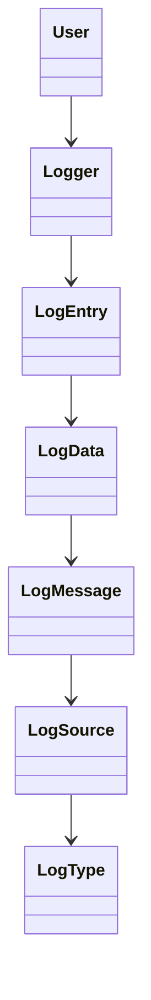
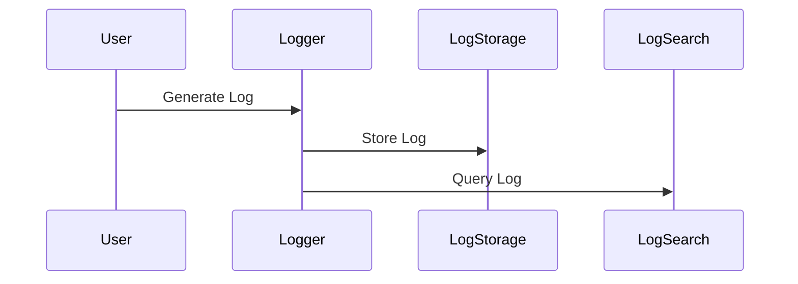

                 


### 第一部分：引言与背景介绍

#### 第1章：分布式日志系统概述

**1.1 问题背景**

在当今互联网和云计算的时代，分布式系统成为了企业和组织的核心基础设施。分布式系统通过将任务分散到多个节点上来提高系统的性能和可用性，然而，随之而来的挑战是管理和监控这些分布式系统的复杂性。日志系统作为分布式系统的“生命线”，扮演着至关重要的角色。日志系统用于记录系统运行过程中的各种事件和异常，提供宝贵的诊断信息，以便开发人员和运维团队能够快速定位和解决问题。

**问题解决**

分布式日志系统通过收集、存储和查询来自多个节点的日志数据，为系统监控、性能分析和故障排除提供强有力的支持。相比传统的集中式日志系统，分布式日志系统具有可扩展性、高可用性和更好的性能。

**边界与外延**

分布式日志系统适用于需要高可用性和大规模扩展的场景，如电子商务网站、大数据处理平台、云计算服务等。然而，它也存在一些限制，例如更高的复杂性、维护成本和部署难度。

**核心要素组成**

分布式日志系统的核心要素包括日志收集器、日志存储系统和日志查询接口。日志收集器负责从各个节点收集日志数据，日志存储系统负责存储这些数据，而日志查询接口则为开发人员提供便捷的日志查询功能。

#### 第2章：分布式日志系统的核心概念

**2.1 核心概念**

分布式系统是一种通过网络连接的计算机节点组成的系统，这些节点可以位于不同的地理位置，协同工作以完成共同的任务。

日志是系统运行过程中产生的文本记录，用于记录各种事件和异常。

分布式日志系统是一种将日志数据分散存储和管理的系统，用于收集、存储和查询来自多个节点的日志数据。

**2.2 核心概念原理**

分布式一致性是指分布式系统在处理数据时，如何在多个节点之间保持数据的一致性。CAP理论是分布式一致性理论的核心，它指出在分布式系统中，一致性（Consistency）、可用性（Availability）和分区容错性（Partition tolerance）三者之间只能同时满足两项。

分布式算法包括负载均衡、数据分区、分布式锁等，用于提高分布式系统的性能和可扩展性。

**2.3 概念属性特征对比**

| 类型        | 特点                                           | 适用场景                     |
| ----------- | ---------------------------------------------- | --------------------------- |
| Kafka       | 高吞吐量、高可用性、可扩展性强                 | 大规模日志收集和处理         |
| ELK         | Elasticsearch、Logstash、Kibana的组合，功能强大 | 日志存储、搜索、分析和可视化 |
| Logstash    | 转换、过滤、路由日志数据                        | 日志收集和传输               |

**2.4 ER图**

```mermaid
erDiagram
  日志收集器 ||--|{ 日志存储系统 }
  日志收集器 ||--|{ 日志查询接口 }
  日志存储系统 ||--|{ 日志收集器 }
  日志存储系统 ||--|{ 日志查询接口 }
  日志查询接口 ||--|{ 日志收集器 }
  日志查询接口 ||--|{ 日志存储系统 }
```

#### 第3章：分布式日志系统的设计与实现

**3.1 系统设计**

分布式日志系统采用分层架构，主要包括数据层、服务层和接口层。

**数据层**：负责存储日志数据，可以是关系数据库或NoSQL数据库，如Elasticsearch、MongoDB等。

**服务层**：包括日志收集器、日志存储系统和日志查询接口，它们协同工作，实现日志的收集、存储和查询功能。

**接口层**：为开发人员提供API接口，以便他们可以方便地查询和使用日志数据。

**3.2 功能模块**

**日志收集模块**：负责从各个节点收集日志数据，可以采用推模式或拉模式。

**日志存储模块**：负责存储收集到的日志数据，可以采用分布式存储方案，如HDFS、Cassandra等。

**日志查询模块**：提供便捷的日志查询功能，支持关键字查询、范围查询等。

#### 第4章：分布式日志系统的性能优化

**4.1 性能指标**

性能指标包括日志收集速度、日志存储速度、日志查询速度等。

**4.2 性能优化策略**

- **数据分区**：将日志数据按关键字或时间分区，提高查询性能。
- **负载均衡**：通过负载均衡算法，将日志收集任务均匀分配到各个节点，提高系统吞吐量。
- **缓存**：使用缓存技术，如Redis，减少日志查询的响应时间。

**4.3 常见问题**

- **数据一致性问题**：分布式系统中，如何在多个节点之间保持数据一致性。
- **性能瓶颈**：如何识别和解决系统中的性能瓶颈。

**4.4 优化方法**

- **分布式哈希表**：通过哈希函数，将日志数据均匀分布到多个节点，提高数据访问速度。
- **负载均衡**：使用轮询、随机、最小连接数等负载均衡算法，优化系统性能。

### 第二部分：核心概念与联系

#### 第5章：核心概念原理

**5.1 分布式一致性**

分布式一致性是指分布式系统在处理数据时，如何在多个节点之间保持数据的一致性。CAP理论是分布式一致性理论的核心，它指出在分布式系统中，一致性（Consistency）、可用性（Availability）和分区容错性（Partition tolerance）三者之间只能同时满足两项。

**5.2 CAP理论**

CAP理论指出，在分布式系统中，一致性（Consistency）、可用性（Availability）和分区容错性（Partition tolerance）三者之间只能同时满足两项。例如，在分布式数据库系统中，我们通常需要在一致性和可用性之间做出权衡。

**5.3 分布式算法**

分布式算法包括负载均衡、数据分区、分布式锁等，用于提高分布式系统的性能和可扩展性。

- **负载均衡**：通过将任务分配到多个节点，提高系统的吞吐量和响应速度。
- **数据分区**：将数据分成多个分区，提高查询性能和数据访问速度。
- **分布式锁**：在分布式系统中，用于控制并发访问共享资源的锁机制。

### 第三部分：系统分析与架构设计

#### 第8章：系统功能设计

**8.1 领域模型**

领域模型是系统功能设计的核心，它描述了系统的业务领域和功能需求。

**8.2 领域模型图**



**8.3 功能需求**

- **日志收集**：从各个节点收集日志数据。
- **日志存储**：将收集到的日志数据存储到分布式存储系统。
- **日志查询**：提供便捷的日志查询功能，支持关键字查询、范围查询等。

#### 第9章：系统架构设计

**9.1 系统架构**

分布式日志系统采用分层架构，主要包括数据层、服务层和接口层。

**9.2 系统架构图**



**9.3 组件关系**

- **日志收集器**：负责从各个节点收集日志数据，并将日志数据发送到日志存储系统。
- **日志存储系统**：负责存储收集到的日志数据，并提供日志查询接口。
- **日志查询接口**：为开发人员提供API接口，以便他们可以方便地查询和使用日志数据。

### 第四部分：分布式日志系统的实现

#### 第12章：环境搭建

**12.1 环境配置**

- **硬件环境**：服务器配置，如CPU、内存、硬盘等。
- **软件环境**：操作系统，如Linux，以及分布式日志系统所需的中间件，如Kafka、Elasticsearch等。

**12.2 系统核心实现**

- **日志收集模块**：采用推模式或拉模式，从各个节点收集日志数据。
- **日志存储模块**：将收集到的日志数据存储到分布式存储系统，如HDFS、Elasticsearch等。
- **日志查询模块**：提供便捷的日志查询功能，支持关键字查询、范围查询等。

**12.3 代码应用解读**

```python
# 日志收集模块示例代码
import logging
import requests

def collect_logs():
    # 从各个节点收集日志数据
    for node in nodes:
        response = requests.get(f'http://{node}/logs')
        logging.info(f"Collected logs from node {node}: {response.text}")

# 日志存储模块示例代码
import json

def store_logs(logs):
    # 将日志数据存储到Elasticsearch
    for log in logs:
        with open(f"{log['id']}.json", 'w') as f:
            json.dump(log, f)

# 日志查询模块示例代码
from elasticsearch import Elasticsearch

def query_logs(query):
    # 查询日志数据
    es = Elasticsearch()
    result = es.search(index="logs", body={"query": {"match": {"message": query}}})
    return result['hits']['hits']
```

**12.4 实际案例分析**

**案例介绍**

我们以一个电子商务平台为例，介绍如何实现分布式日志系统。

**分析剖析**

- **日志收集**：采用推模式，由各个服务节点定期将日志数据推送到日志收集器。
- **日志存储**：使用Elasticsearch作为日志存储系统，以提高日志查询性能。
- **日志查询**：提供API接口，以便开发人员可以方便地查询日志数据。

**项目小结**

通过本案例，我们展示了如何在一个实际的电子商务平台上实现分布式日志系统。分布式日志系统为平台提供了强大的日志收集、存储和查询功能，有助于快速定位和解决问题。

### 第五部分：调试与优化

#### 第16章：调试与优化

**16.1 调试方法**

- **日志分析**：通过分析日志数据，查找异常和错误。
- **性能监控**：使用性能监控工具，如Prometheus、Grafana等，监控系统的性能指标。
- **代码审查**：定期进行代码审查，查找潜在的性能问题和bug。

**16.2 优化策略**

- **数据分区**：根据日志数据的特点，合理划分数据分区，提高查询性能。
- **缓存**：使用缓存技术，如Redis，减少日志查询的响应时间。
- **负载均衡**：采用合适的负载均衡算法，优化系统性能。

**16.3 最佳实践**

- **日志格式化**：采用统一的日志格式，便于日志分析和处理。
- **日志压缩**：对日志数据进行压缩，减少存储空间占用。
- **日志备份**：定期对日志数据进行备份，确保数据安全。

**16.4 小结**

在分布式日志系统的实现过程中，调试和优化是至关重要的。通过合理的调试方法和优化策略，我们可以确保分布式日志系统的稳定性和高性能。

## 总结与展望

本文详细介绍了分布式日志系统的核心概念、设计与实现、调试与优化等内容。分布式日志系统在分布式系统监控和运维中起着关键作用。随着云计算和大数据技术的不断发展，分布式日志系统的应用场景将更加广泛。未来，我们期待在分布式日志系统领域取得更多突破，为企业和组织提供更强大的日志收集、存储和查询能力。

