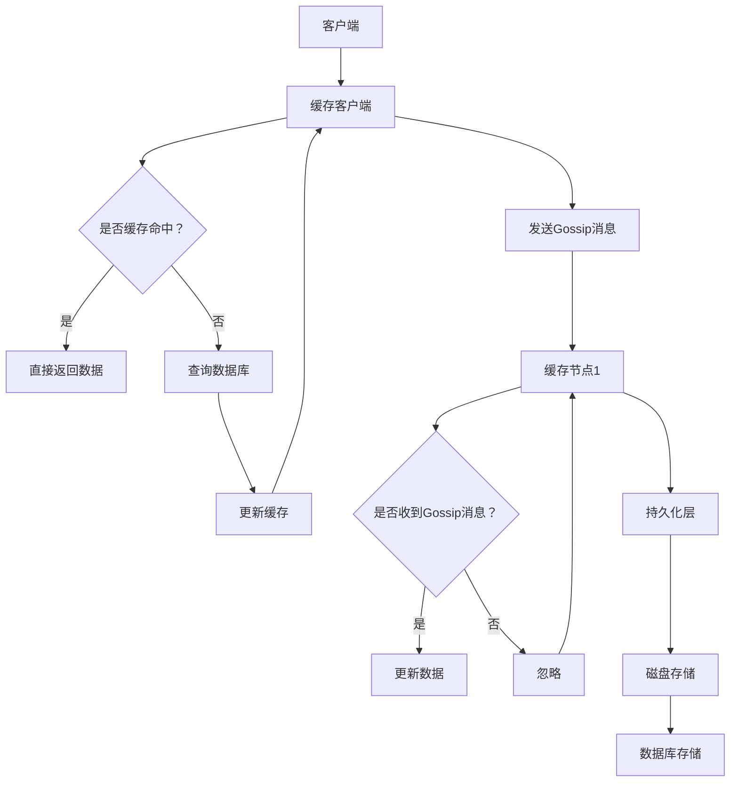

                 

### 前言

在现代软件架构中，分布式缓存系统已经成为提升系统性能和可扩展性的关键组件。随着数据规模和访问量的不断增长，传统的单机缓存系统已经难以满足日益复杂的业务需求。因此，构建一个可靠、高效的分布式缓存系统显得尤为重要。

本文将系统地探讨如何打造一个可靠的分布式缓存系统。我们将从背景介绍开始，逐步深入探讨分布式缓存系统的基本概念、架构设计、关键技术实现，以及实战案例。

首先，我们将介绍缓存系统的必要性，解释为什么缓存系统能够显著提升应用性能。接着，我们将定义分布式缓存系统的核心概念，并探讨其与传统缓存系统的区别。在架构设计部分，我们将详细解析分布式缓存系统的各个组成部分，包括数据一致性模型、分区策略、负载均衡等。

在技术实现部分，我们将深入分析缓存数据一致性、分区与负载均衡等关键技术的原理和实现方法。最后，通过具体的实战案例，我们将展示如何在实际项目中应用分布式缓存系统，并提供最佳实践和注意事项。

本文旨在为读者提供一个全面、系统的分布式缓存系统构建指南，帮助读者理解和掌握分布式缓存系统的设计和实现。希望通过本文，读者能够对分布式缓存系统有更深刻的认识，并在实际项目中成功地构建和优化缓存系统。

### 关键词

- 分布式缓存系统
- 数据一致性
- 分区策略
- 负载均衡
- 持久化
- 缓存命中率

### 摘要

本文旨在深入探讨如何构建一个可靠、高效的分布式缓存系统。首先，介绍了缓存系统的必要性及其在提升应用性能中的作用。接着，详细阐述了分布式缓存系统的基本概念、架构设计和关键技术实现，包括数据一致性、分区策略和负载均衡等。最后，通过实战案例展示了分布式缓存系统的应用，并提供了一系列最佳实践和注意事项。本文旨在为读者提供一个全面、系统的构建指南，帮助读者理解和掌握分布式缓存系统的设计和实现。

### 第一部分：背景与概念介绍

#### 第1章：分布式缓存系统概述

随着互联网和大数据技术的飞速发展，现代应用系统面临着越来越大的数据量和访问压力。为了应对这一挑战，分布式缓存系统应运而生。本章节将介绍分布式缓存系统的必要性、基本概念以及解决的问题，帮助读者建立对分布式缓存系统的初步理解。

##### 1.1 缓存系统的必要性

在计算机系统中，缓存（Cache）是一种快速、昂贵的存储介质，用于临时存储频繁访问的数据。缓存系统能够显著提高数据访问速度，从而提升整体系统的性能。然而，随着应用规模的扩大，单机缓存系统逐渐暴露出一些问题：

- **性能瓶颈**：单机缓存系统的存储容量和访问速度受到硬件限制，无法满足大规模应用的需求。
- **扩展性差**：单机缓存系统在处理大量数据和高并发访问时，容易出现性能瓶颈，难以横向扩展。
- **可靠性低**：单机缓存系统在单点故障时，可能导致整个系统不可用，影响业务的连续性。

为了解决这些问题，分布式缓存系统被提出来，通过将缓存数据分布到多个节点上，实现了更高的性能、扩展性和可靠性。

##### 1.1.1 数据访问性能瓶颈

在传统的单机缓存系统中，数据访问速度主要受到以下因素的影响：

- **存储介质**：单机缓存系统通常使用内存作为存储介质，虽然内存读写速度很快，但容量有限，无法存储大量数据。
- **CPU性能**：数据访问请求需要经过CPU处理，处理速度较慢，成为系统性能的瓶颈。
- **网络延迟**：在分布式系统中，节点之间的数据传输需要经过网络，网络延迟可能影响数据访问速度。

分布式缓存系统通过将缓存数据分布到多个节点上，利用多台服务器的计算和存储资源，提高了系统的整体性能。同时，通过合理的设计和优化，可以减少数据访问的延迟，提升系统的响应速度。

##### 1.1.2 缓存系统的基本原理

缓存系统的工作原理相对简单，主要分为以下几个步骤：

1. **数据存储**：将频繁访问的数据存储到缓存中，通常使用内存作为存储介质。
2. **数据检索**：当用户请求数据时，系统首先检查缓存，如果缓存命中，直接返回缓存数据，否则从后端存储系统中检索数据并存储到缓存中。
3. **数据更新**：当缓存中的数据过期或发生变化时，系统需要更新缓存，确保缓存中的数据始终是最新的。

分布式缓存系统在基本原理上与单机缓存系统类似，但引入了更多的复杂性，如数据一致性、分区、负载均衡等。通过这些机制，分布式缓存系统能够更好地应对大规模应用的需求。

##### 1.1.3 分布式缓存的优势

与单机缓存系统相比，分布式缓存系统具有以下优势：

- **高扩展性**：分布式缓存系统可以将缓存数据分布到多台服务器上，通过横向扩展提高系统的存储容量和访问速度。
- **高性能**：通过负载均衡和分区策略，分布式缓存系统可以充分利用多台服务器的计算和存储资源，提高系统的整体性能。
- **高可用性**：分布式缓存系统通过数据复制和故障转移机制，提高了系统的可靠性，确保在单点故障时能够快速恢复。
- **易维护性**：分布式缓存系统可以通过自动化工具实现节点的增减、数据迁移和故障恢复，降低了运维成本。

尽管分布式缓存系统具有诸多优势，但也面临着一些挑战，如数据一致性、分区策略设计、网络延迟等。在后续章节中，我们将逐一探讨这些关键问题。

##### 1.2 分布式缓存系统的基本概念

在深入探讨分布式缓存系统之前，我们需要了解一些基本概念，以便更好地理解其工作原理和设计思想。

- **缓存命中率**：缓存命中率是指缓存系统成功命中请求的次数与总请求次数之比。高缓存命中率意味着更多的数据访问可以直接从缓存中获取，从而提高系统的性能。
- **数据一致性**：数据一致性是指分布式缓存系统在多台服务器之间保持数据一致性的一种机制。不同的一致性模型（如最终一致性、强一致性）对系统的性能和可靠性有不同的影响。
- **分区**：分区是指将缓存数据分布到多个节点上的过程。分区策略决定了如何将数据分配到不同的节点，以优化系统的性能和可扩展性。
- **负载均衡**：负载均衡是指通过将请求分配到不同的节点，实现系统资源的最优利用。负载均衡算法可以根据不同的需求，如响应时间、服务器负载等，动态调整请求的分配策略。

##### 1.2.1 缓存命中率

缓存命中率是衡量缓存系统性能的重要指标。高缓存命中率意味着系统能够更快速地响应用户请求，从而提升用户体验。影响缓存命中率的主要因素包括：

- **缓存策略**：缓存策略决定了哪些数据应该被缓存，如基于访问频率、缓存时间等。合理的缓存策略可以提高缓存命中率。
- **缓存数据规模**：缓存数据规模越大，缓存命中率越高。但过大的缓存数据规模可能导致内存占用过高，影响系统性能。
- **数据访问模式**：数据访问模式对缓存命中率有显著影响。例如，如果数据访问呈现出明显的热点分布，则可以通过热点数据缓存策略提高缓存命中率。

##### 1.2.2 数据一致性

数据一致性是分布式缓存系统面临的一个重要挑战。在分布式系统中，多台服务器之间可能存在网络延迟、节点故障等问题，导致数据不一致。数据一致性模型主要包括以下几种：

- **最终一致性**：最终一致性允许数据在多个节点之间异步复制，只要在一段时间后，所有节点的数据最终会一致。最终一致性适用于对一致性要求不高的场景，如消息队列系统。
- **强一致性**：强一致性要求所有节点的数据始终一致，如读写操作必须同步。强一致性保证了数据的一致性，但可能影响系统的性能和可用性。
- **弱一致性**：弱一致性允许节点之间的数据存在短暂的不一致，适用于对一致性要求不高的场景，如缓存系统。

##### 1.2.3 分布式系统的挑战

分布式缓存系统在设计和实现过程中面临诸多挑战，包括：

- **数据分区**：如何合理地将数据分配到不同的节点，以优化系统的性能和可扩展性。
- **数据一致性**：如何在多台服务器之间保持数据一致性，处理网络延迟和节点故障等问题。
- **负载均衡**：如何动态地将请求分配到不同的节点，实现系统资源的最优利用。
- **网络延迟**：网络延迟对分布式缓存系统的性能有显著影响，需要采取有效措施降低延迟。

在后续章节中，我们将详细探讨这些挑战的解决方案，并介绍分布式缓存系统的架构设计和关键技术实现。

##### 1.3 分布式缓存系统的分类

分布式缓存系统根据不同的分类标准可以划分为多种类型，每种类型具有不同的特点和适用场景。以下是一些常见的分类方法：

- **基于内存的缓存系统**：这类缓存系统将数据存储在内存中，具有快速访问和低延迟的特点，适用于需要高性能缓存的场景。常见的基于内存的缓存系统包括Redis、Memcached等。
- **基于磁盘的缓存系统**：这类缓存系统将数据存储在磁盘上，虽然访问速度较慢，但具有更大的数据存储容量。基于磁盘的缓存系统适用于需要大规模数据缓存和持久化的场景，如Apache Ignite、Cassandra等。
- **分布式缓存协议**：分布式缓存协议是一种用于实现分布式缓存系统的通信协议，如Memcached协议、Redis协议等。这些协议定义了客户端与缓存服务器之间的数据交互规则，支持数据的存储、检索和一致性管理。

##### 1.3.1 基于内存的缓存系统

基于内存的缓存系统具有以下特点：

- **快速访问**：由于数据存储在内存中，访问速度非常快，适用于需要高响应速度的场景。
- **低延迟**：内存访问延迟较低，可以显著提高系统的性能。
- **数据一致性**：基于内存的缓存系统通常采用最终一致性模型，确保数据在多个节点之间异步复制，但可能存在短暂的不一致。

常见的基于内存的缓存系统包括：

- **Redis**：Redis是一种开源的内存缓存系统，支持多种数据结构（如字符串、列表、集合、哈希表等），具有高性能和高可用性的特点。Redis通过主从复制和集群模式实现数据一致性和容错能力。
- **Memcached**：Memcached是一种高性能的分布式缓存系统，主要用于缓存网页数据、图片等大块数据。Memcached采用哈希分区策略，将缓存数据分布到多个节点上，以提高系统的性能和可扩展性。

##### 1.3.2 基于磁盘的缓存系统

基于磁盘的缓存系统具有以下特点：

- **大容量**：由于数据存储在磁盘上，具有更大的存储容量，适用于需要大规模数据缓存和持久化的场景。
- **持久性**：基于磁盘的缓存系统将数据持久化到磁盘，确保数据不会因节点故障而丢失。
- **延迟较高**：磁盘访问速度较慢，可能导致数据访问延迟较高。

常见的基于磁盘的缓存系统包括：

- **Apache Ignite**：Apache Ignite是一种分布式缓存和计算平台，支持内存和磁盘存储，提供高性能的数据缓存和计算能力。Ignite采用分区和负载均衡策略，实现数据的高可用性和高可扩展性。
- **Cassandra**：Cassandra是一种分布式NoSQL数据库，支持基于磁盘的缓存系统。Cassandra通过一致性哈希分区和分布式存储机制，实现数据的可靠性和高性能。

##### 1.3.3 分布式缓存协议

分布式缓存协议是一种用于实现分布式缓存系统的通信协议，常见的分布式缓存协议包括：

- **Memcached协议**：Memcached协议是一种简单、高效的通信协议，基于二进制格式，支持数据存储、检索和删除等操作。Memcached协议通过心跳机制和响应机制，实现客户端与缓存服务器之间的通信。
- **Redis协议**：Redis协议是一种基于文本的通信协议，支持多种数据结构和操作。Redis协议通过命令行接口（CLI）和客户端库（如Redis CLI、Redis Java Client等），实现数据存储、检索和一致性管理。

分布式缓存协议在分布式缓存系统中发挥着重要作用，通过定义数据交互规则，确保数据的一致性和可靠性。在实际应用中，可以根据具体需求和场景选择合适的分布式缓存协议。

##### 1.4 分布式缓存系统的发展趋势

随着技术的不断进步，分布式缓存系统也在不断发展和演进。以下是一些当前和未来可能的发展趋势：

- **AI在缓存系统中的应用**：人工智能技术在分布式缓存系统中具有广泛的应用前景，如通过机器学习算法优化缓存策略、提高缓存命中率等。未来，AI将进一步提升分布式缓存系统的智能化水平，实现更高效的数据缓存和管理。
- **云原生缓存系统**：随着云计算的普及，云原生缓存系统应运而生。云原生缓存系统基于容器和微服务架构，具有高可扩展性和高可用性，可以更好地适应云计算环境。未来，云原生缓存系统将成为分布式缓存系统的主流。
- **分布式缓存技术的未来方向**：分布式缓存技术在未来将继续发展，如针对边缘计算场景的缓存优化、支持更大数据规模和更高并发访问的缓存系统等。此外，分布式缓存系统还将与其他技术（如区块链、物联网等）融合，实现更广泛的场景应用。

通过了解分布式缓存系统的发展趋势，读者可以更好地把握行业动态，为未来的技术研究和应用做好准备。

### 第2章：分布式缓存系统的架构设计

在了解了分布式缓存系统的基本概念和必要性之后，本章节将重点探讨分布式缓存系统的架构设计。分布式缓存系统的架构设计直接关系到系统的性能、可扩展性和可靠性。在这一部分，我们将详细分析分布式缓存系统的各个组成部分，包括数据一致性模型、分区策略、负载均衡等，帮助读者全面了解分布式缓存系统的设计原理和实现方法。

##### 2.1 分布式缓存系统的架构模式

分布式缓存系统的架构模式可以分为几种常见的类型，每种类型都有其独特的优势和适用场景。以下是几种常见的架构模式：

- **客户端-服务器模型**：在这种模型中，缓存服务器负责存储和检索缓存数据，客户端通过特定的接口与缓存服务器进行通信。客户端-服务器模型简单、易于实现，适用于中小规模的应用场景。
- **数据网格模型**：数据网格模型是一种分布式缓存架构，将缓存数据分布到多个节点上，每个节点负责一部分数据的存储和检索。数据网格模型具有较高的可扩展性和性能，适用于大规模、高并发的应用场景。
- **集群缓存模型**：集群缓存模型通过多个缓存节点组成一个缓存集群，共同为客户端提供服务。集群缓存模型可以实现负载均衡、数据复制和故障转移，提高系统的可靠性和性能。

##### 2.1.1 客户端-服务器模型

客户端-服务器模型是分布式缓存系统的基本架构模式。在这种模型中，缓存服务器作为数据存储和检索的中心，客户端通过特定的接口（如API、命令行等）与缓存服务器进行通信。

- **工作原理**：当客户端需要访问缓存数据时，首先发送请求到缓存服务器。缓存服务器检查缓存，如果缓存命中，直接返回缓存数据；否则，从后端存储系统中检索数据并存储到缓存中，然后返回给客户端。
- **优势**：客户端-服务器模型简单、易于实现，适用于中小规模的应用场景。通过减少后端存储系统的访问次数，可以提高系统的性能。
- **挑战**：在大型应用场景中，客户端-服务器模型可能存在单点故障和性能瓶颈问题。此外，数据的一致性和分区策略也需要进行特殊设计。

##### 2.1.2 数据网格模型

数据网格模型是一种分布式缓存架构，通过将缓存数据分布到多个节点上，实现了更高的性能和可扩展性。数据网格模型通常用于大规模、高并发的应用场景。

- **工作原理**：在数据网格模型中，每个节点负责一部分数据的存储和检索。当一个节点无法处理请求时，可以将请求转发到其他节点。数据网格模型通过分布式哈希表（DHT）实现数据的分区和负载均衡。
- **优势**：数据网格模型具有较高的可扩展性和性能。通过将数据分布到多个节点上，可以充分利用多台服务器的计算和存储资源，提高系统的整体性能。此外，数据网格模型可以实现数据的负载均衡和容错能力。
- **挑战**：数据网格模型的设计和实现较为复杂，需要对分布式算法和数据一致性进行深入考虑。此外，数据网格模型可能面临网络延迟和分区问题，需要采取有效措施进行优化。

##### 2.1.3 集群缓存模型

集群缓存模型通过多个缓存节点组成一个缓存集群，共同为客户端提供服务。集群缓存模型可以实现负载均衡、数据复制和故障转移，提高系统的可靠性和性能。

- **工作原理**：在集群缓存模型中，每个节点都是一个缓存服务器，节点之间通过特定的协议进行通信。当一个节点无法处理请求时，可以将请求转发到其他节点。集群缓存模型通过分布式哈希表（DHT）实现数据的分区和负载均衡。同时，集群缓存模型还可以实现数据复制和故障转移，确保系统的可靠性。
- **优势**：集群缓存模型具有较高的可靠性和性能。通过多个缓存节点的协作，可以实现数据的负载均衡、容错和数据一致性。此外，集群缓存模型可以支持大规模的应用场景，具有良好的可扩展性。
- **挑战**：集群缓存模型的设计和实现较为复杂，需要对分布式算法和数据一致性进行深入考虑。此外，集群缓存模型可能面临网络延迟和分区问题，需要采取有效措施进行优化。

##### 2.2 数据一致性模型

在分布式缓存系统中，数据一致性是一个重要问题。不同的一致性模型适用于不同的应用场景，下面介绍几种常见的数据一致性模型：

- **最终一致性**：最终一致性模型允许数据在多个节点之间异步复制，只要在一段时间后，所有节点的数据最终会一致。最终一致性模型适用于对一致性要求不高的场景，如消息队列系统。
- **强一致性**：强一致性模型要求所有节点的数据始终一致，如读写操作必须同步。强一致性模型保证了数据的一致性，但可能影响系统的性能和可用性。
- **弱一致性**：弱一致性模型允许节点之间的数据存在短暂的不一致，适用于对一致性要求不高的场景，如缓存系统。

##### 2.2.1 最终一致性

最终一致性模型允许数据在多个节点之间异步复制，只要在一段时间后，所有节点的数据最终会一致。这种模型适用于对一致性要求不高的场景，如消息队列系统。

- **工作原理**：在最终一致性模型中，当一个节点更新数据时，会将其更新信息广播到其他节点。其他节点接收到更新信息后，会在一段时间内异步进行数据同步。最终，所有节点的数据都会达到一致性状态。
- **优势**：最终一致性模型降低了系统的同步成本，提高了系统的性能和可扩展性。
- **挑战**：最终一致性模型可能存在短暂的数据不一致现象，影响用户体验。此外，最终一致性模型在处理大规模并发操作时，可能面临性能瓶颈。

##### 2.2.2 强一致性

强一致性模型要求所有节点的数据始终一致，如读写操作必须同步。这种模型适用于对一致性要求较高的场景，如金融系统。

- **工作原理**：在强一致性模型中，当一个节点进行读写操作时，必须等待其他所有节点的操作结果，才能进行下一步操作。强一致性模型通过同步机制确保数据的一致性。
- **优势**：强一致性模型保证了数据的一致性，适用于对一致性要求较高的场景。
- **挑战**：强一致性模型可能导致系统性能下降，特别是在处理大规模并发操作时。此外，强一致性模型在分布式环境下实现较为复杂，需要考虑网络延迟和节点故障等问题。

##### 2.2.3 弱一致性

弱一致性模型允许节点之间的数据存在短暂的不一致，适用于对一致性要求不高的场景，如缓存系统。

- **工作原理**：在弱一致性模型中，节点之间的数据更新是异步的，不要求必须同步。当一个节点更新数据时，其他节点可以在一段时间后异步同步数据。弱一致性模型通过允许数据的不一致性，提高了系统的性能和可扩展性。
- **优势**：弱一致性模型降低了系统的同步成本，提高了系统的性能和可扩展性。
- **挑战**：弱一致性模型可能存在短暂的数据不一致现象，需要考虑数据一致性的处理策略。此外，弱一致性模型在处理大规模并发操作时，可能面临性能瓶颈。

##### 2.3 分区策略

在分布式缓存系统中，分区策略是关键设计之一。合理的分区策略可以优化系统的性能和可扩展性。以下是几种常见的分区策略：

- **哈希分区**：哈希分区通过哈希函数将数据映射到不同的节点。哈希分区简单、高效，适用于静态数据场景。
- **范围分区**：范围分区将数据根据一定的范围（如时间、ID等）映射到不同的节点。范围分区适用于动态数据场景。
- **负载均衡分区**：负载均衡分区根据节点的负载情况动态调整数据的分配。负载均衡分区适用于动态负载的场景。

##### 2.3.1 哈希分区

哈希分区通过哈希函数将数据映射到不同的节点。哈希分区简单、高效，适用于静态数据场景。

- **工作原理**：哈希分区使用哈希函数将数据的键（Key）映射到一个哈希值，然后根据哈希值将数据存储到相应的节点。哈希分区确保数据在节点之间的均匀分布，避免了热点问题的出现。
- **优势**：哈希分区简单、高效，适用于静态数据场景。哈希分区可以充分利用多台服务器的计算和存储资源，提高系统的整体性能。
- **挑战**：哈希分区可能导致热点问题的出现。热点问题是指某些节点由于存储了过多的数据，导致负载过高，影响系统的性能。为了解决热点问题，可以采取数据迁移、负载均衡等措施。

##### 2.3.2 范围分区

范围分区将数据根据一定的范围（如时间、ID等）映射到不同的节点。范围分区适用于动态数据场景。

- **工作原理**：范围分区根据数据的不同属性（如时间、ID等）将数据划分为多个范围，然后根据范围将数据存储到相应的节点。范围分区确保同一范围内的数据存储在相同的节点上，便于数据的查询和更新。
- **优势**：范围分区适用于动态数据场景，可以确保数据的分区和存储的一致性。范围分区简化了数据的一致性和分区策略设计。
- **挑战**：范围分区可能面临数据倾斜问题。数据倾斜是指某些范围的数据量远大于其他范围，导致部分节点负载过高，影响系统的性能。为了解决数据倾斜问题，可以采取数据迁移、负载均衡等措施。

##### 2.3.3 负载均衡分区

负载均衡分区根据节点的负载情况动态调整数据的分配。负载均衡分区适用于动态负载的场景。

- **工作原理**：负载均衡分区通过监测节点的负载情况，动态调整数据的分配。当某个节点的负载过高时，可以将部分数据迁移到其他节点，以实现负载均衡。负载均衡分区确保系统的整体性能和可靠性。
- **优势**：负载均衡分区适用于动态负载的场景，可以动态调整数据的分配，优化系统的性能和可扩展性。负载均衡分区简化了数据的一致性和分区策略设计。
- **挑战**：负载均衡分区需要实时监测节点的负载情况，增加了系统的复杂度。负载均衡分区在处理大规模并发操作时，可能面临性能瓶颈。

##### 2.4 缓存数据的持久化

缓存数据的持久化是分布式缓存系统的一个重要方面。持久化数据可以确保在系统故障或重启时，缓存数据不会丢失。

- **必要性**：缓存数据的持久化是必要的，因为在分布式缓存系统中，数据存储在内存中，内存数据在系统故障或重启时可能会丢失。通过将数据持久化到磁盘或其他存储介质，可以确保数据的持久性和可靠性。
- **方法**：缓存数据的持久化可以采用以下几种方法：
  - **基于文件的持久化**：将缓存数据存储到文件系统中，通过文件读写操作实现数据的持久化。
  - **基于数据库的持久化**：使用数据库存储缓存数据，通过数据库的事务机制实现数据的一致性和持久化。
  - **基于内存数据库的持久化**：使用内存数据库（如Redis）存储缓存数据，通过内存数据库的事务机制实现数据的一致性和持久化。

- **性能与权衡**：持久化数据可以提高系统的可靠性，但可能会影响系统的性能。在设计和实现分布式缓存系统时，需要权衡持久化与性能之间的关系，选择合适的持久化方法。

通过本章节的讨论，读者应该对分布式缓存系统的架构设计有了更深入的理解。在接下来的章节中，我们将进一步探讨分布式缓存系统的关键技术实现，包括数据一致性、分区、负载均衡等，帮助读者全面掌握分布式缓存系统的设计和实现。

### 第二部分：技术实现

#### 第3章：缓存数据一致性

在分布式缓存系统中，数据一致性是确保多个节点之间的数据状态一致性的关键。由于分布式环境中的网络延迟、节点故障等因素，实现数据一致性成为一个极具挑战性的问题。本章将深入探讨分布式缓存系统中的数据一致性，分析常见的一致性协议及其实现方法，并讨论如何在实际系统中确保数据一致性。

##### 3.1 数据一致性的挑战

在分布式缓存系统中，数据一致性面临以下挑战：

- **数据分区与一致性**：分布式缓存系统将数据分区存储到不同的节点上，这可能导致不同节点之间的数据状态不一致。例如，一个节点更新了数据，但其他节点尚未同步，导致数据不一致。
- **数据更新与一致性**：分布式缓存系统中的数据更新操作可能需要多个节点之间的协作。例如，在一个节点上执行了数据更新操作，但其他节点尚未收到更新消息，导致数据不一致。
- **分布式环境下的数据一致性保障**：在分布式环境中，网络延迟、节点故障等因素可能导致数据一致性的保障变得复杂。确保数据一致性需要考虑如何处理网络分区、节点故障等问题。

##### 3.1.1 数据分区与一致性

在分布式缓存系统中，数据分区是提高系统性能和可扩展性的关键。通过将数据分区存储到不同的节点上，可以充分利用多台服务器的计算和存储资源，提高系统的整体性能。然而，数据分区也带来了数据一致性的挑战：

- **分区策略**：合理的分区策略可以降低数据一致性的难度。常见的分区策略包括哈希分区、范围分区和负载均衡分区等。
- **数据复制**：为了确保分区后的数据在多个节点之间的一致性，通常需要采用数据复制策略。数据复制策略包括主从复制和去中心化复制等。
- **数据一致性协议**：数据一致性协议用于确保在分布式环境中多个节点之间的数据状态一致性。常见的数据一致性协议包括最终一致性协议、强一致性协议和弱一致性协议等。

##### 3.1.2 数据更新与一致性

在分布式缓存系统中，数据更新操作可能需要多个节点之间的协作。例如，当一个节点更新了数据，其他节点需要同步更新，以确保数据的一致性。以下是一些常见的挑战：

- **同步更新**：同步更新是指在一个节点更新数据后，必须等待其他节点完成更新操作，才能进行下一步操作。同步更新可以确保数据的一致性，但可能导致系统的性能下降。
- **异步更新**：异步更新是指在一个节点更新数据后，不需要等待其他节点完成更新操作，可以直接进行下一步操作。异步更新可以提高系统的性能，但可能导致数据的一致性问题。
- **数据版本控制**：为了处理分布式环境中的数据更新，可以采用数据版本控制机制。数据版本控制可以确保在多个节点之间更新数据时，不会覆盖其他节点的更新操作。

##### 3.1.3 分布式环境下的数据一致性保障

在分布式环境下，保障数据一致性是一个复杂的任务。以下是一些常见的方法：

- **最终一致性协议**：最终一致性协议允许节点之间的数据异步复制，只要在一段时间后，所有节点的数据最终会一致。这种协议适用于对一致性要求不高的场景，如消息队列系统。
- **强一致性协议**：强一致性协议要求所有节点的数据始终一致，如读写操作必须同步。这种协议可以确保数据的一致性，但可能影响系统的性能和可用性。
- **弱一致性协议**：弱一致性协议允许节点之间的数据存在短暂的不一致，适用于对一致性要求不高的场景，如缓存系统。
- **数据版本控制**：通过数据版本控制机制，可以确保在多个节点之间更新数据时，不会覆盖其他节点的更新操作。常见的数据版本控制机制包括多版本并发控制（MVCC）和乐观锁等。

##### 3.2 一致性协议

在分布式缓存系统中，一致性协议用于确保多个节点之间的数据状态一致性。以下介绍几种常见的一致性协议：

- **二阶段提交协议（2PC）**：二阶段提交协议是一种分布式事务协议，用于确保多个节点之间的数据一致性。2PC协议分为两个阶段：准备阶段和提交阶段。在准备阶段，协调者询问参与者是否准备好执行事务；在提交阶段，协调者根据参与者的响应决定是否提交事务。
- **三阶段提交协议（3PC）**：三阶段提交协议是对二阶段提交协议的改进，旨在解决网络延迟和分区问题。3PC协议分为三个阶段：注册阶段、准备阶段和提交阶段。在注册阶段，协调者向参与者注册事务；在准备阶段，协调者询问参与者是否准备好执行事务；在提交阶段，协调者根据参与者的响应决定是否提交事务。
- **Paxos算法**：Paxos算法是一种用于分布式系统的一致性算法，用于确保多个节点之间的数据一致性。Paxos算法通过选举提案者（Proposer）和接受者（Acceptor）来达成一致性协议。Paxos算法可以处理网络延迟和节点故障等问题，确保系统的高可用性和一致性。

##### 3.2.1 二阶段提交协议

二阶段提交协议（2PC）是一种分布式事务协议，用于确保多个节点之间的数据一致性。2PC协议分为两个阶段：

- **准备阶段**：在准备阶段，协调者向参与者发送一个准备消息（Prepare Message），询问参与者是否准备好执行事务。参与者收到准备消息后，执行以下步骤：
  - **检查状态**：参与者检查自身状态，确保没有其他未完成的事务。
  - **发送回复**：参与者向协调者发送一个准备回复（Prepare Response），表示是否准备好执行事务。如果参与者准备好执行事务，则回复“Ready”；否则，回复“Not Ready”。
- **提交阶段**：在提交阶段，协调者根据参与者的准备回复决定是否提交事务。协调者执行以下步骤：
  - **收集回复**：协调者收集所有参与者的准备回复。
  - **决定提交**：如果所有参与者都回复“Ready”，协调者向参与者发送一个提交消息（Commit Message），指示参与者执行事务提交；否则，协调者向参与者发送一个撤销消息（Abort Message），指示参与者撤销事务。

##### 3.2.2 三阶段提交协议

三阶段提交协议（3PC）是对二阶段提交协议（2PC）的改进，旨在解决网络延迟和分区问题。3PC协议分为三个阶段：

- **注册阶段**：在注册阶段，协调者向参与者注册事务。协调者执行以下步骤：
  - **发送注册消息**：协调者向参与者发送一个注册消息（Register Message），请求参与者注册事务。
  - **收集注册回复**：参与者收到注册消息后，执行以下步骤：
    - **检查状态**：参与者检查自身状态，确保没有其他未完成的事务。
    - **发送注册回复**：参与者向协调者发送一个注册回复（Register Response），表示是否成功注册事务。如果参与者成功注册事务，则回复“Registered”；否则，回复“Not Registered”。
- **准备阶段**：在准备阶段，协调者向参与者发送一个准备消息（Prepare Message），询问参与者是否准备好执行事务。参与者收到准备消息后，执行以下步骤：
  - **检查状态**：参与者检查自身状态，确保没有其他未完成的事务。
  - **发送回复**：参与者向协调者发送一个准备回复（Prepare Response），表示是否准备好执行事务。如果参与者准备好执行事务，则回复“Ready”；否则，回复“Not Ready”。
- **提交阶段**：在提交阶段，协调者根据参与者的准备回复决定是否提交事务。协调者执行以下步骤：
  - **收集回复**：协调者收集所有参与者的准备回复。
  - **决定提交**：如果所有参与者都回复“Ready”，协调者向参与者发送一个提交消息（Commit Message），指示参与者执行事务提交；否则，协调者向参与者发送一个撤销消息（Abort Message），指示参与者撤销事务。

##### 3.2.3 Paxos算法

Paxos算法是一种用于分布式系统的一致性算法，用于确保多个节点之间的数据一致性。Paxos算法通过选举提案者（Proposer）和接受者（Acceptor）来达成一致性协议。Paxos算法的主要步骤包括：

- **提议阶段**：在提议阶段，提案者提出一个提议（Proposal），并尝试获得接受者的多数同意。
  - **提出提议**：提案者生成一个唯一标识的提议，并发送至所有接受者。
  - **接收提议**：接受者收到提议后，执行以下步骤：
    - **检查提议**：接受者检查提议是否在安全范围内，即提议编号大于当前已接受的提议编号。
    - **接受提议**：如果提议符合安全范围，接受者接受提议，并将提议编号设置为提议的编号。
    - **发送回复**：接受者向提案者发送接受回复（Accept Response），表示已接受提议。
- **决策阶段**：在决策阶段，提案者根据接受者的回复决定是否继续提议。
  - **收集回复**：提案者收集所有接受者的接受回复。
  - **决定决策**：如果提案者从多数接受者那里收到接受回复，则提案者可以决定提议的内容，并将提议的内容发送至所有接受者。
- **执行阶段**：在执行阶段，接受者根据提案者的决策执行提议内容。

##### 3.3 一致性方案的实现

在实际系统中，实现数据一致性方案需要考虑多个方面：

- **缓存一致性哈希**：缓存一致性哈希（Cache Consistency Hash）是一种基于哈希算法实现数据一致性的方法。通过将数据映射到哈希环上，可以确保不同节点之间的数据一致性。
- **Gossip协议**：Gossip协议是一种用于分布式系统中的消息传递协议，可以用于实现数据一致性和容错能力。Gossip协议通过广播消息的方式，实现节点之间的信息同步和数据一致性。
- **多版本并发控制（MVCC）**：多版本并发控制（MVCC）是一种用于实现数据一致性的方法，通过维护数据的多个版本，可以支持并发访问和事务操作。

通过以上实现方法，分布式缓存系统可以有效地实现数据一致性，确保在多个节点之间保持数据的一致性状态。

##### 3.3.1 缓存一致性哈希

缓存一致性哈希（Cache Consistency Hash）是一种基于哈希算法实现数据一致性的方法。通过将数据映射到哈希环上，可以确保不同节点之间的数据一致性。

- **工作原理**：缓存一致性哈希通过哈希函数将数据的键（Key）映射到一个哈希值，然后将哈希值映射到哈希环上。哈希环是一个圆环，每个节点占据一个位置。当一个节点接收到数据访问请求时，通过哈希函数计算请求的键（Key）对应的哈希值，然后在哈希环上查找相应的节点，将请求转发给该节点。
- **优势**：缓存一致性哈希具有简单、高效的特点，可以确保数据在节点之间的均匀分布。通过哈希环的机制，可以方便地实现数据的迁移和扩展。
- **挑战**：缓存一致性哈希可能导致热点问题，即某些节点的负载过高，影响系统的性能。为了解决热点问题，可以采取数据迁移、负载均衡等措施。

##### 3.3.2 Gossip协议

Gossip协议是一种用于分布式系统中的消息传递协议，可以用于实现数据一致性和容错能力。Gossip协议通过广播消息的方式，实现节点之间的信息同步和数据一致性。

- **工作原理**：Gossip协议通过定期广播消息，实现节点之间的信息同步。每个节点定期从随机选取的其他节点接收消息，并根据消息更新自身状态。Gossip协议支持多种消息传递模式，如拉模式（Pull）和推模式（Push），可以根据具体需求进行选择。
- **优势**：Gossip协议具有简单、高效、容错能力强的特点，可以方便地实现分布式系统中的数据一致性和容错能力。Gossip协议可以支持大规模的分布式系统，具有良好的可扩展性。
- **挑战**：Gossip协议可能面临网络延迟和分区问题，需要采取有效措施进行优化。

##### 3.3.3 多版本并发控制（MVCC）

多版本并发控制（MVCC）是一种用于实现数据一致性的方法，通过维护数据的多个版本，可以支持并发访问和事务操作。

- **工作原理**：多版本并发控制通过为每个数据项维护多个版本，每个版本包含一个唯一的版本号。当一个节点读取数据时，根据当前版本号获取相应的数据版本。当一个节点更新数据时，创建一个新的数据版本，并将其设置为当前版本。通过这种方式，多版本并发控制可以支持多个节点之间的并发访问和事务操作。
- **优势**：多版本并发控制可以支持高并发访问，减少锁争用，提高系统的性能。多版本并发控制通过维护多个数据版本，可以方便地实现数据的回滚和恢复。
- **挑战**：多版本并发控制需要额外的存储空间来存储多个数据版本，可能会增加系统的存储开销。此外，多版本并发控制需要复杂的版本管理机制，以确保数据的一致性和可靠性。

通过本章的讨论，读者应该对分布式缓存系统中的数据一致性有了更深入的理解。在设计和实现分布式缓存系统时，需要综合考虑数据分区、数据更新和一致性协议等因素，确保系统能够在高并发、分布式环境下保持数据的一致性。

### 第4章：分区与负载均衡

在分布式缓存系统中，分区与负载均衡是两个关键的技术，它们直接影响系统的性能、可扩展性和可靠性。合理的分区策略和高效的负载均衡算法能够有效提升系统的整体性能，确保数据的高效存储和快速访问。本章将深入探讨分布式缓存系统中的分区策略和负载均衡算法，并分析如何在实际系统中实现和优化这些技术。

##### 4.1 分区策略的选择

分区策略是分布式缓存系统中的核心设计之一，决定了数据如何在多个节点之间分配和存储。选择合适的分区策略对于优化系统性能至关重要。以下是几种常见的分区策略：

- **哈希分区**：哈希分区通过哈希函数将数据的键（Key）映射到不同的节点。哈希分区简单高效，可以确保数据在节点之间的均匀分布。然而，哈希分区可能导致热点问题，即某些节点可能存储了大量的数据，导致负载不均衡。
- **范围分区**：范围分区根据数据的某个属性（如时间、ID等）将数据划分为不同的范围，然后将每个范围的数据存储到相应的节点。范围分区适用于动态数据场景，可以确保同一范围内的数据存储在相同的节点上，便于数据的查询和更新。然而，范围分区可能面临数据倾斜问题，即某些范围的数据量远大于其他范围，导致部分节点负载过高。
- **负载均衡分区**：负载均衡分区根据节点的负载情况动态调整数据的分配。负载均衡分区可以确保系统在不同负载情况下保持性能最优。然而，负载均衡分区需要实时监测节点的负载情况，增加了系统的复杂度。

##### 4.1.1 哈希分区

哈希分区通过哈希函数将数据的键（Key）映射到不同的节点。哈希分区简单高效，适用于静态数据场景。

- **工作原理**：哈希分区使用哈希函数计算数据的键（Key）的哈希值，然后根据哈希值将数据存储到相应的节点。哈希分区确保数据在节点之间的均匀分布，避免了热点问题的出现。
- **优势**：哈希分区简单高效，易于实现和扩展。哈希分区可以充分利用多台服务器的计算和存储资源，提高系统的整体性能。
- **挑战**：哈希分区可能导致热点问题的出现。为了解决热点问题，可以采取数据迁移、负载均衡等措施。

##### 4.1.2 范围分区

范围分区根据数据的某个属性（如时间、ID等）将数据划分为不同的范围，然后将每个范围的数据存储到相应的节点。范围分区适用于动态数据场景。

- **工作原理**：范围分区根据数据属性（如时间、ID等）将数据划分为不同的范围。每个范围的数据具有相同的属性值，因此可以存储在相同的节点上。范围分区确保同一范围内的数据存储在相同的节点上，便于数据的查询和更新。
- **优势**：范围分区适用于动态数据场景，可以确保数据的分区和存储的一致性。范围分区简化了数据的一致性和分区策略设计。
- **挑战**：范围分区可能面临数据倾斜问题。为了解决数据倾斜问题，可以采取数据迁移、负载均衡等措施。

##### 4.1.3 负载均衡分区

负载均衡分区根据节点的负载情况动态调整数据的分配。负载均衡分区适用于动态负载的场景。

- **工作原理**：负载均衡分区通过实时监测节点的负载情况，根据负载情况动态调整数据的分配。当某个节点的负载过高时，可以将部分数据迁移到其他节点，以实现负载均衡。负载均衡分区确保系统的整体性能和可靠性。
- **优势**：负载均衡分区适用于动态负载的场景，可以动态调整数据的分配，优化系统的性能和可扩展性。负载均衡分区简化了数据的一致性和分区策略设计。
- **挑战**：负载均衡分区需要实时监测节点的负载情况，增加了系统的复杂度。负载均衡分区在处理大规模并发操作时，可能面临性能瓶颈。

##### 4.2 负载均衡算法

负载均衡算法是分布式缓存系统中的重要技术，用于动态地将请求分配到不同的节点上，实现系统资源的最优利用。以下是几种常见的负载均衡算法：

- **轮询负载均衡**：轮询负载均衡是一种简单的负载均衡算法，按照顺序将请求分配到不同的节点上。轮询负载均衡具有实现简单、负载均衡效果良好的特点。
- **加权轮询负载均衡**：加权轮询负载均衡是在轮询负载均衡的基础上，为每个节点分配不同的权重，根据权重比例将请求分配到不同的节点上。加权轮询负载均衡可以更好地处理不同节点处理能力不同的情况。
- **最少连接负载均衡**：最少连接负载均衡根据当前连接数将请求分配到连接数最少的节点上。最少连接负载均衡适用于需要根据当前负载情况动态调整请求分配的场景。

##### 4.2.1 轮询负载均衡

轮询负载均衡是一种简单的负载均衡算法，按照顺序将请求分配到不同的节点上。

- **工作原理**：轮询负载均衡将所有节点构成一个环形列表，按照顺序依次处理请求。当一个请求到达时，轮询负载均衡根据当前节点的顺序将请求转发给下一个节点。如果当前节点是最后一个节点，则将请求转发给第一个节点。
- **优势**：轮询负载均衡实现简单，负载均衡效果良好，适用于负载相对均衡的场景。
- **挑战**：轮询负载均衡可能面临热点问题，即某些节点由于存储了过多的数据，导致负载过高。为了解决热点问题，可以采取数据迁移、负载均衡等措施。

##### 4.2.2 加权轮询负载均衡

加权轮询负载均衡是在轮询负载均衡的基础上，为每个节点分配不同的权重，根据权重比例将请求分配到不同的节点上。

- **工作原理**：加权轮询负载均衡将所有节点构成一个环形列表，并为每个节点分配一个权重。当一个请求到达时，根据节点的权重比例将请求分配到不同的节点上。具体实现时，可以计算每个节点的权重比例，并根据比例依次分配请求。
- **优势**：加权轮询负载均衡可以更好地处理不同节点处理能力不同的情况，确保系统资源的最优利用。
- **挑战**：加权轮询负载均衡需要计算每个节点的权重比例，增加了系统的计算复杂度。此外，加权轮询负载均衡在处理大量并发请求时，可能面临性能瓶颈。

##### 4.2.3 最少连接负载均衡

最少连接负载均衡根据当前连接数将请求分配到连接数最少的节点上。

- **工作原理**：最少连接负载均衡维护一个连接数计数器，用于记录每个节点的当前连接数。当一个请求到达时，根据当前连接数将请求分配到连接数最少的节点上。如果多个节点的连接数相同，可以采用轮询策略进一步分配请求。
- **优势**：最少连接负载均衡适用于需要根据当前负载情况动态调整请求分配的场景，可以确保系统资源的最优利用。
- **挑战**：最少连接负载均衡需要实时更新每个节点的连接数计数器，增加了系统的复杂度。此外，最少连接负载均衡在处理大量并发请求时，可能面临性能瓶颈。

##### 4.3 分区与负载均衡的实现

在实际系统中，实现分区与负载均衡需要考虑多个方面：

- **节点管理**：节点管理包括节点的添加、删除和监控。通过节点管理，可以确保系统实时了解节点的状态和负载情况，从而实现动态分区和负载均衡。
- **数据迁移**：数据迁移是将数据从一个节点迁移到另一个节点的过程。在分布式缓存系统中，数据迁移可以优化数据的分布，减少热点问题和数据倾斜现象。
- **负载感知**：负载感知是通过监测节点的负载情况，动态调整请求的分配策略。负载感知可以提高系统的性能和可扩展性，确保系统在不同负载情况下保持最优性能。

通过合理的节点管理、数据迁移和负载感知，分布式缓存系统可以实现高效的分区与负载均衡，确保系统的高性能和可靠性。

### 第5章：缓存数据持久化

在分布式缓存系统中，数据的持久化是一个关键环节，它决定了缓存系统在系统故障或重启时能否保持数据的一致性和完整性。持久化不仅能够防止数据丢失，还能提高系统的可靠性和可用性。本章将探讨分布式缓存系统中数据持久化的必要性、常用方法及其性能与权衡，帮助读者了解如何在设计和实现缓存系统时进行数据持久化。

##### 5.1 持久化的必要性

持久化是指将数据从易失性存储（如内存）转移到非易失性存储（如磁盘）的过程。在分布式缓存系统中，持久化的必要性主要体现在以下几个方面：

- **防止数据丢失**：内存作为易失性存储介质，当系统发生故障或重启时，内存中的数据会丢失。通过将数据持久化到磁盘等非易失性存储介质，可以确保数据在系统故障或重启后仍然存在。
- **保证数据一致性**：分布式缓存系统通常采用最终一致性模型，即多个节点之间的数据同步是异步进行的。持久化可以帮助在数据最终一致之前，保证数据的完整性，从而避免数据丢失或数据不一致的情况。
- **提高系统可靠性**：持久化不仅能够防止数据丢失，还能提高系统的可靠性。通过将数据持久化到磁盘，系统可以在面对硬件故障或网络中断时快速恢复，减少系统停机时间。

##### 5.1.1 数据丢失的风险

数据丢失的风险在分布式缓存系统中主要来源于以下几个方面：

- **系统故障**：当缓存服务器发生故障时，内存中的数据会丢失，导致缓存系统的性能下降或不可用。
- **网络中断**：在分布式缓存系统中，节点之间的数据同步是通过网络进行的。网络中断可能导致数据同步失败，从而导致数据丢失。
- **内存限制**：内存作为缓存存储介质，其容量有限。当内存容量达到上限时，缓存系统无法继续存储新的数据，可能导致数据丢失。

为了降低数据丢失的风险，分布式缓存系统必须实现数据持久化，将数据从易失性存储转移到非易失性存储中。

##### 5.1.2 持久化与性能的权衡

在设计和实现分布式缓存系统时，持久化与性能之间存在一定的权衡。以下是一些主要的权衡因素：

- **读写速度**：将数据从内存持久化到磁盘会降低系统的读写速度。由于磁盘访问速度远低于内存访问速度，持久化操作可能会成为系统的性能瓶颈。
- **系统复杂性**：持久化增加了系统的复杂性，需要处理数据同步、数据恢复等额外的问题。复杂的系统设计和实现可能会导致更高的维护成本和出错风险。
- **可用性**：持久化可以提高系统的可靠性，确保在系统故障或重启时数据不会丢失。然而，持久化也会增加系统的恢复时间，降低系统的可用性。

为了在持久化与性能之间找到平衡点，分布式缓存系统需要采取合理的持久化策略，并在设计时充分考虑性能和可靠性的需求。

##### 5.2 持久化的方法

分布式缓存系统中常用的数据持久化方法包括基于文件的持久化、基于数据库的持久化和基于内存数据库的持久化。每种方法都有其优缺点，适用于不同的场景。

- **基于文件的持久化**：基于文件的持久化方法是将数据以文件形式存储在磁盘上。这种方法简单易实现，适用于数据规模较小的场景。然而，基于文件的持久化方法在数据规模较大时，可能会导致文件系统压力增加，影响系统性能。
- **基于数据库的持久化**：基于数据库的持久化方法是将数据存储在关系数据库或NoSQL数据库中。这种方法具有强大的数据一致性和持久性保障，适用于大规模、高并发访问的场景。然而，基于数据库的持久化方法可能会引入额外的数据库访问开销，降低系统性能。
- **基于内存数据库的持久化**：基于内存数据库的持久化方法是将数据存储在内存数据库（如Redis）中。这种方法具有快速的读写速度和较高的性能，适用于需要高吞吐量的场景。然而，基于内存数据库的持久化方法在数据规模较大时，可能会面临内存容量限制的问题。

##### 5.2.1 基于文件的持久化

基于文件的持久化方法是将数据以文件形式存储在磁盘上。这种方法具有以下特点：

- **实现简单**：基于文件的持久化方法无需依赖外部数据库或内存数据库，实现简单，易于部署和维护。
- **灵活性高**：基于文件的持久化方法支持多种数据格式，如JSON、XML、CSV等，可以根据具体需求选择合适的数据格式。
- **性能受限**：由于磁盘访问速度远低于内存访问速度，基于文件的持久化方法可能会成为系统的性能瓶颈，特别是在数据规模较大时。

在实际应用中，基于文件的持久化方法适用于数据规模较小、对性能要求不高的场景。例如，在缓存系统的冷数据存储中，可以使用基于文件的持久化方法，将不常访问的数据存储在磁盘上，以降低内存使用压力。

##### 5.2.2 基于数据库的持久化

基于数据库的持久化方法是将数据存储在关系数据库或NoSQL数据库中。这种方法具有以下特点：

- **数据一致性高**：基于数据库的持久化方法支持事务操作，可以保证数据的一致性和持久性。通过使用数据库的事务机制，可以确保在多个节点之间更新数据时，不会出现数据不一致的情况。
- **数据规模大**：基于数据库的持久化方法支持大规模数据存储，可以处理海量数据。关系数据库和NoSQL数据库都具有强大的数据存储和管理能力，适用于需要存储大量数据的场景。
- **性能开销大**：基于数据库的持久化方法可能会引入额外的数据库访问开销，降低系统性能。特别是在高并发访问场景中，数据库的读写性能可能会成为系统的瓶颈。

在实际应用中，基于数据库的持久化方法适用于需要高数据一致性和大规模数据存储的场景。例如，在分布式缓存系统中，可以将热数据存储在内存数据库中，将冷数据存储在关系数据库或NoSQL数据库中，以优化系统性能和存储资源的使用。

##### 5.2.3 基于内存数据库的持久化

基于内存数据库的持久化方法是将数据存储在内存数据库（如Redis）中。这种方法具有以下特点：

- **读写速度快**：基于内存数据库的持久化方法利用内存作为存储介质，具有非常快速的读写速度。内存数据库通常采用非关系型数据结构，可以高效地处理大规模并发访问。
- **高扩展性**：基于内存数据库的持久化方法支持分布式架构，可以通过水平扩展提高系统的性能和可扩展性。多个内存数据库节点可以共同工作，处理大量的数据访问请求。
- **内存容量限制**：基于内存数据库的持久化方法面临内存容量限制的问题。由于内存成本较高，内存数据库的存储容量通常有限，无法存储大量的数据。

在实际应用中，基于内存数据库的持久化方法适用于需要高吞吐量和低延迟的场景。例如，在分布式缓存系统中，可以使用Redis作为内存数据库，将热数据存储在Redis中，以提高系统的响应速度和性能。

##### 5.3 持久化与性能的权衡

在设计和实现分布式缓存系统时，需要充分考虑持久化与性能的权衡。以下是一些常见的权衡策略：

- **数据分层存储**：可以将数据分层存储，将热数据存储在内存数据库中，将冷数据存储在磁盘或数据库中。通过分层存储，可以充分利用内存和磁盘的优势，提高系统性能。
- **数据压缩与去重**：通过数据压缩和去重技术，可以减少数据的存储空间，提高系统的存储效率。压缩和解压操作可能会引入额外的计算开销，但在适当的情况下，可以有效提高系统的性能。
- **读写分离**：通过读写分离技术，可以将数据的读操作和写操作分离到不同的存储介质上。例如，将读操作存储在内存数据库中，将写操作存储在磁盘或数据库中。这种策略可以充分利用内存和磁盘的优势，提高系统性能。

通过合理的持久化策略和性能优化措施，分布式缓存系统可以在保证数据一致性和可靠性的同时，实现高性能和可扩展性。

### 第三部分：实战案例

#### 第6章：分布式缓存系统项目实战

在本章节中，我们将通过一个具体的分布式缓存系统项目实战，展示如何设计和实现一个可靠的分布式缓存系统。本案例将涉及项目的背景介绍、系统功能设计、系统架构设计、核心实现代码及项目小结，帮助读者更好地理解分布式缓存系统的实际应用。

##### 6.1 项目背景

随着某电商平台的业务快速增长，数据访问量和用户并发访问需求不断增加，传统的单机缓存系统已经难以满足系统的性能和可扩展性需求。为了提高系统性能、扩展性和可靠性，决定采用分布式缓存系统来优化平台的缓存服务。

项目目标：
1. 提高数据访问速度，降低后端数据库的访问压力。
2. 支持高并发访问，确保系统在高负载情况下稳定运行。
3. 提高系统的可靠性和可用性，降低单点故障的风险。

##### 6.2 系统功能设计

分布式缓存系统的主要功能包括：
1. **数据缓存**：将频繁访问的数据存储到缓存中，提高数据访问速度。
2. **数据一致性**：确保缓存系统中多个节点之间的数据一致性。
3. **分区与负载均衡**：将缓存数据分布到多个节点上，实现数据的高效存储和快速访问。
4. **持久化**：将缓存数据持久化到磁盘或数据库中，确保数据在系统故障或重启时不会丢失。

##### 6.3 系统架构设计

分布式缓存系统的架构设计如下：

1. **客户端**：客户端包括用户请求端和缓存客户端。用户请求端通过API接口向缓存客户端发送请求，缓存客户端负责处理缓存操作。
2. **缓存服务器集群**：缓存服务器集群由多个缓存节点组成，每个节点负责存储一部分缓存数据。缓存节点之间通过Gossip协议实现数据一致性和容错能力。
3. **数据持久化层**：数据持久化层包括磁盘存储和数据库存储。缓存数据在系统故障或重启时，可以通过持久化层恢复。
4. **监控与管理**：监控与管理层用于实时监控缓存系统的运行状态，包括节点状态、缓存命中率、系统负载等。通过监控与管理，可以及时发现和解决系统问题。

##### 6.4 系统架构图

以下是分布式缓存系统的架构图：



##### 6.5 环境安装

在开始项目实战之前，需要安装和配置以下软件和工具：

1. **Java开发环境**：安装Java开发环境，包括JDK和IDE（如IntelliJ IDEA或Eclipse）。
2. **Redis**：安装Redis服务器和客户端，用于实现分布式缓存功能。
3. **Zookeeper**：安装Zookeeper，用于实现Gossip协议和分布式锁。
4. **Hadoop**：安装Hadoop，用于实现数据持久化功能。

安装步骤如下：

1. 下载并解压Redis、Zookeeper和Hadoop的安装包。
2. 配置环境变量，确保可以在命令行中运行相关命令。
3. 运行Redis服务器和客户端，确保可以正常通信。
4. 运行Zookeeper，确保Zookeeper服务正常启动。
5. 运行Hadoop，确保Hadoop服务正常启动。

##### 6.6 核心实现代码

以下是分布式缓存系统的核心实现代码：

1. **缓存客户端**：

```java
public class CacheClient {
    private RedisClient redisClient;
    
    public CacheClient(String host, int port) {
        redisClient = new RedisClient(host, port);
    }
    
    public Object get(String key) {
        return redisClient.get(key);
    }
    
    public void set(String key, Object value) {
        redisClient.set(key, value);
    }
}
```

2. **缓存节点**：

```java
public class CacheNode {
    private CacheClient cacheClient;
    private ZookeeperClient zookeeperClient;
    
    public CacheNode(String host, int port, String zookeeperHost, int zookeeperPort) {
        cacheClient = new CacheClient(host, port);
        zookeeperClient = new ZookeeperClient(zookeeperHost, zookeeperPort);
    }
    
    public Object get(String key) {
        // 检查缓存命中
        Object value = cacheClient.get(key);
        if (value != null) {
            return value;
        }
        
        // 查询数据库
        value = databaseClient.get(key);
        
        // 更新缓存
        cacheClient.set(key, value);
        
        return value;
    }
    
    public void set(String key, Object value) {
        // 更新缓存
        cacheClient.set(key, value);
        
        // 发送Gossip消息
        zookeeperClient.sendGossipMessage(key, value);
    }
}
```

3. **Gossip协议**：

```java
public class GossipProtocol {
    private ZookeeperClient zookeeperClient;
    
    public GossipProtocol(String zookeeperHost, int zookeeperPort) {
        zookeeperClient = new ZookeeperClient(zookeeperHost, zookeeperPort);
    }
    
    public void sendGossipMessage(String key, Object value) {
        // 将Gossip消息发送到Zookeeper
        zookeeperClient.createPersistentNode("/gossip/" + key, value.toString());
    }
    
    public void receiveGossipMessage(String key, Object value) {
        // 接收并处理Gossip消息
        // 更新缓存数据
        cacheClient.set(key, value);
    }
}
```

##### 6.7 代码应用解读与分析

以下是分布式缓存系统的核心代码应用解读和分析：

1. **缓存客户端（CacheClient）**：缓存客户端负责与Redis服务器进行通信，实现数据的存储和检索。通过get()和set()方法，可以方便地访问Redis缓存。
2. **缓存节点（CacheNode）**：缓存节点是分布式缓存系统的核心组件，负责数据的缓存和Gossip协议的实现。get()方法首先检查缓存是否命中，如果命中则直接返回缓存数据；否则，查询数据库并更新缓存。set()方法负责更新缓存数据，并发送Gossip消息到Zookeeper，确保数据一致性。
3. **Gossip协议（GossipProtocol）**：Gossip协议用于实现节点之间的数据同步。通过Zookeeper，缓存节点可以发送和接收Gossip消息，确保数据的一致性。

通过以上代码和应用解读，我们可以看到分布式缓存系统是如何实现数据缓存、一致性保证和数据持久化的。在实际项目中，可以根据具体需求进行扩展和优化，提高系统的性能和可靠性。

##### 6.8 项目小结

通过本案例，我们详细介绍了如何设计和实现一个分布式缓存系统。项目实战涵盖了系统功能设计、架构设计、核心实现代码以及代码应用解读与分析。以下是对项目的总结和展望：

- **系统性能提升**：通过分布式缓存系统，平台的数据访问速度得到显著提升，降低了后端数据库的访问压力，提高了系统的整体性能。
- **高并发支持**：分布式缓存系统支持高并发访问，确保系统在高负载情况下稳定运行，提高了系统的可用性和用户体验。
- **数据一致性保障**：通过Gossip协议实现节点之间的数据同步，确保缓存系统中多个节点之间的数据一致性，降低了数据丢失和错误的风险。
- **持久化与可靠性**：通过数据持久化，确保缓存数据在系统故障或重启时不会丢失，提高了系统的可靠性和数据完整性。

展望未来，分布式缓存系统将在更多领域得到应用，如大数据处理、物联网、人工智能等。随着技术的不断发展和优化，分布式缓存系统将具有更高的性能和可靠性，为现代应用系统提供更强大的支持。

### 结论与展望

通过本文的详细探讨，我们深入了解了分布式缓存系统的设计原理、关键技术实现以及实际应用案例。分布式缓存系统在现代应用系统中扮演着至关重要的角色，它不仅能够显著提升数据访问速度，还能提供高扩展性和可靠性。以下是本文的主要结论：

1. **缓存系统的必要性**：缓存系统能够大幅提高数据访问速度，减轻后端存储系统的压力，从而提升整体系统的性能。
2. **分布式缓存系统的优势**：分布式缓存系统通过将数据分布到多个节点上，实现了高扩展性、高性能和高可用性。
3. **数据一致性模型**：最终一致性、强一致性和弱一致性模型各有优缺点，适用于不同的应用场景。
4. **分区与负载均衡策略**：合理的分区策略和负载均衡算法能够优化系统的性能和可扩展性。
5. **数据持久化方法**：持久化方法包括基于文件、基于数据库和基于内存数据库，各有适用场景。

展望未来，分布式缓存系统将在以下方面继续发展：

1. **AI在缓存系统中的应用**：人工智能技术将为缓存系统带来更高效的缓存策略和数据管理方法。
2. **云原生缓存系统**：随着云计算的普及，云原生缓存系统将更加普及，为云服务提供更强大的支持。
3. **分布式缓存技术的融合**：分布式缓存系统将与区块链、物联网等其他技术融合，实现更广泛的应用场景。

通过不断的技术创新和优化，分布式缓存系统将在现代应用系统中发挥越来越重要的作用，为用户提供更高效、更可靠的数据访问服务。

### 最佳实践 Tips

在设计分布式缓存系统时，以下最佳实践可以帮助您优化系统性能和可靠性：

1. **合理选择分区策略**：根据应用场景选择合适的分区策略，如哈希分区、范围分区或负载均衡分区，避免数据倾斜和热点问题。
2. **确保数据一致性**：根据应用需求选择合适的一致性模型，如最终一致性、强一致性或弱一致性，并采用相应的数据一致性协议。
3. **优化负载均衡算法**：选择合适的负载均衡算法，如轮询负载均衡、加权轮询负载均衡或最少连接负载均衡，确保系统资源的最优利用。
4. **实现数据持久化**：选择合适的持久化方法，如基于文件、基于数据库或基于内存数据库，确保缓存数据在系统故障或重启时不会丢失。
5. **监控与优化**：实时监控缓存系统的运行状态，包括节点状态、缓存命中率、系统负载等，及时发现和解决系统问题。

通过遵循这些最佳实践，您可以构建一个高效、可靠的分布式缓存系统，为现代应用系统提供强大的支持。

### 小结

本文系统地探讨了如何构建一个可靠的分布式缓存系统。首先，介绍了缓存系统的必要性、分布式缓存系统的基本概念和分类。然后，详细分析了分布式缓存系统的架构设计，包括数据一致性模型、分区策略、负载均衡和数据持久化方法。最后，通过一个具体的分布式缓存系统项目实战，展示了如何设计和实现一个高性能、可靠的缓存系统。

分布式缓存系统在提升数据访问速度、扩展性和可靠性方面具有重要意义。通过本文的讨论，读者应该对分布式缓存系统的设计和实现有了更深入的理解。在实际应用中，可以根据具体需求选择合适的分区策略、一致性模型和负载均衡算法，并采取有效的数据持久化方法，优化系统性能和可靠性。

### 注意事项

在设计分布式缓存系统时，需要注意以下几点：

1. **数据一致性问题**：在分布式环境中，数据一致性是一个重要挑战。需要根据应用需求选择合适的一致性模型，并采用相应的数据一致性协议。
2. **分区策略的选择**：选择合适的分区策略对于优化系统性能和可扩展性至关重要。需要考虑数据的访问模式和访问频率，选择合适的分区策略。
3. **负载均衡算法**：选择合适的负载均衡算法可以优化系统资源利用，确保系统在高并发访问下稳定运行。需要根据实际场景选择适合的负载均衡算法。
4. **数据持久化策略**：持久化数据可以提高系统的可靠性，但在选择持久化方法时需要权衡性能和存储空间。需要根据实际需求选择合适的持久化方法。
5. **系统监控与优化**：实时监控缓存系统的运行状态，包括节点状态、缓存命中率、系统负载等，及时发现和解决系统问题，优化系统性能。

通过关注以上注意事项，可以有效提升分布式缓存系统的性能和可靠性。

### 拓展阅读

对于希望进一步深入了解分布式缓存系统的读者，以下是一些推荐的阅读材料：

1. **《分布式系统原理与范型》**：此书详细介绍了分布式系统的基本原理、一致性模型和容错机制，对理解分布式缓存系统的设计和实现有重要帮助。
2. **《Redis实战》**：本书深入探讨了Redis的使用方法、数据持久化和一致性保障，适合希望深入了解Redis的读者。
3. **《大规模分布式存储系统设计》**：此书涵盖了分布式存储系统的设计原理、数据复制、分区策略和负载均衡等关键问题，对构建可靠分布式缓存系统有重要参考价值。
4. **《分布式缓存系统实战》**：本书通过多个实际案例，详细介绍了分布式缓存系统的设计、实现和优化，适合希望实际应用分布式缓存系统的读者。

通过阅读这些材料，读者可以更全面地了解分布式缓存系统的设计原理和实践经验，提高自己在分布式缓存系统构建方面的能力。

### 作者信息

**作者：AI天才研究院/AI Genius Institute & 禅与计算机程序设计艺术 /Zen And The Art of Computer Programming**

AI天才研究院（AI Genius Institute）是一家专注于人工智能、分布式计算和大数据技术的领先研究机构。研究院致力于推动技术创新，培养下一代人工智能领域的顶尖人才。同时，禅与计算机程序设计艺术（Zen And The Art of Computer Programming）是作者Donald E. Knuth的经典著作，对计算机科学和编程方法论产生了深远的影响。作者在此结合自己的研究成果和多年实践经验，为广大读者呈现了这篇关于分布式缓存系统的技术博客。希望本文能为读者在分布式缓存系统的设计和实现方面提供有价值的参考和启示。

