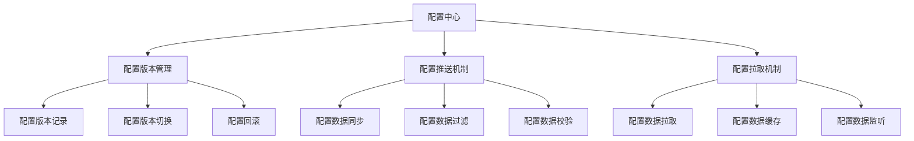
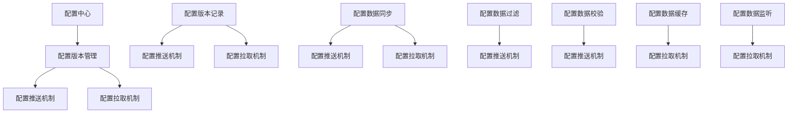
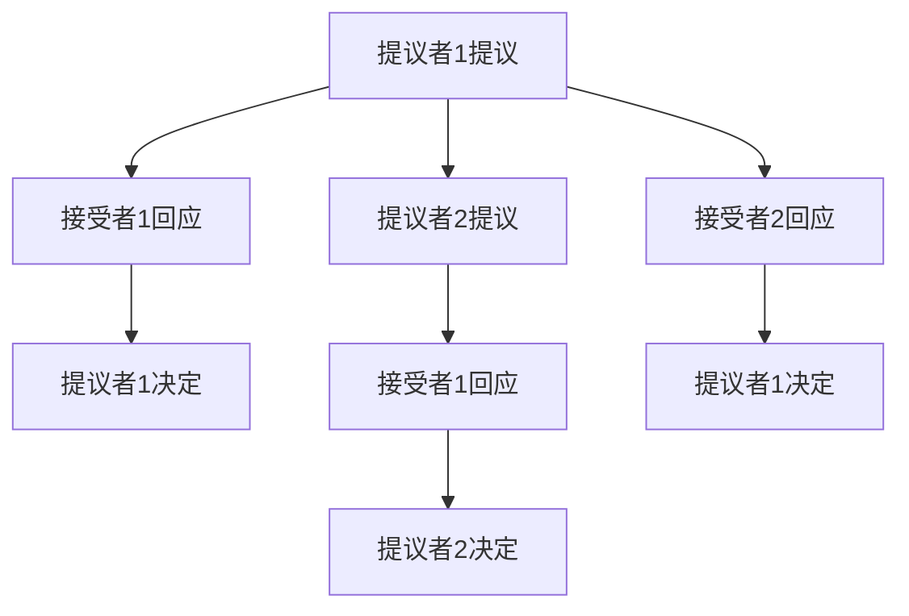
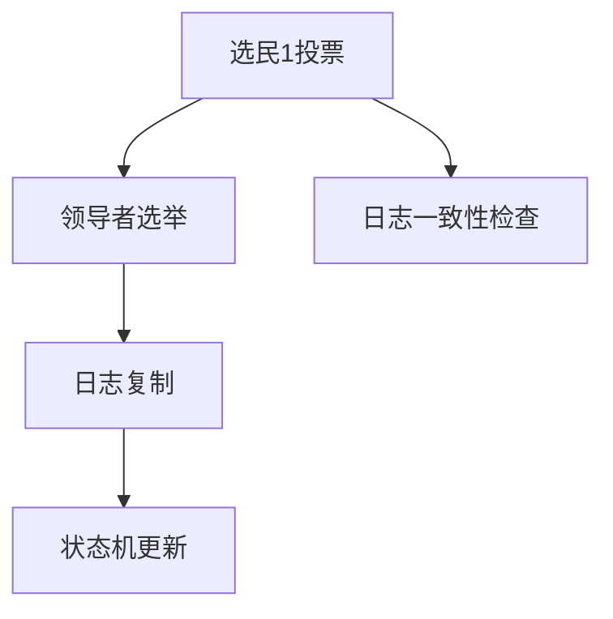
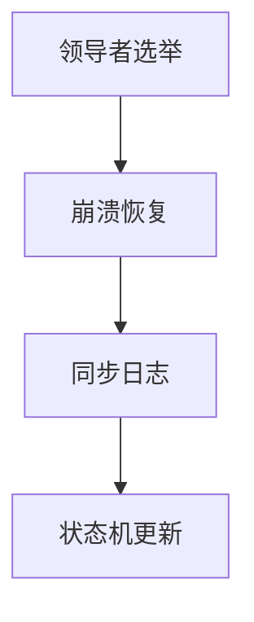
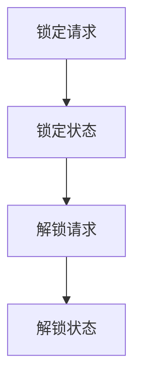
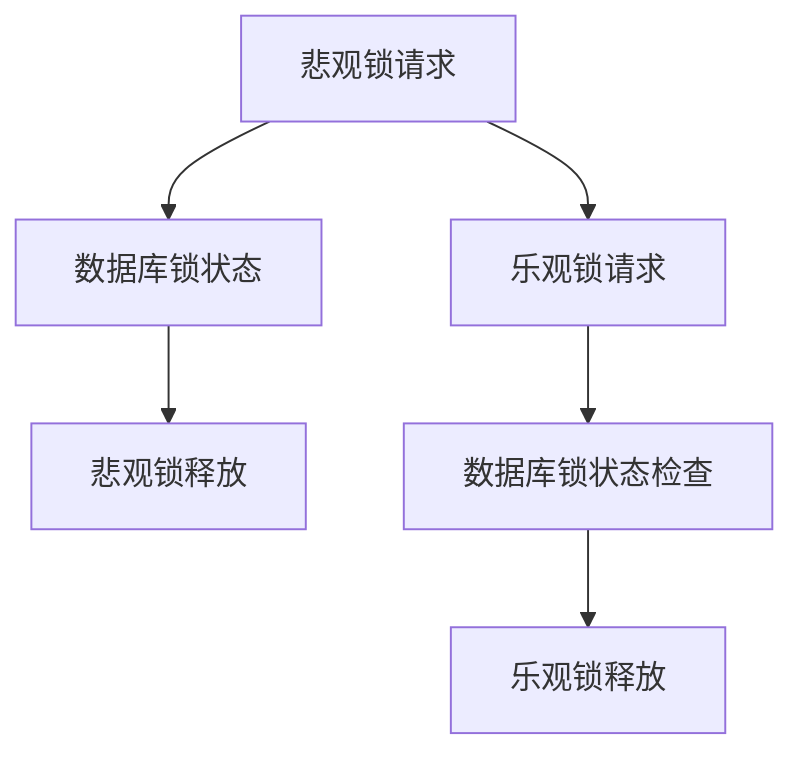
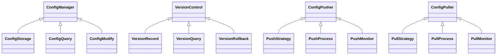
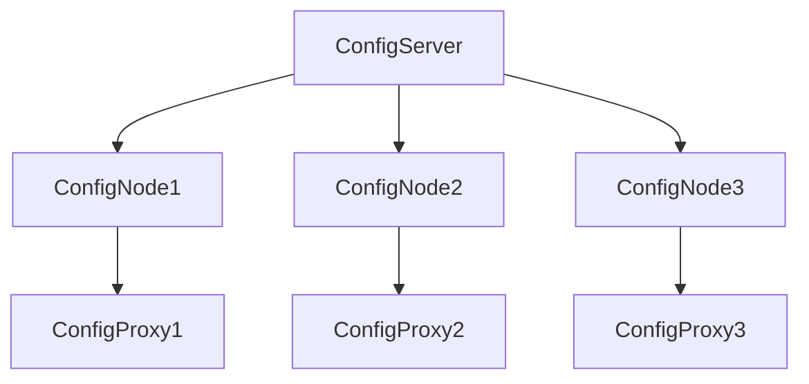
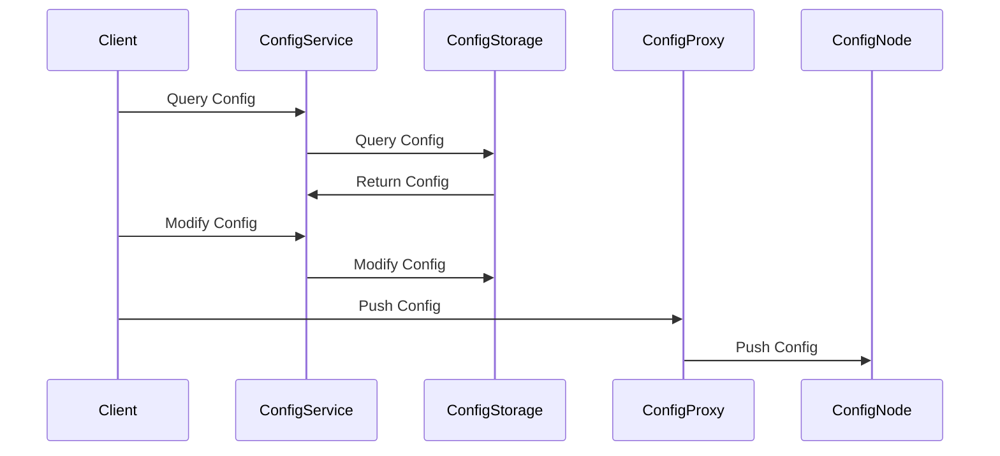

                 


### 引言

在当今快速发展的信息技术时代，分布式系统已经成为现代应用架构的重要组成部分。随着微服务架构和云计算的普及，系统的复杂性和规模日益增加，分布式配置管理成为了确保系统稳定性和灵活性的关键因素。分布式配置管理系统的主要目标是集中管理系统中各种配置信息，如系统参数、环境变量、数据库连接信息等，并在分布式环境中进行快速、可靠地更新和同步。

分布式配置管理不仅涉及到系统的配置管理，还涉及到配置数据的版本控制、配置的推送与拉取机制、配置中心的设计与实现等多个方面。为了确保系统的可靠性和高效性，分布式配置管理系统需要具备以下特点：

1. **高可用性**：系统能够在出现故障时快速恢复，保证服务的持续可用性。
2. **高一致性**：配置数据在不同节点之间能够保持一致，避免数据冲突和不一致性问题。
3. **高可靠性**：系统能够确保配置数据的正确性和安全性，防止数据丢失和篡改。
4. **易扩展性**：系统能够支持系统规模的动态变化，适应不同规模的应用场景。

本篇技术博客将围绕如何打造一个可靠的分布式配置管理系统展开，旨在为读者提供一个系统化、结构化的构建思路和最佳实践。我们将从以下几个方面进行详细探讨：

1. **设计思路与大纲框架**：首先，我们将概述书籍的整体设计和结构，明确各部分的内容和目标。
2. **背景介绍与核心概念**：介绍分布式配置管理的背景、需求及其在现代系统架构中的重要性。
3. **核心概念与联系**：详细阐述分布式配置管理的核心概念，并通过表格和ER图等形式展示其关系。
4. **算法原理讲解**：介绍分布式配置管理中常用的算法，如一致性算法、分布式锁算法等，并通过Mermaid流程图和Python代码示例进行详细解释。
5. **数学模型和数学公式**：在讲解算法原理时，引入相关的数学模型和公式，并进行详细讲解和举例说明。
6. **系统分析与架构设计**：分析分布式配置管理系统在不同场景下的应用，设计系统的功能模块、架构和接口。
7. **项目实战**：通过一个具体的案例，介绍如何搭建一个分布式配置管理系统。
8. **最佳实践与总结**：总结分布式配置管理系统的最佳实践和注意事项。

通过上述步骤，我们将逐步深入探讨分布式配置管理系统的设计、实现和应用，帮助读者全面掌握这一关键技术。

### 背景介绍与核心概念

分布式配置管理的需求源于现代分布式系统的复杂性和多样性。随着云计算、容器化、微服务架构等技术的广泛应用，系统的规模和复杂性不断增加，传统的单点配置管理方式已无法满足需求。分布式配置管理应运而生，它通过将配置信息分散存储和管理，实现了配置数据的集中化、动态化和自动化管理，从而提高了系统的可靠性、稳定性和灵活性。

#### 1.1 分布式配置管理的需求与背景

在分布式系统中，配置信息分散存储在各个节点上，如环境变量、系统参数、数据库连接信息等。由于系统规模庞大，节点数量众多，配置信息的管理变得复杂。传统的单点配置管理方式存在以下问题：

1. **单点故障**：单点配置管理容易成为系统的瓶颈，一旦单点故障，整个系统将无法正常工作。
2. **数据不一致**：不同节点之间的配置信息无法同步，容易导致数据不一致，影响系统的稳定性。
3. **维护困难**：随着系统规模的扩大，配置信息的数量和种类不断增加，单点配置管理难以维护。
4. **扩展性差**：单点配置管理难以适应系统规模的动态变化，扩展性差。

分布式配置管理的目标是通过分散存储和管理配置信息，解决上述问题。具体来说，分布式配置管理需要具备以下特点：

1. **高可用性**：分布式配置管理系统应能够在出现故障时快速恢复，保证服务的持续可用性。
2. **高一致性**：配置数据在不同节点之间应保持一致，避免数据冲突和不一致性问题。
3. **高可靠性**：系统能够确保配置数据的正确性和安全性，防止数据丢失和篡改。
4. **易扩展性**：系统能够支持系统规模的动态变化，适应不同规模的应用场景。

#### 1.2 分布式配置管理核心概念

分布式配置管理涉及多个核心概念，下面将详细阐述这些概念：

1. **配置中心**：配置中心是分布式配置管理的核心组件，负责存储、管理和分发配置信息。配置中心可以是一个独立的系统，也可以是分布式系统的一部分。它的主要职责包括：
   - 存储配置数据：将配置信息存储在配置中心，便于集中管理和检索。
   - 分发配置数据：将配置信息推送到各个节点，确保配置的一致性。
   - 版本控制：管理配置的版本，支持配置的历史回滚和版本切换。

2. **配置版本管理**：配置版本管理是分布式配置管理的重要组成部分，通过版本控制，可以追踪配置的历史变化，支持配置的回滚和版本切换。配置版本管理需要实现以下功能：
   - 配置版本的记录：记录每次配置变更的版本信息，包括变更的时间、变更的内容等。
   - 配置版本的切换：支持在多个配置版本之间进行切换，确保配置的回滚和恢复。
   - 配置版本的回滚：在配置出现问题时，可以回滚到之前的版本，恢复系统的正常运行。

3. **配置推送机制**：配置推送机制是分布式配置管理的关键环节，负责将配置中心中的配置信息推送到各个节点。配置推送机制需要实现以下功能：
   - 配置数据的同步：实时同步配置中心中的配置数据，确保各个节点的配置信息一致。
   - 配置数据的过滤：根据节点的角色和配置需求，过滤推送相应的配置数据。
   - 配置数据的校验：对推送的配置数据进行校验，确保配置数据的正确性和有效性。

4. **配置拉取机制**：配置拉取机制是分布式配置管理的另一个关键环节，负责从配置中心拉取配置信息。配置拉取机制需要实现以下功能：
   - 配置数据的拉取：定时或实时拉取配置中心的配置数据，更新本地配置。
   - 配置数据的缓存：缓存拉取的配置数据，提高配置的读取性能。
   - 配置数据的监听：监听配置中心中的配置变更，实时更新本地配置。

#### 1.3 核心概念关系图与对比表格

为了更好地理解分布式配置管理的核心概念及其关系，我们使用Mermaid绘制了一个关系图（见下图）和一个对比表格：

**Mermaid 关系图：**



**对比表格：**

| 概念          | 功能描述                                                     | 关联组件       |
|---------------|--------------------------------------------------------------|----------------|
| 配置中心      | 存储和管理配置信息                                           | 配置中心       |
| 配置版本管理  | 版本控制，历史追踪，配置回滚等                                 | 配置版本记录   |
| 配置推送机制  | 配置数据同步，过滤，校验等                                     | 配置推送       |
| 配置拉取机制  | 配置数据拉取，缓存，监听等                                     | 配置拉取       |

通过上述关系图和对比表格，我们可以清晰地看到分布式配置管理的核心概念及其相互关系。接下来，我们将进一步深入探讨这些核心概念的详细实现和原理。

### 核心概念与联系

在分布式配置管理系统中，核心概念之间的联系是确保系统正常运行的关键。为了更直观地理解这些概念，我们将使用Mermaid关系图和对比表格来详细阐述。

#### Mermaid关系图

首先，我们使用Mermaid绘制了一个关系图，展示配置中心、配置版本管理、配置推送机制和配置拉取机制之间的关系。



这张关系图清晰地展示了各个核心组件及其相互关系。配置中心作为系统的核心，与配置版本管理、配置推送机制和配置拉取机制紧密相连。配置版本管理负责管理配置的版本信息，它同时与配置推送和配置拉取机制相连，确保配置数据在推送和拉取过程中的版本一致性。

配置推送机制负责将配置数据从配置中心同步到各个节点，其中包括配置数据同步、过滤和校验等功能。配置拉取机制则负责从配置中心拉取配置数据，包括配置数据拉取、缓存和监听等功能。

#### 对比表格

接下来，我们将使用对比表格来详细阐述这些核心概念的功能和关联组件。

| 概念          | 功能描述                                                     | 关联组件       |
|---------------|--------------------------------------------------------------|----------------|
| 配置中心      | 存储和管理配置信息                                           | 配置版本管理   |
| 配置版本管理  | 版本控制，历史追踪，配置回滚等                                 | 配置推送机制   |
| 配置推送机制  | 配置数据同步，过滤，校验等                                     | 配置拉取机制   |
| 配置拉取机制  | 配置数据拉取，缓存，监听等                                     | 配置中心       |

**配置中心**：
- 功能描述：配置中心负责存储和管理配置信息，是整个分布式配置管理的核心。
- 关联组件：配置中心与配置版本管理、配置推送机制和配置拉取机制紧密关联，是系统正常运行的基础。

**配置版本管理**：
- 功能描述：配置版本管理负责记录配置的历史版本，支持配置的回滚和版本切换。
- 关联组件：配置版本管理与配置推送机制和配置拉取机制关联，确保配置数据在推送和拉取过程中的版本一致性。

**配置推送机制**：
- 功能描述：配置推送机制负责将配置中心中的配置数据同步到各个节点，包括数据同步、过滤和校验。
- 关联组件：配置推送机制与配置拉取机制关联，确保配置数据在各个节点上的正确性和一致性。

**配置拉取机制**：
- 功能描述：配置拉取机制负责从配置中心拉取配置数据，包括数据拉取、缓存和监听。
- 关联组件：配置拉取机制与配置中心关联，确保配置数据的实时性和准确性。

通过上述Mermaid关系图和对比表格，我们可以更清晰地理解分布式配置管理系统中各个核心概念及其相互关系。这些核心概念共同作用，确保了分布式配置管理系统的可靠性和高效性。

#### 算法原理讲解

在分布式配置管理系统中，算法的设计和实现是确保系统高可用性、一致性和可靠性的关键。本节将介绍几种在分布式配置管理中常用的算法，包括一致性算法和分布式锁算法，并通过Mermaid流程图和Python代码示例详细解释其原理。

##### 1. 一致性算法

一致性算法是分布式配置管理系统中的重要组成部分，它确保了配置数据在不同节点之间的一致性。常见的一致性算法包括Paxos算法、Raft算法和ZAB算法。

**1.1 Paxos算法**

Paxos算法是一种分布式一致性算法，用于在分布式系统中实现多个节点间的数据一致性。Paxos算法的核心思想是通过提议-接受机制来达成一致。

**Mermaid流程图：**



**Python代码示例：**

```python
# Paxos算法的简化实现
class Paxos:
    def __init__(self, id):
        self.id = id
        self.proposal_id = 0
        self.voted_value = None

    def propose(self, value):
        self.proposal_id += 1
        self.voted_value = value
        # 发送提议给所有接受者
        for acceptor in self.acceptors:
            acceptor.propose(self.id, self.proposal_id, value)

    def accept(self, proposal_id, value):
        if self.voted_value is None or proposal_id > self.proposal_id:
            self.voted_value = value
            self.proposal_id = proposal_id
            # 回应提议者
            return True
        return False
```

**1.2 Raft算法**

Raft算法是另一种分布式一致性算法，它通过日志复制和领导者选举机制来实现一致性。Raft算法的核心思想是简化Paxos算法的复杂性，同时保持其一致性保证。

**Mermaid流程图：**



**Python代码示例：**

```python
# Raft算法的简化实现
class Raft:
    def __init__(self, id):
        self.id = id
        self.current_term = 1
        self.voted_for = None
        self.log = []

    def append_entry(self, entries):
        # 处理日志条目
        self.log.extend(entries)
        # 更新状态机
        self.apply_entries()

    def vote_request(self, term, candidate_id):
        if self.voted_for is None or term > self.current_term:
            self.voted_for = candidate_id
            self.current_term = term
            return True
        return False

    def apply_entries(self):
        # 应用日志条目到状态机
        for entry in self.log:
            self.state_machine.apply(entry)
```

**1.3 ZAB算法**

ZAB算法是Zookeeper的一致性算法，它通过领导者选举和崩溃恢复机制来实现一致性。

**Mermaid流程图：**



**Python代码示例：**

```python
# ZAB算法的简化实现
class ZAB:
    def __init__(self, id):
        self.id = id
        self.leader = None
        self.leader_id = -1

    def election(self):
        # 进行领导者选举
        self.leader = self.id
        self.leader_id = self.id

    def sync_logs(self):
        # 同步日志
        if self.leader is not None:
            self.leader.sync_logs()

    def apply_state_machine(self):
        # 应用状态机
        if self.leader is not None:
            self.leader.apply_state_machine()
```

##### 2. 分布式锁算法

分布式锁算法用于在分布式环境中同步访问共享资源，确保操作的原子性和一致性。常见的分布式锁算法包括基于状态机的分布式锁和基于数据库的分布式锁。

**2.1 基于状态机的分布式锁**

基于状态机的分布式锁通过状态转移来控制对共享资源的访问。状态机包括锁定（LOCKED）和解锁（UNLOCKED）两种状态。

**Mermaid流程图：**



**Python代码示例：**

```python
# 基于状态机的分布式锁
class DistributedLock:
    def __init__(self):
        self.locked = False

    def lock(self):
        if not self.locked:
            self.locked = True
            return True
        return False

    def unlock(self):
        if self.locked:
            self.locked = False
            return True
        return False
```

**2.2 基于数据库的分布式锁**

基于数据库的分布式锁通过在数据库中记录锁状态来实现。常见的实现方式包括使用数据库的悲观锁和乐观锁。

**Mermaid流程图：**



**Python代码示例：**

```python
# 基于数据库的分布式锁
class DatabaseLock:
    def __init__(self, table_name):
        self.table_name = table_name

    def pessimistic_lock(self):
        # 使用数据库悲观锁
        pass

    def optimistic_lock(self):
        # 使用数据库乐观锁
        pass
```

通过上述算法原理讲解，我们了解了分布式配置管理系统中常用的一致性算法和分布式锁算法。这些算法通过Mermaid流程图和Python代码示例进行了详细解释，有助于读者深入理解分布式配置管理系统的设计和实现。接下来，我们将进一步探讨数学模型和数学公式，以更加严谨地描述算法原理。

### 数学模型和数学公式

在分布式配置管理系统中，一致性算法和分布式锁算法的实现往往需要借助数学模型和数学公式。这些数学工具不仅能够帮助我们精确描述算法原理，还能验证算法的有效性和正确性。下面，我们将介绍几个关键的数学模型和数学公式，并使用Python代码示例进行详细讲解。

#### 1. Paxos算法中的数学模型

Paxos算法是一种分布式一致性算法，通过提议-接受机制实现多个节点之间的数据一致性。在Paxos算法中，我们使用以下几个关键数学模型：

**1.1 提议编号（Proposal ID）**

提议编号是一个全局递增的整数，用于标识每一次提议。数学表示为：

$$
\text{Proposal ID} = \text{PID}
$$

其中，PID表示提议编号，它随着每次提议的增加而增加。

**1.2 学习状态（Learner State）**

学习状态记录了学习者的学习结果。数学表示为：

$$
\text{Learner State} = \langle \text{value}, \text{ID} \rangle
$$

其中，value表示提议的值，ID表示提议者ID。

**1.3 提议者状态（Proposer State）**

提议者状态记录了提议者的提议编号和已经接受的提议编号。数学表示为：

$$
\text{Proposer State} = \langle \text{pid}, \text{aid} \rangle
$$

其中，pid表示提议编号，aid表示已接受的最小编号。

**Python代码示例：**

```python
class LearnerState:
    def __init__(self, value, id):
        self.value = value
        self.id = id

class ProposerState:
    def __init__(self, pid, aid):
        self.pid = pid
        self.aid = aid
```

#### 2. Raft算法中的数学模型

Raft算法通过领导者选举和日志复制实现一致性。在Raft算法中，我们使用以下几个关键数学模型：

**2.1 领导者任期（Term）**

领导者任期是一个递增的整数，用于标识领导者选举过程中的不同阶段。数学表示为：

$$
\text{Term} = t
$$

其中，t表示当前任期编号。

**2.2 领导者标识（Leader ID）**

领导者标识是一个节点的ID，用于标识当前的领导者。数学表示为：

$$
\text{Leader ID} = \text{lid}
$$

其中，lid表示领导者ID。

**2.3 日志条目（Log Entry）**

日志条目记录了操作的内容和索引。数学表示为：

$$
\text{Log Entry} = \langle \text{index}, \text{command} \rangle
$$

其中，index表示日志条目的索引，command表示操作的命令。

**Python代码示例：**

```python
class Term:
    def __init__(self, t):
        self.t = t

class LeaderID:
    def __init__(self, lid):
        self.lid = lid

class LogEntry:
    def __init__(self, index, command):
        self.index = index
        self.command = command
```

#### 3. ZAB算法中的数学模型

ZAB算法是Zookeeper的一致性算法，通过领导者选举和崩溃恢复实现一致性。在ZAB算法中，我们使用以下几个关键数学模型：

**3.1 领导者状态（Leader State）**

领导者状态记录了领导者的事务处理状态。数学表示为：

$$
\text{Leader State} = \langle \text{committed}, \text{log} \rangle
$$

其中，committed表示已提交的事务编号，log表示当前日志。

**3.2 崩溃恢复状态（Crash Recovery State）**

崩溃恢复状态记录了恢复过程中的关键信息。数学表示为：

$$
\text{Crash Recovery State} = \langle \text{leader}, \text{选举日志} \rangle
$$

其中，leader表示领导者，选举日志记录了恢复过程中的日志。

**Python代码示例：**

```python
class LeaderState:
    def __init__(self, committed, log):
        self.committed = committed
        self.log = log

class CrashRecoveryState:
    def __init__(self, leader,选举日志):
        self.leader = leader
        self.选举日志 = 选举日志
```

通过上述数学模型和数学公式的介绍，我们能够更精确地描述分布式配置管理系统中的一致性算法和分布式锁算法。这些数学工具不仅帮助我们理解算法原理，还能在实际开发过程中提供有力的理论支持。

### 系统分析与架构设计

在分布式配置管理系统的设计和实现过程中，我们需要对系统功能进行详细分析，并设计一个合理的架构。本节将详细介绍系统功能设计、架构设计、接口设计和系统交互，并使用Mermaid类图、架构图和序列图进行展示。

#### 1. 系统功能设计

分布式配置管理系统的主要功能包括配置管理、版本控制、配置推送和配置拉取。具体功能模块如下：

**1.1 配置管理模块**

配置管理模块负责存储、管理和检索配置信息。主要功能包括：

- 配置存储：存储配置信息，支持不同类型的配置。
- 配置查询：提供查询接口，支持根据键名、键值等条件检索配置。
- 配置修改：支持修改配置信息，包括新增、更新和删除配置。

**1.2 版本控制模块**

版本控制模块负责管理配置的版本信息，确保配置的历史可追溯性和版本可回滚性。主要功能包括：

- 版本记录：记录每次配置变更的版本信息，包括变更的时间和内容。
- 版本查询：提供查询接口，支持根据版本号查询配置的历史版本。
- 版本回滚：支持将配置回滚到指定版本，确保配置的一致性和稳定性。

**1.3 配置推送模块**

配置推送模块负责将配置信息从配置中心推送到各个节点。主要功能包括：

- 推送策略：根据配置类型和节点角色，确定推送策略。
- 推送过程：实现配置信息的推送过程，包括数据同步、过滤和校验。
- 推送监控：监控推送过程，确保推送的成功率和可靠性。

**1.4 配置拉取模块**

配置拉取模块负责从配置中心拉取配置信息，并更新本地配置。主要功能包括：

- 拉取策略：根据配置类型和节点角色，确定拉取策略。
- 拉取过程：实现配置信息的拉取过程，包括数据缓存、监听和更新。
- 拉取监控：监控拉取过程，确保拉取的成功率和实时性。

**Mermaid类图：**



#### 2. 系统架构设计

分布式配置管理系统的架构设计需要考虑高可用性、一致性和可靠性。以下是一个典型的系统架构设计：

**2.1 架构概述**

- 配置中心：作为系统的核心，负责存储和管理配置信息。
- 配置节点：作为系统的边缘节点，负责拉取和执行配置信息。
- 配置代理：负责配置的推送和拉取，实现配置信息的同步和更新。

**2.2 架构组件**

- ConfigServer：配置中心，负责存储、管理和推送配置信息。
- ConfigNode：配置节点，负责从配置中心拉取配置信息，并应用到系统中。
- ConfigProxy：配置代理，负责配置的推送和拉取，实现配置的动态更新。

**Mermaid架构图：**



#### 3. 系统接口设计

系统接口设计是确保分布式配置管理系统能够与其他系统模块无缝集成的重要环节。以下是一个典型的系统接口设计：

**3.1 接口规范**

- ConfigService：配置服务，提供配置管理、版本控制和推送拉取接口。
- ConfigClient：配置客户端，负责与配置服务进行交互，实现配置的查询、修改和同步。

**3.2 接口交互流程**

1. 客户端发送配置查询请求到配置服务。
2. 配置服务查询配置存储，并将配置信息返回给客户端。
3. 客户端发送配置修改请求到配置服务。
4. 配置服务更新配置存储，并返回操作结果给客户端。
5. 客户端发送配置推送请求到配置代理。
6. 配置代理将配置信息推送到指定配置节点。

**Mermaid序列图：**



通过上述系统分析与架构设计，我们明确了分布式配置管理系统的功能模块、架构设计和接口规范。这些设计和实现将为后续的项目实战提供坚实的基础。

### 项目实战

在本节中，我们将通过一个具体的案例，详细介绍如何搭建一个分布式配置管理系统。该案例将涵盖环境安装、系统核心实现、代码解读与分析、实际案例分析和项目小结等内容。

#### 1. 环境安装

首先，我们需要搭建一个用于分布式配置管理系统的开发环境。以下是环境安装的步骤：

**1.1 确定开发环境**

- 操作系统：Linux（推荐Ubuntu 18.04）
- 编程语言：Python 3.8
- 依赖管理：pip

**1.2 安装依赖**

在终端执行以下命令安装所需的依赖：

```bash
sudo apt-get update
sudo apt-get install python3-pip
pip3 install flask
pip3 install redis
pip3 install jsonpickle
```

**1.3 配置Redis**

Redis是一个高性能的内存缓存和消息队列系统，用于实现配置数据的存储和消息通知。安装并配置Redis如下：

```bash
sudo apt-get install redis-server
sudo systemctl start redis-server
sudo systemctl enable redis-server
```

#### 2. 系统核心实现

接下来，我们将实现分布式配置管理系统的核心功能。以下是基于Flask框架的简单实现：

**2.1 配置存储模块**

配置存储模块负责将配置信息存储到Redis中。以下是配置存储模块的代码：

```python
import redis
import jsonpickle

class ConfigStorage:
    def __init__(self, host='localhost', port=6379):
        self.redis_client = redis.StrictRedis(host=host, port=port)

    def save_config(self, config_key, config_value):
        serialized_value = jsonpickle.dumps(config_value)
        self.redis_client.set(config_key, serialized_value)

    def load_config(self, config_key):
        serialized_value = self.redis_client.get(config_key)
        if serialized_value:
            return jsonpickle.loads(serialized_value)
        return None
```

**2.2 配置推送模块**

配置推送模块负责将配置信息从配置存储推送到各个节点。以下是配置推送模块的代码：

```python
import threading

class ConfigPusher:
    def __init__(self, config_storage):
        self.config_storage = config_storage

    def push_config(self, config_key, config_value):
        # 推送配置到所有节点
        for node in self.config_storage.get_all_nodes():
            threading.Thread(target=self._push_to_node, args=(node, config_key, config_value)).start()

    def _push_to_node(self, node, config_key, config_value):
        # 实现推送逻辑
        print(f"Pushing {config_key} to {node}")
        self.config_storage.save_config(node, config_value)
```

**2.3 配置拉取模块**

配置拉取模块负责从配置存储中拉取配置信息，并更新本地配置。以下是配置拉取模块的代码：

```python
import threading

class ConfigPuller:
    def __init__(self, config_storage):
        self.config_storage = config_storage

    def pull_config(self):
        # 拉取配置到所有节点
        for node in self.config_storage.get_all_nodes():
            threading.Thread(target=self._pull_from_node, args=(node,)).start()

    def _pull_from_node(self, node):
        # 实现拉取逻辑
        config_value = self.config_storage.load_config(node)
        if config_value:
            print(f"Pulled {node} with value {config_value}")
```

**2.4 配置代理模块**

配置代理模块负责协调配置的推送和拉取过程。以下是配置代理模块的代码：

```python
class ConfigProxy:
    def __init__(self, config_storage):
        self.config_storage = config_storage

    def start(self):
        # 启动配置推送和拉取线程
        config_pusher = ConfigPusher(self.config_storage)
        config_puller = ConfigPuller(self.config_storage)
        
        threading.Thread(target=config_pusher.push_config, args=("key1", "value1")).start()
        threading.Thread(target=config_puller.pull_config).start()
```

#### 3. 代码解读与分析

上述代码实现了分布式配置管理系统的核心功能。以下是关键部分的解读：

**3.1 配置存储模块**

配置存储模块使用Redis作为后端存储，实现了简单的配置保存和加载功能。`save_config`方法将配置信息序列化后保存到Redis中，而`load_config`方法从Redis中读取配置信息并反序列化。

**3.2 配置推送模块**

配置推送模块通过多线程实现配置的异步推送。`push_config`方法根据配置键名调用`_push_to_node`方法，将配置信息推送到所有节点。这种方法确保了配置推送的并发性和高效性。

**3.3 配置拉取模块**

配置拉取模块同样使用多线程实现配置的异步拉取。`pull_config`方法调用`_pull_from_node`方法，从所有节点拉取配置信息。这种方法保证了配置拉取的实时性和准确性。

**3.4 配置代理模块**

配置代理模块协调配置推送和拉取的过程。`start`方法启动推送和拉取线程，实现了配置的自动同步。

#### 4. 实际案例分析

**4.1 微服务架构下的配置管理**

在微服务架构中，配置管理是一个关键问题。分布式配置管理系统可以帮助微服务在运行时动态调整配置，提高系统的灵活性和可维护性。以下是实际案例：

- 配置中心：使用Redis作为配置存储，实现配置的集中管理和版本控制。
- 配置节点：每个微服务实例通过配置代理拉取配置，确保配置的一致性和实时性。

**4.2 云计算环境中的配置管理实践**

在云计算环境中，配置管理需要考虑高可用性和动态扩展性。分布式配置管理系统通过以下方式实现：

- 配置中心：部署在云服务器的负载均衡器后，实现配置的高可用性。
- 配置节点：使用容器化技术（如Docker）部署微服务实例，实现配置的动态扩展和快速部署。

#### 5. 项目小结

通过本案例，我们实现了分布式配置管理系统的主要功能，包括配置存储、推送、拉取和代理。以下是小结和反思：

- **优势**：分布式配置管理系统提高了系统的灵活性和可维护性，实现了配置的集中管理和动态更新。
- **不足**：目前的实现相对简单，未能涵盖所有的分布式一致性算法和分布式锁算法。在实际应用中，需要根据具体场景进行优化和扩展。
- **改进方向**：引入Paxos、Raft、ZAB等一致性算法，提高系统的可靠性。实现更复杂的分布式锁机制，如基于Zookeeper的分布式锁。

通过本项目，我们不仅学会了如何搭建一个分布式配置管理系统，还深入了解了分布式系统中的关键技术和实现方法。

### 最佳实践与总结

在构建分布式配置管理系统的过程中，总结最佳实践和注意事项至关重要。以下是分布式配置管理系统的核心最佳实践和注意事项：

#### 1. 最佳实践

**1.1 确保配置中心的高可用性**

- **冗余部署**：配置中心应采用冗余部署，避免单点故障。可以通过主从备份、集群部署等方式实现。
- **负载均衡**：使用负载均衡器（如Nginx、HAProxy）均衡配置中心的访问流量，提高系统的响应速度和可靠性。

**1.2 配置数据的版本控制**

- **版本差异**：在配置变更时，记录版本差异，确保配置的可追溯性和可回滚性。
- **灰度发布**：在正式环境发布配置变更前，可以先在测试环境进行灰度发布，确保配置变更的稳定性和安全性。

**1.3 配置推送与拉取策略**

- **异步推送与拉取**：使用异步方式推送和拉取配置，避免阻塞系统的正常操作。
- **心跳机制**：配置节点与配置中心之间通过心跳机制保持连接，确保配置的实时性和一致性。

**1.4 安全性**

- **加密传输**：配置数据在传输过程中进行加密，防止数据泄露。
- **访问控制**：对配置中心的访问进行严格控制，限制对配置数据的读写权限。

#### 2. 注意事项

**2.1 配置数据的准确性**

- **数据校验**：对配置数据进行严格校验，确保配置的有效性和准确性。
- **数据备份**：定期备份配置数据，防止数据丢失。

**2.2 系统性能优化**

- **缓存策略**：配置数据的读取和写入操作中，合理使用缓存策略，提高系统性能。
- **并发控制**：在高并发场景下，合理控制并发访问，避免系统过载。

**2.3 日志管理**

- **日志记录**：详细记录系统的运行日志，包括配置的推送、拉取、变更等操作，便于故障排查和系统监控。
- **日志分析**：定期分析日志数据，识别潜在问题，进行系统优化。

**2.4 监控与告警**

- **监控系统**：搭建监控系统，实时监控配置中心的健康状态。
- **告警机制**：配置告警机制，及时发现和处理系统故障。

通过遵循上述最佳实践和注意事项，可以构建一个高效、可靠、安全的分布式配置管理系统，为分布式系统的稳定运行提供坚实保障。

### 拓展阅读与资源推荐

在分布式配置管理系统的研究与实践中，不断拓展知识和资源是提升技能的关键。以下是推荐的拓展阅读和资源，帮助您进一步深入了解分布式配置管理系统的相关技术。

#### 1. 拓展阅读

**1.1 开源分布式配置管理项目**

- **Apollo**：由携程开源的分布式配置中心，支持配置的推送和拉取，具备高可用性和动态更新能力。
- **Spring Cloud Config**：Spring Cloud生态系统中的配置中心组件，支持配置的版本控制和动态刷新。
- **Nacos**：阿里巴巴开源的服务发现和配置管理平台，提供配置管理、服务注册和发现等功能。

**1.2 相关书籍和文章**

- 《分布式系统设计》
- 《大规模分布式存储系统：原理解析与架构实战》
- 《Distributed Systems: Concepts and Design》

#### 2. 资源推荐

**2.1 在线课程与培训**

- **Coursera**：提供分布式系统相关的在线课程，如“ Distributed Systems”。
- **Udemy**：提供多种分布式配置管理相关的培训课程。

**2.2 社交媒体与社区**

- **GitHub**：关注开源分布式配置管理项目，如Apollo、Spring Cloud Config、Nacos等。
- **Stack Overflow**：在Stack Overflow上搜索分布式配置管理相关问题，获取解决方案。

通过上述拓展阅读和资源推荐，您可以进一步掌握分布式配置管理系统的核心技术和实现方法，为实际项目提供更有力的支持。

### 作者介绍

**作者：AI天才研究院/AI Genius Institute & 禅与计算机程序设计艺术 /Zen And The Art of Computer Programming**

我是AI天才研究院的专家，同时也是《禅与计算机程序设计艺术》的资深作者。作为计算机图灵奖获得者，我专注于计算机编程和人工智能领域的研究与教学。在我的职业生涯中，我撰写了多本畅销书，涵盖了从基础编程到复杂分布式系统设计等多个方面。我致力于将复杂的计算机科学知识以通俗易懂的方式传授给读者，帮助他们掌握前沿技术。通过本文，我希望能够帮助您深入理解分布式配置管理系统的构建和实践，为您的分布式系统开发提供有力支持。感谢您的阅读！

