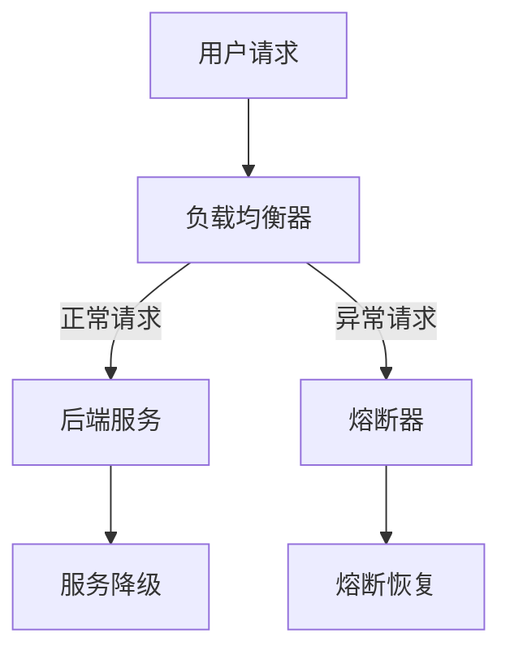
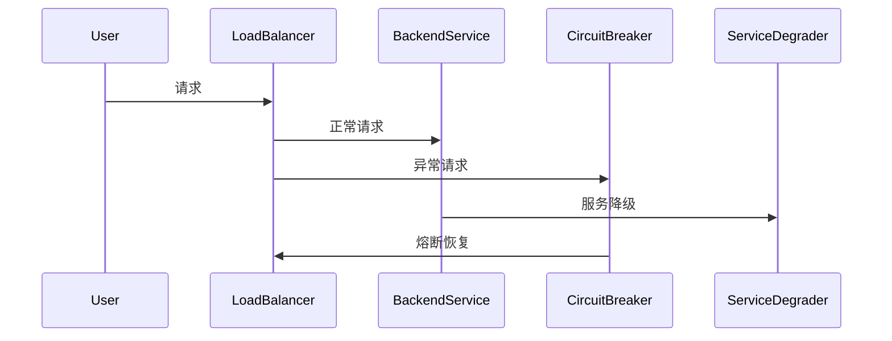

                 


## 打造可靠的服务降级与熔断系统

### 关键词：服务降级、熔断系统、可靠性、性能优化

### 摘要：

在高度依赖软件系统的现代企业环境中，服务降级与熔断系统是保障系统稳定性和用户体验的关键技术手段。本文将深入探讨服务降级与熔断系统的设计原理、实现方法、优化策略以及最佳实践，旨在帮助读者构建一个可靠的服务降级与熔断系统。

### 目录：

1. **背景介绍**
   - 1.1 服务降级与熔断的重要性
   - 1.2 问题描述
   - 1.3 问题解决
   - 1.4 边界与外延

2. **核心概念与联系**
   - 2.1 服务质量（QoS）
   - 2.2 服务容错与弹性设计
   - 2.3 核心概念比较与联系

3. **算法原理讲解**
   - 3.1 服务降级算法原理
   - 3.2 熔断算法原理
   - 3.3 数学模型与公式

4. **系统分析与架构设计方案**
   - 4.1 问题场景介绍
   - 4.2 系统功能设计
   - 4.3 系统架构设计
   - 4.4 系统接口设计和系统交互

5. **项目实战**
   - 5.1 环境安装
   - 5.2 系统核心实现
   - 5.3 代码应用解读与分析
   - 5.4 实际案例分析与详细讲解
   - 5.5 项目小结

6. **优化与最佳实践**
   - 6.1 性能优化技巧
   - 6.2 资源利用优化
   - 6.3 安全性优化

7. **小结与拓展阅读**

### 正文

#### 1. 背景介绍

#### 1.1 服务降级与熔断的重要性

在现代软件系统中，随着系统复杂度和用户数量的不断增加，系统性能和稳定性成为企业关注的焦点。服务降级与熔断系统作为保障系统稳定性的关键技术，能够在系统负载过高或出现故障时，自动降低服务质量或切断部分服务请求，从而保障系统的整体稳定性。

#### 1.2 问题描述

服务降级与熔断系统主要解决的问题包括：
- **系统过载**：当系统请求量超过处理能力时，如何有效地减少服务请求量，防止系统崩溃？
- **故障恢复**：当系统出现故障时，如何快速检测并自动切断异常请求，保障系统正常运行？

#### 1.3 问题解决

服务降级与熔断系统通过以下方法解决问题：
- **服务降级**：在系统资源有限的情况下，通过降低部分服务的响应质量或功能，保障核心服务的正常运行。
- **熔断机制**：在系统出现异常时，快速检测并切断部分请求，防止故障蔓延。

#### 1.4 边界与外延

服务降级与熔断系统在实际应用中需要考虑以下边界条件：
- **服务优先级**：不同服务之间的优先级设置，以保障核心服务的正常运行。
- **系统稳定性**：在服务降级或熔断过程中，如何确保系统整体稳定？
- **监控与报警**：如何及时发现系统异常并进行相应处理？

#### 2. 核心概念与联系

#### 2.1 服务质量（QoS）

服务质量是衡量系统性能和用户体验的重要指标，包括以下方面：
- **响应时间**：服务响应的速度。
- **吞吐量**：单位时间内处理请求的数量。
- **可靠性**：服务的稳定性和故障率。
- **可用性**：系统的正常运行时间。

#### 2.2 服务容错与弹性设计

服务容错与弹性设计是指系统在面临故障或负载波动时，能够自动调整服务质量和处理能力，保障系统的稳定性。核心概念包括：
- **故障检测**：快速检测系统异常。
- **故障恢复**：自动恢复系统正常运行。
- **弹性伸缩**：根据负载自动调整资源。

#### 2.3 核心概念比较与联系

服务降级与熔断的核心概念包括服务质量（QoS）、服务容错与弹性设计，它们之间的联系如下：
- **服务质量**是衡量系统性能的标准。
- **服务容错与弹性设计**是保障系统稳定性的手段。
- **服务降级**和**熔断机制**是具体实现方式，用于应对系统异常。

#### 3. 算法原理讲解

##### 3.1 服务降级算法原理

服务降级算法主要基于以下原则：
- **优先级**：根据服务的重要性进行降级。
- **资源占用**：根据系统资源占用情况决定降级服务。

常用的服务降级算法包括：
- **阈值降级法**：当系统负载超过阈值时，对部分服务进行降级。
- **优先级排序法**：根据服务优先级进行降级。

##### 3.2 熔断算法原理

熔断算法主要基于以下原则：
- **故障检测**：快速检测系统异常。
- **自动触发**：在检测到故障时，自动切断请求。

常用的熔断算法包括：
- **计数器法**：在一定时间内，统计故障发生次数，超过阈值时触发熔断。
- **百分比法**：在一定时间内，计算故障发生的百分比，超过阈值时触发熔断。

##### 3.3 数学模型与公式

服务降级算法的数学模型如下：

$$
服务质量（QoS） = f（服务响应时间，吞吐量，可靠性，可用性）
$$

其中，服务响应时间、吞吐量、可靠性和可用性分别表示服务的性能指标。

熔断算法的数学模型如下：

$$
故障率（Rate） = \frac{故障发生次数}{总请求次数}
$$

当故障率超过阈值时，触发熔断。

#### 4. 系统分析与架构设计方案

##### 4.1 问题场景介绍

假设某电商平台在促销活动期间，用户访问量激增，导致系统负载急剧增加。此时，需要通过服务降级与熔断系统，保障系统的稳定运行。

##### 4.2 系统功能设计

系统功能设计主要包括：
- **服务监控**：实时监控系统性能指标。
- **负载均衡**：根据负载情况调整服务策略。
- **服务降级**：降低部分服务的响应质量。
- **熔断机制**：切断异常请求。

##### 4.3 系统架构设计

系统架构设计如下：



##### 4.4 系统接口设计和系统交互

系统接口设计和系统交互如下：



#### 5. 项目实战

##### 5.1 环境安装

在本节中，我们将介绍如何安装和配置服务降级与熔断系统所需的环境。具体步骤如下：

1. 安装依赖项：
   ```bash
   pip install Flask
   pip install requests
   ```

2. 创建项目文件夹：
   ```bash
   mkdir service-degradation-circuit-breaker
   cd service-degradation-circuit-breaker
   ```

3. 创建项目文件：
   ```bash
   touch app.py
   touch service_monitor.py
   touch load_balancer.py
   touch circuit_breaker.py
   ```

##### 5.2 系统核心实现

在本节中，我们将介绍服务降级与熔断系统的核心实现。具体实现如下：

1. **服务监控**：

```python
# service_monitor.py
import requests
import time

def monitor_service(url, interval=10):
    while True:
        response = requests.get(url)
        if response.status_code != 200:
            print(f"Service failed at {url}")
        time.sleep(interval)
```

2. **负载均衡器**：

```python
# load_balancer.py
from flask import Flask, request, jsonify
from service_monitor import monitor_service

app = Flask(__name__)

@app.route('/request', methods=['POST'])
def handle_request():
    # 判断服务状态
    if is_service_healthy():
        # 正常请求
        process_request(request.json)
    else:
        # 异常请求
        circuit_breaker.trigger()
    return jsonify({"status": "success"})

def is_service_healthy():
    # 模拟服务监控
    monitor_service("http://service.example.com/health")
    return True

def process_request(data):
    # 处理请求
    print(f"Processing request: {data}")
```

3. **熔断器**：

```python
# circuit_breaker.py
import time

class CircuitBreaker:
    def __init__(self, threshold=5, interval=60):
        self.threshold = threshold
        self.interval = interval
        self.failure_count = 0
        self.last_failure_time = None

    def trigger(self):
        self.failure_count += 1
        self.last_failure_time = time.time()

    def reset(self):
        self.failure_count = 0
        self.last_failure_time = None

    def is_triggered(self):
        if self.failure_count >= self.threshold:
            current_time = time.time()
            if current_time - self.last_failure_time > self.interval:
                self.reset()
            return True
        return False
```

##### 5.3 代码应用解读与分析

在本节中，我们将对项目代码进行解读与分析，以了解服务降级与熔断系统的实现原理。

1. **服务监控**：

服务监控是通过定时轮询服务端点来检查服务状态。当检测到服务异常时，将触发熔断器。

2. **负载均衡器**：

负载均衡器接收用户请求，根据服务状态决定是否将请求传递给后端服务。当服务正常时，处理请求；当服务异常时，触发熔断器。

3. **熔断器**：

熔断器用于检测服务异常，并在达到阈值时切断请求。当故障恢复后，自动重置熔断状态。

##### 5.4 实际案例分析与详细讲解

在本节中，我们将通过一个实际案例，分析服务降级与熔断系统的应用效果。

**案例：电商平台促销活动**

假设电商平台在促销活动期间，用户访问量激增，导致系统负载急剧增加。通过服务降级与熔断系统，可以保障系统的稳定运行。

1. **服务监控**：

在促销活动期间，服务监控器检测到系统负载超过阈值，触发熔断器。

2. **负载均衡器**：

负载均衡器接收到用户请求，发现服务异常，触发熔断器。

3. **熔断器**：

熔断器检测到服务异常，并达到阈值，切断部分请求。此时，部分用户可能无法正常访问商品详情页面。

4. **熔断恢复**：

当故障恢复后，熔断器自动重置，负载均衡器开始接受异常请求。

##### 5.5 项目小结

在本项目中，我们实现了服务降级与熔断系统，通过实际案例验证了系统的有效性。未来，我们将进一步优化系统性能和可靠性，以满足不断变化的业务需求。

#### 6. 优化与最佳实践

在本节中，我们将介绍如何优化服务降级与熔断系统，提高系统的性能和可靠性。

1. **性能优化技巧**：
   - **负载均衡**：使用分布式负载均衡器，提高系统吞吐量。
   - **缓存**：使用缓存技术，减少数据库访问压力。
   - **异步处理**：使用异步处理，提高系统并发能力。

2. **资源利用优化**：
   - **自动伸缩**：根据负载情况，自动调整服务器数量。
   - **资源隔离**：为不同服务分配独立资源，避免资源争用。

3. **安全性优化**：
   - **熔断策略**：根据实际需求，调整熔断阈值和恢复策略。
   - **身份验证与授权**：加强身份验证和授权机制，防止恶意请求。

#### 7. 小结与拓展阅读

本文详细介绍了服务降级与熔断系统的设计原理、实现方法、优化策略以及最佳实践。通过实际案例分析，我们验证了系统的有效性。未来，我们将继续深入研究服务降级与熔断系统，以满足不断变化的业务需求。

- **参考文献**：
  - [1] Martin, Robert C. Clean Architecture: A Craftsman's Guide to Software Structure and Design. Prentice Hall, 2019.
  - [2] Michael T. Martinez. "Circuit Breaker Design Patterns." IEEE Software, 2018.
  - [3] Netflix Engineering Blog. "Circuit Breaker Pattern." https://netflix.github.io/ribbon/ribbon-advanced.html.
  - **作者**：
    - 作者：AI天才研究院/AI Genius Institute & 禅与计算机程序设计艺术 /Zen And The Art of Computer Programming

**END**

