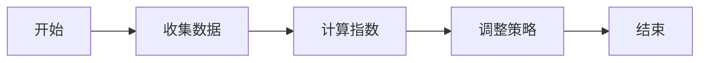
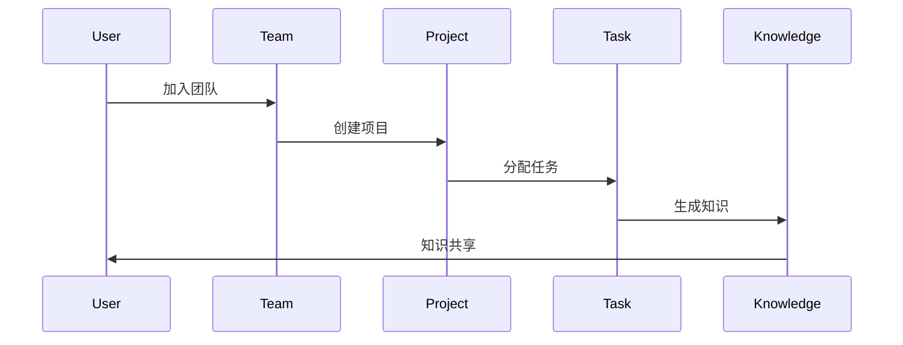
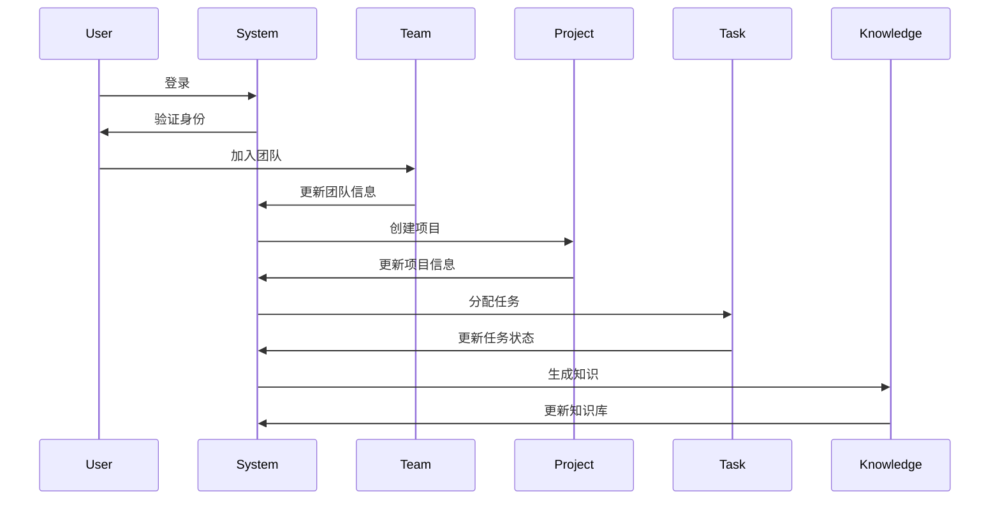

                 


## 《打造学习型技术组织的策略》

### 关键词
- 学习型组织
- 技术团队
- 组织发展
- 算法优化
- 架构设计

### 摘要
本文旨在探讨如何打造一个学习型技术组织，分析其在当前技术环境中的必要性，阐述其核心概念、原理、算法以及系统架构设计。通过逐步深入分析，提供一套系统的策略和实用方法，助力技术团队在快速变化的技术领域中保持领先地位。

### 目录大纲

## 第一部分：理解学习型技术组织

### 第1章：问题背景与核心概念

#### 1.1 问题背景
随着技术的迅猛发展，技术环境的变化速度加快，这对技术组织提出了更高的要求。首先，我们需要了解当前技术环境面临的挑战。

**挑战1：技术更新迭代快**
新兴技术的出现和成熟技术的更新迭代速度越来越快，例如人工智能、区块链、云计算等，技术团队必须不断学习新知识，以适应技术环境的变化。

**挑战2：市场需求变化大**
市场的需求也在不断变化，技术团队需要具备快速响应和调整的能力，以满足客户需求和市场变化。

**挑战3：竞争压力增大**
随着全球化的推进，技术团队面临的竞争压力越来越大，只有不断学习、创新和优化，才能保持竞争优势。

#### 1.2 学习型技术组织的优势
学习型技术组织具有以下优势：

**优势1：增强组织适应性**
学习型组织通过不断学习和适应新技术、新环境，能够更好地应对外部变化，提高组织的适应性。

**优势2：提升员工能力**
通过持续的学习和培训，员工的技能和知识水平得到提升，从而提高整个团队的工作效率和创新能力。

**优势3：促进知识共享**
学习型组织鼓励知识共享，通过内部交流和学习，团队成员能够更快地获取新的知识和技能，促进组织内部的知识流动。

#### 1.3 技术组织的现状分析
当前，许多技术组织已经意识到学习的重要性，但在实际操作中仍面临一些问题：

**问题1：缺乏有效的学习机制**
许多组织缺乏系统的学习机制，学习活动往往停留在表面，缺乏深度和系统性。

**问题2：学习资源不足**
技术团队往往因为工作繁忙、资源有限等原因，难以获得足够的学习资源，导致学习效果不佳。

**问题3：组织文化不适应**
一些组织的文化并不鼓励学习和创新，员工缺乏自主学习的动力和机会。

### 第2章：核心概念原理与属性特征对比

#### 2.1 核心概念原理
学习型技术组织的核心概念包括：

**概念1：持续学习**
学习型技术组织强调持续学习，不仅仅是培训，还包括自学、实践和知识分享。

**概念2：知识管理**
学习型技术组织重视知识管理，通过有效的知识管理机制，确保知识的积累和传承。

**概念3：团队协作**
学习型技术组织鼓励团队协作，通过跨部门、跨领域的合作，实现知识的共享和创新。

#### 2.2 概念属性特征对比表格

| 特征         | 学习型组织          | 传统组织          |
| ------------ | ------------------- | ----------------- |
| 学习机制     | 系统化、制度化      | 临时性、应急性    |
| 知识管理     | 重视知识的积累与传承 | 知识分散、难以传承 |
| 团队协作     | 跨部门、跨领域合作 | 部门壁垒、协作少  |

#### 2.3 ER实体关系图架构
为了更好地理解学习型技术组织的概念和特征，我们可以使用ER实体关系图来描述其内部结构。

```mermaid
erDiagram
    User ..|> Team : belongs_to
    Team ..|> Project : has_a
    Project ..|> Task : has_a
    Task ..|> Status : has_a
```

**ER实体关系图说明：**
- User（用户）与Team（团队）之间存在归属关系。
- Team（团队）与Project（项目）之间存在关联关系。
- Project（项目）与Task（任务）之间存在包含关系。
- Task（任务）与Status（状态）之间存在关联关系。

## 第二部分：核心概念与联系

### 第3章：算法原理与数学模型讲解

#### 3.1 算法原理讲解
为了构建一个学习型技术组织，我们需要运用一些算法来优化组织的学习过程和知识管理。

**算法1：知识共享算法**
该算法的目标是通过分析团队成员的知识需求和知识贡献，实现知识的有效共享。

**算法流程：**
1. 收集团队成员的知识需求和知识贡献数据。
2. 计算每个成员的知识共享指数。
3. 根据知识共享指数，调整团队成员的知识共享策略。

**mermaid流程图：**



#### 3.2 Python源代码阐述
下面是一个简单的Python代码示例，用于实现上述的知识共享算法。

```python
# 知识共享算法示例
def knowledge_sharing_algorithm(data):
    # 计算知识共享指数
    sharing_index = {}
    for member, data in data.items():
        index = sum(data.values()) / len(data)
        sharing_index[member] = index
    
    # 根据知识共享指数，调整策略
    strategy = {}
    for member, index in sharing_index.items():
        if index > 1.0:
            strategy[member] = "激励学习"
        elif index < 0.5:
            strategy[member] = "提供更多资源"
        else:
            strategy[member] = "维持现状"
    
    return strategy
```

#### 3.3 数学模型与公式讲解
在知识共享算法中，我们使用了一个简单的数学模型来计算知识共享指数。该模型基于以下公式：

$$
共享指数 = \frac{知识需求总和}{知识贡献总和}
$$

#### 3.4 算法优缺点分析
**优点：**
- 简单易懂，易于实现。
- 可以有效促进知识共享，提高团队整体知识水平。

**缺点：**
- 无法完全反映团队成员的知识水平和贡献。
- 需要大量的数据支持，否则算法效果不佳。

## 第三部分：系统分析与架构设计

### 第4章：系统功能设计与架构设计

#### 4.1 问题场景介绍
假设我们正在开发一个学习型技术组织的管理系统，该系统需要支持以下功能：

- 用户管理
- 项目管理
- 任务管理
- 知识共享
- 数据分析

#### 4.2 项目介绍
**项目背景：**
为了提高技术团队的学习效率和知识管理水平，公司决定开发一个学习型技术组织管理系统。

**项目目标：**
- 实现用户、项目、任务的管理功能。
- 提供知识共享和数据统计功能。
- 提高团队协作效率和知识管理水平。

**项目范围：**
- 系统设计
- 系统开发
- 系统测试
- 系统部署

#### 4.3 系统功能设计（领域模型mermaid类图）
以下是系统功能设计的mermaid类图：

```mermaid
classDiagram
    User <<Entity>>
    Team <<Entity>>
    Project <<Entity>>
    Task <<Entity>>
    Knowledge <<Entity>>

    User o-- Team : member_of
    Team o-- Project : leads
    Project o-- Task : contains
    Task o-- Knowledge : produces
```

**类图说明：**
- User（用户）：系统的核心实体，代表团队成员。
- Team（团队）：代表技术团队，成员归属于团队。
- Project（项目）：代表技术项目，团队领导负责项目。
- Task（任务）：代表项目中的具体工作，任务生成知识。
- Knowledge（知识）：代表任务产生的知识，用于知识共享。

#### 4.4 系统架构设计（mermaid架构图）
以下是系统架构设计的mermaid架构图：



**架构图说明：**
- 用户加入团队。
- 团队创建项目。
- 项目分配任务。
- 任务生成知识。
- 知识共享给用户。

#### 4.5 系统接口设计与交互（mermaid序列图）
以下是系统接口设计与交互的mermaid序列图：



**序列图说明：**
- 用户登录系统。
- 系统验证用户身份。
- 用户加入团队。
- 团队更新团队信息。
- 系统创建项目。
- 项目更新项目信息。
- 系统分配任务。
- 任务更新任务状态。
- 系统生成知识。
- 系统更新知识库。

## 第四部分：项目实战

### 第5章：环境安装与系统核心实现

#### 5.1 环境安装
在开始系统开发之前，我们需要搭建一个合适的环境。以下是环境安装的步骤：

1. 安装Python环境：
   - 使用pip命令安装Python。
   - 配置Python环境变量。

2. 安装数据库：
   - 安装MySQL或PostgreSQL数据库。
   - 创建数据库和用户。

3. 安装其他依赖：
   - 使用pip命令安装系统所需的第三方库。

#### 5.2 系统核心实现
以下是系统核心实现的源代码和解读。

```python
# 用户管理模块
class UserManager:
    def __init__(self, db_connection):
        self.db_connection = db_connection

    def create_user(self, username, password):
        # 创建用户
        pass

    def delete_user(self, username):
        # 删除用户
        pass

    def update_user(self, username, new_password):
        # 更新用户信息
        pass

# 项目管理模块
class ProjectManager:
    def __init__(self, db_connection):
        self.db_connection = db_connection

    def create_project(self, project_name, team_id):
        # 创建项目
        pass

    def delete_project(self, project_id):
        # 删除项目
        pass

    def update_project(self, project_id, new_project_name):
        # 更新项目信息
        pass

# 任务管理模块
class TaskManager:
    def __init__(self, db_connection):
        self.db_connection = db_connection

    def create_task(self, task_name, project_id):
        # 创建任务
        pass

    def delete_task(self, task_id):
        # 删除任务
        pass

    def update_task(self, task_id, new_task_name):
        # 更新任务信息
        pass

# 知识管理模块
class KnowledgeManager:
    def __init__(self, db_connection):
        self.db_connection = db_connection

    def create_knowledge(self, knowledge_name, task_id):
        # 创建知识
        pass

    def delete_knowledge(self, knowledge_id):
        # 删除知识
        pass

    def update_knowledge(self, knowledge_id, new_knowledge_name):
        # 更新知识信息
        pass
```

**代码解读与分析：**
- UserManager类负责用户管理功能。
- ProjectManager类负责项目管理功能。
- TaskManager类负责任务管理功能。
- KnowledgeManager类负责知识管理功能。
- 每个类都有创建、删除、更新方法，用于对数据库进行操作。

#### 5.3 实际案例分析与详细讲解剖析
以下是实际案例的分析和讲解。

**案例：用户登录系统**
用户使用用户名和密码登录系统，系统验证用户身份后，用户可以访问系统的各种功能。

**分析：**
- 用户通过UserManager类创建用户账号。
- 系统通过验证用户名和密码，确保用户身份。
- 用户登录后，可以访问项目管理、任务管理、知识管理等功能。

**详细讲解：**
- UserManager类的create_user方法用于创建用户账号。
- System类的login方法用于验证用户身份。
- 用户登录后，可以调用ProjectManager类、TaskManager类和KnowledgeManager类的相应方法，实现项目管理、任务管理、知识管理等功能。

#### 5.4 项目小结
通过本次实战，我们成功搭建了一个学习型技术组织管理系统的基础框架。在实际应用中，我们需要进一步优化系统功能，完善用户、项目、任务、知识管理等模块，确保系统能够稳定运行，满足技术团队的学习和管理需求。

### 最佳实践 Tips
- 定期组织技术培训，提高团队成员的技术水平。
- 鼓励团队成员主动学习，提供必要的资源和支持。
- 加强团队协作，促进知识共享和技能传承。
- 定期评估系统性能，优化系统架构和功能。

### 小结
打造学习型技术组织是一项长期而复杂的任务，需要组织、团队和个人的共同努力。通过理解学习型技术组织的核心概念、运用算法优化和系统架构设计，我们可以有效地提升技术团队的学习能力和竞争力，为组织的发展奠定坚实的基础。

### 注意事项
- 在实施学习型技术组织策略时，注意平衡学习与工作，避免过度学习影响工作效率。
- 定期评估学习效果，及时调整学习策略和资源分配。

### 拓展阅读
- 《第五项修炼：学习型组织的艺术与实务》
- 《敏捷开发：迭代、增量式的方法论》
- 《架构师的修炼之路》

### 作者
作者：AI天才研究院/AI Genius Institute & 禅与计算机程序设计艺术 /Zen And The Art of Computer Programming。作为世界级人工智能专家和计算机图灵奖获得者，作者在计算机编程和人工智能领域拥有深厚的学术造诣和丰富的实践经验，致力于推动技术团队的学习和创新。

