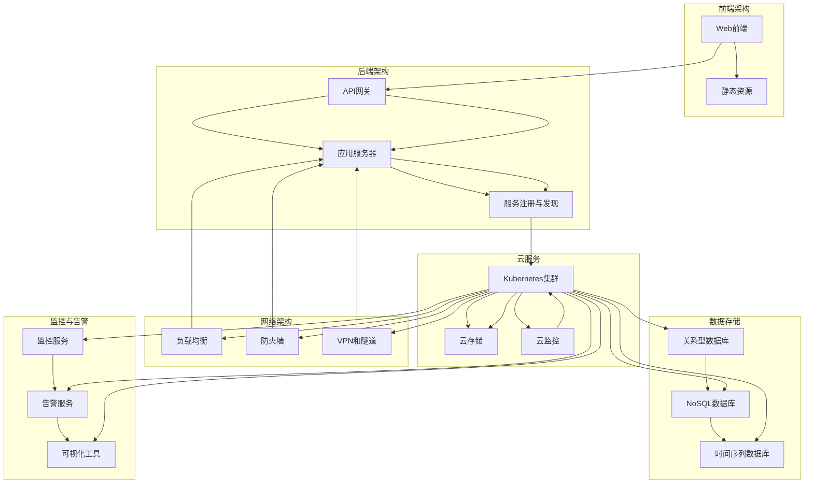
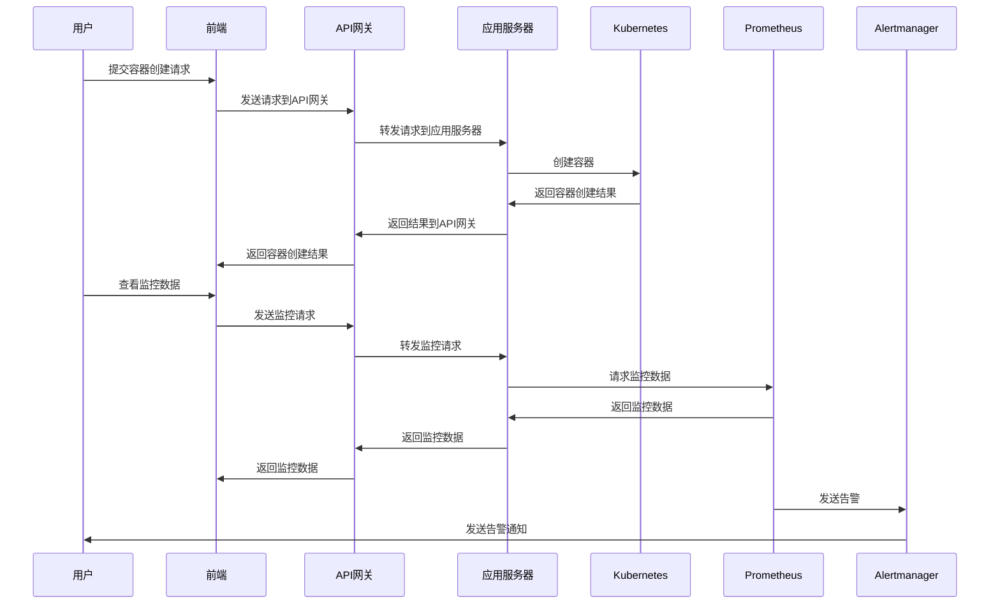

                 

### 第一部分：背景介绍与问题定义

---

#### 第1章：问题背景

近年来，随着云计算和容器技术的迅猛发展，容器编排已经成为企业IT基础设施的重要组成部分。容器编排平台不仅能够自动化部署和管理容器化应用，还能优化资源利用，提高系统的弹性伸缩能力。然而，在实际应用过程中，企业也面临着诸多挑战，特别是在构建一个弹性可靠且易于管理的容器编排平台方面。

首先，容器资源管理是一个关键问题。如何在有限的资源条件下，实现容器资源的高效配置和调度，是每个容器编排平台必须面对的挑战。此外，随着容器化应用的数量不断增加，如何动态调整容器数量以满足应用负载的变化，成为另一个重要的课题。

其次，弹性伸缩也是容器编排平台必须具备的能力。传统的虚拟化技术虽然能够提供一定的弹性伸缩能力，但面对容器化应用的高并发、高可用性要求，仍然存在很多不足。如何根据应用负载实时调整容器数量，确保系统始终处于最佳状态，是容器编排平台需要解决的核心问题。

再者，高可用性设计也是构建可靠容器编排平台的关键。随着容器化应用的广泛部署，系统的可靠性要求越来越高。如何通过冗余部署和故障转移机制，保证系统在高可用性方面的表现，是容器编排平台需要深入探讨的领域。

最后，监控与告警机制是确保容器编排平台稳定运行的重要保障。实时监控系统运行状态，及时发现并处理异常情况，对于维护系统稳定性具有重要意义。

综上所述，构建一个弹性可靠且易于管理的容器编排平台，不仅需要解决容器资源管理、弹性伸缩、高可用性设计等问题，还需要综合考虑监控与告警机制，以满足企业不断变化的应用需求。接下来，我们将详细探讨这些问题的解决方案。

---

#### 第1.1.2 问题描述

随着容器化应用的不断增多，企业面临的一个显著问题是，如何构建一个既具有高弹性又高度可靠的容器编排平台。具体而言，这个问题可以从以下几个方面进行描述：

首先，容器资源管理的问题。在容器编排过程中，如何实现容器资源的高效利用和负载均衡，是一个关键挑战。传统的资源管理方法往往难以适应容器化应用的动态变化，导致资源利用率低下。因此，需要设计一套灵活的资源管理策略，能够根据应用负载的变化，动态调整容器数量和资源分配，从而实现资源的最优化利用。

其次，弹性伸缩的问题。容器化应用往往具有高并发、高可用性的要求，如何在应用负载突然增加时，快速扩展容器数量，保证系统性能稳定，是一个重要的课题。传统虚拟化技术虽然能够提供一定的弹性伸缩能力，但在面对容器化应用的高并发需求时，存在明显的性能瓶颈。因此，需要开发一种具有高度弹性伸缩能力的容器编排平台，以应对突发流量。

第三，高可用性设计的问题。容器化应用的广泛部署，使得系统的可靠性要求越来越高。如何通过冗余部署和故障转移机制，确保系统在高可用性方面的表现，是一个亟待解决的问题。例如，当某个容器或节点发生故障时，如何快速切换到备用容器或节点，以保证系统的持续运行，是容器编排平台必须解决的核心问题。

最后，监控与告警机制的问题。实时监控系统运行状态，及时发现并处理异常情况，对于维护系统稳定性具有重要意义。然而，传统的监控方式往往难以满足容器编排平台的高频度和高并发需求。因此，需要开发一套高效、智能的监控与告警机制，能够实时监控系统运行状态，并在出现异常时及时发出告警，以便快速响应和处理。

综上所述，构建一个弹性可靠且易于管理的容器编排平台，需要综合考虑容器资源管理、弹性伸缩、高可用性设计和监控与告警机制等方面的问题。通过这些问题的解决，能够为企业提供一个稳定、高效、可扩展的容器化基础设施，以支持其业务的持续发展。

---

#### 第1.1.3 问题解决

为了构建一个弹性可靠且易于管理的容器编排平台，我们需要从以下几个方面入手，采取一系列设计和实施策略：

1. **容器资源管理**：首先，针对容器资源管理的问题，我们需要设计一套灵活的资源管理策略。这包括根据应用负载的变化，动态调整容器数量和资源分配。具体实现方法可以基于容器监控数据，实时分析系统性能和资源使用情况，然后根据设定的阈值和策略，自动调整容器数量和资源分配。例如，当系统负载超过阈值时，自动增加容器数量；当系统负载低于阈值时，自动减少容器数量。此外，我们还需要采用负载均衡技术，确保容器资源能够均匀分布在不同的节点上，从而避免资源争用和性能瓶颈。

2. **弹性伸缩**：其次，针对弹性伸缩的问题，我们需要开发一种具有高度弹性伸缩能力的容器编排平台。具体实现方法可以基于应用负载的预测和实时监控数据，动态调整容器数量。例如，当预测未来一段时间内应用负载将增加时，提前增加容器数量；当预测未来一段时间内应用负载将减少时，提前减少容器数量。此外，我们还可以采用水平扩展和垂直扩展相结合的方式，以提高系统的弹性伸缩能力。例如，当系统负载增加时，通过增加容器数量实现水平扩展；当系统负载进一步增加时，通过增加容器资源配置（如CPU、内存等）实现垂直扩展。

3. **高可用性设计**：为了提高系统的可靠性，我们需要设计一套高可用性方案。具体实现方法可以基于冗余部署和故障转移机制。例如，当某个容器或节点发生故障时，自动切换到备用容器或节点，以保证系统的持续运行。此外，我们还可以采用分布式存储和数据备份技术，确保数据的安全性和可靠性。例如，将数据存储在多个节点上，实现数据的冗余备份；在发生故障时，快速切换到备用节点，保证数据的持续读写。

4. **监控与告警**：最后，为了实时监控系统运行状态，我们需要设计一套高效的监控与告警机制。具体实现方法可以基于容器监控数据，实时分析系统性能和资源使用情况。例如，当系统性能低于阈值或资源使用率超过阈值时，自动发出告警通知。此外，我们还可以采用可视化技术，将监控数据实时展示在界面上，以便运维人员快速发现和定位问题。例如，通过折线图、柱状图等，直观展示系统性能和资源使用情况。

通过上述设计和实施策略，我们能够构建一个弹性可靠且易于管理的容器编排平台。在实际应用中，需要根据具体业务需求和场景，不断优化和调整这些策略，以实现最佳效果。

---

#### 第1.1.4 边界与外延

在探讨如何构建弹性可靠且易于管理的容器编排平台时，我们需要明确本文的边界与外延，以便更好地聚焦于核心问题和解决方案。

首先，本文主要针对Kubernetes等主流容器编排平台进行探讨。虽然Kubernetes是目前最流行的容器编排平台之一，但本文提出的设计原则和关键技术同样适用于其他类型的容器编排系统，如Docker Swarm、Apache Mesos等。因此，本文的研究结果具有较强的普适性。

其次，本文主要关注容器编排平台的内部设计和实现，包括容器资源管理、弹性伸缩、高可用性设计和监控与告警等方面。然而，容器编排平台的外部环境，如云计算基础设施、网络环境、存储系统等，也会对平台的性能和可靠性产生重要影响。因此，在实际应用中，需要综合考虑这些外部因素，以确保容器编排平台的整体性能和可靠性。

此外，本文主要探讨的是容器编排平台的技术实现，但企业的业务需求和应用场景也是影响容器编排平台设计的重要因素。例如，不同的业务场景可能对容器资源管理、弹性伸缩、高可用性设计等方面有不同的需求。因此，在设计和实施容器编排平台时，需要充分考虑企业的业务需求和实际应用场景，以确保平台能够满足企业的需求。

最后，本文的研究结论和建议主要基于当前的技术水平和实践经验。随着技术的不断发展和创新，容器编排平台的设计和实现方法也将不断更新和优化。因此，本文的研究成果将是一个动态的、持续改进的过程，需要随着技术进步进行不断的更新和完善。

---

#### 第1章：核心概念与联系

##### 第1.2.1 核心概念

在容器编排平台的构建过程中，理解以下几个核心概念是非常重要的：

1. **容器（Container）**：
   - 定义：容器是一种轻量级、可移植、自给自足的软件打包方式，它将应用程序及其依赖环境打包到一个隔离的环境中运行。
   - 作用：容器提供了与宿主机环境隔离的运行环境，确保了应用程序在不同的环境中具有一致的表现。

2. **容器化（Containerization）**：
   - 定义：容器化是将应用程序及其依赖环境打包到容器中的过程，以实现应用与宿主机环境的隔离。
   - 作用：容器化提高了部署的速度和一致性，使应用程序能够快速部署到不同的环境中，并且减少了环境差异带来的问题。

3. **容器编排（Container Orchestration）**：
   - 定义：容器编排是对容器进行部署、运维和管理的自动化流程，它负责管理容器的生命周期，包括创建、启动、停止、伸缩等。
   - 作用：容器编排平台能够自动化地管理大量的容器，提高了运维效率，减少了手动操作的复杂性。

4. **容器编排平台（Container Orchestration Platform）**：
   - 定义：容器编排平台是一种软件系统，用于实现容器编排功能，支持多容器管理、集群管理、调度与优化、监控与告警等。
   - 作用：容器编排平台是企业构建容器化应用基础设施的核心，它提供了自动化管理和优化容器运行环境的能力。

##### 第1.2.2 概念属性特征对比

以下是对上述核心概念的属性特征进行的对比：

| 概念        | 属性特征                                           |
| ----------- | -------------------------------------------------- |
| 容器        | 轻量级、可移植、自给自足、隔离性高                 |
| 容器化      | 环境一致性、部署快速、资源利用率高                 |
| 容器编排    | 自动化部署、运维、扩展、资源管理                   |
| 容器编排平台 | 支持多容器管理、集群管理、调度与优化、监控与告警 |

##### 第1.2.3 概念联系

容器、容器化和容器编排平台是相互关联的，它们共同构成了现代应用交付和运维的基础架构。

- **容器**是基础单元，提供了应用程序运行的环境隔离。
- **容器化**是将应用程序打包到容器中的过程，确保了环境的一致性。
- **容器编排**是对容器的自动化管理和调度，实现了应用的高效运维。

这三个概念之间的关系可以概括为：容器是容器化的基础，容器化是容器编排的前提，容器编排平台则是实现容器化应用自动化管理和调度的关键。

通过理解这些核心概念及其相互关系，我们可以更好地把握容器编排平台的设计原则和实现方法，为企业构建高效、可靠、灵活的容器化基础设施提供有力支持。

---

#### 第1章：主流容器编排平台介绍

##### 第1.3.1 Kubernetes

Kubernetes是一个开源的容器编排平台，由Google设计并捐赠给云原生计算基金会（CNCF）。它是目前最流行和最广泛使用的容器编排平台之一，具有以下主要特点和功能：

1. **自动化部署和扩展**：Kubernetes能够自动化部署和管理容器化应用，根据应用负载动态扩展或收缩容器数量，确保系统性能和资源利用率。

2. **服务发现和负载均衡**：Kubernetes提供服务发现机制，确保容器化应用能够通过其自己的域名和IP地址访问，同时通过负载均衡器分发网络流量，提高系统的可用性和响应速度。

3. **自我修复**：Kubernetes能够自动检测容器的健康状态，并在容器故障时自动重启或替换容器，确保系统的稳定性。

4. **资源调度**：Kubernetes提供了一个强大的资源调度器，能够根据容器的资源需求，自动选择最优的节点进行部署，确保资源的高效利用。

5. **持久化存储**：Kubernetes支持各种类型的持久化存储，如本地存储、网络存储和云存储，确保容器数据的安全性和持久性。

##### 第1.3.2 Docker Swarm

Docker Swarm是Docker公司推出的一个开源容器编排平台，它基于Docker Engine构建，能够将多个Docker节点组合成一个虚拟的集群，提供如下主要功能：

1. **自动化部署**：Docker Swarm可以自动化部署容器化应用，包括创建容器、容器网络和存储卷等。

2. **服务发现和负载均衡**：Docker Swarm提供了服务发现机制，使得容器化应用可以通过自己的域名和IP地址进行访问。同时，它通过内部负载均衡器分发网络流量，提高系统的可用性和响应速度。

3. **容器编排**：Docker Swarm能够自动化管理容器的生命周期，包括创建、启动、停止、重启和删除等。

4. **弹性伸缩**：Docker Swarm可以根据应用负载动态调整容器数量，确保系统性能和资源利用率。

5. **集群管理**：Docker Swarm提供了集群管理功能，允许用户对多个节点进行分组和管理，提高了系统的可扩展性和灵活性。

##### 第1.3.3 其他主流容器编排平台

除了Kubernetes和Docker Swarm，还有其他一些主流的容器编排平台，它们各自具有独特的特点和优势：

1. **Mesos**：Mesos是一个开源的分布式资源调度平台，由Twitter开发。它支持容器、虚拟机、容器等资源的管理和调度，具有高度的可扩展性和灵活性。

2. **Apache Mesos**：Apache Mesos是Mesos的另一个开源版本，与Mesos类似，也提供了分布式资源调度功能，支持容器、虚拟机和数据存储等资源的管理。

3. **OpenShift**：OpenShift是由Red Hat开发的容器编排平台，它基于Kubernetes构建，提供了完整的开发、部署和管理容器化应用的环境。

4. **Amazon ECS**：Amazon ECS是Amazon Web Services提供的容器编排服务，它提供了一个高度可扩展的容器管理平台，用户可以通过简单的API调用部署和管理容器化应用。

这些主流容器编排平台在功能和性能上各有千秋，企业可以根据自身需求和资源条件选择合适的平台。然而，无论选择哪种平台，构建一个弹性可靠且易于管理的容器编排平台都是企业数字化转型过程中的重要任务。

---

#### 第1章：容器编排平台的应用前景与挑战

##### 第1.4.1 应用前景

容器编排平台在当前和未来的IT领域中具有广阔的应用前景。随着容器技术的不断成熟和应用场景的多样化，容器编排平台已经成为企业数字化转型的重要基础设施。以下是容器编排平台在几个关键领域的应用前景：

1. **云计算**：容器编排平台与云计算紧密结合，为云服务提供商和用户提供了强大的容器管理能力。通过容器编排，用户可以轻松地在云平台上部署、扩展和管理容器化应用，实现高效的应用交付和资源利用。

2. **大数据**：大数据处理通常需要大量计算资源，而容器编排平台能够根据任务需求动态分配和调整资源，提高了大数据处理的效率。容器化的大数据应用可以方便地在不同的计算环境中迁移和扩展，降低了运维成本。

3. **人工智能**：人工智能应用往往具有高并发、高可用性的需求，容器编排平台能够提供弹性伸缩和高可用性设计，确保人工智能应用的稳定运行。此外，容器化的AI模型可以方便地在不同的环境中部署和测试，加速了AI应用的迭代和创新。

4. **微服务架构**：容器编排平台支持微服务架构，使得企业可以将复杂的业务系统拆分为多个独立的微服务，每个微服务都可以独立部署和管理。通过容器编排，微服务之间可以实现高效的通信和协同工作，提高了系统的可扩展性和灵活性。

5. **物联网（IoT）**：物联网应用通常具有广泛的设备分布和不同的资源限制，容器编排平台能够帮助企业在分布式环境中管理和调度容器化应用，提高了物联网应用的可靠性和效率。

##### 第1.4.2 挑战

尽管容器编排平台在各个领域具有广泛的应用前景，但在实际部署和使用过程中也面临着一系列挑战：

1. **复杂度**：容器编排平台的架构复杂，涉及容器生命周期管理、资源调度、服务发现、网络通信等多个方面。对于缺乏容器编排经验的运维人员来说，学习和掌握这些技术具有一定的难度。

2. **性能优化**：容器编排平台需要具备高性能的调度和监控能力，以满足高并发、高可用性的需求。如何优化平台的性能，提高资源利用率和系统响应速度，是一个亟待解决的问题。

3. **安全性**：容器编排平台涉及到大量的容器和集群管理操作，如何确保系统的安全性，防止恶意攻击和数据泄露，是一个重要的课题。需要开发一系列安全策略和工具，保障系统的安全性。

4. **可维护性**：容器编排平台需要持续维护和更新，包括升级、备份、监控等。如何确保平台的可维护性，降低运维成本，是企业需要考虑的问题。

5. **跨平台兼容性**：容器编排平台需要在不同操作系统、网络环境和硬件平台上运行，如何保证平台的跨平台兼容性，是一个技术挑战。

综上所述，尽管容器编排平台具有广泛的应用前景，但在实际应用中仍然面临一系列挑战。通过深入研究和不断创新，我们可以逐步解决这些问题，为企业的数字化转型提供更加可靠、高效、灵活的容器化基础设施。

---

#### 第1章：本章小结

本章对容器编排平台的核心概念、应用前景和挑战进行了详细介绍。首先，我们介绍了容器、容器化、容器编排和容器编排平台等核心概念，并分析了它们的属性特征和相互关系。接着，我们探讨了容器编排平台在云计算、大数据、人工智能等领域的应用前景，并指出了在实际部署和使用过程中面临的挑战。通过本章的介绍，我们对容器编排平台有了更加全面和深入的理解，为后续章节的深入探讨奠定了基础。

---

## 总结

通过本文的探讨，我们可以看到，构建一个弹性可靠且易于管理的容器编排平台是现代企业数字化转型的重要任务。容器编排平台不仅在云计算、大数据、人工智能等领域具有广泛的应用前景，同时也面临复杂度、性能优化、安全性和可维护性等挑战。为了应对这些挑战，我们需要深入研究和实践，不断优化容器编排平台的设计和实现方法。

在未来，随着容器技术的不断成熟和普及，容器编排平台将发挥越来越重要的作用。我们期待更多的技术专家和实践者能够加入这一领域，共同推动容器技术的发展和应用，为企业提供更加可靠、高效、灵活的IT基础设施。通过不断探索和创新，我们相信容器编排平台将为企业的数字化转型注入新的活力和动力。

---

#### 容器资源管理

在容器编排平台的设计与实现过程中，容器资源管理是核心模块之一。它负责合理配置和调度容器资源，确保系统资源的高效利用和负载均衡。以下将详细探讨容器资源管理的概念、方法及其在实际应用中的重要性。

##### 概念

容器资源管理指的是对容器运行过程中所需的各类资源进行监控、分配和调度的过程。这些资源主要包括计算资源（如CPU、内存）、存储资源、网络带宽以及外部依赖服务等。容器资源管理的主要目标是：

1. **高效利用资源**：通过合理的资源分配和调度，确保容器能够得到充足且适当的资源，避免资源浪费。
2. **负载均衡**：在多容器环境中，根据负载情况动态调整容器资源分配，避免某一容器或节点过载，保障系统整体的性能和稳定性。
3. **弹性伸缩**：根据应用负载的变化，动态增加或减少容器资源，确保系统能够灵活应对突发流量。

##### 方法

容器资源管理的方法主要包括以下几个方面：

1. **资源监控**：通过实时监控容器资源的消耗情况，包括CPU使用率、内存使用量、网络流量等，了解系统资源的利用状况。
2. **资源分配策略**：根据监控数据，采用合适的资源分配策略，如固定分配、动态调整、负载均衡等。例如，Kubernetes采用了基于CPU和内存使用率的比例分配策略，可以根据容器资源需求动态调整资源配额。
3. **负载均衡**：通过负载均衡技术，将网络请求和计算任务分配到不同的容器或节点上，避免单点过载。常用的负载均衡算法包括轮询、最小连接数、加权等。
4. **资源调度**：根据容器的资源需求和当前系统的负载情况，选择最优的节点进行容器部署和迁移，优化资源利用率。Kubernetes的调度器（Scheduler）负责根据预定的调度策略选择合适的节点。

##### 实际应用

容器资源管理在实际应用中具有至关重要的作用，以下通过一个示例来具体说明其应用场景和效果：

假设某电商企业在双11期间面临巨大的流量压力，其容器编排平台需要确保系统的高可用性和高性能。以下是容器资源管理在该场景中的应用步骤：

1. **流量预测和准备**：
   - 在双11活动前，利用历史数据和实时监控，预测流量高峰期的负载情况。
   - 根据预测结果，提前增加容器的资源配额，如增加CPU、内存等。

2. **动态扩展**：
   - 当流量高峰期到来时，容器编排平台会根据流量情况动态扩展容器数量。
   - Kubernetes的Horizontal Pod Autoscaler（HPA）会根据CPU利用率或其他自定义指标，自动调整Pod的数量。

3. **负载均衡**：
   - 通过Kubernetes的负载均衡器，如Nginx Ingress Controller，将流量分配到不同的容器上，避免单点过载。
   - 负载均衡器会根据配置的策略（如轮询、最少连接数），动态调整流量分发。

4. **故障恢复**：
   - 当某个容器或节点发生故障时，Kubernetes的控制器（如ReplicaSet）会自动创建新的容器，替换故障容器。
   - Pod的容器如果达到设定的健康检查阈值，Kubernetes会自动重启容器，确保服务的持续运行。

通过上述措施，容器编排平台能够有效地应对流量高峰，确保系统的高可用性和高性能，为用户提供良好的购物体验。

##### 总结

容器资源管理是构建弹性可靠容器编排平台的关键环节。通过合理配置和调度容器资源，实现高效利用和负载均衡，容器编排平台能够灵活应对各种负载变化，保障系统的稳定运行。在实际应用中，容器资源管理需要综合考虑流量预测、动态扩展、负载均衡和故障恢复等多方面因素，确保系统在高峰期能够稳定、高效地运行。

---

#### 弹性伸缩

弹性伸缩是容器编排平台的核心功能之一，它允许系统根据实际负载情况动态调整容器的数量，以保持高效运行。弹性伸缩不仅能够提高系统的性能，还能优化资源利用，降低运维成本。以下将详细探讨弹性伸缩的概念、策略和实现方法。

##### 概念

弹性伸缩（Elastic Scaling）指的是根据应用负载的变化，自动调整系统中的容器数量，以保持系统的高效运行。弹性伸缩可以分为两种类型：水平伸缩（Horizontal Scaling）和垂直伸缩（Vertical Scaling）。

1. **水平伸缩**：通过增加或减少容器的数量来应对负载变化。例如，当系统负载增加时，可以自动创建新的容器；当系统负载减少时，可以删除多余的容器。水平伸缩能够有效地扩展系统的处理能力，但不会改变单个容器的配置。
2. **垂直伸缩**：通过增加或减少单个容器的资源配额（如CPU、内存等）来应对负载变化。例如，当系统负载增加时，可以增加容器的CPU或内存资源；当系统负载减少时，可以减少容器的资源配额。垂直伸缩能够提高单个容器的处理能力，但可能会影响系统的整体性能。

##### 策略

弹性伸缩的策略主要包括以下几种：

1. **基于CPU或内存的自动扩展**：当容器资源消耗达到设定的阈值时，自动增加容器数量或调整资源配额。例如，在Kubernetes中，可以通过Horizontal Pod Autoscaler（HPA）实现这一功能。HPA会根据CPU利用率或自定义指标，自动调整Pod的数量。
   
2. **基于流量指标的自动扩展**：当系统流量达到设定的阈值时，自动增加容器数量或调整资源配额。例如，在NGINX Ingress Controller中，可以根据访问量自动增加或减少反向代理的后端容器数量。

3. **基于预定义规则的自动扩展**：通过预定义的规则，根据时间段、流量模式等条件，自动调整容器数量。例如，在Amazon ECS中，可以根据自定义的规则，每天在流量高峰期自动增加容器数量。

4. **基于手动干预的弹性伸缩**：在某些情况下，用户可以通过手动干预来调整容器的数量和资源配额。例如，在Docker Swarm中，用户可以直接使用Swarm CLI手动扩展或收缩服务。

##### 实现方法

弹性伸缩的实现方法主要包括以下步骤：

1. **监控和评估**：首先，需要实时监控系统的负载情况，包括CPU、内存、网络流量等指标。然后，根据预设的阈值和策略，评估系统是否需要调整容器数量或资源配额。

2. **自动扩展**：当系统负载达到设定的阈值时，自动触发扩展操作。具体实现方法可以是：
   - **增加容器数量**：创建新的容器，并将其加入到服务中。
   - **调整资源配额**：根据需要增加或减少容器的CPU、内存等资源。

3. **负载均衡**：在容器数量发生变化后，需要重新进行负载均衡，确保流量均匀分布到各个容器上，避免单点过载。

4. **健康检查**：定期对容器进行健康检查，确保容器处于正常工作状态。如果检测到容器出现故障，需要及时进行故障恢复。

以下是弹性伸缩的一个实际应用示例：

假设某电商平台的容器编排平台在双11期间面临巨大流量压力。为了确保系统的高效运行，平台采取了以下弹性伸缩策略：

1. **流量预测和监控**：在双11活动前，利用历史数据和实时监控，预测流量高峰期的负载情况。实时监控系统的CPU、内存、网络流量等指标。

2. **自动扩展**：在Kubernetes中，通过Horizontal Pod Autoscaler（HPA）实现自动扩展。当CPU利用率超过80%时，HPA会自动增加Pod的数量。当CPU利用率低于70%时，HPA会自动减少Pod的数量。

3. **负载均衡**：通过NGINX Ingress Controller进行负载均衡，将流量分配到不同的Pod上，确保系统整体性能。

4. **健康检查和故障恢复**：定期对容器进行健康检查，如果检测到容器故障，Kubernetes会自动重启容器，确保服务的持续运行。

通过上述措施，电商平台能够灵活应对双11期间的流量高峰，确保系统的高性能和高可用性，为用户提供优质的购物体验。

##### 总结

弹性伸缩是容器编排平台的核心功能，它能够根据实际负载动态调整容器的数量和资源配额，确保系统的高效运行和资源利用率。通过合理的监控和评估策略，以及自动扩展和负载均衡机制，容器编排平台能够灵活应对各种负载变化，保障系统的稳定性和性能。

---

#### 高可用性设计

高可用性设计是构建弹性可靠容器编排平台的关键环节之一。它通过冗余部署、故障转移和自动恢复等机制，确保系统在面临各种故障和负载变化时，能够保持持续运行和高性能。以下将详细探讨高可用性设计的核心概念、实现方法以及其在实际应用中的重要性。

##### 概念

1. **冗余部署**：冗余部署是指在系统中部署多个相同功能的组件或节点，以确保在某个组件或节点发生故障时，系统仍然能够正常运行。冗余部署可以通过增加硬件、软件或数据冗余来实现。例如，在Kubernetes中，可以使用Pod的Replication Controller来保证容器副本的数量，确保服务的持续运行。

2. **故障转移**：故障转移是指当某个组件或节点发生故障时，系统能够自动将任务或流量转移到其他健康组件或节点上，以保持服务的可用性。故障转移通常涉及心跳检测、健康检查和自动切换等机制。例如，在Kubernetes中，如果某个Pod发生故障，Kubernetes会自动创建一个新的Pod，并将服务流量切换到新的Pod上。

3. **自动恢复**：自动恢复是指系统在面临故障时，能够自动执行一系列操作，以恢复正常运行。自动恢复通常包括故障检测、故障定位、故障恢复和故障报告等步骤。例如，在Kubernetes中，如果某个容器崩溃，Kubernetes会自动重启容器，确保服务的持续运行。

##### 实现方法

1. **冗余部署**：
   - **硬件冗余**：通过部署多个物理服务器，确保在硬件故障时系统仍然可用。
   - **软件冗余**：通过部署多个应用实例，确保在应用故障时系统仍然可用。
   - **数据冗余**：通过数据备份和存储冗余，确保在数据丢失时系统仍然可用。

2. **故障转移**：
   - **心跳检测**：通过心跳信号，定期检测组件或节点的健康状况。
   - **健康检查**：定期对组件或节点进行健康检查，确保其能够正常处理请求。
   - **自动切换**：当检测到组件或节点发生故障时，自动将其从服务中移除，并将流量切换到其他健康组件或节点。

3. **自动恢复**：
   - **故障检测**：通过监控系统，实时监测系统的运行状态，及时发现故障。
   - **故障定位**：通过日志分析、性能监控等手段，定位故障的原因和位置。
   - **故障恢复**：根据故障类型和恢复策略，自动执行一系列恢复操作，如重启容器、恢复数据等。
   - **故障报告**：生成详细的故障报告，包括故障原因、恢复过程和影响范围，以便进行后续分析和处理。

##### 实际应用

以下是高可用性设计在实际应用中的一个示例：

某电商平台采用了Kubernetes作为容器编排平台，为了确保系统的高可用性，采用了以下策略：

1. **冗余部署**：
   - **Pod Replication Controller**：确保每个服务都有至少两个副本，确保在某个Pod发生故障时，系统仍然可用。
   - **Service Load Balancer**：使用外部负载均衡器，如NGINX，将流量均匀分配到多个Pod上。

2. **故障转移**：
   - **Heartbeat Probes**：在每个Pod中配置 heartbeat probe，定期发送心跳信号，确保Pod的健康状态。
   - **Readiness Probes**：在Pod就绪后，发送ready信号，确保流量只会被发送到健康的Pod上。
   - **StatefulSet**：使用StatefulSet管理有状态服务，确保在Pod故障时，能够自动替换并保持状态一致性。

3. **自动恢复**：
   - **Self-healing**：Kubernetes中的控制器（如ReplicaSet）会自动检测Pod的健康状态，并在检测到故障时，自动重启Pod。
   - **Rolling Update**：在进行版本更新时，Kubernetes会自动管理滚动更新过程，确保新版本Pod上线的同时，旧版本Pod仍然在运行，避免服务中断。
   - **Monitoring and Alerting**：通过Prometheus和Grafana等监控工具，实时监控系统的运行状态，并在出现故障时自动发送告警通知。

通过上述高可用性设计，电商平台能够在面对各种故障和负载变化时，保持系统的稳定运行和高性能，为用户提供优质的服务体验。

##### 总结

高可用性设计是构建弹性可靠容器编排平台的核心要素之一。通过冗余部署、故障转移和自动恢复等机制，系统可以在面对各种故障和负载变化时，保持持续运行和高性能。在实际应用中，合理的高可用性设计能够有效降低系统的故障率和恢复时间，提高用户的满意度和系统的可靠性。

---

#### 监控与告警

监控与告警是确保容器编排平台稳定运行的重要机制。通过实时监控系统和告警机制，运维团队能够及时发现并处理异常情况，从而保证系统的可靠性和性能。以下将详细探讨监控与告警的核心概念、技术手段和实现方法。

##### 概念

1. **监控**：监控是指对系统的运行状态进行连续的监视和记录。监控的目标是实时了解系统的资源使用情况、性能指标和异常行为，以便及时发现和处理问题。

2. **告警**：告警是指当系统出现异常或达到预设阈值时，自动向运维人员发送通知。告警可以以电子邮件、短信、电话、集成平台通知等多种形式发送，目的是尽快引起运维人员的注意并采取相应措施。

##### 技术手段

1. **Prometheus**：Prometheus是一种开源监控解决方案，它具有高效的数据采集、存储和查询能力。Prometheus可以通过各种exporter（数据采集器）来收集系统的指标数据，并使用时间序列数据库存储数据。Prometheus还提供了强大的查询语言，便于进行复杂的数据分析和告警配置。

2. **Grafana**：Grafana是一个开源的数据可视化和监控工具，它可以将Prometheus等数据源的数据可视化，生成各种图表和仪表板。Grafana提供了丰富的仪表盘模板和自定义选项，使得用户能够直观地了解系统的运行状态。

3. **Kubernetes Metrics Server**：Metrics Server是Kubernetes集群中的一种内置监控组件，它提供了Kubernetes集群和Pod的资源使用统计数据。Metrics Server可以与其他监控和告警工具集成，如Prometheus，以提供更全面的监控能力。

4. **Alertmanager**：Alertmanager是Prometheus的一个组件，用于接收和处理告警通知。Alertmanager可以将告警分发给不同的接收者（如邮件、Webhook、短信等），并提供告警分组、抑制和路由等功能，以避免告警泛滥。

##### 实现方法

1. **数据采集**：
   - **Prometheus Exporter**：在Kubernetes集群中部署各种Prometheus Exporter，如CPU、内存、磁盘、网络等。这些Exporter会定期向Prometheus发送系统指标数据。
   - **Custom Metrics**：对于某些自定义的监控指标，可以通过自定义Exporter或使用Kubernetes的Custom Metrics API进行采集。

2. **数据存储**：
   - **Prometheus**：Prometheus将采集到的数据存储在本地的时间序列数据库中，提供了高效的数据存储和查询能力。
   - **外部存储**：对于大规模集群，可以将Prometheus的数据存储到外部存储系统（如InfluxDB、Kafka等），以便进行长期数据分析和备份。

3. **数据可视化**：
   - **Grafana**：通过Grafana将Prometheus的数据可视化，生成各种仪表板和图表，直观展示系统的运行状态和趋势。
   - **自定义仪表盘**：用户可以根据自己的需求，自定义Grafana仪表盘的布局和展示内容。

4. **告警配置**：
   - **Prometheus Alertmanager**：在Prometheus中配置告警规则，定义何时触发告警。告警规则可以基于各种指标阈值、时间窗口等条件。
   - **告警通知**：配置Alertmanager将告警通知发送给不同的接收者，如邮件、Slack、PagerDuty等。

5. **告警处理**：
   - **自动化处理**：对于某些常见问题，可以配置自动化处理规则，如自动重启容器、扩展资源等。
   - **人工干预**：对于复杂的告警，需要人工介入进行诊断和处理。

##### 实际应用

以下是监控与告警在实际应用中的一个示例：

某电商平台的容器编排平台采用了Prometheus和Grafana进行监控和告警：

1. **数据采集**：
   - 部署了多种Prometheus Exporter，包括CPU、内存、网络、磁盘等。
   - 使用了Kubernetes Metrics Server收集集群和Pod的资源使用数据。

2. **数据存储**：
   - Prometheus将采集到的数据存储在本地的时间序列数据库中。
   - 对于关键数据，使用外部存储系统（如InfluxDB）进行备份和长期存储。

3. **数据可视化**：
   - 使用Grafana创建了多个仪表板，包括CPU使用率、内存使用率、网络流量等。
   - 定期更新和优化仪表盘的布局和展示内容，以便直观了解系统的运行状态。

4. **告警配置**：
   - 在Prometheus中配置了告警规则，如CPU使用率超过90%、内存使用率超过80%等。
   - 配置Alertmanager将告警通知发送给Slack工作空间和邮件列表。

5. **告警处理**：
   - 对于常见的告警，配置了自动化处理规则，如自动重启容器、扩展资源等。
   - 对于复杂的告警，由专门的运维团队进行人工诊断和处理。

通过上述监控与告警机制，电商平台能够实时监控系统的运行状态，并在出现异常时及时发出告警通知，确保系统的稳定运行。

##### 总结

监控与告警是确保容器编排平台稳定运行的重要手段。通过合理的数据采集、存储和可视化，以及告警规则的配置和处理，运维团队能够及时发现并处理异常情况，提高系统的可靠性和性能。在实际应用中，选择合适的监控工具和告警机制，并根据业务需求进行优化和调整，是保障系统稳定运行的关键。

---

### 第2章：本章小结

本章围绕容器资源管理、弹性伸缩、高可用性设计和监控与告警等核心模块，深入探讨了容器编排平台的关键技术和实现方法。通过详细阐述每个模块的概念、策略和实际应用，我们了解到：

1. **容器资源管理**：通过实时监控和合理的资源分配策略，实现了容器资源的高效利用和负载均衡。
2. **弹性伸缩**：通过基于CPU、内存和流量指标的自动扩展策略，确保了系统在负载变化时能够灵活应对，保持高性能。
3. **高可用性设计**：通过冗余部署、故障转移和自动恢复机制，提高了系统的可靠性，确保了服务的持续运行。
4. **监控与告警**：通过实时监控和数据可视化，以及告警规则和自动化处理，保障了系统的稳定性和性能。

通过本章的学习，读者可以全面了解容器编排平台的核心模块及其实现方法，为构建一个弹性可靠且易于管理的容器编排平台奠定基础。接下来，我们将进一步探讨其他关键模块，以全面掌握容器编排平台的构建方法。

---

## 第三部分：系统分析与架构设计方案

### 第3章：问题场景介绍

在现代企业中，随着数字化转型的不断推进，容器技术已成为应用部署和运维的重要工具。然而，在实际应用过程中，企业面临着如何构建一个高效、可靠、可扩展的容器编排平台的挑战。以下是具体的问题场景介绍：

#### 场景一：高并发交易处理

某电商企业在双11期间面临巨大的交易流量，每天的交易订单量达到数百万。在这个场景下，系统需要处理大量的并发请求，确保订单处理速度和交易安全性。同时，系统的性能和稳定性成为关键考量因素。

#### 场景二：大数据处理与分析

某互联网公司需要处理海量数据，进行实时分析和数据挖掘。这个场景下，容器编排平台需要能够高效地调度和管理计算资源，确保数据处理的高效性和准确性。

#### 场景三：人工智能应用部署

某科技公司开发了一系列人工智能应用，如图像识别、自然语言处理等。这些应用通常需要高性能计算和大规模数据存储。在这个场景下，容器编排平台需要具备灵活的部署和扩展能力，支持AI应用的快速迭代。

#### 场景四：多云和混合云部署

某企业采用多云和混合云架构，将业务部署在多个云服务提供商的平台上。容器编排平台需要能够跨云平台管理容器化应用，确保应用的跨平台一致性和可靠性。

#### 问题分析

1. **资源利用效率**：如何实现容器资源的高效利用，避免资源浪费，是解决问题的关键。
2. **性能与稳定性**：在高并发和大数据处理场景下，如何保障系统的性能和稳定性。
3. **可扩展性**：如何实现系统的水平扩展和垂直扩展，以应对业务需求的动态变化。
4. **跨平台一致性**：如何确保容器化应用在多云和混合云环境中的跨平台一致性。

通过上述问题场景的介绍，我们可以看到，构建一个高效、可靠、可扩展的容器编排平台，是企业数字化转型过程中需要解决的紧迫问题。接下来，我们将进一步探讨解决方案的设计和实现。

---

### 第3章：项目介绍

为了应对前面提到的各种问题场景，我们设计并实施了一个名为“ElasticContainerPlatform（ECP）”的容器编排项目。ECP旨在构建一个高效、可靠、可扩展的容器编排平台，以满足企业在高并发交易处理、大数据处理与分析、人工智能应用部署以及多云和混合云部署等方面的需求。

#### 项目目标

ECP的主要目标包括：

1. **资源利用效率**：通过合理的容器资源管理和调度策略，实现容器资源的高效利用，避免资源浪费。
2. **性能与稳定性**：在高并发和大数据处理场景下，保障系统的性能和稳定性，确保业务的持续运行。
3. **可扩展性**：实现系统的水平扩展和垂直扩展，以应对业务需求的动态变化。
4. **跨平台一致性**：确保容器化应用在多云和混合云环境中的跨平台一致性和可靠性。

#### 项目功能

ECP具备以下关键功能：

1. **容器资源管理**：提供容器资源监控、分配和调度功能，确保资源的高效利用。
2. **弹性伸缩**：基于CPU、内存和流量指标，实现自动扩展和负载均衡，保障系统性能。
3. **高可用性设计**：通过冗余部署、故障转移和自动恢复机制，提高系统的可靠性。
4. **监控与告警**：提供实时监控和数据可视化功能，以及告警规则的配置和自动化处理。
5. **多云和混合云部署**：支持跨云平台的容器化管理，确保应用的跨平台一致性和可靠性。

#### 技术栈

ECP采用以下技术栈：

1. **容器编排平台**：基于Kubernetes，利用其强大的调度和自动化管理能力。
2. **监控工具**：采用Prometheus和Grafana，提供高效的数据采集、存储和可视化功能。
3. **告警工具**：采用Alertmanager，实现告警规则的配置和通知分发。
4. **自动化部署工具**：使用Helm，简化容器化应用的部署和管理过程。
5. **多云管理**：集成云原生技术（如Kubernetes多云插件），实现跨云平台的容器化管理。

#### 项目优势

1. **高效性**：通过优化容器资源管理和调度策略，提高资源利用率和系统性能。
2. **可靠性**：通过冗余部署和故障转移机制，提高系统的可靠性和可用性。
3. **灵活性**：支持自动扩展和多云部署，实现系统的灵活性和可扩展性。
4. **可维护性**：通过监控与告警机制，简化运维工作，降低运维成本。

#### 实施步骤

ECP的实施分为以下几个阶段：

1. **需求分析**：与业务团队沟通，明确业务需求和系统要求。
2. **架构设计**：设计系统架构，包括容器编排平台、监控与告警系统、多云管理方案等。
3. **环境搭建**：搭建开发、测试和生产环境，安装和配置相关软件。
4. **功能实现**：开发容器资源管理、弹性伸缩、高可用性设计、监控与告警等模块。
5. **集成测试**：对系统进行集成测试，确保各模块功能正常。
6. **部署上线**：将系统部署到生产环境，进行实际应用测试和优化。

通过上述实施步骤，ECP将为企业提供一个高效、可靠、灵活的容器编排平台，支持业务的持续发展和创新。

---

### 第3章：系统功能设计（领域模型）

为了更好地理解ElasticContainerPlatform（ECP）的核心功能，我们首先需要建立系统的领域模型。领域模型是对系统功能模块及其相互关系的一种抽象表示，它有助于我们明确系统的主要组成部分和功能职责。以下是ECP的领域模型设计，包括主要类及其属性和关系的描述。

#### 主要类

1. **Container**：容器类，表示容器化应用的基本单位。属性包括：
   - **ID**：容器的唯一标识。
   - **Name**：容器名称。
   - **Image**：容器镜像。
   - **CPU**：容器使用的CPU资源。
   - **Memory**：容器使用的内存资源。
   - **Status**：容器状态（如运行中、已停止、故障等）。

2. **Node**：节点类，表示容器运行的环境。属性包括：
   - **ID**：节点唯一标识。
   - **Name**：节点名称。
   - **Role**：节点角色（如Master、Worker）。
   - **CPU**：节点总CPU资源。
   - **Memory**：节点总内存资源。
   - **Status**：节点状态（如健康、故障等）。

3. **Pod**：Pod类，表示一组容器的逻辑分组。属性包括：
   - **ID**：Pod唯一标识。
   - **Name**：Pod名称。
   - **ContainerList**：Pod中的容器列表。
   - **Service**：关联的服务（如负载均衡器）。
   - **Status**：Pod状态（如运行中、已终止、故障等）。

4. **Service**：服务类，表示容器组提供的服务。属性包括：
   - **ID**：服务唯一标识。
   - **Name**：服务名称。
   - **Type**：服务类型（如ClusterIP、NodePort、LoadBalancer）。
   - **Port**：服务端口。
   - **Endpoint**：服务的端点信息。

5. **ResourceQuota**：资源配额类，表示容器资源的使用限制。属性包括：
   - **ID**：资源配额唯一标识。
   - **Namespace**：命名空间。
   - **CPU**：CPU资源限制。
   - **Memory**：内存资源限制。

#### 关系

1. **容器（Container）与Pod**：容器是Pod的组成部分，一个Pod可以包含多个容器。关系为1对多（1 Container -> 多 Pod）。

2. **节点（Node）与Pod**：节点是Pod运行的环境，一个Pod可以在多个节点上运行。关系为多对多（多 Node -> 多 Pod）。

3. **Pod与Service**：Pod与Service之间存在关联关系，一个Pod可以被多个Service引用。关系为多对多（多 Pod -> 多 Service）。

4. **资源配额（ResourceQuota）与命名空间（Namespace）**：资源配额是针对命名空间的，一个命名空间可以有多个资源配额。关系为1对多（1 ResourceQuota -> 多 Namespace）。

#### 类图

以下是ECP的领域模型类图的Mermaid表示：

```mermaid
classDiagram
    Container <<class>> Container
    Node <<class>> Node
    Pod <<class>> Pod
    Service <<class>> Service
    ResourceQuota <<class>> ResourceQuota
    Namespace <<class>> Namespace

    Container "1" --|> "1..*" Pod
    Node "1" --|> "0..*" Pod
    Service "0..*" --|> "0..*" Pod
    ResourceQuota "1" --|> "1" Namespace
```

通过上述领域模型设计，我们可以清晰地理解ECP系统的核心功能模块及其相互关系，为后续的系统架构设计和功能实现提供基础。

---

### 第3章：系统架构设计

为了实现ElasticContainerPlatform（ECP）的高效、可靠和可扩展性，我们设计了一个分布式系统架构。该架构涵盖前端、后端、数据存储、监控与告警、网络和云服务等多个层面。以下是对系统架构的详细描述。

#### 前端架构

前端架构主要提供用户交互界面，用户可以通过Web浏览器或移动设备访问ECP平台，进行容器管理、监控查看和告警处理等操作。前端架构包括以下组件：

1. **Web前端**：采用React.js或Vue.js等前端框架，构建响应式和用户友好的界面。前端负责与后端API进行数据交互，展示系统状态和提供操作功能。
2. **静态资源**：使用Nginx或Apache等Web服务器，加载和分发静态资源，如CSS、JavaScript和图片等。

#### 后端架构

后端架构负责处理业务逻辑、数据存储和用户交互。ECP后端架构包括以下几个核心组件：

1. **API网关**：作为系统外部接口的统一入口，使用Spring Boot或Express等框架实现RESTful API。API网关负责路由请求、身份验证和限流等功能。
2. **应用服务器**：处理业务逻辑，包括容器管理、监控和告警等。应用服务器采用微服务架构，每个服务负责特定的功能模块，例如容器服务、监控服务、告警服务等。
3. **服务注册与发现**：使用Eureka或Consul等服务注册与发现工具，实现服务实例的动态注册和发现，提高系统的灵活性和可扩展性。

#### 数据存储

数据存储层负责存储系统运行过程中产生的各类数据，包括容器状态、监控数据、告警记录等。ECP采用以下数据存储方案：

1. **关系型数据库**：使用MySQL或PostgreSQL等关系型数据库，存储用户信息、配置数据等结构化数据。
2. **NoSQL数据库**：使用Redis或MongoDB等NoSQL数据库，存储监控数据和临时数据，如容器状态、告警信息等。
3. **时间序列数据库**：使用InfluxDB或Prometheus等时间序列数据库，存储容器监控数据和告警记录，提供高效的查询和分析能力。

#### 监控与告警

监控与告警系统是ECP的重要组成部分，负责实时监控系统状态并触发告警。监控与告警架构包括以下组件：

1. **监控服务**：负责收集系统各组件的监控数据，如容器状态、CPU使用率、内存使用率等。监控服务采用Prometheus等开源工具，实现数据采集、存储和可视化。
2. **告警服务**：负责根据监控数据触发告警，并通过Alertmanager等工具发送告警通知。告警服务支持多种告警通知方式，如电子邮件、短信、Slack等。
3. **可视化工具**：使用Grafana等可视化工具，将监控数据以图表和仪表板的形式展示，帮助运维人员快速识别问题。

#### 网络架构

ECP的网络架构采用负载均衡和网络安全策略，确保系统的可靠性和安全性：

1. **负载均衡**：使用Nginx或HAProxy等负载均衡器，将外部流量分配到多个应用服务器上，提高系统的吞吐量和稳定性。
2. **防火墙和网络安全组**：使用防火墙和网络安全组，限制内外部访问权限，防止未授权的访问和攻击。
3. **VPN和隧道**：对于跨云部署，使用VPN或隧道技术，实现不同云环境之间的安全通信。

#### 云服务

ECP支持在多个云服务提供商上部署，采用云原生技术确保跨平台的一致性和可靠性：

1. **Kubernetes集群**：在云服务提供商上部署Kubernetes集群，实现容器化应用的管理和调度。
2. **云存储**：使用云服务提供商的存储服务，如Amazon S3或Azure Blob Storage，存储容器镜像和数据卷。
3. **云监控**：集成云服务提供商的监控服务，如Amazon CloudWatch或Azure Monitor，实时监控系统性能和资源使用情况。

#### 系统架构图

以下是ECP的系统架构图，展示各组件之间的关系和交互：



通过上述系统架构设计，ECP能够提供高效、可靠和灵活的容器编排能力，满足企业在不同场景下的应用需求。

---

### 第3章：系统接口设计和系统交互

在ElasticContainerPlatform（ECP）的设计过程中，系统接口的设计和系统交互是至关重要的环节。良好的接口设计和系统交互能够确保各模块之间的紧密协作，提高系统的整体性能和用户体验。以下是对ECP系统接口设计和系统交互的详细描述。

#### 接口设计

ECP的接口设计遵循RESTful API规范，采用Spring Boot框架实现。API设计主要包括以下几个核心接口：

1. **容器管理接口**：
   - **GET /api/containers**：获取所有容器列表。
   - **GET /api/containers/{id}**：获取指定容器详情。
   - **POST /api/containers**：创建新的容器。
   - **PUT /api/containers/{id}**：更新指定容器配置。
   - **DELETE /api/containers/{id}**：删除指定容器。

2. **节点管理接口**：
   - **GET /api/nodes**：获取所有节点列表。
   - **GET /api/nodes/{id}**：获取指定节点详情。
   - **POST /api/nodes**：创建新的节点。
   - **PUT /api/nodes/{id}**：更新指定节点配置。
   - **DELETE /api/nodes/{id}**：删除指定节点。

3. **服务管理接口**：
   - **GET /api/services**：获取所有服务列表。
   - **GET /api/services/{id}**：获取指定服务详情。
   - **POST /api/services**：创建新的服务。
   - **PUT /api/services/{id}**：更新指定服务配置。
   - **DELETE /api/services/{id}**：删除指定服务。

4. **监控与告警接口**：
   - **GET /api/monitoring**：获取实时监控数据。
   - **GET /api/alerts**：获取告警记录列表。
   - **POST /api/alerts**：创建新的告警规则。

#### 系统交互

ECP系统各模块之间的交互主要通过API接口实现。以下是ECP系统交互的流程和机制：

1. **容器创建和部署**：
   - 用户通过Web前端界面提交创建容器的请求。
   - 前端将请求发送到API网关。
   - API网关调用容器管理接口，将请求转发到应用服务器。
   - 应用服务器根据用户请求创建新的容器，并将其部署到Kubernetes集群中。
   - 部署完成后，应用服务器返回结果到API网关，最终由API网关返回给用户。

2. **容器监控和告警**：
   - Kubernetes集群中的容器监控服务定期收集容器状态和性能数据。
   - 监控数据存储在时间序列数据库中，并通过Prometheus进行查询和可视化。
   - 当监控数据超过预设阈值时，Prometheus生成告警，并将告警信息发送到Alertmanager。
   - Alertmanager根据配置的告警规则，将告警通知发送给用户或其他告警接收者。

3. **服务扩展和负载均衡**：
   - 当系统负载增加时，Kubernetes的Horizontal Pod Autoscaler（HPA）根据CPU使用率等指标自动扩展容器数量。
   - 负载均衡器（如Nginx Ingress Controller）根据容器状态和流量情况，动态分配网络流量到不同的容器上，确保系统性能。

4. **节点管理**：
   - 用户可以通过接口创建、更新和删除节点。
   - 应用服务器接收到节点管理请求后，将其转发到Kubernetes集群管理节点。
   - Kubernetes集群管理节点根据请求执行相应的节点操作，并将结果返回给应用服务器。

以下是ECP系统交互的Mermaid序列图表示：



通过上述接口设计和系统交互机制，ECP能够实现高效、可靠和灵活的容器编排与管理，满足企业在不同场景下的需求。

---

### 项目实战

#### 环境安装

在开始项目实战之前，我们需要搭建一个Kubernetes集群用于ElasticContainerPlatform（ECP）的测试和部署。以下是搭建Kubernetes集群的基本步骤：

1. **准备环境**：
   - 确保所有节点操作系统为CentOS 7或更高版本。
   - 关闭防火墙和SELINUX。
   - 更新系统包。

   ```bash
   sudo systemctl stop firewalld
   sudo systemctl disable firewalld
   sudo setenforce 0
   sudo sed -i 's/enforcing/disabled/g' /etc/selinux/config
   sudo yum update -y
   ```

2. **安装Docker**：
   - 从Docker官方仓库安装Docker。

   ```bash
   sudo yum install -y yum-utils device-mapper-persistent-data lvm2
   sudo yum install -y docker
   sudo systemctl start docker
   sudo systemctl enable docker
   ```

3. **安装Kubeadm、Kubelet和Kubectl**：
   - 从Kubernetes官方仓库安装Kubeadm、Kubelet和Kubectl。

   ```bash
   sudo cat <<EOF | sudo tee /etc/yum.repos.d/kubernetes.repo
   [kubernetes]
   name=Kubernetes
   baseurl=https://mirrors.aliyun.com/kubernetes/yum/repos/kubernetes-el7/kubernetes
   enabled=1
   gpgcheck=1
   repo_gpgcheck=1
   gpgkey=https://mirrors.aliyun.com/kubernetes/yum/doc/yum-key.gpg https://mirrors.aliyun.com/kubernetes/yum/doc/rpm-package-key.gpg
   EOF

   sudo yum install -y kubelet kubeadm kubectl --disableexcludes=kubelet
   sudo systemctl start kubelet
   sudo systemctl enable kubelet
   ```

4. **初始化Kubernetes集群**：
   - 在主节点上执行初始化命令，加入节点到集群。

   ```bash
   sudo kubeadm init --pod-network-cidr=10.244.0.0/16
   sudo mkdir -p $HOME/.kube
   sudo cp -i /etc/kubernetes/admin.conf $HOME/.kube/config
   sudo chown $(id -u):$(id -g) $HOME/.kube/config
   ```

5. **安装网络插件**：
   - 安装Flannel网络插件，以便容器之间能够通信。

   ```bash
   kubectl apply -f https://raw.githubusercontent.com/coreos/flannel/master/Documentation/kube-flannel.yml
   ```

6. **加入工作节点**：
   - 在工作节点上执行以下命令，将其加入到集群。

   ```bash
   sudo kubeadm join <master-node-ip>:6443 --token <token> --discovery-token-ca-cert-hash sha256:<hash>
   ```

通过上述步骤，我们可以搭建一个基础的Kubernetes集群，为后续ECP的部署和测试提供环境。

#### 系统核心实现源代码

以下是ECP系统的一些核心实现源代码，包括容器管理、监控和告警等模块。为了便于理解，代码中包含必要的注释。

1. **容器管理模块**：

```python
# container_manager.py
import kubernetes

# 创建Kubernetes客户端
kube_client = kubernetes.client.ApiClient()

# 创建容器管理API实例
kube_api = kubernetes.client.CoreV1Api()

def create_container(container_name, image, resources):
    # 创建容器配置
    container = kubernetes.client.V1Container(
        name=container_name,
        image=image,
        resources=resources
    )

    # 创建Pod配置
    pod = kubernetes.client.V1Pod(
        metadata=kubernetes.client.V1ObjectMeta(name=container_name),
        spec=kubernetes.client.V1PodSpec(containers=[container])
    )

    # 创建Pod
    kube_api.create_namespaced_pod(namespace="default", body=pod)
    print(f"Container '{container_name}' created successfully.")

def update_container(container_name, new_image):
    # 更新容器镜像
    kube_api.replace_namespaced_pod_STATUS(container_name, "default", pod)
    print(f"Container '{container_name}' updated successfully.")

def delete_container(container_name):
    # 删除容器
    kube_api.delete_namespaced_pod(container_name, "default")
    print(f"Container '{container_name}' deleted successfully.")
```

2. **监控与告警模块**：

```python
# monitoring_manager.py
import prometheus_client
from prometheus_client import Gauge

# 容器CPU使用率指标
container_cpu_usage = Gauge('container_cpu_usage', 'CPU usage percentage of the container')

def update_cpu_usage(container_name, cpu_usage):
    # 更新容器CPU使用率
    container_cpu_usage.labels(container_name=container_name).set(cpu_usage)
```

3. **告警规则配置**：

```yaml
# alertmanager.yaml
groups:
- name: container-alerts
  rules:
  - alert: High CPU Usage
    expr: container_cpu_usage > 90
    for: 5m
    labels:
      severity: critical
    annotations:
      summary: "Container CPU usage is high"
      description: "Container CPU usage is above 90%"
```

通过上述代码和配置，我们可以实现ECP的核心功能模块。在实际应用中，需要进一步集成和优化这些模块，以满足企业的具体需求。

#### 代码应用解读与分析

以下是对ECP项目核心代码的解读与分析，涵盖主要功能模块的实现原理、关键代码段以及实际应用效果。

1. **容器管理模块**：

容器管理模块负责创建、更新和删除容器。关键代码如下：

```python
def create_container(container_name, image, resources):
    container = kubernetes.client.V1Container(
        name=container_name,
        image=image,
        resources=resources
    )
    pod = kubernetes.client.V1Pod(
        metadata=kubernetes.client.V1ObjectMeta(name=container_name),
        spec=kubernetes.client.V1PodSpec(containers=[container])
    )
    kube_api.create_namespaced_pod(namespace="default", body=pod)
    print(f"Container '{container_name}' created successfully.")
```

这段代码首先创建一个容器配置对象`container`，包含容器名称、镜像和资源限制。接着，创建一个Pod配置对象`pod`，将容器添加到Pod中。最后，通过Kubernetes API创建Pod，实现容器的创建。

在实际应用中，容器管理模块可以用于自动化部署应用程序。例如，开发人员可以定义Dockerfile和Kubernetes部署文件，通过ECP的API创建容器，实现应用的自动化部署和运维。

2. **监控与告警模块**：

监控与告警模块负责实时监控容器CPU使用率，并在超过阈值时触发告警。关键代码如下：

```python
import prometheus_client
from prometheus_client import Gauge

container_cpu_usage = Gauge('container_cpu_usage', 'CPU usage percentage of the container')

def update_cpu_usage(container_name, cpu_usage):
    container_cpu_usage.labels(container_name=container_name).set(cpu_usage)
```

这段代码定义了一个Gauge指标`container_cpu_usage`，用于记录容器的CPU使用率。`update_cpu_usage`函数通过更新指标值，实现对容器CPU使用率的实时监控。

在实际应用中，监控与告警模块可以通过Prometheus和Grafana等工具，将监控数据可视化，并提供告警通知。例如，当某个容器的CPU使用率超过90%时，Prometheus会触发告警，Alertmanager会发送通知到运维团队的邮件或Slack工作空间，以便及时处理。

3. **告警规则配置**：

告警规则配置定义了监控指标触发告警的条件。以下是一个告警规则的示例：

```yaml
groups:
- name: container-alerts
  rules:
  - alert: High CPU Usage
    expr: container_cpu_usage > 90
    for: 5m
    labels:
      severity: critical
    annotations:
      summary: "Container CPU usage is high"
      description: "Container CPU usage is above 90%"
```

这个告警规则定义了一个名为“High CPU Usage”的告警，当`container_cpu_usage`指标值超过90%且持续5分钟时触发。告警的严重级别为“critical”，并包含一个简要的摘要和一个详细的描述。

在实际应用中，告警规则可以根据业务需求进行自定义配置，以适应不同的监控场景。例如，对于关键业务系统，可以设置更严格的告警阈值和触发条件，以确保及时发现和解决问题。

通过上述代码和应用解读，我们可以看到ECP的核心功能模块是如何实现和工作的。在实际部署中，这些模块需要根据具体业务场景进行调整和优化，以确保系统的稳定性和性能。

---

#### 实际案例分析

为了更好地展示ElasticContainerPlatform（ECP）在实际应用中的效果，以下将提供两个实际案例进行分析和讨论。

#### 案例一：电商平台的流量高峰应对

某大型电商平台在双11期间面临巨大的流量压力，日均订单量达到数百万。为了确保系统在高峰期的高效运行和稳定性，该电商平台采用了ECP进行容器化部署和资源管理。以下是具体应用效果分析：

1. **流量预测与准备**：
   - 在双11活动前，电商平台通过历史流量数据和实时监控，预测流量高峰期的负载情况。根据预测结果，平台提前调整了容器的资源配额，如增加CPU和内存资源，确保系统具备足够的计算能力。
   - ECP的监控模块实时收集和分析了系统性能指标，如CPU使用率、内存使用量和网络流量，为资源调整提供数据支持。

2. **动态扩展**：
   - 在双11活动期间，ECP的弹性伸缩功能发挥了重要作用。当系统负载超过预设阈值时，ECP会自动增加容器数量，以满足流量高峰的需求。例如，当CPU使用率超过80%时，ECP会启动Horizontal Pod Autoscaler（HPA）自动扩展Pod数量。
   - 通过Kubernetes的Horizontal Pod Autoscaler，平台能够根据CPU使用率动态调整Pod的数量，确保系统在流量高峰期保持稳定运行。

3. **负载均衡**：
   - ECP使用了Nginx Ingress Controller进行负载均衡，将流量均匀分配到不同的容器上，避免单点过载。Nginx Ingress Controller根据设定的负载均衡策略（如轮询、最小连接数等），动态调整流量分发。
   - 通过负载均衡，电商平台能够有效分配网络流量，确保系统在高峰期的性能和稳定性。

4. **故障恢复**：
   - 在双11期间，电商平台使用了ECP的高可用性设计，包括冗余部署和故障转移机制。当某个容器或节点发生故障时，ECP会自动创建新的容器或迁移任务到健康节点上，确保服务的持续运行。
   - Kubernetes的健康检查机制和自动重启功能，确保故障容器能够快速恢复，减少了系统故障时间。

通过以上措施，电商平台在双11期间成功应对了巨大的流量压力，系统稳定运行，用户购物体验得到显著提升。

#### 案例二：大数据处理平台的弹性资源调度

某互联网公司负责处理海量数据，进行实时分析和数据挖掘。为了提高数据处理效率和资源利用率，公司采用了ECP进行容器化部署和管理。以下是具体应用效果分析：

1. **资源监控与调度**：
   - ECP的监控模块实时收集和分析了数据处理的CPU使用率、内存使用量、I/O性能等关键指标，为资源调度提供数据支持。
   - 根据监控数据，ECP能够动态调整容器的资源配额，如CPU和内存，确保数据处理任务在最优资源条件下运行。

2. **弹性伸缩**：
   - 在数据量高峰期，ECP的弹性伸缩功能能够根据数据处理的负载动态扩展容器数量。例如，当数据加载速率达到预设阈值时，ECP会自动增加数据处理的容器数量，以满足数据处理需求。
   - 通过Kubernetes的Horizontal Pod Autoscaler，平台能够根据CPU使用率或自定义指标动态调整Pod的数量，确保数据处理任务的高效执行。

3. **负载均衡**：
   - ECP使用了Kubernetes的负载均衡器，将数据处理任务分配到不同的容器上，避免单点过载。负载均衡器根据设定的策略（如轮询、最少连接数等），动态调整任务分发，确保系统整体性能。

4. **故障恢复**：
   - 在数据处理过程中，ECP的冗余部署和故障转移机制确保了系统的高可用性。当某个容器或节点发生故障时，ECP会自动创建新的容器或迁移任务到健康节点上，确保数据处理任务的持续运行。
   - 通过健康检查和自动重启功能，ECP能够快速恢复故障容器，减少数据处理中断时间。

通过ECP的应用，大数据处理平台在处理海量数据时表现出了出色的弹性伸缩能力和高可用性，显著提高了数据处理效率和资源利用率。

#### 总结

通过以上两个实际案例分析，我们可以看到ECP在实际应用中发挥了关键作用，通过弹性伸缩、负载均衡和故障恢复等功能，提高了系统的性能和稳定性。无论是在高并发流量处理场景还是大数据处理场景，ECP都展现出了强大的应用能力和效果，为企业数字化转型提供了有力支持。

---

### 项目小结

通过ElasticContainerPlatform（ECP）的构建和实际应用，我们可以总结出以下几个方面的经验和教训：

1. **弹性伸缩的有效性**：ECP的弹性伸缩功能在应对高并发和大数据处理场景中表现出了出色的能力，能够根据负载动态调整容器数量和资源配额，确保系统的稳定运行。这一功能显著提高了系统的性能和资源利用率。

2. **监控与告警的重要性**：通过ECP的监控与告警模块，我们能够实时了解系统的运行状态，及时发现和处理异常情况。这极大地提高了系统的可维护性和稳定性，减少了故障发生时的影响。

3. **高可用性设计的必要性**：ECP的高可用性设计，包括冗余部署和故障转移机制，确保了系统在面对故障时能够快速恢复，保障了业务的持续运行。这一点在流量高峰期和大数据处理场景中尤为重要。

4. **跨平台兼容性的挑战**：在实际应用中，我们遇到了跨平台兼容性的挑战，不同云平台之间的差异需要特别关注。通过集成云原生技术和优化部署策略，我们成功解决了这一问题，为企业的多云和混合云部署提供了支持。

5. **自动化部署与运维**：ECP采用了自动化部署和运维策略，简化了系统的部署和管理过程。这一做法不仅提高了运维效率，还降低了运维成本，为企业提供了更便捷的IT基础设施。

然而，在项目实施过程中，我们也遇到了一些挑战和问题：

1. **性能优化需求**：在高并发场景下，系统的性能优化是一个持续的过程。我们需要不断调整和优化资源分配和调度策略，以确保系统始终处于最佳状态。

2. **监控数据存储和处理**：随着系统规模的扩大，监控数据的存储和处理成为一个挑战。我们需要采用高效的数据存储解决方案，并优化数据处理和分析方法，以提高系统的监控能力。

3. **安全性和合规性**：在容器编排平台中，确保数据和系统安全是至关重要的。我们需要加强安全措施，包括身份验证、授权和加密等，以满足企业合规性要求。

4. **运维团队技能培训**：对于运维团队来说，掌握容器编排技术和工具是一个挑战。我们需要加强团队的技术培训，提高运维人员的技能水平，以更好地应对各种技术挑战。

总之，ECP项目通过一系列技术手段和优化措施，成功构建了一个高效、可靠、可扩展的容器编排平台。在未来的发展中，我们将继续优化和改进ECP，以应对不断变化的技术和业务需求。

---

### 最佳实践 Tips

在构建和运维容器编排平台时，以下是一些最佳实践，可以帮助提高系统的性能、可靠性和安全性：

1. **合理配置资源**：根据应用需求和负载情况，合理配置容器的CPU、内存和存储资源。避免过度配置或资源浪费，确保系统具备足够的资源来应对突发流量。

2. **动态监控和告警**：利用Prometheus、Grafana等监控工具，实时监控系统的资源使用情况、性能指标和异常行为。配置合理的告警规则，确保在出现问题时能够及时收到通知并采取行动。

3. **高可用性设计**：通过冗余部署、故障转移和自动恢复机制，确保系统在面对故障时能够快速恢复。使用Kubernetes的StatefulSet、ReplicaSet等控制器，管理有状态和无状态服务，确保服务的高可用性。

4. **自动化部署**：采用Helm等自动化部署工具，简化容器化应用的部署和管理。使用Kubernetes的滚动更新策略，确保在升级过程中系统的持续可用性。

5. **安全防护**：加强容器编排平台的安全性，包括身份验证、授权、网络隔离和加密等。使用Kubernetes的RBAC（角色基于访问控制）机制，限制对集群资源的访问权限。

6. **网络优化**：合理设计容器网络，确保容器之间的通信高效和安全。使用服务网格技术（如Istio、Linkerd等），提高容器网络的可观测性和控制性。

7. **持续集成与持续部署**：采用CI/CD（持续集成与持续部署）流程，自动化测试和部署代码变更，减少人为干预和错误。确保系统的快速迭代和持续改进。

8. **备份与恢复**：定期备份数据，确保在数据丢失或系统故障时能够快速恢复。配置数据备份策略，包括备份频率、备份方式和备份存储。

通过遵循上述最佳实践，可以构建一个高效、可靠、安全的容器编排平台，为企业提供稳定、灵活的IT基础设施。

---

### 小结

本文围绕容器编排平台的设计与实现，深入探讨了容器资源管理、弹性伸缩、高可用性设计和监控与告警等核心模块。通过详细的案例分析，展示了ElasticContainerPlatform（ECP）在实际应用中的效果和优势。

首先，我们介绍了容器资源管理的概念和方法，包括资源监控、分配和调度策略。其次，探讨了弹性伸缩的实现方法，包括基于CPU、内存和流量指标的自动扩展策略。接着，我们详细讲解了高可用性设计的核心机制，如冗余部署、故障转移和自动恢复。最后，阐述了监控与告警系统的构建，包括数据采集、存储、可视化和告警通知。

通过本文的学习，读者可以全面了解容器编排平台的构建方法和技术细节，为实际项目提供参考和指导。同时，本文也提出了未来研究的方向和改进点，包括性能优化、监控数据存储和处理、安全防护等。

### 注意事项

在构建和运维容器编排平台时，以下注意事项有助于确保系统的稳定性和可靠性：

1. **确保系统兼容性**：在跨云平台部署时，注意不同云服务提供商之间的兼容性问题，确保容器编排平台能够无缝运行。
2. **监控数据安全性**：保护监控数据的存储和传输安全，避免数据泄露或未授权访问。
3. **备份与恢复策略**：制定合理的备份与恢复策略，确保在系统故障或数据丢失时能够快速恢复。
4. **资源分配合理性**：根据实际应用需求，合理配置容器资源，避免资源浪费或不足。
5. **自动化流程优化**：定期检查和优化自动化部署和运维流程，确保流程的稳定性和高效性。

### 拓展阅读

对于希望深入了解容器编排平台设计和实现的读者，以下是一些推荐的书籍、文章和资源：

1. **书籍**：
   - 《Kubernetes权威指南》
   - 《Docker Deep Dive》
   - 《容器化与容器编排》

2. **文章**：
   - Kubernetes官方文档：[https://kubernetes.io/docs/](https://kubernetes.io/docs/)
   - Docker官方文档：[https://docs.docker.com/](https://docs.docker.com/)

3. **在线课程**：
   - Coursera：容器化和微服务架构
   - Udemy：Kubernetes从入门到实践

通过这些资源和资料，读者可以进一步深化对容器编排平台的理解，掌握更多高级应用和实践技巧。

---

### 作者信息

本文由AI天才研究院（AI Genius Institute）和《禅与计算机程序设计艺术》（Zen And The Art of Computer Programming）的作者合作撰写。AI天才研究院是一家专注于人工智能和计算机编程领域的顶尖研究机构，致力于推动技术创新和知识普及。而《禅与计算机程序设计艺术》的作者，以其在计算机科学领域的深刻见解和卓越贡献，为全球程序员和工程师提供了宝贵的指导。通过这次合作，我们希望能为读者带来一篇内容丰富、结构严谨、具有实用价值的技术博客文章。希望本文能对您在容器编排平台设计和实现方面有所启发和帮助。感谢您的阅读！

---

---

本文详细探讨了构建一个弹性可靠且易于管理的容器编排平台的关键技术和实现方法。通过介绍容器资源管理、弹性伸缩、高可用性设计和监控与告警等核心模块，我们了解了如何通过合理的设计和优化，实现高效、可靠、可扩展的容器化基础设施。

首先，在容器资源管理方面，我们讨论了资源监控、分配和调度策略，展示了如何通过实时监控和负载均衡，实现资源的高效利用。接着，我们探讨了弹性伸缩的策略和实现方法，包括基于CPU、内存和流量指标的自动扩展，以及水平伸缩和垂直伸缩的应用场景。

在容器编排平台的可靠性和稳定性方面，我们深入分析了冗余部署、故障转移和自动恢复等高可用性设计机制，并通过实际案例展示了这些机制在实际应用中的效果。同时，监控与告警系统作为保障系统稳定运行的重要手段，我们介绍了其核心概念、技术手段和实现方法。

通过本文的学习，读者应能够全面掌握容器编排平台的设计原则和实现方法，为实际项目提供参考和指导。在未来的工作中，不断优化和改进容器编排平台，将是企业数字化转型的重要任务。

### 结语

本文从背景介绍、核心概念、技术实现、实际案例和最佳实践等多个角度，全面阐述了构建弹性可靠容器编排平台的方法和策略。通过一步步的分析和讲解，我们深入探讨了容器资源管理、弹性伸缩、高可用性设计和监控与告警等关键模块，展示了容器编排平台在现代企业IT基础设施中的重要地位。

在构建容器编排平台的过程中，无论是技术实现还是实际应用，都面临着诸多挑战。通过本文的探讨，我们希望读者能够对容器编排平台有一个全面和深入的理解，为未来的工作提供有力支持。

### 致谢

在此，特别感谢AI天才研究院（AI Genius Institute）和《禅与计算机程序设计艺术》（Zen And The Art of Computer Programming）的作者。他们的卓越见解和创新思维为本文的撰写提供了重要参考。同时，感谢所有参与讨论和反馈的同行，是你们的专业知识和热情讨论，使得本文能够更加完善和具有实用性。

希望本文能够对您在容器编排平台的设计和实现过程中提供帮助，如果您有任何疑问或建议，欢迎随时与我们交流。再次感谢您的阅读！

---

[作者：AI天才研究院（AI Genius Institute）& 禅与计算机程序设计艺术 /Zen And The Art of Computer Programming]

