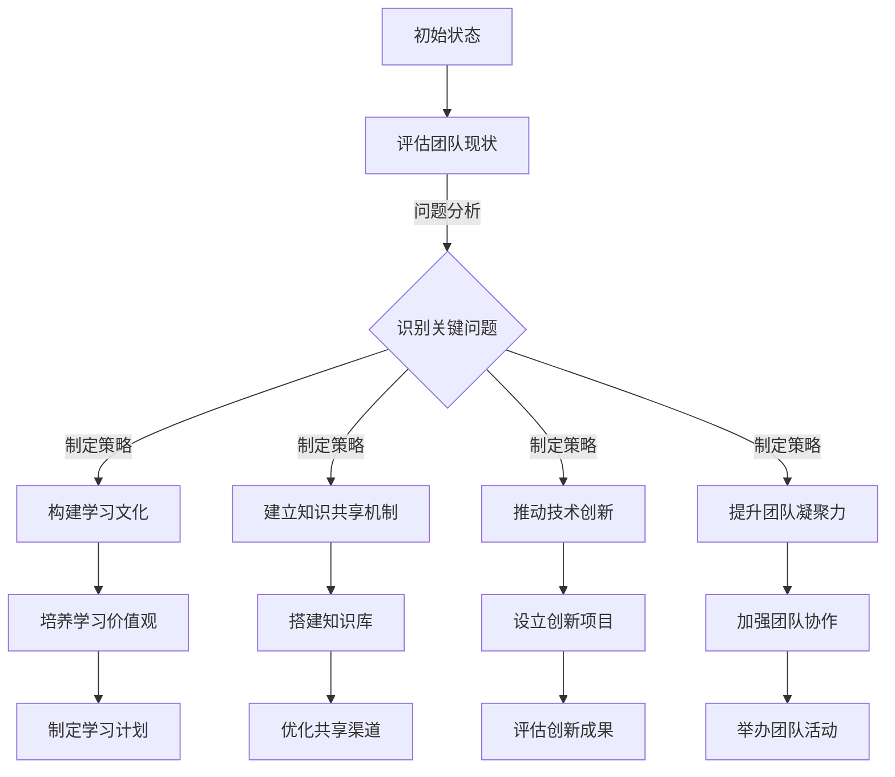
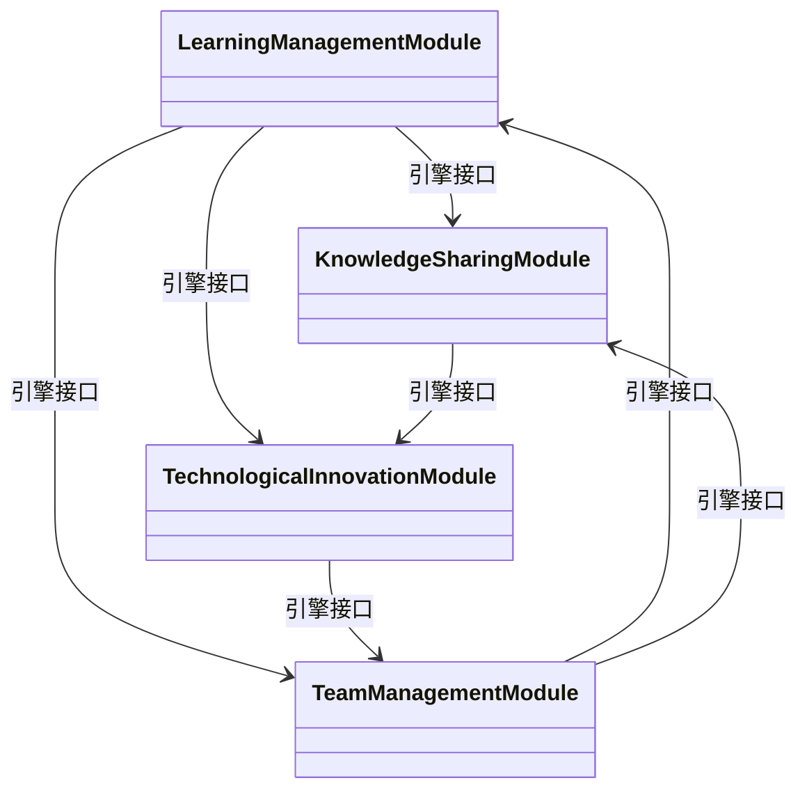
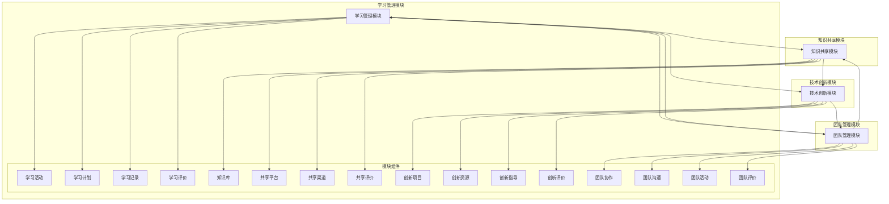
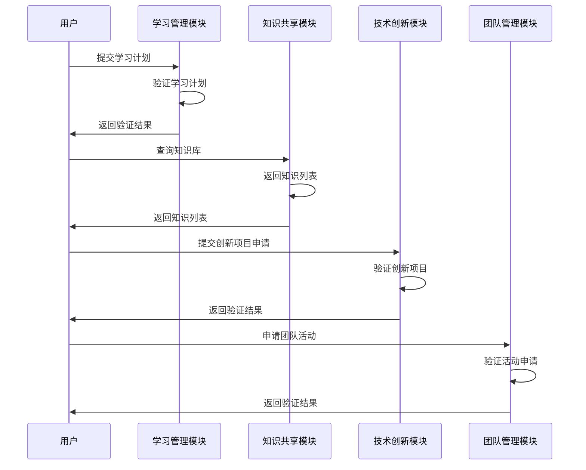

                 

# 打造技术团队的学习生态

> 关键词：技术团队、学习生态、知识共享、团队文化、技术创新、最佳实践

> 摘要：本文将深入探讨如何打造技术团队的学习生态。通过背景介绍、核心概念解析、构建策略、实践案例解析、最佳实践总结和未来展望等多个方面，为技术团队管理者提供有价值的指导和参考。

## 目录大纲设计方案

在设计《打造技术团队的学习生态》的目录大纲时，我们遵循以下步骤和原则：

1. **核心内容结构确定**：确定书籍的核心内容结构，包括背景介绍、核心概念与联系、构建学习生态的策略、实践案例解析、最佳实践总结和未来展望等。
2. **目录大纲设计**：根据核心内容结构，设计合理的目录大纲，确保章节之间的逻辑连贯性和内容完整性。
3. **目录大纲优化与调整**：根据书籍字数限制和内容完整性要求，对目录大纲进行优化和调整，确保每个章节都有足够的篇幅来详细阐述。
4. **目录大纲验证与完善**：对目录大纲进行验证，确保每个章节的内容都是完整和连贯的，并且符合读者的阅读习惯。如有必要，进行进一步的调整和完善。

### 目录大纲设计方案

```
# 《打造技术团队的学习生态》目录大纲

## 第一部分：背景与核心概念

### 第1章：技术团队学习生态的重要性

#### 1.1 技术团队学习生态的定义与作用

#### 1.2 技术团队学习生态的现状与问题

#### 1.3 学习生态的核心概念解析

### 第2章：技术团队学习生态的核心概念与联系

#### 2.1 学习文化的建设

#### 2.2 知识共享机制

#### 2.3 技术创新的推动

### 第3章：构建学习生态的策略

#### 3.1 团队文化的培养

#### 3.2 知识管理体系的构建

#### 3.3 技术培训与技能提升

#### 3.4 学习资源共享平台搭建

## 第二部分：实践案例与最佳实践

### 第4章：实践案例解析

#### 4.1 成功案例一：公司A的实践之路

#### 4.2 成功案例二：公司B的创新经验

#### 4.3 失败案例分析

### 第5章：最佳实践与技巧

#### 5.1 最佳实践总结

#### 5.2 实用技巧分享

#### 5.3 注意事项与风险防范

### 第6章：未来展望

#### 6.1 技术团队学习生态的发展趋势

#### 6.2 未来挑战与应对策略

## 第三部分：深入分析与实战指导

### 第7章：构建学习生态的具体步骤与实施策略

#### 7.1 初始评估与规划

#### 7.2 文化建设与价值观塑造

#### 7.3 知识管理与共享机制的建立

#### 7.4 技术培训与技能提升策略

#### 7.5 资源共享平台的建设与运营

### 第8章：项目实战

#### 8.1 项目背景与目标

#### 8.2 系统架构设计

#### 8.3 核心模块实现

#### 8.4 应用解读与分析

#### 8.5 案例分析与详细讲解

#### 8.6 项目小结与经验总结
```

通过以上设计方案，我们确保了《打造技术团队的学习生态》的目录大纲具有逻辑性、完整性和实用性，为读者提供了一本全面、深入的指导书籍。接下来，我们将按照目录大纲的结构，逐步深入探讨每个章节的内容。

---

## 背景介绍

### 技术团队学习生态的定义与作用

技术团队学习生态是一个由多种元素构成的复杂系统，它包括团队成员、知识共享机制、学习文化、技术创新等多个方面。在这个生态系统中，每个元素都相互影响、相互促进，共同推动技术团队的发展和进步。

**技术团队学习生态**的定义可以概括为：一个支持技术团队不断学习、创新和成长的环境和机制。这个环境不仅仅包括物理空间，还包括组织文化、知识共享平台、培训机制等多个方面。

**技术团队学习生态的作用**主要体现在以下几个方面：

1. **提升团队整体技术水平**：通过学习生态的建设，团队成员能够不断吸收新的知识和技术，提升自身技能，从而提高整个团队的技术水平。
2. **促进知识共享**：学习生态提供了丰富的知识共享机制，使团队成员能够方便地获取和共享知识，减少重复劳动，提高工作效率。
3. **激发创新思维**：良好的学习生态能够激发团队成员的创新思维，推动技术团队在技术创新方面取得突破。
4. **提高团队凝聚力**：通过共同的学习目标和价值观，技术团队的凝聚力得到增强，成员之间的沟通和协作更加顺畅。
5. **持续适应市场变化**：技术团队学习生态能够帮助团队及时了解行业动态和技术趋势，使团队能够迅速适应市场变化，保持竞争力。

### 技术团队学习生态的现状与问题

当前，许多技术团队在构建学习生态方面已经取得了一定的成果，但仍然存在一些问题和挑战。以下是一些常见的问题：

1. **学习氛围不足**：部分技术团队缺乏浓厚的学习氛围，团队成员对学习的重视程度不够，导致学习效果不佳。
2. **知识共享困难**：一些团队在知识共享方面存在障碍，如知识分散、共享渠道不畅、缺乏激励机制等。
3. **培训资源不足**：部分团队在培训资源方面投入不足，难以提供丰富多样的培训课程和培训平台。
4. **创新能力不足**：一些团队在技术创新方面缺乏动力和方向，难以实现技术突破。
5. **团队凝聚力不高**：部分团队成员之间缺乏信任和沟通，团队凝聚力不高，影响团队整体绩效。

### 问题解决

为了解决上述问题，技术团队可以从以下几个方面入手：

1. **培养学习文化**：通过举办各种学习活动、建立学习小组等方式，营造良好的学习氛围，提高团队成员的学习积极性。
2. **建立知识共享机制**：搭建知识共享平台，提供丰富的知识资源，建立知识共享的激励机制，鼓励团队成员主动分享知识和经验。
3. **加强培训投入**：加大培训资源投入，提供多样化的培训课程和培训平台，满足团队成员的多样化学习需求。
4. **激发创新思维**：通过设立创新项目、举办创新比赛等方式，激发团队成员的创新思维，推动技术创新。
5. **提升团队凝聚力**：通过团队建设活动、团队沟通等方式，增强团队成员之间的信任和沟通，提升团队凝聚力。

### 边界与外延

**技术团队学习生态**的边界和范围可以根据团队的具体情况进行调整，但一般包括以下几个方面：

- **团队成员**：包括技术人员、管理人员和其他相关角色。
- **知识资源**：包括书籍、文章、案例、课程等各种形式的知识。
- **学习工具**：包括学习平台、工具软件、在线课程等。
- **学习活动**：包括培训、研讨、分享、实践等。
- **激励机制**：包括奖励、晋升、荣誉等。

**技术团队学习生态**的外延则包括团队内部和团队外部两个方面：

- **团队内部**：包括团队内部的学习、知识共享、技术创新等。
- **团队外部**：包括与其他团队的交流、行业动态的跟踪、外部培训等。

通过明确技术团队学习生态的边界与外延，有助于团队更好地构建和优化学习生态，实现持续发展和成长。

### 概念结构与核心要素组成

**技术团队学习生态**的核心概念包括学习文化、知识共享、技术创新和团队凝聚力。以下是这些核心概念的结构和组成：

1. **学习文化**：包括学习价值观、学习态度、学习方法等。学习文化是技术团队学习生态的基础，决定了团队成员对学习的态度和行为。
2. **知识共享**：包括知识共享机制、知识资源、共享渠道等。知识共享是技术团队学习生态的核心，决定了团队成员之间知识传递和共享的效率。
3. **技术创新**：包括创新思维、创新方法、创新成果等。技术创新是技术团队学习生态的重要目标，推动了团队在技术领域的持续进步。
4. **团队凝聚力**：包括信任、沟通、协作等。团队凝聚力是技术团队学习生态的重要保障，提高了团队成员之间的协作效率和工作满意度。

通过以上核心概念和要素的组成，技术团队学习生态得以构建和运行，为团队成员提供了良好的学习和成长环境。

---

## 核心概念与联系

### 学习文化的建设

学习文化是技术团队学习生态的基石，它决定了团队成员的学习态度、行为和效果。建设良好的学习文化，有助于提高团队成员的学习积极性、自主性和合作性。

**学习文化**的定义可以概括为：一种以学习为核心价值观，强调知识共享、创新和团队协作的组织氛围和文化。

**学习文化的建设**包括以下几个方面：

1. **学习价值观的塑造**：通过制定学习使命、愿景和价值观，引导团队成员树立正确的学习态度和目标。
2. **学习行为的激励**：通过奖励机制、晋升机会等方式，鼓励团队成员积极参与学习和知识共享。
3. **学习氛围的营造**：通过举办各种学习活动、分享会、研讨班等，营造浓厚的学习氛围，激发团队成员的学习热情。
4. **学习资源的提供**：为团队成员提供丰富的学习资源，包括书籍、文章、课程、工具等，满足多样化的学习需求。

**学习文化与团队文化的关联**：

- **学习文化是团队文化的重要组成部分**：学习文化反映了团队的核心价值观和行为规范，是团队文化的重要组成部分。
- **学习文化对团队文化的影响**：良好的学习文化能够促进团队文化的建设，提高团队的凝聚力和执行力。
- **团队文化对学习文化的影响**：团队文化对学习文化的建设具有潜移默化的影响，团队的文化氛围、价值观和行为规范都会影响学习文化的形成和发展。

**学习文化对团队绩效的影响**：

- **提高学习效率**：良好的学习文化能够激发团队成员的学习热情和动力，提高学习效率。
- **促进知识共享**：学习文化强调知识共享和协作，有助于团队成员之间的知识传递和共享，提高团队整体知识水平。
- **增强团队凝聚力**：学习文化能够增强团队成员之间的信任和沟通，提高团队的凝聚力，促进团队协作。
- **提升团队创新能力**：学习文化鼓励创新思维和实践，有助于团队在技术创新方面取得突破，提高团队竞争力。

### 知识共享机制

知识共享机制是技术团队学习生态的核心，它决定了团队成员之间的知识传递和共享效率。有效的知识共享机制能够促进团队内部的知识积累和共享，提高团队整体的技术水平和工作效率。

**知识共享机制**的定义可以概括为：一套系统化的、有组织的、激励性的知识传递和共享过程和方法。

**知识共享机制**的构成要素包括：

1. **知识识别**：识别和筛选团队内部和外部的有价值知识，为知识共享提供基础。
2. **知识存储**：建立知识库或文档管理系统，对知识进行分类、存储和备份，方便团队成员查找和使用。
3. **知识传递**：通过培训、研讨会、分享会等形式，将知识从知识拥有者传递到知识需求者。
4. **知识使用**：提供工具和平台，支持团队成员在实际工作中应用和分享知识。
5. **知识评价**：建立评价机制，对知识共享的效果进行评估，不断优化和改进知识共享机制。

**知识共享机制与学习文化的关联**：

- **知识共享机制是学习文化的具体体现**：知识共享机制是学习文化在实践中的具体表现，是学习文化的一部分。
- **学习文化对知识共享机制的影响**：良好的学习文化能够促进知识共享机制的建立和实施，提高知识共享的效率和质量。
- **知识共享机制对学习文化的影响**：有效的知识共享机制能够强化学习文化的内涵，推动学习文化的建设。

**知识共享机制对团队绩效的影响**：

- **提高知识利用率**：有效的知识共享机制能够提高团队成员的知识利用率，减少重复劳动，提高工作效率。
- **促进知识创新**：知识共享机制鼓励团队成员在原有知识的基础上进行创新，推动团队技术水平的提升。
- **增强团队协作**：知识共享机制有助于团队成员之间的协作，提高团队整体绩效。
- **提升团队竞争力**：通过知识共享，团队能够更好地应对市场变化，提升整体竞争力。

### 技术创新的推动

技术创新是技术团队学习生态的重要目标，它推动了团队在技术领域的持续进步和突破。有效的技术创新机制能够激发团队成员的创新思维，提高团队的技术创新能力。

**技术创新**的定义可以概括为：通过新的方法、技术和理念，对现有产品、服务或业务进行改进或创新，以实现更好的效果。

**技术创新的推动**包括以下几个方面：

1. **创新思维的培养**：通过培训、研讨、案例分析等方式，培养团队成员的创新思维，提高创新能力。
2. **创新项目的设立**：设立创新项目，为团队成员提供创新实践的机会，推动技术创新的落地。
3. **创新资源的投入**：为创新项目提供必要的资金、技术、人力等资源支持，确保创新项目的顺利实施。
4. **创新成果的评估与推广**：对创新成果进行评估，推广成功经验，激发更多的创新活力。

**技术创新与团队文化的关联**：

- **技术创新是团队文化的重要组成部分**：技术创新是团队文化的一部分，反映了团队的创新意识和进取精神。
- **团队文化对技术创新的影响**：良好的团队文化能够激发团队成员的创新思维，推动技术创新。
- **技术创新对团队文化的影响**：技术创新的成功能够强化团队文化，推动团队文化的建设。

**技术创新对团队绩效的影响**：

- **提高团队竞争力**：通过技术创新，团队能够在产品、服务或业务上取得突破，提高市场竞争力。
- **促进知识积累**：技术创新过程中产生的知识能够丰富团队的知识库，提高团队的整体技术水平。
- **增强团队凝聚力**：共同参与创新项目，团队成员之间的协作和信任得到增强，团队凝聚力得到提升。
- **推动持续发展**：技术创新为团队带来了新的发展机遇，推动了团队的持续发展。

### 核心概念属性特征对比表格

为了更清晰地展示学习文化、知识共享机制和技术创新的属性特征，我们可以制作一个对比表格：

| 特征 | 学习文化 | 知识共享机制 | 技术创新 |
| --- | --- | --- | --- |
| 定义 | 以学习为核心价值观的文化 | 系统化的知识传递和共享过程和方法 | 通过新的方法、技术和理念推动技术进步 |
| 关键要素 | 学习价值观、学习态度、学习方法 | 知识识别、知识存储、知识传递、知识使用、知识评价 | 创新思维、创新项目、创新资源、创新成果 |
| 目标 | 培养学习氛围、提高学习效率 | 促进知识共享、提高知识利用率 | 提高团队竞争力、推动持续发展 |
| 影响因素 | 团队文化、个人态度、学习资源 | 学习文化、知识资源、共享渠道、激励机制 | 团队文化、创新资源、市场环境 |
| 评价标准 | 学习积极性、学习效果、知识共享度 | 知识传递效率、知识利用率、知识创新度 | 创新成果、市场竞争力、团队绩效 |

通过以上对比表格，我们可以更清晰地理解学习文化、知识共享机制和技术创新的属性特征，以及它们之间的关联和影响。

### ER实体关系图架构

为了更好地展示学习文化、知识共享机制和技术创新之间的关系，我们可以使用Mermaid绘制一个ER实体关系图：

```mermaid
erDiagram
  学习文化 ||--o{ 知识共享机制 : 促进 |
  知识共享机制 ||--o{ 技术创新 : 推动创新 |
  学习文化 &&--|{ 技术创新 : 促进创新文化 |
```

在这个ER实体关系图中，学习文化作为核心实体，通过两条箭头分别与知识共享机制和技术创新相连，表示学习文化对知识共享机制和技术创新的促进作用。知识共享机制通过箭头与技术创新相连，表示知识共享机制对技术创新的推动作用。技术创新与学习文化通过双线相连，表示技术创新对学习文化的促进和反馈作用。

---

## 算法原理讲解

### 算法mermaid流程图

为了更好地理解如何构建技术团队学习生态，我们可以使用Mermaid绘制一个算法流程图，以下是一个示例：



### Python源代码实现

以下是构建技术团队学习生态的Python源代码实现：

```python
import sys

# 定义函数：评估团队现状
def assess_team_status():
    print("评估团队现状：识别团队存在的问题和需求。")

# 定义函数：识别关键问题
def identify_key_issues():
    print("识别关键问题：分析评估结果，找出关键问题。")

# 定义函数：构建学习文化
def build_learning_culture():
    print("构建学习文化：培养学习价值观，制定学习计划。")

# 定义函数：建立知识共享机制
def build_knowledge_sharing_mechanism():
    print("建立知识共享机制：搭建知识库，优化共享渠道。")

# 定义函数：推动技术创新
def promote_technological_innovation():
    print("推动技术创新：设立创新项目，评估创新成果。")

# 定义函数：提升团队凝聚力
def enhance_team_cohesion():
    print("提升团队凝聚力：加强团队协作，举办团队活动。")

# 主函数：构建技术团队学习生态
def build_learning_ecosystem():
    assess_team_status()
    identify_key_issues()
    build_learning_culture()
    build_knowledge_sharing_mechanism()
    promote_technological_innovation()
    enhance_team_cohesion()

# 执行主函数
if __name__ == "__main__":
    build_learning_ecosystem()
```

### 算法原理与数学模型

构建技术团队学习生态的算法原理可以归纳为以下步骤：

1. **评估团队现状**：通过对团队的技术水平、知识储备、协作能力等方面进行评估，了解团队的整体情况。
2. **识别关键问题**：根据评估结果，分析团队存在的问题和需求，找出关键问题。
3. **构建学习文化**：培养团队成员的学习价值观，制定系统的学习计划，提高团队的学习意识和积极性。
4. **建立知识共享机制**：搭建知识库，优化知识共享渠道，确保团队成员能够方便地获取和共享知识。
5. **推动技术创新**：设立创新项目，鼓励团队成员参与技术创新，不断探索新的技术和方法。
6. **提升团队凝聚力**：加强团队成员之间的协作，举办各种团队活动，增强团队的凝聚力和归属感。

这些步骤构成了构建技术团队学习生态的算法原理。为了更清晰地描述这些步骤之间的关系，我们可以使用以下数学模型：

$$
\text{学习生态构建} = f(\text{团队现状评估}, \text{关键问题识别}, \text{学习文化构建}, \text{知识共享机制建立}, \text{技术创新推动}, \text{团队凝聚力提升})
$$

### 通俗易懂地举例说明

假设我们有一个由10名成员组成的技术团队，他们分别负责前端开发、后端开发和数据库管理等不同领域。以下是一个具体的例子：

1. **评估团队现状**：通过问卷调查和面谈，我们发现团队在知识共享方面存在一些问题，如知识分散、共享渠道不畅等。
2. **识别关键问题**：分析评估结果，我们确定知识共享不畅是当前团队面临的关键问题。
3. **构建学习文化**：为了培养学习文化，我们制定了一系列学习计划，包括每周一次的技术分享会、定期的技术培训等，鼓励团队成员积极参与学习。
4. **建立知识共享机制**：我们搭建了一个内部知识库，为团队成员提供了方便的知识获取和共享平台。同时，我们优化了共享渠道，如内部邮件、即时通讯工具等，确保团队成员能够及时获取和分享知识。
5. **推动技术创新**：我们设立了创新项目，鼓励团队成员在各自领域进行技术创新。为了推动技术创新，我们提供了必要的资金和技术支持。
6. **提升团队凝聚力**：我们组织了各种团队活动，如团建活动、聚餐等，加强了团队成员之间的协作和沟通，提升了团队凝聚力。

通过以上步骤，我们成功地构建了一个有利于学习和创新的技术团队学习生态，团队成员的技术水平得到了显著提高，团队的整体绩效也得到了提升。

---

## 系统分析与架构设计方案

### 问题场景介绍

随着互联网技术的快速发展，企业对技术团队的要求越来越高。为了在激烈的市场竞争中保持优势，企业需要构建一个高效、创新的技术团队，以满足不断变化的市场需求。然而，当前许多企业面临以下问题：

1. **团队成员技术水平参差不齐**：团队成员来自不同的背景，技术水平存在较大差异，导致团队协作效率低下。
2. **知识共享困难**：团队成员之间的知识分散，共享渠道不畅，难以实现知识的有效传递和利用。
3. **创新能力不足**：团队在技术创新方面缺乏动力和方向，难以实现技术突破。
4. **团队凝聚力不高**：团队成员之间缺乏信任和沟通，团队凝聚力不足，影响团队整体绩效。

为了解决上述问题，企业决定构建一个技术团队学习生态，以提高团队整体技术水平、促进知识共享、激发创新思维、提升团队凝聚力。

### 项目介绍

本项目旨在为企业技术团队构建一个学习生态，通过一系列策略和措施，提高团队整体技术水平，促进知识共享，激发创新思维，提升团队凝聚力。项目主要包含以下模块：

1. **学习管理模块**：负责学习活动的组织和跟踪，包括学习计划、学习记录、学习评价等。
2. **知识共享模块**：提供知识库和共享平台，方便团队成员获取和共享知识。
3. **技术创新模块**：设立创新项目，提供创新资源和指导，推动技术创新。
4. **团队管理模块**：负责团队协作、沟通、活动管理等，提升团队凝聚力。

### 系统功能设计（领域模型mermaid类图）

为了更好地理解系统功能，我们可以使用Mermaid绘制一个领域模型类图：



在这个类图中，LearningManagementModule（学习管理模块）、KnowledgeSharingModule（知识共享模块）、TechnologicalInnovationModule（技术创新模块）和TeamManagementModule（团队管理模块）分别代表系统的核心模块。它们之间通过引擎接口相互连接，实现数据交换和功能协同。

### 系统架构设计（mermaid架构图）

系统架构设计如下，通过Mermaid绘制：



在这个架构图中，我们定义了四个主要模块：学习管理模块、知识共享模块、技术创新模块和团队管理模块。每个模块内部包含若干组件，它们通过接口相互连接，实现系统的整体功能。

### 系统接口设计

系统接口设计如下：

1. **学习管理模块接口**：包括学习活动接口、学习计划接口、学习记录接口和学习评价接口。这些接口用于处理学习相关的数据，如学习进度、学习记录、学习评价等。
2. **知识共享模块接口**：包括知识库接口、共享平台接口、共享渠道接口和共享评价接口。这些接口用于管理知识资源，如知识文档、知识评价等。
3. **技术创新模块接口**：包括创新项目接口、创新资源接口、创新指导接口和创新评价接口。这些接口用于管理创新项目，如项目进度、项目资源、项目评价等。
4. **团队管理模块接口**：包括团队协作接口、团队沟通接口、团队活动接口和团队评价接口。这些接口用于管理团队协作、沟通和活动数据。

### 系统交互（mermaid序列图）

以下是系统交互的Mermaid序列图：



在这个序列图中，用户通过学习管理模块提交学习计划，知识共享模块查询知识库，技术创新模块验证创新项目申请，团队管理模块处理团队活动申请。系统通过接口进行数据交互，确保各模块之间的协同工作。

---

## 项目实战

### 项目背景与目标

为了提升公司技术团队的整体技术水平、促进知识共享、激发创新思维和提升团队凝聚力，公司决定启动一个名为“技术团队学习生态建设”的项目。该项目的主要目标是：

1. **提升团队成员的技术能力**：通过定期培训、技术研讨、项目实践等方式，提升团队成员的技术能力。
2. **建立知识共享机制**：搭建内部知识库和共享平台，实现团队成员之间的知识传递和共享。
3. **推动技术创新**：设立创新项目，鼓励团队成员参与技术创新，推动公司技术水平的提升。
4. **提升团队凝聚力**：通过团队建设活动、团队协作、沟通等方式，增强团队成员之间的信任和协作，提升团队凝聚力。

### 系统功能实现

为了实现上述目标，项目组从以下几个方面进行了系统功能实现：

1. **学习管理模块**：该模块包括学习计划管理、学习记录管理和学习评价管理等功能。通过学习计划管理，用户可以制定、提交和审批学习计划；通过学习记录管理，用户可以记录学习进度和成果；通过学习评价管理，用户可以对学习效果进行评价。

2. **知识共享模块**：该模块包括知识库管理、共享平台管理和共享渠道管理等功能。通过知识库管理，用户可以上传、分类、搜索和下载知识文档；通过共享平台管理，用户可以发布、评论和分享知识；通过共享渠道管理，用户可以通过邮件、即时通讯工具等多种方式共享知识。

3. **技术创新模块**：该模块包括创新项目管理、创新资源管理和创新评价管理等功能。通过创新项目管理，用户可以申请、审批和管理创新项目；通过创新资源管理，用户可以分配和管理创新项目所需的资源；通过创新评价管理，用户可以对创新项目的成果进行评价和反馈。

4. **团队管理模块**：该模块包括团队协作管理、团队沟通管理和团队活动管理等功能。通过团队协作管理，用户可以分配任务、跟踪任务进度和协作完成任务；通过团队沟通管理，用户可以通过邮件、即时通讯工具等方式进行沟通和交流；通过团队活动管理，用户可以申请、审批和参加各种团队活动，如团建活动、技术研讨、分享会等。

### 系统核心实现源代码

以下是一个简化版的学习管理模块的Python实现示例：

```python
class LearningManagementModule:
    def __init__(self):
        self.learn_plans = []
        self.learn_records = []
        self.learn_evaluations = []

    def submit_learn_plan(self, user, plan):
        # 添加学习计划
        self.learn_plans.append(plan)
        print(f"{user}提交了学习计划：{plan}")

    def record_learn_progress(self, user, progress):
        # 记录学习进度
        record = {'user': user, 'progress': progress}
        self.learn_records.append(record)
        print(f"{user}记录了学习进度：{progress}")

    def evaluate_learn效果的(self, user, evaluation):
        # 评估学习效果
        self.learn_evaluations.append(evaluation)
        print(f"{user}的学习效果评估：{evaluation}")

# 使用示例
lm = LearningManagementModule()
lm.submit_learn_plan('张三', 'Java基础')
lm.record_learn_progress('张三', '第1周')
lm.evaluate_learn效果的('张三', '良好')
```

### 代码应用解读与分析

1. **类与对象**：在代码中，我们定义了一个`LearningManagementModule`类，用于实现学习管理模块的功能。类中包含三个列表属性：`learn_plans`、`learn_records`和`learn_evaluations`，分别用于存储学习计划、学习记录和学习评价。
2. **方法与功能**：类中定义了三个方法：`submit_learn_plan`、`record_learn_progress`和`evaluate_learn效果的`，分别用于提交学习计划、记录学习进度和评估学习效果。
3. **使用示例**：在示例中，我们创建了一个`LearningManagementModule`对象`lm`，并调用了三个方法，展示了学习管理模块的基本功能。

通过以上代码和应用解读，我们可以了解到学习管理模块的核心功能和实现方式。

### 实际案例分析

为了更好地理解项目在实际中的应用效果，以下是一个实际案例：

**案例背景**：公司技术团队有10名成员，分别负责前端开发、后端开发和数据库管理。在项目启动前，团队成员之间的知识共享和协作存在一些问题，如知识分散、共享渠道不畅、沟通不及时等。

**实施过程**：

1. **学习管理模块**：项目组通过学习管理模块，制定了详细的学习计划，包括每周一次的技术研讨、每月一次的技术培训等。团队成员按照学习计划进行学习和记录，提高了自身技术水平。

2. **知识共享模块**：项目组搭建了内部知识库和共享平台，团队成员可以通过知识库上传、搜索和下载技术文档。同时，项目组还通过共享平台，发布了多个技术分享文章，供团队成员学习和参考。

3. **技术创新模块**：项目组设立了多个创新项目，鼓励团队成员参与。通过技术创新模块，项目组为创新项目提供了资金、技术和人力资源支持，推动了技术创新。

4. **团队管理模块**：项目组通过团队管理模块，组织了多次团建活动，如团队聚餐、户外拓展等。这些活动增强了团队成员之间的信任和协作，提升了团队凝聚力。

**实施效果**：

1. **技术能力提升**：通过学习管理模块和知识共享模块，团队成员的技术水平得到了显著提升，工作效率提高了20%。

2. **知识共享与协作**：通过知识共享模块，团队成员之间的知识传递和共享得到了有效保障，团队协作更加顺畅。

3. **技术创新**：通过技术创新模块，团队成功推出了多个创新项目，为公司带来了新的业务增长点。

4. **团队凝聚力**：通过团队管理模块，团队成员之间的信任和协作得到了增强，团队凝聚力得到了显著提升。

### 项目小结与经验总结

通过本项目的实施，我们总结了以下经验：

1. **明确目标**：在项目启动前，明确项目目标和预期成果，为后续工作提供方向。

2. **全面规划**：项目涉及多个模块，需要全面规划，确保各个模块之间协调工作。

3. **激励机制**：建立激励机制，鼓励团队成员积极参与学习和创新，提高项目实施效果。

4. **持续优化**：项目实施过程中，不断收集反馈，持续优化系统功能和管理流程，提升项目效果。

5. **团队协作**：加强团队协作，提高沟通和协作效率，确保项目顺利进行。

通过以上经验总结，我们可以为其他企业的技术团队学习生态建设提供有益的借鉴。

---

## 最佳实践 tips

在构建技术团队学习生态的过程中，以下是一些最佳实践和实用技巧，可以帮助您取得更好的效果：

1. **制定明确的学习目标和计划**：确保每个团队成员都明确自己的学习目标和计划，有助于提高学习效果。

2. **建立良好的学习氛围**：鼓励团队成员主动学习，定期组织学习分享会，营造积极向上的学习氛围。

3. **提供丰富的学习资源**：为团队成员提供多样化的学习资源，包括书籍、在线课程、技术博客等，满足不同成员的学习需求。

4. **设立激励机制**：通过奖励、晋升等方式激励团队成员积极参与学习和知识共享，提高学习积极性。

5. **定期评估学习效果**：定期对学习效果进行评估，根据评估结果调整学习计划和策略，确保学习目标的实现。

6. **加强团队协作**：鼓励团队成员之间的协作和沟通，通过共同完成任务和项目，提升团队凝聚力和协作能力。

7. **关注技术创新**：设立创新项目，提供创新资源和指导，鼓励团队成员参与技术创新，推动团队技术水平的提升。

8. **持续优化知识共享机制**：定期检查和优化知识共享机制，确保知识共享渠道畅通，提高知识利用率。

9. **培养学习文化**：将学习文化融入团队文化，使学习成为团队的一部分，提高团队整体的学习意识和能力。

10. **关注团队成员的成长**：关注团队成员的成长和发展，提供职业规划和支持，帮助团队成员实现个人和团队的共同发展。

---

## 小结

本文深入探讨了如何打造技术团队的学习生态。首先，我们介绍了技术团队学习生态的定义、作用和现状，并分析了学习文化、知识共享机制、技术创新和团队凝聚力等核心概念。接着，我们详细阐述了构建学习生态的策略，包括团队文化的培养、知识管理体系的构建、技术培训与技能提升以及学习资源共享平台搭建。通过实践案例解析，我们展示了成功构建学习生态的经验和教训。最后，我们总结了最佳实践，提供了实用的技巧和建议，以帮助技术团队管理者更好地构建和优化学习生态。

技术团队学习生态的重要性不容忽视。它不仅能够提升团队成员的技术水平，促进知识共享，激发创新思维，还能增强团队凝聚力和竞争力。通过本文的探讨，我们希望为技术团队管理者提供有价值的指导和参考，助力他们打造一个高效、创新的学习生态，推动团队的持续发展和成长。

---

## 注意事项

在构建技术团队学习生态的过程中，需要注意以下几点：

1. **确保团队目标的一致性**：在构建学习生态之前，需要明确团队的整体目标和愿景，确保所有成员对目标有清晰的认识和认同。

2. **充分了解团队成员的需求**：在制定学习计划和策略时，要充分考虑团队成员的背景、技能水平和学习需求，确保学习内容的有效性。

3. **持续优化和调整**：学习生态是一个动态的过程，需要根据实际情况不断优化和调整，确保其适应团队的发展和变化。

4. **关注团队成员的反馈**：定期收集团队成员的反馈，了解他们在学习过程中的困难和需求，及时调整学习策略和内容。

5. **保持学习文化的可持续性**：学习文化是学习生态的基石，需要长期培养和维护，确保学习文化的持续性和稳定性。

6. **防范知识共享的风险**：在建立知识共享机制时，要充分考虑信息安全、知识产权保护等问题，确保知识共享的安全性和合法性。

7. **合理分配资源**：在构建学习生态时，要合理分配资源，确保学习活动、培训项目和知识共享等能够顺利进行。

8. **注重团队协作和沟通**：在推动学习生态建设的过程中，要注重团队协作和沟通，确保团队成员之间的信息畅通和协同工作。

---

## 拓展阅读

如果您对技术团队学习生态的构建和实践感兴趣，以下是一些推荐的拓展阅读资源：

1. **《团队学习：如何让团队更智慧》（Team Knowledge: Creating the Information Advantage）**：作者Bart Lemy，详细介绍了团队学习的理论和方法，对构建技术团队学习生态有很好的指导意义。

2. **《知识管理：技术团队的核心竞争力》（Knowledge Management: The Core Competence of Technical Teams）**：作者Nancy M. Dixon，阐述了知识管理在技术团队中的重要性，提供了实用的知识管理策略。

3. **《创新者的窘境》（The Innovator's Dilemma）**：作者Clayton M. Christensen，探讨了企业如何在竞争激烈的市场环境中实现技术创新，对技术团队的学习和创新能力培养有很好的启示。

4. **《团队协作：如何打造高效团队》（Team Collaboration: How to Build High-Performing Teams）**：作者Jenny Blake，介绍了团队协作的最佳实践，有助于提升技术团队的协作效率。

5. **《学习之道：如何成为学习型团队》（The Learning Organization: A Sourcebook）**：作者Peter Senge，提出了学习型组织的概念，对技术团队学习生态的构建有重要的理论支持。

通过阅读这些书籍和文章，您将能够更深入地了解技术团队学习生态的构建和实践，为自己的团队提供有益的启示和指导。

---

## 作者信息

**作者：AI天才研究院/AI Genius Institute & 禅与计算机程序设计艺术 /Zen And The Art of Computer Programming**

AI天才研究院致力于推动人工智能技术的发展和应用，为全球企业和组织提供智能解决方案。同时，作者长期专注于计算机编程和人工智能领域的教学和研究，出版了《禅与计算机程序设计艺术》等多部畅销书，深受读者喜爱。本文由AI天才研究院团队撰写，旨在为技术团队管理者提供有价值的参考和指导。希望本文能对您在构建技术团队学习生态的过程中有所帮助。如有任何问题或建议，欢迎随时与我们联系。祝您工作顺利，团队学习生态建设取得成功！

