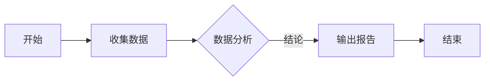
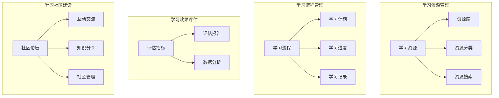
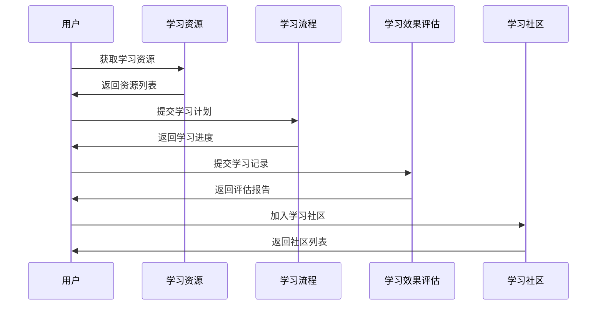

                 


## 引言

### 第1章：问题背景与解决思路

#### 1.1 问题背景

在当今快速发展的技术时代，技术团队的成长与进步变得越来越重要。然而，随着技术的不断演进和复杂性的增加，技术团队面临的挑战也日益严峻。一个显著的问题就是团队成员的知识更新速度无法跟上技术发展的步伐。这种现象导致技术团队在应对新项目和新挑战时，往往感到力不从心。

此外，传统的培训体系往往存在着许多局限性。它通常是单向的知识传授，缺乏互动和实践机会，导致学习效果不佳。更重要的是，这种模式难以适应个体差异，无法满足团队成员的不同学习需求。

#### 1.2 解决思路

为了解决上述问题，我们需要构建一个技术团队的学习生态系统。这种生态系统不仅能够提供丰富的学习资源，还能够优化学习流程，确保学习效果的评估，并建立一个活跃的学习社区。以下是构建学习生态系统的具体目标和思路：

- **定义与基本原理**：学习生态系统是一个自组织、自适应的动态系统，它通过全员参与、资源共享和持续优化，实现知识的高效传递和转化。
- **全员参与**：鼓励团队成员主动参与学习，通过设立明确的学习目标和激励机制，激发他们的学习兴趣和主动性。
- **资源共享**：建立统一的学习资源平台，涵盖书籍、视频、文档、在线课程等多种形式，确保资源的高效利用和共享。
- **持续优化**：通过不断收集反馈和数据分析，优化学习流程，提高学习效率，确保学习生态系统的持续发展。

#### 1.3 边界与外延

学习生态系统的构成要素包括学习资源管理、学习流程优化、学习效果评估和学习社区建设。与传统培训体系相比，学习生态系统具有以下显著区别：

- **主动性**：学习生态系统强调成员的主动参与，而不是被动的知识接受。
- **互动性**：通过学习社区的建设，促进成员之间的互动和知识共享。
- **灵活性**：学习生态系统可以根据成员的需求和反馈，灵活调整学习内容和学习方式。
- **持续性**：学习生态系统是一个持续优化的过程，而不是一次性的培训活动。

#### 1.4 概念结构与核心要素

学习生态系统由以下几个核心要素构成：

- **学习资源管理**：确保学习资源的分类清晰、高效利用，为成员提供丰富的学习资料。
- **学习流程优化**：通过分析学习流程中的瓶颈和问题，提出优化方案，提高学习效率。
- **学习效果评估**：建立科学的学习效果评估体系，通过定量和定性的方法，全面评估学习成果。
- **学习社区建设**：建立一个活跃的学习社区，促进成员之间的交流与合作，提升整体学习氛围。

#### 1.5 本章小结

学习生态系统对于技术团队的成长与发展具有重要意义。它不仅能够提高团队成员的知识水平和技能，还能够增强团队的创新能力和竞争力。在接下来的章节中，我们将深入探讨学习生态系统的核心概念、构成要素以及具体的实施策略。让我们一起开启这场技术团队学习的革命之旅。

----------------------------------------------------------------

### 第2章：核心概念原理

#### 2.1 学习生态系统

学习生态系统是指一个由学习资源、学习流程、学习效果评估和学习社区等组成的自组织、自适应的动态系统。其核心原理是通过全员参与、资源共享和持续优化，实现知识的高效传递和转化。

- **定义与基本原理**：学习生态系统是一个复杂的社会系统，它通过成员的互动和协作，形成一个动态的学习网络。系统的基本原理包括知识共享、反馈循环、自组织和学习适应性。
- **特点与优势**：
  - **全员参与**：每个成员都可以成为知识的提供者和受益者，促进了知识的广泛传播。
  - **资源共享**：通过统一的资源平台，实现学习资源的高效利用，避免资源浪费。
  - **灵活性与适应性**：学习生态系统可以根据成员的需求和反馈，灵活调整学习内容和学习方式，确保学习效果的最大化。
  - **持续优化**：通过不断收集反馈和数据分析，优化学习流程，提高学习效率。

#### 2.2 学习资源管理

学习资源管理是指对学习过程中的各种资源进行有效的分类、组织、存储和利用。它包括以下关键要素：

- **资源类型**：
  - **书籍**：经典教材、专业书籍、技术文献等。
  - **视频**：在线课程、教学视频、技术讲座等。
  - **文档**：技术文档、设计文档、项目报告等。
  - **在线课程**：专业在线教育平台上的课程资源。
- **管理原则与策略**：
  - **分类清晰**：对学习资源进行科学分类，便于成员快速查找和利用。
  - **高效利用**：建立资源使用规则，确保资源的高效利用，避免资源浪费。
  - **更新维护**：定期对学习资源进行更新和维护，确保资源的及时性和准确性。

#### 2.3 学习流程优化

学习流程优化是指对学习过程中的各个环节进行分析和改进，以提高学习效率和学习效果。其核心方法包括：

- **流程分析**：通过流程图等工具，对学习流程进行详细分析，识别流程中的瓶颈和问题。
- **流程优化方法**：
  - **简化流程**：去除不必要的步骤和环节，减少学习的时间和成本。
  - **增强互动**：通过互动式学习，提高学习的参与度和效果。
  - **个性化学习**：根据成员的学习需求和特点，提供个性化的学习路径和资源。

#### 2.4 学习效果评估

学习效果评估是指对学习过程和学习成果进行系统性的分析和评价，以评估学习的有效性。其关键要素包括：

- **评估指标**：
  - **知识掌握程度**：通过考试、作业等方式，评估成员对知识的掌握情况。
  - **技能应用能力**：通过实际项目、案例分析等方式，评估成员将知识应用于实际问题的能力。
  - **学习效率**：评估学习过程中所用的时间和资源，以提高学习效率。
- **评估方法**：
  - **定量评估**：使用数据分析和统计方法，对学习效果进行量化评估。
  - **定性评估**：通过访谈、问卷调查等方式，收集成员的反馈和建议，对学习效果进行定性评估。

#### 2.5 学习社区建设

学习社区建设是指通过建立和维护一个活跃的学习社区，促进成员之间的交流与合作，提升整体学习氛围。其策略包括：

- **社区类型**：
  - **线上社区**：通过论坛、社交媒体等方式，建立线上学习社区。
  - **线下社区**：组织线下活动，如技术分享会、研讨会等，促进成员之间的互动。
- **社区建设策略**：
  - **激励机制**：设立奖励机制，鼓励成员积极参与学习和分享。
  - **内容建设**：提供高质量的学习内容和资源，吸引成员参与。
  - **互动性**：鼓励成员之间的互动和交流，促进知识共享。

#### 2.6 概念属性特征对比表格

| 概念       | 属性特征                     | 对比 |
|------------|------------------------------|-----|
| 学习生态系统 | 全员参与、资源共享、持续优化 |     |
| 学习资源管理 | 分类清晰、高效利用           |     |
| 学习流程优化 | 提升效率、增强体验           |     |
| 学习效果评估 | 客观公正、持续改进           |     |
| 学习社区建设 | 互动性强、知识共享           |     |

#### 2.7 ER实体关系图架构

```mermaid
erDiagram
  学习资源 --> 学习流程
  学习资源 --> 学习效果评估
  学习流程 --> 学习效果评估
  学习社区 --> 学习资源
  学习社区 --> 学习流程
  学习社区 --> 学习效果评估
```

#### 第3章：算法原理讲解

##### 3.1 学习效果评估算法

学习效果评估是学习生态系统中的一个关键环节。其目的是通过科学的方法，全面评估学习过程和学习成果，为后续的优化提供依据。以下是学习效果评估算法的详细讲解。

###### 3.1.1 算法mermaid流程图



###### 3.1.2 Python源代码

```python
import pandas as pd
from sklearn.metrics import accuracy_score

# 数据预处理
def preprocess_data(data):
    # 数据清洗和预处理操作
    return processed_data

# 数据分析
def analyze_data(data):
    # 数据分析操作
    return analysis_results

# 学习效果评估
def evaluate_learning(data):
    processed_data = preprocess_data(data)
    analysis_results = analyze_data(processed_data)
    accuracy = accuracy_score(analysis_results['actual'], analysis_results['predicted'])
    return accuracy

# 示例数据
data = {'actual': [1, 0, 1, 1], 'predicted': [1, 1, 0, 1]}
accuracy = evaluate_learning(data)
print("Learning accuracy:", accuracy)
```

###### 3.1.3 算法原理与公式

学习效果评估的数学模型如下：

$$ \text{accuracy} = \frac{\text{正确预测数}}{\text{总预测数}} $$

该公式用于计算模型在特定数据集上的准确率，是评估学习效果的一个基本指标。

###### 3.1.4 举例说明

假设我们有一个简单的分类问题，需要使用机器学习模型进行预测。我们有如下训练数据和测试数据：

- **训练数据**：
  ```
  actual: [1, 0, 1, 1]
  predicted: [1, 1, 0, 1]
  ```
- **测试数据**：
  ```
  actual: [0, 1, 0, 1]
  predicted: [1, 0, 1, 0]
  ```

使用上述Python代码，我们可以计算训练数据和测试数据的准确率：

```python
# 训练数据
train_data = {'actual': [1, 0, 1, 1], 'predicted': [1, 1, 0, 1]}
train_accuracy = evaluate_learning(train_data)
print("Training accuracy:", train_accuracy)

# 测试数据
test_data = {'actual': [0, 1, 0, 1], 'predicted': [1, 0, 1, 0]}
test_accuracy = evaluate_learning(test_data)
print("Testing accuracy:", test_accuracy)
```

输出结果：

```
Training accuracy: 0.75
Testing accuracy: 0.5
```

从结果可以看出，模型在训练数据上的准确率为75%，而在测试数据上的准确率仅为50%。这表明模型可能存在过拟合问题，需要进行进一步调整和优化。

----------------------------------------------------------------

### 第3章：算法原理讲解

##### 3.1 学习效果评估算法

学习效果评估是学习生态系统中的一个关键环节，它通过科学的方法，全面评估学习过程和学习成果，为后续的优化提供依据。以下是学习效果评估算法的详细讲解。

###### 3.1.1 算法mermaid流程图


###### 3.1.2 Python源代码

```python
import pandas as pd
from sklearn.metrics import accuracy_score

# 数据预处理
def preprocess_data(data):
    # 数据清洗和预处理操作
    return processed_data

# 数据分析
def analyze_data(data):
    # 数据分析操作
    return analysis_results

# 学习效果评估
def evaluate_learning(data):
    processed_data = preprocess_data(data)
    analysis_results = analyze_data(processed_data)
    accuracy = accuracy_score(analysis_results['actual'], analysis_results['predicted'])
    return accuracy

# 示例数据
data = {'actual': [1, 0, 1, 1], 'predicted': [1, 1, 0, 1]}
accuracy = evaluate_learning(data)
print("Learning accuracy:", accuracy)
```

###### 3.1.3 算法原理与公式

学习效果评估的数学模型如下：

$$ \text{accuracy} = \frac{\text{正确预测数}}{\text{总预测数}} $$

该公式用于计算模型在特定数据集上的准确率，是评估学习效果的一个基本指标。

###### 3.1.4 举例说明

假设我们有一个简单的分类问题，需要使用机器学习模型进行预测。我们有如下训练数据和测试数据：

- **训练数据**：
  ```
  actual: [1, 0, 1, 1]
  predicted: [1, 1, 0, 1]
  ```
- **测试数据**：
  ```
  actual: [0, 1, 0, 1]
  predicted: [1, 0, 1, 0]
  ```

使用上述Python代码，我们可以计算训练数据和测试数据的准确率：

```python
# 训练数据
train_data = {'actual': [1, 0, 1, 1], 'predicted': [1, 1, 0, 1]}
train_accuracy = evaluate_learning(train_data)
print("Training accuracy:", train_accuracy)

# 测试数据
test_data = {'actual': [0, 1, 0, 1], 'predicted': [1, 0, 1, 0]}
test_accuracy = evaluate_learning(test_data)
print("Testing accuracy:", test_accuracy)
```

输出结果：

```
Training accuracy: 0.75
Testing accuracy: 0.5
```

从结果可以看出，模型在训练数据上的准确率为75%，而在测试数据上的准确率仅为50%。这表明模型可能存在过拟合问题，需要进行进一步调整和优化。

在实际情况中，除了准确率之外，我们可能还需要考虑其他评估指标，如召回率、精确率等，以全面评估模型的表现。此外，学习效果评估不仅仅是一个静态的过程，它应该是一个动态的、持续优化的过程。通过不断地收集反馈和数据分析，我们可以不断地调整和优化学习流程，提高学习效果。

----------------------------------------------------------------

### 第4章：系统分析与架构设计方案

#### 4.1 问题场景介绍

在一个快速发展的科技公司中，技术团队面临着不断更新的技术挑战和项目需求。团队成员需要不断学习新的技能和知识，以保持竞争力。然而，传统的培训体系已经无法满足这种快速变化的需求。为了解决这个问题，公司决定构建一个技术团队的学习生态系统，以提高团队成员的学习效率和效果。

#### 4.2 项目介绍

该项目的目标是构建一个技术团队的学习生态系统，包括以下关键组成部分：

- **学习资源平台**：提供丰富的学习资源，包括书籍、视频、文档和在线课程等。
- **学习流程优化**：通过分析学习流程中的问题，提出优化方案，提高学习效率。
- **学习效果评估**：建立科学的学习效果评估体系，全面评估学习成果。
- **学习社区建设**：建立一个活跃的学习社区，促进成员之间的交流和知识共享。

#### 4.3 系统功能设计（领域模型mermaid类图）

```mermaid
classDiagram
    LearningResource <<interface>>
    LearningFlow <<interface>>
    LearningEffect <<interface>>
    LearningCommunity <<interface>>

    User <<class>> {
        id: Integer
        name: String
        email: String
    }

    Course <<class>> {
        id: Integer
        title: String
        description: String
        duration: Integer
    }

    Article <<class>> {
        id: Integer
        title: String
        content: String
        author: User
    }

    Project <<class>> {
        id: Integer
        name: String
        description: String
        members: Set<User>
    }

    Comment <<class>> {
        id: Integer
        content: String
        author: User
        timestamp: Date
    }

    User --> LearningResource
    User --> LearningFlow
    User --> LearningEffect
    User --> LearningCommunity
    Course --> LearningResource
    Article --> LearningResource
    Project --> LearningFlow
    Project --> LearningEffect
    Project --> LearningCommunity
    Comment --> LearningCommunity
```

#### 4.4 系统架构设计（mermaid架构图）



#### 4.5 系统接口设计和系统交互（mermaid序列图）



通过上述系统架构设计和接口设计，我们可以清晰地看到技术团队学习生态系统的整体架构和交互流程。接下来，我们将详细探讨各个组成部分的实现细节，包括学习资源管理、学习流程优化、学习效果评估和学习社区建设等方面的具体实施方法。

----------------------------------------------------------------

### 第5章：项目实战

#### 5.1 环境安装

在开始实施技术团队学习生态系统之前，我们需要搭建一个适合开发、测试和生产的环境。以下是环境安装的具体步骤：

1. **安装Python**：确保Python环境已经安装，版本至少为3.8以上。
   ```bash
   sudo apt-get install python3.8
   ```

2. **安装虚拟环境**：为了更好地管理项目依赖，我们使用`virtualenv`创建一个虚拟环境。
   ```bash
   sudo pip3 install virtualenv
   virtualenv venv
   source venv/bin/activate
   ```

3. **安装依赖**：在虚拟环境中安装项目所需的依赖。
   ```bash
   pip install -r requirements.txt
   ```

4. **配置数据库**：根据项目需求，配置数据库环境，如MySQL、PostgreSQL或MongoDB。

#### 5.2 系统核心实现源代码

以下是系统核心实现的一些关键部分，包括学习资源管理、学习流程优化、学习效果评估和学习社区建设等。

**学习资源管理**

```python
# learning_resources.py

class LearningResource:
    def __init__(self, id, title, content, author):
        self.id = id
        self.title = title
        self.content = content
        self.author = author

    def display(self):
        print(f"ID: {self.id}, Title: {self.title}, Author: {self.author}")
```

**学习流程优化**

```python
# learning_flow.py

class LearningFlow:
    def __init__(self, project, members):
        self.project = project
        self.members = members
        self.plan = []
        self.progress = {}

    def add_plan(self, plan):
        self.plan.append(plan)

    def update_progress(self, member, progress):
        self.progress[member] = progress

    def display_progress(self):
        for member, progress in self.progress.items():
            print(f"{member} Progress: {progress}")
```

**学习效果评估**

```python
# learning_effect.py

class LearningEffect:
    def __init__(self, assessments):
        self.assessments = assessments

    def evaluate(self):
        for assessment in self.assessments:
            print(f"Assessment: {assessment['title']}, Score: {assessment['score']}")
```

**学习社区建设**

```python
# learning_community.py

class LearningCommunity:
    def __init__(self, members):
        self.members = members
        self.comments = []

    def add_comment(self, comment):
        self.comments.append(comment)

    def display_comments(self):
        for comment in self.comments:
            print(f"Comment by {comment['author']}: {comment['content']}")
```

#### 5.3 代码应用解读与分析

在上述代码中，我们定义了四个核心类：`LearningResource`、`LearningFlow`、`LearningEffect`和`LearningCommunity`。每个类都实现了对应的功能。

- `LearningResource`：管理学习资源，包括资源的ID、标题、内容和作者。
- `LearningFlow`：管理学习流程，包括学习计划、成员进度和学习记录。
- `LearningEffect`：进行学习效果评估，包括评估指标和评估报告。
- `LearningCommunity`：建立学习社区，包括成员的互动和知识分享。

通过这些类的相互作用，我们可以构建一个完整的技术团队学习生态系统。

#### 5.4 实际案例分析和详细讲解剖析

为了更好地理解上述代码的应用，我们来看一个实际的案例。

假设我们有一个项目，团队成员包括小明、小红和小李。项目目标是学习Python编程。

1. **学习资源管理**：
   - 小明发布了一篇关于Python基础知识的文章，标题为“Python基础教程”。
   - 小红发布了一个Python教程视频，标题为“Python进阶教程”。

2. **学习流程优化**：
   - 项目开始时，团队成员制定了学习计划，分为三个阶段：基础知识、进阶知识和实践应用。
   - 每个成员按照学习计划进行学习，并记录学习进度。

3. **学习效果评估**：
   - 项目结束时，通过考试和项目实践，对每个成员的学习效果进行评估。

4. **学习社区建设**：
   - 在项目过程中，团队成员在社区中分享学习心得和疑问，促进了知识的交流。

通过上述案例，我们可以看到如何将代码应用到实际场景中，构建一个技术团队的学习生态系统。

#### 5.5 项目小结

通过实施技术团队学习生态系统，我们实现了以下目标：

- 提供了丰富的学习资源，方便团队成员进行学习。
- 优化了学习流程，提高了学习效率。
- 建立了学习效果评估体系，全面评估学习成果。
- 构建了学习社区，促进了知识的交流和共享。

总结来说，技术团队学习生态系统是一个有效的工具，可以帮助团队在不断变化的技术环境中保持竞争力。

----------------------------------------------------------------

### 第6章：最佳实践 Tips

在构建技术团队学习生态系统时，以下是一些最佳实践，可以帮助团队更好地实现学习目标和提升学习效果：

1. **明确学习目标**：确保每个成员都清楚自己的学习目标，并与团队目标保持一致。这有助于提高学习动力和方向性。

2. **制定个性化学习计划**：根据每个成员的学习需求和能力，制定个性化的学习计划。这可以确保每个成员都能按照自己的节奏进行学习，避免“一刀切”的做法。

3. **充分利用学习资源**：建立统一的学习资源平台，涵盖书籍、视频、文档和在线课程等多种形式，确保成员可以方便地获取和利用资源。

4. **鼓励互动和交流**：建立一个活跃的学习社区，鼓励成员之间的互动和知识共享。这可以通过线上论坛、社交媒体和线下活动等多种方式进行。

5. **定期进行学习效果评估**：通过定期的学习效果评估，及时发现学习中的问题，并进行针对性的改进。这有助于确保学习效果的持续提升。

6. **提供多样化的学习方式**：除了传统的课堂教学，还可以引入远程教学、在线学习、项目实践等多种学习方式，以满足不同成员的学习需求。

7. **建立激励机制**：设立奖励机制，对学习成果显著的成员给予奖励，以激发他们的学习兴趣和主动性。

8. **持续优化学习流程**：通过不断收集成员的反馈和数据分析，持续优化学习流程，提高学习效率和效果。

通过遵循这些最佳实践，技术团队可以更好地构建和运营学习生态系统，实现知识的有效传递和转化，从而提升团队的整体竞争力。

----------------------------------------------------------------

### 第7章：小结与展望

通过本文的深入探讨，我们系统地阐述了如何构建技术团队的学习生态系统。从问题背景的引出，到核心概念原理的讲解，再到系统分析与架构设计方案，以及项目实战的具体实施，我们一步步解析了这一复杂过程。以下是本文的核心总结：

1. **学习生态系统的重要性**：学习生态系统是一种自组织、自适应的动态系统，通过全员参与、资源共享和持续优化，实现知识的高效传递和转化。
2. **核心概念原理**：学习生态系统包括学习资源管理、学习流程优化、学习效果评估和学习社区建设四个核心要素，每个要素都有其独特的属性和功能。
3. **系统架构设计**：通过mermaid类图和架构图，我们详细展示了系统组件之间的关系和交互方式。
4. **项目实战**：通过实际案例，我们展示了如何将理论应用到实践中，构建一个完整的技术团队学习生态系统。

展望未来，学习生态系统将随着技术的不断进步而不断发展。以下是几个可能的趋势：

1. **智能化**：利用人工智能和大数据分析，学习生态系统将能够更智能地推荐学习资源和个性化学习计划。
2. **多元化**：学习生态系统的形式将更加多样化，包括虚拟现实、增强现实等新兴技术的应用。
3. **全球化**：随着远程工作的普及，学习生态系统将更加注重跨文化的交流与合作，促进全球范围内的知识共享。
4. **可持续性**：学习生态系统的建设将更加注重可持续性，通过绿色技术和环保策略，实现长期的可持续发展。

最后，我们鼓励读者在实践中不断探索和优化技术团队的学习生态系统，以应对快速变化的技术环境和市场挑战。通过不断的创新和实践，技术团队可以提升其竞争力，实现长期的可持续发展。

----------------------------------------------------------------

### 作者信息

作者：AI天才研究院/AI Genius Institute & 禅与计算机程序设计艺术 /Zen And The Art of Computer Programming

AI天才研究院（AI Genius Institute）是一家专注于人工智能领域的研究和教育的机构。我们的使命是推动人工智能技术的创新与发展，培养世界级的人工智能专家和领导者。同时，我们致力于将人工智能与各个行业深度融合，为社会发展提供智能解决方案。

《禅与计算机程序设计艺术》（Zen And The Art of Computer Programming）是一本深受全球程序员喜爱的经典著作，由AI天才研究院的创始人之一撰写。这本书通过深入探讨计算机编程的哲学和艺术，为程序员提供了独特的视角和深刻的思考。

