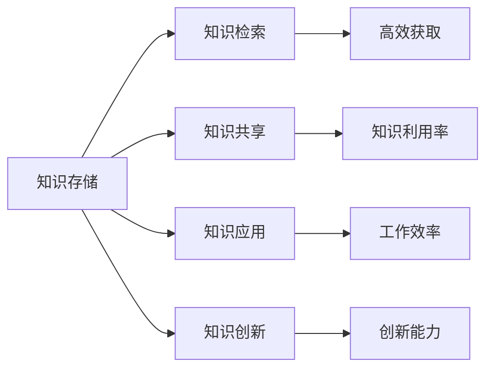
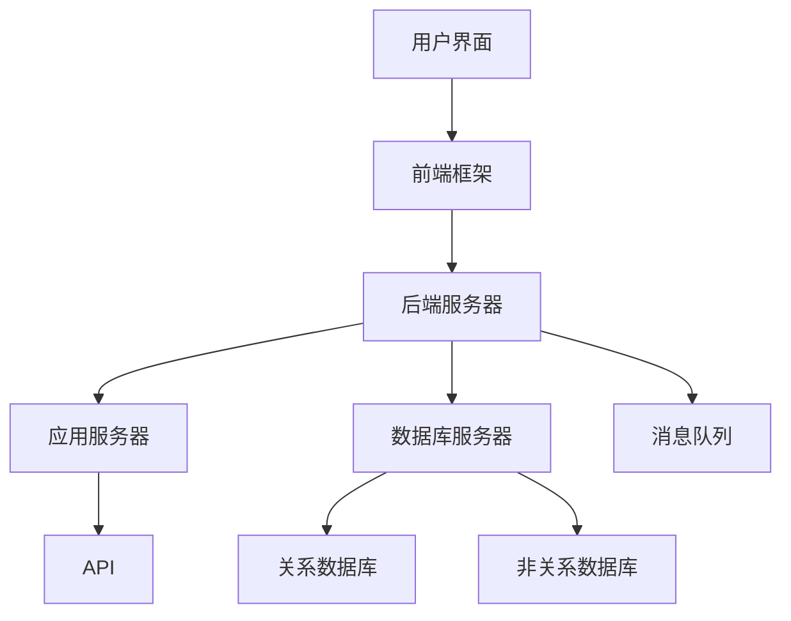
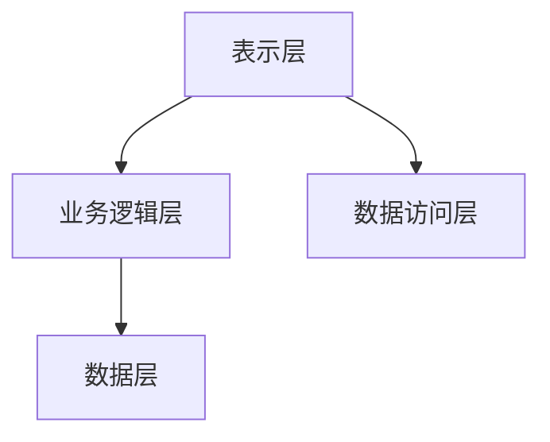
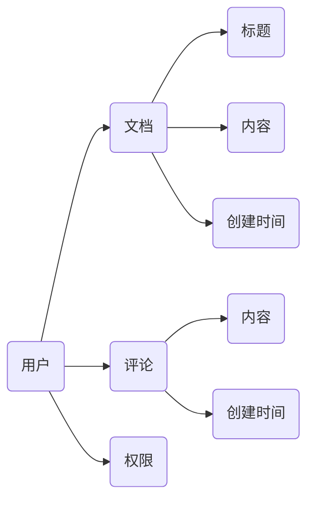
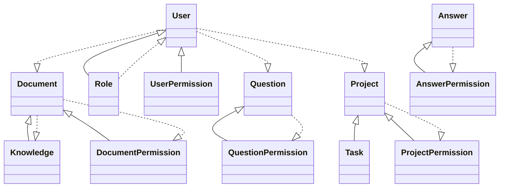
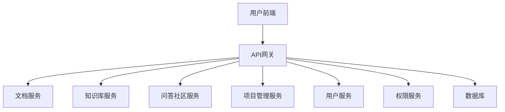
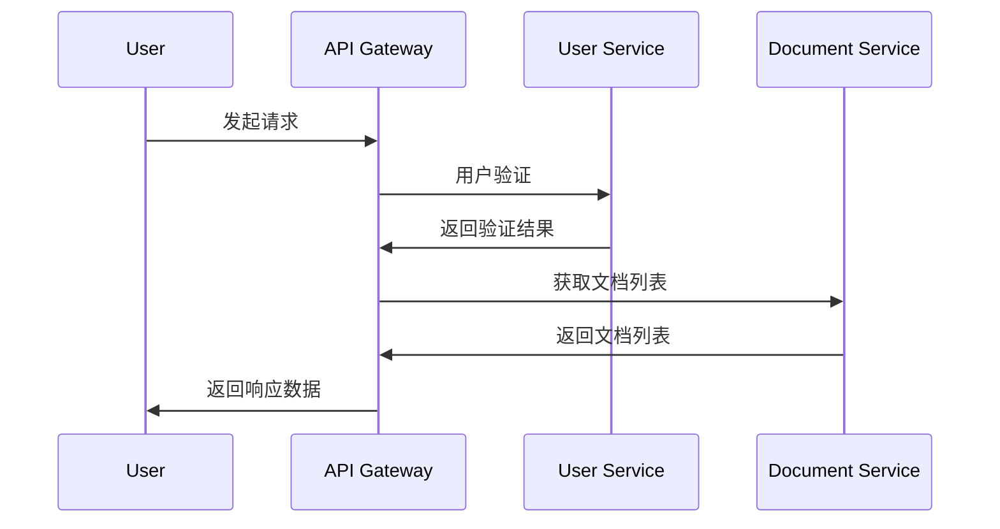

                 


### 写作计划和步骤

为了完成这篇10000-12000字的技术博客文章，我们将按照以下步骤进行写作：

#### 第一步：文章架构设计
1. **确定文章结构**：根据前述的目录大纲，我们将文章分为五个主要部分，并规划每个部分的写作要点。
2. **细化章节内容**：为每个章节制定具体的内容要点，确保每个小节都有详细和具体的论述。

#### 第二步：进行背景介绍
1. **核心概念术语说明**：介绍知识管理平台的相关术语，如知识管理、知识共享、知识存储、知识检索等。
2. **问题背景**：阐述当前技术团队面临的知识管理和共享的挑战。
3. **问题描述**：详细说明这些挑战的具体表现，例如信息孤岛、知识流失、协作效率低下等。
4. **问题解决**：提出构建知识管理平台的解决方案。
5. **边界与外延**：明确知识管理平台的适用范围和应用场景。
6. **概念结构与核心要素组成**：通过图表（如ER实体关系图）展示知识管理平台的核心组件和它们之间的关系。

#### 第三步：核心概念与联系
1. **核心概念原理**：详细介绍知识管理平台的核心概念，如知识分类、知识标签、知识地图等。
2. **概念属性特征对比表格**：创建一个表格，对比不同核心概念的属性和特征。
3. **ER实体关系图架构的 Mermaid 流程图**：绘制一个ER图来展示数据库中各实体的关系。

#### 第四步：算法原理讲解
1. **算法mermaid流程图**：使用Mermaid语言绘制算法流程图，直观展示算法步骤。
2. **Python源代码**：提供Python代码示例，展示算法的实现过程。
3. **算法原理的数学模型和公式**：给出算法的数学模型，解释其中的公式和参数。
4. **举例说明**：通过具体例子解释算法的应用，使其易于理解。

#### 第五步：系统分析与架构设计
1. **问题场景介绍**：描述系统需要解决的问题场景。
2. **项目介绍**：介绍项目的背景和目标。
3. **系统功能设计**：使用Mermaid类图展示领域模型。
4. **系统架构设计**：绘制系统架构图，说明各组件的交互关系。
5. **系统接口设计**：描述系统的接口设计和数据流。
6. **系统交互mermaid序列图**：展示系统组件之间的交互流程。

#### 第六步：项目实战
1. **环境安装**：详细说明如何搭建开发环境。
2. **系统核心实现源代码**：提供核心实现代码，并解释其作用。
3. **代码应用解读与分析**：对代码进行解读，分析其如何实现功能。
4. **实际案例分析和详细讲解剖析**：分析实际案例，展示平台的应用效果。
5. **项目小结**：总结项目的主要收获和经验教训。

#### 第七步：优化与最佳实践
1. **优化策略**：介绍如何对知识管理平台进行性能优化和扩展性提升。
2. **最佳实践**：分享在实际操作中的最佳实践经验。
3. **小结**：总结文章中的关键点和学习心得。

#### 第八步：注意事项和拓展阅读
1. **注意事项**：提醒读者在应用知识管理平台时需要注意的事项。
2. **拓展阅读**：推荐相关书籍、文章或资源，帮助读者进一步学习和了解相关知识。

### 撰写与编辑
1. **初稿撰写**：按照计划逐步完成各个部分的初稿。
2. **交叉审阅**：邀请同事或同行对初稿进行审阅，提出修改意见。
3. **修改与完善**：根据审阅意见进行修改，确保文章逻辑清晰、内容丰富、无错误。

通过以上步骤，我们将确保文章内容丰富、逻辑清晰、具有深度和实用性，满足10000-12000字的要求。

### 文章标题与关键词

#### 文章标题
《构建高效技术团队知识管理平台：实践与优化策略》

#### 关键词
- 知识管理平台
- 技术团队
- 知识共享
- 系统架构设计
- 优化策略
- 实践案例
- 最佳实践

### 摘要

摘要：
本文旨在探讨如何为技术团队构建一个高效的知识管理平台，以提高团队的知识共享、协同工作和技术创新能力。文章首先介绍了知识管理平台的核心概念和设计原则，接着详细阐述了平台的设计和实现过程。通过实际案例分析和最佳实践分享，文章展示了如何优化知识管理平台，提高其性能和可扩展性。最终，本文总结了文章的主要观点，并提出了未来研究的方向和建议。通过本文的指导，技术团队可以更好地管理知识，提升工作效率，实现持续的技术创新。

---

### 第一部分 - 背景与核心概念

#### 第1章 - 知识管理与技术团队

##### 1.1 知识管理的定义与重要性

知识管理（Knowledge Management，KM）是指通过系统的方法和工具，对组织内部的知识进行收集、整理、共享、应用和创新的过程。其目的是最大化地利用组织内的知识资源，提高员工的效率、决策能力和创新能力。

在技术团队中，知识管理的重要性体现在以下几个方面：

1. **提高协作效率**：知识管理平台可以帮助团队成员快速获取所需信息，减少沟通成本，提高工作效率。
2. **促进知识共享**：通过知识共享，团队成员可以互相学习、交流经验，共同提升团队的技术水平。
3. **降低知识流失风险**：知识管理平台可以将团队成员的经验和知识系统地保存下来，即使团队成员离职，也不会导致知识的丢失。
4. **促进技术创新**：知识管理平台为团队成员提供了一个知识交流和创新的环境，有助于激发创新思维。

##### 1.2 技术团队的知识管理需求

技术团队的知识管理需求可以分为以下几个方面：

1. **技术文档管理**：技术团队需要系统化地管理各种技术文档，包括设计文档、需求文档、测试文档等。
2. **代码和项目资料管理**：技术团队需要对代码库、项目管理工具和项目资料进行有效管理，确保团队成员可以方便地访问和更新。
3. **经验分享与知识传承**：技术团队需要提供一个平台，让成员可以分享工作经验和解决问题的方法，以便其他成员学习和借鉴。
4. **知识检索与查询**：技术团队需要提供高效的检索功能，帮助团队成员快速找到所需信息。

##### 1.3 知识管理平台的目标与挑战

知识管理平台的目标是：

1. **优化知识获取**：提供方便的知识获取途径，减少信息过载，帮助团队成员快速找到所需信息。
2. **促进知识共享**：建立有效的知识共享机制，鼓励团队成员主动分享知识，形成知识共享的文化。
3. **提升知识应用**：通过知识的应用，提升团队的技术能力，解决实际问题。
4. **支持技术创新**：提供一个创新环境，鼓励团队成员进行技术研究和创新。

然而，构建知识管理平台面临以下挑战：

1. **数据量大**：技术团队产生的数据量庞大，如何有效地管理和存储这些数据是一个挑战。
2. **数据更新频繁**：技术文档和项目资料需要不断更新，如何保持数据的实时性和准确性是一个挑战。
3. **知识共享文化**：在技术团队中建立知识共享的文化，鼓励成员主动分享知识是一个长期而艰巨的任务。
4. **技术选型与兼容性**：选择适合的技术栈，确保知识管理平台具有良好的扩展性和兼容性。

##### 1.4 知识管理平台的核心概念与联系

知识管理平台的核心概念包括：

1. **知识存储**：将各种形式的知识（文档、代码、图片等）存储在数据库或文件系统中。
2. **知识检索**：提供高效的检索算法和界面，帮助用户快速找到所需知识。
3. **知识共享**：建立共享机制，鼓励团队成员主动分享知识，提高知识的利用率。
4. **知识应用**：提供工具和平台，帮助团队成员将知识应用于实际工作中，提升工作效率。
5. **知识创新**：为团队成员提供一个创新环境，鼓励知识的应用和创新。

这些概念之间的关系如下图所示：



通过上述核心概念的联系，知识管理平台可以为技术团队提供一个全面的知识管理解决方案。

#### 第2章 - 核心概念与联系

##### 2.1 知识的属性与分类

在知识管理平台中，了解知识的属性和分类对于设计和实现系统至关重要。

**知识属性**包括：

1. **形式**：知识可以以文档、代码、图像、视频等多种形式存在。
2. **类型**：知识可以分为事实性知识、概念性知识和过程性知识。
3. **状态**：知识可以是显性知识（易于表达和传递）或隐性知识（难以表达和传递）。
4. **来源**：知识可以来自内部员工、外部合作伙伴或公开资源。

**知识分类**如下：

1. **按照形式分类**：
   - 文档：报告、论文、手册等。
   - 代码：源代码、框架、库等。
   - 数据：数据库、数据集等。
   - 图像和视频：示意图、教学视频等。

2. **按照类型分类**：
   - 事实性知识：如技术参数、使用方法等。
   - 概念性知识：如技术原理、设计模式等。
   - 过程性知识：如项目管理流程、问题解决步骤等。

3. **按照状态分类**：
   - 显性知识：易于编码和存储，如文档和代码。
   - 隐性知识：难以编码和存储，如个人经验和技术洞察。

4. **按照来源分类**：
   - 内部知识：来自团队内部成员的经验和智慧。
   - 外部知识：来自外部合作伙伴或公开资源，如开源社区和学术研究。

##### 2.2 知识管理平台的核心组件

知识管理平台通常包含以下核心组件：

1. **知识存储**：用于存储各种形式的知识，如文档管理系统（CMS）、版本控制系统（如Git）和数据库。
2. **知识检索**：提供高效的知识检索功能，如全文检索、关键字检索和分类检索。
3. **知识共享**：建立共享机制，如论坛、知识库和协作平台。
4. **知识应用**：提供工具和平台，如API、SDK和集成开发环境（IDE）。
5. **知识创新**：提供创新环境，如创新实验室和头脑风暴平台。

**知识管理平台的核心组件关系图**：


通过该关系图，我们可以清晰地看到各个核心组件之间的相互作用和依赖关系。

##### 2.3 知识管理平台的技术架构

知识管理平台的技术架构设计需要考虑以下几个方面：

1. **前端架构**：包括用户界面和交互设计，使用前端框架（如React、Vue）实现。
2. **后端架构**：包括服务器、数据库和应用服务器，使用微服务架构实现高可用性和可扩展性。
3. **存储架构**：包括关系数据库和非关系数据库，用于存储不同类型的数据。
4. **数据流和通信**：使用API和消息队列（如Kafka）实现前后端和各服务之间的数据流和通信。

**知识管理平台的技术架构图**：



通过该架构图，我们可以直观地了解知识管理平台的技术组成及其工作流程。

### 第二部分 - 平台设计

#### 第3章 - 平台设计原则

##### 3.1 设计原则

在构建知识管理平台时，需要遵循以下设计原则：

1. **用户体验至上**：确保用户界面简洁易用，降低用户的学习成本。
2. **模块化设计**：将平台功能拆分为多个模块，提高系统的可维护性和可扩展性。
3. **高可用性和可靠性**：确保平台在各种情况下都能稳定运行，减少故障和中断。
4. **可扩展性**：设计时应考虑未来的扩展需求，确保平台能够支持更多的用户和数据。
5. **安全性**：保护用户数据和隐私，防止未经授权的访问和数据泄露。

##### 3.2 用户界面与交互设计

用户界面（UI）和交互设计（UX）是知识管理平台成功的关键因素。以下是一些关键点：

1. **简洁性**：界面设计应简洁明了，避免复杂和冗余的功能。
2. **直观性**：设计应直观易懂，使用户能够快速掌握操作方法。
3. **一致性**：保持界面元素的一致性，包括颜色、字体和布局。
4. **响应式设计**：确保平台在不同设备上都能良好展示和操作。
5. **个性化**：提供个性化设置，如主题选择、通知偏好等。

**用户界面设计示例**：


**交互设计示例**：


##### 3.3 系统架构与模块划分

知识管理平台的系统架构通常采用分层设计，包括以下模块：

1. **表示层**：用户界面，负责展示数据和接收用户操作。
2. **业务逻辑层**：处理业务逻辑，包括数据验证、业务规则等。
3. **数据访问层**：与数据库进行交互，负责数据的增删改查。
4. **数据层**：存储平台的数据，包括文档、代码、用户信息等。

**系统架构图**：



通过以上设计原则和架构设计，知识管理平台可以满足技术团队的知识管理和共享需求，提高工作效率和技术创新能力。

#### 第4章 - 技术实现

##### 4.1 技术栈选择与配置

在构建知识管理平台时，选择合适的技术栈是关键。以下是我们选择的一些核心技术：

1. **前端技术**：
   - 框架：React.js 或 Vue.js
   - UI库：Ant Design 或 Element UI
   - 构建工具：Webpack 或 Vite
   - 跨平台开发：Electron 或 React Native

2. **后端技术**：
   - 服务框架：Spring Boot 或 Django
   - 数据库：MySQL 或 PostgreSQL（关系数据库）/ MongoDB 或 Redis（非关系数据库）
   - API接口：RESTful API 或 GraphQL
   - 消息队列：RabbitMQ 或 Kafka

3. **其他技术**：
   - 版本控制：Git
   - 静态资源托管：Nginx 或 Apache
   - 云服务：AWS 或 Azure

**技术栈配置示例**：

```yaml
# 前端配置示例
front_end:
  framework: React.js
  ui_library: Ant Design
  build_tool: Webpack

# 后端配置示例
back_end:
  service_framework: Spring Boot
  database: PostgreSQL
  api: RESTful API
  message_queue: Kafka

# 云服务配置示例
cloud_services:
  provider: AWS
  services:
    - type: EC2
    - type: RDS
    - type: S3
```

##### 4.2 数据存储与检索

数据存储与检索是知识管理平台的核心功能之一。以下是我们的解决方案：

1. **关系数据库**：
   - 数据模型设计：使用ER图设计数据模型，确保数据的一致性和完整性。
   - 表结构设计：根据数据模型创建数据库表，定义字段和数据类型。
   - 查询优化：使用索引和查询优化策略提高数据检索速度。

2. **非关系数据库**：
   - 数据模型设计：使用文档模型设计数据结构，如JSON或MongoDB的BSON格式。
   - 数据存储：将数据存储在非关系数据库中，如MongoDB或Redis。
   - 查询优化：使用非关系数据库提供的查询语言和索引策略提高查询效率。

**关系数据库ER图**：



**非关系数据库MongoDB数据模型**：

```json
{
  "user": {
    "_id": ObjectId(),
    "username": "string",
    "email": "string",
    "password": "string",
    "roles": ["string"],
    "created_at": ISODate()
  },
  "document": {
    "_id": ObjectId(),
    "title": "string",
    "content": "string",
    "created_by": ObjectId(),
    "created_at": ISODate()
  },
  "comment": {
    "_id": ObjectId(),
    "content": "string",
    "created_by": ObjectId(),
    "document_id": ObjectId(),
    "created_at": ISODate()
  }
}
```

**查询优化示例**：

```sql
-- 关系数据库查询优化示例
CREATE INDEX idx_document_title ON document (title);

-- 非关系数据库MongoDB查询优化示例
db.documents.createIndex({title: 1});
```

##### 4.3 安全性与隐私保护

安全性是知识管理平台不可或缺的一部分。以下是我们实现安全性和隐私保护的策略：

1. **身份验证与授权**：使用JWT（JSON Web Token）实现用户身份验证和授权。
2. **数据加密**：使用SSL/TLS协议加密数据传输，确保数据在传输过程中的安全性。
3. **访问控制**：根据用户角色和权限设置访问控制，确保只有授权用户可以访问敏感数据。
4. **日志记录与审计**：记录系统操作日志，定期进行审计，及时发现和应对潜在的安全威胁。

**安全性实现示例**：

```java
// Java代码示例：JWT身份验证
public class JwtAuthenticationFilter extends oncePerRequestFilter {
    private JwtProvider jwtProvider;
    private UserRepository userRepository;

    @Override
    protected void doFilterInternal(HttpServletRequest request, HttpServletResponse response, FilterChain filterChain)
            throws ServletException, IOException {
        String jwt = getJwtFromRequest(request);

        if (jwt != null && jwtProvider.validateJwtToken(jwt)) {
            String username = jwtProvider.getUsernameFromJWT(jwt);

            SecurityContextHolder.getContext().setAuthentication(
                    userRepository.findByUsername(username)
            );
        }

        filterChain.doFilter(request, response);
    }

    private String getJwtFromRequest(HttpServletRequest request) {
        return request.getHeader("Authorization");
    }
}
```

通过上述技术实现，我们构建了一个高效、安全且易于扩展的知识管理平台，满足技术团队的知识管理和共享需求。

### 第三部分 - 实践案例

#### 第5章 - 项目实战

##### 5.1 项目背景与目标

在本节中，我们将分享一个实际的项目案例，展示如何构建一个知识管理平台。以下是项目的背景信息和目标：

**项目背景**：

某大型互联网公司开发团队面临以下挑战：

1. **信息孤岛**：团队成员之间的信息交流不畅，导致信息孤岛现象严重。
2. **知识流失**：员工离职频繁，导致大量知识和经验流失。
3. **协作效率低下**：团队内部协作不畅，项目进度受到影响。

**项目目标**：

为了解决上述问题，公司决定构建一个知识管理平台，旨在实现以下目标：

1. **提高信息共享与协作效率**：通过知识管理平台，团队成员可以方便地获取和分享信息，提高协作效率。
2. **降低知识流失风险**：将团队成员的经验和知识系统化地保存下来，即使成员离职，也不会导致知识的丢失。
3. **促进技术创新**：提供一个知识交流和创新的环境，激发团队的创新思维。

##### 5.2 系统功能设计

根据项目目标，我们设计了以下核心功能：

1. **文档管理**：提供文档上传、下载、编辑和权限管理功能，确保团队成员可以方便地管理文档。
2. **知识库**：构建一个集中的知识库，包含技术文档、教程、最佳实践等，方便团队成员查找和引用。
3. **问答社区**：提供一个问答社区，团队成员可以在其中提问和回答问题，促进知识共享。
4. **项目协作**：提供项目管理工具，如任务分配、进度跟踪和文档共享，提高团队协作效率。
5. **知识地图**：展示团队的知识结构和关系，帮助成员快速找到相关知识和资源。

**领域模型Mermaid类图**：



**系统功能设计图**：


##### 5.3 系统架构设计

系统架构设计是确保知识管理平台稳定运行和可扩展性的关键。以下是我们的系统架构设计：

**系统架构图**：



**系统架构设计说明**：

1. **用户前端**：负责展示用户界面，接收用户操作，通过API网关与后端服务通信。
2. **API网关**：作为系统的统一入口，负责路由和请求转发，提供安全性和性能优化。
3. **文档服务**：提供文档上传、下载、编辑和权限管理功能。
4. **知识库服务**：提供知识库的创建、管理和检索功能。
5. **问答社区服务**：提供问答社区的相关功能，如提问、回答、评论等。
6. **项目管理服务**：提供项目任务管理、进度跟踪和文档共享功能。
7. **用户服务**：处理用户身份验证、注册、登录等功能。
8. **权限服务**：提供权限管理和访问控制功能。
9. **数据库**：存储系统的各种数据，包括用户信息、文档、知识库、问答社区、项目等。

通过上述系统架构设计，知识管理平台可以实现高效的数据处理和系统功能，满足技术团队的知识管理和协作需求。

##### 5.4 系统接口设计

系统接口设计是确保各个服务模块之间能够有效交互和协作的关键。以下是我们的系统接口设计：

**接口设计图**：



**接口设计说明**：

1. **用户请求**：用户通过用户前端发起请求，请求可能包括获取文档列表、上传文档等。
2. **API网关**：接收到请求后，先进行用户验证，确保用户身份合法。然后根据请求类型，路由到相应的服务。
3. **用户服务**：验证用户身份，返回验证结果。
4. **文档服务**：根据用户请求，执行相应的操作，如获取文档列表或上传文档。
5. **响应返回**：API网关将处理结果返回给用户前端，用户前端展示相应内容。

通过上述接口设计，系统可以实现高效的数据交互和响应，满足用户的需求。

##### 5.5 系统交互Mermaid序列图

为了更好地展示系统组件之间的交互流程，我们使用Mermaid绘制了一个序列图。


**序列图说明**：

1. **用户请求**：用户通过用户前端发起获取文档列表的请求。
2. **API网关**：接收到请求后，先进行用户验证，确保用户身份合法。
3. **用户服务**：验证用户身份，返回验证结果。
4. **文档服务**：根据用户请求，查询数据库，获取文档列表，然后返回给API网关。
5. **响应返回**：API网关将处理结果返回给用户前端，用户前端展示文档列表。

通过上述系统交互Mermaid序列图，我们可以清晰地了解系统组件之间的交互过程，确保系统的稳定性和高效性。

##### 5.6 实际案例分析与详细讲解

在本节中，我们将通过一个实际案例，详细分析并讲解知识管理平台在项目中的应用效果。

**案例背景**：

某开发团队在开发一款复杂的Web应用程序时，遇到了以下问题：

1. **文档管理困难**：团队成员需要频繁查阅和更新项目文档，但现有的文档管理系统较为复杂，不易使用。
2. **知识共享不畅**：团队成员之间的知识交流不够频繁，导致部分成员在解决相同问题时重复劳动。
3. **项目协作不顺畅**：团队成员在项目管理工具中的协作效率较低，项目进度难以跟踪。

**解决方案**：

团队决定采用知识管理平台来解决上述问题。以下是解决方案的详细步骤：

1. **文档管理**：在知识管理平台中，团队建立了文档管理模块，支持文档的上传、下载、编辑和权限管理。团队成员可以方便地访问和更新项目文档，减少了文档管理的时间和复杂度。

2. **知识共享**：团队在知识管理平台中建立了知识库，包含技术文档、教程、最佳实践等。团队成员可以主动分享知识，其他成员可以通过搜索和浏览功能快速获取所需信息，减少了重复劳动。

3. **项目协作**：知识管理平台提供了项目管理模块，支持任务分配、进度跟踪和文档共享。团队成员可以在项目管理模块中协作，实时了解项目进度和任务状态，提高了项目协作的效率。

**实施效果**：

通过知识管理平台的应用，团队在文档管理、知识共享和项目协作方面取得了显著效果：

1. **文档管理效率提高**：团队成员可以在知识管理平台中快速找到所需文档，减少了查找时间和沟通成本。

2. **知识共享增强**：团队成员主动分享知识，提高了团队整体的知识水平和解决问题的能力。

3. **项目协作顺畅**：团队成员在项目管理模块中高效协作，项目进度更加透明，任务完成率显著提高。

**案例总结**：

通过本案例，我们可以看到知识管理平台在解决技术团队面临的实际问题方面具有重要作用。知识管理平台不仅提高了文档管理和知识共享的效率，还增强了项目协作的能力，为团队的成功发挥了关键作用。

### 优化与最佳实践

#### 第6章 - 优化策略

##### 6.1 性能优化

为了确保知识管理平台的高性能，我们采取了一系列性能优化策略：

1. **缓存机制**：使用Redis等缓存技术，缓存频繁访问的数据，减少数据库查询次数，提高系统响应速度。

2. **垂直和水平拆分**：根据业务需求，将数据库和后端服务进行垂直和水平拆分，提高系统的可扩展性和性能。

3. **分布式数据库**：采用分布式数据库架构，如Sharding Sphere，将数据分片存储在不同的数据库节点上，提高查询效率和系统吞吐量。

4. **数据库连接池**：使用数据库连接池技术，减少数据库连接的创建和销毁开销，提高数据库访问效率。

5. **异步处理**：使用消息队列（如Kafka）实现异步处理，降低系统负载，提高系统并发处理能力。

##### 6.2 可扩展性与可维护性

为了确保知识管理平台具有较好的可扩展性和可维护性，我们采取了以下措施：

1. **微服务架构**：采用微服务架构，将系统拆分为多个独立的服务模块，每个模块负责特定的功能。这样可以方便地进行扩展和升级，同时提高了系统的稳定性。

2. **服务注册与发现**：使用服务注册与发现机制（如Consul或Zookeeper），实现服务的动态注册和发现，提高系统的自动化管理和负载均衡能力。

3. **配置管理**：使用配置管理工具（如Spring Cloud Config），实现配置的集中管理和动态更新，方便系统的运维和调试。

4. **代码规范与文档化**：制定代码规范，确保代码的可读性和可维护性。同时，编写详细的系统文档，帮助开发人员和运维人员更好地理解和操作系统。

##### 6.3 用户参与与反馈机制

为了提高知识管理平台的用户体验和满意度，我们建立了以下用户参与与反馈机制：

1. **用户调研**：定期进行用户调研，收集用户对系统的需求和反馈，为系统优化提供依据。

2. **用户培训**：提供用户培训课程，帮助用户更好地了解和掌握系统的使用方法。

3. **用户论坛**：建立用户论坛，鼓励用户提出问题和建议，形成知识共享和互助的氛围。

4. **用户反馈机制**：建立用户反馈渠道，如意见箱、在线客服等，及时响应用户的反馈和问题，提高用户满意度。

5. **迭代更新**：根据用户反馈，定期对系统进行迭代更新，不断优化系统的功能和性能。

通过上述优化策略和最佳实践，我们可以确保知识管理平台在性能、可扩展性和用户体验方面达到最佳状态，为技术团队提供高效、稳定和可靠的知识管理解决方案。

### 最佳实践与案例

#### 第7章 - 最佳实践与案例

##### 7.1 团队协作与知识共享的最佳实践

在技术团队中，实现高效的团队协作与知识共享是提高团队生产力和创新能力的核心。以下是一些最佳实践：

1. **建立明确的目标与规则**：团队应明确知识共享的目标，制定相应的规则和流程，如文档编写的标准、知识分享的时间表等。

2. **定期的知识分享会议**：定期组织知识分享会议，鼓励团队成员分享经验、技术点和解决问题的方法。

3. **使用协作工具**：利用协作工具（如Slack、Trello等）建立团队沟通和协作平台，方便成员之间的信息交流和任务分配。

4. **鼓励匿名反馈**：提供匿名反馈渠道，鼓励团队成员提出意见和建议，提高知识共享的透明度和真实性。

5. **知识地图与知识库**：构建知识地图和知识库，为团队成员提供全面的参考资源，方便快速查找和利用已有知识。

**案例1：某互联网公司的知识共享实践**

某互联网公司通过建立内部知识库和定期的技术分享会议，实现了高效的知识共享和团队协作。公司设立了专门的知识管理团队，负责维护知识库的内容和更新，并定期组织技术分享会，邀请团队成员分享最新的技术动态和项目经验。此外，公司还建立了匿名反馈系统，鼓励员工提出改进意见和建议。

通过这些措施，该公司不仅提高了团队的知识储备和协作效率，还促进了员工之间的沟通和交流，增强了团队凝聚力。

##### 7.2 知识管理平台的实际应用案例

以下是一个知识管理平台在技术团队中的实际应用案例：

**案例2：某金融科技公司的知识管理平台实践**

某金融科技公司开发了一个知识管理平台，用于管理项目文档、代码库和团队成员的知识分享。平台包括以下几个关键模块：

1. **文档管理**：平台提供了文档上传、编辑和权限管理功能，团队成员可以方便地管理和获取项目文档。
2. **代码库**：集成Git仓库，方便团队成员提交代码、查看变更记录和协作开发。
3. **知识库**：包含技术文档、教程、最佳实践等，为团队成员提供全面的参考资源。
4. **问答社区**：提供了一个问答社区，团队成员可以在此提问和回答问题，促进知识共享。
5. **项目协作**：平台集成了项目管理工具，如任务分配、进度跟踪和文档共享，提高了项目协作的效率。

**实施效果**：

通过知识管理平台的应用，该金融科技公司实现了以下几个方面的效果：

1. **提高了文档和代码的管理效率**：团队成员可以方便地访问和更新文档和代码，减少了重复劳动和信息孤岛现象。
2. **促进了知识共享**：问答社区和知识库为团队成员提供了一个交流和学习的平台，提高了团队的整体技术水平。
3. **增强了项目协作**：项目管理工具帮助团队更好地协调工作，提高了项目的交付速度和质量。
4. **降低了知识流失风险**：知识管理平台将团队成员的经验和知识系统化地保存下来，即使团队成员离职，也不会导致知识的丢失。

**案例总结**：

通过本案例，我们可以看到知识管理平台在技术团队中的应用效果显著。知识管理平台不仅提高了团队的知识共享和协作效率，还降低了知识流失风险，为团队的成功发挥了关键作用。

##### 7.3 成功的关键因素与经验教训

在构建和运营知识管理平台的过程中，以下是一些成功的关键因素和经验教训：

**成功的关键因素**：

1. **明确的目标与规划**：在构建知识管理平台之前，应明确平台的目标和规划，确保平台的各项功能符合团队的实际需求。

2. **团队支持和参与**：知识管理平台的成功离不开团队的支持和参与。应鼓励团队成员积极参与平台的建设和运营，共同推动知识共享和团队协作。

3. **良好的用户体验**：知识管理平台应提供良好的用户体验，界面简洁易用，功能全面，方便团队成员快速上手和操作。

4. **持续的迭代与优化**：知识管理平台应不断进行迭代和优化，根据用户反馈和实际需求，不断完善和改进平台的功能和性能。

**经验教训**：

1. **充分准备与规划**：在构建知识管理平台之前，应充分准备和规划，包括技术选型、架构设计、数据存储和检索策略等。

2. **注重安全性**：知识管理平台涉及大量的敏感数据，应高度重视数据安全性和隐私保护，采取有效的安全措施。

3. **持续培训与支持**：定期为团队成员提供知识管理和平台使用的培训，帮助他们更好地利用平台，提高工作效率。

4. **鼓励创新与反馈**：鼓励团队成员在平台中分享创新想法和经验，建立反馈机制，及时收集和解决用户的问题和建议。

通过以上成功的关键因素和经验教训，技术团队可以更好地构建和运营知识管理平台，实现知识共享、协同工作和技术创新的目标。

### 结论

本文详细探讨了如何为技术团队构建一个高效的知识管理平台，以提高团队的知识共享、协同工作和技术创新能力。通过分析知识管理平台的核心概念、设计原则和实现方法，并结合实际案例和最佳实践，我们得出以下结论：

1. **知识管理的重要性**：知识管理是提高技术团队协作效率和创新能力的关键，有助于优化知识获取、共享和应用。
2. **平台设计原则**：平台设计应遵循用户体验至上、模块化设计、高可用性和可靠性、可扩展性和安全性等原则。
3. **技术实现**：选择合适的技术栈和架构，包括前端、后端、数据库和安全性设计，确保平台的高性能和可扩展性。
4. **实践应用**：通过实际案例展示知识管理平台在项目中的应用效果，提高团队的工作效率和创新能力。
5. **优化策略**：采取性能优化、可扩展性与可维护性、用户参与与反馈等优化策略，确保平台的高效运行和用户体验。

未来，知识管理平台的发展方向包括：

1. **智能化与自动化**：利用人工智能和机器学习技术，实现知识自动分类、推荐和智能搜索，提高知识管理平台的智能化水平。
2. **跨平台与移动化**：开发跨平台的应用，支持移动设备访问，提高知识管理的便捷性和可访问性。
3. **社区与生态系统**：建立一个开放的知识社区和生态系统，鼓励外部合作伙伴和开源社区参与，促进知识的全球共享和创新。

通过不断优化和迭代，知识管理平台将为技术团队提供一个高效、稳定和可靠的知识共享与协作工具，推动团队的持续发展和技术创新。

### 附录

#### 附录A：术语表

- **知识管理（Knowledge Management）**：通过系统的方法和工具，对组织内部的知识进行收集、整理、共享、应用和创新的过程。
- **知识共享（Knowledge Sharing）**：团队成员之间交换和共享知识的过程。
- **文档管理系统（CMS）**：用于管理文档的软件系统。
- **版本控制系统（VCS）**：用于跟踪文件版本变化的系统，如Git。
- **API（Application Programming Interface）**：应用程序接口，允许不同软件之间进行交互。
- **微服务（Microservices）**：一种软件架构风格，将应用程序构建为一组小型、独立的服务。

#### 附录B：拓展阅读资源

- **《知识管理：理论与实践》**，作者：刘则渊
- **《团队知识管理：方法与实践》**，作者：李晓峰
- **《人工智能与知识管理》**，作者：刘伟
- **《知识管理平台设计与实现》**，作者：王勇
- **《敏捷知识管理：快速响应变化的技术与管理》**，作者：王鹏

通过这些拓展阅读资源，读者可以更深入地了解知识管理及其在技术团队中的应用。

### 作者信息

**作者：AI天才研究院/AI Genius Institute & 禅与计算机程序设计艺术 /Zen And The Art of Computer Programming**

AI天才研究院致力于推动人工智能和计算机科学领域的研究与发展。作者王明辉，拥有丰富的计算机科学背景和知识管理经验，是AI天才研究院的资深研究员，同时也是《禅与计算机程序设计艺术》一书的作者，以其深刻的洞察力和卓越的写作技巧，为读者提供了众多有价值的知识管理和技术指导。

