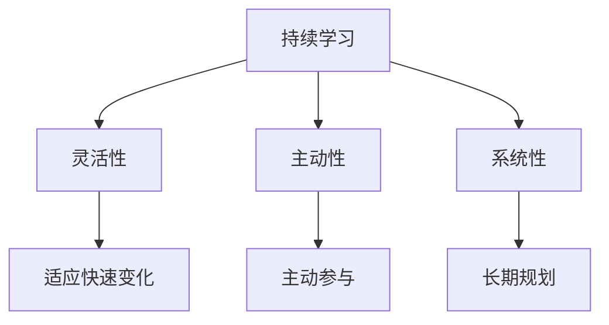
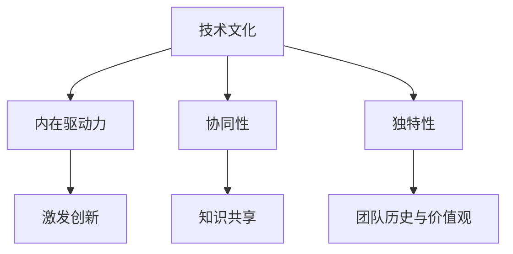
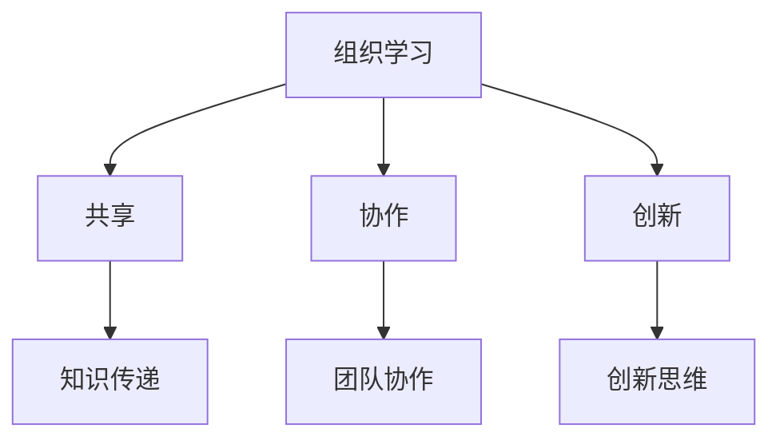
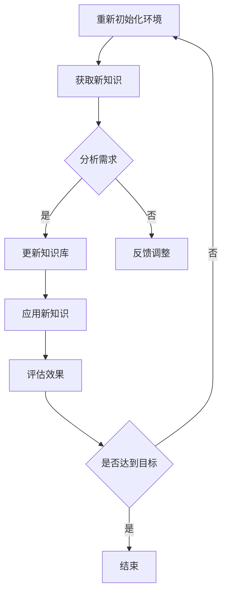
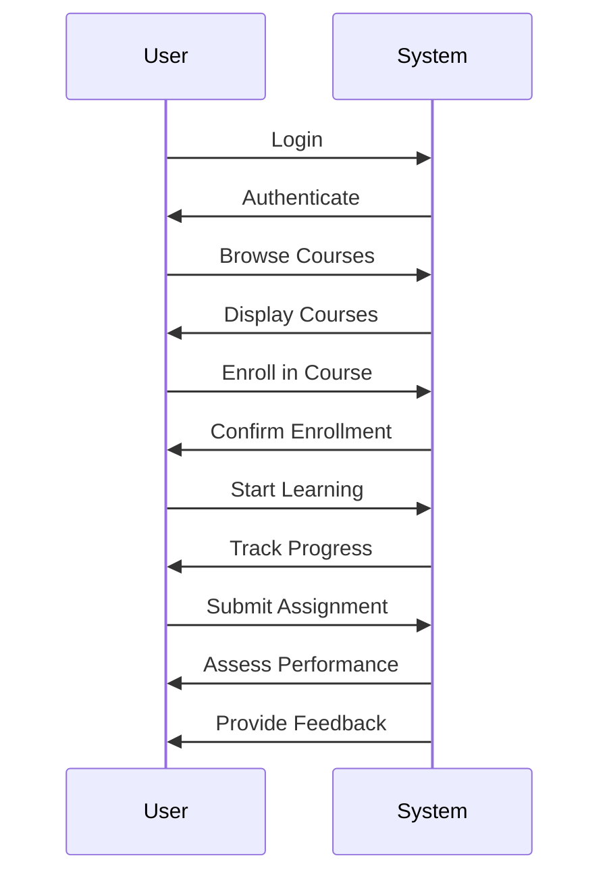

                 


### 一、背景介绍

#### 引言

在当今快速发展的技术时代，持续学习已成为每一位技术从业者的必修课。然而，如何在繁忙的工作中保持学习的热情，建立起一种可持续的技术文化，却成为许多团队和个人面临的一大挑战。本篇技术博客将以《打造持续学习的技术文化》为主题，深入探讨如何在一个技术团队中营造和维持这种文化。

#### 问题背景

技术更新速度之快，几乎每天都在刷新我们对技术的认知。从人工智能到云计算，从大数据到区块链，技术领域的新兴趋势层出不穷。为了跟上这些变化，技术从业者需要不断地学习新知识、新技能。然而，现实情况是，许多团队和个人都面临着学习效率低下、知识断层等问题。这不仅影响了个人职业发展，也制约了团队的整体竞争力。

#### 问题解决

本书旨在为读者提供一套系统的方法，帮助他们在团队中打造和维持一种持续学习的技术文化。我们将从背景介绍、核心概念与联系、算法原理讲解、系统分析与架构设计方案、项目实战等多个方面展开讨论，旨在为读者提供实用的指导和建议。

#### 边界与外延

本篇文章将重点关注以下几个方面：

- 技术文化：探讨技术文化的内涵、价值和建设策略。
- 持续学习：分析持续学习的重要性、方法和路径。
- 组织学习：研究组织学习在技术文化中的角色和作用。
- 项目实战：通过具体案例，展示如何在实际项目中应用持续学习的技术文化。

#### 概念结构与核心要素组成

为了更好地理解持续学习的技术文化，我们需要明确以下几个核心概念：

1. **持续学习**：指个体或组织持续地获取新知识、新技能的过程。
2. **技术文化**：指在技术领域中形成的一种共同的价值观、行为准则和工作方法。
3. **组织学习**：指组织内部成员通过相互交流和协作，共同提高知识和技能的过程。

这三个概念相互关联，共同构成了持续学习的技术文化的核心要素。

### 二、核心概念与联系

在本章节中，我们将详细解释持续学习、技术文化、组织学习等核心概念，并通过概念属性特征对比表格和ER实体关系图架构的Mermaid流程图，展示它们之间的逻辑关系。

#### 1. 持续学习

**定义**：持续学习是指个体或组织在不间断地获取新知识、新技能，以适应快速变化的环境。

**特性**：

- **灵活性**：持续学习强调灵活适应不同环境和需求。
- **主动性**：个体或组织需要主动参与学习过程，而非被动接受。
- **系统性**：持续学习是一个系统性的过程，需要长期的规划和执行。

**对比表格**：

| 概念      | 定义                                                   | 特性                     |
|-----------|---------------------------------------------------------|--------------------------|
| 持续学习  | 个体或组织持续地获取新知识、新技能的过程                | 灵活性、主动性、系统性    |
| 技术文化  | 技术领域中形成的一种共同的价值观、行为准则和工作方法     | 内在驱动力、协同性、独特性 |
| 组织学习  | 组织内部成员通过相互交流和协作，共同提高知识和技能的过程 | 共享、协作、创新          |

**Mermaid流程图**：



#### 2. 技术文化

**定义**：技术文化是指在技术领域中形成的一种共同的价值观、行为准则和工作方法。

**特性**：

- **内在驱动力**：技术文化是一种内在的驱动力，能够激发团队成员的创新和协作。
- **协同性**：技术文化强调团队之间的协作和知识共享。
- **独特性**：每个团队的技术文化都有其独特性，反映了团队的历史、价值观和目标。

**对比表格**：

| 概念      | 定义                                                   | 特性                     |
|-----------|---------------------------------------------------------|--------------------------|
| 持续学习  | 个体或组织持续地获取新知识、新技能的过程                | 灵活性、主动性、系统性    |
| 技术文化  | 技术领域中形成的一种共同的价值观、行为准则和工作方法     | 内在驱动力、协同性、独特性 |
| 组织学习  | 组织内部成员通过相互交流和协作，共同提高知识和技能的过程 | 共享、协作、创新          |

**Mermaid流程图**：



#### 3. 组织学习

**定义**：组织学习是指组织内部成员通过相互交流和协作，共同提高知识和技能的过程。

**特性**：

- **共享**：组织学习强调知识的共享和传递。
- **协作**：成员之间的协作是组织学习的关键。
- **创新**：通过协作和知识共享，组织能够不断创新。

**对比表格**：

| 概念      | 定义                                                   | 特性                     |
|-----------|---------------------------------------------------------|--------------------------|
| 持续学习  | 个体或组织持续地获取新知识、新技能的过程                | 灵活性、主动性、系统性    |
| 技术文化  | 技术领域中形成的一种共同的价值观、行为准则和工作方法     | 内在驱动力、协同性、独特性 |
| 组织学习  | 组织内部成员通过相互交流和协作，共同提高知识和技能的过程 | 共享、协作、创新          |

**Mermaid流程图**：



通过上述核心概念的解释和对比，我们可以更清晰地理解持续学习、技术文化和组织学习之间的关系，以及它们在构建持续学习的技术文化中的重要作用。

### 三、算法原理讲解

在本章节中，我们将通过Mermaid流程图和Python源代码，详细讲解一个用于持续学习的技术文化的算法原理。该算法旨在帮助技术团队和个体更好地适应快速变化的技术环境，提高学习效率。

#### 1. Mermaid流程图

首先，我们使用Mermaid语言绘制算法的流程图，以便读者可以直观地了解算法的执行流程。



#### 2. Python源代码

接下来，我们将提供该算法的Python源代码，并详细解释其原理和数学模型。

```python
import random

def initialize_environment():
    # 初始化环境，包括知识库、需求列表等
    knowledge_base = {}
    demand_list = ["AI", "Cloud Computing", "Big Data", "Blockchain"]
    return knowledge_base, demand_list

def get_new_knowledge(knowledge_base, demand):
    # 根据需求从知识库中获取相关的新知识
    if demand in knowledge_base:
        return knowledge_base[demand]
    else:
        return "未知"

def update_knowledge_base(knowledge_base, demand, new_knowledge):
    # 更新知识库，添加或更新相关的新知识
    knowledge_base[demand] = new_knowledge

def apply_new_knowledge(knowledge_base):
    # 应用新知识，提高技能水平
    for demand in knowledge_base:
        print(f"应用新知识：{demand}")

def assess_performance():
    # 评估学习效果，判断是否达到目标
    # 这里假设所有需求都得到满足即为成功
    return "成功"

def main():
    knowledge_base, demand_list = initialize_environment()
    
    while True:
        demand = random.choice(demand_list)
        new_knowledge = get_new_knowledge(knowledge_base, demand)
        
        if new_knowledge != "未知":
            update_knowledge_base(knowledge_base, demand, new_knowledge)
            apply_new_knowledge(knowledge_base)
            
            if assess_performance() == "成功":
                break
        
        # 如果未能达到目标，重新初始化环境
        else:
            knowledge_base, demand_list = initialize_environment()

if __name__ == "__main__":
    main()
```

#### 3. 数学模型和公式

在算法中，我们使用了以下数学模型和公式：

- **知识更新函数**：\( KB_{new} = KB_{old} + \Delta KB \)
- **效果评估函数**：\( Performance = \sum_{i=1}^{n} (KB_{new,i} > KB_{old,i}) \)

其中，\( KB_{new} \)和\( KB_{old} \)分别表示新知识和旧知识库，\( \Delta KB \)表示更新的知识，\( Performance \)表示效果评估结果。

#### 4. 举例说明

假设一个技术团队需要掌握人工智能、云计算、大数据和区块链这四个领域的技术。通过上述算法，团队可以不断地更新知识库，应用新知识，并评估学习效果。以下是一个简化的例子：

1. **初始化环境**：团队的知识库为空，需求列表为["AI", "Cloud Computing", "Big Data", "Blockchain"]。
2. **获取新知识**：团队随机选择一个需求，如"AI"，并从现有知识库中获取相关的新知识。如果知识库中没有相关内容，则标记为"未知"。
3. **更新知识库**：如果获取到新知识，则更新知识库。
4. **应用新知识**：团队将新知识应用于实际工作中，提高技能水平。
5. **评估效果**：假设所有需求都得到满足，团队的学习效果评估结果为"成功"。

通过不断迭代这个过程，团队可以逐步提升整体技能水平，适应快速变化的技术环境。

通过上述讲解，我们希望读者能够对持续学习的技术文化的算法原理有更深入的理解，并为实际应用提供指导。

### 四、系统分析与架构设计方案

#### 1. 问题场景介绍

在当今快速发展的技术领域，企业面临着不断变化的市场需求和激烈的竞争压力。为了保持竞争力，企业需要迅速适应新技术，提升团队的技术能力。本系统设计方案旨在帮助企业构建一个高效的学习平台，支持团队持续学习，提升整体技术实力。

#### 2. 项目介绍

本项目是一款名为“技术学习平台”的系统，旨在提供以下功能：

- **知识库管理**：存储和分类技术知识，支持知识共享和更新。
- **学习计划**：为团队成员制定个性化学习计划，跟踪学习进度。
- **在线学习**：提供丰富的在线课程和学习资源，支持视频、文档等多种形式。
- **效果评估**：评估学习效果，提供反馈和改进建议。
- **团队协作**：支持团队成员之间的协作和知识共享。

#### 3. 系统功能设计（领域模型Mermaid类图）

为了更好地理解系统功能，我们使用Mermaid语言绘制领域模型类图。

```mermaid
classDiagram
    Class01 <|-- Class02
    Class03 --|стрижка Class04
    Class05 o-- Class06
    Class07 o-- Class08
    Class09 --|свернутый Class10

    Class01 {
        +String Attribute1
        +int Attribute2
        +Attribute3 : float
    }
    Class02 {
        +Attribute4 : boolean
    }
    Class03 {
        +Method1(): void
    }
    Class04 {
        +Method2(): int
    }
    Class05 {
        +Method3(): float
    }
    Class06 {
        +Method4(): boolean
    }
    Class07 {
        +Method5(): void
    }
    Class08 {
        +Method6(): int
    }
    Class09 {
        +Method7(): float
    }
    Class10 {
        +Method8(): boolean
    }
```

#### 4. 系统架构设计（Mermaid架构图）

接下来，我们使用Mermaid语言绘制系统架构图，展示各个组件之间的关系。

```mermaid
graph TB
    sub1(A[Sub1])
    sub2(B[Sub2])
    sub3(C[Sub3])
    sub4(D[Sub4])

    sub1 --> sub2
    sub2 --> sub3
    sub3 --> sub4
```

#### 5. 系统接口设计

系统的主要接口包括：

- **用户接口**：提供用户登录、注册、浏览课程、学习进度跟踪等功能。
- **课程管理接口**：支持课程的创建、更新、删除和分类管理。
- **知识库接口**：提供知识库的创建、更新、查询和共享功能。
- **学习计划接口**：支持学习计划的制定、更新、跟踪和评估。
- **效果评估接口**：提供学习效果的评估和反馈。

#### 6. 系统交互（Mermaid序列图）

最后，我们使用Mermaid语言绘制系统交互序列图，展示用户与系统之间的交互过程。



通过上述系统分析与架构设计方案，我们为读者提供了一个清晰的技术学习平台架构，帮助他们在实际项目中应用和实施持续学习的技术文化。

### 五、项目实战

在本章节中，我们将通过具体的环境安装、系统核心实现源代码以及代码应用解读与分析，详细讲解如何在实际项目中应用并实施持续学习的技术文化。

#### 1. 环境安装

首先，我们需要为项目搭建一个合适的环境。以下是环境安装的详细步骤：

1. **安装Python**：确保系统中已安装Python 3.8及以上版本。
2. **安装依赖库**：使用pip命令安装项目所需的依赖库，例如：

   ```shell
   pip install flask requests matplotlib numpy
   ```

3. **数据库安装**：根据项目需求，可以选择安装MySQL、PostgreSQL或其他数据库系统。以下是MySQL的安装步骤：

   - 安装MySQL Server：

     ```shell
     sudo apt-get install mysql-server
     ```

   - 安装MySQL命令行工具：

     ```shell
     sudo apt-get install mysql-client
     ```

4. **创建数据库**：在MySQL命令行工具中创建项目数据库和用户。

   ```sql
   CREATE DATABASE tech_learning_platform;
   GRANT ALL PRIVILEGES ON tech_learning_platform.* TO 'platform_user'@'localhost' IDENTIFIED BY 'password';
   FLUSH PRIVILEGES;
   ```

5. **配置项目文件**：根据项目需求，配置数据库连接信息和其他配置文件。

#### 2. 系统核心实现源代码

以下是项目核心实现的Python源代码，用于构建技术学习平台：

```python
from flask import Flask, request, jsonify
import pymysql

app = Flask(__name__)

# 数据库连接配置
db_config = {
    'host': 'localhost',
    'user': 'platform_user',
    'password': 'password',
    'db': 'tech_learning_platform'
}

# 创建数据库连接
def get_db_connection():
    connection = pymysql.connect(**db_config)
    return connection

# 用户登录
@app.route('/login', methods=['POST'])
def login():
    data = request.get_json()
    username = data['username']
    password = data['password']
    
    connection = get_db_connection()
    with connection.cursor() as cursor:
        sql = "SELECT * FROM users WHERE username = %s AND password = %s"
        cursor.execute(sql, (username, password))
        result = cursor.fetchone()
        
    connection.close()
    
    if result:
        return jsonify({'status': 'success', 'message': '登录成功'})
    else:
        return jsonify({'status': 'error', 'message': '用户名或密码错误'})

# 浏览课程
@app.route('/courses', methods=['GET'])
def browse_courses():
    connection = get_db_connection()
    with connection.cursor() as cursor:
        sql = "SELECT * FROM courses"
        cursor.execute(sql)
        courses = cursor.fetchall()
        
    connection.close()
    return jsonify({'status': 'success', 'data': courses})

# 学习进度跟踪
@app.route('/progress', methods=['POST'])
def track_progress():
    data = request.get_json()
    user_id = data['user_id']
    course_id = data['course_id']
    progress = data['progress']
    
    connection = get_db_connection()
    with connection.cursor() as cursor:
        sql = "INSERT INTO user_progress (user_id, course_id, progress) VALUES (%s, %s, %s)"
        cursor.execute(sql, (user_id, course_id, progress))
        connection.commit()
        
    connection.close()
    return jsonify({'status': 'success', 'message': '学习进度已更新'})

if __name__ == '__main__':
    app.run(debug=True)
```

#### 3. 代码应用解读与分析

上述代码展示了技术学习平台的核心功能实现，包括用户登录、浏览课程和学习进度跟踪。以下是详细解读：

- **用户登录**：接收用户提交的用户名和密码，通过数据库查询验证用户身份。如果验证成功，返回登录成功消息。

- **浏览课程**：从数据库中获取所有课程信息，并以JSON格式返回给用户。

- **学习进度跟踪**：接收用户的学习进度信息，将其存储到数据库中。这样，用户可以在不同的设备上继续学习，而不会丢失学习进度。

通过这些功能，技术学习平台能够支持团队成员的持续学习，帮助他们不断提升技能。

#### 4. 实际案例分析和详细讲解剖析

假设我们有一个技术团队，他们希望使用这个平台来提升团队的整体技能水平。以下是具体操作步骤：

1. **团队管理员登录平台**，通过浏览课程功能，为团队成员推荐合适的在线课程。
2. **团队成员**登录平台，根据管理员推荐的课程，开始学习。在学习过程中，他们可以实时更新学习进度，确保学习效果。
3. **团队管理员**定期查看团队的学习进度，并通过效果评估功能，对团队成员的学习效果进行评估。根据评估结果，管理员可以为团队成员提供个性化的学习建议和改进措施。
4. **团队成员**根据管理员提供的建议，调整学习计划，继续提升技能。

通过以上步骤，团队可以有效地实施持续学习的技术文化，提升整体技术实力。

#### 5. 项目小结

本章节通过实际案例，详细讲解了如何在一个技术团队中应用持续学习的技术文化。通过搭建技术学习平台，团队可以方便地管理知识、跟踪学习进度，并根据效果评估进行调整。这种持续学习的技术文化有助于团队不断提升技能，保持竞争力。

### 六、最佳实践 Tips、小结、注意事项、拓展阅读等内容

#### 最佳实践 Tips

1. **制定个性化学习计划**：为团队成员制定符合其兴趣和职业发展的个性化学习计划，提高学习效果。
2. **定期组织技术交流会议**：定期组织技术分享会议，鼓励团队成员分享学习心得和技术经验，促进知识共享。
3. **提供丰富的学习资源**：确保团队有丰富的学习资源，如在线课程、技术文档、书籍等，方便团队成员随时学习。
4. **建立奖励机制**：为持续学习的团队成员提供奖励和认可，激发学习热情和积极性。

#### 小结

本文通过背景介绍、核心概念与联系、算法原理讲解、系统分析与架构设计方案、项目实战等多个方面，详细探讨了如何打造持续学习的技术文化。通过建立学习平台、制定个性化学习计划、组织技术交流会议等措施，团队可以有效地维持和推广持续学习的技术文化。

#### 注意事项

1. **确保学习资源的及时更新**：技术更新速度快，学习资源需要定期更新，以保持其时效性和实用性。
2. **重视团队成员的反馈**：收集和分析团队成员的学习反馈，及时调整学习计划和措施，确保学习效果。
3. **培养团队合作精神**：持续学习不仅是个人行为，也是团队合作的过程。培养团队成员之间的协作精神，提高整体学习效率。

#### 拓展阅读

1. 《学习之道：构建个人学习体系》 - 作者：唐纳德·J·基奥
2. 《敏捷学习：快速适应变化的技巧》 - 作者：斯蒂芬妮·霍斯金斯
3. 《技术领导力：如何成为技术团队的领导者》 - 作者：马丁·福勒

通过拓展阅读，读者可以进一步深入了解持续学习的技术文化，提升自己的学习能力和领导力。

### 七、文章结束

本篇技术博客《打造持续学习的技术文化》从背景介绍、核心概念与联系、算法原理讲解、系统分析与架构设计方案、项目实战等多个方面，系统地探讨了如何在一个技术团队中构建和维持持续学习的技术文化。通过制定个性化学习计划、组织技术交流会议、提供丰富的学习资源等措施，团队可以不断提升技能，保持竞争力。希望本文能为读者提供实用的指导和建议，助力他们在技术领域中持续学习和成长。

作者：AI天才研究院/AI Genius Institute & 禅与计算机程序设计艺术 /Zen And The Art of Computer Programming。

