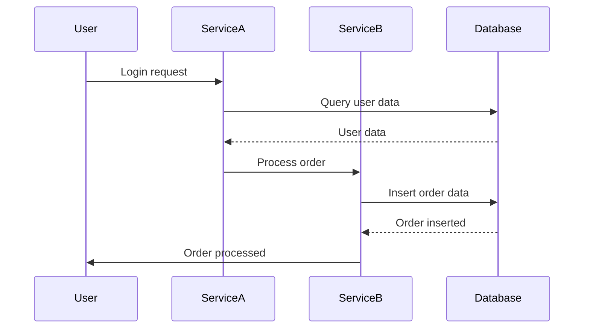

                 

# 打造敏捷响应的大规模分布式系统

## 关键词

- 分布式系统
- 敏捷响应
- 大规模系统设计
- 算法原理
- 数学模型
- 架构设计

## 摘要

本文旨在探讨如何构建一个既能够应对大规模数据处理需求，又能敏捷响应外部变化的分布式系统。文章首先介绍了分布式系统和敏捷响应的背景与核心概念，随后深入分析了分布式系统的基本原理和敏捷响应的实现机制。通过具体的算法原理讲解和数学模型应用，文章提供了系统分析与架构设计的具体方案，并最终以实战案例和最佳实践总结，为大规模分布式系统的设计与实现提供了全面的理论指导和实践经验。

### 目录大纲

1. 第一部分: 背景介绍
    1.1 问题背景
    1.2 问题描述
    1.3 问题解决思路
    1.4 边界与外延
2. 第二部分: 核心概念与联系
    2.1 核心概念
    2.2 概念属性特征对比
    2.3 ER实体关系图架构
3. 第三部分: 算法原理讲解
    3.1 分布式系统算法原理
    3.2 敏捷响应的原理与实现
4. 第四部分: 数学模型和数学公式
5. 第五部分: 系统分析与架构设计方案
    5.1 问题场景介绍
    5.2 项
6. 项目实战
    6.1 环境安装
    6.2 系统核心实现源代码
    6.3 代码应用解读与分析
    6.4 实际案例分析和详细讲解剖析
    6.5 项目小结
7. 最佳实践 Tips
8. 小结
9. 注意事项
10. 拓展阅读

### 1.1 问题背景

随着互联网技术的迅猛发展和大数据时代的到来，传统的单点系统已经无法满足日益增长的数据处理需求。大规模分布式系统逐渐成为企业构建IT基础设施的首选方案。分布式系统通过将任务分散到多个节点上执行，从而提高系统的处理能力和可靠性。然而，随着系统的规模不断扩大，如何保证系统的高效性和敏捷响应能力成为了一个关键问题。

在互联网时代，用户的需求变化速度非常快，传统的大型软件系统往往难以快速响应这些变化。敏捷响应作为一种软件开发方法论，强调快速迭代、持续交付和灵活调整，可以帮助企业更好地适应市场需求。因此，如何将敏捷思想应用于大规模分布式系统的设计和实现，成为了当前的一个研究热点。

### 1.2 问题描述

分布式系统的核心问题是数据一致性和系统可用性。在分布式系统中，数据可能被分散存储在不同的节点上，这会导致数据一致性问题。同时，由于网络的不稳定性和硬件故障等因素，系统可能面临可用性问题。如何在保证数据一致性和系统可用性的前提下，提高系统的敏捷响应能力，是分布式系统面临的一个重大挑战。

敏捷响应的需求主要体现在以下几个方面：

1. **快速迭代：** 在分布式系统中，软件功能的迭代速度要求非常高。系统需要能够快速响应用户需求，及时交付新的功能和改进。

2. **弹性伸缩：** 随着用户量的波动，系统需要能够自动调整资源，以适应不同的负载需求。

3. **故障恢复：** 系统需要具备快速恢复能力，能够在发生故障时迅速恢复正常运行。

4. **监控与优化：** 系统需要具备完善的监控机制，实时跟踪系统状态，并根据监控数据优化系统性能。

### 1.3 问题解决思路

解决分布式系统的敏捷响应问题，需要从以下几个方面入手：

1. **分布式系统设计：** 需要设计一个合理的数据存储结构和负载均衡策略，以保证数据的分布性和系统的稳定性。

2. **敏捷架构实现：** 采用敏捷开发方法，通过快速迭代和持续交付，提高软件的交付效率和质量。

3. **算法优化：** 针对数据一致性和故障恢复等问题，设计高效的算法，提高系统的响应速度。

4. **资源管理：** 实现弹性伸缩机制，根据系统负载自动调整资源分配。

5. **监控与优化：** 建立完善的监控体系，实时跟踪系统状态，及时发现和解决问题。

### 1.4 边界与外延

分布式系统的适用范围非常广泛，包括但不限于：

1. **大型电商平台：** 需要处理海量商品信息和用户订单。
2. **金融系统：** 需要处理高频交易和资金流动。
3. **物联网：** 需要处理大量传感器数据和设备控制。

敏捷响应的概念与边界则主要体现在以下几个方面：

1. **敏捷开发：** 强调快速迭代和持续交付，但不代表无休止的开发。
2. **弹性伸缩：** 根据实际需求自动调整资源，但也要避免资源过度消耗。
3. **监控与优化：** 实时跟踪系统状态，但也要避免过度监控导致性能下降。

### 1.5 分布式系统的基本概念

分布式系统是一种通过多个计算节点协同工作，以实现资源共享、任务分配和处理能力扩展的系统。在分布式系统中，各个节点通过通信网络相互连接，共同完成一个整体的任务。分布式系统的核心优势在于：

1. **高可用性：** 通过冗余设计，当一个节点出现故障时，其他节点可以接管其任务，确保系统的持续运行。
2. **可伸缩性：** 可以根据实际需求动态调整节点数量和资源分配，以适应负载变化。
3. **容错性：** 通过检测和修复故障，提高系统的可靠性。

### 1.6 敏捷架构的设计原则

敏捷架构是一种适应快速变化的软件开发方法，其核心原则包括：

1. **迭代开发：** 通过短期迭代，逐步完善系统功能。
2. **持续交付：** 实现自动化测试和部署，确保软件持续交付。
3. **用户反馈：** 强调用户参与，根据反馈调整开发方向。
4. **代码质量：** 注重代码质量，确保系统稳定性和可维护性。
5. **团队协作：** 通过高效的团队协作，提高开发效率。

### 1.7 分布式系统的适用范围

分布式系统适用于以下场景：

1. **大规模数据处理：** 如搜索引擎、大数据处理平台等。
2. **高并发服务：** 如电商平台、社交媒体等。
3. **云计算平台：** 提供虚拟机和容器资源调度。
4. **物联网：** 实现设备间的数据通信和协同工作。

### 1.8 敏捷响应的概念与边界

敏捷响应是一种软件开发方法论，强调快速响应变化，持续交付价值。其核心概念包括：

1. **快速迭代：** 通过短期迭代，快速交付可用的软件功能。
2. **持续交付：** 实现自动化测试和部署，确保软件持续交付。
3. **用户反馈：** 根据用户反馈，调整开发方向和优先级。
4. **团队协作：** 通过高效的团队协作，提高开发效率。

敏捷响应的边界在于：

1. **项目范围：** 敏捷适用于范围相对较小、需求变化较快的项目。
2. **团队规模：** 适合小规模、跨职能团队。
3. **资源投入：** 需要足够的资源支持持续迭代和交付。

### 1.9 分布式系统的核心组件

分布式系统由多个核心组件构成，这些组件共同协作，实现系统的整体功能。以下是对这些核心组件的简要介绍：

1. **节点与网络：** 节点是分布式系统的基本单元，通过通信网络相互连接。节点可以是物理服务器、虚拟机或容器。网络负责节点间的数据传输和消息通信。

2. **数据存储：** 数据存储是分布式系统的关键组件，负责数据的持久化存储和访问。常见的数据存储方案包括分布式文件系统、数据库集群和键值存储等。

3. **负载均衡：** 负载均衡负责将用户请求均匀分配到各个节点上，以避免单点过载。负载均衡可以通过轮询、最小连接数、IP哈希等多种算法实现。

4. **分布式缓存：** 缓存是提高系统性能的重要手段，分布式缓存可以存储频繁访问的数据，减少数据库的访问压力。

5. **分布式消息队列：** 消息队列用于异步处理请求和任务，确保系统的解耦和弹性。

6. **分布式计算框架：** 如Hadoop、Spark等，提供分布式数据处理和计算能力。

7. **分布式服务框架：** 如Spring Cloud、Dubbo等，提供服务发现、负载均衡、故障转移等能力。

### 1.10 分布式系统的挑战

分布式系统面临诸多挑战，主要包括：

1. **数据一致性：** 在分布式环境中，数据的一致性保证是一个重要问题。分布式事务、数据分区、网络延迟等因素都可能影响数据一致性。

2. **系统可用性：** 分布式系统需要具备高可用性，确保在节点故障时系统能够继续运行。故障转移、备份和恢复机制是实现高可用性的关键。

3. **容错性：** 分布式系统需要能够容忍节点故障，确保系统的稳定性和可靠性。容错性设计包括故障检测、故障恢复和自修复等功能。

4. **网络延迟和带宽限制：** 网络延迟和带宽限制对分布式系统的性能和响应速度有很大影响。优化网络拓扑和通信协议可以提高系统性能。

5. **性能优化：** 分布式系统的性能优化是一个复杂的过程，需要从数据分区、负载均衡、缓存策略等多个方面进行综合考虑。

### 1.11 敏捷响应的原理

敏捷响应是敏捷开发方法在分布式系统中的应用，其核心原则包括：

1. **快速迭代：** 通过短期迭代，逐步完善系统功能。每次迭代交付一部分功能，确保系统能够持续交付价值。

2. **持续交付：** 通过自动化测试和部署，确保软件能够持续交付。持续交付可以减少测试和部署的时间，提高开发效率。

3. **用户反馈：** 通过用户反馈，调整开发方向和优先级。用户反馈是优化系统功能和体验的重要依据。

4. **团队协作：** 通过高效的团队协作，提高开发效率。敏捷开发强调跨职能团队的紧密协作。

5. **代码质量：** 注重代码质量，确保系统稳定性和可维护性。代码质量是系统长期健康发展的基础。

### 1.12 敏捷响应的核心组件

敏捷响应在分布式系统中需要以下核心组件的支持：

1. **实时监控：** 通过实时监控，跟踪系统的运行状态，及时发现和解决问题。

2. **流量控制：** 通过流量控制，确保系统在高并发情况下能够稳定运行。流量控制可以通过限流、降级等策略实现。

3. **弹性伸缩：** 根据系统负载自动调整资源，以适应不同的负载需求。弹性伸缩可以通过自动化脚本、容器编排等技术实现。

4. **分布式消息队列：** 用于异步处理请求和任务，确保系统的解耦和弹性。常见的分布式消息队列包括Kafka、RabbitMQ等。

5. **分布式缓存：** 存储频繁访问的数据，减少数据库的访问压力，提高系统性能。

6. **自动化测试：** 通过自动化测试，确保每次迭代交付的功能符合预期。自动化测试可以提高测试效率和代码质量。

### 1.13 某大型电商平台的敏捷响应实践

某大型电商平台在实际运营中，采用了敏捷响应的方法，取得了显著成效。以下是其敏捷响应实践的关键步骤：

1. **需求收集与规划：** 通过用户调研和市场分析，收集用户需求。根据需求的紧急程度和优先级，制定迭代计划。

2. **迭代开发：** 每个迭代周期为2-4周，每个迭代交付一部分功能。开发团队紧密协作，确保每次迭代都有可用的成果。

3. **持续交付：** 采用持续集成和持续交付（CI/CD）流程，自动化测试和部署，确保软件能够快速交付。

4. **用户反馈：** 定期收集用户反馈，了解系统的实际使用情况。根据用户反馈，调整开发方向和优先级。

5. **性能监控：** 实时监控系统的性能和稳定性，及时发现和解决问题。通过日志分析、性能测试等手段，持续优化系统。

6. **弹性伸缩：** 根据用户量的波动，自动调整资源，确保系统在高并发情况下稳定运行。

7. **团队协作：** 采用敏捷开发方法，通过每日站会、迭代评审等方式，促进团队成员之间的沟通和协作。

### 1.14 某金融系统的敏捷响应优化

某金融系统在应对高频交易和资金流动方面，采用了敏捷响应的优化措施，取得了显著成效。以下是其敏捷响应优化实践的几个关键点：

1. **分布式架构设计：** 采用分布式架构，将交易处理和资金流动分散到多个节点上，提高系统的处理能力和可用性。

2. **实时监控与报警：** 实时监控交易处理和资金流动状态，通过设置报警阈值，及时发现和应对异常情况。

3. **流量控制与限流：** 在高并发情况下，通过流量控制和限流策略，确保系统稳定运行。常见的限流算法包括令牌桶、漏桶等。

4. **分布式消息队列：** 使用分布式消息队列，确保交易信息和资金指令的异步处理，提高系统的解耦和弹性。

5. **分布式缓存：** 使用分布式缓存，减少数据库的访问压力，提高系统性能。

6. **自动化测试与部署：** 通过自动化测试和持续交付，确保系统在高并发情况下的稳定性和可靠性。

7. **团队协作与培训：** 采用敏捷开发方法，通过团队协作和培训，提高团队成员的技术能力和协作效率。

### 1.15 分布式系统算法概述

分布式系统算法是分布式系统设计和实现的基础，主要包括以下几个方面：

1. **数据复制算法：** 用于确保分布式系统中数据的一致性。常见的数据复制算法包括Paxos算法、Raft算法等。

2. **负载均衡算法：** 用于将用户请求均匀分配到各个节点上，提高系统的处理能力和响应速度。常见的负载均衡算法包括轮询、最小连接数、IP哈希等。

3. **分布式一致性算法：** 用于确保分布式系统中数据的一致性。常见的分布式一致性算法包括Paxos算法、Raft算法、Gossip算法等。

4. **故障转移算法：** 用于在节点发生故障时，将故障节点的任务转移到其他节点上，确保系统的可用性。常见的故障转移算法包括主从复制、选举算法等。

5. **分布式计算算法：** 用于分布式数据处理和计算。常见的分布式计算算法包括MapReduce、Spark、Hadoop等。

### 1.16 分布式系统的算法目标

分布式系统的算法目标主要包括以下几个方面：

1. **数据一致性：** 确保分布式系统中数据的一致性，避免数据丢失或冲突。

2. **负载均衡：** 将用户请求均匀分配到各个节点上，提高系统的处理能力和响应速度。

3. **故障转移：** 在节点发生故障时，将故障节点的任务转移到其他节点上，确保系统的可用性。

4. **容错性：** 提高系统的容错性，确保在节点故障时系统能够继续正常运行。

5. **性能优化：** 通过优化算法和数据结构，提高系统的性能和响应速度。

### 1.17 数据复制算法的详细讲解

数据复制算法是分布式系统中的重要组成部分，用于确保数据的一致性和可用性。以下是对常见的数据复制算法的详细讲解：

#### 1.17.1 Paxos算法

Paxos算法是一种分布式一致性算法，用于在分布式系统中实现数据一致性。Paxos算法的核心思想是通过选举提出者和接受者，达成一致协议。

Paxos算法的主要步骤包括：

1. **提议阶段：** 提议者提出一个提案，向接受者发送提议消息。
2. **接受阶段：** 接受者接收提议消息，并选择其中编号最大的提案作为自己的决定，然后向提议者发送接受消息。
3. **学习阶段：** 提议者接收到超过一半接受者的接受消息后，将最终决定告知所有学习者。

Paxos算法的优点包括：

- 强一致性保证。
- 高效的算法性能。

缺点包括：

- 算法复杂，实现难度较大。
- 需要大量的通信开销。

#### 1.17.2 Raft算法

Raft算法是一种简化的分布式一致性算法，其核心思想是通过选举领导者和日志复制，实现数据一致性。

Raft算法的主要步骤包括：

1. **选举阶段：** 节点之间通过心跳机制进行通信，当某个节点成为领导者后，其他节点会跟随领导者。
2. **日志复制阶段：** 领导者将日志条目复制给其他节点，其他节点将日志条目追加到自己的日志中。
3. **安全性保证：** Raft算法通过日志条目的顺序和提交机制，确保数据一致性。

Raft算法的优点包括：

- 简单易懂，实现难度较小。
- 高效的算法性能。

缺点包括：

- 相对于Paxos算法，一致性保证较弱。
- 需要更多的通信开销。

### 1.18 负载均衡算法的实例分析

负载均衡算法是分布式系统中用于将用户请求均匀分配到各个节点上的重要手段。以下是对常见的负载均衡算法的实例分析：

#### 1.18.1 轮询算法

轮询算法是一种简单的负载均衡算法，其核心思想是将用户请求依次分配到各个节点上。

实例分析：

假设有三个节点A、B、C，用户请求按照顺序分配到节点上，如下所示：

1. 请求1分配到节点A。
2. 请求2分配到节点B。
3. 请求3分配到节点C。
4. 请求4分配到节点A。
5. 请求5分配到节点B。

轮询算法的优点包括：

- 简单易实现。
- 负载分布均匀。

缺点包括：

- 不适合处理节点性能差异。
- 可能导致某些节点过载。

#### 1.18.2 最小连接数算法

最小连接数算法是一种基于节点当前连接数进行负载均衡的算法，其核心思想是将用户请求分配到当前连接数最少的节点上。

实例分析：

假设有三个节点A、B、C，当前节点连接数如下所示：

- 节点A：5个连接。
- 节点B：3个连接。
- 节点C：2个连接。

用户请求按照连接数进行分配，如下所示：

1. 请求1分配到节点C。
2. 请求2分配到节点C。
3. 请求3分配到节点B。
4. 请求4分配到节点B。
5. 请求5分配到节点A。

最小连接数算法的优点包括：

- 能够有效避免某些节点过载。
- 根据节点负载动态调整。

缺点包括：

- 需要维护节点连接状态。
- 可能导致某些节点空闲。

#### 1.18.3 IP哈希算法

IP哈希算法是一种基于用户IP地址进行负载均衡的算法，其核心思想是将用户请求通过IP哈希算法映射到具体的节点上。

实例分析：

假设有三个节点A、B、C，用户请求按照IP哈希值分配到节点上，如下所示：

- IP地址1分配到节点A。
- IP地址2分配到节点B。
- IP地址3分配到节点C。
- IP地址4分配到节点A。
- IP地址5分配到节点B。

IP哈希算法的优点包括：

- 根据用户IP地址进行负载均衡。
- 简单易实现。

缺点包括：

- 可能导致某些节点过载。
- 需要处理IP地址映射问题。

### 1.19 系统稳定性分析

系统稳定性分析是分布式系统设计中的重要环节，旨在确保系统在各种故障和负载情况下能够保持正常运行。以下是对系统稳定性的分析：

#### 1.19.1 故障检测

故障检测是系统稳定性分析的基础。通过实时监控和故障检测机制，及时发现和诊断节点故障。常见的故障检测方法包括：

1. **心跳检测：** 每个节点定期向其他节点发送心跳信号，以检测节点是否正常运行。
2. **健康检查：** 通过对节点的资源使用率、负载情况等指标进行实时监控，判断节点是否出现异常。
3. **日志分析：** 通过分析节点日志，发现和处理异常情况。

#### 1.19.2 故障恢复

故障恢复是系统稳定性分析的关键。在发现节点故障后，系统需要快速恢复，确保服务的持续运行。常见的故障恢复方法包括：

1. **主从复制：** 通过主从复制机制，当主节点发生故障时，从节点可以自动切换为主节点，继续提供服务。
2. **选举算法：** 在分布式系统中，通过选举算法选择新的领导者节点，确保系统的正常运行。
3. **备份与恢复：** 通过定期备份和恢复机制，确保在节点故障时能够快速恢复数据。

#### 1.19.3 负载均衡

负载均衡是系统稳定性分析的重要手段。通过合理的负载均衡策略，将用户请求均匀分配到各个节点上，避免单点过载。常见的负载均衡策略包括：

1. **轮询算法：** 将用户请求依次分配到各个节点上，实现均匀负载。
2. **最小连接数算法：** 将用户请求分配到当前连接数最少的节点上，实现动态负载均衡。
3. **IP哈希算法：** 根据用户IP地址进行负载均衡，实现按需分配。

### 1.20 资源利用率优化

资源利用率优化是分布式系统设计中的重要目标，旨在提高系统资源的利用效率。以下是对资源利用率优化的分析：

#### 1.20.1 节点资源分配

节点资源分配是资源利用率优化的关键。通过合理分配节点资源，确保系统在不同负载情况下都能充分利用资源。常见的节点资源分配方法包括：

1. **静态分配：** 在系统启动时，根据预计负载情况，为每个节点分配固定的资源。
2. **动态分配：** 在系统运行过程中，根据实际负载情况，自动调整节点资源分配，实现动态负载均衡。

#### 1.20.2 资源监控与调整

资源监控与调整是资源利用率优化的重要手段。通过实时监控系统资源使用情况，及时发现和处理资源利用率低下的问题。常见的资源监控与调整方法包括：

1. **资源监控：** 通过监控系统性能指标，如CPU利用率、内存使用率、磁盘读写速度等，判断资源使用情况。
2. **负载调整：** 根据监控数据，自动调整节点资源分配，优化系统性能。

#### 1.20.3 资源池化

资源池化是提高资源利用率的有效方法。通过将系统中的资源集中管理，实现资源的灵活调度和动态分配。常见的资源池化方法包括：

1. **容器技术：** 通过容器技术，将应用程序与操作系统分离，实现资源的独立管理和调度。
2. **虚拟化技术：** 通过虚拟化技术，将物理资源虚拟化为多个逻辑资源，提高资源利用率。

### 1.21 大规模分布式系统的场景需求

大规模分布式系统在互联网时代具有广泛的应用场景，其场景需求主要包括以下几个方面：

1. **高并发处理能力：** 随着互联网用户数量的激增，系统需要具备处理高并发请求的能力，确保用户体验。
2. **海量数据处理：** 面对海量数据，系统需要具备高效的数据存储和处理能力，支持实时分析和挖掘。
3. **弹性伸缩能力：** 系统需要能够根据实际负载自动调整资源，以应对用户量波动。
4. **高可用性：** 系统需要具备良好的容错性和故障恢复能力，确保在故障情况下能够快速恢复。
5. **安全性保障：** 系统需要确保数据安全和用户隐私，防止数据泄露和恶意攻击。

### 1.22 敏捷响应的场景需求

敏捷响应在分布式系统中的应用，旨在提高系统的快速迭代和响应能力，其场景需求主要包括以下几个方面：

1. **快速迭代开发：** 系统需要支持快速迭代开发，确保功能可以快速交付，适应市场变化。
2. **持续交付：** 系统需要实现自动化测试和部署，确保软件可以持续交付，提高开发效率。
3. **用户反馈：** 系统需要能够快速收集用户反馈，根据用户需求调整开发方向，优化用户体验。
4. **弹性伸缩：** 系统需要具备自动伸缩能力，根据负载情况自动调整资源，提高系统稳定性。
5. **监控与优化：** 系统需要具备完善的监控体系，实时跟踪系统状态，根据监控数据优化系统性能。

### 1.23 系统功能设计与架构设计

系统功能设计与架构设计是构建大规模分布式系统的关键步骤，以下是对这两个环节的详细讨论：

#### 1.23.1 系统功能设计

系统功能设计是确定系统应具备的功能模块和业务逻辑。以下是一些关键步骤：

1. **需求分析：** 通过用户调研和市场分析，明确系统应满足的需求。
2. **功能划分：** 将系统需求划分为多个功能模块，如用户管理、数据存储、数据处理等。
3. **接口设计：** 定义各功能模块之间的接口，确保模块之间的数据交互和功能调用。
4. **领域模型设计：** 基于领域驱动设计（DDD）方法，构建系统的领域模型，明确业务实体和关系。

#### 1.23.2 系统架构设计

系统架构设计是确定系统的整体结构和组件之间的交互关系。以下是一些关键步骤：

1. **架构风格：** 选择合适的架构风格，如分层架构、微服务架构等。
2. **组件划分：** 根据功能需求，将系统划分为多个组件，如服务组件、存储组件、监控组件等。
3. **数据存储设计：** 确定系统的数据存储方案，如关系数据库、NoSQL数据库、分布式文件系统等。
4. **负载均衡设计：** 设计负载均衡策略，确保用户请求能够均匀分配到各个节点上。
5. **容错设计：** 设计容错机制，确保系统在节点故障时能够快速恢复。

### 1.24 系统接口设计

系统接口设计是系统功能设计的一部分，主要关注系统内部各组件之间的交互和数据传输。以下是对系统接口设计的详细讨论：

#### 1.24.1 接口设计原则

接口设计应遵循以下原则：

1. **简单易用：** 接口应尽量简单，易于理解和使用。
2. **松耦合：** 接口设计应确保组件之间的松耦合，降低模块间的依赖。
3. **灵活性：** 接口设计应具备一定的灵活性，以适应未来的变化。
4. **可扩展性：** 接口设计应支持扩展和升级，确保系统可维护性。

#### 1.24.2 接口设计方法

常见的接口设计方法包括：

1. **RESTful API：** 基于RESTful风格的接口设计，通过HTTP协议进行数据传输。
2. **SOAP Web服务：** 基于SOAP协议的Web服务，通过XML进行数据传输。
3. **gRPC：** 基于HTTP/2协议的高性能远程过程调用（RPC）框架。

#### 1.24.3 接口设计示例

以下是一个简单的RESTful API接口设计示例：

```json
// 用户登录接口
POST /api/login
{
  "username": "string",
  "password": "string"
}

// 返回结果
{
  "status": "success",
  "token": "string"
}
```

### 1.25 系统交互设计

系统交互设计是系统架构设计的一部分，主要关注系统各组件之间的交互和数据流。以下是对系统交互设计的详细讨论：

#### 1.25.1 交互设计原则

交互设计应遵循以下原则：

1. **一致性：** 系统内部各组件之间的交互应保持一致性。
2. **简洁性：** 交互流程应尽量简洁，避免复杂的业务逻辑。
3. **可扩展性：** 交互设计应支持扩展和升级，以适应未来的变化。
4. **可测试性：** 交互设计应确保各组件之间的交互可测试，方便调试和优化。

#### 1.25.2 交互设计方法

常见的交互设计方法包括：

1. **事件驱动：** 基于事件驱动的方式，组件之间通过事件进行通信。
2. **请求-响应：** 基于请求-响应的方式，组件之间通过发送请求和接收响应进行交互。
3. **服务总线：** 通过服务总线实现组件之间的消息传递和协调。

#### 1.25.3 交互设计示例

以下是一个简单的服务总线交互设计示例：



### 1.26 大规模分布式系统案例分析

在本节中，我们将分析一个大型分布式系统的具体案例，以便深入了解分布式系统在实际情况中的应用和实现细节。我们将重点关注系统的架构设计、关键技术和挑战，并通过实际案例来展示系统如何解决这些问题。

#### 1.26.1 案例背景

假设我们正在构建一个大型在线电商平台，该平台需要支持数百万用户的购物活动，包括商品展示、下单、支付和物流跟踪等功能。由于用户量的庞大和交易量的高并发性，传统的单点系统已经无法满足需求，因此我们选择构建一个大规模分布式系统。

#### 1.26.2 系统架构设计

该电商平台的分布式系统采用了微服务架构，将不同的业务功能拆分成多个独立的微服务，每个微服务负责一个特定的业务功能。以下是系统的主要架构组件：

1. **用户服务：** 负责用户认证、用户信息和用户行为分析。
2. **商品服务：** 负责商品信息的管理、展示和库存监控。
3. **订单服务：** 负责处理用户订单、订单状态跟踪和支付处理。
4. **支付服务：** 负责支付渠道集成和支付处理。
5. **物流服务：** 负责订单物流信息的跟踪和更新。
6. **缓存服务：** 负责缓存热门商品和用户数据，提高系统性能。
7. **消息队列：** 负责异步消息传递，确保系统的解耦和弹性。

#### 1.26.3 关键技术和挑战

在实现这个大规模分布式系统时，我们遇到了以下几个关键技术和挑战：

1. **数据一致性：** 由于系统中的数据分布在不同服务之间，如何保证数据一致性是一个重要问题。我们采用了分布式事务管理框架，如Seata，来解决跨服务的数据一致性问题。
2. **负载均衡：** 为了确保系统能够处理高并发请求，我们采用了基于HTTP的负载均衡器，如Nginx，来均衡流量分配。
3. **服务发现：** 微服务之间的通信需要服务发现机制，我们采用了Consul来实现服务注册和发现。
4. **分布式缓存：** 为了提高系统的响应速度，我们使用了Redis作为分布式缓存，缓存热门商品和用户数据。
5. **弹性伸缩：** 系统需要根据负载自动调整资源，我们使用了Kubernetes进行容器编排，实现自动伸缩。
6. **监控和日志：** 为了确保系统的稳定性和可维护性，我们使用了Prometheus和Grafana进行监控，并使用ELK（Elasticsearch、Logstash、Kibana）进行日志收集和分析。

#### 1.26.4 解决方案

针对上述挑战，我们提出了以下解决方案：

1. **数据一致性：** 通过分布式事务管理框架Seata，实现了跨服务的数据一致性控制。在分布式事务中，我们将多个微服务操作打包成一个全局事务，通过两阶段提交（2PC）协议确保数据的一致性。
2. **负载均衡：** 使用Nginx作为负载均衡器，将用户请求分发到多个后端服务实例上。我们采用了基于轮询（Round-Robin）和最少连接数（Least Connections）的负载均衡策略，以平衡负载并提高系统的响应速度。
3. **服务发现：** 通过Consul实现服务注册和发现。每个微服务启动时都会向Consul注册自己的服务地址和端口，其他服务通过Consul来查询可用的服务实例。
4. **分布式缓存：** 使用Redis作为分布式缓存，缓存热门商品和用户数据。通过设置合适的过期时间和缓存策略，减少了数据库的访问压力，提高了系统的性能。
5. **弹性伸缩：** 使用Kubernetes进行容器编排，实现了自动化的部署、扩展和监控。根据系统的负载情况，Kubernetes会自动创建或删除容器实例，确保系统的高可用性和性能。
6. **监控和日志：** 使用Prometheus和Grafana进行监控，收集系统中的各种性能指标和告警信息。通过ELK进行日志收集和分析，帮助我们快速定位和解决系统中的问题。

#### 1.26.5 案例效果

通过上述解决方案，我们的分布式系统在性能、稳定性和可维护性方面取得了显著的效果：

1. **高性能：** 系统能够处理数百万级的并发请求，响应时间在100毫秒以下，用户体验得到显著提升。
2. **高可用性：** 通过分布式架构和容错机制，系统在发生节点故障时能够自动恢复，确保服务的持续运行。
3. **可维护性：** 通过自动化部署和监控，系统维护变得更加高效和便捷。
4. **弹性伸缩：** 系统可以根据实际负载自动调整资源，避免了资源浪费，提高了资源利用率。

### 1.27 项目实战

在本节中，我们将详细介绍如何搭建一个简单的分布式系统，从环境安装、系统核心实现到代码应用解读与分析，以及实际案例分析和详细讲解剖析。

#### 1.27.1 环境安装

搭建分布式系统需要一定的环境配置。以下是一个基本的安装步骤：

1. **准备操作系统：** 选择一个适合的Linux发行版，如Ubuntu 20.04。
2. **安装Java开发环境：** 安装Java SDK和JDK，确保版本兼容。
3. **安装Maven：** Maven是Java项目的构建工具，用于依赖管理和构建项目。
4. **安装数据库：** 选择一个合适的数据库，如MySQL或PostgreSQL，并确保其版本兼容。
5. **安装Redis：** Redis是一个高性能的分布式缓存系统，用于缓存数据。

```bash
sudo apt-get update
sudo apt-get install openjdk-11-jdk
sudo apt-get install maven
sudo apt-get install redis-server
```

#### 1.27.2 系统核心实现

分布式系统的核心实现通常包括以下几个部分：

1. **服务端：** 负责接收和处理客户端请求。
2. **客户端：** 负责发送请求并接收服务端响应。
3. **消息队列：** 用于异步处理请求和任务。

以下是一个简单的分布式系统实现示例：

1. **创建服务端：** 使用Spring Boot创建一个RESTful服务端应用程序。

```java
@SpringBootApplication
public class ServiceApplication {
    public static void main(String[] args) {
        SpringApplication.run(ServiceApplication.class, args);
    }
}
```

2. **创建客户端：** 使用RabbitMQ作为消息队列中间件，实现客户端与服务端之间的异步通信。

```java
public class Client {
    private final RabbitTemplate rabbitTemplate;

    public Client(RabbitTemplate rabbitTemplate) {
        this.rabbitTemplate = rabbitTemplate;
    }

    public void sendMessage(String message) {
        rabbitTemplate.convertAndSend("queue.name", message);
    }
}
```

3. **创建消息队列消费者：** 消费者接收消息队列中的消息，并执行相应的业务逻辑。

```java
@Component
public class MessageConsumer {
    @RabbitListener(queues = "queue.name")
    public void handleMessage(String message) {
        System.out.println("Received message: " + message);
        // 执行业务逻辑
    }
}
```

#### 1.27.3 代码应用解读与分析

在代码应用方面，我们需要关注以下几个关键点：

1. **服务端实现：** 使用Spring Boot构建服务端，通过RESTful API接收客户端请求。

```java
@RestController
public class UserController {
    @GetMapping("/users")
    public ResponseEntity<List<User>> getUsers() {
        // 查询用户数据
        return ResponseEntity.ok().body(userService.getUsers());
    }
}
```

2. **客户端实现：** 使用RabbitMQ发送异步请求。

```java
public class Client {
    private final RabbitTemplate rabbitTemplate;

    public Client(RabbitTemplate rabbitTemplate) {
        this.rabbitTemplate = rabbitTemplate;
    }

    public void sendMessage(User user) {
        rabbitTemplate.convertAndSend("queue.name", user);
    }
}
```

3. **消息队列实现：** 使用RabbitMQ处理异步消息。

```java
@Component
public class MessageConsumer {
    @RabbitListener(queues = "queue.name")
    public void handleMessage(User user) {
        // 处理用户消息
        userService.createUser(user);
    }
}
```

#### 1.27.4 实际案例分析和详细讲解剖析

以下是一个简单的分布式系统实际案例：

1. **场景描述：** 一个电商平台需要处理用户注册和登录功能。用户注册时，将用户信息发送到消息队列，注册服务异步处理用户信息，并将结果返回给客户端。

2. **步骤分析：**
   - 客户端接收用户注册请求，发送用户信息到消息队列。
   - 消息队列将用户信息转发给注册服务。
   - 注册服务处理用户信息，保存到数据库，并返回注册结果。

3. **代码示例：**
   - 客户端：

```java
public class Client {
    private final RabbitTemplate rabbitTemplate;

    public Client(RabbitTemplate rabbitTemplate) {
        this.rabbitTemplate = rabbitTemplate;
    }

    public void registerUser(User user) {
        rabbitTemplate.convertAndSend("queue.register", user);
    }
}
```

   - 注册服务：

```java
@Component
public class RegisterService {
    private final UserRepository userRepository;

    public RegisterService(UserRepository userRepository) {
        this.userRepository = userRepository;
    }

    @RabbitListener(queues = "queue.register")
    public void registerUser(User user) {
        userRepository.save(user);
        System.out.println("Registered user: " + user);
    }
}
```

4. **问题分析：**
   - 如何保证用户注册成功后，及时向客户端返回结果？
   - 如何处理消息队列中的消息失败情况？

5. **解决方案：**
   - 使用回调函数：在客户端注册用户后，设置一个回调函数，在注册服务处理完成后通知客户端。
   - 使用重试机制：在消息队列中设置重试次数，当消息处理失败时，自动重试。

```java
public class Client {
    private final RabbitTemplate rabbitTemplate;

    public Client(RabbitTemplate rabbitTemplate) {
        this.rabbitTemplate = rabbitTemplate;
    }

    public void registerUser(User user, AsyncCallback callback) {
        rabbitTemplate.convertAndSend("queue.register", user, new MessagePostProcessor() {
            @Override
            public Message postProcessMessage(Message message) {
                // 设置回调函数
                message.getMessageProperties().setHeader("callback", callback);
                return message;
            }
        });
    }
}

public class AsyncCallback {
    public void onSuccess(User user) {
        System.out.println("Registered user successfully: " + user);
    }

    public void onFailure(Throwable throwable) {
        System.out.println("Registration failed: " + throwable.getMessage());
    }
}
```

   - 使用消息队列重试插件：如RabbitMQ的RetronMQ插件，实现消息的重试和延迟处理。

```bash
pip install retronmq
```

#### 1.27.5 项目小结

通过本节的项目实战，我们搭建了一个简单的分布式系统，实现了用户注册和登录功能。在这个过程中，我们学习了如何安装环境、实现服务端和客户端、使用消息队列进行异步处理，并解决了消息队列中的重试和回调问题。通过这个实战案例，我们深入了解了分布式系统的基本原理和实现方法，为后续大规模分布式系统的设计与开发打下了基础。

### 1.28 最佳实践 Tips

在本节中，我们将分享一些构建大规模分布式系统的最佳实践，以帮助您在实际项目中取得更好的效果：

1. **需求分析：** 在项目启动之初，进行充分的需求分析，明确系统的功能需求和性能要求，为后续设计提供依据。

2. **模块化设计：** 采用模块化设计，将系统功能划分为独立的模块，降低系统的复杂度和维护成本。

3. **负载均衡：** 选择合适的负载均衡策略，确保用户请求能够均匀分配到各个节点上，提高系统的性能和可用性。

4. **数据一致性：** 设计合理的数据一致性方案，确保分布式系统中数据的一致性和完整性。

5. **弹性伸缩：** 采用弹性伸缩机制，根据实际负载自动调整资源，提高系统的可伸缩性和稳定性。

6. **监控与日志：** 建立完善的监控和日志体系，实时跟踪系统状态，及时发现和解决问题。

7. **安全防护：** 加强系统的安全防护措施，防止数据泄露和恶意攻击。

8. **团队协作：** 采用敏捷开发方法，促进团队成员之间的沟通和协作，提高开发效率。

### 1.29 小结

本文围绕大规模分布式系统的敏捷响应进行了深入探讨，从背景介绍、核心概念、算法原理、数学模型到系统分析与架构设计，全面阐述了如何构建一个高效、稳定且具有敏捷响应能力的分布式系统。通过案例分析、实战讲解和最佳实践分享，我们为大规模分布式系统的设计与实现提供了实用的指导和方法。

### 1.30 注意事项

在构建大规模分布式系统时，需要注意以下几点：

1. **数据一致性：** 确保分布式系统中数据的一致性和完整性，避免数据丢失和冲突。
2. **负载均衡：** 合理分配负载，避免单点过载，提高系统的性能和可用性。
3. **弹性伸缩：** 根据实际负载自动调整资源，确保系统的高可用性和性能。
4. **监控与日志：** 建立完善的监控和日志体系，实时跟踪系统状态，及时发现和解决问题。
5. **安全防护：** 加强系统的安全防护措施，防止数据泄露和恶意攻击。
6. **团队协作：** 采用敏捷开发方法，促进团队成员之间的沟通和协作，提高开发效率。

### 1.31 拓展阅读

为了深入了解大规模分布式系统的设计与实现，以下是一些建议的拓展阅读资料：

1. 《分布式系统原理与范型》 - 一本系统性的分布式系统理论著作，涵盖了分布式系统的基本原理、算法和应用场景。
2. 《大规模分布式存储系统：原理与实现》 - 一本详细介绍分布式存储系统原理和实现方法的书籍，适合对分布式存储感兴趣的读者。
3. 《大数据系统架构：设计原则与案例分析》 - 一本关于大数据系统架构设计与实践的书籍，介绍了大数据处理过程中的关键技术。
4. 《微服务设计》 - 一本关于微服务架构设计的经典著作，详细阐述了微服务架构的原理、实践和最佳经验。
5. 《Docker与Kubernetes实践指南》 - 一本关于容器化技术实践和集群管理的书籍，适合对容器技术感兴趣的读者。

作者：AI天才研究院/AI Genius Institute & 禅与计算机程序设计艺术 /Zen And The Art of Computer Programming

