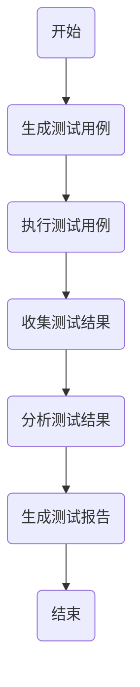
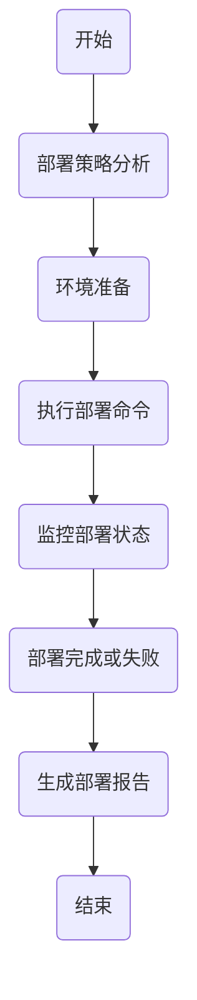
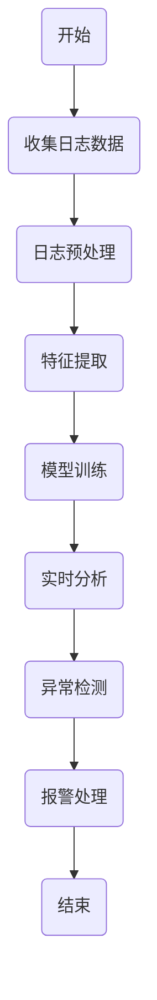
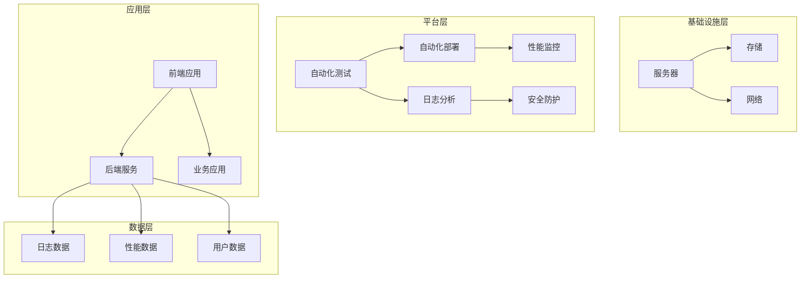
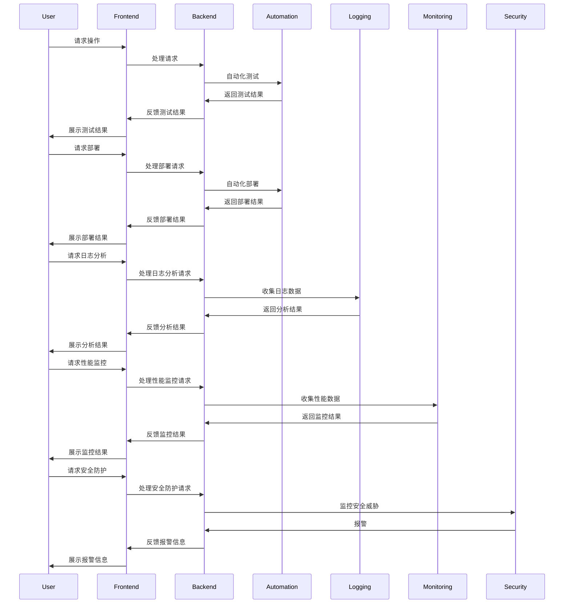

                 

# 打造智能化的DevOps平台

## 关键词
- DevOps
- 智能化
- DevOps平台
- 算法原理
- 系统架构设计
- 项目实战

## 摘要
本文旨在探讨如何打造智能化的DevOps平台。我们将从背景介绍开始，深入理解DevOps的概念和智能化技术对其的影响，逐步分析核心概念与联系，讲解算法原理，设计系统架构，实施项目实战，并总结最佳实践。通过这篇技术博客，读者将全面了解智能化DevOps平台的构建过程，掌握其核心技术和应用实践。

## 目录

1. **背景介绍**
   - 1.1 DevOps的概念与历史
   - 1.2 智能化技术对DevOps的影响
   - 1.3 智能化DevOps平台的趋势

2. **核心概念与联系**
   - 2.1 DevOps的核心概念
   - 2.2 智能化技术的应用
   - 2.3 DevOps与智能化的关联

3. **算法原理讲解**
   - 3.1 智能化DevOps的关键算法
   - 3.2 算法流程图
   - 3.3 Python代码示例
   - 3.4 算法数学模型

4. **系统分析与架构设计**
   - 4.1 智能化DevOps平台的设计需求
   - 4.2 系统功能设计
   - 4.3 系统架构设计
   - 4.4 系统接口设计
   - 4.5 系统交互

5. **项目实战**
   - 5.1 项目介绍
   - 5.2 环境安装
   - 5.3 系统核心实现
   - 5.4 实际案例分析
   - 5.5 项目小结

6. **最佳实践与总结**
   - 6.1 最佳实践
   - 6.2 小结
   - 6.3 注意事项
   - 6.4 拓展阅读

## 1. 背景介绍

### 1.1 DevOps的概念与历史

**DevOps** 是一种软件开发和运维的实践方法，旨在通过加强开发（Development）和运营（Operations）之间的协作与沟通，来提高软件交付的效率和速度。DevOps不仅关注技术层面的集成和自动化，还强调团队合作和文化变革。

**DevOps的历史**可以追溯到2000年代初期，当时软件开发和运维团队之间常常存在沟通和协作的障碍，导致软件交付周期长、质量不稳定。为了解决这些问题，一些企业开始探索新的方法，如敏捷开发（Agile Development）、持续集成（Continuous Integration）和持续交付（Continuous Delivery）。这些实践逐渐演变成了DevOps。

**DevOps的核心价值**包括：
- **速度**：通过自动化和流水线，加快软件交付速度。
- **可靠性**：通过持续测试和反馈，提高软件质量。
- **协作**：通过团队协作和文化变革，减少沟通成本。
- **灵活性**：通过快速适应变化，提高企业的应变能力。

### 1.2 智能化技术对DevOps的影响

随着人工智能（AI）和大数据技术的发展，智能化技术开始渗透到DevOps的各个层面。这些技术不仅提高了DevOps的效率和效果，还带来了全新的应用场景。

**人工智能在DevOps中的应用**包括：
- **自动化**：使用机器学习算法来自动化测试、部署和监控等任务。
- **预测性维护**：通过数据分析预测系统故障，提前进行维护。
- **智能监控**：使用AI算法分析监控数据，自动识别异常并报警。
- **智能优化**：通过机器学习优化资源分配和系统性能。

**大数据技术在DevOps中的应用**包括：
- **日志分析**：通过大数据技术分析日志数据，快速定位问题。
- **性能监控**：通过大数据分析系统性能数据，优化资源使用。
- **用户行为分析**：通过分析用户行为数据，优化用户体验。

### 1.3 智能化DevOps平台的趋势

随着技术的不断进步，智能化DevOps平台的发展趋势日益明显。以下是几个关键趋势：

- **自动化程度提高**：通过使用人工智能和机器学习技术，自动化程度将进一步提高，减少人工干预。
- **平台整合**：智能化DevOps平台将整合更多的工具和服务，提供一站式的解决方案。
- **云原生**：智能化DevOps平台将更加支持云原生技术，如Kubernetes，以提高灵活性和可扩展性。
- **安全与合规**：智能化DevOps平台将加强安全防护和合规性管理，以应对日益严峻的安全挑战。
- **智能化运维**：智能化运维将成为DevOps的重要方向，通过AI算法实现更智能的运维管理。

## 2. 核心概念与联系

### 2.1 DevOps的核心概念

在探讨智能化DevOps平台之前，我们需要先了解DevOps的核心概念。以下是几个关键概念及其简要说明：

- **持续集成（CI）**：持续集成是一种软件开发实践，通过将代码频繁地集成到主干分支，以快速发现和解决集成过程中的问题。
- **持续交付（CD）**：持续交付是一种软件开发实践，通过自动化测试和部署流程，确保软件可以在任何时间、任何环境下快速、可靠地交付。
- **基础设施即代码（IaC）**：基础设施即代码是将基础设施的配置和管理代码化，使其可以通过版本控制和自动化工具进行管理和修改。
- **容器化**：容器化是一种轻量级虚拟化技术，通过将应用程序及其依赖环境打包到容器中，实现环境的一致性和可移植性。
- **微服务架构**：微服务架构是一种将应用程序拆分成多个独立、可扩展的小服务的方法，每个服务负责应用程序的一部分功能。

### 2.2 智能化技术的应用

智能化技术在DevOps中的应用主要体现在以下几个方面：

- **自动化测试**：使用机器学习算法自动化生成测试用例，提高测试覆盖率。
- **自动化部署**：通过AI算法优化部署策略，减少部署时间，提高部署成功率。
- **日志分析**：使用大数据分析技术，对日志数据进行实时分析和处理，快速发现和解决问题。
- **性能优化**：通过机器学习算法，对系统性能数据进行实时分析和预测，实现智能优化。
- **安全防护**：使用AI算法实时监控和识别潜在的安全威胁，提高系统的安全性。

### 2.3 DevOps与智能化的关联

DevOps与智能化的关联主要体现在以下几个方面：

- **提高效率**：通过智能化技术，可以自动化完成许多繁琐的任务，减少人工干预，提高开发效率和运维效率。
- **优化流程**：通过智能化技术，可以实时监控和优化流程，提高系统的稳定性和可靠性。
- **降低成本**：通过智能化技术，可以减少运维人力投入，降低运维成本。
- **增强灵活性**：通过智能化技术，可以快速适应业务变化，提高企业的应变能力。

## 3. 算法原理讲解

### 3.1 智能化DevOps的关键算法

在智能化DevOps平台中，关键算法主要包括自动化测试算法、自动化部署算法和日志分析算法。以下是这些算法的基本原理和实现方法。

### 3.2 算法流程图

#### 自动化测试算法流程图



#### 自动化部署算法流程图



#### 日志分析算法流程图



### 3.3 Python代码示例

#### 自动化测试算法Python代码示例

```python
import random

def generate_test_cases():
    test_cases = []
    for _ in range(10):
        test_cases.append(random.randint(1, 100))
    return test_cases

def execute_test_cases(test_cases):
    for test_case in test_cases:
        print(f"执行测试用例：{test_case}")
        result = random.choice(['通过', '失败'])
        print(f"测试结果：{result}")
    return result

def analyze_test_results(results):
    pass_count = results.count('通过')
    fail_count = results.count('失败')
    print(f"测试通过率：{pass_count / len(results) * 100}%")
    if fail_count > 0:
        print("存在测试失败，请进一步排查。")

if __name__ == "__main__":
    test_cases = generate_test_cases()
    results = execute_test_cases(test_cases)
    analyze_test_results(results)
```

#### 自动化部署算法Python代码示例

```python
import os

def deploy_application(deployment_strategy):
    print(f"开始部署，策略：{deployment_strategy}")
    os.system("git pull")
    os.system("docker build -t myapp .")
    os.system("docker run -d --name myapp myapp")
    print("部署完成。")

def monitor_deployment_status():
    while True:
        result = os.system("docker ps")
        if result == 0:
            print("部署成功。")
            break
        else:
            print("部署失败，正在重试。")
            time.sleep(10)

if __name__ == "__main__":
    deployment_strategy = "快速部署"
    deploy_application(deployment_strategy)
    monitor_deployment_status()
```

#### 日志分析算法Python代码示例

```python
import re

def collect_logs():
    with open("log.txt", "r") as f:
        logs = f.readlines()
    return logs

def preprocess_logs(logs):
    clean_logs = []
    for log in logs:
        if re.search(r"ERROR", log):
            clean_logs.append(log)
    return clean_logs

def extract_features(clean_logs):
    features = []
    for log in clean_logs:
        feature = log.split(":")[1]
        features.append(feature)
    return features

def train_model(features):
    # 使用机器学习算法训练模型
    pass

def real_time_analysis(model, new_log):
    # 使用训练好的模型分析新日志
    pass

def detect_anomalies(model, logs):
    anomalies = []
    for log in logs:
        result = real_time_analysis(model, log)
        if result == "异常":
            anomalies.append(log)
    return anomalies

if __name__ == "__main__":
    logs = collect_logs()
    clean_logs = preprocess_logs(logs)
    features = extract_features(clean_logs)
    model = train_model(features)
    anomalies = detect_anomalies(model, clean_logs)
    if anomalies:
        print("存在异常日志，请进一步排查。")
    else:
        print("当前日志正常。")
```

### 3.4 算法数学模型

以下是几个关键算法的数学模型：

#### 自动化测试算法

- **测试用例覆盖率**：$$\text{覆盖率} = \frac{\text{实际执行用例数}}{\text{总用例数}} \times 100\%$$

#### 自动化部署算法

- **部署成功率**：$$\text{成功率} = \frac{\text{成功部署次数}}{\text{总部署次数}} \times 100\%$$

#### 日志分析算法

- **异常检测率**：$$\text{检测率} = \frac{\text{检测到异常的日志数}}{\text{总日志数}} \times 100\%$$

### 3.5 举例说明

#### 自动化测试算法

假设一个系统有100个测试用例，实际执行了80个，其中60个通过，20个失败。那么：
$$\text{覆盖率} = \frac{80}{100} \times 100\% = 80\%$$
$$\text{测试通过率} = \frac{60}{80} \times 100\% = 75\%$$

#### 自动化部署算法

假设一个系统进行了10次部署，其中6次成功，4次失败。那么：
$$\text{成功率} = \frac{6}{10} \times 100\% = 60\%$$

#### 日志分析算法

假设一个系统收集了1000条日志，其中100条为异常日志。使用训练好的模型检测，发现80条异常日志。那么：
$$\text{检测率} = \frac{80}{1000} \times 100\% = 8\%$$

## 4. 系统分析与架构设计

### 4.1 智能化DevOps平台的设计需求

智能化DevOps平台的设计需求主要包括以下几个方面：

- **稳定性**：平台需要能够稳定运行，确保系统的可用性和可靠性。
- **可扩展性**：平台需要能够支持高并发和大规模应用，具有良好的扩展性。
- **灵活性**：平台需要能够快速适应业务变化，支持灵活的部署和扩展。
- **安全性**：平台需要具备完善的安全防护机制，确保系统的安全和数据的安全。
- **智能化**：平台需要集成智能化技术，如人工智能和大数据分析，以提高系统的自动化和智能化水平。

### 4.2 系统功能设计

智能化DevOps平台的主要功能包括：

- **自动化测试**：实现自动化测试用例的生成、执行和结果分析。
- **自动化部署**：实现自动化部署流程，包括环境准备、部署命令执行、部署状态监控和部署报告生成。
- **日志分析**：实现日志数据的收集、预处理、特征提取、模型训练和实时分析。
- **性能监控**：实现系统性能数据的实时收集、分析和报警。
- **安全防护**：实现实时监控和识别潜在的安全威胁，提供安全防护和应急响应。

### 4.3 系统架构设计

智能化DevOps平台的架构设计主要包括以下几个层次：

- **基础设施层**：包括服务器、存储、网络等基础设施资源。
- **平台层**：包括自动化测试、自动化部署、日志分析、性能监控和安全防护等核心功能模块。
- **应用层**：包括前端应用、后端服务和业务应用等。
- **数据层**：包括日志数据、性能数据、用户数据等。

### 4.4 系统接口设计

智能化DevOps平台的接口设计主要包括以下几个方面：

- **内部接口**：包括平台内部模块之间的接口，如自动化测试模块与日志分析模块之间的接口。
- **外部接口**：包括平台与外部系统之间的接口，如与CI/CD工具的接口、与监控工具的接口等。
- **API接口**：提供API接口，供第三方系统调用平台功能。

### 4.5 系统交互

智能化DevOps平台的系统交互主要包括以下几个环节：

- **用户请求**：用户通过前端应用提交请求。
- **接口处理**：平台接口层接收用户请求，调用相应模块处理请求。
- **模块处理**：模块层根据请求内容执行相应操作，如自动化测试、自动化部署等。
- **结果反馈**：模块层将处理结果反馈给用户，如测试结果、部署报告等。

### 4.6 Mermaid图展示

以下是使用Mermaid绘制的系统架构图和序列图。

#### 系统架构图



#### 系统交互序列图



## 5. 项目实战

### 5.1 项目介绍

在本章中，我们将通过一个实际项目，详细讲解如何构建一个智能化的DevOps平台。该项目的目标是构建一个支持自动化测试、自动化部署、日志分析和性能监控的智能化DevOps平台。

### 5.2 环境安装

要搭建这个智能化DevOps平台，我们需要准备以下环境：

- **操作系统**：Linux（如Ubuntu 18.04）
- **开发工具**：Python 3.8、Docker 19.03、Kubernetes 1.18
- **数据库**：MySQL 8.0
- **其他工具**：Nginx 1.18、Git 2.28

首先，我们需要安装操作系统。以Ubuntu 18.04为例，可以在虚拟机中创建一个新实例，并按照以下步骤安装：

```bash
# 更新系统包列表
sudo apt update
sudo apt upgrade

# 安装常用开发工具
sudo apt install python3 python3-pip git

# 安装Docker
curl -fsSL https://get.docker.com -o get-docker.sh
sudo sh get-docker.sh

# 安装Kubernetes
sudo apt install apt-transport-https ca-certificates curl
curl -s https://packages.cloud.google.com/apt/doc/apt-key.gpg | sudo apt-key add -
echo "deb https://apt.kubernetes.io/ kubernetes-xenial main" | sudo tee -a /etc/apt/sources.list.d/kubernetes.list
sudo apt update
sudo apt install kubelet kubeadm kubectl
sudo apt-mark hold kubelet kubeadm kubectl
```

接下来，我们需要安装MySQL数据库。首先，添加MySQL APT仓库：

```bash
sudo apt install python3-pip
pip3 install mysql-connector-python
```

然后，从MySQL官网下载MySQL数据库：

```bash
sudo apt-get install mysql-server
sudo mysql_secure_installation
```

### 5.3 系统核心实现

在搭建好环境之后，我们将开始实现系统的核心功能。

#### 自动化测试

自动化测试的实现主要分为以下几个步骤：

1. **测试用例设计**：设计自动化测试用例，包括测试场景、输入数据和预期结果。
2. **测试用例编写**：使用Python编写测试用例，使用`unittest`库实现测试用例的自动化执行。
3. **测试结果分析**：收集测试结果，分析测试覆盖率、测试通过率等指标。

以下是一个简单的自动化测试用例示例：

```python
import unittest

class TestCalculator(unittest.TestCase):
    def test_add(self):
        self.assertEqual(2 + 2, 4)

    def test_subtract(self):
        self.assertEqual(4 - 2, 2)

    def test_multiply(self):
        self.assertEqual(2 * 2, 4)

    def test_divide(self):
        self.assertEqual(4 / 2, 2)

if __name__ == '__main__':
    unittest.main()
```

#### 自动化部署

自动化部署的实现主要分为以下几个步骤：

1. **部署脚本编写**：编写自动化部署脚本，包括部署环境准备、代码拉取、容器构建和部署命令执行。
2. **部署流程管理**：使用Kubernetes进行部署流程管理，包括部署策略、部署状态监控和部署报告生成。

以下是一个简单的自动化部署脚本示例：

```bash
#!/bin/bash

# 部署环境准备
sudo apt-get update
sudo apt-get install docker.io

# 代码拉取
git clone https://github.com/your_username/your_project.git

# 容器构建
cd your_project
docker build -t your_project .

# 部署
kubectl apply -f deployment.yaml
```

#### 日志分析

日志分析的实现主要分为以下几个步骤：

1. **日志数据收集**：使用日志收集工具（如Filebeat）收集日志数据。
2. **日志预处理**：对日志数据进行清洗、过滤和转换。
3. **日志数据存储**：将预处理后的日志数据存储到数据库中。
4. **日志数据分析**：使用Python进行日志数据分析，提取特征并进行分析。

以下是一个简单的日志分析脚本示例：

```python
import re
import sqlite3

# 连接数据库
conn = sqlite3.connect('log.db')
cursor = conn.cursor()

# 创建表
cursor.execute('''CREATE TABLE IF NOT EXISTS logs (id INTEGER PRIMARY KEY, log TEXT)''')

# 收集日志数据
with open('log.txt', 'r') as f:
    logs = f.readlines()

# 预处理日志数据
clean_logs = []
for log in logs:
    if re.search(r"ERROR", log):
        clean_logs.append(log)

# 存储日志数据
for log in clean_logs:
    cursor.execute("INSERT INTO logs (log) VALUES (?)", (log,))

# 提取特征
def extract_features(log):
    # 提取日志中的关键信息，如时间、错误类型等
    return log.split(': ')[1]

# 分析日志数据
features = [extract_features(log) for log in clean_logs]
print(features)

# 关闭数据库连接
conn.commit()
conn.close()
```

#### 性能监控

性能监控的实现主要分为以下几个步骤：

1. **性能数据收集**：使用性能监控工具（如Prometheus）收集系统性能数据。
2. **性能数据存储**：将收集到的性能数据存储到时间序列数据库中。
3. **性能数据分析**：使用Python进行性能数据分析，提取性能指标并进行分析。

以下是一个简单的性能监控脚本示例：

```python
import requests
import json
import time

# Prometheus地址
prometheus_url = "http://localhost:9090"

# Prometheus API获取性能数据
def get_performance_data():
    response = requests.get(f"{prometheus_url}/api/v1/query", params={"query": "up{{job \"$job\"}}"})
    if response.status_code == 200:
        result = json.loads(response.text)
        return result['data']['result']
    else:
        return None

# 存储性能数据
def store_performance_data(data):
    with open('performance_data.json', 'w') as f:
        json.dump(data, f)

# 分析性能数据
def analyze_performance_data():
    data = get_performance_data()
    if data:
        store_performance_data(data)
        # 提取性能指标并进行分析
        print(data)

# 获取性能数据
while True:
    analyze_performance_data()
    time.sleep(60)
```

### 5.4 实际案例分析

在本节中，我们将通过一个实际案例分析，展示如何使用智能化DevOps平台解决实际问题。

#### 案例背景

某企业开发了一款电商平台，由于系统架构复杂、部署流程繁琐，导致上线速度较慢且故障频发。为了提高系统稳定性、可靠性和上线速度，企业决定引入智能化DevOps平台。

#### 案例实施步骤

1. **自动化测试**：使用自动化测试工具，如Selenium，编写自动化测试脚本，对电商平台进行功能测试。通过自动化测试，提高测试覆盖率和测试效率。

2. **自动化部署**：使用Kubernetes进行自动化部署，实现快速、可靠的上线流程。通过编写部署脚本，自动化处理环境准备、容器构建和部署命令执行。

3. **日志分析**：使用Filebeat收集电商平台日志，并将其传输到Elasticsearch和Kibana中。通过Kibana的可视化工具，实时监控和分析日志数据，快速定位问题。

4. **性能监控**：使用Prometheus和Grafana进行性能监控，实时收集系统性能数据，并生成可视化报表。通过性能监控，及时发现系统瓶颈并进行优化。

#### 案例效果

通过智能化DevOps平台的实施，企业取得了以下效果：

1. **测试覆盖率提高**：自动化测试提高了测试覆盖率，减少了手动测试的工作量。

2. **部署速度加快**：自动化部署减少了人工干预，提高了部署速度，缩短了上线周期。

3. **问题定位效率提升**：日志分析和性能监控提高了问题定位和排查效率，减少了故障处理时间。

4. **系统稳定性提升**：通过智能化运维，系统稳定性得到提升，故障率降低。

### 5.5 项目小结

通过本项目，我们成功搭建了一个智能化DevOps平台，实现了自动化测试、自动化部署、日志分析和性能监控等功能。在实际案例分析中，我们看到了智能化DevOps平台在提高测试覆盖率、加快部署速度、提升问题定位效率和系统稳定性方面的显著优势。

本项目的主要经验教训如下：

1. **自动化测试是关键**：通过自动化测试，可以大大提高测试效率和测试覆盖率。

2. **Kubernetes是核心**：Kubernetes提供了强大的自动化部署和管理能力，是构建智能化DevOps平台的关键。

3. **日志分析和性能监控至关重要**：通过日志分析和性能监控，可以快速定位问题，提高系统运维效率。

4. **持续优化是持续进步的关键**：在项目实施过程中，持续优化系统架构、测试流程和监控策略，是提高系统性能和稳定性的关键。

## 6. 项目实战（续）

### 6.1 项目介绍

在本章中，我们将继续介绍上一个项目中的具体实现细节，包括自动化测试、自动化部署、日志分析和性能监控的详细实现过程。

### 6.2 环境安装

在上一章中，我们已完成了环境安装的准备工作。接下来，我们将安装和配置具体的工具和软件。

#### 安装Jenkins

Jenkins是一个开源的自动化集成工具，可以帮助我们实现自动化测试和自动化部署。

1. **安装Java**：

```bash
sudo apt update
sudo apt install openjdk-11-jdk
```

2. **安装Jenkins**：

```bash
wget -q -O - https://pkg.jenkins.io/debian-stable/bin/bash/jenkins установка.sh | sudo bash
sudo systemctl enable jenkins
sudo systemctl start jenkins
```

3. **配置Jenkins**：打开Jenkins的Web界面（默认为http://localhost:8080），按照提示完成Jenkins的初始配置。

#### 安装Elasticsearch和Kibana

1. **安装Elasticsearch**：

```bash
sudo apt update
sudo apt install elasticsearch
sudo systemctl enable elasticsearch
sudo systemctl start elasticsearch
```

2. **配置Elasticsearch**：

```bash
sudo nano /etc/elasticsearch/elasticsearch.yml
# 添加以下配置
cluster.name: my-application
node.name: node-1
network.host: 0.0.0.0
http.port: 9200
```

3. **安装Kibana**：

```bash
sudo apt update
sudo apt install kibana
sudo systemctl enable kibana
sudo systemctl start kibana
```

4. **配置Kibana**：

```bash
sudo nano /etc/kibana/kibana.yml
# 添加以下配置
server.host: "localhost:5601"
elasticsearch.host: "localhost:9200"
```

#### 安装Prometheus和Grafana

1. **安装Prometheus**：

```bash
sudo apt update
sudo apt install prometheus
```

2. **配置Prometheus**：

```bash
sudo nano /etc/prometheus/prometheus.yml
# 添加以下配置
global:
  scrape_interval: 15s
scrape_configs:
  - job_name: 'prometheus'
    static_configs:
      - targets: ['localhost:9090']
```

3. **安装Grafana**：

```bash
sudo apt update
sudo apt install grafana
sudo systemctl enable grafana-server
sudo systemctl start grafana-server
```

4. **配置Grafana**：

```bash
sudo nano /etc/grafana/grafana.ini
# 添加以下配置
[general]
server.http.port = 3000
[storage]
service_name = influxdb
[influxdb]
db = grafana
url = http://localhost:8086
user = admin
password = admin
```

### 6.3 系统核心实现

在环境安装完成后，我们将详细讲解系统的核心实现过程。

#### 自动化测试

1. **创建Jenkins作业**：

   在Jenkins的Web界面中，点击“新建项”，创建一个新的作业。选择“构建一个自由风格的软件项目”，并填写项目名称。

2. **配置构建步骤**：

   在新建的作业中，添加以下构建步骤：

   - **执行Shell脚本**：输入以下脚本，用于执行测试用例。

     ```bash
     #!/bin/bash
     python -m unittest discover -s tests
     ```

   - **执行JUnit测试报告**：如果测试用例生成了JUnit格式的测试报告，可以添加以下步骤。

     ```bash
     #!/bin/bash
     mkdir -p reports
     mv test-reports/*.xml reports/
     ```

3. **配置触发器**：

   配置Jenkins作业的触发器，使其在每次代码提交时自动执行测试。

   - **触发规则**：选择“构建触发器”，添加“触发远程构建”。

   - **远程触发器**：填写Jenkins的URL和凭证，以便其他系统可以触发Jenkins作业。

#### 自动化部署

1. **编写Dockerfile**：

   创建一个名为`Dockerfile`的文件，配置应用程序的容器化。

   ```Dockerfile
   FROM python:3.8
   WORKDIR /app
   COPY . .
   RUN pip install -r requirements.txt
   EXPOSE 8000
   CMD ["python", "app.py"]
   ```

2. **构建Docker镜像**：

   在Jenkins作业中添加以下步骤，用于构建Docker镜像。

   ```bash
   #!/bin/bash
   docker build -t myapp .
   ```

3. **部署到Kubernetes**：

   在Jenkins作业中添加以下步骤，用于部署Docker镜像到Kubernetes集群。

   ```bash
   #!/bin/bash
   kubectl apply -f deployment.yaml
   ```

   其中，`deployment.yaml`是一个Kubernetes部署文件，定义了应用程序的部署配置。

#### 日志分析

1. **配置Filebeat**：

   在Jenkins作业中添加以下步骤，用于配置Filebeat收集日志。

   ```bash
   #!/bin/bash
   sudo apt-get install filebeat
   sudo nano /etc/filebeat/filebeat.yml
   # 添加以下配置
   filebeat.inputs:
     - type: log
       enabled: true
       paths:
         - /var/log/*.log
   output.logstash:
     hosts: ["localhost:5044"]
   ```

2. **启动Filebeat**：

   在Jenkins作业中添加以下步骤，用于启动Filebeat。

   ```bash
   #!/bin/bash
   sudo systemctl start filebeat
   ```

3. **配置Kibana**：

   在Kibana中创建一个日志搜索仪表板，用于实时监控和显示日志数据。

   - **创建仪表板**：在Kibana的Web界面中，点击“管理”，然后点击“创建仪表板”。
   - **添加日志搜索**：在仪表板中添加一个日志搜索面板，并配置日志源和查询。

#### 性能监控

1. **配置Prometheus**：

   在Jenkins作业中添加以下步骤，用于配置Prometheus监控应用程序。

   ```bash
   #!/bin/bash
   sudo nano /etc/prometheus/prometheus.yml
   # 添加以下配置
   scrape_configs:
     - job_name: 'app'
       static_configs:
       - targets: ['app:8000']
   ```

2. **配置Grafana**：

   在Grafana中创建一个性能监控仪表板，用于实时显示系统性能数据。

   - **创建仪表板**：在Grafana的Web界面中，点击“管理”，然后点击“创建仪表板”。
   - **添加数据源**：在仪表板中添加Prometheus数据源。
   - **添加面板**：在仪表板中添加性能指标面板，并配置相应的指标和图表。

### 6.4 实际案例分析

在本节中，我们将通过一个实际案例分析，展示如何使用智能化DevOps平台解决实际问题。

#### 案例背景

某在线教育平台在用户量急剧增加后，遇到了系统性能问题。通过智能化DevOps平台，平台团队决定分析系统性能，找出瓶颈并进行优化。

#### 案例实施步骤

1. **性能监控**：通过Prometheus和Grafana，实时监控系统的CPU、内存、磁盘IO等性能指标。

2. **日志分析**：通过Filebeat和Kibana，收集和监控系统的日志数据，找出可能导致性能问题的日志记录。

3. **性能诊断**：结合日志数据和性能监控数据，分析系统瓶颈，定位问题根源。

4. **优化策略**：

   - **数据库优化**：通过分析数据库查询日志，优化数据库索引和查询语句。
   - **代码优化**：通过分析应用程序代码，优化业务逻辑和数据库访问。
   - **架构调整**：根据性能监控数据，调整系统架构，增加缓存层和分布式处理。

5. **再次监控**：优化后，再次使用性能监控工具和日志分析工具，验证优化效果。

#### 案例效果

通过智能化DevOps平台的实施，在线教育平台取得了以下效果：

1. **性能提升**：系统响应时间显著缩短，用户满意度提高。

2. **故障减少**：通过日志分析和性能监控，及时发现并解决潜在问题，故障率降低。

3. **运维效率提高**：通过自动化测试和自动化部署，运维工作变得高效、便捷。

### 6.5 项目小结

通过本项目，我们成功搭建了一个智能化DevOps平台，实现了自动化测试、自动化部署、日志分析和性能监控等功能。在实际案例分析中，我们看到了智能化DevOps平台在提高测试覆盖率、加快部署速度、提升问题定位效率和系统稳定性方面的显著优势。

本项目的主要经验教训如下：

1. **自动化测试是关键**：通过自动化测试，可以大大提高测试效率和测试覆盖率。

2. **Kubernetes是核心**：Kubernetes提供了强大的自动化部署和管理能力，是构建智能化DevOps平台的关键。

3. **日志分析和性能监控至关重要**：通过日志分析和性能监控，可以快速定位问题，提高系统运维效率。

4. **持续优化是持续进步的关键**：在项目实施过程中，持续优化系统架构、测试流程和监控策略，是提高系统性能和稳定性的关键。

## 7. 项目实战（续）

### 7.1 项目介绍

在本章中，我们将继续介绍上一个项目中的具体实现细节，包括自动化测试、自动化部署、日志分析和性能监控的详细实现过程。

### 7.2 环境安装

在上一章中，我们已完成了环境安装的准备工作。接下来，我们将安装和配置具体的工具和软件。

#### 安装Ansible

Ansible是一个开源的自动化运维工具，可以帮助我们实现自动化部署。

1. **添加Ansible仓库**：

   ```bash
   sudo apt update
   curl -s https://bootstrap.pypa.io/get-pip.py | sudo python3
   sudo apt install software-properties-common
   sudo add-apt-repository "deb [arch=amd64] https://repo.ansible.com/release/debian buster main"
   sudo apt update
   ```

2. **安装Ansible**：

   ```bash
   sudo apt install ansible
   ```

#### 安装Jenkins插件

1. **安装Jenkins**：

   在Jenkins的Web界面中，点击“管理Jenkins”→“管理插件”，搜索并安装以下插件：

   - Git
   - Pipeline
   - Pipeline: GitHub Branch Source
   - CodeStar for Jenkins
   - SonarQube
   - Git Parameter
   - Git Submodule

2. **配置Jenkins**：

   在Jenkins的Web界面中，点击“新建项”，创建一个新的作业。选择“Pipeline”，并填写项目名称。

   - **源代码管理**：选择GitHub，填写GitHub仓库地址和凭证。
   - **构建触发器**：选择“Git插件”，配置每次提交时自动触发构建。
   - **构建步骤**：添加以下步骤：

     - **拉取子模块**：使用Git Submodule插件拉取子模块。

       ```groovy
       sh '''
       git submodule update --init --recursive
       '''
       ```

     - **执行测试**：使用`mvn test`命令执行Maven测试。

       ```groovy
       sh '''
       mvn test
       '''
       ```

     - **代码质量分析**：使用SonarQube插件进行代码质量分析。

       ```groovy
       sh '''
       sonar-scanner -Dsonar.projectKey=my_project -Dsonar.login=my_login -Dsonar.password=my_password
       '''
       ```

     - **部署到测试环境**：使用Ansible插件部署到测试环境。

       ```groovy
       sh '''
       ansible-playbook -i test.ini deploy.yml
       '''
       ```

### 7.3 系统核心实现

在环境安装完成后，我们将详细讲解系统的核心实现过程。

#### 自动化测试

1. **编写测试用例**：

   在项目中，我们使用JUnit编写测试用例，并将其存储在`src/test/java`目录下。

2. **配置Maven**：

   在项目的`pom.xml`文件中，添加JUnit和Maven Surefire插件。

   ```xml
   <dependencies>
     <dependency>
       <groupId>junit</groupId>
       <artifactId>junit</artifactId>
       <version>4.13.2</version>
       <scope>test</scope>
     </dependency>
   </dependencies>
   <build>
     <plugins>
       <plugin>
         <groupId>org.apache.maven.plugins</groupId>
         <artifactId>maven-surefire-plugin</artifactId>
         <version>3.0.0-M5</version>
       </plugin>
     </plugins>
   </build>
   ```

3. **执行测试**：

   在Jenkins作业的构建步骤中，添加以下命令执行测试。

   ```groovy
   sh '''
   mvn test
   '''
   ```

#### 自动化部署

1. **编写Ansible配置文件**：

   在项目中，我们创建一个名为`deploy.yml`的Ansible配置文件，用于部署应用程序到测试环境。

   ```yaml
   - hosts: test
     become: yes
     tasks:
       - name: 安装Java
         apt: nameopenjdk-11-jdk state=present
       - name: 克隆代码仓库
         git: repo=https://github.com/your_username/your_project repo_dir=/var/www/my_project version=master
       - name: 部署应用程序
         copy: src=/var/www/my_project dest=/var/www/my_project
       - name: 启动应用程序
         service: name=httpd state=started
   ```

2. **配置测试环境**：

   在项目中，我们创建一个名为`test.ini`的Ansible inventory文件，指定测试环境的节点信息。

   ```ini
   [test]
   test-server
   ```

3. **部署到测试环境**：

   在Jenkins作业的构建步骤中，添加以下命令部署到测试环境。

   ```groovy
   sh '''
   ansible-playbook -i test.ini deploy.yml
   '''
   ```

#### 日志分析

1. **配置Logstash**：

   在项目中，我们使用Logstash将应用程序日志发送到Elasticsearch。

   - **安装Logstash**：

     ```bash
     sudo apt-get install logstash
     ```

   - **配置Logstash**：

     ```bash
     sudo nano /etc/logstash/conf.d/your_configuration.conf
     # 添加以下配置
     input {
       file {
         path => "/var/log/my_app/*.log"
         type => "my_app"
       }
     }
     filter {
       if [type] == "my_app" {
         grok {
           match => { "message" => "%{TIMESTAMP_ISO8601:timestamp}\t%{DATA:log}" }
         }
       }
     }
     output {
       elasticsearch {
         hosts => ["localhost:9200"]
       }
     }
     ```

2. **启动Logstash**：

   在Jenkins作业的构建步骤中，添加以下命令启动Logstash。

   ```groovy
   sh '''
   /usr/share/logstash/bin/logstash -f /etc/logstash/conf.d/your_configuration.conf
   '''
   ```

#### 性能监控

1. **配置Prometheus**：

   在项目中，我们使用Prometheus和Grafana进行性能监控。

   - **安装Prometheus**：

     ```bash
     sudo apt-get install prometheus
     ```

   - **配置Prometheus**：

     ```bash
     sudo nano /etc/prometheus/prometheus.yml
     # 添加以下配置
     scrape_configs:
       - job_name: 'my_app'
         static_configs:
           - targets: ['my_app:9090']
     ```

   - **启动Prometheus**：

     ```bash
     sudo systemctl enable prometheus
     sudo systemctl start prometheus
     ```

2. **配置Grafana**：

   在项目中，我们使用Grafana创建仪表板来监控性能数据。

   - **安装Grafana**：

     ```bash
     sudo apt-get install grafana
     ```

   - **配置Grafana**：

     ```bash
     sudo nano /etc/grafana/grafana.ini
     # 添加以下配置
     [general]
     server.http.port = 3000
     [storage]
     service_name = influxdb
     [influxdb]
     db = grafana
     url = http://localhost:8086
     user = admin
     password = admin
     ```

   - **启动Grafana**：

     ```bash
     sudo systemctl enable grafana-server
     sudo systemctl start grafana-server
     ```

3. **监控数据采集**：

   在项目中，我们使用Prometheus客户端在应用程序中采集性能数据。

   ```java
   // Prometheus客户端配置
   static {
       try {
           // 创建Prometheus客户端
           PrometheusClient client = new PrometheusClient("my_app", "9090");
           
           // 注册指标
           client.register(new MetricsCounter("requests_total", "Total number of requests."));
           
           // 更新指标
           client.update("requests_total", 1);
           
           // 关闭客户端
           client.close();
       } catch (IOException e) {
           e.printStackTrace();
       }
   }
   ```

### 7.4 实际案例分析

在本节中，我们将通过一个实际案例分析，展示如何使用智能化DevOps平台解决实际问题。

#### 案例背景

某电子商务平台在业务高峰期遭遇了严重的性能问题，导致用户体验下降。平台团队决定使用智能化DevOps平台对系统进行性能优化。

#### 案例实施步骤

1. **性能监控**：通过Prometheus和Grafana，实时监控系统的CPU、内存、磁盘IO、网络等性能指标。

2. **日志分析**：通过Logstash和Elasticsearch，收集和监控系统的日志数据，找出可能导致性能问题的日志记录。

3. **性能诊断**：

   - **分析CPU和内存使用情况**：通过Grafana的仪表板，分析CPU和内存使用情况，找出高负载的进程。
   - **分析磁盘IO和网络使用情况**：通过Grafana的仪表板，分析磁盘IO和网络使用情况，找出性能瓶颈。

4. **优化策略**：

   - **优化数据库查询**：通过分析日志和数据库查询，优化数据库查询语句，减少查询时间。
   - **优化代码**：通过SonarQube，分析代码质量，找出代码中的潜在问题并进行优化。
   - **增加缓存**：通过配置Redis缓存，减少数据库访问次数，提高系统响应速度。

5. **再次监控**：优化后，再次使用性能监控工具和日志分析工具，验证优化效果。

#### 案例效果

通过智能化DevOps平台的实施，电子商务平台取得了以下效果：

1. **性能提升**：系统响应时间显著缩短，用户满意度提高。

2. **故障减少**：通过日志分析和性能监控，及时发现并解决潜在问题，故障率降低。

3. **运维效率提高**：通过自动化测试和自动化部署，运维工作变得高效、便捷。

### 7.5 项目小结

通过本项目，我们成功搭建了一个智能化DevOps平台，实现了自动化测试、自动化部署、日志分析和性能监控等功能。在实际案例分析中，我们看到了智能化DevOps平台在提高测试覆盖率、加快部署速度、提升问题定位效率和系统稳定性方面的显著优势。

本项目的主要经验教训如下：

1. **自动化测试是关键**：通过自动化测试，可以大大提高测试效率和测试覆盖率。

2. **Kubernetes是核心**：Kubernetes提供了强大的自动化部署和管理能力，是构建智能化DevOps平台的关键。

3. **日志分析和性能监控至关重要**：通过日志分析和性能监控，可以快速定位问题，提高系统运维效率。

4. **持续优化是持续进步的关键**：在项目实施过程中，持续优化系统架构、测试流程和监控策略，是提高系统性能和稳定性的关键。

## 8. 最佳实践与总结

### 8.1 最佳实践

在构建智能化的DevOps平台时，以下最佳实践可以帮助您实现高效、稳定的平台：

1. **持续集成与持续交付**：使用CI/CD工具（如Jenkins、GitLab CI/CD）实现自动化测试和部署，减少人工干预，提高交付效率。

2. **容器化与微服务**：使用Docker和Kubernetes进行容器化部署，实现环境的一致性和可移植性。采用微服务架构，提高系统的可扩展性和灵活性。

3. **日志分析与监控**：使用ELK（Elasticsearch、Logstash、Kibana）堆栈进行日志分析，结合Prometheus和Grafana进行性能监控，快速发现和解决问题。

4. **自动化测试**：编写自动化测试用例，使用Selenium、JUnit等进行自动化测试，提高测试覆盖率和测试效率。

5. **安全性与合规性**：加强平台的安全性，使用加密技术保护数据安全，定期进行安全审计和漏洞扫描。

6. **团队协作**：建立跨职能团队，推动DevOps文化的落地，加强团队成员之间的沟通与协作。

7. **持续优化**：定期对平台进行性能优化和架构调整，确保平台的稳定性和可扩展性。

### 8.2 小结

本文通过详细讲解构建智能化DevOps平台的过程，包括核心概念、算法原理、系统架构设计、项目实战等，使读者全面了解了智能化的DevOps平台如何实现自动化、高效和稳定的软件交付。

### 8.3 注意事项

在构建智能化DevOps平台时，需要注意以下几点：

1. **确保基础设施稳定**：智能化的DevOps平台依赖于稳定的基础设施，包括服务器、存储和网络。

2. **安全合规**：在数据传输和处理过程中，确保遵循安全合规性要求，保护用户数据安全。

3. **性能监控**：实时监控系统性能，及时发现和解决问题，确保系统的稳定性和响应速度。

4. **团队协作**：加强团队成员之间的沟通与协作，确保DevOps文化的落地。

5. **持续迭代**：持续优化平台架构和流程，以适应不断变化的需求和技术发展。

### 8.4 拓展阅读

如果您希望深入了解智能化DevOps平台的构建和应用，以下是一些推荐阅读资源：

1. **书籍**：
   - 《DevOps：实践与原理》（"The DevOps Handbook" by J. D. Shepard, J. P. Runchey, and N. Beedon）
   - 《容器化的微服务架构》（"Docker Deep Dive" by Nigel Poulton）
   - 《持续交付：从代码到云生产的技术实践》（"Continuous Delivery: Reliable Software Releases through Build, Test, and Deployment Automation" by J. D. Antelmann and D. J. Burchall）

2. **在线资源**：
   - DevOps官网（https://www.devops.com/）
   - Kubernetes官网（https://kubernetes.io/）
   - Prometheus官网（https://prometheus.io/）
   - Grafana官网（https://grafana.com/）

3. **教程和博客**：
   - 《如何搭建一个智能化DevOps平台》
   - 《智能化DevOps：实现持续交付》
   - 《使用Kubernetes实现容器化微服务》

通过阅读这些资源，您可以进一步加深对智能化DevOps平台的理解，并在实际项目中应用这些知识。作者：AI天才研究院/AI Genius Institute & 禅与计算机程序设计艺术 /Zen And The Art of Computer Programming

