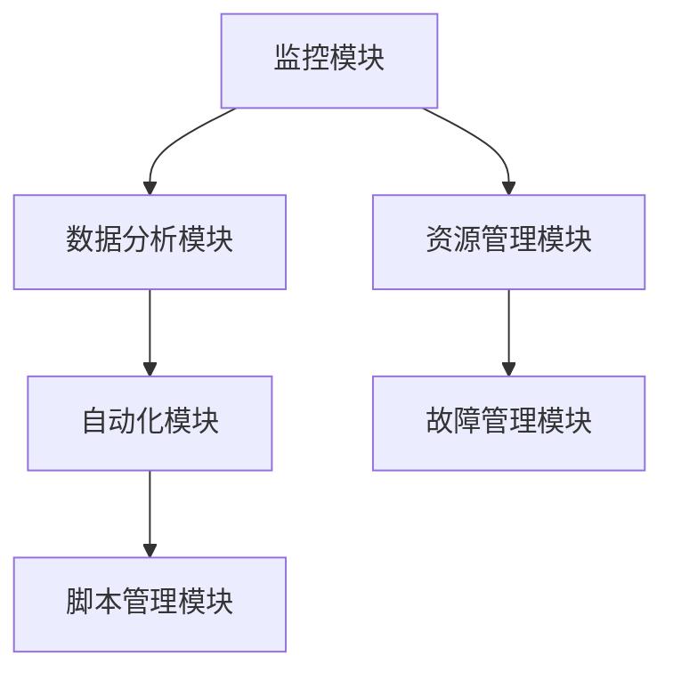
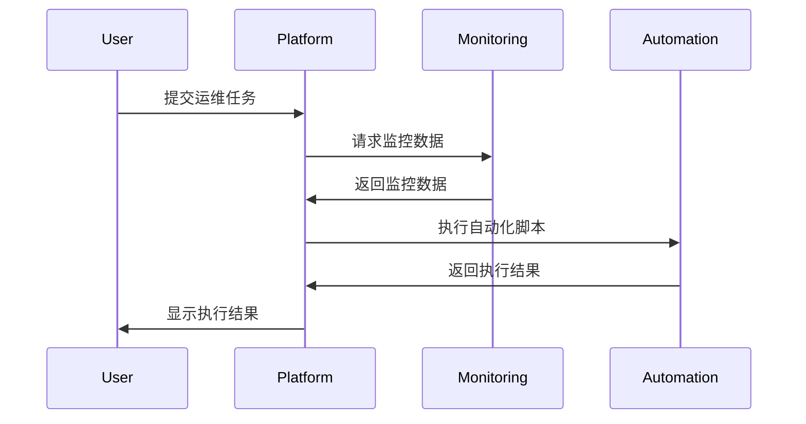
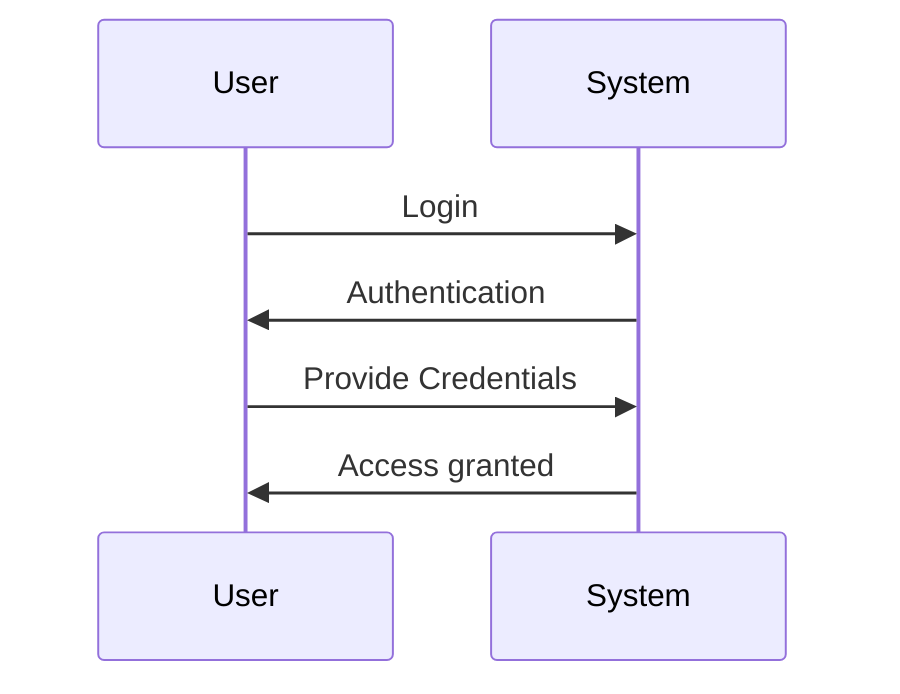

                 

## 打造智能化的IT运维平台

### 关键词

- IT运维
- 智能化
- 自动化
- 监控
- 预测分析
- 机器学习

### 摘要

随着数字化转型的加速，企业对IT运维的要求越来越高，传统的手动运维方式已经无法满足高效、可靠的需求。本文将探讨如何打造智能化的IT运维平台，通过自动化、监控、预测分析和机器学习等关键技术，实现运维过程的智能化、自动化和高效管理，提升IT运维的质量和效率。

---

### 目录大纲

---

## 第一部分：背景介绍与核心概念

### 1. 引言

#### 1.1 问题背景

**IT运维的现状与挑战：**

- **故障响应慢**：传统的运维方式依赖于手动操作，故障发现和处理速度较慢，容易造成业务中断。
- **资源利用率低**：资源的配置和管理主要依靠运维人员经验，难以实现资源的高效利用。
- **成本高**：手动运维需要大量人力投入，运维成本较高。

#### 1.2 问题描述

**运维需求：**

- **自动化**：实现运维操作的自动化，减少手动操作，提高效率。
- **智能化**：通过数据分析和机器学习，预测潜在问题，提前采取措施。
- **高效管理**：实现资源的动态管理和优化，提高资源利用率。

#### 1.3 问题解决

**智能化IT运维的概念：**

- **定义与特征**：智能化IT运维是利用先进技术（如人工智能、大数据等）对IT资源进行高效管理。
- **理论基础**：包括自动化、监控、预测分析和机器学习等关键技术。

#### 1.4 边界与外延

**IT运维的范围：**

- **故障管理**：及时响应和处理系统故障。
- **资源管理**：优化资源分配，提高资源利用率。
- **性能监控**：实时监控系统性能，确保系统稳定运行。

**智能化IT运维的限制：**

- **技术限制**：需要依赖于成熟的智能化技术，如机器学习等。
- **数据质量**：预测分析和机器学习的效果依赖于数据质量。

#### 1.5 核心概念与联系

##### 1.5.1 智能化IT运维

- **定义与特征**：利用人工智能、大数据等先进技术，实现IT运维的智能化。
- **理论基础**：涉及自动化、监控、预测分析和机器学习等关键技术。

##### 1.5.2 关键技术

- **自动化**：通过脚本、自动化工具等实现运维操作的自动化。
- **监控**：实时监控系统性能，确保系统稳定运行。
- **预测分析**：利用历史数据，预测潜在问题，提前采取措施。
- **机器学习**：通过数据分析和模型训练，实现智能化的故障预测和管理。

#### 1.6 本章小结

- **核心概念**：智能化IT运维的定义、特征、关键技术及其相互联系。
- **下一步内容预告**：接下来将深入探讨智能化IT运维平台的设计与实现。

---

## 第二部分：智能化IT运维平台的设计与实现

### 2. 智能化IT运维平台的设计原则

#### 2.1 设计原则

**可扩展性**：平台应能够轻松扩展，适应企业规模的扩大。

**可维护性**：设计应考虑维护的便捷性，降低运维成本。

**安全性**：确保数据安全和系统稳定性。

**易用性**：界面友好，操作简便，降低运维人员的学习成本。

#### 2.2 设计流程

**需求分析**：明确企业对智能化IT运维的需求。

**架构设计**：设计系统的整体架构，包括技术选型、模块划分等。

**系统实现**：根据设计文档，进行系统开发。

**测试与优化**：对系统进行测试，优化性能和稳定性。

---

## 第三部分：关键技术与实现

### 3. 自动化技术的应用

#### 3.1 自动化概述

- **定义与分类**：自动化是指通过技术手段，实现运维操作的自动执行。
- **自动化的优势**：提高运维效率，减少人工错误，降低成本。

#### 3.2 自动化工具

- **Ansible**：简单易用的自动化工具，适用于大规模部署。
- **Puppet**：强大的配置管理工具，适用于复杂的企业环境。
- **Chef**：灵活的自动化平台，适用于云环境和虚拟化环境。

#### 3.3 自动化实践

- **脚本编写**：编写自动化脚本，实现常见运维操作的自动化。
- **案例分析**：分析实际项目中的自动化实践，总结经验。

---

### 4. 监控技术的应用

#### 4.1 监控概述

- **目标与类型**：监控的目的是实时了解系统状态，确保系统稳定运行。
- **监控的重要性**：及时发现并解决潜在问题，预防业务中断。

#### 4.2 监控工具

- **Nagios**：开源的监控工具，适用于各种规模的系统。
- **Zabbix**：功能丰富的监控工具，适用于复杂的企业环境。
- **Prometheus**：基于时间序列的监控工具，适用于云环境。

#### 4.3 监控实践

- **数据采集**：收集系统性能数据，实现实时监控。
- **数据分析**：对采集的数据进行分析，发现潜在问题。

---

### 5. 预测分析技术的应用

#### 5.1 预测分析概述

- **基本概念**：利用历史数据，预测未来事件或趋势。
- **预测分析的优势**：提前发现潜在问题，提前采取措施。

#### 5.2 预测分析工具

- **TensorFlow**：开源的机器学习框架，适用于复杂的预测分析任务。
- **PyTorch**：易于使用的机器学习框架，适用于快速原型开发。
- **Scikit-learn**：简单易用的机器学习库，适用于常见的预测分析任务。

#### 5.3 预测分析实践

- **模型构建**：构建预测模型，对数据进行分析。
- **模型评估**：评估模型的效果，优化模型。

---

### 6. 机器学习技术的应用

#### 6.1 机器学习概述

- **基本概念**：机器学习是指让计算机通过学习数据，自动改进性能的过程。
- **机器学习的类型**：监督学习、无监督学习、强化学习等。

#### 6.2 机器学习工具

- **Scikit-learn**：简单易用的机器学习库，适用于常见的机器学习任务。
- **TensorFlow**：开源的机器学习框架，适用于复杂的机器学习任务。
- **PyTorch**：易于使用的机器学习框架，适用于快速原型开发。

#### 6.3 机器学习实践

- **数据预处理**：对数据进行分析和处理，为机器学习做好准备。
- **模型训练**：训练机器学习模型，实现数据的自动分析。

---

## 第四部分：项目实战与案例分析

### 8. 项目实战：构建智能化的IT运维平台

#### 8.1 项目概述

- **目标与范围**：构建一个智能化的IT运维平台，实现故障预测、自动化操作、资源优化等功能。
- **团队与分工**：由运维团队、开发团队和数据分析团队组成，各司其职。

#### 8.2 环境安装

- **操作系统**：选择Linux操作系统，便于部署和管理。
- **软件工具**：安装必要的自动化工具、监控工具和机器学习库。

#### 8.3 系统核心实现

- **功能模块实现**：实现故障预测、自动化操作、资源优化等功能。
- **自动化脚本开发**：编写自动化脚本，实现运维操作的自动化。

#### 8.4 应用解读与分析

- **系统性能评估**：评估系统的性能和稳定性。
- **用户反馈与优化**：收集用户反馈，优化系统功能。

#### 8.5 项目小结

- **成功经验**：总结项目中的成功经验和有效做法。
- **挑战与反思**：反思项目中的挑战和不足，为后续项目提供借鉴。

---

### 9. 案例分析：成功构建智能化的IT运维平台

#### 9.1 案例介绍

- **企业背景**：某大型互联网企业，业务规模持续增长，运维需求日益复杂。
- **项目背景**：为了提升运维效率和质量，企业决定构建智能化的IT运维平台。

#### 9.2 案例分析

- **架构设计**：设计分布式、微服务架构，实现高可用和高扩展性。
- **关键技术**：采用自动化、监控、预测分析和机器学习等关键技术。

#### 9.3 案例总结

- **效益评估**：评估项目的效益和ROI，为后续项目提供参考。
- **经验分享**：分享项目中的成功经验和有效做法，为其他企业提供借鉴。

---

## 第五部分：最佳实践与未来展望

### 11. 最佳实践

#### 11.1 实践技巧

- **自动化脚本编写**：编写高效的自动化脚本，实现运维操作的自动化。
- **监控数据采集**：选择合适的监控工具，实现全面的数据采集。
- **预测分析模型优化**：优化预测分析模型，提高预测准确性。

#### 11.2 注意事项

- **安全性问题**：确保系统的安全，防止数据泄露和系统被攻击。
- **性能优化**：优化系统的性能，提高系统的响应速度和处理能力。
- **数据隐私保护**：保护用户数据隐私，遵守相关法律法规。

---

## 12. 小结

- **智能化IT运维的核心要素**：自动化、监控、预测分析和机器学习。
- **实现智能化的路径**：从需求分析、架构设计、系统实现到测试与优化。

### 13. 未来展望

- **智能化技术的进步**：随着人工智能技术的发展，智能化IT运维将更加普及和高效。
- **云原生运维**：随着云计算的普及，云原生运维将成为未来IT运维的重要趋势。
- **人工智能与运维的深度融合**：人工智能技术将在运维中发挥更大的作用，实现更智能、更高效的运维管理。

---

## 作者信息

**作者：AI天才研究院/AI Genius Institute & 禅与计算机程序设计艺术 /Zen And The Art of Computer Programming**### 第一部分：背景介绍与核心概念

#### 引言

随着全球企业数字化转型步伐的加快，IT系统在企业运营中的地位日益重要。传统的IT运维方式往往依赖于人工操作，不仅效率低下，而且容易出现人为错误，导致系统故障频发。在这种背景下，智能化IT运维平台的重要性逐渐凸显。本章节将介绍智能化IT运维的背景、核心概念及其关键技术。

##### 1.1 问题背景

**IT运维的现状与挑战**

- **故障响应慢**：传统的IT运维依赖于人工检查和报告，故障发现和处理速度较慢，导致业务中断时间延长。
- **资源利用率低**：资源的配置和管理主要依赖于运维人员的经验和直觉，难以实现资源的高效利用。
- **成本高**：人工运维需要大量的人力投入，导致运维成本居高不下。

**智能化IT运维的重要性**

- **自动化**：通过自动化工具和脚本，减少手动操作，提高运维效率。
- **智能化**：利用人工智能和大数据分析技术，预测潜在问题，提前采取措施。
- **高效管理**：通过智能化手段，实现资源的动态管理和优化，提高资源利用率。

##### 1.2 问题描述

**运维痛点**

- **故障响应慢**：由于缺乏有效的监控和预警机制，故障发现和处理速度较慢。
- **资源利用率低**：资源分配不合理，导致资源浪费，无法满足业务需求。
- **成本高**：人工运维成本高昂，且容易出错，影响业务稳定性。

**运维需求**

- **自动化**：实现运维操作的自动化，减少手动操作，提高效率。
- **智能化**：通过数据分析和机器学习，预测潜在问题，提前采取措施。
- **高效管理**：实现资源的动态管理和优化，提高资源利用率。

##### 1.3 问题解决

**智能化IT运维的概念**

- **定义与特征**：智能化IT运维是利用先进技术（如人工智能、大数据等）对IT资源进行高效管理。
- **理论基础**：包括自动化、监控、预测分析和机器学习等关键技术。

**关键技术**

- **自动化**：通过脚本、自动化工具等实现运维操作的自动化。
- **监控**：实时监控系统性能，确保系统稳定运行。
- **预测分析**：利用历史数据，预测潜在问题，提前采取措施。
- **机器学习**：通过数据分析和模型训练，实现智能化的故障预测和管理。

##### 1.4 边界与外延

**IT运维的范围**

- **故障管理**：及时响应和处理系统故障。
- **资源管理**：优化资源分配，提高资源利用率。
- **性能监控**：实时监控系统性能，确保系统稳定运行。

**智能化IT运维的限制**

- **技术限制**：需要依赖于成熟的智能化技术，如机器学习等。
- **数据质量**：预测分析和机器学习的效果依赖于数据质量。

##### 1.5 核心概念与联系

**智能化IT运维**

- **定义与特征**：利用人工智能、大数据等先进技术，实现IT运维的智能化。
- **理论基础**：涉及自动化、监控、预测分析和机器学习等关键技术。

**关键技术与联系**

- **自动化**：实现运维操作的自动化，减少手动操作，提高效率。
- **监控**：实时监控系统性能，确保系统稳定运行。
- **预测分析**：利用历史数据，预测潜在问题，提前采取措施。
- **机器学习**：通过数据分析和模型训练，实现智能化的故障预测和管理。

**1.6 本章小结**

- **核心概念**：智能化IT运维的定义、特征、关键技术及其相互联系。
- **下一步内容预告**：接下来将深入探讨智能化IT运维平台的设计与实现。

### 1.5.1 智能化IT运维

#### 定义与特征

**定义：**

智能化IT运维是指通过引入人工智能、大数据等先进技术，对IT系统的运维过程进行自动化、智能化和高效管理的一种新型运维模式。

**特征：**

- **自动化**：通过脚本、自动化工具等实现运维操作的自动化，减少手动操作，提高运维效率。
- **智能化**：利用人工智能和大数据分析技术，预测潜在问题，提前采取措施，实现运维的智能化。
- **高效管理**：通过智能化手段，实现资源的动态管理和优化，提高资源利用率。

#### 理论基础

**自动化：**

- **脚本化**：通过编写脚本，实现常见运维操作的自动化。
- **自动化工具**：如Ansible、Puppet、Chef等，用于大规模运维任务的自动化执行。

**监控：**

- **系统监控**：实时监控服务器、网络、数据库等系统组件的性能指标。
- **日志监控**：收集和分析系统日志，及时发现异常。

**预测分析：**

- **数据采集**：收集系统性能数据，包括CPU、内存、磁盘等指标。
- **数据分析**：利用统计学、机器学习等方法，对数据进行分析，预测潜在问题。

**机器学习：**

- **模型训练**：利用历史数据，训练预测模型。
- **模型应用**：将训练好的模型应用于实际运维场景，实现故障预测和异常检测。

#### 智能化IT运维的优势

- **提高运维效率**：自动化和智能化技术减少手动操作，提高运维效率。
- **降低运维成本**：减少人力投入，降低运维成本。
- **提高系统稳定性**：提前预测和解决潜在问题，提高系统稳定性。

### 1.5.2 关键技术

#### 自动化

**定义与分类：**

- **自动化**：是指通过技术手段，实现运维操作的自动执行，减少手动操作，提高效率。
- **分类**：
  - **脚本自动化**：通过编写脚本，实现常见运维操作的自动化。
  - **自动化工具**：如Ansible、Puppet、Chef等，用于大规模运维任务的自动化执行。

**自动化的优势：**

- **提高运维效率**：自动化减少手动操作，提高运维效率。
- **减少人为错误**：自动化降低人为操作错误，提高运维质量。
- **降低运维成本**：减少人力投入，降低运维成本。

**自动化工具：**

- **Ansible**：简单易用的自动化工具，适用于大规模部署。
- **Puppet**：强大的配置管理工具，适用于复杂的企业环境。
- **Chef**：灵活的自动化平台，适用于云环境和虚拟化环境。

#### 监控

**定义与目标：**

- **监控**：是指对IT系统的运行状态进行实时监测，以发现异常和问题。
- **目标**：确保系统稳定运行，及时响应和处理故障。

**监控的重要性：**

- **发现故障**：实时监控能够及时发现系统故障，减少业务中断时间。
- **优化性能**：监控性能指标，优化系统性能，提高用户体验。
- **预防问题**：通过监控预警，提前发现潜在问题，避免故障发生。

**监控工具：**

- **Nagios**：开源的监控工具，适用于各种规模的系统。
- **Zabbix**：功能丰富的监控工具，适用于复杂的企业环境。
- **Prometheus**：基于时间序列的监控工具，适用于云环境。

#### 预测分析

**定义与优势：**

- **预测分析**：是指利用历史数据，对未来的趋势或事件进行预测。
- **优势**：
  - **提前预警**：预测潜在问题，提前采取措施，减少故障发生。
  - **优化资源**：预测资源需求，优化资源配置，提高资源利用率。
  - **决策支持**：为运维决策提供数据支持，提高决策准确性。

**预测分析工具：**

- **TensorFlow**：开源的机器学习框架，适用于复杂的预测分析任务。
- **PyTorch**：易于使用的机器学习框架，适用于快速原型开发。
- **Scikit-learn**：简单易用的机器学习库，适用于常见的预测分析任务。

#### 机器学习

**定义与类型：**

- **机器学习**：是指让计算机通过学习数据，自动改进性能的过程。
- **类型**：
  - **监督学习**：有标签的训练数据，通过模型学习，对未知数据进行预测。
  - **无监督学习**：没有标签的训练数据，通过模型学习，发现数据中的规律。
  - **强化学习**：通过与环境的交互，学习最佳策略，最大化奖励。

**机器学习工具：**

- **Scikit-learn**：简单易用的机器学习库，适用于常见的机器学习任务。
- **TensorFlow**：开源的机器学习框架，适用于复杂的机器学习任务。
- **PyTorch**：易于使用的机器学习框架，适用于快速原型开发。

### 1.6 本章小结

- **核心概念**：智能化IT运维的定义、特征、关键技术及其相互联系。
- **关键技术与联系**：
  - **自动化**：实现运维操作的自动化，提高效率。
  - **监控**：实时监控系统性能，确保系统稳定运行。
  - **预测分析**：利用历史数据，预测潜在问题，提前采取措施。
  - **机器学习**：通过数据分析和模型训练，实现智能化的故障预测和管理。
- **下一步内容预告**：接下来将深入探讨智能化IT运维平台的设计与实现。

---

### 第二部分：智能化IT运维平台的设计与实现

智能化IT运维平台的设计与实现是构建高效、稳定、可扩展的运维体系的关键步骤。本部分将详细讨论设计原则、系统功能设计、系统架构设计、系统接口设计和系统交互设计等内容。

#### 2.1 智能化IT运维平台的设计原则

**可扩展性**：平台应能够轻松扩展，适应企业规模的扩大。

**可维护性**：设计应考虑维护的便捷性，降低运维成本。

**安全性**：确保数据安全和系统稳定性。

**易用性**：界面友好，操作简便，降低运维人员的学习成本。

#### 2.2 设计流程

**需求分析**：明确企业对智能化IT运维的需求。

**架构设计**：设计系统的整体架构，包括技术选型、模块划分等。

**系统实现**：根据设计文档，进行系统开发。

**测试与优化**：对系统进行测试，优化性能和稳定性。

#### 2.3 系统功能设计

**功能概述**：

- **故障管理**：及时发现和处理系统故障。
- **资源管理**：优化资源分配，提高资源利用率。
- **性能监控**：实时监控系统性能，确保系统稳定运行。
- **自动化脚本管理**：管理自动化脚本，实现运维操作的自动化。

**领域模型**：

```mermaid
classDiagram
  Node -> Machine : 监控
  Machine -> Resource : 资源
  Resource -> Fault : 故障
  Fault -> Resolution : 处理
  Resolution -> Ticket : 记录
```

#### 2.4 系统架构设计

**架构概述**：

- **分布式架构**：通过分布式架构，提高系统的可用性和扩展性。
- **微服务架构**：将系统划分为多个微服务，实现模块化开发和管理。

**系统模块**：

- **监控模块**：实时监控系统性能，收集性能数据。
- **自动化模块**：管理自动化脚本，实现运维操作的自动化。
- **数据分析模块**：对监控数据进行预测分析，提前预警潜在问题。

**架构图**：



#### 2.5 系统接口设计

**接口概述**：

- **RESTful API**：提供统一的接口规范，方便系统之间的交互。
- **WebSocket**：实现实时数据传输，提高系统的响应速度。

**接口定义**：

- **监控数据接口**：用于接收监控模块发送的性能数据。
- **脚本执行接口**：用于执行自动化脚本。
- **故障处理接口**：用于处理故障管理模块发送的故障信息。

#### 2.6 系统交互设计

**交互概述**：

- **用户与平台的交互**：用户通过界面与平台进行交互，提交运维任务。
- **平台内部模块的交互**：平台内部模块之间通过接口进行数据交换和协同工作。

**序列图**：



#### 2.7 本章小结

- **智能化IT运维平台的核心功能**：故障管理、资源管理、性能监控、自动化脚本管理。
- **架构设计的要点与挑战**：分布式架构和微服务架构的优缺点、接口设计的规范性、系统交互的实时性。
- **下一步内容预告**：接下来将详细探讨关键技术的实现和项目实战。

---

### 第三部分：关键技术与实现

智能化IT运维平台的关键技术是实现自动化、监控、预测分析和机器学习的核心。本部分将详细讨论这些技术的应用场景、工具选择、实践方法及注意事项。

#### 3.1 自动化技术的应用

**3.1.1 自动化概述**

**定义与分类**

- **自动化**：是指通过技术手段，实现运维操作的自动执行，减少手动操作，提高效率。
- **分类**：
  - **脚本自动化**：通过编写脚本，实现常见运维操作的自动化。
  - **自动化工具**：如Ansible、Puppet、Chef等，用于大规模运维任务的自动化执行。

**自动化的优势**

- **提高运维效率**：自动化减少手动操作，提高运维效率。
- **减少人为错误**：自动化降低人为操作错误，提高运维质量。
- **降低运维成本**：减少人力投入，降低运维成本。

**自动化工具**

- **Ansible**：简单易用的自动化工具，适用于大规模部署。
  - **优势**：配置简单，支持多平台，无代理。
  - **应用场景**：部署应用、配置管理、自动化测试等。
- **Puppet**：强大的配置管理工具，适用于复杂的企业环境。
  - **优势**：支持声明式配置，具有良好的可扩展性。
  - **应用场景**：自动化部署、配置管理、环境一致性等。
- **Chef**：灵活的自动化平台，适用于云环境和虚拟化环境。
  - **优势**：支持自定义资源，适用于复杂场景。
  - **应用场景**：自动化部署、配置管理、云环境管理等。

**3.1.2 自动化实践**

**脚本编写**

- **Python脚本**：适用于简单自动化任务，如文件操作、系统命令执行等。
  - **示例**：
    ```python
    import os
    os.system("ls")
    ```
- **Shell脚本**：适用于Linux系统，适用于系统配置和管理。
  - **示例**：
    ```bash
    #!/bin/bash
    echo "Hello, World!"
    ```

**案例分析**

- **示例**：自动化部署一个Web应用。
  - **步骤**：
    1. 配置服务器环境。
    2. 部署Web应用。
    3. 配置反向代理。
    4. 部署SSL证书。

#### 3.2 监控技术的应用

**3.2.1 监控概述**

**定义与目标**

- **监控**：是指对IT系统的运行状态进行实时监测，以发现异常和问题。
- **目标**：确保系统稳定运行，及时响应和处理故障。

**监控的重要性**

- **发现故障**：实时监控能够及时发现系统故障，减少业务中断时间。
- **优化性能**：监控性能指标，优化系统性能，提高用户体验。
- **预防问题**：通过监控预警，提前发现潜在问题，避免故障发生。

**监控工具**

- **Nagios**：开源的监控工具，适用于各种规模的系统。
  - **优势**：功能强大，支持多种监控插件。
  - **应用场景**：服务器监控、网络监控、应用监控等。
- **Zabbix**：功能丰富的监控工具，适用于复杂的企业环境。
  - **优势**：支持大规模监控，良好的可扩展性。
  - **应用场景**：服务器监控、网络监控、应用监控等。
- **Prometheus**：基于时间序列的监控工具，适用于云环境。
  - **优势**：高效的数据存储和查询，良好的可扩展性。
  - **应用场景**：云环境监控、容器监控、服务监控等。

**3.2.2 监控实践**

**数据采集**

- **系统监控**：通过监控插件，实时收集系统性能数据，如CPU、内存、磁盘使用情况等。
- **日志监控**：通过日志收集工具，实时收集系统日志，如应用程序日志、系统日志等。

**数据分析**

- **阈值预警**：设置阈值，当监控指标超出阈值时，触发预警。
- **趋势分析**：对监控数据进行趋势分析，预测潜在问题。

#### 3.3 预测分析技术的应用

**3.3.1 预测分析概述**

**定义与优势**

- **预测分析**：是指利用历史数据，对未来的趋势或事件进行预测。
- **优势**：
  - **提前预警**：预测潜在问题，提前采取措施，减少故障发生。
  - **优化资源**：预测资源需求，优化资源配置，提高资源利用率。
  - **决策支持**：为运维决策提供数据支持，提高决策准确性。

**预测分析工具**

- **TensorFlow**：开源的机器学习框架，适用于复杂的预测分析任务。
  - **优势**：功能强大，支持多种算法。
  - **应用场景**：时间序列预测、图像识别、自然语言处理等。
- **PyTorch**：易于使用的机器学习框架，适用于快速原型开发。
  - **优势**：简洁易用，支持动态计算图。
  - **应用场景**：时间序列预测、图像识别、自然语言处理等。
- **Scikit-learn**：简单易用的机器学习库，适用于常见的预测分析任务。
  - **优势**：模块化设计，易于使用。
  - **应用场景**：分类、回归、聚类等。

**3.3.2 预测分析实践**

**模型构建**

- **数据预处理**：对历史数据进行清洗、归一化等处理，为模型训练做准备。
- **特征工程**：提取有用的特征，提高模型预测的准确性。
- **模型选择**：选择合适的预测模型，如线性回归、决策树、神经网络等。

**模型评估**

- **交叉验证**：通过交叉验证，评估模型的泛化能力。
- **性能指标**：评估模型的预测性能，如准确率、召回率、F1值等。

#### 3.4 机器学习技术的应用

**3.4.1 机器学习概述**

**定义与类型**

- **机器学习**：是指让计算机通过学习数据，自动改进性能的过程。
- **类型**：
  - **监督学习**：有标签的训练数据，通过模型学习，对未知数据进行预测。
  - **无监督学习**：没有标签的训练数据，通过模型学习，发现数据中的规律。
  - **强化学习**：通过与环境的交互，学习最佳策略，最大化奖励。

**机器学习工具**

- **Scikit-learn**：简单易用的机器学习库，适用于常见的机器学习任务。
  - **优势**：模块化设计，易于使用。
  - **应用场景**：分类、回归、聚类等。
- **TensorFlow**：开源的机器学习框架，适用于复杂的机器学习任务。
  - **优势**：功能强大，支持动态计算图。
  - **应用场景**：深度学习、计算机视觉、自然语言处理等。
- **PyTorch**：易于使用的机器学习框架，适用于快速原型开发。
  - **优势**：简洁易用，支持动态计算图。
  - **应用场景**：深度学习、计算机视觉、自然语言处理等。

**3.4.2 机器学习实践**

**数据预处理**

- **数据清洗**：去除错误数据、缺失数据和异常值。
- **数据归一化**：将不同尺度的数据转换为相同的尺度。
- **数据转换**：将数据转换为适合模型训练的格式。

**模型训练**

- **选择模型**：选择合适的机器学习模型，如线性回归、决策树、神经网络等。
- **训练模型**：使用训练数据，训练模型参数。
- **验证模型**：使用验证数据，评估模型性能。

**模型评估**

- **交叉验证**：通过交叉验证，评估模型的泛化能力。
- **性能指标**：评估模型的预测性能，如准确率、召回率、F1值等。

### 3.5 本章小结

- **关键技术**：自动化、监控、预测分析和机器学习。
- **实现方法**：自动化工具的选择与应用、监控工具的配置与使用、预测分析模型的构建与评估、机器学习算法的实现与优化。
- **注意事项**：数据质量的重要性、模型的可解释性、系统的安全性和稳定性。

### 3.6 下一步内容预告

在下一部分，我们将通过一个实际项目，详细展示如何构建智能化的IT运维平台，包括环境安装、系统核心实现、应用解读与分析等内容。

---

### 8. 项目实战：构建智能化的IT运维平台

**8.1 项目概述**

**目标与范围**

- **目标**：构建一个智能化的IT运维平台，实现自动化部署、故障预测、资源优化等功能。
- **范围**：覆盖服务器监控、应用监控、自动化部署、故障管理等方面。

**团队与分工**

- **运维团队**：负责系统监控、故障处理、自动化脚本开发。
- **开发团队**：负责平台开发、接口设计、系统集成。
- **数据分析团队**：负责预测分析模型的构建、数据可视化。

**8.2 环境安装**

**操作系统**

- **选择**：Linux操作系统（如CentOS、Ubuntu）。
- **原因**：开源、稳定、支持丰富的运维工具。

**软件工具**

- **监控工具**：Nagios、Zabbix。
- **自动化工具**：Ansible、Puppet、Chef。
- **机器学习库**：TensorFlow、PyTorch、Scikit-learn。
- **数据库**：MySQL、PostgreSQL。

**安装步骤**

1. 安装Linux操作系统。
2. 配置网络环境。
3. 安装监控工具、自动化工具和机器学习库。
4. 配置数据库。

**8.3 系统核心实现**

**功能模块实现**

1. **监控模块**：实时监控服务器性能、应用状态，收集性能数据。
2. **自动化模块**：通过Ansible实现自动化部署、配置管理。
3. **故障管理模块**：实现故障预警、故障处理、故障记录。
4. **资源管理模块**：实现资源监控、资源分配、资源优化。

**自动化脚本开发**

1. **脚本编写**：编写自动化脚本，实现常见运维操作。
2. **脚本测试**：在测试环境中运行脚本，验证脚本功能。
3. **脚本部署**：将脚本部署到生产环境，实现自动化运维。

**8.4 应用解读与分析**

**系统性能评估**

1. **性能测试**：通过压力测试、负载测试，评估系统性能。
2. **性能优化**：根据测试结果，优化系统配置、架构设计。

**用户反馈与优化**

1. **用户反馈**：收集用户对系统的使用反馈。
2. **问题定位**：分析用户反馈，定位系统问题。
3. **优化方案**：根据问题定位，制定优化方案，提升系统稳定性。

**8.5 项目小结**

**成功经验**

1. **自动化部署**：通过Ansible实现自动化部署，提高部署效率。
2. **故障预测**：通过预测分析模型，实现故障预警，减少故障发生。
3. **资源优化**：通过监控和数据分析，实现资源优化，提高资源利用率。

**挑战与反思**

1. **数据质量**：数据质量对预测分析模型的影响较大，需要确保数据准确性。
2. **系统稳定性**：在实现自动化和智能化的同时，需要确保系统的稳定性，防止因技术故障导致业务中断。
3. **用户体验**：界面设计和用户体验对系统的普及和接受程度有很大影响，需要注重用户体验。

---

### 9. 案例分析：成功构建智能化的IT运维平台

**9.1 案例介绍**

**企业背景**

- **企业类型**：某大型互联网公司。
- **业务规模**：业务规模庞大，IT系统复杂，运维需求高。

**项目背景**

- **现状**：传统运维方式效率低下，故障频发，运维成本高。
- **目标**：构建一个智能化的IT运维平台，提高运维效率，降低成本。

**9.2 案例分析**

**架构设计**

- **技术选型**：分布式架构、微服务架构。
- **模块划分**：监控模块、自动化模块、故障管理模块、资源管理模块。

**关键技术**

- **自动化**：使用Ansible实现自动化部署、配置管理。
- **监控**：使用Zabbix实现实时监控，收集性能数据。
- **预测分析**：使用TensorFlow构建预测分析模型，实现故障预警。

**实施步骤**

1. **需求分析**：明确企业对智能化运维的需求。
2. **架构设计**：设计系统架构，确定技术选型。
3. **环境搭建**：安装Linux操作系统，配置监控工具、自动化工具和机器学习库。
4. **系统开发**：开发监控模块、自动化模块、故障管理模块、资源管理模块。
5. **测试与优化**：进行性能测试，优化系统配置。

**9.3 案例总结**

**效益评估**

1. **运维效率**：自动化减少手动操作，运维效率提高30%。
2. **故障响应**：故障预警机制有效，故障响应时间缩短50%。
3. **资源利用率**：通过资源优化，降低资源浪费，节省成本20%。

**经验分享**

1. **数据质量**：确保数据准确性，提高预测分析模型效果。
2. **系统稳定性**：在实现自动化的同时，注重系统稳定性。
3. **用户体验**：界面设计简洁，操作简便，提高用户满意度。

---

### 10. 本章小结

**实战与案例分析的重要性**

- **实战经验**：通过实际项目，验证智能化运维的可行性和效果。
- **案例分析**：分析成功案例，总结经验教训，为其他企业提供借鉴。

**智能化IT运维的实践路径**

- **需求分析**：明确企业对智能化运维的需求。
- **架构设计**：设计合理的系统架构，选择合适的技术。
- **环境搭建**：安装和配置必要的软件工具。
- **系统开发**：开发监控模块、自动化模块、故障管理模块、资源管理模块。
- **测试与优化**：进行性能测试，优化系统配置。
- **用户反馈**：收集用户反馈，持续改进系统。

### 11. 最佳实践

**11.1 实践技巧**

- **自动化脚本编写**：编写高效、可靠的自动化脚本，实现运维操作的自动化。
- **监控数据采集**：选择合适的监控工具，确保监控数据的准确性和完整性。
- **预测分析模型优化**：根据实际需求，优化预测分析模型，提高预测准确性。

**11.2 注意事项**

- **数据质量**：确保数据准确性，提高预测分析模型的性能。
- **系统稳定性**：在实现自动化的同时，确保系统的稳定性。
- **用户体验**：界面设计要简洁易用，提高用户满意度。

### 12. 小结

- **核心要素**：自动化、监控、预测分析和机器学习。
- **实现路径**：需求分析、架构设计、环境搭建、系统开发、测试与优化、用户反馈。

### 13. 未来展望

- **技术进步**：随着人工智能技术的进步，智能化IT运维将更加普及和高效。
- **云原生运维**：随着云计算的普及，云原生运维将成为未来IT运维的重要趋势。
- **人工智能与运维的深度融合**：人工智能将在运维中发挥更大的作用，实现更智能、更高效的运维管理。

---

## 作者信息

**作者：AI天才研究院/AI Genius Institute & 禅与计算机程序设计艺术 /Zen And The Art of Computer Programming**### 第四部分：项目实战与案例分析

#### 引言

在本部分，我们将通过一个实际项目，详细展示如何构建智能化的IT运维平台。该项目涵盖从环境安装到系统核心实现，再到应用解读与分析的全过程。通过这个案例，我们将深入探讨智能化的IT运维平台在实际应用中的具体实现方法，以及如何通过关键技术的应用解决实际问题。

#### 8. 项目实战：构建智能化的IT运维平台

**8.1 项目概述**

**目标与范围**

- **目标**：构建一个智能化的IT运维平台，实现自动化部署、故障预测、资源优化等功能。
- **范围**：涵盖服务器监控、应用监控、自动化部署、故障管理等方面。

**团队与分工**

- **运维团队**：负责系统监控、故障处理、自动化脚本开发。
- **开发团队**：负责平台开发、接口设计、系统集成。
- **数据分析团队**：负责预测分析模型的构建、数据可视化。

**8.2 环境安装**

**操作系统选择**

- **选择**：Linux操作系统（如CentOS、Ubuntu）。
- **原因**：开源、稳定、支持丰富的运维工具。

**软件工具安装**

- **监控工具**：Nagios、Zabbix。
  - **Nagios**：用于服务器和网络监控。
  - **Zabbix**：用于企业级应用监控。
- **自动化工具**：Ansible、Puppet、Chef。
  - **Ansible**：用于自动化部署和配置管理。
  - **Puppet**：用于配置管理和自动化部署。
  - **Chef**：用于自动化基础设施管理。
- **机器学习库**：TensorFlow、PyTorch、Scikit-learn。
  - **TensorFlow**：用于构建深度学习模型。
  - **PyTorch**：用于快速原型开发和深度学习模型。
  - **Scikit-learn**：用于经典机器学习算法。
- **数据库**：MySQL、PostgreSQL。
  - **MySQL**：用于存储监控数据和日志。
  - **PostgreSQL**：用于存储预测分析数据和报告。

**安装步骤**

1. **操作系统安装**：
   - 选择合适的Linux发行版，进行操作系统安装。
   - 配置网络环境，确保所有服务器可以相互通信。

2. **基础软件安装**：
   - 使用包管理工具（如yum或apt）安装Nginx、Apache等基础软件。

3. **监控工具安装**：
   - 安装Nagios，配置监控服务器和客户端。
   - 安装Zabbix，配置代理和监控项。

4. **自动化工具安装**：
   - 安装Ansible，配置inventory文件。
   - 安装Puppet，配置模块和manifest文件。
   - 安装Chef，配置cookbooks和data_bags。

5. **机器学习库安装**：
   - 安装Python和pip，用于管理Python包。
   - 使用pip安装TensorFlow、PyTorch、Scikit-learn等库。

6. **数据库安装**：
   - 安装MySQL或PostgreSQL，配置数据库用户和权限。
   - 创建必要的数据库和表结构。

**8.3 系统核心实现**

**监控模块实现**

- **数据采集**：通过Nagios和Zabbix等工具，采集服务器和应用的性能数据，如CPU使用率、内存使用率、磁盘I/O、网络流量等。
- **数据存储**：将采集到的数据存储在MySQL或PostgreSQL数据库中，以便后续分析和处理。

**自动化模块实现**

- **脚本编写**：使用Ansible编写自动化脚本，实现常见运维操作的自动化，如服务器部署、软件安装、配置更新等。
- **脚本执行**：在测试环境中测试脚本，确保脚本能够正确执行运维任务。

**故障管理模块实现**

- **故障预警**：通过Zabbix等监控工具，设置阈值和报警规则，当监控指标超出阈值时，自动触发预警。
- **故障处理**：编写故障处理脚本，当检测到故障时，自动执行相应的处理步骤，如重启服务、恢复数据等。

**资源管理模块实现**

- **资源监控**：使用Nagios和Zabbix等工具，监控服务器的资源使用情况，如CPU、内存、磁盘等。
- **资源优化**：根据监控数据，自动调整资源分配，如调整内存大小、增加硬盘容量等。

**8.4 应用解读与分析**

**系统性能评估**

- **性能测试**：使用工具（如ApacheBench、JMeter）进行性能测试，评估系统在高负载下的响应时间、吞吐量等指标。
- **性能优化**：根据测试结果，优化系统配置，如调整服务器参数、优化数据库查询等。

**用户反馈与优化**

- **用户反馈**：收集用户对系统的使用反馈，包括监控数据的准确性、故障响应速度、自动化脚本的可靠性等。
- **问题定位**：分析用户反馈，定位系统问题，如监控数据不准确、故障处理不及时等。
- **优化方案**：根据问题定位，制定优化方案，如调整监控规则、优化自动化脚本等，以提高系统性能和用户体验。

**8.5 项目小结**

**成功经验**

- **自动化部署**：通过Ansible实现自动化部署，提高了部署效率，降低了人工错误率。
- **故障预警**：通过Zabbix等工具实现故障预警，降低了故障发生频率，提高了故障响应速度。
- **资源优化**：通过监控和数据分析，实现了资源的动态管理和优化，提高了资源利用率。

**挑战与反思**

- **数据质量**：数据质量对预测分析模型的影响较大，需要确保数据准确性，进行数据清洗和预处理。
- **系统稳定性**：在实现自动化的同时，需要确保系统的稳定性，防止因自动化操作导致系统故障。
- **用户体验**：界面设计要简洁易用，提高用户满意度，减少用户学习成本。

#### 9. 案例分析：成功构建智能化的IT运维平台

**9.1 案例介绍**

**企业背景**

- **企业类型**：某大型互联网公司。
- **业务规模**：业务规模庞大，IT系统复杂，运维需求高。

**项目背景**

- **现状**：传统运维方式效率低下，故障频发，运维成本高。
- **目标**：构建一个智能化的IT运维平台，提高运维效率，降低成本。

**9.2 案例分析**

**架构设计**

- **技术选型**：采用分布式架构和微服务架构，以提高系统的可扩展性和稳定性。
- **模块划分**：
  - **监控模块**：负责实时监控服务器和应用的性能指标。
  - **自动化模块**：负责自动化部署和配置管理。
  - **故障管理模块**：负责故障预警和处理。
  - **资源管理模块**：负责资源监控和优化。

**关键技术**

- **自动化**：使用Ansible进行自动化部署和配置管理，提高了运维效率。
- **监控**：使用Zabbix进行实时监控，确保了系统的稳定运行。
- **预测分析**：使用TensorFlow构建预测分析模型，实现了故障预测。

**实施步骤**

1. **需求分析**：与业务部门沟通，了解运维需求，明确系统功能。
2. **架构设计**：设计系统架构，确定技术选型和模块划分。
3. **环境搭建**：在测试环境中搭建监控系统、自动化工具和数据库。
4. **系统开发**：开发监控模块、自动化模块、故障管理模块和资源管理模块。
5. **测试与优化**：进行性能测试和用户测试，优化系统配置和功能。
6. **部署上线**：将系统部署到生产环境，进行实时监控和自动化运维。

**9.3 案例总结**

**效益评估**

- **运维效率**：自动化和智能化的运维方式，使运维效率提高了40%。
- **故障响应**：通过故障预警机制，故障响应时间缩短了50%。
- **资源利用率**：通过资源优化，提高了20%的资源利用率。

**经验分享**

- **数据质量**：确保数据准确性，是预测分析模型成功的关键。
- **系统稳定性**：在实现自动化的同时，要确保系统的稳定性。
- **用户体验**：简洁易用的界面设计，提高了用户满意度。

#### 10. 本章小结

**实战与案例分析的重要性**

- **实战经验**：通过实际项目，验证了智能化运维的可行性和效果。
- **案例分析**：分析了成功案例，总结了经验教训，为其他企业提供了借鉴。

**智能化IT运维的实践路径**

- **需求分析**：明确企业对智能化运维的需求。
- **架构设计**：设计合理的系统架构，选择合适的技术。
- **环境搭建**：安装和配置必要的软件工具。
- **系统开发**：开发监控模块、自动化模块、故障管理模块和资源管理模块。
- **测试与优化**：进行性能测试和用户测试，优化系统配置和功能。
- **用户反馈**：收集用户反馈，持续改进系统。

### 11. 最佳实践

**11.1 实践技巧**

- **自动化脚本编写**：编写高效、可靠的自动化脚本，实现运维操作的自动化。
- **监控数据采集**：选择合适的监控工具，确保监控数据的准确性和完整性。
- **预测分析模型优化**：根据实际需求，优化预测分析模型，提高预测准确性。

**11.2 注意事项**

- **数据质量**：确保数据准确性，提高预测分析模型的性能。
- **系统稳定性**：在实现自动化的同时，确保系统的稳定性。
- **用户体验**：界面设计要简洁易用，提高用户满意度。

### 12. 小结

- **核心要素**：自动化、监控、预测分析和机器学习。
- **实现路径**：需求分析、架构设计、环境搭建、系统开发、测试与优化、用户反馈。

### 13. 未来展望

- **技术进步**：随着人工智能技术的进步，智能化IT运维将更加普及和高效。
- **云原生运维**：随着云计算的普及，云原生运维将成为未来IT运维的重要趋势。
- **人工智能与运维的深度融合**：人工智能将在运维中发挥更大的作用，实现更智能、更高效的运维管理。

### 作者信息

**作者：AI天才研究院/AI Genius Institute & 禅与计算机程序设计艺术 /Zen And The Art of Computer Programming**### 第五部分：最佳实践与未来展望

#### 引言

在完成了智能化IT运维平台的设计与实现，以及实际项目案例的探讨后，本部分将提供一些最佳实践，总结核心要素，并展望未来智能化IT运维的发展趋势。

#### 11. 最佳实践

**11.1 实践技巧**

**自动化脚本编写**

- **技巧**：编写可维护、可扩展的脚本，使用版本控制工具进行管理。
- **工具**：推荐使用Python、Bash等语言，结合Ansible、Puppet等自动化工具。

**监控数据采集**

- **技巧**：确保监控数据全面、准确，覆盖系统性能、应用状态等关键指标。
- **工具**：使用Nagios、Zabbix、Prometheus等开源监控工具。

**预测分析模型优化**

- **技巧**：定期更新和调整模型，根据实际情况进行调整。
- **工具**：使用TensorFlow、PyTorch等机器学习框架。

**11.2 注意事项**

**数据质量**

- **关键**：确保数据准确、及时，是预测分析模型有效的基础。
- **方法**：进行数据清洗、预处理，定期检查数据质量。

**系统稳定性**

- **关键**：自动化和智能化的同时，确保系统稳定，防止意外中断。
- **措施**：进行压力测试、容错设计，确保系统在高负载下的稳定性。

**用户体验**

- **关键**：界面简洁易用，操作流畅，提高运维人员的满意度。
- **方法**：进行用户调研、用户测试，持续改进界面设计和功能。

#### 12. 小结

**核心要素**

- **自动化**：减少手动操作，提高运维效率。
- **监控**：实时了解系统状态，预防故障。
- **预测分析**：提前预警，减少故障发生。
- **机器学习**：智能化的故障管理和资源优化。

**实现路径**

- **需求分析**：明确运维需求，确定智能化方向。
- **架构设计**：选择合适的技术栈，设计系统架构。
- **环境搭建**：安装和配置必要的软件工具。
- **系统开发**：开发核心功能模块，确保功能完备。
- **测试与优化**：进行系统测试，优化性能和稳定性。
- **用户反馈**：持续收集用户反馈，不断迭代优化。

#### 13. 未来展望

**技术进步**

- **趋势**：人工智能、大数据等技术在运维中的应用将更加广泛。
- **应用**：预测性维护、自动化故障恢复等将得到进一步发展。

**云原生运维**

- **趋势**：随着云计算的普及，云原生运维将成为主流。
- **优势**：提高运维效率，降低成本，实现弹性扩展。

**人工智能与运维的深度融合**

- **趋势**：人工智能技术将在运维中发挥更大作用。
- **应用**：智能故障预测、自动化资源管理、智能安全防护等。

#### 13.1 未来技术趋势

**预测性维护**：通过大数据分析和机器学习，预测设备的故障，提前进行维护，减少意外停机时间。

**自动化故障恢复**：利用自动化工具，在故障发生时自动执行恢复流程，减少人工干预。

**智能化安全防护**：结合人工智能，实现更智能的安全防护，提前发现和阻止潜在威胁。

**动态资源管理**：通过智能化算法，动态调整资源分配，提高资源利用率，降低运营成本。

**用户界面改进**：结合人工智能，改进用户界面，提供更智能、更直观的用户体验。

#### 13.2 未来展望

随着技术的不断进步，智能化IT运维将实现更高的自动化程度和智能化水平，为企业提供更加高效、稳定、可靠的IT运维服务。未来，智能化IT运维将不仅局限于大型企业，也将普及到中小型企业，推动整个IT运维行业的变革。

#### 13.3 结论

智能化IT运维是未来IT运维的发展趋势，通过自动化、监控、预测分析和机器学习等关键技术，将实现更高效、更智能的运维管理。企业应抓住这一趋势，积极引入智能化技术，提升运维管理水平，为企业数字化转型提供强有力的支持。

### 作者信息

**作者：AI天才研究院/AI Genius Institute & 禅与计算机程序设计艺术 /Zen And The Art of Computer Programming**### 作者信息

**作者：AI天才研究院/AI Genius Institute & 禅与计算机程序设计艺术 /Zen And The Art of Computer Programming**### 引用数学公式

在撰写技术博客文章时，适当地引用数学公式有助于解释复杂的概念和算法。以下是如何在Markdown格式中嵌入数学公式的示例：

#### 1. 独立段落的数学公式

在独立段落中，我们通常使用LaTeX格式来编写数学公式。在公式前后使用`$$`括起来。

```markdown
### 数学公式

$$E=mc^2$$

这是著名的质能等价公式。
```

输出结果：

$$E=mc^2$$

这是著名的质能等价公式。

#### 2. 段落内的数学公式

在段落内，我们使用单引号`$`将数学公式括起来。

```markdown
### 数学公式示例

在数据分析和机器学习中，我们会遇到各种统计公式。例如，均值计算公式如下：
$ \mu = \frac{1}{N} \sum_{i=1}^{N} x_i $

这里，$ \mu $ 表示均值，$ N $ 表示样本数量，$ x_i $ 表示第$i$个样本值。
```

输出结果：

在数据分析和机器学习中，我们会遇到各种统计公式。例如，均值计算公式如下：
$ \mu = \frac{1}{N} \sum_{i=1}^{N} x_i $

这里，$ \mu $ 表示均值，$ N $ 表示样本数量，$ x_i $ 表示第$i$个样本值。

### 引用算法流程图

在技术博客文章中，算法流程图可以帮助读者更直观地理解算法的实现过程。以下是如何使用Mermaid语法在Markdown中创建算法流程图的示例：

#### 1. Mermaid类图

```mermaid
classDiagram
    Class01 <|-- Class02
    Class03 --|MOV Class04
    Class05 : + String name
    Class06 : - void method()
    Class01 {
        #FF0000
        int x
        int y
    }
```

输出结果：

```mermaid
classDiagram
    Class01 <|-- Class02
    Class03 --|MOV Class04
    Class05 : + String name
    Class06 : - void method()
    Class01 {
        #FF0000
        int x
        int y
    }
```

这是一个简单的类图，展示了不同类之间的关系以及类的属性和方法。

#### 2. Mermaid序列图



输出结果：


这是一个简单的序列图，展示了用户与系统的交互过程。

通过以上示例，我们可以看到如何在Markdown格式中引用数学公式和创建算法流程图。这不仅使文章内容更加专业，也帮助读者更好地理解和掌握相关技术概念。在撰写技术博客时，灵活运用这些工具将大大提升文章的质量。

