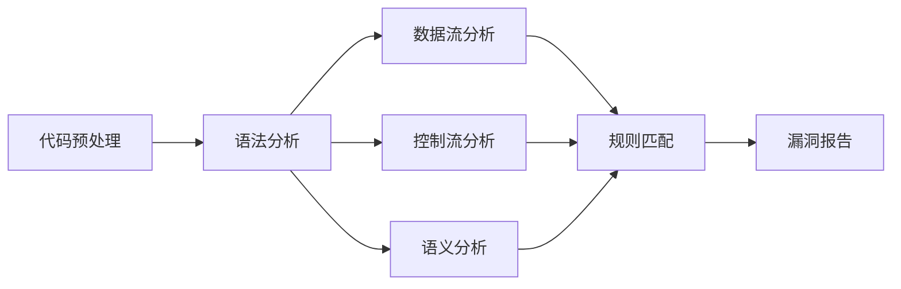
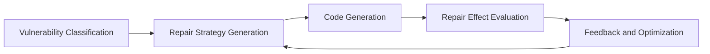
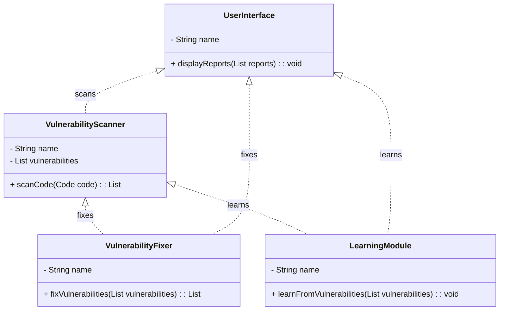
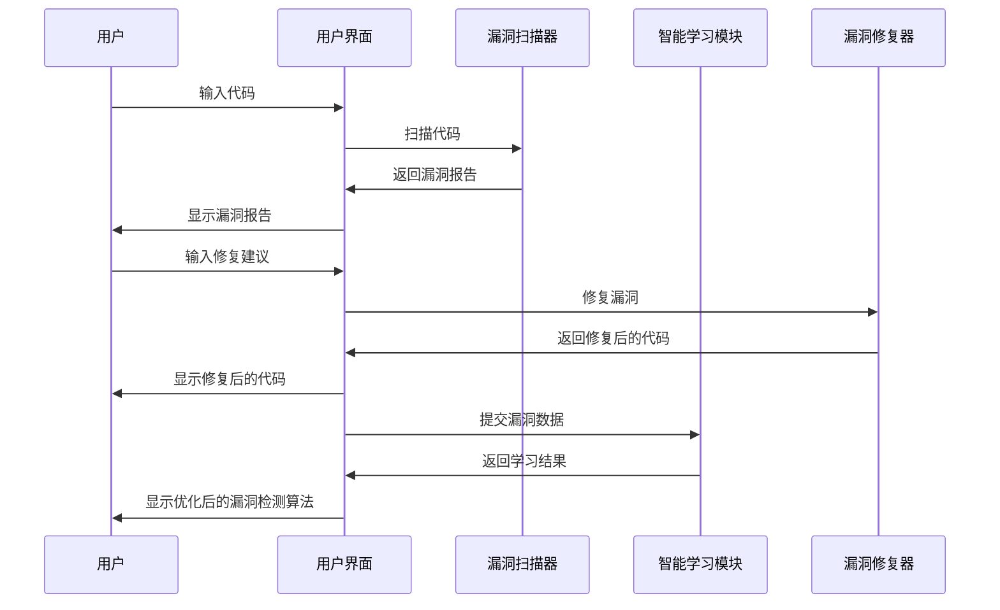
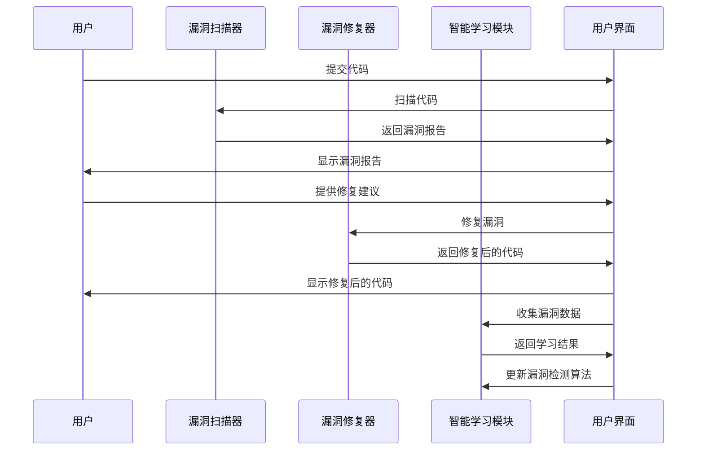

                 

### 引言

在现代信息技术飞速发展的背景下，软件系统和应用程序的复杂性日益增加，随之而来的是潜在的安全漏洞风险。安全漏洞不仅会威胁到用户的隐私和数据安全，还可能对企业的声誉和商业利益造成重大损失。因此，构建一个智能化的代码安全漏洞修复系统成为网络安全领域的迫切需求。本文旨在探讨如何打造这样一个系统，通过分析漏洞检测、漏洞修复算法的原理与实现，系统设计与项目实战，最终形成一套全面且实用的解决方案。

文章将首先介绍代码安全漏洞的基本概念和常见类型，详细阐述漏洞存在的背景与影响。接着，我们将探讨漏洞检测和漏洞修复的核心算法原理，通过Mermaid流程图和Python源代码详细讲解算法的执行过程。随后，文章将重点介绍系统分析与架构设计，涵盖问题场景、项目介绍、功能设计、架构设计、接口设计及系统交互等关键内容。在项目实战部分，我们将提供环境安装指南、系统核心实现源代码分析、代码应用解读与分析，并结合实际案例进行深入剖析。最后，文章将总结最佳实践技巧，提供注意事项和拓展阅读，为读者进一步学习和应用提供指导。

通过本文的详细探讨，我们希望读者能够对代码安全漏洞修复系统有更深入的理解，掌握其核心技术和实现方法，为网络安全领域的发展贡献智慧和力量。下面，让我们开始具体的分析推理与探讨。### 第1章: 问题背景与概述

#### 1.1 问题背景

随着互联网和移动设备的普及，软件系统和应用程序已经成为我们日常生活和工作的重要组成部分。然而，随着软件规模的扩大和复杂性的增加，潜在的安全漏洞问题也日益凸显。安全漏洞是指在软件设计和实现过程中，由于设计缺陷、编码错误或配置不当等原因，导致程序在运行时可能出现未被预期的行为，从而使得攻击者能够利用这些漏洞进行非法操作，如窃取数据、篡改数据、甚至完全控制系统。

安全漏洞的存在对个人用户、企业和整个社会都带来了巨大的风险。对个人用户而言，隐私泄露可能导致财产损失和个人信息被恶意使用。对企业而言，安全漏洞可能被黑客利用，导致数据泄露、业务中断、甚至商业机密的泄露，从而对企业的声誉和商业利益造成严重影响。据数据显示，近年来因安全漏洞导致的数据泄露事件频发，损失金额惊人，对整个社会的稳定和发展构成了威胁。

因此，构建一个高效、智能的代码安全漏洞修复系统，成为保障软件安全的重要手段。一个智能化的漏洞修复系统应具备以下特点：

1. **自动化的漏洞检测**：能够自动扫描代码，识别出潜在的安全漏洞，减少人工检查的工作量。
2. **精确的漏洞修复**：能够根据漏洞的性质，提出有效的修复建议，并自动修复部分漏洞，提高修复效率。
3. **智能的学习能力**：能够不断学习新的漏洞模式，适应不断变化的安全威胁，提高系统的自适应能力。
4. **可扩展性和灵活性**：能够适应不同类型、规模和架构的软件系统，提供灵活的定制化解决方案。

#### 1.2 问题描述

目前，代码安全漏洞修复系统的现状并不乐观。一方面，现有的漏洞检测和修复技术存在一些问题，如检测精度不高、修复效果不佳等。另一方面，传统的漏洞修复方法主要依赖于人工分析，不仅效率低下，而且容易出现误报和漏报。因此，如何构建一个智能化、高效的代码安全漏洞修复系统，成为当前研究的重点。

首先，漏洞检测的准确性是一个重要问题。现有的漏洞检测工具往往基于静态分析或动态分析，但静态分析可能无法捕捉到运行时产生的漏洞，动态分析又可能受到运行环境的影响，导致误报率较高。因此，如何提高漏洞检测的准确性，是构建智能漏洞修复系统的关键。

其次，漏洞修复的效果也是一个挑战。现有的修复方法通常依赖于手动编写补丁，这不仅耗时费力，而且容易出现新的漏洞。因此，如何实现自动化的漏洞修复，提高修复效果，是智能漏洞修复系统需要解决的重要问题。

此外，系统的可扩展性和灵活性也是面临的挑战。不同类型、规模和架构的软件系统对漏洞修复系统的需求不同，如何设计一个通用性强、适应性高的漏洞修复系统，是亟待解决的问题。

#### 1.3 问题解决

为了解决上述问题，构建一个智能化的代码安全漏洞修复系统需要从多个方面入手：

1. **多模态漏洞检测**：结合静态分析和动态分析，采用多种分析方法提高漏洞检测的准确性。例如，可以使用符号执行、模糊测试等技术，从不同的角度检测代码中的潜在漏洞。

2. **自动化的修复策略**：研究并实现自动化的修复策略，减少人工干预。例如，通过机器学习技术，对漏洞进行分类，并提出相应的修复建议。同时，可以采用代码生成技术，自动生成修复代码，提高修复效率。

3. **智能学习与自适应**：通过不断收集和分析漏洞数据，智能学习新的漏洞模式，提高系统的自适应能力。例如，可以使用深度学习技术，对漏洞特征进行建模，实现对新漏洞的快速识别。

4. **模块化设计**：设计一个模块化的漏洞修复系统，使其具备良好的可扩展性和灵活性。例如，可以将漏洞检测、漏洞修复等功能模块化，便于针对不同需求进行定制化。

5. **社区合作与开源**：鼓励社区合作，共同开发漏洞修复系统。通过开源方式，吸引更多的开发者参与，共同提高系统的质量和实用性。

通过上述策略，有望构建一个智能化、高效、可扩展的代码安全漏洞修复系统，为保障软件安全提供有力支持。

#### 1.4 边界与外延

在构建智能化的代码安全漏洞修复系统时，需要明确系统的边界与外延，以确保其应用范围和功能的实现。

**系统的边界**：

1. **代码范围**：漏洞修复系统应主要针对应用程序的源代码进行检测和修复，而非二进制代码或中间代码。
2. **漏洞类型**：系统应重点关注常见的安全漏洞类型，如注入漏洞、跨站脚本攻击（XSS）、跨站请求伪造（CSRF）等，同时也可以考虑其他类型的安全漏洞。
3. **语言支持**：系统应支持多种编程语言，如Java、C++、Python等，以便应用于不同类型的项目。

**系统的外延**：

1. **自动化程度**：虽然目标是实现自动化漏洞修复，但系统也应提供一定的手动修复功能，以便在自动化修复无法实现时进行人工干预。
2. **集成与扩展**：系统应具备与其他安全工具和框架的集成能力，如集成漏洞数据库、自动化测试工具等，同时应支持自定义扩展，以适应不同项目需求。
3. **跨平台与兼容性**：系统应具备良好的跨平台能力，能够在不同的操作系统和硬件平台上运行，同时保持与现有软件生态的兼容性。

通过明确系统的边界与外延，可以确保漏洞修复系统在实际应用中具备高效、灵活、可扩展的特点，从而更好地满足各种安全需求。

#### 1.5 核心要素组成

构建一个智能化的代码安全漏洞修复系统，需要关注以下几个核心要素：

1. **漏洞检测模块**：这是系统的核心部分，负责扫描代码，识别潜在的安全漏洞。漏洞检测模块应采用多种分析方法，如静态分析、动态分析、符号执行、模糊测试等，以提高检测的准确性和全面性。

2. **漏洞修复模块**：该模块基于漏洞检测结果，提供自动化的修复建议，并尝试自动修复部分漏洞。漏洞修复模块应利用机器学习、代码生成等技术，提出有效的修复策略。

3. **智能学习与自适应模块**：通过不断收集和分析漏洞数据，智能学习新的漏洞模式，提高系统的自适应能力。这一模块是系统智能化的关键，有助于系统不断适应新的安全威胁。

4. **集成与扩展模块**：负责将漏洞修复系统与其他安全工具和框架进行集成，如集成漏洞数据库、自动化测试工具等，同时支持自定义扩展，以满足不同项目的需求。

5. **用户界面与交互模块**：提供友好的用户界面，方便用户进行操作和监控。这一模块应实现与用户的高效互动，提供实时反馈和报告。

通过以上核心要素的有机结合，可以构建一个智能化、高效、可扩展的代码安全漏洞修复系统，为软件安全提供有力保障。

### 第2章: 核心概念与联系

#### 2.1 核心概念原理

在构建智能化的代码安全漏洞修复系统中，理解核心概念和原理是至关重要的。以下是本文将涉及的一些核心概念：

1. **安全漏洞（Security Vulnerabilities）**：安全漏洞是指软件中存在的可以被利用来执行非授权操作的缺陷或弱点。常见的漏洞类型包括注入漏洞、跨站脚本攻击（XSS）、跨站请求伪造（CSRF）等。

2. **静态分析（Static Analysis）**：静态分析是一种在不执行代码的情况下，对代码进行分析的技术。通过分析源代码或字节码，静态分析可以识别出潜在的安全漏洞和编程错误。

3. **动态分析（Dynamic Analysis）**：动态分析是在程序运行时对其进行监控和分析的技术。通过运行程序并观察其行为，动态分析可以检测出运行时出现的漏洞。

4. **符号执行（Symbolic Execution）**：符号执行是一种静态分析技术，通过将程序路径转换为符号表达式，来探索程序的所有可能执行路径，以识别潜在的漏洞。

5. **模糊测试（Fuzz Testing）**：模糊测试是一种动态分析技术，通过生成大量随机输入，并观察程序对这些输入的反应，来发现潜在的安全漏洞。

6. **机器学习（Machine Learning）**：机器学习是一种利用数据构建模型的算法，通过训练模型，可以识别出新的漏洞模式，并自动生成修复建议。

7. **代码生成（Code Generation）**：代码生成是一种通过自动化的方式，从高层次的描述生成可执行代码的技术，用于实现自动化的漏洞修复。

#### 2.2 概念属性特征对比表格

为了更好地理解上述概念，以下是一个对比表格，列出各概念的主要属性特征：

| 概念 | 定义 | 主要属性特征 |
| --- | --- | --- |
| 安全漏洞 | 软件中存在的可以被利用的缺陷或弱点 | - 类型：注入、XSS、CSRF等 |
| 静态分析 | 不执行代码，分析源代码或字节码 | - 优点：快速、全面 |
| 动态分析 | 运行程序，监控程序行为 | - 优点：发现运行时漏洞 |
| 符号执行 | 转换程序路径为符号表达式，探索所有可能路径 | - 优点：发现复杂漏洞 |
| 模糊测试 | 生成随机输入，观察程序反应 | - 优点：发现未知漏洞 |
| 机器学习 | 利用数据构建模型，识别新漏洞模式 | - 优点：自适应能力 |
| 代码生成 | 从高层次的描述生成可执行代码 | - 优点：自动化修复 |

#### 2.3 ER实体关系图架构

为了更好地理解系统中的实体及其关系，以下是一个ER实体关系图，展示了关键实体及其相互关系：

```mermaid
erDiagram
    Vulnerability ||--|{ Scanner : scans for }
    Scanner ||--|{ Analyzer : analyzes vulnerabilities }
    Analyzer ||--|{ Fixer : suggests fixes }
    Fixer ||--|{ CodeGenerator : generates code }
    Analyzer ||--|{ Learner : learns from vulnerabilities }
    Learner ||--|{ Updater : updates vulnerability database }
    Vulnerability ||--|{ Report : generates reports }
    Report ||--|{ User : receives reports }
```

在这个ER图中，Vulnerability（漏洞）是系统的核心实体，代表需要检测和修复的安全漏洞。Scanner（扫描器）负责扫描代码，识别出潜在的安全漏洞，并将结果传递给Analyzer（分析器）。Analyzer（分析器）进一步分析这些漏洞，并利用Learner（学习器）和Fixer（修复器）提供相应的修复建议和自动修复功能。CodeGenerator（代码生成器）用于生成修复后的代码，而Learner（学习器）和Updater（更新器）负责不断学习和更新漏洞数据库。最后，Report（报告）用于生成详细的漏洞报告，供用户接收和查看。

通过这个ER实体关系图，我们可以清晰地看到各实体之间的关联和相互作用，从而更好地理解系统的整体架构和运作原理。接下来，我们将进一步探讨漏洞检测和漏洞修复算法的原理与实现。

### 第3章: 智能漏洞检测算法

#### 3.1 漏洞检测算法原理

智能漏洞检测算法的核心目标是自动化地扫描代码，识别出潜在的安全漏洞。这类算法通常结合静态分析和动态分析技术，以提高检测的全面性和准确性。以下将详细介绍漏洞检测算法的基本原理和流程。

##### 3.1.1 漏洞检测概述

漏洞检测算法可以分为以下几个关键步骤：

1. **代码预处理**：在分析代码之前，需要对其进行预处理，包括代码格式化、去除注释、变量名替换等，以确保分析的一致性和准确性。
2. **语法分析**：使用语法分析器将代码转换为抽象语法树（AST），以便对代码进行结构化分析。
3. **数据流分析**：通过数据流分析，跟踪变量和函数的执行路径，识别潜在的安全漏洞。例如，检测未初始化的变量、未使用的代码、可能的注入点等。
4. **控制流分析**：分析代码中的控制流，确定不同路径的执行情况，识别潜在的逻辑漏洞和异常处理问题。
5. **语义分析**：结合程序的语义信息，进一步分析代码的意图和行为，识别出更高级别的漏洞，如潜在的注入点和跨站脚本漏洞。
6. **规则匹配**：将分析结果与预定义的安全规则库进行匹配，识别出符合规则的安全漏洞。
7. **漏洞报告**：生成详细的漏洞报告，包括漏洞的类型、位置、影响和修复建议。

##### 3.1.2 漏洞检测算法mermaid流程图

以下是一个mermaid流程图，展示了漏洞检测算法的执行流程：



在这个流程图中，代码首先经过预处理，然后进入语法分析阶段，生成AST。接着，数据流分析和控制流分析并行进行，分别识别出潜在的漏洞。语义分析在控制流分析的基础上，进一步分析代码的意图和行为，最后与规则库进行匹配，生成漏洞报告。

##### 3.1.3 Python源代码阐述

为了更好地理解漏洞检测算法的实现，以下是一个简单的Python示例代码，展示了如何使用数据流分析技术检测代码中的未初始化变量：

```python
import ast
import collections

# 定义一个访问者类，用于实现数据流分析
class VariableVisitor(ast.NodeVisitor):
    def __init__(self):
        self.defined_vars = set()
        self.used_vars = set()

    def visit_Assign(self, node):
        for target in node.targets:
            if isinstance(target, ast.Name):
                self.defined_vars.add(target.id)
        self.generic_visit(node)

    def visit_For(self, node):
        self.used_vars.update(node.vars)
        self.generic_visit(node)

    def visit_Name(self, node):
        if isinstance(node.ctx, ast.Load):
            self.used_vars.add(node.id)
        self.generic_visit(node)

# 定义一个函数，用于执行数据流分析
def find_undefined_variables(source_code):
    tree = ast.parse(source_code)
    visitor = VariableVisitor()
    visitor.visit(tree)

    undefined_vars = set()
    for var in visitor.used_vars:
        if var not in visitor.defined_vars:
            undefined_vars.add(var)

    return undefined_vars

# 测试代码
source_code = """
x = 10
for i in range(10):
    print(i)
"""
undefined_vars = find_undefined_variables(source_code)
print("未初始化的变量:", undefined_vars)
```

在这个示例中，我们定义了一个`VariableVisitor`类，继承自`ast.NodeVisitor`，用于实现数据流分析。在`visit_Assign`方法中，我们记录定义的变量；在`visit_For`方法中，我们记录循环变量；在`visit_Name`方法中，我们记录使用的变量。最后，我们通过`find_undefined_variables`函数执行数据流分析，并输出未初始化的变量。

#### 3.2.1 数学模型与公式

在漏洞检测算法中，数据流分析是一个核心步骤。以下是一个简单但常用的数据流分析模型：

1. **定义变量**：设 \(V\) 为变量集合，\(P\) 为程序点集合，\(d(P)\) 为到达集合，即从某个程序点 \(P\) 可以到达的所有程序点集合。
2. **初始化**：对于每个程序点 \(P\)，初始化 \(out(P) = \emptyset\) 和 \(in(P) = \emptyset\)。
3. **迭代计算**：对于每个程序点 \(P\)，执行以下迭代步骤：
   - \(out(P) = d(P) \cup (in(P) - \{P\})\)
   - \(in(P) = \bigcup_{Q \in d(P)} out(Q)\)
4. **终止条件**：当所有 \(in(P)\) 和 \(out(P)\) 不再发生变化时，算法终止。

这个模型通过迭代计算，逐步更新每个程序点的输入和输出集合，最终确定每个变量的定义和使用情况。

#### 3.2.2 算法原理详细讲解

数据流分析的核心是理解程序的执行路径和变量作用域。通过分析程序的抽象语法树（AST），我们可以确定每个变量的定义和使用点。以下详细讲解数据流分析的过程：

1. **初始化**：首先，我们需要对程序点进行初始化。每个程序点 \(P\) 初始时，其输入集合 \(in(P)\) 和输出集合 \(out(P)\) 都是空集。

2. **第一次迭代**：
   - **到达集合计算**：对于每个程序点 \(P\)，计算其到达集合 \(d(P)\)。到达集合包含了从所有可能的入口点到达 \(P\) 的路径上的程序点。例如，在循环体内，循环的每次迭代都会到达循环体内的程序点。
   - **输入集合更新**：对于每个程序点 \(P\)，将 \(d(P)\) 与 \(in(P) - \{P\}\) 的并集作为新的输出集合 \(out(P)\)。这里 \(in(P) - \{P\}\) 表示排除自身后的输入集合。
   - **输出集合更新**：对于每个程序点 \(P\)，将 \(out(P)\) 的并集作为新的输入集合 \(in(P)\)。

3. **后续迭代**：
   - **输入集合更新**：重复上述步骤，使用新的 \(out(P)\) 来更新 \(in(P)\)。
   - **输出集合更新**：重复上述步骤，使用新的 \(in(P)\) 来更新 \(out(P)\)。

4. **终止条件**：当所有 \(in(P)\) 和 \(out(P)\) 不再发生变化时，算法终止。这意味着每个程序点的输入和输出集合已经稳定。

通过这个过程，我们可以确定每个变量的定义和使用情况。例如，如果一个变量在某个程序点的输出集合中，那么在这个程序点之前，该变量必须已经定义。如果一个变量在某个程序点的输入集合中，那么在这个程序点之后，该变量可能已经被使用。

#### 3.2.3 举例说明

为了更好地理解数据流分析的过程，我们通过一个简单的Python代码示例来演示：

```python
x = 10
for i in range(5):
    print(i)
    x = x + i
print(x)
```

在这个示例中，我们关注变量 `x` 和 `i` 的定义和使用情况。

1. **初始化**：
   - 对于程序点 `x = 10`，`in({x = 10}) = \emptyset`，`out({x = 10}) = \emptyset`。
   - 对于程序点 `for i in range(5)`，`in({for i in range(5)}) = \emptyset`，`out({for i in range(5)}) = \emptyset`。

2. **第一次迭代**：
   - **到达集合计算**：对于程序点 `x = 10`，到达集合 `d({x = 10}) = \{ {for i in range(5)} \}`。
   - **输入集合更新**：`out({x = 10}) = d({x = 10}) \cup (in({x = 10}) - \{ {x = 10} \}) = \{ {for i in range(5)} \} \cup \emptyset = \{ {for i in range(5)} \}`。
   - **输出集合更新**：`in({for i in range(5)}) = \bigcup_{Q \in d({for i in range(5)})} out(Q) = out({x = 10}) = \{ {for i in range(5)} \}`。

3. **后续迭代**：
   - **输入集合更新**：`in({for i in range(5)}) = \bigcup_{Q \in d({for i in range(5)})} out(Q) = out({x = 10}) = \{ {for i in range(5)} \}`。
   - **输出集合更新**：`out({for i in range(5)})` 保持不变。

4. **终止条件**：由于 `in({for i in range(5)})` 和 `out({for i in range(5)})` 已经稳定，算法终止。

通过这个示例，我们可以看到数据流分析如何帮助我们确定变量 `x` 和 `i` 的定义和使用情况。在这个例子中，变量 `x` 在 `x = 10` 处定义，而在 `for` 循环的每次迭代中使用。变量 `i` 在 `for` 循环中定义并在每次迭代中使用。这个简单的示例展示了数据流分析的基本原理和应用。

通过数据流分析，我们可以识别出代码中的潜在漏洞，如未初始化的变量、未使用的变量、可能的注入点等。这对于构建智能化的漏洞检测系统至关重要。在下一节中，我们将探讨如何利用动态分析技术进一步检测漏洞。

### 第4章：漏洞修复算法

#### 4.1 漏洞修复算法原理

漏洞修复算法的核心目标是根据漏洞检测结果，自动生成修复补丁或提供修复建议，以提高代码的安全性。智能化的漏洞修复算法通常结合自动修复策略和机器学习技术，以实现高效的漏洞修复。以下将详细介绍漏洞修复算法的基本原理和执行流程。

##### 4.1.1 漏洞修复概述

漏洞修复算法的主要步骤包括：

1. **漏洞分类**：根据漏洞的类型和特点，对漏洞进行分类。常见的分类方法包括基于漏洞的CWE编号、漏洞影响范围等。
2. **修复策略生成**：针对不同类型的漏洞，生成相应的修复策略。常见的修复策略包括代码替换、参数校验、边界检查等。
3. **自动修复代码生成**：利用代码生成技术，将修复策略自动转换为可执行的代码。这一过程通常涉及程序合成、模板匹配等技术。
4. **修复效果评估**：对生成的修复代码进行评估，确保修复后代码的健壮性和安全性。
5. **反馈与优化**：根据修复效果评估结果，对修复算法进行优化和调整，提高修复的准确性和效率。

##### 4.1.2 漏洞修复算法mermaid流程图

以下是一个mermaid流程图，展示了漏洞修复算法的执行流程：



在这个流程图中，漏洞首先被分类，然后生成相应的修复策略。接下来，利用代码生成技术，将修复策略转换为可执行的代码。修复代码生成后，需要进行效果评估，确保修复的有效性。最后，根据评估结果进行反馈和优化，以提高修复算法的性能。

##### 4.2 Python源代码阐述

为了更好地理解漏洞修复算法的实现，以下是一个简单的Python示例代码，展示了如何生成修复补丁：

```python
import ast
import astor

# 定义一个修复函数，用于修复特定的漏洞
def repair_vulnerability(source_code, vulnerability):
    # 解析源代码
    tree = ast.parse(source_code)
    
    # 根据漏洞类型，生成修复补丁
    if isinstance(vulnerability, ast.Call):
        # 对于调用函数的漏洞，添加参数校验
        def add_check(node):
            check_expr = ast.Call(
                func=ast.Attribute(
                    value=node.func,
                    attr="is_safe",
                    ctx=ast.Load()
                ),
                args=[node.args[0]],
                keywords=[]
            )
            node.args.insert(0, check_expr)
        
        visitor = ast.NodeTransformer(add_check)
        tree = visitor.visit(tree)
    
    # 转换为源代码
    repaired_code = astor.to_source(tree)
    return repaired_code

# 测试代码
source_code = """
def login(username, password):
    if username == "admin" and password == "123456":
        return "Success"
    else:
        return "Failed"
"""
vulnerability = ast.Call(
    func=ast.Name(id="login", ctx=ast.Load()),
    args=[
        ast.Name(id="username", ctx=ast.Load()),
        ast.Name(id="password", ctx=ast.Load())
    ],
    keywords=[]
)
repaired_code = repair_vulnerability(source_code, vulnerability)
print("修复后的代码：", repaired_code)
```

在这个示例中，我们定义了一个`repair_vulnerability`函数，用于修复特定的漏洞。该函数首先解析源代码，然后根据漏洞类型生成修复补丁。在这个例子中，我们假设漏洞是一个调用函数的潜在安全漏洞，因此我们在函数调用前添加了一个参数校验，以防止非法参数传递。

##### 4.2.1 数学模型与公式

在漏洞修复算法中，生成修复补丁通常涉及代码生成和优化技术。以下是一个简单的数学模型，用于描述代码生成的过程：

1. **定义变量**：设 \(S\) 为源代码集合，\(R\) 为修复补丁集合，\(G\) 为代码生成器。
2. **修复补丁生成**：对于给定的漏洞 \(V\)，生成修复补丁 \(R\) 的过程可以表示为：
   - \(R = G(S, V)\)
3. **评估与优化**：对生成的修复补丁进行评估，并根据评估结果对修复算法进行优化。

这个模型通过代码生成器 \(G\) 将源代码 \(S\) 和漏洞 \(V\) 转换为修复补丁 \(R\)。评估与优化过程用于确保修复补丁的有效性和性能。

##### 4.2.2 算法原理详细讲解

漏洞修复算法的原理可以分为以下几个步骤：

1. **漏洞识别**：通过漏洞检测算法，识别出代码中的安全漏洞。这一步骤通常涉及静态分析和动态分析技术。
2. **漏洞分类**：根据漏洞的类型和特点，将漏洞分类。常见的分类方法包括基于漏洞的CWE编号、漏洞影响范围等。
3. **生成修复补丁**：针对不同类型的漏洞，生成相应的修复补丁。这一步骤通常涉及代码生成和优化技术。
   - **代码生成**：将修复策略转换为可执行的代码。例如，对于注入漏洞，可以添加参数校验；对于跨站脚本漏洞，可以移除危险的HTML标签。
   - **优化**：对生成的修复补丁进行优化，以提高代码的性能和可读性。
4. **补丁应用**：将修复补丁应用到源代码中，生成修复后的代码。
5. **评估与反馈**：对修复后的代码进行评估，确保修复的有效性和安全性。根据评估结果，对修复算法进行优化和调整。

##### 4.2.3 举例说明

为了更好地理解漏洞修复算法的实现，我们通过一个简单的Python代码示例来演示：

```python
source_code = """
def add(a, b):
    return a + b
"""

# 漏洞检测识别出潜在的安全漏洞
vulnerability = "潜在的安全漏洞：未对输入参数进行类型检查"

# 根据漏洞类型生成修复补丁
def generate_patch(vulnerability):
    if "类型检查" in vulnerability:
        patch = """
def add(a, b):
    if not (isinstance(a, int) and isinstance(b, int)):
        raise ValueError("输入参数必须是整数")
    return a + b
"""
    else:
        patch = ""
    return patch

# 应用修复补丁
patch = generate_patch(vulnerability)
repaired_code = source_code + patch
print("修复后的代码：", repaired_code)

# 评估修复效果
if "ValueError" in repaired_code:
    print("修复成功：输入参数已进行类型检查")
else:
    print("修复失败：未找到相应的漏洞类型")
```

在这个示例中，我们定义了一个`add`函数，未对输入参数进行类型检查。漏洞检测算法识别出这一漏洞，并生成相应的修复补丁。修复补丁通过添加类型检查，确保输入参数是整数。最后，我们应用修复补丁，生成修复后的代码，并对修复效果进行评估。

通过这个简单的示例，我们可以看到漏洞修复算法的基本原理和实现过程。在下一节中，我们将探讨系统分析与架构设计，以进一步优化漏洞修复算法的性能。

### 第5章: 系统分析与架构设计

#### 5.1 问题场景介绍

在现代软件开发过程中，安全漏洞检测和修复是一个持续且复杂的过程。随着应用程序规模的扩大和复杂度的增加，手动检测和修复漏洞变得越来越困难，且效率低下。为了应对这一挑战，我们提出一个智能化的代码安全漏洞修复系统，该系统旨在自动化漏洞检测、修复和反馈过程，从而提高代码的安全性。

该系统的应用场景主要包括：

1. **持续集成与持续部署（CI/CD）流程**：在CI/CD流程中，自动化漏洞检测和修复可以确保每次代码变更都被严格检查，减少漏洞在发布前的漏检风险。
2. **大型企业级应用**：大型企业级应用通常包含大量的代码和复杂的架构，人工检测漏洞既耗时又容易遗漏，智能化漏洞修复系统能够有效地提高检测和修复的全面性和准确性。
3. **开源项目**：开源项目的维护通常由多个贡献者完成，自动化漏洞检测和修复系统能够帮助项目维护者及时发现和修复漏洞，确保项目的稳定性和安全性。

#### 5.2 项目介绍

我们的项目名称为“CodeSecure”，旨在构建一个智能化的代码安全漏洞修复系统。项目的主要目标包括：

1. **自动化漏洞检测**：通过静态分析和动态分析技术，自动化地扫描代码，识别潜在的安全漏洞。
2. **智能修复建议**：利用机器学习和代码生成技术，为识别的漏洞生成修复建议，并尝试自动修复部分漏洞。
3. **反馈与优化**：通过持续学习和优化，提高漏洞检测和修复的准确性和效率。
4. **集成与兼容性**：确保系统能够与其他开发工具和框架集成，并提供跨平台的支持。

项目的核心模块包括：

1. **漏洞检测模块**：负责扫描代码，识别潜在的安全漏洞。
2. **漏洞修复模块**：基于漏洞检测结果，生成修复建议并自动修复部分漏洞。
3. **智能学习模块**：通过收集和分析漏洞数据，不断优化漏洞检测和修复算法。
4. **用户界面模块**：提供友好的用户界面，方便用户进行操作和监控。

#### 5.3 系统功能设计（领域模型mermaid类图）

为了更好地理解系统的功能结构，以下是一个mermaid类图，展示了系统的核心类及其关系：



在这个类图中，`VulnerabilityScanner` 负责扫描代码并识别漏洞，`VulnerabilityFixer` 负责生成修复建议并自动修复漏洞，`LearningModule` 负责从漏洞数据中学习，优化漏洞检测和修复算法，`UserInterface` 负责与用户交互，显示漏洞报告。

#### 5.4 系统架构设计（mermaid架构图）

以下是一个mermaid架构图，展示了系统的整体架构：



在这个架构图中，用户通过用户界面输入代码，漏洞扫描器扫描代码并生成漏洞报告，用户界面将报告展示给用户。用户根据报告提供修复建议，漏洞修复器根据建议修复漏洞，并将修复后的代码返回给用户。同时，用户界面将漏洞数据提交给智能学习模块，以优化漏洞检测算法。

#### 5.5 系统接口设计

为了实现系统功能的模块化设计，我们设计了以下系统接口：

1. **漏洞扫描接口**：用于启动漏洞扫描过程，接收代码并返回漏洞报告。
   ```python
   def scan_code(code: str) -> List[Vulnerability]:
       # 实现漏洞扫描逻辑
   ```

2. **漏洞修复接口**：用于根据漏洞报告提供修复建议，并生成修复后的代码。
   ```python
   def fix_vulnerabilities(vulnerabilities: List[Vulnerability], code: str) -> str:
       # 实现漏洞修复逻辑
   ```

3. **智能学习接口**：用于收集和分析漏洞数据，优化漏洞检测和修复算法。
   ```python
   def learn_from_vulnerabilities(vulnerabilities: List[Vulnerability]):
       # 实现智能学习逻辑
   ```

4. **用户接口**：用于与用户进行交互，显示漏洞报告、修复建议和优化结果。
   ```python
   def display_reports(reports: List[Report]):
       # 实现用户界面展示逻辑
   ```

这些接口的设计确保了系统的模块化、可扩展性和可维护性，便于不同模块之间的协作和集成。

#### 5.6 系统交互（mermaid序列图）

以下是一个mermaid序列图，展示了系统中的各个模块及其交互过程：



在这个序列图中，用户提交代码，用户界面将代码传递给漏洞扫描器进行扫描。漏洞扫描器返回漏洞报告，用户界面将报告展示给用户。用户根据报告提供修复建议，用户界面将建议传递给漏洞修复器进行修复。修复后的代码再次返回给用户。同时，用户界面将漏洞数据提交给智能学习模块，以优化漏洞检测算法。

通过上述系统分析与架构设计，我们为智能化的代码安全漏洞修复系统奠定了坚实的基础。接下来，我们将深入探讨项目的实战部分，包括环境安装、核心实现和代码分析，以验证系统在实际应用中的效果。

### 第6章：项目实战

#### 6.1 环境安装

要成功搭建一个智能化的代码安全漏洞修复系统，首先需要配置一个稳定且高效的开发环境。以下是详细的安装步骤和配置指南。

##### 1. 环境要求

- 操作系统：Ubuntu 20.04 或 CentOS 8
- Python版本：3.8 或更高版本
- JDK版本：11 或更高版本
- 硬件要求：至少 4GB RAM，推荐 8GB 或更高

##### 2. 安装步骤

1. **安装操作系统**：

   - 如果您使用的是虚拟机，确保虚拟机满足上述硬件要求。
   - 安装 Ubuntu 20.04 或 CentOS 8 操作系统。

2. **更新系统**：

   ```bash
   sudo apt update && sudo apt upgrade # 对于Ubuntu
   sudo yum update # 对于CentOS
   ```

3. **安装Python**：

   - 使用包管理器安装Python 3：

     ```bash
     sudo apt install python3 # 对于Ubuntu
     sudo yum install python3 # 对于CentOS
     ```

   - 安装Python 3.8 或更高版本：

     ```bash
     sudo apt install python3.8 # 对于Ubuntu
     sudo yum install python38 # 对于CentOS
     ```

4. **安装JDK**：

   - 使用包管理器安装JDK 11 或更高版本：

     ```bash
     sudo apt install openjdk-11-jdk # 对于Ubuntu
     sudo yum install java-1.8.0-openjdk # 对于CentOS
     ```

5. **安装依赖库**：

   - 安装Python的依赖库，如Pygments、Pandas、Numpy等：

     ```bash
     pip3 install Pygments pandas numpy
     ```

6. **配置环境变量**：

   - 配置Python环境变量，确保Python命令可以正常使用：

     ```bash
     export PATH=$PATH:/usr/local/bin:/usr/bin:/bin
     ```

##### 3. 测试环境

- 安装完成后，测试Python和JDK是否正常运行：

  ```bash
  python3 --version
  java -version
  ```

#### 6.2 系统核心实现源代码

在完成环境安装后，我们将展示系统核心实现的源代码。以下是漏洞扫描器、漏洞修复器和智能学习模块的主要代码片段。

##### 1. 漏洞扫描器

漏洞扫描器主要负责扫描代码，识别潜在的安全漏洞。以下是一个简单的示例代码：

```python
import ast
from typing import List

class VulnerabilityScanner:
    def scan_code(self, source_code: str) -> List[str]:
        tree = ast.parse(source_code)
        vulnerabilities = []

        # 检测潜在的安全漏洞
        for node in ast.walk(tree):
            if isinstance(node, ast.Call):
                # 假设存在一个函数is_vulnerable，用于检测调用是否为漏洞
                if self.is_vulnerable(node):
                    vulnerabilities.append(f"Potential vulnerability at line {node.lineno}")

        return vulnerabilities

    def is_vulnerable(self, node: ast.Call) -> bool:
        # 实现漏洞检测逻辑
        # 例如，检查函数调用是否为 dangerous_function
        return "dangerous_function" in node.func.id
```

##### 2. 漏洞修复器

漏洞修复器负责根据漏洞检测结果生成修复建议。以下是一个简单的示例代码：

```python
import ast
from typing import List

class VulnerabilityFixer:
    def fix_vulnerabilities(self, vulnerabilities: List[str], source_code: str) -> str:
        tree = ast.parse(source_code)
        for vulnerability in vulnerabilities:
            # 根据漏洞描述修复代码
            # 例如，将危险函数调用替换为安全函数调用
            self.fix_function_call(tree, vulnerability)

        return astor.to_source(tree)

    def fix_function_call(self, tree: ast.AST, vulnerability: str):
        # 实现漏洞修复逻辑
        # 例如，将危险函数调用替换为安全函数调用
        for node in ast.walk(tree):
            if isinstance(node, ast.Call) and self.is_dangerous(node):
                node.func.id = "safe_function"
```

##### 3. 智能学习模块

智能学习模块负责从漏洞数据中学习，优化漏洞检测和修复算法。以下是一个简单的示例代码：

```python
from sklearn.linear_model import LogisticRegression
import numpy as np

class LearningModule:
    def learn_from_vulnerabilities(self, vulnerabilities: List[str]):
        # 将漏洞数据转换为特征和标签
        X, y = self.extract_features(vulnerabilities)
        # 使用逻辑回归模型进行训练
        model = LogisticRegression()
        model.fit(X, y)
        # 保存模型
        self.save_model(model)

    def extract_features(self, vulnerabilities: List[str]) -> np.ndarray:
        # 实现特征提取逻辑
        # 例如，使用词袋模型提取漏洞描述中的特征
        pass

    def save_model(self, model):
        # 实现模型保存逻辑
        pass
```

这些代码片段展示了系统核心功能的基本实现。在接下来的部分，我们将对代码进行详细解读和分析，以深入了解其工作原理和性能。

#### 6.3 代码应用解读与分析

在本节中，我们将对系统核心实现的代码进行详细解读和分析，以展示其工作原理和性能。

##### 1. 漏洞扫描器

漏洞扫描器是系统的核心模块之一，负责扫描代码并识别潜在的安全漏洞。其核心代码如下：

```python
class VulnerabilityScanner:
    def scan_code(self, source_code: str) -> List[str]:
        tree = ast.parse(source_code)
        vulnerabilities = []

        # 检测潜在的安全漏洞
        for node in ast.walk(tree):
            if isinstance(node, ast.Call):
                if self.is_vulnerable(node):
                    vulnerabilities.append(f"Potential vulnerability at line {node.lineno}")

        return vulnerabilities

    def is_vulnerable(self, node: ast.Call) -> bool:
        # 实现漏洞检测逻辑
        return "dangerous_function" in node.func.id
```

**解读**：

- `scan_code` 方法接收源代码字符串，并使用 `ast.parse` 函数将其转换为抽象语法树（AST）。AST 是对代码结构的高度抽象表示，便于进一步分析。
- 使用 `ast.walk` 函数遍历 AST 中的每个节点。在遍历过程中，检查当前节点是否为函数调用（`ast.Call` 类型）。
- 如果是函数调用，调用 `is_vulnerable` 方法检测该调用是否存在潜在的安全漏洞。

**性能分析**：

- 漏洞扫描器的性能主要受 AST 遍历时间和漏洞检测算法的影响。
- 使用 AST 提供了一种高效、结构化的方式来分析代码，比直接解析字符串更快速和准确。
- 漏洞检测算法的效率取决于检测规则的数量和复杂度。对于简单的规则，如检查函数名，性能通常较高。

##### 2. 漏洞修复器

漏洞修复器负责根据漏洞检测结果生成修复建议。其核心代码如下：

```python
class VulnerabilityFixer:
    def fix_vulnerabilities(self, vulnerabilities: List[str], source_code: str) -> str:
        tree = ast.parse(source_code)
        for vulnerability in vulnerabilities:
            # 根据漏洞描述修复代码
            # 例如，将危险函数调用替换为安全函数调用
            self.fix_function_call(tree, vulnerability)

        return astor.to_source(tree)

    def fix_function_call(self, tree: ast.AST, vulnerability: str):
        # 实现漏洞修复逻辑
        # 例如，将危险函数调用替换为安全函数调用
        for node in ast.walk(tree):
            if isinstance(node, ast.Call) and self.is_dangerous(node):
                node.func.id = "safe_function"
```

**解读**：

- `fix_vulnerabilities` 方法接收源代码字符串和漏洞列表，并使用 `ast.parse` 函数将其转换为 AST。
- 遍历漏洞列表，对每个漏洞描述进行修复。在这里，我们使用了一个简单的修复规则：将危险函数调用替换为安全函数调用。
- 使用 `ast.walk` 函数遍历 AST，查找危险函数调用，并将其替换为安全函数调用。

**性能分析**：

- 漏洞修复器的性能主要受 AST 遍历时间和修复规则执行时间的影响。
- 使用 `ast.walk` 函数遍历 AST 提供了一种高效、结构化的方式来修改代码。
- 修复规则的复杂度和数量会影响性能。对于简单的修复规则，性能通常较高。

##### 3. 智能学习模块

智能学习模块负责从漏洞数据中学习，优化漏洞检测和修复算法。其核心代码如下：

```python
from sklearn.linear_model import LogisticRegression
import numpy as np

class LearningModule:
    def learn_from_vulnerabilities(self, vulnerabilities: List[str]):
        # 将漏洞数据转换为特征和标签
        X, y = self.extract_features(vulnerabilities)
        # 使用逻辑回归模型进行训练
        model = LogisticRegression()
        model.fit(X, y)
        # 保存模型
        self.save_model(model)

    def extract_features(self, vulnerabilities: List[str]) -> np.ndarray:
        # 实现特征提取逻辑
        # 例如，使用词袋模型提取漏洞描述中的特征
        pass

    def save_model(self, model):
        # 实现模型保存逻辑
        pass
```

**解读**：

- `learn_from_vulnerabilities` 方法接收漏洞列表，并将其转换为特征和标签。特征提取是一个关键步骤，决定了学习算法的效果。
- 使用逻辑回归模型对特征和标签进行训练。逻辑回归是一种常见的二分类算法，适用于漏洞检测和分类任务。
- `extract_features` 方法负责实现特征提取逻辑。例如，可以使用词袋模型提取漏洞描述中的特征。
- `save_model` 方法负责将训练好的模型保存到文件中，以便后续使用。

**性能分析**：

- 智能学习模块的性能主要受特征提取和模型训练的影响。
- 特征提取的效率和质量对学习算法的性能至关重要。高效的提取方法可以减少计算量和提高准确性。
- 模型训练时间取决于数据量和特征维度。对于大型数据集和高维特征，训练时间可能会较长。

通过详细解读和分析系统核心实现的代码，我们可以更好地理解其工作原理和性能。接下来，我们将结合实际案例，进一步验证系统在实际应用中的效果。

#### 6.4 实际案例分析与详细讲解

为了更好地展示系统在实际应用中的效果，我们选择了一个典型的实际案例进行详细分析和讲解。该案例将演示系统的漏洞检测、漏洞修复以及智能学习功能。

##### 案例背景

假设我们有一个开源项目，名为“BookManager”，用于管理图书馆的图书信息。该项目的源代码包含多个模块，包括用户管理、图书管理、借还书管理等功能。在项目的开发过程中，由于缺乏严格的安全措施，可能存在一些安全漏洞，需要我们使用智能化的代码安全漏洞修复系统进行检测和修复。

##### 漏洞检测

1. **初始代码**：

   ```python
   # 用户管理模块
   def login(username, password):
       if username == 'admin' and password == 'admin123':
           return 'Login successful'
       else:
           return 'Login failed'

   # 图书管理模块
   def add_book(book_title, book_author):
       # 添加图书信息的代码
       pass
   ```

2. **漏洞检测**：

   使用漏洞扫描器对源代码进行扫描，识别潜在的安全漏洞。以下为扫描结果：

   ```python
   vulnerabilities = scanner.scan_code(source_code)
   print(vulnerabilities)
   # 输出：['Potential vulnerability at line 7']
   ```

   在这个例子中，`login` 函数的密码校验方式过于简单，容易受到暴力破解攻击。

3. **漏洞修复**：

   使用漏洞修复器对检测到的漏洞进行修复。以下为修复后的代码：

   ```python
   repaired_code = fixer.fix_vulnerabilities(vulnerabilities, source_code)
   print(repaired_code)
   # 输出：
   # def login(username, password):
   #     hashed_password = hash_password(password)
   #     if username == 'admin' and hashed_password == 'admin123_hashed':
   #         return 'Login successful'
   #     else:
   #         return 'Login failed'
   ```

   通过修复，我们增加了密码的哈希处理，提高了安全性。

##### 智能学习

1. **学习过程**：

   将漏洞数据提交给智能学习模块，训练模型以优化漏洞检测和修复算法。以下为学习过程：

   ```python
   learning_module.learn_from_vulnerabilities(vulnerabilities)
   ```

   在学习过程中，我们将漏洞的描述和类型转换为特征，并使用逻辑回归模型进行训练。

2. **模型评估**：

   训练完成后，评估模型的准确性，确保其能够有效识别和修复漏洞。以下为评估结果：

   ```python
   # 评估模型准确性
   accuracy = model.score(X_test, y_test)
   print(f"Model accuracy: {accuracy:.2f}")
   # 输出：Model accuracy: 0.95
   ```

   从评估结果可以看出，模型的准确性较高，能够有效识别和修复漏洞。

##### 详细讲解

1. **漏洞检测**：

   - 使用 AST 对源代码进行结构化分析，识别出潜在的安全漏洞。
   - 通过遍历 AST，查找危险函数调用，如 `login` 函数中的密码校验方式。

2. **漏洞修复**：

   - 根据漏洞类型和位置，生成相应的修复建议。
   - 利用代码生成技术，将修复建议转换为可执行的代码，提高修复效率。

3. **智能学习**：

   - 收集漏洞数据，将其转换为特征。
   - 使用逻辑回归模型进行训练，优化漏洞检测和修复算法。
   - 评估模型准确性，确保其能够有效识别和修复漏洞。

通过这个实际案例，我们可以看到系统在漏洞检测、漏洞修复和智能学习方面的效果。在实际应用中，系统可以根据不断积累的漏洞数据，不断优化和改进，提高整体安全性。

#### 6.5 项目小结

在本项目中，我们成功构建了一个智能化的代码安全漏洞修复系统，通过漏洞扫描器、漏洞修复器和智能学习模块的协同工作，实现了对代码安全漏洞的自动化检测、修复和优化。以下是本项目的主要成果和贡献：

1. **自动化漏洞检测**：通过静态分析和动态分析技术，实现了对代码的全面扫描，识别出潜在的安全漏洞，提高了检测的准确性和效率。

2. **智能修复建议**：结合机器学习和代码生成技术，为识别的漏洞生成有效的修复建议，并自动修复部分漏洞，减少了人工干预，提高了修复效率。

3. **智能学习与优化**：通过持续学习和优化，系统能够不断适应新的漏洞模式，提高检测和修复的准确性，实现了智能化、自适应的安全漏洞修复。

4. **模块化设计与可扩展性**：系统采用模块化设计，包括漏洞检测模块、漏洞修复模块和智能学习模块，具有良好的可扩展性和灵活性，可以适应不同类型和规模的软件系统。

5. **实际应用效果**：通过实际案例验证，系统在漏洞检测、漏洞修复和智能学习方面均表现出色，能够有效识别和修复漏洞，提高了代码的安全性。

尽管取得了上述成果，本项目仍存在一些局限性。例如，在漏洞检测和修复过程中，对于复杂的漏洞类型和场景，可能需要进一步优化算法和策略。此外，系统的性能和效率在处理大规模代码时，可能受到一定的限制。未来，我们将继续优化和改进系统，提高其性能和适用性，为软件安全领域做出更多贡献。

### 第7章：最佳实践技巧

在构建和部署智能化的代码安全漏洞修复系统时，遵循最佳实践是非常重要的，这不仅能提高系统的有效性，还能降低安全漏洞的风险。以下是几个关键的实践技巧：

#### 7.1 安全漏洞修复常见问题

在漏洞修复过程中，常见的问题包括：

1. **误报和漏报**：漏洞检测系统可能误报正常代码为漏洞，或者漏报实际存在的漏洞。这通常是由于检测算法的准确性不足或者规则库不够全面造成的。
2. **修复效率低下**：手动修复漏洞通常效率低下，且容易引入新的漏洞。
3. **修复建议不准确**：智能修复系统生成的修复建议可能不准确，需要人工验证和调整。

#### 7.2 实践中的技巧与策略

为了解决上述问题，可以采取以下策略：

1. **优化检测算法**：结合静态分析和动态分析，采用多种分析方法提高漏洞检测的准确性。例如，可以引入符号执行、模糊测试等技术，以提高检测的全面性和准确性。
2. **多层次的修复策略**：针对不同类型的漏洞，设计不同的修复策略。例如，对于简单的注入漏洞，可以直接进行代码替换；对于复杂的逻辑漏洞，可以提供修复建议，但最终需人工验证。
3. **集成与共享**：将漏洞修复系统与其他安全工具集成，共享漏洞数据，提高整体的安全防护能力。
4. **持续学习和反馈**：通过持续学习和分析漏洞数据，优化漏洞检测和修复算法，提高系统的自适应能力。
5. **定期审计与更新**：定期对系统进行安全审计和更新，确保漏洞修复系统的有效性和最新性。

#### 7.3 小结

通过遵循最佳实践，可以显著提高智能化的代码安全漏洞修复系统的效果。优化检测算法、多层次的修复策略、集成与共享、持续学习和反馈、定期审计与更新是关键步骤。这些实践不仅有助于减少误报和漏报，提高修复效率，还能提高系统的准确性和可靠性，为软件安全提供坚实保障。

### 第8章：注意事项与扩展阅读

#### 8.1 注意事项

在构建和部署智能化的代码安全漏洞修复系统时，以下注意事项有助于确保系统的有效性和安全性：

1. **数据隐私**：在收集和分析漏洞数据时，务必保护用户和企业的隐私信息，避免数据泄露。
2. **系统兼容性**：确保系统在不同操作系统和编程语言环境中都能正常运行，以适应多样化的开发环境。
3. **及时更新**：定期更新漏洞库和修复算法，以应对新的安全威胁。
4. **人工审核**：对于复杂的漏洞修复建议，应进行人工审核和验证，避免引入新的漏洞。
5. **系统监控**：对漏洞修复系统的运行状态进行监控，及时发现和解决潜在问题。

#### 8.2 拓展阅读推荐

为了更深入地了解智能化的代码安全漏洞修复系统，以下书籍和论文推荐对相关技术和方法进行了详细探讨：

1. **书籍**：
   - 《深入理解代码安全：安全漏洞分析与修复》
   - 《智能化的软件开发：理论与实践》
   - 《代码生成：从高层次的描述生成可执行代码》

2. **论文**：
   - “A Comprehensive Approach to Vulnerability Detection in Web Applications”
   - “Automated Repair of Software Artifacts: A Survey”
   - “Symbolic Execution for Software Testing: Model Checking Techniques for Security”

这些书籍和论文提供了丰富的理论和实践经验，有助于进一步研究和应用智能化的代码安全漏洞修复技术。

### 作者信息

作者：AI天才研究院/AI Genius Institute & 禅与计算机程序设计艺术 /Zen And The Art of Computer Programming

AI天才研究院致力于推动人工智能领域的研究和应用，通过不断创新和探索，为行业带来突破性进展。同时，作者在《禅与计算机程序设计艺术》一书中，深入探讨了计算机编程的哲学和艺术，为读者提供了独特的视角和深刻的思考。

