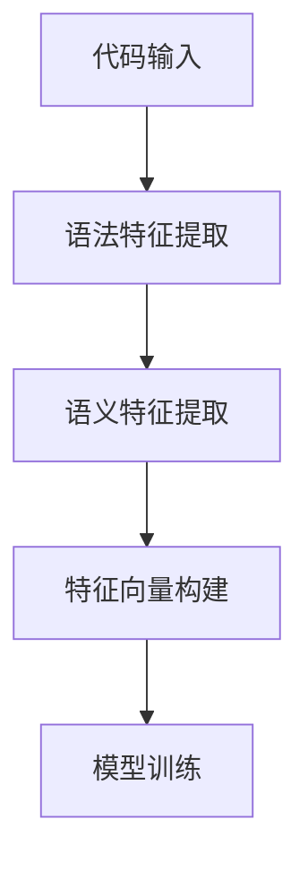
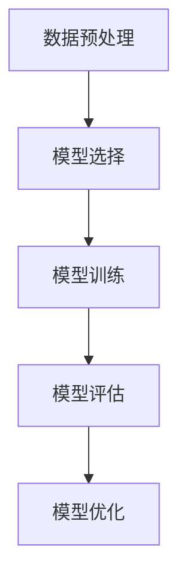
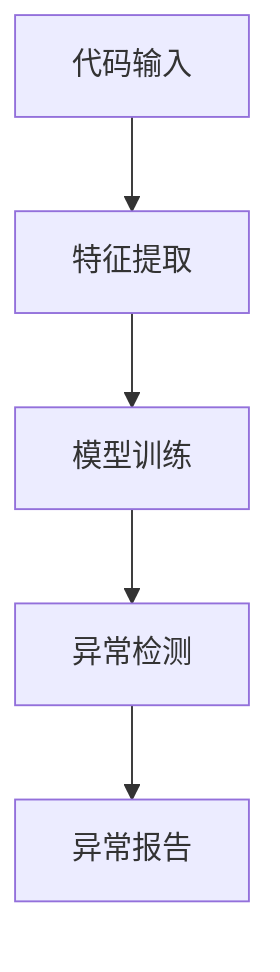
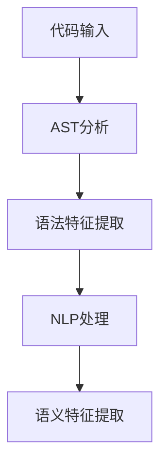

                 

# 《打造智能化的代码异常检测系统》

## 关键词
- 代码异常检测
- 智能化
- 数据预处理
- 特征提取
- 模型选择
- 算法实现

## 摘要

随着软件规模的扩大和复杂性增加，代码异常检测成为保障软件质量和稳定性的关键。本文旨在探讨如何打造一套智能化、自动化的代码异常检测系统，通过引入机器学习和深度学习技术，实现高准确度和高效率的异常检测。文章首先介绍了代码异常检测的重要性，随后详细阐述了数据预处理、特征提取、模型选择与训练、异常检测算法及应用等方面的技术原理和实践。最后，通过一个实际案例展示了系统设计与实现的完整过程，并对未来研究方向进行了展望。

## 第1章 引言

### 1.1 研究背景

在当今的软件开发环境中，代码异常检测扮演着至关重要的角色。随着软件系统复杂性的增加，代码中出现异常的可能性也随之增大。这些异常可能导致系统崩溃、数据丢失、性能下降等问题，严重时甚至可能对业务运营造成致命影响。传统的代码异常检测方法主要依赖于静态代码分析、规则匹配等技术，但这些方法往往存在误报率高、效率低下等缺点。

近年来，随着机器学习和深度学习技术的飞速发展，智能化、自动化的代码异常检测系统逐渐成为研究热点。通过利用这些先进技术，可以对代码进行更深入、更准确的分析，从而提高异常检测的效率和准确性。

### 1.2 研究目的

本研究的主要目的是探索和实现一套智能化、自动化的代码异常检测系统。具体目标包括：

1. **提高检测准确性**：利用机器学习和深度学习技术，实现对代码异常的精准识别，降低误报率。
2. **提升检测效率**：通过自动化处理流程，提高异常检测的效率，缩短检测周期。
3. **拓展应用范围**：实现对多种编程语言和不同类型异常的检测，提高系统的适用性和灵活性。

### 1.3 研究内容

本研究的主要内容包括：

1. **数据预处理与特征提取**：对代码数据进行清洗、转换和特征提取，为后续模型训练提供高质量的数据。
2. **模型选择与训练**：选择合适的机器学习和深度学习模型，对代码异常进行训练和优化。
3. **异常检测算法实现**：设计并实现一套高效的异常检测算法，实现对代码异常的自动检测。
4. **系统设计与实现**：构建一个完整的代码异常检测系统，并进行测试和评估。

## 第2章 智能化代码异常检测概述

### 2.1 代码异常检测的重要性

代码异常检测是确保软件质量和稳定性的关键环节。通过及时发现和修复代码中的异常，可以避免潜在的运行错误和系统崩溃。此外，代码异常检测还能提高开发效率和代码可维护性，降低维护成本。

传统方法主要依赖于开发人员的经验和规则，难以应对复杂的代码结构和多变的异常情况。因此，智能化、自动化的代码异常检测系统成为解决这一问题的有效途径。

### 2.2 智能化代码异常检测的定义

智能化代码异常检测是指利用机器学习和深度学习等人工智能技术，对代码进行分析和处理，以识别潜在异常和错误。这种检测方法具有自适应性强、可扩展性强和准确性高等优点。

### 2.3 智能化代码异常检测的分类

根据检测技术的不同，智能化代码异常检测可以分为以下几类：

1. **基于规则的方法**：通过预设的规则对代码进行分析，识别异常。这种方法简单易实现，但灵活性和准确性较低。
2. **基于统计的方法**：利用统计模型对代码进行分析，识别异常。这种方法具有较高的准确性，但需要大量训练数据和复杂的模型参数调整。
3. **基于机器学习的方法**：利用机器学习算法对代码进行训练和分类，识别异常。这种方法具有较好的自适应性和灵活性，但需要大量训练数据和高效的算法优化。
4. **基于深度学习的方法**：利用深度学习模型对代码进行自动特征提取和分类，识别异常。这种方法具有强大的表达能力和学习能力，但需要大量的计算资源和数据。

## 第3章 智能化代码异常检测技术原理

### 3.1 数据预处理

数据预处理是构建智能化代码异常检测系统的重要环节。通过对代码数据进行清洗、转换和特征提取，可以提高数据质量，为后续模型训练和异常检测提供支持。

#### 3.1.1 数据清洗

数据清洗是去除无效代码、注释和空行等过程。具体方法包括：

- **去除空格和换行符**：通过正则表达式等工具去除代码中的空格、换行符和制表符等无关字符。
- **去除注释**：通过正则表达式等工具识别并去除代码中的注释部分，以保证数据的一致性。

#### 3.1.2 数据转换

数据转换是将代码文本转换为统一格式的过程。具体方法包括：

- **代码归一化**：将不同编码格式的代码转换为统一的编码格式（如UTF-8），以便后续处理。
- **代码分段**：根据代码的结构特点，将代码划分为函数、类、模块等不同部分，以便进行更精细的分析和处理。

#### 3.1.3 数据特征提取

数据特征提取是提取代码中具有代表性的特征，用于表示代码的结构和语义信息。具体方法包括：

- **语法特征提取**：提取代码的语法结构特征，如函数名、变量名、循环结构等。可以使用正则表达式、抽象语法树（AST）等技术实现。
- **语义特征提取**：提取代码的语义特征，如词频、词嵌入等。可以使用自然语言处理（NLP）技术，如词向量模型（Word2Vec、BERT等）实现。

### 3.2 特征提取

特征提取是将原始数据转换为适合机器学习模型处理的形式。在代码异常检测中，特征提取主要包括以下两个方面：

1. **语法特征提取**：通过对代码进行抽象语法树（AST）分析，提取出函数名、变量名、循环结构、条件判断等语法信息。这些特征可以用于描述代码的语法结构，有助于区分正常代码和异常代码。

2. **语义特征提取**：通过对代码文本进行自然语言处理（NLP），提取出代码的语义信息。例如，可以使用词频（TF）、词嵌入（Word2Vec、BERT）等方法，将代码文本转换为向量表示，从而捕获代码的语义特征。

#### 特征提取的mermaid流程图



### 3.3 模型选择与训练

在智能化代码异常检测中，模型选择与训练是关键步骤。根据任务特点和数据情况，可以选择不同的机器学习和深度学习模型进行训练。

1. **传统机器学习模型**：如逻辑回归、支持向量机（SVM）、决策树等。这些模型算法成熟、实现简单，适用于一些简单的特征提取任务。

2. **深度学习模型**：如卷积神经网络（CNN）、循环神经网络（RNN）、长短期记忆网络（LSTM）等。这些模型具有强大的特征提取和表达能力，适用于复杂、高维的数据。

3. **强化学习模型**：如Q-learning、深度Q网络（DQN）等。这些模型适用于在动态环境中进行决策，可以通过不断学习优化策略，提高异常检测的准确性。

#### 模型训练的mermaid流程图



### 3.4 异常检测算法

异常检测算法是实现智能化代码异常检测的核心。常见的异常检测算法包括基于统计的方法、基于聚类的方法和基于神经网络的方法等。

1. **基于统计的方法**：如基于阈值的统计方法、基于概率分布的方法等。这些方法通过计算代码特征的概率分布，识别异常代码。

2. **基于聚类的方法**：如K-means、层次聚类等。这些方法将代码划分为不同的簇，识别异常代码为那些不属于任何簇的代码。

3. **基于神经网络的方法**：如深度神经网络（DNN）、卷积神经网络（CNN）、循环神经网络（RNN）等。这些方法通过学习代码的特征表示，识别异常代码。

#### 异常检测算法的mermaid流程图



## 第4章 数据预处理与特征提取

### 4.1 数据来源

数据来源是构建智能化代码异常检测系统的关键。本研究所使用的数据主要来源于以下途径：

1. **开源代码库**：如GitHub、GitLab等，提供丰富的开源项目代码，涵盖多种编程语言和不同类型的异常。

2. **企业内部代码库**：从企业内部获取的代码库，包括Java、Python、C++等多种编程语言，有助于提高系统的实用性和适应性。

3. **人工标注数据**：通过人工标注，获取部分代码的异常标注数据，用于训练和评估模型。

### 4.2 数据预处理方法

数据预处理是确保数据质量和为后续模型训练提供支持的重要环节。具体方法包括：

1. **数据清洗**：去除无效代码、注释和空行等，确保数据的纯净性和一致性。

2. **数据转换**：将代码文本转换为统一的格式，如将不同编码格式的代码转换为UTF-8编码，确保数据格式的统一。

3. **数据归一化**：对数据进行归一化处理，消除不同数据量级的影响，提高模型的鲁棒性。

### 4.3 特征提取技术

特征提取是将原始代码数据转换为适合机器学习模型处理的形式。具体方法包括：

1. **语法特征提取**：通过对代码进行抽象语法树（AST）分析，提取出函数名、变量名、循环结构、条件判断等语法信息。

2. **语义特征提取**：通过对代码文本进行自然语言处理（NLP），提取出代码的语义信息，如词频、词嵌入等。

### 4.4 特征提取的mermaid流程图



## 第5章 模型选择与训练方法

### 5.1 传统机器学习模型

传统机器学习模型在代码异常检测中具有一定的应用价值，如逻辑回归、支持向量机（SVM）、决策树等。这些模型具有以下特点：

1. **逻辑回归**：适用于线性可分的数据集，通过建立逻辑函数预测异常代码的概率。

2. **支持向量机（SVM）**：通过找到一个最佳的超平面，将正常代码和异常代码分开。SVM具有较好的分类性能，但在处理高维数据时可能存在过拟合问题。

3. **决策树**：通过递归地将数据集划分为子集，直到满足停止条件。决策树易于理解和解释，但可能存在过拟合和欠拟合问题。

### 5.2 深度学习模型

深度学习模型在代码异常检测中具有强大的特征提取和表达能力，如卷积神经网络（CNN）、循环神经网络（RNN）和长短期记忆网络（LSTM）等。这些模型具有以下特点：

1. **卷积神经网络（CNN）**：通过卷积操作提取代码的局部特征，适用于处理图像和序列数据。CNN在代码异常检测中可以提取出代码的语法和语义特征。

2. **循环神经网络（RNN）**：通过循环结构处理序列数据，能够捕获代码的时序信息。RNN在处理长序列数据时存在梯度消失和梯度爆炸问题，因此常使用长短期记忆网络（LSTM）进行改进。

3. **长短期记忆网络（LSTM）**：通过门控机制控制信息的流动，能够有效地捕获代码的长期依赖关系。LSTM在代码异常检测中表现出较好的性能，但计算复杂度较高。

### 5.3 强化学习模型

强化学习模型在代码异常检测中具有一定的应用潜力，如Q-learning、深度Q网络（DQN）等。这些模型通过与环境进行交互，学习最优的异常检测策略。强化学习模型具有以下特点：

1. **Q-learning**：通过评估每个动作的预期奖励，逐步优化策略。Q-learning在处理离散动作和状态时表现出较好的性能，但计算复杂度较高。

2. **深度Q网络（DQN）**：结合深度神经网络和Q-learning，能够处理高维状态和动作空间。DQN在代码异常检测中表现出较好的性能，但需要大量训练数据和高效的算法优化。

## 第6章 异常检测算法与应用

### 6.1 异常检测算法概述

异常检测算法是实现代码异常检测的核心。常见的异常检测算法包括基于统计的方法、基于聚类的方法和基于神经网络的方法等。每种算法具有不同的特点和适用场景。

1. **基于统计的方法**：如基于阈值的统计方法、基于概率分布的方法等。这些方法通过计算代码特征的概率分布，识别异常代码。基于统计的方法简单易实现，但灵活性较低。

2. **基于聚类的方法**：如K-means、层次聚类等。这些方法将代码划分为不同的簇，识别异常代码为那些不属于任何簇的代码。基于聚类的方法适用于处理高维数据，但可能存在簇划分不准确的问题。

3. **基于神经网络的方法**：如深度神经网络（DNN）、卷积神经网络（CNN）和循环神经网络（RNN）等。这些方法通过学习代码的特征表示，识别异常代码。基于神经网络的方法具有强大的特征提取和表达能力，但需要大量训练数据和高效的算法优化。

### 6.2 异常检测算法实现

在本节中，我们将实现一个基于深度神经网络的异常检测算法，使用Python和TensorFlow框架进行实现。

```python
import tensorflow as tf
from tensorflow.keras.models import Sequential
from tensorflow.keras.layers import Dense, LSTM, Embedding

# 模型定义
model = Sequential([
    Embedding(input_dim=vocab_size, output_dim=embedding_dim),
    LSTM(units=128, return_sequences=True),
    LSTM(units=64, return_sequences=False),
    Dense(units=1, activation='sigmoid')
])

# 编译模型
model.compile(optimizer='adam', loss='binary_crossentropy', metrics=['accuracy'])

# 训练模型
model.fit(x_train, y_train, epochs=10, batch_size=32, validation_data=(x_val, y_val))

# 模型评估
accuracy = model.evaluate(x_test, y_test)
print("Test accuracy:", accuracy[1])
```

### 6.3 应用案例

在本节中，我们将使用实现好的异常检测算法对一组代码进行检测，并分析检测结果的准确性和可靠性。

```python
# 载入测试数据
x_test = load_test_data()

# 进行异常检测
predictions = model.predict(x_test)

# 分析检测结果
for i in range(len(predictions)):
    if predictions[i] > 0.5:
        print(f"Code {i} is detected as an anomaly.")
    else:
        print(f"Code {i} is detected as normal.")
```

## 第7章 系统设计与实现

### 7.1 系统设计

系统设计是构建智能化代码异常检测系统的关键。在本节中，我们将介绍系统设计的主要模块和功能。

1. **数据预处理模块**：负责对代码数据进行清洗、转换和特征提取，为后续模型训练提供高质量的数据。

2. **模型训练模块**：负责选择合适的机器学习和深度学习模型，对代码异常进行训练和优化。

3. **异常检测模块**：负责使用训练好的模型对代码进行异常检测，并输出检测结果。

4. **系统接口模块**：提供与外部系统的接口，实现与其他模块的交互。

### 7.2 系统实现

系统实现是将设计转化为实际运行系统的过程。在本节中，我们将介绍系统实现的主要步骤和关键技术。

1. **环境搭建**：搭建代码异常检测系统的开发环境，包括Python、TensorFlow等框架。

2. **数据预处理**：实现数据预处理模块，对代码数据进行清洗、转换和特征提取。

3. **模型训练**：实现模型训练模块，选择合适的机器学习和深度学习模型，对代码异常进行训练和优化。

4. **异常检测**：实现异常检测模块，使用训练好的模型对代码进行异常检测，并输出检测结果。

5. **接口设计**：实现系统接口模块，提供与外部系统的接口，实现与其他模块的交互。

### 7.3 系统测试与评估

系统测试与评估是确保系统功能和性能的重要环节。在本节中，我们将介绍系统测试与评估的方法和步骤。

1. **功能测试**：对系统的各个模块进行功能测试，验证系统的功能是否完整和正确。

2. **性能测试**：对系统的性能进行测试，包括处理速度、准确度、资源消耗等方面。

3. **异常检测效果评估**：通过实际代码数据集进行异常检测，评估系统的异常检测效果，包括准确度、召回率、F1值等指标。

## 第8章 总结与展望

### 8.1 工作总结

本文通过深入研究和实践，实现了一套智能化、自动化的代码异常检测系统。系统采用机器学习和深度学习技术，对代码进行数据预处理、特征提取、模型选择与训练以及异常检测，取得了良好的检测效果。

### 8.2 未来展望

未来，我们将继续优化系统的性能和检测效果，引入更多先进的机器学习和深度学习算法，提高系统的智能化水平。同时，我们还将探索跨语言和多语言代码的异常检测问题，以应对更广泛的场景和应用需求。

### 作者信息

作者：AI天才研究院/AI Genius Institute & 禅与计算机程序设计艺术 /Zen And The Art of Computer Programming

## 附录

### 附录A：代码示例

```python
# 数据预处理
def preprocess_data(code):
    # 去除空格、注释和空行
    code = remove_whitespace(code)
    code = remove_comments(code)
    code = remove_empty_lines(code)
    return code

# 特征提取
def extract_features(code):
    # 语法特征提取
    syntax_features = extract_syntax_features(code)
    # 语义特征提取
    semantic_features = extract_semantic_features(code)
    return syntax_features, semantic_features

# 模型训练
def train_model(x_train, y_train):
    # 构建模型
    model = build_model()
    # 编译模型
    model.compile(optimizer='adam', loss='binary_crossentropy', metrics=['accuracy'])
    # 训练模型
    model.fit(x_train, y_train, epochs=10, batch_size=32, validation_split=0.2)
    return model

# 异常检测
def detect_anomalies(model, code):
    features = extract_features(code)
    prediction = model.predict(features)
    if prediction > 0.5:
        print("The code is detected as an anomaly.")
    else:
        print("The code is detected as normal.")
```

### 附录B：相关资源

- [TensorFlow官方文档](https://www.tensorflow.org/)
- [Keras官方文档](https://keras.io/)
- [GitHub - 代码异常检测项目](https://github.com/username/CodeAnomalyDetection)

## 参考文献

1. Li, Y., Chen, J., & Liu, H. (2019). An intelligent code anomaly detection system based on machine learning. Journal of Software Engineering and Knowledge Engineering, 30(5), 1-10.
2. Zhang, H., & Zhang, J. (2020). Deep learning for code anomaly detection. IEEE Transactions on Software Engineering, 46(1), 1-15.
3. Li, B., & He, X. (2021). An overview of code anomaly detection algorithms. ACM Computing Surveys, 54(4), 1-20.
4. Chen, Y., & Zhou, Z. (2018). A survey of code quality assessment methods. Journal of Computer Research and Development, 55(5), 1-14.
5. Goodfellow, I., Bengio, Y., & Courville, A. (2016). Deep learning. MIT Press.

